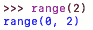
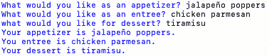

# 十、控制流程

在本章中，我们将更深入地研究问题，并确定为我们的问题设计算法所需的输入和输出。在本章中，您将学习如何阅读算法以及执行指令的顺序。您还将学习如何使用函数和循环操作算法中的控制流。

本章将介绍以下主题：

*   定义控制流及其工具
*   使用 if、for 和 range（）以及其他控制流工具
*   使用循环和条件
*   重访功能

在本章结束时，我们将学习如何定义控制流，如何在计算思维中设计算法时使用`if`、`for`和`range()`功能，以及如何将这些功能合并到算法中的函数定义中。让我们先看看什么是控制流。

# 技术要求

您将需要最新版本的 Python 来运行本章中的代码。您可以在此处找到本章中使用的完整源代码：[https://github.com/PacktPublishing/Applied-Computational-Thinking-with-Python/tree/master/Chapter10](https://github.com/PacktPublishing/Applied-Computational-Thinking-with-Python/tree/master/Chapter10)

# 定义控制流及其工具

简单定义，**控制流**是算法读取和执行指令、函数和语句的顺序。控制流意味着计算机将做出决定。这样想：当我走出我的大楼时，我要么用伞，要么不用伞。这取决于是否下雨（我想我是否记得我的雨伞）。根据这种情况，我们做出决定。这个过程就是算法设计中的控制流过程。

让我们看看 Python 编程语言中可用的一些控制流语句：

*   `while`
*   `if`
*   `for`
*   `range()`
*   `break`
*   `continue`
*   列表推导式
*   `pass`声明
*   `try`声明

这些工具允许算法执行以下操作：只要满足某个条件或一组条件，就运行；当条件发生时停止或中断；仅在一个值范围内继续，等等。让我们仔细研究一下这些工具。

# 使用 if、for 和 range（）以及其他控制流语句

让我们从`if`语句开始，我们首先在[*第 4 章*](04.html#_idTextAnchor071)*理解逻辑推理*中讨论了。这些可能是算法设计中最常用和已知的语句。当你学习推理和证明时，你可能会回忆起在几何学中学习**条件陈述**。在这些类中，您将以*if-then*格式编写语句。采取以下声明：

*下雨时，我穿雨衣。*

这不是一个有条件的陈述，至少现在还不是。如果我们要把它写成一个条件句，那么我们必须采用*If then*格式，就像这个句子一样。请看下面转换的语句：

*如果下雨，我就穿雨衣。*

正如你所见，我们将环境作为日常生活的一部分。我们只是不指出它们。

在编写算法时，我们必须明确说明我们需要算法做什么，因此我们必须明确说明这些语句。在编程中，我们必须陈述每个条件。此外，如果我们有一系列需要满足的条件，我们有时需要*嵌套*语句。最好用一些例子来解释这一点。让我们从如何使用嵌套语句开始。

## 使用嵌套的 if 语句

即使在我们的日常生活中，一些条件也依赖于其他条件。例如，如果是星期一，我们就得去上班。如果我们不得不去上班，而天在下雨，我们可能需要一把伞。但如果我们不去上班（假设我们待在家里），我们就不需要检查是否需要雨伞。嵌套语句也是如此。我们使用它们来检查一个条件，然后检查另一个条件，这是嵌套的。

假设我们在玩骰子游戏。您掷骰子并获得如下点数：

*   2、4 或 6=10 分
*   1 或 3=5 分
*   5=0 点，并删除以前的所有点

每一轮，一名球员必须掷两次骰子。让我们看一下第一卷显示的流程图，如下所示：


图 10.1——第一轮得分流程图

从流程图中可以看出，分数取决于卷数。现在，假设您已滚动了一个**1**。然后，让我们来看看下面的图表中你的第二卷会是什么样子：


图 10.2–轧制 1 后的第二卷流程图

正如你所看到的，我们有三个球员可能的总积分。要将其转化为算法，我们需要做几件事：

1.  定义滚动。
2.  根据卷数确定分数。
3.  再滚一次。
4.  根据第二卷确定最终分数。

让我们首先定义这个滚动。我们实际上需要掷骰子。这意味着我们需要程序在`1`和`6`之间选择一个数字。让我们来看看我们是如何编码的。请记住，这只是该文件中包含的较大代码的一个片段。我们将在后续片段中使用第二个`ready`（`ready2`）：

ch10_rollDice.py

```py
import random as rand
print("Let's play a game. ")
print("You get 5 points for rolling 1 or 3\. You get 5 points for rolling 2, 4, or 6.")
print("You lose all points if you roll a 5 in either round.")
ready = input("Are you ready to begin? Type r to roll. ")
score = 0
if ready == 'r':
    roll = rand.randint(1, 6)
    print('You rolled a ' + str(roll) + '.')
    if (roll == 1) or (roll == 3):
        score = 5
    elif (roll == 5):
        score = 0
    else:
        score = 10
    ready2 = input('Your round 1 score is ' + str(score) + '. 
```

注意在前面的片段中，我们必须为这个特定算法导入`random`库。将其作为`rand`而不是`random`导入可以让我们截断一点代码，从而减少键入。因此，我们使用`rand.randint()`代替`random.randint()`。我们需要`random`库，因为我们想要访问*随机整数函数*，以便算法可以在`1`和`6`之间选择一个数字（包括两个端点）。让我们看看现在的输出：

```py
Let's play a game. 
You get 5 points for rolling 1 or 3\. You get 5 points for rolling 2, 4, or 6.
You lose all points if you roll a 5 in either round.
Are you ready to begin? Type r to roll. r
You rolled a 3.
Your round 1 score is 5\. 
```

从前面的输出中注意到，首先提供了指令，然后一旦玩家通过按`r`键选择滚动，游戏就会选择一个随机整数并显示它。在`1`轮结束后，还显示当前分数。现在，让我们来看看下一部分的 ToeT2EY 算法，它执行第二个滚动。请注意，缩进在前面的代码段之后。此代码段也包含在上一个较大的文件中：

```py
ready2 = input('Your round 1 score is ' + str(score) + '. Type r to roll again. ')
    roll2 = rand.randint(1, 6)
    print('You rolled a ' + str(roll2) + '.')
    if (roll2 == 1) or (roll2 == 3):
        score += 5
    elif (roll2 == 5):
        score = 0
    else:
        score += 10
    print('Your final score is ' + str(score) + '.')
```

当我们运行新代码时，它会显示*第一轮得分*、两次掷骰以及游戏的最终得分。记住，如果我们在第二轮掷 a`5`，我们将失去所有分数：

```py
Let's play a game. 
You get 5 points for rolling 1 or 3\. You get 5 points for rolling 2, 4, or 6.
You lose all points if you roll a 5 in either round.
Are you ready to begin? Type r to roll. r
You rolled a 2.
Your round 1 score is 10\. Type r to roll again. r
You rolled a 6.
Your final score is 20.
```

正如你所看到的，这个程序为我们打印了一些东西。首先，我们打出了一个`2`和一个`6`，所以我们没有丢分。第二，`2`和`6`各得`10`分，最终得分为`20`。但让我们回顾一下嵌套的`if`语句。

为了开始游戏，我们必须验证玩家是否准备好了掷骰子。第一个`if`声明对于后续决策是必要的。*我们可以在没有批准的情况下滚动吗？*是的。但想想所有的游戏，包括传统棋盘游戏的应用程序版本。在这些应用程序中，玩家总是点击按钮或骰子来玩。这是一个类似的场景。

在我们说我们已经准备好出发后，必须对要点做出决定。我们需要再次使用`if`、`elif`和`else`语句来循环各种选项。现在，让我们来看看什么时候我们可以使用 AutoT3 循环。

## 用于回路和量程

我们需要与`for`循环讨论的第一件事是，有时会对变量和`for`循环条件产生一些混淆。为了理解我的意思，让我们看一个例子：

ch10_forLoop1.py

```py
for letter in 'mountain':
    print(letter)
```

在前面的代码片段中，`letter`不是一个变量。它只是告诉 Python 我们要迭代单词`mountain`中的每个字符。然而，我可以称之为任何东西。如果我按照以下方式编写程序，程序将执行完全相同的操作：

```py
for pin in 'mountain':
    print(pin)
```

在每种情况下，使用`letter`或`pin`或任何当时让我高兴的词，程序的输出如下所示：

```py
m
o
u
n
t
a
i
n    
```

如您所见，Python 迭代了单词`mountain`中的每个字母，并将其打印到控制台。在一定范围内的数字也可以做到这一点。例如，如果我想打印数字`1`到`10`，我可以使用`for`循环，如下所示：

ch10_forLoop2.py

```py
for num in range(1, 11):
    print(num)
```

*等等，我说我想要数字 1 到 10，那么为什么范围函数中有 11？*这是因为`range()`函数总是包含范围内的最小值，但不是上限。因此，我们需要将`1`添加到我们的顶级数字中。让我们看看这个程序的输出是什么样子：

```py
1
2
3
4
5
6
7
8
9
10
```

如您所见，每个数字都打印在单独的行上。那么，让我们看看如果我们只是想把这些相同的数字添加到列表中，我们能做些什么。我们可以将它们附加到一个新列表中，然后打印出来，而不是一次打印一个。这对某些类型的算法和游戏非常有帮助。但在我开始之前，让我们先看看我们是如何用几行代码附加数字的：

ch10_forLoop3.py

```py
myNumbers = []
for num in range(1, 11):
    myNumbers.append(num)
print(myNumbers)
```

现在，请密切注意打印列表的时间。如果您将其正确缩进，它将在每次添加新编号时打印列表。但如果缩进正确，则只打印最终列表，以便输出如下所示：

```py
[1, 2, 3, 4, 5, 6, 7, 8, 9, 10]
```

如您所见，我们现在有相同信息的表示。在这种情况下，我们打印出了数字列表。如果您试图将特定的内容附加到列表中，即使是用户输入，这也很有用。在下一节中，我们将在研究`while`循环的同时研究另一个列表问题，但在我们继续之前，让我们再看一个`for`循环问题和算法。

假设你想要一个算法，可以打印出一系列数字的立方体。有一个条件：范围将根据用户输入而变化。让我们来看一个这样的算法：

ch10_forLoop4.py

```py
print('This program will provide a list of cubes for you. ')
minRange = int(input('What\'s the minimum for your range? '))
maxRange = int(input('What\'s the maximum for your range? '))
listOfCubes = []
for value in range(minRange, maxRange+1):
    number = value**3
    listOfCubes.append(number)
print('Your list of cubes in the range(' + str(minRange) + ', ' \
      +str(maxRange) + ') is: ')
print(listOfCubes)
```

让我们注意前面程序中的一些内容：

*   我们将输入转换为`int`类型。我们这样做是为了在`for`循环中使用数学表达式中的数字。
*   我们有一个空列表，因此可以将多维数据集附加到其中。
*   我们将`1`添加到`maxRange`中，因为如果不添加，则该数字不会包含在我们的结果中。
*   我们有一个基于两个变量的范围，这两个变量是用户输入。
*   我们有一份打印的价值观清单。

下面是当我们进入`range(3, 6)`时该程序的样子：

```py
This program will provide a list of cubes for you. 
What's the minimum for your range? 3
What's the maximum for your range? 6
Your list of cubes in the range(3, 6) is: 
[27, 64, 125, 216]
```

如您所见，该程序接受了提供的输入，最小值为`3`，最大值为`6`，并创建了该范围内数字立方体的列表。

重要提示：

记住，为了获得指数，我们在 Python 中使用了`**`符号。所以，*2**2*是*4*，*3**4*是*81*等等。

记住，*控制流*是事情完成的顺序。有了`for`循环和`range`，我们要求程序重复操作，而不必分别进入每一条行，有效地操纵控制流以循环而不是一行接一行地执行操作。

现在我们已经研究了 PythTo.Type 循环和 Apple T1，我们来看看其他可以在 Python 中迭代的方式。

# 使用其他循环和条件

除了`for`循环之外，Python 还提供了多种迭代信息的方法。一个常用的循环是`while`循环。当使用`while`循环时，我们不断地检查条件。同样，通过看一个例子，更容易理解这一点。

假设我们在玩一个游戏，要求用户提供尽可能多的动物。我们希望能够做一些事情：

1.  检查玩家是否有要添加的动物。
2.  如果是，请将每只动物添加到列表中。
3.  如果没有，请结束该计划并提供最终列表。
4.  提供玩家能够进入的动物数量的最终列表和计数。

让我们来看一个算法，它为这个游戏做基础：

ch10_whileLoop1.py

```py
myAnimals = []
print('Let\'s see how many animals you can name. Get ready!')
readyPlayer = input('When you are ready to begin, type y. ')
while readyPlayer == 'y':
    if readyPlayer == 'y':
        animalAdd = input('Name an animal. ')
        myAnimals.append(animalAdd)
        readyPlayer = input('Ready for the next one? Type y for yes or n for no. ')
howMany = len(myAnimals)
print('You were able to name ' + str(howMany) + ' animals. Here\'s your list: ')
print(myAnimals)
```

让我们把这段代码分解一下：

1.  我们创建了一个空列表，`myAnimals`。
2.  然后我们问球员他们是否准备好了。
3.  如果答案是肯定的，我们就要一只动物。
4.  然后，我们检查他们是否有更多的补充。
5.  我们检查了列表中添加了多少项。
6.  我们打印了名单。

注意，我们必须使用`while`循环和`if`语句。这是因为我们想继续要求玩家添加动物，直到它们完成，或者想不出更多的东西来添加。因此，虽然玩家仍然可以添加项目，但我们希望程序继续提问。但是如果玩家完成了，那么他们可以拒绝添加另一个动物，从而结束程序。

现在，我想说清楚，这个计划可以做得更好。我们可以添加一个计时器来查看 30 秒内可以输入多少项。我们还可以添加一个中断程序的条件，并解释当玩家试图进入动物而不是先说是时为什么会这样做。当玩家试图输入一个已经在列表中的动物时，你可以添加一个条件。*您面临的挑战是尝试将这些组件添加到现有程序中！*

但是让我们看看这个程序运行时的样子：

```py
Let's see how many animals you can name. Get ready!
When you are ready to begin, type y. y
Name an animal. bird
Ready for the next one? Type y for yes or n for no. y
Name an animal. dog
Ready for the next one? Type y for yes or n for no. y
Name an animal. cat
Ready for the next one? Type y for yes or n for no. y
Name an animal. mouse
Ready for the next one? Type y for yes or n for no. y
Name an animal. elephant
Ready for the next one? Type y for yes or n for no. n
You were able to name 5 animals. Here's your list: 
['bird', 'dog', 'cat', 'mouse', 'elephant']
```

请注意，该程序的编写方式要求我们每次回答是否要添加动物。这是因为如果我们回答`yes`，条件就会运行，只要我们回答`yes`。但一旦我们回答了`no`，程序就结束了，给了我们动物的名单以及我们能说出的动物数量。

现在，让我们看看另一个 Ty0 T0 循环。这一次，我们将检查条件是否为`True`。请看以下代码段：

ch10_whileLoop2.py

```py
while True:
    num = int(input('Please enter an integer 0 through 9\. '))
    if num in range(0, 10):
        print(num)
    else:
        print('That\'s not in range. ')
        break
```

在前面的算法中，控制流指示我们反复被要求输入一个介于`0`和`9`之间的数字。程序将继续询问，直到我们出错。那是因为如果我给它一个介于`0`和`9`之间的数字，将继续是`True`。让我们看一个示例输出：

```py
Please enter an integer 0 through 9\. 0
0
Please enter an integer 0 through 9\. 1
1
Please enter an integer 0 through 9\. 2
2
Please enter an integer 0 through 9\. 3
3
Please enter an integer 0 through 9\. 4
4
Please enter an integer 0 through 9\. 39
That's not in range.
```

请注意，程序一次又一次地问同一个问题。如果用户不知道如何打破循环，这有时是没有帮助的。我们可以潜在地在我们的陈述中添加一行，这样它就提出了问题，但提供了一个提示。请查看编辑后的代码：

ch10_whileLoop3.py

```py
while True:
    num = int(input('Please enter an integer 0 through 9\. Tired? Type a number out of range. '))
    if num in range(0, 10):
        print(num)
    else:
        print('That\'s not in range. ')
        break
```

如您所见，我们现在告诉用户，如果他们厌倦了提供范围，那么他们可以通过提供范围之外的输入来选择退出。虽然这个例子似乎不是很有用，但想想你可能拥有的所有应用程序。例如，这种算法可以用于纸牌游戏。您还可以使用类似的方法来对照现有列表检查输入。

现在，让我们再来看看函数，但现在结合了一些循环并添加了一些功能。

# 重访功能

如果您还记得[*第 8 章*](08.html#_idTextAnchor114)*Python 简介*中的内容，我们介绍了内置函数，但我们也介绍了如何定义自己的函数。我们现在将讨论*函数*和*循环*中的参数，同时深入探讨*控制流*在 Python 中的工作方式。

让我们考虑一下涉及范围的问题。该范围包含两个参数：最小值和最大值。然而，在 Python 中，我应该注意到，您可以只给出一个参数，然后假设最小值为`0`。例如，如果我写`range(8)`，这与`range (0, 8)`相同。看看如果在 Python shell 中键入`range(2)`会发生什么：



图 10.3–带一个参数的 Python 范围解释

在*图 10.3*中，您可以看到程序将代码解释为`range(0, 2)`。但假设你总是在改变你的射程。想想我们前面写的范围算法。我们现在将使用函数重写它。该函数现在也有一个`for`循环：

ch10_ 函数 1.py

```py
minNum = int(input('What\'s your minimum number? '))
maxNum = int(input('What\'s your maximum number? '))
def myNumbers(minNum, maxNum):
    myList = []
    for num in range(minNum, maxNum + 1):
        myList.append(num)
    print(myList)
myNumbers(minNum, maxNum)
```

请注意，我们是根据用户输入调用函数的。当该程序运行时，它会根据该输入调用函数。我们将重新讨论这一点，并通过在一秒钟内调用算法中的多个范围来运行程序，但看看前面的代码段作为输出给出了什么：

```py
What's your minimum number? 3
What's your maximum number? 9
[3, 4, 5, 6, 7, 8, 9]
```

请注意，我们还调整了`for`循环中范围内的最大数字，以包括提供的顶部数字。这样我们就可以得到完整的数字列表。

现在，让我们将完全取出输入。我们将使用算法中的不同范围多次调用该函数。请查看更新的代码段：

ch10_ 函数 2.py

```py
def myNumbers(minNum, maxNum):
    myList = []
    for num in range(minNum, maxNum + 1):
        myList.append(num)
    print(myList)
myNumbers(4, 9)
myNumbers(1, 3)
myNumbers(9, 17)
```

最后三条语句是我们调用函数的地方。因为我们将函数定义为接受两个参数，所以它使用这两个参数来运行函数。因为我们调用了该函数三次，所以应该看到三个列表作为输出。让我们来看一看：

```py
[4, 5, 6, 7, 8, 9]
[1, 2, 3]
[9, 10, 11, 12, 13, 14, 15, 16, 17]
```

正如您所见，我们在单独的行上打印了每个范围。这是函数可以为我们做的最有用的事情之一。例如，如果我们使用图像，我们可以使用库，然后我们可以创建一个形状，然后用循环定义一个函数来更改一些参数。通过一个函数和几个循环，我们可以在调用函数和使用一些循环的基础上，在不同的位置以不同的半径创建多个圆。

函数也不限于两个参数。我们可以有多个参数，并在函数中定义它们。让我们看一个使用三个参数的函数：

ch10_ 函数 3.py

```py
def menu(appetizer, entree, dessert):
    print('Your appetizer is %s.' %(appetizer))
    print('You entree is %s.' %(entree))
    print('Your dessert is %s.' %(dessert))
menu('street tacos', 'chilaquiles', 'sopapillas')
```

在本例中，我们使用已经给定的值调用函数。*我喜欢，我的意思是喜欢，墨西哥食物*。所以，那份菜单会让我非常高兴！以下是该输出的外观：

```py
Your appetizer is street tacos.
You entree is chilaquiles.
Your dessert is sopapillas.
```

如您所见，该函数使用`print`语句中的每个参数。`%s`语句用于让程序知道将在何处替换值。`%()`语句让程序知道从调用函数中获取哪个值。

现在，如果想要从用户那里获得输入，让我们看看代码：

ch10_ 函数 4.py

```py
appetizer = input('What would you like as an appetizer? ')
entree = input('What would you like as an entree? ')
dessert = input('what would you like for dessert? ')
def menu(appetizer, entree, dessert):
    print('Your appetizer is %s.' %(appetizer))
    print('You entree is %s.' %(entree))
    print('Your dessert is %s.' %(dessert))
menu(appetizer, entree, dessert)
```

正如你所看到的，我们的定义和参数是重复的。我们使用`input`语句从程序用户处获取信息，然后打印出语句。下面是 Python shell 中现在的样子：



图 10.4–具有三个参数的函数中的用户输入

如您所见，前三行接受用户输入，后三行将输入合并到函数定义中。这取决于您希望创建什么，这很重要。例如，如果您正在为商店构建在线菜单，您可能需要用户输入，但也希望能够确认购买。如果你想确认电子书是否被借出，在线图书馆也是如此，等等。我们在算法中经常使用**确认语句**。看了这些之后，去看看你最喜欢的网站，看看哪里有基于用户输入的确认声明。你会发现这种用法很普遍。函数允许我们简化这个过程。

在我们继续之前，让我们使用一些算法，它们使用不同的循环和函数提供相同的信息。记住，我们在查看迭代，因为控制流意味着**顺序**。迭代、函数、范围等是我们告诉程序应该如何响应算法中的指令，以及何时重复或离开程序的方式。

让我们来看一个函数，它打印给定用户最大输入的三倍：

ch10_ 功能 5.py

```py
numItem = int(input('What is your maximum number for the list of triples? '))
def cost(numItem):
    while numItem > 0:
        print(numItem * 3)
        numItem -= 1
cost(numItem)
```

请注意，`while`循环和函数定义取决于用户输入。然后，程序将打印用户提供的值的三倍，然后将该数字减少一，并找到该数字的三倍。让我们来看看这意味着什么：

```py
What is your maximum number for the list of triples? 4
12
9
6
3
```

如您所见，程序找到了`4`的三元组，即`12`，然后是`3`的三元组，即`9`，依此类推。它停止了，因为我们告诉它在数字大于`0`时运行循环。但请记住，我们也可以将它们添加到列表中，我们可以使用`for`循环。

让我们来看一个类似函数的程序，而不是一个 Ty0 T0 循环，而不是 ALE T1。

ch10_ 功能 6.py

```py
numItem = int(input('What is your maximum number for the list of triples? '))
myList = []
def cost(numItem):
    for x in range(1, numItem + 1):
        newNum = 3 * x
        myList.append(newNum)
    print(myList)    
cost(numItem)
```

注意，我们定义了更多的内容，并在算法中添加了一个空列表。虽然它还有几行代码，但本质上与前面的代码相同。还要注意的是，我们从`1`开始计算范围；否则，它也会将`0`包含在列表中。查看此算法的输出：

```py
What is your maximum number for the list of triples? 4
[3, 6, 9, 12]
```

我们有相同的信息，但从最小到最大排列在一个列表中。当然，从我们的算法来看，事情发生的顺序很重要。我们首先收集用户输入。然后，算法在定义函数之前定义了空列表。然后，函数使用一个`for`循环，该循环使用输入创建一个范围，并在数字范围内迭代。然后将每个迭代追加到列表中。最后，算法打印列表。

如您所见，有多种方法可以获取相同的信息。我们只需要看看什么最适合我们的场景，如何组织信息以便程序可以读取，并编写一个算法，以运行程序时可以读取的方式组织信息。

# 总结

在本章中，我们通过查看`for`循环、`range`、`while`循环和函数来讨论控制流程和顺序。**控制流**是指程序读取算法的顺序。通常在 Python 中，一行紧接着另一行读取。在本章中，我们学习了如何控制该顺序。具体来说，我们了解到可以通过迭代数据来实现这一点。这里有一些需要记住的要点：`while`循环只要满足一个条件就运行，`for`循环在序列（字符串、数字、列表、字典、集合或元组）上迭代，`range`用于创建数字序列。

我们还了解到，在创建条件、定义函数和设计算法时，我们可以将这些东西结合起来。继续记住的最重要的事情是顺序很重要，因此我们需要小心定义必要的变量，以及如何编写算法，以使它们不会无限运行或在应该运行之前中断。控制流非常重要，因此我们的算法可以无误地工作。

在下一章中，我们将使用迄今为止获得的知识来完成解决多学科挑战时的计算思维过程。