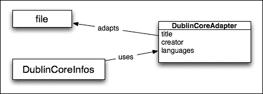

# 十四、有用的设计模式

设计模式是软件设计中常见问题的可重用的、某种程度上特定于语言的解决方案。关于这一主题最受欢迎的书是由 Gamma、Helm、Johnson 和 Vlissides 撰写的*设计模式：可重用面向对象软件的元素*、*Addison-Wesley Professional*，也称为*四人帮*或*GoF*。它被认为是这一领域的一个重要的写作工具，它提供了 23 种设计模式的目录，并在 Simultalk 和 C++中给出了示例。

在设计应用程序代码时，这些模式有助于解决常见问题。它们为所有开发人员敲响了警钟，因为它们描述了经过验证的开发范例。但是，应该考虑使用的语言来研究它们，因为它们中的一些在某些语言中没有意义，或者已经内置。

本章介绍 Python 中最有用的模式，或者讨论有趣的模式，以及实现示例。以下是与 GoF 定义的设计模式类别相对应的三个部分：

*   **创造模式**：这些模式用于生成具有特定行为的对象
*   **结构模式**：这些模式有助于构建特定用例的代码
*   **行为模式**：这些模式有助于分配责任和封装行为

# 创作模式

创建模式处理对象实例化机制。这样的模式可以定义如何创建对象实例，甚至如何构造类。

这些是编译语言（如 C 或 C++）中非常重要的模式，因为在运行时按需生成类型更困难。

但在 Python 中，在运行时创建新类型非常简单。内置的`type`功能可以通过代码定义一个新的类型对象：

```py
>>> MyType = type('MyType', (object,), {'a': 1})
>>> ob = MyType()
>>> type(ob)
<class '__main__.MyType'>
>>> ob.a
1
>>> isinstance(ob, object)
True

```

类和类型是内置工厂。我们已经处理了新类对象的创建，您可以使用元类与类和对象生成交互。这些特性是实现**工厂**设计模式的基础，但我们不会在本节中进一步描述，因为我们在[第 3 章](03.html "Chapter 3. Syntax Best Practices – above the Class Level")*语法最佳实践*中广泛讨论了类和对象创建的主题。

除了工厂之外，GoF 中唯一一个有趣的用 Python 描述的创造性设计模式是 singleton。

## 独生子女

**Singleton**将类的实例化限制为只实例化一个对象实例。

singleton 模式确保给定类在应用程序中始终只有一个活动实例。例如，当您希望将资源访问限制为进程中的一个且仅一个内存上下文时，可以使用此选项。例如，数据库连接器类可以是处理同步并在内存中管理其数据的单例。它假设在此期间没有其他实例与数据库交互。

这种模式可以大大简化应用程序中处理并发的方式。提供应用程序范围函数的实用程序通常声明为单例。例如，在 web 应用程序中，负责保留唯一文档 ID 的类将受益于单例模式。应该有一个而且只有一个实用程序来做这项工作。

有一种流行的半习惯用法是通过重写类的`__new__()`方法在 Python 中创建单例：

```py
class Singleton:
    _instance = None

    def __new__(cls, *args, **kwargs):
        if cls._instance is None:
            cls._instance = super().__new__(cls, *args, **kwargs)

        return cls._instance
```

如果尝试创建该类的多个实例并比较它们的 ID，您会发现它们都表示相同的对象：

```py
>>> instance_a = Singleton()
>>> instance_b = Singleton()
>>> id(instance_a) == id(instance_b)
True
>>> instance_a == instance_b
True

```

我称之为半习语，因为这是一种非常危险的模式。如果您已经创建了基类的实例，那么当您尝试对基类单例类进行子类化并创建此新子类的实例时，问题就会出现：

```py
>>> class ConcreteClass(Singleton): pass
>>> Singleton()
<Singleton object at 0x000000000306B470>
>>> ConcreteClass()
<Singleton object at 0x000000000306B470>

```

当您注意到此行为受实例创建顺序的影响时，问题可能会更加严重。根据您的类使用顺序，您可能会也可能不会得到相同的结果。让我们看看，如果先创建子类实例，然后创建基类实例，结果会是什么：

```py
>>> class ConcreteClass(Singleton): pass
>>> ConcreteClass()
<ConcreteClass object at 0x00000000030615F8>
>>> Singleton()
<Singleton object at 0x000000000304BCF8>

```

正如你所看到的，这种行为是完全不同的，很难预测。在大型应用程序中，它可能会导致非常危险和难以调试的问题。根据运行时上下文的不同，您可以使用也可以不使用要使用的类。因为这种行为很难预测和控制，所以应用程序可能会因为更改导入顺序甚至用户输入而中断。如果您的单例不打算被子类化，那么以这种方式实现可能相对安全。不管怎样，这是一个定时炸弹。如果有人忽视了将来的风险，决定从单例对象创建一个子类，那么一切都可能崩溃。更安全的做法是避免使用这种特定的实现，并使用另一种实现。

使用更高级的技术元类要安全得多。通过重写元类的`__call__()`方法，可以影响自定义类的创建。这允许创建可重用的单例代码：

```py
class Singleton(type):
    _instances = {}

    def __call__(cls, *args, **kwargs):
        if cls not in cls._instances:
            cls._instances[cls] = super().__call__(*args, **kwargs)
        return cls._instances[cls]
```

通过将此`Singleton`用作自定义类的元类，您可以获得对子类安全且独立于实例创建顺序的单例：

```py
>>> ConcreteClass() == ConcreteClass()
True
>>> ConcreteSubclass() == ConcreteSubclass()
True
>>> ConcreteClass()
<ConcreteClass object at 0x000000000307AF98>
>>> ConcreteSubclass()
<ConcreteSubclass object at 0x000000000307A3C8>

```

克服琐碎的单例实现问题的另一种方法是使用 Alex Martelli 提出的方法。他在行为上与单身汉相似，但在结构上完全不同。这不是 GoF 书中的经典设计模式，但在 Python 开发人员中似乎很常见。它被称为**博格**或**单态**。

这个想法很简单。在单例模式中真正重要的不是一个类拥有的活实例的数量，而是它们在任何时候都共享相同的状态。因此，Alex Martelli 提出了一个类，使该类的所有实例共享相同的`__dict__`：

```py
class Borg(object):
    _state = {}

    def __new__(cls, *args, **kwargs):
        ob = super().__new__(cls, *args, **kwargs)
        ob.__dict__ = cls._state
        return ob
```

这解决了子类问题，但仍然取决于子类代码的工作方式。例如，如果`__getattr__`被覆盖，则该模式可能被破坏。

然而，单身人士不应该有几个层次的继承。标记为单例的类已经是特定的。

也就是说，许多开发人员认为这种模式是处理应用程序中唯一性的一种沉重方式。如果需要单例，为什么不使用带函数的模块，因为 Python 模块已经是单例的了？最常见的模式是将模块级变量定义为需要是单例的类的实例。这样，您也不会将开发人员限制在初始设计中。

### 注

singleton 工厂是一种处理应用程序唯一性的*隐式*方法。没有它你可以活下去。除非您在需要这种模式的 Java 框架中工作，否则请使用模块而不是类。

# 结构模式

结构模式在大型应用中非常重要。他们决定代码的组织方式，并为开发人员提供如何与应用程序的每个部分交互的方法。

长期以来，Python 世界中许多结构模式的最著名实现为 Zope 项目提供了**Zope 组件架构**（**ZCA**）。它实现了本节中描述的大多数模式，并提供了一组丰富的工具来使用它们。ZCA 不仅要在 Zope 框架中运行，还要在 Twisted 等其他框架中运行。它提供了接口和适配器的实现。

不幸的是（或不是），Zope 失去了几乎所有的动力，不再像过去那样受欢迎。但是它的 ZCA 对于在 Python 中实现结构模式仍然是一个很好的参考。Baiju Muthukadan 创建了*Zope 组件架构综合指南*。印刷版和在线免费提供（参考[http://muthukadan.net/docs/zca.html](http://muthukadan.net/docs/zca.html) ）。它是在 2009 年编写的，因此它没有涵盖 Python 的最新版本，但仍然应该是一本很好的读物，因为它为所提到的一些模式提供了很多基本原理。

Python 已经通过其语法提供了一些流行的结构模式。例如，类和函数修饰符可以看作是**修饰符模式**的一种风格。此外，对创建和导入模块的支持是**模块模式**的一个衍生。

常见结构模式的列表实际上相当长。最初的*设计模式*一书中有多达七种模式，该列表后来被其他文献扩展。我们不会讨论所有这些问题，但只关注三个最受欢迎和认可的问题，即：

*   适配器
*   代理
*   外观

## 适配器

**适配器**模式允许从另一个接口使用现有类的接口。换句话说，适配器将类或对象*a*包装起来，使其在用于类或对象*B*的上下文中工作。

在 Python 中创建适配器实际上非常简单，因为在这种语言中键入是如何工作的。Python 中的类型哲学通常被称为 duck 类型：

> *“如果它走路像鸭子，说话像鸭子，那它就是鸭子！”*

根据这条规则，如果函数或方法的值被接受，则决策不应基于其类型，而应基于其接口。因此，只要对象的行为符合预期，即具有适当的方法签名和属性，它的类型就被认为是兼容的。这与许多静态类型语言完全不同，在这些语言中很少有这样的东西。

实际上，当某些代码打算与给定的类一起工作时，只要它们提供代码所使用的方法和属性，就可以向它提供来自另一个类的对象。当然，这假设代码没有调用`instance`来验证实例是否属于特定类。

适配器模式基于这一理念，定义了一种包装机制，在这种机制中，类或对象被包装，以使其在并非主要用于它的上下文中工作。`StringIO`是一个典型的例子，因为它适应了`str`类型，所以可以作为`file`类型使用：

```py
>>> from io import StringIO
>>> my_file = StringIO('some content')
>>> my_file.read()
'some content'
>>> my_file.seek(0)
>>> my_f
ile.read(1)
's'

```

让我们再举一个例子。`DublinCoreInfos`类知道如何显示都柏林核心信息的某些子集的摘要（请参见[http://dublincore.org/ 作为`dict`提供的给定文件的](http://dublincore.org/)。它读取一些字段，例如作者的姓名或标题，然后打印出来。为了能够显示文件的都柏林核心，它必须以与`StringIO`相同的方式进行调整。下图显示了此类适配器模式实现的类似 UML 的图。



图 2 简单适配器模式示例的 UML 图

`DublinCoreAdapter`包装文件实例，并提供对其进行元数据访问：

```py
from os.path import split, splitext

class DublinCoreAdapter:
    def __init__(self, filename):
        self._filename = filename

    @property
    def title(self):
        return splitext(split(self._filename)[-1])[0]

    @property
    def languages(self):
        return ('en',)

    def __getitem__(self, item):
        return getattr(self, item, 'Unknown')

class DublinCoreInfo(object):
    def summary(self, dc_dict):
        print('Title: %s' % dc_dict['title'])
        print('Creator: %s' % dc_dict['creator'])
        print('Languages: %s' % ', '.join(dc_dict['languages']))
```

下面是示例用法：

```py
>>> adapted = DublinCoreAdapter('example.txt')
>>> infos = DublinCoreInfo()
>>> infos.summary(adapted)
Title: example
Creator: Unknown
Languages: en

```

除了允许替换之外，适配器模式还可以改变开发人员的工作方式。使一个对象在特定的上下文中工作，就可以假设对象的类根本不重要。重要的是这个类实现了`DublinCoreInfo`正在等待的内容，并且这个行为是由适配器修复或完成的。因此，代码可以以某种方式简单地判断它是否与实现特定行为的对象兼容。这可以用*接口*表示。

### 接口

**接口**是 API 的定义。它描述了一系列方法和属性，一个类应该用期望的行为来实现。此描述没有实现任何代码，只是为希望实现接口的任何类定义了一个显式约定。然后，任何类都可以用它想要的任何方式实现一个或多个接口。

虽然 Python 更喜欢 duck 类型而不是显式接口定义，但有时使用它们可能更好。例如，显式接口定义使框架更容易在接口上定义功能。

好处是类是松散耦合的，这被认为是一种良好的实践。例如，为了执行给定的过程，类`A`不依赖于类`B`，而是依赖于接口`I`。类`B`实现了`I`，但它可以是任何其他类。

许多静态类型语言（如 Java 或 Go）都内置了对这种技术的支持。接口允许函数或方法限制实现给定接口的可接受参数对象的范围，而不管它来自什么类型的类。这比将参数限制在给定类型或其子类上更灵活。它类似于 duck 类型行为的显式版本：Java 在编译时使用接口来验证类型安全性，而不是在运行时使用 duck 类型来将事情联系在一起。

Python 与 Java 有完全不同的类型哲学，因此它没有对接口的本机支持。无论如何，如果您希望对应用程序接口进行更明确的控制，通常有两种解决方案可供选择：

*   使用一些添加接口概念的第三方框架
*   使用一些高级语言功能来构建处理接口的方法。

#### 使用 zope.interface

有几个框架允许您用 Python 构建显式接口。最值得注意的是 Zope 项目的一部分。这是`zope.interface`包。尽管现在 Zope 不像以前那么流行，`zope.interface`包仍然是 Twisted 框架的主要组件之一。

`zope.interface`包的核心类是`Interface`类。它允许您通过子类化显式定义新接口。假设我们要为矩形的每个实现定义强制接口：

```py
from zope.interface import Interface, Attribute

class IRectangle(Interface):
    width = Attribute("The width of rectangle")
    height = Attribute("The height of rectangle")

    def area():
        """ Return area of rectangle
        """

    def perimeter():
        """ Return perimeter of rectangle
        """
```

在定义与`zope.interface`的接口时，需要记住以下几点：

*   接口的通用命名约定是使用`I`作为名称后缀。
*   接口的方法不能取`self`参数。
*   由于接口不提供具体的实现，它应该只包含空方法。您可以使用`pass`语句、引发`NotImplementedError`或提供 docstring（首选）。
*   接口还可以使用`Attribute`类指定所需的属性。

当您定义了这样一个契约之后，您就可以定义新的具体类，为我们的`IRectangle`接口提供实现。为此，您需要使用`implementer()`类装饰器并实现所有已定义的方法和属性：

```py
@implementer(IRectangle)
class Square:
    """ Concrete implementation of square with rectangle interface
    """

    def __init__(self, size):
        self.size = size

    @property
    def width(self):
        return self.size

    @property
    def height(self):
        return self.size

    def area(self):
        return self.size ** 2

    def perimeter(self):
        return 4 * self.size

@implementer(IRectangle)
class Rectangle:
    """ Concrete implementation of rectangle
    """
    def __init__(self, width, height):
        self.width = width
        self.height = height

    def area(self):
        return self.width * self.height

    def perimeter(self):
        return self.width * 2 + self.height * 2
```

通常可以说，接口定义了具体实现需要履行的契约。此设计模式的主要优点是能够在使用对象之前验证契约和实现之间的一致性。使用普通的 duck 类型化方法，只有在运行时缺少属性或方法时才会发现不一致。通过`zope.interface`，您可以使用`zope.interface.verify`模块中的两种方法来反思实际实现，以尽早发现不一致：

*   `verifyClass(interface, class_object)`：在不查找属性的情况下，验证类对象是否存在方法及其签名的正确性
*   `verifyObject(interface, instance)`：验证方法及其签名，以及实际对象实例的属性

既然我们已经定义了接口和两个具体实现，那么让我们在交互式会话中验证它们的契约：

```py
>>> from zope.interface.verify import verifyClass, verifyObject
>>> verifyObject(IRectangle, Square(2))
True
>>> verifyClass(IRectangle, Square)
True
>>> verifyObject(IRectangle, Rectangle(2, 2))
True
>>> verifyClass(IRectangle, Rectangle)
True

```

没什么了不起的。`Rectangle`和`Square`类严格遵循定义的契约，因此除了成功的验证之外，没有什么可看的了。但是当我们犯错误时会发生什么呢？让我们看一个无法提供完整`IRectangle`接口实现的两个类的示例：

```py
@implementer(IRectangle)
class Point:
    def __init__(self, x, y):
        self.x = x
        self.y = y

@implementer(IRectangle)
class Circle:
    def __init__(self, radius):
        self.radius = radius

    def area(self):
        return math.pi * self.radius ** 2

    def perimeter(self):
        return 2 * math.pi * self.radius
```

`Point`类不提供`IRectangle`接口的任何方法或属性，因此其验证将显示类级别上已经存在的不一致：

```py
>>> verifyClass(IRectangle, Point)

Traceback (most recent call last):
 File "<stdin>", line 1, in <module>
 File "zope/interface/verify.py", line 102, in verifyClass
 return _verify(iface, candidate, tentative, vtype='c')
 File "zope/interface/verify.py", line 62, in _verify
 raise BrokenImplementation(iface, name)
zope.interface.exceptions.BrokenImplementation: An object has failed to implement interface <InterfaceClass __main__.IRectangle>

 The perimeter attribute was not provided.

```

`Circle`类有点问题。它定义了所有接口方法，但在实例属性级别破坏了契约。这就是为什么在大多数情况下，您需要使用`verifyObject()`功能来完全验证接口实现的原因：

```py
>>> verifyObject(IRectangle, Circle(2))

Traceback (most recent call last):
 File "<stdin>", line 1, in <module>
 File "zope/interface/verify.py", line 105, in verifyObject
 return _verify(iface, candidate, tentative, vtype='o')
 File "zope/interface/verify.py", line 62, in _verify
 raise BrokenImplementation(iface, name)
zope.interface.exceptions.BrokenImplementation: An object has failed to implement interface <InterfaceClass __main__.IRectangle>

 The width attribute was not provided.

```

使用`zope.inteface`是一种解耦应用程序的有趣方式。它允许您强制执行适当的对象接口，而不需要过度夸大多重继承的复杂性，并且还允许尽早捕获不一致性。但是，这种方法最大的缺点是需要显式定义给定类遵循某个接口，以便进行验证。如果需要验证来自内置库的外部类的实例，那么这尤其麻烦。`zope.interface`为该问题提供了一些解决方案，您当然可以使用适配器模式，甚至猴子补丁自行处理此类问题。无论如何，这些解决方案的简单性至少是有争议的。

#### 使用函数注释和抽象基类

设计模式旨在使问题解决更容易，而不是为您提供更多层次的复杂性。`zope.interface`是一个伟大的概念，可能非常适合某些项目，但它不是一个银弹。通过使用它，您可能很快就会发现自己花费更多的时间来解决第三方类接口不兼容的问题，并提供永无止境的适配器层，而不是编写实际的实现。如果你有这种感觉，那么这是出问题的迹象。幸运的是，Python 支持构建轻量级的接口替代品。它不像`zope.interface`或其替代品那样是一个成熟的解决方案，但它通常提供更灵活的应用程序。您可能需要编写更多的代码，但最终您将拥有更具可扩展性、更好地处理外部类型，并且可能更*经得起未来考验的*。

请注意，中的 Python 没有明确的接口概念，可能永远也不会有，但它具有一些特性，允许您构建类似于接口功能的东西。的特点是：

*   **抽象基类**（**ABCs**）
*   函数注释
*   类型注解

我们解决方案的核心是抽象基类，因此我们将首先对它们进行特性描述。

您可能知道，直接类型比较被认为是有害的，而不是*肾盂*。您应始终避免进行以下比较：

```py
assert type(instance) == list
```

以这种方式比较函数或方法中的类型完全破坏了将类子类型作为参数传递给函数的能力。更好的方法是使用将继承考虑在内的`isinstance()`函数：

```py
assert isinstance(instance, list)
```

`isinstance()`的另一个优点是，您可以使用更大范围的类型来检查类型兼容性。例如，如果函数希望接收某种序列作为参数，则可以与基本类型列表进行比较：

```py
assert isinstance(instance, (list, tuple, range))
```

这种类型兼容性检查方法在某些情况下是可以的，但它仍然不是完美的。它将与`list`、`tuple`或`range`的任何子类一起工作，但如果用户传递的内容与这些序列类型中的一个行为完全相同，但不从任何序列类型继承，则将失败。例如，让我们放松我们的要求，说您想接受任何类型的 iterable 作为参数。你会怎么做？iterable 的基本类型列表实际上相当长。您需要涵盖列表、元组、范围、str、字节、dict、set、生成器等等。适用的内置类型列表很长，即使您涵盖了所有类型，它仍然不允许您对照定义`__iter__()`方法的自定义类进行检查，而是直接从`object`继承。

在这种情况下，抽象基类（ABC）是正确的解决方案。ABC 是一个类，它不需要提供具体的实现，而是定义了一个类的蓝图，可以用来检查类型兼容性。这个概念与 C++语言中已知的抽象类和虚拟方法的概念非常类似。

抽象基类用于两个目的：

*   检查实施的完整性
*   检查隐式接口兼容性

所以，让我们假设我们想要定义一个接口，以确保类具有`push()`方法。我们需要使用标准`abc`模块中的一个特殊`ABCMeta`元类和`abstractmethod()`修饰符创建一个新的抽象基类：

```py
from abc import ABCMeta, abstractmethod

class Pushable(metaclass=ABCMeta):

    @abstractmethod
    def push(self, x):
        """ Push argument no matter what it means
        """
```

`abc`模块还提供了一个 ABC 基类，可以用来代替元类语法：

```py
from abc import ABCMeta, abstractmethod

class Pushable(metaclass=ABCMeta):
    @abstractmethod
    def push(self, x):
        """ Push argument no matter what it means
        """
```

一旦完成，我们就可以使用这个`Pushable`类作为具体实现的基类，它将防止我们实例化可能实现不完整的对象。让我们定义实现所有接口方法的`DummyPushable`和打破预期契约的`IncompletePushable`：

```py
class DummyPushable(Pushable):
    def push(self, x):
        return

class IncompletePushable(Pushable):
    pass
```

如果要获取`DummyPushable`实例，没有问题，因为它实现了唯一需要的`push()`方法：

```py
>>> DummyPushable()
<__main__.DummyPushable object at 0x10142bef0>

```

但是如果你尝试实例化`IncompletePushable`，你会得到`TypeError`，因为`interface()`方法没有实现：

```py
>>> IncompletePushable()
Traceback (most recent call last):
 File "<stdin>", line 1, in <module>
TypeError: Can't instantiate abstract class IncompletePushable with abstract methods push

```

前面的方法是确保基类实现完整性的好方法，但与`zope.interface`方法一样明确。`DummyPushable`实例当然也是`Pushable`的实例，因为 Dummy 是`Pushable`的子类。但是，其他具有相同方法但不具有`Pushable`后代的类呢？让我们创建一个，看看：

```py
>>> class SomethingWithPush:
...     def push(self, x):
...         pass
... 
>>> isinstance(SomethingWithPush(), Pushable)
False

```

有些东西还没找到。`SomethingWithPush`类肯定有一个兼容的接口，但还没有被视为`Pushable`的实例。那么，缺少什么呢？答案是`__subclasshook__(subclass)`方法，它允许您将自己的逻辑注入到确定对象是否为给定类实例的过程中。不幸的是，您需要自己提供它，因为`abc`创建者不想约束开发人员覆盖整个`isinstance()`机制。我们完全控制了它，但我们不得不编写一些样板代码。

虽然你可以做任何你想做的事情，但通常在`__subclasshook__()`方法中唯一合理的事情是遵循普通模式。标准程序是检查给定类的 MRO 中是否存在一组已定义的方法：

```py
from abc import ABCMeta, abstractmethod

class Pushable(metaclass=ABCMeta):

    @abstractmethod
    def push(self, x):
        """ Push argument no matter what it means
        """

    @classmethod
    def __subclasshook__(cls, C):
        if cls is Pushable:
            if any("push" in B.__dict__ for B in C.__mro__):
                return True
        return NotImplemented
```

通过以这种方式定义的`__subclasshook__()`方法，您现在可以确认隐式实现接口的实例也被视为接口的实例：

```py
>>> class SomethingWithPush:
...     def push(self, x):
...         pass
... 
>>> isinstance(SomethingWithPush(), Pushable)
True

```

不幸的是，这种验证类型兼容性和实现完整性的方法没有考虑类方法的签名。因此，如果实现中预期参数的数量不同，则仍将认为是兼容的。在大多数情况下，这不是问题，但是如果您需要对接口进行细粒度控制，`zope.interface`包允许这样做。如前所述，`__subclasshook__()`方法并不限制您增加`isinstance()`函数逻辑的复杂性，以达到类似的控制水平。

补充抽象基类的另外两个特性是函数注释和类型提示。函数注释是在[第 2 章](02.html "Chapter 2. Syntax Best Practices – below the Class Level")、*语法最佳实践——低于类级别*中简要描述的语法元素。它允许您用任意表达式注释函数及其参数。如[第 2 章](02.html "Chapter 2. Syntax Best Practices – below the Class Level")所述，*语法最佳实践–在类级别*之下，这只是一个功能存根，不提供任何语法含义。标准库中没有使用此功能强制执行任何行为的实用程序。无论如何，您可以使用它作为一种方便、轻量级的方式来通知开发人员预期的参数接口。例如，考虑一下从 Type T1Ar 重写的这个 Ty0 T0 接口来抽象基类：

```py
from abc import (
    ABCMeta,
    abstractmethod,
    abstractproperty
)

class IRectangle(metaclass=ABCMeta):

    @abstractproperty
    def width(self):
        return

    @abstractproperty
    def height(self):
        return

    @abstractmethod
    def area(self):
        """ Return rectangle area
        """

    @abstractmethod
    def perimeter(self):
        """ Return rectangle perimeter
        """

    @classmethod
    def __subclasshook__(cls, C):
        if cls is IRectangle:
            if all([
                any("area" in B.__dict__ for B in C.__mro__),
                any("perimeter" in B.__dict__ for B in C.__mro__),
                any("width" in B.__dict__ for B in C.__mro__),
                any("height" in B.__dict__ for B in C.__mro__),
            ]):
                return True
        return NotImplemented
```

如果你有一个只在矩形上工作的函数，比如`draw_rectangle()`，你可以如下注释预期参数的接口：

```py
def draw_rectangle(rectangle: IRectange):
    ...
```

这只为开发人员添加了关于预期信息的信息。甚至这也是通过一个非正式的契约来完成的，因为我们知道，简单的注释不包含任何语法意义。但是，它们在运行时是可访问的，因此我们可以做更多的事情。下面是一个通用装饰器的示例实现，如果它是使用抽象基类提供的，则它能够从函数注释验证接口：

```py
def ensure_interface(function):
    signature = inspect.signature(function)
    parameters = signature.parameters

    @wraps(function)
    def wrapped(*args, **kwargs):
        bound = signature.bind(*args, **kwargs)
        for name, value in bound.arguments.items():
            annotation = parameters[name].annotation

            if not isinstance(annotation, ABCMeta):
                continue

            if not isinstance(value, annotation):
                raise TypeError(
                    "{} does not implement {} interface"
                    "".format(value, annotation)
                )

        function(*args, **kwargs)

    return wrapped
```

完成后，我们可以创建一些具体的类来隐式实现`IRectangle`接口（不继承`IRectangle`），并更新`draw_rectangle()`函数的实现，以了解整个解决方案是如何工作的：

```py
class ImplicitRectangle:
    def __init__(self, width, height):
        self._width = width
        self._height = height

    @property
    def width(self):
        return self._width

    @property
    def height(self):
        return self._height

    def area(self):
        return self.width * self.height

    def perimeter(self):
        return self.width * 2 + self.height * 2

@ensure_interface
def draw_rectangle(rectangle: IRectangle):
    print(
        "{} x {} rectangle drawing"
        "".format(rectangle.width, rectangle.height)
    )
```

如果我们向`draw_rectangle()`函数提供一个不兼容的对象，它现在将以有意义的解释引发`TypeError`：

```py
>>> draw_rectangle('foo')
Traceback (most recent call last):
 File "<input>", line 1, in <module>
 File "<input>", line 101, in wrapped
TypeError: foo does not implement <class 'IRectangle'> interface

```

但是，如果我们使用`ImplicitRectangle`或任何类似于`IRectangle`接口的东西，函数将按其应该的方式执行：

```py
>>> draw_rectangle(ImplicitRectangle(2, 10))
2 x 10 rectangle drawing

```

我们的`ensure_interface()`示例实现基于`typeannotations`项目中的`typechecked()`装饰器，该装饰器试图提供运行时检查功能（请参阅[https://github.com/ceronman/typeannotations](https://github.com/ceronman/typeannotations) ）。它的源代码可能会为您提供一些关于如何处理类型注释以确保运行时接口检查的有趣想法。

最后一个可以用来补充这个接口模式的特性是类型提示。PEP 484 详细描述了类型提示，并在最近添加到该语言中。它们在新的`typing`模块中公开，可从 Python 3.5 获得。类型提示构建在函数注释之上，并重用 Python 3 的这一稍微被遗忘的语法特性。它们旨在引导类型暗示，并检查尚未出现的各种*Python 类型检查器。`typing`模块和 PEP 484 文档旨在提供用于描述类型注释的类型和类的标准层次结构。*

尽管如此，类型提示似乎并不是什么革命性的东西，因为标准库中没有内置任何类型检查器。如果您想在代码中使用类型检查或强制执行严格的接口兼容性，您需要创建自己的工具，因为还没有值得推荐的工具。这就是为什么我们不深入了解 PEP 484 的细节。无论如何，类型提示和描述它们的文档是值得一提的，因为如果在 Python 中的类型检查领域出现了某种非凡的解决方案，那么它很可能是基于 PEP 484 的。

#### 使用 collections.abc

抽象基类就像创建更高抽象级别的小构建块。它们允许您实现真正可用的接口，但非常通用，设计用于处理远不止此单一设计模式的功能。你可以释放你的创造力，做一些神奇的事情，但是建立一些通用的、真正有用的东西可能需要很多工作。可能永远不会有回报的工作。

这就是为什么不经常使用自定义抽象基类的原因。尽管如此，`collections.abc`模块提供了许多预定义的 ABC，允许验证许多基本 Python 类型的接口兼容性。使用此模块中提供的基类，您可以检查，例如，给定对象是否可调用、映射或是否支持迭代。将它们与`isinstance()`函数一起使用比将它们与基本 python 类型进行比较要好得多。即使您不想使用`ABCMeta`定义自己的自定义接口，您也应该明确知道如何使用这些基类。

`collections.abc`中最常见的抽象基类是：

*   `Container`：此接口表示对象支持`in`操作符并实现`__contains__()`方法
*   `Iterable`：此接口表示 s 对象支持迭代并实现`__iter__()`方法
*   `Callable`：此接口表示可以像函数一样调用，实现`__call__()`方法
*   `Hashable`：此接口表示对象是可散列的（可以包含在集合中，也可以作为字典中的键），实现`__hash__`方法
*   `Sized`：此接口表示对象有大小（可以是`len()`功能的主体），实现`__len__()`方法

官方 Python 文档中提供了`collections.abc`模块中可用的抽象基类的完整列表（请参阅[https://docs.python.org/3/library/collections.abc.html](https://docs.python.org/3/library/collections.abc.html) ）。

## 代理

**代理**提供对昂贵或远程资源的间接访问。**代理**位于**客户**与**主体**之间，如下图所示：


它的目的是优化主题访问，如果它们是昂贵的。例如，在[第 12 章](12.html "Chapter 12. Optimization – Some Powerful Techniques")*优化——一些强大的技术*中描述的`memoize()`和`lru_cache()`装饰器可以被视为代理。

代理也可以用于提供对主题的智能访问。例如，大的视频文件可以被包装到代理中，以避免在用户只要求他们的标题时将其加载到内存中。

`urllib.request`模块给出了一个示例。`urlopen`是位于远程 URL 的内容的代理。创建时，可以独立于内容本身检索标题，而无需读取响应的其余部分：

```py
>>> class Url(object):
...     def __init__(self, location):
...         self._url = urlopen(location)
...     def headers(self):
...         return dict(self._url.headers.items())
...     def get(self):
...         return self._url.read()
... 
>>> python_org = Url('http://python.org')
>>> python_org.headers().keys()
dict_keys(['Accept-Ranges', 'Via', 'Age', 'Public-Key-Pins', 'X-Clacks-Overhead', 'X-Cache-Hits', 'X-Cache', 'Content-Type', 'Content-Length', 'Vary', 'X-Served-By', 'Strict-Transport-Security', 'Server', 'Date', 'Connection', 'X-Frame-Options'])

```

这可以通过查看`last-modified`标题来确定页面主体更新本地副本之前是否已更改。让我们以一个大文件为例：

```py
>>> ubuntu_iso = Url('http://ubuntu.mirrors.proxad.net/hardy/ubuntu-8.04-desktop-i386.iso')
>>> ubuntu_iso.headers()['Last-Modified']
'Wed, 23 Apr 2008 01:03:34 GMT'

```

代理的另一个用例是**数据唯一性**。

例如，让我们考虑一个网站，在同一个文档中的几个位置。特定于每个位置的额外字段将附加到文档中，例如命中计数器和一些权限设置。在这种情况下，可以使用代理来处理特定于位置的事务，还可以指向原始文档，而不是复制它。因此，一个给定的文档可以有许多代理，如果其内容发生变化，所有位置都将从中受益，而无需处理版本同步。

一般来说，代理模式对于实现可能位于其他地方的某物的本地句柄非常有用：

*   使过程更快
*   避免外部资源访问
*   减少内存负载
*   确保数据的唯一性

## 立面

**立面**提供了对子系统的高级、更简单的访问。

facade 什么都不是，只是使用应用程序功能的快捷方式，而不必处理子系统的潜在复杂性。例如，可以通过在包级别提供高级功能来实现这一点。

Facade 通常在现有系统上完成，其中包的频繁使用是在高级功能中合成的。通常不需要类来提供这种模式，`__init__.py`模块中的简单函数就足够了。

`requests`包（参考[是一个很好的例子，该项目在复杂的界面上提供了一个大立面 http://docs.python-requests.org/](http://docs.python-requests.org/) ）。通过提供开发人员易于阅读的干净 API，它确实简化了在 Python 中处理 HTTP 请求和响应的疯狂过程。事实上，它甚至被宣传为人类的*HTTP*。这样的易用性总是有代价的，但最终的折衷和额外的开销并不会让大多数人害怕使用 Requests 项目作为他们选择的 HTTP 工具。最终，它让我们更快地完成项目，而且开发人员的时间通常比硬件更昂贵。

### 注

Facade 简化了包的使用。立面通常在经过几次迭代后添加，并带有使用反馈。

# 行为模式

行为模式旨在通过构建类之间交互的过程来简化类之间的交互。

本节提供了三个关于编写 Python 代码时可能要考虑的流行行为模式的例子：

*   观察者
*   来访者
*   样板

## 观察员

**观察者**模式用于向对象列表通知所观察组件的状态变化。

Observer 允许通过从现有代码库中解耦新功能，以可插拔的方式在应用程序中添加功能。事件框架是观察者模式的典型实现，如下图所示。每次事件发生时，此事件的所有观察者都会收到触发此事件的主题的通知。

当某些事情发生时，会创建一个事件。在图形用户界面应用程序中，事件驱动编程（参见[http://en.wikipedia.org/wiki/Event-driven_programming](http://en.wikipedia.org/wiki/Event-driven_programming) 通常用于将代码链接到用户操作。例如，一个函数可以链接到`MouseMove`事件，因此每次鼠标在窗口上移动时都会调用它。

在 GUI 应用程序中，从窗口管理内部分离代码可以大大简化工作。函数是单独编写的，然后注册为事件观察者。这种方法源于微软 MFC 框架的最早版本（见[http://en.wikipedia.org/wiki/Microsoft_Foundation_Class_Library](http://en.wikipedia.org/wiki/Microsoft_Foundation_Class_Library) 和所有 GUI 开发工具，如 Qt 或 GTK。许多框架使用*信号*的概念，但它们只是观察者模式的另一种表现形式。

代码还可以生成事件。例如，在数据库中存储文档的应用程序中，`DocumentCreated`、`DocumentModified`和`DocumentDeleted`可以是代码提供的三个事件。在文档上工作的新功能可以注册为观察者，以便在每次创建、修改或删除文档时收到通知并执行相应的工作。可以通过这种方式在应用程序中添加文档索引器。当然，这需要所有负责创建、修改或删除文档的代码都触发事件。但这比在整个应用程序代码库中添加索引挂钩要容易得多！遵循这种模式的流行 web 框架是 Django 及其信号机制。

通过在类级别工作，可以在 Python 中实现一个`Event`类来注册观察者：

```py
class Event:
    _observers = []

    def __init__(self, subject):
        self.subject = subject

    @classmethod
    def register(cls, observer):
        if observer not in cls._observers:
            cls._observers.append(observer)

    @classmethod
    def unregister(cls, observer):
        if observer in cls._observers:
            cls._observers.remove(observer)

    @classmethod
    def notify(cls, subject):
        event = cls(subject)
        for observer in cls._observers:
            observer(event)
```

其想法是观察者使用`Event`类方法注册自己，并通过`Event`实例获得通知，这些实例携带触发它们的主题。下面是一个具体的`Event`子类的示例，其中一些观察者订阅了它的通知：

```py
class WriteEvent(Event):
    def __repr__(self):
        return 'WriteEvent'

def log(event):
    print(
        '{!r} was fired with subject "{}"'
        ''.format(event, event.subject)
    )

class AnotherObserver(object):
    def __call__(self, event):
        print(
            "{!r} trigerred {}'s action"
            "".format(event, self.__class__.__name__)
        )

WriteEvent.register(log)
WriteEvent.register(AnotherObserver())
```

下面是使用`WriteEvent.notify()`方法触发事件的示例结果：

```py
>>> WriteEvent.notify("something happened")
WriteEvent was fired with subject "something happened"
WriteEvent trigerred AnotherObserver's action

```

此实现非常简单，仅用于说明目的。为使其功能全面，可通过以下方式进行增强：

*   允许开发人员更改顺序或事件
*   使事件对象包含比主题更多的信息

代码的去耦合很有趣，观测者是正确的模式。它使应用程序组件化，并使其更具可扩展性。如果您想使用现有工具，请尝试**闪烁器**（参考[https://pythonhosted.org/blinker/](https://pythonhosted.org/blinker/) ）。它为 Python 对象提供了快速简单的对象到对象和广播信号。

## 访客

**访客**帮助将算法与数据结构分离，其目标与观察者模式类似。它允许在不更改代码的情况下扩展给定类的功能。但是访问者更进一步，定义了一个负责保存数据的类，并将算法推送到其他名为`Visitors`的类。每个访问者都专门使用一种算法，并可以将其应用于数据。

这种行为非常类似于 MVC 范式（参见[）http://en.wikipedia.org/wiki/Model-view-controller](http://en.wikipedia.org/wiki/Model-view-controller) ），其中文档是通过控制器推送到视图的被动容器，或者模型包含由控制器更改的数据。

Visitor 模式是通过在数据类中提供一个入口点来实现的，所有类型的访问者都可以访问该入口点。泛型描述是一个接受并调用`Visitor`实例的`Visitable`类，如下图所示：


`Visitable`类决定如何调用`Visitor`类，例如，通过决定调用哪个方法。例如，负责打印内置类型内容的访问者可以实现`visit_TYPENAME()`方法，这些类型中的每一个都可以在其`accept()`方法中调用给定的方法：

```py
class VisitableList(list):
    def accept(self, visitor):
        visitor.visit_list(self)

class VisitableDict(dict):
    def accept(self, visitor):
        visitor.visit_dict(self)

class Printer(object):
    def visit_list(self, instance):
        print('list content: {}'.format(instance))

    def visit_dict(self, instance):
        print('dict keys: {}'.format(
            ', '.join(instance.keys()))
        )
```

此操作如以下示例所示：

```py
>>> visitable_list = VisitableList([1, 2, 5])
>>> visitable_list.accept(Printer())
list content: [1, 2, 5]
>>> visitable_dict = VisitableDict({'one': 1, 'two': 2, 'three': 3})
>>> visitable_dict.accept(Printer())
dict keys: two, one, three

```

但是这种模式意味着每个被访问的类都需要一个`accept`方法来访问，这是非常痛苦的。

由于 Python 允许代码内省，因此更好的方法是自动链接访问者和访问的类：

```py
>>> def visit(visited, visitor):
...     cls = visited.__class__.__name__
...     method_name = 'visit_%s' % cls
...     method = getattr(visitor, method_name, None)
...     if isinstance(method, Callable):
...         method(visited)
...     else:
...         raise AttributeError(
...             "No suitable '{}' method in visitor"
...             "".format(method_name)
...         )
... 
>>> visit([1,2,3], Printer())
list content: [1, 2, 3]
>>> visit({'one': 1, 'two': 2, 'three': 3}, Printer())
dict keys: two, one, three
>>> visit((1, 2, 3), Printer())
Traceback (most recent call last):
 File "<input>", line 1, in <module>
 File "<input>", line 10, in visit
AttributeError: No suitable 'visit_tuple' method in visitor

```

此模式在`ast`模块中以这种方式使用，例如，由`NodeVisitor`类使用编译代码树的每个节点调用访问者。这是因为 Python 没有 Haskell 这样的匹配操作符。

另一个示例是目录遍历器，它根据文件扩展名调用访问者方法：

```py
>>> def visit(directory, visitor):
...     for root, dirs, files in os.walk(directory):
...         for file in files:
...             # foo.txt → .txt
...             ext = os.path.splitext(file)[-1][1:]
...             if hasattr(visitor, ext):
...                 getattr(visitor, ext)(file)
...
>>> class FileReader(object):
...     def pdf(self, filename):
...         print('processing: {}'.format(filename))
...
>>> walker = visit('/Users/tarek/Desktop', FileReader())
processing slides.pdf
processing sholl23.pdf

```

如果您的应用程序具有由多个算法访问的数据结构，那么访问者模式将有助于分离关注点。数据容器最好只关注提供对数据的访问并保存数据，而不关注其他内容。

## 模板

**模板**通过定义在子类中实现的抽象步骤，帮助设计泛型算法。该模式使用了**Liskov 替代原则**，维基百科将其定义为：

> *“如果 S 是 T 的子类型，则程序中 T 类型的对象可以替换为 S 类型的对象，而不会改变该程序的任何期望属性。”*

换句话说，抽象类可以通过在具体类中实现的步骤来定义算法的工作方式。抽象类还可以给出算法的基本或部分实现，并允许开发人员重写其部分。例如，`queue`模块中`Queue`类的某些方法可以被重写，使其行为发生变化。

让我们实现一个示例，如下图所示。


`Indexer`是一个索引器类，分五步处理文本，无论使用何种索引技术，这五步都是常见的步骤：

*   文本规范化
*   文本分割
*   停止词删除
*   词干
*   频率

`Indexer`为流程算法提供部分实现，但要求`_remove_stop_words`和`_stem_words`在子类中实现。`BasicIndexer`实现严格的最小值，而`LocalIndex`使用停止字文件和 stem 字数据库。`FastIndexer`实现所有步骤，可以基于快速索引器，如**Xapian**或**Lucene**。

玩具实现可以是：

```py
from collections import Counter

class Indexer:
    def process(self, text):
        text = self._normalize_text(text)
        words = self._split_text(text)
        words = self._remove_stop_words(words)
        stemmed_words = self._stem_words(words)

        return self._frequency(stemmed_words)

    def _normalize_text(self, text):
        return text.lower().strip()

    def _split_text(self, text):
        return text.split()

    def _remove_stop_words(self, words):
        raise NotImplementedError

    def _stem_words(self, words):
        raise NotImplementedError

    def _frequency(self, words):
        return Counter(words)
```

在此基础上，`BasicIndexer`实现可以是：

```py
class BasicIndexer(Indexer):
    _stop_words = {'he', 'she', 'is', 'and', 'or', 'the'}

    def _remove_stop_words(self, words):
        return (
            word for word in words
            if word not in self._stop_words
        )

    def _stem_words(self, words):
        return (
            (
                len(word) > 3 and
                word.rstrip('aeiouy') or
                word
            )
            for word in words
        )
```

和往常一样，下面是前面示例代码的示例用法：

```py
>>> indexer = BasicIndexer()
>>> indexer.process("Just like Johnny Flynn said\nThe breath I've taken and the one I must to go on")
Counter({"i'v": 1, 'johnn': 1, 'breath': 1, 'to': 1, 'said': 1, 'go': 1, 'flynn': 1, 'taken': 1, 'on': 1, 'must': 1, 'just': 1, 'one': 1, 'i': 1, 'lik': 1})

```

对于可能变化且可表示为孤立子步的算法，应考虑模板。这可能是 Python 中最常用的模式，并不总是需要通过子类化来实现。例如，许多处理算法问题的内置 Python 函数接受允许您将部分实现委托给外部实现的参数。例如，`sorted()`函数允许一个可选的`key`关键字参数，该参数稍后由排序算法使用。这同样适用于在给定集合中查找最小值和最大值的`min()`和`max()`函数。

# 总结

设计模式是软件设计中常见问题的可重用的、特定于语言的解决方案。他们是所有开发人员文化的一部分，不管他们使用什么语言。

因此，对给定语言中使用最多的模式使用实现示例是记录这一点的一种很好的方法。在 Web 和其他书籍中，您将很容易找到 GoF 书籍中提到的每个设计模式的实现。这就是为什么我们只关注 Python 语言环境中最常见和流行的模式。