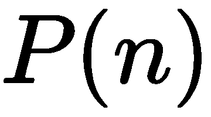
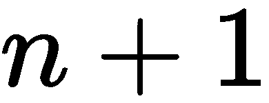
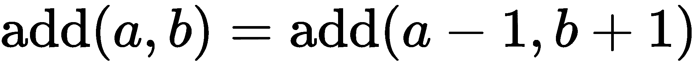
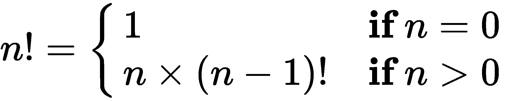
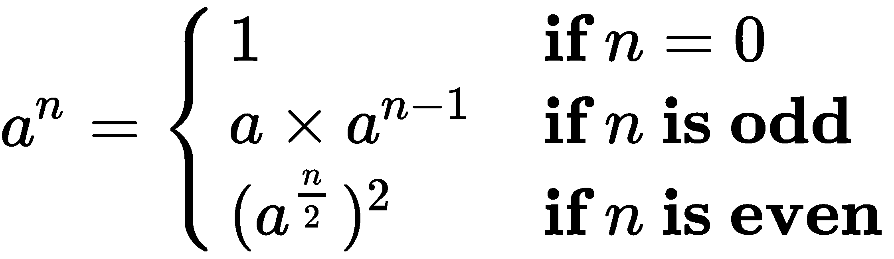
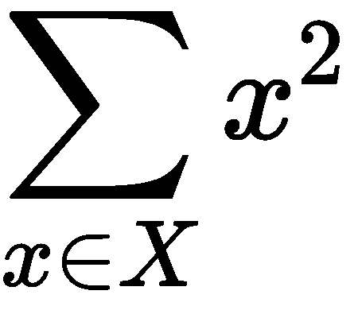

# 六、递归与归约

在前面的章节中，我们已经研究了几种相关的加工设计；其中包括：

*   映射和筛选，从集合创建集合
*   从集合中创建标量值的缩减

例如完成第一类收集处理的函数`map()`和`filter()`就说明了这一区别。有几种专门的还原功能，包括`min()`、`max()`、`len()`和`sum()`。还有一个通用的简化功能，`functools.reduce()`。

我们还将考虑作为函数的一种归约算子。它本身并没有产生一个单一的标量值，但它确实创建了一个新的数据组织，消除了一些原始结构。本质上，这是一种计数分组操作，它与计数减少比映射更为相似。

在本章中，我们将更详细地介绍归约函数。从纯函数的角度来看，约简是递归定义的。出于这个原因，我们将先看递归，然后再看约简算法。

通常，函数式编程语言编译器会优化递归函数，以将函数尾部的调用转换为循环。这将大大提高性能。从 Python 的角度来看，纯递归是有限的，因此我们必须手动进行尾部调用优化。Python 中可用的尾部调用优化技术是使用显式的`for`循环。

我们将研究一些简化算法，包括`sum()`、`count()`、`max()`和`min()`。我们还将介绍`collections.Counter()`函数和相关的`groupby()`缩减。我们还将了解解析（和词法扫描）是如何适当减少的，因为它们将标记序列（或字符序列）转换为具有更复杂属性的高阶集合。

# 简单数值递归

我们可以考虑用递归来定义所有的数值运算。有关更多详细信息，请阅读**皮亚诺公理**，该公理在[处定义了数字的基本特征 http://en.wikipedia.org/wiki/Peano_axioms](http://en.wikipedia.org/wiki/Peano_axioms) 。

从这些公理中，我们可以看到加法是使用下一个数或一个数的后继数*n*、的更原始的概念递归定义的。

为了简化演示，我们假设可以定义一个前置函数，比如，只要。这使一个数字是其前身的继承者的想法正式化。

两个自然数之间的加法可递归定义如下：


如果我们使用更常见的和而不是和，我们可以看到。

这可以巧妙地转换为 Python，如以下命令片段所示：

```py
def add(a: int, b: int) -> int:
    if a == 0: 
        return b
    else: 
        return add(a-1, b+1)
```

我们将常用的数学符号重新整理成 Python。

没有充分的理由在 Python 中提供我们自己的函数来进行简单的加法。我们依靠 Python 的底层实现来正确处理各种算法。我们在这里的观点是，基本的标量算法可以递归定义，并且定义非常容易实现。

所有这些递归定义至少包括两种情况：直接定义函数值的非递归（或*基*）情况，以及通过递归计算具有不同值的函数值的递归情况。

为了确保递归将终止，重要的是查看递归案例如何计算接近定义的非递归案例的值。我们在这里的函数中忽略了对参数值的约束。例如，前面的命令片段中的`add()`函数可以包括`assert a>=0 and b>=0`来建立对输入值的约束。

如果没有这些约束，从`a`开始设置为`-1`就不能保证接近`a == 0`的非递归情况。

# 实现尾部调用优化

对于某些函数，递归定义是最简洁和最具表现力的。一个常见的例子是`factorial()`函数。

我们可以从下面的公式中看到如何在 Python 中将其重写为一个简单的递归函数：



可以使用以下命令在 Python 中执行上述公式：

```py
def fact(n: int) -> int:
    if n == 0: return 1
    else: return n*fact(n-1)  
```

这具有简单的优点。Python 中的递归限制人为地限制了我们；我们不能做比`fact(997)`更大的事情。价值 1000 英镑！有 2568 位，通常超过我们的浮点容量；在某些系统上，浮点极限接近于。实际上，切换到`log gamma`函数是很常见的，它可以很好地处理大的浮点值。

此函数演示典型的尾部递归。函数中的最后一个表达式是使用新参数值调用函数。优化编译器可以用执行速度非常快的循环取代函数调用堆栈管理。

因为 Python 没有优化编译器，所以我们不得不着眼于优化标量递归。在这种情况下，函数涉及从*n*到*n*-1 的增量变化。这意味着我们要生成一个数字序列，然后做一个约简来计算它们的乘积。

在纯函数处理之外，我们可以定义一个命令式`facti()`计算，如下所示：

```py
def facti(n: int) -> int:
    if n == 0: return 1
    f = 1
    for i in range(2, n):
        f = f*i
    return f  
```

这个版本的阶乘函数将计算超过 1000 的值！（例如，2000！有 5733 位数字）。它不是纯粹的功能。我们根据`i`变量将尾部递归优化为有状态循环，以保持计算状态。

通常，我们必须在 Python 中这样做，因为 Python 不能自动进行尾部调用优化。然而，在某些情况下，这种优化实际上是没有帮助的。我们来看看一些情况。

# 保留递归

在某些情况下，递归定义实际上是最优的。有些递归涉及一种分而治之的策略，可以最小化工作量。其中一个例子是平方算法的幂运算。我们可以正式声明如下：



我们将这个过程分为三种情况，很容易用 Python 作为递归编写。查看以下命令片段：

```py
def fastexp(a: float, n: int) -> float:
    if n == 0: 
        return 1
    elif n % 2 == 1: 
        return a*fastexp(a, n-1)
    else:
        t= fastexp(a, n//2)
        return t*t
```

此函数有三种情况。基本情况下，`fastexp(a, 0)`方法被定义为具有`1`的值。另外两个案例采取了两种不同的方法。对于奇数，`fastexp()`方法是递归定义的。指数*n*减少`1`。一个简单的尾部递归优化将适用于这种情况。

然而，对于偶数，`fastexp()`递归使用`n/2`，将问题分解为原来大小的一半。由于问题大小减少了一个系数`2`，因此这种情况导致处理速度显著加快。

我们不能简单地将此类函数重新构造为尾部调用优化循环。因为它已经是最优的，所以我们不需要进一步优化它。Python 中的递归限制将施加的约束，这是一个慷慨的上限。

类型提示表明此函数是为浮点值设计的。它也适用于整数值。由于 Python 的类型强制规则，在使用任何一种常见数值类型的函数上使用`float`作为类型提示更简单。

# 处理困难的尾部调用优化

我们可以递归地查看**斐波那契**数的定义。以下是一个广泛使用的关于*n*斐波那契数的定义：


给定的斐波那契数被定义为前两个数的总和。这是一个多重递归的例子：它不能作为简单的尾部递归进行简单的优化。然而，如果我们不将它优化为尾部递归，我们会发现它太慢而没有用处。

以下是一个幼稚的实现：

```py
def fib(n: int) -> int:
    if n == 0: return 0
    if n == 1: return 1
    return fib(n-1) + fib(n-2)
```

这会受到多重递归问题的影响。在计算`fib(n)`方法时，我们必须计算`fib(n-1)`和`fib(n-2)`方法。`fib(n-1)`方法的计算涉及`fib(n-2)`方法的重复计算。斐波那契函数的两次递归使用将重复正在进行的计算量。

由于从左到右的 Python 求值规则，我们最多可以求值约为`fib(1000)`。然而，我们必须有耐心。非常耐心。

下面是一个替代方案，它重申了整个算法，使用有状态变量而不是简单的递归：

```py
def fibi(n: int) -> int:
    if n == 0: return 0
    if n == 1: return 1
    f_n2, f_n1 = 1, 1
    for _ in range(3, n+1):
        f_n2, f_n1 = f_n1, f_n2+f_n1
    return f_n1
```

Our stateful version of this function counts up from `0`, unlike the recursion, which counts down from the initial value of *n*. This version is considerably faster than the recursive version.

这里重要的是，我们不能简单地用一个明显的重写来优化`fib()`函数递归。为了用命令式版本替换递归，我们必须仔细研究算法，以确定需要多少有状态的中间变量。

# 通过递归处理集合

在处理集合时，我们还可以递归地定义处理。例如，我们可以递归地定义`map()`函数。形式主义可以表述如下：


我们将函数到空集合的映射定义为空序列。我们还指定可以使用三步表达式递归地定义将函数应用于集合。首先，将函数应用于除最后一个元素之外的所有集合，创建一个序列对象。然后将函数应用于最后一个元素。最后，将最后一次计算附加到先前构建的序列中。

以下是较旧的`map()`函数的纯递归函数版本：

```py
from typing import Callable, Sequence, Any
def mapr(
        f: Callable[[Any], Any], 
        collection: Sequence[Any]
    ) -> List[Any]:
    if len(collection) == 0: return []
    return mapr(f, collection[:-1]) + [f(collection[-1])]
```

`mapr(f,[])`方法的值定义为空`list`对象。具有非空列表的`mapr()`函数的值将把该函数应用于`list`中的最后一个元素，并将其附加到从应用于列表头的`mapr()`函数递归构建的列表中。

我们必须强调，这个`mapr()`函数实际上创建了一个`list`对象，类似于 Python 2 中较旧的`map()`函数。Python 3`map()`函数是一个可移植函数；它不会创建一个`list`对象。

虽然这是一种优雅的形式主义，但它仍然缺乏所需的尾部调用优化。尾部调用优化允许我们超过 1000 的递归深度，并且执行速度也比这种幼稚的递归快得多。

`Callable[[Any], Any]`的使用是一个弱类型提示。更清楚地说，它可以帮助定义域类型变量和范围类型变量。我们将在优化的示例中包括这一点

# 集合的尾部调用优化

我们有两种处理集合的一般方法：我们可以使用高阶函数返回生成器表达式，或者我们可以创建一个函数，使用`for`循环来处理集合中的每个项。这两种基本模式非常相似。

以下是一个高阶函数，其行为类似于内置的`map()`函数：

```py
from typing import Callable, Iterable, Iterator, Any, TypeVar
D_ = TypeVar("D_")
R_ = TypeVar("R_")
def mapf(
        f: Callable[[D_], R_], 
        C: Iterable[D_]
    ) -> Iterator[R_]:
    return (f(x) for x in C)
```

我们返回了一个生成所需映射的生成器表达式。这使用生成器表达式中的显式`for`作为一种尾部调用优化。

数据源`C`有一个类型提示`Iterable[D_]`，以强调某些类型将形成映射的域。转换函数有一个提示`Callable[[D_], R_]`，表明它从某个域类型转换为范围类型。例如，函数`float()`可以将值从字符串域转换为浮点范围。结果有`Iterator[R_]`的提示，表明它迭代了 range 类型；可调用函数的结果类型。

以下是具有相同签名和结果的生成器函数：

```py
def mapg(
        f: Callable[[D_], R_], 
        C: Iterable[D_]
    ) -> Iterator[R_]:
    for x in C:
        yield f(x)
```

这将使用一个完整的`for`语句进行尾部调用优化。结果是一致的。这个版本稍微慢一点，因为它涉及多个语句。

在这两种情况下，结果都是对结果的迭代器。我们必须做一些事情来从一个可移植的源具体化一个序列对象。例如，`list()`函数用于从迭代器创建序列：

```py
>>> list(mapg(lambda x:2**x, [0, 1, 2, 3, 4]))
[1, 2, 4, 8, 16]  
```

为了提高性能和可伸缩性，Python 程序中需要这种尾部调用优化。它使代码不那么纯粹的函数式。然而，好处远远大于纯度的缺乏。为了获得简洁而富有表现力的函数设计的好处，最好将这些非纯函数视为适当的递归。

实际上，这意味着我们必须避免用额外的有状态处理将集合处理函数弄乱。函数式编程的核心原则仍然有效，即使我们程序的某些元素不是纯粹的函数式的。

# 将集合从多个项目缩减并折叠为一个项目

我们可以考虑以下的函数：

对于空集合，我们可以说集合的和为 0。对于非空集合，总和是第一个元素加上其余元素的总和。


类似地，我们可以使用两种情况递归计算数字集合的乘积：


基本情况将空序列的乘积定义为 1。递归案例将产品定义为第一项乘以剩余项的产品。

我们已经在序列的每一项之间有效地折叠了`×`或`+`操作符。此外，我们对项目进行了分组，以便从右到左进行处理。这可以称为一种将集合缩减为单个值的正确方法。

在 Python 中，产品函数可以递归定义如下：

```py
def prodrc(collection: Sequence[float]) -> float:
    if len(collection) == 0: return 1
    return collection[0] * prodrc(collection[1:])
```

这在技术上是正确的。这是一个从数学符号到 Python 的简单重写。但是，由于它倾向于创建大量中间`list`对象，因此它不是最优的。它还仅限于处理显式集合；它无法轻松处理`iterable`对象。

还要注意，我们使用了`float`作为泛型数字类型提示。这将适用于整数，并将生成整数结果。对于这样的数值函数，使用`float`作为泛型类型提示更简单。

我们可以稍加修改，以使用 iterable，从而避免创建任何中间的`collection`对象。以下是一个正确的递归积函数，可用于可移植的数据源：

```py
def prodri(items: Iterator[float]) -> float:
    try:
        head= next(iterable)
    except StopIteration:
        return 1
    return head*prodri(iterable)
```

我们不能用`len()`函数询问 iterable，看它有多少元素。我们所能做的就是试图提取`iterable`序列的头部。如果序列中没有项目，则任何获取头部的尝试都将引发`StopIteration`异常。如果有一个项目，那么我们可以将这个项目乘以序列中剩余项目的乘积。对于演示，我们必须使用`iter()`函数从具体化的`sequence`对象显式创建一个 iterable。在其他情况下，我们可能会得到一个我们可以使用的非常有用的结果。以下是一个例子：

```py
>>> prodri(iter([1,2,3,4,5,6,7]))
5040
```

这个递归定义不依赖于 Python 的显式状态或其他命令性特性。虽然它更纯粹的功能，但它仍然限于处理 1000 项以下的集合。实际上，我们可以使用以下命令式结构来实现缩减功能：

```py
def prodi(items: Iterable[float]) -> float:
    p = 1
    for n in iterable:
        p *= n
    return p
```

这避免了任何递归限制。它包括所需的尾部调用优化。此外，这将同样适用于`Sequence`对象或 iterable。

在其他函数式语言中，这被称为`foldl`操作：操作符从左到右被折叠到 iterable 值集合中。这与递归公式不同，递归公式通常被称为`foldr`操作，因为计算是在集合中从右向左进行的。

对于具有优化编译器和惰性计算的语言，左折和右折的区别决定了如何创建中间结果。这可能会对性能产生深远影响，但区别可能并不明显。例如，向左折叠可以立即消耗和处理序列中的第一个元素。但是，折叠权限可能会占用序列的头部，但在整个序列被占用之前不会进行任何处理。

# 按从多个项目减少到少个项目进行分组

一种非常常见的操作是通过某个键或指示符对值进行分组。在 SQL 中，这通常被称为`SELECT GROUP BY`操作。原始数据按某些列的值分组，并将缩减（有时是聚合函数）应用于其他列。SQL 聚合函数包括`SUM`、`COUNT`、`MAX`和`MIN`。

统计汇总，称为模式，是由一些自变量分组的计数。Python 为我们提供了几种在计算分组值的缩减之前对数据进行分组的方法。我们将从两种获得分组数据简单计数的方法开始。然后，我们将研究如何计算分组数据的不同摘要。

我们将使用我们在[第 4 章](04.html)中计算的行程数据，*处理集合*。该数据以经纬度航路点序列开始。我们对其进行了重组，为`leg`创建了由三个元组表示的腿，即开始、结束和距离。数据如下：

```py
(((37.5490162, -76.330295), (37.840832, -76.273834), 17.7246), 
 ((37.840832, -76.273834), (38.331501, -76.459503), 30.7382), 
 ((38.331501, -76.459503), (38.845501, -76.537331), 31.0756), ... 
 ((38.330166, -76.458504), (38.976334, -76.473503), 38.8019))
```

一个常见的操作是计算一组数据值的模式，它既可以作为有状态映射，也可以作为一个物化、排序的对象。当我们查看行程数据时，变量都是连续的。为了计算模式，我们需要量化覆盖的距离。这也称为**装箱**：我们将数据分组到不同的箱子中。装箱在数据可视化应用程序中也很常见。在这种情况下，我们将使用 5 海里作为每个箱子的大小。

量化距离可通过生成器表达式生成：

```py
quantized = (5*(dist//5) for start, stop, dist in trip)
```

这将把每个距离除以`5`——丢弃任何分数，然后乘以`5`计算一个数字，表示四舍五入到最近的`5`海里的距离。

# 使用计数器构建映射

类似于`collections.Counter`方法的映射是一个伟大的优化，它可以减少创建计数（或总数）的次数，并根据集合中的某个值进行分组。分组数据的一个更典型的函数式编程解决方案是对原始集合进行排序，然后使用递归循环来确定每个组何时开始。这包括具体化原始数据，执行排序，然后进行缩减以获得每个键的总和或计数。

我们将使用以下生成器创建一个简单的距离序列，并将其转换为箱子：

```py
quantized = (5*(dist//5) for start, stop, dist in trip)
```

我们使用截断整数除法将每个距离除以`5`，然后乘以`5`创建一个向下舍入到最近的`5`英里的值。

以下表达式创建了从距离到频率的`mapping`：

```py
from collections import Counter
Counter(quantized)  
```

这是一个有状态的对象，由技术上强制的面向对象编程创建。然而，由于它看起来像一个函数，因此它似乎非常适合基于函数编程思想的设计。

如果我们打印`Counter(quantized).most_common()`函数，我们会看到以下结果：

```py
[(30.0, 15), (15.0, 9), (35.0, 5), (5.0, 5), (10.0, 5), (20.0, 5), 
 (25.0, 5), (0.0, 4), (40.0, 3), (45.0, 3), (50.0, 3), (60.0, 3), 
 (70.0, 2), (65.0, 1), (80.0, 1), (115.0, 1), (85.0, 1), (55.0, 1), 
 (125.0, 1)]  
```

最常见的距离约为`30`海里。记录的最短的`leg`是`0`的四个实例。最长的航程是`125`海里。

请注意，您的输出可能与此略有不同。`most_common()`功能的结果按频率顺序排列；等频仓可以是任意顺序。这五种长度可能并不总是按所示顺序排列：

```py
(35.0, 5), (5.0, 5), (10.0, 5), (20.0, 5), (25.0, 5)
```

# 通过排序构建映射

如果我们想在不使用`Counter`类的情况下实现这一点，我们可以使用一种功能更强大的排序和分组方法。以下是常见的算法：

```py
from typing import Dict, Any, Iterable, Tuple, List, TypeVar
Leg = Tuple[Any, Any, float]
T_ = TypeVar("T_")

def group_sort1(trip: Iterable[Leg]) -> Dict[int, int]:
    def group(
            data: Iterable[T_]
        ) -> Iterable[Tuple[T_, int]]:
        previous, count = None, 0
        for d in sorted(data):
            if d == previous:
                count += 1
            elif previous is not None:  # and d != previous
                yield previous, count
                previous, count = d, 1
            elif previous is None:
                previous, count = d, 1
            else:
                raise Exception("Bad bad design problem.")
        yield previous, count
    quantized = (int(5*(dist//5)) for beg, end, dist in trip)
    return dict(group(quantized))  
```

内部`group()`功能通过已排序的支腿序列逐步执行。如果已经看到某个给定项目，则该项目与`previous`中的值匹配，则计数器将递增。如果给定项目与上一个值不匹配，且上一个值不是`None`，则值发生了变化：发出上一个值和计数，并开始新值的新计数累积。第三个条件只适用一次：如果以前的值从未设置过，那么这是第一个值，我们应该保存它。

`group()`的定义提供了两个重要的类型提示。源数据是某个类型上的一个 iterable，以类型变量`T_`显示。在这个特定的例子中，`T_`的值将是一个`int`，这是非常清楚的；但是，该算法适用于任何 Python 类型。`group()`函数产生的 iterable 将保留源数据的类型，这通过使用相同的类型变量`T_`来明确。

`group_sort1()`函数的最后一行从分组项创建字典。这本词典将类似于`Counter`词典。主要区别在于`Counter()`函数将有一个`most_common()`方法函数，这是默认字典所缺少的。

`elif previous is None`方法案例是令人讨厌的开销。摆脱这个`elif`条款（并看到性能的轻微改善）并不十分困难。

要删除额外的`elif`子句，我们需要在内部`group()`函数中使用稍微复杂的初始化：

```py
def group(data: Iterable[T_]) -> Iterable[Tuple[T_, int]]:
    sorted_data = iter(sorted(data))
    previous, count = next(sorted_data), 1
    for d in sorted_data:
        if d == previous:
            count += 1
        elif previous is not None: # and d != previous
            yield previous, count
            previous, count = d, 1
        else:
            raise Exception("Bad bad design problem.")
    yield previous, count  
```

这将从数据集中选择第一项来初始化`previous`变量。剩余的项目随后通过循环进行处理。此设计显示了与递归设计的松散并行，其中我们使用第一个项初始化递归，并且每个递归调用提供下一个项或`None`来指示没有任何项需要处理。

我们也可以使用`itertools.groupby()`来实现这一点。我们将在[第 8 章](08.html)、*Itertools 模块*中详细介绍此函数。

# 按键值对数据进行分组或分区

我们可能希望应用于分组数据的缩减类型没有限制。我们可能有一些自变量和因变量的数据。我们可以考虑通过独立变量对数据进行分区，并计算每个分区中的值的最大值、最小值、平均值和标准偏差。

进行更复杂简化的基本技巧是将所有数据值收集到每组中。`Counter()`功能仅收集相同项目的计数。我们希望基于键值创建原始项的序列。

从更一般的角度来看，每个 5 英里的垃圾箱将包含该距离的所有腿，而不仅仅是腿数。我们可以考虑分区作为递归或作为一个有状态的应用。我们来看看`groupby()`函数的递归定义，因为它很容易设计。

显然，空集合的`groupby(C, key)`方法`C`是空字典`dict()`。或者，更有用的是，空的`defaultdict(list)`对象。

对于非空集合，我们需要使用项`C[0]`（头部）和递归处理序列`C[1:]`（尾部）。我们可以使用`head, *tail = C`命令对集合进行解析，如下所示：

```py
>>> C= [1,2,3,4,5]
>>> head, *tail= C
>>> head
1
>>> tail
[2, 3, 4, 5]  
```

我们需要使用`dict[key(head)].append(head)`方法将 head 元素包含在结果字典中。然后我们需要使用`groupby(tail,key)`方法来处理剩余的元素。

我们可以创建如下函数：

```py
from typing import Callable, Sequence, Dict, List, TypeVar
S_ = TypeVar("S_")
K_ = TypeVar("K_")
def group_by(
        key: Callable[[S_], K_], 
        data: Sequence[S_]
    ) -> Dict[K_, List[S_]]:

    def group_into(
            key: Callable[[S_], K_],
            collection: Sequence[S_],
            dictionary: Dict[K_, List[S_]]
        ) -> Dict[K_, List[S_]]:
        if len(collection) == 0:
            return dictionary
        head, *tail = collection
        dictionary[key(head)].append(head)
        return group_into(key, tail, dictionary)

    return group_into(key, data, defaultdict(list))
```

内部函数`group_into()`处理基本的递归定义。`collection`的空值返回提供的字典，未触及。非空集合被划分为头和尾。标题用于更新词典。然后使用尾部递归地使用所有剩余元素更新字典。

类型提示明确区分源对象`S_`的类型和键`K_`的类型。给定源类型为`S_`的对象，作为`key`参数提供的函数必须是可调用的，返回键类型为`K_`的值。在许多示例中，将显示一个函数来提取与`Leg`对象的距离。这是一个`Callable[[S_], K_]`，其中源类型`S_`是`Leg`对象，键类型`K_`是`float`值。

我们不能轻易地使用 Python 的默认值将其折叠成单个函数。我们无法明确使用以下命令段：

```py
def group_by(key, data, dictionary=defaultdict(list)):  
```

如果我们尝试这样做，`group_by()`函数的所有用法共享一个共同的`defaultdict(list)`对象。这不起作用，因为 Python 只构建一次默认值。作为默认值的可变对象很少做我们想要的事情。与其尝试包含更复杂的决策来处理不可变的默认值（例如，`None`），我们更喜欢使用嵌套函数定义。`wrapper()`函数正确初始化内部函数的参数。

我们可以按距离将数据分组如下：

```py
binned_distance = lambda leg: 5*(leg[2]//5)
by_distance = group_by(binned_distance, trip)  
```

我们定义了一个简单的、可重复使用的`lambda`，它将我们的距离放入 5 海里的箱子中。然后，我们使用提供的`lambda`对数据进行分组。

我们可以按如下方式检查装箱数据：

```py
import pprint
for distance in sorted(by_distance):
    print(distance)
    pprint.pprint(by_distance[distance])  
```

以下是输出的外观：

```py
0.0
[((35.505665, -76.653664), (35.508335, -76.654999), 0.1731), 
 ((35.028175, -76.682495), (35.031334, -76.682663), 0.1898), 
 ((25.4095, -77.910164), (25.425833, -77.832664), 4.3155), 
 ((25.0765, -77.308167), (25.080334, -77.334), 1.4235)]
5.0
[((38.845501, -76.537331), (38.992832, -76.451332), 9.7151), 
 ((34.972332, -76.585167), (35.028175, -76.682495), 5.8441), 
 ((30.717167, -81.552498), (30.766333, -81.471832), 5.103), 
 ((25.471333, -78.408165), (25.504833, -78.232834), 9.7128), 
 ((23.9555, -76.31633), (24.099667, -76.401833), 9.844)] ... 
125.0
[((27.154167, -80.195663), (29.195168, -81.002998), 129.7748)]  
```

`partition()`函数可以写成如下迭代：

```py
from typing import Callable, Dict, List, TypeVar
S_ = TypeVar("S_")
K_ = TypeVar("K_")
def partition(
        key: Callable[[S_], K_],
        data: Iterable[S_]
    ) -> Dict[K_, List[S_]]:
    dictionary: Dict[K_, List[S_]] = defaultdict(list)
    for head in data:
        dictionary[key(head)].append(head)
    return dictionary
```

在进行尾部调用优化时，命令式版本中的基本代码行将匹配递归定义。我们强调这一行是为了强调重写的目的是为了得到相同的结果。该结构的其余部分表示尾部调用优化，我们已将其作为绕过 Python 限制的常用方法。

类型提示强调源类型`S_`和键类型`K_`之间的区别。注意，`defaultdict(list)`的结果需要额外的类型提示`Dict[K_, List[S_]]`，以帮助**mypy**工具确认此代码有效。如果没有提示，这将生成一条`error: Need type annotation for variable`消息。`defaultdict`几乎可以有任何类型的组合；如果没有提示，就不可能确保变量被正确使用。

此提示还可以提供如下注释：

```py
 dictionary = defaultdict(list)  # type: Dict[K_, List[S_]]
```

这是较早版本的**pylint**工具所必需的。建议使用 1.8 之后的版本。

# 用归约法写出更一般的群

一旦我们对原始数据进行了分区，我们就可以计算每个分区中数据元素的各种缩减。例如，我们可能希望距离栏中每条腿的起点为最北点。

我们将引入一些帮助函数来分解元组，如下所示：

```py
start = lambda s, e, d: s
end = lambda s, e, d: e
dist = lambda s, e, d: d
latitude = lambda lat, lon: lat
longitude = lambda lat, lon: lon  
```

这些辅助函数中的每一个都需要使用`*`操作符提供`tuple`对象，以将元组的每个元素映射到`lambda`的一个单独参数。一旦元组被扩展为`s`、`e`和`p`参数，按名称返回正确的参数就相当明显了。这比试图解释`tuple_arg[2]`方法要清楚得多。

以下是我们如何使用这些帮助器函数：

```py
>>> point = ((35.505665, -76.653664), (35.508335, -76.654999), 
 0.1731)
>>> start(*point)
(35.505665, -76.653664)
>>> end(*point)
(35.508335, -76.654999)
>>> dist(*point)
0.1731
>>> latitude(*start(*point))
35.505665
```

我们的初始点对象是一个嵌套的三元组，`(0)`-起始位置，`(1)`-结束位置，`(2)`-距离。我们使用助手函数提取了各种字段。

有了这些助手，我们可以找到每个箱子中腿的最北端起始位置：

```py
for distance in sorted(by_distance):
    print(
        distance, 
        max(by_distance[distance],
            key=lambda pt: latitude(*start(*pt)))
    )
```

我们按距离分组的数据包括给定距离的每条腿。我们为`max()`功能提供了每个箱子中的所有支腿。我们提供给`max()`函数的`key`函数只提取了腿起点的纬度。

这为我们提供了每段距离最北端支腿的简短列表，如下所示：

```py
0.0 ((35.505665, -76.653664), (35.508335, -76.654999), 0.1731)
5.0 ((38.845501, -76.537331), (38.992832, -76.451332), 9.7151)
10.0 ((36.444168, -76.3265), (36.297501, -76.217834), 10.2537)
... 
125.0 ((27.154167, -80.195663), (29.195168, -81.002998), 129.7748)
```

# 编写高阶归约

我们将在这里看一个高阶归约算法的示例。这将引出一个相当复杂的话题。最简单的归约方法是从一组值中生成一个值。Python 有许多内置的缩减，包括`any()`、`all()`、`max()`、`min()`、`sum()`和`len()`。

正如我们在[第 4 章](04.html)*处理集合*中所述，如果我们从以下几个简单的缩减开始，我们可以进行大量的统计计算：

```py
def s0(data: Sequence) -> float:
    return sum(1 for x in data)  # or len(data)
def s1(data: Sequence) -> float:
    return sum(x for x in data)  # or sum(data)
def s2(data: Sequence) -> float:
    return sum(x*x for x in data)
```

这允许我们使用一些简单的函数来定义平均值、标准偏差、标准化值、校正，甚至最小二乘线性回归。

最后一个简单的归约`s2()`展示了如何应用现有的归约来创建高阶函数。我们可能会改变我们的方法，使其更像以下内容：

```py
from typing import Callable, Iterable, Any
def sum_f(
        function: Callable[[Any], float], 
        data: Iterable) -> float:
    return sum(function(x) for x in data)
```

我们添加了一个用于转换数据的函数。此函数用于计算转换值的总和。

现在我们可以用三种不同的方法来计算三个基本和，如下所示：

```py
N = sum_f(lambda x: 1, data)  # x**0
S = sum_f(lambda x: x, data)  # x**1
S2 = sum_f(lambda x: x*x, data)  # x**2
```

我们插入了一个小的`lambda`来计算，这是计数，是和，是平方和，我们可以用它来计算标准偏差。

对此的一个常见扩展包括一个过滤器，用于拒绝未知或以某种方式不合适的原始数据。我们可以使用以下命令拒绝错误数据：

```py
def sum_filter_f(
        filter_f: Callable, 
        function: Callable, data: Iterable) -> Iterator:
    return sum(function(x) for x in data if filter_f(x))  
```

通过执行以下命令片段，我们可以用一种简单的方式拒绝`None`值：

```py
count_ = lambda x: 1
sum_ = lambda x: x
valid = lambda x: x is not None
N = sum_filter_f(valid, count_, data)
```

这说明了我们如何为`sum_filter_f()`函数提供两个不同的`lambda`。`filter`参数是一个拒绝`None`值的`lambda`，我们称之为`valid`以强调其含义。`function`参数是实现`count`或`sum`方法的`lambda`。我们可以很容易地加上一个`lambda`来计算平方和。

需要注意的是，该函数与其他示例类似，它实际上返回一个函数而不是一个值。这是高阶函数的定义特征之一，在 Python 中实现起来非常简单。

# 编写文件解析器

我们通常可以将文件解析器看作是一种还原。许多语言有两个级别的定义：语言中较低级别的标记和由这些标记构建的较高级别的结构。当查看 XML 文件时，标记、标记名和属性名构成了这个较低级别的语法；由 XML 描述的结构形成了更高级的语法。

较低级别的词汇扫描是一种简化，它将单个字符分组为标记。这非常适合 Python 的生成器函数设计模式。我们通常可以编写如下所示的函数：

```py
def lexical_scan(some_source):
    for char in some_source:
        if *some pattern completed*: yield token
        else: *accumulate token*
```

出于我们的目的，我们将依靠较低级别的文件解析器来处理这个问题。我们将使用 CSV、JSON 和 XML 包来管理这些细节。我们将基于这些包编写更高级的解析器。

我们仍将依赖于两级设计模式。较低级别的解析器将生成原始数据的有用规范表示。它将是文本元组的迭代器。这与许多类型的数据文件兼容。高级解析器将生成对我们的特定应用程序有用的对象。这些可能是数字的元组，或者命名的元组，或者可能是其他一些不可变的 Python 对象。

我们在[第 4 章](04.html)*中提供了一个底层解析器的示例，该解析器使用集合*。输入是一个 KML 文件；KML 是地理信息的 XML 表示。解析器的基本功能类似于以下命令片段：

```py

def comma_split(text: str) -> List[str]:
    return text.split(",")
    def row_iter_kml(file_obj: TextIO) -> Iterator[List[str]]:
    ns_map = {
        "ns0": "http://www.opengis.net/kml/2.2",
        "ns1": "http://www.google.com/kml/ext/2.2"}
    xpath = (
        "./ns0:Document/ns0:Folder/"
        "ns0:Placemark/ns0:Point/ns0:coordinates")
    doc = XML.parse(file_obj)
    return (
        comma_split(cast(str, coordinates.text))
        for coordinates in doc.findall(xpath, ns_map)
    )
```

`row_iter_kml()`函数的主要功能是 XML 解析，它允许我们使用`doc.findall()`函数迭代文档中的`<ns0:coordinates>`标记。我们使用了一个名为`comma_split()`的函数将这个标记的文本解析为三个元组的值。

`cast()`函数的存在只是为了向**mypy**提供证据，证明`coordinates.text`的值是`str`对象。文本属性的默认定义为`Union[str, bytes]`；在本申请中，数据仅为`str`。`cast()`函数不做任何运行时处理；这是**mypy**使用的类型提示。

此函数主要用于处理规范化的 XML 结构。该文档与数据库设计器对第一个标准形式的定义非常接近：每个属性都是原子的（一个值），XML 数据中的每一行都有相同的列和一致类型的数据。然而，数据值不是完全原子化的：我们必须将`,`上的点拆分为原子字符串值，以将经度、纬度和海拔分开。然而，文本是完全一致的，这使得它与第一个标准形式非常吻合。

XML 标记、属性和其他标点符号的大量数据被缩减为较小的数据量，只包括浮点纬度和经度值。因此，我们可以将解析器看作是一种简化。

我们需要一组更高级别的转换来将文本元组映射为浮点数。另外，我们想放弃高度，重新排列经度和纬度。这将生成我们需要的特定于应用程序的元组。我们可以使用以下函数进行此转换：

```py
def pick_lat_lon(
        lon: Any, lat: Any, alt: Any) -> Tuple[Any, Any]:
    return lat, lon

def float_lat_lon(
        row_iter: Iterator[Tuple[str, ...]]
    ) -> Iterator[Tuple[float, ...]]:
    return (
        tuple(
            map(float, pick_lat_lon(*row))
        )
        for row in row_iter
    )
```

基本工具是`float_lat_lon()`功能。这是一个高阶函数，返回生成器表达式。生成器使用`map()`函数将`float()`函数转换应用于`pick_lat_lon()`函数的结果，并使用`*row`参数将`tuple`行的每个成员分配给`pick_lat_lon()`函数的不同参数。这仅在每一行是三元组时有效。然后，`pick_lat_lon()`函数按所需顺序返回所选项目的元组。

我们可以按如下方式使用此解析器：

```py
name = "file:./Winter%202012-2013.kml"
with urllib.request.urlopen(name) as source:
    trip = tuple(float_lat_lon(row_iter_kml(source)))
```

这将在原始 KML 文件中沿路径构建每个航路点的元组表示。它使用低级解析器从原始表示中提取文本数据行。它使用高级解析器将文本项转换为更有用的浮点值元组。在这种情况下，我们没有实现任何验证。

# 解析 CSV 文件

在第 3 章*函数、迭代器和生成器*中，我们看到了另一个示例，在该示例中，我们解析了一个非规范化形式的 CSV 文件：我们必须丢弃头行以使其有用。为此，我们使用了一个简单的函数来提取标题，并在剩余的行上返回一个迭代器。

数据如下：

```py
Anscombe's quartet
I  II  III  IV
x  y  x  y  x  y  x  y
10.0  8.04  10.0  9.14  10.0  7.46  8.0  6.58
8.0  6.95  8.0  8.14  8.0  6.77  8.0  5.76
... 
5.0  5.68  5.0  4.74  5.0  5.73  8.0  6.89
```

列由制表符分隔。另外，我们可以丢弃三行标题。

这是基于 CSV 的解析器的另一个版本。我们把它分成了三个功能。第一个，`row_iter()`函数返回制表符分隔文件中行的迭代器。该函数如下所示：

```py
def row_iter_csv(source: TextIO):
    rdr= csv.reader(source, delimiter="\t")
    return rdr
```

这是一个围绕 CSV 解析过程的简单包装器。当我们回顾以前的 XML 和纯文本解析器时，这些解析器缺少了这种东西。在行元组上生成 iterable 是规范化数据解析器的一个常见功能。

一旦有了一行元组，就可以传递包含可用数据的行，并拒绝包含其他元数据（如标题和列名）的行。我们将引入一个 helper 函数，我们可以使用它来进行一些解析，再加上一个`filter()`函数来验证一行数据。

以下是转换：

```py
from typing import Optional, Text
def float_none(data: Optional[Text]) -> Optional[float]:
    try:
        data_f= float(data)
        return data_f
    except ValueError:
        return None
```

此函数处理单个`string`值到`float`值的转换，将坏数据转换为`None`值。`Optional[Text]`和`Optional[float]`的类型提示表达了具有给定类型的值或具有与`None`相同类型的值的想法。

我们可以在映射中嵌入`float_none()`函数，以便将行的所有列转换为`float`或`None`值。这方面的`lambda`如下所示：

```py
from typing import Callable, List, Optional
R_Text = List[Optional[Text]]
R_Float = List[Optional[float]]

float_row: Callable[[R_Text], R_Float] \
    = lambda row: list(map(float_none, row))
```

使用两种类型的提示来明确`float_row`的定义。`R_Text`提示定义了一行数据的文本版本。它将是一个混合文本值和`None`值的列表。`R_Float`提示定义了一行数据的浮点版本。

以下是基于使用`all()`功能的行级验证器，以确保所有值都是`float`（或者没有一个值是`None`：

```py
all_numeric: Callable[[R_Float], bool] \
    = lambda row: all(row) and len(row) == 8
```

这个 lambda 是一种简化，如果所有值都不是“falsy”（即既不是`None`也不是零），并且正好有八个值，则将一行浮点值转换为布尔值。

过于简单的`all_numeric`函数将零和`None`合并在一起。更复杂的测试将依赖于`not any(item is None for item in row)`之类的东西。重写留给读者作为练习。

基本设计是创建基于行的元素，这些元素可以组合起来创建更完整的算法来解析输入文件。基本函数在文本元组上迭代。这些组合用于转换和验证转换后的数据。对于文件处于第一个标准格式（所有行都相同）或者简单的验证器可以拒绝无关行的情况，这种设计模式可以很好地工作。

然而，并非所有的解析问题都这么简单。某些文件的头行或尾行中包含必须保留的重要数据，即使这些数据与文件其余部分的格式不匹配。这些非规范化文件需要更复杂的解析器设计。

# 解析带有标题的纯文本文件

在[第 3 章](03.html)、*函数、迭代器和生成器*中，显示了`Crayola.GPL`文件，但没有显示解析器。该文件如下所示：

```py
GIMP Palette 
Name: Crayola 
Columns: 16 
# 
239 222 205  Almond 
205 149 117  Antique Brass
```

我们可以使用正则表达式解析文本文件。我们需要使用过滤器来读取（和解析）头行。我们还希望返回数据行的 iterable 序列。这种相当复杂的两部分解析完全基于两部分头文件和尾文件结构。

下面是一个处理四行标题和长尾的低级解析器：

```py
Head_Body = Tuple[Tuple[str, str], Iterator[List[str]]]
def row_iter_gpl(file_obj: TextIO) -> Head_Body:
    header_pat = re.compile(
        r"GIMP Palette\nName:\s*(.*?)\nColumns:\s*(.*?)\n#\n",
        re.M)

    def read_head(
            file_obj: TextIO
        ) -> Tuple[Tuple[str, str], TextIO]:
        match = header_pat.match(
            "".join(file_obj.readline() for _ in range(4))
        )
        return (match.group(1), match.group(2)), file_obj

    def read_tail(
            headers: Tuple[str, str],
            file_obj: TextIO) -> Head_Body:
        return (
            headers, 
            (next_line.split() for next_line in file_obj)
        )

    return read_tail(*read_head(file_obj))
```

`Head_Body`类型定义总结了行迭代器的总体目标。结果是一个两元组。第一项是一个两元组，包含来自文件头的详细信息。第二项是迭代器，它为颜色定义提供文本项。此`Head_Body`类型提示在本函数定义中有两处使用。

`header_pat`正则表达式解析头的所有四行。表达式中有`()`的实例，用于从标题中提取名称和列信息。

有两个内部函数用于解析文件的不同部分。`read_head()`函数解析标题行并返回感兴趣的文本和`TextIO`对象，该对象可用于其余的解析。它通过读取四行并将它们合并成一个长字符串来实现这一点。然后用`header_pat`正则表达式解析。

从一个函数返回迭代器以在另一个函数中使用的想法是将显式有状态对象从一个函数传递到另一个函数的模式。这是一个小小的简化，因为`read_tail()`函数的所有参数都是`read_head()`函数的结果。

`read_tail()`函数在剩余的行上解析迭代器。这些行仅在空格上拆分，因为这符合 GPL 文件格式的描述。

For more information, visit the following link:

[https://code.google.com/p/grafx2/issues/detail?id=518](https://code.google.com/p/grafx2/issues/detail?id=518).

一旦我们将文件的每一行转换成规范的字符串元组格式，我们就可以对该数据应用更高级别的解析。这涉及转换和（如有必要）验证。

以下是更高级别的解析器命令片段：

```py
from typing import NamedTuple
class Color(NamedTuple):
    red: int
    blue: int
    green: int
    name: str

def color_palette(
        headers: Tuple[str, str],
        row_iter: Iterator[List[str]]
    ) -> Tuple[str, str, Tuple[Color, ...]]:
    name, columns = headers
    colors = tuple(
        Color(int(r), int(g), int(b), " ".join(name))
        for r, g, b, *name in row_iter)
    return name, columns, colors
```

此函数将与低级`row_iter_gpl()`解析器的输出一起工作：它需要头和迭代器。此函数将使用多重赋值将`color`数字和剩余的字分成四个变量，`r`、`g`、`b`和`name`。使用`*name`参数可确保将所有剩余值作为`tuple`分配给`name`变量。然后，`" ".join(name)`方法将这些单词连接成一个空格分隔的字符串。

下面是我们如何使用这个两层解析器：

```py
with open("crayola.gpl") as source:
    name, cols, colors = color_palette(
        *row_iter_gpl(source)
    )
print(name, cols, colors)  
```

我们已经将高级解析器应用于低级解析器的结果。这将返回从`Color`对象序列构建的头和元组。

# 总结

在本章中，我们研究了两个重要的函数式编程主题。我们已经详细研究了递归。许多函数式编程语言编译器将优化递归函数，以将函数尾部的调用转换为循环。在 Python 中，我们必须通过使用显式的`for`循环手动执行尾部调用优化，而不是纯粹的函数递归。

我们还研究了简化算法，包括`sum()`、`count()`、`max()`和`min()`函数。我们研究了`collections.Counter()`功能和相关的`groupby()`减少。

我们还研究了解析（和词汇扫描）与归约的相似之处，因为它们将标记序列（或字符序列）转换为具有更复杂属性的高阶集合。我们已经研究了一种设计模式，该模式将解析分解为一个较低的级别，并尝试生成原始字符串的元组，以及一个创建更多有用应用程序对象的较高级别。

在下一章中，我们将介绍一些适用于处理 namedtuples 和其他不可变数据结构的技术。我们将研究使有状态对象变得不必要的技术。虽然有状态对象不是纯粹的函数，但类层次结构的思想可以用于打包相关的方法函数定义。