# 十六、优化和改进

在本章中，我们将介绍一些可以用来创建高性能功能程序的优化。我们将研究以下主题：

*   我们将从[第 10 章](10.html)、*Functools 模块*中进一步介绍如何使用`@lru_cache`装饰器。我们有很多方法来实现记忆算法。
*   我们还将讨论如何编写自己的装饰程序。更重要的是，我们将了解如何使用`Callable`对象缓存已存储的结果。
*   我们还将介绍在[第 6 章](06.html)、*递归和约简*中介绍的一些优化技术。我们将回顾尾部递归优化的一般方法。对于某些算法，我们可以将记忆与递归实现相结合，从而获得良好的性能。对于其他算法，memonization 并不是很有帮助，我们必须在其他地方寻找性能改进。
*   我们将通过使用`Fraction`类来查看优化精度的广泛案例研究。

在大多数情况下，对程序的微小更改只会导致性能的微小改进。用`lambda`对象替换函数对性能的影响很小。如果我们有一个速度慢得令人无法接受的程序，我们通常必须找到一个全新的算法或数据结构。用算法替换算法是实现性能大幅提升的最佳方法。

重新设计的一个起点是[http://www.algorist.com](http://www.algorist.com) 。这是一个可能有助于为给定问题找到更好算法的资源。

# 记忆和缓存

正如我们在[第 10 章](10.html)*Functools 模块*中所看到的，许多算法都可以从记忆中受益。我们将从回顾以前的一些示例开始，以描述可以通过记忆来帮助实现的函数类型。

在第 6 章*递归和归约*中，我们研究了几种常见的递归。最简单的递归类型是带有参数的尾部递归，这些参数可以很容易地与缓存中的值匹配。如果参数是整数、字符串或物化集合，那么我们可以快速比较参数以确定缓存是否具有以前计算的结果。

从这些例子中我们可以看出，整数数值计算，例如计算阶乘或定位斐波那契数，将得到明显改进。定位素数因子和将整数提升为幂是应用于整数值的数值算法的更多示例。

当我们查看斐波那契数的递归版本计算器时，我们看到它包含两个尾部调用递归。定义如下：

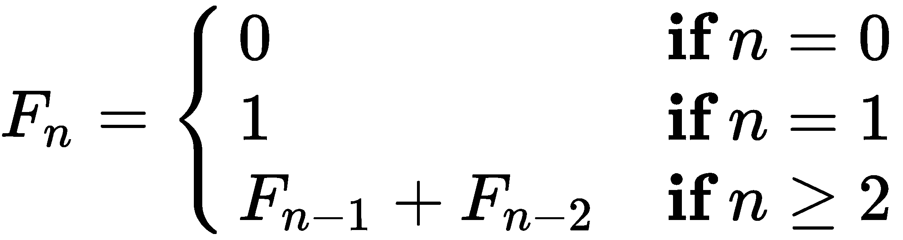

这可以变成一个循环，但任何设计更改都需要一些思考。递归定义的记忆版本可以非常快，并且不需要太多的思考来设计。

雪城函数是用于计算分形值的函数的一个例子。这是雪城的功能，。

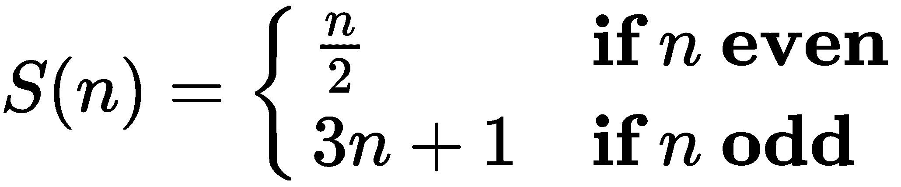

递归应用，从给定的起始值*n*有一个值链*C*。


Collatz 猜想是*雪城函数总是导致 1*。以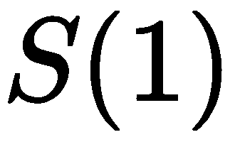开头的值形成一个 1、4、2、1。。。探索此函数的行为需要记忆中间结果。一个有趣的问题是定位非常长的序列。见[https://projecteuler.net/problem=14](https://projecteuler.net/problem=14) 针对一个需要小心使用缓存的有趣问题。

Syracuse 函数的递归应用是一个具有“吸引子”的函数示例，其中值被吸引到 1。在某些高维函数中，吸引子可以是直线，也可以是分形曲线。当吸引子是一个点时，记忆可以起到帮助作用；否则，记忆可能实际上是一个障碍，因为每个分形值都是唯一的。

使用集合时，缓存的好处可能会消失。如果集合恰好具有相同数量的整数值、字符串或元组，则该集合可能是重复的，并且可以节省时间。但是，如果需要多次对集合进行计算，则最好是手动优化：执行一次计算并将结果分配给变量。

在使用 iterables、generator 函数和其他惰性对象时，缓存或记忆根本没有帮助。惰性函数已经做了最少的工作来提供源序列中的下一个值。

包含测量值的原始数据通常使用浮点值。由于浮点值之间的精确相等比较可能无法很好地进行，因此将中间结果存储也可能无法很好地进行。

但是，包含计数的原始数据可能会从记录中受益。这些都是整数，我们可以信任精确的整数比较（可能）保存重新计算以前的值。某些统计函数应用于计数时，可以使用`fractions`模块而不是浮点值。当我们用`Fraction(x,y)`方法替换`x/y`时，我们保留了进行精确值匹配的能力。我们可以使用`float(some_fraction)`方法得出最终结果。

# 专业化回忆录

记忆化的基本思想是如此简单，以至于`@lru_cache`装饰师可以捕捉到它。此装饰器可应用于任何函数以实现记忆。在某些情况下，我们可以用更专业的东西来改进一般的想法。存在大量潜在的可优化多值函数。我们将在这里选择一个，并在更复杂的案例研究中研究另一个。

二项式显示了*n*不同事物可以按*m*大小分组排列的方式数量。该值如下所示：

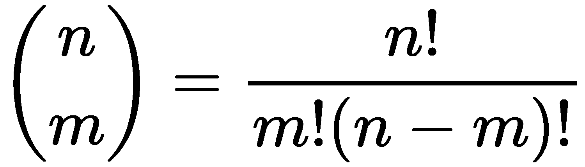

显然，我们应该缓存单个阶乘计算，而不是重做所有这些乘法。然而，我们也可以从缓存整体二项计算中获益。

我们将创建一个包含多个内部缓存的`Callable`对象。下面是我们需要的帮助函数：

```py
from functools import reduce
from operator import mul
from typing import Callable, Iterable

prod: Callable[[Iterable[int]], int] = lambda x: reduce(mul, x)
```

`prod()`函数计算一组数字的乘积。它被定义为使用`*`运算符的还原。

这是一个具有两个缓存的`Callable`对象，它使用这个`prod()`函数：

```py
class Binomial:
    def __init__(self):
        self.fact_cache = {}
        self.bin_cache = {}
    def fact(self, n: int) -> int:
        if n not in self.fact_cache:
            self.fact_cache[n] = prod(range(1, n+1))
        return self.fact_cache[n]
    def __call__(self, n: int, m: int) -> int:
        if (n, m) not in self.bin_cache:
            self.bin_cache[n, m] = (
                self.fact(n)//(self.fact(m)*self.fact(n-m)))
        return self.bin_cache[n, m]
```

我们创建了两个缓存：一个用于阶乘值，另一个用于二项系数值。内部`fact()`方法使用`fact_cache`属性。如果该值不在缓存中，则会计算该值并将其添加到缓存中。外部的`__call__()`方法以类似的方式使用`bin_cache`属性：如果已经计算了特定的二项式，则只返回答案。如果不是，则使用内部`fact()`方法计算新值。

我们可以像这样使用前面的`Callable`类：

```py
>>> binom= Binomial()
>>> binom(52, 5)
2598960 
```

这显示了我们如何从类中创建一个`Callable`对象，然后在一组特定的参数上调用该对象。有很多方法可以将一副 52 张牌的牌交给 5 张牌的手。可能有 260 万只手。

# 尾部递归优化

在第 6 章*递归和归约*中，我们研究了如何将简单递归优化为`for`循环。我们将使用以下简单的阶乘递归定义作为示例：


优化再灌注的一般方法如下：

*   设计递归。这意味着基本情况和递归情况是一个简单的函数，可以测试并证明是正确的，但速度较慢。以下是简单的定义：

```py
def fact(n: int) -> int:
    if n == 0: return 1
    else: return n*fact(n-1)  
```

*   如果递归在结尾有一个简单的调用，那么用一个`for`循环替换递归用例。定义如下：

```py
def facti(n: int) -> int:
    if n == 0: return 1
    f = 1
    for i in range(2,n):
        f = f*i
    return f
```

当递归出现在一个简单函数的末尾时，它被描述为尾部调用优化。许多编译器会将其优化为一个循环。Python 没有优化编译器，也没有进行这种尾部调用转换。

这种模式很常见。执行尾部调用优化可以提高性能，并消除递归次数的上限。

在进行任何优化之前，函数已经运行是绝对必要的。为此，一个简单的`doctest`字符串通常就足够了。我们可以对阶乘函数使用如下注释：

```py
def fact(n: int) -> int:
    """Recursive Factorial >>> fact(0)
    1
    >>> fact(1)
    1
    >>> fact(7)
    5040 """
    if n == 0: return 1
    else: return n*fact(n-1)  
```

我们添加了两个边缘情况：显式基本情况和超出基本情况的第一项。我们还添加了另一个涉及多次迭代的项。这使我们能够自信地调整代码。

当我们有更复杂的函数组合时，我们可能需要执行如下命令：

```py
binom_example = """
>>> binom = Binomial()
>>> binom(52, 5)
2598960
"""

__test__ = {
    "binom_example": binom_example,
}
```

`__test__`变量由`doctest.testmod()`函数使用。字典中与`__test__`变量相关的所有值都会检查`doctest`字符串。这是一种测试来自函数组合的特性的简便方法。这也称为**集成测试**，因为它测试多个软件组件的集成。

使用带有一组测试的工作代码使我们有信心进行优化。我们可以很容易地确认优化的正确性。下面是一个用于描述优化的流行引用：

"Making a wrong program worse is no sin." –Jon Bentley

这出现在 Addison Wesley，Inc.出版的*更多编程珍珠*的*保险杠贴纸计算机科学*章节中。这里重要的是，我们应该只优化实际正确的代码。

# 优化存储

没有优化的一般规则。我们通常专注于优化性能，因为我们有**大 O**复杂度度量等工具，可以告诉我们算法是否是给定问题的有效解决方案。优化存储通常是分开处理的：我们可以查看算法中的步骤，并估计各种存储结构所需的存储大小。

在许多情况下，这两种考虑是对立的。在某些情况下，具有优异性能的算法需要大型数据结构。如果不大幅增加所需的存储量，此算法无法扩展。我们的目标是设计一种算法，该算法速度相当快，并且使用了可接受的存储量。

我们可能不得不花时间研究算法的替代方案，以找到一种方法来适当地进行时空权衡。有一些常见的优化技术。我们通常可以通过维基百科的链接：

[http://en.wikipedia.org/wiki/Space-time_tradeoff](http://en.wikipedia.org/wiki/Space-time_tradeoff) 。

Python 中的一种内存优化技术是使用 iterable。这具有适当物化集合的某些属性，但不一定占用存储空间。很少有操作（如`len()`函数）不能在 iterable 上工作。对于其他操作，内存节省功能允许程序处理非常大的集合。

# 优化精度

在少数情况下，我们需要优化计算的准确性。这可能具有挑战性，可能需要一些相当高级的数学来确定给定方法的精度限制。

我们在 Python 中可以做的一件有趣的事情是用`fractions.Fraction`值替换浮点近似值。对于某些应用程序，这可以创建比浮点更精确的答案，因为分子和分母使用的位数比浮点尾数多。

使用`decimal.Decimal`值来处理货币是很重要的。使用`float`值是常见的错误。当使用`float`值时，由于作为输入提供的`Decimal`值与浮点值使用的二进制近似值不匹配，会引入额外的噪声位。使用`Decimal`值可防止引入微小误差。

在许多情况下，我们可以对 Python 应用程序进行一些小的更改，从`float`值切换到`Fraction`或`Decimal`值。当使用超越函数时，这种变化并不一定有益。根据定义，超越函数包含无理数。

# 根据受众需求降低准确性

对于某些计算，分数值可能比浮点值更有直观意义。这是以观众能够理解并采取行动的方式呈现统计结果的一部分。

例如，卡方检验通常涉及计算实际值和预期值之间的比较。然后，我们可以根据累积分布函数对该比较值进行测试。当预期值和实际值没有特定关系（我们可以称之为空关系）时，变化将是随机的；该值趋于小。当我们接受无效假设时，我们将在其他地方寻找关系。当实际值与预期值显著不同时，我们可以拒绝零假设。通过拒绝无效假设，我们可以进一步探索以确定关系的精确性质。

决策通常基于所选值和给定自由度的**累积分布函数****CDF**表。虽然列表中的 CDF 值大多是无理值，但我们通常使用的小数点不超过两位或三位。这只是一个决策工具，在 0.049 和 0.05 之间没有实际意义上的区别。

广泛使用的拒绝无效假设的概率为 0.05。这是一个小于 1/20 的`Fraction`对象。当向受众展示数据时，有时将结果描述为分数会有所帮助。像 0.05 这样的值很难想象。将一段关系描述为每 20 个人中就有 1 个机会可以帮助人们想象出这种关系的可能性。

# 案例研究-做出卡方决策

我们将看一个常见的统计决策。该决定详见[http://www.itl.nist.gov/div898/handbook/prc/section4/prc45.htm](http://www.itl.nist.gov/div898/handbook/prc/section4/prc45.htm) 。

这是关于数据是否随机分布的卡方决策。为了做出这个决定，我们需要计算一个预期分布，并将观察到的数据与我们的预期进行比较。一个显著的差异意味着有些事情需要进一步调查。一个微不足道的差异意味着我们可以使用零假设，即没有更多的研究：这些差异只是随机变化。

我们将展示如何使用 Python 处理数据。我们将从一些背景故事开始一些细节，这些细节不是案例研究的一部分，但通常具有一个**探索性数据分析**（**EDA**应用程序。我们需要收集原始数据并生成有用的摘要，以便进行分析。

在生产质量保证操作中，硅片缺陷数据收集在数据库中。我们可以使用 SQL 查询来提取缺陷详细信息以供进一步分析。例如，查询可能如下所示：

```py
SELECT SHIFT, DEFECT_CODE, SERIAL_NUMBER FROM some tables;
```

此查询的输出可能是一个包含单个缺陷详细信息的`.csv`文件：

```py
shift,defect_code,serial_number 
1,None,12345 
1,None,12346 
1,A,12347 
1,B,12348 
and so on. for thousands of wafers
```

我们需要总结前面的数据。我们可以使用`COUNT`和`GROUP BY`语句在 SQL 查询级别进行总结。我们还可以在 Python 应用程序级别进行总结。虽然纯数据库摘要通常被描述为更高效，但这并不总是正确的。在某些情况下，一个简单的原始数据提取和一个要汇总的 Python 应用程序可以比 SQL 汇总更快。如果性能很重要，那么必须衡量两种备选方案，而不是希望数据库速度最快。

在某些情况下，我们可以有效地从数据库中获取摘要数据。此摘要必须具有三个属性：移位、缺陷类型和观察到的缺陷计数。摘要数据如下所示：

```py
shift,defect_code,count 
1,A,15 
2,A,26 
3,A,33 
and so on. 
```

输出将显示移位和缺陷类型的所有 12 种组合。

在下一节中，我们将重点阅读原始数据以创建摘要。这就是 Python 特别强大的环境：处理原始源数据。

我们需要观察并比较移位和缺陷计数与总体预期。如果观察计数和预期计数之间的差异可以归因于随机波动，我们必须接受零假设，即没有什么有趣的事情出错。另一方面，如果这些数字不符合随机变化，那么我们就有一个需要进一步调查的问题。

# 使用计数器对象筛选和减少原始数据

我们将本质缺陷计数表示为一个`collections.Counter`参数。我们将根据详细的原始数据按班次和缺陷类型建立缺陷计数。下面是从`.csv`文件中读取一些原始数据的代码：

```py
from typing import TextIO
import csv
from collections import Counter
from types import SimpleNamespace

def defect_reduce(input_file: TextIO) -> Counter:
    rdr = csv.DictReader(input_file)
    assert set(rdr.fieldnames) == set(
        ["defect_type", "serial_number", "shift"])
    rows_ns = (SimpleNamespace(**row) for row in rdr)
    defects = (
        (row.shift, row.defect_type)
        for row in rows_ns if row.defect_type)
    tally = Counter(defects)
    return tally
```

前面的函数将基于通过`input`参数提供的打开文件创建字典读取器。我们已经确认列名与三个预期的列名匹配。在某些情况下，文件将具有必须忽略的额外列；在本例中，断言类似于`set(rdr.fieldnames) <= set([...])`以确认实际列是所需列的子集。

我们为每一行创建了一个`types.SimpleNamespace`参数。因为文件中的列名是有效的 Python 变量名，所以很容易将字典转换为名称空间对象。这允许我们使用稍微简单的语法来引用行中的项。具体来说，下一个生成器表达式使用诸如`row.shift`和`row.defect_type`之类的引用，而不是更大的`row['shift']`或`row['defect_type']`引用。

我们可以使用更复杂的生成器表达式来进行映射-过滤器组合。我们将过滤每一行以忽略没有缺陷代码的行。对于带有缺陷代码的行，我们映射一个表达式，该表达式从`row.shift`和`row.defect_type`引用中创建一个两元组。

在某些应用程序中，过滤器不会是一个简单的表达式，如`row.defect_type`。可能需要编写更复杂的条件。在这种情况下，使用`filter()`函数将复杂条件应用于提供数据的生成器表达式可能会有所帮助。

给定一个生成一系列`(shift, defect)`元组的生成器，我们可以通过从生成器表达式创建一个`Counter`对象来总结它们。创建这个`Counter`对象将处理惰性生成器表达式，它将读取源文件，从行中提取字段，过滤行，并汇总计数。

我们将使用`defect_reduce()`功能收集和汇总以下数据：

```py
with open("qa_data.csv") as input:
    defects = defect_reduce(input)
print(defects)
```

我们可以打开一个文件，收集缺陷，并显示它们，以确保我们已经按班次和缺陷类型进行了正确的总结。由于结果是一个`Counter`对象，如果我们有其他数据源，我们可以将其与其他`Counter`对象组合。

`defects`值如下所示：

```py
Counter({('3', 'C'): 49, ('1', 'C'): 45, ('2', 'C'): 34, 
 ('3', 'A'): 33, ('2', 'B'): 31, ('2', 'A'): 26, 
 ('1', 'B'): 21, ('3', 'D'): 20, ('3', 'B'): 17, 
 ('1', 'A'): 15, ('1', 'D'): 13, ('2', 'D'): 5})
```

我们有按班次`('1', '2', or '3')`和缺陷类型（`'A'`到`'D'`组织的缺陷计数。接下来我们将研究汇总数据的替代输入。这反映了一个常见的用例，其中数据在摘要级别可用。

一旦我们读取了数据，下一步就是开发两个概率，这样我们就可以正确地计算每个班次和每种类型缺陷的预期缺陷。我们不想将总缺陷数除以 12，因为这并不能反映按班次或缺陷类型划分的实际偏差。这种转变可能或多或少具有同等的生产力。缺陷频率肯定不会相似。我们期望一些缺陷非常罕见，而另一些则更常见。

# 读取汇总数据

作为读取所有原始数据的替代方法，我们可以只处理摘要计数。我们想要创建一个与前面示例类似的`Counter`对象；这将有缺陷计数作为一个值，带有 shift 键和缺陷代码。给出摘要，我们只需从输入字典创建一个`Counter`对象。

下面是一个函数，用于读取我们的摘要数据：

```py
from typing import TextIO
from collections import Counter
import csv
def defect_counts(source: TextIO) -> Counter:
    rdr = csv.DictReader(source)
    assert set(rdr.fieldnames) == set(
        ["defect_type", "serial_number", "shift"])
    rows_ns = (SimpleNamespace(**row) for row in rdr)
    convert = map(
        lambda d: ((d.shift, d.defect_code), int(d.count)),
        rows_ns)
    return Counter(dict(convert))
```

我们需要一个打开的文件作为输入。我们将创建一个`csv.DictReader()`函数，帮助解析从数据库获得的原始 CSV 数据。我们包含了一个`assert`语句，以确认该文件确实具有预期的数据。

这个变体使用一个`lambda`对象从每一行创建一个两元组。这个元组有一个由 shift 和 defect 以及计数的整数转换构建的复合键。结果将是一个序列，如`((shift,defect), count), ((shift,defect), count), ...)`。当我们将`lambda`映射到`row_ns`生成器时，我们将有一个生成器函数，它可以发出两个元组的序列。

我们将从两个元组的集合中创建一个字典，并使用该字典构建一个`Counter`对象。`Counter`对象可以很容易地与其他`Counter`对象组合。这使我们能够结合从多个来源获得的细节。在这种情况下，我们只有一个来源。

我们可以将此单一来源分配给`defects`变量。该值如下所示：

```py
Counter({('3', 'C'): 49, ('1', 'C'): 45, ('2', 'C'): 34, 
 ('3', 'A'): 33, ('2', 'B'): 31, ('2', 'A'): 26, 
 ('1', 'B'): 21, ('3', 'D'): 20, ('3', 'B'): 17, 
 ('1', 'A'): 15, ('1', 'D'): 13, ('2', 'D'): 5})
```

这与前面显示的详细信息摘要相匹配。然而，已经对源数据进行了总结。当从数据库中提取数据并使用 SQL 执行分组操作时，通常会出现这种情况。

# 使用计数器对象计算和

我们需要根据移位和类型计算缺陷的概率。为了计算期望概率，我们需要从一些简单的和开始。第一个是所有缺陷的总和，可通过执行以下命令来计算：

```py
total = sum(defects.values())
```

这是直接从分配给`defects`变量的`Counter`对象中的值完成的。这将表明样本集中总共有 309 个缺陷。

我们需要按班次以及按类型获得缺陷。这意味着我们将从原始缺陷数据中提取两类子集。通过 shift 提取的*将只使用`Counter`对象中`(shift,defect type)`键的一部分。类型为*的*将使用密钥对的另一半。*

我们可以通过创建从分配给`defects`变量的`Counter`对象的初始集合中提取的额外`Counter`对象来进行总结。以下是轮班总结：

```py
shift_totals = sum(
    (Counter({s: defects[s, d]}) for s, d in defects),
    Counter()  # start value = empty Counter
 ) 
```

我们已经创建了一组单独的`Counter`对象，这些对象有一个移位`s`，作为键和与该移位`defects[s,d]`相关的缺陷计数。生成器表达式将创建 12 个此类`Counter`对象，以提取四种缺陷类型和三个班次的所有组合的数据。我们将把`Counter`对象与`sum()`函数结合起来，得到三个按班次组织的摘要。

We can't use the default initial value of 0 for the `sum()` function. We must provide an empty `Counter()` function as an initial value.

使用与用于创建班次总计的表达式类似的表达式创建类型总计：

```py
type_totals = sum(
    (Counter({d: defects[s, d]}) for s, d in defects),
    Counter()  # start value = empty Counter
)
```

我们创建了十几个`Counter`对象，使用缺陷类型`d`作为键，而不是 shift 类型；否则，处理是相同的。

轮班总数如下所示：

```py
Counter({'3': 119, '2': 96, '1': 94})  
```

缺陷类型总计如下所示：

```py
Counter({'C': 128, 'A': 74, 'B': 69, 'D': 38})
```

我们将摘要保留为`Counter`对象，而不是创建简单的`dict`对象，甚至可能是`list`实例。从这一点开始，我们通常将它们作为简单的命令使用。然而，在某些情况下，我们需要适当的`Counter`对象，而不是减少。

# 从计数器对象计算概率

我们在两个单独的步骤中阅读了数据并计算了总结。在某些情况下，我们可能希望在阅读初始数据时创建摘要。这是一个可以节省一点处理时间的优化。我们可以编写一个更复杂的输入缩减，它会产生总计、移位总计和缺陷类型总计。这些`Counter`对象将一次构建一个项目。

我们将重点放在使用`Counter`实例上，因为它们似乎为我们提供了灵活性。对数据采集的任何更改仍将创建`Counter`实例，不会改变后续分析。

以下是我们如何通过移位和缺陷类型计算缺陷概率：

```py
from fractions import Fraction
P_shift = {
    shift: Fraction(shift_totals[shift], total)
    for shift in sorted(shift_totals)
}
P_type = {
    type: Fraction(type_totals[type], total)
    for type in sorted(type_totals)
}
```

我们已经创建了两个映射：`P_shift`和`P_type`。`P_shift`字典将移位映射到`Fraction`对象，该对象显示移位对缺陷总数的贡献。类似地，`P_type`字典将缺陷类型映射到`Fraction`对象，该对象显示该类型对缺陷总数的贡献。

我们选择使用`Fraction`对象来保持输入值的所有精度。当处理这样的计数时，我们可能会得到概率值，这对查看数据的人来说更直观。

`P_shift`数据如下所示：

```py
{'1': Fraction(94, 309), '2': Fraction(32, 103), 
 '3': Fraction(119, 309)}
```

`P_type`数据如下所示：

```py
{'A': Fraction(74, 309), 'B': Fraction(23, 103), 
 'C': Fraction(128, 309), 'D': Fraction(38, 309)}
```

对于某些人来说，32/103 或 96/309 等值可能比 0.3106 更有意义。我们可以很容易地从`Fraction`对象中获取`float`值，我们将在后面看到。

在 Python3.6 中，字典中的键往往保持在源数据中键的顺序上。在 Python 的早期版本中，键的顺序不太可预测。在这种情况下，顺序并不重要，但当键具有可预测的顺序时，它可以帮助调试工作。

所有轮班似乎都大致处于相同的缺陷生产水平。缺陷类型各不相同，这是典型的。似乎缺陷`C`是一个相对常见的问题，而缺陷`B`则不太常见。第二个缺陷可能需要出现更复杂的情况。

# 计算期望值并显示列联表

预期缺陷产生是一个组合概率。我们将计算移位缺陷概率乘以基于缺陷类型的概率。这将允许我们从移位和缺陷类型的所有组合中计算所有 12 个概率。我们可以用观察到的数字对这些进行加权，并计算缺陷的详细预期。

以下代码计算预期值：

```py
expected = {
    (s, t): P_shift[s]*P_type[t]*total
    for t in P_type
    for s in P_shift
} 
```

我们将创建一个与初始`defects``Counter`对象平行的字典。此字典将有一个包含键和值的两个元组序列。键将是移位和缺陷类型的两个元组。我们的字典是由一个生成器表达式构建的，该表达式显式枚举了`P_shift`和`P_type`字典中所有键的组合。

`expected`字典的值如下所示：

```py
{('2', 'B'): Fraction(2208, 103), 
 ('2', 'D'): Fraction(1216, 103),
 ('3', 'D'): Fraction(4522, 309), 
 ('2', 'A'): Fraction(2368, 103),
 ('1', 'A'): Fraction(6956, 309), 
 ('1', 'B'): Fraction(2162, 103),
 ('3', 'B'): Fraction(2737, 103), 
 ('1', 'C'): Fraction(12032, 309),
 ('3', 'C'): Fraction(15232, 309), 
 ('2', 'C'): Fraction(4096, 103),
 ('3', 'A'): Fraction(8806, 309), 
 ('1', 'D'): Fraction(3572, 309)}
```

映射的每个项都有一个带有移位和缺陷类型的键。这与基于轮班时间的缺陷概率的`Fraction`值相关，基于缺陷类型的缺陷概率乘以缺陷总数。一些分数被减少，例如，6624/309 的值可以简化为 2208/103。

大数作为适当的分数是不合适的。将较大的值显示为`float`值通常更容易。小值（如概率）有时更容易理解为分数。

我们将成对打印观察到的和预期的时间。这将帮助我们可视化数据。我们将创建如下内容，以帮助总结我们所观察到的和我们所期望的：

```py
obs exp    obs exp      obs exp     obs exp    
 15 22.51    21 20.99    45 38.94    13 11.56    94
 26 22.99    31 21.44    34 39.77     5 11.81    96
 33 28.50    17 26.57    49 49.29    20 14.63   119
 74          69         128          38         309  
```

这显示了 12 个细胞。每个单元都有观察到的缺陷数量和预期缺陷数量的值。每行以移位总数结尾，每列有一个带有缺陷总数的页脚。

在某些情况下，我们可能会以 CSV 表示法导出此数据并构建电子表格。在其他情况下，我们将构建列联表的 HTML 版本，并将布局细节留给浏览器。我们在这里展示了纯文本版本。

以下代码包含一系列语句，用于创建前面所示的列联表：

```py
print("obs exp "*len(type_totals))
for s in sorted(shift_totals):
    pairs = [
        f"{defects[s,t]:3d} {float(expected[s,t]):5.2f}"
        for t in sorted(type_totals)
    ]
    print(f"{' '.join(pairs)} {shift_totals[s]:3d}")
footers = [
    f"{type_totals[t]:3d} "
    for t in sorted(type_totals)]
print(f"{' '.join(footers)} {total:3d}")
```

这会将缺陷类型分布到每条生产线。我们已经写了足够多的`obs exp`专栏标题来涵盖所有缺陷类型。对于每个移位，我们将发出一行观察到的和实际的对，然后是移位总数。在底部，我们将发出一行页脚，其中只包含缺陷类型总计和总计。

类似于此的列联表有助于我们可视化观察值和预期值之间的比较。我们可以计算这两组值的卡方值。这将帮助我们决定这些数据是随机的还是有什么值得进一步调查的。

# 计算卡方值

值基于，其中*e*值为期望值，*o*值为观察值。在我们的例子中，我们有两个维度，移位*s*和缺陷类型*t*，这导致。

我们可以按如下方式计算指定公式的值：

```py
diff = lambda e, o: (e-o)**2/e

chi2 = sum(
    diff(expected[s, t], defects[s, t])
    for s in shift_totals 
    for t in type_totals
)
```

我们定义了一个小的`lambda`来帮助我们优化计算。这允许我们只执行一次`expected[s,t]`和`defects[s,t]`属性，即使预期值在两个地方使用。对于该数据集，最终的值为 19.18。

基于三个位移和四种缺陷类型，共有六个自由度。因为我们认为他们是独立的，所以我们得到。卡方检验表显示，低于 12.5916 的数据有 1/20 的概率是真正随机的。由于我们的值为 19.18，数据不太可能是随机的。

的累积分布函数表明，值为 19.18 的概率为 0.00387：1000 次随机概率中约有 4 次。整体分析的下一步是设计后续研究，以发现各种缺陷类型和转移的细节。我们需要看看哪个自变量与缺陷的相关性最大，然后继续分析。这项工作是合理的，因为值表明影响不是简单的随机变化。

边栏问题是阈值 12.5916。虽然我们可以在统计值表中找到这一点，但我们也可以直接计算这个阈值。这就引出了许多有趣的函数式编程示例。

# 计算卡方阈值

测试的本质是一个基于自由度数量和我们在接受或拒绝无效假设时愿意接受的不确定性水平的阈值。传统上，我们建议使用 0.05（1/20）左右的阈值来拒绝无效假设。我们希望只有 1/20 的机会，数据只是随机的，而且看起来有意义。换句话说，我们希望 20 个数据中有 19 个机会反映简单的随机变化。

卡方值通常以表格形式提供，因为计算涉及许多超越函数。在某些情况下，软件库将提供累积分布函数的实现，允许我们计算一个值，而不是在重要值的列表中查找。

值*x*和自由度*f*的累积分布函数定义如下：

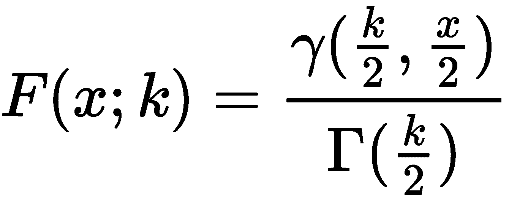

通常将随机概率表示为。也就是说，如果*p>0.05*，则数据可以理解为随机数据；无效假设是正确的。否则，数据不太可能是随机的，需要进一步研究。

累积分布是不完全伽马函数和完全伽马函数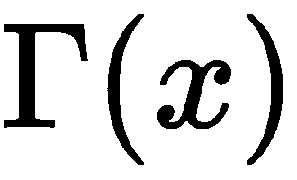的比值。计算这些函数值的一般方法可能涉及一些相当复杂的数学。我们将抄近路，实现两个非常好的近似值，只关注这个问题。这些功能中的每一个都允许我们研究一些附加的功能设计问题。

这两个函数都需要阶乘计算。我们已经看到了分数主题的几种变体。我们将使用以下方法：

```py
@lru_cache(128)
def fact(k: int) -> int:
    if k < 2:
        return 1
    return reduce(operator.mul, range(2, int(k)+1))
```

这是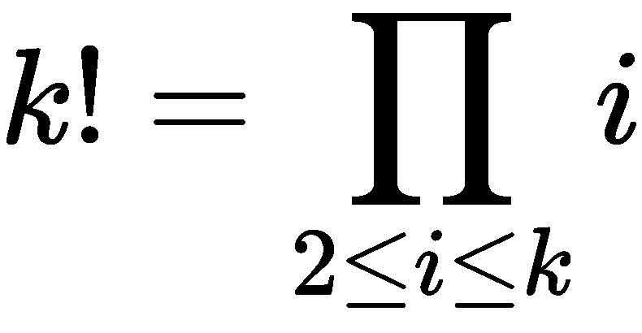，是从 2 到*k*（含）的数字的乘积。这个实现不涉及递归。因为在 Python 中整数可能非常大，所以它无法计算实际值的上限。

# 不完全 gamma 函数的计算

不完全伽马函数有一个级数展开式。这意味着我们要计算一系列值，然后对这些值求和。欲了解更多信息，请访问[http://dlmf.nist.gov/8](http://dlmf.nist.gov/8) 。


这个系列将有一个无限的术语序列。最终，这些值变得太小而不相关。我们可以建立一个小值ε，并在下一项小于该值时停止序列。

计算将产生交替符号：

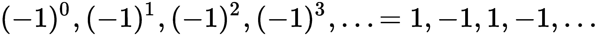

术语的顺序如下所示，*s=1*和*z=2*：

```py
2/1, -2/1, 4/3, -2/3, 4/15, -4/45, ..., -2/638512875
```

在某一点上，每增加一个术语都不会对结果产生任何重大影响。

当我们回顾累积分布函数时，我们可以考虑使用 Tyt T0 值。自由度*k*将是一个整数除以 2。值*x*可以是`Fraction`或`float`值；它很少是一个简单的整数值。

当评估的项时，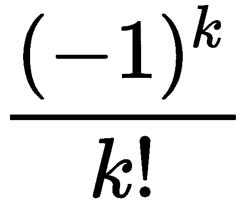的值将涉及整数，并可表示为适当的`Fraction`值。然而，表达式作为一个整体并不总是一个`Fraction`对象。的值可以是`Fraction`或`float`值。当不是整数时，结果会导致无理值；不合理的值会导致复杂的外观`Fraction`对象接近其值。

在 gamma 函数中使用`Fraction`值可能是可行的，但似乎没有帮助。然而，展望完整的 gamma 函数，我们会发现`Fraction`值可能会有所帮助。出于这个原因，我们将在这个实现中使用`Fraction`对象，即使它们具有无理值的近似值。

以下代码是前面解释的系列扩展的实现：

```py
from typing import Iterator, Iterable, Callable, cast
def gamma(s: Fraction, z: Fraction) -> Fraction:

    def terms(s: Fraction, z: Fraction) -> Iterator[Fraction]:
        """Terms for computing partial gamma"""
        for k in range(100):
            t2 = Fraction(z**(s+k))/(s+k)
            term = Fraction((-1)**k, fact(k))*t2
            yield term
        warnings.warn("More than 100 terms")

    def take_until(
            function: Callable[..., bool], source: Iterable
        ) -> Iterator:
        """Take from source until function is false."""
        for v in source:
            if test(v):
                return
        yield v

    ε = 1E-8
    g = sum(take_until(lambda t: abs(t) < ε, terms(s, z)))
    # sum() from Union[Fraction, int] to Fraction
    return cast(Fraction, g)
```

我们定义了一个`term()`函数，该函数将产生一系列项。我们使用了一个上限为`for`的语句，只生成 100 个术语。我们本可以使用`itertools.count()`函数来生成一个无限的项序列。使用具有上限的循环似乎稍微简单一些。

我们计算了一个可能不合理的值，并根据该值本身创建了一个`Fraction`值。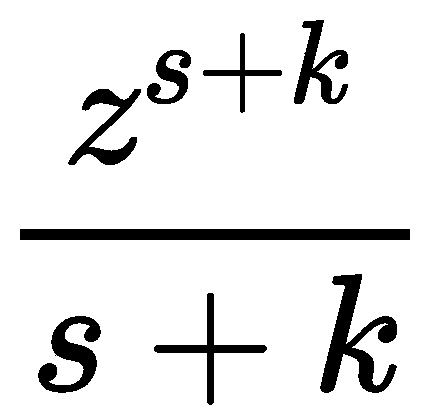的除法将涉及两个`Fractions`的除法，为`t2`变量创建一个新的`Fraction`值。`term`变量的值将是两个`Fraction`对象的乘积。

我们定义了一个`take_until()`函数，该函数从 iterable 中获取值，直到给定的函数为 true 为止。一旦该函数变为 true，就不会从 iterable 中消耗更多的值。我们还定义了一个小阈值`ε`，即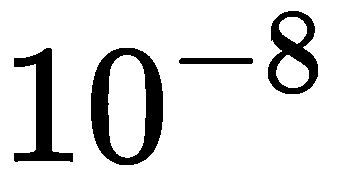。我们将从`term()`函数中获取值，直到值小于`ε`。这些值之和是部分`gamma`函数的近似值。

请注意，阈值变量是希腊字母 epsilon。Python3 允许变量名使用任何 Unicode 字母。

下面是一些测试用例，我们可以用它们来确认我们正确地计算了它：

*   
*   
*   

Python 数学库中提供了错误函数`erf()`。我们不需要为这个建立一个近似值。

我们的兴趣集中在卡方分布上。出于其他数学目的，我们通常对不完整的`gamma`函数不感兴趣。因此，我们可以将测试用例的范围缩小到我们希望使用的值的类型。我们还可以限制结果的准确性。大多数卡方检验涉及三位数的精度。我们在测试数据中显示了七位数字，这超出了我们可能需要的范围。

# 计算完全伽马函数

完全 gamma 函数比不完全 gamma 函数更难实现。有许多不同的近似值。欲了解更多信息，请访问[http://dlmf.nist.gov/5](http://dlmf.nist.gov/5) 。Python`math`库中提供了一个版本。它代表了一个广泛有用的近似值，适用于许多情况。

我们对完全 gamma 函数的完全通用实现不感兴趣。我们只对两种特殊情况感兴趣：整数值和半数值。对于这两种特殊情况，我们可以得到精确的答案，而不需要依赖于近似值。

对于整数值，。整数的完整 gamma 函数可以依赖于我们前面定义的阶乘函数。

对于一半的值，有一种特殊形式：。这包括一个无理值，因此我们只能用`float`或`Fraction`对象近似表示。

如果我们使用适当的`Fraction`值，那么我们可以用几个简单的情况设计一个函数：一个`integer`值，一个`Fraction`值，分母中有`1`，一个`Fraction`值，分母中有 2。我们可以使用`Fraction`值，如下代码所示：

```py
sqrt_pi = Fraction(677_622_787, 382_307_718)

from typing import Union
def Gamma_Half(
        k: Union[int, Fraction]
    ) -> Union[int, Fraction]:
    if isinstance(k, int):
        return fact(k-1)
    elif isinstance(k, Fraction):
        if k.denominator == 1:
            return fact(k-1)
        elif k.denominator == 2:
            n = k-Fraction(1, 2)
            return fact(2*n)/(Fraction(4**n)*fact(n))*sqrt_pi
    raise ValueError(f"Can't compute Γ({k})")
```

我们调用函数`Gamma_Half`是为了强调这只适用于整数和一半。对于整数值，我们将使用前面定义的`fact()`函数。对于分母为 1 的`Fraction`对象，我们将使用相同的`fact()`定义。

对于分母为 2 的情况，我们可以使用更复杂的*闭合形式*值。我们对值使用了一个显式的`Fraction()`函数。我们还提供了无理值的`Fraction`近似值。

以下是一些测试用例：

*   
*   
*   
*   

这些也可以显示为适当的`Fraction`值。无理数（平方根和）的存在倾向于产生大的、难以读取的分数。我们可以使用类似的方法创建更容易阅读的分数：

```py
>>> g = Gamma_Half(Fraction(3, 2))
>>> g.limit_denominator(2_000_000)
Fraction(291270, 328663)  
```

这提供了一个分母限制在 200 万以下的值；这提供了美观的六位数数字，我们可以将其用于单元测试目的。

# 计算随机分布的概率

现在我们有了不完整的`gamma`函数`gamma`和完整的`gamma`函数`Gamma_Half`，我们可以计算`CDF`值。该值向我们显示了给定值随机或具有某种可能相关性的几率。

功能本身非常小：

```py
def cdf(x: Union[Fraction, float], k: int) -> Fraction:
    """X² cumulative distribution function.
    :param x: X² value, sum (obs[i]-exp[i])**2/exp[i]
        for parallel sequences of observed and expected values.
 :param k: degrees of freedom >= 1; often len(data)-1
    """
    return (
        1 - 
        gamma(Fraction(k, 2), Fraction(x/2)) /
        Gamma_Half(Fraction(k, 2))
    )
```

此功能包括一些`docstring`注释，以澄清参数。我们根据自由度和卡方值*x*创建了合适的`Fraction`对象。这将是`x`参数对`Fraction`对象的`float`值，允许一些灵活性来匹配完全在浮点近似中完成的示例。

我们可以使用`Fraction(x/2).limit_denominator(1000)`将`x/2Fraction`方法的大小限制在相当少的位数。这将计算出一个正确的`CDF`值，但不会产生包含数十位数字的庞大分数。

下面是从表中调用的一些示例数据。访问[http://en.wikipedia.org/wiki/Chi-squared_distribution](http://en.wikipedia.org/wiki/Chi-squared_distribution) 了解更多信息。

要计算正确的`CDF`值，请执行以下类型的命令：

```py
>>> round(float(cdf(0.004, 1)), 2)
0.95
>>> cdf(0.004, 1).limit_denominator(100)
Fraction(94, 99)
>>> round(float(cdf(10.83, 1)), 3)
0.001
>>> cdf(10.83, 1).limit_denominator(1000)
Fraction(1, 1000)
>>> round(float(cdf(3.94, 10)), 2)
0.95
>>> cdf(3.94, 10).limit_denominator(100)
Fraction(19, 20)
>>> round(float(cdf(29.59, 10)), 3)
0.001
>>> cdf(29.59, 10).limit_denominator(10000)
Fraction(8, 8005)  
```

给定和若干自由度，我们的`CDF`函数产生的结果与广泛使用的值表相同。第一个例子显示了一个自由度为 0.004 的的可能性有多大。第二个例子显示了 10.38 的具有一个自由度的可能性有多大。一个小的值意味着预期结果和观察结果之间几乎没有差异。

以下是表中的整行，使用简单的生成器表达式计算：

```py
>>> chi2 = [0.004, 0.02, 0.06, 0.15, 0.46, 1.07, 1.64, ...     2.71, 3.84, 6.64, 10.83]
>>> act = [round(float(x), 3) 
,,,    for x in map(cdf, chi2, [1]*len(chi2))]
>>> act
[0.95, 0.888, 0.806, 0.699, 0.498, 0.301, 0.2, 0.1, 0.05, 0.01, 0.001]
```

这些值显示了一个自由度结果的给定的相对可能性。与公布的结果相比，我们的计算在小数点后第三位有一些微小的差异。这意味着我们可以使用 CDF 计算，而不是在标准统计参考中查找值。

`CDF()`函数为我们提供了值因随机机会而产生的概率。根据公布的表格，六个自由度的 0.05 概率的值为 12.5916。下面是这个`CDF()`函数的输出，与公布的结果非常吻合：

```py
>>> round(float(cdf(12.5916, 6)), 2)    
0.05  
```

回顾前面的例子，我们在例子中得到的的实际值是 19.18。以下是该值为随机值的概率：

```py
>>> round(float(cdf(19.18, 6)), 5)
0.00387
```

该概率为 3/775，分母限制为 1000。这些都不是随机数据的好机会。这意味着可以拒绝无效假设，并且可以进行更多的调查以确定差异的可能原因。

# 函数式编程设计模式

函数式编程有许多常见的设计模式。这些是函数式编程的典型方法，可在各种环境中使用。

请注意与面向对象设计模式的重要区别。许多 OO 设计模式旨在使状态管理更加明确，或帮助组合复杂的紧急行为。对于功能设计模式，关注点几乎总是从简单的部分创建复杂的行为。

在本书中有许多常见的功能设计方法。大多数人都没有特定的名字或故事。在本节中，我们将回顾其中的一些模式。

*   **Currying**：可称为部分功能应用，通过`functools`模块中的`partial()`功能实现。其思想是基于现有函数加上函数的一些（但不是全部）参数创建一个新函数。
*   **闭包**：在 Python 中，定义一个返回另一个函数的函数非常容易。当返回的函数包含由外部函数绑定的变量时，这是一个闭包。当函数返回 lambda 对象或生成器表达式时，通常会执行此操作。这也是创建参数化装饰器的一部分。
*   **纯函数**：这些是常见的无状态函数。在 Python 中，我们还可以使用不纯函数来处理有状态的输入和输出。此外，系统服务和随机数生成器是不纯函数的示例。一个好的功能设计会尽可能地强调纯粹的功能，避免`global`语句。
*   **功能组合**：`itertools`库包含许多功能组合工具。在前几章中，我们还研究了在函数组合中使用装饰器的方法。在许多情况下，我们希望创建可调用对象，以便在运行时将函数绑定在一起。
*   **高阶函数**：Python 有许多使用其他函数的内置函数，包括`map()`、`filter()`、`min()`、`max()`和`sorted()`。此外，`functools`和`itertools`等库还包含其他示例。
*   **Map reduce 算法**：使用高阶函数轻松构建。在 Python 中，这相当于`reduce(f, map(g, data))`的一个变体。我们可以使用一个函数`f()`来处理缩减，使用一个函数`g()`来执行逐项映射。常见的缩减示例包括`sum()`以及`statistics`库中的许多函数。
*   **惰性（“非严格”）评估：**Python 生成器表达式就是一个例子。像`(f(a) for a in S)`这样的表达式是惰性的，只会在某些客户端操作使用值时计算`f(a)`。在许多示例中，我们使用了`list()`函数来使用惰性生成器中的值。
*   **单子：**在 Python 中，强制排序通常是不必要的，因为操作的排序是不可避免的。我们可以使用`pymonad`库提供一些明确的语法，可以清楚地显示在更复杂的表达式中应该如何实现排序。这有助于输入和输出，也有助于行为有状态的复杂模拟。

除了这些常见的函数式编程设计模式外，还有一些其他技术是 Python 函数式编程的一部分：

*   **将尾部递归****转换为**`for`**语句**：Python 对递归施加了上限，很少有循环允许我们超过这个上限的情况。更重要的是，递归涉及到管理堆栈帧的开销，`for`语句可以避免这种开销。
*   **Iterable 函数：**使用`yield from`语句可以很容易地创建由其他函数的结果组成的 Iterable 集合的函数。使用 iterable 结果有助于功能组合。
*   Python 装饰器和可调用对象的行为可以像*函子*一样。在类似 ML 的语言中，函子用于将类型定义作为参数。在 Python 中，类型定义通常是基于类的，将它们与可调用对象或装饰器结合使用是明智的。

所有这些功能设计模式都可以被描述为设计和实现功能编程的典型或通用方法。任何一种经常重复的设计都会形成一种模式，我们可以从中学习并用于我们自己的软件设计。

# 总结

在本章中，我们研究了三种优化技术。第一种技术涉及找到正确的算法和数据结构。这比任何其他单一设计或编程决策对性能的影响都大。使用正确的算法可以很容易地将运行时间从几分钟减少到几分之一秒。例如，将使用不当的序列更改为正确使用的映射可能会将运行时间减少 200 倍。

我们通常应该将所有递归优化为循环。这在 Python 中会更快，并且不会因为 Python 施加的调用堆栈限制而停止。在其他章节中，主要是第 6 章*递归和归约*中，有许多例子说明了递归是如何被展平为循环的。此外，我们还可以通过其他两种方式提高性能。首先，我们可以将记忆应用于缓存结果。对于数值计算，这可能会产生很大的影响；对于集合，影响可能较小。其次，用 iterables 替换大型物化数据对象还可以通过减少所需的内存管理量来提高性能。

在本章介绍的案例研究中，我们研究了使用 Python 进行探索性数据分析的优势—初始数据采集，包括一点解析和过滤。在某些情况下，需要花费大量的精力来规范化来自不同来源的数据。这是 Python 擅长的任务。

值的计算涉及三个`sum()`函数：两个中间生成器表达式和一个最终生成器表达式，用于创建具有预期值的字典。最后一个`sum()`函数创建了统计数据。在十几个表达式中，我们创建了一个复杂的数据分析，这将帮助我们接受或拒绝无效假设。

我们还评估了一些复杂的统计函数：不完全和完全伽马函数、和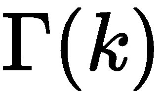。不完全伽马函数涉及一个潜在的无穷级数；我们截断了它，并对值求和。完全伽马函数有一些潜在的复杂性，但这些并不适用于这种情况。

使用函数式方法，我们可以编写简洁而富有表现力的程序来完成大量的处理。Python 不是一种功能正确的编程语言。例如，我们需要使用一些命令式编程技术。这种限制迫使我们远离纯粹的函数递归。我们获得了一些性能优势，因为我们被迫将尾部递归优化为显式循环。

我们还看到了采用 Python 混合式函数式编程的许多优点。特别是，Python 的高阶函数和生成器表达式的使用为我们提供了许多编写高性能程序的方法，这些程序通常非常清晰和简单。