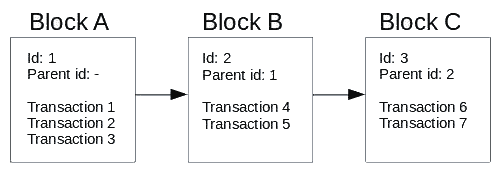
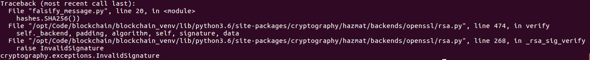
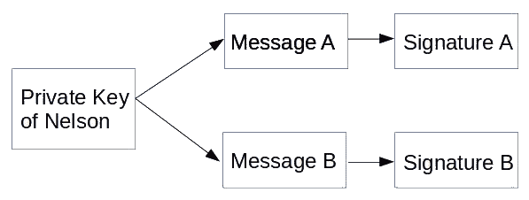
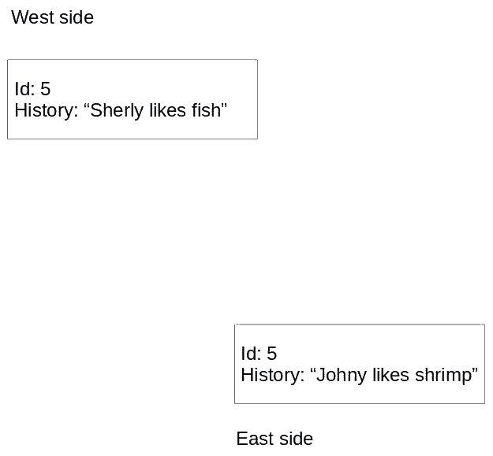

# 一、区块链编程简介

在本书中，我们将学习区块链编程，以便您在寻找区块链机会时成为一股不可忽视的力量。要实现这一点，您需要从理解区块链技术及其所包含的内容开始。在本章中，我们将学习什么是区块链技术。区块链如何授权比特币和以太坊？我们将直观地了解区块链技术。我们还将复制区块链背后的一些基本功能。

本章将介绍以下主题：

*   加密货币和区块链的兴起
*   区块链技术
*   密码学
*   散列函数
*   一致的意见
*   区块链编码

# 加密货币和区块链的兴起

假设你在 2017 年没有在山上过隐居的生活，你会听说所有关于加密货币的事，尤其是比特币。你不必看得太远，就能听到这个话题的流行程度、术语以及价值的增长。此时，其他加密货币也开始增长，为以太坊达到 1000 美元等头条新闻让路！在这股热潮中，人们讨论了加密货币的一切，从摇摆不定的价格到背后的技术，即区块链。

区块链被认为是为人类带来正义和繁荣新时代曙光的技术。这将使财富民主化。它将从寡头手中夺走权力，并将权力还给人民。它将保护人们的数据。然后到了 2018 年，加密货币下跌。聚会结束了。比特币目前售价为 6000 美元，而以太坊的售价不到 400 美元。

然而，尽管围绕加密货币的炒作已经平息，它仍然是一个经常讨论的话题。区块链会议和聚会在许多地方出现，同时投资不断涌入区块链初创公司。硅谷的巨头安德烈森·霍洛维茨（Andreessen Horowitz）从其有限合伙人那里获得了高达 3 亿美元的专用区块链基金。[1]在这种情况下，资金流入的机会就在这里。区块链开发商的首席招聘官凯瑟琳·格里菲斯·希尔（Katheryn Griffith Hill）声称[2]目前，每个区块链开发者都有 14 个区块链开发者职位。此外，我的一位朋友在雅加达参加了当地的区块链活动，他对此发表了评论，说我可以看到大约 100 名观众，但只有大约四五名开发者。50%的观众是投资者。有人想把钱投入区块链，但有能力开发该产品的人却很少。

区块链开始被用作没有中间商即比特币的支付解决方案。然后，人们发现区块链还有一些其他有趣的特性。首先，它是透明的，这意味着人们可以对其进行审计，以检查是否存在洗钱活动。其次，它在一定程度上为用户提供了隐私，可以用来避免分析。

然后，以太坊发布后，人们突然对如何在现实生活中应用区块链产生了创造性。从创建令牌以表示对某些东西的所有权，例如自治组织或完全保密的支付，到无法复制的数字资产（与 MP3 文件不同）。

# 区块链技术

大多数人知道比特币的存在是因为区块链。但什么是区块链？它是一个仅附加的数据库，由通过哈希链接的块组成。在这里，每个块都包含许多在参与者之间通过加密进行价值转移（但也可能是其他东西）的事务；持有相同数据库的多个节点之间的一致性决定了下一个要追加的新块。

在这一点上，你不必理解定义；这些话太多了！首先，我将向您解释区块链，以便您在阅读本书时能够适应这一新知识。

回到区块链的定义，我们可以将该定义总结为一个仅附加的数据库。一旦你把一些东西放入数据库，它就不能被改变；这是不可撤销的。我们将在[第 2 章](02.html)、*智能合约基础*中讨论此功能的影响。这个定义包含了很多东西，并打开了一个全新的世界。

那么，您可以在这个仅附加的数据库中输入什么？这取决于加密货币。对于比特币，您可以存储转移价值的交易。例如，Nelson 向 Dian 发送一枚比特币。但是，在将许多事务附加到数据库之前，我们将它们累积到一个块中。对于以太坊来说，可以放入仅附加数据库的内容更丰富。这不仅包括转移价值的交易，也可能是状态的改变。我在这里所说的国家是非常普遍的。例如，用于购买演出门票的队列可以具有状态。此状态可以为空或已满。与比特币类似，在以太坊中，您将收集所有事务，然后将它们附加到这个仅附加的数据库中。

为了更清楚，我们在将所有这些事务附加到仅附加数据库之前，将它们放入块中。除了事务列表之外，我们还在这个块中存储其他内容，比如我们将块附加到只附加数据库中的时间、目标的难度（如果您不知道这一点，请不要担心）以及父对象的哈希（我将很快解释这一点）等等。

现在您已经了解了区块链的区块元素，让我们来看一下区块链元素。如前所述，除了事务列表之外，我们还将父级的哈希放在块中。但是现在，让我们只使用一个简单的 ID 来指示父项，而不是使用散列。**父 id**只是前一个块 id。在这里，考虑堆栈。一开始，没有阻塞。相反，我们放置了**区块 A**，该区块有三个交易：**交易 1**、**交易 2**和**交易 3**。因为**块 A**是第一个块，所以它没有父块。然后我们将**区块 B**应用于**区块 A**，该区块由两个交易组成：**交易 4**和**交易 5**。**区块 B**不是该区块链中的第一个区块。因此，我们将**块 B**中的父节设置为**块 A**id，因为**块 A**是**块 B**的父节。然后，我们将**区块 C**放入区块链中，区块链中有两个交易：**交易 6**和**交易 7**。

**块 C**中的父段将是**块 B**id，依此类推。为了简化，我们将每个新块的 id 从 0 增加 1：



让我们实现一个数据库来记录人们喜欢和讨厌的历史。这意味着，当你在历史的某一时刻说你喜欢猫时，你将无法改变这段历史。当你改变主意时，你可以添加新的历史记录（例如，如果你讨厌猫），但这不会改变你过去喜欢猫的事实。所以，我们可以看到过去你喜欢猫，但现在你讨厌猫。我们希望使这个数据库完整，并防止作弊。请查看以下代码块：

```py
class Block:
    id = None
    history = None
    parent_id = None

block_A = Block()
block_A.id = 1
block_A.history = 'Nelson likes cat'

block_B = Block()
block_B.id = 2
block_B.history = 'Marie likes dog'
block_B.parent_id = block_A.id

block_C = Block()
block_C.id = 3
block_C.history = 'Sky hates dog'
block_C.parent_id = block_B.id
```

如果你学习计算机科学，你会认识到这种数据结构，它被称为**链表**。现在，有一个问题。比如说玛丽讨厌尼尔森，想把尼尔森描绘成负面人物。Marie 可以通过更改块 A 的历史记录来实现这一点：

```py
block_A.history = 'Nelson hates cat'
```

这对尼尔森不公平，他是猫的忠实粉丝。因此，我们需要添加一种方式，只有 Nelson 可以编写自己偏好的历史记录。实现这一点的方法是使用私钥和公钥。

# 区块链中的数据签名

在区块链中，我们使用两个密钥对数据进行签名，对消息进行身份验证，并防止未经授权的用户更改消息。这两个关键点如下：

*   私钥
*   公钥

私钥的保密性受到保护，不向公众公开。另一方面，您允许公开密钥。你告诉大家，*h**ey，这是我的公钥*。

让我们生成私钥。要做到这一点，我们需要`openssl`软件。您可以通过执行以下操作来安装它：

```py
$ sudo apt-get install openssl
```

因此，Nelson 生成私钥，即`nelsonkey.pem`文件。他必须保守这把钥匙的秘密。其生成如下所示：

```py
$ openssl genrsa -out nelsonkey.pem 1024
```

Nelson 根据私钥生成公钥：

```py
$ openssl rsa -in nelsonkey.pem -pubout > nelsonkey.pub
```

Nelson 可以与所有人共享此公钥`nelsonkey.pub`。现在，在现实世界中，我们可以建立一个简单的公钥字典及其所有者，如下所示：

```py
{
'Nelson': 'nelsonkey.pub',
'Marie': 'mariekey.pub',
'Sky': 'skykey.pub'
}
```

现在我们来看看纳尔逊如何证明他是唯一一个能够改变自己历史的人。

首先，让我们创建一个 Python 虚拟环境：

```py
$ python3 -m venv blockchain
$ source blockchain/bin/activate
(blockchain) $
```

接下来，安装库：

```py
(blockchain) $ pip install --upgrade pip
(blockchain) $ pip install wheel
(blockchain) $ pip install cryptography
```

这是可用于对消息进行签名的 Python 脚本。将此脚本命名为`verify_message.py`（完整代码请参考以下 GitLab 链接中的代码文件：[https://gitlab.com/arjunaskykok/hands-on-blockchain-for-python-developers/blob/master/chapter_01/verify_message.py](https://gitlab.com/arjunaskykok/hands-on-blockchain-for-python-developers/blob/master/chapter_01/verify_message.py) ：

```py
from cryptography.hazmat.primitives import hashes
from cryptography.hazmat.primitives.asymmetric import padding
from cryptography.hazmat.backends import default_backend
from cryptography.hazmat.primitives.asymmetric import rsa
from cryptography.hazmat.primitives import serialization

# Generate private key
#private_key = rsa.generate_private_key(
# public_exponent=65537,
# key_size=2048,
# backend=default_backend()
#)
...
...

# Message validation executed by other people
public_key.verify(
    signature,
    message,
    padding.PSS(mgf=padding.MGF1(hashes.SHA256()),
                salt_length=padding.PSS.MAX_LENGTH),
    hashes.SHA256())
```

执行此脚本时，不会发生任何事情，如预期的那样。这意味着使用公钥的签名验证消息。签名只能由 Nelson 创建，因为您需要私钥才能创建签名。但是，要验证带有签名的消息，您只需要公钥。

让我们来看看玛丽试图用一个名为“O.T0}”的脚本伪造事实的例子。Marie 尝试将`Nelson hates cat`放入历史数据库，如下所示：

```py
from cryptography.hazmat.primitives import hashes
from cryptography.hazmat.primitives.asymmetric import padding
from cryptography.hazmat.backends import default_backend
from cryptography.hazmat.primitives.asymmetric import rsa
from cryptography.hazmat.primitives import serialization

message = b'Nelson hates cat'
signature = b'Fake Signature'

with open("nelsonkey.pub", "rb") as key_file:
    public_key = serialization.load_pem_public_key(
        key_file.read(),
        backend=default_backend())

public_key.verify(
 signature,
 message,
 padding.PSS(mgf=padding.MGF1(hashes.SHA256()),
                salt_length=padding.PSS.MAX_LENGTH),
    hashes.SHA256())
```

下面是验证方法的工作原理。Nelson 根据消息计算哈希值，然后用他的私钥对其进行加密。结果就是签名。例如，如果 Sky 想要验证签名，他就拥有消息和签名。他计算消息的散列。然后，他使用公钥解密签名。将结果与消息的哈希值进行比较。如果是一样的，那么一切都很好。如果没有，则消息已被更改，或者用于签名消息的私钥不同。

执行此操作时，您将获得以下输出：



那么，签名是什么样子的呢？返回到`verify_message.py`并将这一行附加到文件的末尾。然后，再次运行脚本：

```py
print(signature)
```

签名如下所示：


每封邮件都有不同的签名，玛丽不可能猜测签名来伪造邮件。因此，使用私钥和公钥，我们可以验证消息是否确实来自授权的人，即使我们在不安全的通道上通信。

因此，使用私钥，Nelson 可以创建一个签名，该签名对于它尝试签名的消息是唯一的：



世界上每一个拥有 Nelson 公钥的人都可以验证 Nelson 确实写了一封**消息**。Nelson 可以通过展示**签名 A**来证明他确实写了**信息 A**。每个人都可以接受这两个输入并验证真相：


因此，要验证是否是 Nelson 编写了`Nelson likes cat`，请输入以下内容（完整代码请参考以下 GitLab 链接中的代码文件：[https://gitlab.com/arjunaskykok/hands-on-blockchain-for-python-developers/blob/master/chapter_01/validate_message.py](https://gitlab.com/arjunaskykok/hands-on-blockchain-for-python-developers/blob/master/chapter_01/validate_message.py) ：

```py
# validate_message.py
from cryptography.hazmat.primitives import hashes
from cryptography.hazmat.primitives.asymmetric import padding
from cryptography.hazmat.backends import default_backend
from cryptography.hazmat.primitives.asymmetric import rsa
from cryptography.hazmat.primitives import serialization

def fetch_public_key(user):
    with open(user + "key.pub", "rb") as key_file:
        public_key = serialization.load_pem_public_key(
           key_file.read(),
           backend=default_backend())
    return public_key

# Message coming from user
message = b"Nelson likes cat"

# Signature coming from user, this is very specific to public key.
# Download the public key from Gitlab repository of this code so this signature matches the message.
# Otherwise, you should generate your own signature.
signature = 
...
...
    padding.PSS(mgf=padding.MGF1(hashes.SHA256()),
                salt_length=padding.PSS.MAX_LENGTH),
    hashes.SHA256())
```

# 从链表到区块链

现在我们知道只有纳尔逊能写`Nelson likes cats`或`Nelson hates cats`，我们才能平静下来。但是，为了缩短教程代码，我们不会使用私钥和公钥集成验证。我们假设只有授权人员才能在块中写入历史。请查看以下代码块：

```py
>>> block_A.history = 'Nelson likes cat'
```

当这种情况发生时，我们认为是纳尔逊写了这段历史。那么，用链表记录数据的问题是什么？

问题是数据很容易修改。比如说尼尔森想成为一名参议员。如果他所在地区的许多人不喜欢猫，他们可能会因为纳尔逊喜欢猫而不高兴。因此，Nelson 希望改变历史：

```py
>>> block_A.history = 'Nelson hates cat'
```

就这样，历史改变了。我们可以通过每天记录街区的所有历史来避免这种作弊方式。因此，当 Nelson 改变数据库时，我们可以将今天区块链中的数据与昨天区块链中的数据进行比较。如果情况不同，我们可以确认发生了可疑的事情。这种方法可能有效，但让我们看看是否能想出更好的方法。

让我们将链接列表升级到区块链。为此，我们在`Block`类中添加了一个新属性，即父级的哈希：

```py
import hashlib
import json

class Block:
    id = None
    history = None
    parent_id = None
    parent_hash = None

block_A = Block()
block_A.id = 1
block_A.history = 'Nelson likes cat'

block_B = Block()
block_B.id = 2
block_B.history = 'Marie likes dog'
block_B.parent_id = block_A.id
block_B.parent_hash = hashlib.sha256(json.dumps(block_A.__dict__).encode('utf-8')).hexdigest()

block_C = Block()
block_C.id = 3
block_C.history = 'Marie likes dog'
block_C.parent_id = block_B.id
block_C.parent_hash = hashlib.sha256(json.dumps(block_B.__dict__).encode('utf-8')).hexdigest()
```

让我们演示一下`hashlib()`函数的作用：

```py
>>> print(block_B.__dict__)
{'parent_hash': '880baef90c77ae39d49f364ff1074043eccb78717ecec85e5897c282482012f1', 'history': 'Marie likes dog', 'id': 2, 'parent_id': 1}
>>> print(json.dumps(block_B.__dict__))
{"parent_hash": "880baef90c77ae39d49f364ff1074043eccb78717ecec85e5897c282482012f1", "parent_id": 1, "history": "Marie likes dog", "id": 2}
>>> print(json.dumps(block_B.__dict__).encode(‘utf-8'))
b'{"id": 2, "parent_hash": "69a1db9d3430aea08030058a6bd63788569f1fde05adceb1be6743538b03dadb", "parent_id": 1, "history": "Marie likes dog"}'
>>> print(hashlib.sha256(json.dumps(block_B.__dict__).encode('utf-8')))
<sha256 HASH object @ 0x7f58518e3ee0>
>>> print(hashlib.sha256(json.dumps(block_B.__dict__).encode('utf-8')).hexdigest())
25a7a88637c507d33ae1402ba6b0ee87eefe9c90e33e75c43d56858358f1704e
```

如果我们更改`block_A`的历史记录，下面的代码如下所示：

```py
>>> block_A.history = 'Nelson hates cat'
```

再一次，历史就这样改变了。然而，这一次有一个转折点。我们可以通过打印原始父项的哈希值`block_C`来验证是否发生了此更改：

```py
>>> print(block_C.parent_hash)
ca3d23274de8d89ada13fe52b6000afb87ee97622a3edfa3e9a473f76ca60b33
```

现在，让我们重新计算每个块的父哈希：

```py
>>> block_B.parent_hash = hashlib.sha256(json.dumps(block_A.__dict__).encode('utf-8')).hexdigest()
>>> block_C.parent_hash = hashlib.sha256(json.dumps(block_B.__dict__).encode('utf-8')).hexdigest()
>>> print(block_C.parent_hash)
10b7d80f3ede91fdffeae4889279f3acbda32a0b9024efccc9c2318e2771e78c
```

这些街区是不同的。通过观察这些，我们可以非常肯定历史已经改变。因此，纳尔逊将被当场抓获。现在，如果 Nelson 想在不被抓到的情况下改变历史，那么仅仅在`block_A`中改变历史是不够的。Nelson 需要更改每个块中的所有`parent_hash`属性（当然`block_A`除外）。这是更难的欺骗。由于只有三个街区，Nelson 需要更改两个`parent_hash`属性。对于 1000 个街区，Nelson 需要更改 999`parent_hash`属性！

# 密码学

区块链最常用的用途是创建加密货币。由于**crypto**一词是用加密货币表示的，因此您可能希望您需要掌握加密技术才能成为区块链程序员。事实并非如此。关于加密，您只需要了解两件事：

*   私钥和公钥（非对称加密）
*   散列

这两个问题已在本章前一部分进行了解释。您不需要知道如何设计散列算法或私钥和公钥算法。您只需要直观地了解它们的工作方式以及这些技术的含义。

私钥和公钥的含义是它支持分散的帐户。在普通应用中，您有用户名和密码。这两个字段允许某人访问其帐户。但是拥有私钥和公钥可以使某人以分散的方式拥有帐户。

对于散列，它是一个单向函数，这意味着给定一个输入，您可以轻松获得输出。但是给定一个输出，您无法获取输入。单向函数的简单版本如下：


这是一个加法过程。如果我告诉你这个函数的一个输出是 999，我问你输入是什么，你猜不到答案。它可以是从 1 和 998 到 500 和 499 的任何数字。散列函数就是这样的。算法非常清晰（你可以在互联网上阅读任何哈希函数的算法），但是很难逆转算法。

所以，关于散列，你需要知道的是：给定输入**输入**你得到这个 SHA-256 输出（十六进制）：`c96c6d5be8d08a12e7b5cdc1b207fa6b2430974c86803d8891675e76fd992c20`。如果您不知道输入，则无法仅基于此输出获取输入。假设您知道输入**输入**很难找到另一个产生相同输出的输入。我们甚至不知道这种投入是否存在。

这就是当你成为区块链开发人员时，你所需要了解的关于加密技术的所有知识。但只有当你成为某种类型的区块链开发者，在以太坊之上创建一个程序时，这才是真的

# 对称和非对称密码

对称加密在发送方和接收方之间使用相同的密钥。此密钥用于加密和解密消息。例如，您希望创建一个加密函数来加密文本。对称加密可以简单到在要加密的文本中添加 5。如果 A（或 ASCII 中的 65）是要加密的文本，则此加密函数将添加 5 到 65。加密文本将是 F（或 ASCII 中的 71）。要解密它，只需从加密文本中减去 5，F。

非对称加密是另一种野兽。有两个密钥：公钥和私钥。它们与一种特殊的数学关系联系在一起。如果使用公钥加密消息，则只能使用私钥对其解密。如果使用私钥对消息进行加密，则只能使用公钥对其进行解密。公钥和私钥之间没有与对称密钥（相同数字的加减）直接相关的关系。有几种非对称加密算法。我将解释最简单的一个，RSA 算法。

生成两个素数，称为`p`和`q`。它们应该是非常大的数字（至少有数百位数字），但在本例中，我们选择低数字：11 和 17。这是你的私钥。不要让别人知道这些数字：

```py
n = p x q
```

`n`是一个复合数字。在我们的例子中，`n`是`187`。

然后，我们找到`e`个数，它应该是相对素数，带有`(p-1)x(q-1)`：

```py
(p-1) x (q-1) = 160
```

相对素数表示`e`和`(p-1) x (q-1)`不能与*1*以外的任何数字进行因式分解。除了 1 之外，没有其他数字可以不带余数地将它们除以。所以，*e*是*7*。但是，*e*也可以是*11*。对于本例，我们为*e*选择*7*。

*e*和*n*是您的公钥。你可以把这些号码告诉你在公共汽车上遇到的陌生人、你的祖母、你友好的邻居或你的约会对象。

假设我们要加密的消息是*A*。在现实世界中，加密这样的短消息是不安全的。我们得把短信填好。所以，*A*将类似于`xxxxxxxxxxxxxxxxxxxA`。如果您在本章前面检查上一个脚本以加密消息，您将看到有一个填充函数。但是对于这个例子，我们不会填充消息。

加密功能如下所示：

```py
encrypted_message = messagee (mod n)
```

因此，`encrypted_message`将是*65**7%187=142*。

在我们能够解密消息之前，我们需要找到`d`号码：

```py
e x d = 1 (mod (p-1) x (q-1))
```

`d`为*23*。

解密函数如下所示：

```py
decrypted_message = encrypted_messaged mod n
```

因此，`decrypted_message`将是*142**23%187=65。ASCII 中的 65*是*A*。

显然，`x<sup>y</sup> mod n`很容易计算，但是找到整数模块*n*的*y*根确实很难。我们称之为陷门置换。*n*的因式分解很难找到*p*和*q*（从公钥生成私钥）。但是，从*p*和*q*中找到*n*很容易（从私钥生成公钥）。这些属性支持非对称加密。

与对称密码学相比，非对称密码学使人们能够安全地通信，而无需先交换密钥。您有两个密钥（私钥和公钥）。你把公钥扔给任何人。您所需要做的就是保护私钥的机密性。私钥就像是比特币/以太坊帐户的密码。使用任何加密货币创建帐户只是生成一个私钥。您的地址（或加密货币中的用户名）是从公钥派生的。公钥本身可以从私钥派生。**钱包导入格式**（**WIF**的比特币私钥示例如下：`5K1vbDP1nxvVYPqdKB5wCVpM3y99MzNqMJXWTiffp7sRWyC7SrG`。

它有 51 个十六进制字符。每个字符可以有 16 个组合。因此，私钥的数量如下：`16 ^ 51 = 25711008708143844408671393477458601640355247900524685364822016`（这并不完全是这个数量，因为比特币中私钥的第一个数字在 mainnet 中总是 5，但你知道了）。这是一个巨大的数字。因此，在生成具有强随机过程的私钥时，有人找到另一个已经装满比特币的帐户的概率非常非常低。但是由私钥和公钥生成的帐户类型没有重置密码功能。

如果有人将比特币发送到你的地址，而你忘记了你的私钥，那么它将永远消失。因此，虽然您的公钥记录在每个比特币节点中保存的区块链上，但人们不会获得私钥。

# 散列函数

哈希是一个函数，它接受任意长度的输入并将其转换为固定长度的输出。因此，为了更清楚地说明这一点，我们可以查看以下代码示例：

```py
>>> import hashlib
>>> hashlib.sha256(b"hello").hexdigest()
'2cf24dba5fb0a30e26e83b2ac5b9e29e1b161e5c1fa7425e73043362938b9824'
>>> hashlib.sha256(b"a").hexdigest()
'ca978112ca1bbdcafac231b39a23dc4da786eff8147c4e72b9807785afee48bb'
>>> hashlib.sha256(b"hellohellohellohello").hexdigest()
'25b0b104a66b6a2ad14f899d190b043e45442d29a3c4ce71da2547e37adc68a9'
```

如您所见，输入的长度可以是*1*、*5*甚至*20*个字符，但输出的长度始终是*64*个十六进制数字字符。输出看起来混乱，输入和输出之间似乎没有明显的联系。但是，如果您提供相同的输入，则每次都会提供相同的输出：

```py
>>> hashlib.sha256(b"a").hexdigest()
'ca978112ca1bbdcafac231b39a23dc4da786eff8147c4e72b9807785afee48bb'
>>> hashlib.sha256(b"a").hexdigest()
'ca978112ca1bbdcafac231b39a23dc4da786eff8147c4e72b9807785afee48bb'
```

如果仅更改一个字符的输入，输出将完全不同：

```py
>>> hashlib.sha256(b"hello1").hexdigest()
'91e9240f415223982edc345532630710e94a7f52cd5f48f5ee1afc555078f0ab'
>>> hashlib.sha256(b"hello2").hexdigest()
'87298cc2f31fba73181ea2a9e6ef10dce21ed95e98bdac9c4e1504ea16f486e4'
```

现在输出有一个固定的长度，在本例中是 64，当然有两个不同的输入具有相同的输出。

Here is the interesting thing: it is very prohibitive to find two different inputs that have the same output as this hashing function. Mission Impossible: even if you hijack all the computers in the world and make them run the hashing computation, it is unlikely that you would ever find two different inputs with the same output.

但并非所有的散列函数都是安全的。`SHA-1`已于 2017 年去世。这意味着人们可以找到两个具有相同输出的不同长字符串。在本例中，我们将使用`SHA-256`。

哈希函数的输出可以用作数字签名。假设你有一个长度为 1000 万的字符串（假设你正在写一本小说），为了确保这本小说不被篡改，你告诉你所有的潜在读者，他们必须计算 1000 万个字符，以确保这本小说不被破坏。没有人会那样做。但是使用散列，您可以仅使用 64 个字符（例如通过 Twitter）发布输出验证，您的潜在读者可以对他们购买/下载的小说进行散列，并进行比较，以确保他们的小说是合法的。

因此，我们在 block 类中添加父类的哈希。这样，我们将父块的数字签名保留在块中。这意味着，如果我们顽皮地更改任何块的内容，则任何子块中的父块散列都将无效，您将被当场抓获。

但是，如果要更改任何块的内容，您不能更改子块的父块散列吗？你当然可以。但是，更改内容的过程变得更加困难。你必须有两个步骤。现在，假设您有 10 个块，并且希望更改第一个块中的内容：

1.  在这种情况下，您必须更改父对象在其直接子对象块中的哈希值。但是，唉，这有一些看不见的后果。从技术上讲，父对象在其直接子对象中的哈希是该块内容的一部分。这意味着父对象在其子对象（第一个块的孙子对象）中的哈希将无效。
2.  现在，您必须更改孙子的父哈希，但这会影响后续块，依此类推。现在，您必须更改所有块的父块哈希。为此，需要采取十个步骤。使用父项的散列会使篡改变得更加困难。

# 工作证明

在这个案例中，我们有三个参与者：Nelson、Marie 和 Sky。但也有另一种类型的参与者：写入区块链的人在区块链中被称为矿工。为了将交易放入区块链，矿工需要先做一些工作。

之前，我们有三个区块（`block_A`、`block_B`和`block_C`），但现在我们有一个候选区块（`block_D`），我们希望将其添加到区块链中，如下所示：

```py
block_D = Block()
block_D.id = 4
block_D.history = 'Sky loves turtle'
block_D.parent_id = block_C.id
```

但我们不是像那样在区块链中添加`block_D`，而是首先要求矿工做一些拼图工作。我们序列化该块，并要求矿工应用一个额外的字符串，当附加到该块的序列化字符串时，如果对其进行哈希处理，则将显示前面至少有五个零的哈希输出。

这些话太多了。首先，我们序列化块：

```py
import json
block_serialized = json.dumps(block_D.__dict__).encode('utf-8')
print(block_serialized)
b'{"history": "Sky loves turtle", "parent_id": 3, "id": 4}'
```

如果序列化的块是散列的，如果我们希望散列输出的前面至少有五个零，这意味着什么？这意味着我们希望输出如下所示：

```py
00000aa21def23ee175073c6b3c89b96cfe618b6083dae98d2a92c919c1329be
```

或者，我们希望它看起来像这样：

```py
00000be7b5347509c9df55ca35d27091b41a93acb2afd1447d1cc3e4b70c96ab
```

所以，谜题是这样的：

```py
string serialization + answer = hash output with (at least) 5 leading zeros
```

矿工需要猜出正确答案。如果将此拼图转换为 Python 代码，则类似于：

```py
answer = ?
input = b'{"history": "Sky loves turtle", "parent_id": 3, "id": 4}' + answer
output = hashlib.sha256(input).hexdigest()
// output needs to be 00000???????????????????????????????????????????????????????????
```

那么，矿工如何解决这样的问题呢？我们可以使用暴力：

```py
import hashlib

payload = b'{"history": "Sky loves turtle", "parent_id": 3, "id": 4}'
for i in range(10000000):
  nonce = str(i).encode('utf-8')
  result = hashlib.sha256(payload + nonce).hexdigest()
  if result[0:5] == '00000':
    print(i)
    print(result)
    break
```

因此，结果如下：

```py
184798
00000ae01f4cd7806e2a1fccd72fb18679cb07ede3a2a7ef028a0ecfd4aec153
```

这意味着答案是`184798`，或者`{"history": "Sky loves turtle", "parent_id": 3, "id": 4}184798`的散列输出是有五个前导零的输出。在这个简单的脚本中，我们从 0 迭代到 9999999，并将其附加到输入中。这是一个幼稚的方法，但它是有效的。当然，您也可以附加数字以外的字符，如 a、b 或 c。

现在，尝试将前导零的数量增加到 6，甚至 10。在这种情况下，您能找到散列输出吗？如果没有输出，可以将范围限制从 10000000 增加到更高的数字，例如 1000000000000。一旦你对这本书所做的艰苦工作有所了解，试着去理解这一点：在写这本书的时候，比特币在散列输出中需要大约 18 个前导零。前导零的数量不是静态的，并且会根据情况而变化（但您不必担心这一点）。

那么，我们为什么需要工作证明呢？我们首先需要看一看协商一致的想法。

# 一致的意见

正如我们所看到的，哈希函数使得篡改历史变得很困难，但不是太难。即使我们有一个由 1000 个块组成的区块链，改变第一个块的内容并在最近的计算机上改变其他块上的 999 个父哈希值也很简单。因此，为了确保坏人不能改变历史（或者至少让它变得非常困难），我们将这个只附加的数据库分发给每个想要保存它的人（让我们称他们为矿工）。假设有十名矿工。在这种情况下，你不能仅仅改变你副本中的区块链，因为其他九名矿工会责骂，说类似于*嘿，我们的记录说历史 A，但你的记录说 B*。在这种情况下，多数人获胜。

然而，共识不仅仅是多数人选择了哪个区块链。当我们想要向区块链添加新区块时，问题就开始了。我们从哪里开始？我们怎么做？答案是我们广播。当我们广播包含新事务的候选块时，它不会同时到达每个矿工。你可以找到站在你旁边的矿工，但是你的信息需要时间才能到达离你很远的矿工。

有趣的是：离你很远的矿工可能会先收到另一个新的候选区块。那么，我们如何同步所有这些事情并确保大多数人拥有相同的区块链？最简单的规则是选择最长的链。因此，如果你是中间的矿工，你可以同时接收两个不同的候选块，如下图所示：



你从西区得到这个：

```py
block_E = Block()
block_E.id = 5
block_E.history = 'Sherly likes fish'
block_E.parent_id = block_D.id
```

你从东区得到这个：

```py
block_E = Block()
block_E.id = 5
block_E.history = 'Johny likes shrimp'
block_E.parent_id = block_D.id
```

因此，我们将保留`block_E`的两个版本。我们的区块链现在有一个分支。然而，在很短的时间内，其他街区已经从东侧到达。现在的情况如下：


这是从西边来的：

```py
block_E = Block()
block_E.id = 5
block_E.history = 'Sherly likes fish'
block_E.parent_id = block_D.id
```

这是从东边来的：

```py
block_E = Block()
block_E.id = 5
block_E.history = 'Johny likes shrimp'
block_E.parent_id = block_D.id

block_F = Block()
block_F.id = 6
block_F.history = 'Marie hates shark'
block_F.parent_id = block_E.id

block_G = Block()
block_G.id = 7
block_G.history = 'Sarah loves dog'
block_G.parent_id = block_F.id
```

至此，我们可以摆脱区块链的西区版本，因为我们选择了较长的版本。

问题来了。比如说，雪莉讨厌鲨鱼，但雪莉想从一个大多数人只投票给喜欢鲨鱼的候选人的选区获得选票。为了获得更多选票，Sherly 播放了一个包含以下谎言的区块：

```py
block_E = Block()
block_E.id = 5
block_E.history = 'Sherly loves shark'
block_E.parent_id = block_D.id
```

一切都很好。投票会需要一天时间。一天过去后，区块链又获得了两个区块：

```py
block_E = Block()
block_E.id = 5
block_E.history = 'Sherly loves shark'
block_E.parent_id = block_D.id

block_F = Block()
block_F.id = 6
block_F.history = 'Lin Dan hates crab'
block_F.parent_id = block_E.id

block_G = Block()
block_G.id = 7
block_G.history = 'Bruce Wayne loves bat'
block_G.parent_id = block_F.id
```

下图说明了三个模块：


现在，雪莉需要从另一个选区获得选票，在那里大多数人只投票给讨厌鲨鱼的候选人。那么，Sherly 如何篡改区块链以使这项工作对她有利？雪莉可以广播四个街区！

```py
block_E = Block()
block_E.id = 5
block_E.history = 'Sherly hates shark'
block_E.parent_id = block_D.id

block_F = Block()
block_F.id = 6
block_F.history = 'Sherly loves dog'
block_F.parent_id = block_E.id

block_G = Block()
block_G.id = 7
block_G.history = 'Sherly loves turtle'
block_G.parent_id = block_F.id

block_H = Block()
block_H.id = 8
block_H.history = 'Sherly loves unicorn'
block_H.parent_id = block_G.id
```

下图说明了四个模块：


矿工将选择雪莉的区块链，而不是他们保留的前一个区块链，其中包含`Sherly loves sharks`的历史。因此，雪莉已经能够改变历史。这就是我们所说的双重开支攻击。

我们可以通过工作证明（添加块的激励）来防止这种情况。我们在本章前面解释了工作证明，但我们还没有解释激励制度。激励意味着，如果矿工成功地向区块链添加新区块，系统将给他们数字奖励。我们可以将其集成到代码中，如下所示：

```py
import hashlib

payload = b'{"history": "Sky loves turtle", "parent_id": 3, "id": 4}'
for i in range(10000000):
  nonce = str(i).encode('utf-8')
  result = hashlib.sha256(payload + nonce).hexdigest()
  if result[0:5] == '00000':
 // We made it, time to claim the prize
 reward[miner_id] += 1
    print(i)
    print(result)
    break
```

如果 Sherly 想改变历史（通过替换一些块），她需要花费一些资源，在短时间内解决四个难题。当她完成这项工作时，大多数矿工持有的区块链可能会增加更多的区块，使其比 Sherly 的区块链更长。

这是因为大多数矿工都希望以最有效的方式获得我们所说的回报。为此，他们将获得一个新的候选块，努力在工作证明中找到答案，然后尽快将其添加到最长的链中。但是，为什么他们要将其添加到最长的链而不是另一个链？这是因为它确保了他们的回报。

假设我们有两个版本的区块链。一个有三个街区，另一个有八个街区。添加新区块最明智的方式是将其添加到具有八个区块的区块链中。如果有人将其添加到具有三个区块的区块链中，则更有可能被丢弃。因此，该矿工的报酬将被剥夺。不管怎样，最长的链吸引了最多的矿工，而你希望进入由更多人保留的区块链版本。

一些矿商可以坚持用三个区块将区块添加到区块链中，而其他矿商也可以坚持用八个区块将区块添加到区块链中。我们称之为硬叉。在大多数情况下，矿商将坚持使用链最长的区块链。

要改变历史，雪莉至少需要超过 50%的矿工，这是不可能的。块越老，该块中的历史记录就越安全。假设一个人需要 5 分钟来做拼图工作。在这种情况下，要更换区块链中的最后五个区块，Sherly 需要超过 25 分钟（因为 Sherly 至少需要六个区块来说服矿工更换区块链中的最后五个区块）。但在这 25 分钟内，其他矿商将继续向最受欢迎的区块链添加新区块。因此，当 25 分钟过去后，最受欢迎的区块链将获得额外的 5 个区块！也许矿工们会小睡一个小时，然后再也不加积木了。在这种情况下，Sherly 可以累积六个区块来篡改最流行的区块链。然而，区块链中嵌入的激励让矿工们 24/7 保持清醒，因为他们希望尽可能多地获得奖励。因此，这对雪莉来说是一场失败的战斗。

# 区块链编码

在本书编写过程中，两种最流行的加密货币是比特币和以太坊（Ripple 偶尔会排在第二位）。如果你问一个对加密货币非常了解的人一个简单的问题，你可能会得到一个答案：比特币只是用来汇款的，但你可以在以太坊上创建一个程序。该计划可以是代币、拍卖或代管等多种形式。但这是半真半假。您还可以在比特币上创建一个程序。通常，人们称这个程序为脚本。事实上，在比特币交易中必须提供脚本。比特币中的交易可能很普通，因此，如果我想向您发送 1 BTC（比特币中的货币单位），并且您的比特币地址为 Z，我需要将类似这样的脚本上传到比特币区块链中：

```py
What's your public key? If the public key is hashed, does it equal Z? If yes, could you provide your private key to prove that you own this public key?
```

但它可能有点花哨。假设您想要求四个授权签名中的至少两个签名来解锁此帐户；您可以使用比特币脚本来实现这一点。创造性地思考，你可以想出这样的想法：

```py
This transaction is frozen until 5 years from now. Then business will be as usual, that the spender must provide public key and private key.
```

但比特币脚本是用一种简单的编程语言创建的，甚至不能循环。它是基于堆栈的。因此，您需要输入以下指令：散列公钥、检查签名和检查当前时间。然后，它将从左到右在比特币节点上执行。

这意味着您无法在比特币上创建一个奇特的程序，例如拍卖。比特币的设计只是为了存储和转移价值（金钱）。因此，它的目的是避免复杂的程序。在比特币节点中，执行每个脚本。如果没有循环，比特币脚本将非常简单，您知道它何时会停止。但如果你在比特币脚本中有一个循环，你不知道它什么时候会停止。它可能会在第四次迭代、第一百万次迭代或遥远的未来停止。

有些人不满足于这一限制，于是创建了以太坊。您在以太坊区块链上配备的编程语言要比比特币中的编程语言复杂得多（有一个`while`或`for`结构）。从技术上讲，您可以创建一个在以太坊区块链中永远运行的程序。

你可以做你在比特币中可以做的事情，即存储和传输值。但在以太坊，你可以做的还有很多。你可以创建一个投票程序，一个代管服务，一个在线拍卖，甚至在上面还有另一个加密货币。所以人们喜欢区分**比特币**（**BTC**）和**以太坊**（**ETH**）的货币，BTC 就像数字黄金。ETH 就像石油和天然气。如果我们这样类比的话，两者都是有价值的。但是，你可以用石油和天然气来创造一个全新的世界，比如通过制造塑料、燃料等等。另一方面，除了制作珠宝，你可以用黄金做的事情非常有限。

在以太坊之上创建加密货币非常容易。如果你是一个熟练的程序员，你只需要一个周末。您只需继承一个类，并设置令牌的名称和供应限制。然后，您编译它并启动以太坊生产区块链，您将拥有自己的加密货币。在此之前，创建另一种加密货币意味着分叉比特币。这样做所需的技能水平相当高（C++、CMake 和替换比特币核心中的许多部分文件）。

# 其他类型的区块链程序员

本章旨在让您直观了解区块链的工作原理。然而，它并不是一个完整的工作范围。我的解释与比特币（甚至以太坊）的工作原理大不相同。以太坊不使用`SHA-256`进行散列；它通常使用`Keccak-256`算法。在我们的例子中，我们只在一个区块中放置一个历史记录/交易/有效负载，但比特币可以在一个区块中保存 1000 多个交易。然后，我们使用 RSA 密码生成私钥和公钥，而比特币和以太坊则使用椭圆曲线密码。在我们的例子中，有效载荷是历史（喜欢/喜欢/讨厌动物），但在比特币中，它是一种依赖于先前有效载荷的交易。以太坊本身就是一种程序状态。因此，如果有效载荷中的变量`a`等于整数`5`，则可能类似于将变量`a`更改为整数`7`。在比特币共识中，我们选择散列率最强的区块链，而不是链最长的区块链。例如，区块链 A 有两个区块，但每个区块有 12 个前导零的解谜答案，而区块链 B 有 10 个区块，但每个区块只有 5 个前导零的解谜答案。在这种情况下，区块链 A 具有最大的散列率能力。

现在，我们回到以下问题：作为区块链程序员意味着什么？区块链程序员有多少种类型？这本书的范围是什么？

区块链编程可能意味着您正在努力改善比特币的状态或创建比特币分支，如比特币现金。你需要 C++和 Python。如果您正在创建比特币分支，如比特币黄金，则需要深入研究密码学。在比特币黄金中，开发人员将工作证明哈希函数从 SHA-256 更改为 Equihash，因为 Equihash 具有 ASIC 抗性。ASIC 阻力意味着您无法创建特定的机器来进行哈希运算。您需要一台带有 GPU 的计算机来执行 Equihash 哈希函数，但本书不会讨论这一点。

此外，区块链编程可能意味着您正在努力改进以太坊虚拟机。你需要走，C++，或者 Python。您需要了解如何与低级加密库函数交互。仅仅凭直觉理解基本的密码学是不够的，但本书也不会讨论这一点。

区块链编程可能意味着您正在以太坊之上编写程序。这本书将要讨论的是，你需要坚固性或维珀。您只需要直观地了解基本加密技术是如何工作的。您已经从低级加密中抽象出来。偶尔，您可能会在编写的程序中使用散列函数，但这并不奇怪。

区块链编程可能意味着您正在编写一个程序，以便在以太坊之上与该程序交互，这听起来像是元。但您需要什么取决于平台。如果是移动应用，则需要 Kotlin、java、SWIFT、Obj-C，甚至 C++。如果它是一个 web 前端，您很可能需要 JavaScript。只需要对基本密码术的工作原理有一个直观的了解。这本书将讨论其中的一些。

这就像我问你的一样，*当有人想成为一名 web 开发人员时，需要做什么？*答案是多种多样的。我应该学习 Ruby、Java、PHP 还是 Python？我应该学习 RubyonRails、Laravel 还是 Django？

本书将教您如何在以太坊之上构建程序（不要与构建以太坊本身混淆）。与 web 开发相比，这就像是说本书将教您如何使用 RubyonRails 构建 web 应用，但本书没有教您如何剖析 RubyonRails 框架本身。这并不意味着 RubyonRails 的内部结构不重要，它只是意味着在大多数情况下，您不需要它们。

本书将教您如何使用 Python 编程语言，前提是您已经掌握了 Python 的基本知识。但为什么是 Python？答案是陈词滥调：Python 是最简单、最流行的编程语言之一。它降低了想要跳入区块链的人的进入壁垒。

# 总结

在本章中，我们研究了比特币和以太坊等加密货币背后的技术。这项技术支持分散存储值或代码。我们还介绍了通过使用私钥和公钥来保护任何数据完整性的加密技术。此外，我们还学习了哈希函数、工作证明、共识以及区块链编程的基本概念。

在下一章中，我们将学习智能合约，一种生活在以太坊中的程序。智能合约不同于驻留在服务器中的程序，例如使用 RubyonRails、Laravel 或 Django 编写的应用。区别不仅仅在于语法；这个概念与普通的 web 应用完全不同。

# 工具书类

*   [https://techcrunch.com/2018/06/25/andreessen-horowitz-has-a-new-crypto-fund-and-its-first-female-general-partner-is-running-it-with-chris-dixon/](https://techcrunch.com/2018/06/25/andreessen-horowitz-has-a-new-crypto-fund-and-its-first-female-general-partner-is-running-it-with-chris-dixon/)
*   [https://bitcoin.org/bitcoin.pdf](https://bitcoin.org/bitcoin.pdf)
*   [https://bitcoin.org/en/development](https://bitcoin.org/en/development)