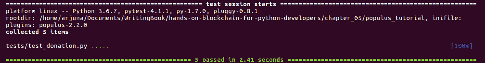

# 五、Populus 开发框架

在本章中，您将学习如何使用 Populus，这是一个智能合约开发框架。与块菌一样，胡杨也是一种工具，旨在让你更容易制定智能合约。如果我们回想一下[第 3 章](03.html)，*使用 Vyper*实现智能合约，您可能还记得我们必须手动创建一个`.json`文件，然后将控制台中的`abi`输出复制到`.json`文件。使用 Populus，您可以避免重复以前执行的手动作业。

本章将探讨以下主题：

*   建立 Populus
*   智能合约单元测试
*   部署与 Populus 的智能合约

# 建立 Populus

Populus 是一个智能合约开发框架，就像块菌一样。那么，我们为什么要用 Populus 而不是块菌呢？基本上，这是个人的选择。Populus 是用 Python 编写的，默认情况下支持用 Python 进行单元测试。如果您使用 Truffle，那么默认情况下您将使用 JavaScript 进行单元测试。这就像选择`web3.py`（Python）或`web3.js`（JavaScript）来构建一个分散的应用。

要设置 Populus，让我们遵循以下步骤：

1.  从头开始创建虚拟环境：

```py
$ virtualenv -p python3.6 populus-venv
$ source populus-venv/bin/activate
```

2.  我们安装了`web3`、`populus`和`vyper`：

```py
(populus-venv) $ pip install eth-abi==1.2.2
(populus-venv) $ pip install eth-typing==1.1.0
(populus-venv) $ pip install py-evm==0.2.0a33
(populus-venv) $ pip install web3==4.7.2
(populus-venv) $ pip install -e git+https://github.com/ethereum/populus#egg=populus
```

The reason why we have to install the specific version of `web3` is because the latest version of `web3` (4.8.2) breaks Populus.

3.  安装 Solidity 编译器：

```py
(populus-venv) $ python
>>> from solc import install_solc
>>> install_solc('v0.4.25')
```

4.  创建符号链接：

```py
(populus-venv) $ ln -s /home/yourusername/.py-solc/solc-v0.4.25/bin/solc populus-venv/bin/
```

5.  创建项目目录：

```py
(populus-venv) $ mkdir populus_tutorial
(populus-venv) $ cd populus_tutorial
```

6.  使用`populus`初始化此项目目录：

```py
(populus_venv) $ populus init
```

此命令类似于`truffle init`。学习`populus`后，您可能不再需要此命令。此命令将在项目目录中放置两个目录-`contracts`和`tests`。

`contracts`内有一个样本坚固性文件：`Greeter.sol`。在`tests`目录中，有一个示例测试文件：`test_greeter.py`。

打开`Greeter.sol`，一个简单的智能合约，如下所示：

```py
pragma solidity ^0.4.0;

contract Greeter {
    string public greeting;

    // TODO: Populus seems to get no bytecode if `internal`
    function Greeter() public {
        greeting = 'Hello';
    }

    function setGreeting(string _greeting) public {
        greeting = _greeting;
    }

    function greet() public constant returns (string) {
        return greeting;
    }
}
```

在编译智能合约之前，您必须创建一个名为`project.json`的项目配置。必须首先输入项目目录：

```py
(populus-venv) $ cp ../populus-
   venv/src/populus/populimg/defaults.v9.config.json project.json
```

`populus-venv`是您创建虚拟环境的地方。如果你看一下，它是一个重要的文件，包含 255 行。可以使用以下命令对其进行编译：

```py
(populus-venv) $ populus compile
```

编译结果为`build/contracts.json`。您可以在该`.json`文件中找到`abi`和`bytecode`。除了`abi`和`bytecode`之外，您还可以在该`.json`文件中找到其他信息，例如编译器版本。

您将已经熟悉智能合约开发的工作流程。编译`Solidity/Vyper`文件，这样我们就可以得到`abi`和`bytecode`。然后，将`abi`和`bytecode`与`web3`库一起使用。

现在，您将遇到一些新情况。还有一个你还没有看到的目录：`tests`目录。在该目录中，有一个名为`test_greeter.py`的测试文件，*是一个单元测试。请看这里：*

```py
def test_greeter(chain):
    greeter, _ = chain.provider.get_or_deploy_contract('Greeter')

    greeting = greeter.call().greet()
    assert greeting == 'Hello'

def test_custom_greeting(chain):
    greeter, _ = chain.provider.get_or_deploy_contract('Greeter')

    set_txn_hash = greeter.transact().setGreeting('Guten Tag')
    chain.wait.for_receipt(set_txn_hash)

    greeting = greeter.call().greet()
    assert greeting == 'Guten Tag'
```

您可以按如下方式执行此测试文件：

```py
(populus-venv) $ py.test tests
```

这将为您提供以下输出：

```py

============================= test session starts ==============================
platform linux -- Python 3.6.6, pytest-3.9.1, py-1.7.0, pluggy-0.8.0
rootdir: /tmp/pop_tut, inifile:
plugins: populus-2.2.0
collected 2 items                                                              

tests/test_greeter.py ..                                                [100%]

=============================== warnings summary ===============================

...

===================== 2 passed, 3 warnings in 0.88 seconds =====================
```

你的考试现在可以通过了。我们将在本章后面更深入地讨论智能合约单元测试。

# 添加对 Vyper 的支持

正如你所知道的，我们在这本书中并没有关注坚固性，而是关注 Vyper。我们需要添加对 Vyper 的支持。首先，由于这是一个新的虚拟环境，请安装`vyper`：

```py
(populus-venv) $ pip install vyper
```

然后，在项目目录中，在`contracts`目录中创建一个名为`Greeter.vy`的`.vy`文件：

```py
greeting: bytes[20]

@public
def __init__():
    self.greeting = "Hello"

@public
def setGreeting(x: bytes[20]):
    self.greeting = x

@public
def greet() -> bytes[20]:
    return self.greeting
```

在编译此 Vyper 代码之前，您需要更改`project.json`文件中的某些内容。

转到`compilation`键。键的值是具有以下键的对象：`backend`、`backends`、`contract_source_dirs`和*`import_remappings`。删除`backends`键，然后将`backend`键更改为以下代码：*

```py
"backend": {
      "class": "populus.compilation.backends.VyperBackend"
},
```

因此，`compilation`键的内容如下：

```py
  "compilation": {
    "backend": {
      "class": "populus.compilation.backends.VyperBackend"
    },
    "contract_source_dirs": [
      "./contracts"
    ],
    "import_remappings": []
  },
```

然后，像往常一样运行编译：

```py
(populus-venv) $ populus compile
```

为了确保它确实是 Vyper 编译而不是 Solidity 编译，您可以打开`build/contracts.json`。在内部，您将能够看到以下内容：

```py
{
  "Greeter": {
    …
    "source_path": "contracts/Greeter.vy"
  }
}
```

The latest version of Vyper is 0.1.0b6 and it breaks Populus. The developer needs some time to fix this. If the bug hasn't yet been fixed while you're reading this book, you could patch Populus yourself.

首先，使用以下命令检查错误是否已修复：

```py
(populus-venv) $ cd populus-venv/src/populus
(populus-venv) $ grep -R "compile(" populus/compilation/backends/vyper.py
 bytecode = '0x' + compiler.compile(code).hex()
 bytecode_runtime = '0x' + compiler.compile(code, bytecode_runtime=True).hex()
```

在我们这里的例子中，这个 bug 还没有被修复。那么，让我们修补 Populus 以修复该漏洞。确保您仍在同一目录中（`populus-venv/src/populus`：

```py
(populus-venv) $ wget https://patch-diff.githubusercontent.com/raw/ethereum/populus/pull/484.patch
(populus-venv) $ git apply 484.patch
(populus-venv) $ cd ../../../
```

我们的 Populus 开发框架现在支持 Vyper。

# 智能合约单元测试

如果运行单元测试，您将收到由于数据类型不正确而导致的错误。这里的解决方案是将所有字符串数据类型更改为字节数据类型。然后，由于存在弃用警告，您应该更改在智能合约中调用方法的方式。

最终，位于`tests/test_greeter.py`的单元测试应该如下所示：

```py
def test_greeter(chain):
    greeter, _ = chain.provider.get_or_deploy_contract('Greeter')

    greeting = greeter.functions.greet().call()
    assert greeting == b'Hello'

def test_custom_greeting(chain):
    greeter, _ = chain.provider.get_or_deploy_contract('Greeter')

    set_txn_hash = greeter.functions.setGreeting(b'Guten Tag').transact()
    chain.wait.for_receipt(set_txn_hash)

    greeting = greeter.functions.greet().call()
    assert greeting == b'Guten Tag'
```

然后，如果您再次运行单元测试，它将是成功的。

让我们来看看第一种方法：

```py
def test_greeter(chain):
    greeter, _ = chain.provider.get_or_deploy_contract('Greeter')

    greeting = greeter.functions.greet().call()
    assert greeting == b'Hello'
```

您的单元测试函数应该在大多数情况下接受`chain`参数。从`chain`对象，您可以获得一个提供者。如果您还记得，提供者是连接到以太坊区块链的对象，无论是通过 HTTP 还是 IPC。从那里，你可以得到合同对象。测试框架是直接从区块链获取契约对象，还是在获取契约之前首先部署契约取决于具体情况。就我们而言，这是后一种选择。测试框架在内存中创建契约对象并与之交互。单元测试之后，一切都消失了。

稍后，您将从永久区块链获取合同对象。来自`provider`对象的`get_or_deploy_contract`返回两个对象。大多数时候，你只需要关注第一个，合同对象。

从`contract`对象开始，您应该熟悉智能合约上的方法的执行。要执行`public`方法或获取公共变量的值，可以使用`functions`，然后是方法或公共变量加上`()`并以`call()`结尾。

在执行 public 方法之后，您将获得返回值。在本例中，您得到的是一个`byte`对象，与 Solidity 示例中的`string`不同。在 Vyper 中，不支持第一类字符串。字符串存储为`byte`对象。Vyper 仍处于活动开发模式，但预计将来会发生变化。

在第二个单元测试中，您将测试智能合约中的一个方法来更改变量的状态：

```py
def test_custom_greeting(chain):
    greeter, _ = chain.provider.get_or_deploy_contract('Greeter')

    set_txn_hash = greeter.functions.setGreeting(b'Guten Tag').transact()
    chain.wait.for_receipt(set_txn_hash)

    greeting = greeter.functions.greet().call()
    assert greeting == b'Guten Tag'
```

所有内容都与第一个单元测试相同，只是中间有两行新代码：

```py
set_txn_hash = greeter.functions.setGreeting(b'Guten Tag').transact()
chain.wait.for_receipt(set_txn_hash)
```

这是使用事务的方法。请记住，事务是指涉及更改合同状态的任何事情。您调用`functions`，然后是将更改契约状态的方法，该方法将增加`()`，以包含必要参数的`transact()`结尾。之后，使用`chain`对象，等待事务完成。在测试过程中，速度非常快。但是如果你在另一个以太坊区块链上测试这个，比如在 Rinkeby 网络中，交易可能会持续几分钟。

让我们看一个更复杂的例子。还记得您在[第 3 章](03.html)*中所写的捐赠智能合约吗？*使用 Vyper*实现智能合约。我们为什么不测试该智能合约？*

让我们将捐赠智能合约保存在您在[第三章](03.html)*中开发的源代码文件夹中，使用 Vyper*实现智能合约。您可以将代码保存在`contracts/donation.vy`中。如果您忘记了这一点，您可以参考以下 GitLab 链接上的代码文件以获取完整代码，[https://gitlab.com/arjunaskykok/hands-on-blockchain-for-python-developers/blob/master/chapter_05/populus_tutorial/contracts/Donation.vy](https://gitlab.com/arjunaskykok/hands-on-blockchain-for-python-developers/blob/master/chapter_05/populus_tutorial/contracts/Donation.vy) ：

```py
struct DonaturDetail:
    sum: uint256(wei)
    name: bytes[100]
    time: timestamp

donatur_details: public(map(address, DonaturDetail))

donaturs: public(address[10])

donatee: public(address)

index: int128

...
...

@public
def withdraw_donation():
    assert msg.sender == self.donatee

    send(self.donatee, self.balance)

```

我们想在这里测试一些不同的东西。

首先，让我们看看构造函数方法：

```py
@public
def __init__():
    self.donatee = msg.sender
```

我们想测试`donatee`变量是否包含启动智能合约的帐户地址。

让我们编写第一个单元测试。您可以在`tests/test_donation.py`中保存此单元测试：

```py
def test_donatee(web3, chain):
    donation, _ = chain.provider.get_or_deploy_contract('Donation')

    donatee = donation.functions.donatee().call()
    assert donatee == web3.eth.coinbase
```

在这个单元测试中，我们使用双参数版本，因为我们想要得到`web3`对象。实际上，切换参数的顺序并不重要。`def test_donatee(web3, chain):`与`def test_donatee(chain, web3):`相同。

`get_or_deploy_contract`中的参数取自`.vy`文件的名称。因此，命名源代码文件名时要小心。

有一件事是新的（但不是真的新的，因为你已经在[第 4 章](04.html)中遇到过，*使用 Web3 与智能合约交互，*是`web3.eth.coinbase`，这是默认帐户。在这个上下文（单元测试）中，它意味着启动智能合约的帐户的地址。

如果此单元测试成功，让我们继续测试此智能合约中的另一种方法：

```py
@payable
@public
def donate(name: bytes[100]):
    assert msg.value >= as_wei_value(1, "ether")
    assert self.index < 10

    self.donatur_details[msg.sender] = DonaturDetail({
                                         sum: msg.value,
                                         name: name,
                                         time: block.timestamp
                                       })

    self.donaturs[self.index] = msg.sender
    self.index += 1
```

在此方法中，您必须向智能合约发送至少 1 个以太。

让我们通过编写第二个单元测试来测试失败案例：

```py
def test_donate_less_than_1_eth(web3, chain):
    donation, _ = chain.provider.get_or_deploy_contract('Donation')

    with pytest.raises(eth_tester.exceptions.TransactionFailed):
        donation.transact({'value': web3.toWei('0.8', 'ether')}).donate(b'Taylor Swift')
```

现在，您需要添加两个`import`语句：

```py
import pytest
import eth_tester
```

让我们学习如何在这个单元测试中处理异常。您可以将有问题的事务放入将捕获异常的`with`语句中。基本上，您希望事务失败。当程序中出现故障时，它会返回一个特殊代码（例如，-1）或引发异常。在本例中，它抛出一个异常。

运行测试以查看它是否工作。然后，让我们测试成功案例，这意味着接受捐赠（完整代码请参阅以下 GitLab 链接中的代码文件：[https://gitlab.com/arjunaskykok/hands-on-blockchain-for-python-developers/blob/master/chapter_05/populus_tutorial/tests/test_donation.py](https://gitlab.com/arjunaskykok/hands-on-blockchain-for-python-developers/blob/master/chapter_05/populus_tutorial/tests/test_donation.py) ：

```py
def test_donate_1_eth(web3, chain):
    import time

    donation, _ = chain.provider.get_or_deploy_contract('Donation')

    t = eth_tester.EthereumTester()
    account2 = t.get_accounts()[1]

...
...

    assert donatur == account2
    assert donation_sum == web3.toWei('1', 'ether')
    assert donation_name == donatur_name
    assert (int(time.time()) - donation_time) < 600 # could be flaky

    assert web3.eth.getBalance(donation.address) == web3.toWei('1', 'ether')
```

这有很多东西需要消化，所以让我们一步一步地讨论。

```py
import time
```

我们将在稍后的单元测试中使用`time`库来检查时间戳：

```py
donation, _ = chain.provider.get_or_deploy_contract('Donation')
```

你已经知道这句话了。使用`chain`对象，您可以获得提供者，然后使用该提供者的`get_or_deploy_contract`方法。结果是一个捐赠智能合约对象：

```py
t = eth_tester.EthereumTester()
account2 = t.get_accounts()[1]
```

`eth_tester`是一个库，旨在让您更轻松地测试智能合约。为此，您创建了一个对象`EthereumTester`。此库中有许多辅助函数。他们中的一个会给你一些有很多 ETH 的账户，有点像 Ganache。第一个帐户是经理帐户或启动智能合约的帐户。如前所述，您也可以从`web3.eth.coinbase`获取该帐户。第二个帐户等都是可以在单元测试中使用的测试帐户。

`t.get_accounts()`给了你很多账户。但是，不要使用第一个帐户，因为那将是经理帐户。在这里，您使用第二个帐户：

```py
    donatur_name = b'Taylor Swift'
    set_txn_hash = donation.functions.donate(donatur_name).transact({'from': account2, 'value': web3.toWei('1', 'ether')})
    chain.wait.for_receipt(set_txn_hash)
```

您已经在前面的单元测试中看到了`transact`函数，它使用了 greeter 智能合约。在此`transact`方法中，您可以指定要发送到智能合约的乙醚量。您也可以使用不同的帐户。在这些`transact`参数中，我们还使用了辅助函数`web3.toWei`。否则，你必须使用一个有很多零的数字。然后，等待确认交易：

```py
donatur = donation.functions.donaturs(0).call()
donation_sum = donation.functions.donatur_details__sum(donatur).call()
donation_name = donation.functions.donatur_details__name(donatur).call()
donation_time = donation.functions.donatur_details__time(donatur).call()
```

完成此操作后，您可以访问公共变量以确认状态的更改。

对于数组，在数组方法中放置索引，如`donation.functions.donaturs(0).call()`中所示。

对于映射，不是整数索引，而是在映射方法的参数内提供键，如`donation.functions.donatur_details__sum(donatur).call()`所示。

对于结构，您可以通过添加两个下划线来访问成员，如`donation.functions.donatur_details__sum(donatur).call(`*中所示。*

 *然后，我们通过断言所有这些变量来测试捐赠，如下所示：

```py
assert donatur == account2
```

然后，我们检查捐赠者地址是否正确记录：

```py
assert donation_sum == web3.toWei('1', 'ether')
```

然后，我们检查捐赠金额是否正确记录：

```py
assert donation_name == donatur_name
```

然后，我们检查捐赠者的姓名是否正确记录：

```py
assert (int(time.time()) - donation_time) < 600 # could be flaky
```

然后我们检查捐赠发生的时间。我们这样做是因为在区块链中确认交易时会记录时间，因此您永远不知道交易何时被确认。在我们的情况下，它会很快。然而，如果你在林克比网络中测试它，那是需要记住的。在这里，我确保单元测试时间和智能合约中记录的时间戳之间的差异不会超过 10 分钟（600 秒）。

然后，我们直接从智能合同的余额中检查捐赠金额：

```py
assert web3.eth.getBalance(donation.address) == web3.toWei('1', 'ether')
```

这与上一个测试不同，在上一个测试中，您通过检查公共变量的值来测试余额。在我们的情况下，我们有很多捐款，所以他们会有所不同。

让我们来看看智能合同中的最后一个方法：

```py
@public
 def withdraw_donation():
     assert msg.sender == self.donatee

     send(self.donatee, self.balance)
```

这是撤回捐赠的方法。不要笑；一些人启动了一个智能合约，没有办法收回其中的以太。这些智能合约中的所有以太都被永久锁定，这就是为什么测试非常重要。它确保你不会犯这样愚蠢的错误。

在此提取方法中，您希望测试您是否可以在智能合约中提取以太网。然后，您需要确保只有某个帐户（在本例中是 manager 帐户）能够从智能合约中提取以太网。

让我们为此创建一个单元测试。首先，我们创建一个单元测试，以确保其他帐户不能从智能合约中提取以太网：

```py
def test_other_account_could_not_withdraw_money(web3, chain):
    donation, _ = chain.provider.get_or_deploy_contract('Donation')

    t = eth_tester.EthereumTester()
    account2 = t.get_accounts()[1]

    donatur_name = b'Taylor Swift'
    set_txn_hash = donation.functions.donate(donatur_name).transact({'from': account2, 'value': web3.toWei('1', 'ether')})
    chain.wait.for_receipt(set_txn_hash)

    with pytest.raises(eth_tester.exceptions.TransactionFailed):
        donation.functions.withdraw_donation().transact({'from': account2})
```

你现在应该对一切都很熟悉了。在捕获异常的`with`语句中封装了提取以太网的失败案例。

现在，让我们测试一个成功案例，即 manager 帐户确实可以将以太提取到其帐户中：

```py
def test_manager_account_could_withdraw_money(web3, chain):
     donation, _ = chain.provider.get_or_deploy_contract('Donation')

     t = eth_tester.EthereumTester()
     account2 = t.get_accounts()[1]

     donatur_name = b'Taylor Swift'
     set_txn_hash = donation.functions.donate(donatur_name).transact({'from': account2, 'value': web3.toWei('1', 'ether')})
     chain.wait.for_receipt(set_txn_hash)

     initial_balance = web3.eth.getBalance(web3.eth.coinbase)
     set_txn_hash = donation.functions.withdraw_donation().transact({'from': web3.eth.coinbase})
     chain.wait.for_receipt(set_txn_hash)

     after_withdraw_balance = web3.eth.getBalance(web3.eth.coinbase)

     assert abs((after_withdraw_balance - initial_balance) - web3.toWei('1', 'ether')) < web3.toWei('10', 'gwei')
```

这里的一切你都会很熟悉，除了最后一行。提现后经理账户余额减去`initial_balance`后不完全是`1``ether`，因为经理账户需要支付费用。在这种情况下，我们只是使用一个粗略的衡量，以确保撤回是成功的。只要差值低于 10 gwei，就可以了。Gwei 是我们用来计算发送交易费用的货币。1 gwei 等于 100000000 wei。如果您发现这一点令人困惑，可以使用以太币进行断言，如下所示：

```py
assert abs((after_withdraw_balance - initial_balance) - web3.toWei('1', 'ether')) < web3.toWei('0.00000001', 'ether')
```

运行测试：

```py
(populus-venv) $ py.test tests/test_donation.py
```

你应该得到一个成功的结果：



# 在构造函数中使用参数

我们测试的两个智能合约在构造函数中都没有参数。但是，如果我们编写一个智能合约，在构造函数中包含参数呢？我们如何测试它？

让我们编写一个在构造函数中包含参数的简单智能合约。命名为`contracts/Greeter2.vy`：

```py
greeting: bytes[20]

@public
def __init__(greeting_param: bytes[20]):
    self.greeting = greeting_param

@public
def setGreeting(x: bytes[20]):
    self.greeting = x

@public
def greet() -> bytes[20]:
    return self.greeting
```

然后，编写以下测试。命名为`tests/test_greeter2.py`：

```py
import pytest

@pytest.fixture()
def greeter2_contract(chain):
    Greeter2Factory = chain.provider.get_contract_factory('Greeter2')
    deploy_txn_hash = Greeter2Factory.constructor(b'Hola').transact()
    contract_address = chain.wait.for_contract_address(deploy_txn_hash)
    return Greeter2Factory(address=contract_address)

def test_greeter2(greeter2_contract):
    greeting2 = greeter2_contract.functions.greet().call()
    assert greeting2 == b'Hola'
```

在这里，您可以使用`pytest`中的`fixture`功能自定义智能合约的部署。首先，你从连锁店的供应商那里得到合同工厂，然后你把你的论点放在`factory`对象的`constructor`方法中，以`transact()`方法结束。然后，等待它部署到区块链上。最后，您将收到地址。

在测试函数中，将参数与 fixture 函数的名称完全相同。这里，我们的 fixture 函数是`greeter2_contract`。在测试函数中，您只需将此对象用作智能合约对象，类似于`chain.provider.get_or_deploy_contract('Donation')`返回的对象。

现在，按如下方式进行测试：

```py
(populus-venv) $ py.test tests/test_greeter2.py
```

你应该得到一个成功的结果：


还有很多东西你可以测试。我们只测试一项捐赠，但我们最多可以接受 10 项捐赠。这也应该检查。您希望测试覆盖的完整程度取决于您和项目的要求。还有很多单元测试方面我们没有在这里讨论，比如设置、拆卸和测试驱动开发。

# 部署与 Populus 的智能合约

Populus 不仅仅是一个设计用于轻松开发和测试智能合约的框架。它有一个将智能合约部署到区块链（包括私有链）的工具。

私有链基本上是您的私有以太坊区块链，类似于 Ganache，只是您自己构建它。这就像 Rinkeby 网络中的区块链，但你是唯一的矿工。您可以使用 geth 软件手动创建私有区块链；`populus`只是让你更容易。

新建私有`chain`的命令如下：

```py
(populus-venv) $ populus chain new localblock
```

此命令将在项目目录中创建一些文件。所有生成的文件都位于`chains`目录中。生成的文件之一是`chains/localblock/genesis.json`。genesis 文件的目的是规定以太坊区块链的初始配置：

```py
{
  "parentHash": "0x0000000000000000000000000000000000000000000000000000000000000000",
  "coinbase": "0xcb22827ab291b3094076de25d583c49b902a5606",
  "extraData": "0x686f727365",
  "config": {
    "daoForkBlock": 0,
    "daoForSupport": true,
    "homesteadBlock": 0
  },
  "timestamp": "0x0",
  "mixhash": "0x0000000000000000000000000000000000000000000000000000000000000000",
  "nonce": "0xdeadbeefdeadbeef",
  "alloc": {
    "0xcb22827ab291b3094076de25d583c49b902a5606":{
      "balance": "1000000000000000000000000000000"
    }
  },
  "gasLimit": "0x47d5cc",
  "difficulty": "0x01"
}
```

你不需要知道这些钥匙的所有含义。`coinbase`意味着所有采矿奖励都应该进入这个账户。`alloc`指账户的初始余额。

除 genesis 文件外，您还应获得`chains/localblock/init_chain.sh`。打开它，您应该具有以下内容：

```py
#!/bin/sh
geth --rpc --rpcaddr 127.0.0.1 --rpcport 8545 --rpcapi admin,debug,eth,miner,net,personal,shh,txpool,web3,ws --ws --wsaddr 127.0.0.1 --wsport 8546 --wsapi admin,debug,eth,miner,net,personal,shh,txpool,web3,ws --datadir /home/yourusername/populus_tutorial/chains/localblock/chain_data --maxpeers 0 --networkid 1234 --port 30303 --ipcpath /home/yourusername/populus_tutorial/chains/localblock/chain_data/geth.ipc --nodiscover --mine --minerthreads 1 init /home/yourusername/populus_tutorial/chains/localblock/genesis.json
```

这个脚本基本上运行带有特定参数的 geth 软件。最重要的参数是`init`，您可以将其输入到`genesis.json`文件中。然后，运行私有区块链的初始化：

```py
(populus-venv) $ ./chains/localblock/init_chain.sh
```

然后，打开`chains/localblock/run_chain.sh`文件，您应该有以下内容：

```py
#!/bin/sh
geth --rpc --rpcaddr 127.0.0.1 --rpcport 8545 --rpcapi admin,debug,eth,miner,net,personal,shh,txpool,web3,ws --ws --wsaddr 127.0.0.1 --wsport 8546 --wsapi admin,debug,eth,miner,net,personal,shh,txpool,web3,ws --datadir /home/yourusername/populus_tutorial/chains/localblock/chain_data --maxpeers 0 --networkid 1234 --port 30303 --ipcpath /home/yourusername/populus_tutorial/chains/localblock/chain_data/geth.ipc --unlock 0xcb22827ab291b3094076de25d583c49b902a5606 --password /home/yourusername/populus_tutorial/chains/localblock/password --nodiscover --mine --minerthreads 1
```

您现在需要注意的重要标志是`--mine`、`--password`、`--ipcpath`、`--unlock`和`--datadir`。`--mine`表示您要在此私有区块链中挖掘，`--password`是密码文件的位置，`--unlock`用密码文件解锁账户，`--datadir`是您的私有以太坊区块链目录的位置，`--ipcpath`是您的`geth.ipc`所在的位置将在您运行私有以太坊区块链时找到。

在运行区块链之前，编辑`chains/localblock/run_chain.sh`脚本*，*将`--ipcpath`标志的值更改为`/tmp/geth.ipc`，然后运行区块链：

```py
(populus-venv) $ ./chains/localblock/run_chain.sh
```

现在，编辑`project.json`文件。`chains`键有一个对象，该对象有四个键：`tester`、`temp`、`ropsten`和`mainnet`。添加`localblock`键及其在此对象中的值。因此，`localblock`键必须与`tester`、`mainnet`、`temp`和`ropsten`键相邻，如下代码块所示：

```py
     "localblock": {
       "chain": {
         "class": "populus.chain.ExternalChain"
       },
       "web3": {
         "provider": {
           "class": "web3.providers.ipc.IPCProvider",
         "settings": {
           "ipc_path":"/tmp/geth.ipc"
         }
        }
       },
       "contracts": {
         "backends": {
           "JSONFile": {"$ref": "contracts.backends.JSONFile"},
           "ProjectContracts": {
             "$ref": "contracts.backends.ProjectContracts"
           }
         }
       }
     }
```

然后，您可以将您的智能合约部署到您的私有区块链，如下所示：

```py
(populus_venv) $ populus deploy --chain localblock Donation
> Found 2 contract source files
  - contracts/Donation.vy
  - contracts/Greeter.vy
> Compiled 2 contracts
  - contracts/Donation.vy:Donation
  - contracts/Greeter.vy:Greeter
Beginning contract deployment. Deploying 1 total contracts (1 Specified, 0 because of library dependencies).

Donation
Deploying Donation
Deploy Transaction Sent: b'v\xc4`\x06h\x17\xf6\x10\xd7\xb2\x7f\xc6\x94\xeb\x91n\xae?]-\xf43\xb8F\xdc=}\xb33\x03|\xd4'
Waiting for confirmation...

Transaction Mined
=================
Tx Hash : b'v\xc4`\x06h\x17\xf6\x10\xd7\xb2\x7f\xc6\x94\xeb\x91n\xae?]-\xf43\xb8F\xdc=}\xb33\x03|\xd4'
Address : 0xab3B30CFeC1D50DCb0a13671D09d55e63b7cFf40
Gas Provided : 467715
Gas Used : 367715

Verified contract bytecode @ 0xab3B30CFeC1D50DCb0a13671D09d55e63b7cFf40
Deployment Successful.
```

然后，您可以像在[第 4 章](04.html)*中那样玩转您的智能合约，使用 Web3*与智能合约交互。您可以在以下 GitLab 链接中参考代码文件：[https://gitlab.com/arjunaskykok/hands-on-blockchain-for-python-developers/blob/master/chapter_05/populus_tutorial/interact_smart_contract_in_private_chain.py](https://gitlab.com/arjunaskykok/hands-on-blockchain-for-python-developers/blob/master/chapter_05/populus_tutorial/interact_smart_contract_in_private_chain.py) ，对于以下代码块的完整代码：

```py
>>> from web3 import Web3, IPCProvider
>>> w3 = Web3(IPCProvider(ipc_path="/tmp/geth.ipc"))
>>> w3.eth.coinbase
'0xcB22827aB291b3094076DE25D583C49b902a5606'
>>> w3.eth.getBalance(w3.eth.coinbase)
1000000011875000000000000000000
>>> address = "0xab3B30CFeC1D50DCb0a13671D09d55e63b7cFf40"
>>> false = False
>>> true = True
>>> abi = [
...
...
>>> donation = w3.eth.contract(address=address, abi=abi)
>>> donation.functions.donatee().call()
'0xcB22827aB291b3094076DE25D583C49b902a5606'
```

你还依恋着加纳什吗？如果是这样，我们可以部署到 Ganache 区块链。首先启动 Ganache，然后将此内容添加到`projects.json`文件中的`chains`键对象：

```py
     "ganache": {
       "chain": {
         "class": "populus.chain.ExternalChain"
       },
       "web3": {
         "provider": {
           "class": "web3.providers.HTTPProvider",
           "settings": {
             "endpoint_uri": "http://localhost:7545"
           }
         }
       },
       "contracts": {
         "backends": {
           "JSONFile": {"$ref": "contracts.backends.JSONFile"},
           "ProjectContracts": {
             "$ref": "contracts.backends.ProjectContracts"
           }
         }
       }
     }
```

按如下方式运行部署：

```py
(populus_venv) $ populus deploy --chain ganache Donation
> Found 2 contract source files
  - contracts/Donation.vy
  - contracts/Greeter.vy
> Compiled 2 contracts
  - contracts/Donation.vy:Donation
  - contracts/Greeter.vy:Greeter
Beginning contract deployment. Deploying 1 total contracts (1 Specified, 0 because of library dependencies).

Donation
Deploying Donation
Deploy Transaction Sent: b'\xd4\xeb,{\xa0d\n\xb2\xb0\xb2\x1b\x18\xdd \xa1A\x89\xea`\xa8b?A\x14L\x99\xd1rR4\xc7\xfa'
Waiting for confirmation...

Transaction Mined
=================
Tx Hash : b'\xd4\xeb,{\xa0d\n\xb2\xb0\xb2\x1b\x18\xdd \xa1A\x89\xea`\xa8b?A\x14L\x99\xd1rR4\xc7\xfa'
Address : 0x9Dc44aa8d05c86388E647F954D00CaA858837804
Gas Provided : 467715
Gas Used : 367715

Verified contract bytecode @ 0x9Dc44aa8d05c86388E647F954D00CaA858837804
Deployment Successful.
```

然后，当你想在 Ganache 玩你的智能合约时，你只需要调整提供者，正如你在[第 4 章](04.html)、*使用 Web3 与智能合约交互：*中所学到的那样

```py
 >>> from web3 import Web3, HTTPProvider
 >>> w3 = Web3(HTTPProvider('http://localhost:7545'))
```

代码的其余部分是相同的。您可以将脚本命名为`interact_smart_contract_in_ganache.py`。在 Ganache 中，coinbase 帐户和 manager 帐户是 Ganache 中的第一个帐户。有关与 Ganache 中的智能合约交互的完整代码，请参考 GitLab 链接，[https://gitlab.com/arjunaskykok/hands-on-blockchain-for-python-developers/blob/master/chapter_05/populus_tutorial/interact_smart_contract_in_ganache.py](https://gitlab.com/arjunaskykok/hands-on-blockchain-for-python-developers/blob/master/chapter_05/populus_tutorial/interact_smart_contract_in_ganache.py) ：

```py
from web3 import Web3, HTTPProvider
w3 = Web3(HTTPProvider("http://localhost:7545"))

print(w3.eth.coinbase)
print(w3.eth.getBalance(w3.eth.coinbase))

# Change this address to your smart contract address
address = "0x9Dc44aa8d05c86388E647F954D00CaA858837804"
false = False
true = True
abi = [
...
...
donation = w3.eth.contract(address=address, abi=abi)
print(donation.functions.donatee().call())
```

# 总结

在本章中，您学习了如何使用 Populus 开发框架开发智能合约。Populus 没有配备 Vyper 支持，只有坚固性。因此，您需要通过安装 Vyper 和编辑 Populus 项目配置文件来添加 Vyper 支持。您还学习了如何为智能合约创建单元测试。在这个单元测试中，您使用`web3`对象与智能合约交互，并以编程方式对其进行测试。在此之后，您学习了如何创建私有链。最后，您为这个私有链和 Ganache 部署了一个智能合约。

在下一章中，您将在比捐赠智能合约更复杂的区块链上构建一个应用。此应用是投票去中心应用。***