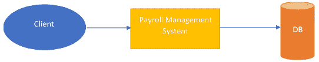
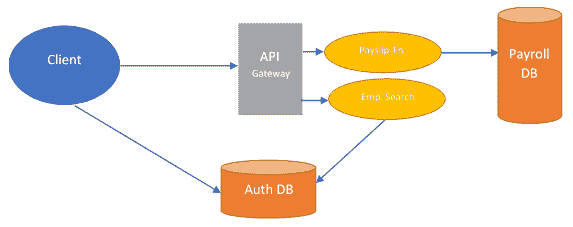

# 十三、无服务器

正如我们到目前为止所探索的，微服务提供了一种很好的替代体系结构，我们可以用它来处理应用开发场景。微服务具有更快的发布周期、易于启动的新功能和高可扩展性等优点，是开发人员引人注目的选择。但所有这些微服务仍然在基于服务器的环境中运行。

在基于服务器的环境中运行对于应用的响应时间非常有用，因为总有一个服务准备好接受传入的请求。但有一个缺点：如果没有用户，应用将继续消耗系统资源。

最近，应用开发人员开始向一种新的应用开发方法迈进。这种开发方法侧重于事件驱动的应用，并根据某些事件的发生启动操作。这些类型的应用称为无服务器应用，因为它们在没有用户时不会继续运行，并且只有在发生某些事件时才会启动它们的实例。

在本章中，我们将了解这种无服务器的应用开发方法，以及它是如何改变开发场景的。

作为本章的读者，您将了解以下内容：

*   应用开发的无服务器方法
*   为无服务器体系结构提供动力的过程
*   构建无服务器应用
*   无服务器方法的好处

# 技术要求

本书中的代码清单可在[的`chapter13`目录下找到 https://github.com/PacktPublishing/Hands-On-Enterprise-Application-Development-with-Python](https://github.com/PacktPublishing/Hands-On-Enterprise-Application-Development-with-Python) [。](https://github.com/PacktPublishing/Hands-On-Enterprise-Application-Development-with-Python)

可以通过运行以下命令克隆代码示例：

```py
git clone https://github.com/PacktPublishing/Hands-On-Enterprise-Application-Development-with-Python
```

此外，为了成功执行代码，还需要一些额外的软件：

*   **Docker**：Docker 是运行 OpenWhisk 软件平台的依赖项，用于部署无服务器应用。要在您的平台上安装`docker`，请看[https://docs.docker.com/install/](https://docs.docker.com/install/) 。

*   **ApacheOpenWhisk**：ApacheOpenWhisk 为。。。

# 应用开发的无服务器方法

近年来，作为开发人员，我们已经习惯了在生产基础设施上构建应用和处理其部署的传统方法。在这种传统架构中，我们开发了应用，其中应用接收来自**客户端**的请求，检查**客户端**是否有权执行该操作，然后继续执行该操作。

开发应用后，我们将其部署在与我们的应用兼容的平台上。这涉及到操作系统的选择，该平台将运行的基础设施的类型，例如裸机服务器、VM 或容器，然后我们通过处理其可伸缩性和修复任何可能出现的问题来维护基础设施。例如，管理组织内部员工工资单的简单系统如下所示：



在这种情况下，应用将继续在服务器上运行，等待请求的到来，并在请求到达时对其执行操作。

这种方法虽然非常有用，但通常会将开发人员从编写逻辑以实现系统特定结果的主要任务中拉出来，并使他们将注意力集中在许多涉及基础设施管理和可伸缩性的任务的领域。

现在设想一种架构，它允许开发人员只关注编写特定业务流程背后的逻辑，而不必担心逻辑将在何处执行以及如何扩展。

构建应用的无服务器方法提供了这些功能。在 serverless 中，这一工作方式是通过将两种新技术引入到应用开发中：

*   **后端即服务**（**BaaS**）：BaaS 是一款全新的云计算产品，为应用开发者提供通过 API 将其应用与后端服务链接的功能，从而提供一些常用的功能集，如用户认证、数据存储等。它不同于应用开发的一般体系结构，因为后端提供的这些服务可能不需要由应用开发人员自己开发，但通过使用这些服务公开的 API 可以访问这些服务。
*   **作为服务的功能**（**FaaS**）：FaaS 是云计算的另一个类别，它允许开发人员专注于编写应用逻辑，而不必担心该逻辑将在何处执行。在 FaaS 中，应用以无状态和短暂的方式运行，其中它们可能正在执行的基础结构可能仅对少数调用有效，而这些调用可能与单个调用一样小。

在应用开发的无服务器体系结构中，应用通常作为对特定事件的响应而执行的函数进行开发。这些函数在它们自己的无状态容器中执行，这些容器可能只存在于基础结构中，只进行少数调用。在本章后面的章节中，我们将了解无服务器应用是如何工作的。为了快速参考，如果我们必须将工资系统作为一个无服务器应用来实现；下图显示了系统架构的外观：



如我们所见，我们的无服务器工资单应用既包含 BaaS 产品的功能，**客户端**通过**Auth DB**和**工资单**生成公开的 API 直接与**Auth DB**交互，员工搜索在 FaaS 产品中运行，它们存储为函数，仅在特定事件发生时执行。

这两个函数都不维护任何类型的状态，因此它们可以在可能只持续很短时间的临时容器中运行。

现在，让我们来看看支持无服务器架构的组件，以及无服务器架构如何更好地理解我们如何开发最能利用无服务器架构的应用。

# 无服务器体系结构的组件

正如我们所看到的，无服务器体系结构为我们提供了一种开发应用的方法，在这种方法中，我们只负责编写应用背后的逻辑，并且消除了我们对如何管理基础结构以运行应用以及应用如何根据请求数量进行上下扩展的担忧。

但这种架构的动力是什么？让我们试着花一些时间来看看体系结构中的不同组件是如何工作的，从而为应用开发提供一种无服务器的开发方法。

如前所述，应用开发的无服务器方法是通过使用两种已经存在的技术实现的。。。

# 后端即服务

我们开发的大多数应用都有一组共同的功能。这些功能可以包括用户认证数据库的实现、提供文件的存储和检索方式，或者通过使用电子邮件或推送通知发送通知。

大多数情况下，这些功能都是通过在应用中引入新组件而内置到应用中的，其他组件可以与之交互。基于微服务的应用也是如此，在这些应用中实现了这些功能，因为不同的微服务和其他微服务与这些服务交互以实现特定的结果。

在 BaaS 方法中，我们通过使用第三方云提供商来集成这些功能，从而将这些功能与应用分离。在这种情况下，我们的应用通常通过使用第三方提供商提供的 API 来集成这些功能。

为了更好地理解这一点，让我们来看看前面介绍过的无服务器工资管理系统。在这个系统中，我们利用第三方提供的 BaaS 服务，使用户身份验证成为应用中一个脱节的部分。

在这种方法中，我们的用户身份验证系统以及与之相关的任何数据都由第三方提供商管理。该提供者公开了服务的一些 API，我们可以使用这些 API 将服务与应用集成。

在我们的示例中，我们通过使用服务公开的 API 向客户机公开了部分用户身份验证服务。这允许客户端直接使用服务执行用户身份验证，而无需通过应用的整个后端。我们使用 BaaS 服务的第二个地方是，我们将员工搜索功能与用户身份验证服务相链接，以根据某些标准检索特定员工。

BaaS 的这一概念为我们提供了几个优势，例如：

*   **缩短了开发时间：**有了 BAA，应用的开发人员不必担心通用功能集的开发，他们可以使用服务提供商提供的 API 直接从第三方服务提供商处使用这些功能集。
*   **易操作性：**由于与服务相关的服务和基础设施仅由云计算提供商管理，这降低了管理服务及其提供的操作的复杂性，从而减少了操作上的麻烦。
*   **易扩展性：**云计算提供商提供的服务由云计算提供商直接管理，易于扩展，目前仅由云计算提供商完成。
*   **集成的灵活性：**提供商提供的服务通常通过使用 API 进行集成。如果服务集成所需的 API 可用于所提供的平台，则平台可以轻松地与服务集成，而无需担心集成背后的复杂性，从而允许在不同类型的应用中提供支持。

# 服务功能

FaaS 是一个有趣的概念，也是支持无服务器体系结构的主要技术之一。在这种方法中，我们开发后端代码，而不必担心代码将如何部署以及在何处执行。

面向 FaaS 的应用与任何其他不需要任何特殊框架来开发和执行的应用一样。FaaS 应用与部署在服务器上的常规应用之间的唯一区别在于，FaaS 应用在维护其状态和可执行时间方面存在严重限制。所以，让我们深入研究一下这两个主要方面。

# 对国家管理的限制

在 FaaS 模型中，应用的不同部分构建为单独的函数，其中每个函数在某个事件发生时执行。在部署应用时，云提供商将自动管理应用运行的基础设施以及应用的扩展方式。

与部署后启动服务器进程并准备接受传入连接的传统应用相比，基于 FaaS 的应用是作为对特定输入的响应而动态启动的。一旦事件发生，函数将启动并执行，等待一段时间，然后终止函数正在执行的实例。现在，这使得这个过程有点有趣，因为函数在基础结构中的时间是有限的，并且不能保证函数的同一个实例也会处理下一个调用。

这使得状态管理（即当前正在执行的操作的本地数据管理）成为基于 FaaS 的产品中的一项挑战性任务，这严重限制了我们在函数实例执行时可以在其中存储的本地数据。

为了处理这种情况，我们依赖于能够为我们存储状态数据的外部产品。这可能包括使用外部数据库或缓存服务器，在这些服务器上可以保存数据以供将来参考。

# 对执行时间的限制

一旦函数在 FaaS 产品中开始执行，它完成执行所需的时间就很有限。大多数著名的云服务提供商都对其基础设施设置了 FaaS 产品中的功能可以执行的时间限制。例如，如果我们选择 AWS 最著名的 FaaS 产品 AWS Lambda，则函数可以执行的最长持续时间限制为五分钟。其他供应商的限制可能略有不同，但不会太高。

现在，对于我们这些应用开发人员来说，这是一个有趣的案例。如果我们试图将其中一个应用组件实现为一个函数可能需要很长时间。。。

# 在 FaaS 内部执行函数

一旦我们以函数的形式开发了应用，我们就需要一个地方来托管和运行它。这些功能的托管位置由云服务提供商提供。现在，一旦我们成功地托管了这些函数并实现了特定函数应该何时执行的规则，云提供商就有责任处理这些函数的正确执行。

现在，当必须执行这些函数时，云提供商将确定执行特定函数所需的正确环境。一旦确定了这个环境，云提供者就会启动一个临时容器，函数代码就驻留在其中。此容器为函数提供了与环境中可能正在执行的其他函数的完全隔离。现在，一旦容器成功启动，这个函数就会执行，并提供一个响应。

一旦函数完成执行，有趣的部分就会发生。一旦函数完成执行，云提供程序可以终止运行该函数的容器实例，也可以使其保持活动状态以处理较新的请求。大多数情况下，决策是根据到达的请求的频率和用户设置的策略类型做出的。

如果函数实例仍在运行和等待，则新传入的请求可能仅重定向到该实例，而如果没有理想的函数实例在运行，云提供商将启动新实例并将请求重定向到该实例。

这样，我们就很好地了解了 FaaS 在无服务器体系结构中是如何工作的，以及它如何使我们能够开发无服务器应用。但这些功能实际上是如何触发的呢？这就引出了组成无服务器产品的另一个重要组件。让我们来看看它是什么。

# 无服务器体系结构中的 API 网关

在[第 11 章](11.html)中*采用微服务方法*h，当我们了解微服务的概念时，我们了解了 API 网关以及它们如何帮助微服务的开发。这些 API 网关在基于无服务器体系结构的应用开发中也起着重要作用。

API 网关只不过是 HTTP 服务器，它嵌入了有关应用的某些 API 端点的信息，并将这些端点与一些处理程序相关联。一旦向某个 API 端点发出请求，就会调用与该 API 端点关联的处理程序来处理该请求。

在无服务器体系结构中，与特定 API 端点关联的处理程序。。。

# 了解无服务器应用的执行

到目前为止，我们已经了解到无服务器应用是以函数的形式构建的，这些函数根据某个事件的发生来执行。此外，这些函数不会永远保持活动状态。相反，这些功能会随着需求的出现而执行。那么，当请求传入时，提供者如何处理这些函数的执行？让我们看一看。

# 冷启动功能

当新部署应用时，很容易想象没有当前正在执行的函数实例。当一个新的请求出现时，它要求我们在基础设施上部署的功能提供功能。现在，云提供商系统会被通知，没有可以处理传入请求的正在运行的函数实例。

一旦提供者系统意识到这种情况，它就会生成一个新实例，其中包含函数代码。此实例现在开始根据请求中提供的参数执行函数，函数生成响应并发送回请求客户端。。。

# 热启动函数

与冷启动完全相反，冷启动需要创建一个新的函数实例并将其带到执行阶段，而热启动则利用已在提供程序的基础结构中运行的函数的现有实例。发生这种情况时，传入请求不必在处理请求之前花费时间等待新实例生成。这样可以快速处理请求。

这里需要注意一件事：即使在函数热启动的情况下，也不会存储函数先前执行的状态。

现在我们知道了函数性能可能依赖的一个主要因素。现在，让我们继续构建我们的第一个无服务器应用。

# 构建我们的第一个无服务器应用

根据我们对无服务器体系结构及其工作原理的基本知识，现在是我们开发第一个无服务器应用的时候了。在本教程中，我们将使用 ApacheOpenWhisk 项目，它将帮助我们在本地开发系统上运行演示应用。所以，让我们看看 Apache OpenWalk 提供给我们什么，以及我们如何利用这个平台来为我们带来好处。

# ApacheOpenWhisk 简介

ApacheOpenWhisk 平台为我们提供了一些特性和功能，允许我们为运行无服务器应用建立自己的平台。项目提供了基于环境中某些事件的触发来执行功能的功能。

这些函数的执行发生在 docker 容器中，OpenWhisk 平台管理这些函数在其中的部署和扩展。

以下是该平台提供的一些功能：

*   **易于使用的工具：**平台提供了许多工具，允许我们轻松打包和移植应用以在 OpenWhisk 平台上运行，但应用遵循平台定义的一组约定除外。
*   **使用容器隔离：**平台通过使用 docker 容器隔离不同的功能，使每个功能在自己的隔离环境中运行，避免任何形式的环境依赖冲突。
*   **对多种语言的支持：**OpenWhisk 平台为我们提供了许多受支持的语言平台，我们可以使用这些平台构建无服务器应用。这还包括使用 GO、C++和 RISE 构建的二进制可执行文件的使用。
*   **内置 API 网关：**OpenWhisk 包自带内置 API 网关，允许我们通过使用 RESTful API 端点轻松集成应用。

所有这些功能使 OpenWhisk 成为运行无服务器应用的绝佳平台，无论是在云端还是在本地开发环境中。

但是，在开始构建应用之前，我们需要在系统上部署 OpenWhisk。要部署项目，请遵循本章开头*技术要求*部分的步骤。

对于演示，我们将构建一个应用，该应用将为我们查询 GitHub API 并检索与我们的用户帐户关联的存储库。

# 建立发展环境

在开始为应用编写代码之前，我们需要有一些依赖项。因此，让我们构建环境，然后继续编写代码，为我们的应用提供动力。

作为第一步，让我们创建一个目录，其中包含与项目相关的所有文件。我们把这个文件夹称为`github_demo`。以下命令为我们将文件夹放置到位：

```py
mkdir github_demo
```

完成目录设置后，让我们进入目录并设置一些内容：

```py
cd github_demo
```

完成后，我们现在可以设置项目了。在开始编写代码之前，让我们先完成虚拟环境的设置，这将有助于我们保持项目依赖项的隔离。。。

# 构建配置文件

在本应用中，我们将使用一个配置文件来存储与用户帐户相关的数据，这将允许我们对`Github`API 进行身份验证。为此，在我们的项目目录中，创建一个名为`config.ini`的新文件，其内容如下：

```py
[github_auth]
username = ‘<your github username>’
password = ‘<your github password>’
```

一旦配置文件设置完成，我们就开始编写应用代码，它将与`Github`交互以获得我们的`repos`。

# 与 GitHub API 集成

现在我们来讨论应用的实际部分，让我们开始编写代码。下面的代码片段描述了我们用来查询`Github`API 的代码：

```py
from github import Githubimport configparser# Provide the location of where the config file existsCONFIG_FILE = 'config.ini'def parse_config():    """Parse the configuration file and setup the required configuration."""    config = configparser.ConfigParser()    config.read(CONFIG_FILE)    if 'github_auth' not in config.sections():        return False    username = config['github_auth']['username']    password = config['github_auth']['password']    return (username, password)def get_repos():    """Retrieve the github repos associated with the user.    Returns: Dict ...
```

# 准备好使用 OpenWhisk 运行代码

代码准备就绪后，现在是时候将其转换为 OpenWhisk 可以执行的格式了。

对于在 OpenWhisk 中执行的任何函数，应该从`__main__.py`文件中调用代码。因此，让我们创建该文件并向其中添加以下内容：

```py
from github_demo import get_repos

def main(dict):
    repos = get_repos()
    return repos
```

有了代码，让我们试着理解我们在这里做了什么。首先，我们导入了我们在`github_demo.py`文件中创建的`get_repos`函数，这有助于从`Github`API 中检索内容：

```py
from github_demo import get_repos
```

然后，我们定义 OpenWhisk 调用的`main()`函数来执行代码。主函数中的任何代码都由 OpenWhisk 直接执行。所以我们用这个方法调用我们的`get_repos()`函数：

```py
def main(dict):
```

一旦完成这项工作，我们就快要为部署准备好应用了。

# 采取部署的最后步骤

在部署应用之前，我们还有几个步骤。为了成功安装应用，让我们创建一个文件来存储运行项目所需的依赖项。以下命令可帮助我们将依赖项设置到位：

```py
pip freeze > requirements.txt
```

打包好需求后，现在让我们打包项目，以便将其部署到 OpenWhisk。为此，运行以下命令有助于创建不同项目组件的包：

```py
tar -zcvf github_demo.tar.gz github_demo
```

有了这些，我们现在都准备好将应用部署到 OpenWhisk。

# 部署到 OpenWhisk

一旦我们准备好了要部署的包，我们就需要运行 OpenWhisk 提供的一些命令来启动包并在平台上运行。

作为第一步，我们必须执行以下命令才能将包上载到 OpenWhisk 上：

```py
wsk action create github_demo –kind python:3 github_demo.tar.gz
```

执行此命令后，包将上载到 OpenWhisk 平台并准备运行。

现在，要调用应用，我们可以运行以下命令，该命令将以异步方式执行应用：

```py
wsk action invoke github_demo
```

完成后，我们的应用将以异步方式开始执行。通过异步运行，我们的意思是命令的执行不会等到函数的执行结束，而是会提供一个可用于跟踪调用结果的操作激活 ID。

现在，让我们来看看 OpenWLAK 如何在部署应用之后处理这个应用的执行。

# 了解 Openwhisk 中应用的执行

有了演示应用，我们就可以了解该应用的执行在幕后是如何工作的了。

在成功执行应用的背后，有几个步骤是从我们运行以执行应用的`wsk action invoke`命令开始的。那么，让我们来看看幕后发生的步骤：

1.  **进行 API 调用：**我们构建并部署在 OpenWhisk 上的每个操作都映射为将调用该操作的 API 端点。当我们运行`wsk action invoke`*时，*命令会调用已为提供的函数映射的 API 端点。这个调用然后被 OpenWhisk 中的 Nginx 截获，它的作用是。。。

# 无服务器的优势

了解了无服务器应用的工作原理后，现在是时候让我们看看这种开发方法提供的优势了：

*   **减少开发工作量：**通过使用第三方云提供商提供的服务，我们可以减少应用中一些常见功能的开发工作量，如用户身份验证、通知和文件存储。所有这些功能都可以通过使用云提供商提供的 API 来实现。
*   **操作复杂性降低：**无服务器应用的执行和扩展由云服务提供商管理，这消除了管理我们自己的基础设施以处理应用执行的操作复杂性。
*   **高可用性：**无服务器方式构建的应用提供高可用性，因为基础设施由云提供商管理，云提供商可以让应用在全球不同的数据中心运行，因此，在其中一个数据中心出现某些问题时，减少了应用正常运行时间受到影响的可能性。
*   **优化资源分配：**由于函数仅在某个事件发生时执行，因此资源分配仅在特定函数执行时发生，从而优化了整个基础设施的资源使用。
*   **编程语言的选择：**大多数无服务器解决方案都为可用的不同类型的编程语言提供了广泛的支持，这使我们能够使用与应用配合使用的最佳技术堆栈来实现我们的解决方案。

有了这些，我们现在有足够的理由说服我们选择无服务器开发方法，以防我们的需求与构建无服务器应用所需遵循的开发方法相一致。

# 总结

在本章中，我们了解了无服务器体系结构是如何成为应用开发的新趋势的，以及该体系结构是如何工作的。我们介绍了无服务器体系结构的不同组件，并介绍了后端即服务和功能即服务的概念，这些概念为无服务器体系结构提供了动力。然后，我们研究了 API 网关在体系结构中的作用，以及无服务器应用中的 API 网关与我们在微服务中使用的 API 网关有何不同。

之后，我们参观了构建第一个无服务器应用的过程，并通过 ApacheOpenWhisk 运行了它，它为运行无服务器应用提供了一个开源平台。在这里，我们也进行了深入的。。。

# 问题

1.  无服务器体系结构有哪些优点？
2.  BaaS 如何帮助应用的开发？
3.  API 网关如何帮助执行无服务器应用？
4.  哪些因素使应用很难移植到无服务器格式？

# 进一步阅读

您觉得无服务器架构的想法有趣吗？请看*Jalem Raj Rohit*的*用 Python*构建无服务器应用，*Packt Publishing*，并深入探讨无服务器架构。