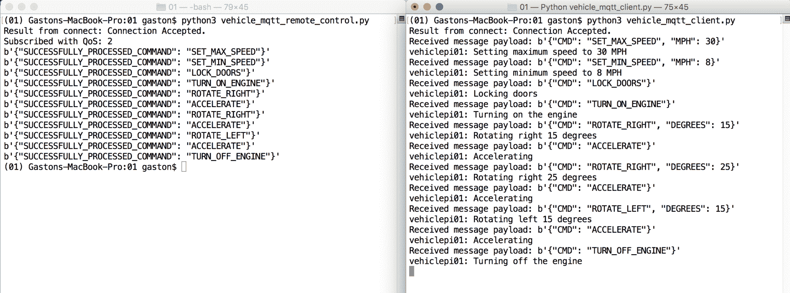
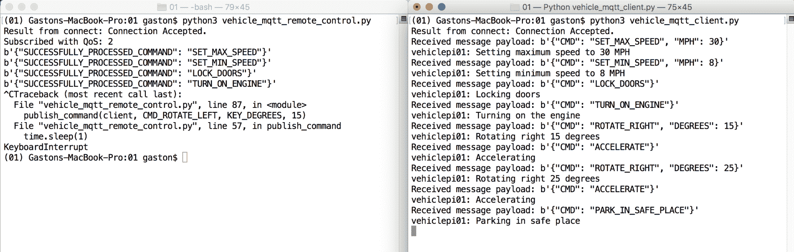
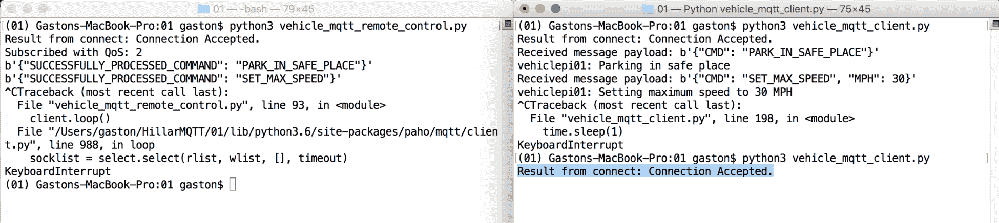
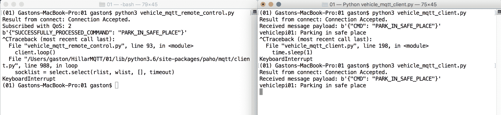

# 五、使用 Python 测试和改进我们的车辆控制解决方案

在本章中，我们将使用带有 MQTT 消息和 Python 代码的车辆控制解决方案。我们将学习如何使用 Python 代码处理 MQTT 消息中接收的命令。我们将编写 Python 代码，用命令编写和发送 MQTT 消息。我们将使用阻塞和线程网络循环，我们将了解它们的区别。最后，我们将利用最后遗嘱和遗嘱的特点。我们将深入了解以下内容：

*   用 Python 处理命令
*   用 Python 发送消息
*   使用 Python 处理网络循环
*   使用 Python 处理遗嘱和遗嘱
*   使用保留的最后一条消息
*   理解阻塞和非阻塞代码
*   使用线程化客户端接口

# 用 Python 处理命令

在[第 4 章](4.html)中*编写代码以使用 Python 和 MQTT 消息控制车辆*中，我们编写了一个能够使用 Python 代码处理作为 MQTT 消息接收的车辆命令的解决方案。现在，我们想让车辆处理许多命令，以检查所有部件如何协同工作。我们要执行以下命令：

```py
{"CMD": "LOCK_DOORS"} 
{"CMD": "TURN_OFF_PARKING_LIGHTS"} 
{"CMD": "SET_MAX_SPEED", "MPH": 10} 
{"CMD": "SET_MIN_SPEED", "MPH": 1} 
{"CMD": "TURN_ON_ENGINE"} 
{"CMD": "TURN_ON_HEADLIGHTS"} 
{"CMD": "ACCELERATE"} 
{"CMD": "ROTATE_RIGHT", "DEGREES": 45} 
{"CMD": "ACCELERATE"} 
{"CMD": "TURN_ON_PARKING_LIGHTS"} 
{"CMD": "BRAKE"} 
{"CMD": "TURN_OFF_ENGINE"} 
```

确保 MOSQUITO 服务器或本例中可能要使用的任何其他 MQTT 服务器正在运行。

启动 MQTT.fx，并按照[第 4 章](https://cdp.packtpub.com/hands_on_mqtt_programming_with_python/wp-admin/post.php?post=129&action=edit#post_107)*中解释的所有步骤，*编写代码，使用 Python 和 MQTT 消息*控制车辆，以配置与 TLS 的连接和 TLS 身份验证，前提是您之前没有使用 MQTT.fx 建立与 MQTT 服务器的安全连接。然后，单击“连接”按钮。*

点击订阅，在订阅按钮左侧的下拉菜单中输入`vehicles/vehiclepi01/executedcommands`。然后，单击订阅按钮。MQTT.fx 将在左侧显示一个新面板，其中包含我们以 QoS 级别 0 订阅的主题筛选器。

然后，在要用作使用 Linux 或 macOS 的 MQTT 客户端的任何计算机或设备中，执行以下行以启动车辆控制器示例：

```py
    python3 subscribe_with_paho.py 
```

在 Windows 中，必须执行以下行：

```py
    python subscribe_with_paho.py
```

保持代码在您的本地计算机或您选择用作本例车辆控制器的物联网板上运行。

在 MQTT.fx 中，单击发布并在发布按钮左侧的下拉菜单中输入`vehicles/vehiclepi01/commands`。单击 QoS 2，因为我们要使用 QoS 级别 2。

在发布按钮下方的文本框中输入以下文本：`{"CMD": "LOCK_DOORS"}`

然后，单击“发布”按钮。MQTT.fx 将把输入的文本发布到 QoS 级别为 2 的指定主题。

转到窗口，在该窗口中可以看到接收消息并控制车辆的 Python 代码生成的输出。如果您正在 IoT 板上运行代码，则可能使用 SSH 终端或连接到 IoT 板的屏幕。如果您正在本地计算机上运行代码，请根据您使用的操作系统转到终端或命令提示符。您将看到以下输出：

```py
    Result from connect: Connection Accepted.
    Received message payload: b'{"CMD": "LOCK_DOORS"}'
    vehiclepi01: Locking doors
```

代码已经接收到带有命令的消息，`Vehicle`实例执行了`lock_doors`方法，输出显示执行此代码的结果。

返回 MQTT.fx，单击 Subscribe，您将看到一条新消息已到达`vehicles/vehiclepi01/executedcommands`主题，其中包含以下有效负载：`{"SUCCESSFULLY_PROCESSED_COMMAND": "LOCK_DOORS"}`。以下屏幕截图显示了 MQTT.fx 中收到的消息：


现在，对前面显示的列表中包含的每个命令重复以下步骤。我们希望我们的车辆控制应用程序以 QoS 级别 2 处理 MQTT 消息中接收到的每个命令。删除现有文本并在“发布”按钮下的文本框中输入 JSON 字符串的文本，然后单击“发布”按钮。MQTT.fx 将把输入的文本发布到 QoS 级别为 2 的指定主题：

```py
{"CMD": "TURN_OFF_PARKING_LIGHTS"} 

{"CMD": "SET_MAX_SPEED", "MPH": 10} 

{"CMD": "SET_MIN_SPEED", "MPH": 1} 

{"CMD": "TURN_ON_ENGINE"} 

{"CMD": "TURN_ON_HEADLIGHTS"} 

{"CMD": "ACCELERATE"} 

{"CMD": "ROTATE_RIGHT", "DEGREES": 45} 

{"CMD": "ACCELERATE"} 

{"CMD": "TURN_ON_PARKING_LIGHTS"} 

{"CMD": "BRAKE"} 

{"CMD": "TURN_OFF_ENGINE"} 

```

转到窗口，在该窗口中可以看到接收消息并控制车辆的 Python 代码生成的输出。您将看到以下输出，指示已接收并处理所有命令：

```py
    Result from connect: Connection Accepted.
    Received message payload: b'{"CMD": "LOCK_DOORS"}'
    vehiclepi01: Locking doors
    Received message payload: b'{"CMD": "TURN_OFF_PARKING_LIGHTS"}'
    vehiclepi01: Turning off parking lights
    Received message payload: b'{"CMD": "SET_MAX_SPEED", "MPH": 10}'
    vehiclepi01: Setting maximum speed to 10 MPH
    Received message payload: b'{"CMD": "SET_MIN_SPEED", "MPH": 1}'
    vehiclepi01: Setting minimum speed to 1 MPH
    Received message payload: b'{"CMD": "TURN_ON_ENGINE"}'
    vehiclepi01: Turning on the engine
    Received message payload: b'{"CMD": "TURN_ON_HEADLIGHTS"}'
    vehiclepi01: Turning on headlights
    Received message payload: b'{"CMD": "ACCELERATE"}'
    vehiclepi01: Accelerating
    Received message payload: b'{"CMD": "ROTATE_RIGHT", "DEGREES": 45}'
    vehiclepi01: Rotating right 45 degrees
    Received message payload: b'{"CMD": "ACCELERATE"}'
    vehiclepi01: Accelerating
    Received message payload: b'{"CMD": "TURN_ON_PARKING_LIGHTS"}'
    vehiclepi01: Turning on parking lights
    Received message payload: b'{"CMD": "BRAKE"}'
    vehiclepi01: Braking
    Received message payload: b'{"CMD": "TURN_OFF_ENGINE"}'
    vehiclepi01: Turning off the engine
```

返回 MQTT.fx，单击 Subscribe，您将看到总共 12 条已到达`vehicles/vehiclepi01/executedcommands`主题的消息。通过单击窗口右侧代表每个消息的面板，可以轻松检查每个接收消息的有效负载内容。以下屏幕截图显示了 MQTT.fx 中最后收到的消息：


现在，我们将使用 MOSQUITO 命令行实用程序订阅`vehicles/vehiclepi01/executedcommands`主题，并将许多带有 JSON 字符串的 MQTT 消息发布到`vehicles/vehiclepi01/commands`主题。这一次，我们将发布以下命令：

```py
{"CMD": "UNLOCK_DOORS"} 
{"CMD": "LOCK_DOORS"} 
{"CMD": "SET_MAX_SPEED", "MPH": 20} 
{"CMD": "SET_MIN_SPEED", "MPH": 5} 
{"CMD": "TURN_ON_ENGINE"} 
{"CMD": "ACCELERATE"} 
{"CMD": "ROTATE_LEFT", "DEGREES": 15} 
{"CMD": "ROTATE_LEFT", "DEGREES": 20} 
{"CMD": "BRAKE"} 
{"CMD": "TURN_OFF_ENGINE"} 
```

在 macOS 或 Linux 中打开另一个终端，或在 Windows 中打开另一个命令提示符，转到安装 MOSQUITO 的目录，然后运行以下命令。将`192.168.1.1`替换为 MQTT 服务器的 IP 或主机名。记住用在`board_certificates`目录中创建的这些文件的完整路径替换`ca.crt`、`board001.crt`和`board001.key`。保持窗口打开，实用程序将显示在`vehicles/vehiclepi01/executedcommands`主题中收到的所有消息。样本的代码文件包含在`mqtt_python_gaston_hillar_05_01`文件夹中的`script_01.txt`文件中：

```py
    mosquitto_sub -h 192.168.1.1 -V mqttv311 -p 8883 --cafile ca.crt --
    cert device001.crt --key device001.key -t 
    vehicles/vehiclepi01/executedcommands --tls-version tlsv1.2

```

在 macOS 或 Linux 中打开另一个终端，或在 Windows 中打开另一个命令提示符，转到安装 Mosquitto 的目录，运行以下命令，以命令将消息发布到 QoS 级别为 2 的`vehicles/vehiclepi01/commands`主题。进行前面为`mosquitto_sub`命令解释的相同替换。样本的代码文件包含在`mqtt_python_gaston_hillar_05_01`文件夹中的`script_02.txt`文件中：

```py
    mosquitto_pub -h 192.168.1.1 -V mqttv311 -p 8883 --cafile ca.crt --
cert board001.crt --key board001.key -t vehicles/vehiclepi01/commands -m '{"CMD": "UNLOCK_DOORS"}' -q 2 --tls-version tlsv1.2

    mosquitto_pub -h 192.168.1.1 -V mqttv311 -p 8883 --cafile ca.crt --cert board001.crt --key board001.key -t vehicles/vehiclepi01/commands -m '{"CMD": "LOCK_DOORS"}' -q 2 --tls-version tlsv1.2

    mosquitto_pub -h 192.168.1.1 -V mqttv311 -p 8883 --cafile ca.crt --cert board001.crt --key board001.key -t vehicles/vehiclepi01/commands -m '{"CMD": "SET_MAX_SPEED", "MPH": 20}' -q 2 --tls-version tlsv1.2

    mosquitto_pub -h 192.168.1.1 -V mqttv311 -p 8883 --cafile ca.crt --cert board001.crt --key board001.key -t vehicles/vehiclepi01/commands -m '{"CMD": "SET_MIN_SPEED", "MPH": 5}' -q 2 --tls-version tlsv1.2

    mosquitto_pub -h 192.168.1.1 -V mqttv311 -p 8883 --cafile ca.crt --cert board001.crt --key board001.key -t vehicles/vehiclepi01/commands -m '{"CMD": "TURN_ON_ENGINE"}' -q 2 --tls-version tlsv1.2

    mosquitto_pub -h 192.168.1.1 -V mqttv311 -p 8883 --cafile ca.crt --cert board001.crt --key board001.key -t vehicles/vehiclepi01/commands -m '{"CMD": "ACCELERATE"}' -q 2 --tls-version tlsv1.2

    mosquitto_pub -h 192.168.1.1 -V mqttv311 -p 8883 --cafile ca.crt --cert board001.crt --key board001.key -t vehicles/vehiclepi01/commands -m '{"CMD": "ROTATE_LEFT", "DEGREES": 15}' -q 2 --tls-version tlsv1.2

    mosquitto_pub -h 192.168.1.1 -V mqttv311 -p 8883 --cafile ca.crt --cert board001.crt --key board001.key -t vehicles/vehiclepi01/commands -m '{"CMD": "ROTATE_LEFT", "DEGREES": 20}' -q 2 --tls-version tlsv1.2

    mosquitto_pub -h 192.168.1.1 -V mqttv311 -p 8883 --cafile ca.crt --cert board001.crt --key board001.key -t vehicles/vehiclepi01/commands -m '{"CMD": "BRAKE"}' -q 2 --tls-version tlsv1.2

    mosquitto_pub -h 192.168.1.1 -V mqttv311 -p 8883 --cafile ca.crt --cert board001.crt --key board001.key -t vehicles/vehiclepi01/commands -m '{"CMD": "TURN_OFF_ENGINE"}' -q 2 --tls-version tlsv1.2

```

在您运行前面的命令之后，`VehicleCommandProcessor`类将接收并处理这些命令。几秒钟后，您将在执行`mosquitto_sub`实用程序的窗口中看到以下输出：

```py
    {"SUCCESSFULLY_PROCESSED_COMMAND": "UNLOCK_DOORS"}
    {"SUCCESSFULLY_PROCESSED_COMMAND": "LOCK_DOORS"}
    {"SUCCESSFULLY_PROCESSED_COMMAND": "SET_MAX_SPEED"}
    {"SUCCESSFULLY_PROCESSED_COMMAND": "SET_MIN_SPEED"}
    {"SUCCESSFULLY_PROCESSED_COMMAND": "TURN_ON_ENGINE"}
    {"SUCCESSFULLY_PROCESSED_COMMAND": "ACCELERATE"}
    {"SUCCESSFULLY_PROCESSED_COMMAND": "ROTATE_LEFT"}
    {"SUCCESSFULLY_PROCESSED_COMMAND": "ROTATE_LEFT"}
    {"SUCCESSFULLY_PROCESSED_COMMAND": "BRAKE"}
    {"SUCCESSFULLY_PROCESSED_COMMAND": "TURN_OFF_ENGINE"}

```

Note that the MQTT.fx utility will also receive the messages because it stayed subscribed to the `vehicles/vehiclepi01/executedcommands` topic.

转到窗口，在该窗口中可以看到接收消息并控制车辆的 Python 代码生成的输出。您将看到以下输出，这表明已接收并处理所有命令：

```py
    Result from connect: Connection Accepted.
    Received message payload: b'{"CMD": "UNLOCK_DOORS"}'
    vehiclepi01: Unlocking doors
    Received message payload: b'{"CMD": "LOCK_DOORS"}'
    vehiclepi01: Locking doors
    Received message payload: b'{"CMD": "SET_MAX_SPEED", "MPH": 20}'
    vehiclepi01: Setting maximum speed to 20 MPH
    Received message payload: b'{"CMD": "SET_MIN_SPEED", "MPH": 5}'
    vehiclepi01: Setting minimum speed to 5 MPH
    Received message payload: b'{"CMD": "TURN_ON_ENGINE"}'
    vehiclepi01: Turning on the engine
    Received message payload: b'{"CMD": "ACCELERATE"}'
    vehiclepi01: Accelerating
    Received message payload: b'{"CMD": "ROTATE_LEFT", "DEGREES": 15}'
    vehiclepi01: Rotating left 15 degrees
    Received message payload: b'{"CMD": "ROTATE_LEFT", "DEGREES": 20}'
    vehiclepi01: Rotating left 20 degrees
    Received message payload: b'{"CMD": "BRAKE"}'
    vehiclepi01: Braking
    Received message payload: b'{"CMD": "TURN_OFF_ENGINE"}'
    vehiclepi01: Turning off the engine

```

# 用 Python 发送消息

到目前为止，我们一直在发布 MQTT 消息，以使用 GUI 和命令行工具控制车辆。现在，我们将用 Python 编写代码来发布控制每辆车的命令，并检查这些命令的执行结果。当然，GUI 实用程序（如 MQTT.fx 和 Mosquitto 命令行实用程序）非常有用。然而，在我们知道事情按照我们预期的方式运行之后，我们可以编写必要的代码，用我们在 IoT 板上运行代码时使用的相同编程语言执行测试。

现在，我们将编写一个 Python 客户端，它将向`vehicles/vehiclepi01/commands`主题发布消息，并订阅`vehicles/vehiclepi01/executedcommands`主题。我们将为发布者和订阅者编写代码。通过这种方式，我们将能够设计能够使用 MQTT 消息与 IoT 设备通信的应用程序，并使用 Python 作为客户端应用程序的编程语言。具体来说，应用程序将能够通过 MQTT 服务器与所有发布服务器和订阅服务器设备中的 Python 代码进行通信。

We can run the Python client on any other computer or IoT board that is capable of executing Python 3.x.

在[第 4 章](4.html)中*使用 Python 和 MQTT 消息*编写控制车辆的代码时，我们在主虚拟环境文件夹中创建了一个名为`config.py`的 Python 文件。在这个文件中，我们定义了许多配置值，用于建立与 Mosquitto MQTT 服务器的连接。这样，所有配置值都包含在特定的 Python 脚本中。如果您需要对此文件进行更改，以配置将在 MQTT 消息中编写和发送命令以控制车辆的应用程序，请确保您阅读了[第 4 章](4.html)*中的说明，编写代码以使用 Python 和 MQTT 消息控制车辆。*

现在，我们将在主虚拟环境文件夹中创建一个名为`vehicle_mqtt_remote_control.py`的新 Python 文件。我们将创建许多函数，这些函数将被分配为 MQTT 客户机中事件的回调。此外，我们将声明变量、帮助器类和帮助器函数，以便使用命令和命令所需的值轻松发布消息。以下几行显示了定义变量、帮助器类和函数的代码。样本的代码文件包含在`mqtt_python_gaston_hillar_05_01`文件夹中的`vehicle_mqtt_remote_control.py`文件中：

```py
from config import * 
from vehicle_commands import * 
import paho.mqtt.client as mqtt 
import time 
import json 

vehicle_name = "vehiclepi01" 
commands_topic = "vehicles/{}/commands".format(vehicle_name) 
processed_commands_topic = "vehicles/{}/executedcommands".format(vehicle_name) 

class LoopControl: 
    is_last_command_processed = False 

def on_connect(client, userdata, flags, rc): 
    print("Result from connect: {}".format( 
        mqtt.connack_string(rc))) 
    # Check whether the result form connect is the CONNACK_ACCEPTED 
      connack code 
    if rc == mqtt.CONNACK_ACCEPTED: 
        # Subscribe to the commands topic filter 
        client.subscribe( 
            processed_commands_topic,  
            qos=2) 

def on_message(client, userdata, msg): 
    if msg.topic == processed_commands_topic: 
        print(str(msg.payload)) 
        if str(msg.payload).count(CMD_TURN_OFF_ENGINE) > 0: 
            LoopControl.is_last_command_processed = True 

def on_subscribe(client, userdata, mid, granted_qos): 
    print("Subscribed with QoS: {}".format(granted_qos[0])) 

def build_command_message(command_name, key="", value=""): 
    if key: 
        # The command requires a key 
        command_message = json.dumps({ 
            COMMAND_KEY: command_name, 
            key: value}) 
    else: 
        # The command doesn't require a key 
        command_message = json.dumps({ 
            COMMAND_KEY: command_name}) 
    return command_message 

def publish_command(client, command_name, key="", value=""):
    command_message = build_command_message(
        command_name, key, value)
    result = client.publish(topic=commands_topic, payload=command_message, qos=2)
client.loop()
time.sleep(1)
return result
```

第一行导入我们在著名的`config.py`文件中声明的变量。代码声明了`vehicle_name`变量，该变量用`"vehiclepi01"`保存一个字符串，我们可以很容易地用我们想要控制的车辆的名称替换它。我们的主要目标是将命令消息构建并发布到`commands_topic`变量中指定的主题。我们将订阅`processed_commands_topic`变量中指定的主题。

`LoopControl`类声明了一个名为`is_last_command_processed`的类属性，该类属性初始化为`False`。我们将使用这个 class 属性作为控制网络循环的标志。

`on_connect`函数是与 MQTT 服务器建立成功连接后将执行的回调。代码检查提供 MQTT 服务器返回的`CONNACK`代码的`rc`参数的值。如果该值与`mqtt.CONNACK_ACCEPTED`匹配，则表示 MQTT 服务器接受了连接请求，因此，代码调用`client`参数中接收到的 MQTT 客户端的`client.subscribe`方法，以订阅保存在`processed_commands_topic`中的 QoS 级别为 0 的主题名称。

`on_message`功能将在每次新消息到达我们订阅的主题时执行。该函数只打印原始字符串和接收消息的有效负载。如果有效负载包括保存在`CMD_TURN_OFF_ENGINE`常量中的字符串，我们假设最后一个命令已成功执行，代码将`LoopControl.is_last_command_processed`设置为`True`。通过这种方式，我们将根据车辆提供的反馈控制网络环路，该反馈带有指示已处理命令的 MQTT 消息。

订阅成功完成后，将调用`on_subscribe`函数。

下表总结了将根据从 MQTT 服务器收到的响应调用的函数：

| **来自 MQTT 服务器的响应** | **将被调用的函数** |
| `CONNACK` | `on_connnect` |
| `SUBACK` | `on_subscribe` |
| `PUBLISH` | `on_message` |

`build_command_message`函数接收命令名、键和值，这些值提供必要的信息，以使用构成`command_name`、`key`和`value`参数中的命令的 JSON 键-值对构建字符串。请注意，最后两个参数是可选的，其默认值为空字符串。函数创建一个字典，并将字典序列化的结果保存到`command_message`局部变量中的 JSON 格式字符串。`COMMAND_KEY`常量是字典的第一个键，`command_name`作为参数接收，该值构成第一个键值对。最后，函数返回`command_message`字符串。

`publish_command`函数接收 MQTT 客户机、命令名、键和值，这些值提供了在`client`、`command_name`、`key`和`value`参数中执行命令所需的信息。在`build_command_message`函数中，键和值参数是可选的，它们的默认值是空字符串。该函数使用接收到的`command_name`、`key`和`value`参数调用前面解释的`build_command_message`函数，并将结果保存在`command_message`局部变量中。然后，代码调用`client.publish`方法将`command_message`JSON 格式的字符串发布到保存在`commands_topic`变量中的主题名，QoS 级别为 2。

下一行调用`client.loop`方法，以确保与 MQTT 服务器进行通信并休眠一秒钟。这样，消息将被发布，应用程序将等待一秒钟。

# 使用 Python 处理网络循环

现在，我们将在`__main__`方法中使用先前编码的`functions`，该方法将发布控制车辆的代码将处理的 MQTT 消息中包含的许多命令。您必须将下一行添加到现有的`vehicle_mqtt_remote_control.py`Python 文件中。以下几行显示了`__main__`方法的代码，即主代码块。样本的代码文件包含在`mqtt_python_gaston_hillar_05_01`文件夹中的`vehicle_mqtt_remote_control.py`文件中：

```py
if __name__ == "__main__": 
    client = mqtt.Client(protocol=mqtt.MQTTv311) 
    client.on_connect = on_connect 
    client.on_subscribe = on_subscribe 
    client.on_message = on_message 
    client.tls_set(ca_certs = ca_certificate, 
        certfile=client_certificate, 
        keyfile=client_key) 
    client.connect(host=mqtt_server_host, 
        port=mqtt_server_port, 
        keepalive=mqtt_keepalive) 
    publish_command(client, CMD_SET_MAX_SPEED, KEY_MPH, 30) 
    publish_command(client, CMD_SET_MIN_SPEED, KEY_MPH, 8) 
    publish_command(client, CMD_LOCK_DOORS) 
    publish_command(client, CMD_TURN_ON_ENGINE) 
    publish_command(client, CMD_ROTATE_RIGHT, KEY_DEGREES, 15) 
    publish_command(client, CMD_ACCELERATE) 
    publish_command(client, CMD_ROTATE_RIGHT, KEY_DEGREES, 25) 
    publish_command(client, CMD_ACCELERATE) 
    publish_command(client, CMD_ROTATE_LEFT, KEY_DEGREES, 15) 
    publish_command(client, CMD_ACCELERATE) 
    publish_command(client, CMD_TURN_OFF_ENGINE) 
    while LoopControl.is_last_command_processed == False: 
        # Process messages and the commands every 500 milliseconds 
        client.loop() 
        time.sleep(0.5) 
    client.disconnect() 
    client.loop() 
```

第一行代码类似于我们编写的第一个 Python 示例。调用`client.connect`方法后，代码多次调用`publish_command`命令，用这些命令构建和发布消息。

`while`循环调用`client.loop`方法以确保与 MQTT 服务器的通信被执行并休眠 500 毫秒，即 0.5 秒。处理完最后一个命令后，`LoopControl.is_last_command_processed`类变量设置为`True`，while 循环结束执行。发生这种情况时，代码调用`client.disconnect`方法，最后调用`client.loop`方法，以确保断开连接请求得到处理。

If we don't call the `client.loop` method after calling `client.disconnect`, the program can finish its execution without sending the request to disconnect to the MQTT server. In the next sections, we will work with the last will and testament feature and we will note that the ways in which a client is disconnected have an important impact on the usage of this feature.

在本例中，我们不希望循环永远运行，因为我们有一个特定的目标，即编写和发送一组命令。一旦确定最后一个命令已被处理，我们将关闭与 MQTT 服务器的连接。

确保控制`vehiclepi01`的代码正在运行，即我们在[第 4 章](4.html)中编写的`vehicle_mqtt_client.py`Python 脚本*正在运行，该脚本使用 Python 和 MQTT 消息*编写控制车辆的代码。

然后，在要用作 MQTT 客户端并使用 Linux 或 macOS 的任何计算机或设备上执行以下行以启动车辆远程控制示例：

```py
    python3 vehicle_mqtt_remote_control.py
```

在 Windows 中，必须执行以下行：

```py
    python vehicle_mqtt_remote_control.py
```

保持代码在本地计算机或您选择用作本示例车辆遥控器的物联网板上运行。

转到执行上一个 Python 脚本（名为`vehicle_mqtt_remote_control.py`）的设备和窗口。您将看到以下输出。Python 代码将显示在`vehicles/vehiclepi01/executedcommands`主题中接收到的所有消息。当车辆指示其已成功处理`TURN_OFF_ENGINE`命令后，程序将结束其执行：

```py
    Result from connect: Connection Accepted.
    Subscribed with QoS: 2
    b'{"SUCCESSFULLY_PROCESSED_COMMAND": "SET_MAX_SPEED"}'
    b'{"SUCCESSFULLY_PROCESSED_COMMAND": "SET_MIN_SPEED"}'
    b'{"SUCCESSFULLY_PROCESSED_COMMAND": "LOCK_DOORS"}'
    b'{"SUCCESSFULLY_PROCESSED_COMMAND": "TURN_ON_ENGINE"}'
    b'{"SUCCESSFULLY_PROCESSED_COMMAND": "ROTATE_RIGHT"}'
    b'{"SUCCESSFULLY_PROCESSED_COMMAND": "ACCELERATE"}'
    b'{"SUCCESSFULLY_PROCESSED_COMMAND": "ROTATE_RIGHT"}'
    b'{"SUCCESSFULLY_PROCESSED_COMMAND": "ACCELERATE"}'
    b'{"SUCCESSFULLY_PROCESSED_COMMAND": "ROTATE_LEFT"}'
    b'{"SUCCESSFULLY_PROCESSED_COMMAND": "ACCELERATE"}'
    b'{"SUCCESSFULLY_PROCESSED_COMMAND": "TURN_OFF_ENGINE"}'

```

转到执行控制车辆并处理接收到的命令的 Python 脚本的设备和窗口，即`vehicle_mqtt_client.py`。您将看到以下输出：

```py
    Received message payload: b'{"CMD": "SET_MAX_SPEED", "MPH": 30}'
    vehiclepi01: Setting maximum speed to 30 MPH
    Received message payload: b'{"CMD": "SET_MIN_SPEED", "MPH": 8}'
    vehiclepi01: Setting minimum speed to 8 MPH
    Received message payload: b'{"CMD": "LOCK_DOORS"}'
    vehiclepi01: Locking doors
    Received message payload: b'{"CMD": "TURN_ON_ENGINE"}'
    vehiclepi01: Turning on the engine
    Received message payload: b'{"CMD": "ROTATE_RIGHT", "DEGREES": 15}'
    vehiclepi01: Rotating right 15 degrees
    Received message payload: b'{"CMD": "ACCELERATE"}'
    vehiclepi01: Accelerating
    Received message payload: b'{"CMD": "ROTATE_RIGHT", "DEGREES": 25}'
    vehiclepi01: Rotating right 25 degrees
    Received message payload: b'{"CMD": "ACCELERATE"}'
    vehiclepi01: Accelerating
    Received message payload: b'{"CMD": "ROTATE_LEFT", "DEGREES": 15}'
    vehiclepi01: Rotating left 15 degrees
    Received message payload: b'{"CMD": "ACCELERATE"}'
    vehiclepi01: Accelerating
    Received message payload: b'{"CMD": "TURN_OFF_ENGINE"}'
    vehiclepi01: Turning off the engine
```

下面的屏幕截图显示了在使用 macOS 的计算机上运行的两个终端窗口。左侧的终端显示 Python 客户端显示的消息，该客户端发布命令并充当车辆的遥控器，即`vehicle_mqtt_remote_control.py`脚本。右侧的终端显示运行 Python 客户端代码的结果，Python 客户端控制车辆并处理接收到的命令，即`vehicle_mqtt_client.py`脚本：



# 使用 Python 处理遗嘱和遗嘱

现在，我们将检查如果代表我们的车辆远程控制应用程序的 MQTT 客户机使用我们目前编写的代码意外断开与 MQTT 服务器的连接，会发生什么情况。注意所有步骤，因为我们将手动中断车辆遥控程序的执行，以了解我们将利用最后遗嘱和测试功能解决的特定问题。

在要用作 MQTT 客户端并使用 Linux 或 macOS 的任何计算机或设备上，执行以下行以启动车辆远程控制示例：

```py
    python3 vehicle_mqtt_remote_control.py
```

在 Windows 中，必须执行以下行：

```py
    python vehicle_mqtt_remote_control.py
```

转到执行上一个 Python 脚本（名为`vehicle_mqtt_remote_control.py`）的设备和窗口。在您看到以下输出后，在处理所有命令之前，按*Ctrl*+*C*中断脚本的执行：

```py
    Result from connect: Connection Accepted.
    Subscribed with QoS: 2
    b'{"SUCCESSFULLY_PROCESSED_COMMAND": "SET_MAX_SPEED"}'
    b'{"SUCCESSFULLY_PROCESSED_COMMAND": "SET_MIN_SPEED"}'
    b'{"SUCCESSFULLY_PROCESSED_COMMAND": "LOCK_DOORS"}'
    b'{"SUCCESSFULLY_PROCESSED_COMMAND": "TURN_ON_ENGINE"}'
    b'{"SUCCESSFULLY_PROCESSED_COMMAND": "ROTATE_RIGHT"}'

```

按*Ctrl*+*C*后，您将看到一个类似以下行的回溯输出：

```py
    ^CTraceback (most recent call last):
      File "vehicle_mqtt_remote_control.py", line 86, in <module>
        publish_command(client, CMD_ACCELERATE)
      File "vehicle_mqtt_remote_control.py", line 57, in 
        publish_command
        time.sleep(1)
      KeyboardInterrupt

```

我们中断了作为车辆远程控制的 MQTT 客户端与 MQTT 服务器之间的连接。我们没有等待所有命令发布，我们意外地断开了 MQTT 客户机与 MQTT 服务器的连接。车辆不知道遥控应用程序已中断。

在本例中，我们使用键盘快捷键中断 Python 程序的执行。但是，网络故障可能是 MQTT 客户端与 MQTT 服务器意外断开连接的另一个原因。

当然，我们不希望网络故障使我们的车辆失去控制，因此，如果远程控制应用程序与 MQTT 服务器失去连接，我们希望确保车辆停在安全的地方。在这种情况下，我们希望确保车辆接收到一条消息，该消息带有指示车辆必须停在为车辆配置的安全位置的命令。

在[第 1 章](1.html)*中，安装 MQTT 3.1.1 Mosquitto 服务器*时，我们分析了构成 MQTT 客户端发送给 MQTT 服务器以建立连接的`CONNECT`控制包有效负载的字段和标志。现在，我们将使用`paho-mqtt`中提供的适当方法来配置`Will`、`WillQoS`、`WillRetain`、`WillTopic`和`WillMessage`标志和字段的值，以允许我们的 MQTT 客户端利用 MQTT 的最后遗嘱和测试功能。

打开现有的`vehicle_mqtt_remote_control.py`Python 文件，用以下代码替换定义`__main__`方法的行，以配置我们希望 MQTT 服务器在发生意外断开时发送给车辆的最后一条 will 消息。添加的行将高亮显示。样本的代码文件包含在`mqtt_python_gaston_hillar_05_02`文件夹中的`vehicle_mqtt_remote_control.py`文件中：

```py
if __name__ == "__main__": 
    client = mqtt.Client(protocol=mqtt.MQTTv311) 
    client.on_connect = on_connect 
    client.on_subscribe = on_subscribe 
    client.on_message = on_message 
    client.tls_set(ca_certs = ca_certificate, 
        certfile=client_certificate, 
        keyfile=client_key) 
    # Set a will to be sent to the MQTT server in case the client 
    # disconnects unexpectedly 
    last_will_payload = build_command_message(CMD_PARK_IN_SAFE_PLACE) 
    client.will_set(topic=commands_topic,  
        payload=last_will_payload,  
        qos=2) 
    client.connect(host=mqtt_server_host, 
        port=mqtt_server_port, 
        keepalive=mqtt_keepalive) 
    publish_command(client, CMD_SET_MAX_SPEED, KEY_MPH, 30) 
    publish_command(client, CMD_SET_MIN_SPEED, KEY_MPH, 8) 
    publish_command(client, CMD_LOCK_DOORS) 
    publish_command(client, CMD_TURN_ON_ENGINE) 
    publish_command(client, CMD_ROTATE_RIGHT, KEY_DEGREES, 15) 
    publish_command(client, CMD_ACCELERATE) 
    publish_command(client, CMD_ROTATE_RIGHT, KEY_DEGREES, 25) 
    publish_command(client, CMD_ACCELERATE) 
    publish_command(client, CMD_ROTATE_LEFT, KEY_DEGREES, 15) 
    publish_command(client, CMD_ACCELERATE) 
    publish_command(client, CMD_TURN_OFF_ENGINE) 
    while LoopControl.is_last_command_processed == False: 
        # Process messages and the commands every 500 milliseconds 
        client.loop() 
        time.sleep(0.5) 
    client.disconnect() 
    client.loop() 
```

在代码调用`client.connect`方法之前，即向 MQTT 服务器发送连接请求之前，我们添加了两行代码。第一行使用`CMD_PARK_IN_SAFE_PLACE`作为参数调用`build_command_message`函数，用命令构建 JSON 字符串，使车辆停在安全的地方，并将其存储在`last_will_payload`变量中。

下一行代码调用`client.will_set`方法，该方法允许我们配置将在连接控制数据包中使用的`Will`、`WillQoS`、`WillRetain`、`WillTopic`和`WillMessage`标志和字段的所需值。代码使用`commands_topic`、`last_will_payload`和`2`作为主题、`payload`和`qos`参数的值来调用此方法。由于我们没有为`retain`参数指定值，因此该方法将使用其默认值`False`，该值指定最后一条 will 消息不会是保留消息。这样，当下一行代码调用`client.connect`方法请求 MQTT 客户端建立到 MQTT 服务器的连接时，`CONNECT`控制包将包括字段和标志的适当值，以配置 QoS 级别为 2 的最后一条遗嘱消息`commands_topic`作为消息发布的主题，和`last_will_payload`作为消息的有效负载。

现在，在要用作 MQTT 客户端并使用 Linux 或 macOS 的任何计算机或设备上执行以下行以启动车辆远程控制示例：

```py
    python3 vehicle_mqtt_remote_control.py
```

在 Windows 中，必须执行以下行：

```py
    python vehicle_mqtt_remote_control.py
```

转到执行上一个 Python 脚本（名为`vehicle_mqtt_remote_control.py`）的设备和窗口。在您看到以下输出后，在处理所有命令之前，按*Ctrl*+*C*中断脚本的执行：

```py
    Result from connect: Connection Accepted.
    Subscribed with QoS: 2
    b'{"SUCCESSFULLY_PROCESSED_COMMAND": "SET_MAX_SPEED"}'
    b'{"SUCCESSFULLY_PROCESSED_COMMAND": "SET_MIN_SPEED"}'
    b'{"SUCCESSFULLY_PROCESSED_COMMAND": "LOCK_DOORS"}'
    b'{"SUCCESSFULLY_PROCESSED_COMMAND": "TURN_ON_ENGINE"}'

```

按*Ctrl*+*C*后，您将看到一个类似以下行的回溯输出：

```py
^CTraceback (most recent call last):
 File "vehicle_mqtt_remote_control.py", line 87, in <module>
 publish_command(client, CMD_ROTATE_LEFT, KEY_DEGREES, 15)
 File "vehicle_mqtt_remote_control.py", line 57, in publish_command
 time.sleep(1)
 KeyboardInterrupt
```

我们中断了作为车辆远程控制的 MQTT 客户端与 MQTT 服务器之间的连接。我们没有等待所有命令发布，我们意外地断开了 MQTT 客户机与 MQTT 服务器的连接。因此，MQTT 服务器发布配置的 last will 消息，即 MQTT 客户端（用作车辆的远程控制）在与 MQTT 服务器建立连接时已配置的消息。这样，当远程控制应用程序和 MQTT 服务器之间的连接断开时，车辆接收到将车辆停在安全位置的命令。

转到执行控制车辆并处理接收到的命令的 Python 脚本的设备和窗口，即`vehicle_mqtt_client.py`。您将看到类似于以下几行的输出。请注意，最后收到的信息指示车辆停在安全的地方。最后收到的这条消息是我们在 Python 脚本`vehicle_mqtt_remote_control.py`中添加代码行配置的最后一条 will 消息：

```py
Received message payload: b'{"CMD": "SET_MAX_SPEED", "MPH": 30}'
vehiclepi01: Setting maximum speed to 30 MPH
Received message payload: b'{"CMD": "SET_MIN_SPEED", "MPH": 8}'
vehiclepi01: Setting minimum speed to 8 MPH
Received message payload: b'{"CMD": "LOCK_DOORS"}'
vehiclepi01: Locking doors
Received message payload: b'{"CMD": "TURN_ON_ENGINE"}'
vehiclepi01: Turning on the engine
Received message payload: b'{"CMD": "ROTATE_RIGHT", "DEGREES": 15}'
vehiclepi01: Rotating right 15 degrees
Received message payload: b'{"CMD": "ACCELERATE"}'
vehiclepi01: Accelerating
Received message payload: b'{"CMD": "ROTATE_RIGHT", "DEGREES": 25}'
vehiclepi01: Rotating right 25 degrees
Received message payload: b'{"CMD": "ACCELERATE"}'
vehiclepi01: Accelerating
Received message payload: b'{"CMD": "PARK_IN_SAFE_PLACE"}'
vehiclepi01: Parking in safe place
```

下面的屏幕截图显示了在使用 macOS 的计算机上运行的两个终端窗口。左侧的终端显示 Python 客户端显示的消息，该客户端发布命令并充当车辆的遥控器，即`vehicle_mqtt_remote_control.py`脚本。右侧的终端显示运行 Python 客户端代码的结果，Python 客户端控制车辆并处理接收到的命令，即`vehicle_mqtt_client.py`脚本。连接中断导致 MQTT 服务器发布配置的 last will 消息：



You can take advantage of the last will and testament feature to indicate to interested clients that a specific board, device, or sensor is offline.

现在，在要用作 MQTT 客户端并使用 Linux 或 macOS 的任何计算机或设备上执行以下行以启动车辆远程控制示例：

```py
    python3 vehicle_mqtt_remote_control.py

```

在 Windows 中，必须执行以下行：

```py
    python vehicle_mqtt_remote_control.py

```

转到执行上一个 Python 脚本（名为`vehicle_mqtt_remote_control.py`）的设备和窗口。

这一次，在您的本地计算机或您选择用作本例车辆遥控器的物联网板上运行代码。

转到执行控制车辆并处理接收到的命令的 Python 脚本的设备和窗口，即`vehicle_mqtt_client.py`。您将在输出中看到以下最后几行：

```py
    Received message payload: b'{"CMD": "ROTATE_LEFT", "DEGREES": 15}'
    vehiclepi01: Rotating left 15 degrees
    Received message payload: b'{"CMD": "ACCELERATE"}'
    vehiclepi01: Accelerating
    Received message payload: b'{"CMD": "TURN_OFF_ENGINE"}'
    vehiclepi01: Turning off the engine
```

在本例中，代码调用了`client.disconnect`方法，然后调用了`client.loop`方法。MQTT 客户端以正常方式断开与 MQTT 服务器的连接，因此，未发布最后一条 will 消息，其中包含将车辆停放在安全位置的命令。

It is very important to understand that the configured last will message isn't published when the MQTT client disconnects from the MQTT by calling the `client.disconnect` method and making sure that the network events are processed. If we want to publish a message before a normal disconnection performed with the `client.disconnect` method, we must write the necessary code to do so before calling this method. In addition, we have to make sure that the network events are processed.

# 使用保留的最后一条消息

现在，我们将检查当控制车辆的 MQTT 客户机意外断开与 MQTT 服务器的连接以及我们的车辆远程控制应用程序意外断开连接时会发生什么。请注意所有步骤，因为我们将手动中断两个程序的执行，以了解我们将利用最后遗嘱和遗嘱功能以及保留的标志值来解决的特定问题。

You will have to be quick to run the next steps. Hence, make sure you read all the steps and then execute them.

在要用作 MQTT 客户端并使用 Linux 或 macOS 的任何计算机或设备上，执行以下行以启动车辆远程控制示例：

```py
    python3 vehicle_mqtt_remote_control.py

```

在 Windows 中，必须执行以下行：

```py
    python vehicle_mqtt_remote_control.py

```

转到执行控制车辆并处理接收到的命令的 Python 脚本的设备和窗口，即`vehicle_mqtt_client.py`。在您看到以下输出后，在收到所有命令之前，按*Ctrl*+*C*中断脚本的执行：

```py
    Received message payload: b'{"CMD": "PARK_IN_SAFE_PLACE"}'
    vehiclepi01: Parking in safe place
    Received message payload: b'{"CMD": "SET_MAX_SPEED", "MPH": 30}'
    vehiclepi01: Setting maximum speed to 30 MPH
```

按*Ctrl*+*C*后，您将看到一个类似以下行的回溯输出：

```py
    ^CTraceback (most recent call last):
      File "vehicle_mqtt_client.py", line 198, in <module>
        time.sleep(1)
        KeyboardInterrupt
```

我们中断了控制车辆并处理接收到的命令的 MQTT 客户机与 MQTT 服务器之间的连接。我们没有等待所有命令被接收，我们意外地断开了 MQTT 客户机与 MQTT 服务器的连接。车辆远程控制应用程序不知道远程控制应用程序已被中断，它会等待直到其发送的最后一个命令得到处理。

转到执行上一个 Python 脚本（名为`vehicle_mqtt_remote_control.py`）的设备和窗口。按*Ctrl*+*C*中断脚本的执行。按*Ctrl*+*C*后，您将看到一个类似以下行的回溯输出：

```py
    ^CTraceback (most recent call last):
      File "vehicle_mqtt_remote_control.py", line 93, in <module>
        client.loop()
      File "/Users/gaston/HillarMQTT/01/lib/python3.6/site-
        packages/paho/mqtt/client.py", line 988, in loop
        socklist = select.select(rlist, wlist, [], timeout)
        KeyboardInterrupt

```

返回设备和窗口，在该设备和窗口中，您执行了控制车辆并处理接收到的命令的 Python 脚本，即`vehicle_mqtt_client.py`。在要用作 MQTT 客户端并使用 Linux 或 macOS 的任何计算机或设备上执行以下行以再次启动此脚本：

```py
    python3 vehicle_mqtt_client.py 
```

在 Windows 中，必须执行以下行：

```py
    python vehicle_mqtt_client.py 
```

等待几秒钟，您将只看到以下输出，指示已接受到 MQTT 服务器的连接。未收到任何命令：

```py
Result from connect: Connection Accepted.
```

下面的屏幕截图显示了在使用 macOS 的计算机上运行的两个终端窗口。左侧的终端显示 Python 客户端显示的消息，该客户端发布命令并充当车辆的遥控器，即`vehicle_mqtt_remote_control.py`脚本。右侧的终端显示运行 Python 客户端代码的结果，Python 客户端控制车辆并处理接收到的命令，即前面解释的中断后的`vehicle_mqtt_client.py`脚本：



当我们启动`vehicle_mqtt_client.py`脚本时，代码生成了一个新的 MQTT 客户端，并与 MQTT 服务器建立了连接并订阅了`vehicles/vehiclepi01/commands`。当我们中断执行`vehicle_mqtt_remote_control.py`脚本时，发布到此主题的最后一条 will 消息已发布，且`Retained`标志设置为`False`，因此，MQTT 服务器未保留该消息，任何与保留的最后一条消息发送到的主题匹配的主题筛选器的新订阅都不会接收该消息。

打开现有的`vehicle_mqtt_remote_control.py`Python 文件，将`__main__`方法中调用`client.will_set`方法的行替换为以下代码。样本的代码文件包含在`mqtt_python_gaston_hillar_05_03`文件夹中的`vehicle_mqtt_remote_control.py`文件中：

```py
    client.will_set(topic=commands_topic,  
        payload=last_will_payload,  
        qos=2, 
        retain=True) 
```

我们为`retain`参数指定了`True`值，在以前版本的代码中，该参数使用了默认的`False`值。这样，最后一条 will 消息将成为一条保留消息。

在要用作 MQTT 客户端并使用 Linux 或 macOS 的任何计算机或设备上，执行以下行以启动车辆远程控制示例：

```py
    python3 vehicle_mqtt_remote_control.py
```

在 Windows 中，必须执行以下行：

```py
    python vehicle_mqtt_remote_control.py
```

转到执行控制车辆并处理接收到的命令的 Python 脚本的设备和窗口，即`vehicle_mqtt_client.py`。在您看到以下输出后，在收到所有命令之前，按*Ctrl*+*C*中断脚本的执行：

```py
    Received message payload: b'{"CMD": "PARK_IN_SAFE_PLACE"}'
    vehiclepi01: Parking in safe place  
```

按*Ctrl*+*C*后，您将看到一个类似以下行的回溯输出：

```py
^CTraceback (most recent call last):
 File "vehicle_mqtt_client.py", line 198, in <module>
 time.sleep(1)
 KeyboardInterrupt
```

我们中断了控制车辆并处理接收到的命令的 MQTT 客户机与 MQTT 服务器之间的连接。我们没有等待所有命令被接收，我们意外地断开了 MQTT 客户机与 MQTT 服务器的连接。车辆远程控制应用程序不知道远程控制应用程序已被中断，它会等待直到其发送的最后一个命令得到处理。

转到执行上一个 Python 脚本（名为`vehicle_mqtt_remote_control.py`）的设备和窗口。按*Ctrl*+*C*中断脚本的执行。按*Ctrl*+*C*后，您将看到一个类似以下行的回溯输出：

```py
    ^CTraceback (most recent call last):
      File "vehicle_mqtt_remote_control.py", line 93, in <module>
        client.loop()
      File "/Users/gaston/HillarMQTT/01/lib/python3.6/site-   
      packages/paho/mqtt/client.py", line 988, in loop
        socklist = select.select(rlist, wlist, [], timeout)
         KeyboardInterrupt
```

返回设备和窗口，在该设备和窗口中，您执行了控制车辆并处理接收到的命令的 Python 脚本，即`vehicle_mqtt_client.py`。在要用作 MQTT 客户端并使用 Linux 或 macOS 的任何计算机或设备上执行以下行以再次启动此脚本：

```py
    python3 vehicle_mqtt_client.py
```

在 Windows 中，必须执行以下行：

```py
    python vehicle_mqtt_client.py 
```

等待几秒钟，您将只看到指示已接受 MQTT 服务器连接的输出，以及指示已接收并处理指示车辆停在安全位置的保留的最后一条 will 消息的消息。因此，车辆将停放在安全的地方：

```py
Result from connect: Connection Accepted.
Received message payload: b'{"CMD": "PARK_IN_SAFE_PLACE"}'
vehiclepi01: Parking in safe place
```

下面的屏幕截图显示了在使用 macOS 的计算机上运行的两个终端窗口。左侧的终端显示 Python 客户端显示的消息，该客户端发布命令并充当车辆的遥控器，即`vehicle_mqtt_remote_control.py`脚本。右侧的终端显示运行 Python 客户端代码的结果，Python 客户端控制车辆并处理接收到的命令，即前面解释的中断后的`vehicle_mqtt_client.py`脚本：



有了新的代码，当我们启动`vehicle_mqtt_client.py`脚本时，代码生成了一个新的 MQTT 客户端，与 MQTT 服务器建立了连接，并订阅了`vehicles/vehiclepi01/commands`。当我们中断执行`vehicle_mqtt_remote_control.py`脚本时，发布到本主题的最后一条 will 消息已发布，且`Retained`标志设置为`True`，因此，该消息由 MQTT 服务器保留，任何与保留的最后一条消息发送到的主题匹配的主题筛选器的新订阅都将接收该消息。保留的 last will 消息允许我们确保在 MQTT 服务器的新连接订阅匹配主题时，消息作为第一条消息到达。

在这种情况下，如果在`vehicle_mqtt_client.py`脚本中创建的 MQTT 客户端失去与 MQTT 服务器的连接，然后建立新连接，我们始终希望确保车辆收到最后一条 will 消息。

# 理解阻塞和非阻塞代码

到目前为止，我们一直在处理处理 MQTT 相关网络流量和调度回调的阻塞调用。在前面的示例中，每当我们调用`client.loop`方法时，该方法都使用两个可选参数的默认值：`1`表示`timeout`和`1`表示`max_packets`。该方法最多阻塞 1 秒，即`timeout`参数的值，以处理传入或传出数据。该方法以同步执行方式运行，因此，在该方法返回之前，不会执行下一行代码。我们在主线程中调用了`client.loop`方法，因此，当`client.loop`方法被阻塞时，该线程中不能执行其他代码。

在创建 MQTT 客户机的 Python 代码的第一个示例中，我们调用了`client.loop_forever`方法。此方法将一直阻塞，直到客户端调用`disconnect`方法。该方法以同步执行方式运行，因此，在客户端调用`disconnect`方法之前，不会执行下一行代码。我们还在主线程中调用了`client.loop_forever`，因此，当`client.loop_forever`方法被阻塞时，该线程中不能执行其他代码。

One important difference between the loop method and the `loop_forever` method is that it is necessary to handle reconnections manually when we work with the loop method. The `loop_forever` method automatically handles reconnections to the MQTT server.

`paho-mqtt`库为我们提供了一个用于网络循环的线程化客户端接口，该接口启动另一个自动调用`loop`方法的线程。这样，就可以释放主线程来运行其他代码。线程接口是非阻塞的，我们不必担心重复调用`loop`方法。此外，线程接口自动处理与 MQTT 服务器的重新连接。

# 使用线程化客户端接口

现在，我们将编写一个新版本的车辆远程控制应用程序，以使用线程接口，也称为线程循环。打开现有的`vehicle_mqtt_remote_control.py`Python 文件，将定义`publish_command`函数的行替换为以下行。样本的代码文件包含在`mqtt_python_gaston_hillar_05_04`文件夹中的`vehicle_mqtt_remote_control.py`文件中：

```py
def publish_command(client, command_name, key="", value=""): 
    command_message = build_command_message( 
        command_name, key, value) 
    result = client.publish(topic=commands_topic, 
    payload=command_message, qos=2) 
    time.sleep(1) 
    return result 
```

在调用`time.sleep(1)`之前，我们删除了以下行：

```py
    client.loop() 
```

线程循环将在另一个线程中自动调用`client.loop`，因此，我们不再需要在`publish_command`方法中包含对`client.loop`的调用。

打开现有的`vehicle_mqtt_remote_control.py`Python 文件，用以下代码替换定义`__main__`方法的行，以使用线程循环。添加的行将高亮显示。样本的代码文件包含在`mqtt_python_gaston_hillar_05_04`文件夹中的`vehicle_mqtt_remote_control.py`文件中：

```py
if __name__ == "__main__": 
    client = mqtt.Client(protocol=mqtt.MQTTv311) 
    client.on_connect = on_connect 
    client.on_subscribe = on_subscribe 
    client.on_message = on_message 
    client.tls_set(ca_certs = ca_certificate, 
         certfile=client_certificate, 
         keyfile=client_key) 
    # Set a will to be sent to the MQTT server in case the client 
    # disconnects unexpectedly 
    last_will_payload = build_command_message(CMD_PARK_IN_SAFE_PLACE) 
    client.will_set(topic=commands_topic,  
        payload=last_will_payload,  
        qos=2, 
        retain=True) 
    client.connect(host=mqtt_server_host, 
        port=mqtt_server_port, 
        keepalive=mqtt_keepalive) 
    client.loop_start() 
    publish_command(client, CMD_SET_MAX_SPEED, KEY_MPH, 30) 
    publish_command(client, CMD_SET_MIN_SPEED, KEY_MPH, 8) 
    publish_command(client, CMD_LOCK_DOORS) 
    publish_command(client, CMD_TURN_ON_ENGINE) 
    publish_command(client, CMD_ROTATE_RIGHT, KEY_DEGREES, 15) 
    publish_command(client, CMD_ACCELERATE) 
    publish_command(client, CMD_ROTATE_RIGHT, KEY_DEGREES, 25) 
    publish_command(client, CMD_ACCELERATE) 
    publish_command(client, CMD_ROTATE_LEFT, KEY_DEGREES, 15) 
    publish_command(client, CMD_ACCELERATE) 
    publish_command(client, CMD_TURN_OFF_ENGINE) 
    while LoopControl.is_last_command_processed == False: 
        # Check whether the last command has been processed or not  
        # every 500 milliseconds 
        time.sleep(0.5) 
       client.disconnect() 
       client.loop_stop() 
```

调用`client.connect`方法后，代码调用`client.loop_start`方法。此方法启动一个处理 MQTT 网络流量的新线程，并释放主线程。

然后，对已编辑的`publish_command`函数的调用不再调用`client.loop`，因为我们从`client.loop_start`开始的线程化客户端接口将自动调用循环来处理传出消息。

每隔 500 毫秒检查最后一个命令是否已被处理的`while`循环不再调用`client.loop`。现在，有另一个线程正在为我们调用`client.loop`。

当处理最后一个命令时，代码调用`client.disconnect`方法，最后调用`client.loop_stop`方法停止运行线程化客户端接口的线程。当线程完成时，此方法将返回。

在要用作 MQTT 客户端并使用 Linux 或 macOS 的任何计算机或设备上，执行以下行以启动车辆远程控制示例的新版本：

```py
    python3 vehicle_mqtt_remote_control.py
```

在 Windows 中，必须执行以下行：

```py
    python vehicle_mqtt_remote_control.py 
```

您将注意到，发送命令和处理命令之间的时间安排更为清晰，因为在新版本中，处理网络事件的时间更为准确。

# 测试你的知识

让我们看看您是否能正确回答以下问题：

1.  `paho.mqtt.client.Client`实例的以下哪种方法会阻止执行，并确保与 MQTT 服务器进行通信？
    1.  `loop`
    2.  `loop_start`
    3.  `blocking_loop`
2.  `paho.mqtt.client.Client`实例的以下哪种方法启动新线程并确保与 MQTT 服务器进行通信？
    1.  `loop`
    2.  `loop_start`
    3.  `non_blocking_loop`
3.  `paho.mqtt.client.Client`实例的以下哪种方法配置了在客户端意外断开连接时发送给 MQTT 服务器的最后一条 will 消息？
    1.  `last_will_publish`
    2.  `last_will_message`
    3.  `will_set`
4.  `paho.mqtt.client.Client`实例的以下哪种方法停止运行线程化客户端接口的线程？
    1.  `loop_end`
    2.  `non_blocking_loop_stop`
    3.  `loop_stop`

5.  以下哪种方法是非阻塞的？
    1.  `loop_start`
    2.  `non_blocking_loop`
    3.  `loop_forever`

正确答案包含在[附录](6.html)*解决方案*中。

# 总结

在本章中，我们使用 Python 代码处理 MQTT 消息中作为 JSON 字符串接收的命令。然后，我们编写了一个 Python 客户机，该客户机使用命令编写和发布消息，作为车辆控制器的远程控制应用程序。

我们使用阻塞网络循环，然后将应用程序转换为使用线程客户端接口，以避免阻塞主线程。我们利用最后的遗嘱和遗嘱功能，确保在连接丢失时，受控车辆停在安全的地方。然后，我们处理了保留的 last will 消息。

现在我们已经了解了如何使用 Python 来处理利用高级功能的多个 MQTT 应用程序，我们将使用基于云的实时 MQTT 提供程序来监控冲浪完成情况，在冲浪过程中我们需要接收和处理来自多个传感器的数据，这是我们将在[第 6 章](6.html)中讨论的内容，*与基于云的实时 MQTT 提供商和 Python*监控冲浪比赛。