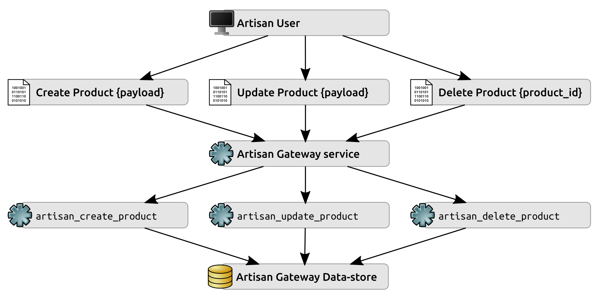
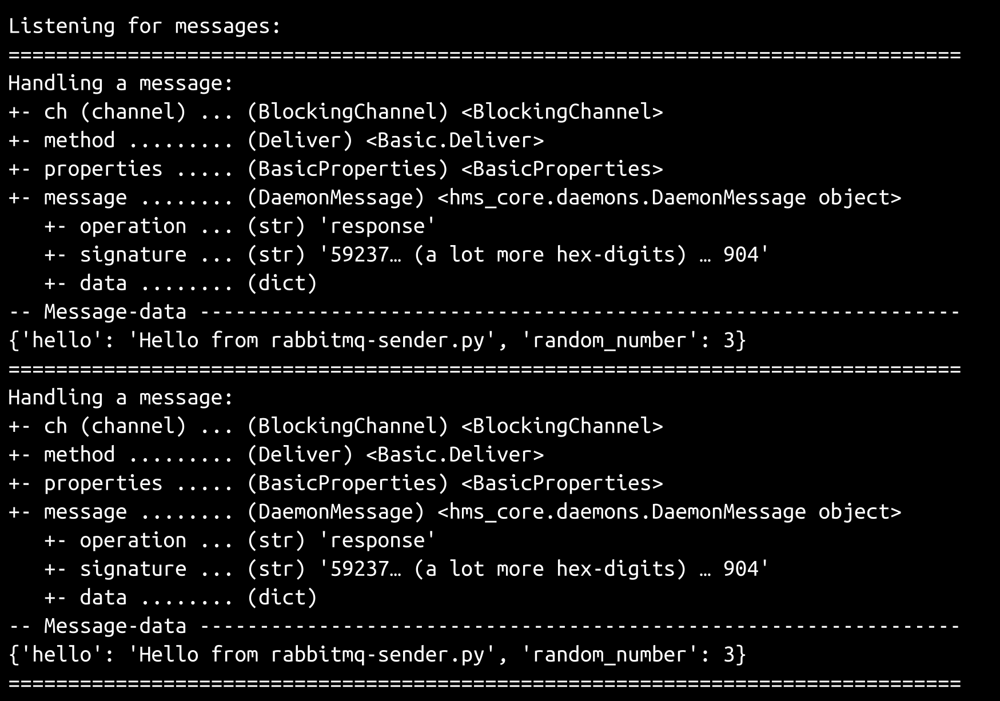
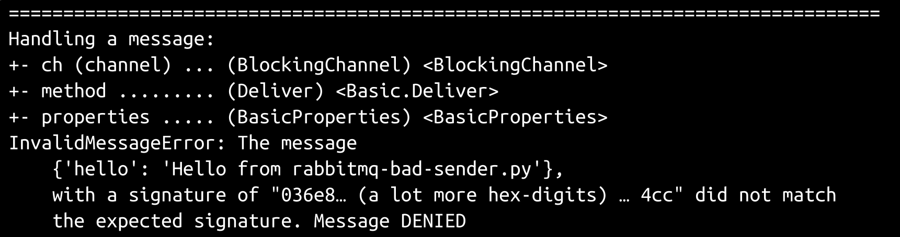
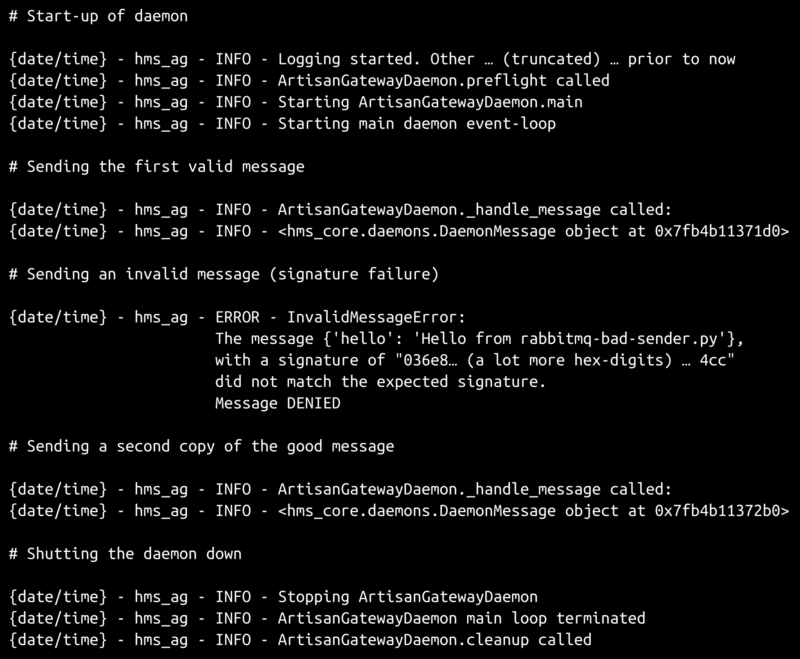
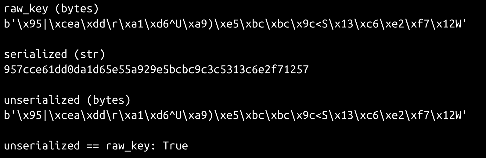

# 十六、Artisan 网关服务

为了实现最终用户和网关守护进程通信，我们需要检查守护进程的几个操作方面，并做出一些决定—它将如何工作、数据如何发送和接收以及数据如何处理。在本章中，我们将详细研究这一点，并根据这些决策编写代码来实现流程。

本章涵盖以下主题：

*   定义来回发送的数据结构（消息）的外观，以及它需要提供的内容，包括无论使用何种机制发送数据都应该工作的签名消息实现
*   检查发送和接收数据的两个基本选项：消息队列和 web 服务
*   如何独立于传输机制处理消息
*   实现基于消息队列的传输机制所需的基本结构
*   在基于 web 服务的方法中会遇到哪些变化（以及如何处理它们）
*   进出 Artisan 网关的流量是什么样子的
*   将这些流量模式最小限度地集成到现有数据对象的当前进程中

# 概述和目标

在`hms_sys`系统的上下文中，Artisan Gateway 到目前为止只是一个松散的定义——它被描述为 Artisan 和中央办公室之间通信的中心联络点，特别是关于`Product`和`Order`对象——实际上它的作用是什么。它如何工作以及何时工作的细节还没有真正被提及，尽管后者中至少有一些可能是非常明显的，遵循一个简单的规则，即（由任何人）所做的更改需要尽快传播给所有相关方。这些更改在很大程度上取决于谁在进行更改。至少，以下过程是可能的：

*   工匠可以创建新的`Product`数据
*   工匠可以更新当前的`Product`数据
*   工匠可以直接删除`Product`
*   中央办公室工作人员可以将`Product`标记为可用–这只是`Product`更新过程的一个特殊变体
*   中央办公室工作人员还可以对产品进行内容更改，这也是一种更新变体，但对可以更改的内容有一些限制
*   客户终端用户可以间接创建`Order`对象，这些对象需要以某种方式传播给工匠
*   工匠可以在完成订单的过程中更新订单

所有这些过程都是`Product`和/或`Order`对象上 CRUD 操作的变体，可能不需要比每个子系统中相关类的`_create`或`_update`方法提供的功能更多的功能。它们应该涵盖数据更改的实际存储方式的大部分（可能是全部）。

这些数据更改的传输，无论时间或协议最终看起来如何，也有一些共同因素，需要处理以下步骤的角色特定变化：

*   数据更改（创建、更新或删除）在一个用户级应用程序中本地进行
*   对数据更改进行验证，以确保数据格式良好并符合数据结构要求
*   数据更改存储在本地（如果适用）
*   数据更改被序列化并传输到 Artisan 网关服务，在那里执行任何需要执行的操作

这些步骤不会解决冲突更改的可能性，例如工匠和中央办公室的人员在同一数据更改时间范围内对同一数据进行不同更改。根据具体的数据变化业务规则，处理这种可能性的策略甚至可能没有必要，但也必须进行检查。

这就只剩下关于传输方法本身的决定了。由于将对数据进行更改的单个用户不应位于相同的物理位置，因此我们需要某种网络传输协议–一种基于 web 服务或消息队列的过程，如[第 15 章](15.html)、*服务剖析*中所述。如果 web 服务是从头开始编写的，那么它可能是一项更大的任务，可能需要代码来处理身份验证、授权和处理特定 HTTP 方法的过程，并将它们与针对单个数据对象类型的特定 CRUD 操作联系起来。这两者之间存在足够的复杂性，因此有必要查看现有的支持服务的框架，例如 Flask 或 Django，而不是编写（并且必须测试）所有相关代码。

考虑到系统只需要关注前面确定的七个操作（Artisan：创建、更新或删除产品，等等），编写这七个函数并允许基于队列的协议中的消息在必要时简单地调用它们感觉更简单。通过为每个 Artisan 分配其自己的不同队列，并可能对每个由 Artisan 发起的消息进行签名，可以显著缓解有关身份验证和授权的潜在问题。在这两种方法之间，工匠的身份可以简单地通过消息来自与其关联的给定队列这一事实来确定。将其与每条消息上的签名相耦合，只要它可以由 Artisan 的应用程序生成并由 Artisan 网关服务验证，而无需将任何机密数据与消息一起传输，就可以提供相当健壮的身份验证机制。在这种情况下，授权问题几乎无关紧要——任何给定的通道都可以与某个用户类型，甚至某个特定用户相关联，只允许访问（并执行）与该用户或类型相关的操作。

在较高级别上，无论选择哪种传输机制，工匠/产品操作的数据流如下所示：



哪里：

*   各种消息（**创建产品**、**更新产品**和**删除产品**及其各自的**{payload}**数据（或用于删除操作的**{Product_id}**由本地**Artisan 应用程序**创建，并传输到服务器**Artisan 网关**服务
*   这些消息被读取、验证并用于确定应该调用哪个服务方法（`artisan_create_product`等等）
*   相关方法处理在执行期间需要在**Artisan Gateway 数据存储**中存储的任何数据

对于中央办公室用户可以针对`Product`对象执行的所有操作，以及`Artisan`和`Order`对象交互，至少存在类似的数据流。此外，在更具体的中央办公室角色中，可能需要为更具体的数据对象操作提供相关的操作。中央办公室的工作人员至少需要能够管理`Artisan`对象，可能还需要管理`Order`对象。

# 迭代故事

尽管这些故事中至少有*一些*方面依赖于一些尚未检查过的 UI 实现，但它们中的每一个都有一些非 UI 功能方面可以有效地检查和处理。考虑到这一点，与此迭代相关的故事（至少在最初）如下所示：

*   作为 Artisan，我需要能够将数据更改发送到 Artisan 网关，以便可以根据需要传播和执行这些更改
*   作为一名中央办公室用户，我需要能够将数据更改发送到 Artisan 网关，以便可以根据需要传播和执行这些更改
*   作为 Artisan Manager，我需要能够创建`Artisan`对象，以便管理 Artisan
*   作为 Artisan Manager，我需要能够删除`Artisan`对象，以便管理 Artisan
*   作为 Artisan Manager，我需要能够更新`Artisan`对象，以便管理 Artisan
*   作为一名工匠，我需要能够创建`Product`对象，以便管理我的产品
*   作为一名工匠，我需要能够删除`Product`对象，以便管理我的产品
*   作为一名工匠，我需要能够更新`Order`对象，以便我能够向中央办公室指示何时完成我的订单部分
*   作为一名工匠，我需要能够更新`Product`对象，以便管理我的产品
*   作为一名技工，我需要能够更新我自己的`Artisan`对象，以便在 HMS 中央办公室管理我的信息
*   作为产品经理，我需要能够激活`Product`对象，以便管理产品可用性
*   作为产品经理，我需要能够停用`Product`对象，以便管理产品可用性
*   作为产品经理，我需要能够更新`Product`对象，以便能够管理工匠无法管理的产品信息
*   任何用户在 Artisan Gateway 服务之间发送消息时，我都需要对这些消息进行签名，以便在对其进行操作之前对其进行验证

除了最后一项之外，这些都或多或少地按照在实际用例中需要执行的顺序进行了分组：中央办公室用户（充当 Artisan Manager）需要创建代表 Artisan 的对象，才能期望这些 Artisan 做任何事情，并且 Artisan 必须能够创建`Product`在 Central Office 用户（充当产品经理）之前的对象可以对这些对象执行任何操作。

# 信息

在认真研究传输机制选项之前，最好对所传输的消息的确切构成有一个明确的定义。至少，考虑到进入 Artisan Gateway 服务的数据流看起来是什么样的，并且对于正在传输的典型数据对象的实际数据意味着什么，显然消息需要能够处理结构化数据。在内部，这可能最好用一个`dict`来表示，因为它们很容易序列化和反序列化为至少两种不同的格式，并且易于传输：JSON 和 YAML。我们已经为状态数据可以存储的对象建立了数据字典结构。例如，从一个工匠的角度来看，`Product`的数据字典已经呈现为 JSON，如下所示：

```py
{
    "oid": "a7393e5c-c30c-4ea4-8469-e9cd4287714f", 
    "modified": "2018-08-19 07:13:43", 
    "name": "Example Product", 
    "created": "2018-08-19 07:13:43", 
    "description": "Description  TBD", 
    "metadata":{
        "wood": "Cherry, Oak"
    }, 
    "available": false, 
    "dimensions": "2½\" x 4\" x ¾\"", 
    "shipping_weight": 0.5, 
    "summary": "Summary TBD", 
}
```

这提供了工匠发起的`Product`的任何创建或更新操作所需的所有数据，但没有指定需要使用数据执行的操作。它也没有任何与之关联的签名数据，我们希望提供这些数据来完成前面提到的最后一个迭代故事。操作和签名这两项都需要添加到消息中，但不需要添加到消息数据中，这样在接收端创建`Product`对象的实例就不必从传入的数据结构中删除非产品数据。

在消息的上下文中，它们都是元数据：关于数据的数据，在本例中描述如何处理真实数据，以及应该使用什么签名来验证消息的完整性。一条更完整的消息，旨在更新现有产品（提供描述和摘要，并使该项目可用）如下所示（假设在更新操作期间传输所有产品数据）：

```py
{
    "data":{
        "oid": "a7393e5c-c30c-4ea4-8469-e9cd4287714f", 
        "modified": "2018-08-19 07:41:56", 
        "name": "Example Product", 
        "created": "2018-08-19 07:13:43", 
        "description": "Cherry and oak business-card holder", 
        "metadata": {
            "wood": "Cherry, Oak"
        }, 
        "available": true, 
        "dimensions": "2½\" x 4\" x ¾\"", 
        "shipping_weight": 0.5, 
        "summary": "Cherry and oak business-card holder", 
    },
    "operation":"update",
    "signature":"{Hash hexdigest}"
}
```

作为输出目标的数据结构为我们提供了足够的信息来实现一个`DaemonMessage`类，以表示发送到 Artisan 网关服务或来自 Artisan 网关服务的任何消息。`DaemonMessage`是一个具体的类，生活在`hms_core.daemons`模块中。它从一个典型的类声明开始，并定义了一个类常量，稍后将用于在实例和类方法中将字符串值编码为字节值：

```py
class DaemonMessage(object):
    """
Represents a *signed* message being sent to or received from a 
BaseDaemon instance.
"""
    ###################################
    # Class attributes/constants      #
    ###################################

    # - class-constant encoding-type for signature processes
    __encoding = 'utf-8'
```

`DaemonMessage`的大多数属性都遵循我们到目前为止一直使用的标准 getter、setter 和 deleter 方法/属性声明模式。其中一个是`signature`属性，每次调用它时都需要返回一个计算出的值，它只是有一个 getter 方法定义–`_get_signature`：

```py
    ###################################
    # Property-getter methods         #
    ###################################

# ...

    def _get_signature(self) -> str:
        if not self.data:
            raise RuntimeError(
                '%s.signature cannot be calculated because there is '
                'no data to sign' % (self.__class__.__name__)
            )
        if not self.signing_key:
            raise RuntimeError(
                '%s.signature cannot be calculated because there is '
                'no key to sign data with' % (self.__class__.__name__)
            )
        return sha512(
            bytes(
                # - We're using json.dumps to assure a consistent 
                #   key-order here...
                json.dumps(self.data, sort_keys=True), self.__encoding
            ) + self.signing_key
        ).hexdigest()
```

`_get_signature`方法在实现过程中有几个值得注意的方面。首先，由于签名应该仅在有数据要签名和签名密钥值要签名的情况下可用，因此它会主动检查这些值，如果未设置任何一个值，则会引发`RuntimeError`。其次，它的返回值必须确保同一数据结构的数据结构哈希值始终相同。Python 的`dict`数据结构不能保证多个`dict`值的键序列相同，即使它们之间存在相同的键。

由于散列机制需要一个`bytes`值，并且将`dict`呈现为`bytes`（使用`str()`转换作为中间转换机制）并不总是返回相同的`bytes`序列进行散列，因此一些确保实例的`data dict`始终呈现为一致的`str`/`bytes`的机制顺序是必需的。由于用于生成签名的散列过程中的值可以作为字符串开始，并且由于`json.dumps`提供了一种递归排序输出密钥的机制，因此这是一个快速而简单的解决方案。

The selection of `json.dumps` was made based on simplicity and convenience. It might be better in the long run to create an `OrderedDict` instance (from the `collections` module), add each element, in order, to the new instance, then hash the string value of that instead. If nothing else, that would alleviate any potential concerns with data structures to be hashed containing values that cannot be serialized into JSON. Another option would be to hash a YAML value instead, since it deals with data types that aren't directly serialize-able in a cleaner fashion.

属性 setter 和 deleter 方法是足够典型的实现，它们在解释方面没有太多保证，尽管与操作属性（`_set_operation`相对应的 setter 方法根据有限的选项集检查传入值。

到目前为止，与我们使用的典型属性模式的一个显著差异是，`DaemonMessage`将其大多数属性公开为可设置和可删除。该决定背后的基本原理是，当消息第一次需要创建时，消息的`data`、`operation`和`signing_key`值可能并不都是已知的，或者甚至可能需要在其他进程发送消息之前对其进行更改。允许动态地设置或删除它们可以缓解以后使用`DaemonMessage`实例的实现中的任何此类问题。结合签名的动态计算值实现（以及在返回之前检查所需的属性值），这将提供我们以后需要的灵活性，同时仍然保留这些属性的类型和值检查：

```py
    ###################################
    # Instance property definitions   #
    ###################################

    data = property(
        _get_data, _set_data, _del_data, 
        'Gets, sets, or deletes the data/content of the message'
    )
    operation = property(
        _get_operation, _set_operation, _del_operation, 
        'Gets, sets, or deletes the operation of the message'
    )
    signature = property(
        _get_signature, None, None, 
        'Gets the signature of the message'
    )
signing_key = property(
        _get_signing_key, _set_signing_key, _del_signing_key, 
        'Gets, sets, or deletes the signing_key of the message'
    )
```

因此，`DaemonMessage`的初始化不需要提供任何这些属性来构造实例，但它允许所有这些属性：

```py
    ###################################
    # Object initialization           #
    ###################################

    def __init__(self, 
        operation:(str,None)=None, data:(dict,None)=None, 
        signing_key:(bytes,str,None)=None
    ):
        """
Object initialization.

self .............. (DaemonMessage instance, required) The instance to 
                    execute against
operation ......... (str, optional, defaults to None) The operation 
                    ('create', 'update', 'delete' or 'response') that 
                    the message is requesting
data .............. (dict, optional, defaults to None) The data of the 
                    message
signing_key ....... (bytes|str, optional, defaults to None) The raw 
                    data of the signing-key to be used to generate the 
                    message-signature.
"""
        # - Call parent initializers if needed
        # - Set default instance property-values using _del_... methods
        self._del_data()
        self._del_operation()
        self._del_signing_key()
        # - Set instance property-values from arguments using 
        #   _set_... methods
        if operation:
            self.operation = operation
        if data:
            self.data = data
        if signing_key:
            self.signing_key = signing_key
```

由于`DaemonMessage`类的目的是提供一种简单、一致的方法来生成序列化为 JSON 的消息，并且需要一个`dict`值来进行序列化，因此我们提供了两种方法：

```py
    def to_message_dict(self):
        return {
            'data':self.data,
            'operation':self.operation,
            'signature':self.signature,
        }

    def to_message_json(self):
        return json.dumps(self.to_message_dict())
```

类似地，我们需要一种方法，使用 mediate-from-dictionary 方法来取消 JSON 消息的序列化。这些被实现为类方法，允许使用签名密钥创建和验证消息实例。该功能的关键方面都存在于`from_message_dict`类方法中：

```py
    @classmethod
    def from_message_dict(cls, 
        message_dict:(dict,), signing_key:(bytes,str)
    ):
        """
message_dict ...... (dict, required) The incoming message as a dict, 
                    that is expected to have the following structure:
                    {
                        'data':dict,
                        'operation':str, # (create|update|delete|response)
                        'signature':str # (hash hex-digest)
                    }
signing_key ....... (bytes|str, optional, defaults to None) The raw 
                    data of the signing-key to be used to generate the 
                    message-signature.
"""
```

首先对传入参数执行典型的类型和值检查：

```py
        if type(message_dict) != dict:
            raise TypeError(
                '%s.from_message_dict expects a three-element '
                'message_dict value ({"data":dict, "signature":str, '
                '"operation":str}), but was passed "%s" (%s)' % 
                (cls.__name__, data, type(data).__name__)
            )
        if type(signing_key) not in (bytes,str):
            raise TypeError(
                '%s.from_message_dict expects a bytes or str signing_key '
                'value, but was passed "%s" (%s)' % 
                (cls.__name__, signing_key, type(signing_key).__name__)
            )
if type(signing_key) == str:
            signing_key = bytes(signing_key, cls.__encoding)
```

新的`DaemonMessage`实例由传入`message_dict`的数据和操作值创建，并在确保所有数据都存在且格式正确后由`signing_key`参数创建：

```py
        _data = message_dict.get('data')
        if not _data:
            raise ValueError(
                '%s.from_message_dict expects a three-element dict '
                '({"data":dict, "signature":str, "operation":str}), '
                'but was passed "%s" (%s) which did not include a '
                '"data" key' % 
                (cls.__name__, data, type(data).__name__)
            )
        _signature = message_dict.get('signature')
        if not _signature:
            raise ValueError(
                '%s.from_message_dict expects a three-element dict '
                '({"data":dict, "signature":str, "operation":str}), '
                'but was passed "%s" (%s) which did not include a '
                '"signature" key' % 
                (cls.__name__, data, type(data).__name__)
            )
        _operation = message_dict.get('operation')
        if not _operation:
            raise ValueError(
                '%s.from_message_dict expects a three-element dict '
                '({"data":dict, "operation":str, "operation":str}), '
                'but was passed "%s" (%s) which did not include a '
                '"operation" key' % 
                (cls.__name__, data, type(data).__name__)
            )
        result = cls(_operation, _data, signing_key)
```

一旦新的`DaemonMessage`实例存在，如果其数据具有相同的密钥和值，并且用于生成签名的本地`signing_key`与传输前用于创建原始消息的`signing_key`相同，则两条消息的签名值应相同。如果他们没有，那么消息就有可疑之处。签名失败的可能原因不多：

*   消息中的`data`已以某种方式损坏/更改

*   本地和远程`signing_key`值不同

在任何一种情况下，都不应采取任何行动——要么数据本身可疑，要么无法验证消息的真实性。在任何签名失败的情况下，我们都会引发一个自定义错误，`InvalidMessageError`：

```py
        if result.signature == _signature:
            return result
        raise InvalidMessageError(
            'The message %s, with a signature of "%s" did not match '
            'the expected signature. Message DENIED' % 
            (_data, result.signature)
        )
```

从 JSON 序列化消息到`DaemonMessage`实例的转换只是对传入的 JSON 进行解码，然后将结果`dict`数据结构输入`from_message_dict`，返回结果对象：

```py
    @classmethod
    def from_message_json(cls, json_in:(str,), signing_key:(bytes,str)):
        return cls.from_message_dict(json.loads(json_in), signing_key)
```

序列化 JSON 之间的消息不会影响我们选择 Artisan 网关服务实际如何传输这些消息。上面提到的两个选项，web 服务和消息队列方法，都可以处理 JSON 消息格式——因此这个消息策略在这方面是非常可移植的。

`DaemonMessage`的签名过程在很大程度上依赖于为消息创建和管理签名密钥的思想——没有这些密钥，消息就无法发送或读取——在继续之前，有一些重要的考虑事项需要讨论。

与任何加密过程一样，基于散列的签名依赖于必须创建和保护的秘密值（在本例中为`signing_key`）。关于创建`signing_key`，有几个因素需要牢记，但最重要的两个方面如下：

*   值越长，越难破解
*   书中的人物越多，就越难破解

其数学基础相当简单：迭代 10 个值所需的时间比迭代 100 个值所需的时间要少，因此任何类型的秘密值中可能出现的变化越多，迭代所有值所需的时间就越长。可能值的数量可以数学表示为（每个字符的值数量）<sup>（字符串中的字符数量）</sup>，因此一个包含 255 个可能字符的 128 个字符`signature_key`将包含 255 个<sup>128 个</sup>可能值，或大约 1.09×10<sup>308</sup>必须检查的组合，以保证计算出该尺寸和范围的`signature_key`。以每秒 10 亿次这样的计算，或者每年大约 3.15×10<sup>16</sup>次这样的计算，从技术上/数学上来说，破解这样一个`signing_key`仍然是可能的，但假设哈希算法没有任何可以利用的重大缺陷，那么它充其量是不切实际的。

创建任意长度的`signature_key`是相当简单的。Python 的`os`模块提供了一个函数`urandom`，该函数返回适合加密使用的字符序列（作为`bytes`对象），长度可以任意，因此即使生成很长的密钥，也只需调用以下命令即可：

```py
os.urandom(1024)
```

如果需要，可以将结果转换为十六进制字符串值进行存储，并使用`bytes.fromhex()`从该十六进制字符串转换回：

```py
import os

example_key = os.urandom(1024)
print(example_key)

example_key_hex = example_key.hex()
print(example_key_hex)

example_from_hex = bytes.fromhex(example_key_hex)
print(example_from_hex == example_key)

# Yields:
# b'!\x0cW\xe5\x89\x7fan ... a LOT more gibberish-looking characters...'
# 210c57e5897f616ec9157f759617e7b4f ... a LOT more hexadecimal digits...
# True
```

保护秘密值通常涉及以下几种组合：

*   确保在静止状态下对其进行加密，这样即使机密所在的数据存储被泄露，机密本身也无法轻松使用
*   确保它们在运动中加密，以防止中间人利用漏洞访问易于使用的密钥
*   以合理的频率更改（旋转）它们，以减少捕获的秘密在不再有用之前被泄露的可能性

在[第 17 章](17.html)、*处理服务事务*中，将对工匠`signing_key`价值观的创建和管理（以及中央办公室与工匠之间的沟通）以及实施某种关键轮换流程的可能性进行更详细的研究。

不过，确保它们在运动中被加密可能是决定消息如何传输的一个重要因素。正在运行的加密需要为 web 服务或本地托管的消息队列实现创建加密证书。消息队列方法可能允许使用私有证书，而 web 服务可能需要来自公共证书颁发机构的证书。

Encryption in motion should always be implemented when transmitting any secret information, and a `signing_key` definitely falls into that category!

静态加密对于这样一个范围的系统来说似乎有些过分，尽管它可以通过 PyCrypto 之类的库在代码中实现，和/或通过配置 MongoDB 引擎来使用其加密存储引擎（可在 MongoDB Enterprise 中获得）。这也会增加系统的复杂性，包括（再次）密钥的创建和管理。

# 确定消息传输机制

随着传递的消息的结构现在已经解决，现在是深入研究如何传输这些消息的选项的好时机。最终，需要就如何实施处理故事的流程做出决定：

*   作为 Artisan，我需要能够将产品和订单数据更改发送到 Artisan 网关，以便可以根据需要传播和执行这些更改
*   作为中央办公室用户，我需要能够将 Artisan 和产品数据更改发送到 Artisan 网关，以便可以根据需要传播和执行这些更改

在前面讨论的两个选项（基于 web 服务或消息队列的实现）中，使用消息队列感觉更合适：

*   考虑到预期的操作数量有限，基于队列的方法将比 web 服务实现涉及更少的开发工作，并且可能会更少的复杂性：

    *   在实现 web 服务时，不需要处理任何协议级别的细节（HTTP 方法、数据有效负载结构的变化等）
    *   无需编写完整的 HTTP 服务器（从头开始，或使用`http.server`包提供的一个服务器类），也无需将功能/代码与多个 web 框架选项（例如 Flask 或 Django REST 框架）中的任何一个集成
*   消息可以被发送，只需在队列中等待，直到被检索并执行操作，因此：

    *   只要队列服务器是可访问的，所有最终用户都可以不中断地继续使用其应用程序
    *   Artisan 网关本身可以在任何时候关闭（用于维护、更新，甚至移动到其他服务器）

但是，这种方法有一些警告/权衡：

*   尽管仍将检索和处理包含冲突数据更改的消息，但可能需要额外的手动注意以协调这些更改。在 web 服务上下文中也可能发生同样的情况，但至少在消息队列中更可能发生这种情况。
*   消息检索作为网络上的一个活动过程，可能比简单地读取直接向 Artisan 网关发出的传入请求需要更长的时间。因此，服务吞吐量可能会受到影响，但即使一个完整的消息操作周期需要 10 秒，这将允许每小时进行 360 次操作（每天超过 8600 次操作，或一年中超过 31000000 次操作），前提是这些操作不是并行执行的。
*   如果消息队列提供程序宕机，首先会阻止传递消息，这可能会中断最终用户应用程序的使用。

*   必须考虑消息队列的分配：

    *   如果每个 Artisan 都有自己的队列，进出 Artisan 网关，则必须存储和管理至少一些关于这些队列的数据，并且必须单独检查每个 Artisan 到网关队列
    *   如果所有 Artisan 共享一个到 Artisan 网关的入站队列，则必须为每个操作实现对给定消息源于哪个 Artisan 的标识
*   由于消息协议中没有隐含的响应要求来表明已对其进行了操作（或由于错误而无法进行操作），因此必须主动/独立地发送对需要发送给用户的消息的任何响应。

*   作为 Artisan，我需要为我创建并分配一个消息队列，以便我可以将数据更改发送到 Artisan 网关。

# 用 RabbitMQ 实现消息队列

`hms_sys`项目将使用 RabbitMQ 作为其消息队列提供程序。RabbitMQ 是一个积极维护的零成本解决方案，具有付费支持和咨询选项，是一个很好的低预算选择。此外，还有一个随时可用的 Python 库`pika`（与`pip install pika`一起安装），它提供了从 RabbitMQ 服务器发送和接收消息所需的所有关键功能，而无需过多地从头开始实施解决方案。关键软件 RabbitMQ 的制造商还提供了一个商业版本，其中包括附加的管理功能以及支持协议。

There are other options available for message-queue implementations, including cloud-based solutions from Amazon (SQS), Microsoft (Azure Service Bus), and Google (Cloud Pub/Sub), all of which have corresponding Python libraries available for use. Locally installable options include Apache Kafka and ActiveMQ, and Kestrel. There is also a general-purpose AMQP library available (`amqp`) that should allow connection to and interaction with any message queue service that uses at least a basic AMQP protocol.

使用`pika`向 RabbitMQ 实例发送消息相当简单。下面是一个简单的示例，使用`DaemonMessage`类生成并签署消息：

```py
#!/usr/bin/env python
# - scratch-space/rabbitmq-sender.py
# - Derived from RabbitMQ - RabbitMQ tutorial - "Hello world!"
#   https://www.rabbitmq.com/tutorials/tutorial-one-python.html

# The pika library is for communicating with RabbitMQ
import pika

# Use DaemonMessage to format our messages
from hms_core.daemons import DaemonMessage
```

由于我们正在传输一个`DaemonMessage`，我们需要生成一个签名密钥和消息数据：

```py
# Message-items
# - Signing-key
signing_key = '!:iLL>S@]BN;h%"h\'<2cPGsaKA 3vbGJ'
# - Message data (a dict)
```

```py
message_data = {
    'hello':'Hello from %s' % __file__,
    'random_number':3, # not a random number yet
}
```

然后我们创建消息：

```py
# - The actual message to be sent
message = DaemonMessage(
    'response', message_data, signing_key
)
```

接下来，我们建立到 RabbitMQ 服务器的连接：

```py
# RabbitMQ connection and related items
# - Create a connection
connection = pika.BlockingConnection(
    pika.ConnectionParameters('localhost')
)
# - Create (or at least specify) a channel
channel = connection.channel()
# - Create or specify a queue
channel.queue_declare(queue='hello')
```

然后发送消息并关闭连接：

```py
# Send the message
channel.basic_publish(
    exchange='', routing_key='hello', 
    body=message.to_message_json()
)

# Close the connection
connection.close()
```

执行此脚本不会生成任何输出，但可以使用`rabbitmqctl`命令行工具验证消息是否已发送：


第二次运行脚本，然后使用`rabbitmqctl list_queues`工具，显示另一条准备就绪且正在队列中等待的消息：


RabBMQ 需要提供一个通道（或者也许是队列名称是一个很好的描述），它可以为服务器上的消息提供组织分组，并且稍后我们将考虑使用特定的工匠来分隔消息。考虑下面的队列名称声明：

```py
# - Create or specify a queue
channel.queue_declare(queue='hello')

# Send the message
channel.basic_publish(
    exchange='', routing_key='hello', 
    body=message.to_message_json()
)
```

在此，前面的队列名称声明更改为：

```py
# - Create or specify a queue
channel.queue_declare(queue='queue_name') # Changed here

# Send the message
channel.basic_publish(
    exchange='', routing_key='queue_name',  # Changed here also
    body=message.to_message_json()
)
```

当我们使用`rabbitmqctl list_queues`查看队列和消息计数时，我们看到出现了一个新队列（`queue_name`，其中包含一条消息：


从队列中读取消息稍微复杂一些，但并不是很复杂。读取之前运行的`rabbitmq-sender.py`脚本发送到队列的消息的示例脚本的启动方式大致相同：

```py
#!/usr/bin/env python
# - scratch-space/rabbitmq-receiver.py
# - Derived from RabbitMQ - RabbitMQ tutorial - "Hello world!"
#   https://www.rabbitmq.com/tutorials/tutorial-one-python.html

import pika

from pprint import pprint
from hms_core.daemons import DaemonMessage
```

我们需要使用相同的签名键值，否则将不允许读取正在检索的邮件：

```py
signing_key = '!:iLL>S@]BN;h%"h\'<2cPGsaKA 3vbGJ'
```

通过提供一个回调函数来处理消息处理，该函数接受从队列获取消息的过程返回的所有消息属性：

```py
# - Define a message-handler function
def message_handler(ch, method, properties, body):
    print('Handling a message:')
    # - Some print-output removed to keep the listing here shorter
```

重要的是，我们将消息处理功能包装在一个`try`…`except`块中，这样，如果消息处理过程中出现错误，就不会终止我们稍后设置的主消息轮询循环。在这种情况下，至少会引发一个错误：如果由于签名无效而无法创建`DaemonMessage`，则会引发前面定义的`InvalidMessageError`错误：

```py
    try:
        message = DaemonMessage.from_message_json(
            body.decode(), signing_key
        )
        print(
            '+- message ........ (%s) %r' % 
            (type(message).__name__, message)
        )
        print(
            '   +- operation ... (%s) %r' % 
            (type(message.operation).__name__, message.operation)
        )
        print(
            '   +- signature ... (%s) %r' % 
            (type(message.signature).__name__, message.signature)
        )
        print(
            '   +- data ........ (%s)' % 
            (type(message.data).__name__)
        )
        print('-- Message-data '.ljust(80,'-'))
        pprint(message.data)
        print('='*80)
    except Exception as error:
        print('%s: %s' % (error.__class__.__name__, error))
```

创建连接以及将通道或队列名称与其关联的过程相同：

```py
# Create a connection
connection = pika.BlockingConnection(
    pika.ConnectionParameters('localhost')
)
# - Create (or at least specify) a channel
channel = connection.channel()
# - Create or specify a queue
channel.queue_declare(queue='hello')
```

不过，在这种情况下，我们使用的是消息，而不是发送它们，因此我们需要设置：

```py
# - Set up a consumer
channel.basic_consume(
    message_handler, queue='hello', no_ack=True
)
```

最后，我们可以开始监听消息：

```py
# - Listen for messages
print('Listening for messages:')
print('='*80)
channel.start_consuming()
```

在执行时，此脚本设置自己的事件循环，侦听指定队列/通道上的消息。这大致相当于`BaseDaemon.main`需要派生守护程序类的事件循环，尽管实际的守护程序实现可能不使用它。运行此脚本后，它将读取并输出第一个脚本先前发送的两条消息的内容：



This also allows us to verify that the signatures of the two messages, with identical content and using the same signing key, are identical. This is expected behavior, given that message data and the signing key input did not change between sending the two messages.

假设我们更改签名密钥：

```py
#!/usr/bin/env python
# - scratch-space/rabbitmq-bad-sender.py
# - Derived from RabbitMQ - RabbitMQ tutorial - "Hello world!"
#   https://www.rabbitmq.com/tutorials/tutorial-one-python.html

# ... Interim script-code removed for brevity

# Message-items
# - Signing-key
signing_key = 'Invalid signing key'

# ...
```

然后重新运行相同的脚本；我们从消息侦听器获得不同的结果：



这是对消息签名过程是否能按预期工作的额外验证：不允许创建具有无效签名的消息，因此不会对其采取行动。

该消息处理功能只需稍作更改，即可作为 Artisan 网关主类的`main`循环的基础：

```py
class ArtisanGatewayDaemon(BaseDaemon):
    """
Provides the main ArtisanGateway daemon/service.
"""
```

我们仍然需要一个消息处理函数，但现在它被定义为服务类的方法：

```py
    def _handle_message(self, message:(dict,)) -> None:
        self.info(
            '%s._handle_message called:' % self.__class__.__name__
        )
        self.info(str(message))
```

`ArtisanGatewayDaemon`类的`main`循环可以从接收方脚本简单地重新转换原始功能开始：

```py
    def main(self):
        """
The main event-loop (or whatever is equivalent) for the service instance.
"""
```

最初，为了确定所需的功能是可行的，我们将使用前面确定的相同的`signing_key`、`connection`和`channel`值。最终，这些将取决于配置值——指定签名密钥，或者至少在何处或如何获取签名密钥——以及最终实现是否遵循拥有单个 Artisan 队列的路径，可能有多个队列名称/通道，或者只有一个。目前，仅使用前面脚本中使用的一个就可以建立基本的队列读取功能：

```py
        signing_key = '!:iLL>S@]BN;h%"h\'<2cPGsaKA 3vbGJ'
        connection = pika.BlockingConnection(
            pika.ConnectionParameters('localhost')
        )
        channel = connection.channel()
        channel.queue_declare(queue='hello')
```

`main`执行的循环的基本结构类似于[第 15 章](15.html)*服务剖析*中`testdaemon`的主循环结构——只要类的内部`_running`标志为`True`，循环就会继续，执行队列检查并处理传入消息。一旦循环终止，无论是通过类的`stop`方法还是通过`ArtisanGatewayDaemon.__init__`执行`BaseDaemon.__init__`期间注册的信号之一，控制退出，并在类的`cleanup`方法完全终止之前调用它。

正如预期的那样，主要的区别是在循环的每个迭代过程中实际发生了什么。在这种情况下，轮询`channel`以获取下一条可用消息，如果检测到一条，则读取该消息，将其转换为`DaemonMessage`，确认并传递给前面定义的消息处理程序方法。它需要相同种类的`connection`和`channel`：

```py
    # - To start with, we're just going to use the same 
    #   parameters for our pika connection and channel as 
    #   were used in the rabbitmq-sender.py script.
    connection = pika.BlockingConnection(
        pika.ConnectionParameters(
            self.connection_params['host'],
            self.connection_params.get('port'),
            self.connection_params.get('path'),
        )
    )
    # - Create (or at least specify) a channel
    channel = connection.channel()
    # - Create or specify a queue
    channel.queue_declare(queue=self.queue_name)
```

一旦这些都建立起来，`main`循环就非常简单：

```py
    # - Normal BaseDaemon main-loop start-up:
    self._running = True
    self.info('Starting main daemon event-loop')
    # - Rather than use a channel-consumer (see the example in 
    #   rabbitmq-reciever.py), we're going to actively poll for 
    #   messages *ourselves*, in order to capture just the 
    #   message-body - that's what we really care about in 
    #   this case...
    while self._running:
        try:
            # - Retrieve the next message from the queue, if 
            #   there is one, and handle it...
            method_frame, header, body = channel.basic_get(self.queue_name)
            if method_frame:
                # - Any actual message, valid or not, will 
                #   generate a method_frame
                self.debug('received message:')
                message = DaemonMessage.from_message_json(
                    body.decode(), self.signing_key
                )
                self.debug('+- %s' % message.data)
                # - If we've received the message and processed 
                #   it, acknowledge it on basic principle
                channel.basic_ack(method_frame.delivery_tag)
                self._handle_message(message)
        except InvalidMessageError as error:
            # - If message-generation fails (bad signature), 
            #   we still need to send an acknowledgement in order 
            #   to clear the message from the queue
            err = '%s: %s' % (error.__class__.__name__, error)
            self.error(err)
            channel.basic_ack(method_frame.delivery_tag)
        except Exception as error:
            # Otherwise, we just log the error and move on
            err = '%s: %s' % (error.__class__.__name__, error)
            self.error(err)
            for line in traceback.format_exc().split('\n'):
                self.error(line)
    self.info('%s main loop terminated' % (self.__class__.__name__))
```

为了测试这一点，组装了一个快速的基本配置文件，主要用于记录信息，并使用该配置创建并启动了一个新类的实例。从启动到关闭的日志输出，包括发送一条好消息、一条坏消息，然后是另一条好消息，表明一切都按预期运行：



此守护进程实例的快速基本配置非常简单：

```py
# Logging configuration
# scratch-space/hms_ag_conf.yaml
logging:
  format: "%(asctime)s - %(name)s - %(levelname)s - %(message)s"
  name: hms_ag
  console:
    level: info
  file:
    level: info
    logfile: "/tmp/hms_ag.log"
```

队列参数也应该驻留在配置文件中，并由守护进程实例获取。其他配置值最终如下所示：

```py
queue:
  type: rabbit
  connection:
    host: localhost
    port: 5672
    path: /
  queue_name: "central-office"
signing_key: "0T*)B{Y#.C3yY8J>;1#<b\\q^:.@ZQjg2 tG~3(MJab_"
```

加载这些值的过程包括添加一些实例属性，这些属性大多遵循目前使用的正常模式：

*   `connection_params`：一个 dict 值，其值从用于创建 RabbitMQ 连接的配置文件的连接部分检索
*   `queue_name`：字符串，实例监听的队列名称/通道
*   `signing_key`：一个`bytes`或`str`值，该实例将用于创建在其队列上发送或从其队列中接收的`DaemonMessage`实例的签名密钥

实际上，获取和存储这些值只需要添加到类的`_on_configuration_loaded`方法中。最初，它所做的只是调用`BaseDaemon`父类的同一个方法来设置日志功能，这一点保持不变：

```py
    def _on_configuration_loaded(self, **config_data):
        # - Call the BaseDaemon function directly to set up logging, 
        #   since that's provided entirely there...
        BaseDaemon._on_configuration_loaded(self, **config_data)
```

接下来检索特定于队列的项目。虽然目前还不期望需要其他队列系统，但我们不能排除将来会出现这种情况，因此代码首先假设我们希望在将来考虑到这一点：

```py
        queue_config = config_data.get('queue')
        if queue_config:
            try:
                if queue_config['type'] == 'rabbit':
                    self._connection_params = queue_config['connection']
                    self.info(
                        'Connection-parameters: %s' % 
                        self.connection_params
                        )
                    self._queue_name = queue_config['queue_name']
                    self.info(
                        'Main queue-name: %s' % self.queue_name
                        )
                # If other queue-types are eventually to be supported, 
                # their configuration-load processes can happen here, 
                # following this pattern:
                # elif queue_config['type'] == 'name':
                #    # Configuration set-up for this queue-type...
                else:
                    raise RuntimeError(
                        '%s could not be configured because the '
                        'configuration supplied did not specify a '
                        'valid queue-type (%s)' % 
                        (self.__class__.__name__, queue_config['type'])
                    )
            except Exception as error:
                raise RuntimeError(
                    '%s could not be configured because of an '
                    'error -- %s: %s' % 
                    (
                        self.__class__.__name__, 
                        error.__class__.__name__, error
                    )
                )
        else:
            raise RuntimeError(
                '%s could not be configured because the configuration '
                'supplied did not supply message-queue configuration' % 
                (self.__class__.__name__)
            )
```

签名密钥也在配置文件中，因此接下来要获取和存储它：

```py
        # - The signing-key is also in configuration, so get it too
        try:
            self._signing_key = config_data['signing_key']
        except Exception as error:
            raise RuntimeError(
                '%s could not be configured because of an error '
                'retrieving the required signing_key value -- %s: %s' % 
                (
                    self.__class__.__name__, 
                    error.__class__.__name__, error
                )
            )
```

至少就目前而言，它负责删除 main 中使用的硬编码值所需的所有配置，同时保持类的功能。执行原始消息发送脚本的一个变体（在章节代码的`scratch-space/rabbitmq-sender-daemon-queue.py`中）表明，守护进程在这些更改中仍按预期运行–侦听有效消息并对其进行操作。

# 处理消息

为了实际处理消息的数据，我们需要定义格式良好的命令消息的实际外观，实现执行允许的命令的方法，并实现知道如何调用这些方法的功能，给定一个格式良好且经过验证的消息。该列表中的第一项非常简单，但可能有许多不同的有效实现模式。考虑到，在这一点上，我们允许通过四个不同的操作动作来发送：T1 T1，To T2，T3，^和 T4。这些操作动作直接对应于标准积垢操作，除了`'response'`值，尽管这可能大致相当于`read`操作。对于任何给定的数据对象类型，这些操作将分别需要执行相同的过程：

1.  使用`from_data_dict`类方法（或者新的等效类方法）和`save`新实例创建相关类的新实例，并填充消息中的状态数据
2.  使用`get`类方法检索相关类的现有实例，使用消息中的新值更新该实例的任何状态数据（这可能会受益于创建一个新方法，可能是`update_from_message`），以及`save`实例
3.  使用`delete`类方法查找并删除消息数据指定的实例

4.  检索并返回消息数据指定的实例的数据 dict 表示，使用`get`类方法进行检索，使用找到的实例的`to_data_dict`方法生成消息的数据结构

因此，守护进程需要有多达 16 个`{action}_{object}`方法，每个操作/对象组合一个，以确保所有组合都得到考虑。对于每种对象类型（工匠、客户、订单和产品），方法集的外观如下所示（方法名称不言自明）：

*   `create_artisan`

*   `update_artisan`

*   `delete_artisan`

*   `response_artisan`

对象类型是一个尚未说明的关键数据段，用于确定在收到命令消息时要执行哪些方法。`DaemonMessage`类没有对象类型的特定属性，因为最初的想法是这样做可能会不必要地限制将来对同时具有`operation`和对象类型的消息的使用。修改`DaemonMessage`以允许对象类型规范并不困难。它只需要添加一个可选属性，允许在`__init__`方法和调用它的任何其他方法中使用另一个可选参数，并在字典输出方法中对其进行说明。但是，这样做似乎是不必要的：消息本身作为结构化数据，可以很容易地包含必要的数据。作为一个例子，考虑一个“创建工匠”消息，看起来像这样：

```py
{
    "data":{
        "target":"artisan",
        "properties":{
            "address":"1234 Main Street, etc.",
            "company_name":"Wirewerks",
            "contact_email":"jsmith@wirewerks.com",
            "contact_name":"John Smith",
            "website":"http://wirewerks.com",
        }
    },
    "operation":"create",
    "signature":"A long hex-string"
}
```

如果任何命令消息都有一个操作，并在其数据中指示一个对象类型（“T0”值），该对象类型的属性将作为标准结构在操作中使用，则该操作同样有效。类似的数据结构也适用于更新操作：

```py
{
    "data":{
        "target":"artisan",
        "properties":{
            "address":"5432 West North Dr, etc.",
            "modified":"2019-06-27 16:42:13",
            "oid":"287db9e0-2fcc-4ff1-bd59-ff97a07f7989",
        }
    },
    "operation":"update",
    "signature":"A long hex-string"
}
```

对于删除操作：

```py
{
    "data":{
        "target":"artisan",
        "properties":{
            "oid":"287db9e0-2fcc-4ff1-bd59-ff97a07f7989",
        }
    },
    "operation":"delete",
    "signature":"A long hex-string"
}
```

以及响应操作：

```py
{
    "data":{
        "target":"artisan",
        "properties":{
            "oid":"287db9e0-2fcc-4ff1-bd59-ff97a07f7989",
        }
    },
    "operation":"response",
    "signature":"A long hex-string"
}
```

根据消息的操作和`data.target`值确定调用哪种方法只是一长串`if…elif…else`决策：

```py
def _handle_message(self, message:(dict,)) -> None:
    self.info(
        '%s._handle_message called:' % self.__class__.__name__
    )
```

因为我们需要目标（用于以后的决策）和属性（作为参数传递给方法），所以首先获取它们：

```py
    target = message.data.get('target')
    properties = message.data.get('properties')
```

`operation`和`target`的每个组合看起来都非常相似。从`create`操作开始：

```py
    if message.operation == 'create':
```

如果目标是已知的、允许的类型之一，那么我们可以调用适当的方法：

```py
        if target == 'artisan':
            self.create_artisan(properties)
        elif target == 'customer':
            self.create_customer(properties)
        elif target == 'order':
            self.create_order(properties)
        elif target == 'product':
            self.create_product(properties)
```

如果`target`未知，我们想抛出一个错误：

```py
        else:
            raise RuntimeError(
                '%s error: "%s" (%s) is not a recognized '
                'object-type/target' % 
                (
                    self.__class__.__name__, target, 
                    type(target).__name__
                )
            )
```

其他操作的工作方式大致相同–`update`操作，例如：

```py
    elif message.operation == 'update':
        if target == 'artisan':
            self.update_artisan(properties)
        elif target == 'customer':
            self.update_customer(properties)
        elif target == 'order':
            self.update_order(properties)
        elif target == 'product':
            self.update_product(properties)
        else:
            raise RuntimeError(
                '%s error: "%s" (%s) is not a recognized '
                'object-type/target' % 
                (
                    self.__class__.__name__, target, 
                    type(target).__name__
                )
            )
```

`delete`和`response`操作非常相似，在这里复制它们没有什么意义，但它们存在于代码中。最后，我们还捕获操作无法识别的情况，并在这些情况下引发错误：

```py
    else:
        raise RuntimeError(
            '%s error: "%s" (%s) is not a recognized '
            'operation' % 
            (
                self.__class__.__name__, operation, 
                type(operation).__name__
            )
        )
```

由于数据对象设计/结构和传入消息的结构，实际操作方法相对简单。创建一个`Artisan`，例如：

```py
def create_artisan(self, properties:(dict,)) -> None:
    self.info('%s.create_artisan called' % self.__class__.__name__)
    self.debug(str(properties))
    # - Create the new object...
    new_object = Artisan.from_data_dict(properties)
    #   ...and save it.
    new_object.save()
```

更新`Artisan`：

```py
def update_artisan(self, properties:(dict,)) -> None:
    self.info('%s.update_artisan called' % self.__class__.__name__)
    self.debug(str(properties))
    # - Retrieve the existing object, and get its data-dict 
    #   representation
    existing_object = Artisan.get(properties['oid'])
    data_dict = existing_object.to_data_dict()
    # - Update the data-dict with the values from properties
    data_dict.update(properties)
    # - Make sure it's flagged as dirty, so that save will 
    #   *update* instead of *create* the instance-record, 
    #   for data-stores where that applies
    data_dict['is_dirty'] = True
    # - Create a new instance of the class with the revised 
    #   data-dict...
    new_object = Artisan.from_data_dict(data_dict)
    #   ...and save it.
    new_object.save()
```

删除`Artisan`：

```py
def delete_artisan(self, properties:(dict,)) -> None:
    self.info('%s.delete_artisan called' % self.__class__.__name__)
    self.debug(str(properties))
    # - Delete the instance-record for the specified object
    Artisan.delete(properties['oid'])
```

`Artisan`答复：

```py
def response_artisan(self, properties:(dict,)) -> dict:
    self.info('%s.response_artisan called' % self.__class__.__name__)
    self.debug(str(properties))
    # - Since get allows both oids and criteria, separate those 
    #   out first:
    oid = properties.get('oid')
    criteria = {
        item[0]:item[1] for item in properties.items()
        if item[0] != 'oid'
    }
    return Artisan.get(oid, **criteria)
```

# 队列和相关 Artisan 属性

由于 Artisan 将通过特定队列与网关通信，并且这些队列必须被识别并一致地与其各自的 Artisan 关联，因此我们需要在各种代码库中具有机制来存储队列标识符，并将它们与其 Artisan 所有者关联。

队列规范本身可以通过向`Artisan`对象的类添加属性（`queue_id`来实现。由于网关服务和 Artisan 应用程序中的 Artisan 对象都将使用`queue_id`，因此在`hms_core.business_objects.BaseArtisan`类中实现这一点是有意义的，因为它将在任何需要的地方被继承。属性 getter 和 deleter 方法是典型的实现，`property`声明也是如此，尽管它遵循只读属性模式。setter 方法也是非常典型的：

```py
def _set_queue_id(self, value:(str)) -> None:
    if type(value) != str:
        raise TypeError(
            '%s.queue expects a single-line printable ASCII '
            'string-value, but was passed "%s" (%s)' % 
            (
                self.__class__.__name__, value, 
                type(value).__name__
            )
        )
    badchars = [
        c for c in value 
        if ord(c)<32 or ord(c) > 127 
        or c in '\n\t\r'
    ]
    if len(badchars) != 0:
        raise ValueError(
            '%s.queue expects a single-line printable ASCII '
            'string-value, but was passed "%s" that contained '
            'invalid characters: %s' % 
            (
                self.__class__.__name__, value, 
                str(tuple(badchars))
            )
        )
    self._queue_id = value
```

Artisan 还需要跟踪签名密钥属性，该属性对于每个 Artisan 都是唯一的，但存在于消息传输过程 Artisan 应用程序端和 Artisan 网关端的本地`Artisan`对象中。作为`bytes`值的签名密钥可能不容易存储在其本机值类型中，尽管：`bytes`值不是本机 JSON 序列化的，这对于已经实现的本地 Artisan 数据存储来说是有问题的，对于其他地方使用的 MongoDB 存储来说可能是有问题的。

幸运的是，`bytes`类型提供了实例和类方法来序列化和取消序列化十六进制字符串值之间的值。序列化一个字节的值就像调用该值的`hex()`方法一样简单，从十六进制字符串创建一个字节值是通过调用`bytes.fromhex(hex_string)`完成的。使用`hex()`/`fromhex()`对字节值进行完全序列化/非序列化的简单示例表明，该值会根据需要保留：

```py
import os

raw_key=os.urandom(24)
print('raw_key (%s)' % type(raw_key).__name__)
print(raw_key)
print()

serialized = raw_key.hex()
print('serialized (%s)' % type(serialized).__name__)
print(serialized)
print()

unserialized = bytes.fromhex(serialized)
print('unserialized (%s)' % type(unserialized).__name__)
print(unserialized)
print()

print('unserialized == raw_key: %s' % (unserialized == raw_key))
```

此代码的输出如下所示：



Artisan 类（`signing_key`的相应属性也遵循典型的只读属性结构，除了 setter 方法之外，没有什么不寻常的。setter 方法必须允许原始`bytes`值和`bytes`值的十六进制字符串表示，并且*存储*一个`bytes`值：

```py
def _set_signing_key(self, value:(bytes,str)):
    if type(value) not in (bytes,str):
        raise TypeError(
            '%s.signing_key expects a bytes-value of no less '
            'than 64 bytes in length, or a hexadecimal string-'
            'representation of one, but wa passed "%s" (%s)' % 
            (self.__class__.__name__, value, type(value).__name__)
        )
```

如果它传递了一个字符串，它将尝试使用`bytes.fromhex()`转换该字符串：

```py
    if type(value) == str:
        try:
            value = bytes.fromhex(value)
        except:
            raise ValueError(
                '%s.signing_key expects a bytes-value of no '
                'less than 64 bytes in length, or a hexadecimal '
                'string-representation of one, but wa passed '
                '"%s" (%s), which could not be converted from '
                'hexadecimal into bytes' % 
                (
                    self.__class__.__name__, value, 
                    type(value).__name__)
                )
            )
```

它还强制执行签名密钥的最小长度，任意设置为`64`字节（512 位）：

```py
    if len(value) < 64:
        raise ValueError(
            '%s.signing_key expects a bytes-value of no less '
            'than 64 bytes in length, or a hexadecimal string-'
            'representation of one, but wa passed "%s" (%s), '
            'which was only %d bytes in length after conversion' % 
            (
                self.__class__.__name__, value, 
                type(value).__name__, len(value)
            )
        )
    self._signing_key = value
```

相应的最终`Artisan`对象必须在其`to_data_dict`方法和`__init__`方法中考虑这些新属性。`to_data_dict`更改看起来是一样的–以`hms_core.co_objects.Artisan`为例，显示添加到返回的 dict 结果末尾的新属性，结果如下所示：

```py
def to_data_dict(self) -> (dict,):
    return {
        # - BaseArtisan-derived items
        'address':self.address.to_dict() if self.address else None,
        'company_name':self.company_name,
        'contact_email':self.contact_email,
        'contact_name':self.contact_name,
        'website':self.website, 
        # - BaseDataObject-derived items
        'created':datetime.strftime(
            self.created, self.__class__._data_time_string
        ),
        'is_active':self.is_active,
        'is_deleted':self.is_deleted,
        'modified':datetime.strftime(
            self.modified, self.__class__._data_time_string
        ),
        'oid':str(self.oid),
        # Queue- and signing-key values
        'queue_id':self.queue_id,
        'signing_key':self.signing_key.hex(),
    }
```

`__init__`方法的变化有些不同：由于新的`queue_id`和`signing_key`属性被分配为`BaseArtisan.__init__`执行，因此该方法必须实际调用 deleter 和 setter 方法：

```py
def __init__(self, 
    contact_name:str, contact_email:str, 
    address:Address, company_name:str=None, 
    queue_id:(str,None)=None, signing_key:(bytes,str,None)=None, 
    website:(str,None)=None
    *products
    ):
    """Doc-string omitted for brevity"""
    # - Call parent initializers if needed
    # ... omitted for brevity
    # - Set instance property-values from arguments using 
    #   _set_... methods
    self._set_contact_name(contact_name)
    self._set_contact_email(contact_email)
    self._set_address(address)
    # New queue_id and signing_key properties
    self._set_queue_id(queue_id)
    self._set_signing_key(signing_key)
    if company_name:
        self._set_company_name(company_name)
    if website:
        self._set_website(website)
```

Since `queue_id` and `signing_key` are technically required properties, if time allowed, moving them into the required-arguments portion of the `__init__` signature, between `address` and `company_name`, would be the right thing to do. In this case, it's more a matter of space constraints than time, so they're being added into the signature at an easy location to deal with instead, rather than having to review, modify, and reshow all of the various `BaseArtisan.__init__` calls that already exist in the code. They'll still work as required properties, though, since the setter methods won't accept the default `None` values, and they're being called without the sort of checking that `company_name` and `website` use.

`co_objects.Artisan`和`artisan_objects.Artisan`的`__init__`方法只需更新，将新参数包含在它们的签名中，并将其传递给它们的`BaseArtisan.__init__`调用。`co_objects.Artisan.__init__`的修订如下：

```py
def __init__(self,
    contact_name:str, contact_email:str, 
    address:Address, company_name:str=None, 
# New queue_id and signing_key arguments
    queue_id:(str,None)=None, 
    signing_key:(bytes,str,None)=None, 
    website:(str,None)=None
    # - Arguments from HMSMongoDataObject
    oid:(UUID,str,None)=None, 
    created:(datetime,str,float,int,None)=None, 
    modified:(datetime,str,float,int,None)=None,
    is_active:(bool,int,None)=None, 
    is_deleted:(bool,int,None)=None,
    is_dirty:(bool,int,None)=None, 
    is_new:(bool,int,None)=None,
    *products
):
    """Doc-string omitted for brevity"""
    # - Call parent initializers if needed
    BaseArtisan.__init__(self, 
        contact_name, contact_email, address, company_name, 
# New queue_id and signing_key arguments
        queue_id, signing_key, 
        website
    )
    # ... other initialization omitted for brevity
    # - Perform any other initialization needed
```

# 对基于 web 服务的守护程序的要求

如果我们转而追求 Artisan 网关基于 web 服务的实现，那么有几个共同的因素和一些必须克服的障碍。可以说，最重要的障碍是实施全套`HTTP`方法—`POST`、`GET`、`PUT`和`DELETE`——与我们预期使用的`Create`、`Read`、`Update`和`Delete`CRUD 操作相对应的官方和符合标准的方法。

如果传输命令的介质要保持`DaemonMessage`类的序列化和带有签名的消息输出，我们需要能够以至少两种不同的方式传递完整的签名消息：

*   在`GET`和`DELETE`操作的查询字符串格式中：GET 并不打算支持`POST`和`PUT`方法所允许的相同类型的有效负载功能，尽管对于`DELETE`是否应该支持它似乎没有任何官方立场，但最安全的假设可能是它不会支持，并相应地编写代码。

*   用于 POST 和 PUT 操作的有效负载格式多达两种。到目前为止，我们还没有详细介绍任何产品数据；即使不需要支持产品图像的传输，也只是一个时间问题，直到它出现。`HTTP POST`和`PUT`操作允许在请求正文中发送有效负载，并允许在标准 web 表单请求上下文中以两种不同格式（编码）发送该有效负载：

    *   作为键值字符串列表，它看起来非常类似于`GET`请求中的等价项
    *   作为更详细的编码，请求中的每个字段都与键值列表具有相同的名称和数据，但也允许字段指定它们包含特定的数据类型–例如，包含其他数据（如文件名）的文件

后一种编码出现在允许文件上传的网页中，作为相关`<form>`标记中的`enctype="multipart/form-data"`属性。提交这样一个表单（有效负载中包含两个文件）将生成一个`HTTP`请求，该请求可能如下所示：


在本例中：

*   `{field-separator}`是唯一标识每个字段数据集开头的随机字符串
*   `{content-length}`是有效负载的总大小
*   `{field-name}`是数据被包装在节中的字段的名称
*   `{field-value}`是来自非文件上传字段的文本数据
*   `{file-name}`是正在上载的文件的名称，因为它存在于客户端计算机上
*   `{MIME-type}`是正在传输的文件类型的指示符，例如`img/png`
*   `{file-data}`是该字段对应的文件数据

为了只支持这三个数据块的有效负载，我们必须找到或创建能够可靠地解析出每个数据段并处理返回 spat 的每个数据块的代码。虽然至少有一个这样的库，`requests-toolbelt`，但在某些核心 Python 版本（3.3.0 和 3.3.1）中存在已知的问题，因此它可能是一个可行的选项，也可能不是，这取决于使用的 Python 版本。从头开始编写（和测试）代码来处理`multipart/form-data`有效负载充其量是一个耗时的过程。

假设所有这些都得到了处理，尽管编写能够捕获和处理传入请求的网络侦听器并不困难，但这也可能需要相当长的时间，特别是在测试方面，以便能够可靠（且可证明）处理传入请求。在 web 服务场景中，几乎可以肯定的是，从一个已经处理了所有这些需求和要求的成熟 web 应用程序包开始，编写简单地将传入请求映射到处理程序方法的代码，这与消息队列实现的方式非常相似。另一方面，签名消息应该在该上下文中可用，并且底层操作方法可能不需要进行任何重大修改。

# 往返服务的交通量

在`ArtisanGateway`的`main`方法中，服务的通信链的消息接收方面已经到位，但除了围绕消息生成的比特和片段外，尚未实现任何消息发送功能。修改、创建或删除每个数据对象类型时，都需要向其对应子系统发送相关的命令消息。例如，如果一个工匠创建了一个新产品，那么创建该`Product`对象的行为需要向网关服务发送一条“创建产品”消息。同样，如果中央办公室工作人员对产品进行了更改，网关服务需要向相应的 Artisan 应用程序实例发送“更新产品”消息。

在这些场景的 Artisan 应用程序端，发送任何消息所需的所有队列参数都将是常量。它们将始终使用相同的连接和通道，在相同的端口上向相同的队列服务器发送消息。而不是要求在初始化期间将所有消息队列设置传递给所有不同的数据对象，这可能会使它们变得非常复杂，并且在以后需要不同的消息传输机制时使代码难以处理，我们可以创建另一个包含所有这些内容的类，并提供向队列服务器发送任意消息的方法：`RabbitMQSender`。在定义该类的过程中，我们还可以利用 Python 类/实例关系的某些方面，使发送方实例的创建更加容易：

*   定义了类属性的 Python 类的实例也具有相同名称和值的实例属性。也就是说，如果`RabbitMQSender`有一个名为`_host`的 class 属性，其值为 localhost，`RabbitMQSender`的所有实例在创建时都会有一个具有相同 localhost 值的`_host`属性。

*   更改实例属性的值不会对类属性的值产生影响。
*   更改类属性的值也会更改相应的实例值，前提是这些值没有在这些实例中显式设置。因此，如果创建了一个`RabbitMQSender`实例，那么`RabbitMQSender._host`会发生变化，实例的`_host`值也会相应更新。

综上所述，并且在应用时在设计上有一些谨慎，这些允许定义`RabbitMQSender`以便可以配置*类*，允许创建一个可用的类实例，只需要最基本的调用，就像`my_sender = RabbitMQSender()`一样。

If a different message-transport mechanism were to be needed later, it would probably be a good idea to introduce a layer of abstraction that `RabbitMQSender` would derive from – `BaseMessageSender`, perhaps – that would require the message-sending method and all of the relevant transport-mechanism properties. That would provide a common interface for all transport mechanisms, and make it a lot easier to switch between them if/as needed.

然后，以典型的类定义开始，将各种连接属性和任何其他消息传输常量定义为受保护的类属性：

```py
class RabbitMQSender(object):
    """
Provides baseline functionality, interface requirements, and 
type-identity for objects that can send messages to a RabbitMQ 
message-queue that shares configuration across all derived 
classes
"""
    ###################################
    # Class attributes/constants      #
    ###################################

    # - Common RabbitMQ parameters
    _host = None
    _port = None
    _queue_name = None
    _virtual_host = None
```

与这些属性相对应的属性只有 getter 方法，因此它们不能轻易/意外地更改：

```py
    def _get_host(self):
        return self._host

    def _get_port(self):
        return self._port

    def _get_queue_name(self):
        return self._queue_name

    def _get_virtual_host(self):
        return self._virtual_host
```

它们与典型只读属性结构中的属性名称相关联：

```py
    host = property(
        _get_host, None, None, 
        'Gets the host (FQDN or IP-address) of the RabbitMQ '
        'server that derived objects will send messages to'
    )
    port = property(
        _get_port, None, None, 
        'Gets the TCP/IP port on the RabbitMQ server that '
        'derived objects will send messages to'
    )
    queue_name = property(
        _get_queue_name, None, None, 
        'Gets the name of the queue on the RabbitMQ server that '
        'derived objects will send messages to'
    )
    virtual_host = property(
        _get_virtual_host, None, None, 
        'Gets the "virtual_host" on the RabbitMQ server that '
        'derived objects will send messages to'
    )
```

`connection`和`channel`属性遵循一种典型的延迟实例化模式，在第一次请求时为它们中的任何一个创建，并且也作为只读属性公开：

```py
    def _get_channel(self):
        try:
            return self._channel
        except AttributeError:
            # - Create (or at least specify) a channel
            self._channel = self.connection.channel()
            # - Create or specify a queue
            self._channel.queue_declare(queue=self._queue_name)
            return self._channel

    def _get_connection(self):
        try:
            return self._connection
        except AttributeError:
            self._connection = pika.BlockingConnection(
                # Parameters 
                pika.ConnectionParameters(
                    host=self._host,
                    port=self.port,
                    virtual_host=self.virtual_host
                )
            )
            return self._connection
# ...

    channel = property(
        _get_channel, None, None, 
        'Gets the channel that the instance will send messages to'
    )
```

```py
    connection = property(
        _get_connection, None, None, 
        'Gets the connection that the instance will send messages '
        'with/through'
    )
```

该类不需要属性 setter 或-deleter 方法，`__init__`中也不需要任何功能。实例的所有属性都将有效地引用类属性值，这些值可以通过单个类方法调用进行设置：

```py
    @classmethod
    def configure(cls, 
        queue_name:(str), host:(str,), port:(int,None)=None, 
        virtual_host:(str,None)=None
    ):
        cls._queue_name = queue_name
        cls._host = host
        if port:
            cls._port = port
        if virtual_host:
            cls._virtual_host = virtual_host
```

在 Artisan 应用程序的上下文中，预配置`RabbitMQSender`的所有实例所需要做的就是使用适当的设置调用`RabbitMQSender.configure`，可能来自 Artisan 应用程序实例的配置文件：

```py
RabbitMQSender.configure(
    queue_name = configuration['queue_name'],
    host = configuration['host'],
    port = configuration.get('port'),
    virtual_host = configuration.get('virtual_host'),
)
```

最后，发送消息的过程由一种方法提供：

```py
    def send_message(self, message:(DaemonMessage)):
        """
Sends the supplied message to the RabbitMG server common to 
all RabbitMQSender objects

self .............. (RabbitMQSender instance, required) The 
                    instance to execute against
message ........... (DaemonMessage, required) The message to send.
"""
        # - Note that exchange is blank -- we're just using the 
        #   default exchange at this point...
        self.channel.basic_publish(
            exchange='', routing_key=self.queue_name, 
            body=message.to_message_json()
        )
```

在消息传输过程的 Artisan 应用程序端，创建一个`RabbitMQSender`实例并调用其`send_message`方法应该能够处理我们需要的实际消息传输。在 Artisan 网关端，当向 Artisan 应用程序实例发送消息时，流程将类似–以某些方式简化，可能不需要`RabbitMQSender`（或等效）类，或者可能需要类似的变体以便更好地处理多个传出队列。我们将在[第 17 章](17.html)、*处理服务事务*中对 Artisan 端流程进行集成，并更详细地检查网关需求。

# 对测试和部署的影响

在迭代的这一点上，除了对不涉及任何消息传输的各种属性和方法进行标准单元测试外，从测试的角度来看，没有什么可以做的。我们还没有将消息传递与数据更改相结合，我们将在[第 17 章](17.html)、*处理服务事务*中对其进行研究，并且没有一个完整的发送和接收过程可用，无论从哪个方向，都没有太多可以做的事情，即使从手动测试的角度来看，这还没有被探索过。

出于类似的原因，现在为 Artisan Gateway 守护进程制定任何部署细节都还为时过早，尽管在这一点上，感觉非常基本的`setup.py/Makefile`安排可能会处理我们需要的一切。

# 总结

尽管我们现在已经具备了完成和结束迭代所述的 14 个故事所需的所有基础，但只有三个可能已经结束：

*   作为 Artisan，我需要能够将数据更改发送到 Artisan 网关，以便可以根据需要传播和执行这些更改
*   作为一名中央办公室用户，我需要能够将数据更改发送到 Artisan 网关，以便可以根据需要传播和执行这些更改
*   作为向 Artisan Gateway 服务发送消息或从 Artisan Gateway 服务发送消息的任何用户，我需要对这些消息进行签名，以便在对其进行操作之前对其进行验证

然而，这些基础包括一个功能性的（如果未经测试的话）Artisan 网关守护程序/服务、一种生成可由该服务和远程应用程序执行的命令消息的机制，以及实际传输这些命令消息的基本过程。在这些成就之间，我们很有可能已经结束了这三个故事，但在它们被测试之前，我们无法证明它们是可以的。

证明关闭的必要测试以及尚待实施的故事的平衡都依赖于将 Artisan 和中央办公室应用程序中数据对象级别的各种 CRUD 操作与必要的消息传递集成，以将这些数据更改传播到 Artisan 网关，以及（在需要时）从网关到远程 Artisan 和中央办公室应用程序，我们将在下一章中介绍。