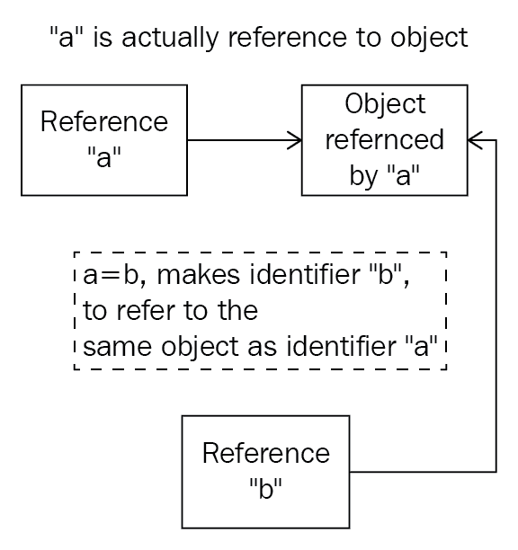

# 十五、全局解释器锁

Python 并发编程的主要参与者之一是**全局解释器锁**（**GIL**）。在本章中，我们将介绍 GIL 的定义和用途，以及它如何影响并发 Python 应用。还将讨论 GIL 对 Python 并发系统提出的问题以及围绕其实现的争议。最后，我们将提到一些关于 Python 程序员和开发人员应该如何思考 GIL 以及如何与 GIL 交互的想法。

本章将介绍以下主题：

*   GIL 简介：是什么导致了它，以及它引起的问题
*   在 Python 中移除/修复 GIL 的工作
*   如何在 Python 并发程序中有效地使用 GIL

# 技术要求

以下是本章的先决条件列表：

*   确保计算机上安装了 Python 3
*   在[下载 GitHub 存储库 https://github.com/PacktPublishing/Mastering-Concurrency-in-Python](https://github.com/PacktPublishing/Mastering-Concurrency-in-Python)
*   在本章中，我们将使用名为`Chapter15`的子文件夹
*   查看以下视频以查看代码的运行：[http://bit.ly/2DFDYhC](http://bit.ly/2DFDYhC)

# 全局解释器锁简介

GIL 在 Python 并发编程社区中非常流行。设计为在任何给定时间只允许一个线程访问和控制 Python 解释器的锁，Python 中的 GIL 通常被称为臭名昭著的 GIL，它阻止多线程程序达到其完全优化的速度。在本节中，我们将讨论 GIL 背后的概念及其目标：它的设计和实现原因，以及它如何影响 Python 中的多线程编程。

# Python 中的内存管理分析

在深入研究吉尔及其影响的细节之前，让我们考虑一下 Python 核心开发人员在 Python 的早期遇到的问题，这就导致了对吉尔的需求。具体来说，Python 编程和其他流行语言编程在管理内存空间中的对象方面有着显著的区别。

例如，在编程语言 C++中，变量实际上是一个内存空间中的一个值，它将在其中写入一个值。这种设置导致这样一个事实，即当为非指针变量指定特定值时，编程语言将有效地将该特定值复制到内存位置（即变量）。此外，当一个变量被分配另一个变量（不是指针）时，后者的内存位置将被复制到前者的内存位置；分配后，这两个变量之间将不再保持进一步的联系。

另一方面，Python 认为变量只是一个名称，而它的变量的实际值被隔离在内存空间的另一个区域中。当一个值被分配给一个变量时，变量被有效地引用到该值的存储空间中的位置（即使引用的术语没有用在与 C++引用相同的意义上）。因此，Python 中的内存管理与将值放入 C++中的内存空间的模型有很大的不同。

这意味着在执行赋值指令时，Python 只需与引用进行交互，并将它们转换为实际值本身。此外，出于这个原因，同一个值可以引用多个变量，并且一个变量所做的更改将反映在所有其他关联变量中。

让我们在 Python 中分析这个特性。如果您已经从 GITHUB 页面下载了这本书的代码，请继续导航到胡特尔 T0 文件夹。

```py
# Chapter15/example1.py

import sys

print(f'Reference count when direct-referencing: {sys.getrefcount([7])}.')

a = [7]
print(f'Reference count when referenced once: {sys.getrefcount(a)}.')

b = a
print(f'Reference count when referenced twice: {sys.getrefcount(a)}.')

###########################################################################

a[0] = 8
print(f'Variable a after a is changed: {a}.')
print(f'Variable b after a is changed: {b}.')

print('Finished.')
```

在本例中，我们查看值`[7]`（一个元素的列表：整数`7`）的管理。我们提到 Python 中的值是独立于变量存储的，Python 中的值管理只是将变量引用到适当的值。Python 中的`sys.getrefcount()`方法接收一个对象并返回与该对象关联的值所具有的所有引用的计数器。这里，我们调用`sys.getrefcount()`三次：在实际值上，`[7]`；赋值的变量`a`；最后是分配了变量`a`的变量`b`。

此外，我们正在探索通过使用引用的变量以及与该值关联的所有变量的结果值来改变该值的过程。具体来说，我们通过变量`a`对列表的第一个元素进行变异，并打印出`a`和`b`的值。运行脚本，您的输出应类似于以下内容：

```py
> python3 example1.py
Reference count when direct-referencing: 1.
Reference count when referenced once: 2.
Reference count when referenced twice: 3.
Variable a after a is changed: [8].
Variable b after a is changed: [8].
Finished.
```

如您所见，此输出与我们讨论的一致：对于第一个`sys.getrefcount()`函数调用，值`[7]`只有一个引用计数，这是我们直接引用它时创建的；当我们将列表分配给变量`a`时，该值有两个引用，因为`a`现在与该值关联；最后，当`a`被分配给`b`时，`[7]`被`b`额外引用，引用计数现在为 3。

在程序第二部分的输出中，我们可以看到，当我们更改变量`a`引用的值时，`[7]`发生了变异，而不是变量`a`。因此，引用与`a`相同值的变量`b`的值也发生了变化。

下图说明了此过程。在 Python 程序中，变量（`a`和`b`只是引用实际值（对象），两个变量之间的赋值语句（例如，`a = b`指示 Python 让两个变量引用同一个对象（而不是像 C++中那样将实际值复制到另一个内存位置）：



Diagram of Python's referencing scheme

# GIL 解决的问题

记住 Python 的内存和变量管理实现，我们可以看到 Python 中对给定值的引用在程序中不断变化，因此跟踪值的引用计数非常重要。

现在，应用您在[第 14 章](14.html)、*竞态条件*中学到的知识，您应该知道，在 Python 并发程序中，此引用计数是一个共享资源，需要受到竞态条件的保护。换句话说，此引用计数是一个关键部分，如果不小心处理，将导致对引用特定值的变量数量的错误解释。这将导致内存泄漏，使 Python 程序效率大大降低，甚至可能释放一些变量实际引用的内存，从而永久丢失该值。

正如您在上一章中所了解的，确保特定共享资源不会出现竞态条件的解决方案是对该资源进行锁定，有效地最多允许一个线程在并发程序中的任何给定时间访问该资源。我们还讨论了，如果在一个并发程序中放置了足够多的锁，那么该程序将完全是顺序的，并且通过实现并发不会获得额外的速度。

GIL 是前面两个问题的组合解决方案，是 Python 整个执行过程中的一个锁。GIL 必须首先由任何希望执行的 Python 指令（CPU 绑定的任务）获取，以防止任何引用计数发生争用情况。

在 Python 语言开发的早期，也提出了本文所述问题的其他解决方案，但 GIL 是迄今为止最有效、最简单的实现方式。由于 GIL 是 Python 整个执行过程中的一个轻量级、包罗万象的锁，不需要实现其他锁来保证其他关键部分的完整性，从而将 Python 程序的性能开销保持在最低水平。

# GIL 提出的问题

直观地说，在 Python 中，如果有一个锁来保护所有 CPU 限制的任务，那么并发程序将无法完全实现多线程。GIL 有效地防止 CPU 限制的任务跨多个线程并行执行。为了理解吉尔的这个特性的效果，让我们考虑 Python 中的一个例子；导航至`Chapter15/example2.py`，如下所示：

```py
# Chapter15/example2.py

import time
import threading

COUNT = 50000000

def countdown(n):
    while n > 0:
        n -= 1

###########################################################################

start = time.time()
countdown(COUNT)

print('Sequential program finished.')
print(f'Took {time.time() - start : .2f} seconds.')

###########################################################################

thread1 = threading.Thread(target=countdown, args=(COUNT // 2,))
thread2 = threading.Thread(target=countdown, args=(COUNT // 2,))

start = time.time()
thread1.start()
thread2.start()
thread1.join()
thread2.join()

print('Concurrent program finished.')
print(f'Took {time.time() - start : .2f} seconds.')
```

在本例中，我们比较了通过多线程以 Python 顺序和并发方式执行特定程序的速度。具体来说，我们有一个名为`countdown()`的函数，它模拟一个 CPU 密集型任务，它接受一个数字`n`，并将其递减，直到它变为零或负。然后我们调用`countdown()`一次 50000000，作为一个顺序程序。最后，我们调用该函数两次，每次调用一个单独的线程，调用次数为 25000000，正好是 50000000 的一半；这是程序的多线程版本。我们还跟踪 Python 运行顺序程序和多线程程序所需的时间。

从理论上讲，程序的多线程版本应该占用顺序版本的一半时间，因为任务实际上被分成两半，并通过我们创建的两个线程并行运行。然而，该程序产生的输出结果表明情况并非如此。以下输出是我通过运行脚本获得的：

```py
> python3 example2.py
Sequential program finished.
Took 2.80 seconds.
Concurrent program finished.
Took 2.74 seconds.
```

与我们预测的相反，倒计时的并发版本几乎和顺序版本一样长；多线程并没有为我们的程序提供任何可观的加速。这是 GIL 保护 CPU 绑定任务的直接效果，因为不允许多个线程同时运行。有时，一个多线程程序可能比其顺序对应程序花费更长的时间来完成其执行，因为还存在获取和释放 GIL 的开销。

对于多线程和 Python 中的并发编程来说，这无疑是一个重要的问题，因为只要一个程序包含 CPU 绑定的指令，这些指令实际上在程序的执行中都是顺序的。但是，不受 CPU 限制的指令发生在 GIL 之外，因此它们不受 GIL 的影响（例如，I/O 限制的指令）。

# 从 Python 中删除 GIL 的可能性

您已经了解到，GIL 对 Python 中的多线程程序设置了重要的约束，特别是那些具有 CPU 限制任务的程序。出于这个原因，许多 Python 开发人员对 GIL 持否定态度，术语*“臭名昭著的 GIL”*开始流行起来；毫不奇怪，有些人甚至主张从 Python 语言中完全删除 GIL。

事实上，著名的 Python 用户已经多次尝试删除 GIL。然而，GIL 被深深地植入到语言的实现中，并且大多数非线程安全的库和包的执行都非常依赖于 GIL，因此删除 GIL 实际上会为 Python 程序带来 bug 和向后不兼容问题。许多 Python 开发人员和研究人员试图在 Python 执行中完全省略 GIL，而大多数现有的 C 扩展（严重依赖于 GIL 的功能）都停止了工作。

现在有其他可行的解决方案来解决我们所讨论的问题；换句话说，GIL 在各个方面都是可替代的。然而，这些解决方案中的大多数包含如此多的复杂指令，它们实际上降低了顺序和 I/O 绑定程序的性能，而这些程序不受 GIL 的影响。因此，这些解决方案将降低单线程或多线程 I/O 程序的速度，而单线程或多线程 I/O 程序实际上占现有 Python 应用的很大一部分。有趣的是，Python 的创建者 Guido van Rossum 也在他的文章中评论了这个话题，*删除 GIL*并不容易：

*"I'd welcome a set of patches into Py3k only if the performance for a single-threaded program (and for a multi-threaded but I/O-bound program) does not decrease."*

不幸的是，任何拟议的 GIL 替代方案都没有实现这一要求。GIL 仍然是 Python 语言不可分割的一部分。

# 如何与 GIL 合作

在 Python 应用中有几种处理 GIL 的方法，下面将介绍这些方法。

# 实现多处理，而不是多线程

这可能是绕过 GIL 并在并发程序中实现最佳速度的最流行和最简单的方法。由于 GIL 仅阻止多个线程同时执行 CPU 限制的任务，因此在系统的多个内核上执行的进程（每个内核都有自己的内存空间）完全不受 GIL 的影响。

具体来说，考虑前面的倒计时示例，让我们比较一下顺序、多线程和多处理时 CPU 受限程序的性能。导航到`Chapter15/example3.py`文件；程序的第一部分与我们前面看到的相同，但最后我们添加了一个多处理解决方案的实现，用于从 50000000 开始倒数，使用两个单独的过程：

```py
# Chapter15/example3.py

import time
import threading
from multiprocessing import Pool

COUNT = 50000000

def countdown(n):
    while n > 0:
        n -= 1

if __name__ == '__main__':

    #######################################################################
    # Sequential

    start = time.time()
    countdown(COUNT)

    print('Sequential program finished.')
    print(f'Took {time.time() - start : .2f} seconds.')
    print()

    #######################################################################
    # Multithreading

    thread1 = threading.Thread(target=countdown, args=(COUNT // 2,))
    thread2 = threading.Thread(target=countdown, args=(COUNT // 2,))

    start = time.time()
    thread1.start()
    thread2.start()
    thread1.join()
    thread2.join()

    print('Multithreading program finished.')
    print(f'Took {time.time() - start : .2f} seconds.')
    print()

    #######################################################################
    # Multiprocessing

    pool = Pool(processes=2)
    start = time.time()
    pool.apply_async(countdown, args=(COUNT//2,))
    pool.apply_async(countdown, args=(COUNT//2,))
    pool.close()
    pool.join()

    print('Multiprocessing program finished.')
    print(f'Took {time.time() - start : .2f} seconds.')
```

运行程序后，我的输出如下：

```py
> python3 example3.py
Sequential program finished.
Took 2.95 seconds.

Multithreading program finished.
Took 2.69 seconds.

Multiprocessing program finished.
Took 1.54 seconds.
```

程序的顺序版本和多线程版本之间的速度差异仍然很小。然而，多处理版本能够将执行速度降低近一半；如前几章所述；由于进程的重量相当重，多处理指令包含大量开销，这就是为什么多处理程序的速度不是顺序程序的一半。

# 使用本机扩展绕过 GIL

有一些 Python 本机扩展是用 C/C++编写的，因此能够避免 GIL 规定的限制；一个例子是最流行的 Python 科学计算包 NumPy。在这些扩展中，可以手动释放 GIL，这样执行就可以简单地绕过锁。但是，在执行返回到主 Python 执行之前，这些版本需要小心地实现，并伴随着 GIL 的重新确认。

# 使用不同的 Python 解释器

GIL 只存在于 CPython 中，CPython 是迄今为止该语言最常见的解释器，并且是用 C 构建的。但是，还有其他 Python 解释器，例如 Jython（用 Java 编写）和 IronPython（用 C++编写），可以用来避免 GIL 及其对多线程程序的影响。请记住，这些解释器的使用不如 CPython 那么广泛，一些包和库可能与其中一个或两个不兼容。

# 总结

虽然 Python 中的 GIL 为该语言中的一个更难的问题提供了一个简单直观的解决方案，但它本身也带来了一些问题，涉及到在 Python 程序中运行多个线程以处理 CPU 限制的任务的能力。已经多次尝试从 Python 的主要实现中删除 GIL，但没有一次能够在保持处理受 GIL 影响的非 CPU 限制任务的有效性的同时实现它。

在 Python 中，可以使用多种方法来提供使用 GIL 的选项。总而言之，尽管 GIL 在 Python 编程社区中声名狼藉，但它只影响 Python 生态系统的某一部分，并且可以被视为一个必要的邪恶，它太重要了，无法从语言中消除。Python 开发人员应该学会和 GIL 共存，并在并发程序中解决它。

在最后四章中，我们讨论了 Python 并发编程中一些最著名和常见的问题。在本书的最后一节中，我们将介绍 Python 提供的一些更高级的并发功能。在下一章中，您将了解无锁和基于锁的并发数据结构的设计。

# 问题

*   Python 和 C++之间内存管理有什么不同？
*   GIL 为 Python 解决了什么问题？
*   GIL 为 Python 创建了什么问题？
*   在 Python 程序中绕过 GIL 的方法有哪些？

# 进一步阅读

有关更多信息，请参阅以下链接：

*   *Wh**是 Python 全局解释器锁（GIL）吗？*（[realpython.com/python-gil/](https://realpython.com/python-gil/)），Abhinav Ajitsaria
*   *Python GIL 可视化*（[dabeaz.blogspot.com/2010/01/Python-GIL-Visualized](http://dabeaz.blogspot.com/2010/01/python-gil-visualized.html)），Dave Beazley
*   *Python 中的复制操作*（[pythontic.com/modules/Copy/introduction](https://pythontic.com/modules/copy/introduction)）
*   *要移除 GIL*（[www.artima.com/weblogs/viewpost.jsp？thread=214235](https://www.artima.com/weblogs/viewpost.jsp?thread=214235)）Guido Van Rossum 并不容易
*   *Python 并行编程*，作者：Jan Palach，Packt Publishing Ltd.2014
*   *用 Python 学习并发：构建高效、健壮、并发的应用*，Elliot Forbes（2017）