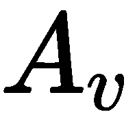
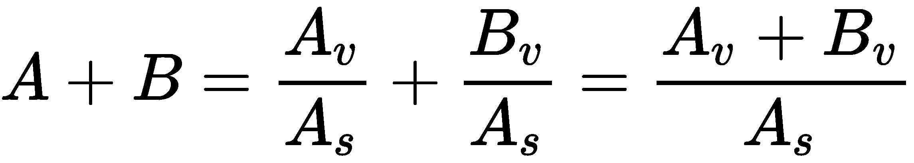
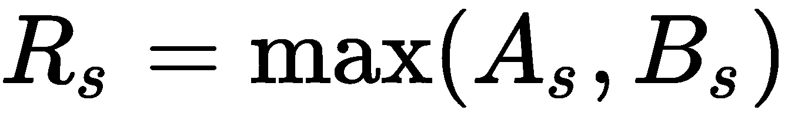
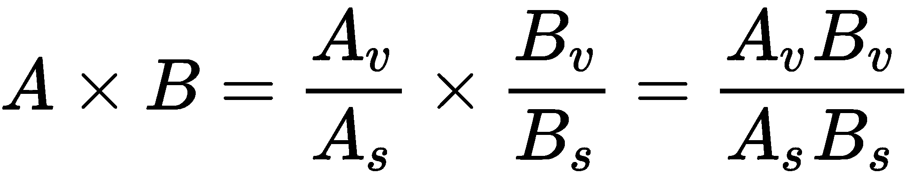
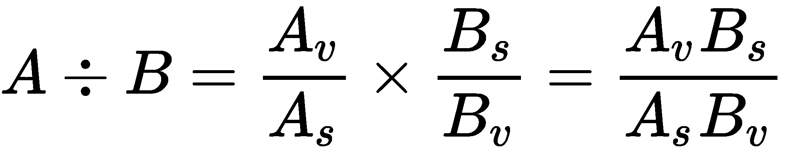
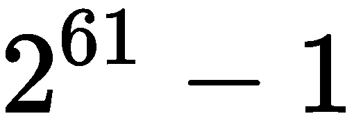

# 八、创建数字

我们可以扩展`numbers`模块中的 ABC 抽象来创建新的数字类型。我们可能需要这样做，以创建比内置数字类型更精确地适合我们的问题域的数字类型。首先需要查看`numbers`模块中的抽象，因为它们定义了现有的内置类。在使用新类型的数字之前，必须先了解现有数字是如何工作的。

我们将离题研究 Python 的运算符到方法映射算法。其思想是二进制运算符有两个操作数；任一操作数都可以定义实现该运算符的类。Python 定位相关类的规则对于决定要实现哪些特殊方法至关重要。

基本的算术运算符，如`+`、`-`、`*`、`/`、`//`、`%`和`**`构成了数值运算的主干。还有其他运营商，包括`^`、`|`和`&`；它们用于整数的逐位处理。它们还用作集合之间的运算符。此类中还有一些运算符，包括`<<`和`>>`。[第 3 章](03.html)*无缝集成–基本特殊方法*中介绍了比较运算符。其中包括`<`、`>`、`<=`、`>=`、`==`和`!=`。在本章中，我们将回顾并扩展对比较运算符的研究。

对于数字，还有许多额外的特殊方法。其中包括到其他内置类型的各种转换。Python 还定义了一个赋值和一个操作符的就地组合。其中包括`+=`、`-=`、`*=`、`/=`、`//=`、`%=`、`**=`、`&=`、`|=`、`^=`、`>>=`和`<<=`。这些比数字更适合可变对象。我们将通过总结一些扩展或创建新数字的设计考虑来完成本章。

在本章中，我们将介绍以下主题：

*   数字的 ABCs
*   算术算子的特殊方法
*   创建数字类
*   计算数值散列
*   实施其他特殊方法
*   使用就地运算符进行优化

# 技术要求

本章的代码文件可在[上找到 https://git.io/fj2Ua](https://git.io/fj2Ua) 。

# 数字的 ABCs

`numbers`包提供了一个数字类型塔，这些数字类型都是`numbers.Number`的实现。此外，`fractions`和`decimal`模块还提供扩展数字类型：`fractions.Fraction`和`decimal.Decimal`。这些定义大致相当于对不同类别数字的数学思想。[上有一篇文章 http://en.wikipedia.org/wiki/Number_theory](http://en.wikipedia.org/wiki/Number_theory) 包含许多深入解释的链接；例如，*数论导论*[。](https://books.google.com/books?id=rey9wfSaJ9EC)

关键的问题是计算机如何很好地实现潜在的数学抽象。更具体地说，我们希望确保在抽象的数学世界中可以计算的任何东西都可以使用具体的计算机进行计算（或近似计算）。这就是为什么可计算性问题如此重要。*图灵完整*编程语言背后的思想是，它可以计算任何可由抽象图灵机器计算的东西。可在[找到一篇有用的文章 http://en.wikipedia.org/wiki/Computability_theory](http://en.wikipedia.org/wiki/Computability_theory) ；本文中的其他链接包括[https://www.encyclopediaofmath.org/index.php?title=p/t094460](https://www.encyclopediaofmath.org/index.php?title=p/t094460)

I recommend reading the Wikipedia articles on number theory and computability theory, and other concepts that I discuss in the chapter. The articles and the additional links present in the reference sections of these sources will give you more background information than can be covered here.

Python 定义了以下抽象及其关联的实现类。此外，这些类形成了一个继承层次结构，其中每个抽象类都从它上面的类继承。当我们向下移动列表时，这些类具有更多的特性。由于种类很少，如下所示，它形成了一个*塔*而不是一棵树：

*   `numbers.Complex`由`complex`实施
*   `numbers.Real`由`float`实施
*   `numbers.Rational`由`fractions.Fraction`实施
*   `numbers.Integral`由`int`实施

另外还有`decimal.Decimal`，有点像`float`；它不是`numbers.Real`的一个适当的子类，但有点像它。虽然这可能是显而易见的，但仍然有必要重复一个事实，`float`值只是一个近似值；这并不准确

不要对这种事感到惊讶。以下示例显示了`float`值如何仅是实数的近似值：

```py
>>> (105+(1/29)-105)*29
0.9999999999998153
```

普通代数建议该值应等于 1。由于浮点近似的性质，实际结果不同于抽象的理想结果。除了数值类定义外，各种类之间还存在大量转换。不可能从每种类型转换为其他类型，因此我们必须计算出一个矩阵，显示有效转换和无效转换。以下是总结：

*   `complex`：不能转换为其他类型。`complex`值可以分解为`real`和`imag`部分，这两部分都是`float`值。
*   `float`：可以显式转换为任何类型，包括`decimal.Decimal`。算术运算符不会隐式将`float`值强制为`Decimal`。
*   `Fractions.Fraction`：可转换为除`decimal.Decimal`之外的任何其他类型。到达`decimal`需要两部分操作：第一部分到`float`，第二部分到`decimal.Decimal`。这导致了一个近似值。
*   `int`：可转换为其他类型。
*   `Decimal`：可转换为其他类型。它不会通过算术运算隐式强制为其他类型。

上下转换来自前面提到的数字抽象塔。

让我们在下一节中看看如何决定使用哪种类型。

# 决定使用哪种类型

由于这些转换，我们可以看到以下四个一般的数值处理领域：

*   **复杂：**一旦我们涉及复杂数学，我们将使用`complex`和`float`以及`cmath`模块。我们可能根本不会使用`Fraction`或`Decimal`。但是，没有理由对数字类型施加限制；大多数数字可以转换为`complex.`
*   **币种：**对于与币种相关的操作，我们绝对必须使用`Decimal`。通常，在进行货币计算时，没有充分的理由将`decimal`值与非十进制值混合。有时，我们会使用`int`值，但没有充分的理由将`float`或`complex`与`Decimal`一起使用。记住，浮动是近似值，这在使用货币时是不可接受的。
*   **位踢：**对于涉及位和字节处理的操作，我们一般使用`int`，仅使用`int`，除`int`外无其他。
*   **常规：**这是一个宽泛、模糊的*其他*范畴。对于大多数传统的数学运算，`int`、`float`和`Fraction`都是可互换的。事实上，一个写得好的函数通常是多态的；它可以很好地与任何数字类型配合使用。Python 类型，特别是`float`和`int`，将参与各种隐式转换。这使得为这类问题选择一种特定的数值类型有些无意义。

这些通常是给定问题域的明显方面。通常很容易区分可能涉及科学、工程和复数的应用程序与涉及金融计算、货币和十进制数的应用程序。在应用程序中使用的数字类型中，尽可能允许使用，这一点很重要。通过`isinstance()`测试不必要地缩小类型域通常是浪费时间和代码。

在下一节中，我们将讨论方法解析和反射运算符概念。

# 方法分辨率和反射算子概念

算术运算符（`+`、`-`、`*`、`/`、`//`、`%`、`**`等等）都映射到特殊的方法名称。当我们提供诸如`355+113`之类的表达式时，泛型`+`操作符将映射到特定数值类的具体`__add__()`方法。这个例子的评估结果就像我们写了`355.__add__(113)`一样。最简单的规则是，最左边的操作数确定所使用的运算符的类。

但是等等，还有更多！当我们有一个混合类型的表达式时，Python 最终可能会有两个特殊方法的可用实现，每个类中一个。将表达式 T0 作为表达式。使用左侧的`int`类，此表达式将作为`7.__sub__(0.14)`进行尝试。这涉及到令人不快的复杂性，因为`int`运算符的参数是`float`值`0.14`，将`float`转换为`int`可能会失去精度。将类型塔（从`int`转换为`complex`）不会失去精度。向下转换类型塔意味着潜在的精度损失。

但是，使用右侧`float`版本，此表达式将尝试作为`0.14.__rsub__(7)`。在这种情况下，`float`运算符的参数是`int `值`7`；将塔楼`int`转换为`float`不会（通常）失去精度。（一个真正巨大的`int`值可能会失去精度；然而，这是一个技术上的诡辩，不是一般原则。）

`__rsub__()`操作称为**反射减法**。`X.__sub__(Y)`运算为期望减法，`A.__rsub__(B)`运算为反射减法；后者中的实现方法来自右侧操作数的类。到目前为止，我们已经看到了以下两条规则：

*   规则一：首先尝试左侧操作数的类。如果这行得通，那就好了。如果操作数返回`NotImplemented`作为值，则使用规则二。
*   规则二：使用反射运算符尝试右侧操作数。如果这行得通，那就好了。如果它返回`NotImplemented`，那么它确实没有实现，因此必须引发异常。

值得注意的例外是两个操作数恰好具有子类关系。

作为特例，以下附加规则在第一对规则之前适用：

*   如果右操作数是左操作数的子类，并且该子类定义了运算符的反射特殊方法名，则将尝试使用子类反射运算符。这允许使用子类重写，即使子类操作数位于运算符的右侧。
*   否则，请使用规则 1 并尝试左侧。

假设我们编写了一个子类`float`，称为`MyFloat`。在诸如`2.0-MyFloat(1)`之类的表达式中，右操作数属于左操作数类的子类。由于此子类关系，将首先尝试使用`MyFloat(1).__rsub__(2.0)`。这个规则的要点是给子类以优先级。

这意味着将从其他类型执行隐式强制的类必须实现前向运算符和反射运算符。当我们实现或扩展一个数值类型时，我们必须计算出我们的类型能够进行的转换。

在下一节中，我们将了解算术运算符的特殊方法。

# 算术算子的特殊方法

共有 13 个二进制运算符及其相关的特殊方法。我们将首先关注显而易见的算术运算符。特殊方法名称与运算符（和函数）匹配，如下表所示：

| **方法** | **操作员** |
| --- | --- |
| `object.__add__(self, other)` | `+` |
| `object.__sub__(self, other)` | `-` |
| `object.__mul__(self, other)` | `*` |
| `object.__truediv__(self, other)` | `/` |
| `object.__floordiv__(self, other)` | `//` |
| `object.__mod__(self, other)` | `%` |
| `object.__divmod__(self, other)` | `divmod()` |
| `object.__pow__(self, other[, modulo])` | `pow()`以及`**` |

是的，有趣的是，两个函数包含在各种符号运算符中。有许多一元运算符和函数，它们具有特殊的方法名称，如下表所示：

| **方法** | **操作员** |
| --- | --- |
| `object.__neg__(self)` | `-` |
| `object.__pos__(self)` | `+` |
| `object.__abs__(self)` | `abs()` |
| `object.__complex__(self)` | `complex()` |
| `object.__int__(self)` | `int()` |
| `object.__float__(self)` | `float()` |
| `object.__round__(self[, n])` | `round()` |
| `object.__trunc__(self[, n])` | `math.trunc()` |
| `object.__ceil__(self[, n])` | `math.ceil()` |
| `object.__floor__(self[, n])` | `math.floor()` |

是的，这个列表中也有很多函数。我们可以修改 Python 的内部跟踪，看看引擎盖下发生了什么。我们将定义一个简单的跟踪函数，该函数将为我们提供一点对正在发生的事情的可见性：

```py
def trace(frame, event, arg): 
    if frame.f_code.co_name.startswith("__"): 
        print(frame.f_code.co_name, frame.f_code.co_filename, event) 
```

当与跟踪帧关联的代码的名称以`"__"`开头时，此函数将转储特殊方法名称。我们可以使用以下代码在 Python 中安装此跟踪函数：

```py
import sys 
sys.settrace(trace) 
```

一旦安装，一切都将通过我们的`trace()`功能。我们正在筛选跟踪事件以查找特殊的方法名。我们将定义一个内置类的子类，以便探索方法解析规则：

```py
class noisyfloat( float ): 
    def __add__( self, other ): 
        print( self, "+", other ) 
        return super().__add__( other ) 
    def __radd__( self, other ): 
        print( self, "r+", other ) 
        return super().__radd__( other ) 
```

该类只重写运算符的两个特殊方法名。当我们添加`noisyfloat`值时，我们将看到操作的打印摘要。另外，追踪会告诉我们发生了什么。以下是显示 Python 选择类来实现给定操作的交互：

```py
>>> x = noisyfloat(2) 
>>> x+3 
__add__ <stdin> call 
2.0 + 3 
5.0 
>>> 2+x 
__radd__ <stdin> call 
2.0 r+ 2 
4.0 
>>> x+2.3 
__add__ <stdin> call 
2.0 + 2.3 
4.3 
>>> 2.3+x 
__radd__ <stdin> call 
2.0 r+ 2.3 
4.3 
```

从`x+3`中，我们可以看到`noisyfloat+int`如何将`int`对象`3`提供给`__add__()`方法。该值被传递给超类`float`，该超类处理`3`对`float`的强制，并进行加法。`2+x`显示了如何使用右侧`noisyfloat`版本的操作。再次，`int`被传递给处理对`float`强制的超类。从`x+2.3`中，我们知道`noisyfloat+float`使用了左侧的子类。另一方面，`2.3+x`展示了`float+noisyfloat`如何使用右侧的子类和反射的`__radd__()`操作符。

让我们看看如何创建一个数值类。

# 创建数字类

我们将尝试设计一种新的数字。当 Python 已经为货币计算提供了不定精度的整数、有理分数、标准浮点数和十进制数时，这不是一件容易的事情。此列表中缺少的功能不多。

我们将定义一类*缩放*数字。这些数字包括一个整数值和一个比例因子。我们可以用这些来计算货币。对于世界上的许多货币，我们可以使用 100 的比例尺，并将我们所有的计算精确到最接近的美分。

缩放算法的优点是，它可以通过使用低级硬件指令非常简单地完成。我们可以将此模块重写为 C 语言模块，并利用硬件速度操作。发明新的缩放算法的缺点是，`decimal`包已经完成了精确十进制算法的非常简洁的工作。

我们称之为`FixedPoint`类，因为它将实现一种固定的小数点。比例因子将是一个简单的整数，通常是十的幂。原则上，二次幂的比例因子可以快得多，但并不适合于货币。

两个比例因子的幂可以更快的原因是我们可以用`value << scale`替换`value*(2**scale)`，用`value >> scale`替换`value/(2**scale)`。左右`shift`运算通常是比乘法或除法快得多的硬件指令。

理想情况下，比例因子是十的幂，但我们没有明确地执行这一点。这是一个相对简单的扩展，可以跟踪缩放功率和随功率变化的缩放因子。我们可以存储两个作为功率和因子。我们简化了这个类的定义，只跟踪因子。

下面我们来看看如何定义`FixedPoint`初始化。

# 定义固定点初始化

我们将从初始化开始，它包括各种类型到`FixedPoint`值的转换，如下所示：

```py
    import     numbers
    import     math
    from     typing     import     Union, Optional, Any

    class     FixedPoint(numbers.Rational):
        __slots__     = (    "value"    ,     "scale"    ,     "default_format"    )

        def         __init__    (    self    , value: Union[    'FixedPoint'    ,     int    ,     float    ], scale:     int     =     100    ) ->     None    :
            self    .value:     int
                        self    .scale:     int
                        if         isinstance    (value, FixedPoint):
                self    .value = value.value
                self    .scale = value.scale
            elif         isinstance    (value,     int    ):
                self    .value = value
                self    .scale = scale
            elif         isinstance    (value,     float    ):
                self    .value =     int    (scale * value +     .5    )      # Round half up
                            self    .scale = scale
            else    :
                raise         TypeError    (    f"Can't build FixedPoint from         {    value    !r}         of         {        type    (value)    }        "    )
        digits =     int    (math.log10(scale))
            self    .default_format =     "{{0:.{digits}f}}"    .format(    digits    =digits)

        def         __str__    (    self    ) ->     str    :
            return         self    .    __format__    (    self    .default_format)

        def         __repr__    (    self    ) ->     str    :
            return         f"        {        self    .__class__.    __name__        :        s        }        (        {        self    .value    :        d        }        ,scale=        {        self    .scale    :        d        }        )"

                    def         __format__    (    self    , specification:     str    ) ->     str    :
            if     specification ==     ""    :
            specification =     self    .default_format
            return     specification.format(    self    .value /     self    .scale)
```

我们的`FixedPoint`类被定义为`numbers.Rational`子类。我们将包装两个整数值，`scale`和`value`，并遵循分数的一般定义。这需要大量的特殊方法定义。初始化是针对不可变对象的，因此它会覆盖`__new__()`而不是`__init__()`。它定义了有限数量的插槽，以防止添加任何其他属性。初始化包括以下几种类型的转换：

*   如果我们得到另一个`FixedPoint`对象，我们将复制内部属性以创建一个新的`FixedPoint`对象，它是原始对象的一种克隆。它将有一个唯一的 ID，但我们可以确保它具有相同的哈希值，并且比较结果相同，这使得克隆在很大程度上无法区分。
*   当给定整数值或有理数值（具体的`int`或`float`类）时，这些数值用于设置`value`和`scale`属性。
*   我们可以添加案例来处理`decimal.Decimal`和`fractions.Fraction`，以及解析输入字符串值。

我们定义了三种生成字符串结果的特殊方法：`__str__()`、
`__repr__()`和`__format__()`。对于格式操作，我们决定利用格式规范语言的现有浮点特性。因为这是一个有理数，我们需要提供分子和分母方法。

注意，我们也可以从包装现有的`fractions.Fraction`类开始。为了显示更多所需的编程，我们选择从抽象的`Rational`类开始。

让我们在下一节中了解如何定义`FixedPoint`二进制算术运算符。

# 定义不动点二进制算术运算符

定义一个新的数字类的唯一原因是使算术运算符过载。每个`FixedPoint`对象有两部分：`value`和`scale`，我们可以说某个值是值除以比例因子：的一部分。

请注意，在下面的示例中，我们已经使用正确但低效的浮点表达式计算出了代数，我们将讨论效率稍高的纯整数运算。

加法（和减法）的一般形式是：，它可以创建一个具有许多无用精度的结果。

想象一下添加 9.95 和 12.95。我们（原则上）有 229000/10000。这可以适当地减少到 2290/100。问题是它也降低到 229/10，不再是美分。我们希望避免以一般方式减少分数，而是尽可能坚持使用美分或米尔斯。

我们可以为确定两种情况：

*   **比例因子匹配**：本例中为，总和为。当添加一个`FixedPoint`值和一个普通的旧整数值时，这也会起作用。我们可以强制整数具有所需的比例因子。

*   **比例因子不匹配**：当时，可以帮助生成两个输入值中比例因子最大的结果量表：。由此，我们可以计算出两个中间尺度因子：和。其中一个比例因子为 1，另一个小于 1。我们现在可以在分母中添加一个公共值。在代数上，它是。这可以进一步优化为两种情况，因为其中一个因素是 1，另一个是 10 的幂。

我们不能真正优化乘法。是。当我们乘以`FixedPoint`值时，精度确实必须提高。

除法是用一个倒数进行乘法：。如果 A 和 B 具有相同的比例，这些值将取消，这样我们就有了一个方便的优化。然而，这将比例从美分改为整份，这可能不合适。

以下是围绕类似样板构建的 forward 操作符的外观：

```py
    def         __add__    (    self    , other: Union[    'FixedPoint'    ,     int    ]) ->     'FixedPoint'    :
        if not         isinstance    (other, FixedPoint):
        new_scale =     self    .scale
        new_value =     self    .value + other *     self    .scale
        else    :
        new_scale =     max    (    self    .scale, other.scale)
        new_value =     self    .value * (new_scale //     self    .scale) + other.value * (
            new_scale // other.scale
        )
        return     FixedPoint(    int    (new_value),     scale    =new_scale)

    def         __sub__    (    self    , other: Union[    'FixedPoint'    ,     int    ]) ->     'FixedPoint'    :
        if not         isinstance    (other, FixedPoint):
        new_scale =     self    .scale
        new_value =     self    .value - other *     self    .scale
        else    :
        new_scale =     max    (    self    .scale, other.scale)
        new_value =     self    .value * (new_scale //     self    .scale) - other.value * (
            new_scale // other.scale
        )
        return     FixedPoint(    int    (new_value),     scale    =new_scale)

    def         __mul__    (    self    , other: Union[    'FixedPoint'    ,     int    ]) ->     'FixedPoint'    :
        if not         isinstance    (other, FixedPoint):
        new_scale =     self    .scale
        new_value =     self    .value * other
        else    :
        new_scale =     self    .scale * other.scale
        new_value =     self    .value * other.value
        return     FixedPoint(    int    (new_value),     scale    =new_scale)

    def         __truediv__    (    self    , other: Union[    'FixedPoint'    ,     int    ]) ->     'FixedPoint'    :
        if not         isinstance    (other, FixedPoint):
        new_value =     int    (    self    .value / other)
        else    :
        new_value =     int    (    self    .value / (other.value / other.scale))
        return     FixedPoint(new_value,     scale    =    self    .scale)

    def         __floordiv__    (    self    , other: Union[    'FixedPoint'    ,     int    ]) ->     'FixedPoint'    :
        if not         isinstance    (other, FixedPoint):
        new_value =     int    (    self    .value // other)
        else    :
        new_value =     int    (    self    .value // (other.value / other.scale))
        return     FixedPoint(new_value,     scale    =    self    .scale)

    def         __mod__    (    self    , other: Union[    'FixedPoint'    ,     int    ]) ->     'FixedPoint'    :
        if not         isinstance    (other, FixedPoint):
        new_value = (    self    .value /     self    .scale) % other
        else    :
        new_value =     self    .value % (other.value / other.scale)
        return     FixedPoint(new_value,     scale    =    self    .scale)

    def         __pow__    (    self    , other: Union[    'FixedPoint'    ,     int    ]) ->     'FixedPoint'    :
        if not         isinstance    (other, FixedPoint):
        new_value = (    self    .value /     self    .scale) ** other
        else    :
        new_value = (    self    .value /     self    .scale) ** (other.value / other.scale)
        return     FixedPoint(    int    (new_value) *     self    .scale,     scale    =    self    .scale)
```

对于简单的加法、减法和乘法情况，我们提供了可以优化的版本，以消除一些相对较慢的浮点中间结果。

每个操作符都返回一个`FixedPoint`类的实例。我们不能在类定义本身中使用该名称。我们提供了名称的字符串版本。当用于检查类型提示时，**mypy**实用程序将此字符串解析为正确的类型名。

在某些情况下，我们使用`Union['FixedPoint', int]`显式支持整数强制。此类型提示告诉**mypy**方法将接受`FixedPoint`类的实例或简单的`int`对象

对于两种划分，`__mod__()`和`__pow__()`方法，我们没有进行任何优化，试图消除通过浮点划分引入的噪声。相反，我们提供了一个可以工作的 Python 实现，它可以与一套单元测试一起使用，作为优化和重构的基础。

需要注意的是，部门运作可以适当降低规模因素。然而，改变比例可能是不可取的。在进行货币计算时，我们可以将货币汇率（美元）除以非货币值（小时），得到每小时美元数的结果。正确的答案可能有零个相关的小数位。这将是一个 1 的刻度，但我们可能希望强制该值的刻度为 100。此实现确保左侧操作数指定所需的小数位数。

现在，让我们看看如何定义`FixedPoint`一元算术运算符。

# 定义不动点一元算术运算符

以下是一元运算符方法函数：

```py
    def         __abs__    (    self    ) ->     'FixedPoint'    :
        return     FixedPoint(    abs    (    self    .value),     self    .scale)

    def         __float__    (    self    ) ->     float    :
        return         self    .value /     self    .scale

    def         __int__    (    self    ) ->     int    :
        return         int    (    self    .value /     self    .scale)

    def         __trunc__    (    self    ) ->     int    :
        return         int    (math.trunc(    self    .value /     self    .scale))

    def         __ceil__    (    self    ) ->     int    :
        return         int    (math.ceil(    self    .value /     self    .scale))

    def         __floor__    (    self    ) ->     int    :
        return         int    (math.floor(    self    .value /     self    .scale))    

        def         __round__    (    self    , ndigits: Optional[    int    ] =     0    ) -> Any:
        return     FixedPoint(    round    (    self    .value /     self    .scale,     ndigits    =ndigits),     self    .scale)

    def         __neg__    (    self    ) ->     'FixedPoint'    :
        return     FixedPoint(-    self    .value,     self    .scale)

    def         __pos__    (    self    ) ->     'FixedPoint'    :
        return         self    
```

对于`__round__()`、`__trunc__()`、`__ceil__()`和`__floor__()`操作符，我们已将工作委托给 Python 库函数。有一些潜在的优化，但我们采取了创建浮点近似值的惰性路线，并使用它来创建所需的结果。这套方法确保我们的`FixedPoint`对象将与许多算术函数一起工作。是的，Python 中有很多运算符。这不是整个套房。我们还没有提供用于比较或位踢操作符的实现。比较通常类似于算术运算，留给读者作为练习。位运算符（`&`、`|`、`^`和`~`在域之外没有明确的含义，比如值或集合，因此我们不应该实现它们。

在下一节中，我们将看到如何实现`FixedPoint`反射运算符。

# 实现 FixedPoint 反射操作符

反射运算符用于以下两种情况：

*   右操作数是左操作数的子类。在这种情况下，首先尝试反射运算符以确保子类重写父类。
*   左侧操作数的类未实现所需的特殊方法。在这种情况下，将使用右侧操作数的反射特殊方法。

下表显示了特殊方法和运算符之间的映射：

| **方法** | **操作员** |
| --- | --- |
| `object.__radd__(self, other)` | `+` |
| `object.__rsub__(self, other)` | `-` |
| `object.__rmul__(self, other)` | `*` |
| `object.__rtruediv__(self, other)` | `/` |
| `object.__rfloordiv__(self, other)` | `//` |
| `object.__rmod__(self, other)` | `%` |
| `object.__rdivmod__(self, other)` | `divmod()` |
| `object.__rpow__(self, other[, modulo])` | `pow()`以及`**` |

这些特殊的操作方法也是围绕一个通用样板构建的。由于这些都会反映出来，所以操作数在减法、除法、模和幂中的顺序很重要。对于交换运算，例如加法和乘法，顺序并不重要。以下是反射运算符的实现：

```py
    def         __radd__    (    self    , other: Union[    'FixedPoint'    ,     int    ]) ->     'FixedPoint'    :
        if not         isinstance    (other, FixedPoint):
        new_scale =     self    .scale
        new_value = other *     self    .scale +     self    .value
        else    :
        new_scale =     max    (    self    .scale, other.scale)
        new_value = other.value * (new_scale // other.scale) +     self    .value * (
            new_scale //     self    .scale
        )
        return     FixedPoint(    int    (new_value),     scale    =new_scale)

    def         __rsub__    (    self    , other: Union[    'FixedPoint'    ,     int    ]) ->     'FixedPoint'    :
        if not         isinstance    (other, FixedPoint):
        new_scale =     self    .scale
        new_value = other *     self    .scale -     self    .value
        else    :
        new_scale =     max    (    self    .scale, other.scale)
        new_value = other.value * (new_scale // other.scale) -     self    .value * (
            new_scale //     self    .scale
        )
        return     FixedPoint(    int    (new_value),     scale    =new_scale)

    def         __rmul__    (    self    , other: Union[    'FixedPoint'    ,     int    ]) ->     'FixedPoint'    :
        if not         isinstance    (other, FixedPoint):
        new_scale =     self    .scale
        new_value = other *     self    .value
        else    :
        new_scale =     self    .scale * other.scale
        new_value = other.value *     self    .value
        return     FixedPoint(    int    (new_value),     scale    =new_scale)

    def         __rtruediv__    (    self    , other: Union[    'FixedPoint'    ,     int    ]) ->     'FixedPoint'    :
        if not         isinstance    (other, FixedPoint):
        new_value =     self    .scale *     int    (other / (    self    .value /     self    .scale))
        else    :
        new_value =     int    ((other.value / other.scale) /     self    .value)
        return     FixedPoint(new_value,     scale    =    self    .scale)

    def         __rfloordiv__    (    self    , other: Union[    'FixedPoint'    ,     int    ]) ->     'FixedPoint'    :
        if not         isinstance    (other, FixedPoint):
        new_value =     self    .scale *     int    (other // (    self    .value /     self    .scale))
        else    :
        new_value =     int    ((other.value / other.scale) //     self    .value)
        return     FixedPoint(new_value,     scale    =    self    .scale)

    def         __rmod__    (    self    , other: Union[    'FixedPoint'    ,     int    ]) ->     'FixedPoint'    :
        if not         isinstance    (other, FixedPoint):
        new_value = other % (    self    .value /     self    .scale)
        else    :
        new_value = (other.value / other.scale) % (    self    .value /     self    .scale)
        return     FixedPoint(new_value,     scale    =    self    .scale)

    def         __rpow__    (    self    , other: Union[    'FixedPoint'    ,     int    ]) ->     'FixedPoint'    :
        if not         isinstance    (other, FixedPoint):
        new_value = other ** (    self    .value /     self    .scale)
        else    :
        new_value = (other.value / other.scale) **     self    .value /     self    .scale
        return     FixedPoint(    int    (new_value) *     self    .scale,     scale    =    self    .scale)
```

我们尝试使用与正向运算符相同的数学。其思想是以一种简单的方式切换操作数。这是最常见的情况。使正向和反向方法的文本相互匹配简化了代码检查，是的，在交换运算符实现中存在一些冗余。

与正向操作符一样，我们保持了除法、模和幂操作符的简单性，以避免优化。此处显示的版本可能会在转换为浮点近似值和返回`FixedPoint`值时引入噪声。在下一节中，我们将看到如何实现`FixedPoint`比较运算符。

# 实现定点比较运算符

以下是六个比较运算符以及实现它们的特殊方法：

| **方法** | **操作员** |
| `object.__lt__(self, other)` | `<` |
| `object.__le__(self, other)` | `<=` |
| `object.__eq__(self, other)` | `==` |
| `object.__ne__(self, other)` | `!=` |
| `object.__gt__(self, other)` | `>` |
| `object.__ge__(self, other)` | `>=` |

`is`操作符比较对象 ID。我们不能有意义地重写它，因为它独立于任何特定的类。`in`比较运算符由`object.__contains__(self, value)`实现。这对于数值没有意义。

请注意，平等性测试是一项微妙的工作。由于浮点是近似值，我们必须非常小心地避免使用`float`值进行直接相等性测试。我们必须比较这些值是否在一个小范围内，即*ε*。平等性测试不应写为`a == b`。比较浮点近似值的一般方法应该是`abs(a-b) <= eps`，或者更一般地说是`abs(a-b)/a <= eps`。

在我们的`FixedPoint`类中，刻度表示两个值需要多么接近才能将`float`值视为相等。对于 100 分制，ε可以是 0.01。实际上，我们会更保守一些，当刻度为 100 时，我们会使用 0.005 作为比较的基础。

此外，我们必须决定`FixedPoint(123, 100)`是否应等于`FixedPoint(1230, 1000)`。虽然它们在数学上是相等的，但一个值以美分为单位，一个值以米尔斯为单位。

这可以被看作是对两个数字的不同精度的一种说法；另外一个有效数字的出现可能表明它们不应该简单地看起来相等。如果我们遵循这种方法，那么我们需要确保散列值也不同。

在这个例子中，我们决定区分刻度值是*不*合适的。我们希望`FixedPoint(123, 100)`等于`FixedPoint(1230, 1000)`。这也是推荐的`__hash__()`实现背后的假设。以下是我们`FixedPoint`类比较的实现：

```py
    def     __eq__(self,     other    : Any) -> bool:
        if         isinstance    (    other    , FixedPoint):
            if     self.scale ==     other    .scale:
                return     self.value ==     other    .value
            else    :
                return     self.value *     other    .scale // self.scale ==     other    .value
        else    :
            return         abs    (self.value / self.scale -     float    (    other    )) <     .5     / self.scale

    def         __ne__    (    self    , other: Any) -> bool:
        return not     (    self     == other)

    def         __le__    (    self    , other:     'FixedPoint'    ) -> bool:
        return         self    .value /     self    .scale <=     float    (other)

    def         __lt__    (    self    , other:     'FixedPoint'    ) -> bool:
        return         self    .value /     self    .scale <     float    (other)

    def         __ge__    (    self    , other:     'FixedPoint'    ) -> bool:
        return         self    .value /     self    .scale >=     float    (other)
```

每个比较函数都允许一个非`FixedPoint`值的值。这是超类强加的要求：`Any`类型提示必须与该类兼容。唯一的要求是另一个值必须具有浮点表示形式。我们已经为`FixedPoint`对象定义了一个`__float__()`方法，因此在比较两个`FixedPoint`值时，比较操作将非常有效。

我们不需要写所有六个比较。`@functools.total_ordering`装饰器可以仅从两个`FixedPoint`值生成缺少的方法。我们将在[第 9 章](09.html)、*装潢师和混搭师–横切方面*中了解这一点。

在下一节中，我们将看到如何计算数值散列。

# 计算数值散列

我们确实需要正确定义`__hash__()`方法。有关计算数字类型哈希值的信息，请参见*Python 标准库*的第 4.4.4 节。该部分定义了一个`hash_fraction()`函数，这是我们在这里所做工作的推荐解决方案。我们的方法如下所示：

```py
    def         __hash__    (self) ->     int    :
    P = sys.hash_info.modulus
    m, n = self.value, self.scale
        # Remove common factors of P.  (Unnecessary if m and n already coprime.)
                    while     m % P == n % P ==     0    :
        m, n = m // P, n // P

        if     n % P ==     0    :
        hash_ = sys.hash_info.inf
        else    :
            # Fermat's Little Theorem: pow(n, P-1, P) is 1, so
                # pow(n, P-2, P) gives the inverse of n modulo P.
                    hash_ = (    abs    (m) % P) *     pow    (n, P -     2    , P) % P
        if     m <     0    :
        hash_ = -hash_
        if     hash_ == -    1    :
        hash_ = -    2
                    return     hash_
```

这将两部分有理分式值减少为单个标准化散列。此代码从参考手册中复制，并进行了一些修改。在前面的代码中加粗的计算核心是将分子乘以分母的倒数。实际上，它将分子除以分母`mod P`。我们可以对此进行优化，使其更具体地针对我们的问题领域。

首先，我们可以修改这个类的`__new__()`方法，以确保刻度非零，从而消除对`sys.hash_info.inf`的任何需要。其次，我们可以明确地将比例因子的范围限制为小于`sys.hash_info.modulus`（对于 64 位计算机，通常为。我们可以消除消除`P`共同因素的需要。这将把散列归结为`hash_ = (abs(m) % P) * pow(n, P - 2, P) % P`、符号处理和特例-1 映射到-2。

最后，我们可能希望缓存任何哈希计算的结果。这需要在第一次请求哈希时只填充一次的额外插槽。`pow(n, P - 2, P)`表达式的计算成本相对较高，我们不希望计算的次数超过需要的次数。

在下一节中，我们将展示如何为这些`FixedPoint`对象实现一个简单的舍入模式。

# 设计更有用的舍入

我们在四舍五入时截断了演示文稿。我们定义了`round()`和`trunc()`所需的函数，无需进一步解释。这些定义是抽象超类的最低要求。然而，这些定义并不足以满足我们的目的。

要处理货币，我们通常会有如下代码：

```py
>>> price = FixedPoint(1299, 100) 
>>> tax_rate = FixedPoint(725, 1000) 
>>> price * tax_rate 
FixedPoint(941775, scale=100000) 
```

然后，我们需要将该值四舍五入到`100`的刻度，得到`942`的值。我们需要将数字四舍五入（以及截断）为新比例因子的方法。以下是四舍五入到特定比例的方法：

```py
    def     round_to(self, new_scale:     int    ) ->     'FixedPoint'    :
    f = new_scale / self.scale
        return     FixedPoint(    int    (self.value * f +     .5    ),     scale    =new_scale)
```

以下代码允许我们正确地重新缩放值：

```py
>>> price = FixedPoint(1299, 100) 
>>> tax_rate = FixedPoint(725, 1000) 
>>> tax = price * tax_rate 
>>> tax.round_to(100) 
FixedPoint(942, scale=100) 
```

这表明我们有一组最小的函数来计算货币。

在下一节中，我们将看到如何实现其他特殊方法。

# 实施其他特殊方法

除了核心算术和比较运算符外，我们还有一组额外的运算符（通常）我们仅为`numbers.Integral`值定义。由于我们不定义整数值，因此可以避免使用以下特殊方法：

| **方法** | **操作员** |
| `object.__lshift__(self, other)` | `<<` |
| `object.__rshift__(self, other)` | `>>` |
| `object.__and__(self, other)` | `&` |
| `object.__xor__(self, other)` | `^` |
| `object.__or__(self, other)` | `&#124;` |

此外，还有这些运算符的反映版本：

| **方法** | **操作员** |
| `object.__rlshift__(self, other)` | `<<` |
| `object.__rrshift__(self, other)` | `>>` |
| `object.__rand__(self, other)` | `&` |
| `object.__rxor__(self, other)` | `^` |
| `object.__ror__(self, other)` | `&#124;` |

此外，还有一个一元运算符用于值的逐位逆运算：

| **方法** | **操作员** |
| `object.__invert__(self)` | `~` |

有趣的是，其中一些运算符是为集合集合定义的，还有整数。它们不适用于我们的理性价值。定义这些运算符的原则与其他算术运算符相同。

现在，让我们看看如何使用就地操作符进行优化。

# 使用就地运算符进行优化

一般来说，数字是不变的。但是，数字运算符也用于可变对象。例如，列表和集合响应一些已定义的增广赋值运算符。作为一种优化，类可以包含所选操作符的就地版本。下表中的方法实现了可变对象的增广赋值语句。请注意，这些方法预期以`return self`结尾，以便与普通赋值兼容：

| **方法** | **操作员** |
| --- | --- |
| `object.__iadd__(self, other)` | `+=` |
| `object.__isub__(self, other)` | `-=` |
| `object.__imul__(self, other)` | `*=` |
| `object.__itruediv__(self, other)` | `/=` |
| `object.__ifloordiv__(self, other)` | `//=` |
| `object.__imod__(self, other)` | `%=` |
| `object.__ipow__(self, other[, modulo])` | `**=` |
| `object.__ilshift__(self, other)` | `<<=` |
| `object.__irshift__(self, other)` | `>>=` |
| `object.__iand__(self, other)` | `&=` |
| `object.__ixor__(self, other)` | `^=` |
| `object.__ior__(self, other)` | `&#124;=` |

因为我们的`FixedPoint`对象是不可变的，所以我们不应该定义它们中的任何一个。

走出这个`FixedPoint`类示例，我们可以看到就地操作符的一个更典型的用法。我们可以很容易地为 Blackjack`Hand`对象定义一些就地操作符。我们可能希望将此定义添加到`Hand`中，如下所示：

```py
def __iadd__(self, aCard): 
    self._cards.append(aCard) 
    return self 
```

这允许我们使用以下代码处理`hand`：

```py
player_hand += deck.pop() 
```

这似乎是一种优雅的方式来表示`hand`是用另一张卡更新的。

# 总结

我们已经研究了内置的数值类型以及发明新数值类型所需的大量特殊方法。与 Python 其余部分无缝集成的专用数字类型是该语言的核心优势之一。这并不能使工作变得容易。如果做得好，它只会使它变得优雅和有用。

在处理数字时，我们有一个多步骤的设计策略：

1.  考虑内置版本的 AutoT0T，AUT1，和 TY2 T2。
2.  考虑库扩展，如 AutoT0}和 OutT1。
    对于财务计算，必须使用`decimal`；别无选择。
3.  考虑用额外的方法扩展前面的类之一：
4.  最后，考虑一个新的数字。这尤其具有挑战性，因为 Python 提供的各种可用数字已经非常丰富。

定义新数字需要考虑以下几点：

*   **完整性和一致性**：新数字必须执行一组完整的操作，并且在各种表达式中表现一致。这确实是一个正确实现这种新型可计算数的形式化数学定义的问题。
*   **适合问题域**：这个数字真的合适吗？这有助于澄清解决方案吗？
*   **性能**：与其他设计问题一样，我们必须确保我们的实现足够高效，足以保证编写所有代码。本章中的示例使用了一些低效的浮点运算，这些运算可以通过多做一点数学运算和少做一点编码来优化。

下一章将介绍如何使用 decorator 和 mixin 来简化和规范类设计。我们可以使用装饰器来定义应该存在于许多类中的特性，这些类不在简单的继承层次结构中。类似地，我们可以使用 mixin 类定义从组件类定义创建完整的应用程序类。`@functools.total_ordering`修饰符是有助于定义比较运算符的修饰符之一。