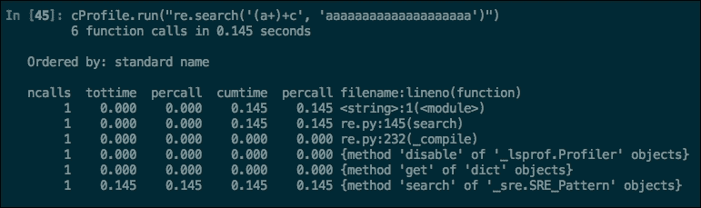

# 五、正则表达式的性能

到目前为止，我们担心的是学习如何利用一个特性或获得一个结果，而不太关心这个过程会有多快。我们唯一的目标是正确性和可读性。

在本章中，我们将转向一个完全不同的性能关注点。然而，我们会发现，性能的提高通常会导致可读性的降低。当我们修改某些东西以使其更快时，我们可能会使机器更容易理解，因此，我们可能会牺牲人类的可读性。

1974 年 12 月 4 日，著名著作*计算机编程艺术*的作者 Donald Knuth 用`go-to`语句撰写了论文*结构化编程*。这句名言摘自该论文：

> *“程序员浪费大量时间考虑或担心其程序中非关键部分的速度，而在考虑调试和维护时，这些提高效率的尝试实际上会产生强烈的负面影响。我们应该忘记小效率，比如说 97%的时间：过早优化是万恶之源。然而，我们不应该在这关键的 3%中放弃我们的机会*

也就是说，我们应该小心优化的内容。也许，对于用于验证表单电子邮件地址的正则表达式，我们应该更关注可读性而不是性能。另一方面，如果我们正在编写一个正则表达式用于批量处理巨大的历史文件，那么我们应该对性能更感兴趣。

最常用的优化方法是先写，然后测量，然后优化关键的 3%。因此，在本章中，我们将首先学习如何度量和分析正则表达式，然后学习优化技术。

# 用 Python 对正则表达式进行基准测试

为了对正则表达式进行基准测试，我们将测量正则表达式执行所需的时间。使用不同的输入测试它们很重要，因为使用小的输入几乎每个正则表达式都足够快。然而，对于较长的动物，它可能是一种完全不同的动物，我们将在后面的*回溯*一节中看到。

首先，我们将创建一个小函数来帮助我们完成此任务：

```py
>>> from time import clock as now
>>> def test(f, *args, **kargs):
        start = now()
        f(*args, **kargs)
        print "The function %s lasted: %f" %(f.__name__, now() - start)
```

因此，我们可以使用以下代码测试正则表达式：

```py
>>> def alternation(text):
       pat = re.compile('spa(in|niard)')
       pat.search(text)
>>> test(alternation, "spain")
The function alternation lasted: 0.000009
```

Python 自带了一个内置的分析器[http://docs.python.org/2/library/profile.html](http://docs.python.org/2/library/profile.html) 我们还可以用来测量通话时间和次数，以及其他事项：

```py
>>> import cProfile
>>> cProfile.run("alternation('spaniard')")
```

您可以在以下屏幕截图中看到输出：



分析输出

让我们来看看另一个有用的技巧，当你想知道在正则表达式的钩子下发生了什么时，这个技巧会起到帮助作用。这是我们在[第 2 章](2.html "Chapter 2. Regular Expressions with Python")*正则表达式和 Python*【调试标志】中看到的。回想一下，它为我们提供了有关如何编译模式的信息。例如：

```py
>>> re.compile('(\w+\d+)+-\d\d', re.DEBUG)
max_repeat 1 4294967295
  subpattern 1
    max_repeat 1 4294967295
      in
        category category_word
    max_repeat 1 4294967295
      in
        category category_digit
literal 45
in
  category category_digit
in
  category category_digit
```

在这里，我们可以看到从`1`到`4294967295`的三个`max_repeat`条件，其中两个在另一个`max_repeat`中。可以将它们看作嵌套循环，因为您可能会认为这是一种难闻的气味。事实上，这将导致**灾难性的回溯**，我们稍后会看到。

# RegexBuddy 工具

在编写正则表达式时可获得更高生产率的不同工具中，**RegexBuddy**（[http://www.regexbuddy.com/](http://www.regexbuddy.com/) 由伟业软件有限公司出类拔萃。

Just Great 软件的幕后策划者是 Jan Goyvaerts，也是**Regular-Expressions.info**（[的幕后策划者 http://www.regular-expressions.info/](http://www.regular-expressions.info/) ，是互联网上最著名的正则表达式引用之一。

使用 RegexBuddy，我们可以使用可视化界面来构建、测试和调试正则表达式。调试特性几乎是独一无二的，它提供了一种很好的机制来理解正则表达式引擎在幕后是如何工作的。在下面的屏幕截图中，我们可以看到 RegexBuddy 正在调试正则表达式的执行：


RegexBuddy 调试正则表达式

它还具有其他功能，例如常用正则表达式库和用于不同编程环境的代码生成器。

尽管它有几个缺点，但它的许可证是专有的，唯一可用的版本是 Windows。但是，支持在 Linux 上使用**wine emulator**执行。

# 了解 Python 正则表达式引擎

`re`模块使用回溯正则表达式引擎；尽管在*Jeffrey E.F.Friedl*非常著名的著作*精通正则表达式*中，它被归类为**非确定性有限自动机**（**NFA**类型。此外，根据*蒂姆·彼得斯*（[）https://mail.python.org/pipermail/tutor/2006-January/044335.html](https://mail.python.org/pipermail/tutor/2006-January/044335.html) ），模块不是纯 NFA。

以下是该算法最常见的特征：

*   支持`*?`、`+?`、`??`等“惰性量词”。
*   It matches the first coincidence, even though there are longer ones in the string.

    ```py
    >>>re.search("engineer|engineering", "engineering").group()'engineer'
    ```

    这也意味着秩序很重要。

*   该算法一步只跟踪一个转换，这意味着引擎一次检查一个字符。
*   支持反向引用和捕获括号。
*   **回溯**是记住最后一个成功位置的能力，以便在需要时可以返回并重试
*   在最坏的情况下，复杂性是指数 O（*C<sup>n</sup>*）。稍后我们将在*回溯*中看到这一点。

## 回溯

正如我们前面提到的，回溯允许返回并重复正则表达式的不同路径。它通过记住最后一个成功的位置来实现。本适用于交替和量词。让我们看一个例子：


回溯

如上图所示，正则表达式引擎一次尝试匹配一个字符，直到失败，然后使用可以重试的下一个路径再次启动。

图中使用的正则表达式是如何构建正则表达式的重要性的完美示例。在这种情况下，可以将表达式重建为`spa(in|niard)`，这样正则表达式引擎就不必返回字符串的开头，就可以重试第二个选项。

这就导致了所谓的灾难性回溯；一个众所周知的回溯问题，它会给您带来一些问题，从缓慢的正则表达式到堆栈溢出导致的崩溃。

在前面的示例中，您可以看到行为不仅随着输入而增长，而且随着正则表达式中的不同路径而增长，因此算法可以是指数 O（*C<sup>n</sup>*）。考虑到这一点，很容易理解为什么我们最终会导致堆栈溢出。当正则表达式无法匹配字符串时，就会出现问题。让我们用前面看到的技巧对正则表达式进行基准测试，以便更好地理解问题。

首先，让我们尝试一个简单的正则表达式：

```py
>>> def catastrophic(n):
        print "Testing with %d characters" %n
        pat = re.compile('(a+)+c')
text = "%s" %('a' * n)
        pat.search(text)
```

正如你所看到的，我们试图匹配的文本总是会失败，因为结尾没有`c`。让我们用不同的输入来测试它：

```py
>>> for n in range(20, 30):
        test(catastrophic, n)
Testing with 20 characters
The function catastrophic lasted: 0.130457
Testing with 21 characters
The function catastrophic lasted: 0.245125
……
The function catastrophic lasted: 14.828221
Testing with 28 characters
The function catastrophic lasted: 29.830929
Testing with 29 characters
The function catastrophic lasted: 61.110949
```

这个正则表达式的行为看起来好像是二次的。但是为什么呢？这里发生了什么事？问题是`(a+)`开始贪婪，所以它试图获得尽可能多的`a`字符。之后，它无法匹配`c`，即返回到第二个`a`，并继续使用`a`字符，直到无法匹配`c`为止。然后，它再次尝试整个过程（回溯），从第二个`a`字符开始。

让我们看另一个例子，在这种情况下，指数行为：

```py
>>> def catastrophic(n):
        print "Testing with %d characters" %n
        pat = re.compile('(x+)+(b+)+c')
        text = 'x' * n
        text += 'b' * n
        pat.search(text)
>>> for n in range(12, 18):
        test(catastrophic, n)
Testing with 12 characters
The function catastrophic lasted: 1.035162
Testing with 13 characters
The function catastrophic lasted: 4.084714
Testing with 14 characters
The function catastrophic lasted: 16.319145
Testing with 15 characters
The function catastrophic lasted: 65.855182
Testing with 16 characters
The function catastrophic lasted: 276.941307
```

正如你所看到的，这种行为是指数型的，这可能导致灾难性的情况。最后，让我们看看正则表达式匹配时会发生什么：

```py
>>> def non_catastrophic(n):
        print "Testing with %d characters" %n
        pat = re.compile('(x+)+(b+)+c')
        text = 'x' * n
        text += 'b' * n
        text += 'c'
        pat.search(text)
>>> for n in range(12, 18):
        test(non_catastrophic, n)
Testing with 10 characters
The function catastrophic lasted: 0.000029
……
Testing with 19 characters
The function catastrophic lasted: 0.000012
```

# 优化建议

在以下几节中，我们将找到一些可用于改进正则表达式的建议。

最好的工具总是常识，即使在遵循这些建议时也需要使用常识。必须理解该建议何时适用，何时不适用。例如，建议**不要贪婪**不能用于所有情况。

## 重用编译的模式

我们在[第 2 章](2.html "Chapter 2. Regular Expressions with Python")*正则表达式与 Python*中了解到，要使用正则表达式，我们必须将其从字符串表示形式转换为编译形式，如`RegexObject`。

这个编译需要一些时间。如果我们使用剩余的模块操作，而不是使用 compile 函数来避免创建`RegexObject`，那么我们应该理解编译是无论如何执行的，并且许多已编译的`RegexObject`是自动缓存的。

然而，当我们编译时，缓存不会支持我们。每一次编译执行都会消耗大量的时间，对于一次执行来说可能可以忽略不计，但是如果执行了很多次执行，这肯定是相关的。

在下面的示例中，让我们看看重用和不重用已编译模式之间的区别：

```py
>>> def dontreuse():
        pattern = re.compile(r'\bfoo\b')
        pattern.match("foo bar")

>>> def callonethousandtimes():
        for _ in range(1000):
            dontreuse()

>>> test(callonethousandtimes)
The function callonethousandtimes lasted: 0.001965

>>> pattern = re.compile(r'\bfoo\b')
>>> def reuse():
        pattern.match("foo bar")

>>> def callonethousandtimes():
        for _ in range(1000):
            reuse()

>>> test(callonethousandtimes)
The function callonethousandtimes lasted: 0.000633
>>>
```

## 交替抽取常用部位

在正则表达式中，替换始终是一种性能风险。在某种 NFA 实现中使用它们时，在 Python 中，我们应该提取交替之外的任何公共部分。

例如，如果我们有`/(Hello``World|Hello``Continent|Hello``Country,)/`，我们可以很容易地用以下表达式提取`Hello`：`/Hello``(World|Continent|Country)/`。这将使我们的引擎只需检查`Hello`一次，而不会针对每种可能性返回重新检查。在下面的示例中，我们可以看到执行上的差异：

```py
>>> pattern = re.compile(r'/(Hello\sWorld|Hello\sContinent|Hello\sCountry)')
>>> def nonoptimized():
         pattern.match("Hello\sCountry")

>>> def callonethousandtimes():
         for _ in range(1000):
             nonoptimized()

>>> test(callonethousandtimes)
The function callonethousandtimes lasted: 0.000645

>>> pattern = re.compile(r'/Hello\s(World|Continent|Country)')
>>> def optimized():
         pattern.match("Hello\sCountry")

>>> def callonethousandtimes():
         for _ in range(1000):
             optimized()

>>> test(callonethousandtimes)
The function callonethousandtimes lasted: 0.000543
>>>
```

## 变更的捷径

交替中的排序是相关的，将从左到右逐个检查交替中存在的每个不同选项。这有利于提高性能。

如果我们将更可能的选项放在变更的开头，更多的检查将更快地将变更标记为匹配。

例如，我们知道汽车更常见的颜色是白色和黑色。如果我们写一个正则表达式来接受一些颜色，我们应该把白色和黑色放在第一位，因为它们更容易出现。我们可以像这样构建正则表达式`/(white|black|red|blue|green)/`。

对于其余元素，如果它们出现的几率相同，则最好将最短的元素放在较长的元素之前：

```py
>>> pattern = re.compile(r'(white|black|red|blue|green)')
>>> def optimized():
         pattern.match("white")

>>> def callonethousandtimes():
         for _ in range(1000):
             optimized()

>>> test(callonethousandtimes)
The function callonethousandtimes lasted: 0.000667
>>>

>>> pattern = re.compile(r'(green|blue|red|black|white)')
>>> def nonoptimized():
         pattern.match("white")

>>> def callonethousandtimes():
         for _ in range(1000):
             nonoptimized()

>>> test(callonethousandtimes)
The function callonethousandtimes lasted: 0.000862
>>>
```

## 适当时使用非捕获组

捕获组将为表达式中定义的每个组花费一些时间。这个时间不是很重要，但是如果我们多次执行正则表达式，它仍然是相关的。

有时，我们使用组，但我们可能对结果不感兴趣，例如，在使用交替时。如果是这种情况，我们可以通过将该组标记为非捕获来节省引擎的一些执行时间，例如，`(?:person|company)`。

## 要具体

当我们定义的模式非常具体时，引擎可以帮助我们在执行实际模式匹配之前执行快速完整性检查。

例如，如果我们将表达式`/\w{15}/`传递给引擎，使其与文本`hello`匹配，那么引擎可以决定检查输入字符串是否实际至少有 15 个字符长，而不是匹配表达式。

## 不要贪心

我们在[第一章](1.html "Chapter 1. Introducing Regular Expressions")*引入正则表达式*中研究了量词，了解了贪婪量词和不情愿量词的区别。我们还发现，默认情况下，量词是贪婪的。

这在性能方面意味着什么？这意味着引擎将始终尝试捕获尽可能多的字符，然后逐步缩小范围，直到匹配完成。如果匹配通常很短，这可能会使正则表达式变慢。但是，请记住，这仅适用于比赛时间通常较短的情况。

# 总结

在最后一章中，我们已经开始学习优化的相关性，以及为什么我们应该通过测量来避免过早优化。然后，我们通过学习不同的机制来测量正则表达式的执行时间，从而开始了测量主题。后来，我们了解了 RegexBuddy 工具，它可以帮助我们了解引擎是如何工作的，并帮助我们查明性能问题。

后来，我们了解了如何看到引擎在幕后工作。我们学习了一些发动机设计理论，以及如何容易陷入一个常见的陷阱——灾难性回溯。

最后，我们回顾了改进正则表达式性能的各种一般性建议。