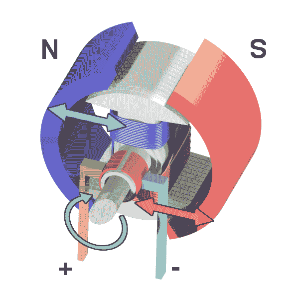
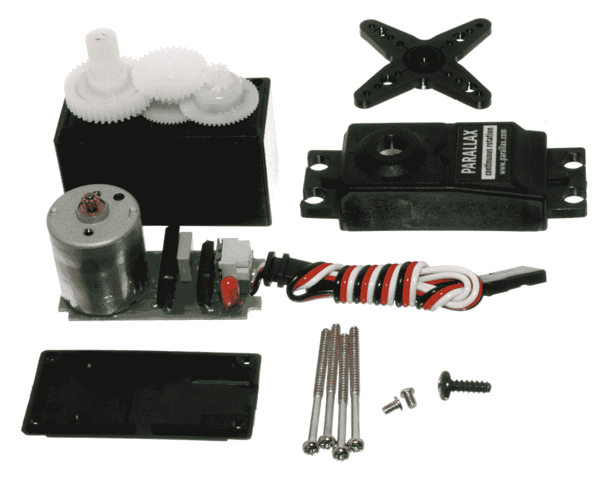
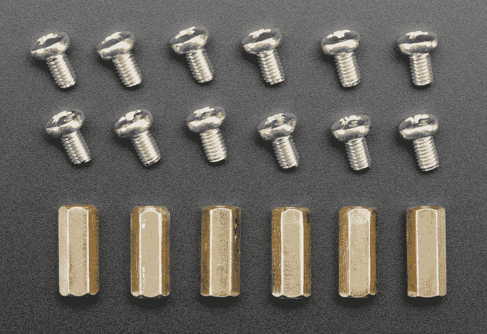
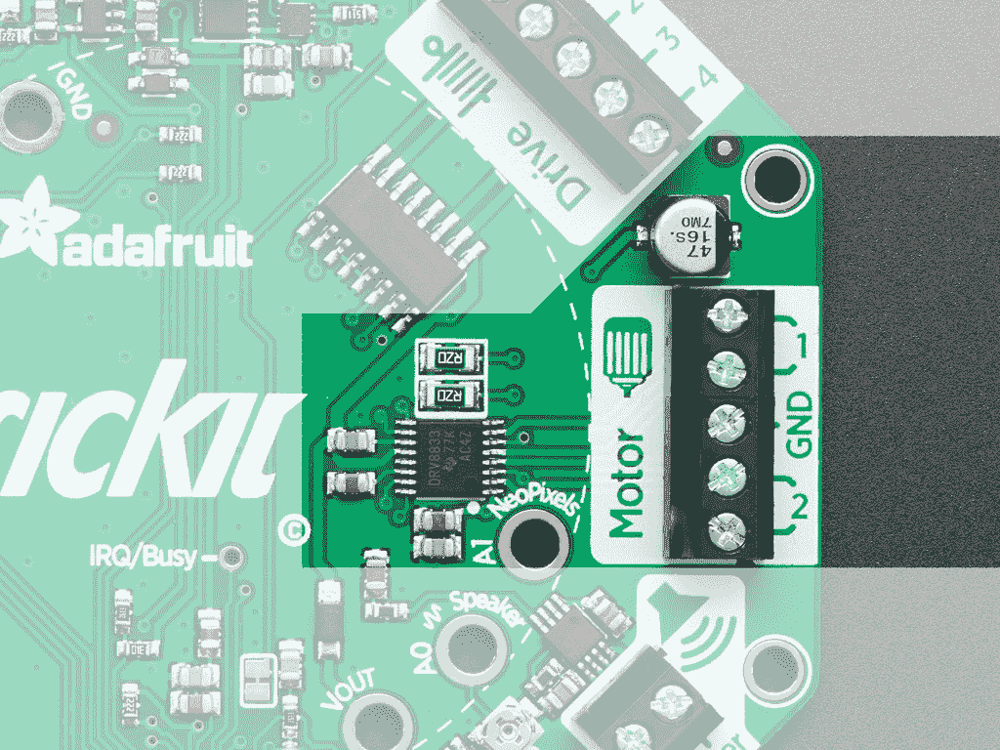
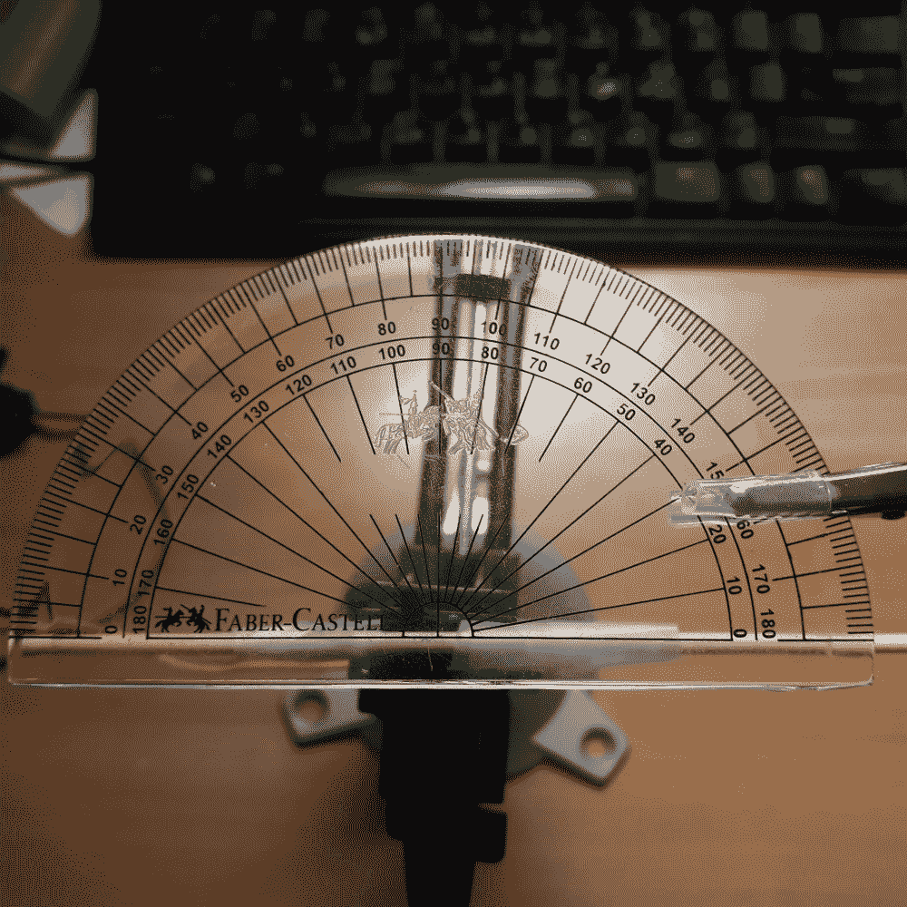

# 八、让我们移动它，移动它

在本章中，您将学习如何控制电机和伺服。使用直流电机将有助于您控制车辆车轮的项目。伺服系统可以帮助你的项目，需要控制机器人手臂移动。这两种装置都将为我们提供一种创造机械运动的方法。根据您试图在项目中创建的运动，您可能希望选择一种运动而不是另一种运动。以下各节将介绍它们的功能以及它们最适合的位置。

到本章结束时，您将能够使用所学知识创建各种有趣的项目。这就为您能够构建的项目类型打开了一整套全新的可能性。

在本章中，我们将介绍以下主题：

*   将伺服调节到正确的脉冲宽度
*   设置伺服系统的驱动范围
*   设置伺服的角度
*   清扫伺服装置
*   用按钮控制伺服机构
*   多伺服控制
*   打开直流电动机
*   设置直流电机的速度和方向
*   用按钮控制直流电动机

# 技术要求

本章中的代码文件可以在 GitHub 存储库的[中的`Chapter08`文件夹中找到 https://github.com/PacktPublishing/MicroPython-Cookbook](https://github.com/PacktPublishing/MicroPython-Cookbook) 。

本章中的许多配方将使用 Circuit Playway Express 库，该库通常在脚本的前几行中导入，代码如下：

```py
from adafruit_circuitplayground.express import cpx
```

该库将帮助我们与主板附带的按钮和开关进行交互。本章中的许多配方将使用以下语句导入另一个库：

```py
from adafruit_crickit import crickit
```

该库将帮助我们与 CRICKIT 板交互，以便我们可以控制伺服和直流电机。

本章中涉及伺服的配方要求两个伺服连接到伺服端口 1 和伺服端口 2。连接伺服电缆时，确保黄色导线朝外。

本章中涉及直流电机的配方要求电机连接至电机连接的驱动器 1。这两条导线可以沿任意方向连接到两个接头上。所有将发生的是旋转方向将被翻转，这取决于导线的连接方式。

# 直流电动机

直流电机接收直流电，并将该能量转化为旋转运动。这通常是通过使用电磁铁来实现的，电磁铁在磁场变化时驱动运动。下图显示了此类电机的内部结构：



Source: https://commons.wikimedia.org/wiki/File:Ejs_Open_Source_Direct_Current_Electrical_Motor_Model_Java_Applet_(_DC_Motor_)_80_degree_split_ring.gif

直流电机在需要高速旋转的应用中工作得很好。它们适用于操作遥控车上的风扇或车轮。

# 泽福斯

伺服比直流电机更复杂，更适合于需要更多控制连接到伺服的精确位置的情况。伺服通常包含直流电机、齿轮、控制电路和传感器，用于检测伺服的准确位置。所有这些组件都集中在一个设备中，使您能够更精确地控制伺服所指向的确切角度。

下图显示了一个拆解的伺服系统，您可以在其中看到直流电机、齿轮和电路：



Source: https://commons.wikimedia.org/wiki/File:Exploded_Servo.jpg

伺服在需要精确控制某一部分角度的应用中工作得很好；例如，您需要控制船上机械臂的角度或方向舵的角度。

# 亚达果克里克特

Adafruit CRICKIT 是一种可以通过各种硬件控制多种不同类型电机的板。不同的 CRICKIT 型号支持覆盆子 Pi 和 Feather 系列产品。

在本章中，我们将使用 CRICKIT for Circuit 游乐场快车。下图显示了连接 Circuit Played Express 之前 CRICKIT 的外观：


Courtesy of adafruit.com

要将这两个设备连接在一起，您需要 6 个六角黄铜支架，每个支架将用 12 个螺钉拧入两个设备。下图显示了这些支架和螺钉的外观：



Courtesy of adafruit.com

使用这些螺钉和支架连接两块板后，两块板应如下图所示：


Courtesy of adafruit.com

最多可以将四个单独的伺服装置连接到板上。微型、微型和标准伺服均受支持。伺服的三针接头应连接到一个可用的伺服插槽，如下图所示：


Courtesy of adafruit.com

板上最多可连接两个直流电机。每个电机将连接到两个引脚。下图显示了两个电机连接的每一对插脚：



Courtesy of adafruit.com

一旦这两个设备连接起来，你就可以打开每个设备的电源，并使用 USB 电缆将电路连接到你的计算机上，就像我们在本书前面几章中所做的那样。连接后，您需要使用支持 CRICKIT 硬件的映像闪存固件。

本章中使用的 UF2 文件的名称适用于支持 CRICKIT 的 CircuitPython 版本 3.1.2，称为`adafruit-circuitpython-circuitplayground_express_crickit-3.1.2.uf2`。

For details on how to flash the board with this firmware, please follow the instructions in [Chapter 1](01.html), *Getting Started with MicroPython*, regarding how to flash the microcontroller firmware.

# 在哪里买

本章使用了许多组件，这些组件都可以从 Adafruit 在线零售商处购买。

赛道游乐场快车的 Adafruit CRICKIT 可直接从 Adafruit（[购买 https://www.adafruit.com/product/3093](https://www.adafruit.com/product/3093) ）。它也可以从其他在线零售商处购买，如 Pimoroni。

可直接从 Adafruit（[购买电路连接套件 https://www.adafruit.com/product/3816](https://www.adafruit.com/product/3816) ）。该套件包括将两块板连接在一起所需的六个六角支架和 12 个螺钉。本章中使用的伺服可直接从 Adafruit（[购买 https://www.adafruit.com/product/169](https://www.adafruit.com/product/169) ）。

本章使用的直流电机可直接从 Adafruit（[购买 https://www.adafruit.com/product/3777](https://www.adafruit.com/product/3777) ）。Adafruit 还销售许多可选的车轮附件，但无需遵循本章中的食谱。

CRICKIT 可由三 AA 电池架供电，可直接从 Adafruit（[购买 https://www.adafruit.com/product/3842](https://www.adafruit.com/product/3842) ）。与其他电源相比，这种电源的优点在于其便携性和低成本。

# 将伺服调节到正确的脉冲宽度

伺服机构可以通过发送不同的电脉冲使其手臂旋转到特定的角度。手臂移动的角度将由电脉冲的宽度控制。在设置这些角度之前，每个伺服必须首先配置正确的最小和最大宽度设置。

这个食谱会告诉你怎么做。每当您希望在项目中使用伺服时，都需要此配置。

# 准备

您将需要访问 Circuit Playway Express 上的 REPL 才能运行此配方中提供的代码。

# 怎么做。。。

让我们回顾一下此配方所需的步骤：

1.  在 REPL 中运行以下代码行：

```py
>>> from adafruit_circuitplayground.express import cpx
>>> from adafruit_crickit import crickit
>>> 
>>> MIN_PULSE=750 
>>> MAX_PULSE=2250
```

2.  在这个阶段，我们已经导入了必要的库，并定义了我们想要的这组特定伺服的最小和最大脉冲宽度值。以下代码块将使用以下设置配置连接到第一个端口的伺服：

```py
>>> crickit.servo_1.set_pulse_width_range(MIN_PULSE, MAX_PULSE)
```

3.  运行下一段代码，将伺服移动到最低角度：

```py
>>> crickit.servo_1.angle = 0
```

4.  下面的代码块将手臂移动到中间位置，刚好在最低值和最高值之间：

```py
>>> crickit.servo_1.angle = 90
```

5.  运行下一段代码时，将手指按住触摸板 A1：

```py
>>> event.process()
A1 True
```

6.  应将以下代码放入`main.py`文件中，执行时将伺服 1 移动到最低角度 3 秒，然后移动到中间范围角度 60 秒：

```py
import time
from adafruit_circuitplayground.express import cpx
from adafruit_crickit import crickit

MIN_PULSE = 750
MAX_PULSE = 2250

crickit.servo_1.set_pulse_width_range(MIN_PULSE, MAX_PULSE)
crickit.servo_1.angle = 0
time.sleep(3)
crickit.servo_1.angle = 90
time.sleep(60)
```

# 它是如何工作的。。。

`crickit`对象将是我们与连接到电路板的所有伺服和直流电机进行交互的方式。每个伺服连接都有编号，因此可以通过单个对象上的属性控制多个伺服。在以常量保存最小和最大脉冲宽度值后，我们通过调用`set_pulse_width_range`将这些设置应用于第一个伺服电机。

然后，我们在第一个伺服上设置角度属性的值，这会将伺服移动到角度 0。我们通过调用`sleep`方法暂停 3 秒钟，然后使用相同的角度属性将角度更改为 90。

# 还有更多。。。

不同制造商的伺服电机预计最小和最大脉冲宽度的设置不同。您通常可以通过检查产品的数据表找到特定伺服的正确设置。本配方中使用的设置特定于本章开头所述的伺服模型。如果您决定使用不同的伺服系统，可以根据需要更改这些设置。用于控制伺服的 Python 库还允许您为每个伺服配置这些设置。这使您可以通过分别配置每个伺服来同时连接具有不同设置的不同伺服。

脉冲宽度有时以毫秒为单位，有时以微秒为单位。只需将它们转换为微秒，因为它们是本 Python 模块中预期的单位。该配方中使用的伺服系统的脉冲宽度为 0.75 ms 至 2.25 ms，当转换为微秒时，将变为 750 至 2250。

# 另见

以下是一些参考资料：

*   伺服系统中组件的概述见[http://developer.wildernesslabs.co/Hardware/Reference/Peripherals/Servos/](http://developer.wildernesslabs.co/Hardware/Reference/Peripherals/Servos/) 。
*   有关伺服系统内部工作原理的说明，请参见[https://www.pc-control.co.uk/servo_control.htm](https://www.pc-control.co.uk/servo_control.htm) 。

# 设置伺服系统的驱动范围

伺服机构的手臂运动范围不同。对于角度，您在软件中请求正确映射到伺服实际移动的角度；您需要配置伺服及其驱动范围。配置后，您将能够准确地将连接到伺服的臂移动到正确的位置。这是配置您计划在其中使用伺服的任何项目的一个重要步骤。如果你不这样做，你将面临一些奇怪的惊喜，伺服臂不断移动到错误的位置。

# 准备

您将需要访问 Circuit Playway Express 上的 REPL 才能运行此配方中提供的代码。

# 怎么做。。。

让我们回顾一下此配方所需的步骤：

1.  执行 REPL 中的下一个代码块：

```py
>>> from adafruit_circuitplayground.express import cpx
>>> from adafruit_crickit import crickit
>>> 
>>> MIN_PULSE = 750
>>> MAX_PULSE = 2250
>>> 
>>> crickit.servo_1.set_pulse_width_range(MIN_PULSE, MAX_PULSE)
```

2.  现在已为伺服配置脉冲宽度。执行以下代码块，将伺服移动到最低位置：

```py
>>> crickit.servo_1.angle = 0
```

3.  在运行下一个代码块之前，记下手臂的当前位置。运行下一段代码，将伺服移动到最高角度：

```py
>>> crickit.servo_1.angle = 180
```

4.  测量这两个位置之间的角度。你会发现角度是 160 度。运行下一段代码，将伺服返回到角度 0，并配置驱动范围：

```py
>>> crickit.servo_1.angle = 0
>>> crickit.servo_1.actuation_range = 160
```

5.  运行下一段代码，软件角度和真实世界角度都应为 160 度：

```py
>>> crickit.servo_1.angle = 160
```

6.  以下代码应插入到`main.py`文件中：

```py
import time
from adafruit_circuitplayground.express import cpx
from adafruit_crickit import crickit

MIN_PULSE = 750
MAX_PULSE = 2250

crickit.servo_1.set_pulse_width_range(MIN_PULSE, MAX_PULSE)
crickit.servo_1.angle = 0
time.sleep(3)
crickit.servo_1.actuation_range = 160
crickit.servo_1.angle = 160
time.sleep(60)
```

执行此脚本时，它会将伺服 1 移动到最低角度 3 秒，然后将其移动到 160 度的角度 60 秒。

# 它是如何工作的。。。

前几行代码将配置伺服的脉冲宽度设置。在将驱动范围配置为该特定伺服的正确值（160 度）之前，角度将设置为 0 持续 3 秒。在此配置之后，当软件中的角度设置为 160 度时，真实世界的移动也应为 160 度。

# 还有更多。。。

正如伺服系统之间的脉冲宽度不同，运动范围也不同。大多数伺服不会给你一个完整的 180 度的运动。发现这些设置的一种方法是不配置驱动范围，然后在软件中将伺服移动到 0 度和 180 度。

然后，可以使用量角器实际测量伺服移动的角度。测量该值后，可以使用该角度作为驱动范围的值。下图显示了本章中使用量角器以最低角度测量的伺服：



量角器就位后，伺服移动到最高角度。下图显示量角器测量角度为 160 度：


量角器是在现实世界中进行精确角度测量时的首选武器。

# 另见

以下是一些参考资料：

*   有关设置驱动范围的详细信息，请参见[https://learn.adafruit.com/using-servos-with-circuitpython/circuitpython](https://learn.adafruit.com/using-servos-with-circuitpython/circuitpython) 。
*   有关伺服装置运动范围的讨论可参见[https://learn.sparkfun.com/tutorials/hobby-servo-tutorial](https://learn.sparkfun.com/tutorials/hobby-servo-tutorial) 。

# 设置伺服的角度

一旦正确配置了伺服，就可以将伺服臂移动到精确的角度位置。此配方将伺服移动到多个角度，并显示当您尝试将伺服移动到超出其允许运动范围的角度时会发生什么。

一旦我们有能力将伺服移动到特定的角度，我们就可以开始将其纳入我们的项目中，以控制机械臂或将其他伺服附件移动到特定的位置。

# 准备

您将需要访问 Circuit Playway Express 上的 REPL 才能运行此配方中提供的代码。

# 怎么做。。。

让我们回顾一下此配方所需的步骤：

1.  使用 REPL 运行以下代码行：

```py
>>> from adafruit_circuitplayground.express import cpx
>>> from adafruit_crickit import crickit
>>> 
>>> MIN_PULSE = 750
>>> MAX_PULSE = 2250
>>> 
>>> crickit.servo_1.set_pulse_width_range(MIN_PULSE, MAX_PULSE)
>>> crickit.servo_1.angle = 0
```

2.  伺服现在应该处于最低角度。执行以下代码块以将伺服移动到其最高位置：

```py
>>> crickit.servo_1.angle = 180
```

3.  运行以下代码以查看超过最大角度范围时发生的情况：

```py
>>> crickit.servo_1.angle = 190
Traceback (most recent call last):
  File "<stdin>", line 1, in <module>
  File "adafruit_motor/servo.py", line 111, in angle
ValueError: Angle out of range
```

4.  运行以下代码块，将伺服返回到角度 0，并将驱动范围配置为 160 度：

```py
>>> crickit.servo_1.angle = 0
>>> crickit.servo_1.actuation_range = 160
```

5.  运行以下代码块，查看 180 度现在被视为超出伺服范围的角度：

```py
>>> crickit.servo_1.angle = 180
Traceback (most recent call last):
  File "<stdin>", line 1, in <module>
  File "adafruit_motor/servo.py", line 111, in angle
ValueError: Angle out of range
```

6.  运行以下代码块，伺服应移动到其最高角度：

```py
>>> crickit.servo_1.angle = 160
```

7.  应将以下代码放入`main.py`文件中，执行时，将伺服移动到 0、45、90 和 160 的角度，每次移动之间有三秒钟的延迟：

```py
import time
from adafruit_circuitplayground.express import cpx
from adafruit_crickit import crickit

MIN_PULSE = 750
MAX_PULSE = 2250

crickit.servo_1.set_pulse_width_range(MIN_PULSE, MAX_PULSE)
crickit.servo_1.angle = 0
crickit.servo_1.actuation_range = 160

crickit.servo_1.angle = 0
time.sleep(3)

crickit.servo_1.angle = 45
time.sleep(3)

crickit.servo_1.angle = 90
time.sleep(3)

crickit.servo_1.angle = 160
time.sleep(3)
```

# 它是如何工作的。。。

前几行代码将配置伺服的脉冲宽度设置和驱动范围。然后，将在伺服上设置 4 个不同的角度。角度分别为 0 度、45 度、90 度和 160 度。设置每个角度后，通过调用时间模块上的`sleep`功能应用 3 秒的延迟。

# 还有更多。。。

在本配方中，我们进行了试验，以了解在未配置驱动范围和配置驱动范围后，尝试设置伺服角度时会发生什么情况。驱动范围的默认设置为 180 度。这就是为什么在所有情况下，190 度的值都会被拒绝。一旦我们将驱动范围配置为 160，当然，180 等值将被拒绝，因为它们将超出此范围。

伺服库中有这些检查非常有用，因为如果不执行这些检查，软件应用程序中设置伺服角度超出正确范围的错误可能会损坏伺服。此外，抛出带有清晰异常消息的`ValueError`异常，可以更容易地调试存在这些错误的应用程序。

# 另见

以下是一些参考资料：

*   使用 CRICKIT 控制伺服角度的项目可在[中找到 https://learn.adafruit.com/crickit-powered-owl-robot](https://learn.adafruit.com/crickit-powered-owl-robot) 。
*   在[中可以找到使用伺服和电路 Python 创建运动的示例 https://learn.adafruit.com/hello-world-of-robotics-with-crickit](https://learn.adafruit.com/hello-world-of-robotics-with-crickit) 。

# 清扫伺服装置

在本食谱中，您将学习如何创建一个脚本，该脚本以扫掠动作连续地将伺服从最低角度移动到最高角度，然后再移动回来。在某些方面，代码类似于我们在前几章中看到的灯光动画，因为我们将在每次更改之间使用时间延迟更改电路板的输出，以创建动画视觉效果。

在伺服的情况下，虽然，它是附加的手臂，将成为动画与清扫运动。本配方中使用的方法可适用于任何数量的项目，在这些项目中，您需要一些伺服附件从一个位置持续扫描到另一个位置。

# 准备

您将需要访问 Circuit Playway Express 上的 REPL 才能运行此配方中提供的代码。

# 怎么做。。。

让我们回顾一下此配方所需的步骤：

1.  在 REPL 中运行以下代码行：

```py
>>> import time
>>> from adafruit_circuitplayground.express import cpx
>>> from adafruit_crickit import crickit
>>> 
>>> MIN_PULSE = 750
>>> MAX_PULSE = 2250
>>> MAX_ANGLE = 160
>>> STEP = 10
>>> DELAY = 0.1
```

2.  在这个阶段，应该导入所需的 Python 库，并将不同的设置定义为脚本的常量。执行以下代码块以初始化伺服并将其移动到最低位置：

```py
>>> def init(servo):
...     servo.set_pulse_width_range(MIN_PULSE, MAX_PULSE)
...     servo.angle = 0
...     servo.actuation_range = MAX_ANGLE
...     
...     
... 
>>> init(crickit.servo_1)
```

3.  运行以下代码，将伺服从角度`0`扫向`160`：

```py
>>> def sweep(servo, direction):
...     angle = int(servo.angle)
...     while 0 <= angle <= MAX_ANGLE:
...         print(angle)
...         servo.angle = angle
...         time.sleep(DELAY)
...         angle += STEP * direction
...         
... 
>>> sweep(crickit.servo_1, 1)
0
10
20
30
40
50
60
70
80
90
100
110
120
130
140
150
160
```

4.  运行以下代码，将伺服从角度`160`扫向`0`：

```py
>>> sweep(crickit.servo_1, -1)
160
150
140
130
120
110
100
90
80
70
60
50
40
30
20
10
0
```

5.  应将以下代码插入到`main.py`文件中，执行时，将持续从角度`0`扫向`160`，然后再扫回`0`：

```py
import time
from adafruit_circuitplayground.express import cpx
from adafruit_crickit import crickit

MIN_PULSE = 750
MAX_PULSE = 2250
MAX_ANGLE = 160
STEP = 10
DELAY = 0.1

def init(servo):
    servo.set_pulse_width_range(MIN_PULSE, MAX_PULSE)
    servo.angle = 0
    servo.actuation_range = MAX_ANGLE

def sweep(servo, direction):
    angle = int(servo.angle)
    while 0 <= angle <= MAX_ANGLE:
        print(angle)
        servo.angle = angle
        time.sleep(DELAY)
        angle += STEP * direction

def main():
    init(crickit.servo_1)
    while True:
        sweep(crickit.servo_1, 1)
        sweep(crickit.servo_1, -1)

main()
```

# 它是如何工作的。。。

首先，定义了一个名为`init`的函数，该函数期望伺服的名称初始化为其第一个参数。调用此功能时，它将设置最小和最大脉冲宽度，将角度设置为 0，并设置驱动范围。接下来，定义一个名为`sweep`的函数。此函数期望第一个参数是要控制的伺服，第二个参数是值为`1`或`-1`的整数，表示扫描方向。

`1`值将使角度增大，而`-1`值将使角度减小。扫描函数的第一部分将检索伺服角度的当前值，并将其转换为整数，并将其存储在名为`angle`的变量中。开始循环，直到角度值超过允许的范围 0 到 160 为止。在循环的每次迭代中，打印当前角度，然后在应用睡眠之前将该角度应用于伺服；然后，根据定义的步长值更改角度。

然后定义`main`函数，调用该函数时，将初始化伺服并将其移动到角度 0。然后，开始一个无限循环，在每个循环迭代期间执行两个操作。它将首先调用 sweep 函数将角度从 0 增加到 160。然后，它将再次调用 sweep 函数，但这一次，将角度从 160 减小到 0。

# 还有更多。。。

尽可能不在`init`和`sweep`函数中硬编码任何值。大多数值作为脚本顶部设置的可配置常量提供，或者作为调用函数时接收的参数提供。这将使使用其他设置调整伺服脚本变得更加容易。您还可以通过增加和降低这些常数中的值，轻松更改每次`sweep`迭代期间角度的变化量以及扫描完成的速度。

为了提高可读性并鼓励在其他项目中重用不同的代码块，该程序还被分为 3 个不同的功能。Python 编程语言的一个有趣且相对独特的特性是链接比较操作的能力，它在 MicroPython 和 CircuitPython 版本中得到了充分支持。此功能用于`sweep`功能，以检查角度是否在 0 和 160 之间。

在其他语言中，通常必须使用一个`and`运算符和两个比较运算符组合来表示这一点。但是，在 Python 中，您可以将两个比较运算符链接起来，以更简洁易读的方式获得相同的结果。

# 另见

以下是一些参考资料：

*   描述如何链接比较的文档可在[中找到 https://docs.python.org/3/reference/expressions.html#comparisons](https://docs.python.org/3/reference/expressions.html#comparisons) 。
*   有关 CRICKIT 库的文档可在[上找到 https://circuitpython.readthedocs.io/projects/crickit/en/latest/](https://circuitpython.readthedocs.io/projects/crickit/en/latest/) 。

# 用按钮控制伺服系统

在本食谱中，您将学习如何使用回路上的两个按钮来控制伺服的角度。此配方中的脚本将在每次按下按钮 A 时增加伺服角度，并在每次按下按钮 B 时减小角度。当您想要创建一个项目，人们可以使用不同的输入控件（如按钮）直接控制伺服时，这些类型的脚本非常有用。

# 准备

您将需要访问 Circuit Playway Express 上的 REPL 才能运行此配方中提供的代码。

# 怎么做。。。

让我们回顾一下此配方所需的步骤：

1.  在 REPL 中执行以下代码块：

```py
>>> import time
>>> from adafruit_circuitplayground.express import cpx
>>> from adafruit_crickit import crickit
>>> 
>>> MIN_PULSE = 750
>>> MAX_PULSE = 2250
>>> MAX_ANGLE = 160
>>> STEP = 10
>>> DELAY = 0.1
```

2.  初始导入已经完成，我们已经准备好定义我们的函数。以下代码块将定义并调用一个函数来初始化伺服：

```py
>>> def init(servo):
...     servo.set_pulse_width_range(MIN_PULSE, MAX_PULSE)
...     servo.angle = 0
...     servo.actuation_range = MAX_ANGLE
...     
...     
... 
>>> init(crickit.servo_1)
```

3.  运行以下代码以将伺服移动 10 度并检查角度值：

```py
>>> def move(servo, angle, direction):
...     new = angle + STEP * direction
...     if 0 <= new <= MAX_ANGLE:
...         angle = new
...         print(angle)
...         servo.angle = angle
...     return angle
...     
... 
>>> angle = 0
>>> angle = move(crickit.servo_1, angle, 1)
10
>>> angle
10
```

4.  运行以下代码再次将伺服移动 10 度：

```py
>>> angle = move(crickit.servo_1, angle, 1)
20
```

5.  运行以下代码以将伺服角度减小 10 度：

```py
>>> angle = move(crickit.servo_1, angle, -1)
10
```

6.  以下代码应插入到`main.py`文件中：

```py
import time
from adafruit_circuitplayground.express import cpx
from adafruit_crickit import crickit

MIN_PULSE = 750
MAX_PULSE = 2250
MAX_ANGLE = 160
STEP = 10
DELAY = 0.1

def init(servo):
    servo.set_pulse_width_range(MIN_PULSE, MAX_PULSE)
    servo.angle = 0
    servo.actuation_range = MAX_ANGLE

def move(servo, angle, direction):
    new = angle + STEP * direction
    if 0 <= new <= MAX_ANGLE:
        angle = new
        print(angle)
        servo.angle = angle
    return angle

def main():
    init(crickit.servo_1)
    angle = 0
    while True:
        if cpx.button_a:
            angle = move(crickit.servo_1, angle, 1)
        if cpx.button_b:
            angle = move(crickit.servo_1, angle, -1)
        time.sleep(DELAY)

main()
```

脚本一旦执行，每次按下按钮 a 和 B 时，都会将伺服移动到较低或较高的角度。

# 它是如何工作的。。。

在定义了全局常数和伺服初始化函数之后，我们继续定义另外两个函数。`move`函数接受伺服、当前角度和运动方向作为其三个参数。然后根据当前角度步长量和移动方向计算预期的新角度。如果此新角度在可接受的角度范围内，则打印其值并应用于`servo`和`angle`变量。最后，返回`angle`变量的值。

在脚本底部定义并调用的`main`函数实现了主事件循环。在无限循环开始之前，`servo`变量被初始化，`angle`变量被设置为`0`。在循环的每次迭代中，如果按下按钮 A，则会调用`move`功能以增加伺服角度。然后，检查按钮 B，如果按下，将调用`move`功能以减小伺服角度。最后，在该循环的每次迭代结束时应用一个`sleep`函数。

# 还有更多。。。

此基本事件循环允许我们通过向不同方向移动伺服来对用户输入作出反应。我们可以从多个方向扩展此脚本的逻辑。例如，我们可以将步进角从 10 减小到 1，以获得非常精细的伺服控制，并一次改变一个角度。我们还可以减少延迟，以加快对每次按下按钮的反应。我们可以使用基本脚本，在按下每个按钮时，添加控制像素的代码，以及伺服角度。

# 另见

以下是一些参考资料：

*   通过按钮控制伺服的项目可在[找到 https://learn.adafruit.com/universal-marionette-with-crickit](https://learn.adafruit.com/universal-marionette-with-crickit) 。
*   `servo`对象的源代码可在[找到 https://github.com/adafruit/Adafruit_Circuitpython_Motor](https://github.com/adafruit/Adafruit_Circuitpython_Motor) 。

# 多伺服控制

在本食谱中，您将学习如何结合使用按钮和滑动开关来控制多个伺服。基本上，我们将使用按钮来控制特定伺服的角度。然后，我们将使用滑动开关选择要控制的两个连接伺服中的哪一个。

该配方基于过去的一些配方，并添加了额外的数据结构和控制，以管理控制多个伺服所需的额外逻辑。当您需要找到一次控制多个伺服的方法时，此配方将非常有用。

# 准备

您将需要访问 Circuit Playway Express 上的 REPL 才能运行此配方中提供的代码。

# 怎么做。。。

让我们回顾一下此配方所需的步骤：

1.  使用 REPL 运行以下代码行：

```py
>>> import time
>>> from adafruit_circuitplayground.express import cpx
>>> from adafruit_crickit import crickit
>>> 
>>> MIN_PULSE = 750
>>> MAX_PULSE = 2250
>>> MAX_ANGLE = 160
>>> STEP = 10
>>> DELAY = 0.1
>>> 
>>> def init(servo):
...     servo.set_pulse_width_range(MIN_PULSE, MAX_PULSE)
...     servo.angle = 0
...     servo.actuation_range = MAX_ANGLE
...     
...     
... 
>>> 
```

2.  初始导入已经完成，我们已经定义了`init`函数来帮助初始化伺服。以下代码块将设置一些数据结构，用于跟踪我们的角度和伺服：

```py
>>> servos = [crickit.servo_1, crickit.servo_4]
>>> angles = [0, 0]
```

3.  以下代码块将初始化伺服列表中的所有伺服：

```py
>>> init(servos[0])
>>> init(servos[1])
```

4.  运行以下代码，根据滑动开关位置设置开关变量：

```py
>>> switch = int(cpx.switch)
>>> switch
0
```

5.  运行以下代码以将所选伺服移动 10 度：

```py
>>> def move(servo, angle, direction):
...     new = angle + STEP * direction
...     if 0 <= new <= MAX_ANGLE:
...         angle = new
...         print(angle)
...         servo.angle = angle
...     return angle
...     
...     
... 
>>> angles[switch] = move(servos[switch], angles[switch], 1)
10
```

6.  在调用`move`函数前后，运行以下代码检查角度的数据结构：

```py
>>> angle = move(crickit.servo_1, angle, 1)
>>> angles
[10, 0]
>>> angles[switch] = move(servos[switch], angles[switch], 1)
20
>>> angles
[20, 0]
```

7.  更改滑动开关位置并运行以下代码块以更新所选伺服：

```py
>>> switch = int(cpx.switch)
>>> switch
1
```

8.  运行以下代码块，查看调用`move`函数如何移动其他伺服：

```py
>>> angles[switch] = move(servos[switch], angles[switch], 1)
10
>>> angles
[20, 10]
```

9.  以下代码应插入到`main.py`文件中：

```py
import time
from adafruit_circuitplayground.express import cpx
from adafruit_crickit import crickit

MIN_PULSE = 750
MAX_PULSE = 2250
MAX_ANGLE = 160
STEP = 10
DELAY = 0.1

def init(servo):
    servo.set_pulse_width_range(MIN_PULSE, MAX_PULSE)
    servo.angle = 0
    servo.actuation_range = MAX_ANGLE

def move(servo, angle, direction):
    new = angle + STEP * direction
    if 0 <= new <= MAX_ANGLE:
        angle = new
        print(angle)
        servo.angle = angle
    return angle

def main():
    servos = [crickit.servo_1, crickit.servo_4]
    angles = [0, 0]
    init(servos[0])
    init(servos[1])
    while True:
        switch = int(cpx.switch)
        if cpx.button_a:
            angles[switch] = move(servos[switch], angles[switch], 1)
        if cpx.button_b:
            angles[switch] = move(servos[switch], angles[switch], -1)
        time.sleep(DELAY)

main()
```

执行此脚本将移动不同的伺服，具体取决于滑动开关的位置和按下按钮的次数。

# 它是如何工作的。。。

在定义了全局常数和伺服初始化函数之后，我们将继续定义另外两个函数。`move`函数遵循您在上一个配方中看到的相同结构。然而，`main`功能已经扩展到具有额外的数据结构和逻辑，以处理多个伺服和滑动开关。

在`main`功能中，创建一个名为`servos`的列表，指向要控制的两个伺服。一个名为`angles`的列表将跟踪每个伺服的角度。然后在进入无限循环之前初始化每个伺服。

在每次循环迭代期间，开关的值将从布尔值转换为整数值 0 或 1。这将允许我们在两个伺服之间切换控制。然后，根据是否按下按钮 A 或按钮 B，调用`move`功能，并提供正确的`servo`对象和角度。最后，在每个循环的末尾应用`sleep`。

# 还有更多。。。

在这个配方中，我们结合了三个输入控制和两个输出伺服，使与电路板的交互成为一个自然的过程。部分原因是不同的物理输入控件可以映射到不同的逻辑控件。

滑动开关是在两个选项之间切换的理想选择，因此在两个伺服之间进行选择时使用滑动开关是有意义的。当您希望通过反复按下按钮来反复增加或减少值时，按钮工作正常。

# 另见

以下是一些参考资料：

*   与滑动开关交互的示例见[https://learn.adafruit.com/circuitpython-made-easy-on-circuit-playground-express/slide-switch](https://learn.adafruit.com/circuitpython-made-easy-on-circuit-playground-express/slide-switch) 。
*   许多 Adafruit CRICKIT 相关成分可在[中找到 https://www.adafruit.com/category/972](https://www.adafruit.com/category/972) 。

# 打开直流电动机

在本食谱中，您将学习如何使用 Circuit Playway Express 和 CRICKIT 板控制直流电机。直流电机比伺服电机更易于交互，因为它们不需要任何初始配置。本食谱将为您提供项目中打开和关闭直流电机所需的基本技能。

# 准备

您将需要访问 Circuit Playway Express 上的 REPL 才能运行此配方中提供的代码。

# 怎么做。。。

让我们回顾一下此配方所需的步骤：

1.  在 REPL 中运行以下代码行：

```py
>>> from adafruit_crickit import crickit
>>> import time
>>> 
>>> crickit.dc_motor_1.throttle = 1
```

2.  连接到电路板的直流电机现在应开始全速旋转。运行以下代码块以停止直流电机旋转：

```py
>>> crickit.dc_motor_1.throttle = 0
```

3.  以下代码块将以 1 秒的延迟停止和启动电机：

```py
>>> while True:
...     crickit.dc_motor_1.throttle = 1
...     time.sleep(1)
...     crickit.dc_motor_1.throttle = 0
...     time.sleep(1)
...     
...     
... 
```

4.  以下代码应插入到`main.py`文件中：

```py
from adafruit_crickit import crickit
import time

while True:
    crickit.dc_motor_1.throttle = 1
    time.sleep(1)
    crickit.dc_motor_1.throttle = 0
    time.sleep(1)
```

执行此脚本时，将启动一个无限循环，该循环将持续启动和停止电机。

# 它是如何工作的。。。

直流电机不同于伺服电机，因此，它们需要较少的代码和交互来移动。库导入后，将启动无限循环。

在循环的第一行中，访问`crickit`对象上的`dc_motor_1`属性。此对象将允许我们与连接到板上第一个电机连接的任何直流电机进行交互。`dc_motor_1`显示了一个名为`throttle`的属性，我们可以使用该属性打开和关闭电机。如果我们将该值设置为`1`，则电机启动，`0`值将关闭电机。

这样，首先将油门设置为`1`打开电机；在电机关闭前应用`1`秒睡眠，然后应用`1`秒睡眠。然后循环再次开始，重复该过程。

# 还有更多。。。

如本配方所示，直流电机在许多方面不同于伺服电机。的确，它们比伺服系统更容易入门，因为它们不需要任何初始配置。然而，另一方面，它们不能精确控制你想把马达放在的确切位置。

当然，直流电机有能力做伺服系统做不到的事情，比如一个完整的 360 度旋转运动。

# 另见

以下是一些参考资料：

*   有关使用带有 CRICKIT 板的直流电机的文件，请参见[https://learn.adafruit.com/adafruit-crickit-creative-robotic-interactive-construction-kit/circuitpython-dc-motors](https://learn.adafruit.com/adafruit-crickit-creative-robotic-interactive-construction-kit/circuitpython-dc-motors) 。
*   可以在[找到许多可用于容纳直流电机的底盘 https://learn.adafruit.com/adafruit-crickit-creative-robotic-interactive-construction-kit/recommended-chassis](https://learn.adafruit.com/adafruit-crickit-creative-robotic-interactive-construction-kit/recommended-chassis) 。

# 设置直流电机的速度和方向

在本配方中，您将学习如何控制特定直流电机的速度和旋转方向。您将看到，为油门提供正值或负值将让我们控制电机是顺时针转动还是逆时针转动。我们还可以为油门提供分数值，以控制电机的运行功率。

当你使用直流电机来控制一辆由电脑控制的微型蟒蛇驱动的汽车的轮子时，这个配方中的技术将非常有用。他们会让你加速或减速。你也可以用它们使汽车倒车或完全停车。

# 准备

您将需要访问 Circuit Playway Express 上的 REPL 才能运行此配方中提供的代码。

# 怎么做。。。。

让我们回顾一下此配方所需的步骤：

1.  在 REPL 中执行以下代码块：

```py
>>> from adafruit_crickit import crickit
>>> import time
>>> DELAY = 0.1
>>> 
>>> crickit.dc_motor_1.throttle = 0.5
```

2.  直流电机现在将以其全速的 50%运行。以下代码行将以四分之一的全速运行电机：

```py
>>> crickit.dc_motor_1.throttle = 0.25
```

3.  以下代码块将以全速向相反方向移动电机：

```py
>>> crickit.dc_motor_1.throttle = -1
```

4.  运行以下代码块以停止电机：

```py
>>> crickit.dc_motor_1.throttle = 0
```

5.  执行时，以下代码块将定义并调用一个函数，将电机的速度和方向从一个方向更改为相反方向：

```py
>>> from adafruit_crickit import crickit
>>> def change_throttle(motor, start, increment):
...     throttle = start
...     for i in range(21):
...         print(throttle)
...         motor.throttle = throttle
...         throttle += increment
...         throttle = round(throttle, 1)
...         time.sleep(DELAY)
...         
... 
>>> change_throttle(crickit.dc_motor_1, -1.0, 0.1)
-1.0
-0.9
-0.8
-0.7
-0.6
-0.5
-0.4
-0.3
-0.2
-0.1
0.0
0.1
0.2
0.3
0.4
0.5
0.6
0.7
0.8
0.9
1.0
>>> 
```

6.  以下代码应插入到`main.py`文件中：

```py
from adafruit_crickit import crickit
import time

DELAY = 0.1

def change_throttle(motor, start, increment):
    throttle = start
    for i in range(21):
        print(throttle)
        motor.throttle = throttle
        throttle += increment
        throttle = round(throttle, 1)
        time.sleep(DELAY)

def main():
    while True:
        change_throttle(crickit.dc_motor_1, -1.0, 0.1)
        change_throttle(crickit.dc_motor_1, 1.0, -0.1)

main()
```

执行此脚本时，会将电机从一个方向反复移动到另一个方向。

# 它是如何工作的。。。

定义了`change_throttle`函数，该函数将执行本配方中的大部分工作。它期望接收要控制的电机、油门的启动值，以及每次迭代期间油门应改变的量。函数将`throttle`变量初始化为指定的起始值。

然后，将启动一个从油门最低值到最高值的`for`循环。它首先打印当前油门，然后将`throttle`变量的值应用于电机。节气门递增并四舍五入到小数点后一位。然后在下一次迭代之前应用延迟。

`main`函数将进入一个无限循环，在每次迭代中调用`change_throttle`函数两次。第一次调用将油门值从`-1.0`移动到`1.0`，增量为`0.1`。第二次调用将油门值从`1.0`移动到`-1.0`，增量为`-0.1`。

# 还有更多。。。

此配方可用于演示以不同速度和不同方向运行电机。它创建了一个几乎是可视的动画，在那里你可以看到马达在减速和加速。您可以看到它们在一个方向以最大速度移动，然后减速以在另一个方向以最大速度移动。

你可以做各种各样的创造性实验来将这个配方扩展到新的功能。例如，您可以将两个轮子连接到直流电机上，使其像遥控车一样移动。您可以通过
加速电机，将光传感器配置为对手电筒做出反应。或者，您可以在根据特定时间表转动的直流电机上附加其他部件。您可以使用本配方中使用的时间模块控制电机开启的时间。

# 另见

以下是一些参考资料：

*   在[中可以找到一个同时使用伺服和直流电机以及 CRICKIT 板的项目 https://learn.adafruit.com/adafruit-crickit-creative-robotic-interactive-construction-kit/bubble-bot](https://learn.adafruit.com/adafruit-crickit-creative-robotic-interactive-construction-kit/bubble-bot) 。
*   有关如何使用 CRICKIT 板连接和控制直流电机的详细信息，请参见[https://learn.adafruit.com/make-it-move-with-crickit/use-a-continuous-dc-motor-now](https://learn.adafruit.com/make-it-move-with-crickit/use-a-continuous-dc-motor-now) 。

# 用按钮控制直流电动机

在本配方中，我们将使用按钮来增加和降低直流电机的速度。我们可以使用相同的脚本通过按钮改变旋转方向。本质上，一个按钮将使电机在一个方向上增加速度，另一个按钮将使电机在另一个方向上移动得更多。通过这种方式，我们可以使用这对按钮设置任意方向的速度范围，并使电机完全停止。

脚本运行时，当前速度和方向将打印到屏幕上。此配方在任何希望将用户输入转换为运动的项目中都很有用。例如，可以创建一个项目，在该项目中，将皮带轮连接到直流电机，并使用按钮升高和降低皮带轮。

# 准备

您将需要访问 Circuit Playway Express 上的 REPL 才能运行此配方中提供的代码。

# 怎么做。。。

让我们回顾一下此配方所需的步骤：

1.  使用 REPL 运行以下代码行：

```py
>>> from adafruit_crickit import crickit
>>> from adafruit_circuitplayground.express import cpx
>>> import time
>>> 
>>> STEP = 0.1
>>> DELAY = 0.1
>>> MIN_THROTTLE = -1
>>> MAX_THROTTLE = 1
>>> 
>>> throttle = 0
>>> crickit.dc_motor_1.throttle = throttle
```

2.  直流电机速度设置为`0`油门。下面的代码块将定义一个`move`函数并调用它三次，使用参数将速度提高到 30%强度：

```py
>>> def move(motor, throttle, direction):
...     new = throttle + STEP * direction
...     if MIN_THROTTLE <= new <= MAX_THROTTLE:
...         throttle = round(new, 1)
...         print(throttle)
...         motor.throttle = throttle
...     return throttle
...     
...     
... 
>>> throttle = move(crickit.dc_motor_1, throttle, 1)
0.1
>>> throttle = move(crickit.dc_motor_1, throttle, 1)
0.2
>>> throttle = move(crickit.dc_motor_1, throttle, 1)
0.3
```

3.  以下代码块将调用`move`功能三次，以降低速度，直到电机完全停止：

```py
>>> throttle = move(crickit.dc_motor_1, throttle, -1)
0.2
>>> throttle = move(crickit.dc_motor_1, throttle, -1)
0.1
>>> throttle = move(crickit.dc_motor_1, throttle, -1)
0.0
```

4.  以下代码块将在负方向上调用`move`功能三次以上，以将电机在相反方向上的强度设置为 30%：

```py
>>> throttle = move(crickit.dc_motor_1, throttle, -1)
-0.1
>>> throttle = move(crickit.dc_motor_1, throttle, -1)
-0.2
>>> throttle = move(crickit.dc_motor_1, throttle, -1)
-0.3
```

5.  以下代码块将在使电机从相反方向下降到完全停止的方向上调用`move`功能三次：

```py
>>> throttle = move(crickit.dc_motor_1, throttle, 1)
-0.2
>>> throttle = move(crickit.dc_motor_1, throttle, 1)
-0.1
>>> throttle = move(crickit.dc_motor_1, throttle, 1)
0.0
```

6.  以下代码应插入到`main.py`文件中，当执行时，它会将电机从一个方向移动到另一个方向，以响应对按钮的按下：

```py
from adafruit_crickit import crickit
from adafruit_circuitplayground.express import cpx
import time

STEP = 0.1
DELAY = 0.1
MIN_THROTTLE = -1
MAX_THROTTLE = 1

def move(motor, throttle, direction):
    new = throttle + STEP * direction
    if MIN_THROTTLE <= new <= MAX_THROTTLE:
        throttle = round(new, 1)
        print(throttle)
        motor.throttle = throttle
    return throttle

def main():
    throttle = 0
    while True:
        if cpx.button_a:
            throttle = move(crickit.dc_motor_1, throttle, 1)
        if cpx.button_b:
            throttle = move(crickit.dc_motor_1, throttle, -1)
        time.sleep(DELAY)

main()
```

# 它是如何工作的。。。

`move`功能用于控制电机运动方向的变化。可以调用它来增加或减少特定旋转方向上的运动。该功能获取电机对象、当前油门和所需的运动方向。计算新的油门值，如果发现该值在电机的可接受范围内，则将打印该值并应用于电机。

然后返回油门的最新值，以便主事件循环可以跟踪它。`main`函数包含一个无限循环，作为主事件循环。在此循环中，按下按钮 A 将在一个方向上增加电机的速度，按下按钮 B 将在相反方向上增加电机的速度。

# 还有更多。。。

该配方提供了使用直流电机获取用户生成输入和生成输出的基本构建块。您可以以与其他人类似的方式扩展此配方，以便滑动开关可以让您使用相同的脚本控制多个直流电机。

您可以更改脚本中的步长值，使电机更快地更改速度和方向。或者，您可能希望减少步长值，以额外的按钮按下为代价，对速度进行更细粒度的控制。

# 另见

以下是一些参考资料：

*   可在[找到与本章中使用的直流电机兼容的电机皮带轮 https://www.adafruit.com/product/3789](https://www.adafruit.com/product/3789) 。
*   在[可以找到一个使用直流电机和 CRICKIT 板控制皮带轮的项目 https://learn.adafruit.com/adafruit-crickit-creative-robotic-interactive-construction-kit/marble-madness](https://learn.adafruit.com/adafruit-crickit-creative-robotic-interactive-construction-kit/marble-madness) 。