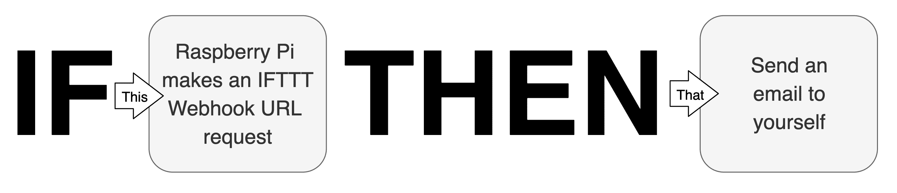
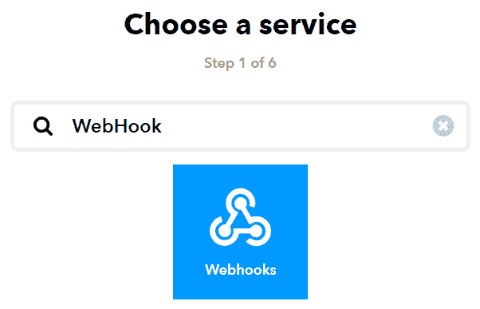
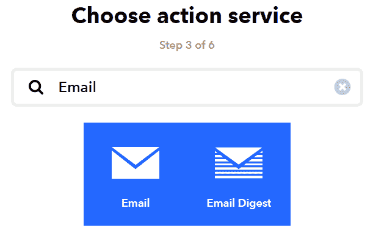
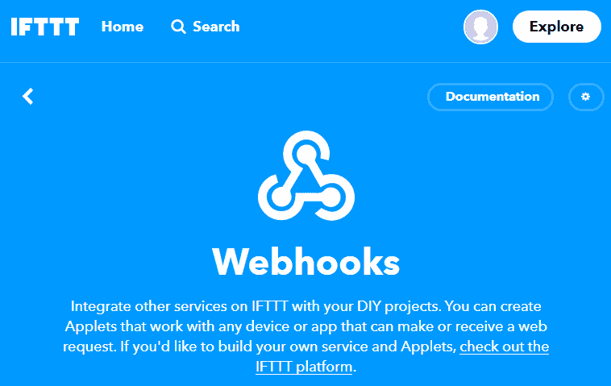
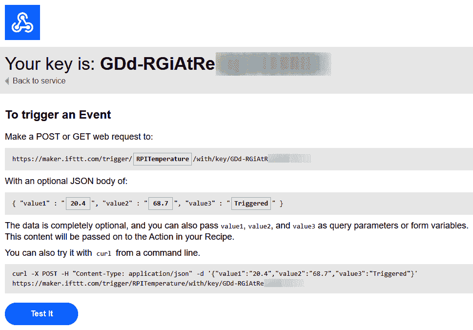

# 十六、物联网可视化和自动化平台

在上一章中，我们研究了构建与电子设备接口的 Python 程序的替代方法。这包括一种事件循环方法、两种基于线程的方法（显示回调和发布者-订阅者模型的使用）和一种异步 I/O 方法。

在本章中，我们将讨论可用于 Raspberry Pi 的物联网和自动化平台。术语*物联网平台*和*自动化平台*是非常广泛的概念，因此在本章中，我所说的这些术语是指任何软件服务——基于云的或本地安装的——为您提供现成的生态系统，以创建强大、灵活、，以及有趣的物联网项目。

我们的主要关注点是**如果这个然后那个**（**IFTTT**）自动化平台，我想你们中的很多人都会对这个平台有一些熟悉，以及数据可视化的 ThingSpeak 平台。我之所以选择这两项服务，是因为它们都提供免费的定价层，并允许我们创建和探索简单的演示和示例，您可以在此基础上进行构建。然而，除此之外，我还将讨论一些我有经验的其他物联网和自动化平台，这些平台将允许您构建更强大的物联网解决方案。

本章将介绍以下主题：

*   从 Raspberry Pi 触发 IFTTT*小程序*
**   从 IFTTT 小程序操作覆盆子 Pi*   使用 ThingSpeak 平台可视化数据*   用于进一步探索的其他物联网和自动化平台*

 *让我们开始吧！

# 技术要求

要执行本章中的练习，您需要以下内容：

*   树莓皮 4 B 型
*   Raspbian OS Buster（带桌面和推荐软件）
*   Python 版本至少为 3.5

这些需求是本书中代码示例的基础。只要 Python 版本为 3.5 或更高版本，就可以合理地期望代码示例在 Raspberry Pi 3 Model B 或不同版本的 Raspbian OS 上无需修改即可工作。

您可以在本书的 GitHub 存储库中的`chapter13`文件夹中找到本章的源代码，该文件夹位于以下位置：[https://github.com/PacktPublishing/Practical-Python-Programming-for-IoT](https://github.com/PacktPublishing/Practical-Python-Programming-for-IoT) 。

您需要在终端中执行以下命令，以设置虚拟环境并安装本章代码所需的 Python 库：

```py
$ cd chapter13              # Change into this chapter's folder
$ python3 -m venv venv      # Create Python Virtual Environment
$ source venv/bin/activate  # Activate Python Virtual Environment
(venv) $ pip install pip --upgrade        # Upgrade pip
(venv) $ pip install -r requirements.txt  # Install dependent packages
```

将从`requirements.txt`安装以下依赖项：

*   **PiGPIO**：PiGPIO GPIO 库（[https://pypi.org/project/pigpio](https://pypi.org/project/pigpio)
*   **泛美卫生组织 MQTT 库**：**[https://pypi.org/project/paho-mqtt](https://pypi.org/project/paho-mqtt)**
***   **请求 HTTP 库**：[https://pypi.org/project/requests](https://pypi.org/project/requests)*   **基于 PiGPIO 的 DHT 库**：[https://pypi.org/project/pigpio-dht](https://pypi.org/project/pigpio-dht)**

 **本章练习所需的电子元件如下：

*   1 个 DHT11（低精度）或一个 DHT22（高精度）温度和湿度传感器
*   1 个红色发光二极管
*   电阻器：
    *   1 x 200Ω电阻器
    *   1 x 10kΩ电阻器（可选）

# 从 Raspberry Pi 触发 IFTTT 小程序

你们中的许多人可能已经熟悉了**If This 而不是**（**IFTTT**）web 服务（[IFTTT.com](https://ifttt.com)），在这里可以创建称为*小程序的简单工作流自动化链。*小程序响应一个 web 服务中的更改（此处为*）*，然后触发另一个 web 服务上的操作（此处为*）。*

以下是一些小程序配置的常见示例（称为*配方）：*

*   每当发布特定的 Twitter 标签时，给自己发送一封电子邮件。
*   在一天中的特定时间打开或关闭智能灯泡。
*   当你接近你的房子时，用你手机的 GPS 打开你连接互联网的车库门。
*   在电子表格中记录你在办公室的时间。
*   …还有成千上万的其他例子！

正如我们将在本节和下一节中了解到的，我们的 Raspberry Pi 可以承担*this*或*this*的角色，以触发小程序或对触发的小程序执行操作。

以下是我们将在本节中介绍的内容的视觉表现；也就是说，让我们的 Raspberry Pi 承担 IFTTT 工作流中的*这个*角色：



Figure 13.1 – Raspberry Pi assuming the *This* role in an IFTTT Applet workflow

我们即将发布的 Python 示例将监视当前温度（此处为*），*，并在特定温度下请求一个特殊的 IFTTT Webhook URL。这个 URL 请求触发我们的小程序，然后它会发送一封电子邮件（即*）。*我们将在构建第一个 IFTTT 小程序时更详细地讨论 Webhook。

首先，我们需要创建并测试我们的示例电路，我们将在下一步进行。

## 创建温度监控电路

在本例中，我们将重用我们在[第 9 章](12.html)中创建的 DHT11/DHT22 温度电路，*测量温度、湿度和亮度*。

以下是我们需要做的：

1.  构建*图 9.2*所示的电路。
2.  将数据引脚连接到 GPIO 24（在[第 9 章](12.html)*测量温度、湿度和亮度*中，我们使用了 GPIO 21，但在本章后面的 LED 中将使用 GPIO 21）。

一旦您构建了电路，我们就可以继续构建我们的第一个 IFTTT 小程序。

## 创建和配置 IFTTT 小程序

要创建 IFTTT 小程序，我们需要遵循许多步骤。无论您创建的小程序的类型如何，这些步骤中的许多都是简单和通用的。虽然我们将逐步完成这些通用步骤，但我们不会详细介绍它们，因为我相信您将完全能够理解过程中发生的事情。相反，我们将重点关注 IFTTT 中与集成 Raspberry Pi 相关的独特步骤和部分。

Please note that the [https://ifttt.com/](https://ifttt.com/) free pricing tier limits the number of Applet that you can have active at once. At the time of writing, the maximum was three active Applets. We will be creating four Applets in this and the next chapter combined, so you will need to archive at least one Applet on IFTTT as you work through the next chapter in order to stay on the IFTTT free pricing tier.

以下是我们需要遵循的步骤：

1.  登录或创建您的 IFTTT 帐户。如果您还没有 IFTTT 账户，请访问[IFTTT.com/join](https://ifttt.com/join)并按照屏幕上的说明进行操作。

We are performing these steps on the IFTTT website, [ifttt.com](https://ifttt.com). The process to follow for the IFTTT phone and tablet apps will be different.

2.  登录 IFTTT 后，单击您的个人资料头像图标（以下屏幕截图中用方框突出显示）以显示菜单：


Figure 13.2 – Profile avatar icon

3.  接下来，单击“配置文件”菜单中的“创建”选项，如下所示：


Figure 13.3 – Profile menu

4.  您将看到的下一个页面将是“创建您自己的页面”。在此处，单击单词 If 和 This 之间的+图标：


Figure 13.4 – The Create your own page – part 1

5.  现在，您将被要求选择一项服务。我们需要选择与 Raspberry Pi 集成的服务称为 WebHook 服务，如下所示：



Figure 13.5 – The Choose a service page

6.  找到并标识 Webhook 服务后，单击 Webhooks 图标继续。
7.  您将看到的下一个页面是选择触发器页面，如下面的屏幕截图所示。在此处，单击接收 web 请求选项：


Figure 13.6 – The Choose trigger page

8.  接下来，您将看到完整的触发器字段页面，如下所示：


Figure 13.7 – The Complete trigger fields page

事件名称字段对于 Raspberry Pi 集成非常重要。在我们稍后将介绍的 Python 代码中，我们必须确保代码使用的事件名称与我们在此页面中键入的内容匹配。对于我们的示例，我们将事件命名为 RPITemperature。

9.  在“事件名称”框中输入 RPITemperature 后，单击“创建触发器”按钮继续。

A Webhooks's Event Name is its unique identifier (for your IFTTT account). If you are creating many Webhooks, then you will need to use a different Event Name to distinguish between them.

10.  接下来，您将再次看到创建您自己的页面。这一次，您将看到*这*现在是 Webhook 图标：


Figure 13.8 – The Create your own page – part 2

我们现在已经完成了配置 IFTTT 小程序的一半。现在我们已经配置了 Webhook 触发器，我们需要配置我们的操作，即发送电子邮件。创建电子邮件操作后，我们将重新访问 Webhook 触发器，并发现用于触发此 Webhook 事件的 URL 和参数。

11.  接下来，单击单词 Then 和 That 之间的+图标。您将看到选择操作服务页面。在此页面上，搜索电子邮件并单击电子邮件图标：



Figure 13.9 – The Choose action service page

12.  当您看到以下屏幕截图中显示的“选择操作”页面时，请选择“向我发送电子邮件”选项：


Figure 13.10 – The Choose action page

13.  接下来，您将看到完整的操作字段页面。请填写主题和正文文本字段，如以下屏幕截图所示。您将在本章后面找到此操作生成的示例电子邮件：


Figure 13.11 – The Complete action fields page

在前面的屏幕截图中，您会注意到一些文本被灰色框包围；例如，Value1 和 occurrendat。这些被称为*成分*，当小程序被触发时，它们会被动态替换。正如我们不久将在代码中看到的，我们将分别用当前温度、湿度和消息替换 Value1、Value2 和 Value3 成分。

14.  填写“主题”和“正文”文本字段后，单击“创建操作”按钮。

15.  最后，单击 Review and Finish 页面上的 Finish 按钮，如下所示：


Figure 13.12 – The Review and finish page

祝贺您刚刚创建了一个 IFTTT 小程序，当我们使用 Raspberry Pi 触发它时，它会发送一封电子邮件。但是我们怎么做呢？这就是我们将在下一节中了解的内容。

## 触发 ifttwebhook

既然我们已经创建了 IFTTT 小程序，我们还需要采取一些步骤来学习如何触发 Webhook。这些步骤归结为知道在 IFTTT 中导航到何处以发现您独特的 Webhook URL。

以下是我们需要遵循的步骤：

1.  首先，我们需要导航到 Webhooks 页面。我们有几种方法可以做到这一点，我将让您选择哪条路线：

无论您选择何种路径，您都将看到以下屏幕截图中显示的页面：



Figure 13.13 – The Webhooks page

2.  单击页面右上角的文档按钮。您将看到如下所示的 Webhook 文档页面：



Figure 13.14 – The Webhook documentation page Please note that in the preceding example page, I have filled in the {Event} and JSON Body fields so that they can be referenced during our discussion. Your fields will be initially empty.

此页面包含我们需要的关键信息，以便将此 Webhook 触发器与 Raspberry Pi 集成。以下是本页的关键部分：

*   **您的密钥**：这是您帐户的 Webhook API 密钥，构成您唯一的 Webhook URL 的一部分。

*   **获取或发布请求 URL**：您唯一的 Webhook URL。API 键和事件名称的唯一组合是将 URL 与可触发的 IFTTT 事件相关联。为了与我们的 Raspberry Pi 集成，这是我们需要构造和请求的 URL。我们将在代码中简要介绍这一点。
*   **事件名称**：您要触发的事件的名称。
*   **JSON 正文**：每个可触发的 Webhook 最多可以包含三个 JSON 格式的数据参数，它们必须分别命名为 value1、value2 和 value3。
*   **cURL 命令行示例**：在终端中运行此示例以触发 RPITemperature 事件（您将收到一封电子邮件）。
*   **测试按钮**：点击此按钮将触发 RPItemTemperature 事件（您将收到一封电子邮件）。

现在我们已经创建了我们的 IFTTT 小程序，并且发现了在哪里可以找到 Webhook URL 以及它是如何构造的，现在我们可以深入研究触发我们的 IFTTT 小程序的 Python 代码。

## 在 Python 中触发 IFTTT 小程序

我们将围绕我们在[第 9 章](12.html)*中首次看到的 DHT 11/DHT 22 电路和代码，探索一个简单的应用程序*测量温度、湿度和光照水平*。您可以在`chapter13/ifttt_dht_trigger_email.py`文件中找到此代码。*

该代码将使用 DHT 11 或 DHT 22 传感器监测温度，如果违反预先配置的高或低阈值，该代码将调用您的 IFTTT Webhook URL，然后该 URL 将向您发送一封电子邮件，类似于以下屏幕截图中所示的电子邮件。这对应于您在上一节*步骤 13*中配置的电子邮件主题和正文文本：


Figure 13.15 – Example IFTTT email

在运行示例应用程序代码之前，我们需要执行一些配置步骤。让我们来看一看：

1.  打开`chapter13/ifttt_dht_trigger_email.py`文件进行编辑。
2.  找到第（1）行和第（2）行所示的以下代码段。确认您的 DHT 传感器已连接到相应的 GPIO 引脚，并且根据您拥有的传感器使用了正确的 DHT11 或 DHT22 实例：

```py
    # DHT Temperature/Humidity Sensor GPIO.
    GPIO =     24                                                     # (1)

        # Configure DHT sensor - Uncomment appropriate line 
# based on the sensor you have.
    dht = DHT11(GPIO, use_internal_pullup=True, timeout_secs=0.5) # (2) 
#dht = DHT22(GPIO, use_internal_pullup=True, timeout_secs=0.5)
```

3.  现在，找到由第（3）、（4）和（5）行指示的以下代码段，并将`USE_DEGREES_CELSIUS`、`HIGH_TEMP_TRIGGER`和`LOW_TEMP_TRIGGER`变量更新为在您所在位置有意义的值：

```py
USE_DEGREES_CELSIUS = True # False to use Fahrenheit   # (3)
HIGH_TEMP_TRIGGER   = 20 # Degrees                     # (4)
LOW_TEMP_TRIGGER    = 19 # Degrees                     # (5)
```

当温度达到`HIGH_TEMP_TRIGGER`度或降至`LOW_TEMP_TRIGGER`度时，将触发 IFTTT 小程序并发送电子邮件。高温和低温触发器的原因是创建一个小的温度缓冲区，以防止代码在温度高于或低于单个值时触发多封电子邮件。

4.  接下来，找到从第（6）行开始的代码的以下部分，并更新显示的详细信息–特别是您的 IFTTT API 密钥，我们在*步骤 2*的上一节中确定了该密钥：

```py
EVENT = "RPITemperature"                    # (6)
API_KEY = "<ADD YOUR IFTTT API KEY HERE>"
```

我们所有的配置都完成了。您会注意到第（7）行，这是我们使用 API 键和事件名称构建 IFTTT Webhook URL 的地方：

```py
URL = "https://maker.ifttt.com/trigger/{}/with/key/{}".format(EVENT, API_KEY) # (7)
```

文件中剩余的代码轮询 DHT11 或 DHT22 传感器，将读数与`HIGH_TEMP_TRIGGER`和`HIGH_TEMP_TRIGGER`值进行比较，如果温度被破坏，则构造一个`requests`对象并调用 IFTTT Webhook URL 来触发小程序。我们在这里不讨论这些代码，因为根据您以前使用 DHT11/DHT22 传感器和 Python`requests`库的经验，这些代码应该是不言自明的。

配置好代码后，就可以在终端上运行程序了。您将收到类似以下内容的输出：

```py
(venv) $ python ifttt_dht_trigger_email.py
INFO:root:Press Control + C To Exit.
INFO:root:Sensor result {'temp_c': 19.6, 'temp_f': 67.3, 'humidity': 43.7, 'valid': True}
INFO:root:Sensor result {'temp_c': 20.7, 'temp_f': 69.3, 'humidity': 42.9, 'valid': True}
INFO:root:Temperature 20.7 is >= 20, triggering event RPITemperature
INFO:root:Response Congratulations! You've fired the RPITemperature event
INFO:root:Successful Request.
```

这里的示例还显示了当温度超过 20 度时触发 IFTTT 小程序。

现在，我们使用*This*角色中的 Raspberry Pi 触发 IFTTT 小程序，完成了我们的 IFTTT 示例。我们介绍的基本过程说明了这是多么容易实现！我们发送了一封电子邮件，但您可以按照相同的总体流程创建其他 IFTTT 配方，以触发其他操作，例如打开智能灯和设备，在谷歌电子表格中添加行，以及创建 Facebook 帖子。您可能想签出[https://ifttt.com/discover](https://ifttt.com/discover) 有很多想法和可能性。请记住，从我们的角度和我们的学习，这是一个*Webhook*触发器，我们可以从树莓 Pi 中使用它来实现这些想法。玩得高兴

接下来，我们将看到相反的场景，看看如何操作我们的树莓 Pi。

# 从 IFTTT 小程序操作覆盆子 Pi

上一节教我们如何从 Raspberry Pi 触发 IFTTT 小程序。在本节中，我们将学习如何从 IFTTT 小程序操作 Raspberry Pi。

在我们的示例中，我们将创建一个 IFTTT 小程序，在收到电子邮件时触发它。我们将使用此电子邮件的主题来控制连接到 GPIO pin 的 LED。

我们将使用 IFTTT Webhook 服务，正如我们之前所做的，只是这次 Webhook 服务将安装在小程序的*那*端，并将请求我们指定的 URL。下图说明了这一基本思想：


Figure 13.16 – Raspberry Pi assuming the *That* role in an IFTTT Applet

让我们看看两种可能的方法，我们可以使用 IFTTT Webhook 服务来请求 URL，然后可以通过 Raspberry Pi 的 Python 代码查看 URL。

## **方法 1–使用 dweet.io 服务作为中介**

将 IFTTT 与 Raspberry Pi 集成的一种方法是使用 dweet.io 服务。我们在[第 2 章](03.html)、*Python 入门和 IoT*中介绍了 dweet.io 以及 Python 示例。

简而言之，以下是我们将如何使用 dweet.io 以及 IFTTT 和 Python 代码：

1.  在我们的 IFTTT Webhook 中，我们将使用一个 dweet.io URL 来发布一个 dweet（其中包含一条打开、关闭或使 LED 闪烁的指令）。
2.  我们的 Raspberry Pi 将运行 Python 代码来检索由 IFTTT Webhook 发布的 dweet。
3.  然后，我们的代码将根据 dweet 中指定的命令控制 LED。

这是我们将用于示例的方法。这种方法的优点是，我们不需要担心在路由器上配置防火墙和端口转发规则。此外，这意味着我们可以在路由器配置可能不实用甚至不可能的环境中（例如，在工作环境中）运行该示例。

我们将用于此基于 dweet.io 的集成的代码可以在`chapter13/dweet_led.py`文件中找到，它是[第 2 章](03.html)*Python 和 IoT 入门*中`chapter02/dweet_led.py`文件的精确副本。

## **方法 2–创建一个 RESTful 服务**

要使用这种方法，我们需要创建一个 RESTful 服务，类似于我们在[第 3 章](04.html)中所做的，*使用 Flask*与 RESTful API 和 Web 套接字服务联网（可以在`chapter02/flask_api_server.py`中找到的代码，它改变 LED 的亮度（而不是将其设置为开/关/闪烁），将是一个很好的起点）。

我们还需要向公共互联网公开 Raspberry Pi，这需要我们在本地防火墙或路由器中打开一个端口并创建一个端口转发规则。然后，与我们的公共 IP（或域名）一起，我们可以构建一个 URL，并将其直接用于 IFTTT Webhook 服务。

For prototyping ideas and creating demos, a simple alternative to opening up firewalls and creating port forwarding rules could be to use a service such as Local Tunnels ([localtunnel.github.io/www](https://localtunnel.github.io/www/)) or ngrok ([ngrok.com](https://ngrok.com/)), which can help you expose a device to the internet.

由于此方法需要在您的终端上进行配置和设置，这超出了我们作为本章的一部分实际可以做的，因此我们将继续使用上一节中所示的 dweet.io 方法。

接下来，我们将创建一个电路，可以与第二个 IFTTT 小程序一起使用，我们将很快构建它。

## 创建 LED 电路

我们接下来的示例将需要一个 LED，以及一个连接到 GPIO 引脚的串联电阻器（例如，GPIO 21）。我相信，鉴于我们在本书中已经构建了 LED 电路的次数，您可以自己将其连接起来，而不会出现任何问题！（如果您确实需要提醒，请参见[第 2 章](03.html)*Python 和 IoT 入门*中的*图 2.7*）

Keep the DHT 11/DHT 22 circuit you created for our first IFTTT Applet example because we will reuse this circuit again later in this chapter.

当您的电路准备就绪后，我们将继续运行示例程序。

## 运行 IFTTT 和 LED Python 程序

在本节中，我们将运行程序并获得一个唯一的东西名称和 URL，以便与 dweet.io 服务一起使用。

以下是要遵循的步骤：

1.  运行终端中的`chapter13/dweet_led.py`文件中的代码。您将收到类似于以下内容的输出（您的*事物名称*，因此您的 URL 将不同）：

```py
(venv) $ python dweet_led.py
INFO:main:Created new thing name 749b5e60
LED Control URLs - Try them in your web browser:
  On : https://dweet.io/dweet/for/749b5e60?state=on
  Off : https://dweet.io/dweet/for/749b5e60?state=off
  Blink : https://dweet.io/dweet/for/749b5e60?state=blink
```

正如我们前面提到的，`chapter13/dweet_led.py`是我们在[第 2 章](03.html)*Python 和 IoT 入门*中讨论的相同程序的精确副本。如果您需要更多关于该程序如何工作的上下文，请重新阅读该章以及其中包含的代码讨论。

2.  在程序运行时保持终端打开，因为我们需要在下一节中复制一个 URL。我们还需要运行程序来测试即将进行的集成。

接下来，我们将创建另一个 IFTTT 小程序，通过 dweet.io 与该程序集成。

## 创建 IFTTT 小程序

我们将创建另一个 IFTTT 小程序。整个过程与我们之前创建的小程序非常相似，只是我们的 Raspberry Pi（通过 Webhook 集成）将位于小程序的*端，如图 13.16 所示。*

下面是创建下一个小程序需要遵循的步骤。这次我省略了许多常见的屏幕截图，因为它们与我们之前的 IFTTT 小程序创建过程相似：

1.  登录 IFTTT 后，单击您的个人资料头像图标并从下拉菜单中选择创建。
2.  在 If+This Then Than Than 页面上，按+图标。
3.  在“选择服务”页面中，搜索并选择电子邮件服务。
4.  在选择触发页面上，选择 Send IFTTT an email taged（确保该选项中的单词*已标记）。*
5.  在下一页中，输入 LED 作为标记输入，然后单击创建触发器按钮：


Figure 13.17 – The Complete trigger fields page

6.  在 If<email icon="">This Then+Than 页面上，按下+图标。</email>
7.  在“选择操作服务”页面上，搜索并选择 Webhooks 服务。
8.  接下来，在“选择操作”页面上，选择“发出 web 请求”。

9.  您将遇到的下一个页面称为“完整操作字段”。在这里，我们将使用上一节中程序打印到终端的 dweet URL：


Figure 13.18 – The Complete action fields page

以下是完成此页面上的字段所需遵循的子步骤：


Figure 13.19 – The Complete action fields page

7.  最后，在 Review and finish 页面上，单击 finish 按钮。

做得好！现在我们已经创建了第二个小程序。接下来，我们将使用此小程序通过发送电子邮件指示 LED 打开、关闭或闪烁来控制 LED。

## 通过电子邮件控制 LED

现在，我们已经创建了小程序，通过电子邮件控制 LED，现在是测试集成的时候了。

以下是创建电子邮件的步骤：

1.  确保`chapter13/dweet_led.py`文件中的程序仍在终端中运行。
2.  打开您喜爱的电子邮件程序并创建新的电子邮件。
3.  使用`trigger@applet.ifttt.com`作为电子邮件的收件人地址。

When sending a trigger email to IFTTT, it must come from the same email address that you use with IFTTT (you can visit [https://ifttt.com/settings](https://ifttt.com/settings) to check your email address).

4.  作为主体，使用以下方法之一控制 LED：

*   `#LED On`
*   `#LED Off`
*   `#LED Blink`

IFTTT strips off the #LED tag, so our `dweet_led.py` program only receives the text On , Off , or Blink . The leading space is stripped off in our Python code.

以下屏幕截图显示了将使 LED 闪烁的电子邮件示例：


13.20 – Trigger email example

5.  发送电子邮件。
6.  请稍等，LED 将改变状态。

现在，我们已经了解了如何使用 IFTTT 通过电子邮件控制 LED，让我们快速介绍一些故障排除技巧。

## IFTTT 故障排除

如果您的 IFTTT 小程序似乎没有触发和操作，以下是一些故障排除方法供您探索和尝试：

*   在`dweet_led.py`中，尝试以下操作：
    *   打开调试日志记录；例如，`logger.setLevel(logging.DEBUG)`。
    *   更改位于源文件末尾附近的 dweet 检索方法。如果您使用的是`stream_dweets_forever()`，请尝试使用`poll_dweets_forever()`，因为它对瞬时连接问题更具弹性。
*   在 IFTTT 网站上，您可以通过执行以下操作来检查任何小程序的活动日志：
    1.  导航到“配置文件”菜单下的“我的服务”选项
    2.  选择服务（例如 Webhooks）
    3.  选择要检查的小程序
    4.  单击“设置”按钮
    5.  单击查看活动按钮和/或尝试立即检查按钮
*   您还可以检查以下 IFTTT 资源：
    *   *常见错误及故障排除提示*，可在[获取 https://help.ifttt.com/hc/en-us/articles/115010194547-Common-errors-and-troubleshooting-tips](https://help.ifttt.com/hc/en-us/articles/115010194547-Common-errors-and-troubleshooting-tips)
    *   *故障排除小程序&服务*，可在[获取 https://help.ifttt.com/hc/en-us/categories/115001569887-Troubleshooting-Applets-Services](https://help.ifttt.com/hc/en-us/categories/115001569887-Troubleshooting-Applets-Services) 。

IFTTT also has a *Best Practices* page available at [https://help.ifttt.com/hc/en-us/categories/115001569787-Best-Practices](https://help.ifttt.com/hc/en-us/categories/115001569787-Best-Practices) where you can learn more about the platform.

正如我们在*从 Raspberry Pi*部分触发 IFTTT 小程序中所讨论的，对于 IFTTT*触发器，*您可以采用我们刚刚介绍的从任何 IFTTT 配方操作 Raspberry Pi 的相同整体过程。再次查看[https://ifttt.com/discover](https://ifttt.com/discover) 对于一些想法，这一次，请记住，从我们的角度来看，我们在 IFTTT 配方中使用*Webhook*动作来控制覆盆子 Pi。这里有一个例子-使用谷歌助手语音控制你的树莓皮！哦，等一下-我们将在下一章中进行此操作，[第 14 章](17.html)，*将其全部捆绑在一起-一棵物联网圣诞树*！

我们现在已经探索了如何通过两种方式将 Raspberry Pi 与 IFTTT 集成——作为触发小程序的*这个*角色和*那个*角色，我们可以通过触发的小程序来操作 Raspberry Pi。接下来，我们将研究一种创建物联网仪表板的方法，该仪表板可用于可视化数据。

# 使用 ThingSpeak 平台可视化数据

我们刚刚学习了如何使用 IFTTT 平台创建简单的自动化。在本节中，我们将与 ThingSpeak 平台集成，以直观地显示我们将使用 DHT 11 或 DHT 22 传感器收集的温度和湿度数据。我们将使用本章前面创建的 DHT 11/DHT 22 电路。

ThingSpeak（[ThingSpeak.com](https://thingspeak.com)是一个数据可视化、聚合和分析平台。我们将重点关注数据可视化方面，特别是如何将我们的 Raspberry Pi 集成到这个平台中。

我在本节中选择 ThingSpeak 作为我们的示例有两个原因——它很简单，易于设置和集成，对于我们将要进行的简单数据可视化，它是免费的。还有许多其他的可视化平台可用，它们都有自己独特的功能、定价结构和复杂性。我在*其他物联网和自动化平台*一节中提出了一些建议供您进一步探索。

If you wish to explore the aggregation and analysis features in more depth, you can find many quality examples, tutorials, and documentation by just searching for ThingSpeak. As a suggestion, start your investigation at [https://au.mathworks.com/help/thingspeak](https://au.mathworks.com/help/thingspeak).

下面的屏幕截图显示了我们将创建的仪表板示例。请注意选项卡栏中显示的频道设置和 API 键项目–我们将很快参考这些选项卡：


Figure 13.21 – The ThingSpeak channel dashboard

在集成 Raspberry Pi 并将数据发送到 ThingSpeak 之前，我们的第一站是为我们的集成配置平台。

## 配置 ThinkSpeak 平台

配置 ThinkSpeak 相对简单——事实上，它是我遇到的同类产品中最简单的平台之一。以下是我们需要遵循的步骤：

1.  首先，您需要为自己创建 ThingSpeak 帐户。访问他们的网站[thingspeak.com](https://thingspeak.com)，点击注册按钮。
2.  创建 ThinkSpeak 帐户并登录平台后，您应登陆我的频道页面；也就是说，[https://thingspeak.com/channels](https://thingspeak.com/channels) 。

In the ThingSpeak ecosystem, a *channel* is a virtual place where we store our data, dashboards, and visualizations. It's analogous to a workspace.

3.  接下来，我们需要通过单击“新建频道”按钮创建一个新频道：


Figure 13.22 – ThingSpeak channel configuration

在“新建频道”页面上，输入以下详细信息：

您可以将所有其他字段保留为默认值。

If you need to review or change your channel settings later, they can be found on the Channel Settings tab, as shown previously in *Figure 13.19.*

4.  填写完字段后，滚动到页面底部并单击“保存频道”按钮。您将看到一个类似于*图 13.19*中所示的页面，只是该页面为空白，没有数据。

要将*图 13.19*中所示的两个仪表添加到此页面，请执行以下操作：

Don't worry if the gauges (or charts) display Field value unavailable . This is correct since we have not sent any temperature or humidity data to ThingSpeak yet.

5.  现在，是时候获取 API 密钥和通道 ID 了，我们需要它来配置即将发布的 Python 代码。单击 API 密钥选项卡：


Figure 13.21 – The API Keys tab

以下是我们需要为 Python 程序收集的信息：

现在，我们已经创建并配置了一个简单的 ThinkSpeak 频道，并收集了 API 密钥和频道 ID，我们可以继续编写 Python 代码了。

## 配置和运行 ThinkSpeak Python 程序

我们提供了两个与 ThinkSpeak 集成的示例程序。详情如下:

*   `chapter13/thingspeak_dht_mqtt.py`：使用 MQTT 将数据发送到 ThinkSpeak 通道的示例。

*   `chapter13/thingspeak_dht_http.py`：一个使用 Python 请求库进行 RESTful API 调用的示例，该调用将数据发送到 ThinkSpeak 频道。

前几章讨论了这两个项目的核心概念。供你参考，详情如下：

*   **MQTT**：我们在[第 4 章](05.html)中讨论了 Paho MQTT 库，*与 MQTT、Python 和 Mosquitto MQTT 代理*的联网。本章的一个关键区别是，我们使用 Paho MQTT*简化客户机包装器*来发布 MQTT 消息，而不是完整的生命周期示例。
*   我们在[第 2 章](03.html)、*Python 和 IoT 入门中介绍了 RESTful API 和请求库。*
*   与 DHT 11/DHT 22 温度和湿度传感器相关的代码见[第 9 章](12.html)、*测量温度、湿度和光照水平*。

让我们配置这些程序，运行它们，并查看 ThingSpeak 中显示的数据。我们将浏览`chapter13/thingspeak_dht_mqtt.py`中提供的示例代码；但`chapter13/thingspeak_dht_http.py`的整个流程将是相同的：

1.  打开`chapter13/thingspeak_dht_mqtt.py`文件进行编辑。
2.  在文件顶部附近，识别从第（1）行开始的以下代码，并确认您的 DHT 传感器连接到正确的 GPIO 引脚，并且在代码中启用了正确的传感器实例：

```py
# DHT Temperature/Humidity Sensor
GPIO = 24                                                   # (1)
#dht = DHT11(GPIO, use_internal_pullup=True, timeout_secs=0.5)
dht = DHT22(GPIO, use_internal_pullup=True, timeout_secs=0.5)
```

3.  接下来，识别从第（2）行开始的以下代码段，并使用 ThingSpeak-write API 密钥、通道 ID 和时区进行更新。注意，`CHANNEL_ID`仅在 MQTT 集成中使用（因此它不会出现在`thingspeak_dht_http.py`文件中）：

```py
# ThingSpeak Configuration
WRITE_API_KEY = "" # <<<< ADD YOUR WRITE API KEY HERE   # (2)
CHANNEL_ID = ""    # <<<< ADD YOUR CHANNEL ID HERE

# See for values https://au.mathworks.com/help/thingspeak/time-zones-reference.html
TIME_ZONE = "Australia/Melbourne"
```

4.  保存文件并运行程序。您应收到类似以下内容的输出：

```py
(venv) $ python thing_speak_dht_mqtt.py
INFO:root:Collecting Data and Sending to ThingSpeak every 600 seconds. Press Control + C to Exit
INFO:root:Sensor result {'temp_c': 25.3, 'temp_f': 77.5, 'humidity': 43.9, 'valid': True}
INFO:root:Published to mqtt.thingspeak.com
```

5.  几秒钟之内，你就会看到你的数据出现在 ThingSpeak 仪表板上！

祝贺这样，您就创建了 ThingSpeak 仪表板，以可视化 Raspberry Pi 收集的数据。可视化数据是许多物联网监测项目的常见要求，无论是仪表等简单指示器显示，还是生成历史图表以可视化趋势。如何实现数据可视化取决于您的需求；然而，所有这些需求的一个共同点是，有许多现成的服务（如 ThingSpeak）可以帮助您实现这一点，作为自定义编码仪表板和可视化应用程序的替代方案。

现在，我将在本章结束时简要讨论您可能希望在未来项目中探索和使用的其他流行物联网平台。

# 用于进一步探索的其他物联网和自动化平台

到目前为止，在本章中，我们已经看到了 IFTTT 和 ThingSpeak 的实际应用，以及如何将它们与我们的 Raspberry Pi 集成。我们了解了如何使用 IFTTT 创建简单的工作流，以及如何使用 ThingSpeak 可视化数据——这两种想法截然不同，但尽管如此，它们都是物联网平台。

这两个平台都非常强大，提供了超出我们在一章中所能涵盖的范围的功能和可能性，因此我鼓励您查找它们的文档和示例，以促进您的学习。

还有许多其他物联网平台、应用程序和框架可用。本节将根据我的经验提供一份简短的策划清单。它们都非常适合本书基于 Python 和 Raspberry Pi 的主题。

## **扎皮尔**

我们已经看到 IFFF 在运行。IFTTT 在其支持的服务方面更注重消费者，而且正如我们所看到的，我们仅限于一个*这个*触发器和一个*那个*动作。

Zappier 在原则上与 IFTTT 非常相似，但更注重业务，包括 IFTTT 无法提供的一系列服务和集成（也将有 IFTTT 独有的服务和集成）。此外，Zapier 还能够执行更复杂的工作流来触发事件和操作。

您会发现在 Zappier 中重新实现本章中的两个 IFTTT 示例相对简单。

网站：[https://zapier.com](https://zapier.com) 。

## **IFTTT 平台**

在本章中，我们使用 IFTTT 作为最终用户，并使用 Webhook 执行集成。如果您是一家希望创建希望作为一流 IFTTT 服务公开的小工具的企业，那么您应该查看 IFTTT 平台。

网站：[https://platform.ifttt.com](https://platform.ifttt.com) 。

## **物联网平台**

ThingsBoard 是一个开源物联网平台，您可以下载并在 Raspberry Pi 上托管。表面上，它将允许您构建仪表盘和数据可视化，就像我们在 ThingSpeak 中所做的那样。与 ThingSpeak 相比，ThingsBoard 在创建第一个仪表板时具有更陡峭的学习曲线；然而，您也会发现，它提供了一组更广泛的小部件和定制选项。另外，与 ThingSpeak 不同，ThingsBoard 只能使用数据，ThingsBoard 允许您将控件嵌入仪表板，让您可以使用 MQTT 与 Raspberry Pi 交互。

根据经验，如果你想学习如何使用这个平台，你必须阅读 ThingsBoard 文档和教程（很多都是视频），因为在你第一次访问它的 UI 时，并不清楚你需要做什么。

以下是他们网站上的一些具体资源：

*   树莓 Pi 安装说明：[https://thingsboard.io/docs/user-guide/install/rpi](https://thingsboard.io/docs/user-guide/install/rpi) （如果上面写的是覆盆子皮 3，不要担心；它在 4 上仍然有效）
*   入门指南：[https://thingsboard.io/docs/getting-started-guides/helloworld](https://thingsboard.io/docs/getting-started-guides/helloworld)

虽然《入门指南》中没有特定于 Python 的示例，但有 MQTT 示例和 cURL 示例演示了 RESTful API。建议使用本章中介绍的两个 ThingSpeak 代码示例作为起点，并采用它们来使用 ThingBoard 特定的 MQTT 和/或 RESTful API。

网站：[https://thingsboard.io](https://thingsboard.io) 。

## **家庭助理**

Home Assistant 是一个纯 Python 家庭自动化套件。“家庭助手”可以直接连接各种各样的互联网设备，如电灯、门、冰箱和咖啡机——仅举几例。

这里提到 Home Assistant，不仅是因为它是用 Python 构建的，还因为它允许我们直接与主机 Raspberry Pi 的 GPIO 引脚集成，以及使用 PiGPIO 的 remote GPIO 特性与远程 Raspberry Pi 的 GPIO 引脚集成。此外，还有 MQTT 和 RESTful API 集成选项可用。

虽然概念和最终用户操作简单，但在配置 Home Assistant 时有很高的学习曲线（需要大量的实验），因为大多数集成都是通过手动编辑**YAML 不是标记语言**（**YAML**文件直接执行的。

关于 GPIO 集成，我从他们的网站上选择了一些资源来帮助您开始。我建议先阅读术语表，因为它将帮助您更好地理解家庭助理术语，从而帮助您更好地理解文档的其他部分：

*   安装：可以通过多种方式安装 Home Assistant。为了测试平台和构建 GPIO 集成，我建议使用“虚拟环境”选项，记录在[中 https://www.home-assistant.io/docs/installation/virtualenv](https://www.home-assistant.io/docs/installation/virtualenv) 。

*   词汇表：[https://www.home-assistant.io/docs/glossary](https://www.home-assistant.io/docs/glossary) 。
*   可用覆盆子 Pi 集成：[https://www.home-assistant.io/integrations/#search/Raspberry%20Pi](https://www.home-assistant.io/integrations/#search/Raspberry%20Pi) 。

网站：[https://www.home-assistant.io](https://www.home-assistant.io) 。

## **亚马逊网络服务（AWS）**

另一个建议是亚马逊网络服务，特别是两个服务——物联网核心和弹性豆茎。在创建物联网应用程序时，这些选项将为您提供巨大的灵活性和几乎无穷无尽的选项。IoT Core 是亚马逊的 IoT 平台，您可以在其中创建仪表板、工作流和集成，而 Elastic Beanstalk 是他们的云平台，您可以在云中托管自己的程序（包括 Python）。

Amazon Web Services 是一个高级开发平台，因此您需要花费数周时间来学习它的工作原理以及如何使用它构建和部署应用程序，但我可以向您保证，在这个过程中您将学到很多！另外，他们的文档和教程质量非常高。

亚马逊物联网核心：[https://aws.amazon.com/iot-core](https://aws.amazon.com/iot-core) 。

亚马逊弹性豆茎：[https://aws.amazon.com/elasticbeanstalk](https://aws.amazon.com/elasticbeanstalk) 。

## **微软 Azure、IBM 沃森和谷歌云**

最后，我想提及其他 IT 巨头，他们都提供自己的云和物联网平台。我对 AWS 的建议纯粹是因为我对这个平台有更深入的经验。微软、IBM 和谷歌提供的比较平台也都是高质量的，并且有优秀的文档和教程作为后盾，因此，如果您个人喜欢这些提供商中的一家，您仍然会得到很好的帮助。

# 总结

在本章中，我们探索并学习了如何在 IFTTT 和 ThinkSpeak 物联网平台上使用 Raspberry Pi。我们创建了两个 IFTTT 示例，其中 Raspberry Pi 在 IFTTT 小程序中执行*This*角色，以启动 IFTTT 工作流。我们还了解了如何在*That*角色中使用树莓 Pi，以便可以由 IFTTT 小程序执行操作。接下来，我们介绍了一个如何与 ThinkSpeak 物联网平台集成以可视化 Raspberry Pi 收集的温度和湿度数据的示例。最后，我们讨论了您可能希望调查和试验的其他物联网平台选项。

在本章中，我们当然只介绍了可视化和自动化平台的基础知识。我鼓励您寻找我们进一步的 IFTTT 示例和想法，并探索我们提到的其他平台。请记住，虽然每个平台都会有所不同，并且都有自己的集成注意事项，但实现集成的普遍接受的标准可以归结为 RESTful API 和 MQTT，您现在已经有了使用它们的经验！

在下一章中，我们将介绍一个全面的端到端示例，以汇集我们在本书中介绍的许多概念和示例。

# 问题

在我们结束本章时，这里列出了一系列问题，供您测试有关本章材料的知识。您可以在*附录*的*评估*部分找到答案：

1.  在我们的第一个 IFTTT 小程序中，我们监控温度，为什么我们使用不同的高低温值来触发小程序并发送电子邮件？
2.  在我们的 IFTTT Webhook 服务中使用中介服务（如 dweet.io）有什么好处？
3.  IFTTT 和 Zapier 之间的一些核心区别是什么？
4.  你能从 ThingSpeak 仪表板控制你的覆盆子圆周率吗？
5.  关于数据，当 IFTTT Webhook 服务用作操作时（即，在小程序的*和*端），它的限制是什么？
6.  您希望基于 Raspberry Pi 的 GPIO 引脚状态来原型化一个非处方智能灯泡的开关。你可以使用什么平台？***