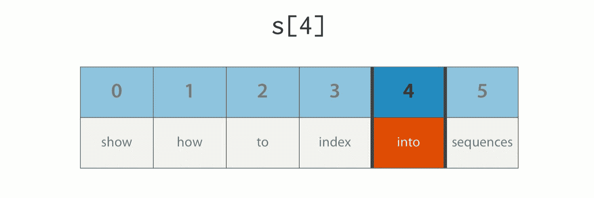
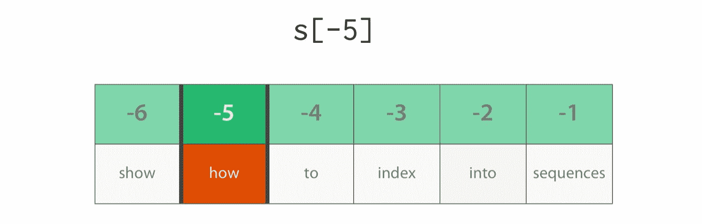
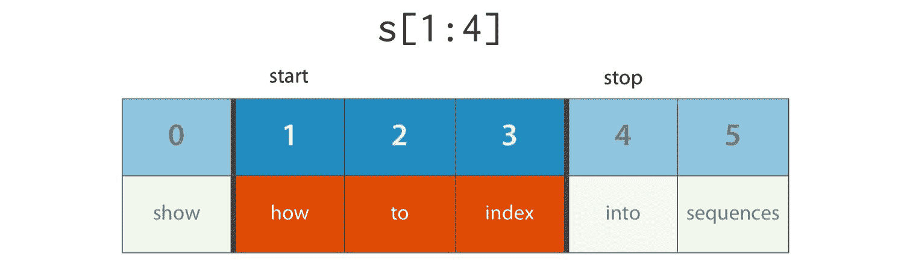
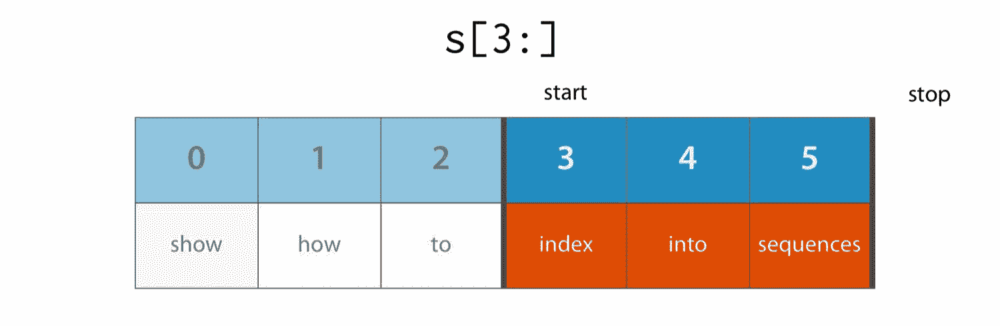
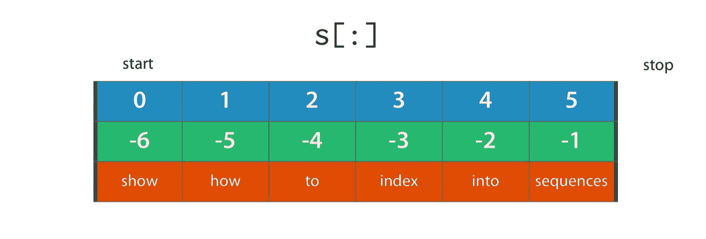
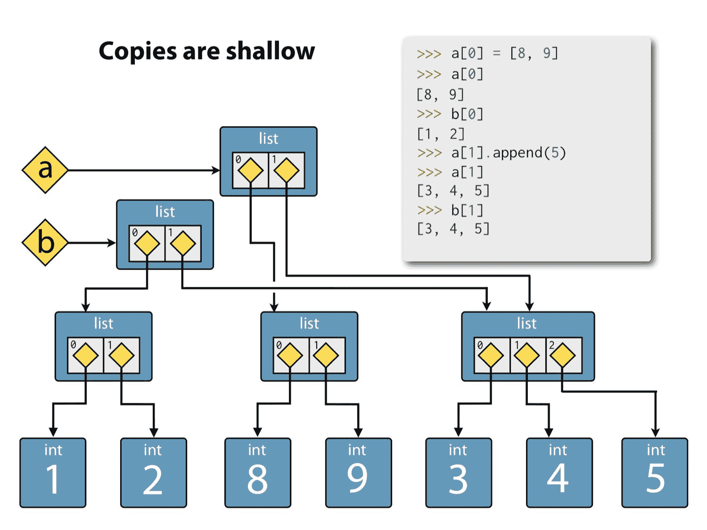
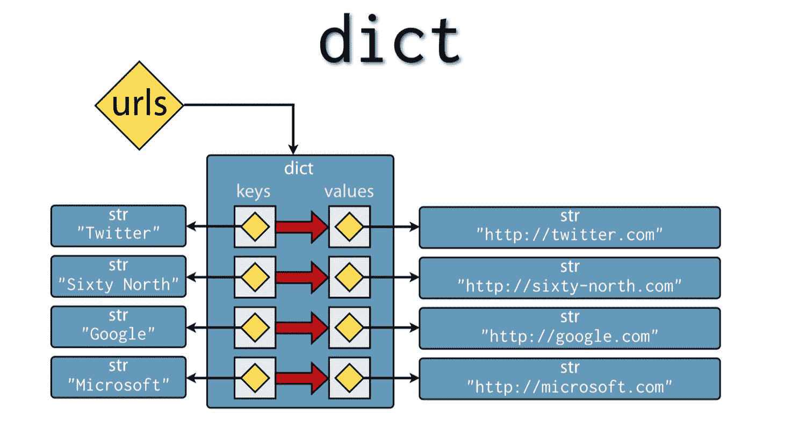
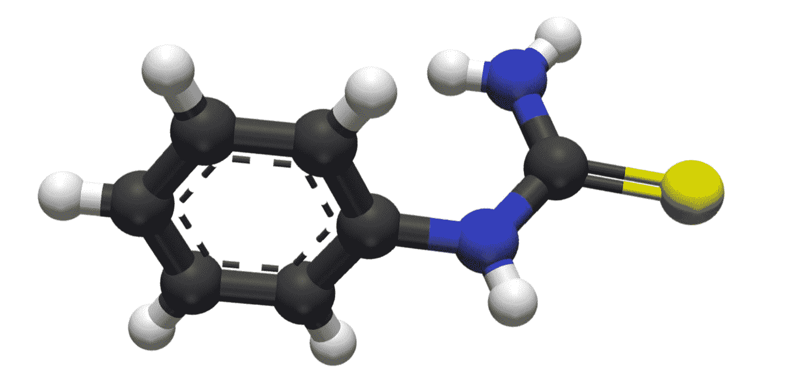

# 五、探索内置集合类型

我们已经遇到了一些内置集合

*   `str`–Unicode 代码点的不可变字符串序列
*   `list`——对象的可变序列

*   `dict`–从不可变键到可变
    对象的可变字典映射

我们只触及了这些集合如何工作的表面，因此我们将在本章更深入地探讨它们的威力。我们还将介绍三种新的内置集合类型：

*   `tuple`-对象的不可变序列

*   `range`-用于整数的算术级数

*   `set`-唯一、不变对象的可变集合

我们这里不再讨论`bytes`类型。我们已经讨论了它与`str`的本质区别，我们所了解的`str`的大部分内容也可以应用于`bytes`。

这并不是一个完整的 Python 集合类型列表，但对于您在野外遇到的绝大多数 Python 3 程序或可能自己编写的程序来说，它已经足够了。

在本章中，我们将按照上面提到的顺序介绍这些集合，并以*协议*的概述作为结束，该协议将这些集合结合起来，并允许以一致和可预测的方式使用它们。

# tuple–对象的不可变序列

Python 中的元组是任意对象的不可变序列。创建后，无法替换或删除其中的对象，也无法添加新元素。

# 文字元组

元组的文字语法与列表相似，只是它们由括号而不是方括号分隔。下面是一个包含一个`string`、一个`float`和一个整数的文本元组：

```py
>>> t = ("Norway", 4.953, 3)
>>> t
('Norway', 4.953, 3)

```

# 元组元素访问

我们可以使用方括号通过基于零的索引访问元组的元素：

```py
>>> t[0]
'Norway'
>>> t[2]
3

```

# 元组的长度

我们可以使用内置的`len()`函数确定元组中的元素数量：

```py
>>> len(t)
3

```

# 在元组上迭代

我们可以使用`for`-循环对其进行迭代：

```py
>>> for item in t:
>>>    print(item)
Norway
4.953
3

```

# 元组的连接和重复

我们可以使用加号运算符连接元组：

```py
>>> t + (338186.0, 265E9)
('Norway', 4.953, 3, 338186.0, 265000000000.0)

```

类似地，我们可以使用乘法运算符重复它们：

```py
>>> t * 3
('Norway', 4.953, 3, 'Norway', 4.953, 3, 'Norway', 4.953, 3)

```

# 嵌套元组

由于元组可以包含任何对象，因此完全可以使用嵌套元组：

```py
>>> a = ((220, 284), (1184, 1210), (2620, 2924), (5020, 5564), (6232, 6368))

```

我们使用重复应用索引运算符来获取内部元素：

```py
>>> a[2][1]
2924

```

# 单元素元组

有时需要一个元素元组。要写这篇文章，我们不能只使用括号中的简单对象。这是因为 Python 将其解析为包含在数学表达式的优先控制括号中的对象：

```py
>>> h = (391)
>>> h
391
>>> type(h)
<class 'int'>

```

为了创建一个元素元组，我们使用了后面的逗号分隔符，您还记得，在指定 literal`tuples`、`lists`和`dictionaries`时，我们可以使用逗号分隔符。带有尾随逗号的单个元素被解析为单个元素`tuple`：

```py
>>> k = (391,)
>>> k
(391,)
>>> type(k)
<class 'tuple'>

```

# 空元组

这就给我们留下了如何指定空元组的问题。实际上答案很简单，我们只使用空括号：

```py
>>> e = ()
>>> e
>>> type(e)
<class 'tuple'>

```

# 可选括号

在许多情况下，可以省略文字元组的括号：

```py
>>> p = 1, 1, 1, 4, 6, 19
>>> p
(1, 1, 1, 4, 6, 19)
>>> type(p)
<class 'tuple'>

```

# 返回和解包元组

从函数返回多个值时经常使用此功能。这里我们制作了一个函数来返回序列的最小值和最大值，这是由两个内置函数`min()`和`max()`完成的艰苦工作：

```py
>>> def minmax(items):
...     return min(items), max(items)
...
>>> minmax([83, 33, 84, 32, 85, 31, 86])
(31, 86)

```

作为一个元组返回多个值通常与 Python 的一个奇妙特性*tuple unpacking*结合使用。元组解包是一种所谓的*解构操作*，它允许我们将数据结构解包到命名引用中。例如，我们可以将`minmax()`函数的结果分配给两个新引用，如下所示：

```py
>>> lower, upper = minmax([83, 33, 84, 32, 85, 31, 86])
>>> lower
31
>>> upper
86

```

这也适用于嵌套元组：

```py
>>> (a, (b, (c, d))) = (4, (3, (2, 1)))
>>> a
4
>>> b
3
>>> c
2
>>> d
1

```

# 用元组解包交换变量

元组解包带来了交换两个（或更多）变量的漂亮 Python 习惯用法：

```py
>>> a = 'jelly'
>>> b = 'bean'
>>> a, b = b, a
>>> a
bean
>>> b
jelly

```

# 元组构造函数

如果需要从现有集合对象（如列表）创建元组，可以使用`tuple()`构造函数。这里，我们从列表中创建一个元组：

```py
>>> tuple([561, 1105, 1729, 2465])
(561, 1105, 1729, 2465)

```

这里我们创建一个包含字符串字符的元组：

```py
>>> tuple("Carmichael")
('C', 'a', 'r', 'm', 'i', 'c', 'h', 'a', 'e', 'l')

```

# 成员资格测试

最后，与 Python 中的大多数集合类型一样，我们可以使用 in 运算符测试成员资格：

```py
>>>  5 in (3, 5, 17, 257, 65537)
True

```

也包括不在运营商的非会员资格：

```py
>>> 5 not in (3, 5, 17, 257, 65537)
False

```

# 起作用的字符串

我们已经在第二章中详细介绍了`str`类型，但现在我们将花时间更深入地探讨它的功能。

# 字符串的长度

与任何其他 Python 序列一样，我们可以使用内置的`len()`函数确定字符串的长度。

```py
>>> len("llanfairpwllgwyngyllgogerychwyrndrobwllllantysiliogogogoch")
58

```

位于威尔士安格西岛上**Llanfairpwlgwyngyllgogerychwyrndrobwllllantysiliogo
gogoch**的火车站标志——欧洲最长的地名：


Figure 5.1: The longest place name in Europe

# 串联字符串

支持使用加号运算符连接字符串：

```py
>>> "New" + "found" + "land"
Newfoundland

```

还有相关的增广赋值运算符：

```py
>>> s = "New"
>>> s += "found"
>>> s += "land"
>>> s
'Newfoundland'

```

纽芬兰岛，世界第十六大岛，是英语中为数不多的封闭的三重复合词之一：


Figure 5.2: Newfoundland

请记住，字符串是不可变的，因此这里的增广赋值运算符在每次使用时都将一个新的`string`对象绑定到`s`。修改`s`的幻觉是可以实现的，因为`s`是对对象的引用，而不是对象本身。也就是说，尽管字符串本身是不可变的，但对它的引用是可变的。

# 连接线

对于连接大量字符串，请避免使用`+`或`+=`运算符。相反，应首选`join()`方法，因为其效率更高。这是因为使用加法运算符或其增广赋值版本进行连接可能会产生大量临时变量，从而导致内存分配和拷贝的成本。让我们看看`join()`是如何使用的。

`join()`是`str`上的一个方法，它将字符串集合作为参数，并通过在每个字符串之间插入分隔符来生成新字符串。`join()`一个有趣的方面是如何指定分隔符：它是调用`join()`的字符串。

与 Python 的许多部分一样，一个示例是最好的解释。要将 HTML 颜色代码字符串列表合并为分号分隔的字符串，请执行以下操作：

```py
>>> colors = ';'.join(['#45ff23', '#2321fa', '#1298a3', '#a32312'])
>>> colors
'#45ff23;#2321fa;#1298a3;#a32312'

```

这里，我们在希望使用的分隔符上调用`join()`——分号——并传入要联接的字符串列表。

将字符串集合连接在一起的一个广泛而快速的 Python 习惯用法是使用空字符串作为分隔符：

```py
>>> ''.join(['high', 'way', 'man'])
highwayman

```

# 拆分字符串

然后，我们可以使用`split()`方法再次拆分字符串（我们已经遇到了这个方法，但这次我们将提供它的可选参数）：

```py
>>> colors.split(';')
['#45ff23', '#2321FA', '#1298A3', '#A32912']

```

可选参数允许您指定要拆分字符串的字符串，而不仅仅是字符。例如，您可以通过拆分“and”一词来解析匆忙的早餐订单：

```py
>>> 'eggsandbaconandspam'.split('and')
['eggs', 'bacon', 'spam']

```

# 禅宗时刻

禅宗时刻：一开始并不明显的方式——连接，在空文本上调用 join。不劳而获：


Figure 5.3: Moment of zen

`join()`的这种用法通常会让新手感到困惑，但是使用它，Python 所采用的方法会被认为是自然而优雅的。

# 分区字符串

另一个非常有用的字符串方法是`partition()`，它将字符串分为三部分；分离器前的零件、分离器本身和分离器后的零件：

```py
>>> "unforgettable".partition('forget')
('un', 'forget', 'table')

```

`partition()`方法返回一个元组，因此这通常与元组解包结合使用：

```py
>>> departure, separator, arrival = "London:Edinburgh".partition(':')
>>> departure
London
>>> arrival
Edinburgh

```

通常，我们对获取分隔符值不感兴趣，因此您可能会看到所使用的下划线变量名。Python 语言没有以特殊的方式处理这一点，但有一个不成文的约定，即下划线变量用于未使用或伪值：

```py
>>> origin, _, destination = "Seattle-Boston".partition('-')

```

许多支持 Python 的开发工具都支持此约定，这些工具将禁止下划线的未使用变量警告。

# 字符串格式

最有趣和最常用的字符串方法之一是`format()`。这取代了（尽管没有取代）Python 旧版本中使用的字符串插值技术，本书中没有介绍这种技术。`format()`方法可以有效地调用任何包含所谓的*替换字段*的字符串，这些字段由花括号包围。作为`format()`参数提供的对象被转换为字符串并用于填充这些字段。下面是一个例子：

```py
>>> "The age of {0} is {1}".format('Jim', 32)
'The age of Jim is 32'

```

在本例中，字段名`0`和`1`与`format()`的位置参数匹配，每个参数在幕后转换为字符串。

字段名可以使用多次：

```py
>>> "The age of {0} is {1}. {0}'s birthday is on {2}".format('Fred', 24, 'October 31')

```

但是，如果字段名仅使用一次，且使用顺序与参数相同，则可以忽略它们：

```py
>>> "Reticulating spline {} of {}.".format(4, 23)
'Reticulating spline 4 of 23.'

```

如果向`format()`提供关键字参数，则可以使用命名字段代替序号：

```py
>>> "Current position {latitude} {longitude}".format(latitude="60N", 
                                                     longitude="5E")
'Current position 60N 5E'

```

可以使用替换字段内的方括号索引序列：

```py
>>> "Galactic position x={pos[0]}, y={pos[1]}, z={pos[2]}".\
format(pos=(65.2, 23.1, 82.2))
'Galactic position x=65.2, y=23.1, z=82.2'

```

我们甚至可以访问对象属性。在这里，我们使用关键字参数将整个数学模块传递给`format()`（记住–模块也是对象！），然后从替换字段中访问其两个属性：

```py
>>> import math
>>> "Math constants: pi={m.pi}, e={m.e}".format(m=math)
'Math constants: pi=3.141592653589793 e=2.718281828459045'

```

格式化字符串还为我们提供了对字段对齐和浮点格式的大量控制。对于仅显示到小数点后三位的常数，情况也是如此：

```py
>>> "Math constants: pi={m.pi:.3f}, e={m.e:.3f}".format(m=math)
'Math constants: pi=3.142, e=2.718'

```

# 其他字符串方法

我们建议您花一些时间熟悉其他字符串方法。请记住，您可以简单地了解他们在使用什么：

```py
>>> help(str)

```

# 范围–等距整数的集合

让我们继续研究范围，很多开发者都不认为它是一个集合，尽管我们将在 Python 3 中看到它是最肯定的。

范围是一种序列类型，用于表示整数的算术级数。范围是通过调用`range()`构造函数创建的，没有文本形式。通常，我们只提供停止值，因为 Python 默认的起始值为零：

```py
>>> range(5)
range(0, 5)

```

范围有时用于创建用作循环计数器的连续整数：

```py
>>> for i in range(5):
...     print(i)
...
0
1
2
3
4

```

请注意，提供给`range()`的停止值超过了序列的末尾，这就是上一个循环没有打印`5`的原因。

# 起始值

如果我们愿意，我们还可以提供起始值：

```py
>>> range(5, 10)
range(5, 10)

```

通过调用`list()`构造器将其包起来是强制生产每个项目的一种简便方法：

```py
>>> list(range(5, 10))
[5, 6, 7, 8, 9]

```

这种所谓的半开放范围约定（停止值不包括在序列中）起初看起来很奇怪，但如果处理连续范围，它实际上很有意义，因为一个范围指定的结束是下一个范围的开始：

```py
>>> list(range(10, 15))
[10, 11, 12, 13, 14]
>>> list(range(5, 10)) + list(range(10, 15))
[5, 6, 7, 8, 9, 10, 11, 12, 13, 14]

```

# 阶跃参数

范围还支持步骤参数：

```py
>>> list(range(0, 10, 2))
[0, 2, 4, 6, 8]

```

请注意，为了使用`step`参数，我们必须提供所有三个参数。Range 很奇怪，因为它通过计算参数来确定参数的含义。仅提供一个参数意味着该参数是停止值。两个参数是`start`和`stop`，三个参数是`start`、`stop`和`step`。Python`range()`就是这样工作的，所以第一个参数`start`可以成为可选参数，这在正常情况下是不可能的。此外，`range`构造函数不支持关键字参数。你几乎可以说它是非音速的！

range 的非 Python 构造函数，其中参数的解释取决于是否提供了一个、两个或三个，如下图所示：


Figure 5.4: UnPythonic constructor for range

# 未使用范围：枚举（）

在这一点上，我们将向您展示另一个样式不良的代码示例，但这次是您可以而且应该避免的。下面是一种在列表中打印元素的糟糕方法：

```py
>>> s = [0, 1, 4, 6, 13]
>>> for i in range(len(s)):
...     print(s[i])
...
0
1
4
6
13

```

虽然这是可行的，但它绝对是非音速的。始终更喜欢在对象本身上使用迭代：

```py
>>> s = [0, 1, 4, 6, 13]
>>> for v in s:
...     print(v)
0
1
4
6
13

```

如果你需要一个计数器，你应该使用内置的`enumerate()`函数，它返回一系列可数对，每对都是一个元组。每对的第一个元素是当前项的索引，每对的第二个元素是项本身：

```py
>>> t = [6, 372, 8862, 148800, 2096886]
>>> for p in enumerate(t):
>>>     print(p)
(0, 6)
(1, 372)
(2, 8862)
(3, 148800)
(4, 2096886)

```

更好的是，我们可以使用元组解包，避免直接处理元组：

```py
>>> for i, v in enumerate(t):
...     print("i = {}, v = {}".format(i, v))
...
i = 0, v = 6
i = 1, v = 372
i = 2, v = 8862
i = 3, v = 148800
i = 4, v = 2096886

```

# 行动清单

我们已经介绍了一些列表，并充分利用了它们。我们知道如何使用文字语法创建列表，使用`append()`方法添加列表，并使用方括号索引和正的零索引获取和修改列表内容。

零和正整数从列表的前面开始索引，因此索引 4 是列表中的第五个元素：



Figure 5.5: Zero and positive integers index

现在我们将更深入地了解。

# 列表（和其他序列）的负索引

列表（以及其他 Python 序列，因为这也适用于元组）的一个非常方便的特性是能够从末尾而不是从开头进行索引。这是通过提供*负*指数实现的。例如：

```py
>>> r = [1, -4, 10, -16, 15]
>>> r[-1]
15
>>> r[-2]
-16 

```

负整数为**−1**从末尾向后，所以索引**−5**是第四个元素，如下图所示：



Figure 5.6: Reverse index

这比计算正索引的笨拙等价物要优雅得多，否则需要使用正索引检索最后一个元素：

```py
>>> r[len(r) - 1]

```

请注意，使用-0 进行索引与使用 0 进行索引相同，并返回列表中的第一个元素。因为 0 和负零之间没有区别，所以负索引本质上是基于一而不是基于零的。如果您使用中等复杂的逻辑计算索引，那么最好记住这一点：一次性错误可以相当容易地蔓延到负索引中。

# 切片列表

切片是一种扩展索引形式，它允许我们引用列表的部分内容。为了使用它，我们传递半开范围的开始和停止索引，用冒号分隔，作为方括号索引参数。以下是方法：

```py
>>> s = [3, 186, 4431, 74400, 1048443]
>>> s[1:3]
[186, 4431]

```

查看第二个索引如何超出返回范围的末尾。切片[1:4]。切片提取列表的一部分。切片范围为半开，因此不包括**停止**索引处的值：



Figure 5.7: The half-open slice range

该设施可与负指数相结合。例如，要获取除第一个和最后一个元素以外的所有元素：

```py
>>> s[1:-1]
[186, 4431, 74400] 

```

切片`s[1:-1]`用于排除列表的第一个和最后一个元素，如下图所示：


Figure 5.8: Excluding elements

**启动**和**停止**指标都是可选的。要将所有元素从列表的第三个部分切到最后一个部分，请执行以下操作：

```py
>>> s[3:]
[74400, 1048443]

```

切片`s[3:]`保留从第四个到最后一个元素的所有元素，如下图
所示



Figure 5.9: Slice-to-end

要从开始到第三个（但不包括）剖切所有元素，请执行以下操作：

```py
>>> s[:3]
[3, 186, 4431]

```

切片`s[:3]`保留从列表开始到但不包括第四个元素的所有元素，如下图所示：


Figure 5.10: Silce from the beginning

请注意，这两个列表是互补的，它们一起构成了整个列表，展示了半开放范围约定的便利性。


Figure 5.11: Complementary slices

由于`start`和`stop`切片索引都是可选的，因此完全可以省略这两个索引并检索所有元素：

```py
>>> s[:]
[3, 186, 4431, 74400, 1048443]

```

这是一个称为*完整切片*的方法，它是 Python 中的一项重要技术。

切片`s[:]`是完整的切片，包含列表中的所有元素。这是复制列表的一个重要习惯用法：



Figure 5.12: The full-slice

# 复制列表

事实上，完整片段是复制列表的一个重要习惯用法。回想一下，指定引用从不复制对象，而只是将引用复制到对象：

```py
>>> t = s
>>> t is s
True

```

我们部署完整的切片，以将其复制到新列表中：

```py
>>> r = s[:]

```

并确认使用完整切片获得的列表具有不同的标识：

```py
>>> r is s
False

```

虽然它具有等效值：

```py
>>> r == s
True

```

重要的是要理解，尽管我们有一个新的`list`对象，可以独立修改，但其中的元素是对原始列表中引用的相同对象的引用。如果这些对象都是可变的和修改的（而不是替换的），那么在两个列表中都会看到更改。

我们展示这个完整的切片列表复制习惯用法，因为您可能会在野外看到它，但它的作用并不明显。您应该知道，复制列表还有其他更具可读性的方法，例如`copy()`方法：

```py
>>> u = s.copy()
>>> u is s
False

```

或者简单调用`list`构造函数，传递要复制的列表：

```py
>>> v = list(s)

```

在很大程度上，这些技术之间的选择取决于品味。我们倾向于使用`list`构造函数的第三种形式，因为它的优点是可以使用任何 iterable 系列作为源，而不仅仅是列表。

# 浅拷贝

但是，您必须意识到，所有这些技术都执行*浅*复制。也就是说，它们创建一个新列表，其中包含对源列表中相同对象的引用，但不复制引用的对象。为了演示这一点，我们将使用嵌套列表，内部列表用作可变对象。下面是一个包含两个元素的列表，每个元素本身就是一个列表：

```py
>>> a = [ [1, 2], [3, 4] ]

```

我们使用完整切片复制此列表：

```py
>>> b = a[:]

```

让自己相信我们确实有不同的清单：

```py
>>> a is b
False

```

使用等效值：

```py
>>> a == b
True

```

但是，请注意，这些不同列表中的引用不仅仅指*等价的*对象：

```py
>>> a[0]
[1, 2]
>>> b[0]
[1, 2]

```

但事实上，对于*相同的*对象：

```py
>>> a[0] is b[0]
True 

```

副本很浅。复制列表时，会复制对包含对象（黄色菱形）的引用，但不会复制引用的对象（蓝色矩形），如下图所示：


Figure 5.13: Copies are shallow.

这种情况一直持续到我们将 a 的第一个元素重新绑定到新构造的列表：

```py
>>> a[0] = [8, 9]

```

现在`a`和`b`的第一个元素指的是不同的列表：

```py
>>> a[0]
[8, 9]
>>> b[0]
[1, 2]

```

列表`a`和`b`的第一个元素现在是唯一拥有的，而第二个元素是共享的，如下图所示：


Figure 5.14: Unique and shared elements

`a`和`b`的第二个元素仍然指同一个对象。我们将通过在 a 列表中改变该对象来演示这一点：

```py
>>> a[1].append(5)
>>> a[1]
[3, 4, 5]

```

我们通过`b`列表看到了变化：

```py
>>> b[1]
[3, 4, 5]

```

修改两个列表引用的对象，如下图所示：



Figure 5.15:Mutating shared elements

为完整起见，`a`和`b`列表的最终状态如下：

```py
>>> a
[[8, 9], [3, 4, 5]]
>>> b
[[1, 2], [3, 4, 5]]

```

列表`a`的最终状态。


Figure 5.16: The final state of list a

列表`b`的最终状态：


Figure 5.17: The final state of list b.

如果您需要执行像这样的分层数据结构的真正深度拷贝（在我们的经验中这是罕见的），我们建议您查看 Python 标准库中的`copy`模块。

# 重复列表

对于字符串和元组，列表支持使用乘法运算符进行重复。使用起来非常简单：

```py
>>> c = [21, 37]
>>> d = c * 4
>>> d
[21, 37, 21, 37, 21, 37, 21, 37]

```

虽然这种形式在野外很少被发现。它通常用于将预先知道的大小列表初始化为常量值，例如零：

```py
>>> [0] * 9
[0, 0, 0, 0, 0, 0, 0, 0, 0]

```

但是要注意，在可变元素的情况下，同样的陷阱也潜伏在这里，因为重复会重复*对每个元素的引用*，而不会复制值。让我们再次演示如何使用嵌套列表作为可变元素：

```py
>>> s = [ [-1, +1] ] * 5
>>> s
[[-1, 1], [-1, 1], [-1, 1], [-1, 1], [-1, 1]]

```

重复较浅，如下图所示：


Figure 5.18: Repitition is shallow.

如果我们现在修改外部列表的第三个元素：

```py
>>> s[2].append(7)

```

我们通过构成外部列表元素的所有五个引用看到了变化：

```py
>>> s
[[-1, 1, 7], [-1, 1, 7], [-1, 1, 7], [-1, 1, 7], [-1, 1, 7]]

```

改变列表中重复的内容。对象的任何更改都会反映在外部列表的每个索引中：


Figure 5.19: Repetition is mutation.

# 查找具有索引（）的列表元素

要在列表中查找元素，请使用`index()`方法传递要搜索的对象。将对元素进行等效性比较，直到找到您要查找的元素：

```py
>>> w = "the quick brown fox jumps over the lazy dog".split()
>>> w
['the', 'quick', 'brown', 'fox', 'jumps', 'over', 'the', 'lazy', 'dog']
>>> i = w.index('fox')
>>> i
3
>>> w[i]
'fox'

```

如果您搜索一个不存在的值，您将收到一个`ValueError`：

```py
>>> w.index('unicorn')
Traceback (most recent call last):
 File "<stdin>", line 1, in <module>
ValueError: 'unicorn' is not in list

```

我们将在[第 6 章](06.html#5J99O0-0cbe380184724081924496f73c736016)、*例外*中学习如何优雅地处理此类错误。

# 使用 count（）和 in 进行成员资格测试

另一种搜索方法是`count()`匹配元素：

```py
>>> w.count("the")
2

```

如果您只想测试成员资格，可以使用 in 运算符：

```py
>>> 37 in [1, 78, 9, 37, 34, 53]
True

```

A 非会员，不在：

```py
>>> 78 not in [1, 78, 9, 37, 34, 53]
False

```

# 使用 del 按索引删除列表元素

使用我们尚未熟悉的关键字删除元素：`del`。`del`关键字采用单个参数，该参数是对列表元素的引用，并将其从列表中删除，从而在过程中缩短列表：

```py
>>> u = "jackdaws love my big sphinx of quartz".split()
>>> u
['jackdaws', 'love', 'my', 'big', 'sphinx', 'of', 'quartz']
>>> del u[3]
>>> u
['jackdaws', 'love', 'my', 'sphinx', 'of', 'quartz']

```

# 使用 remove（）按值删除列表元素

也可以使用`remove()`方法按值而不是按位置删除元素：

```py
>>> u.remove('jackdaws')
>>> u
['love', 'my', 'sphinx', 'of', 'quartz']

```

这相当于更详细的：

```py
>>> del u[u.index('jackdaws')]

```

尝试`remove()`一个不存在的项目也会导致`ValueError`被引发：

```py
>>> u.remove('pyramid')
Traceback (most recent call last):
 File "<stdin>", line 1, in <module>
ValueError: list.remove(x): x not in list

```

# 插入列表

可以使用`insert()`方法将项目插入列表，该方法接受新项目的索引和新项目本身：

```py
>>> a = 'I accidentally the whole universe'.split()
>>> a
['I', 'accidentally', 'the', 'whole', 'universe']
>>> a.insert(2, "destroyed")
>>> a
['I', 'accidentally', 'destroyed', 'the', 'whole', 'universe']
>>> ' '.join(a)
'I accidentally destroyed the whole universe'

```

# 串联列表

使用加法运算符连接列表将生成一个新列表，而不修改任何一个操作数：

```py
>>> m = [2, 1, 3]
>>> n = [4, 7, 11]
>>> k = m + n
>>> k
[2, 1, 3, 4, 7, 11]

```

鉴于增广转让运营商`+=`修改了受让人：

```py
>>> k += [18, 29, 47]
>>> k
[2, 1, 3, 4, 7, 11, 18, 29, 47]

```

使用`extend()`方法也可以达到类似的效果：

```py
>>> k.extend([76, 129, 199])
>>> k
[2, 1, 3, 4, 7, 11, 18, 29, 47, 76, 123, 199]

```

增广赋值和`extend()`方法将适用于右侧的任何可数级数。

# 重新排列列表元素

在我们从列表开始之前，让我们先看看两个重新排列元素的操作：反转和排序。

只需调用列表的`reverse()`方法，列表就可以就地反转：

```py
>>> g = [1, 11, 21, 1211, 112111]
>>> g.reverse()
>>> g
[112111, 1211, 21, 11, 1]

```

可以使用`sort()`方法对列表进行适当排序：

```py
>>> d = [5, 17, 41, 29, 71, 149, 3299, 7, 13, 67]
>>> d.sort()
>>> d
[5, 7, 13, 17, 29, 41, 67, 71, 149, 3299]

```

`sort()`方法接受两个可选参数，key 和 reverse。后者是不言自明的，当设置为`True`时，给出降序排序：

```py
>>> d.sort(reverse=True)
>>> d
[3299, 149, 71, 67, 41, 29, 17, 13, 7, 5]

```

`key`参数更有趣。它接受任何*可调用的*对象，然后使用该对象从每个项目中提取*键*。然后将根据这些键的相对顺序对项目进行排序。
Python 中有几种类型的可调用对象，尽管到目前为止我们遇到的唯一一种是 humble 函数。例如，`len()`函数是一个可调用对象，用于确定集合的长度，如字符串。

考虑下面的单词表：

```py
>>> h = 'not perplexing do handwriting family where I illegibly know doctors'.split()
>>> h
['not', 'perplexing', 'do', 'handwriting', 'family', 'where', 'I', 'illegibly', 'know', 'doctors']
>>> h.sort(key=len)
>>> h
['I', 'do', 'not', 'know', 'where', 'family', 'doctors', 'illegibly', 'perplexing', 'handwriting']
>>> ' '.join(h)
'I do not know where family doctors illegibly perplexing handwriting'

```

# 错位重排

有时不需要进行*原位*排序或反转。例如，它可能会导致修改函数参数，使函数产生混乱的副作用。对于`reverse()`和`sort()`列表方法的替代方法，您可以使用`reversed()`和`sorted()`内置函数，它们分别返回反向迭代器和新的排序列表。例如：

```py
>>> x = [4, 9, 2, 1]
>>> y = sorted(x)
>>> y
[1, 2, 4, 9]
>>> x
[4, 9, 2, 1]

```

我们也可以使用`reversed()`功能：

```py
>>> p = [9, 3, 1, 0]
>>> q = reversed(p)
>>> q
<list_reverseiterator object at 0x1007bf290>
>>> list(q)
[0, 1, 3, 9]

```

注意我们是如何使用`list`构造函数来评估`reversed()`的结果的。这是因为`reversed()`返回一个迭代器，我们将在后面更详细地介绍这个主题。

这些函数的优点是，它们可以处理任何有限的可移植源对象。

# 辞典

现在我们将回到字典，它是许多 Python 程序的核心，包括 Python 解释器本身。我们在前面简要介绍了文字词典，了解了它们是如何用大括号分隔的，并且包含逗号分隔的键值对，每对键值对都用冒号连接在一起：

```py
>>> urls = {'Google': 'http://google.com',
...         'Twitter': 'http://twitter.com',
...         'Sixty North': 'http://sixty-north.com',
...         'Microsoft': 'http://microsoft.com' }
>>>

```

URL 字典。字典键的顺序不保留，参见下图：



Figure 5.20: Dictionary

可通过以下键访问这些值：

```py
>>> urls['Twitter']
http://twitter.com

```

由于每个键只与一个值关联，并且通过键进行查找，因此键在任何单个字典中都必须是唯一的。但是，可以使用重复的值。

在内部，字典维护对键对象和值对象的引用对。关键对象*必须*是不可变的，因此字符串、数字和元组都可以，而列表则不行。值对象可以是可变的，实际上通常是可变的。我们的示例 URL 映射使用字符串作为键和值，这很好。

您永远不应该依赖字典中项目的顺序——它本质上是随机的，甚至可能在同一程序的不同运行之间有所不同。

和其他集合一样，还有一个命名构造函数`dict()`，它可以将其他类型转换为字典。我们可以使用构造函数从元组中存储的一系列可复制的键值对中进行复制，如下所示：

```py
>>> names_and_ages = [ ('Alice', 32), ('Bob', 48), ('Charlie', 28),  
                     ('Daniel', 33) ]
>>> d = dict(names_and_ages)
>>> d
{'Charlie': 28, 'Bob': 48, 'Alice': 32, 'Daniel': 33}

```

回想一下，字典中的项不是以任何特定顺序存储的，因此列表中对的顺序不会保留。

只要键是合法的 Python 标识符，甚至可以直接从传递给`dict()`的关键字参数创建字典：

```py
>>> phonetic = dict(a='alfa', b='bravo', c='charlie', d='delta', e='echo', f='foxtrot')
>>> phonetic
{'a': 'alfa', 'c': 'charlie', 'b': 'bravo', 'e': 'echo', 'd': 'delta', 'f': 'foxtrot'}

```

同样，关键字参数的顺序不会保留。

# 抄写词典

与列表一样，字典复制在默认情况下是浅层的，只复制对键和值对象的引用，而不复制对象本身。复制词典有两种方法，我们最常见的是第二种。第一种方法是使用`copy()`方法：

```py
>>> d = dict(goldenrod=0xDAA520, indigo=0x4B0082, seashell=0xFFF5EE)
>>> e = d.copy()
>>> e
{'indigo': 4915330, 'goldenrod': 14329120, 'seashell': 16774638}

```

第二种方法是将现有字典传递给`dict()`构造函数：

```py
>>> f = dict(e)
>>> f
{'indigo': 4915330, 'seashell': 16774638, 'goldenrod': 14329120}

```

# 更新字典

如果需要使用另一个字典中的定义扩展字典，可以使用`update()`方法。这在要更新的词典上被调用，并传递要合并的词典的内容：

```py
>>> g = dict(wheat=0xF5DEB3, khaki=0xF0E68C, crimson=0xDC143C)
>>> f.update(g)
>>> f
>>> {'crimson': 14423100, 'indigo': 4915330, 'goldenrod': 14329120,
 'wheat': 16113331, 'khaki': 15787660, 'seashell': 16774638}

```

如果`update()`的参数包括目标字典中已经存在的键，则目标中与这些键相关的值将替换为源中的相应值：

```py
>>> stocks = {'GOOG': 891, 'AAPL': 416, 'IBM': 194}
>>> stocks.update({'GOOG': 894, 'YHOO': 25})
>>> stocks
{'YHOO': 25, 'AAPL': 416, 'IBM': 194, 'GOOG': 894}

```

# 迭代字典键

正如我们在前一章中所看到的，字典是可编辑的，因此可以与`for`循环一起使用。字典在每次迭代中只产生*键*，我们可以通过使用方括号运算符进行查找来检索相应的值：

```py
>>> colors = dict(aquamarine='#7FFFD4', burlywood='#DEB887',
...               chartreuse='#7FFF00', cornflower='#6495ED',
...               firebrick='#B22222', honeydew='#F0FFF0',
...               maroon='#B03060', sienna='#A0522D')
>>> for key in colors:
...     print("{key} => {value}".format(key=key, value=colors[key]))
...
firebrick => #B22222
maroon => #B03060
aquamarine => #7FFFD4
burlywood => #DEB887
honeydew => #F0FFF0
sienna => #A0522D
chartreuse => #7FFF00
cornflower => #6495ED

```

请注意，键以任意顺序返回，既不是指定键的顺序，也不是任何其他有意义的排序顺序。

# 迭代字典值

如果我们只想迭代这些值，我们可以使用`values()`字典方法。这将返回一个对象，该对象在字典值上提供可编辑的*视图*，而不会导致复制值：

```py
>>> for value in colors.values():
...     print(value)
...
#B22222
#B03060
#7FFFD4
#DEB887
#F0FFF0
#A0522D
#DEB887
#6495ED

```

没有有效或方便的方法从值中检索相应的*键*，因此我们仅`print`值

出于对称性的考虑，还有一种`keys()`方法，尽管由于在 dictionary 对象上迭代会直接生成键，但这种方法不太常用：

```py
>>> for key in colors.keys():
...     print(key)
...
firebrick
maroon
aquamarine
burlywood
honeydew
sienna
chartreuse
cornflower

```

# 在键值对上迭代

不过，我们通常希望依次迭代键和值。字典中的每个键值对被称为一个*项*，我们可以使用`items()`字典方法获得项的可编辑视图。迭代时，`items()`视图将每个键值对作为元组生成。
通过在`for`语句中使用元组解包，我们可以在一次操作中同时获得`key`和`value`，而无需额外查找：

```py
>>> for key, value in colors.items():
...     print("{key} => {value}".format(key=key, value=value))
...
firebrick => #B22222
maroon => #B03060
aquamarine => #7FFFD4
burlywood => #DEB887
honeydew => #F0FFF0
sienna => #A0522D
chartreuse => #DEB887
cornflower => #6495ED

```

# 字典键的成员测试

使用 in 和 not in 运算符的词典的成员资格测试对键进行操作：

```py
>>> symbols = dict(
...     usd='\u0024', gbp='\u00a3', nzd='\u0024', krw='\u20a9',
...     eur='\u20ac', jpy='\u00a5',  nok='kr', hhg='Pu', ils='\u20aa')
>>> symbols
{'jpy': '¥', 'krw': '₩', 'eur': '€', 'ils': '₪', 'nzd': '$', 'nok': 'kr', 'gbp': '£', 'usd': '$', 'hhg': 'Pu'}
>>> 'nzd' in symbols
True
>>> 'mkd' not in symbols
True

```

# 删除字典项

对于列表，要从字典中删除条目，我们使用`del`关键字：

```py
>>> z = {'H': 1, 'Tc': 43, 'Xe': 54, 'Un': 137, 'Rf': 104, 'Fm': 100}
>>> del z['Un']
>>> z
{'H': 1, 'Fm': 100, 'Rf': 104, 'Xe': 54, 'Tc': 43}

```

# 词典的易变性

字典中的键应该是不可变的，尽管值可以修改。这是一本字典，它将元素符号映射到该元素不同同位素的质量数列表：

```py
>>> m = {'H': [1, 2, 3],
...      'He': [3, 4],
...      'Li': [6, 7],
...      'Be': [7, 9, 10],
...      'B': [10, 11],
...      'C': [11, 12, 13, 14]}

```

查看如何将字典文本拆分为多行。这是允许的，因为字典文本的花括号是打开的。

我们的字符串键是不可变的，这对于字典的正确运行是一件好事。但是，如果我们发现了一些新的同位素，那么修改字典值是没有问题的：

```py
>>> m['H'] += [4, 5, 6, 7]
>>> m
{'H': [1, 2, 3, 4, 5, 6, 7], 'Li': [6, 7], 'C': [11, 12, 13, 14], 
'B': [10, 11], 'He': [3, 4], 'Be': [7, 9, 10]}

```

这里，增广赋值运算符应用于通过`'H'`（氢）键访问的`list`对象；词典没有被修改。

当然，字典本身是可变的；我们知道我们可以添加新项目：

```py
>>> m['N'] = [13, 14, 15]

```

# 漂亮的印刷品

使用复合数据结构（如我们的同构类型表），以更可读的形式打印出来可能会有所帮助。我们可以使用名为`pprint`的 Python 标准库打印模块实现这一点，该模块包含一个名为`pprint`的函数：

```py
>>> from pprint import pprint as pp

```

请注意，如果我们没有将`pprint`函数绑定到不同的名称`pp`，函数引用将覆盖模块引用，从而阻止进一步访问模块内容：

```py
>>> pp(m)
{
     'B': [10, 11],
 'Be': [7, 9, 10],
 'C': [11, 12, 13, 14],
 'H': [1, 2, 3, 4, 5, 6, 7],
 'He': [3, 4],
 'Li': [6, 7],
 'N': [13, 14, 15]
}

```

给我们一个更容易理解的展示。

让我们从字典开始，看看一个新的内置数据结构，set。

# 集合–唯一元素的无序集合

集合数据类型是唯一元素的无序集合。集合是可变的，只要元素可以从集合中添加和删除，但每个元素本身都必须是不可变的，就像字典的键一样。

集合是不同元素的无序组，如下图所示：

 Figure 5.21: Set

集合的文字形式与字典非常相似，同样由大括号分隔，但每个项都是单个对象，而不是由冒号连接的一对：

```py
>>> p = {6, 28, 496, 8128, 33550336}

```

请注意，与字典一样，集合也是无序的：

```py
>>> p
{33550336, 8128, 28, 496, 6}

```

当然，集合有类型集合：

```py
>>> type(p)
<class 'set'>

```

# 集合构造函数

回想一下，有点令人困惑的是，空的花括号创建了一个空的*字典*，而不是一个空集合：

```py
>>> d = {}
>>> type(d)
<class 'dict'>

```

要创建空集，我们必须求助于`set()`构造函数：

```py
>>> e = set()
>>> e
set()

```

这也是 Python 返回给我们的空集合的形式。

`set()`构造函数可以从任何 iterable 系列创建一个集合，例如列表：

```py
>>> s = set([2, 4, 16, 64, 4096, 65536, 262144])
>>> s
{64, 4096, 2, 4, 65536, 16, 262144}

```

输入序列中的重复项将被丢弃。事实上，集合的一个常见用途是有效地从一系列对象中删除重复项：

```py
>>> t = [1, 4, 2, 1, 7, 9, 9]
>>> set(t)
{1, 2, 4, 9, 7}

```

# 在集合上迭代

尽管顺序是任意的，但集合自然是可编辑的：

```py
>>> for x in {1, 2, 4, 8, 16, 32}:
>>>     print(x)
32
1
2
4
8
16

```

# 集合的隶属度检验

成员资格是集合的基本操作，与其他集合类型一样，使用 in 和 not in 运算符执行成员资格操作：

```py
>>> q = { 2, 9, 6, 4 }
>>> 3 in q
False
>>> 3 not in q
True

```

# 向集合添加元素

要向集合添加单个元素，请使用`add()`方法：

```py
>>> k = {81, 108}
>>> k
{81, 108}
>>> k.add(54)
>>> k
{81, 108, 54}
>>> k.add(12)
>>> k
{81, 108, 54, 12}

```

添加已存在的元素无效：

```py
>>> k.add(108)

```

虽然两者都不会产生错误。使用`update()`方法，可以从任何 iterable 系列（包括另一组）一次添加多个元素：

```py
>>> k.update([37, 128, 97])
>>> k
{128, 81, 37, 54, 97, 12, 108}

```

# 从集合中删除元素

提供了两种从集合中删除元素的方法。第一个`remove()`要求要移除的元素在集合中存在，否则给出一个`KeyError`：

```py
>>> k.remove(97)
>>> k
{128, 81, 37, 54, 12, 108}
>>> k.remove(98)
Traceback (most recent call last):
 File "<stdin>", line 1, in <module>
KeyError: 98

```

第二种方法`discard()`不太繁琐，如果元素不是集合的成员，则根本没有效果：

```py
>>> k.discard(98)
>>> k
{128, 81, 37, 54, 12, 108}

```

# 复制集

与其他内置集合一样，set 采用了一种`copy()`方法，该方法执行集合的浅层复制（复制引用，但不复制对象）：

```py
>>> j = k.copy()
>>> j
{128, 81, 37, 54, 108, 12}

```

如前所述，`set()`构造器可用于：

```py
>>> m = set(j)
>>> m
{128, 81, 37, 54, 108, 12}

```

# 集代数运算

也许集合类型最有用的方面是所提供的一组强大的集合代数运算。这使我们能够轻松地计算集并、集差和集交点，并评估两个集是否具有子集、超集或不相交关系。

为了演示这些方法，我们将根据不同的表型构建一些人群：

```py
>>> blue_eyes = {'Olivia', 'Harry', 'Lily', 'Jack', 'Amelia'}
>>> blond_hair = {'Harry', 'Jack', 'Amelia', 'Mia', 'Joshua'}
>>> smell_hcn = {'Harry', 'Amelia'}
>>> taste_ptc = {'Harry', 'Lily', 'Amelia', 'Lola'}
>>> o_blood = {'Mia', 'Joshua', 'Lily', 'Olivia'}
>>> b_blood = {'Amelia', 'Jack'}
>>> a_blood = {'Harry'}
>>> ab_blood = {'Joshua', 'Lola'}

```


Figure 5.22: Set algebra operations

# 协会

要找到所有金发、蓝眼睛或两者兼有的人，我们可以使用`union()`方法：

```py
>>> blue_eyes.union(blond_hair)
{'Olivia', 'Jack', 'Joshua', 'Harry', 'Mia', 'Amelia', 'Lily'}

```

集合并集将其中一个或两个集合中的所有元素集合在一起。

我们可以证明`union()`是一种交换操作（即，我们可以交换操作数的顺序），使用值相等运算符检查结果集的等价性：

```py
>>> blue_eyes.union(blond_hair) == blond_hair.union(blue_eyes)
True

```

# 十字路口

要找到所有金发*和*蓝眼睛的人，我们可以使用`intersection()`方法：

```py
>>> blue_eyes.intersection(blond_hair)
{'Amelia', 'Jack', 'Harry'}

```

它只收集两个集合中存在的元素。这也是可交换的：

```py
>>> blue_eyes.intersection(blond_hair) == blond_hair.intersection(blue_eyes)
True

```

# 差别

要识别*不是*蓝眼睛的金发人士，我们可以使用`difference()`方法：

```py
>>> blond_hair.difference(blue_eyes)
{'Joshua', 'Mia'}

```

这将查找第一个集合中不在第二个集合中的所有元素。

这是不可交换的，因为金发但没有蓝眼睛的人与蓝眼睛但没有金发的人不同：

```py
>>> blond_hair.difference(blue_eyes) == blue_eyes.difference(blond_hair)
False

```

# 对称差分

但是，如果我们想确定哪些人只有金发*或*蓝眼睛，而不是两者，我们可以使用`symmetric_difference()`方法：

```py
>>> blond_hair.symmetric_difference(blue_eyes)
{'Olivia', 'Joshua', 'Mia', 'Lily'}

```

这将收集第一组*或第二组*中的所有元素，但不同时收集这两个元素。

从名称可以看出，`symmetric_difference()`确实是可交换的：

```py
>>> blond_hair.symmetric_difference(blue_eyes) == blue_eyes.symmetric_difference(blond_hair)
True

```

# 子集关系


Figure 5.23: Set relationships

此外，还提供了三个谓词方法，它们告诉我们集合之间的关系。我们可以使用`issubset()`方法检查一个集合是否是另一个集合的子集。例如，要检查所有能闻到氰化氢气味的人是否都有金发：

```py
>>> smell_hcn.issubset(blond_hair)
True

```

这将检查第一个集合的所有元素是否也存在于第二个集合中。

为了测试所有能尝到**苯硫脲**（**PTC**）的人是否也能闻到氰化氢的气味，使用`issuperset()`方法：

```py
>>> taste_ptc.issuperset(smell_hcn)
True

```

这将检查第二个集合的所有元素是否存在于第一个集合中。

PTC 的代表。它有一个不寻常的特性，它要么味道很苦，要么实际上无味，这取决于品尝者的基因：



Figure 5.24: Representation of phenylthiocarbamide

要测试两个集合没有共同的成员，请使用`isdisjoint()`方法。例如，您的血型为`A`或`O`，决不能同时为两种：

```py
>>> a_blood.isdisjoint(o_blood)
True

```

# 收集协议

在 Python 中，协议是一组操作或方法，如果要实现该协议，类型必须支持这些操作或方法。协议不需要在源代码中定义为单独的接口或基类，就像在 C#或 Java 之类的名义类型语言中那样。只要让一个对象提供这些操作的功能实现就足够了。

我们可以根据 Python 中遇到的不同集合所支持的协议来组织它们：

| 协议 | 实现集合 |
| --- | --- |
| 容器 | `str`、`list`、`dict`、`range`、`tuple`、`set`、`bytes` |
| 大小 | `str`、`list`、`dict`、`range`、`tuple`、`set`、`bytes` |
| 可迭代的 | `str`、`list`、`dict`、`range`、`tuple`、`set`、`bytes` |
| 序列 | `str`、`list`、`tuple`、`range`、`bytes` |
| 可变序列 | `list` |
| 可变集 | `set` |
| 可变映射 | `dict` |

对协议的支持要求类型具有特定的行为。

# 容器协议

*容器*协议要求支持使用 in 和 not in 操作符进行成员资格测试：

```py
item in container
item not in container

```

# 大小协议

*大小的*协议要求集合中的元素数量可以通过调用`len(sized_collection)`来确定

# 可编协议

迭代是一个非常重要的概念，在本书的后面我们将用一整章来讨论它。简言之，*iterables*提供了一种方法，可以根据需要逐个生成元素。

*iterables*的一个重要特性是，它们可以与`for`循环一起使用：

```py
for item in iterable:
 print(item)

```

# 序列协议

*序列*协议要求可以使用带整数索引的方括号检索项目：

```py
item = sequence[index]

```

可使用`index()`搜索项目：

```py
i = sequence.index(item)

```

可使用`count()`进行计数：

```py
num = sequence.count(item)

```

它们可以是序列的反向副本，可以使用`reversed()`生成：

```py
r = reversed(sequence)

```

此外，*序列*协议要求对象支持*可折叠*、*大小*和*容器*。

# 其他议定书

在这里我们不涉及*可变序列*、*可变映射*和*可变集*。由于我们只讨论了每种协议的一种代表性类型，因此协议概念所提供的一般性在这一点上对我们没有多大帮助。

# 总结

*   元组是不可变的序列类型

    *   文字语法是围绕逗号分隔列表的可选括号。

    *   使用尾随逗号的单元素元组的显著语法。

    *   元组解包-用于多个返回值和交换

*   串

    *   使用`join()`方法而不是加法或增广赋值运算符可以最有效地执行字符串连接。

    *   `partition()`方法是一个有用且优雅的字符串解析工具。

    *   `format()`方法提供了用字符串化值替换占位符的强大方法。

*   范围

    *   `range`对象表示算术级数。

    *   在生成循环计数器方面，`enumerate()`内置函数通常是`range()`的更好替代

*   列表

    *   列表支持从具有负索引的列表末尾开始编制索引

    *   切片语法允许我们复制列表的全部或部分。

    *   完整切片是用于复制列表的常见 Python 习惯用法，尽管`copy()`方法和`list()`构造函数不那么晦涩。

    *   Python 中的列表（和其他集合）副本是浅层副本。将复制引用，但不会复制引用的对象。

*   字典从键映射到值

    *   使用字典对键进行迭代和成员测试。

    *   `keys()`、`values()`和`items()`方法提供了字典不同方面的视图，方便了迭代。

*   集合存储唯一元素的无序集合。

    *   集合支持强大的集合代数运算和谓词。

    *   内置集合可以根据它们支持的协议进行组织，例如*可移植*、*序列*和*映射*。

顺带一提，我们还发现：

*   下划线通常用于伪变量或多余变量

*   `pprint`模块支持复合数据结构的漂亮打印。

在 Python 中，2 天`range()`是一个返回列表的函数。Python 3 版本的 range 更加高效、有用和强大。当然，这让人想起了一个经典的笑话：编程中最难解决的两个问题是命名、缓存一致性和逐个错误。可以说，由于这个问题，一个包含同名函数的模块的设计很糟糕。