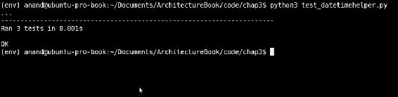
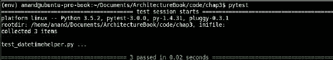
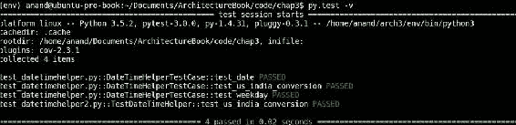
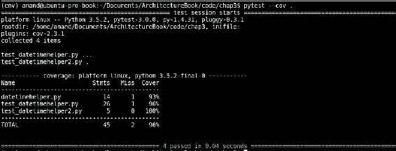
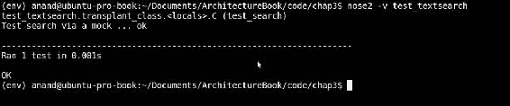
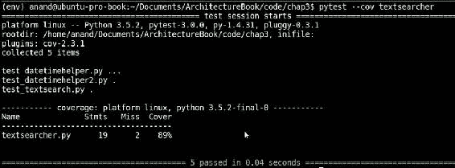
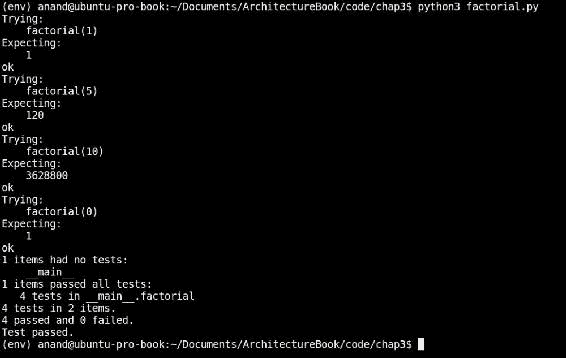
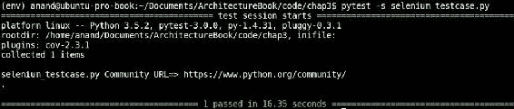

# 三、可测试性——编写可测试代码

在前一章中，我们讨论了软件的一个非常重要的架构属性，即可修改性及其相关方面。在本章中，主题是与软件的**可测试性**密切相关的质量属性。

在本书的第一章中，我们简要介绍了可测试性，了解了什么是可测试性，以及它与代码复杂性的关系。在本章中，我们将详细研究软件可测试性的不同方面。

软件测试本身已经发展成为一个大的领域，拥有自己的标准和一套独特的工具和过程。本章的重点不是讨论软件测试的形式方面。相反，我们将在这里努力从架构的角度理解软件测试，理解它与其他质量属性的关系，在本章的后半部分，讨论与我们关于使用 Python 进行软件测试的讨论相关的 Python 工具和库。

# 理解可测试性

可测试性定义如下：

> *“软件系统通过基于执行的测试暴露其故障的容易程度”*

具有高水平可测试性的软件系统通过测试提供其故障的高度暴露，从而使开发人员能够更容易地了解系统问题，并使他们能够更快地发现和修复错误。另一方面，可测试性较差的系统会使开发人员很难解决它的问题，并且常常会导致生产中的意外故障。

因此，可测试性是确保生产中软件系统的质量、稳定性和可预测性的一个重要方面。

## 软件可测试性及相关属性

如果软件系统很容易向测试人员放弃（暴露）其故障，则该系统是可测试的。不仅如此，系统应该以可预测的方式运行，以便测试人员开发有用的测试。一个不可预测的系统会在不同的时间为固定的输入提供不同的输出，因此，不可测试（或者在这方面非常有用！）。

除了不可预测性，复杂或混沌系统也不太容易测试。例如，一个系统在负载下，其行为在整个频谱中变化很大，这就不适合进行负载测试。因此，确定性行为对于确保系统的可测试性也很重要。

另一个方面是测试仪对系统子结构的控制量。为了设计有意义的测试，一个系统应该可以很容易地通过定义良好的 API 识别子系统，可以为其编写测试。根据定义，一个复杂的软件系统，并且不能提供对其子系统的容易访问，它的可测试性要比不可测试的软件系统差得多。

这意味着结构更复杂的系统比不复杂的系统更难测试。

让我们在一个易于阅读的表格中列出这一点。

<colgroup class="calibre18"><col class="calibre19"> <col class="calibre19"> <col class="calibre19"></colgroup> 
| 

决定论

 | 

复杂性

 | 

可测试性

 |
| --- | --- | --- |
| 高的 | 低的 | 高的 |
| 低的 | 高的 | 低的 |

## 可测试性——架构方面

软件测试通常意味着正在测试的软件工件正在评估其功能。然而，在实际的软件测试中，功能只是可能失败的方面之一。测试意味着评估软件的其他质量属性，如性能、安全性、健壮性等。

由于测试的这些不同方面，软件可测试性通常分为不同的级别。我们将从软件架构的角度来看这些。

以下是通常属于软件测试的不同方面的简要列表：

*   **功能测试**：此包括测试软件以验证其功能。如果一个软件单元的行为完全符合其开发规范的要求，那么它就通过了功能测试。功能测试通常有两种类型：
    *   **白盒测试**：这些测试通常由对软件代码有可见性的开发人员自己执行。此处测试的单元是构成软件的单个函数、方法、类或模块，而不是最终用户功能。白盒测试最基本的形式是**单元测试**。其他类型为**集成测试**和**系统测试**。
    *   **Black-box testing**: This type of testing is usually performed by someone who is outside the development team. The tests have no visibility into the software code, and treat the entire system like a black box. Black-box testing tests the end user functionality of the system without bothering about its internal details. Such tests are usually performed by dedicated testing or QA engineers. However, nowadays, a lot of black-box tests on web-based applications can be automated by using testing frameworks like Selenium.

        除了功能测试之外，还有很多测试方法，用于评估系统的各种架构质量属性。我们将在下一步讨论这些问题。

*   **性能测试**：衡量软件在高工作负载下的响应性和鲁棒性（稳定性）表现的测试属于这一类。性能测试通常分为以下几类：
    *   **负载测试**：评估系统在特定负载下的性能的测试，包括并发用户数、输入数据或事务。
    *   **压力测试**：当一些输入呈现突然或高速增长并达到极限时，测试系统的鲁棒性和响应。压力测试通常倾向于测试稍微超出规定设计极限的系统。压力测试的一种变化是在特定的负载下长时间运行系统，并测量其响应性和稳定性。
    *   **可扩展性测试**：测量当负载增加时，系统可以向外扩展或向上扩展的程度。例如，如果一个系统被配置为使用云服务，这可以测试水平可伸缩性，如系统如何在负载增加时自动伸缩到一定数量的节点，或者根据系统 CPU 核心和/或 RAM 的利用程度测试垂直可伸缩性。
*   **安全测试**：验证系统安全性的测试属于这一类。对于基于 web 的应用，这通常涉及通过检查给定的登录名或角色只能执行指定的一组操作，而不能执行更多（或更少）操作来验证角色的授权。其他属于安全性的测试将是验证对数据或静态文件的正确访问，以确保应用的所有敏感数据都受到通过登录进行的正确授权的保护。
*   **可用性测试**：可用性测试包括测试系统的用户界面在多大程度上易于使用、直观、最终用户可理解。可用性测试通常是通过目标群体进行的，目标群体包括属于系统的预期受众或最终用户定义范围内的选定人员。
*   **安装测试**：对于运送到客户所在地并安装在那里的软件，安装测试非常重要。这将测试并验证在客户端构建和/或安装软件所涉及的所有步骤是否按预期工作。如果开发硬件与客户的不同，那么测试还包括验证最终用户硬件中的步骤和组件。除了定期安装软件外，在交付软件更新、部分升级等时，安装测试也很重要。
*   **Accessibility testing**: Accessibility, from a software standpoint, refers to the degree of usability and inclusion of a software system towards end users with disabilities. This is usually done by incorporating support for accessibility tools in the system, and designing the user interface by using accessible design principles. A number of standards and guidelines have been developed over the years, which allow organizations to develop software with a view to making the software accessible to such an audience. Examples are the **Web Content Accessibility Guidelines** (**WCAG**) of W3C, Section 508 of the Government of USA, and the like.

    可访问性测试旨在根据这些标准（如适用）评估软件的可访问性。

还有各种其他类型的软件测试，涉及不同的方法，并在软件开发的不同阶段调用，如回归测试、验收测试、Alpha 或 Beta 测试等。

然而，由于我们讨论的重点是软件测试的架构方面，我们将把注意力限制在前面列表中提到的主题上。

## 可测试性–策略

在前面的一节中，我们看到了可测试性是如何随着被测试软件系统的复杂性和确定性而变化的。

能够隔离和控制正在测试的工件对于软件测试至关重要。分离被测试系统的关注点，例如能够独立测试组件，而不需要太多的外部依赖，这是关键。

让我们看一下软件架构师可以采用的策略，以确保他正在接受测试的组件提供可预测和确定的行为，这将提供有效和有用的测试结果。

### 降低系统复杂性

正如前面提到的，复杂系统的可测试性较低。通过将系统拆分为子系统、为要测试的系统提供定义良好的 API 等技术，可以降低系统复杂性。以下是这些技术的详细列表：

**减少耦合**：隔离组件，使系统中的耦合减少。组件间的依赖关系应该得到很好的定义，如果可能的话，应该记录在案。

**增加内聚**：增加模块的内聚，即确保特定模块或类只执行定义良好的一组函数。

**提供定义良好的接口**：尝试提供定义良好的接口，用于获取/设置所涉及组件和类的状态。例如，getter 和 setter 允许提供获取和设置类属性值的特定方法。重置方法允许将对象的内部状态设置为创建时的状态。在 Python 中，这可以通过定义属性来实现。

**降低类复杂度**：减少一个类派生的类的数量。类（**RFC**的一个称为**响应的度量是一组 C 类的方法，加上 C 类方法调用的其他类上的方法。建议将一个类的 RFC 保持在可管理的范围内，对于中小型系统通常不超过 50。**

### 提高可预测性

我们发现具有确定性行为对于设计提供可预测结果的测试非常重要，因此可以用于构建可重复测试的测试工具。以下是一些提高测试代码可预测性的策略：

*   **正确的异常处理**–缺少或编写不正确的异常处理程序是软件系统中出现错误和不可预测行为的主要原因之一。找出代码中可能发生异常的地方，然后处理错误，这一点很重要。大多数情况下，当代码与外部资源交互时会发生异常，例如执行数据库查询、获取 URL、等待共享互斥等。
*   **无限循环和/或阻塞等待**：当编写依赖于特定条件（如外部资源的可用性）的循环时，或从共享资源（如共享互斥体或队列）获取句柄或数据时，务必确保代码中始终提供安全退出或中断条件。否则，代码可能会陷入无限循环中，永远不会中断，或者在资源上进行永无止境的阻塞等待，从而导致错误很难排除和修复。
*   **依赖时间的逻辑**：当实现依赖于一天中特定时间（小时或特定工作日）的逻辑时，确保代码以可预测的方式工作。在测试此类代码时，通常需要使用 mock 或 stub 来隔离此类依赖关系。
*   **并发**：当编写使用并发方法（如多线程和/或进程）的代码时，重要的是确保系统逻辑不依赖于以任何特定顺序启动的线程或进程。系统状态应该通过定义良好的函数或方法以干净和可重复的方式初始化，这些函数或方法允许系统行为可重复，因此是可测试的。
*   **内存管理**：软件错误和不可预测性的一个非常常见的原因是内存的不正确使用和管理不当。在具有动态内存管理的现代运行时中，如 Python、Java 或 Ruby，这不是一个问题。然而，内存泄漏和未释放内存导致软件膨胀在现代软件系统中仍然是一个非常现实的问题。

分析并预测软件系统的最大内存使用量非常重要，以便为其分配足够的内存，并在正确的硬件中运行。此外，软件应该定期评估和测试内存泄漏和更好的内存管理，任何重大问题都应该得到解决和修复。

### 控制和隔离外部依赖关系

测试通常具有某种外部依赖性。例如，测试可能需要在数据库中加载/保存数据。另一种可能取决于在一天中的特定时间运行的测试。第三种可能需要从 Web 上的 URL 获取数据。

然而，具有外部依赖通常会使测试场景复杂化。这是因为外部依赖通常不在测试设计器的控制范围内。在上述情况下，数据库可能位于另一个数据中心，或者连接可能失败，或者网站可能在配置的时间内没有响应，或者给出 50 倍的错误。

在设计和编写可重复测试时，隔离这种外部依赖关系非常重要。以下是一些相同的技术：

*   **数据来源**：大多数实际测试需要某种形式的数据。通常，数据是从数据库中读取的。但是，不能依赖作为外部依赖项的数据库。以下是一些控制数据源依赖关系的技术：
    *   使用本地文件而不是数据库：通常，可以使用带有预填充数据的测试文件来代替查询数据库。这些文件可以是文本、JSON、CSV 或 YAML 文件。通常，此类文件与模拟或存根对象一起使用。
    *   使用内存数据库：可以使用小型内存数据库，而不是连接到真实的数据库。SQLite DB 就是一个很好的例子，它是一个基于文件或内存的数据库，实现了一个很好的、但很小的 SQL 子集。
    *   使用测试数据库：如果测试确实需要数据库，则操作可以使用使用**事务**的测试数据库。在测试用例的`setUp()`方法中建立数据库，并在`tearDown()`方法中回滚，以便在操作结束时不保留任何真实数据。
*   **Resource virtualization**: In order to control the behavior of resources which are outside the system, one can virtualize them, that is, build a version of these resources which mimic their APIs, but not the internal implementation. Some common techniques for resource virtualization are as follows:
    *   **Stubs**: Stubs provide standard (canned) responses to function calls made during a test. A `Stub()` function replaces the details of the function it replaces, only returning the response as required.

        对于示例，下面是一个函数，它为给定 URL 返回`data`：

        ```py
        import hashlib
        import requests

        def get_url_data(url):
            """ Return data for a URL """

            # Return data while saving the data in a file 
            # which is a hash of the URL
            data = requests.get(url).content
            # Save it in a filename
            filename = hashlib.md5(url).hexdigest()
            open(filename, 'w').write(data)
            return data
        ```

        下面是替换它的存根，它将 URL 的外部依赖性内部化：

        ```py
        import os

        def get_url_data_stub(url):
            """ Stub function replacing get_url_data """

            # No actual web request is made, instead 
            # the file is opened and data returned
            filename = hashlib.md5(url).hexdigest()
            if os.path.isfile(filename):
                return open(filename).read()
        ```

        编写此类函数的一种更常见的方法是将原始请求和文件缓存合并到同一代码中。在第一次调用函数时只请求 URL 一次，在后续请求中，将返回文件缓存中的数据。

        ```py
        def get_url_data(url):
            """ Return data for a URL """

            # First check for cached file - if so return its
            # contents. Note that we are not checking for
            # age of the file - so content may be stale.
            filename = hashlib.md5(url).hexdigest()
            if os.path.isfile(filename):
                return open(filename).read()

            # First time - so fetch the URL and write to the
            # file. In subsequent calls, the file contents will
            # be returned.
            data = requests.get(url).content
            open(filename, 'w').write(data)

            return data
        ```

    *   **Mocks**: Mocks fake the API of the real-world objects they replace. One programs mock objects directly in the test by setting expectations—in terms of the type and order of the arguments the functions will expect and the responses they will return. Later, the expectations can be optionally verified in a verification step.

        ### 注

        mock 和 Stub 之间的主要区别在于，Stub 实现的行为刚好足以让被测对象执行测试。Mock 通常通过验证被测对象是否按预期调用 Mock 来实现，例如，在参数数量和顺序方面。

        当使用模拟对象时，测试的一部分涉及验证是否正确使用了模拟。换句话说，mock 和 stub 都回答了这个问题，*结果是什么？*，但 Mocks 也回答了这个问题，*结果是如何实现的？*

    稍后我们将看到使用 Python 通过模拟编写单元测试的示例。

    *   **Fakes**: The `Fake` objects have working implementations, but fall short of production usage because they have some limitations. A `Fake` object provides a very lightweight implementation, which goes beyond just stubbing the object.

        例如，这里有一个`Fake`对象，它实现了一个非常小的日志记录，模仿 Python 日志记录模块的`Logger`对象的 API：

        ```py
        import logging

        class FakeLogger(object):
            """ A class that fakes the interface of the 
            logging.Logger object in a minimalistic fashion """

            def __init__(self):
                self.lvl = logging.INFO

            def setLevel(self, level):
                """ Set the logging level """
                self.lvl = level

            def _log(self, msg, *args):
                """ Perform the actual logging """

                # Since this is a fake object - no actual logging is 
                # done.
                # Instead the message is simply printed to standard 
                # output.

                print (msg, end=' ')
                for arg in args:
                    print(arg, end=' ')
                print()

            def info(self, msg, *args):
                """ Log at info level """
                if self.lvl<=logging.INFO: return self._log(msg, *args)

            def debug(self, msg, *args):
                """ Log at debug level """
                if self.lvl<=logging.DEBUG: return self._log(msg, *args)

            def warning(self, msg, *args):
                """ Log at warning level """
                if self.lvl<=logging.WARNING: return self._log(msg, *args)          

            def error(self, msg, *args):
                """ Log at error level """
                if self.lvl<=logging.ERROR: return self._log(msg, *args)    

            def critical(self, msg, *args):
                """ Log at critical level """
                if self.lvl<=logging.CRITICAL: return self._log(msg, *args)
        ```

    前面代码中的`FakeLogger`类实现了`logging.Logger`类的一些主要方法，它正试图伪造这些方法。

    它是替代用于实现测试的`Logger`对象的理想伪对象。

# 白盒测试原理

从软件架构的角度来看，测试最重要的步骤之一是在开发软件时进行。软件的行为或功能（仅对其最终用户明显）是软件实现细节的产物。

因此，早期测试和测试的系统通常更有可能产生可测试和健壮的系统，从而以令人满意的方式向最终用户提供所需的功能。

因此，开始实现测试原则的最佳方法是从源代码开始，即从软件编写的地方开始，由开发人员开始。因为源代码对开发人员是可见的，所以这种测试通常被称为白盒测试。

那么，在软件开发过程中，我们如何确保遵循正确的测试原则并进行尽职调查呢？让我们看看在软件最终出现在客户面前之前的开发阶段所涉及的不同类型的测试。

## 单元测试

单元测试是由开发人员执行的最基本的测试类型。单元测试通过使用可执行断言应用软件代码的最基本单元，通常是函数或类方法，这些可执行断言根据预期结果检查被测试单元的输出。

在 Python 中，对单元测试的支持由标准库中的`unittest`模块提供。

单元测试模块提供以下高层对象。

*   **测试用例**：`unittest`模块提供`TestCase`类，为测试用例提供支持。可以通过从该类继承并设置测试方法来设置新的测试用例类。每个测试方法都将通过对照预期结果检查响应来实现单元测试。
*   **测试夹具**：测试夹具代表一个或多个测试所需的任何设置或准备，然后进行任何清理操作。例如，这可能涉及创建临时或内存数据库、启动服务器、创建目录树等。在`unittest`模块中，夹具的支持由`TestCase`类的`setUp()`和`tearDown()`方法以及`TestSuite`类的相关类和模块方法提供。
*   **测试套件**：测试套件是相关测试用例的集合。测试套件还可以包含其他测试套件。测试套件允许对在软件系统上执行功能相似测试的测试用例进行分组，其结果应一起读取或分析。`unittest`模块通过`TestSuite`类为测试套件提供支持。
*   **测试运行者**：测试运行者是管理和运行测试用例并将结果提供给测试人员的对象。测试运行程序可以使用文本界面或 GUI。
*   **测试结果**：测试结果类管理显示给测试人员的测试结果输出。测试结果总结了成功、失败和出错的测试用例的数量。在`unittest`模块中，这是由`TestResult`类通过`TextTestResult`类的具体默认实现来实现的。

在 Python 中为单元测试提供支持的其他模块有 nose（nose2）和**py.test**。我们将在以下章节中简要讨论每一个问题。

## 正在进行的单元测试

让我们执行一个特定的单元测试任务，然后尝试构建一些测试用例和测试套件。由于`unittest`模块是最流行的，并且在 Python 标准库中默认可用，因此我们将首先从它开始。

出于测试目的，我们将创建一个类，该类包含一些用于日期/时间转换的方法。

下面的代码显示了我们的类：

```py
""" Module datetime helper - Contains the class DateTimeHelper providing some helpful methods for working with date and datetime objects """

import datetime
class DateTimeHelper(object):
    """ A class which provides some convenient date/time
    conversion and utility methods """

    def today(self):
        """ Return today's datetime """
        return datetime.datetime.now()

    def date(self):
        """ Return today's date in the form of DD/MM/YYYY """
        return self.today().strftime("%d/%m/%Y")

    def weekday(self):
        """ Return the full week day for today """
        return self.today().strftime("%A")

    def us_to_indian(self, date):
        """ Convert a U.S style date i.e mm/dd/yy to Indian style dd/mm/yyyy """

        # Split it
        mm,dd,yy = date.split('/')
        yy = int(yy)
        # Check if year is >16, else add 2000 to it
        if yy<=16: yy += 2000
        # Create a date object from it
        date_obj = datetime.date(year=yy, month=int(mm), day=int(dd))
        # Retur it in correct format
        return date_obj.strftime("%d/%m/%Y")
```

我们班`DateTimeHelper`有几种方法，具体如下：

*   `date`：以 dd/mm/yyyy 格式返回当天的时间戳
*   `weekday`：返回一天的工作日，例如周日、周一等
*   `us_to_indian`：将美国日期格式（mm/dd/yy（yy））转换为印度格式（dd/mm/yyyy）

下面是一个`unittest TestCase`类，它实现了对最后一个方法的测试：

```py
""" Module test_datetimehelper -  Unit test module for testing datetimehelper module """

import unittest
import datetimehelper

class DateTimeHelperTestCase(unittest.TestCase):
     """ Unit-test testcase class for DateTimeHelper class """

    def setUp(self):
        print("Setting up...")
        self.obj = datetimehelper.DateTimeHelper()

    def test_us_india_conversion(self):
        """ Test us=>india date format conversion """

        # Test a few dates
        d1 = '08/12/16'
        d2 = '07/11/2014'
        d3 = '04/29/00'
        self.assertEqual(self.obj.us_to_indian(d1), '12/08/2016')
        self.assertEqual(self.obj.us_to_indian(d2), '11/07/2014')
        self.assertEqual(self.obj.us_to_indian(d3), '29/04/2000')

if __name__ == "__main__":
    unittest.main()
```

注意，在 testcase 代码的主要部分中，我们只调用`unittest.main()`。这会自动计算出模块中的测试用例，并执行它们。下图显示了测试运行的输出：


datetimehelper 模块的单元测试用例输出-版本#1

正如我们从输出中看到的，这个简单的测试用例通过了。

### 扩展我们的单元测试用例

您可能已经注意到`datetimehelper`模块的单元测试用例的第一个版本只包含一个方法的测试，即将美国日期格式转换为印度日期格式的方法。

但是，其他两种方法呢？我们不也应该为它们编写单元测试吗？

其他两种方法的问题是，它们从今天的日期获取数据。换句话说，输出取决于代码运行的确切日期。因此，不可能通过输入日期值并期望结果与结果匹配来为它们编写特定的测试用例，因为代码依赖于时间。我们需要一种方法来控制这种外部依赖。

这就是嘲弄拯救我们的地方。请记住，我们讨论过模拟对象作为控制外部依赖关系的一种方法。我们可以使用`unittest.mock`库的修补支持，将返回今天日期的方法修补为返回我们控制的日期。这样，我们就能够测试依赖于它的方法。

下面是修改后的测试用例，为使用此技术的两种方法添加了支持：

```py
""" Module test_datetimehelper -  Unit test module for testing datetimehelper module """

import unittest
import datetime
import datetimehelper
from unittest.mock import patch

class DateTimeHelperTestCase(unittest.TestCase):
    """ Unit-test testcase class for DateTimeHelper class """

    def setUp(self):
        self.obj = datetimehelper.DateTimeHelper()

    def test_date(self):
        """ Test date() method """

        # Put a specific date to test
        my_date = datetime.datetime(year=2016, month=8, day=16)

        # Patch the 'today' method with a specific return value
        with patch.object(self.obj, 'today', return_value=my_date):
            response = self.obj.date()
            self.assertEqual(response, '16/08/2016')

    def test_weekday(self):
        """ Test weekday() method """

        # Put a specific date to test
        my_date = datetime.datetime(year=2016, month=8, day=21)

        # Patch the 'today' method with a specific return value
        with patch.object(self.obj, 'today', return_value=my_date):
            response = self.obj.weekday()
            self.assertEqual(response, 'Sunday')            

    def test_us_india_conversion(self):
        """ Test us=>india date format conversion """

        # Test a few dates
        d1 = '08/12/16'
        d2 = '07/11/2014'
        d3 = '04/29/00'
        self.assertEqual(self.obj.us_to_indian(d1), '12/08/2016')
        self.assertEqual(self.obj.us_to_indian(d2), '11/07/2014')
        self.assertEqual(self.obj.us_to_indian(d3), '29/04/2000')

if __name__ == "__main__":
    unittest.main()
```

如您所见，我们已经修补了`today`方法，以返回两种测试方法中的特定日期。这允许我们控制方法的输出，并反过来将结果与特定结果进行比较。

以下是测试用例的新输出：



datetimehelper 模块的单元测试用例的输出，还有两个测试-版本 2

### 提示

注：`unittest.main`是`unittest`模块上的一个方便功能，可以方便地从模块中自动加载一组测试用例并运行它们。

为了了解运行测试时发生的事情的更多细节，我们可以通过增加详细程度使测试运行程序显示更多信息。这可以通过将`verbosity`参数传递给`unittest.main`或通过在命令行上传递`-v`选项来实现，如下所示：


通过传递-v 参数从单元测试用例生成详细输出

## 用鼻子四处嗅探 2

Python 中还有其他单元测试模块，它们不是标准库的一部分，但可以作为第三方软件包提供。我们来看看第一个名为`nose`的。最新版本（在编写本文时）是版本 2，该库已重命名为 nose2。

可以使用 Python 包安装程序 pip 安装 nos2 包。

```py
$ pip install nose2
```

运行 nose2 非常简单。它通过查找从`unittest.TestCase`派生的类，以及从`test`开始的函数，自动检测要在运行它的文件夹中运行的 Python 测试用例。

在我们的 datetimehelper 测试用例中，nose2 会自动拾取它。只需从包含模块的文件夹中运行它。以下是测试输出：


使用 nose2 运行单元测试

但是，前面的输出不报告任何内容，因为默认情况下，nose2 安静运行。我们可以使用 verbose 选项（`-v`打开一些测试报告。


使用 nos2 运行单元测试，输出详细

NOS2 也支持使用插件报告代码覆盖率。我们将在后面的部分中查看代码覆盖率。

## 用 py.test 测试

py.test 包，通常称为 pytest，是一个功能齐全、成熟的 Python 测试框架。与 nos2 一样，py.test 也通过查找以特定模式开头的文件来支持测试发现。

py.test 也可以与 pip 一起安装。

```py
$ pip install pytest

```

与 NOS2 一样，使用 py.test 执行测试也很容易。只需在包含测试用例的文件夹中运行可执行 pytest。



使用 py.Test 发现和执行测试

与 Nos2 一样，pytest 也有自己的插件支持，其中最有用的是代码覆盖率插件。我们将在后面的部分中看到示例。

需要注意的是，pytest 并不要求测试用例从`unittest.TestCase`模块正式派生。Py.test 自动从包含前缀为`Test`的类或前缀为`test_`的函数的任何模块中发现测试。

例如，这里有一个新的测试用例，它不依赖`unittest`模块，但测试用例类是从 object 派生的，object 是 Python 中最基本的类型。新模块称为`test_datetimehelper_object`。

```py
""" Module test_datetimehelper_object - Simple test case with test class derived from object """ 

import datetimehelper

class TestDateTimeHelper(object):

    def test_us_india_conversion(self):
        """ Test us=>india date format conversion """

        obj = datetimehelper.DateTimeHelper()
        assert obj.us_to_indian('1/1/1') == '01/01/2001'
```

注意这个类如何对`unittest`模块具有零依赖性，并且没有定义任何装置。以下是现在在文件夹上运行 pytest 的输出：



使用 py.Test 在不支持 unittest 模块的情况下发现和执行测试用例

pytest 已经在这个模块中获取了测试用例，并按照输出所示自动执行它。

nose2 还具有类似的能力来拾取此类测试用例。下一幅图显示了定义了新测试用例的 NOS2 的输出。


使用 NOS2 在不支持 unittest 模块的情况下发现和执行测试用例

前面的输出显示新测试已被拾取并执行。

`unittest`模块、NOS2 和 py.test 包以非常灵活和可定制的方式为开发和实现测试用例、夹具和测试套件提供了大量支持。讨论这些工具的各种选项超出了本章的范围，因为我们的重点是了解这些工具，了解如何使用它们来满足可测试性的架构质量属性。

因此，在这一点上，我们将继续单元测试中的下一个主要主题，**代码覆盖率**。我们将研究这三个工具，即`unittest`、nos2 和 py.test，并了解它们如何允许架构师帮助其开发人员和测试人员在单元测试中找到有关代码覆盖率的信息。

## 代码覆盖率

代码覆盖率是被测试的源代码被特定测试套件覆盖的程度。理想情况下，测试套件应该以更高的代码覆盖率为目标，因为这将使更多的源代码暴露在测试中，并有助于发现 bug。

代码覆盖率指标通常以代码**LOC**的**行的百分比或测试套件覆盖的子例程（函数）的百分比来报告。**

现在让我们看一下用于测量代码覆盖率的不同工具支持。我们也将继续使用我们的测试示例（`datetimehelper`）进行这些说明。

### 使用 coverage.py 测量覆盖率

py 是一个第三方 Python 模块，它使用`unittest`模块编写的测试套件和用例，并报告它们的代码覆盖率。

可以使用 pip 安装 Coverage.py，就像到目前为止这里显示的其他工具一样。

```py
$ pip install coverage

```

最后一个命令安装覆盖率应用，该应用用于运行和报告代码覆盖率。

py 有两个阶段：首先，它运行一段源代码并收集覆盖率信息，然后，它报告覆盖率数据。

要运行 coverage.py，请使用以下语法：

```py
 $ coverage run <source file1> <source file 2> …

```

运行完成后，使用以下命令报告覆盖率：

```py
 $ coverage report -m

```

例如，以下是测试模块的输出：


使用 coverage.py 测试 datetimehelper 模块的覆盖率报告

Coverage.py 报告我们的测试覆盖了`datetimehelper`模块中的`93%`代码，这是相当好的代码覆盖率。（您可以忽略测试模块本身的报告。）

### 使用 nose2 测量覆盖率

nose2 软件包带有插件，支持代码覆盖。默认情况下不安装此选项。要安装 Nos2 的代码覆盖率插件，请使用以下命令：

```py
$ pip install cov-core

```

现在，可以使用代码覆盖率选项运行 NOS2，以运行测试用例，并一次性报告覆盖率。这可以通过以下方式完成：

```py
$ nose2 -v -C

```

### 注

注意：幕后 cov core 使用 coverage.py 完成其工作，因此 coverage.py 和 nos2 的覆盖率度量报告是相同的。

以下是使用 NOS2 运行测试覆盖率的输出：


使用 NOS2 的 datetimehelper 模块的测试覆盖率报告

默认情况下，覆盖率报告将写入控制台。要产生其他形式的输出，可以使用`–coverage-report`选项。例如，`--coverage-report html`将以 HTML 格式将覆盖率报告写入名为`htmlcov`的子文件夹。


使用 nos2 生成 HTML 覆盖率输出

以下是 HTML 输出在浏览器中的外观：


在浏览器中查看的 HTML 覆盖率报告

### 使用 py.test 测量覆盖率

Pytest 还提供了自己的覆盖率插件，用于报告代码覆盖率。与 nose2 一样，它在幕后利用 coverage.py 完成工作。

为支持 py.test 的代码覆盖，需要安装包`pytest-cov`如下：

```py
$ pip install pytest-cov

```

要报告当前文件夹中测试用例的代码覆盖率，请使用以下命令：

```py
$ pytest –cov

```

以下是 pytest 代码覆盖率的示例输出：



使用 py.test 运行当前文件夹的代码覆盖率

## 模仿事物

我们在前面的测试示例中看到了一个使用`unittest.mock`补丁支持的示例。然而，`unittest`提供的模拟支持甚至比这更强大，所以让我们再看一个例子来了解它在编写单元测试中的威力和适用性。

为了这个说明的目的，我们将考虑一个在大数据集上执行关键字搜索的类，并返回按权重排序的结果。假设数据集存储在数据库中，结果作为（句子，相关性）元组列表返回，其中句子是原始字符串，与关键字匹配，相关性是其在结果集中的命中权重。

代码如下：

```py
"""
Module textsearcher - Contains class TextSearcher for performing search on a database and returning results
"""

import operator

class TextSearcher(object):
    """ A class which performs a text search and returns results """

    def __init__(self, db):
        """ Initializer - keyword and database object """

        self.cache = False
        self.cache_dict = {}
        self.db = db
        self.db.connect()

    def setup(self, cache=False, max_items=500):
        """ Setup parameters such as caching """

        self.cache = cache
        # Call configure on the db
        self.db.configure(max_items=max_items)

    def get_results(self, keyword, num=10):
        """ Query keyword on db and get results for given keyword """

        # If results in cache return from there
        if keyword in self.cache_dict:
            print ('From cache')
            return self.cache_dict[keyword]

        results = self.db.query(keyword)
        # Results are list of (string, weightage) tuples
        results = sorted(results, key=operator.itemgetter(1), reverse=True)[:num]
        # Cache it
        if self.cache:
            self.cache_dict[keyword] = results

        return results
```

该类有以下三种方法：

*   `__init__`：初始值设定项，它接受作为数据源（数据库）句柄的对象；还初始化一些属性，并连接到数据库
*   `setup`：设置搜索者，同时配置数据库对象
*   `get_results`：使用数据源（数据库）进行搜索，并返回给定关键字的结果

我们现在想要为这个搜索器实现一个单元测试用例。由于数据库是一个外部依赖项，我们将通过模拟来虚拟化数据库对象。我们将只测试搜索者的逻辑、可调用的签名和返回的数据。

我们将一步一步地开发此程序，以便您清楚地了解模拟的每个步骤。我们将使用 Python 交互式解释器会话来实现同样的目的。

第一，强制性进口。

```py
>>> from unittest.mock import Mock, MagicMock
>>> import textsearcher
>>> import operator
```

因为我们想要模拟数据库，所以第一步就是准确地模拟数据库。

```py
>>> db = Mock()
```

现在让我们创建`searcher`对象。我们不打算对此进行模拟，因为我们需要测试调用签名及其方法的返回值。

```py
>>> searcher = textsearcher.TextSearcher(db)
```

此时，数据库对象已经被传递给了`searcher`的`__init__`方法，并且`connect`已经被调用。让我们验证一下这个期望。

```py
>>> db.connect.assert_called_with()
```

没有问题，因此断言已成功！现在让我们设置`searcher`。

```py
>>> searcher.setup(cache=True, max_items=100)
```

查看`TextSearcher`类的代码，我们意识到前面的调用应该调用数据库对象上的`configure`，参数`max_items`设置为值`100`。让我们来验证一下。

```py
>>> searcher.db.configure.assert_called_with(max_items=100)
<Mock name='mock.configure_assert_called_with()' id='139637252379648'>
```

好极了！

最后，让我们尝试并测试`get_results`方法的逻辑。由于我们的数据库是一个模拟对象，它将无法执行任何实际查询，因此我们将一些固定结果传递给它的`query`方法，有效地模拟它。

```py
>>> canned_results = [('Python is wonderful', 0.4),
...                       ('I like Python',0.8),
...                       ('Python is easy', 0.5),
...                       ('Python can be learnt in an afternoon!', 0.3)]
>>> db.query = MagicMock(return_value=canned_results)
```

现在我们设置关键字和结果数，并使用这些参数调用`get_results`。

```py
>>> keyword, num = 'python', 3
>>> data = searcher.get_results(python, num=num)
```

让我们检查一下数据。

```py
>>> data
[('I like Python', 0.8), ('Python is easy', 0.5), ('Python is wonderful', 0.4)]
```

看起来不错！

在下一步中，我们将验证`get_results`是否确实使用给定的关键字调用了`query`。

```py
>>> searcher.db.query.assert_called_with(keyword)
```

最后，我们验证返回的数据是否已正确排序并截断为我们传递的结果数（`num`值）。

```py
>>> results = sorted(canned_results, key=operator.itemgetter(1), reverse=True)[:num]
>>> assert data == results
True
```

一切都好！

该示例展示了如何在`unittest`模块中使用模拟支持，以模拟外部依赖并有效地虚拟化它，同时测试程序的逻辑、控制流、可调用参数和返回值。

这里是一个测试模块，它将所有这些测试组合成一个测试模块，并在其中输出 NOS2。

```py
"""
Module test_textsearch - Unittest case with mocks for textsearch module
"""

from unittest.mock import Mock, MagicMock
import textsearcher
import operator

def test_search():
    """ Test search via a mock """

    # Mock the database object
    db = Mock()
    searcher = textsearcher.TextSearcher(db)
    # Verify connect has been called with no arguments
    db.connect.assert_called_with()
    # Setup searcher
    searcher.setup(cache=True, max_items=100)
    # Verify configure called on db with correct parameter
    searcher.db.configure.assert_called_with(max_items=100)

    canned_results = [('Python is wonderful', 0.4),
                      ('I like Python',0.8),
                      ('Python is easy', 0.5),
                      ('Python can be learnt in an afternoon!', 0.3)]
    db.query = MagicMock(return_value=canned_results)

    # Mock the results data
    keyword, num = 'python', 3
    data = searcher.get_results(keyword,num=num)
    searcher.db.query.assert_called_with(keyword)

    # Verify data 
    results = sorted(canned_results, key=operator.itemgetter(1), reverse=True)[:num]
    assert data == results
```

以下是此测试用例上 NOS2 的输出：



使用 nose2 运行 testsearcher 测试用例

为了更好地衡量，让我们也看看模拟测试示例的覆盖率，`test_textsearch`模块，使用 py.test 覆盖率插件。



使用 py.test 通过 test_textsearch 测试用例测量 textsearcher 模块的覆盖率

所以我们的模拟测试覆盖率为*90%*，在*20*中只遗漏了两条语句。不错！

## 文档中的内联测试–博士测试

Python 对另一种形式的内联代码测试具有独特的支持，通常称为**doctests**。这些是函数、类或模块文档中的内联单元测试，通过将代码和测试组合在一个地方而无需开发或维护单独的测试套件，从而增加了很多价值。

doctest 模块的工作原理是在代码文档中查找类似于 Python 字符串的文本片段，并执行这些会话以验证它们是否完全按照找到的方式工作。控制台上会报告任何测试失败。

让我们看一个代码示例来了解这一点。以下代码使用迭代方法实现简单的阶乘函数：

```py
"""
Module factorial - Demonstrating an example of writing doctests
"""

import functools
import operator

def factorial(n):
    """ Factorial of a number.

    >>> factorial(0)
    1    
    >>> factorial(1)
    1
    >>> factorial(5)
    120
    >>> factorial(10)
    3628800

    """

    return functools.reduce(operator.mul, range(1,n+1))

if __name__ == "__main__":
    import doctest
    doctest.testmod(verbose=True)
```

让我们看看执行这个模块的输出。


阶乘模块的 doctest 输出

doctest 报告四分之一的测试失败。

对输出的快速扫描告诉我们，我们忘记在特殊情况下编写代码来计算零的阶乘。由于代码试图计算范围（1，1），因此发生了错误，这会引发`reduce`异常。

代码可以很容易地重写来解决这个问题。以下是修改后的代码：

```py
"""
Module factorial - Demonstrating an example of writing doctests
"""

import functools
import operator

def factorial(n):
    """ Factorial of a number.

    >>> factorial(0)
    1    
    >>> factorial(1)
    1
    >>> factorial(5)
    120
    >>> factorial(10)
    3628800
    """

    # Handle 0 as a special case
    if n == 0:
        return 1

    return functools.reduce(operator.mul, range(1,n+1))

if __name__ == "__main__":
    import doctest
    doctest.testmod(verbose=True)
```

下图显示了现在执行模块的新输出：



修复后阶乘模块的 doctest 输出

现在所有的测试都通过了。

### 注

注意：在本例中，我们打开了 doctest 模块的`testmod`函数的 verbose 选项，以显示测试的细节。如果没有这个选项，如果所有测试都通过了，doctest 将是静默的，不会产生任何输出。

doctest 模块是非常多功能的。除了 Python 代码，它还可以从文本文件等源加载 Python 交互式会话，并作为测试执行它们。

Doctest 检查所有文档字符串，包括函数、类和模块文档字符串，以搜索 Python 交互式会话。

### 注

注意：pytest 包附带了对 doctest 的内置支持。要允许 pytest 在当前文件夹中发现和运行 doctest，请使用以下命令：

```py
$ pytest –doctest-modules
```

## 集成测试

单元测试虽然在软件开发生命周期早期的白盒测试中非常有助于发现和修复 bug，但仅靠单元测试本身是不够的。只有当不同的组件以预期的方式协同工作，以向最终用户交付所需的功能，满足预定义的架构质量属性时，软件系统才是完全功能的。这就是集成测试的重要性所在。

集成测试的目的是验证软件系统的不同功能子系统的功能、性能和其他质量要求，这些子系统作为逻辑单元，提供特定的功能。这样的子系统通过其各自单元的累积动作提供一些功能。尽管每个组件都定义了自己的单元测试，但通过编写集成测试来验证系统的组合功能也很重要。

集成测试通常在单元测试完成之后、验证测试完成之前编写。

在这一点上，列出集成测试提供的优势是很有指导意义的，因为这对于任何处于为不同组件设计和实现单元测试阶段的软件架构师来说都是有用的。

*   **测试组件互操作性**：功能子系统中的每个单元可以由不同的程序员编写。尽管每个程序员都知道自己的组件应该如何执行，并且可能已经为其编写了单元测试，但整个系统可能会出现协调工作的问题，因为在组件相互通信的集成点中可能存在错误或误解。集成测试将揭示此类错误。
*   **系统需求修改测试**：需求可能在实施过程中发生了变化。这些更新的需求可能没有经过单元测试，因此，集成测试对于揭示问题非常有用。此外，系统的某些部分可能没有正确地实现需求，这也可以通过适当的集成测试发现。
*   **测试外部依赖项和 API**：现在的软件组件使用了大量的第三方 API，这些 API 通常在单元测试期间被模拟或存根。只有集成测试才能揭示这些 API 的性能，并揭示调用约定、响应数据或性能方面的任何问题。
*   **调试硬件问题**：集成测试有助于获取有关任何硬件问题的信息，调试此类测试会向开发人员提供有关是否需要更新或更改硬件配置的数据。
*   **发现代码路径中的异常**：集成测试还可以帮助开发人员找出他们可能没有在代码中处理的异常，因为单元测试不会执行导致此类错误的路径或条件。更高的代码覆盖率可以识别和修复许多此类问题。然而，一个好的集成测试结合了高覆盖率的每个功能的已知代码路径，这是一个很好的公式，可以确保在测试期间发现并执行在使用过程中可能发生的大多数潜在错误。

编写集成测试有三种方法。详情如下:

*   **Bottom-up**: In this approach, components at the lower level are tested first, and these test results are used to integrate tests of the higher-level components in the chain. The process repeats until we reach the top of the hierarchy of the components with respect to the control flow. In this approach, critical modules at the top of the hierarchy may be tested inadequately.

    如果顶级组件正在开发中，可能需要驱动程序对其进行模拟（模拟）。

    

    自底向上的集成测试策略

*   **Top-down**: Test development and testing happens top-down, following the workflow in the software system. Hence, components at the top level of the hierarchy are tested first and the lower-level modules are tested last. In this approach, critical modules are tested on priority, so we can identify major design or development flaws first and fix them. However, lower-level modules may be tested inadequately.

    较低级别的模块可以被模拟其功能的存根所取代。在这种方法中，早期原型是可能的，因为较低级别的模块逻辑可以被剔除。

    

    集成测试的自顶向下策略

*   **大爆炸**：这是一种在开发的最后对所有组件进行集成和测试的方法。由于集成测试在最后进行，因此这种方法可以节省开发时间。然而，这可能不会给足够的时间来测试关键模块，因为可能没有足够的时间在所有组件上平均花费。

没有专门用于一般集成测试的软件。某类应用（如 web 框架）定义了自己特定的集成测试框架。例如，一些 web 框架，如 Django、Pyramid 和 Flask，有一些由他们自己的社区开发的特定测试框架。

另一个例子是流行的`webtest`框架，它对于 Python WSGI 应用的自动测试非常有用。对这些框架的详细讨论超出了本章和本书的范围。

## 测试自动化

互联网上有许多工具可用于自动化软件应用的集成测试。我们将在这里快速查看一些流行的。

### 使用 Selenium Web 驱动程序实现测试自动化

Selenium 已成为许多软件应用自动化集成、回归和验证测试的流行选择。Selenium 是免费的、开源的，并且支持最流行的 web 浏览器引擎。

在 Selenium 中，主要对象是**web 驱动程序**，它是客户端的有状态对象，表示浏览器。web 驱动程序可以编程为访问 URL、执行操作（如单击、填写表单和提交表单），有效地替换通常手动执行这些步骤的人工测试对象。

Selenium 为最流行的编程语言和运行时提供客户端驱动程序支持。

要在 Python 中安装 Selenium web 驱动程序，请使用以下命令：

```py
$ pip install selenium

```

我们将看一个使用 Selenium 和 pytest 的小示例，以实现一个小型自动化测试，该测试将测试 Python 网站（[http://www.python.org](http://www.python.org) 用于一些简单的测试用例。

这是我们的测试代码。模块名为`selenium_testcase.py`。

```py
"""
Module selenium_testcase - Example of implementing an automated UI test using selenium framework
"""

from selenium import webdriver
import pytest
import contextlib

@contextlib.contextmanager
@pytest.fixture(scope='session')
def setup():
    driver = webdriver.Firefox()    
    yield driver
    driver.quit()

def test_python_dotorg():
    """ Test details of python.org website URLs """

    with setup() as driver:
        driver.get('http://www.python.org')
        # Some tests
        assert driver.title == 'Welcome to Python.org'
        # Find out the 'Community' link
        comm_elem = driver.find_elements_by_link_text('Community')[0]
        # Get the URL
        comm_url = comm_elem.get_attribute('href')
        # Visit it
        print ('Community URL=>',comm_url)
        driver.get(comm_url)
        # Assert its title
        assert driver.title == 'Our Community | Python.org'
        assert comm_url == 'https://www.python.org/community/'
```

在运行前面的示例并显示输出之前，让我们先检查一下函数。

*   函数`setUp`是一个测试夹具，它设置了我们测试所需的主要对象，即 Firefox 的 Selenium Web 驱动程序。我们使用来自`contextlib`模块的`contextmanager`装饰器对`setUp`函数进行装饰，从而将其转换为上下文管理器。在`setUp`函数结束时，驱动程序退出，因为调用了其`quit`方法。
*   在测试函数`test_python_dot_org`中，我们设置了一个相当简单的人为测试，用于访问 Python 主网站 URL，并通过断言检查其标题。然后，通过在主页上定位 Python 社区来加载该 URL，然后访问该 URL。在结束测试之前，我们最终声明了它的标题和 URL。

让我们看看该计划的实施情况。我们将特别要求 pytest 只加载这个模块，并运行它。此操作的命令行如下所示：

```py
$ pytest -s selenium_testcase.py 

```

Selenium 驱动程序将启动浏览器（Firefox），并自动打开一个窗口，在运行测试时访问 Python 网站 URL。测试的控制台输出如下图所示：



Python 编程语言网站上简单 selenium 测试用例的控制台输出

Selenium 可以用于更复杂的测试用例，因为它提供了许多方法来检查页面的 HTML、定位元素以及与它们交互。还有 Selenium 插件，它可以执行页面的 JavaScript 内容，使测试支持通过 JavaScript（如 AJAX 请求）进行的复杂交互。

Selenium 也可以在服务器上运行。它通过其远程驱动程序支持为远程客户端提供支持。浏览器在服务器上实例化（通常使用虚拟 X 会话），而测试可以通过网络从客户机运行和控制。

## 测试驱动开发

**测试驱动开发**（**TDD**）是一种敏捷的软件开发实践，它使用非常短的开发周期，编写代码以满足增量测试用例。

在 TDD 中，功能需求映射到特定的测试用例。编写代码是为了通过第一个测试用例。任何新的需求都将作为新的测试用例添加。代码被重构以支持新的测试用例。这个过程一直持续到代码能够支持整个用户功能范围为止。

TDD 中的步骤如下所示：

1.  定义一些初始测试用例作为程序的规范。
2.  编写代码使早期测试用例通过。
3.  添加定义新功能的新测试用例。
4.  运行所有测试，并查看新测试是否失败或通过。
5.  如果新测试失败，请编写一些代码以使测试通过。
6.  再次运行测试。
7.  重复步骤 4 至 6，直到新测试通过。
8.  重复步骤 3 到 7，通过测试用例添加新功能。

在 TDD 中，重点是保持一切简单，包括单元测试用例和为支持测试用例而添加的新代码。TDD 实践者认为，预先编写测试可以让开发人员更好地理解产品需求，从开发生命周期的一开始就关注软件质量。

在 TDD 中，通常在向系统添加了许多测试之后还要执行最后的重构步骤，以确保没有引入编码气味或反模式，并保持代码的可读性和可维护性。

TDD 没有特定的软件，而是软件开发的方法和过程。大多数时候，TDD 使用单元测试，因此，工具链支持主要是`unittest`模块和我们在本章中讨论的相关包。

## 带回文的 TDD

让我们通过一个简单的 Python 程序开发示例来理解 TDD，该程序检查输入字符串是否为回文。

### 注

回文是在两个方向上读取相同内容的字符串。例如，*bob*、*rotator*和*Malayalam*是回文。当你去掉标点符号时，*女士，我是亚当*这句话也是如此。

让我们遵循 TDD 的步骤。最初，我们需要一个测试用例来定义程序的基本规范。我们的第一个版本的测试代码如下所示：

```py
"""
Module test_palindrome - TDD for palindrome module
"""

import palindrome

def test_basic():
    """ Basic test for palindrome """

    # True positives
    for test in ('Rotator','bob','madam','mAlAyAlam', '1'):
        assert palindrome.is_palindrome(test)==True

    # True negatives
    for test in ('xyz','elephant', 'Country'):
        assert palindrome.is_palindrome(test)==False        
```

请注意，前面的代码不仅为我们提供了程序早期功能方面的规范，还提供了参数和返回值方面的函数名和签名。通过查看测试，我们可以列出第一个版本的需求。

*   函数名为`_palindrome`。它应该接受一个字符串，如果是回文，则返回 True，否则返回 False。该功能位于模块`palindrome`中。
*   函数应将字符串视为不区分大小写。

根据这些规范，这里是我们的`palindrome`模块的第一个版本：

```py
def is_palindrome(in_string):
    """ Returns True whether in_string is palindrome, False otherwise """

    # Case insensitive
    in_string = in_string.lower()
    # Check if string is same as in reverse
    return in_string == in_string[-1::-1]
```

让我们检查一下这是否通过了测试。我们将在测试模块上运行 py.test 来验证这一点。


Test#u palindrome.py 版本#1 的测试输出

正如您在最后一幅图中所看到的，基本测试通过；所以，我们有了第一个版本的`palindrome`模块，它可以工作并通过测试。

现在按照 TDD 步骤，让我们转到步骤（3），并添加一个新的测试用例。这将添加一个用于测试带有空格的回文字符串的检查。以下是带有此额外测试的新测试模块：

```py
"""
Module test_palindrome - TDD for palindrome module
"""

import palindrome

def test_basic():
    """ Basic test for palindrome """

    # True positives
    for test in ('Rotator','bob','madam','mAlAyAlam', '1'):
        assert palindrome.is_palindrome(test)==True

    # True negatives
    for test in ('xyz','elephant', 'Country'):
        assert palindrome.is_palindrome(test)==False        

def test_with_spaces():
    """ Testing palindrome strings with extra spaces """

    # True positives
    for test in ('Able was I ere I saw Elba',
                 'Madam Im Adam',
                 'Step on no pets',
                 'Top spot'):
        assert palindrome.is_palindrome(test)==True

    # True negatives
    for test in ('Top post','Wonderful fool','Wild Imagination'):
        assert palindrome.is_palindrome(test)==False        
```

让我们运行更新的测试并查看结果。


Test_palindrome.py 版本 2 的测试输出

测试失败，因为代码无法处理带有空格的回文字符串。所以，让我们按照 TDD 步骤（5）所说的去做，并编写一些代码使这个测试通过。

因为很明显我们需要忽略空格，所以一个快速修复方法是从输入字符串中清除所有空格。以下是修改后的回文模块，具有以下简单修复：

```py
"""
Module palindrome - Returns whether an input string is palindrome or not
"""

import re

def is_palindrome(in_string):
    """ Returns True whether in_string is palindrome, False otherwise """

    # Case insensitive
    in_string = in_string.lower()
    # Purge spaces
    in_string = re.sub('\s+','', in_string)
    # Check if string is same as in reverse
    return in_string == in_string[-1::-1]
```

现在让我们重复 TDD 的步骤（4），看看更新后的代码是否通过测试。


代码更新后 test_palindrome.py 版本 2 的控制台输出

当然，代码现在通过了测试！

我们刚才看到的是一个 TDD 实例，它有一个更新周期，用于在 Python 中实现一个模块，该模块检查字符串的回文。同样，可以不断添加测试，并按照 TDD 的步骤（8）不断更新代码，从而添加新功能，同时通过流程自然地维护更新后的测试。

我们以回文测试用例的最终版本结束本节，它添加了一个用于检查带有额外标点的字符串的测试用例。

```py
"""
Module test_palindrome - TDD for palindrome module
"""

import palindrome

def test_basic():
    """ Basic test for palindrome """

    # True positives
    for test in ('Rotator','bob','madam','mAlAyAlam', '1'):
        assert palindrome.is_palindrome(test)==True

    # True negatives
    for test in ('xyz','elephant', 'Country'):
        assert palindrome.is_palindrome(test)==False        

def test_with_spaces():
    """ Testing palindrome strings with extra spaces """

    # True positives
    for test in ('Able was I ere I saw Elba',
                 'Madam Im Adam',
                 'Step on no pets',
                 'Top spot'):
        assert palindrome.is_palindrome(test)==True

    # True negatives
    for test in ('Top post','Wonderful fool','Wild Imagination'):
        assert palindrome.is_palindrome(test)==False        

def test_with_punctuations():
    """ Testing palindrome strings with extra punctuations """

    # True positives
    for test in ('Able was I, ere I saw Elba',
                 "Madam I'm Adam",
                 'Step on no pets.',
                 'Top spot!'):
        assert palindrome.is_palindrome(test)==True

    # True negatives
    for test in ('Top . post','Wonderful-fool','Wild Imagination!!'):
        assert palindrome.is_palindrome(test)==False            
```

这里是更新后的回文模块，它使测试通过：

```py
"""
Module palindrome - Returns whether an input string is palindrome or not
"""

import re
from string import punctuation

def is_palindrome(in_string):
    """ Returns True whether in_string is palindrome, False otherwise """

    # Case insensitive
    in_string = in_string.lower()
    # Purge spaces
    in_string = re.sub('\s+','', in_string)
    # Purge all punctuations
    in_string = re.sub('[' + re.escape(punctuation) + ']+', '', in_string)
    # Check if string is same as in reverse
    return in_string == in_string[-1::-1]
```

让我们在控制台上检查测试`_palindrome`模块的最终输出。


test_palindrome.py 版本#3 的控制台输出，带有匹配的代码更新

## 总结

在本章中，我们回顾了可测试性的定义及其相关的架构质量方面，如复杂性和确定性。我们查看了测试的不同架构方面，并了解了通常由软件测试过程执行的测试类型。

然后，我们讨论了提高软件可测试性的各种策略，并研究了降低系统复杂性、提高可预测性以及控制和管理外部依赖性的技术。在此过程中，我们通过示例学习了虚拟化和管理外部依赖关系的不同方法，如伪造、模拟和存根。

然后，我们主要从 Python`unittest`模块的角度来研究单元测试及其各个方面。我们看到了一个使用 datetime helper 类的例子，并解释了如何编写有效的单元测试——一个简单的例子，后面是一个有趣的例子，使用`unittest`的模拟库修补函数。

然后，我们介绍了 Python 中另外两个著名的测试框架，即 nose2 和 py.test，并学习了很多内容。接下来，我们讨论了代码覆盖率的重要方面，并看到了直接使用 coverage.py 包以及通过 nose2 和 pytest 插件使用它来测量代码覆盖率的示例。

在下一节中，我们绘制了一个使用高级模拟对象的 textsearch 类的示例，其中我们模拟了它的外部依赖关系，并编写了一个单元测试用例。我们继续讨论了 pythondoctest 对通过 doctest 模块在类、模块、方法和函数的文档中嵌入测试的支持，同时查看了一些示例。

下一个主题是集成测试，我们讨论了集成测试的不同方面和优点，并研究了在软件组织中集成测试的三种不同方式。接下来讨论了通过 Selenium 实现的测试自动化，并给出了使用 Selenium 和 py.Test 在 Python 语言网站上实现两个测试自动化的示例。

在本章的结尾，我们简要介绍了 TDD，并讨论了使用 TDD 原理编写 Python 回文检测程序的示例，在该示例中，我们使用测试逐步开发了该程序。

在下一章中，我们将研究在开发软件时架构最关键的质量属性之一，即性能。