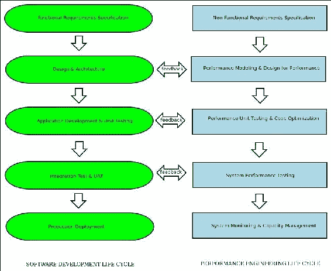
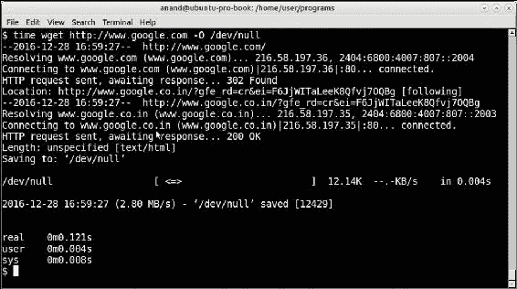
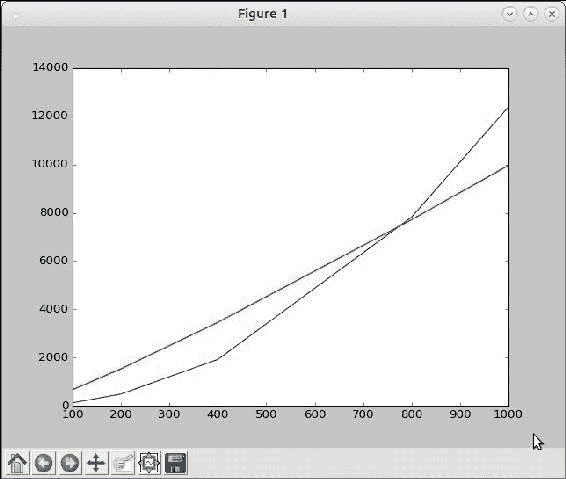
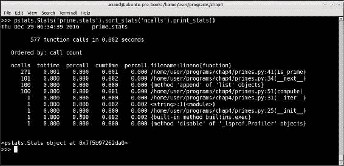
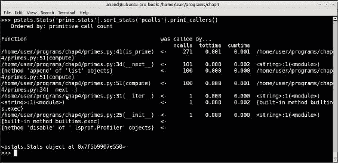
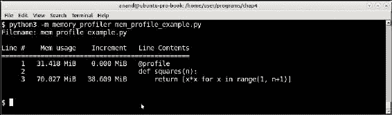
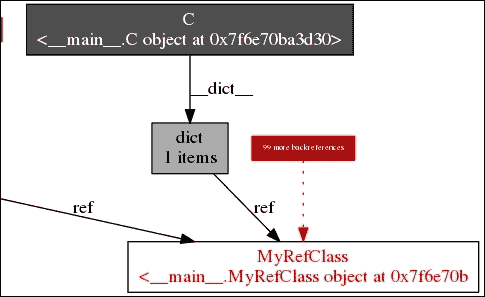
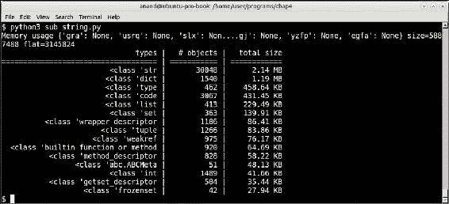
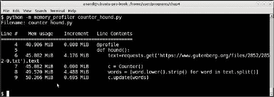

# 四、好的表现是值得的！

性能是现代软件应用的基石之一。作为我们工作和休闲的一部分，我们每天都以许多不同的方式与高性能计算系统进行交互。

当你从网上的某个旅游网站预订机票时，你正在与一个高性能系统交互，该系统在给定的时间内执行数百次此类交易。当您通过网上银行交易向某人转账或在线支付信用卡账单时，您正在与一个高性能、高吞吐量的交易系统进行交互。同样，当你在手机上玩在线游戏并与其他玩家交互时，同样有一个高并发、低延迟的服务器网络，它接收来自你和数千名其他玩家的输入，在后面执行计算并向你发送数据——所有这些都是合理且安静的效率。

随着高速互联网的出现和硬件性价比的大幅下降，同时为数百万用户提供服务的现代 web 应用成为可能。性能仍然是现代软件架构的关键质量属性，编写高性能和可扩展的软件仍然是一门困难的艺术。您可以编写一个勾选所有功能和其他质量属性框的应用，但如果它未通过性能测试，则无法将其移动到生产环境中。

在本章和下一章中，我们将重点讨论编写高吞吐量软件的两个方面，即性能和可伸缩性。在本章中，重点是性能、it 的各个方面、如何度量性能、各种数据结构的性能以及何时选择性能，重点是 Python。

我们将在本章中讨论的主题大致分为以下几节：

*   定义性能
*   软件性能工程
*   性能测试工具的类型
*   性能复杂性和大 O 表示法：
    *   衡量绩效
    *   利用图发现性能复杂性
    *   改进性能
*   剖析：
    *   确定性剖面
    *   `cProfile`和`profile`
    *   第三方分析器
*   其他工具：
    *   Objgraph
    *   皮普尔
*   性能编程–数据结构：
    *   列表
    *   辞典
    *   设置
    *   多元组
*   高性能容器–集合模块：
    *   `deque`
    *   `defaultdict`
    *   `OrderedDict`
    *   `Counter`
    *   `ChainMap`
    *   `namedtuple`
*   概率数据结构-bloom 过滤器

# 什么是性能？

软件系统的性能可以广义地定义为：

> *“系统能够满足其吞吐量和/或延迟要求的程度，即每秒事务数或单个事务所用时间。”*

在介绍性章节中，我们已经对衡量绩效进行了概述。性能可以根据响应时间/延迟或吞吐量来衡量。前者是应用平均完成请求/响应循环所需的时间。后者是系统按每分钟成功完成的请求或事务数处理其输入的速率。

系统的性能是其软件和硬件能力的函数。一个写得不好的软件仍然可以通过扩展硬件（例如，RAM 的数量）来提高性能。

类似地，一个软件可以通过提高其性能，使其在现有硬件上更好地工作——例如，通过重写例程或函数，使其在时间或内存方面更高效，或者通过修改架构。

然而，正确的性能工程类型是软件以最佳方式针对硬件进行调整，以便软件相对于可用硬件线性扩展或更好。

# 软件性能工程

软件性能工程包括**软件****开发生命周期**（**SDLC**）中应用的、旨在满足性能要求的所有软件工程和分析活动。

在传统的软件工程中，性能测试和反馈通常在 SDLC 结束时完成。这种方法纯粹基于测量，在应用测试和诊断以及根据结果调整系统之前，等待系统开发。

另一个名为**软件性能工程**（**SPE**的更正式的模型本身，在 SDLC 早期开发性能模型，并使用模型的结果修改软件设计和架构，以满足多次迭代中的性能需求。

在这种方法中，作为非功能性需求的性能和满足其功能性需求的软件开发是齐头并进的。有一个特定的**性能****工程生命周期**（**PELC**）与 SDLC 中的步骤平行。在每个步骤中，从设计和架构到部署，这两个生命周期之间的反馈都用于迭代地提高软件质量：



SPE-性能工程生命周期镜像软件开发生命周期

在这两种方法中，性能测试和诊断都很重要，然后根据获得的结果调整设计/架构或代码。因此，性能测试和测量工具在这一步骤中起着重要作用。

# 性能测试和测量工具

这些工具分为两大类——即用于性能测试和诊断的工具，以及用于性能指标收集和检测的工具。

性能测试和诊断工具可进一步分类如下：

*   **压力测试工具**：这些工具用于向被测系统提供工作负载，模拟生产中的峰值工作负载。这些工具可以配置为向应用发送连续的输入流以模拟高压力，或者周期性地发送非常高的流量突发（甚至远远超过峰值压力），以测试系统的健壮性。这些工具也称为**负荷发生器**。用于 web 应用测试的常见压力测试工具包括**httpperf**、**ApacheBench**、**LoadRunner**、**ApacheJMeter**和**Hocust**。另一类工具涉及那些实际记录真实用户流量，然后通过网络重播以模拟真实用户负载的工具。例如，可以使用流行的网络数据包捕获和监视工具**Wireshark**及其控制台同类程序`tcpdump`来完成此操作。在这一章中，我们不会讨论这些工具，因为它们是通用的，在 Web 上可以找到大量使用它们的示例。
*   **监控工具**：这些工具与应用代码一起生成性能指标，如函数执行所需的时间和内存、每个请求-响应循环进行的函数调用数量、每个函数花费的平均和峰值时间等。
*   **检测工具**：检测工具跟踪度量，如每个计算步骤所需的时间和内存，还跟踪事件，如代码中的异常，包括异常发生的模块/功能/行号、事件的时间戳等细节，以及应用的环境（环境变量、应用配置参数、用户信息、系统信息等）。现代 web 应用编程系统中经常使用外部工具来捕获和详细分析此类数据。
*   **代码或应用评测工具**：这些工具生成有关函数的统计信息，函数调用的持续时间频率，以及每个函数调用所花费的时间。这是一种动态程序分析。它允许程序员找到代码中花费时间最多的关键部分，使他/她能够优化这些部分。不建议在没有评测的情况下进行优化，因为程序员最终可能会优化错误的代码，从而无法将预期的好处呈现给应用。

大多数编程语言都有自己的一套工具和分析工具。在 Python 中，标准库中的一组工具（如`profile`和`cProfile`模块）可以做到这一点——这是由丰富的第三方工具生态系统补充的。我们将在接下来的章节中讨论这些工具。

# 性能复杂性

在我们开始 Python 中的代码示例并讨论度量和优化性能的工具之前，花点时间讨论一下我们所说的代码的性能复杂性是什么，这将是很有帮助的。

例程或函数的性能复杂性定义为它们如何响应输入大小的变化，通常定义为执行代码所花费的时间。

这通常由所谓的 Big-O 表示法表示，它属于一个称为**Bachmann–Landau 表示法或渐近**表示法的表示法家族。

字母 O 用作函数相对于输入大小的增长率-也称为函数的**顺序**。

下表按复杂性增加的顺序显示了常用的大 O 符号或函数顺序：

<colgroup class="calibre18"><col class="calibre19"> <col class="calibre19"> <col class="calibre19"> <col class="calibre19"></colgroup> 
| 

#

 | 

顺序

 | 

复杂性

 | 

实例

 |
| --- | --- | --- | --- |
| 1. | *O（1）* | 常数 | 在常量查找表（如 Python 中的 HashMap 或字典）中查找键 |
| 2. | *O（对数（n））* | 对数的 | 使用二进制搜索在排序数组中搜索项。Python 中 heapq 上的所有操作 |
| 3. | *O（n）* | 线性的 | 通过遍历数组（Python 中的列表）中的项来搜索该项 |
| 4. | *O（n*k）* | 线性的 | 基数排序的最坏情况复杂性 |
| 5. | *O（n*log（n））* | 对数星 | mergesort 或 heapsort 算法的最坏情况复杂性 |
| 6. | *O（n<sup class="calibre29">2</sup>* | 二次的 | 简单的排序算法，如 bubblesort、插入排序和选择排序。某些排序算法（如 quicksort、shellsort 等）的最坏情况复杂性 |
| 7. | *O（2<sup class="calibre29">n</sup>* | 指数型 | 尝试使用蛮力破解大小为 n 的密码，使用动态规划解决旅行商问题 |
| 8. | *O（n！）* | 阶乘的 | 生成集合的所有分区 |

表 1：关于输入大小“n”的功能订单的通用大 O 符号

当实现一个接受某个大小*n*输入的例程或算法时，程序员理想的目标应该是按照前五位的顺序实现它。任何顺序为*O（n）或 O（n*log（n））*或更小的表示性能合理到良好。

阶数为*O（n<sup class="calibre30">2</sup>*的算法通常可以优化为在较低阶数下工作。我们将在下图的章节中看到一些例子。

下图显示了每个订单相对于*n*的增长情况：


每阶复杂度（y 轴）w.r.t 输入大小（x 轴）的增长率图

# 测量性能

现在，我们已经对什么是性能复杂性以及性能测试和度量工具有了一个概述，让我们来看看用 Python 度量性能复杂性的各种方法。

使用 POSIX/Linux 系统的`time`命令可以完成最简单的时间测量之一。

这是通过使用以下命令行完成的：

```py
$ time <command>

```

例如，下面是一个截图，显示了从 Web 上获取一个非常受欢迎的页面所需的时间：



通过 wget 从 Internet 获取网页时 time 命令的输出

可以看到它显示了三类时间输出，即`real`、`user`和`sys`。了解这三者之间的区别很重要，因此让我们简单地看一下：

*   `real`：Real time 是操作所经过的实际挂钟时间。这是操作从开始到结束的时间。它将包括进程休眠或阻塞的任何时间，如 I/O 完成所需的时间。
*   `User`：用户时间是在用户模式下（内核外）进程内实际花费的 CPU 时间量。任何睡眠时间或等待时间（如 I/O）都不会增加用户时间。
*   `Sys`：System time 是在内核中为程序执行系统调用所花费的 CPU 时间量。这只统计在内核空间中执行的函数，例如特权系统调用。它不计算在用户空间中执行的任何系统调用（在`User`中计算）。

进程花费的 CPU 总时间为`user`+`sys`时间。实际时间或挂钟时间主要由简单的计时器测量。

## 使用上下文管理器测量时间

在 Python 中，编写一个简单的函数来充当代码块的上下文管理器并不是很难完成，您需要测量代码块的执行时间。

但首先我们需要一个我们可以衡量其性能的程序。

查看以下步骤，了解如何使用上下文管理器测量时间：

1.  让我们编写一个程序，作为测试程序计算两个序列之间的公共元素。代码如下：

    ```py
    def common_items(seq1, seq2):
        """ Find common items between two sequences """

        common = []
        for item in seq1:
            if item in seq2:
                common.append(item)

        return common
    ```

2.  让我们编写一个简单的上下文管理器计时器来计时这段代码。对于计时，我们将使用`time`模块的`perf_counter`，该模块为短时间内的最精确分辨率提供时间：

    ```py
    from time import perf_counter as timer_func
    from contextlib import contextmanager

    @contextmanager
    def timer():
        """ A simple timing function for routines """

        try:
            start = timer_func()
            yield
        except Exception as e:
            print(e)
            raise
        finally:
            end = timer_func()
            print ('Time spent=>',1000.0*(end – start),'ms.')
    ```

3.  Let us time the function for some simple input data. For this a `test` function is useful that generates random data, given an input size:

    ```py
    def test(n):
        """ Generate test data for numerical lists given input size """

        a1=random.sample(range(0, 2*n), n)
        a2=random.sample(range(0, 2*n), n)

        return a1, a2
    ```

    以下是 Python 交互解释器上`test`函数的`timer`方法的输出：

    ```py
    >>> with timer() as t:
    ... common = common_items(*test(100))
    ... Time spent=> 2.0268699999999864 ms.
    ```

4.  事实上，测试数据生成和测试可以组合在同一个功能中，以便于对一系列输入大小进行测试和生成数据：

    ```py
    def test(n, func):
        """ Generate test data and perform test on a given function """

        a1=random.sample(range(0, 2*n), n)
        a2=random.sample(range(0, 2*n), n)

        with timer() as t:
            result = func(a1, a2)
    ```

5.  Now let us measure the time taken for different ranges of input sizes in the Python interactive console:

    ```py
    >>> test(100, common_items)
        Time spent=> 0.6799279999999963 ms.
    >>> test(200, common_items)
        Time spent=> 2.7455590000000085 ms.
    >>> test(400, common_items)
        Time spent=> 11.440810000000024 ms.
    >>> test(500, common_items)
        Time spent=> 16.83928100000001 ms.
    >>> test(800, common_items)
        Time spent=> 21.15130400000004 ms.
    >>> test(1000, common_items)
        Time spent=> 13.200749999999983 ms.
    ```

    哎呀，`1000`项目花费的时间比`800`项目少！怎么可能呢？让我们再试一次：

    ```py
    >>> test(800, common_items)
        Time spent=> 8.328282999999992 ms.
    >>> test(1000, common_items)
        Time spent=> 34.85899500000001 ms.
    ```

    现在花在`800`项目上的时间似乎比花在`400`和`500`上的时间要少。而花在`1000`项目上的时间比以前增加了一倍多。

    原因是我们的输入数据是随机的，这意味着它有时会有很多共同的项目-这需要更多的时间-有时会少很多。因此，在后续调用中，所花费的时间可以显示一系列值。

    换句话说，我们的计时函数对于获得一个粗略的图像是有用的，但对于获得程序执行所花费时间的真正统计度量（这一点更为重要）则不是很有用。

6.  为此我们需要多次运行计时器并取平均值。这在某种程度上与算法的**摊销**分析类似，该分析考虑了执行算法所需时间的下限和上限，并为程序员提供了实际的平均花费时间估计。

Python 在其标准库中附带了这样一个模块，即`timeit`模块，它有助于执行这种时序分析。让我们在下一节中看一下这个模块。

## 使用 timeit 模块的定时代码

Python 标准库中的`timeit`模块允许程序员测量执行小代码片段所需的时间。代码片段可以是 Python 语句、表达式或函数。

使用`timeit`模块的最简单方法是在 Python 命令行中将其作为模块执行。

例如，下面是一些简单 Python 内联代码的计时数据，这些代码测量列表的性能，并计算范围内的数字平方：

```py
$ python3 -m timeit '[x*x for x in range(100)]'
100000 loops, best of 3: 5.5 usec per loop

$ python3 -m timeit '[x*x for x in range(1000)]'
10000 loops, best of 3: 56.5 usec per loop

$ python3 -m timeit '[x*x for x in range(10000)]'
1000 loops, best of 3: 623 usec per loop

```

结果显示执行代码段所需的时间。当在命令行上运行时，`timeit`模块自动确定运行代码的周期数，并计算单个执行所花费的平均时间。

### 注

结果表明，我们正在执行的语句是线性的或 O（n），因为大小为 100 的范围需要 5.5 usec，而大小为 1000 的范围需要 56.5 usec 或大约 10 倍的时间。usec（或微秒）是百万分之一秒或 1*10-6 秒。

下面是如何以类似的方式在 Python 解释器上使用`timeit`模块：

```py
>>> 1000000.0*timeit.timeit('[x*x for x in range(100)]', number=100000)/100000.0
6.007622049946804

>>> 1000000.0*timeit.timeit('[x*x for x in range(1000)]', number=10000)/10000.0
58.761584300373215
```

### 注

注意，当以这种方式使用时，程序员必须传递正确的迭代次数作为`number`参数，并且，为了平均，必须除以相同的数字。`1000000`的乘法是将时间转换为微秒（usec）。

`timeit`模块在幕后使用`Timer`类。该类可以直接使用，也可以用于更精细的控制。

当使用该类时，`timeit`成为类实例的一个方法，循环数作为参数传递给该类实例。

`Timer`类构造函数还接受可选的`setup`参数，该参数为`Timer`类设置代码。这可以包含用于导入包含函数的模块、设置全局变量等的语句。它接受由分号分隔的多个语句。

### 使用 timeit 测量我们代码的性能

让我们重写我们的`test`函数来测试两个序列之间的公共项。现在我们将使用`timeit`模块，我们可以从代码中删除上下文管理器计时器。我们还将在函数中硬编码对`common_items`的调用。

### 注

我们还需要在测试函数之外创建随机输入，因为否则它所花费的时间将增加测试函数的时间并破坏我们的结果。

因此，我们需要在模块中将变量作为全局变量移出，并编写一个`setup`函数，作为第一步，它将为我们生成数据。

我们重写的`test`函数如下所示：

```py
def test():
    """ Testing the common_items function """

    common = common_items(a1, a2)
```

带有全局变量的`setup`函数如下所示：

```py
# Global lists for storing test data
a1, a2 = [], []

def setup(n):
    """ Setup data for test function """

    global a1, a2
    a1=random.sample(range(0, 2*n), n)
    a2=random.sample(range(0, 2*n), n)
```

假设包含`test`和`common_items`函数的模块名为`common_items.py`。

现在可以按如下方式运行计时器测试：

```py
>>> t=timeit.Timer('test()', 'from common_items import test,setup; setup(100)')
>>> 1000000.0*t.timeit(number=10000)/10000
116.58759460115107
```

因此，一系列`100`数字所用的时间平均约为 117 usec（0.12 微秒）。

现在对其他几个输入大小范围执行将得到以下输出：

```py
>>> t=timeit.Timer('test()','from common_items import test,setup; setup(200)')
>>> 1000000.0*t.timeit(number=10000)/10000
482.8089299000567

>>> t=timeit.Timer('test()','from common_items import test,setup; setup(400)')
>>> 1000000.0*t.timeit(number=10000)/10000
1919.577144399227

>>> t=timeit.Timer('test()','from common_items import test,setup; setup(800)')
>>> 1000000.0*t.timeit(number=1000)/1000
7822.607815993251

>>> t=timeit.Timer('test()','from common_items import test,setup; setup(1000)')
>>> 1000000.0*t.timeit(number=1000)/1000
12394.932234004957
```

因此，对于`1000`项的输入大小，此测试运行所用的最长时间为 12.4 微秒。

## 找出时间复杂度-图表

是否有可能从这些结果中找出我们函数的时间性能复杂性？让我们试着把它画成一个图表，看看结果。

`matplotlib`库对于在 Python 中为任何类型的输入数据绘制图形非常有用。我们只需要以下简单的代码就可以实现这一点：

```py
import matplotlib.pyplot as plt

def plot(xdata, ydata):
    """ Plot a range of ydata (on y-axis) against xdata (on x-axis) """

    plt.plot(xdata, ydata)
    plt.show()
```

前面的代码提供以下输出：

```py
This is our x data.
>>> xdata = [100, 200, 400, 800, 1000]
This is the corresponding y data.
>>> ydata = [117,483,1920,7823,12395]
>>> plot(xdata, ydata)
```

请看下图：


公共 _ 项功能的输入范围与所用时间的关系图

这显然不是线性的，但当然不是二次的（与大 O 符号上的数字相比）。让我们试着在当前图上绘制一个 O（n*log（n））的图，看看是否有匹配。

由于我们现在需要两个系列的`ydata`，我们需要另一个稍加修改的功能：

```py
def plot_many(xdata, ydatas):
    """ Plot a sequence of ydatas (on y-axis) against xdata (on x-axis) """

    for ydata in ydatas:
        plt.plot(xdata, ydata)
    plt.show()
```

前面的代码提供以下输出：

```py
>>> ydata2=map(lambda x: x*math.log(x, 2), input)

>>> plot_many(xdata, [ydata2, ydata])
```

您可以得到下图：



叠加在 y=x*log（x）图上的公共 _ 项的时间复杂度图

叠加图显示该函数与 n*log（n）顺序非常匹配，如果不完全相同的话。因此，我们当前的实现的复杂性似乎大约为 O（n*log（n））。

现在我们已经完成了性能分析，让我们看看是否可以重写例程以更好地执行。

以下是当前代码：

```py
def common_items(seq1, seq2):
    """ Find common items between two sequences """

    common = []
    for item in seq1:
        if item in seq2:
            common.append(item)

    return common
```

该例程首先通过一个外部`for`循环（大小为`n`），并按顺序（同样大小为`n`）对该项进行检查。现在，第二次搜索平均也具有时间复杂性`n`。

然而，一些项目会立即被发现，一些项目会花费线性时间（k），其中 1<k<n。平均而言，分布介于两者之间，这就是为什么代码的平均复杂度接近 O（n*log（n））。

快速分析将告诉您，通过将外部序列转换为字典，将值设置为 1，可以避免内部搜索。内部搜索将替换为第二个序列上的循环，该循环将值递增 1。

最后，在新字典中，所有常用项的值都将大于 1。

新守则如下：

```py
def common_items(seq1, seq2):
    """ Find common items between two sequences, version 2.0 """

    seq_dict1 = {item:1 for item in seq1}

    for item in seq2:
        try:
            seq_dict1[item] += 1
        except KeyError:
            pass

    # Common items will have value > 1
    return [item[0] for item in seq_dict1.items() if item[1]>1]
```

通过此更改，计时器将给出以下更新结果：

```py
>>> t=timeit.Timer('test()','from common_items import test,setup; setup(100)')
>>> 1000000.0*t.timeit(number=10000)/10000
35.777671200048644

>>> t=timeit.Timer('test()','from common_items import test,setup; setup(200)')
>>> 1000000.0*t.timeit(number=10000)/10000
65.20369809877593

>>> t=timeit.Timer('test()','from common_items import test,setup; setup(400)')
>>> 1000000.0*t.timeit(number=10000)/10000
139.67061050061602

>>> t=timeit.Timer('test()','from common_items import test,setup; setup(800)')
>>> 1000000.0*t.timeit(number=10000)/10000
287.0645995993982

>>> t=timeit.Timer('test()','from common_items import test,setup; setup(1000)')
>>> 1000000.0*t.timeit(number=10000)/10000
357.764518300246
```

让我们将其绘制并叠加在 O（n）图上：

```py
>>> input=[100,200,400,800,1000]
>>> ydata=[36,65,140,287,358]

# Note that ydata2 is same as input as we are superimposing with y = x 
# graph
>>> ydata2=input
>>> plot.plot_many(xdata, [ydata, ydata2])
```

让我们来看看下面的图表：


公共 _ 项函数（v2）相对于 y=x 图形所用时间的曲线图

上面的绿线是参考**y**=**x**图形，下面的蓝线是新函数所用时间的曲线图。很明显，时间复杂度现在是线性的或 O（n）。

然而，由于两条直线的斜率不同，这里似乎有一个常数因子。通过快速计算，可以粗略地计算出该系数`0.35`。

应用此更改后，您将获得以下输出：

```py
>>> input=[100,200,400,800,1000]
>>> ydata=[36,65,140,287,358]

# Adjust ydata2 with the constant factor
>>> ydata2=map(lambda x: 0.35*x, input)
>>> plot.plot_many(xdata, [ydata, ydata2])
```


公共 _ 项函数（v2）对 y=0.35*x 图形所用时间的绘图

你可以看到这些情节几乎相互重叠。所以我们的函数现在在 O（c*n）处执行，其中 c~=0.35。

### 注

`common_items`函数的另一个实现是将两个序列转换为集合并返回它们的交集。这对于读者来说是一个有趣的练习，可以进行更改、计时并绘制图表以确定时间复杂度。

## 用 timeit 测量 CPU 时间

`Timer`模块默认使用`time`模块的`perf_counter`功能作为默认`timer`功能。正如前面提到的一样，此函数将在小时间段内以最大精度返回所花费的挂钟时间，因此它将包括任何睡眠时间、I/O 时间等。

这可以通过在测试函数中添加一点睡眠时间来说明，如下所示：

```py
def test():
    """ Testing the common_items function using a given input size """

    sleep(0.01)
    common = common_items(a1, a2)
```

前面的代码将为您提供以下输出：

```py
>>> t=timeit.Timer('test()','from common_items import test,setup; setup(100)')
>>> 1000000.0*t.timeit(number=100)/100
10545.260819926625
```

由于每次调用时我们都处于睡眠状态`0.01`秒（10 毫秒），因此时间跳跃高达 300 倍，因此花在代码上的实际时间现在几乎完全由睡眠时间决定，结果显示`10545.260819926625`微秒（或约 10 毫秒）。

有时您可能会有这样的睡眠时间和其他阻塞/等待时间，但您只想测量函数实际占用的 CPU 时间。为此，可以使用时间模块的`process_time`函数作为`timer`函数来创建`Timer`对象。

这可以通过在创建`Timer`对象时传入`timer`参数来实现：

```py
>>> from time import process_time
>>> t=timeit.Timer('test()','from common_items import test,setup;setup(100)', timer=process_time)
>>> 1000000.0*t.timeit(number=100)/100
345.22438
```

如果您现在将睡眠时间增加一个因子，例如 10，测试时间将增加该因子，但计时器的返回值保持不变。

例如，这里是睡眠 1 秒的结果。输出在大约 100 秒后出现（因为我们迭代了`100`次），但请注意返回值（每次调用花费的时间）没有改变：

```py
>>> t=timeit.Timer('test()','from common_items import test,setup;setup(100)', timer=process_time)
>>> 1000000.0*t.timeit(number=100)/100
369.8039100000002

```

让我们接下来继续分析。

# 仿形

在本节中，我们将讨论分析器，并深入了解 Python 标准库中的模块，该库提供了对确定性评测的支持。我们还将研究为评测提供支持的第三方库，如`line_profiler`和`memory_profiler`。

## 确定性剖面

确定性评测意味着监控所有函数调用、函数返回和异常事件，并对这些事件之间的间隔进行精确计时。另一种类型的评测，即**统计评测**，随机对指令指针进行采样，并推断时间花费在哪里——但这可能不是很准确。

Python 作为一种解释语言，在由解释器保存的元数据方面已经有一定的开销。大多数确定性分析工具都会利用这些信息，因此只会为大多数应用增加很少的额外处理开销。因此，Python 中的确定性评测并不是一个非常昂贵的操作。

## 使用 cProfile 和 profile 进行配置

`profile`和`cProfile`模块在 Python 标准库中提供对确定性评测的支持。`profile`模块完全是用 Python 编写的。`cProfile`模块是一个 C 扩展，它模仿`profile`模块的接口，但与配置文件相比，增加的开销更小。

两个模块都报告统计信息，并使用`pstats`模块将其转换为可报告的结果。

为了展示我们使用`profile`模块的示例，我们将使用以下代码，这是一个素数迭代器：

```py
class Prime(object):
    """ A prime number iterator for first 'n' primes """

    def __init__(self, n):
        self.n = n
        self.count = 0
        self.value = 0

    def __iter__(self):
        return self

    def __next__(self):
        """ Return next item in iterator """

        if self.count == self.n:
            raise StopIteration("end of iteration")
        return self.compute()

    def is_prime(self):
        """ Whether current value is prime ? """

        vroot = int(self.value ** 0.5) + 1
        for i in range(3, vroot):
            if self.value % i == 0:
                return False
        return True

    def compute(self):
        """ Compute next prime """

        # Second time, reset value
        if self.count == 1:
            self.value = 1

        while True:
            self.value += 2

            if self.is_prime():
                self.count += 1
                break

        return self.value
```

素数迭代器根据`n`的值生成第一个`n`素数：

```py
>>> for p in Prime(5):
... print(p)
...
2
3
5
7
11
```

要分析这段代码，我们只需要将要执行的代码作为字符串传递给 profile 或 cProfile 模块的`run`方法。在以下示例中，我们将使用`cProfile`模块：


分析前 100 个素数的素数迭代器函数的输出

查看探查器如何报告其输出。输出按如下顺序分为六列：

*   `ncalls`：每个函数调用的次数
*   `tottime`：通话总时间
*   `percall`：`percall`时间（`tottime`/`ncalls`商）
*   `cumtime`：此函数加上任何子函数的累计时间
*   `percall`：另一`percall`列`cumtime`商/原语调用数）
*   `filename: lineno(function)`：函数调用的文件名和行号

在本例中，我们的函数花费了`4`微秒来完成，其中大部分时间（`3`微秒）都花费在`is_prime`方法中，该方法也控制了 271 的调用数量。

以下是剖析器在`n = 1000`和`10000`的输出：


分析前 1000 个素数的素数迭代器函数的输出

请看以下附加输出：


分析前 10000 个素数的素数迭代器函数的输出

如您所见，在`n`=`1000`时，大约需要`0.043`秒（43 微秒），而在`n`=`10000`时，则需要`0.458`秒（458 微秒）。我们的`Prime`迭代器似乎以接近 O（n）的顺序执行。

像往常一样，大部分的时间都花在`is_primes`上。有没有办法缩短这段时间？

现在，让我们分析代码。

### 素数迭代器类–性能调整

对代码的快速分析告诉我们，在`is_prime`中，我们将值除以从`3`到值的平方根后续数范围内的每个数字。

这也包含许多偶数——我们正在进行不必要的计算，我们可以通过只除以奇数来避免这种情况。

修改后的`is_prime`方法如下：

```py
    def is_prime(self):
        """ Whether current value is prime ? """

        vroot = int(self.value ** 0.5) + 1
        for i in range(3, vroot, 2):
            if self.value % i == 0:
                return False
        return True
```

这样，`n`=`1000`和`n`=`10000`的配置文件如下所示。

以下是`n = 1000`的分析器的输出。


使用经过调整的代码分析前 1000 个素数的素数迭代器函数的输出

以下是`n`=`10000`的探查器输出：


使用经过调整的代码为前 10000 个素数分析素数迭代器函数的输出

你可以看到，在`1000`时，时间略有下降（43 微秒到 38 微秒），但在`10000`时，时间从 458 微秒下降到 232 微秒，下降了近 50%。此时，该函数的性能优于 O（n）。

## 分析——收集和报告统计数据

在前面的示例中，我们使用 cProfile 的方式是，它运行并直接报告统计数据。使用该模块的另一种方法是传递一个`filename`参数，它将统计数据写入该参数，该参数稍后可由`pstats`模块加载和解释。

我们修改代码如下：

```py
>>> cProfile.run("list(primes.Prime(100))", filename='prime.stats')
```

这样，统计数据就不会打印出来，而是保存到名为`prime.stats`的文件中。

下面是如何使用`pstats`模块解析统计数据，并按调用次数顺序打印结果：



使用 pstats 模块分析和打印保存的配置文件结果

`pstats`模块允许按照数量的报头对配置文件结果进行排序，如总时间（`tottime`）、原始调用次数（`pcalls`）、累计时间（`cumtime`等。您可以从 pstats 的输出中再次看到，大部分调用数量方面的处理都花费在 is_prime 方法中，因为我们是按“nCall”或函数调用数量对输出进行排序的。

`pstats`模块的`Stats`类在每次操作后返回对自身的引用。这是一些 Python 类的一个非常有用的方面，允许我们通过链接方法调用来编写紧凑的单行代码。

`Stats`对象的另一个有用的方法是找出被调用方/调用方的关系。这可以通过使用`print_callers`方法而不是`print_stats`来实现。以下是我们当前统计数据的输出：



使用 pstats 模块打印按原语调用排序的被叫方/呼叫者关系

## 第三方剖析器

Python 生态系统附带了大量第三方模块，用于解决大多数问题。在分析器的情况下也是如此。在本节中，我们将快速查看 Python 社区中的开发人员提供的一些流行的第三方探查器应用。

### 测线仪

Line profiler 是由 Robert Kern 开发的分析器应用，用于对 Python 应用执行逐行评测。它是用 Cython 编写的，Cython 是一个针对 Python 的优化静态编译器，可以减少分析的开销。

线路剖面仪可通过`pip`安装，具体如下：

```py
$ pip3 install line_profiler

```

与 Python 中的评测模块（评测函数）不同，line profiler 能够逐行评测代码，从而提供更细粒度的统计信息。

Line profiler 附带了一个名为`kernprof.py`的脚本，可以轻松地使用 Line profiler 分析代码。在使用`kernprof`时，只需修饰需要使用`@profile`修饰器进行分析的函数。

例如，我们意识到素数迭代器中的大部分时间都花在了`is_prime`方法中。然而，line profiler 允许我们深入了解更多细节，并找出那些函数中占用时间最多的行。

为此，只需使用`@profile`装饰器装饰方法即可：

```py
    @profile
    def is_prime(self):
        """ Whether current value is prime ? """

        vroot = int(self.value ** 0.5) + 1
        for i in range(3, vroot, 2):
            if self.value % i == 0:
                return False
        return True
```

由于`kernprof`接受脚本作为参数，我们需要添加一些代码来调用素数迭代器。为此，我们可以在`primes.py`模块末尾附加以下内容：

```py
# Invoke the code.
if __name__ == "__main__":
    l=list(Prime(1000))
```

现在，使用 line profiler 运行它，如下所示：

```py
$ kernprof -l -v primes.py

```

通过将`-v`传递给`kernprof`脚本，我们告诉它除了保存概要文件结果外，还要显示概要文件结果。

以下是输出：


Line profiler 使用 n=1000 分析 is_ 素数方法得出的结果

Line profiler 告诉我们，大部分时间——接近方法总时间的 90%——都花在前两行：for 循环和提醒检查。

这告诉我们，如果想要优化这个方法，我们需要专注于这两个方面。

### 内存档案器

内存分析器是一种类似于行分析器的分析器，它逐行评测 Python 代码。但是，它不是分析每行代码所花费的时间，而是按内存消耗分析每行代码。

内存探查器的安装方式与 line profiler 相同：

```py
$ pip3 install memory_profiler

```

安装后，可以通过使用`@profile`装饰器以类似于 line profiler 的方式装饰函数来打印线条内存。

下面是一个简单的例子：

```py
# mem_profile_example.py
@profile
def squares(n):
    return [x*x for x in range(1, n+1)]

squares(1000)
```

以下是如何运行此功能：


内存分析器分析前 1000 个数字的平方的列表理解

内存分析器逐行显示内存增量。在这种情况下，包含方格数的行（列表理解）几乎没有增量，因为这些数字非常小。总内存使用量仍然保持在最初的水平：大约 32MB。

如果我们将`n`的值更改为一百万，会发生什么？这可以通过重写代码的最后一行来完成，如下所示：

```py
squares(100000)
```



内存分析器分析前 100 万个数字的平方的列表理解

现在您可以看到，对于计算方块的列表理解，有一个大约 39MB 的清晰内存增量，总的最终内存使用量大约为 70MB。

为了演示内存分析器的真正用途，让我们看另一个例子。

这涉及从一个序列中找到字符串，该序列是另一个序列中任何字符串的子序列，通常包含较大的字符串。

### 子串（子序列）问题

假设您有一个包含以下字符串的序列：

```py
>>> seq1 = ["capital","wisdom","material","category","wonder"]
```

假设还有另一个顺序，如下所示：

```py
>>> seq2 = ["cap","mat","go","won","to","man"]
```

问题是要在`seq2`中找到作为子字符串的字符串，正如在`seq1`中的任何字符串中连续找到的一样：

在这种情况下，答案如下：

```py
>>> sub=["cap","mat","go","won"]
```

可以使用蛮力搜索解决此问题–在每个父字符串中逐个检查每个字符串，如下所示：

```py
def sub_string_brute(seq1, seq2):
    """ Sub-string by brute force """

    subs = []
    for item in seq2:
        for parent in seq1:
            if item in parent:
                subs.append(item)

    return subs
```

但是，快速分析会告诉您，随着序列大小的增加，此函数的时间复杂度会急剧增加。由于每个步骤都需要通过两个序列进行迭代，然后在第一个序列中的每个字符串中进行搜索，因此平均性能为 O（n1*n2），其中 n1、n2 分别是序列的大小。

以下是该函数的一些测试结果，其中随机字符串的输入大小（两个序列大小相同）从长度 2 到 10 不等：

<colgroup class="calibre18"><col class="calibre19"> <col class="calibre19"></colgroup> 
| 

输入大小

 | 

耗时

 |
| --- | --- |
| 100 | 450 美国能源公司 |
| 1000 | 52 微秒 |
| 10000 | 5.4 秒 |

结果表明性能几乎完全符合 O（n<sup class="calibre30">2</sup>。

是否有方法重写函数以提高性能效率？此方法在以下`sub_string`函数中捕获：

```py
def slices(s, n):
    return map(''.join, zip(*(s[i:] for i in range(n))))

def sub_string(seq1, seq2):
    """ Return sub-strings from seq2 which are part of strings in seq1 """

    # Create all slices of lengths in a given range
    min_l, max_l = min(map(len, seq2)), max(map(len, seq2))
    sequences = {}

    for i in range(min_l, max_l+1):
        for string in seq1:
	      # Create all sub sequences of given length i
         sequences.update({}.fromkeys(slices(string, i)))

    subs = []
    for item in seq2:
        if item in sequences:
            subs.append(item)

    return subs
```

在这种方法中，我们从`seq1`中的字符串中预先计算大小范围内的所有子字符串，并将其存储在字典中。然后，检查`seq2`中的字符串，检查它们是否在本词典中，如果是，则将它们添加到列表中。

为了优化计算，我们只计算大小在`seq2`中字符串最小和最大长度范围内的字符串。

与几乎所有性能问题的解决方案一样，这一解决方案以空间换取时间。通过预计算所有子字符串，我们在内存中消耗了更多的空间，但这简化了计算时间。

测试代码如下所示：

```py
import random
import string

seq1, seq2 = [], []

def random_strings(n, N):
     """ Create N random strings in range of 4..n and append
     to global sequences seq1, seq2 """

    global seq1, seq2
    for i in range(N):
        seq1.append(''.join(random.sample(string.ascii_lowercase,
                             random.randrange(4, n))))

    for i in range(N):
        seq2.append(''.join(random.sample(string.ascii_lowercase,
                             random.randrange(2, n/2))))  

def test(N):
    random_strings(10, N)
    subs=sub_string(seq1, seq2)

def test2():
    # random_strings has to be called before this
    subs=sub_string(seq1, seq2)
```

以下是使用`timeit`模块的该功能的计时结果：

```py
>>> t=timeit.Timer('test2()',setup='from sub_string import test2, random_
strings;random_strings(10, 100)')
>>> 1000000*t.timeit(number=10000)/10000.0
1081.6103347984608
>>> t=timeit.Timer('test2()',setup='from sub_string import test2, random_
strings;random_strings(10, 1000)')
>>> 1000000*t.timeit(number=1000)/1000.0
11974.320339999394
>>> t=timeit.Timer('test2()',setup='from sub_string import test2, random_
strings;random_strings(10, 10000)')
>>> 1000000*t.timeit(number=100)/100.0124718.30968977883
124718.30968977883
>>> t=timeit.Timer('test2()',setup='from sub_string import test2, random_
strings;random_strings(10, 100000)')
>>> 1000000*t.timeit(number=100)/100.0
1261111.164370086
```

以下是该测试的总结结果：

<colgroup class="calibre18"><col class="calibre19"> <col class="calibre19"></colgroup> 
| 

输入大小

 | 

耗时

 |
| --- | --- |
| 100 | 1.08 微秒 |
| 1000 | 11.97 微秒 |
| 10000 | 0.12 微秒 |
| 100000 | 1.26 秒 |

表 2：通过蛮力的子序列解决方案的输入大小与所用时间

快速计算告诉我们，该算法现在的执行速度为 O（n）。不错！

但这是以预先计算的字符串的内存为代价的。我们可以通过调用内存分析器来估计这一点。

以下是用于执行此操作的装饰函数：

```py
@profile
def sub_string(seq1, seq2):
    """ Return sub-strings from seq2 which are part of strings in seq1 """

    # Create all slices of lengths in a given range
    min_l, max_l = min(map(len, seq2)), max(map(len, seq2))
    sequences = {}

    for i in range(min_l, max_l+1):
        for string in seq1:
            sequences.update({}.fromkeys(slices(string, i)))

    subs = []
    for item in seq2:
        if item in sequences:
            subs.append(item)
```

测试功能现在如下所示：

```py
def test(N):
    random_strings(10, N)
    subs = sub_string(seq1, seq2)
```

让我们分别对大小为 1000 和 10000 的序列进行测试。

以下是输入大小为 1000 的结果：


用于测试大小为 1000 的序列子字符串的内存探查器结果

以下是输入大小为 10000 的结果：


用于测试大小为 10000 的序列子字符串的内存探查器结果

对于大小为 1000 的序列，内存使用量仅增加了 1.4MB。对于大小为 10000 的序列，它增加了 6.2MB。显然，这些都不是很重要的数字。

因此，使用内存探查器进行的测试表明，我们的算法在时间性能上是高效的，同时也是内存高效的。

# 其他工具

在本节中，我们将讨论更多的工具，这些工具将帮助程序员调试内存泄漏，并使他能够可视化对象及其关系。

## 对象图

Objgraph（**对象图**是一个 Python 对象可视化工具，它利用`graphviz`包绘制对象参考图。

它不是一个分析或检测工具，但可以与此类工具一起使用，以可视化复杂程序中的对象树和引用，同时查找难以捉摸的内存泄漏。它允许您找出对对象的引用，以找出哪些引用使对象保持活动状态。

与 Python 世界中的几乎所有东西一样，它可以通过`pip`安装：

```py
$ pip3 install objgraph

```

然而，objgraph 只有在能够生成图形时才真正有用。因此我们需要安装`graphviz`包和`xdot`工具。

在 Debian/Ubuntu 系统中，您将按如下方式安装：

```py
$ sudo apt install graphviz xdot -y

```

让我们看一个使用`objgraph`查找隐藏引用的简单示例：

```py
import objgraph

class MyRefClass(object):
    pass

ref=MyRefClass()
class C(object):pass

c_objects=[]
for i in range(100):
    c=C()
    c.ref=ref
    c_objects.append(c)

import pdb; pdb.set_trace()
```

我们有一个名为`MyRefClass`的类，它有一个`ref`实例，由`for`循环中创建的`C`类的 100 个实例引用。这些引用可能导致内存泄漏。让我们看看`objgraph`如何让我们识别它们。

当执行这段代码时，它会在调试器处停止（`pdb`：

```py
$ python3 objgraph_example.py
--Return--
[0] > /home/user/programs/chap4/objgraph_example.py(15)<module>()->None
-> import pdb; pdb.set_trace()
(Pdb++) objgraph.show_backrefs(ref, max_depth=2, too_many=2, filename='refs.png')
Graph written to /tmp/objgraph-xxhaqwxl.dot (6 nodes)
Image generated as refs.png

```

### 注

图像的左侧已被裁剪，仅显示相关部分。

接下来是由 objgraph 生成的图：



Objgraph 反向引用对象引用的可视化

上图中的红色框表示**99 个引用**，这意味着它显示了**C**类的一个实例，并通知我们还有 99 个类似的实例——总共 100 个 C 实例，请参考单个对象**引用**。

在一个复杂的程序中，我们无法跟踪导致内存泄漏的对象引用，程序员可以很好地使用这些引用图。

## 皮普尔

Pympler 是一种工具，可用于监视和测量 Python 应用中对象的内存使用情况。它可以在 Python2.x 和 3.x 上工作。可使用`pip`安装如下：

```py
$ pip3 install pympler

```

Pypler 的文档相当缺乏。然而，众所周知，它的用途是通过`asizeof`模块跟踪对象并打印其实际内存使用情况。

下面是我们修改的`sub_string`函数，用于打印序列字典的内存使用情况（其中存储所有生成的子字符串）：

```py
from pympler import asizeof

def sub_string(seq1, seq2):
    """ Return sub-strings from seq2 which are part of strings in seq1 """

    # Create all slices of lengths in a given range
    min_l, max_l = min(map(len, seq2)), max(map(len, seq2))
    sequences = {}

    for i in range(min_l, max_l+1):
        for string in seq1:
            sequences.update({}.fromkeys(slices(string, i)))

    subs = []
    for item in seq2:
        if item in sequences:
            subs.append(item)
    print('Memory usage',asizeof.asized(sequences).format())

    return subs
```

在序列大小为 10000 的情况下运行此命令时：

```py
$ python3 sub_string.py
Memory usage {'awg': None, 'qlbo': None, 'gvap': No....te': 
 None, 'luwr':
 None, 'ipat': None} 
size=5874384 
flat=3145824

```

`5870408`字节的内存大小（或大约 5.6MB）与 memory profiler 报告的一致（大约 6MB）

Pypler 还附带了一个名为`muppy`的包，它允许跟踪程序中的所有对象。这可以通过`summary`包进行总结，以打印出应用中所有对象（根据其类型分类）的内存使用情况总结。

这是我们的`sub_string`模块在 n=10000 时运行的报告。为此，必须对执行部分进行如下修改：

```py
if __name__ == "__main__":
    from pympler import summary
    from pympler import muppy
    test(10000)
    all_objects = muppy.get_objects()
    sum1 = summary.summarize(all_objects)
    summary.print_(sum1)
```

以下为`pympler`在节目结束时总结的输出：



按 Pypler 按对象类型分类的内存使用情况摘要

# 性能编程–数据结构

我们已经了解了性能的定义、测量性能复杂性以及测量程序性能的不同工具。我们还通过分析统计数据、内存使用等方面的代码获得了一些见解。

我们还看到了几个程序优化示例，以提高代码的时间性能。

在本节中，我们将了解常见的 Python 数据结构，讨论它们的最佳和最差性能场景，并讨论它们在哪些情况下最适合，哪些情况下可能不是最佳选择。

## 可变容器–列表、字典和集合

列表、字典和集是 Python 中最流行和最有用的可变容器。

列表适用于通过已知索引访问对象。字典为具有已知键的对象提供几乎恒定的时间查找。在删除重复项并在近似线性时间内查找它们的差异、交点、并集等时，集合可用于保留项目组。

让我们依次看看其中的每一个。

### 列表

列表提供了以下操作的近似恒定时间 O（1）顺序：

*   `get(index)`通过`[]`操作员
*   `append(item)`通过`.append`方法

但是，在以下情况下，列表的性能不好`(O(n))`：

*   通过`in`操作员查找项目
*   通过`.insert`方法在索引处插入

在以下情况下，列表是理想的：

*   如果您需要一个可变存储来保存不同类型或类别的项（异构）。
*   如果您对对象的搜索涉及通过已知索引获取项目。
*   如果您没有通过搜索列表进行大量查找（列表中的**项）。**
*   如果您的任何元素是不可散列的。字典和集合要求其条目可以散列。所以在本例中，您几乎默认使用列表。

如果你有一个巨大的列表——比如说，超过 100000 个条目——并且你不断发现你通过`in`操作符来搜索元素，你应该用字典来代替它。

类似地，如果您发现大部分时间都在插入列表而不是追加列表，您可以考虑将列表替换为来自`collections`模块的`deque`。

### 字典

字典为以下各项提供恒定的时间顺序：

*   通过按键设置项目
*   通过密钥获取项目
*   通过密钥删除项目

但是，对于相同的数据，字典比列表占用的内存稍多。字典在以下情况下很有用：

*   您不关心元素的插入顺序
*   就键而言，没有重复的元素

字典也是理想的选择，在应用开始时，您可以从源（数据库或磁盘）加载大量由键唯一索引的数据，并需要快速访问这些数据——换句话说，大量随机读取，而较少写入或更新。

### 套

集合的使用场景介于列表和字典之间。在 Python 中，集合的实现更接近于字典——因为它们是无序的，不支持重复的元素，并且通过键提供接近 O（1）的时间访问项。它们有点类似于列表，因为它们支持 pop 操作（即使它们不允许索引访问！）。

在 Python 中，集合通常用作处理其他容器的中间数据结构——用于删除重复项、跨两个容器查找公共项等操作。

由于集合操作的顺序与字典的顺序完全相同，因此您可以在需要使用字典的大多数情况下使用它们，只是没有值与键相关联。

例子包括：

*   从另一个集合中保留异构、无序的数据，同时删除重复项
*   为特定目的在应用中处理中间数据，例如查找公共元素、跨多个容器组合唯一元素、删除重复项等等

## 不可变容器-元组

元组是 Python 中列表的不可变版本。由于它们在创建后是不可更改的，因此不支持任何列表修改方法，如插入、追加等。

元组的时间复杂度与使用索引和搜索（通过元组中的**项）作为列表时相同。然而，与列表相比，它们占用的内存开销要少得多；由于它们是不可变的，解释器对它们进行了更多的优化。**

因此，只要存在读取、返回或创建数据容器的用例，而这些数据容器不会改变，但需要迭代，就可以使用元组。一些例子如下：

*   行方式从数据存储加载的数据，该数据存储将仅具有读取访问权限。例如，DB 查询的结果、读取 CSV 文件时处理的行，等等。
*   需要反复迭代的一组常量值。例如，从配置文件加载的配置参数列表。
*   从函数返回多个值时。在这种情况下，除非显式返回列表，否则 Python 在默认情况下总是返回元组。
*   当可变容器需要是字典键时。例如，当列表或集合需要作为字典键与值关联时，快速的方法是将其转换为元组。

## 高性能容器–收集模块

采集模块为 Python 内置的默认容器类型`list`、`set`、`dict`和`tuple`提供了高性能的替代方案。

我们将简要介绍 collections 模块中的以下容器类型：

*   `deque`：替代支持快速插入和两端弹出的列表容器
*   `defaultdict`：为类型提供工厂函数以提供缺失值的`dict`的子类
*   `OrderedDict`：记住按键插入顺序的`dict`子类
*   `Counter`：用于保存哈希类型的计数和统计信息的 Dict 子类
*   `Chainmap`：类，具有类似字典的接口，用于跟踪多个映射
*   `namedtuple`：用于创建具有命名字段的元组类的类型

### 德克

deque 或*双端队列*类似于一个列表，但支持几乎恒定的（O（1））时间追加和从两侧弹出，而不是列表，列表左侧的 pops 和插入都有 O（n）成本。

Deques 还支持诸如将`k`元素从后向前和反向移动的旋转操作，平均性能为 O（k）。这通常比列表中的类似操作稍快，后者涉及切片和追加：

```py
def rotate_seq1(seq1, n):
    """ Rotate a list left by n """
    # E.g: rotate([1,2,3,4,5], 2) => [4,5,1,2,3]

    k = len(seq1) - n
    return seq1[k:] + seq1[:k]

def rotate_seq2(seq1, n):
    """ Rotate a list left by n using deque """

    d = deque(seq1)
    d.rotate(n)
    return d
```

通过一个简单的`timeit`测量，您应该发现，在上面的示例中，DEQUE 比列表（大约 10-15%）有轻微的性能优势。

### 默认 dict

默认 dict 是 dict 子类，使用类型工厂为字典键提供默认值。

在 Python 中，当循环遍历项目列表并尝试增加字典计数时，遇到的一个常见问题是该项目可能没有任何现有条目。

例如，如果要计算一段文本中某个单词的出现次数：

```py
counts = {}
for word in text.split():
    word = word.lower().strip()
    try:
        counts[word] += 1
    except KeyError:
        counts[word] = 1
```

我们被迫编写类似于前面的代码或其变体的代码。

另一个示例是，当使用特定条件根据键对对象进行分组时，例如，尝试将具有相同长度的所有字符串分组到字典：

```py
cities = ['Jakarta','Delhi','Newyork','Bonn','Kolkata','Bangalore','Seoul']
cities_len = {}
for city in cities:
  clen = len(city)
  # First create entry
  if clen not in cities_len:
    cities_len[clen] = []
  cities_len[clen].append(city)
```

`defaultdict`容器通过定义类型工厂为字典中尚未出现的任何键提供默认参数，优雅地解决了这些问题。默认工厂类型支持任何默认类型，默认为`None`。

对于每种类型，其空值都是默认值。这意味着：

```py
0 → default value for integers
[] → default value for lists
'' → default value for strings
{} → default value for dictionaries
```

然后可以按如下方式重写字数代码：

```py
counts = defautldict(int)
for word in text.split():
    word = word.lower().strip()
    # Value is set to 0 and incremented by 1 in one go
    counts[word] += 1
```

类似地，对于按长度分组字符串的代码，我们可以这样写：

```py
cities = ['Jakarta','Delhi','Newyork','Bonn','Kolkata','Bangalore','Seoul']
cities_len = defaultdict(list)
for city in cities:
    # Empty list is created as value and appended to in one go
    cities_len[len(city)].append(city)
```

### 订购

OrderedDict 是 dict 的子类，它记住条目插入的顺序。它有点像字典和列表的混合体。它的行为类似于映射类型，但在记住插入顺序以及支持方法（如删除最后一个或第一个条目的`popitem`）方面也具有类似列表的行为。

以下是一个示例：

```py
>>> cities = ['Jakarta','Delhi','Newyork','Bonn','Kolkata','Bangalore','Seoul']
>>> cities_dict = dict.fromkeys(cities)
>>> cities_dict
{'Kolkata': None, 'Newyork': None, 'Seoul': None, 'Jakarta': None, 'Delhi': None, 'Bonn': None, 'Bangalore': None}

# Ordered dictionary
>>> cities_odict = OrderedDict.fromkeys(cities)
>>> cities_odict
OrderedDict([('Jakarta', None), ('Delhi', None), ('Newyork', None), ('Bonn', None), ('Kolkata', None), ('Bangalore', None), ('Seoul', None)])
>>> cities_odict.popitem()
('Seoul', None)
>>> cities_odict.popitem(last=False)
('Jakarta', None)
```

您可以比较和对比字典如何改变顺序，以及`OrdredDict`容器如何保持原始顺序。

这允许使用`OrderedDict`容器制作一些配方。

#### 在不丢失订单的情况下从容器中丢弃副本

让我们修改城市列表以包含重复项：

```py
>>> cities = ['Jakarta','Delhi','Newyork','Bonn','Kolkata','Bangalore','Bonn','Seoul','Delhi','Jakarta','Mumbai']
>>> cities_odict = OrderedDict.fromkeys(cities)
>>> print(cities_odict.keys())
odict_keys(['Jakarta', 'Delhi', 'Newyork', 'Bonn', 'Kolkata', 'Bangalore', 'Seoul', 'Mumbai'])
```

查看如何删除重复项，但保留顺序。

#### 实现最近使用最少（LRU）缓存字典

LRU 缓存优先选择最近使用（访问）的条目，并删除使用最少的条目。这是一种常见的缓存算法，用于 HTTP 缓存服务器（如 Squid）以及需要保留有限大小的容器（优先保存最近访问的项目）的地方。

这里我们利用`OrderedDict`的行为：当移除并重新添加现有密钥时，会在末尾（右侧）添加该密钥：

```py
class LRU(OrderedDict):
    """ Least recently used cache dictionary """

    def __init__(self, size=10):
        self.size = size

    def set(self, key):
        # If key is there delete and reinsert so
        # it moves to end.
        if key in self:
            del self[key]

        self[key] = 1
        if len(self)>self.size:
            # Pop from left
            self.popitem(last=False)
```

这里有一个演示。

```py
>>> d=LRU(size=5)
>>> d.set('bangalore')
>>> d.set('chennai')
>>> d.set('mumbai')
>>> d.set('bangalore')
>>> d.set('kolkata')
>>> d.set('delhi')
>>> d.set('chennai')

>>> len(d)
5
>>> d.set('kochi')
>>> d
LRU([('bangalore', 1), ('chennai', 1), ('kolkata', 1), ('delhi', 1), ('kochi', 1)])
```

因为一把钥匙`mumbai`是先设定好的，再也没有设定过，所以它变成了最左边的一把，然后掉了下来。

### 注

请注意，下一个要下车的候选者是`bangalore`，后面跟着`chennai`。这是因为`bangalore`设置后`chennai`再次设置。

### 柜台

计数器是字典的子类，用于保存可散列对象的计数。元素存储为字典键，其计数存储为值。类 T00T 类是语言中的多个集合的并行，例如 C++或 BAG 中的语言，如 SimalTalk 语言。

计数器是一种自然的选择，用于保持处理任何容器时遇到的项目的频率。例如，计数器可用于在解析文本时保持单词的频率，或在解析单词时保持字符的频率。

例如，以下两个代码段执行相同的操作，但计数器代码段不那么冗长和紧凑。

它们都返回了著名的夏洛克·福尔摩斯小说文本中最常见的 10 个词，即古腾堡版在线小说中的“巴斯克维尔猎犬”。

*   使用以下代码的`defaultdict`容器：

    ```py
    import requests, operator
        text=requests.get('https://www.gutenberg.org/files/2852/2852-0.txt').text
        freq=defaultdict(int)
        for word in text.split():
            if len(word.strip())==0: continue
            freq[word.lower()] += 1
            print(sorted(freq.items(), key=operator.itemgetter(1), reverse=True) [:10])
    ```

*   在以下代码中使用`Counter`类：

    ```py
    import requests
    text = requests.get('https://www.gutenberg.org/files/2852/2852-0.txt').text
    freq = Counter(filter(None, map(lambda x:x.lower().strip(), text.split())))
    print(freq.most_common(10))
    ```

### 链图

`ChainMap`是一个类似于字典的类，它将多个字典或类似的映射数据结构组合在一起，以创建一个可更新的视图。

支持所有常用的字典方法。查找搜索连续的地图，直到找到一个键。

`ChainMap`类是 Python 的最新添加，已添加到 Python 3.3 中。

当您在一个场景中不断地将密钥从源字典更新到目标字典时，`ChainMap`类可以在性能方面对您有利，尤其是在更新次数较多的情况下。

以下是 a`ChainMap`的一些实际用途：

*   程序员可以将 web 框架的`GET`和`POST`参数保存在单独的字典中，并通过单个`ChainMap`更新配置。
*   在应用中保留多层配置覆盖。
*   在没有重叠键的情况下，将多个字典作为视图进行迭代。
*   `ChainMap`类在其 maps 属性中保留以前的映射。但是，当您使用另一个字典中的映射更新字典时，原始字典状态将丢失。下面是一个简单的演示：

    ```py
    >>> d1={i:i for i in range(100)}
    >>> d2={i:i*i for i in range(100) if i%2}
    >>> c=ChainMap(d1,d2)
    # Older value accessible via chainmap
    >>> c[5]
    5
    >>> c.maps[0][5]
    5
    # Update d1
    >>> d1.update(d2)
    # Older values also got updated
    >>> c[5]
    25
    >>> c.maps[0][5]
    25
    ```

### 名称为双

namedtuple 类似于具有固定字段的类。字段可以像普通类一样通过属性查找进行访问，但也可以索引。整个 namedtuple 也可以像容器一样使用。换句话说，namedtuple 的行为类似于一个类和一个元组组合在一起：

```py
>>> Employee = namedtuple('Employee', 'name, age, gender, title, department')
>>> Employee
<class '__main__.Employee'>
```

让我们创建 Employee 的一个实例：

```py
>>> jack = Employee('Jack',25,'M','Programmer','Engineering')
>>> print(jack)
Employee(name='Jack', age=25, gender='M', title='Programmer', department='Engineering')
```

我们可以迭代实例的字段，就像它是一个迭代器一样：

```py
>>> for field in jack:
... print(field)
...
Jack
25
M
Programmer
Engineering
```

一旦创建，`namedtuple`实例就像元组一样是只读的：

```py
>>> jack.age=32
Traceback (most recent call last):
  File "<stdin>", line 1, in <module>
AttributeError: can't set attribute
```

要更新值，可以使用`_replace`方法。它返回一个新实例，其中指定的关键字参数替换为新值：

```py
>>> jack._replace(age=32)
Employee(name='Jack', age=32, gender='M', title='Programmer', department='Engineering')
```

与具有相同字段的类相比，namedtuple 的内存效率要高得多。因此，namedtuple 在以下场景中非常有用：

*   大量数据需要以只读方式加载，其中包含存储区中的键和值。例如，通过 DB 查询加载列和值，或从大型 CSV 文件加载数据。
*   当需要创建一个类的许多实例，但不需要对属性执行许多写入或设置操作时。可以创建`namedtuple`实例来节省内存，而不是创建类实例。
*   `_make`方法可用于加载以相同顺序提供字段的现有 iterable，以返回`namedtuple`实例。例如，如果有一个列为 name、age、gender、title 和 department 的`employees.csv`文件，我们可以使用以下命令行将它们全部加载到`namedtuples`的容器中：

    ```py
    employees = map(Employee._make, csv.reader(open('employees.csv'))
    ```

## 概率数据结构–bloom 过滤器

在结束对 Python 中容器数据类型的讨论之前，让我们先看看一个名为**Bloom Filter**的重要概率数据结构。Python 中的 Bloom filter 实现的行为类似于容器，但本质上是概率的。

bloom 过滤器是一种稀疏数据结构，允许我们测试集合中是否存在元素。然而，我们只能肯定元素是否不在集合中——也就是说，我们只能断言真正的否定。当布卢姆过滤器告诉我们一个元素在集合中时，它可能在集合中——换句话说，元素实际缺失的概率为非零。

Bloom 过滤器通常实现为位向量。它们的工作方式与 Python 字典类似，因为它们使用哈希函数。然而，与字典不同，bloom 过滤器本身并不存储实际的元素。此外，一旦添加元素，就不能从布卢姆过滤器中移除。

如果我们存储所有源数据而没有散列冲突，那么当源数据量意味着非常大的内存量时，就会使用 Bloom 过滤器。

在 Python 中，`pybloom`包提供了一个简单的 bloom 过滤器实现（但是，在编写本文时，它不支持 Python 3.x，因此这里的示例在 Python 2.7.x 中显示）：

```py
$ pip install pybloom

```

让我们编写一个程序来读取和索引`The Hound of Baskervilles`文本中的单词，这是我们在讨论计数器数据结构时使用的示例，但这次使用的是 bloom 过滤器：

```py
# bloom_example.py
from pybloom import BloomFilter
import requests

f=BloomFilter(capacity=100000, error_rate=0.01)
text=requests.get('https://www.gutenberg.org/files/2852/2852-0.txt').text

for word in text.split():
    word = word.lower().strip()
    f.add(word)

print len(f)
print len(text.split())
for w in ('holmes','watson','hound','moor','queen'):
    print 'Found',w,w in f
```

执行此操作，我们将获得以下输出：

```py
$ python bloomtest.py
9403
62154
Found holmes True
Found watson True
Found moor True
Found queen False

```

### 注

单词`holmes`、`watson`、`hound`和`moor`是*巴塞克维尔猎犬*故事中最常见的几个单词，因此布卢姆过滤器找到这些单词是令人放心的。另一方面，`queen`一词从未出现在文本中，因此布鲁姆过滤器在该事实上是正确的（真负数）。文本中的单词长度为 62154，其中只有 9403 个在过滤器中被索引。

让我们试着测量布鲁姆过滤器相对于计数器的内存使用情况。为此，我们将依赖内存分析器。

对于这个测试，我们将使用`Counter`类重写代码，如下所示：

```py
# counter_hound.py
import requests
from collections import Counter

@profile
def hound():
    text=requests.get('https://www.gutenberg.org/files/2852/2852-0.txt').text
    c = Counter()
    words = [word.lower().strip() for word in text.split()]
    c.update(words)

if __name__ == "__main__":
    hound()
```

以及使用布卢姆过滤器的过滤器，如下所示：

```py
# bloom_hound.py
from pybloom import BloomFilter
import requests

@profile
def hound():
    f=BloomFilter(capacity=100000, error_rate=0.01)
    text=requests.get('https://www.gutenberg.org/files/2852/2852-0.txt').text

    for word in text.split():
        word = word.lower().strip()
        f.add(word)

if __name__ == "__main__":
    hound()
```

以下是运行第一个内存分析器的输出：



分析 Basekervilles 猎犬文本时计数器对象的内存使用情况

第二个结果如下：


Bloom 筛选器用于分析 Basekervilles 猎犬文本的内存使用情况

最终的内存使用量大致相同，每个大约 50 MB。在计数器的情况下，创建计数器类时几乎不使用内存，但将字添加到计数器时使用接近 0.7 MB 的内存。

然而，这两种数据结构之间的内存增长模式存在着明显的差异。

对于 bloom 过滤器，在创建时为其分配 0.16 MB 的初始内存。添加这些单词似乎几乎没有给过滤器和程序增加内存。

那么，什么时候应该使用 bloom 过滤器，而不是 Python 中的字典或集合呢？以下是一些一般原则和实际使用场景：

*   当您不需要存储实际的元素本身，而只对元素的存在（或不存在）感兴趣时。换句话说，您的应用用例更多地依赖于检查数据的缺失而不是数据的存在。
*   当输入数据的大小太大以至于无法将每个项存储在内存中的确定性数据结构（如字典或哈希表）中时。与确定性数据结构相比，bloom 过滤器在内存中获取的数据要少得多。
*   当您对数据集的某个定义明确的错误率*误报*感到满意时——假设这是 100 万条数据中的 5%——您可以为此特定错误率配置 bloom 筛选器，并获得满足您要求的数据命中率。

使用 bloom 过滤器的一些实际示例如下：

*   **安全测试**：例如在浏览器中存储恶意 URL 的数据
*   **生物信息学**：测试基因组中是否存在某种模式（k-mer）
*   避免在分布式 web 缓存基础架构中只需点击一次即可存储 URL

# 总结

这一章是关于表演的。在本章的开头，我们讨论了性能和 SPE。我们研究了两类性能测试和诊断工具，即压力测试工具和分析/检测工具。

然后，我们讨论了性能复杂性在 Big-O 表示法中的真正含义，并简要讨论了函数的常见时间顺序。我们查看了函数执行所需的时间，并了解了 POSIX 系统中的三类时间使用情况，即`real`、`user`和`sys`。

我们在下一节继续测量性能和时间–从一个简单的上下文管理器计时器开始，然后使用`timeit`模块进行更精确的测量。我们测量了一系列输入大小的特定算法所需的时间。通过绘制输入大小所花费的时间并将其叠加在标准时间复杂度图上，我们能够直观地理解函数的性能复杂度。我们将公共项问题从其 O（n*log（n））性能优化为 O（n），绘制的时间使用图证实了这一点。

然后，我们开始讨论评测代码，并看到了一些使用`cProfile`模块评测的示例。我们选择的例子是一个质数迭代器，返回在 O（n）处执行的第一个`n`素数。使用分析的数据，我们对代码进行了一些优化，使其性能优于 O（n）。我们简要讨论了`pstats`模块，并使用其`Stats`类读取配置文件数据并生成按许多可用数据字段排序的自定义报告。我们讨论了另外两个第三方分析器，`liner_profiler`和`memory_profiler`，它们逐行分析代码，并讨论了在两个字符串序列中查找子序列、编写优化版本以及使用这些分析器测量其时间和内存使用情况的问题。

在其他工具中，我们讨论了 objgraph 和 pympler——前者是一种可视化工具，用于查找对象之间的关系和引用，帮助探索内存泄漏，后者是一种工具，用于监控和报告代码中对象的内存使用情况，并提供摘要。

在关于 Python 容器的最后一节中，我们研究了标准 Python 容器的最佳和最差用例场景，例如 list、dict、set 和 tuple。然后，我们研究了集合模块中的高性能容器类–`deque`、`defaultdict`、`OrderedDict`、`Counter`、`Chainmap`和`namedtuple`，并给出了各自的示例和配方。具体来说，我们看到了如何使用`OrderedDict`非常自然地创建 LRU 缓存。

在本章末尾，我们讨论了一种称为 bloom filter 的特殊数据结构，它作为一种概率数据结构非常有用，可以在预定义的错误率范围内确定地报告真实的否定和真实的肯定。

在下一章中，我们将讨论性能、可伸缩性的近亲，其中我们将介绍编写可伸缩应用的技术以及用 Python 编写可伸缩和并发程序的细节。