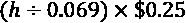
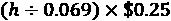
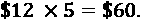
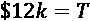
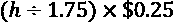
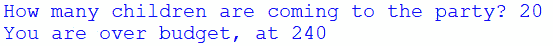
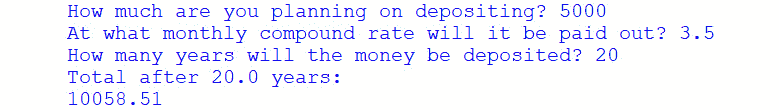

# *第二章*：计算思维要素

上一章提供了一些关于计算机科学基础的一般信息。在本章中，我们将更密切地关注理解计算思维和构成计算思维的要素：分解、模式识别、模式概括或抽象以及算法设计。

计算思维过程的重要性不容低估。通过这个过程，我们分析问题，根据一组条件设计出最佳可能的解决方案。虽然可以编写许多算法来回答相同的问题，但使用计算思维过程有助于我们确定最佳路径，从而设计出可以推广的清晰算法。

在本章中，我们将介绍以下主题：

*   理解计算思维
*   分解问题
*   识别模式
*   概括模式
*   设计算法
*   其他问题

为了了解更多关于计算思维的知识，我们将从一个问题的角度来看待这些元素。请记住，我们将在[*第 8 章*](08.html#_idTextAnchor114)、*Python 简介*中对 Python 编程语言进行更深入的研究，但您可以根据需要来回阅读该章，同时深入阅读本书的本章和所有其他章节。

# 技术要求

您将需要最新版本的 Python 来运行本章中的代码。您可以在此处找到本章中使用的完整源代码：[https://github.com/PacktPublishing/Applied-Computational-Thinking-with-Python/tree/master/Chapter02](https://github.com/PacktPublishing/Applied-Computational-Thinking-with-Python/tree/master/Chapter02)

# 理解计算思维

在其最基本的定义中，计算思维是一个解决问题的过程。就像设计思维、科学方法和其他类似的方法一样，我们需要经过许多步骤才能找到解决方案。例如，科学方法有七个步骤。请记住，对科学方法有多种解释，有些解释在步骤数量上有所不同。在本次讨论中，我们将使用以下七个步骤：

1.  **问题**
2.  **假设**
3.  **材料**
4.  **实验**
5.  **结果**
6.  **结论**
7.  **调查结果沟通**

科学方法的建立是一个备受争议的话题，但大多数研究人员都认为它可以追溯到 10 世纪。

科学方法使人们能够观察自然世界，创造假设来检验观察结果，并通过既定的过程开发测试和结果。这种方法本身在柏拉图和亚里士多德等推动实证研究的哲学家中有一定的基础。然而，他们的方法论并不像我们今天所说的科学方法那样发达。

计算思维元素类似于科学方法。计算思维使用较少的步骤来解决与编程相关的问题，而科学方法用于实验。通过计算思维，我们推广了算法，而在科学方法中，我们能够重现结果，并将结论从样本推广到总体。

在现代，我们根据所从事的研究领域和开发的技术开发了其他方法。这方面的两个例子是设计思维过程和计算思维。

设计思维有五个步骤或阶段：

1.  移情
2.  定义
3.  构思
4.  原型
5.  测验

我们使用上述阶段来了解客户、类、问题、情况或其他我们需要解决的情况的需求。同情用户的需求有助于我们识别和定义问题。构思和原型阶段是我们创建可能解决方案的地方。测试可能的解决方案是找到最佳解决方案的下一步。在所有阶段之后，如果需要，我们可以返回到整个循环中，因为设计思维过程的目标不是完美，所以可以始终进行额外的工作。设计思维的目标是为已定义的问题提供有效且合理的解决方案。这不是唯一可行的解决方案，也不是完美的。

在计算思维中，我们使用了一个类似的过程，它有四个要素：

1.  **分解**
2.  **模式识别**
3.  **抽象**
4.  **算法设计**

与设计思维过程一样，这个问题在计算思维中没有明确定义。这些问题有时被称为*定义不清*。我们面临着一系列的环境，在我们开始构思或根据我们所看到的模式创建可能的解决方案之前，我们定义或分解了这个问题。当我们思考计算思维过程时，我们真正做的是试图找出如何让计算机遵循一系列步骤来解决我们遇到的问题。

让我们来看看一个简单的计算思维问题。

## 问题 1-条件

让我们想象一下一个电台的抽奖让参赛者从两种可能的获奖结构中选择一种：$250 或参赛者的身高（以四分之一为单位）现金。

一个计算思维问题可以像*问题 1*一样模糊，甚至没有人提出任何问题。你会得到一组条件，你的工作是确定问题是什么，并为你自己定义的问题找到解决方案。如果你仔细想想，这个问题没有完美的答案，但是你可以通过一些方法创造条件，根据参赛者的身高来确定哪一个选项确实是最好的。

为了**分解**这个问题，我们需要看什么是陈述的，什么是未陈述的。我们需要规则。

简单地说，胜利者将选择一种货币支付方式：要么是 250 美元现金，要么是相当于他们在四分之一季度的身高。这些事情都说了。但未说明的内容也很重要：

*   *抽奖活动的时间表是什么？**有多少名优胜者？*
*   *我们是否要跟踪每位选手选择后我们花了多少钱？*
*   *我们是否希望使用基线进行比较？*

可能会想到其他一些事情，但现在，让我们坚持这些问题。我们将假设抽奖活动没有固定的开始或结束日期，电台可能会在给定的一天内选择多个获奖者，或者根本没有。这些是我们在找出模式、概括模式和设计算法时要考虑的一些因素。

考虑到所有关于支出的信息，我们仍然无法确定何时支出更大。*选择 250 美元是最好的选择吗？**还是最好选择四分之一的高度？**我们能否创建一个算法，告诉我们哪种选择最好？*是的，我们可以创建一个解决整个问题的算法。

这个问题的**模式**总是一样的：金额是为现金价值设定的，四分之一的高度是设定的，所以我们总是可以用数学计算出四分之一的高度根据某人的身高换算成金钱。

如果我们知道一些事情，我们可以根据每个选择清楚地说明赢款情况。这包括*选择现金或选择宿舍高度*。如果选择四分之一的高度，我们需要：

*   选手的身高
*   四分之一的厚度

接下来发生的是**模式**和**抽象**的部分。在每位参赛者做出决定之前，我们不知道选择，但我们可以提前了解每个季度的厚度。我们的算法稍后将需要它。每四分之一的厚度约为 0.069 英寸或 1.75 毫米。

重要提示：

在本书中，我们将使用常规测量，例如英尺和英寸。然而，也将提供度量测量的算法。

从我们的问题来看，我们可以用两种方式来陈述赢款情况。以下关于季度奖金中的高度的表达式是**数学算法**。它们显示了根据参赛者的身高确定总奖金所需的步骤。

注意为了使用惯用算法，需要以惯用单位给出高度。为了使用公制算法，需要以公制单位给出高度。如果参赛者选择现金，那么总奖金仅为 250 美元。如果参赛者选择以四分之一为单位的高度，则习惯单位和公制单位的算法如下：

*   总奖金（惯例）：
*   总奖金（公制）：

我喜欢赌注不高的赌博。所以，我要说的是，我想测试一下，用我自己的身高。因此，我没有拿 250 美元，而是选择在四分之一的硬币里找出我的身高。我身高 5 英尺 10 英寸。让我们计算出这是多少英寸。因为我们一英尺有 12 英寸，总高度的算法如下所示：


但我说我身高 5 英尺 10 英寸，所以我们需要再加上这 10 英寸：


现在，让我们使用前面定义的数学算法，来了解我会赢多少：


我使用了符号而不是=因为表示这是一个近似值。因为我四舍五入了，我想确保我证明了这是最好的近似值，而不是确切的数字。

也许你现在已经解决了这个问题，但在计算思维中，我们必须经过抽象并设计一个适用于所有实例的算法。我们可以创建一个非常简单的程序，使用用户的简单输入，或者我们可以创建一个更复杂的程序，不仅提供基本的总数，还可以提供总和、图形，或者我们发现与我们的场景相关的、适用于所有情况的任何其他内容。

一旦我们更深入地了解了计算思维过程的每个部分，我们将再次设计这些算法。我们甚至会回到这个问题来展示如何创建算法，让计算机为我们运行。我们可以创建一个算法，让我们利用某人的身高来决定使用哪种奖金。

或者，如前所述，我们可以使用 250 美元作为每位参赛者的奖金，编写一个基线，然后输入每位参赛者的选择，以查看我们是否低于或高于 250 美元的基线。我们可以汇总这些结果，这意味着继续添加这些结果，看看一旦广播电台停止抽奖，我们会在哪里结束。我们甚至可以有一个图形来显示我们随着时间的推移所处的位置，如果电台举办抽奖活动的时间越长，参赛者的选择就不同，等等。

在本节中，我们学习了计算思维的要素。我们还研究了一个计算思维问题。

然而，现在，让我们继续更深入地研究计算思维的要素，即分解、模式识别、模式概括和抽象以及算法设计。

# 分解问题

**分解**是分解数据的过程。它可以包括解决问题所需的许多过程或步骤。通过分解问题，我们可以在概括模式之前确定问题的组成部分或更小的部分。

通过分解，我们可以识别并解决一种情况，然后将这些步骤推广到问题的所有可能实例。为了真正理解分解，我们需要回到前面提到的问题，简单地说，就是问这样一个问题：*如果我用四分之一来衡量我的身高，我的身高会带来更多的钱吗？还是我应该拿 250 美元的奖金？*我们可以说，我们想知道一个实例，然后在数学上做一次这个问题，比如只为我自己的身高解决这个问题。但是，我们可能需要其他实例的信息。我们可以创建一个程序，只确定哪一个选项是最好的，250 美元或你的身高（以四分之一为单位）。或者我们可以考虑以下几种情况，这意味着采用不同的算法：

*   我们可以检查给定高度的选项，但也可以将每个项目添加到列表中，以便跟踪所有决策。
*   我们还可能需要该列表中的数组和元素之和来跟踪整个比赛的花费。
*   我们还可以将金额与基线进行比较，每个人的基数为 250 美元。
*   我们还可以使用所有元素，例如列表、总和、比较和可视化图形显示来更好地理解和跟踪结果。

正如您所见，算法将取决于我们想要跟踪或回答的问题。我们的算法可能是一个简单的是或否类型的问题，我们只需检查哪个选项是最好的，也可能是一个更健壮的算法，跟踪数据和数据的可视化表示。现在让我们来看看我们如何在我们的问题中找到模式。

# 识别模式

**模式识别**是一个过程，一旦我们对问题进行分解，就会发现相似性或模式。在*问题 1*中，我们看到了一个问题，参赛者将赢得 250 美元或选择在四分之一个硬币内测量身高。这对每个参赛者都是一样的。唯一的区别是，总值根据人的身高而变化。

在这一节中，让我们看一个不同的问题，以便更好地理解模式识别。

## 问题 2——数学算法和泛化

想象一下你正在为一个足球队准备一个聚会。这是一个社区团队，所以总是有 12 到 15 个孩子路过。你想订购你需要的食物。你知道这将花费你从你将使用的餐饮公司每名儿童 12 美元。现在，让我们来分析一下问题：

*   **分解**：我知道我们有 12 到 15 个孩子。我们也知道每个孩子要花 12 美元。我们的问题可以被认为是一个问题：*我们如何估算成本？*
*   **模式识别**：你知道孩子的数量*k*在 12 到 15 之间。你知道这要花 12 美元。例如，如果我有 5 个孩子，成本将为
*   **模式泛化**：孩子的数量未知，因此我们将使用变量*k*来表示未知值。这样，不管我们有多少孩子，我们都可以算出总成本。我们从一个病例，5 名儿童，推广到所有病例，*k*儿童。
*   **算法设计**：我们现在编写数学算法。我们将在[*第 3 章*](03.html#_idTextAnchor056)*理解算法和算法思维*中进一步研究可编程算法。我们也将在那里重温这些数学算法。总成本将由等式给出，其中*T*为总成本，*k*为儿童人数。

从前面的问题可以看出，为了找到一个广义模式并编写我们的算法，模式识别非常重要。现在，让我们更仔细地研究模式泛化。

# 概括模式

一旦我们识别了我们的模式，我们需要经历**模式泛化**和**抽象**。也就是说，我们希望确保我们提出的解决方案可以用于我们已经确定的问题的多个实例。模式泛化可以像编写一个基本的线性数学算法一样简单，就像我们为一个聚会的费用所做的那样，每个孩子的费用是 12 美元。因此，任何数量的*k*儿童的费用将由 12*k*给出。但是模式泛化可以远远不止于此。

如果我们回到*问题 1*，您可以选择 250 美元，或者您可以选择四分之一的身高，我们的模式**概括**将允许我们按照顺序检查每个人的身高是否与 250 美元相对来决定你是选择现金还是选择季度来获得更多的钱。

**抽象**让我们专注于我们需要的东西，抛弃我们不需要的东西，以便为我们的问题创建最佳算法。现在，根据我们决定需要什么，我们可以添加或删除一些条件。

例如，如果我是一名选手，我只想知道哪个选项能给我更多的钱。我不关心总的胜利，谁选择 250 美元，谁选择身高，等等。但是如果我是电台，我可能想知道总数，与基线的比较，以及更多。我将不得不选择基线，甚至可能以图形方式显示随着时间的推移发生了什么。这都是抽象过程的一部分。当你在解决一个计算思维问题时，你也在决定什么对你的解决方案和算法重要，什么对你的解决方案和算法不重要。

在这个问题的最简单形式中，如果你是一名参赛者，你想知道你的最佳获胜案例是什么。如果你选择 250 美元，但你的身高使你的身高超过 250 美元，你会想知道。如果你在电台工作，你可能想要追踪的不仅仅是每一个获奖者。抽象使您能够适应所有情况，从做一个数学问题到创建一个能够跟踪所有参赛者所有选择的算法。现在让我们看看如何创建这些算法。

# 设计算法

正如本章前面提到的，*算法*是一组指令。当我们在编写一个计算机程序时，算法是给计算机的一组指令，因此它可以提供一个问题的解决方案。到目前为止，我们一直坚持使用数学算法，只是因为我们还没有深入研究 Python。然而，我们现在将把一些算法转换成 Python 编程。

首先，让我们看一下问题 1。在这里，我们有一个情况，你可以赢得 250 美元或你的身高在四分之一。假设是你在竞争，你会想知道哪个选项给你的奖金最多。

让我们再来看看本章前面的数学算法：

*   总奖金（惯例）：
*   总奖金（公制）：

请记住，如果您使用的是惯用单位的高度，则将使用第一种算法。如果使用公制单位，则需要相应地调整程序。

在编程时，我们需要定义变量。在本例中，`h`是我们用于高度的变量。但是想想看；如果你是成年人，你的身高可能不会改变，但为了便于争论，我们假设它并不总是一样的。因此，我们需要任何想知道最佳选择是 250 美元还是 25 美分的人输入他们的身高，以便程序为他们提供答案。

**输入**是用户可以输入的内容。所以，当我们定义变量时，我们将请求输入。Python 和任何其他语言中的一个良好实践是，不要在没有指导的情况下只要求输入。也就是说，我们想告诉用户他们正在回答的问题。例如，我可以编写以下代码来询问用户的身高输入：

```py
h = input("Enter your height in inches: ")
```

前面的代码将要求用户输入一些输入。它还要求用户以英寸为单位输入信息。如果您使用的是公制单位，那么您应该声明它。

我们还将信息保存为变量`h`。但是我们还没有对这个变量做任何处理。

我们只需做基本的数学运算，然后打印出基于高度得到的值：

```py
h = input("Enter your height in inches: ")
total = (int(h)/0.069)*0.25
print(total)
```

请注意，在前面的代码片段中，我们在`total`变量的定义中使用了`int(h)`。我们将`h`值转换为整数，以便使用该变量执行数学运算。当我们请求输入时，变量被保存为字符串，这就是为什么我们需要转换它才能使用它。

使用我的身高（70 英寸）运行前面的代码会得到以下结果：

```py
253.62318840579707
```

如果我们将答案四舍五入，看起来会更好，Python 有一种方法可以让我们轻松做到这一点。如果我们调整如下所示的打印代码，我们的回答将导致`253.62`：

```py
h=input("Enter your height in inches: ")
total = (int(h)/0.069)*0.25
print(round(total,2))
```

当我运行此程序时，窗口如下所示：


图 2.1–Python 程序输出

但有时我们希望代码做得更多。让我们删除`print`命令并创建一些条件。在接下来的几行中，我们将使用提供的值进行一些比较。例如，我们可以让电脑帮我们检查一些东西。有三种可能性：

*   我们的身高可以产生与 250 美元完全相同的收益。
*   我们的身高可能不到 250 美元。
*   我们的身高可以带来 250 美元以上的收入。

现在，我将要求计算机根据这些条件告诉我该怎么做。我们将需要一份**如果 elif**，则需要**否则**的声明。这些是我们将测试的条件，以便获得更好的输出。我们将测试总数是否与 250 美元相同。否则，如果总数少于 250 美元，我们将希望计算机做些什么（这是我们的`elif`声明）。最后，在所有其他情况下，我们将使用`else`命令：

```py
h=input("Enter your height in inches: ")
total = (int(h)/0.069)*0.25
total = round(total,2)
if total == 250:
    print("Your height in quarters is the same as $250.")
elif total > 250:
    total = str(total)
    print("Your height in quarters is more than $250\. It is $" + total)
else:
    print("You're short, so choose the $250.")
```

让我们看看一些测试用例是什么样子的。

首先，让我们使用**69**英寸的高度：


图 2.2–案例 1：高度收益 250 美元

因此，任何 5 尺 9 寸的人都不会在任何一个选择上出错，因为他们最终将赢得 250 美元。

现在，让我们看看我的身高，**70**英寸：


图 2.3–案例 2：高度收益超过 250 美元

最后，让我们看一看小于 69 英寸的高度，所以让我们使用**55**英寸：


图 2.4–案例 3：高度收益低于 250 美元

请注意，我们可以调整代码，使其符合我们的要求。我选择使用完整的句子来确定结果，但您可以根据需要调整代码以满足您的需要或偏好。有些代码在这一点上可能很有挑战性，但我们将在[*第 8 章*](08.html#_idTextAnchor114)*Python 简介*中对 Python 编程语言进行更深入的研究。

如你所见，我们有三种算法为我们提供相同的信息。一种算法比另外两种算法更健壮，但我们的算法复杂或简单程度取决于我们需要从中得到什么。如果你以后再次举办抽奖活动，你可能已经忘记了算法是什么，你是如何编写的，或者一切都意味着什么。但是，对于最后一段代码，只需运行它就可以获得大量信息，这比前两段代码更有用。您也可以在代码中添加所有这些信息作为注释，但我们将在[*第 8 章*](08.html#_idTextAnchor114)*Python 简介*中讨论这些信息。

还请记住，我们运行这个，就好像我们是参赛者一样。虽然这是有帮助的，你可能想考虑如果你是电台，你会做出什么样的改变。您可以编写一些代码来保存所有运行的实例，这样您就可以检查并添加所有赢款。你甚至可以通过代码计算出这个总数。由于代码有点复杂，我们将在整本书中，更具体地说，在[*第 8 章*](08.html#_idTextAnchor114)*Python 简介*中，对其进行更多的讨论。

现在，让我们来看看更多的问题和各自的算法，以便让计算思维过程更舒服。

# 其他问题

在整个这一节中，我们将关注其他问题。对于*问题 2*，我们将直接讨论算法，正如我们在本章前面讨论的问题中的其他步骤一样。下一个问题也将涉及整个计算思维过程。

## 问题 2-儿童足球派对

在这一章的早些时候，我们计划为一个足球队举办一次聚会，每个孩子的费用为 12 美元。我们说孩子的数量是未知的，所以我们将使用变量*k*来指定未知的数量。我们还说我们有一个数学算法，T=12*k*，它给出了*k*儿童的总成本 T。让我们在这里添加一个条件。如果我们有一个 200 美元的预算，我们想知道我们是否超过、低于或正确的预算。

我们也可以使用 Python 为这种情况编写算法：

```py
k = int(input("How many children are coming to the party? "))
T = 12 * k
if T == 200:
    print("You are right on budget, at " + str(T))
elif T <= 200:
    print("You are under budget, at " + str(T))
else:
    print("You are over budget, at " + str(T))
```

让我们测试一些案例，以验证我们的代码是否正常工作：


图 2.5–案例 1：12 名儿童参加派对

*太好了！*如果有 12 名儿童参加，我们的预算不足。那么，*如果 20 个孩子参加怎么办？*我们来看看：



图 2.6–案例 2：20 名儿童参加派对

*我们没有足够的钱给 20 个孩子！*

正如您所看到的，该计划为我们提供了一些关于总额以及我们是否超出或低于预算的信息。与任何算法一样，这不是我们编写程序以获取这些信息的唯一方法。尝试使用不同的算法来解决这个简单的问题，或者添加一些自己的条件并编写代码。实践和添加条件将使您能够更轻松地设计和编写算法。

## 问题 3——储蓄和利息

现在我们有了一个新问题。银行以每月*x*%的利率支付复利。*如果您存入任何给定金额，几年后的支出是多少？*

让我们分解这个问题。首先，我们知道利息按月复利。我们来谈谈复利。投资的利息是在一段时间内支付的百分比。复利是指每次支付的初始金额加上利息。复利是一种**模式**。事实上，一个公式是存在的。

我不知道的是银行支付的百分比，或者存款金额，或者存款年限。因此，我们需要编写一个程序来解决所有的可能性。这是**模式泛化**。我们所知道的是利息按月复利。这实际上有一个数学公式：


让我们来谈谈前面等式中的项：

*   *A*为总金额。
*   *P*为本金金额，即初始存款。
*   *r*是利率（请记住，对于 3%，利息写为 0.03，例如）。
*   *n*是每年复利的次数。
*   *t*是存款未被触及的年数。

因为有一个数学算法，我们现在可以用这个公式为它创建一个程序。但是，我们需要确保运行该程序的人知道我们要求所有输入的内容。我们的要求是：

*   *存款金额是多少？*
*   *银行支付的利率是多少？*
*   *这笔钱要存多少年？*

我们确实知道公式中的*n*。*n*是 12，因为这是每月的复利。这意味着它将每年复合 12 次。所以，*n*=12。

现在是时候为此编写程序了：


图 2.7——复利示例程序

前面的屏幕截图向我们展示了用于复利的 Python 程序。注意注释，前面有`#`符号。它说明我们需要转换速率以使用公式。否则我们会得到一个不正确的总数。此外，我们在这里使用浮点，因为我们需要使用小数。整数或`int`不能提供我们所需的信息。此外，我们将总数四舍五入到小数点后两位。这是因为我们在谈论钱时使用了两位小数。*图 2.7*所示算法的文本包括如下内容：

```py
P = float(input("How much are you planning on depositing? "))
r = float(input("At what monthly compound rate will it be paid out? "))
t = float(input("How many years will the money be deposited? "))
#Convert the rate to a decimal for the formula by dividing by 100
r = r/100
A = P * (1 + r/12)**(12*t)
A = round(A, 2)
print("Total after " + str(t) + " years: ")
print(A)
```

使用复利算法中的代码，我们可以运行任何可能的复利实例，如果我们有初始金额、利率和我们将为其存款的年数。按 4.5%的利率，初始存款 1000 美元，为期 10 年，项目产出如下：


图 2.8–示例 1：复利的产出

如你所见，10 年后，按每月 4.5%的复利计算 1000 美元的存款总额为 1566.99 美元。

让我们再测试一次程序。这一次，我们将以**3.5**%的月复利率在**20**年内存入**5000 元**：



图 2.9–示例 2：复利的产出

20 年后，我们的总额为 10058.51 美元。*这意味着我们的钱翻了一番！*

有了这个计算器程序，我们只能每月计算复利。我们可以创建一个新程序来计算任意利率的复利：每月、每年、双月，等等。您可以尝试使用这些代码来创建计算器。如果你想知道在投资或存入储蓄账户时会发生什么，这些都很有用。例如，您可以确定存款达到一定金额需要多长时间。假设你想要 50000 美元供孩子上大学。在这种情况下，你可以计算出你需要存多少钱才能在 18 年内拿到这笔钱，而他们很可能已经准备好上大学了。

# 总结

在本章中，我们经历了计算思维过程。我们学习了计算思维的四个主要元素：分解、模式识别、模式泛化和算法设计。我们还了解到，计算思维中的问题并不总是明确定义的。我们有责任解释和分解信息，以便找到模式。一旦我们找到了模式并定义了我们想要推广的东西，我们就可以设计算法来解决我们的问题。

我们还了解到，算法和解决方案并不是唯一的。有多种方法可以为我们遇到的每个问题编写算法。计算思维过程允许我们以多种方式探索问题，并创建符合我们自身解释和需求的解决方案。

在下一章中，我们将更深入地学习算法和算法思维，因为它们是所有计算思维问题的产物。为了更好地理解算法，我们将研究布尔运算符，并学习如何识别和解决逻辑处理中的错误。我们将为提出的问题编写算法，并分析给定算法在处理过程中可能出现的错误。