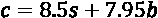

# *第三章*：理解算法和算法思维

在本章中，我们将更密切地关注理解算法和算法思维。虽然这是计算思维过程的最后一步，但我们必须了解算法思维如何帮助我们更好地规划和理解问题。也就是说，我们越是练习算法设计和算法思维，当问题呈现给我们时，就越容易理解、分解和识别模式。

在本章中，我们将介绍以下主题：

*   深入定义算法
*   设计算法
*   分析算法

阅读本章后，您将更好地理解算法。因此，我们将从再次分析算法的定义开始，这是我们之前在[*第 2 章*](02.html#_idTextAnchor043)*计算思维的要素*中介绍的，以及如何设计数学和计算算法。

# 技术要求

您将需要最新版本的 Python 来运行本章中的代码。您可以在此处找到本章中使用的完整源代码：[https://github.com/PacktPublishing/Applied-Computational-Thinking-with-Python/tree/master/Chapter03](https://github.com/PacktPublishing/Applied-Computational-Thinking-with-Python/tree/master/Chapter03)

# 深入定义算法

正如我们在[*第 2 章*](02.html#_idTextAnchor043)*计算思维要素*中提到的，一个**算法**只是一组指令。我们在日常生活中使用指令，有时有意识，有时无意识。比如，想想你早上的日常生活。闹钟响了。*你接下来做什么？**你去准备咖啡吗？**淋浴？**先刷牙吗？*

我们大多数人每天早上都遵循同样的步骤。你可以说我们已经为自己设定了遵循这些步骤的程序。现在想一想，你的日程改变了，你的日程安排也不同了。我知道因为我的*程序*不再工作，我不得不停下来重新组合很多次。例如，我不能在早上 6 点起床乘坐早上 5 点的航班。

计算机的算法与之类似，如果一组条件发生变化，我们需要重新编程指令集。程序只能运行到我们为其指定的参数为止。大多数程序无法调整或适应任何以前未编码到其中的新信息。也就是说，**机器学习**和**人工学习**正在进化。我们并不是在讨论这些类型的程序，但即使在这些情况下，我们仍然需要调整这些程序，使其达到我们需要的效果。

为了设计算法，我们需要确保它们满足一些特定的特性：

*   **它们是明确无误的。**
*   **他们有定义良好的输入。**
*   **他们有明确定义的输出。**
*   **它们具有有限性。**
*   **它们是可行的。**
*   **他们独立于语言。**

让我们看看前面列表中的每个特征，并定义它们。

## 算法应清晰明确

当每一个步骤都易于理解、易于定义，并且输入和输出也清晰明确时，算法就是清晰明确的。算法的每个组件也应该只有一个含义。

## 算法应具有定义良好的输入和输出

**为算法输入**可以由用户提供，这意味着程序的用户输入数据。输入也可以指程序中定义的某个。这意味着我可以包含一个已经提供了设置值的变量。

例如，如果我需要一个用户告诉我他们购买的车票数量，我可以编写算法来请求输入。我还可以将该输入作为已定义的变量，并且已经具有给定的值。算法并不总是需要输入——零输入算法确实存在——但当算法需要输入时，定义输入很重要。输入的一个例子是在程序中询问用户名。想想现代电子游戏吧。他们中的许多人会用短语提示用户输入姓名，例如，*“你好，旅行者，你叫什么名字？”*

作为一个用户，当给出提示时，我会输入`Sofia`，这会给我以下信息：

```py
"Hello Sofia. Welcome to the adventure!"
```

正如您所见，游戏将生成一个输出，并在该输出中使用我的名字。

最后一行是程序的**输出**。我也可以用 Python 编写一个简单的程序来问这个问题：

ch3_namepropt.py

```py
name = input("Hello traveler. What is your name? ")
salutation = "Hello %s. Welcome to the adventure!" % name
print(salutation)
```

注意，我们在这里使用了`%s`和`%`符号。这里的语法就是我们所说的 f 字符串。我们使用`%s`语法让程序知道我们要在哪里插入信息，然后使用`%`符号调用该信息。在本例中，我们将输入保存到`name`变量，然后在`salutation`变量中调用它。

运行时，程序如下所示：

```py
Hello traveler. What is your name? Sofia
Hello Sofia. Welcome to the adventure!
```

这个简单的算法允许我们将名称保存为变量。这个变量在这个简单代码的输出中只使用了一次。但是，在游戏中，该名称变量可以在多个实例中使用，例如在与游戏中的角色对话期间，等等。

程序的**输出**是离开系统的信息，即程序的产品。给定一些信息或代码，输出是由程序中的指令产生的。

## 算法应该具有有限性

算法必须具有**有限性**。这意味着算法必须结束。让我们来看一个算法不会结束的情况。**我不建议写这个或运行它！**尽管如此，让我们看看创建此算法的步骤：

1.  定义一个变量`i`，并将其设置为等于`0`：

    ```py
    i = 0
    ```

2.  Increase the value by `1`. There are a few different ways we can do that:

    ```py
    i = i + 1
    i += 1 
    ```

    前面两行代码都会将`i`的值增加`1`。

3.  *Add an error!* We're about to create an error in finiteness. Again, I'm only doing this to prove a point, but this is an error you want to avoid:

    ```py
    i = 0
    while i >= 0:
        i += 1
        print(i)
    ```

    在这个算法中，我告诉程序继续增加`i`乘以`1`，只要它大于`0`，那么计算机就应该打印这个值。这将永远持续下去，不会停止，因为条件将始终保持不变。因此，程序的输出将从 1 开始，但将继续打印序列中的下一项，如 2、3、4、5 等。这个计划根本没有办法结束。

现在，一个类似的程序可以在几个不同的条件下完成。假设我们想要打印加法的所有值，但前提是`i`小于 15：

ch3_ 有限性.py

```py
i = 0
while i < 15:
    i += 1
    print(i)
```

前面的程序是终止程序。当`i`小于`15`（不包括 15）时，它现在只适用于所有值。我们将得到如下输出：


图 3.1–有限性代码的输出

我知道我说这个节目不包括 15 个。没有。由于这是在`i`小于 15 时发生的，因此它将计算的最后一个值是 14。但是，它表示，虽然该值小于 15，但我们将其增加 1（`i += 1`。因此，当`i`为 14 时，打印值为 14+1，或 15。有限性允许程序终止。

## 算法必须是可行的

算法也必须**可行**。为了可行，算法需要有可用的内容和资源。在编写算法时，我们有可能写入步骤的约束或条件。如果没有办法满足所有的约束条件，那么该算法就不可行。考虑以下两个条件：

*   现在是下午 3 点。
*   现在是下午 5 点。

例如，如果我们在一个变量上同时设置这两个约束，那么这是不可能的。不可能同时是下午 3 点和 5 点。这就是我们所说的**不可行**。虽然算法可以继续，但我们仍然在通过同时实现这两件事来制造问题。某些约束永远不会满足，因此该算法被认为是不可行的。为了使算法可行，必须有一种方法使算法满足所有约束条件。此外，如果一个算法被编写成依赖于未来的技术，例如，它也被认为是不可行的。

## 算法与语言无关

最后，算法必须是**语言独立的**。算法中的指令集应尽可能简单地编写。一个好的算法应该能够很容易地用任何语言编写并产生相同的输出。

在本节中，我们学习了算法以及设计算法所需的特性。记住一个好的算法的特性将允许我们避免错误，并为我们遇到的任何问题创建有效的算法，现在让我们看看如何设计一些算法。

# 设计算法

在设计算法时，顺序很重要。当我们使用编程语言时，层次结构很重要。这包括我们使用 Python 的时候。把这看作是数学中的运算顺序。如果您还记得的话，我们使用助记符号**PEMDAS**来记住数学中的运算顺序。**PEMDAS**代表**括号**、**指数**、**乘除**和**加减**。

我这样写**乘法/除法**，因为乘法和除法的权重相同。也就是说，乘法不一定要在除法之前发生。如果我先除法，然后从左到右乘法，那么除法首先发生。加减法也是如此。两者的重量都不大于另一个，因此我们按照从左到右的顺序执行它们。

让我们为一个问题写一个数学算法。我们将研究食物环境中的算法。是的，我知道我写了很多关于食物和食物算法的文章。我爱食物几乎和我爱代码一样多。

## 问题 1——办公室午餐

一个办公室正在为员工订购餐饮。员工有两种午餐选择：三明治或沙拉。每顿三明治要 8.50 美元，而每顿沙拉要 7.95 美元。

### 办公午餐数学算法

选择每个选项的员工人数未知。让我们使用一些变量来帮助我们设计数学算法。我们用*s*表示三明治的数量，用*b*表示沙拉碗的数量。我知道你在想什么，如果你从现在开始回到这个问题上，这两个变量并没有多大帮助。但我们一会儿再谈。现在，让我们写下我们的总成本，*c*是什么样的：



这是一个简单的数学问题，需要两个未知变量输入，*s*和*b*，才能得到我们的总数，*c*。现在，让我们看看同一午餐场景的不同版本。

### Office 午餐 Python 算法

现在让我们在编写程序时考虑更多的注意事项。当我们为这个问题设计 Python 算法时，我们需要考虑两个方面：程序员和用户。

有时我们既是程序的程序员/开发人员，又是程序的最终用户，但很多时候，我们会编写或开发内容供其他人使用。我们必须牢记这些注意事项，因为这可能会影响我们编写程序和定义变量的方式。此外，如果我们作为公司的一部分编写程序，其他人可能需要在某个时候去编辑我们的程序。

这意味着我们需要以其他人能够理解的方式编写程序。我们的变量应该易于理解，因此编写一个简单的单字母变量可能会使其他程序员或用户更难理解。让我们来看一个针对*问题 1*的程序。回想一下，在这个问题中，我们试图确定员工办公室午餐的最终成本，给出两种可能的选择：

*   一顿三明治饭 8.50 美元
*   沙拉餐 7.95 美元

让我们使用 Python 为这个问题创建程序。让我们先澄清一些变量。我们将使用完整的单词或一系列由*分隔的单词来定义这些变量。在开始之前，您可能想回忆一下**Python 变量**需要遵循一些规则，以免导致错误：*

 **   变量必须以字母或下划线（*开头）。*
**   变量只能包含字母、数字和下划线。*   变量不能以数字开头。*   变量区分大小写（*α*与*α*或*α*的变量不同）。*

 *对于*问题 1*，我们需要三个变量：

*   午餐的总费用
*   三明治午餐的数量
*   沙拉餐午餐的数量

现在我们需要给他们命名：

*   `total_cost`=所有午餐的总成本
*   `number_of_sandwiches`=订购的三明治餐总数
*   `number_of_salads`=订购的沙拉餐总数

这里重要的是，这些变量很容易读取和理解。我应该注意，在编程时我偏爱小写变量。我确实有一些例外，当我喜欢使用大写字母时，但你会看到许多例子只有小写字母和下划线。很久以前我发现，即使在我编写程序时大写字母对我来说是有意义的，我后来也会忘记哪些字母是大写的，这只是一个额外的头痛问题，如果我只使用小写字母就可以避免。

此外，一些程序员消除下划线，并使用变量，例如`numberofsandwiches`或简单的`sandwiches`。当然，这两者都是可以接受的，而简单的`sandwiches`将使编写一些代码变得更容易。然而，这样做既有好处也有坏处。如果其他人正在查看该程序，可读性将非常重要。正如我所说，我倾向于使用清晰、小写的变量和下划线，但这取决于每个程序员自己做出选择。

现在我已经定义了变量，可以开始编写程序了。*我需要向用户询问什么？*我需要用户输入**三明治数量和沙拉数量。我想要的**输出**，或者用户想要的输出，是午餐的总成本。要在 Python 中请求用户输入，我们需要使用`input`命令。但是，我们还需要记住，由于我们在使用`float`数字（小数是浮点字符）的算法中使用该数字，因此我们需要将提供的数字转换为`integer`或`float`。员工将无法订购半份沙拉，因此我们可以安全地将其保存为整数或`int`。作为提醒，Python 中的注释以`#`符号开头。在空闲状态下编写代码，如下所示：**

ch3_officelunch.py

```py
#Ask the user for the number of sandwich meals ordered and save as variable.
number_of_sandwiches = int(input("How many sandwich lunches were ordered? "))
#Ask the user for the number of salad meals ordered and save as variable.
number_of_salads = int(input("How many salad lunches were ordered? "))
#Create total_cost variable and save the algorithm for total the new variables.
total_cost = 8.50 * number_of_sandwiches + 7.95 * number_of_salads
#Print the total cost. Don't forget to convert the total_cost to string. 
print("The total cost for the employee lunch is $" + str(total_cost) + ".")
```

当运行代码时，用户可以输入办公室午餐的每个选项的编号。代码首先询问用户三明治的数量，如下所示：

```py
How many sandwich lunches were ordered? 
```

代码将询问沙拉午餐的数量并提供总成本。以下示例包含 12 份三明治午餐和 23 份沙拉午餐，总成本为 284.85 美元：

```py
How many sandwich lunches were ordered? 12
How many salad lunches were ordered? 23
The total cost for the employee lunch is $284.85.
```

现在让我们来看一个类似的问题，但是从另一个角度来看。

## 问题 2——餐饮公司

比方说你开了一家简单的餐饮公司。你开始只卖两种选择，一种三明治餐 8.50 美元，一种沙拉餐 7.95 美元。可以使用 Python 字典创建存储这些选项的程序。

您可以在[*第 8 章*](08.html#_idTextAnchor114)、*Python 简介*中找到有关 Python 编程语言和词典的更多信息，但我们也将在这里定义 Python 词典。当我们需要无序、可以更改和索引的项时，可以使用字典。下面是我们餐饮公司的 Python 词典示例：

ch3_cateringdict.py

```py
catering_menu = {
    "sandwiches": 8.50,
    "salads": 7.95
    }
print(catering_menu)
```

现在，字典很常见并且非常有用，原因有很多：首先，它们很容易阅读，并且提供了一种根据需要更改数据的方法。

打印时，字典代码如下所示：

```py
{'salads': 7.95, 'sandwiches': 8.5}
```

既然你有了一本字典，让我们谈谈它对你的餐饮公司的用处。比如说，你想通过改变沙拉的价格来解释沙拉原料的成本增加。你可以用几种不同的方法来实现。您可以在原始程序中更改它，因为它很短，或者您可以根据密钥告诉程序您要更改的内容。这一点很重要，因为您现在可能有两种商品出售，*但当您的菜单选项变得更宽时会发生什么？**您是否希望在每次更改价格时搜索每个项目？*Python 使您能够轻松确定要更改的内容，然后进行更改。

为此，可以使用以下代码：

```py
catering_menu["salads"] = 9.50
```

Python 中的新代码如下所示：

ch3_cateringdict2.py

```py
catering_menu = {
    "sandwiches": 8.50,
    "salads": 7.95
    }
catering_menu["salads"] = 9.50
print(catering_menu)
```

打印时，沙拉的新值将显示：

```py
{'salads': 9.5, 'sandwiches': 8.5}
```

*但是，如果要添加菜单项，会发生什么情况？*假设您想以 3.75 美元的价格添加汤选项。在这种情况下，您可以使用一行简单的代码将菜单选项添加到字典中，如下所示：

```py
catering_menu["soup"] = 3.75
```

当您将所有代码放在一起时，初始代码和更改看起来就像下面的代码块。请注意，您有初始字典，然后下面的两个更改。打印词典时，它将包括所有更改以及添加的 soup 选项：

ch3_cateringdict3.py

```py
catering_menu = {
 "sandwiches": 8.50,
 "salads": 7.95
 }
catering_menu["salads"] = 9.50
catering_menu["soup"] = 3.75
print(catering_menu)
```

现在您已经添加了`soup`项，您可以打印字典以查看完整菜单：

```py
{'soup': 3.75, 'salads': 9.5, 'sandwiches': 8.5}
```

我们可以使用字典中的信息来创建更健壮的程序，比如在线菜单、订购菜单选项等等。在本节中，我们学习了如何借助两个问题设计算法。

我们将在本书的后续章节中，特别是在*第 3 节*、*使用计算思维和 Python*进行数据处理、分析和应用时，通过其他问题来了解更多使用 Python 的开发。现在，我们将继续分析一些算法。

# 分析算法

正如本章前面提到的，当我们设计算法时，它们应该满足以下特点：

*   它们是明确无误的。
*   它们有定义良好的输入。
*   他们有明确定义的输出。
*   它们具有有限性。
*   它们是可行的。
*   他们独立于语言。

除了这些特征，当我们研究算法并分析它们时，我们希望确保我们问自己一些问题：

*   *算法是否符合我们的要求？*
*   *输出有意义吗？*
*   *是否有其他方法可以更清晰地获取相同的信息？*

在分析算法时，我们可以问自己更多的问题，但是现在，让我们来看看一些算法解决方案，并基于上述特征和问题来分析它们。

## 算法分析 1–州和首都

一名学生创建了一个算法，其中包括美国各州的列表以及每个州的大写字母，但只包括她已经研究过的州。她的算法如下所示：

ch3_ 州资本 1.py

```py
Ohio = "Columbus"
Alabama = "Montgomery"
Arkansas = "Little Rock"
print(Ohio)
```

这个程序很简单，但不易使用，在运行时也没有帮助。*是否包含所需信息？*对。*我们可以用不同的方式组织它，以便我们可以用其他方式调用信息吗？*是的。

将状态和大写字母视为键对。我们可以用字典来存储信息。您可能还记得本章前面的内容，字典可以很容易地进行调整和改编，只需添加一行简单的代码即可添加一个新键。让我们首先将前面代码中的信息转换为字典：

ch3_ 州资本 2.py

```py
state_capitals = {
    "Ohio" : "Columbus",
    "Alabama" : "Montgomery",
    "Arkansas" : "Little Rock"
    }
print(state_capitals["Ohio"])
```

注意我们现在可以通过简单地给出州名称来访问州首府的信息。此代码的输出仅为`Columbus`。*但如果您只想运行程序并要求用户输入他们选择的状态，该怎么办？*我们也可以使用现有的字典将其写入一行代码中。请看下面的代码：

ch3_ 州资本 3.py

```py
state_capitals = {
    "Ohio" : "Columbus",
    "Alabama" : "Montgomery",
    "Arkansas" : "Little Rock"
    }
state = input("What state's capital are you looking for today? ")
capital = state_capitals[state]
print("The capital of " + state + " is " + capital + ".")
```

在这段代码中，用户输入他们想要查找资本的状态。这是很有帮助的，因为您可以每次只运行代码，而不必进入其中更改要打印的代码行，这是我们必须使用`ch3_statecapitals2.py`文件中的算法来完成的。运行时，代码如下所示：

```py
What state's capital are you looking for today? Alabama
The capital of Alabama is Montgomery.
```

现在让我们首先来看一下对算法的需求。学生希望继续向课程中添加州。有了这个程序，因为它是基于字典的，所以当她需要添加另一个状态时，她可以简单地添加一行代码。例如，如果她想添加首都为得梅因的**爱荷华州**，她需要使用以下代码：

```py
state_capitals["Iowa"] = "Des Moines"
```

请看下面的代码块。注意代码在程序中的位置。我们必须将新代码放在新变量之前，否则，如果您试图运行程序并输入`Iowa`，代码将返回错误，而不是提供爱荷华州首府。

在算法中，逻辑非常重要。我们不能使用变量中未定义的已使用值。也就是说，如果在识别`Iowa`的新值之前使用了变量`state`和`capital`，则当输入为`Iowa`时，代码以错误结束。但是，如果在运行这两个变量之前添加密钥对值，代码将按预期运行：

ch3_ 州资本 4.py

```py
state_capitals = {
    "Ohio" : "Columbus",
    "Alabama" : "Montgomery",
    "Arkansas" : "Little Rock"
    }
state_capitals["Iowa"] = "Des Moines"
state = input("What state's capital are you looking for today? ")
capital = state_capitals[state]
print("The capital of " + state + " is " + capital + ".")
```

如您所见，我们可以调整代码以更好地满足我们的需要。现在让我们看一看 OpthT0.一些算法来确定它们是否会运行；也就是说，它们是否会产生错误或正确运行。

## 算法分析 2–终止还是不终止？

正如我们在本章前面讨论的，算法应该终止。也就是说，它们必须有一个结束的方法，否则会导致许多错误。让我们看一个算法并对其进行分析，以确定它是否会终止：

```py
x = 0
while x >= 3:
x += 1
print(x)
```

首先，让我们看一下变量 T0 变量的值。`x`变量以`0`值启动程序。`while`循环表示`x`值将发生变化的条件，表示当`x`值大于`3`时，增加`1`值。

此算法终止，因为它将打印变量`0`的原始值。但是，该算法不会真正执行任何操作，因为该条件永远不会满足。另外，请注意，`print`命令没有缩进。如果该变量缩进，则不会为该算法提供任何输出，因为不会调用`print`命令，因为该变量永远不会满足`while`循环的条件。

现在让我们来看看下面的算法：

```py
j = 0
while j >= 0:
	j -= 1
	print(j)
```

在这种情况下，满足可变条件是因为`j`必须大于或等于 0，程序才能运行。一旦满足条件，变量的值将递减 1，`print`命令将产生`-1`的输出。该代码不会再次运行，因为变量的值不再大于或等于 0。该算法正在终止，产生一个输出，并且是可行的。

最后，让我们来看看下面的算法，它有一个改变的条件：

```py
j = 0
while j <= 0:
	j -= 1
	print(j)
```

在这种情况下，算法不会终止。因为我们将`while`循环更改为小于或等于 0，所以该算法现在将永远继续运行。

分析算法可能非常复杂。我们刚刚开始接触算法的一些组成部分。在本书中，当我们深入研究其他计算思维问题时，我们需要记住一个好算法的特点，以便有效地分析我们自己的代码。同样重要的是，我们继续考虑计算思维过程的要素：**分解**、**模式识别**、**模式泛化**和**算法设计**。

当我们设计算法并对其进行测试时，使用好算法的特性将允许我们观察错误，调整我们的算法以便于使用，提供更好的输入和输出，并确保我们不会创建不可行和不终止的算法。

# 总结

在本章中，我们讨论了算法的定义，算法是一组允许计算机完成一个过程并提供一些输出的步骤。我们讨论了算法的特点。

我们根据问题场景设计算法，然后分析算法以确定它们是否满足正常运行所需的特征。了解算法的特征以及算法的工作原理，将使我们能够创建比不知道这些特征时误差小得多的算法。注意，我说的*错误更少。*

使用代码时，错误是生活中的一个事实。我们将不可避免地犯错误，我们将不小心引入错误或使一些代码无限。了解一个好算法的特性可以让我们减少这些错误，即使我们不能从日常生活中完全消除它们。

在下一章中，我们将学习更多关于逻辑推理的知识。在本章中，我们将讨论逻辑的定义，学习归纳推理和演绎推理，增加运算符和布尔逻辑的知识，并学习更多关于逻辑错误的知识。我们将使用计算思维的元素和算法的特征来进一步了解逻辑推理。**