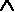
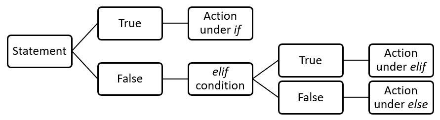
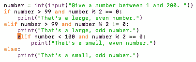

# *第四章*：理解逻辑推理

在本章中，我们将探讨逻辑推理过程，如条件语句、算法推理和布尔逻辑。在深入研究一些逻辑运算符之前，我们将探索归纳推理和演绎推理。我们还将学习逻辑错误，如何识别它们，以及如何纠正它们。

此外，我们还将研究如何使用逻辑编写算法来解决计算思维问题。

在本章中，我们将介绍以下主题：

*   理解逻辑推理的重要性
*   使用布尔逻辑和运算符
*   识别逻辑错误

在解决计算思维问题时，逻辑推理是必要的。我们都知道，编程代码有线性遵循的步骤。假设我们有 10 行代码。如果我们不应用逻辑推理，代码一次读取一行，读取第一行，读取第二行，依此类推直到最后一行。使用逻辑推理可以让我们在继续之前进行比较，返回到前一行代码，等等。在本章中，我们将学习逻辑推理，以创建使用逻辑运算符以有效方式解决问题的算法。

为了理解逻辑推理，我们将从定义一般逻辑开始，然后在设计和编写算法时如何使用逻辑。

# 技术要求

您将需要最新版本的 Python 来运行本章中的代码。您可以在此处找到本章中使用的完整源代码：[https://github.com/PacktPublishing/Applied-Computational-Thinking-with-Python/tree/master/Chapter04](https://github.com/PacktPublishing/Applied-Computational-Thinking-with-Python/tree/master/Chapter04)

# 理解逻辑推理的重要性

通过[*第三章*](03.html#_idTextAnchor056)*理解**算法和算法思维*，我们学会了在解决计算思维问题时如何设计一些基本的算法。

在本节中，我们将通过示例了解逻辑推理的重要性以及如何应用逻辑推理的类型。

在编写算法时，我们需要使用逻辑推理来创建这些算法。

简单来说，**逻辑推理**是得出结论所遵循的一系列步骤。在计算思维中，当我们设计算法时，我们遵循的系统步骤集是算法的一部分。计算机读取这些算法的方式取决于我们如何编写算法。有两种类型的逻辑推理论点，如下所示：

*   **归纳推理**
*   **演绎推理**

在我们更深入地定义它们之前，让我们先看看为什么逻辑推理如此重要，以及为什么在创建算法时顺序很重要。

为了分析问题并提供帮助我们解决问题的算法，我们需要首先了解什么是逻辑推理。逻辑对某些人来说是令人畏惧的，但我们每天都在潜意识中使用它。

让我们看一个简单的例子。比如说你每天早上洗个澡然后去上班。*那么，你会在淋浴前穿好工作服吗？*不，因为那完全没有意义。从逻辑上讲，你必须在上班穿衣服之前先洗澡。现在，我跳过了很多步骤，但这些步骤都是逻辑步骤。其他逻辑的例子包括以下食谱，下雨（或不下雨）时使用雨伞，等等。

在整个这一章中，我们将穿插逻辑推理和使用**逻辑运算符**设计算法。逻辑运算符允许程序做出决策。我们在日常生活中也会使用这些工具，却没有意识到这一点。例如，如果天气晴朗温暖，我们可能想去骑自行车，但如果天气晴朗寒冷，我们就不想去。这里的*和*是一个逻辑运算符。

我们在做决定时会考虑很多事情。在计算思维中，特别是在算法设计中，我们需要考虑这些问题，并为程序测试这些条件提供了一种途径。我们将在本章后面深入研究逻辑运算符。现在，让我们更仔细地看看逻辑推理的类型以及如何应用它们。

## 运用归纳推理

当我们谈论归纳推理时，我们实际上是在倒行逆施。归纳推理从一个结论开始，这个结论可能是真的，也可能不是真的，然后反向工作，使用现有数据创建代码。让我们先看一个简单的问题。

### 一个归纳推理样本问题的求解

我们有 150 美元的预算用于购买用品：艺术铅笔和橡皮擦。艺术铅笔每支 1.75 美元，橡皮擦每支 1.50 美元。

记住，在计算思维中，我们首先分解问题，然后识别模式，然后推广模式，然后创建算法。所以，让我们认识到这种模式。

让我们看看我们目前知道的情况，并命名一些变量：

*   总预算为 150 美元。
*   每支铅笔的价格是 1.75 美元。
*   橡皮擦的价格是每只 1.5 美元。
*   让我们用*p*表示铅笔的数量。
*   让我们用*n*表示橡皮擦的数量。

记住，当我们使用该算法时，我们可能需要重命名这些变量。但是现在，因为我们要先看数学算法，我们将保留简单的变量。

我们可以在一个不等式中做到这一点。*为什么是不等式而不是方程？*因为我们的总数可能不是 150 美元。但是它不可能超过 150 美元，因为这是我们所有的钱。

因为这是一个简单的问题，我们正在一步一步地识别和推广这种模式。

因此，铅笔的数量乘以成本加上橡皮擦的数量乘以成本小于或等于 150 美元：


现在我们来谈谈算法设计。也许这是我经常买的东西，因为我开艺术课。我要脱离那种情况。也许我的雇主最多给我 150 美元，但取决于我以前用过的东西，我可能需要更多的铅笔而不是橡皮擦，反之亦然。所以，我需要一个可以在每学期开始时使用和重用的程序。*这是我的问题吗？*不，这是一个定义不清的问题。因此，我正在根据一系列特殊需求调整问题。简而言之，我正在定义我想要解决的问题。

重要提示：

作为归纳和演绎推理困境的旁注，理解条件语句（例如我们在编程中经常使用的`if`/`then`语句）通常与演绎推理相关联是很重要的。我们可以讨论它们是否可以归纳，但事实是，归纳推理问题将使用演绎推理。在本章的下一节中，我们将深入研究演绎推理陈述。

所以，我想让程序问我想要多少支铅笔，或者我想让它问我想要多少块橡皮擦。这要看情况了！让我们看看这个程序应该为我们做些什么。以下步骤向我们展示了这一点：

1.  询问您的输入是铅笔还是橡皮擦。
2.  根据提供的输入选择要使用的不等式。
3.  确定可以使用多少铅笔或橡皮擦（给定输入）。
4.  给出铅笔和橡皮擦数量的总成本。

请注意，与往常一样，在 Python 中有很多方法可以得到相同的答案。虽然其中一些程序比我通常介绍的要长，但由于我们学习的是计算思维和 Python 编程，所以展示易于理解的步骤很重要。

对于这个特殊的程序，我们需要导入数学函数，这样我们就可以进行四舍五入了。*我们为什么要这么做？*嗯，我们不能购买橡皮擦和铅笔的零件，只能购买整支铅笔和整支橡皮擦。因此，如果该计划说我们可以购买 19.5 支铅笔，那实际上意味着我们只能购买 19 支铅笔。

`math.floor()`函数允许我们使用简单函数将该数字四舍五入到 19。在本书中，我们将探讨更多的`math`函数。在我们离开这个快速主题之前，您应该知道 Python 中的`math`模块具有与 C 语言函数一致的内置函数。

让我们回到问题上来。请看以下编写的程序：

ch4_ 感应电压 1.py

```py
#We need the math module, so don't forget to import it.
import math
#Ask the user if they will input pencils or erasers first.
item1 = input("Will you be entering pencils or erasers? ")
if item1 == "pencils":
    pencils = int(input("How many pencils will you purchase? "))
    if pencils * 1.75 < 150:
        pencilstotal = pencils * 1.75
        total = 150 - pencilstotal
        total = total / 1.50
        erasers = math.floor(total)
        total2 = pencilstotal + erasers * 1.50
        print("You will be able to purchase " + str(pencils) + " pencils and " + str(erasers) + " erasers for a total cost of $" + str(total2) + ".")
    else:
        print("That's too many pencils.")
elif item1 == "erasers":
    erasers = int(input("How many erasers will you purchase? "))
    if erasers * 1.50 < 150:
        eraserstotal = erasers * 1.50
        total = 150 - eraserstotal
        total = total / 1.75
        pencils = math.floor(total)
        total2 = pencils * 1.75 + eraserstotal
        print("You will be able to purchase " + str(pencils) + " pencils and " + str(erasers) + " erasers for a total cost of $" + str(total2) + ".")
#If the input given is too large based on the budget, this line of code alerts the user.
    else:
        print("That's too many erasers.")
#If the input is incorrect, the program will print a statement to alert the person that they need to use pencils and erasers as input first.
else:
    print("Please run the program again and enter erasers or pencils as your input.")
```

记住前面的程序将按顺序（顺序）运行代码行。因此，如果用户首先输入`erasers`，那么第一条`if`语句和嵌套的`if`语句将被忽略。如果用户先输入`pencils`，则算法从第一条`if`语句开始正常运行，并遍历其余条件。以下是程序的功能，顺序如下：

1.  要求用户输入他们是否购买铅笔或橡皮擦。
2.  如果用户输入铅笔，程序会询问他们将购买多少支铅笔。然后，它计算出他们能买得起的橡皮擦的数量。
3.  如果用户输入的铅笔数量过大，他们将收到一条消息，表示他们负担不起那么多。
4.  如果用户输入橡皮擦，程序会询问他们将购买多少橡皮擦，然后计算用户可以购买的铅笔数量。
5.  如果用户输入了太多太大的橡皮擦，他们将收到一条消息，说明他们负担不起这么多。
6.  如果用户既不输入铅笔也不输入橡皮擦，他们将收到一条消息，再次运行程序并输入这两个选项之一。

前面的是一个过于简化的归纳推理问题。一些归纳推理问题会要求您查看数据，得出一些可能的结论，然后编写一个程序来测试这些结论。在学习逻辑推理的过程中，我们本质上是在训练自己去看待决策，以及如何以程序能够返回我们所寻找的输出的方式来处理决策。

这里需要注意的是，有多种方法来看待问题和准备解决方案。虽然我更喜欢决策树和流程图，但其他程序员和开发人员的工作更注重数学。还有一些人喜欢用简单的句子和/或段落写下程序需要做什么。这个过程的要点是允许我们创建一个程序，该程序可以产生必要的输出，并且程序员、开发人员和运行它的计算机都可以很容易地遵循逻辑。

现在，让我们来看看演绎推理。

## 运用演绎推理

我们现在进入本章的一节，重点是演绎推理。即使在我还是一名数学学生的时候，我也发现演绎推理很吸引人。我很快就学会了数学教我们如何在几何中逻辑地遵循论点，我爱上了所有的东西——逻辑和真值表。

逻辑学是通过证据、归纳推理和演绎推理来教授的。真值表帮助我们分析条件。在真值表中，有些东西是假定的。例如，一条语句要么为真，要么为假。另一种说法是对的还是错的。这些陈述的组合取决于这些陈述是真是假。

好吧，这有点复杂。在我继续解释演绎推理之前，让我们看一下快速真值表及其包含的逻辑过程。

当我第一次开始编码时，真值表非常重要。他们帮助我理解了编码过程以及如何处理各种条件。不是每个程序员或程序员都使用这些表，但我发现它们很有用，即使在决策过程中没有明确使用。现在让我们看一个。

假设我们有一个陈述或条件`p`，这个条件是`True`。假设我们有另一个陈述或条件`q`，它也是`True`。在真值表中，我们用符号表示*而不是*。所以， `p`是`False`，而 `q`也是`False`。那是因为如果`p`是`True`，那么*不是*`p`是*不是*`True`，换句话说就是`False`。符号用于*和*，因此`p`*和*`q`写为`p  q`。符号``用于*或*，因此`p`*或*`q`写为`p  q`。在表格式中，我们的真值表如下所示：


图 4.1-真值表

分析真值表并理解所有可能的条件可能需要时间，但这一过程与我们编写问题算法时在逻辑推理中所经历的过程类似。现在，让我们来仔细看看演绎推理。

让我们首先定义什么是演绎推理。**演绎推理**是从陈述或假设到结论的过程。因为演绎推理是我们在算法设计中使用的，在大多数情况下，我们需要定义一些与之相关的术语。

让我们从条件语句开始。

### 学习条件语句

**条件语句**是 if/then 语句。下面是一些使用条件语句的逻辑参数：

*   如果下雨，我就用雨伞。
*   如果我喝水，我就不会渴了。
*   如果我的狗需要出去，他就站在门口。
*   如果四边形有四个直角，那么它就是一个矩形。

前面的所有语句都是条件语句的示例。该陈述的第一部分称为**假设**。声明的第二部分是**结论**。在陈述*中，如果下雨，那么我将使用雨伞*，假设是*下雨*，结论是*使用雨伞*。假设和结论中不包括*如果*或*那么*。

在 Python 中，正如您在*应用归纳推理*部分的示例中所看到的，我们在编写算法时经常使用`if`/`then`语句。下面是我们在 Python 中使用的一些逻辑语句：

*   `if`：当使用`if`语句时，我们询问是否满足某个条件，然后根据该条件做一些事情。
*   `if-else`：当使用`if-else`语句时，我们测试一个条件并做一些事情，但如果不满足该条件，我们就做其他事情。
*   `if-elif-else`：使用`if-elif-else`语句时，我们有一个条件；如果不满足条件，我们测试另一个条件，即**条件，否则如果**（**elif**条件不满足，我们将执行其他操作。

前面的所有语句都可以嵌套。我可以测试一个条件，然后是另一个，然后是另一个。我可以在`if`和`else`之间有多个`elif`语句，以此类推。让我们看一些例子。

#### 如果语句

让我们来看一个只使用一条`if`语句的程序：

ch4_ifu statement.py

```py
number = int(input("What's your favorite number? "))
if number < 100:
    print("That's not a very large number.")
```

现在，前面的代码是一个简单的程序，只检查一个条件。我们可以添加条件来测试`number`是否等于`100`。如果`number`大于`100`，我们可以再加一个，以此类推。在这种情况下，我们只关心`number`是否低于`100`。

如果我们输入数字`53`，我们将得到以下输出：

```py
What's your favorite number? 53
That's not a very large number.
```

如果我们输入数字`100`，我们将不会收到任何消息，程序将结束：

```py
What's your favorite number? 100
```

如您所见，该程序没有任何要添加的内容。条件不符合，所以结束了。这就是为什么`if-else`语句可以派上用场的原因。

#### if-else 语句

让我们看一下前面的算法，并添加一个`else`语句。之前的程序只检查提供的号码是否小于`100`。如果我们添加一个`else`语句，我们可以在屏幕上打印大于或等于`100`的所有数字的其他内容。请看以下程序：

ch4_if-elseStatement.py

```py
number = int(input("What's your favorite number? "))
if number < 100:
    print("That's not a very large number.")
else:
    print("I guess you like large numbers.")
```

前面的程序现在打印出一条消息，而不管用户输入的数字是多少。让我们再次测试一下`100`：

```py
What's your favorite number? 100
I guess you like large numbers.
```

如您所见，`100`被包括在大数字类别中，因为我们的条件是数字小于`100`。这意味着`100`不包括在条件中。测试条件是我们在 Python 中得出结论的方式。我们编写算法，从程序本身或用户输入中收集信息，然后测试条件以做出决策。

下图为`if-else`决策流程图。在查看`if-elif-else`语句和嵌套语句时，我们将查看其他流程图：


图 4.2——如果有其他情况，则说明决策流程图

如上图所示，这是一个二进制决策。将对该声明进行测试，以检查其是否为**真**或**假**。如果**为真**，则发生动作；否则，将发生另一个操作。对于我们的数字程序，如果数字在`100`下，则打印一条信息；否则，屏幕上会打印另一条消息`I guess you like large numbers`。现在，让我们添加多个条件。

#### if elif else 语句

`if-elif-else`语句是多条件语句的简化，即可以有多个`elif`语句。如前所述，**elif**代表**else if**。让我们把节目调高一点。我们将允许用户输入一个介于`1`和`20`之间的数字。下面是我们将对算法进行编程的步骤：

1.  询问一个介于`1`和`20`之间的号码。
2.  测试数字是否在`1`和`10`之间，并打印消息。
3.  测试数字是否在`11`和`20`之间，并打印消息。
4.  打印错误消息。

让我们来看看我们如何编程。在编写这个算法之前，我们需要记住一些事情。为了方便地检查`1`和`10`之间的数字，我们需要检查数字是否小于`10`。这意味着`10`不包括在内。

我们的`elif`语句将检查`21`下的数字，因为它只包括我们尚未测试的数字。也就是说，如果用户输入`12`，则第一个条件不满足，因此移动到第二个条件。是的，这将包括`21`下的所有数字，但请记住，如果该数字小于`10`，它将已经满足一个条件，并且程序将打印正确的消息。

最后，如果不满足条件，我们需要让用户知道他们写的数字不在`1`和`20`之间。以下程序演示了这一点：

ch4_if-elif-elstatement.py

```py
number = int(input("Pick a number between 1 and 20\. "))
if number < 10:
    print("That's less than 10.")
elif number < 21:
    print("That's between 10 and 20.")
else:
    print("That number isn't between 0 and 20\. Run the program and try again.")
```

让我们试着用`10`下的一个数字来测试这一点。如果我们运行编号为`8`的程序，我们会看到以下输出：

```py
Pick a number between 1 and 20\. 8
That's less than 10.
```

如果我们运行编号为`10`的程序，我们会看到以下输出：

```py
Pick a number between 1 and 20\. 10
That's between 10 and 20.
```

最后，如果我们使用编号`21`运行程序，这就是我们看到的：

```py
Pick a number between 1 and 20\. 21
That number isn't between 0 and 20\. Run the program and try again.
```

正如您所看到的，每个条件都为我们提供了给定条件的答案。以下是`if-elif-else`语句的流程图：



图 4.3——如果 elif else 语句决策流程图

正如您在前面的图中所看到的，`elif`只是显示了一个新的测试。如果**为真**，我们将遵循算法中的操作。如果**为假**，我们继续进行`else`语句。也就是说，我们可以有多个`elif`条件。这意味着我们可以继续一个接一个地测试条件，除非我们达成`else`声明。

### 理解嵌套语句

我们在 Python 中使用的另一种类型的逻辑语句与嵌套语句有关。在嵌套条件下，只有当前面的`if`语句为**True**时，才会跟随嵌套的`if`语句。通过一个例子，这更容易理解。让我们回到`if-elif-else`语句，添加一些嵌套条件。我们之前要求用户提供一个介于`1`和`20`之间的数字。现在，假设我们想使用以下代码进一步细分条件：

ch4_nestedStatements.py

```py
number = int(input("Pick a number between 1 and 20\. "))
if number < 10:
    if number < 6:
        print("Why such a small number?")
    else:
        print("Well, less than 10 but greater than 5\. I'll take it.")
elif number < 21:
    if number < 16:
        print("You like values that are greater than 10, but not too much greater. I guess that's fine.")
    else:
        print("I like larger numbers myself too.")
else:
#Sometimes we make mistakes when providing input in programs. If you choose a number that's not between 0 and 20, the program will print this message.
    print("That number isn't between 0 and 20\. Run the program and try again.")
```

在前面的代码段中，每当我们输入不符合准则的数字时，代码都会有一条消息。例如，请求的输入介于`1`和`20`之间。*但如果用户键入 0 或 21，或其他不在该范围内的数字，会发生什么情况？*然后，`print()`语句提供一条消息，要求用户再次运行程序。

在本例中，您可以看到我们有`if`语句、`elif`语句、嵌套的`if`和`else`语句等等。让我们看几个测试用例，测试一些条件，看看我们的程序是怎么说的：

*   当我们输入`4`时，可以看到以下输出：

```py
Pick a number between 1 and 20\. 4
Why such a small number?
```

*   当我们输入`6`时，我们会看到以下内容：

```py
Pick a number between 1 and 20\. 6
Well, less than 10 but greater than 5\. I'll take it.
```

*   当我们输入`11`时，我们得到：

```py
Pick a number between 1 and 20\. 11
You like values that are greater than 10, but not too much greater. I guess that's fine.
```

*   当我们输入`18`时，我们得到以下输出：

```py
Pick a number between 1 and 20\. 18
I like larger numbers myself too.
```

正如您可以从前面的测试用例中看到的，基于程序中给定的条件，我们有更多的输出。虽然这是一个简单的数字程序，但在解决更复杂的问题时，我们可以使用类似的逻辑。

假设你经营一家网上商店。用户对项目的选择将在类似的算法中使用，尽管算法要复杂得多。该算法测试条件，例如所选项目、所选数量等，以应用总计、优惠券等。这就是为什么逻辑和逻辑推理在编程中如此重要。

现在，正如前面提到的，我们使用的逻辑处理对于每个程序员来说可能是不同的。然而，无论偏好如何，当我们编写算法时，逻辑推理和逻辑处理是绝对必要的。我们不是埋头写作，而是处理问题，研究决策过程以及需要采取哪些步骤，然后设计算法。这一逻辑过程对于创建有效的算法至关重要。在分析问题时，我们将在本书中继续研究逻辑推理，即使我们没有明确说明。

在部分中，您学习了逻辑推理及其两种类型的归纳推理和演绎推理。我们还了解了在编码时方便使用的条件语句。

我们编写的一些算法可以使用布尔逻辑和运算符进行简化，这就是我们将在下一节中介绍的内容。

# 使用布尔逻辑和运算符

布尔逻辑是指 Python 中的运算符，即`and`、`or`和`not`。你会记得在本章前面关于真值表的简短讨论中看到过这一点。正如我们接下来将看到的，我们在编写算法时使用相同的逻辑处理，即使没有明确说明或使用表。在解决计算思维问题时，我们有时必须同时满足多种条件。现在，让我们仅使用语言来了解这一点。

我们来挑选一些水果吧。如果果实为圆形，橙色、绿色或黄色，则将其分类为**第 1 组**。如果果实不是圆形，而是橙色、绿色或黄色，则将其分类为**组 2**。如果水果不符合这些要求，则进入**第 3 组**。让我们简化这些组：

*   **第 1 组**：圆形和圆形（橙色或绿色或黄色）
*   **第 2 组**：不圆且（橙色、绿色或黄色）
*   **第 3 组**：所有其他水果

我知道我先说明了圆的条件。但是如果你看一看*第 1 组*和*第 2 组*，水果需要在这两种条件下进行颜色测试，也就是说，如果颜色不符合该条件，不管水果是否圆，它都进入*第 3 组*。下面是我为一个算法写的：

1.  测试水果是橙色、绿色还是黄色。
2.  如果是，则测试是否为圆形，并分为*第 1 组*或*第 2 组*。
3.  若否，则分为*组 3*。

所以，如果我们有一个橘子，它属于*组 1*。如果我们有一根香蕉，它会在*组 2*中。如果我们吃草莓，他们会在*组 3*中。

现在，如果我们要写这篇文章，我们需要确保我们已经添加了水果的特性，这样我们就可以根据一些东西来测试它们。我们将在本书的后续章节中讨论类似的问题，但现在，为了简化一些学习，我们将创建一个类似的算法，但使用数字。

在我们移动太多之前，让我们快速查看 Python 中的基本运算符：


图 4.4–基本 Python 运算符

当我们进入*第 2 节**应用 Python 和计算思维*时，我们将更深入地研究这些运算符，并更深入地了解 Python 编程语言。然而，我们需要在下一个算法中使用其中的一些。首先，让我们看一下`and`操作符。

## 操作员和操作员

为了更好地理解`and`运算符，最好看一个数学算法。让我们询问一个数字，并测试该数字是否大于`100`和`2`的倍数。为了测试一个数字是否是`2`的倍数，我们使用**模运算符**（**mod**）。在 Python 中，`mod`的符号是`%`。

所以，看看代码，如果是`number % 2 == 0`，那么这个数字可以被`2`整除。如果是`number % 2 == 1`，则不能被`2`整除。我们使用相等（`==`运算符或不相等（`!=`运算符来完成这些条件：

ch4_ 和 operator.py

```py
number = int(input("Give a number between 1 and 200\. "))
if number > 99 and number % 2 == 0:
    print("That's a large, even number.")
elif number > 99 and number % 2 != 0:
    print("That's a large, odd number.")
elif number < 100 and number % 2 == 0:
    print("That's a small, even number.")
else:
    print("That's a small, odd number.")
```

现在，我知道我们已经讨论了编写算法的不同方法。*这次我需要使用 AND 操作符吗？*可能不会。我可以把它写成嵌套语句、`if-elif-else`语句等等。一些测试用例和算法的结果如下所示：

*   当我们输入`104`时，我们看到以下输出：

```py
Give a number between 1 and 200\. 104
That's a large, even number.
```

*   当我们输入`80`时，我们看到以下输出：

```py
Give a number between 1 and 200\. 80
That's a small, even number.
```

*   当我们输入`31`时，我们得到以下输出：

```py
Give a number between 1 and 200\. 31
That's a small, odd number.
```

正如您从前面的测试用例中看到的，程序测试我们的用例，并根据满足的条件提供打印的消息。现在，让我们来看看 PosiT0.算子。

## or 操作员

正如我们在本章前面的水果示例中所看到的，我们检查了水果的颜色是橙色、绿色还是黄色。这就是`or`操作员的工作方式。我们检查一下有没有什么。这一次，我们将看一些`True`和`False`语句。假设变量`A`是`True`，变量`B`是`False`。如果我们使用`or`操作符来检查`A`或`B`的结果，那么我们的答案将是`True`。

*为什么？*因为不管怎样，结果都是`True`或`False`，这是一个`True`语句。*困惑？*逻辑可能令人困惑。让我们继续在以下程序中测试`A``and``B`以及`A or B`，以帮助您将其可视化：

ch4_orOperator.py

```py
A = True
B = False
C = A and B
D = A or B
if C == True:
    print("A and B is True.")
else:
    print("A and B is False.")
if D == True:
    print("A or B is True.")
else:
    print("A or B is False.")
```

现在，我添加了一些条件，这样我们可以得到打印输出，你可以看到我所说的逻辑是正确的，但我们不需要做所有这些。我们可以直接打印`C`和`D`。

当我们运行此程序时，结果如下：

```py
A and B is False.
A or B is True.
```

正如您所看到的，`A and B`是`False`，因为其中一个语句是`False`，这意味着整个事情是`False`。`A or B`为`True`，因为其中一个为`True`，所以条件为`True`。现在，让我们来看最后一个操作符（现在），即**而不是**操作符。

## 非操作员

`not`操作符让我们测试事物的相反方向。因此，如果将`A`设置为`True`，则`not A`为`False`。就这么简单。让我们通过以下代码来看看几个示例：

ch4_noOperator.py

```py
A = True
B = False
print(not A)
print(not B)
print(not (A and B))
print(not (A or B))
```

从前面的代码中，我们已经讨论了这里的第一个打印语句。因为`A`是`True`，所以`not``A`是`False`。对于第二个`print`语句，我们希望结果是`True`，因为`B`是`False`。现在，我们做了前面的`A and B`和`A or B`陈述。我们知道`A and B`是`False`，所以`not``(A and B)`是`True`。我们也知道`A or B`是`True`，所以`not``(A or B)`是`False`。

让我们看看程序打印的内容：

*   它为`not A`打印以下内容：

```py
False
```

*   同样，对于`not B`，它打印以下内容：

```py
True
```

*   此外，对于`not (A and B)`，它还打印以下内容：

```py
True
```

*   最后，对于`not (A or B)`，它打印以下内容：

```py
False
```

在本节中，您已经了解了一些布尔运算符。使用布尔运算符，我们可以编写算法，为我们测试用例，并根据这些用例提供输出。如前所述，程序将根据我们在算法中编写的指令运行。

通过使用这些运算符编写我们的算法，我们可以确保只在我们希望它们应用的情况下应用条件。与其让程序在不正确的条件下运行，我们可以包含语句和提示来帮助产生正确的结果。例如，如果一个距离输入意外输入为负数，则布尔语句可以检查条件并在程序中向此人提供反馈，然后再次运行。使用布尔运算符可以提供清晰的逻辑过程，并允许更好、更清晰的算法。

现在我们已经了解了基本运算符，重要的是还要了解错误。识别逻辑错误可以帮助我们避免算法中的陷阱。

# 识别逻辑错误

在我们谈论太多逻辑错误之前，让我们先谈谈为什么记住它们很重要。在 Python 中，并非所有错误都会导致程序失败或崩溃。某些逻辑错误将允许程序完全运行，而不会崩溃或向用户发出错误警报。这些错误很难识别。

下面是一些可能给我们带来麻烦的逻辑错误，但请记住，有很多方法可以将逻辑错误意外地合并到我们的程序中：

*   在等式或语句中使用错误的变量
*   使用错误的操作员测试条件
*   检查条件时使用错误的缩进

我最内疚的是切换变量，但我也经常犯缩进错误。通常，当我尝试运行程序时，会更频繁地识别这些内容，因为程序在某些情况下可能无法运行。

让我们来看一个简单的算法，它包含一个公式中的错误。在第一种算法中，目标是在以每种 1.50 美元的价格从餐厅购买多份薯条后获得总成本：

ch4_ 错误 1.py

```py
number = int(input("Type the number of fries you are ordering: "))
cost = 1.50
total = number * number
print("Your total cost is $" + str(total) + ".")
```

如果我们运行前面的程序，该程序将在没有问题/错误的情况下运行，并显示`12`份薯条的以下输出：

```py
Type the number of fries you are ordering: 12
Your total cost is $144.
```

现在，如果我们注意的话，我们会意识到 12 份薯条的价格太高了，144 美元。那是因为我们的算法有一个错误。算法应包含`total = cost * number`公式，如下所示：

ch4_ 错误 1_ 已修复。py

```py
number = int(input("Type the number of fries you are ordering: "))
cost = 1.50
total = cost * number
print("Your total cost is $" + str(total) + ".")
```

现在我们已经修正了这个公式，输出是正确的：

```py
Type the number of fries you are ordering: 12
Your total cost is $18.0.
```

如你所见，`$18.0`12 份炸薯条，每份 1.50 美元，似乎要合理得多。

公式中的错误可能很难找到，尤其是在程序运行时没有对错误发出警报的情况下。如果我们有一个包含多个公式的大型算法，那么查找这些错误可能会变得很麻烦，而且是一个漫长的过程。最好的建议是在过程的每一步测试算法。这样，查找错误就变得更简单了。

现在我们来看一个测试条件时的错误。很像公式中的错误，条件测试中的错误可能很难发现，因为程序可能只是运行：

ch4_ 错误 2.py

```py
number = int(input("Give a number between 1 and 200\. "))
if number > 99 and number % 2 == 0:
    print("That's a large, even number.")
elif number > 99 and number % 2 != 0:
    print("That's a large, odd number.")
elif number < 100 or number % 2 == 0:
    print("That's a small, even number.")
else:
    print("That's a small, odd number.")
```

在前面的代码中，算法中有一个错误，导致我们在输入一些奇数时得到错误的反馈。请看第二个`elif`语句。`or`将产生一个错误。

如果我们运行这个程序，我们会得到一个输出。让我们用数字`99`运行它：

```py
Give a number between 1 and 200\. 99
That's a small, even number.
```

现在，这里的问题是`99`不是偶数。在算法的某个地方，我们在条件中引入了一个错误。在本例中，我们使用了`or`而不是`and`操作符：

```py
elif number < 100 or number % 2 == 0:
    print("That's a small, even number.")
```

一旦我们将`or`替换为`and`，我们可以再次运行该程序：

ch4_ 错误 2_ 已修复。py

```py
number = int(input("Give a number between 1 and 200\. "))
if number > 99 and number % 2 == 0:
    print("That's a large, even number.")
elif number > 99 and number % 2 != 0:
    print("That's a large, odd number.")
elif number < 100 and number % 2 == 0:
    print("That's a small, even number.")
else:
    print("That's a small, odd number.")
```

使用`99`作为输入，我们得到以下输出：

```py
Give a number between 1 and 200\. 99
That's a small, odd number.
```

以`98`为输入运行程序，得到如下结果：

```py
Give a number between 1 and 200\. 98
That's a small, even number.
```

如您所见，除非我们注意，否则我们可能会忽略条件和逻辑运算符中的错误。因为在我们的算法中，程序能够在有这些错误的情况下运行，所以要准确地找出我们犯错误的地方要比合并阻止程序运行的错误时困难得多。

最后，让我们看一个压痕错误，使用相同的代码进行条件测试。这一次，添加了缩进错误，我们得到了以下结果：

ch4_ 错误 3.py

```py
number = int(input("Give a number between 1 and 200\. "))
if number > 99 and number % 2 == 0:
    print("That's a large, even number.")
elif number > 99 and number % 2 != 0:
    print("That's a large, odd number.")
    elif number < 100 and number % 2 == 0:
        print("That's a small, even number.")
else:
    print("That's a small, odd number.")
```

在这种情况下，我们无法运行该程序。第二条`elif`语句缩进错误。当我们试图运行该程序时，会收到一条`Invalid Syntax`错误消息。点击消息上的**确定**将带我们进入代码，缩进错误突出显示，如下图所示：



图 4.5–压痕误差

请注意，`elif`语句下面的`print()`代码缩进错误。一旦我们修复了这两个错误，我们就可以运行代码了，就像我们在本章前面所做的那样。

将错误纳入我们的算法是一个常见的错误。从前面的示例中可以看出，识别一些错误可能很困难，因为程序可能正在运行，好像没有问题一样。

我可能没有在我的算法中捕捉到很多条件错误，但那可能只是因为我从未意识到一开始就有错误。这就是为什么运行程序的各种实例以确保我们得到的结果有意义非常重要的原因之一。在这本书中，我们将讨论更多的错误，因为我们将在程序和计算思维问题上进行研究。同时，要经常测试你的程序。三重检查你的数学、缩进和逻辑。

# 总结

在本章中，我们讨论了归纳和演绎推理、逻辑推理、逻辑运算符和布尔逻辑。正如我们所讨论的，大多数算法设计都属于演绎推理。我们学习了如何使用语句，如`if`、`if-else`、`if-elif-else`和嵌套语句来编写测试条件的程序。

此外，我们还了解到有些错误很难识别，因此验证我们的程序并经常测试它们是很重要的。

读完本章后，您现在可以更好地使用逻辑推理编写算法。您还了解在设计和规划算法时应用归纳和演绎推理，并在算法中使用布尔逻辑和运算符。您现在还可以通过识别可能的错误（例如缩进错误、条件错误和公式错误）来测试算法的错误。

在下一章中，我们将更深入地分析问题，使用计算思维元素来分解问题，以便我们能够创建有意义和有用的算法。