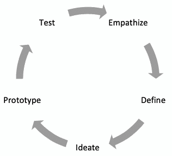
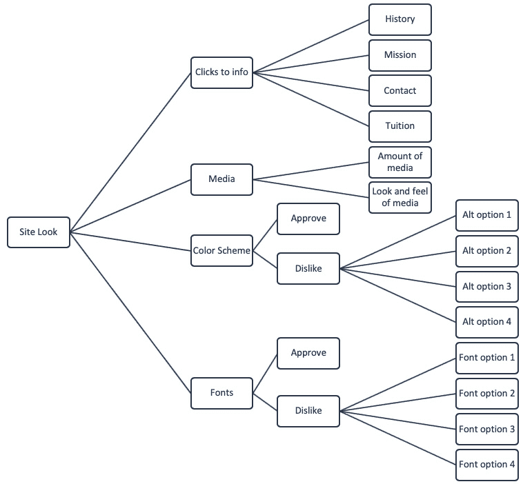
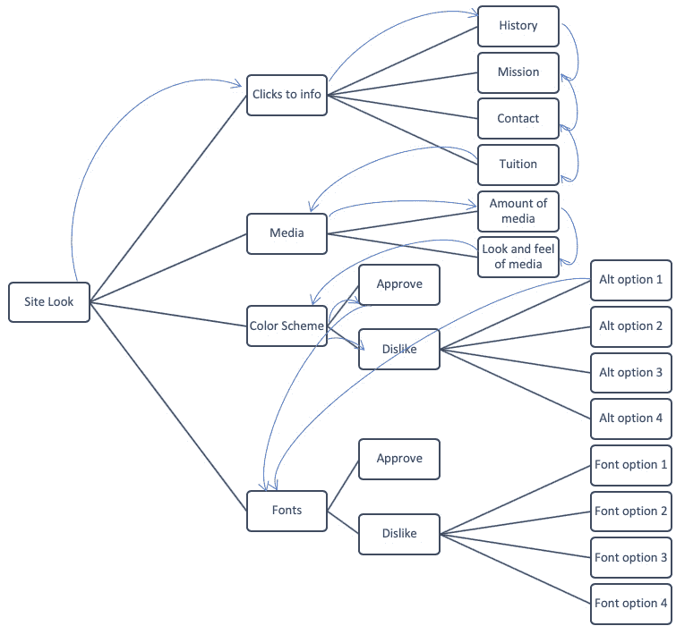
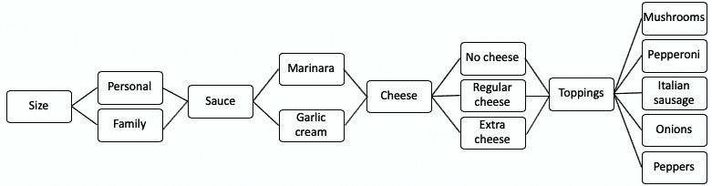
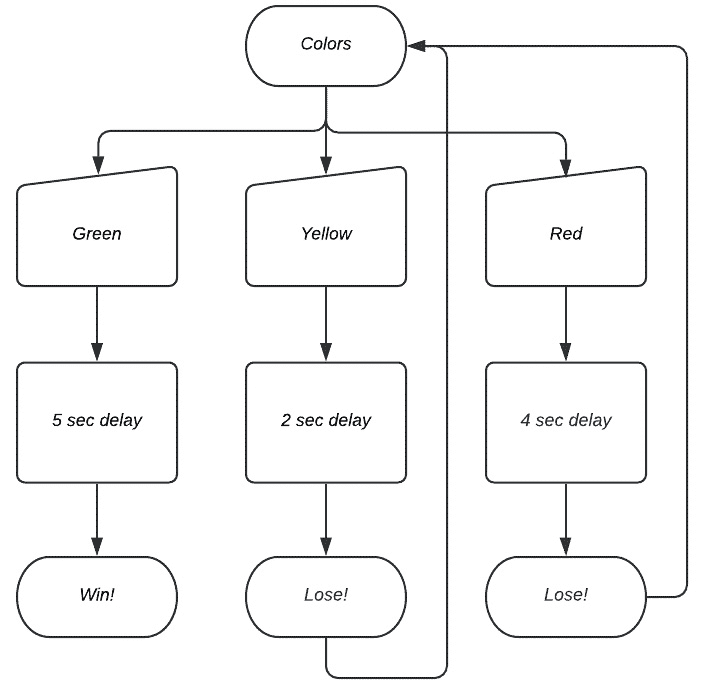

# 六、设计解决方案和解决流程

在本章中，我们将使用之前学习的内容，例如问题的**分析**和**计算思维过程**，为多个问题设计**解决方案**。我们将结合**逻辑处理**来创建决策过程的可视化表示，这将指导我们的算法设计。讨论的可视化表示包括**图**、**流程图**和其他有用的流程。在本章中，我们将学习解决方案设计的关键要素；如何在解决方案处理和设计中创建、使用和应用图表；我们将研究如何将解决方案设计过程应用于各种问题。

在本章中，我们将介绍以下主题：

*   设计解决方案
*   图解解决方案
*   创建解决方案

为了加深我们对算法和解决方案设计的了解，我们需要更密切地关注问题的前端。我们将从深入讨论设计解决方案的过程开始。

# 技术要求

您将需要最新版本的 Python 来运行本章中的代码。您可以在此处找到本章中使用的完整源代码：[https://github.com/PacktPublishing/Applied-Computational-Thinking-with-Python/tree/master/Chapter06](https://github.com/PacktPublishing/Applied-Computational-Thinking-with-Python/tree/master/Chapter06)

# 设计解决方案

当我们设计解决方案时，我们经常使用**设计思维模式**，即使我们并不总是意识到这一点。设计思维由不同的模型描述，但我们将看一看使用设计思维时最常见的五步模型。

与计算思维相结合，设计思维过程可以帮助我们在开始绘制解决方案图之前形成想法。应该注意的是，我们并不像在计算思维中那样线性地经历设计思维过程。思考计算思维的步骤：

*   问题分解
*   模式识别
*   抽象
*   算法设计

我们在前面的章节中定义了所有这些步骤，最近的一个章节是在[*第 5 章*](05.html#_idTextAnchor082)*探索问题分析*的引言中。再看一遍，我们知道我们可以在编写和设计算法时回到分解。这就是我们所说的非线性过程。

设计思维模型也是这样工作的。它是由斯坦福大学哈索·普拉特纳设计学院设计的。该模型的主要步骤包括：

*   **移情**：从受众或利益相关者的角度理解问题。
*   **定义**：确定目标、需要做出的决定、引入的任何偏差以及与问题相关的任何细节。
*   **构思**：集思广益的想法，这些想法与我们将在本章下一节中进行的图表相一致。
*   **原型**：设计算法解并经常检查。
*   **测试**：在整个过程中经常检查您的算法，并根据需要返回到前面的步骤。

如您所见，我已经调整了设计思维模型，使其更符合计算思维过程。当我们使用这些模型并将它们组合在一起时，我们的主要目标是将较难的问题分解为较简单的部分，以便我们能够解决和设计最佳算法。这并不能取代计算思维。它只是提供了一个更好的想法，我们可以如何解决这个过程。下图有助于演示该流程的工作原理：



图 6.1——设计思维模型

正如您所看到的，前面的模型没有使用最常用的线性模型，而是将过程显示为*周期性*。也就是说，回到*移情*可以从任何一点发生，因此在这些步骤之间来回移动是使用设计思维模式的最佳方式。

让我们来看一个场景，我们使用设计思维结合计算思维。

## 问题 1——市场调查

假设你在一家营销公司工作，他们要求你做一个调查，收集关于某个网站的反馈。以下是您可能会经历的一些步骤：

1.  **识别利益相关者**：这包括您将要调查的人以及在调查后使用信息的人，例如。
2.  **识别问题**：这是您定义希望从调查中找到哪些信息的地方。
3.  **设计调查**：这不仅包括你确定的问题，还包括调查结果的美感。
4.  **信息收集**：这是您决定如何与填写调查的人沟通的地方，如电子邮件、网站链接或类似内容。
5.  **数据分析**：您可以编写一个 Python 算法来帮助您进行数据分析，包括根据收集的数据创建表格和图形。
6.  **数据共享**：在这里，您将为原始利益相关者规划视觉效果、报告和数据展示。

让我们明确一点：这是对过程的过度简化。但假设你意识到你需要加入另一个调查组。假设你最初只是从一所学校的学生那里得到反馈，但意识到你想增加老师和家长。那么，您将返回到*步骤 1*并确定您的其他信息将以何种方式受到影响。您可能希望更改调查的外观，或者为成人和儿童添加不同的调查。您可能需要添加仅针对一组的问题，这会影响您在调查算法中的决策。

现在让我们来看看在设计思维过程中的这些步骤。

对于我们的问题，识别利益相关者和问题是设计思维模型的*步骤 1*、*2*和*3*的一部分：*移情*、*定义*和*构思*。构建算法是*原型*和*测试*的一部分，分别是*步骤 4*和*步骤 5*。将人员添加到调查中会让我们回到*步骤 1–3*。这个循环会一直重复，直到我们有了一个适合我们场景的算法。在整个计算思维模型中，使用其元素，您将使用嵌入其中的设计思维过程。这是决策过程中很自然的一部分。

现在我们已经看了设计思维模型，让我们来看看如何用图解方法直观地表示决策。

# 图解解决方案

当我们设计算法时，我们经常使用图表和流程图来帮助我们分析过程，并直观地看到我们的决策是在哪里做出的。这些图表允许我们创建更好的算法。你会记得，我们在[*第 5 章*](05.html#_idTextAnchor082)*探索问题分析*中创建了一个流程图，当时我们正在建立一个商店（*图 5.1*和*图 5.2*。

创建这些图的过程因开发人员或编码人员而异。例如，我通常为问题创建一个头脑风暴，然后根据该信息创建一个流程图。为了了解这个过程，让我们回到本章前面的调查问题。看看下面的头脑风暴。它并不完整，因为您可以添加许多子主题。本头脑风暴假设我们正在调查利益相关者，以便在学校网站上评估和分享反馈。


图 6.2–头脑风暴图

正如您从图中所看到的，需要考虑的因素很多。实际的调查设计可以作为程序员提供给我们，或者我们可以参与调查设计。如果我们进行了调查，我们的头脑风暴可能会有所不同，因为我们在问题中导航，并决定如何在算法中最好地放置它们。这是移情过程的一部分。我们从多个角度、多个利益相关者的角度来审视我们的信息，并决定如何编写算法来帮助我们达到需要的地方。头脑风暴等非正式图表的目的是让我们在尝试创建更详细、更有组织的流程图之前开始组织想法。当我们在图表上工作时，我们正在定义和构思我们的算法。这就是为什么在开始直接编写代码之前先勾勒出我们的计划是很重要的。

关于流程图，我们在上一章讨论用 Python 创建存储时看到了一些流程图。现在让我们看一个基于一些决策的流程图来进行决策。

值得注意的是，调查很难从头开始。部分原因是可能存在相互依赖的问题。例如，假设您要求用户说明他们是否同意颜色选择。如果他们这样做了，你可以继续前进。但如果他们不这样做，您可能需要提供其他配色方案供审查。这个问题只会出现在那些选择**否**选项的人身上。如果我们要处理头脑风暴的所有信息，那么我们的流程图可能会相当复杂，因此我们将集中讨论头脑风暴的*外观*类别中的几个问题。请查看以下流程图：



图 6.3–调查一个要素的流程图

正如您从流程图中所看到的，有些事情并不清晰可见，例如当您完成一个问题时会发生什么，您在每个决策后会去哪里，等等。当我创建流程图时，我有时会添加箭头，以帮助我查看每个步骤后发生的情况。以下流程图显示了添加的一些箭头：



图 6.4-带箭头的流程图

从前面的流程图可以看出，并不是所有的箭头都被添加了，但是仔细看**配色方案**。如果用户同意配色方案，则直接进入**字体**部分。如果没有，则显示选项。假设一次显示一个选项，那么用户在选择了自己喜欢的字体后会转到**字体**。还可以添加一个提示，询问用户是否希望再次查看选项，这将使他们返回到**Alt option 1**。可以添加箭头以显示这些详细信息。

这完全取决于作为开发人员和程序员，您最容易了解自己的内容。如果你是一名作家，可以把这些当作你的日记笔记。你组织你的想法的方式可以是个人的，只要确保你的最终结果和算法能够被它的目标人群轻松使用就行了。

现在让我们看一看如何把所有东西放在一起，并为一些问题创建解决方案。

# 创造解决方案

当我们遇到问题时，我们希望创建解决方案，解决我们所获得的信息，使用算法提供所需的一切，并易于用户理解。在本节中，我们将学习本章中学习的内容，以便设计问题的解决方案。

当我们使用头脑风暴和流程图创建这些解决方案时，我们应该考虑以下几点：

*   *我们计划的解决方案是否解决了这个问题？*
*   *解决方案设计是否为算法的成功提供了明确的路径？*

如果这些问题的答案是肯定的，那么我们可以开始编写解决方案。记住，我们需要尽可能经常地测试算法。在编写算法时，请记住以下几点：

*   添加注释以确定您可能需要返回的部分，这些部分清楚地帮助您确定和定义变量、字典、函数和任何关键组件。
*   检查您没有任何错误，如[*第 5 章*](05.html#_idTextAnchor082)*【探索问题分析】*中讨论的错误。
*   尽可能经常运行程序以测试错误。

在解决过程中，我们将使用一个与本章前面的调查略有不同的问题。在阅读本书时，我们将处理您可以用于解决该问题的组件，例如添加图像、显示图形等。但是现在，让我们继续使用一些更基本的 Python 来练习创建解决方案的过程。

## 问题 2-比萨饼订单

我知道——食物。但这是演示逻辑和算法创建的最佳方式之一，请耐心听我说。假设我们有一家比萨店。我们只卖一种皮，因为我们是一个特殊的地方。我们出售两种不同尺寸的比萨饼：个人比萨饼和家庭比萨饼。有两种酱汁可供选择：玛丽娜和大蒜奶油。奶酪有三种选择：无奶酪、普通奶酪和额外奶酪。

有五种配料可供选择（我限制它们，因为我们只是在学习这个过程）：蘑菇、意大利香肠、洋葱和辣椒。不，我们不会把橄榄放在我的比萨店附近。

让我们把那个问题分解一下。我们需要一个算法来捕获用户选择的选项来订购比萨饼。我们现在不打算考虑的是成本和订单中的附加项目，比如额外的比萨饼、饮料、甜点等等。

以下是我们所知道的：

*   **尺码**：个人还是家庭
*   **酱汁**：马里纳拉或大蒜奶油
*   **奶酪**：无奶酪、普通奶酪、额外奶酪
*   **配料**：蘑菇、辣香肠、意大利香肠、洋葱、辣椒

现在我们有了这些，让我们看一个包含以下信息的流程图：



图 6.5–比萨店决策流程图

如您所见，该图显示了针对该特定问题的相当*线性决策过程*。我们没有考虑的一件事是询问用户是否希望进行任何更改。这可能需要在每一步中进行。假设你改变了主意，选择奶酪而不是大蒜奶油酱。您需要有一种返回的方法，因此在创建算法时，我们需要记住这一点。

请记住，我们目前坚持使用文本代码，所以我们现在将使用用户输入的数字和字母。但是，有一些方法可以将 Python 合并到更健壮的算法中，这些算法包括图像、按钮等。

请看以下算法片段：

ch6_pizzeria.py

```py
#Get input for your variables for size and sauce first. 
size_choice = str(input("Is this a personal or family pizza? Type personal or family. "))
sauce_choice = str(input("Which sauce would you like? Marinara or garlic cream? Type m for marinara and g for garlic cream. "))
if sauce_choice == "g":
    sauce = "garlic cream"
else:
    sauce = "marinara"
#The cheese choice will dictate a few more options. Define the variable first.                
cheese_choice = str(input("Would you like cheese on your pizza? Type y for yes and n for no. "))
```

请注意，在代码片段中，我们首先定义了大小和酱汁。我在此重申，还有其他方法可以解决这一特殊的逻辑过程。例如，我们可以将一些变量保存到字典中并使用数组。目前，我们正在使用迄今为止所学的知识来创建算法，但在本书后面我们将有机会学习其他方法。

前面的代码段有奶酪的最终选择。不管这里有什么选择，我们都需要决定浇头。这将需要发生两次，因为我们需要它的是和否。

使用这些选项查看以下代码段，这是前面代码的延续：

ch6_Pizzeria.py

```py
#Toppings need to happen whether or not you want cheese. 
if cheese_choice == "y":
    cheese2_choice = str(input("Would you like regular cheese or extra cheese? Type r for regular and e for extra cheese. "))
    if cheese2_choice == "r":
        cheese = "regular cheese"
    else:
        cheese = "extra cheese"
    toppings1_input = str(input("Would you like mushrooms on your pizza? Type y for yes and n for no. "))
    if toppings1_input == "y":
        toppings1 = "mushrooms"
    else:
        toppings1 = "no mushrooms"
else:
    cheese = "no cheese"    
if cheese_choice == "n":
    toppings1_input = str(input("Would you like mushrooms on your pizza? Type y for yes and n for no. "))
    if toppings1_input == "y":
        toppings1 = "mushrooms"
    else:
        toppings1 = "no mushrooms"
print("You want a " + size_choice + " pizza with " + sauce + " sauce, " + cheese + ", and " + toppings1 + ".")
```

正如你从片段中看到的，我们只处理蘑菇。选择家庭规模、大蒜酱、普通奶酪和蘑菇后，此特定代码的输出如下所示：

```py
Is this a personal or family pizza? Type personal or family. family
Which sauce would you like? Marinara or garlic cream? Type m for marinara and g for garlic cream. g
Would you like cheese on your pizza? Type y for yes and n for no. y
Would you like regular cheese or extra cheese? Type r for regular and e for extra cheese. r
Would you like mushrooms on your pizza? Type y for yes and n for no. y
You want a family pizza with garlic cream sauce, regular cheese, and mushrooms.
```

使用提供的代码并查看输出，尝试将其余四种成分的代码放在一起。我想如果你正在制作自己的比萨饼，欢迎你改变这里提供的选项。把橄榄留给你自己吧。

现在，如前所述，我们可能需要返回并进行更改。让我们来看一个这样的片段：

ch6_ 比萨店 2.py

```py
ready_end = str(input("Do you need to make any changes? Type y for yes and n for no. "))
if ready_end == "y":
    size_choice = str(input("Is this a personal or family pizza? Type personal or family. "))
    sauce_choice = str(input("Which sauce would you like? Marinara or garlic cream? Type m for marinara and g for garlic cream. "))
    if sauce_choice == "g":
        sauce = "garlic cream"
    else:
        sauce = "marinara"

    cheese_choice = str(input("Would you like cheese on your pizza? Type y for yes and n for no. "))
```

正如您从代码片段中所看到的，需要对所需的更改做出决定。如果是，则我们再次提出问题。如果没有，那么我们为用户打印选择。使用完全运行的程序查看以下输出：

```py
Is this a personal or family pizza? Type personal or family. family
Which sauce would you like? Marinara or garlic cream? Type m for marinara and g for garlic cream. g
Would you like cheese on your pizza? Type y for yes and n for no. n
Would you like mushrooms on your pizza? Type y for yes and n for no. y
Do you need to make any changes? Type y for yes and n for no. y
Is this a personal or family pizza? Type 1 for personal and 2 for family. family
Which sauce would you like? Marinara or garlic cream? Type m for marinara and g for garlic cream. m
Would you like cheese on your pizza? Type y for yes and n for no. n
Would you like mushrooms on your pizza? Type y for yes and n for no. y
You want a family pizza with marinara sauce, no cheese, and mushrooms.
```

如代码所示，问题被问了两次，因为我们改变了选项。根据您想问这个问题的频率，您需要继续重复一些代码。有一些方法可以简化这一点，因此我们将在 Python 语言程序章节（[*第 8 章*](08.html#_idTextAnchor114)、*Python 简介*和后续章节中更深入地讨论这些选项。

在我们继续之前，让我们再看一个问题，重新设计过程。

## 问题 3-延迟和 Python

我在 Python 中遇到的第一个问题是创建一个根据所选颜色做出不同反应的算法。这与创建红绿灯时的情况类似。每个灯光都有不同的延迟。因此，让我们创建一个算法来解决这个问题。我们将使其成为用户在绿色、黄色和红色之间选择的颜色，以保持红绿灯主题。让我们把一些假设放在一起：

*   绿色表示延迟 5 秒
*   黄色表示延迟 2 秒
*   红色表示延迟 4 秒

这些具体的延误没有理由；我只是想把它们都控制在 5 秒钟以内。现在，假设我们正在玩一个游戏，用户必须选择一种颜色。如果他们选择黄色或红色，他们会得到一个延迟，然后会被再次询问。目标是得到一个*你赢了！您现在可以通过程序发送*消息。因此，让我们为此创建一个流程图：



图 6.6–红绿灯游戏流程图

从流程图中可以看到，如果选择黄色或红色，游戏将重新启动。现在我们已经掌握了游戏外观的基本知识，我们必须对其进行编码。

重要提示：

为了能够使用延迟，我们需要导入`time`库。使用代码`import time`执行此操作。为了包含延迟，我们使用代码`time.sleep()`。

让我们看一下我们的 Ty1 T1 代码的一个片段：

ch6_sleep.py

```py
import time
print("Let's play a game. Choose a color to learn your destiny. Choose wisely or you'll have to start over. ")
i = 0
while i < 4:
    color = str(input("Choose a color: red, green, or yellow. "))
    if color == "green":
        print("You must wait 5 seconds to learn your fate.")
        time.sleep(5)
        print("You win! Excellent choice!")
        break
    elif color == "yellow":
        print("You must wait 2 seconds to learn your fate.")
        time.sleep(2)
        print("You lose! You must start over.")
        i = i + 1
    else:
        print("You must wait 4 seconds to learn your fate.")
        time.sleep(4)
        print("You lose! You must start over.")
        i = i + 1
```

正如您所看到的，该算法包含了我们在前面几章讨论循环、布尔语句等时所看到的一些代码。如果用户尚未赢得游戏，此特定代码将返回到开始的三轮。我们使用了一个`if-elif-else`语句来处理颜色场景。三轮游戏的输出如下所示：

```py
Let's play a game. Choose a color to learn your destiny. Choose wisely or you'll have to start over. 
Choose a color: red, green, or yellow. yellow
You must wait 2 seconds to learn your fate.
You lose! You must start over.
Choose a color: red, green, or yellow. red
You must wait 4 seconds to learn your fate.
You lose! You must start over.
Choose a color: red, green, or yellow. green
You must wait 5 seconds to learn your fate.
You win! Excellent choice!
```

从游戏输出中可以看出，所有三轮都进行了。每个延迟都是根据声明发生的，您必须自己测试，因为我不能用文本显示时间延迟。

有了流程图，创建这个算法比我一读到问题就开始编码要简单得多。在编写算法之前，习惯于充实所需的过程是很重要的。设计解决方案可能是一个漫长而乏味的过程，但我们一开始组织得越多，我们的算法就会越好。

# 总结

在本章中，我们讨论了如何设计、绘制和创建问题的解决方案。我们回顾了设计思维的非线性过程，以了解如何获得最佳设计解决方案。设计思维模式是一个五步过程：**移情**、**定义**、**构思**、**原型**和**测试**。在计算思维过程中使用这五个步骤可以帮助我们避免许多问题和陷阱。

我们还创建了头脑风暴和流程图，以确定解决问题的算法的决策过程。

在下一章中，我们将使用算法设计和设计解决方案的知识来识别解决方案和调试程序中的挑战。