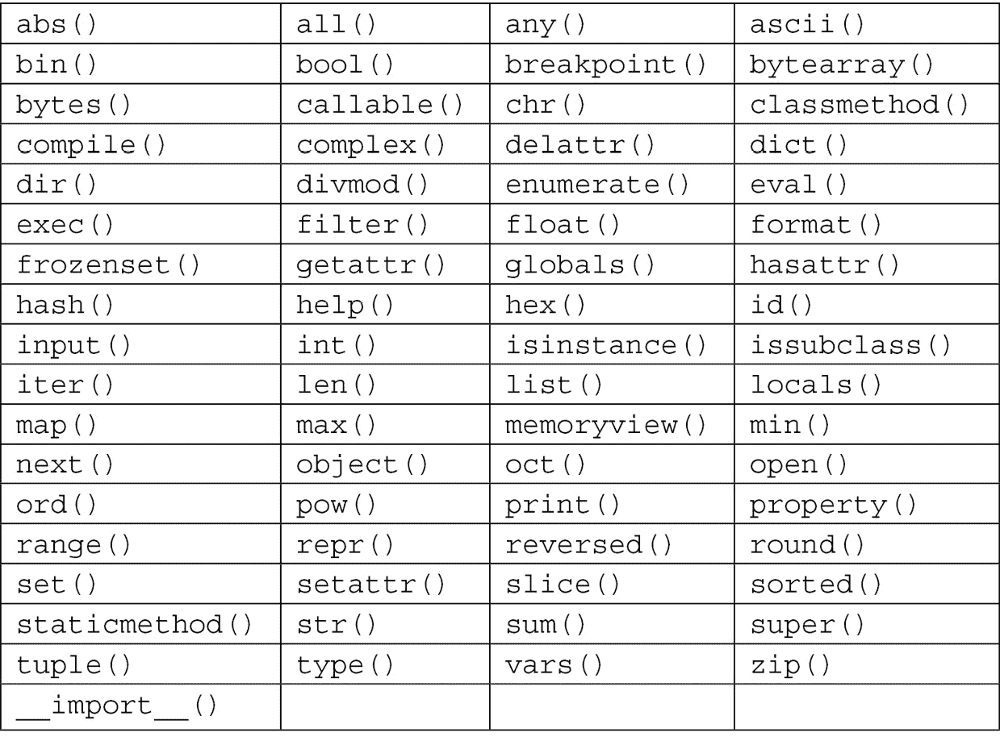

# 八、Python 简介

在本章中，我们将学习 Python 命令和功能，同时将它们应用于问题。当我们深入研究*第 2 节*的第一章*应用 Python 和计算思维*时，我们将使用更复杂的 Python 编程。在本章中，我们将更多地关注语言，而剩下的章节将关注应用程序。

在本章中，我们将介绍以下主题：

*   介绍 Python
*   使用字典和列表
*   使用变量和函数
*   了解文件、数据和迭代
*   使用面向对象编程

当我们深入研究 Python 编程语言时，请记住，在前面的章节中我们已经介绍了计算思维过程中的一些内容，例如字典和函数的使用。本章将使您在寻找 Python 命令以满足您的计算思维问题需求时更容易找到关键信息。

# 技术要求

您将需要最新版本的 Python 来运行本章中的代码。您可以在此处找到本章中使用的完整源代码：[https://github.com/PacktPublishing/Applied-Computational-Thinking-with-Python/tree/master/Chapter08](https://github.com/PacktPublishing/Applied-Computational-Thinking-with-Python/tree/master/Chapter08)

# 介绍 Python

Python 是增长最快的编程语言之一，因为它易于使用。Python Apple T1 的一个提法是我们可以编写与 C 语言、C++语言和 java 语言相同的程序，但是代码行少，语言和语法简单。Python 的另一大优点是它是**可扩展的**，这意味着我们可以向它添加功能和功能。

虽然并非所有功能都是内置的，但我们可以使用库添加我们需要的功能。这些库可供下载和使用。例如，如果我们想使用数据和数据科学，我们可以下载一些库，例如**熊猫**、**NumPy**、**Matplotlib**、**SciPy**、**Scikit 学习**等等。但是在我们进入这些库之前，让我们先看看 Python 语言是如何工作的，并学习它的基础知识。

Python 有一些内置的引用函数。以下表按字母顺序显示了功能：



表 8.1–Python 内置函数

虽然我们不会在本书中介绍所有函数，但我们将在介绍 Python 及其算法时使用其中的一些函数。让我们从这里列出的一些数学函数开始。

## 数学内置函数

在 Python 中，一些数学函数已经内置，例如`abs()`、`eval()`、`max()`、`min()`和`sum()`函数。这些并不是内置的唯一数学函数，但我们将更仔细地研究这些函数，以了解 Python 如何处理它们。

`abs()`函数将帮助我们找到一个数字的绝对值，可以是整数，也可以是浮点数。请看以下代码段：

ch8_absFunction.py

```py
x = abs(-3.89)
print(x)
```

当我们运行这个程序时，我们将得到`–3.89`的绝对值。请记住，数字的绝对值是它与 0 的距离。运行此程序时，请查看输出：

```py
3.89
```

因为绝对值总是正的，当我们运行`abs(–3.89)`时，我们得到`3.89`。

另一个有用的数学函数是`eval()`函数。我们可以在此函数中定义一个变量，然后调用 Python 使用该值计算代数表达式。在 Python shell 中，我们可以首先定义变量，如下所示：

```py
>>> p = 2
```

既然定义了变量，我们就可以用任何表达式调用`eval()`函数。例如，查看以下输入和输出：

```py
>>> eval('2 * p - 1')
```

如您所见，Python 使用了前面定义的`2`的`p`值，然后替换并计算表达式以生成此输出：

```py
3
```

Python 程序也可以用作计算器，因此您可以像平常一样执行数学运算。以下是几个例子：

```py
>>> 10-8
```

如您所见，Python 知道将破折号作为减法读取，并生成数学表达式的结果：

```py
2
```

在下一个例子中，Python 将`+`解释为一个数学符号，并提供求和表达式的结果：

```py
>>> 4+5
```

输出为：

```py
9
```

注意最后一个表达式，`10**5`。在 Python 中，我们可以使用双星（`**`来表示指数：

```py
>>> 10**5
```

输出为：

```py
100000
```

现在，让我们看一看这个函数。这个函数可以在一个 iterable 列表上使用，但是我们可以用两个数字来测试它：

```py
>>> max(12, 30)
```

您可以清楚地看到输出是什么：

```py
30
```

让我们再举一个例子：

```py
>>> max(100, 10)
```

这是输出：

```py
100
```

从输出中可以看到，函数总是选择最大的项。您可以添加第三项，函数仍将选择最大值。这些内置函数在某种程度上是智能的，它们被编码为使用所提供的内容（例如，两个或三个项），而不必明确告诉 Python 我们将引入多少项：

```py
>>> max(230, 812, 109)
```

获得的输出为：

```py
812
```

正如您所看到的，我们不必向内置函数添加任何内容来查找三个值的最大值。

`min()`功能正好相反；它选择最小值。查看以下最小函数：

```py
>>> min(230, 812, 109)
```

这是输出：

```py
109
```

如您所见，该函数使用了与我们用于最大值函数相同的列表，但这次的输出是`109`，这是该组数字的最小值。

还有其他数学函数，如`sum()`。如果您是 Python 初学者，建议您使用这些函数来了解它们的工作原理。当您为计算思维问题设计解决方案时，这些函数将是算法的关键。我们还将在查看其他 Python 功能（如字典和数组）时使用其中一些函数。

# 使用字典和列表

在深入研究字典和列表之前，需要注意的是 Python 内置函数中不包含数组。我们可以使用列表，并在列表上执行许多用于数组的传统函数。但是，为了实现更强大的阵列功能，需要一个库，例如 NumPy。

Python 有四种收集数据类型，如下所示：

*   **列表**：有序可变更；能有重复的吗
*   **元组**：有序且不可更改；可以有重复的
*   **套**：无序、无索引；不能有重复项
*   **词典**：无序、易变、索引；不能有重复项

如前所述，我们现在还不会讨论 NumPy 库或其他数据库。现在，我们将重点关注字典和列表。

## 定义和使用词典

您可能还记得，当我们创建一个项目菜单时，我们使用了[*第 3 章*](03.html#_idTextAnchor056)*中的词典*理解算法和算法思维*。Python 中的字典是具有以下三个特征的集合：*

*   它们是无序的。
*   它们是多变的。
*   它们由键索引。

字典被组织为值对。例如，我们可以有一个包含状态及其大写字母的值对的字典。请查看以下词典：

ch8_ 字典 1.py

```py
states = {
    'Ohio':'Columbus',
    'Delaware':'Dover',
    'Pennsylvania':'Harrisburg',
    'Vermont':'Montpelier'
    }
print(states)
```

如果我们在`print`语句中不带任何条件地打印此词典，我们将得到以下输出：

```py
{'Ohio': 'Columbus', 'Delaware': 'Dover', 'Pennsylvania': 'Harrisburg', 'Vermont': 'Montpelier'}
```

如您所见，每个值对一次打印。就像我们以这种方式构建字典一样，Python 也有一个内置的`dict()`函数。可以使用该函数构建相同的词典，如下所示：

ch8_ 字典 2.py

```py
states = dict([
    ('Ohio','Columbus'),
    ('Delaware','Dover'),
    ('Pennsylvania','Harrisburg'),
    ('Vermont','Montpelier')
])
print(states)
```

您可以看到，在这两个示例中，字典的构造非常相似，在语法上有一些变化，例如在第一个实例中使用冒号，而在第二个实例中使用括号和逗号。然而，`print`语句产生相同的结果。

字典被称为键值对，因为第一项是键，第二项是值。因此，对于`Ohio`和`Columbus`而言，`Ohio`是*键*，而`Columbus`是*值*。我们可以使用该键调用任何值。例如，我可以调用`states['Ohio']`，它应该返回`'Columbus'`。看看代码：

```py
>>> states['Ohio']
```

这是输出：

```py
'Columbus'
```

我们可以对字典中的任何键值对执行此操作。但是如果我们尝试调用字典中没有的键，例如`Alabama`，那么我们会得到以下错误：

```py
>>> states['Alabama']
```

这将导致显示以下错误：

```py
Traceback (most recent call last):
  File "<pyshell#23>", line 1, in <module>
    states['Alabama']
KeyError: 'Alabama'
```

注意，这给出了一个`KeyError`，在[*第 7 章*](07.html#_idTextAnchor100)中的错误列表中提到，*在*逻辑错误*部分中识别解决方案*中的挑战。但假设我们确实想添加`Alabama`和资本，即`Montgomery`。我们可以使用以下代码来执行此操作：

```py
>>> states['Alabama'] = 'Montgomery'
```

输入以下代码后，我们可以再次调用字典：

```py
>>> print(states)
```

这为我们提供了以下输出：

```py
{'Ohio': 'Columbus', 'Delaware': 'Dover', 'Pennsylvania': 'Harrisburg', 'Vermont': 'Montpelier', 'Alabama': 'Montgomery'}
```

注意，字典在字典的末尾添加了`'Alabama':'Montgomery'`键值对。

我们也可以使用`del`代码删除键值对，如图所示：

```py
>>> del states['Delaware']
```

现在，如果我们继续并打印`states`字典，`Delaware`不再在列表中：

```py
>>> print(states)
```

这是删除状态后的输出：

```py
{'Ohio': 'Columbus', 'Pennsylvania': 'Harrisburg', 'Vermont': 'Montpelier', 'Alabama': 'Montgomery'}
```

现在，您可以继续添加或删除项目，而无需进入主算法。

使用字典，还可以向一个键添加多个值。假设我做了三项运动（我不做）。我可以在字典中列出它们，并将它们与一个键值进行匹配。看看下面的算法：

ch8_ 字典 3.py

```py
miscellaneous = {
    'sports' : ['tennis', 'bowling', 'golf'],
    'age' : '40',
    'home' : 'lake'
    }
```

我们可以使用`print(miscellaneous)`打印完整词典，如下所示：

```py
>>> print(miscellaneous)
```

这是我们获得输出的方式：

```py
{'sports': ['tennis', 'bowling', 'golf'], 'age': '40', 'home': 'lake'}
```

如您所见，打印的字典包含所有值。如果我只想打印运动，那么我可以使用`miscellaneous['sports']`代码：

```py
>>> miscellaneous['sports']
```

这是输出：

```py
['tennis', 'bowling', 'golf']
```

请注意，我们根本没有使用`print()`函数。我们使用字典，我们称之为`miscellaneous`，并称之为`'sports'`键。请注意，之所以能够得到这个结果，是因为我们在 Python 中的**空闲**命令窗口中调用了字典。如果你想将其包含在你的算法中，你仍然需要使用`print()`函数。

虽然我们不会在这里讨论字典的所有功能，但您可以看到它们如何有助于创建包含键值对的算法。Python 允许我们使用简单的代码添加和更改字典、调用值等，而无需访问整个字典。

接下来，我们将查看列表。

## 定义和使用列表

Python 中的列表是有序且可更改的。我们可以为任何东西创建列表，比如动物类型、颜色、水果、数字，或者我们想要的任何东西。因为我们可以有重复的值，我们可以有一个三个苹果的列表，上面只写着`apple, apple, apple`。例如，请查看以下列表：

ch8_ 列表 1.py

```py
fruits = ['apple','apple','apple']
print(fruits)
```

打印此列表时，将包括所有项目。结果如下：

```py
['apple', 'apple', 'apple']
```

如你所见，我们有三次相同的值。如果使用字典，我们将无法做到这一点，因为字典不允许重复成员。

现在，让我们来看看我们可以用列表做什么。让我们从以下动物列表开始：

ch8_ 列表 2.py

```py
animals = ['dog', 'cat', 'bird', 'lion', 'tiger', 'elephant']
```

列表中的第一项是`'dog'`。列表有索引，从 0 开始。所以，如果我们打印出`animals[0]`，我们会得到`dog`。我们可以在这里查看：

```py
>>> print(animals[0])
```

这是索引为 0 的输出：

```py
dog
```

列表中有六项，但最后一个索引是`[5]`。所以，要打印`elephant`，我们需要使用该索引进行打印：

```py
>>> print(animals[5])
elephant
```

也可以对列表中的索引使用负数。`[–1]`指标是指最后一个指标，因此代表`elephant`，与指标`[5]`相同：

```py
>>> print(animals[-1])
elephant
```

`[–2]`索引是指倒数第二个索引，所以`tiger`以此类推。

我们还可以通过指定一系列索引来打印列表中的多个项目。请看下面的代码：

```py
>>> print(animals[1:4])
```

这是输出：

```py
['cat', 'bird', 'lion']
```

如您所见，我们打印了列表上的第二项，对应于索引`[1]`，以及接下来的两项。

通过列表，我们还可以添加项目、替换项目、删除项目、检查长度等。要添加项目，我们需要使用`append()`方法。让我们将`duck`项添加到我们的列表中：

```py
>>> animals.append('duck')
>>> print(animals)
```

以下是增加的项目：

```py
['dog', 'cat', 'bird', 'lion', 'tiger', 'elephant', 'duck']
```

请注意，我们的列表现在在列表的末尾有`duck`。但假设我们要删除`bird`并将其替换为`butterfly`：

首先，我们必须确定`bird`的索引。该索引为`2`，因为它是列表中的第三项：

```py
>>> animals[2] = 'butterfly'
>>> print(animals)
```

这是输出，替换了`bird`：

```py
['dog', 'cat', 'butterfly', 'lion', 'tiger', 'elephant', 'duck']
```

该列表现在包含`butterfly`。

删除一个项目相当简单，因为我们只使用`remove()`方法和要删除的项目：

```py
>>> animals.remove('lion')
>>> print(animals)
```

如您所见，`lion`已从列表中删除：

```py
['dog', 'cat', 'butterfly', 'tiger', 'elephant', 'duck']
```

我们也可以使用`pop()`方法通过索引删除项目。使用索引`1`删除列表中的第二项。请参阅以下代码：

```py
>>> animals.pop(1)
'cat'
```

然后，我们可以尝试以下方法：

```py
>>> print(animals)
['dog', 'butterfly', 'tiger', 'elephant', 'duck']
```

请注意，Python 标识了*从列表中弹出*的索引`1`处的项。当我们再次打印列表时，该项目不再存在。如果要删除最后一项，则不必指定索引。请参阅以下代码：

```py
>>> animals.pop()
'duck'
```

然后，我们可以尝试以下方法：

```py
>>> print(animals)
['dog', 'butterfly', 'tiger', 'elephant']
```

如上所述，当未指定索引时，列表上的最后一项将弹出*并从列表中删除。*

还有另一种方法可以使用`del`关键字从列表中删除项目：

```py
>>> del animals[1]
>>> print(animals)
```

这是输出：

```py
['dog', 'tiger', 'elephant']
```

我们的名单丢失了名单上的第二项。我们也可以使用`del`关键字完全删除列表：

```py
>>> del animals
>>> print(animals)
```

此错误是此处的输出：

```py
Traceback (most recent call last):
  File "<pyshell#49>", line 1, in <module>
    print(animals)
NameError: name 'animals' is not defined
```

如您所见，我无法再打印列表，因为它没有定义。通知我们收到了`name 'animals' is not defined`的`NameError`描述。这是[*第 7 章*](07.html#_idTextAnchor100)*中提到的错误之一*识别解决方案中的挑战。

重要提示：

对于接下来的几个代码示例，我再次从`ch8_list2.py`文件运行了我的原始代码，以获得我的原始列表。

我们可以使用`clear()`方法清除整个列表，而不消除实际列表，如下所示。

```py
>>> animals.clear()
>>> print(animals)
```

这是我们得到的输出：

```py
[]
```

在这种情况下，列表现在打印为空列表，而不给出错误消息。这是因为列表仍然存在，并且已经定义，它只是空的。

现在，假设我想知道我名单的长度。我们可以使用`len()`找到列表的长度。再次返回原始列表以运行以下代码：

```py
>>> print(len(animals))
```

我们得到以下输出：

```py
6
```

我们最初的列表包含六个元素，即六种动物。

现在，让我们定义另一个包含颜色的列表：

ch8_list3.py

```py
animals = ['dog', 'cat', 'bird', 'lion', 'tiger', 'elephant']
colors = ['blue', 'red', 'yellow']
print(animals)
print(colors)
```

此算法的输出为两个列表。现在，如果我们想要合并这两个列表，我们可以使用`extend()`方法进行合并。

让我们来看看如何将 Apple T0T 附加到 OutT1 清单：

```py
>>> animals.extend(colors)
>>> print(animals)
```

以下是附加列表：

```py
['dog', 'cat', 'bird', 'lion', 'tiger', 'elephant', 'blue', 'red', 'yellow']
```

我们的名单现在包括我们所有的动物和我们所有的颜色。我们也可以使用以下方法将`colors`扩展为`animals`。不同之处在于，颜色将首先出现在我们的列表中：

```py
>>> colors.extend(animals)
>>> print(colors)
```

以下是列表现在的显示方式：

```py
['blue', 'red', 'yellow', 'dog', 'cat', 'bird', 'lion', 'tiger', 'elephant']
```

我们还可以对列表进行排序，这在我们想要按字母顺序排列的列表或想要对数字列表进行排序时非常有用。查看以下算法中的两个列表：

ch8_ 列表 4.py

```py
animals = ['dog', 'cat', 'bird', 'lion', 'tiger', 'elephant']
numbers = [4, 1, 5, 8, 2, 4]
print(animals)
print(numbers)
```

这就是它们看起来不分类的方式：

```py
['dog', 'cat', 'bird', 'lion', 'tiger', 'elephant']
[4, 1, 5, 8, 2, 4]
```

让我们对两个列表进行排序，看看会发生什么：

```py
>>> numbers.sort()
>>> print(numbers)
```

我们将获得以下输出：

```py
[1, 2, 4, 4, 5, 8]
```

然后，我们可以尝试以下方法：

```py
>>> animals.sort()
>>> print(animals)
```

我们将其作为输出：

```py
['bird', 'cat', 'dog', 'elephant', 'lion', 'tiger']
```

如你所见，数字是从最小到最大排序的，而动物是按字母顺序排序的。

让我们谈一谈为什么这很有帮助。假设您的网站上显示了一个来自 Python 列表的项目列表。它们都被分类并完美地显示出来。但是现在让我们假设您想要添加更多项目。使用我们讨论过的方法，以任何顺序将它们添加到列表中都比较容易，然后我们可以对它们进行排序，使它们继续按字母顺序排列。

当然，这些不是我们可以用列表做的唯一事情。Python 允许我们以多种方式处理列表，这些方式对用户友好，并且功能类似于其他编程语言中的数组。当我们需要以其他方式使用它们时，我们可以搜索包含这些功能的库。

列表和字典在 Python 编程语言中都很重要。在本节中，您看到字典使用键值对，而列表包含值。两者都可以使用 Python 编程语言内置的方法和函数进行编辑。当我们在本书*第 3 节*、*数据处理、分析和应用中使用计算思维和 Python*将 Python 应用于更复杂的计算思维问题时，您将再次看到它们。

现在，我们来看看如何在 Python 中使用变量和函数。

# 使用变量和函数

在 Python 中，我们使用变量来存储值。然后，我们可以使用该值执行操作、计算表达式或在函数中使用它们。函数在算法中调用时为算法提供一组指令。许多函数都包含变量。所以，让我们先看看如何定义和使用变量，然后看看 Python 函数。

## Python 中的变量

Python 没有用于声明变量的命令。我们可以通过命名变量并将其设置为我们想要的任何值来创建变量。让我们来看一个包含多个变量的算法：

ch8_variables.py

```py
name = 'Marcus'
b = 10
country_1 = 'Greece'
print(name)
print(b)
print(country_1)
```

如您所见，我们可以使用字母、更长的名称，甚至在命名变量时包含下划线。但是，我们不能以数字开头变量名。当我们运行此程序时，我们得到以下输出：

```py
Marcus
10
Greece
```

每个变量都被打印出来，没有任何问题。如果我们用一个数字来开始任何变量名，我们就会得到一个错误。但是，如果我将`country_1`变量命名为`_country`，那么在 Python 中这将是一个可接受的变量名。

现在，让我们来看看我们可以用变量做什么。

### 组合变量

变量允许我们做的一件事是将它们组合在`print`语句中。例如，我可以创建一个打印`Marcus Greece`的`print`语句。为此，我可以使用`+`字符，如下所示：

```py
>>> print(name + ' ' + country_1)
```

请注意，在两个`+`字符之间有`' '`。这样做是为了添加一个空格，这样我们的`print`语句就不会看起来像`MarcusGreece`。现在，让我们将`b`和`name`组合在`print`语句中：

```py
>>> print(b + name)
```

这将给我们一条错误消息：

```py
Traceback (most recent call last):
  File "<pyshell#70>", line 1, in <module>
    print(b + name)
TypeError: unsupported operand type(s) for +: 'int' and 'str'
```

请注意，错误状态为`TypeError: unsupported operand types for +`。它还指出我们有`'int'`和`'str'`，这意味着我们正在组合两种不同的数据类型。

为了能够在一个`print`语句中组合这两种数据类型，我们只需将`b`变量`int`转换为`str`。下面是它的样子：

```py
>>> print(str(b) + ' ' + name)
```

这很容易为我们提供所需的结果：

```py
10 Marcus
```

既然我们已经把它们都做成了字符串，我们就可以在`print`函数中组合它们了。

有时，我们希望一次创建多个变量。Python 允许我们通过一行代码来实现这一点：

ch8_ 变量 2.py

```py
a, b, c, d = 'John', 'Mike', 'Jayden', 'George'
print(a)
print(b)
print(c)
print(d)
```

当我们运行此算法时，我们得到以下输出：

```py
John
Mike
Jayden
George
```

如您所见，当我们打印`a`变量时，等号右侧的第一个值被打印出来。算法的第一行为四个不同的变量分配了四个不同的值。

现在让我们看看函数，因为我们需要它们来进一步讨论变量。

## 使用功能

在[*第 7 章*](07.html#_idTextAnchor100)*识别解决方案中的挑战*中，我们编写了一个算法，可以为任何给定的数字范围打印偶数。我们将通过定义一个函数来重新讨论这个问题。让我们来看一个偶数问题的算法：

ch8_evennumes.py

```py
def evenNumbers(i, j):
    a = i - 1
    b = j + 1
    for number in range(a, b):
        if number % 2 == 0:
            print(number)
            a = a + 1
```

如果我们用 Python 运行这个程序，就没有输出；但是，我们现在可以对任何数字范围运行该函数。注意，我们在这个函数中添加了一个`a`和`b`变量。这样，程序运行时就包括了端点。

让我们看看在`(2, 10)`和`(12, 25)`范围内运行程序时会发生什么：

```py
>>> evenNumbers(2, 10)
```

结果如下：

```py
2
4
6
8
10
```

然后，我们可以尝试以下方法：

```py
>>> evenNumbers(12, 25)
```

结果如下：

```py
12
14
16
18
20
22
24
```

正如您所看到的，不必进入算法内部调用函数，一旦我们运行了函数，我们就可以在 Python shell 中的任何范围内调用它。和以前一样，如果我们的范围太大，shell 将显示一个非常长的数字列表。因此，我们可以定义另一个变量，这次是一个列表，并将值附加到函数中的该列表中：

ch8_ 均匀数 2.py

```py
listEvens = []
def evenNumbers(i, j):
    a = i - 1
    b = j + 1
    for number in range(a, b):
        if number % 2 == 0:
            listEvens.append(number)
            a = a + 1
    print(listEvens)
```

请注意，我们在函数外部定义了列表。我们两种方式都可以。它可以生活在功能内部或外部。区别在于，即使未调用函数，列表也存在；也就是说，一旦我运行了算法，我可以调用列表，它将是空的，或者调用函数，它将使用列表。如果在函数外部，则为全局变量。如果在内部，则它仅在调用函数时存在。

现在让我们试着在`(10, 50)`范围内运行它：

```py
>>> evenNumbers(10, 50)
```

这是输出：

```py
[10, 12, 14, 16, 18, 20, 22, 24, 26, 28, 30, 32, 34, 36, 38, 40, 42, 44, 46, 48, 50]
```

如您所见，`10`和`50`之间的偶数现在包含在列表中并打印出来。

让我们看另一个采用`(name)`字符串参数的函数示例：

ch8_nameFunction.py

```py
def nameFunction(name):
    print('Hello ' + name)
```

一旦我们运行这个算法，我们就可以为任何名称调用函数。看一看:

```py
>>> nameFunction('Sofia')
```

我们得到这个输出：

```py
Hello Sofia
```

让我们输入另一个名称：

```py
>>> nameFunction('Katya')
```

我们将看到以下输出：

```py
Hello Katya
```

如您所见，一旦在算法中定义了一个函数并运行了该算法，我们就可以根据需要调用该函数。

现在，在前面的例子中，我们确实使用了偶数的迭代，所以现在是我们开始更仔细地研究文件、数据和迭代的时候了，让我们停下来看看。当我们进入迭代时，我们将遇到更多的函数示例。

# 学习文件、数据和迭代

在本节中，我们将了解如何使用 Python 处理文件、数据和迭代。这将为我们提供有关如何使用算法打开、编辑和运行现有 Python 文件或新文件的信息。通过迭代，我们将学习如何根据某些条件重复代码的行，限制算法部分的运行次数或条件。我们先从文件开始。

## 用 Python 处理文件

在 Python 中，与文件关联的主要函数是`open()`函数。如果要在同一目录中打开文件，可以使用以下命令行：

```py
fOpen = open('filename.txt')
```

如果文件位于其他位置，则需要找到文件的路径并将其包含在命令中，如下所示：

```py
fOpen = open('C:/Documents/filename.txt')
```

除了打开文件之外，我们还可以告诉程序做一些其他事情。他们的名单如下：

*   `r`：用于打开文件读取（默认，不需要包含）；如果文件不存在，则创建新文件。
*   `w`：用于打开文件进行写入；如果文件不存在，则创建新文件。
*   `a`：打开要追加的文件；如果文件不存在，则创建新文件。
*   `x`：用于创建指定的文件；如果文件已存在，则返回错误。

除了列出的方法之外，还可以使用另外两种方法。使用时，它们标识需要如何处理文件，即二进制文件或文本文件：

*   `t`：文本（默认为文本，未指定默认为文本）
*   `b`：二进制（用于二进制模式–例如图像）

请看下面的代码。由于此代码是单行代码，并且特定于每个路径，因此不包括在存储库中：

```py
fOpen = open('filename.txt', 'rt')
```

前面的代码与前面的代码`fOpen = open('filename.txt')`相同。由于`r`和`t`是默认值，不包括它们将导致算法的相同执行。

如果我们想打开一个文件进行编写，我们可以使用`fOpen = open('filename.txt', 'w')`代码。要关闭 Python 中的文件，我们使用`close()`代码。

下面的列表中包括一些用于文本文件的附加方法。这不是一个详尽的列表，但包含一些最常用的方法：

*   `read()`：可用于读取文件的行数；使用`read(3`读取前 3 个数据。
*   `tell()`：以字节数查找当前位置。
*   `seek()`：将光标移动到原始/初始位置。
*   `readline()`：读取文件的每一行。
*   `detach()`：用于将底层二进制缓冲区与`TextIOBase`分离并返回。
*   `readable()`：如果可以读取文件流，则返回`True`。
*   `fileno()`：用于返回文件的整数。

如您所见，您可以使用 Python 操作文本文件并从中获取信息。例如，在向现有文本文件添加代码行时，这会很方便。现在，让我们看看 Python 中的数据。

## Python 中的数据

在我们进入数据之前，让我们澄清一下，我们不是在谈论数据类型，我们在[*第 1 章*](01.html#_idTextAnchor017)*计算机科学基础*中讨论过。在本章中，我们将介绍数据以及与之交互的方式，主要是列表。

让我们看看我们可以用数据做的一些事情。

首先，从存储库中获取`ch8_survey.txt`文件。下一个算法需要它。

假设你让你的朋友在蓝色、红色和黄色之间选择一个团体标志。`ch8_survey.txt`文件包含这些投票的结果。Python 允许我们操作这些数据。例如，文件的第一行写着`Payton – Blue`。我们可以把那行打印出来`Payton voted for Blue`。让我们看看算法：

ch8_surveyData.py

```py
with open("ch8_survey.txt") as file:
    for line in file:
        line = line.strip()
        divide = line.split(" - ")
        name = divide[0]
        color = divide[1]
        print(name + " voted for " + color)
```

让我们分解代码以了解发生了什么：

*   第一行打开测量文件并使其保持打开状态。
*   下一行`for line in file`将遍历文件中的每一行，以执行以下命令。
*   然后，算法获取信息并在破折号处拆分。第一部分定义为名称（`name = divide[0]`，第二部分定义为颜色（`color = divide[1]`。
*   最后，代码打印出添加了`voted for`文本的行。

请看以下输出：

```py
Payton voted for Blue
Johnny voted for Red
Maxi voted for Blue
Jacky voted for Red
Alicia voted for Blue
Jackson voted for Yellow
Percy voted for Yellow
```

如您所见，现在已对每一行进行了调整，以删除破折号并包含`voted for`短语。但是如果你想数一数选票呢？我们也可以为此编写一个算法：

ch8_ 调查数据 2.py

```py
print("The votes for Blue are in.")
blues = 0
with open("ch8_survey.txt") as file:
    for line in file:
        line = line.strip()
        name, color = line.split(' - ')
        if color == "Blue":
            blues = blues + 1
print(blues)
```

如您所见，我们通过验证每一行并使用`if color == "Blue"`代码来计算选票。当我们运行此算法时，我们得到以下输出：

```py
The votes for Blue are in.
3 
```

如您所见，算法打印出初始的`print()`命令，然后打印`Blue`的计票结果。

我们也可以使用数据来找到诸如平均值、中位数和模式之类的东西，但我们现在不讨论这些。如果我们将来需要它们来解决我们的一个应用问题，我们将继续使用它们。然而，大多数特定于数据的问题将使用库来简化一些算法和计算。

现在，让我们进一步讨论一下迭代，我们一直在使用它，但需要进一步定义，以便更好地理解它的用法。

## 在算法中使用迭代

在我们进入迭代之前，让我们先定义这个术语。**迭代**表示重复。当我们在算法中使用迭代时，我们是在重复步骤。想象一个`for`循环，我们以前在一些问题中使用过，比如偶数问题，算法在一系列数字中迭代。它对我们范围内的所有数字重复。

让我们来看看另一个例子：

ch8_colorLoop.py

```py
colors = ['blue', 'green', 'red']
for color in colors:
    print(color)
```

该算法的迭代是对原始颜色列表中的每种颜色重复`print`过程。

这是输出：

```py
blue
green
red
```

正如你所看到的，每种颜色都是印刷出来的。

我们也可以从用户那里获取输入，然后迭代执行一些操作。例如，看看下面的算法：

ch8_whileAlgorithm.py

```py
ask = int(input("Please type a number less than 20\. "))
while ask > 0:
    print(ask * 2)
    ask = ask – 1
```

如您所见，我们将`ask`定义为输入变量。然后，我们打印了两倍的数字，只要`ask`大于`0`，我们就将数字减少`1`。

输出如下所示：

```py
Please type a number less than 20\. 8
16
14
12
10
8
6
4
2
```

输出显示通过将初始编号加倍创建的列表，即*8*x*2=16*，然后继续，直到`ask`变量不再大于`0`。

接下来，让我们来看看如何迭代多个列表。该算法使用两个列表，然后使用两个列表中的信息打印一条语句：

ch8_.py

```py
jewelry = ['ring', 'watch', 'necklace', 'earrings', 'bracelets'] 
colors = ['gold', 'silver', 'blue', 'red', 'black']
for j, c in zip(jewelry, colors):
    print("Type of jewelry: %s in %s color. " %(j, c))
```

当我们运行该算法时，我们得到以下输出：

```py
Type of jewelry: ring in gold color. 
Type of jewelry: watch in silver color. 
Type of jewelry: necklace in blue color. 
Type of jewelry: earrings in red color. 
Type of jewelry: bracelets in black color.
```

请看`print`语句：`print("Type of jewelry:``%s``in``%s``color."``%(j,``c))`。`%s`符号将分别替换为`(j,``c)`值。因此，第一个`%s`符号从`j`获取项目，第二个`%s`符号从`c`获取项目，其中`j`是珠宝列表中的项目，`c`是颜色列表中的颜色。

如您所见，我们可以通过多种方式迭代列表。这些只是几个熟悉循环以及如何在我们的算法中使用信息的例子。当我们深入研究更复杂的问题时，算法将变得更复杂，因此我们将回顾本章和前面章节中的许多主题。

在进入下一章之前，我们需要先看看**面向对象编程**（**OOP**。

# 使用面向对象编程

OOP 是一种将数据构造成对象的方法。Python 程序是一个面向对象的程序，它将算法构造为对象，以便根据属性和行为将它们捆绑起来。要了解 OOP，我们需要知道如何执行以下操作：

*   创建类
*   使用类创建对象
*   使用类继承对系统建模

在 Python 中，我们使用类来绑定数据。为了理解类，让我们创建一个类：

```py
>>> class Books:
	pass
```

然后我们可以调用`Books()`类，并获取该类在计算机上保存的位置。请注意，我的输出与您的输出不匹配，因为该类将保存在不同的位置：

```py
>>> Books()
```

这是我的输出：

```py
<__main__.Books object at 0x000001DD27E09DD8>
```

现在我们已经创建了该类，可以向该类添加 book 对象：

```py
>>> a = Books()
>>> b = Books()
```

这些实例中的每一个都是`Books()`中不同的对象。如果我们比较它们，因为它们是不同的，`a == b`将返回`False`。

现在，让我们来看一个创建地址簿的类。通过创建类，我们可以根据需要添加条目：

ch8_addressBook.py

```py
class Entry:
    def __init__(self, firstName, lastName, phone):
        self.firstName = firstName
        self.lastName = lastName
        self.phone = phone
```

在这个算法中，我们创建了一个`Entry`类，它代表地址簿中的项目。一旦我们运行了该算法，我们就可以向地址簿中添加条目并调用有关它们的信息。例如，请查看以下代码：

```py
>>> Johnny = Entry('John', 'Smith', '201-444-5555')
```

此代码将`Johnny`输入通讯簿。现在，我们可以分别拨打 Johnny 的名字、姓氏和电话号码，如下所示：

```py
>>> Johnny.firstName
```

这是我的输出：

```py
'John'
```

我们可以称之为姓氏：

```py
>>> Johnny.lastName
```

这是获得的输出：

```py
'Smith'
```

我们也可以拨打电话号码：

```py
>>> Johnny.phone
```

我们可以看到以下内容的输出：

```py
'201-444-5555'
```

我们可以添加任意数量的条目，然后根据需要调用它们：

```py
>>> max = Entry('Max', 'Minnow', '555-555-5555')
>>> emma = Entry('Emma', 'Dixon', '211-999-9999')
>>> emma.phone
```

这是我们的产出：

```py
'211-999-9999'
```

添加条目后，我们可以调用姓氏：

```py
>>> max.lastName
```

我们得到这个输出：

```py
'Minnow'
```

如你所见，我们添加了两个新条目，然后拨打了 Emma 的电话号码和 Max 的姓氏。

一旦我们有了类，我们就可以有一个类继承其他类的方法和属性。因为类继承了属性和方法，所以原始类被称为父类，而新的类被称为**子类**。

回到我们的地址簿，我们可以通过将类传递给新类来创建一个子类。我知道，这听起来很混乱，但看看算法：

```py
>>> class Job(Entry):
	pass
```

现在，我们也可以使用该子类添加更多项。请参见以下示例：

```py
>>> engineer = Job('Justin', 'Jackson', '444-444-4444')
```

我们可以在类上做更多的工作，但是让我们通过解决一个问题并设计一个算法来整合这一章，该算法至少使用了所学的一些组件。

# 问题 1——创建图书库

假设你有很多书，并且想要创建一个算法来存储关于这些书的信息。您需要记录每本书的标题、作者、出版日期和页数。为此场景创建一个算法。

首先，让我们思考一下问题：

*   我拥有的书籍数量不断变化，所以我想创造一些我可以根据需要添加信息的东西。
*   我还希望能够删除我不再拥有的书籍。

虽然我们可以使用一个库，但解决这个特殊问题的最好方法是类。我们先创建一个名为`Books`的类：

ch8_BookLibrary.py

```py
class Books:

    def __init__(self, title, author, pubDate, pages):
        self.title = title
        self.author = author
        self.pubDate = pubDate
        self.pages = pages
book1 = Books('The Fundamentals of Fashion Design', 'Sorger & Udale', '2006', '176')
book2 = Books('Projekt 1065: A Novel of World War II', 'Gratz', '2016', '309')
```

如您所见，我们已经定义了类。该类有四个参数：`title`、`author`、`pubDate`和`pages`。在定义之后，增加了两本书。当我们运行这个程序时，实际上什么也没发生，但我们可以调用任意一本书上的信息：

```py
>>> book1.title
```

我们将获得以下输出：

```py
'The Fundamentals of Fashion Design'
```

我们将发布日期称为`book2`：

```py
>>> book2.pubDate
```

我们获得以下输出：

```py
'2016'
```

你可以看到，在我运行算法之后，我现在可以调用为每本书保存的任何元素。

现在，看看如何在 Python shell 中添加第三本书，如下所示：

```py
>>> book3 = Books('peanut butter dogs', 'Murray', '2017', '160')
```

由于本书已添加，我们也可以调用有关本书的信息：

```py
>>> book3.title
```

我们得到这个输出：

```py
'peanut butter dogs'
```

我们可以将`book3`的总页数称为：

```py
>>> book3.pages
```

我们将获得以下输出：

```py
'160'
```

如您所见，我们可以从算法内部或在 pythonshell 中运行算法之后向类中添加书籍。现在，让我们来看看另一个问题。

# 问题 2-组织信息

我们被要求创建一个算法，将三个数字作为输入，并提供数字的总和。我们有多种方法可以做到这一点，但让我们看看如何使用`eval()`函数：

ch8_.py

```py
a = int(input("Provide the first number to be added. "))
b = int(input("Please provide the second number to be added. "))
c = int(input("Provide the last number to be added. "))
print(eval('a + b + c'))
```

注意，我们将每个输入变量定义为一个`int`类型。这是为了正确地进行评估而定义的。

以下是我们算法的输出：

```py
Provide the first number to be added. 1
Please provide the second number to be added. 2
Provide the last number to be added. 3
6
```

如果我们忘记为每个数字添加类型，函数会将其计算为`123`，因为它只是将每个字符串添加到下一个字符串中。所以，如果我们的输入是`John`、`Mary`、`Jack`，我们的输出就会是`JohnMaryJack`。

我们之前没有进入`sum()`功能。让我们来看看使用那个函数来代替：

ch8_Sums2.py

```py
a = int(input("Provide the first number to be added. "))
b = int(input("Please provide the second number to be added. "))
c = int(input("Provide the last number to be added. "))
numbers = []
numbers.append(a)
numbers.append(b)
numbers.append(c)
print(sum(numbers))
```

在本例中使用`sum`需要我们将输入添加到列表中，因为`sum()`可以处理列表等可重用项。虽然此解决方案有更多的代码，但输出与我们的`eval()`函数完全相同，如您所见：

```py
Provide the first number to be added. 1
Please provide the second number to be added. 2
Provide the last number to be added. 3
6
```

如您所见，我们使用不同的 Python 函数得到了与之前相同的答案。在进入下一章之前，让我们再看一个问题。

# 问题 3——循环和数学

对于这个问题，我们必须创建一个算法，在给定两个数字的范围内打印出所有数字的平方。请记住，我们可以单独打印，但如果范围较大，最好有一个列表。我们还需要在这个范围内进行迭代，如果我们想包含端点，我们必须在最大值上加 1。

看看下面的算法：

ch8_.py

```py
print("This program will print the squares of the numbers in a given range of numbers.")
a = int(input("What is the minimum of your range? "))
b = int(input("What is the maximum of your range? "))
Numbers = []
b = b + 1
for i in range(a, b):
    j = i**2
    Numbers.append(j)
    i = i + 1
print(Numbers)
```

请注意，我们在算法中添加了一个`j`变量。我们没有使用`i = i**2`，因为这会改变`i`的值，这会影响我们在算法中的迭代。通过使用`j`，我们可以使用`i`迭代给定的范围。让我们看看我们的输出：

```py
This program will print the squares of the numbers in a given range of numbers.
What is the minimum of your range? 4
What is the maximum of your range? 14
[16, 25, 36, 49, 64, 81, 100, 121, 144, 169, 196]
```

该算法打印出我们提供范围内的正方形列表。它还有一个初始`print`语句，解释代码将执行的操作。

现在我们已经看了几个例子，让我们看看父类和子类以及继承是如何工作的。

## 使用继承

在 Python 中，我们可以使用继承将方法和属性从一个类传递到另一个类。父类具有将被继承的方法和属性。子类继承自父类。父类是一个对象，子类是一个对象，所以我们定义类的属性。

让我们用一个科学的例子来看看它是如何工作的。我们将创建一个名为`mammals`的类。并非所有哺乳动物都是胎生的。哺乳动物在生下活的幼兽时是胎生的。不是胎生的哺乳动物是鸭嘴兽。鸭嘴兽下蛋而不是生活的幼崽。如果我们正在为此编写一个算法，我们希望动物继承父母的特征——在本例中为`mammals`。让我们看看下面的代码片段：

ch8_.py

```py
class mammals:
     def description(self):
       print("Mammals are vertebrate animals.")

     def viviparous(self):
       print("Mammals are viviparous, but some are not.")

class monkey(mammals):
     def viviparous(self):
       print("Monkeys are viviparous.")

class platypus(mammals):
     def viviparous(self):
       print("The platypus is not viviparous. It's an egg-laying mammal.")

obj_mammals = mammals()
obj_monkey = monkey()
obj_platypus = platypus()

obj_mammals.description()
obj_mammals.viviparous()

obj_monkey.description()
obj_monkey.viviparous()

obj_platypus.description()
obj_platypus.viviparous()
```

从前面的代码中，请注意`mammals()`类使用了一个描述，然后是关于哺乳动物和胎生的信息。`monkey`使用与`mammals`类相同的描述进行定义，但随后包含了不同的胎生声明。同样的事情发生在`platypus`上。`monkey`类和`platypus`类是`mammals`类的子类。

然后将父类和两个子类简化为一个变量，以便通过调用该变量来使用它们。最后，该算法打印父母和两个孩子的描述和胎生声明。让我们看看这个输出：

```py
Mammals are vertebrate animals.
Mammals are viviparous, but some are not.
Mammals are vertebrate animals.
Monkeys are viviparous.
Mammals are vertebrate animals.
The platypus is not viviparous. It's an egg-laying mammal.
```

如您所见，所有三个类都使用相同的描述。那是因为我们没有对孩子们的描述做任何修改。当我们定义类时，我们只更改了希望与父类不同的部分。其他所有内容都从父类继承。

父类和子类在 Python 中被广泛用于多种用途。例如，在游戏中，你的敌人可能都有一些相同的特征。我们可以创建一个包含所有公共特征的父类，然后将所有敌人的单个特征更改为子类，而不是用所有特征分别定义每个敌人。这只是使用继承的方式之一。还有许多其他用途，它通过仅使用父类定义它们来帮助我们节省时间和避免错误。

现在我们已经有了一些关于类的经验并学习了 OOP，让我们结束这一章。

# 总结

在本章中，我们讨论了 Python 编程的基础知识。我们研究了一些内置函数，使用了字典和列表，使用了变量和函数，学习了文件、数据和迭代，还学习了类和 OOP。

正如我们在本章中提到的，在解决前面的问题时，Python 为我们提供了多种方法来解决相同的问题。本章的*问题 2-组织信息*部分提供了一个例子，我们在两个不同的算法中使用`eval()`和`sum()`函数来产生相同的结果。随着我们继续学习 Python 以及如何编写算法，选择要使用的函数、变量、参数等将开始成为我们的第二天性。本章中一些更具挑战性的概念和内容与数据分析有关，例如我们在本章的*Python*部分介绍 Python 数据时使用的调查，以及类。在这些领域进行一些练习很重要，这样你就可以更好地理解这些主题。

在本章之后，您现在可以使用内置函数，区分列表、字典和类，并解决组合多个不同概念（如变量、迭代和列表）的问题。在下一章中，我们将更深入地研究输入和输出，以帮助我们设计算法。