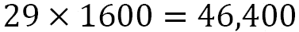
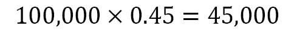
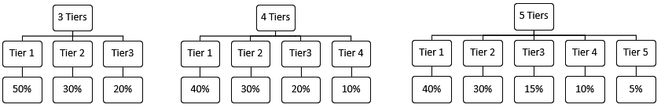

# *第 11 章*：在简单挑战中使用计算思维和 Python

在本章中，我们将再次了解计算思维过程，并将其应用于帮助我们解决各种场景和问题的设计算法。在我们总结本书*第 2 节**应用 Python 和计算思维*时，我们将结合一些关于 Python 功能的知识和计算思维过程来解决这些问题。

在本章中，我们将介绍以下主题：

*   定义问题和 Python
*   分解问题并使用 Python 功能
*   概括问题并规划 Python 算法
*   算法的设计与测试

在本章结束时，您将能够设计最适合所呈现场景的算法。您还将能够识别与所呈现的问题最匹配的 Python 函数，并概括您的解决方案。

# 技术要求

您需要安装最新版本的 Python 才能运行本章中的代码。

本章中使用的源代码可以在 GitHub 存储库中找到：[https://github.com/PacktPublishing/Applied-Computational-Thinking-with-Python/tree/master/Chapter11](https://github.com/PacktPublishing/Applied-Computational-Thinking-with-Python/tree/master/Chapter11)

# 定义问题和 Python

我们将进入第一个场景。您正在为您设计的产品发起活动。你正在寻找总计 10 万美元的投资承诺。您希望创建一个算法，保存为您做出的承诺的信息，同时提供每个承诺提供的产品的信息。在编写算法之前，您需要确定一些事项：

*   *在你的竞选活动中，你会做出多少种承诺？*
*   *是否会有只捐赠的承诺？**捐款是否会得到任何东西，比如贴纸、电子证书或其他产品赠品？*
*   *每一项抵押会给抵押人带来什么？*

所有这些问题都将帮助我们制定计划。但我们还必须考虑其他因素，比如我们需要从算法中得到什么。*这仅仅是为了列出认捐数量，还是也用于对照库存进行检查或创建库存？**是否会从每个级别的承诺数量中倒数？它会在每次有人做出承诺时自动更新吗？*

如你所知，当我们遇到问题时，确定问题的实质是什么是至关重要的。为了提供解决方案，我们需要设置问题的参数。在本节中，我们首先要回答很多这样的问题。为了做到这一点，我们需要分解这个问题，并确定 Python 中的哪些功能可以帮助我们解决这个问题。

## 分解问题并使用 Python 功能

我们可以创建一个算法，用于设计这些承诺。我们将设计一种算法，根据一定数量的承诺告诉我们每种类型需要多少物品。

例如，假设我们有三层承诺和一个只捐赠的承诺。对于最高层，我们称之为**第 1 层**，您可以得到以下结果：

*   以 20%的折扣将您要出售的商品翻倍
*   项目的配件包，包括四个项目
*   物品和附件的手提箱
*   访问网站的 1 年会员资格

中间层或**第 2 层**为您提供以下项目：

*   你正在以 20%的折扣出售的商品
*   这个物品的手提箱
*   访问该网站的 6 个月会员资格

最低层，或**第 3 层**为您提供以下信息：

*   你正在以 20%的折扣出售的商品
*   这个物品的手提箱

假设我们需要一个算法，根据每一层的承诺数量，给出我们需要的物品数量。**第四层**仅为捐赠，不会影响我们的算法，因为该算法仅用于根据认捐数量确定我们需要的每件物品数量。

但事情并不像数字那么简单。假设您需要 100000 美元的认捐，正如本章前面提到的。然后，您需要计算出分层的收费，并为其设定一个价位。你需要做出足够的承诺，至少达到 10 万美元的目标。

您已确定商品的零售价为 800 美元。以下是每个项目的成本：

*   商品本身 640 美元（提供 20%的折扣，仅适用于第 1、2 和 3 层）
*   配件 100 美元（仅限第 1 层）
*   $40 手提箱（适用于第 1 层、第 2 层和第 3 层）
*   会员费将以每月 10 美元的价格通过（假设最初的费用是每月 35 美元）

对于第 1 级，认捐额至少需要 1540 美元：

*   640 × 2 = 1280
*   12 × 10 = 120
*   1280 + 120 + 100 + 40 = 1540

对于第二级，认捐额至少需要 740 美元：

*   640 + 40 = 680
*   6 × 10 = 60
*   680 + 60 = 740

对于第三级，认捐额至少需要 680 美元，即 640+40=680 美元。

现在我们必须计算出每一层中有多少层可供购买。但首先，让我们将这些数字四舍五入：第一层将是 1600 美元，第二层将是 800 美元，第三层将是 700 美元。

我们可以编写一个算法，让我们知道每一层需要多少承诺。但在开始之前，让我们先谈谈 Python 和我们可以使用的功能。我们可以先创建三级承诺，使其成为母集团。然后我们可以创建两个子类，第 1 层和第 2 层，具有稍微不同的特性和成本。我们问自己的问题是，我们是否需要对算法进行如此详细的说明，还是只需添加每一层的成本/价值。

这是个好问题。答案是，这取决于你需要这个算法做什么。如果您希望进行早期但简单的计算，并且需要根据当前销售/承诺经常运行的算法，那么您可以使用字典或函数创建一些简单的算法。但是，如果您想将该算法用于多种用途，或者需要能够在以后调整一些成本，那么您可能需要将其编码到算法中，并包含所有细节。

*你为什么需要这个？*参加一些成功的活动。通常情况下，最初的承诺在这些活动中被出卖。新的抵押层将可用，您可能需要调整这些层的价格点。例如，与项目的 20%折扣不同，质押可能是 15%的折扣。其他的变化可能会发生，例如由于库存限制，以出售货物代替配件等等。

你的算法越详细，从长远来看，你可以用它做的事情就越多。但是如果您不需要所有这些信息，那么您可能不想花那么多时间创建算法。

让我们开始研究这个算法。查看如下所示的代码段：

ch11_.py

```py
import math
tier1 = 1600
tier2 = 800
tier3 = 700
perc = int(input("What percentage of the 100,000 do you 
    expect will be Tier 1? Type a number between 1 and
    100\. "))
percentage = perc/100
Tier1 = (100000*percentage)/1600
totalTier1 = math.ceil(Tier1)
print("You will need to sell %s Tier 1 pledges if you want 
    %s percent of your sales to be in Tier 1." 
    %(totalTier1,perc))
```

让我们先来看看前面的片段中用到的一些东西。我们必须导入`math`模块，以便使用`math.ceil()`数学函数。我们使用此功能是为了将所需的一级承诺数量四舍五入。那是因为如果我们四舍五入，我们将无法覆盖所需的百分比。通过这样做，我们找到了覆盖百分比所需的最小整数。

此外，我们在`print`语句中使用`%s`占位符来调用字符串，然后声明要使用的字符串。

当我们运行该程序时，输出是这样的：

```py
What percentage of the 100,000 do you expect will be Tier 1? Type a number between 1 and 100\. 45
You will need to sell 29 Tier 1 pledges if you want 45 percent of your sales to be in Tier 1.
```

注意，我们的`print`语句使用用户输入的百分比，部分是为了确保信息与预期相符。45%的资金来自一级承诺，我们需要卖出至少 29 个一级承诺。如果我们运行数学只是为了验证这是正确的，那么我们会看到这些信息是正确的：





正如您所看到的，如果我们出售 29 个一级承诺，我们将获得 10 万份承诺的 45%多一点。

但假设您还希望算法根据一级承诺的数量告诉您需要多少物品。让我们来看看调整后的算法：

ch11_

```py
import math
tier1 = 1600
tier2 = 800
tier3 = 700
perc = int(input("What percentage of the 100,000 do you 
    expect will be Tier 1? Type a number between 1 and 
    100\. "))
percentage = perc/100
Tier1 = (100000*percentage)/1600
totalTier1 = math.ceil(Tier1)
print("You will need to sell %s Tier 1 pledges if you want 
    %s percent of your sales to be in Tier 1." 
    %(totalTier1,perc))
print("You will need %s items, %s accessories kits, %s 
    carrying cases, and %s year-long memberships." 
    %(totalTier1*2, totalTier1, totalTier1, totalTier1))
```

注意，我只添加了一个`print`语句。以这种方式使用此算法有其优点和缺点。在本例中，我只输出每个层的数字。我不会在算法中的任何地方保存多少项。如果我们想这样做以备将来参考，我们需要调整我们获取信息的方式以及在算法中保存信息的方式。

对于该算法，输出如下：

```py
What percentage of the 100,000 do you expect will be Tier 1? Type a number between 1 and 100\. 45
You will need to sell 29 Tier 1 pledges if you want 45 percent of your sales to be in Tier 1.
You will need 58 items, 29 accessories kits, 29 carrying cases, and 29 year-long memberships.
```

注意，我们得到了我们想要的信息。我们需要`58``items``29``accessories kits``29``carrying``cases`和`29``year-long``memberships`。再说一次，如果我们做的是一次性的事情，或者如果我们不希望有任何变化，这会很有帮助。但让我们明确一点，这几乎从来都不是事实。我们想做些改变。我们还需要了解基于 Tier-2 和 Tier-3 选择的信息。*那我们该怎么办？*

首先，我们要保存我们的号码。因此，我们需要为物品、配件套件、手提箱添加一些变量，并为会员资格添加两个变量，一个用于全年会员资格，另一个用于 6 个月会员资格。我们还需要就如何打破其余承诺做出决定。*我们是否希望其他百分比在第 2 层和第 3 层之间平均分配？**我们希望剩下的三分之一是二级，三分之二是三级吗？*让我们看看这些数字。我们现在的立场是：

*   一级百分比由用户在程序运行时选择。
*   二级百分比将是剩余百分比的三分之一。
*   第三级将占剩余百分比的三分之二。

让我们把这个教给算法。以下文件包含完整的、不间断的代码。我们添加了一些文本来解释某些部分，如下所示：

ch11_.py

```py
tier1 = 1600
tier2 = 800
tier3 = 700
perc = int(input("What percentage of the 100,000 do you 
    expect will be Tier 1? Type a number between 
    1 and 100."))
percTier1 = perc/100
percTier2 = (100-perc)/3/100
percTier3 = (100-perc-percTier2)/100
```

请注意，在下面的代码片段中，我们添加了一些变量，例如`totalTier1`、`itemsTier1`、`accTier1`和`cases1`。这些变量将帮助我们保存订购的每一层的编号。我们将对第 2 层和第 3 层执行相同的操作：

```py
Tier1 = (100000*percTier1)/1600
totalTier1 = math.ceil(Tier1)
itemsTier1 = totalTier1*2
accTier1 = totalTier1
cases1 = totalTier1
yearMemb = totalTier1
Tier2 = (100000*percTier2)/800
totalTier2 = math.ceil(Tier2)
itemsTier2 = totalTier2
cases2 = totalTier2
sixMemb = totalTier2
Tier3 = (100000*percTier3)/700
totalTier3 = math.ceil(Tier3)
itemsTier3 = totalTier3
cases3 = totalTier3
totalItems = itemsTier1 + itemsTier2 + itemsTier3
totalAccessories = accTier1
totalCases = cases1 + cases2 + cases3
print("You will need to sell %s Tier 1 pledges if you want 
    %s percent of your sales to be in Tier 1." 
    %(totalTier1, perc))
print("You will need %s Tier 2 pledges and %s Tier 3 
    pledges to meet or exceed your $100,000 funding goal." 
    %(totalTier2, totalTier3))
```

虽然我们还没有打印总项目数或总案例数的详细信息，但我们现在已将它们保存到变量中。这就是我们现在的输出：

```py
What percentage of the 100,000 do you expect will be Tier 1? Type a number between 1 and 100\. 50
You will need to sell 32 Tier 1 pledges if you want 50 percent of your sales to be in Tier 1.
You will need 21 Tier 2 pledges and 72 Tier 3 pledges to meet or exceed your $100,000 funding goal.
```

我们应该注意到，我们超过了我们的资助目标，因为我们一直在向上取整。也就是说，我们使用了 1600 美元，而不是 1540 美元用于第 1 层。对于百分比，我们一直在向上取整。所有这些加起来，我们的总收入将超过 10 万美元。

让我们进一步扩展算法。以下只是我们已经看到的算法的新片段，包含我们需要的项目总数：

```py
print("These percentages are equivalent to %s total items, 
    %s total cases, %s accessories kits, %s year-long 
    memberships, and %s six-month memberships." \
      %(totalItems, totalCases, totalAccessories, 
      yearMemb, sixMemb))
```

请注意，我们现在可以调用我们在`print`函数中添加的变量，以获得库存所需的计数。如果我们没有在算法中定义这些项，我们将无法获得这些细节。

还要注意，在我们前面的代码片段中，有些项具有完全相同的值。然而，我们仍然用不同的变量定义它们。以`cases2 = totalTier2`和`sixMemb = totalTier2`为例。虽然两者具有相同的值，但我们希望分别标识它们。也许现在这不重要，但以后，也许我们的箱子会用完。然后我们只想更改案例的值，而不是 6 个月的会员资格。

因为它们已经分开了，我们可以在不影响另一个的情况下改变一个。让我们看看新的 ORT T0 语句的输出看起来是什么样子：

```py
These percentages are equivalent to 157 total items, 125 total cases, 32 accessories kits, 32 year-long memberships, and 21 six-month memberships.
```

看看这个，你可能会意识到，你只有一个手提箱，但在第 1 层有两件物品，这就是为什么这些物品有不同的计数。配件和一年会员资格仅发生在 Tier 1 中，因此这两个数字相同是有意义的。6 个月的会员资格仅适用于 Tier 2，因此该数量与 Tier 2 承诺的数量相匹配。

当我们进一步考虑这个问题时，我们可能会意识到我们可能想要以不同的方式保存信息。也许我们不需要询问用户想要的一级承诺的百分比，我们可以询问他们总共有多少个项目，然后根据这些项目细分等级。所有这些都是可能的，因此我们如何定义问题至关重要。我们如何保存信息或请求用户输入也同样重要。分解问题只是创建和设计我们需要的算法过程的一部分。

在本节中，我们学习了如何根据我们的目标使用多种解决方案解决问题。当我们定义问题时，我们通常也会确定我们需要的变量，并根据我们希望从算法中得到什么来确定哪些类型的函数最有用。除非我们有一个非常简单和直接的问题，否则问题的分解和定义对于成功定义算法至关重要。

现在让我们来看看在下一节中泛化这个问题。

# 概括问题并规划 Python 算法

在上一节中，我们正在使用一种算法，该算法设计用于资助活动。我们研究的算法是针对特定问题的。

现在，让我们尝试概括这个问题，并了解我们如何可能设计不同的算法。*我们为什么需要这个？*将其视为一个模板。如果您为初创企业开展多个融资活动，您可能希望创建一个通用算法，然后根据每个活动的需要进行调整，而不必重新开始每个活动。

您需要设置一些明确的参数并做出一些决策。为了使该场景在本书中易于管理，我们将稍微限制我们的选择：

*   每个活动将有 3 至 5 个级别的承诺，不包括捐款。
*   每一层都会要求提供每一层所需的物品。
*   每一层选项都有一个固定的内置百分比。

如果有三个级别，第一级将占认捐的 50%，第二级将占 30%，第三级将占 20%。如果有四个级别，第一级将占认捐的 40%，第二级将占 30%，第三级将占 20%，第四级将占 10%。如果有五个级别，第一级将占认捐的 40%，第二级将占 30%，第三级将占 15%，第四级将占 10%，第五级将占 5%。

请看下图，其中显示了各层的细分：



图 11.1——层级百分比细分

因为我们在许多可能的场景中使用一种算法，所以我们将逐个分解该算法。完整的算法可以在 GitHub 上的`ch11_pledgesTemplate.py`文件中找到。

在第一个片段中，我们请求初始输入，然后保存百分比：

```py
import math
numberTiers = int(input("How many tiers of pledges will you 
    offer? Enter a number between 3 and 5 inclusive. "))
#Number of tiers percentages
if numberTiers == 3:
    tier1 = .50
    tier2 = .30
    tier3 = .20
elif numberTiers == 4:
    tier1 = .40
    tier2 = .30
    tier3 = .20
    tier4 = .10
elif numberTiers == 5:
    tier1 = .40
    tier2 = .30
    tier3 = .15
    tier4 = .10
    tier5 = .05
else:
    print("Please try again and enter the numbers 3, 4,
        or 5\. ")
```

如您所见，在我们请求输入后，有三个条件。请注意，我们将输入转换为整数。这很重要，否则条件将运行，但`else`条件也将运行。

前面的代码片段不会给我们任何输出，除了请求输入。因此，我们将在下一个代码片段之后显示更多输出。

重要提示：

请注意此代码中注释的使用。由于代码的长度，我们将使用注释，以便在代码中找到需要编辑的地方。在所有代码中使用注释总是一个好主意，尤其是在冗长的代码中。否则，找到我们想要更改的特定行可能非常棘手。

一旦我们有了层的数量，我们就需要知道每层中的项目数量。我们需要询问每层选择了多少项。让我们先来看看前面的代码的延续：

```py
#Number of items per tier
if numberTiers == 3:
    numTier1Items = int(input("How many items will be 
        provided for a Tier 1 pledge? "))
    numTier2Items = int(input("How many items will be 
        provided for a Tier 2 pledge? "))                 
    numTier3Items = int(input("How many items will be 
        provided for a Tier 3 pledge? "))
elif numberTiers == 4:
    numTier1Items = int(input("How many items will be 
        provided for a Tier 1 pledge? "))
    numTier2Items = int(input("How many items will be 
        provided for a Tier 2 pledge? "))                 
    numTier3Items = int(input("How many items will be 
        provided for a Tier 3 pledge? "))
    numTier4Items = int(input("How many items will be 
        provided for a Tier 4 pledge? "))
```

请注意，我们仅显示层为 3 或 4 时的条件。代码文件还将包含 5 层的信息，但它遵循前面代码中显示的内容。请注意，算法要求为每个层输入。当我们需要处理数字和百分比时，这一点非常重要。

此外，我们可以包含一个`else`语句，允许我们在输入中出现错误时再次提问。如果愿意，可以将这些条件添加到现有模板中。现在，我们将继续下一步需要从用户那里获得的信息，例如每一层的价格点。

现在让我们回想一下我们需要什么。我们需要每一层的价格点，这也是模板类算法的输入请求。由于每个活动的和各不相同，因此我们需要让用户自行输入。输入行看起来与前面显示的代码段非常相似。以下是 3 层的外观：

```py
#Price points for each Tier
if numberTiers == 3:
    priceTier1 = int(input("What is the price point of Tier 
        1? Enter dollar amount without dollar sign. "))
    priceTier2 = int(input("What is the price point of Tier 
        2? Enter dollar amount without dollar sign. "))                
    priceTier3 = int(input("What is the price point of Tier 
        3? Enter dollar amount without dollar sign. "))
```

再次注意，我们使用注释来分隔代码的每个部分。如您所见，我们正在添加关于每个承诺级别的收费信息。然后，代码继续对层数 3、4 或 5 执行此操作。

如前所述，您可能还希望测试错误，或者提供一种替代方法，以便在用户添加错误后继续运行代码。我们在这段代码中没有解决这些错误，但是可以添加它们来改善此算法的用户体验。如您所见，我们已经开始研究如何将此算法推广到多个场景。

在这种情况下，我们将推广到多种用途。但是我们在这本书中使用了很多算法，看到了很多场景，其中模式的泛化要简单得多。泛化可以简单到用一个变量写一个等式。或者，它可以为许多情况和条件创建一个算法。这就是为什么确定我们的问题是什么以及我们到底想要实现什么是很重要的。

在本节中，我们研究了如何以及何时从用户处获取输入。我们还通过定义变量来存储输入，并在算法的方程中使用它来输出必要的信息。

为了完成算法，我们将进入下一节，重点是算法的设计和测试。

# 算法的设计与测试

在前面的部分中，我们从用户那里获得了大量输入，因为我们正在创建一个算法，该算法被用作许多活动的模板。现在我们需要以多种方式使用这些输入。以下是我们到目前为止的情况：

*   认捐的层次数
*   各层的百分比细分
*   每层的项目数
*   每层的成本

现在我们可以利用这些信息做点什么了。首先，让我们谈谈我们想要什么。我们可能想测试销售特定数量的分层产品能赚多少钱。我们还可以根据资金目标细分每一层需要多少，就像我们在本章第一部分所做的那样。

*什么最有帮助？*这取决于你需要什么。我要说的是，我想要基于资金目标的细分。我想知道我需要提供多少种保证类型。所以现在我必须弄清楚如何从我已经定义的变量中获得这些信息。

我们这里也需要三个条件。因为每个层类型的变量和每个变量的数量不同，我们需要确保我们考虑到了这个信息。让我们先考虑三层。鉴于筹资目标，以下是一些可能有用的产出：

*   将提供的每一级认捐的数目
*   每层需要在库存中的项目数

*那我们怎么才能知道呢？*

假设我们的融资目标是 50000 美元，假设一级成本是 500 美元。然后，我们可以采取以下步骤找到所需的一级承诺数量：

1.  将资金目标乘以百分比，即 50000×0.50=25000。
2.  将所得数字除以质押成本，即 25000÷500=50。

这意味着，我们需要为第 1 层发布 50 项承诺。现在让我们假设用户输入 Tier 1 中有`3`项。那么，这意味着 50×3=150 项。

现在让我们在代码中看到这一点。请记住，这与前面的代码片段（`ch11_pledgesTemplate.py`）是同一个文件。我们将使用以下代码片段继续讨论：

```py
#Breakdown of number of Tiers based on funding goal
fundGoal = int(input("What is the funding goal for this 
    campaign? Enter dollar amount with no symbols. "))
if numberTiers == 3:
    Tier1Total = math.ceil(fundGoal*tier1/priceTier1)
    Tier2Total = math.ceil(fundGoal*tier2/priceTier2)
    Tier3Total = math.ceil(fundGoal*tier3/priceTier3)
    print("For a funding goal of %s with %s tiers, you'll 
        need %s Tier 1 pledges, %s Tier 2 pledges, and %s 
        Tier 3 pledges. " % (fundGoal, numberTiers, 
        Tier1Total, Tier2Total, Tier3Total))
```

在前面的代码片段中，我们有一个`print`函数，其中包含每层的保证数量，但它们也保存为条件语句中的函数。请注意，我们现在将有一些输出。我们将从这段代码中获得所需的承诺数量，但不是每层的项目数量。我们将很快补充这一点。现在，当我们运行程序时，输出是这样的：

```py
How many tiers of pledges will you offer? Enter a number between 3 and 5 inclusive. 3
How many items will be provided for a Tier 1 pledge? Enter a number between 1 and 3 inclusive. 3
How many items will be provided for a Tier 2 pledge? Enter a number between 1 and 3 inclusive. 2
How many items will be provided for a Tier 3 pledge? Enter a number between 1 and 3 inclusive. 1
What is the price point of Tier 1? Enter dollar amount without dollar sign. 500
What is the price point of Tier 2? Enter dollar amount without dollar sign. 400
What is the price point of Tier 3? Enter dollar amount without dollar sign. 350
What is the funding goal for this campaign? Enter dollar amount with no symbols. 50000
For a funding goal of 50000 with 3 tiers, you'll need 50 Tier 1 pledges, 38 Tier 2 pledges, and 29 Tier 3 pledges.
```

正如你们所看到的，我们现在知道，为了实现我们的筹资目标，我们需要列出 50 项一级认捐（500 美元）、38 项二级认捐（400 美元）和 29 项三级认捐（350 美元）。现在我们必须考虑到每层提供的物品数量，计算出每层需要多少物品。下面是该代码的外观：

```py
if numberTiers == 3:
    Tier1Total = math.ceil(fundGoal*tier1/priceTier1)
    Tier2Total = math.ceil(fundGoal*tier2/priceTier2)
    Tier3Total = math.ceil(fundGoal*tier3/priceTier3)
    print("For a funding goal of %s with %s tiers, you'll 
        need %s Tier 1 pledges, %s Tier 2 pledges, and %s 
        Tier 3 pledges. " % (fundGoal, numberTiers, 
        Tier1Total, Tier2Total, Tier3Total))
    Tier1Items = numTier1Items*Tier1Total
    Tier2Items = numTier2Items*Tier2Total
    Tier3Items = numTier3Items*Tier3Total
    print("For %s Tier 1 pledges, you'll need %s items. For 
        %s Tier 2 pledges, you'll need %s items. For %s 
        Tier 3 pledges, you'll need %s items. " 
        %(Tier1Total, Tier1Items, Tier2Total, Tier2Items, 
        Tier3Total, Tier3Items))
```

如你所见，现在我们有另外三个数学方程和一个`print`语句，它为我们分解了信息。我们将得到每一层的承诺数量以及每一层需要的物品数量。如果您想从该模板中获得更多信息，您可以包括本章第一个示例中的部分，其中我们对每个质押的项目类型进行了细分。我们将把这作为一个挑战留给你。

现在，以下是我们的三层最终产出和 50000 美元的资金目标：

```py
How many tiers of pledges will you offer? Enter a number between 3 and 5 inclusive. 3
How many items will be provided for a Tier 1 pledge? 3
How many items will be provided for a Tier 2 pledge? 2
How many items will be provided for a Tier 3 pledge? 1
What is the price point of Tier 1? Enter dollar amount without dollar sign. 500
What is the price point of Tier 2? Enter dollar amount without dollar sign. 400
What is the price point of Tier 3? Enter dollar amount without dollar sign. 350
What is the funding goal for this campaign? Enter dollar amount with no symbols. 50000
For a funding goal of 50000 with 3 tiers, you'll need 50 Tier 1 pledges, 38 Tier 2 pledges, and 29 Tier 3 pledges. 
For 50 Tier 1 pledges, you'll need 150 items. For 38 Tier 2 pledges, you'll need 76 items. For 29 Tier 3 pledges, you'll need 29 items.
```

如您所见，我们不仅拥有所需的信息，而且还设置了变量，以便在需要调整这些信息时使用。回想我们之前讨论过的章节和注释，让我们试着确定现在还可以如何保存信息。

首先想到的是，我们可以创建一个字典来为我们存储信息。如果我们这样做了，那么我们就可以从字典中回忆起我们需要的信息，例如，一个层次的项目数。如果需要，我们也可以调整键值对，而不必重新输入整个内容。假设我们第一层的初始成本是 500 美元，但我们现在需要 600 美元，而其他层不会改变。然后我们可以调整这个值。

这个场景将允许您探索我们讨论过的 Python 编程语言的许多功能。花些时间研究代码，然后进行一些调整，并尝试根据不同的情况使用您的一些知识来改进代码。

请记住，我们总是遇到可以用不同方式解释的问题情况。由我们来编写满足我们和客户需求的算法。有时，我们会直接从利益相关者那里得到澄清。其他时候，我们必须要求澄清和/或自己做出一些假设。关键的是，我们设计算法并记录我们的进度，这样我们就可以调整、调整和更改我们的工作，而不必重新开始，如果我们没有得到我们需要的。

# 总结

在本章中，我们通过更复杂的场景和对该场景的解释，再次回顾了计算思维过程。我们学习了如何分解提供的问题，然后识别模式，对其进行概括，并设计算法。我们使用了整本书学到的一些知识来编写一个算法，它提供了我们需要的信息。

计算思维过程帮助我们发展技能，使我们的算法规划更容易。通过浏览该过程，我们了解了 Python 的功能和功能在特定场景中可以帮助我们的更多信息。我们还学习了如何概括模式，有时是在一个问题的简单方程式中，但有时是在创建算法中，这些算法可以帮助我们在多个场景中使用，而不必每次都重新创建它们。随着我们对 Python 的了解越来越多，我们对*第 2*节*应用 Python 和计算思维*的最后一章中的计算思维过程也越来越熟悉。

在*第 3 节*、*使用计算思维和 Python*的数据处理、分析和应用程序中，我们将继续讨论 Python 的其他功能，以便使用计算思维元素处理数据处理、分析和应用程序。在下一章中，我们将开始研究数据，以及如何使用 Python 分析数据、创建可视化表示和编写处理实验数据的算法。