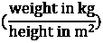
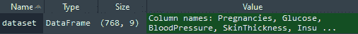
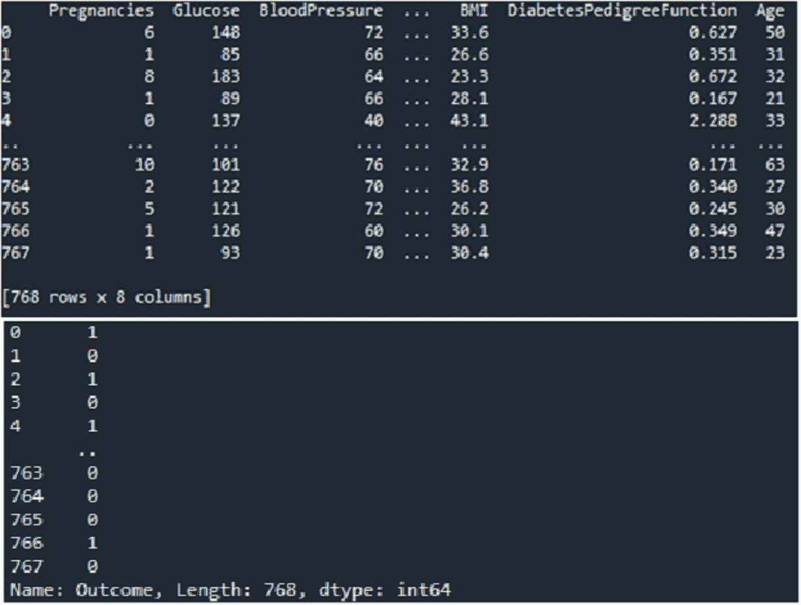
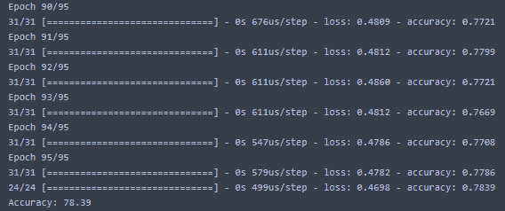
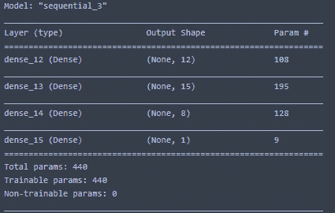

# 十三、使用分类和聚类

在本章中，我们将使用 Python 编程语言的分类和集群功能。在处理集群和分类时，我们将使用计算思维元素来定义问题的必要组件。

在本章中，我们将介绍以下主题：

*   定义培训和测试
*   实现数据聚类

在本章结束时，您将能够设计最适合所呈现场景的算法。您还将能够确定与所提出的问题最一致的 Python 函数，并概括您的解决方案。

# 技术要求

我们需要最新版本的 Python 和**Scikit 学习**来执行本章中的代码。

您可以在此处找到本章中使用的代码：[https://github.com/PacktPublishing/Applied-Computational-Thinking-with-Python/tree/master/Chapter13](https://github.com/PacktPublishing/Applied-Computational-Thinking-with-Python/tree/master/Chapter13)

您可以从**Kaggle**中找到**皮马印第安人糖尿病数据库**：[https://www.kaggle.com/uciml/pima-indians-diabetes-database](https://www.kaggle.com/uciml/pima-indians-diabetes-database)

# 数据训练与测试

在本节中，我们将学习如何使用 Python 工具和库为培训和测试数据创建模型。在处理数据和数据科学时，我们有时需要训练算法，以继续收集和学习数据。然后将数据训练用于数据挖掘和机器学习。首先，让我们定义**培训数据集**：

*   这是用于拟合模型的数据样本。
*   它是用于训练模型的实际数据集（在**神经网络**的情况下，权重和偏差）。训练模型*看到*并且*从该数据中学习*。

在计算中，神经网络是一种计算系统，它是以人类和动物大脑中的生物神经网络为灵感创建的。当使用训练数据集时，例如当我们创建机器学习模型时，模型严重依赖于数据。*但什么是机器学习？***机器学习**或**ML**是**人工智能**（**AI**）的一种应用，允许机器使用程序自动学习，而无需明确编程。

没有一个高质量的数据训练基础，一个算法是没有用的。ML 中的数据训练是指用于开发模型的初始数据。他们发现关系，发展理解，发现模式和趋势。输入数据被输入到 ML 算法中，也被输入到与生成输出相关的所有技术中。该输出也作为更新的反馈反馈反馈到模型中，从而提供再次用作输入的反馈数据。这个过程是周期性的，不断地适应和学习。下图显示了一个简单的 ML 图形，其中包含发生的过程：


图 13.1–机器学习及其与输入和输出的关系

在 ML 中，数据与统计工具相结合以预测输出。机器接收输入数据并使用算法构造答案。这与**数据挖掘**类似，大型数据集用于发现异常、相关性、模式等，以预测结果。

在数据挖掘中，我们提取信息，但使用的方法是提取必要的、相关的、无错误的数据点。也就是说，通过数据挖掘，我们从数据集中提取我们需要的东西，而不提取那些异常，同时查看数据中的相关性和模式。数据挖掘和 ML 的区别在于，ML 同时分析输入数据和输出数据。因此，一旦输出被处理，它就返回到算法，在那里它被反馈到输入数据，并重新处理。从前面的图表中可以看出，这个循环正在进行中。

重要提示：

有四组 ML 算法，但在本书中，我们只介绍两组。虽然这不是一本 ML 书籍，但 Python 在 ML 领域的应用程序仍在不断增长，因此它与我们理解编程语言的应用程序以及我们如何使用计算思维解决问题的目标相关。

在 ML 中，我们使用两种重要的技术：

*   **监督学习**映射数据对，使用输入数据和预期输出（训练数据），以便模型能够发现潜在模式。
*   **无监督学习**使用未标记训练数据得出结论。

此外，还有两种我们在本书中不会涉及的技术：半监督学习和强化学习。

在监督学习中，学习算法由一组输入及其期望输出（也称为标签）组成。目标是发现一条规则，使计算机能够重新创建输出，或者换句话说，映射输入和输出。另一方面，无监督学习允许我们在处理问题时很少或根本不知道我们的结果应该是什么样子。输出变量未标记。在无监督学习中，提出了一种具有一组输入但没有期望输出的算法，这意味着该算法必须自己找到结构和模式。

下图显示了有监督和无监督学习的路线图：


图 13.2–机器学习的类型

如上图所示，我们有两种类型的**监督学习**。当我们得到训练数据和期望输出时，我们使用**回归**或**分类**。通过**回归**，我们预测连续值产出。通过**分类**，我们得到离散值输出（0 或 1）。回归的一个例子是预测某一天的降雨量，而通过分类，我们希望知道是否会下雨。

对于**无监督学习**，上图包含**聚类**的示例。在**聚类**中，我们得到了训练数据，但只有少数期望的输出。聚类的一个例子是**分组**，它将从大量数据集合中提取项目并对其进行分组。

我们可以将这些类型的学习风格应用于**人工神经网络**。神经网络的训练通常通过确定网络的处理输出（通常是预测）和目标输出之间的差异来进行。这就是错误，因此网络根据学习规则调整其加权关联，并使用此错误值进行调整。神经网络通常是分层组织的。层由几个相互连接的节点组成，这些节点包含激活功能。

激活函数用于决定神经元是否被激活。为此，计算加权和并添加进一步的偏差。我们使用激活函数提供神经元的非线性输出。三种最常见的激活功能如下：

*   **乙状结肠**可表述为，其中实数的输入为*x*。它返回一个介于–1 和 1 之间的值。
*   **Tanh**由*Tanh（x）*给出。为双曲线正切函数，实数输入*x*；它返回一个介于–1 和 1 之间的值。
*   **整流线性单元**（**ReLU**为分段线性函数。如果输入为正或 0，则其输出与输入相同。

下图显示了与上述每个激活功能相关的图表：


图 13.3–激活功能

模式通过**输入层**呈现给网络，该层与一个或多个**隐藏层**通信，其中实际处理通过加权**连接系统**完成。然后，隐藏层链接到**输出层**，在该层中输出答案，如下图所示：


图 13.4–人工神经网络（ANN）模型

如您所见，求和运算符（）获取输入值并在网络中移动并创建输出。输入新节点时，它们必须求和并返回单个值。激活函数本质上是*挤压*输入，并将其转换为一个输出值，该输出值表示一个节点应该贡献多少（即，节点应该何时激发）。一个节点被激活时被认为是被*激活*。它获取输出值并进行转换，以便下一个节点可以将其作为输入。这被称为**启动**。

现在让我们来看看我们如何用熊猫来分类数据。

## 分类数据示例

现在让我们来看一个例子，我们正在对数据进行分类。下面的屏幕截图显示了使用监督学习的示例。为了产生可以在屏幕截图中看到的输出，我们使用了来自[www.kaggle.com](http://www.kaggle.com)的现有数据集。该数据集称为**皮马印第安人糖尿病数据库**。它描述了一名皮马族印度患者是否被诊断为糖尿病：


图 13.5–无监督学习示例

如您所见，表中的属性，也称为*输入变量*（*x*），如下所示：

*   怀孕次数
*   口服葡萄糖耐量试验中 2 小时的血糖浓度
*   舒张压（毫米汞柱）
*   三头肌皮褶厚度（mm）
*   2 小时血清胰岛素（μU/ml）
*   体重指数
*   糖尿病家系功能
*   年龄（年）

对于*输出变量*（*y*，我们有类变量（0 或 1）。从数据集中，每一行代表一名患者，以及该患者是否在过去 5 年中接受过糖尿病诊断。如您所见，有八个输入变量和一个输出变量（最后一列），如上图所示。

我们将使用二元分类模型（1 或 0），该模型将输入变量（*x*的行映射到输出变量（*y*）。这将总结*y=f（x）*。下面的代码片段使用这些信息来获取我们的输出。请注意，在本示例中，我们将以片段形式讨论完整文件：

ch13_diabetesA.py

```py
import pandas as pd
import matplotlib.pyplot as plt
import numpy as np
dataset = pd.read_csv('diabetes.csv')
```

正如您从前面的代码片段中看到的，我们正在上传名为`diabetes.csv`（来自 Kaggle）的数据集。如果您需要关于如何保存文件和定位所需路径的提示，请参阅[*第 12 章*](12.html#_idTextAnchor159)*在*理解使用 Python 进行数据分析*部分中使用 Python 解决实验和数据分析问题*。上传数据集有很多方法。

正如我们在[*第 12 章*](12.html#_idTextAnchor159)*中使用 Python 解决实验和数据分析问题*一样，我们正在使用非常流行的**熊猫**并将其作为`pd`导入。熊猫用于数据操作和分析。它提供用于操作数值表和时间序列的数据结构和操作。pandas 的`read_csv()`函数用于从**逗号分隔值**（**CSV**值）导入数据。

重要提示：

我们需要找到正确的目录。当您调用`.csv`文件时，请确保您位于正确的目录中（即`.csv`文件所在的目录），以避免出现错误代码。使用`import os`后再使用`os.chdir()`，然后再使用`print('Current directory', os.getcwd())`。更多信息，请参见[*第 12 章*](12.html#_idTextAnchor159)*在实验和数据分析问题*中使用 Python。

运行前面的代码片段后，可以查看变量资源管理器以查看以下屏幕截图中显示的项目。注意**变量资源管理器**是一个工具，允许您浏览和管理与代码关联并在代码中使用的对象。此工具是**Spyder**环境的部分，该环境运行 Python，并具有其他功能和编辑工具，如变量资源管理器。变量资源管理器位于我们环境右侧顶部的 Spyder 中。以下屏幕截图显示了变量资源管理器中的数据库视图：



图 13.6–变量浏览器示例

如您所见，**大小**描述了数据集。它显示患者数量**786**，以及变量总数**9**。现在我们对数据集有了更好的理解。

但是假设你不知道你需要什么类型的学习。您可以在控制台中键入此函数，以获得数据和输出的完整信息：

```py
dataset.describe(include='all')
```

以下屏幕截图显示了我们在算法中使用前一行代码后收到的信息：


图 13.7–运行描述算法后的信息显示

如上图所示，我们能够得到所有的数值特征，并且知道没有分类数据。我们需要这些信息，因此可以使用以下代码行查看变量之间的相关性：

```py
dataset.corr()
```

这行简单的代码帮助我们获得以下屏幕截图中显示的信息。请注意，根据您使用的环境，以下屏幕截图可能会有所不同。当运行此代码时，使用**Spyder**或**Jupyter**等环境，根据您的主题设置和选择，表格可能会看起来不同，具有不同的配色方案（或无配色方案）：


图 13.8–数据集相关性图

我们可以看到所有变量与结果之间的相关性（输出（*y*）。前面的屏幕截图显示，血糖与预后的相关性最强，胰岛素的相关性最低。

现在，我们对数据集有了更好的理解，让我们分离输入变量和输出变量，将其放入模型中。让我们来看看下面的代码片段，这是我们的例子：

```py
#Split dataset into input(x) and output(y) variables 
x_variables = dataset.iloc[:,0:8]
y_variable = dataset.iloc[:,8]
```

我们使用`print`函数检查我们的值：

```py
print(x_variables)
print(y_variable)
```

运行前面的代码片段后，输出数据将如下面的屏幕截图所示。请注意，结果显示了我们定义的变量`x_variables`和`y_variable`，这两个变量依次定义为数据集的一部分，如前面代码中所述：



图 13.9–为算法打印输入和输出值培训数据集输出

现在我们必须将数据分为训练数据集和测试数据集。分割技术的目的是评估 ML 算法的性能。它仅适用于任何类型的监督学习算法。第一组（训练数据集）用于拟合模型。

主要目标是将其与已知输入和输出的可用数据进行拟合，然后对未来没有预期输出或目标值的新示例进行预测。

## 使用 Scikit 学习库

在处理数据和 ML 时，另一个重要的库是`scikit-learn`（`sklearn`库）。该库特别适用于分类、回归、聚类、模型选择、降维等。您可能还记得[*第 12 章*](12.html#_idTextAnchor159)*在实验和数据分析问题*中使用 Python，在中的*使用 Python 部分*下，您可以从**命令提示符**窗口使用`pip install`来安装所需的库。一旦拥有了库，就可以将其导入代码中，如下面的代码段所示，该代码段使用`sklearn`分割数据。请注意，此片段是较大的`ch13_diabetesA.py`文件的一部分：

```py
from sklearn.model_selection import train_test_split
X_train,X_test, y_train,y_test = train_test_split(
    x_variables, y_variable, test_size = 0.20, 
    random_state = 10)
```

以下是已知的参数：

*   前面定义的`x_variable`和`y_variable`。
*   `test_size`：测试大小为数据集的 20%。
*   `random_state`：它为随机生成器设置种子，因此您的训练和测试分割始终是确定的。如果设置为无，则返回一个随机初始化的`RandomState`对象。

下图显示了流程以及循环中每个元素如何与其他元素交互：


图 13.10–以毫升为单位的数据周期

注意，我们将在算法中使用序列模型。此外，我们正在使用`keras`库，该库与 Python 一起使用，因此我们可以使用我们的算法运行深度学习模型。确保您有可用于此算法的`keras`库。如果您安装了 TensorFlow，您应该已经可以访问 Keras 库。

在处理机器学习问题和算法时，您可以选择库。我们选择 Keras 解决这个特殊问题。Keras 是开源的，在创建人工神经网络方面很有用。TensorFlow 是一个包含许多机器学习组件和任务的平台。

Keras 在 TensorFlow 的基础上工作，使它更容易在 Python 编程语言中与之交互。Keras 是一个更高级别的 API，我们将进一步讨论。由于它的容量，有时会比平时慢。**Pytork**是另一个用于人工神经网络的库。它是一个较低级别的 API，因此运行速度更快。Keras 由**谷歌**支持，PyTorch 由**Facebook**支持。两者都很有帮助，因此决定使用哪一个通常是开发人员的偏好。就个人而言，我更喜欢 Keras 图书馆。

顺序 API 允许您以一步一步的方式逐层创建模型。还有两种其他可用的模型，**功能 API**和**模型子分类**。我们将使用顺序 API，因为它是最简单的体系结构，而函数 API 用于深度学习（复杂模型）和模型子分类。

关于使用 Keras，我们应该注意以下几点：

*   模型类是根类，用于定义模型的体系结构。
*   与 Python 本身一样，Keras 使用面向对象编程，这意味着我们可以添加子类。
*   模型中的子类是可自定义的。

尽管如此，还应该注意的是，子分类比使用顺序 API 或函数 API 更具挑战性。现在让我们看一下使用 KARS 库的更新算法。请记住包含您的文件目录或将`.csv`文件保存到正确运行算法所需的目录：

ch13_diabetesB.py

```py
from sklearn.model_selection import train_test_split
from keras import Sequential from keras.layers import Dense
#Defining the Model
model = Sequential()
model.add(Dense(12, input_dim=8, activation='relu'))
model.add(Dense(15, activation='relu'))
model.add(Dense(8, activation='relu'))
model.add(Dense(1, activation='sigmoid'))
```

从前面的代码片段中，我们可以看到我们添加了四个紧密连接的层。

第一层按如下方式构建：

*   12 个神经元
*   `input_dim = 8`（即进入网络的输入值）
*   `activation 'relu'`

如您所见，我们添加了多个模型并对其进行了定义。为了编译模型，我们使用同一代码文件中包含的以下代码片段。我们还可以设置`model.fit`使用我们的库和以下代码，这是我们`ch13_diabetesB.py`文件的一部分：

```py
#Compile the model
model.compile(loss='binary_crossentropy', optimizer='adam', 
    metrics=['accuracy'])
#Fit the model on the dataset
model.fit(x_variables, y_variable, epochs=95, 
    batch_size=25)
#Evaluate the model
_, accuracy = model.evaluate(x_variables, y_variable)
print('Accuracy: %.2f' % (accuracy*100))
model.summary()
```

前面的代码编译 Adam 优化器。Adam 优化器用于随机梯度下降，使用训练数据迭代更新网络权重。一旦我们运行代码，我们的输出将提供如下信息：



图 13.11–使用 Keras 库运行模型的输出

请注意，在运行算法时，精度可能会有所不同。对算法进行几次测试，以查看窗口中的更改。运行精度模型后，我们使用`model.summary()`打印模型摘要，如下所示：



图 13.12–算法的模型摘要

现在，我们已经了解了如何使用糖尿病数据文件运行我们的算法，让我们简要地看看一些优化模型，它们将帮助我们评估算法。我们将不讨论这些算法，但我们确实想提及我们可以使用的各种工具中的一些。在进行建模时，我们使用优化模型，如**二进制交叉熵**、**Adam 优化算法**和**梯度下降**。

## 定义优化模型

让我们看看模型的类型。请注意，我们没有深入探讨这些模型的使用，但建议进一步探讨它们在我们的算法中的应用。

### 二元交叉熵模型

在二元分类中，我们使用交叉熵作为默认的**损失函数**。损失函数是一种帮助我们评估算法如何建模数据的方法。利用损失函数，我们可以使用优化来产生更精确的结果，即有助于减少**预测误差**。当目标值在二进制集合中时，我们使用损失函数。

交叉熵是一个损失函数，用于计算两个概率分布之间的差异。当使用**逻辑回归**和**人工神经网络**优化分类模型时，我们可以使用交叉熵。

### Adam 优化算法

Adam 算法是一种**随机优化**的方法。当函数中存在随机性时，使用随机优化，以最大化或最小化函数值。Adam 优化算法适用于一些简单的优化问题，即*非凸*。它效率高，占用内存少，但可以应用于大型数据集。

### 梯度下降模型

梯度下降算法是一种一阶优化算法。一阶是指线性局部误差。我们对可以区分的函数使用梯度下降法来寻找局部最小值。

### 混淆矩阵模型

混淆矩阵也称为**误差矩阵**。混淆矩阵在视觉上很有帮助，因为它以表格的形式展示了算法的性能，从而可以更好地可视化该性能。它通常用于监督学习。

如上所述，这只是您开始优化算法时的一些基本信息。关于 ML 的更多信息可以在其他 Packt 书籍中找到，例如*Python 机器学习*和*使用 Python 进行探索性数据分析*。

在继续介绍集群之前，让我们快速回顾一下本节中关于使用 Keras 包和模型的内容：

*   加载数据
*   在 Keras 中定义神经网络
*   使用高效的数值方法编译 Keras 模型
*   训练数据模型
*   基于数据的模型评估
*   用模型进行预测

现在让我们转到数据集群。

# 实现数据聚类

在本节中，我们将了解如何进行数据聚类。首先，让我们定义一下**数据集群**的含义。数据集群是指我们如何将数据划分为组或集群。如果集群能够扩展对领域知识的理解，那么集群是有意义的。我们在许多应用中使用聚类，例如医学，聚类可以帮助确定一组患者对治疗的反应，或者市场研究，聚类用于对消费者进行分组，以便根据特定群体的特征吸引该群体。

在本次讨论中，我们将研究合成簇，而不是应用簇。在[*第 16 章*](16.html#_idTextAnchor219)*高级应用计算思维问题*中，您将在上下文中看到一些集群示例。一个**合成簇**由一个合成数据集组成。也就是说，我们使用一种算法生成数据集。让我们看看下面的代码片段：

ch13_.py

```py
from numpy import where
from sklearn.datasets import make_classification
from matplotlib import pyplot
#Create a synthetic dataset
X, y = make_classification(n_samples = 1800, 
    n_features = 2, n_informative = 2, n_redundant = 0, 
    n_clusters_per_class = 1, random_state=4)
#Scatterplot
for class_value in range(2):
	row_ix = where(y == class_value)
	pyplot.scatter(X[row_ix, 0], X[row_ix, 1])
#Display plot
pyplot.xlabel('variable 1')
pyplot.ylabel('variable 2')
pyplot.title('Synthetic data graph')
pyplot.show()
```

请注意，在前面的代码片段中，我们确定了样本数量、特征数量和集群数量等。此外，我们随后创建合成数据的散点图并绘制结果。下图显示了以散点图形式绘制的合成数据集的结果：


图 13.13–合成数据集散点图

请注意，此合成数据集的样本数为`1800`。尝试更改采样数以查看散点图中的更改。现在我们有了一个数据集，我们可以开始应用聚类算法了。以下是一些更常见的聚类算法：

*   **桦树算法**
*   **K-均值聚类算法**

我们将在以下部分中介绍上述算法。

## 使用 BIRCH 算法

**使用层次结构**（**BIRCH**的平衡迭代约简和聚类是一种聚类算法，只要有足够的可用内存和时间，就使用聚类质心。对于 BIRCH 和 K-means 聚类算法，我们将共享一个算法和相应的图，以便更好地理解它们。

下面的代码片段向我们展示了 BIRCH 算法：

ch13_BIRCH.py

```py
from numpy import unique
from numpy import where
from sklearn.datasets import make_classification
from sklearn.cluster import Birch
from matplotlib import pyplot
#Synthetic dataset definition
X, _ = make_classification(n_samples = 1800, 
    n_features = 2, n_informative = 2, n_redundant = 0, 
    n_clusters_per_class = 1, random_state = 4)
#Define the BIRCH model
model = Birch(threshold = 0.01, n_clusters = 2)
model.fit(X)
yhat = model.predict(X)
#Clusters
clusters = unique(yhat)
#Display
for cluster in clusters:
	row_ix = where(yhat == cluster)
	pyplot.scatter(X[row_ix, 0], X[row_ix, 1])
pyplot.show()
```

请注意，在这个示例中，我们任意选择了两个集群，如您在`model = Birch(threshold = 0.01, n_clusters = 2)`行中看到的。我们坚持使用 1800 件样品，以便比较我们的产量数字。下面的屏幕截图显示了两个桦树模型示例。第一个（*在左边*）显示了按照前面代码段中提供的算法运行。第二个（*在右侧*显示了相同的算法运行，但针对三个集群。

为了运行第二个图形，我们将模型行代码更改为：

```py
model = Birch(threshold = 0.01, n_clusters = 3) 
```

请看下图，`n_clusters = 2`和`n_clusters = 3`两个图均显示：


图 13.14——分别使用 2 个和 3 个簇的桦树模型

请注意，在前面的屏幕截图的*左侧*上，清楚地显示了两个集群。与*图 13.13*相比，您可以看到一些数据点已被转换以适合识别的每个集群。前面截图*右侧*的散点图将数据分为三个不同的簇。要更熟悉聚类算法，请更改参数以查看更改聚类数量、样本大小和其他参数时发生的情况。

现在让我们来看看 k-均值聚类算法。

## 使用 K-均值聚类算法

K-means 聚类算法是应用最广泛的聚类算法之一。该算法分配示例，以便在每个已识别的簇中使方差最小化。与 BIRCH 算法非常相似，我们在算法中设置了簇的数量。让我们看看 k-均值代码片段：

ch13_KMeans.py

```py
from numpy import unique
from numpy import where
from sklearn.datasets import make_classification
from sklearn.cluster import KMeans
from matplotlib import pyplot
#Dataset definition
X, _ = make_classification(n_samples = 1800, 
    n_features = 2, n_informative = 2, n_redundant = 0, 
    n_clusters_per_class = 1, random_state = 4)
#Model identification and fit
model = KMeans(n_clusters = 2)
model.fit(X)
#Clusters
yhat = model.predict(X)
clusters = unique(yhat)
#Display
for cluster in clusters:
	row_ix = where(yhat == cluster)
	pyplot.scatter(X[row_ix, 0], X[row_ix, 1])
pyplot.show()
```

再次注意，我们使用了相同数量的集群（`2`和样本数量（`1800`，以便我们可以比较显示。以下屏幕截图显示了上述算法产生的 K-均值散点图输出：


图 13.15–K-均值算法输出

请注意，数据仍然完全相同，但是，当我们比较从 BIRCH 算法和 K-means 算法获得的显示时，您可以看到我们的算法为我们的集群产生了非常不同的结果。

我们还可以使用和测试许多其他聚类算法。了解它们并比较结果对于基于真实数据集确定使用哪种方法是至关重要的。在这种情况下，K-means 算法的结果并不能很好地拟合模型。BIRCH 模型似乎更适合使用两个聚类，因为 K-means 算法中的方差不相等。

当我们从集群示例开始时，请注意，对于许多数据科学和 ML，我们使用的模型和算法越多，我们就越了解它们的用途以及模型何时合适，并且我们可以学习直观地识别算法是否适合我们的数据。

# 总结

在本章中，我们学习了如何使用 Python 编程语言可用的一些包来创建大型数据集的模型。我们使用诸如 Keras 之类的软件包上传数据并定义神经网络。我们对模型进行了训练，并对模型进行了评估。我们用这个模型进行预测。我们还学习了数据的分类和测试以及如何使用数据集群。阅读本章之后，您现在可以定义数据培训以及 Python 如何在数据培训中使用。您还可以定义和使用聚类算法。

我们将在下一章继续探讨这里讨论的一些主题。我们还将在[*第 16 章*](16.html#_idTextAnchor219)、*高级**应用计算思维问题*中提供的示例中看到其中一些应用。