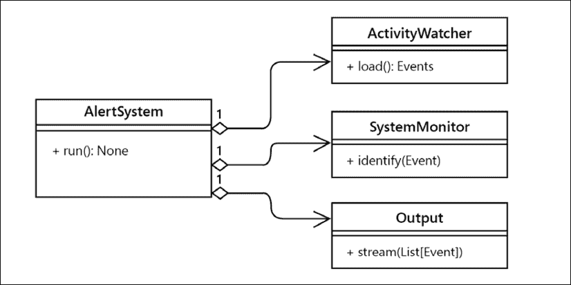
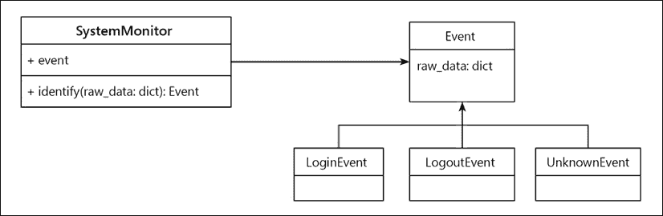
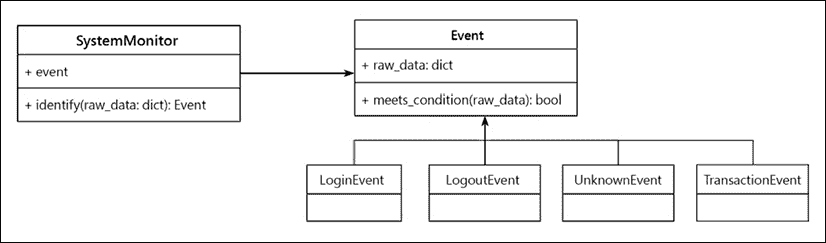
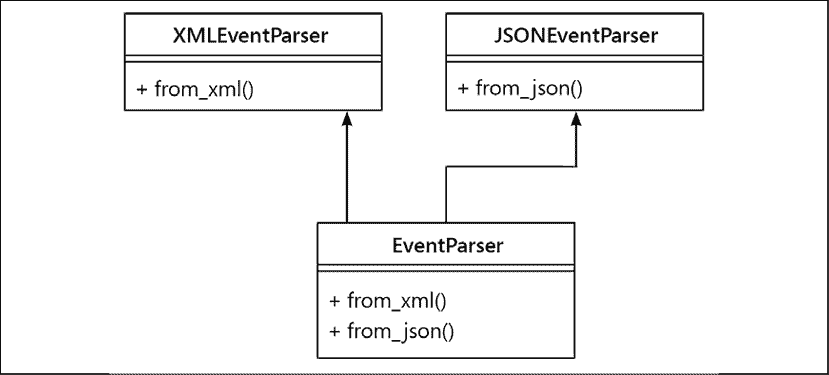
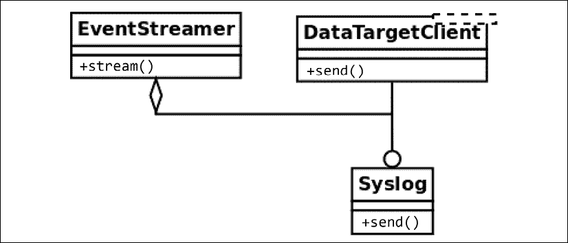

# 四、SOLID 原则

在本章中，我们将继续探讨应用于 Python 的干净设计概念。特别是，我们将回顾**SOLID**原则，以及如何以 Pythonic 的方式实现这些原则。这些原则需要一系列良好的实践来实现更高质量的软件。如果你们中的一些人不知道 SOLID 代表什么，这里是：

*   **S**：单一责任原则
*   **O**：开/关原理
*   **L**：利斯科夫替代原理
*   **I**：接口隔离原则
*   **D**：依赖倒置原则

本章的目标如下：

*   熟悉软件设计的坚实原则
*   设计遵循单一责任原则的软件组件
*   通过开放/关闭原则实现更多可维护代码
*   通过遵循 Liskov 的替换原则，在面向对象设计中实现适当的类层次结构
*   使用界面分离和依赖反转进行设计

# 单一责任原则

**单一责任原则**（**SRP**规定一个软件组件（通常为一个类）必须只有一个责任。事实上，这个类只有一个责任，这意味着它只负责做一件具体的事情，因此，我们可以得出结论，它必须只有一个改变的理由。

只有当域问题上的一件事情发生变化时，类才会被更新。如果我们不得不出于不同的原因对一个类进行修改，这意味着抽象是不正确的，并且这个类有太多的责任。这可能表明至少缺少了一个抽象：需要创建更多的对象来处理导致当前类过载的额外责任。

正如*第 2 章*、*Pythonic Code*中所介绍的，这个设计原则帮助我们按照 Unix 理念构建更多内聚的抽象对象，这些对象只做一件事，也就是一件事。在任何情况下，我们都希望避免拥有具有多重责任的对象（通常称为**上帝对象**，因为他们知道的太多，或者比他们应该知道的更多）。这些对象将不同的（大部分是不相关的）行为分组，从而使它们更难维护。

同样，班级越小越好。

SRP 与软件设计中的内聚思想密切相关，我们在*第 3 章*、*好代码的一般特征*中讨论了软件中的关注点分离。我们在这里努力实现的是，类的设计方式是，它们的大多数属性和属性在大多数情况下都由它们的方法使用。当发生这种情况时，我们知道它们是相关的概念，因此将它们归为同一个抽象概念是有意义的。

在某种程度上，这种想法与关系数据库设计中的规范化概念有些相似。当我们检测到一个对象的接口的属性或方法上有分区时，它们也可能被移动到其他地方，这表明它们是两个或多个不同的抽象混合在一起的。

还有另一种方式来看待这一原则。如果在查看一个类时，我们发现方法是互斥的，并且彼此不相关，那么它们是不同的职责，必须分解为更小的类。

## 责任太多的班级

在本例中，我们将为一个应用程序创建一个案例，该应用程序负责从源（可能是日志文件、数据库或更多源）读取有关事件的信息，并确定与每个特定日志对应的操作。

不符合 SRP 的设计如下所示：


图 4.1：职责太多的类

在不考虑实现的情况下，该类的代码可能如下所示：

```py
# srp_1.py
class SystemMonitor:
    def load_activity(self):
        """Get the events from a source, to be processed."""
    def identify_events(self):
        """Parse the source raw data into events (domain objects)."""
    def stream_events(self):
        """Send the parsed events to an external agent.""" 
```

这个类的问题在于它定义了一个接口，该接口包含一组方法，这些方法对应于正交的操作：每个操作都可以独立于其他操作来完成。

这个设计缺陷使类变得死板、不灵活，并且容易出错，因为它很难维护。在本例中，每个方法都表示类的责任。每个职责都包含一个可能需要修改类的原因。在这种情况下，每个方法都表示必须修改类的各种原因之一。

考虑加载器方法，它从特定的源检索信息。不管这是如何完成的（我们可以在这里抽象实现细节），它都有自己的步骤序列，例如，连接到数据源、加载数据、将其解析为预期格式等等。如果我们需要更改某些内容（例如，我们想要更改用于保存数据的数据结构），`SystemMonitor`类将需要更改。问问自己这是否有意义。系统监视器对象是否必须更改，因为我们更改了数据的表示形式？不

同样的道理也适用于其他两种方法。如果我们更改对事件进行指纹识别的方式，或者更改将事件传递到另一个数据源的方式，我们最终会更改同一个类。

现在应该很清楚，这个类相当脆弱，不易维护。有许多不同的原因会影响这门课的变化。相反，我们希望外部因素尽可能少地影响我们的代码。同样，解决方案是创建更小、更内聚的抽象。

## 分配责任

为了使解决方案更易于维护，我们将每个方法分为不同的类。这样，每个班级都有一个单独的职责：



图 4.2：在班级中分配职责

通过使用与这些新类的实例交互的对象（使用这些对象作为协作者），可以实现相同的行为，但思想仍然是每个类封装一组独立于其他类的特定方法。现在的想法是，对其中任何一个类的更改都不会影响其他类，并且所有这些类都有明确而具体的含义。如果我们需要更改从数据源加载事件的方式，警报系统甚至不知道这些更改，因此我们不必修改系统监视器上的任何内容（只要契约仍然保留），并且数据目标也未修改。

更改现在是本地的，影响最小，并且每个类都更易于维护。

新类定义的接口不仅更易于维护，而且可重用。假设现在，在应用程序的另一部分中，我们还需要从日志中读取活动，但目的不同。在这种设计中，我们可以简单地使用`ActivityWatcher`类型的对象（实际上是一个接口，但就本节而言，该细节并不相关，将在后面的原则中解释）。这是有意义的，而在以前的设计中则没有意义，因为尝试重用我们定义的唯一类也会带来根本不需要的额外方法（如`identify_events()`或`stream_events()`）。

一个重要的澄清是，该原则并不意味着每个类都必须有一个方法。任何新类都可能有额外的方法，只要它们对应于该类负责处理的相同逻辑。

我们在本章探讨的大多数（如果不是全部的话）原则中有一个有趣的观察结果，那就是我们不应该试图从第一次设计就把它们做好。其想法是设计易于扩展和更改的软件，并朝着更稳定的版本发展。

特别是，您可以将 SRP 用作思维过程。例如，如果您正在设计一个组件（比如说一个类），并且需要做很多不同的事情（如前一个示例中所示），那么从一开始您就可以预见这不会很好地结束，并且您需要分离责任。这是一个良好的开端，但问题是：划分责任的正确界限是什么？因此，为了理解这一点，您可以开始编写一个单片类，以便了解内部协作是什么以及职责是如何分配的。这将帮助您更清楚地了解需要创建的新抽象。

# 开放/封闭原则

**开/关原则**（**OCP**）规定一个模块应该同时打开和关闭（但涉及不同方面）。

例如，在设计一个类时，我们应该仔细封装实现细节，以便它具有良好的维护性，这意味着我们希望它对扩展开放，但对修改关闭。

简单来说，这意味着，当然，我们希望我们的代码是可扩展的，以适应领域问题中的新需求或变化。这意味着，当领域问题上出现新的问题时，我们只想向模型中添加新的内容，而不想更改任何现有的、无法修改的内容。

如果出于某种原因，当必须添加新内容时，我们发现自己正在修改代码，那么该逻辑可能设计得很糟糕。理想情况下，当需求发生变化时，我们只需要用新的行为扩展模块，而不必显著改变当前的逻辑。

这一原则适用于几种软件抽象。它可以是我们正在讨论的一个类，甚至是一个模块，但想法仍然是一样的。我们将在下面的两个小节中看到每个示例。

## 不遵守 OCP 的维修性风险示例

让我们从一个示例开始，该系统的设计方式不遵循 OCP，以便了解其带来的可维护性问题以及这种设计的不灵活性。

我们的想法是，系统中有一部分负责识别发生在另一个被监控系统中的事件。在每一点上，我们都希望该组件根据先前收集的数据的值正确地识别事件的类型（为简单起见，我们假设它被打包到一个字典中，并且先前是通过另一种方式（如日志、查询等）检索到的）。我们有一个类，它将根据这些数据检索事件，这是另一种具有自己层次结构的类型。

从*图 4.3*中的类图中，我们看到一个与接口一起工作的对象（一个基类，有几个可以多态使用的子类）：



图 4.3：未关闭以进行修改的设计

乍一看，这可能看起来是一个可扩展的设计：添加一个新事件将创建一个新的`Event`子类，然后系统监视器应该能够使用它们。但是，这并不十分准确，因为这完全取决于 system monitor 类中使用的方法中的实际实现。

第一次尝试解决此问题可能如下所示：

```py
# openclosed_1.py
@dataclass
class Event:
    raw_data: dict 
class UnknownEvent(Event):
    """A type of event that cannot be identified from its data."""
class LoginEvent(Event):
    """A event representing a user that has just entered the system."""
class LogoutEvent(Event):
    """An event representing a user that has just left the system."""
class SystemMonitor:
    """Identify events that occurred in the system."""
    def __init__(self, event_data):
        self.event_data = event_data
    def identify_event(self):
        if (
            self.event_data["before"]["session"] == 0
            and self.event_data["after"]["session"] == 1
        ):
            return LoginEvent(self.event_data)
        elif (
            self.event_data["before"]["session"] == 1
            and self.event_data["after"]["session"] == 0
        ):
            return LogoutEvent(self.event_data)
        return UnknownEvent(self.event_data) 
```

以下是前面代码的预期行为：

```py
>>> l1 = SystemMonitor({"before": {"session": 0}, "after": {"session": 1}})
>>> l1.identify_event().__class__.__name__
'LoginEvent'
>>> l2 = SystemMonitor({"before": {"session": 1}, "after": {"session": 0}})
>>> l2.identify_event().__class__.__name__
'LogoutEvent'
>>> l3 = SystemMonitor({"before": {"session": 1}, "after": {"session": 1}})
>>> l3.identify_event().__class__.__name__
'UnknownEvent' 
```

请注意事件类型的层次结构，以及一些构建它们的业务逻辑。例如，当会话没有以前的标志，但现在有了时，我们将该记录标识为登录事件。相反，如果发生相反的情况，则意味着这是一个注销事件。如果无法识别事件，则返回未知类型的事件。这是通过遵循`null`对象模式来保持多态性（它不是返回`None`，而是检索具有某些默认逻辑的对应类型的对象）。`null`对象模式在*第 9 章*、*常用设计模式*中描述。

这个设计有一些问题。第一个问题是，确定事件类型的逻辑集中在单片方法中。随着我们想要支持的事件数量的增加，这种方法也会增加，并且它可能会成为一种非常长的方法，这是不好的，因为正如我们已经讨论过的，它不会只做一件事，一件事做得很好。

在同一行中，我们可以看到此方法没有关闭以进行修改。每次我们想向系统中添加一种新类型的事件时，我们都必须更改此方法中的某些内容（更不用说`elif`语句链将是一场噩梦！）。

我们希望能够添加新类型的事件，而不必更改此方法（关闭以进行修改）。我们还希望能够支持新类型的事件（开放供扩展），以便在添加新事件时，我们只需添加代码，而不必更改已经存在的代码。

## 重构事件系统以实现可扩展性

前面的例子的问题是`SystemMonitor`类直接与它要检索的具体类交互。

为了实现一个尊重开放/封闭原则的设计，我们必须面向抽象进行设计。

一种可能的替代方法是，在此类与事件协作时考虑此类，然后我们将每个特定类型事件的逻辑委托给相应的类：


图 4.4：遵循 OCP 的设计

然后，我们必须为每种类型的事件添加一个新的（多态）方法，该方法的唯一职责是确定它是否对应于正在传递的数据，并且我们还必须更改逻辑以遍历所有事件，找到正确的一个。

新代码应如下所示：

```py
# openclosed_2.py
class Event:
    def __init__(self, raw_data):
        self.raw_data = raw_data
    @staticmethod
    def meets_condition(event_data: dict) -> bool:
        return False
class UnknownEvent(Event):
    """A type of event that cannot be identified from its data"""
class LoginEvent(Event):
    @staticmethod
    def meets_condition(event_data: dict):
        return (
            event_data["before"]["session"] == 0
            and event_data["after"]["session"] == 1
        )
class LogoutEvent(Event):
    @staticmethod
    def meets_condition(event_data: dict):
        return (
            event_data["before"]["session"] == 1
            and event_data["after"]["session"] == 0
        )
class SystemMonitor:
    """Identify events that occurred in the system."""
    def __init__(self, event_data):
        self.event_data = event_data
    def identify_event(self):
        for event_cls in Event.__subclasses__():
            try:
                if event_cls.meets_condition(self.event_data):
                    return event_cls(self.event_data)
            except KeyError:
                continue
        return UnknownEvent(self.event_data) 
```

请注意，交互现在是如何面向抽象的（在本例中，它将是泛型基类`Event`，它甚至可能是抽象基类或接口，但就本例而言，有一个具体的基类就足够了）。该方法不再适用于特定类型的事件，而仅适用于遵循公共接口的通用事件，它们相对于`meets_condition`方法都是多态的。

注意如何通过`__subclasses__()`方法发现事件。支持新类型的事件现在只是为该事件创建一个新类，该类必须根据特定标准扩展`Event`和并实现自己的`meets_condition()`方法。

这个例子依赖于`__subclasses__()`方法，因为它足以说明可扩展设计的思想。也可以使用其他替代方法，例如使用`abc`模块注册类，或者创建我们自己的注册表，但主要思想是相同的，并且对象之间的关系不会改变。

通过这种设计，原来的`identify_event`方法是封闭的：当我们向我们的领域添加一种新类型的事件时，它不需要修改。相反，事件的层次结构是开放的，可以扩展：当一个新事件出现在域中时，我们只需要创建一个新实体，并根据它实现的接口定义它的标准。

## 扩展事件系统

现在，让我们证明这个设计实际上是我们想要的可扩展性。假设出现了新的需求，我们还必须支持与用户在受监控系统上执行的事务相对应的事件。

设计的类图必须包括这种新的事件类型，如*图 4.5*所示：



Figure 4.5: The design extended

我们创建新的类，在其`meets_condition`方法上实现标准，其余的逻辑应该像以前一样继续工作（包括新的行为）。

假设之前的定义的所有剩余都没有改变，下面是新类的代码：

```py
# openclosed_3.py
class TransactionEvent(Event):
    """Represents a transaction that has just occurred on the system."""
    @staticmethod
    def meets_condition(event_data: dict):
        return event_data["after"].get("transaction") is not None 
```

我们可以验证以前的案例是否与以前一样有效，以及是否正确识别了新事件：

```py
>>> l1 = SystemMonitor({"before": {"session": 0}, "after": {"session": 1}})
>>> l1.identify_event().__class__.__name__
'LoginEvent'
>>> l2 = SystemMonitor({"before": {"session": 1}, "after": {"session": 0}})
>>> l2.identify_event().__class__.__name__
'LogoutEvent'
>>> l3 = SystemMonitor({"before": {"session": 1}, "after": {"session": 1}})
>>> l3.identify_event().__class__.__name__
'UnknownEvent'
>>> l4 = SystemMonitor({"after": {"transaction": "Tx001"}})
>>> l4.identify_event().__class__.__name__
'TransactionEvent' 
```

注意，当我们添加新的事件类型时，`SystemMonitor.identify_event()`方法根本没有改变。因此，我们说这种方法对于新类型的事件是封闭的。

相反，`Event`类允许我们在需要时添加新类型的事件。然后我们说，事件对于新类型的扩展是开放的。

这就是这个原则的真正本质当领域问题上出现新的东西时，我们只想添加新的代码，不想修改任何现有的代码。

## 关于 OCP 的最后思考

正如您可能已经注意到的，这一原则与多态性的有效使用密切相关。我们希望致力于设计尊重客户可以使用的多态契约的抽象，使之成为一种足够通用的结构，以便在保留多态关系的情况下扩展模型。

这一原则解决了软件工程中的一个重要问题：可维护性。不遵循 OCP 的风险是软件中的连锁反应和问题，其中单个更改会触发整个代码库的更改，或者有破坏代码其他部分的风险。

最后一个重要的注意事项是，为了实现这样一种设计，即我们不改变代码来扩展行为，我们需要能够针对我们想要保护的抽象（在本例中，是新类型的事件）创建适当的闭包。这并非在所有程序中都是可能的，因为某些抽象可能会发生冲突（例如，我们可能有一个适当的抽象，它提供了针对某个需求的闭包，但不适用于其他类型的需求）。在这些情况下，我们需要有选择性地应用一种策略，为需要最具可扩展性的需求类型提供最佳的关闭。

# 利斯科夫替代原理

**Liskov 的替换原则**（**LSP**）指出，一个对象类型必须保持一系列属性，以保持其设计的可靠性。

LSP 背后的主要思想是，对于任何类，客户机都应该能够不加区分地使用其任何子类型，甚至不需要注意，因此在运行时也不会影响预期的行为。这意味着客户端是完全隔离的，不知道类层次结构中的更改。

更正式地说，这是 LSP 的原始定义（LISKOV 01）：如果*S*是*T*的子类型，那么*T*类型的对象可以被*S*类型的对象替换，而不会中断程序。

这可以通过下面这样一个通用图来理解。假设有一个客户机类需要（包括）另一种类型的对象。一般来说，我们希望该客户机与某种类型的对象交互，也就是说，它将通过接口工作。

现在，这种类型可能只是一个通用接口定义、一个抽象类或一个接口，而不是一个具有行为本身的类。可能有多个子类扩展此类型（如*图 4.6*所述，名称为`Subtype`，最多为`N`。这一原则背后的思想是，如果层次结构得到了正确实现，那么客户机类必须能够处理任何子类的实例，而无需注意。这些物体应该是可互换的，如*图 4.6*所示：


图 4.6：通用子类型层次结构

这与我们已经访问过的其他设计原则有关，比如为接口设计。一个好的类必须定义一个清晰简洁的接口，并且只要子类尊重该接口，程序就会保持正确。

因此，该原则也与合同设计背后的理念有关。给定类型和客户之间存在合同。通过遵循 LSP 的规则，设计将确保子类遵守父类定义的契约。

## 使用工具检测 LSP 问题

关于 LSP，有一些场景是出了名的错误，我们在*第 1 章*、*简介、代码格式和工具*（主要是`mypy`和`pylint`中学习配置的工具可以很容易地识别它们。

### 使用 mypy 检测不正确的方法签名

通过在我们的代码中使用类型注释（如*第一章*中推荐的、*简介、代码格式和工具*），并配置`mypy`，我们可以快速早期发现一些基本错误，并免费检查与 LSP 的基本一致性。

如果`Event`类的其中一个子类以不兼容的方式重写方法，`mypy`会通过检查注释注意到这一点：

```py
class Event:
    ...
    def meets_condition(self, event_data: dict) -> bool:
        return False
class LoginEvent(Event):
    def meets_condition(self, event_data: list) -> bool:
        return bool(event_data) 
```

当我们在这个文件上运行`mypy`时，我们会收到一条错误消息，上面说：

```py
error: Argument 1 of "meets_condition" incompatible with supertype "Event" 
```

对 LSP 的违反是显而易见的，因为派生类使用的`event_data`参数类型与在基类上定义的参数类型不同，因此我们不能期望它们的工作方式相同。记住，根据这一原则，此层次结构的任何调用方都必须能够透明地使用`Event`或`LoginEvent`，而不会注意到任何差异。交换这两种类型的对象不应使应用程序失败。否则将破坏层次结构上的多态性。

如果将返回类型更改为非`Boolean`值，则会发生相同的错误。其基本原理是，此代码的客户端希望使用`Boolean`值。如果其中一个派生类更改此返回类型，它将破坏契约，并且我们不能期望程序继续正常工作。

关于不相同但共享一个公共接口的类型的简要说明：尽管这只是一个简单的示例来演示错误，但字典和列表都有一些共同点仍然是正确的；他们都是不可救药的。这意味着，在某些情况下，如果一个方法需要一个字典，另一个方法需要接收一个列表，那么这两个方法都可以通过 iterable 接口处理参数。在这种情况下，问题不在于逻辑本身（LSP 可能仍然适用），而在于对签名类型的定义中，签名类型既不应为`list`也不应为`dict`，而是两者的并集。无论何种情况，都必须修改某些内容，无论是方法的代码、整个设计，还是仅仅是类型注释，但在任何情况下，我们都不应压制警告并忽略`mypy`给出的错误。

不要通过使用`# type: ignore`或类似的方式忽略此类错误。重构或更改代码以解决实际问题。这些工具报告了一个实际的设计缺陷，原因是合理的。

从面向对象的设计角度来看，这一原则也是有意义的。记住，子类化应该创建更具体的类型，但是每个子类必须是父类声明的。对于上一节中的示例，系统监视器希望能够互换地处理任何事件类型。但是这些事件类型中的每一个都是一个事件（一个`LoginEvent`必须是一个`Event`，其他子类也必须是）。如果这些对象中的任何一个通过不实现来自基`Event`类的消息、实现此类中未声明的另一个公共方法或更改方法的签名而打破了层次结构，则`identify_event`方法可能不再工作。

### 用 pylint 检测不兼容的签名

LSP 的另一个强烈的违反是当方法的签名完全不同而不是改变层次结构上的参数类型时。这似乎是一个相当大的错误，但发现它可能并不总是那么容易记住；Python 是被解释的，所以早期没有编译器来检测这些类型的错误，因此直到运行时才会捕获它们。幸运的是，我们有静态代码分析器，比如`mypy`和`pylint`，可以在早期捕获像这样的错误。

虽然`mypy`也将捕获这些类型的错误，但也可以运行`pylint`以获得更多的洞察力。

存在破坏层次结构定义的兼容性的类（例如，通过更改方法的签名、添加额外参数等），例如：

```py
# lsp_1.py
class LogoutEvent(Event):
    def meets_condition(self, event_data: dict, override: bool) -> bool:
        if override:
            return True
        ... 
```

`pylint`将检测到它，并打印一个信息性错误：

```py
Parameters differ from overridden 'meets_condition' method (arguments-differ) 
```

同样，与前一种情况一样，不要抑制这些错误。注意工具给出的警告和错误，并相应地调整代码。

## 更微妙的 LSP 违规案例

然而，在其他情况下，LSP 被破坏的方式并不清楚或明显，以至于工具可以自动为我们识别它，我们在进行代码审查时必须依靠仔细的代码检查。

合同被修改的情况尤其难以自动检测。考虑到 LSP 的整个思想是，客户机可以像其父类一样使用子类，因此在层次结构上正确地保留契约也是正确的。

请记住*第 3 章**好代码的一般特征*中，当按合同进行设计时，客户和供应商之间的合同设定了一些规则，客户必须为方法提供前提条件，供应商可能会验证这些规则，它将返回一些结果给客户端，客户端将以后置条件的形式进行检查。

父类定义与其客户机的契约。这个类的子类必须尊重这样的契约。这意味着，例如：

*   子类决不能使前提条件比在父类上定义的更严格
*   子类决不能使后置条件弱于父类上定义的后置条件

考虑前面一节中定义的事件层次结构的例子，但是现在有一个改变来说明 LSP 和 DBC 之间的关系。

这一次，我们将为基于数据检查标准的方法假设一个先决条件，即提供的参数必须是一个包含键`"before"`和`"after"`的字典，并且它们的值也是嵌套字典。这允许我们进一步封装，因为现在客户端不需要捕获`KeyError`异常，而只需调用前置方法（假设如果系统在错误的假设下运行，则可以接受失败）。

顺便说一句，我们可以从客户端删除它，这是很好的，就像现在一样，`SystemMonitor`不需要知道 collaborator 类的方法可能会引发哪些类型的异常（请记住，异常会削弱封装，因为它们要求调用方额外了解它们调用的对象）。

这种设计可以通过代码中的以下更改来表示：

```py
# lsp_2.py
from collections.abc import Mapping

class Event:
    def __init__(self, raw_data):
        self.raw_data = raw_data

    @staticmethod
    def meets_condition(event_data: dict) -> bool:
        return False

    @staticmethod
    def validate_precondition(event_data: dict):
        """Precondition of the contract of this interface.

        Validate that the ``event_data`` parameter is properly formed.
        """
        if not isinstance(event_data, Mapping):
            raise ValueError(f"{event_data!r} is not a dict")
        for moment in ("before", "after"):
            if moment not in event_data:
                raise ValueError(f"{moment} not in {event_data}")
            if not isinstance(event_data[moment], Mapping):
                raise ValueError(f"event_data[{moment!r}] is not a dict") 
```

现在，尝试检测正确事件类型的代码只需检查一次前提条件，继续查找正确的事件类型：

```py
# lsp_2.py
class SystemMonitor:
    """Identify events that occurred in the system."""
    def __init__(self, event_data):
        self.event_data = event_data
    def identify_event(self):
        Event.validate_precondition(self.event_data)
        event_cls = next(
            (
                event_cls
                for event_cls in Event.__subclasses__()
                if event_cls.meets_condition(self.event_data)
            ),
            UnknownEvent,
        )
        return event_cls(self.event_data) 
```

合同仅规定顶级键`"before"`和`"after"`是强制性的，它们的值也应该是字典。子类中要求更严格的参数的任何尝试都将失败。

事务事件的类最初设计正确。看看代码如何不对名为`"transaction"`的内部密钥施加限制；它仅在存在时使用其值，但这不是强制性的：

```py
# lsp_2.py
class TransactionEvent(Event):
    """Represents a transaction that has just occurred on the system."""
    @staticmethod
    def meets_condition(event_data: dict) -> bool:
        return event_data["after"].get("transaction") is not None 
```

但是，最初的两种方法是不正确的，因为它们要求存在名为`"session"`的密钥，该密钥不是原始合同的一部分。这违反了合同，现在客户端不能以使用其余类的方式使用这些类，因为它将引发`KeyError`。

修正后（更改`.get()`方法的方括号），LSP 上的顺序已重新建立，且多态性占优势：

```py
>>> l1 = SystemMonitor({"before": {"session": 0}, "after": {"session": 1}})
>>> l1.identify_event().__class__.__name__
'LoginEvent'
>>> l2 = SystemMonitor({"before": {"session": 1}, "after": {"session": 0}})
>>> l2.identify_event().__class__.__name__
'LogoutEvent'
>>> l3 = SystemMonitor({"before": {"session": 1}, "after": {"session": 1}})
>>> l3.identify_event().__class__.__name__'UnknownEvent'
>>> l4 = SystemMonitor({"before": {}, "after": {"transaction": "Tx001"}})
>>> l4.identify_event().__class__.__name__
'TransactionEvent' 
```

期望自动化工具（不管它们有多好、多么有用）来检测像这样的案例是不合理的。在设计类时，我们必须小心，不要意外地改变方法的输入或输出，使之与客户最初期望的不兼容。

## 关于 LSP 的评论

LSP 是良好的面向对象软件设计的基础，因为它强调了多态性的核心特征之一。它是关于创建正确的层次结构，以便从基层次结构派生的类相对于其接口上的方法沿着父层次结构是多态的。

还值得注意的是，如果我们试图用一个不兼容的新类扩展一个类，它将失败，与客户机的契约将被破坏，因此这种扩展将不可能（或者，为了使之成为可能，我们必须打破原则的另一端，修改客户端中应关闭以进行修改的代码，这是完全不可取和不可接受的）。

按照 LSP 建议的方式仔细思考新类有助于我们正确扩展层次结构。我们可以说 LSP 对 OCP 有贡献。

# 接口隔离

**接口隔离原则**（**ISP**）为我们已经反复的一个想法提供了一些指导：接口应该是小的。

在面向对象的术语中，**接口**是由对象公开的一组方法和属性表示的。也就是说，一个对象能够接收或解释的所有消息构成了它的接口，这是其他客户端可以请求的。接口将类的公开行为的定义与其实现分离。

在 Python 中，接口由类根据其方法隐式定义。这是因为 Python 遵循了所谓的**duck typing**原则。

传统上，duck 类型背后的想法是，任何对象都是由它拥有的方法和它能够做什么来表示的。这意味着，不管类的类型、名称、docstring、类属性或实例属性如何，最终定义对象本质的是它拥有的方法。类中定义的方法（它知道如何做）决定了该对象将是什么。它之所以被称为鸭子打字，是因为“如果它走路像鸭子，嘎嘎叫像鸭子，那它一定是鸭子。”

很长一段时间以来，duck 类型是 Python 中定义接口的唯一方式。后来，PEP-3119 引入了抽象基类的概念，作为以不同方式定义接口的一种方式。抽象基类的基本思想是它们定义一些派生类负责实现的基本行为或接口。这在我们希望确保某些关键方法确实被重写的情况下非常有用，并且它还可以作为重写或扩展方法（如`isinstance()`的功能）的机制。

抽象基类的引入是为了为开发人员提供一个有用且功能强大的工具来指示必须实际实现的事情。例如，考虑到前面的 principle exposed（LSP），如果我们有一个泛型`Event`类，我们不想使用该类本身（因为它本身并不意味着什么），所以我们可能需要处理一个实际事件（例如子类，如`LoginEvent`）。在这种情况下，我们可以将`Event`定义为一个抽象基类，以使其显式化。然后，系统监视器处理一种类型的事件，`Event`类的行为就像一个接口（用的方式表示“任何具有这种行为的对象”）。我们可以进一步确定`meets_condition`方法的默认实现是不够的（或者有时接口无法提供实现），并强制每个派生类实现它。为此，我们将使用`@abstractmethod`装饰器。

`abc`模块还包含将某些类型注册为层次结构的一部分的方法，即所谓的虚拟子类。这个想法是，通过添加一个新的标准“像鸭子一样走路”、“像鸭子一样呱呱叫”，或者。。。它说它是一只鸭子。

这些关于 Python 如何解释接口的概念对于理解这一原则和下一个原则非常重要。

抽象地说，ISP 指出，当我们定义一个提供多个方法的接口时，最好将其分解为多个接口，每个接口包含的方法较少（最好只有一个），并且具有非常具体和准确的范围。通过将接口划分为尽可能小的单元，以利于代码的可重用性，每个想要实现其中一个接口的类都很可能具有高度的内聚性，因为它具有非常明确的行为和一组职责。

## 提供太多信息的接口

现在，我们希望能够以不同的格式（例如 XML 和 JSON）解析来自多个数据源的事件。根据良好实践，我们决定将接口作为依赖项，而不是具体的类，并设计了如下内容：


图 4.7：提供过多不相交功能的接口

为了在 Python 中创建一个接口，我们将使用一个抽象基类，并将方法（`from_xml()`和`from_json()`定义为抽象，以强制派生类实现它们。从这个抽象基类派生并实现这些方法的事件将能够使用它们相应的类型。

但是，如果一个特定的类不需要 XML 方法，并且只能从 JSON 构建，该怎么办？它仍然会从接口携带`from_xml()`方法，因为它不需要它，所以它必须通过。这不是很灵活，因为它会创建耦合并强制接口的客户端使用他们不需要的方法。

## 界面越小越好

最好将其分为两个不同的接口，每个接口对应一个方法。我们仍然可以通过让事件解析器类实现这两个接口来实现相同的功能（因为接口或抽象基类只是带有一些增强约束的常规类，Python 支持多重继承）。现在的区别是，我们在一个更具体的接口中声明了每个方法，如果我们在代码的其他地方需要它，我们可以重用它：



图 4.8：通过单独接口实现的相同功能

通过这种设计，从`XMLEventParser`派生并实现`from_xml()`方法的对象将知道如何从 XML 构造，JSON 文件也是如此，但最重要的是，我们保持了两个独立函数的正交性，并保持系统的灵活性，同时又不会失去通过组合新的较小对象仍然可以实现的任何功能。

这就是代码如何查找*图 4.8*的表示形式：

```py
from abc import ABCMeta, abstractmethod
class XMLEventParser(metaclass=ABCMeta):
    @abstractmethod
    def from_xml(xml_data: str):
        """Parse an event from a source in XML representation."""

class JSONEventParser(metaclass=ABCMeta):
    @abstractmethod
    def from_json(json_data: str):
        """Parse an event from a source in JSON format."""

class EventParser(XMLEventParser, JSONEventParser):
    """An event parser that can create an event from source data either in XML or JSON format.
    """

    def from_xml(xml_data):
        pass

    def from_json(json_data: str):
        pass 
```

请注意，接口所需的抽象方法必须在具体类中实现（尽管它们的实际实现与示例无关）。如果我们不实现它们，将触发运行时错误，例如：

```py
>>> from src.isp import EventParser
>>> EventParser()
Traceback (most recent call last):
  File "<stdin>", line 1, in <module>
TypeError: Can't instantiate abstract class EventParser with abstract methods from_json, from_xml 
```

这与 SRP 有一些相似之处，但主要区别在于，这里我们讨论的是接口，因此它是行为的抽象定义。没有理由更改，因为在接口实际实现之前，没有任何内容。然而，不遵守这一原则将创建一个与正交功能耦合的接口，并且这个派生类也将不遵守 SRP（它将有不止一个更改的原因）。

## 接口应该有多小？

上一节中提出的观点是正确的，但也需要一个警告，如果误解或走到极端，请避免走危险的道路。

基类（抽象或非抽象）为所有其他类定义一个接口来扩展它。这应该尽可能小，这一事实必须从内聚性的角度来理解，它应该做一件事。这并不意味着它必须有一种方法。在前一个例子中，这两种方法都是不连贯的，这是巧合；因此，将它们分为不同的类别是有意义的。

但可能有多个方法属于同一类。假设您想要提供一个 mixin 类来抽象上下文管理器中的某些逻辑，以便从该 mixin 派生的所有类都可以免费获得该上下文管理器逻辑。我们已经知道，上下文管理器需要两种方法：`__enter__`和`__exit__`。它们必须同时进行，否则结果将根本不是有效的上下文管理器！

如果不将两个方法放在同一个类中，将导致组件损坏，这不仅是无用的，而且是危险的。希望这个夸张的例子能与上一节中的起到平衡作用，一起你可以更准确地了解界面的设计。

# 依赖倒置

这是一个非常强大的想法，稍后当我们在*第 9 章*、*常见设计模式*和*第 10 章*、*清洁架构*中探索一些设计模式时，我们会再次想到这个想法。

**依赖倒置原则**（**DIP**）提出了一个有趣的设计原则，我们通过使代码独立于脆弱、易变或失控的事物来保护它。反转依赖关系的想法是，我们的代码不应该适应细节或具体实现，而是相反：我们希望通过某种 API 强制任何实现或细节适应我们的代码。

抽象必须以一种不依赖于细节的方式进行组织，相反，围绕细节的另一种方式（具体实现）应该依赖于抽象。

假设我们的设计中有两个对象需要协作，*A*和*B*。*A*与*B*实例一起工作，但事实证明，我们的模块并不直接控制*B*（可能是外部库，也可能是其他团队维护的模块，等等）。如果我们的代码严重依赖于*B*，当这一变化时，代码将中断。为了防止这种情况，我们必须颠倒依赖关系：使*B*必须适应*A*。这是通过提供一个接口来实现的，并强制我们的代码不依赖于*B*的具体实现，而是依赖于我们定义的接口。然后*B*有责任遵守该接口。

与前面章节探讨的概念一致，抽象也以接口（或 Python 中的抽象基类）的形式出现。

一般来说，我们可以期望具体的实现比抽象组件更频繁地更改。正是由于这个原因，我们将抽象（接口）作为灵活性点，在这里我们希望我们的系统能够在不改变抽象本身的情况下进行更改、修改或扩展。

## 刚性依赖的一种情况

我们的事件监控系统的最后一部分是将识别的事件发送到数据采集器进行进一步分析。这种想法的天真实现将包括一个与数据目的地交互的事件拖缆类，例如，`Syslog`：


图 4.9：一个对另一个类有很强依赖性的类

但是，这个设计不是很好，因为我们有一个高级类（`EventStreamer`）依赖于一个低级类（`Syslog`是一个实现细节）。如果我们希望向`Syslog`发送数据的方式发生变化，则必须修改`EventStreamer`。如果我们想在运行时更改的数据目的地或添加新的数据目的地，我们也会遇到麻烦，因为我们会发现自己不断修改`stream()`方法以适应这些要求。

## 反转依赖项

这些问题的解决方案是让`EventStreamer`使用接口而不是具体的类来工作。这样，此接口的实现取决于包含实现细节的低级类：



图 4.10：通过反转依赖项重构的功能。

现在有一个接口，它表示将要发送数据的通用数据目标。请注意，依赖关系现在是如何颠倒的，因为`EventStreamer`不依赖于特定数据目标的具体实现，它不必随着此数据目标的变化而变化，并且取决于每个特定数据目标正确实现接口，并在必要时适应变化。

换句话说，第一个实现的原始`EventStreamer`只处理`Syslog`类型的对象，这不是很灵活。然后我们意识到它可以处理任何能够响应`.send()`消息的对象，并将此方法确定为它需要遵守的接口。现在，在这个版本中，`Syslog`实际上扩展了名为`DataTargetClient`的抽象基类，它定义了`send()`方法。从现在起，每个新类型的数据目标（例如电子邮件）都需要扩展这个抽象基类并实现`send()`方法。

我们甚至可以在运行时为实现`send()`方法的任何其他对象修改此属性，它仍然可以工作。这就是为什么经常被称为**依赖项注入**：因为依赖项可以动态提供（注入）。

精明的读者可能想知道为什么这是必要的。Python 足够灵活（有时过于灵活），允许我们提供一个类似于`EventStreamer`的对象，其中包含任何特定的数据目标对象，而这个对象不必遵守任何接口，因为它是动态类型的。问题是：当我们可以简单地通过`send()`方法将对象传递给抽象基类（接口）时，为什么我们需要定义抽象基类（接口）？

平心而论，这是事实；实际上没有必要这样做，程序也会照样工作。毕竟，多态性并不意味着（或要求）继承必须起作用。然而，定义抽象基类是一个好的实践，它有一些优点，第一个是 duck 类型。与 duck 类型一起，我们可以提到这样一个事实，即模型变得更具可读性记住继承遵循的规则是**是**，因此通过声明抽象基类并从中扩展，我们可以说，`Syslog`是`DataTargetClient`，这是代码的用户可以阅读和理解的（同样，这是 duck 类型）。

总而言之，定义抽象基类不是强制性的，但为了实现更干净的设计，它是可取的。这是本书旨在帮助程序员避免容易犯错误的内容之一，因为 Python 太灵活了，我们可以侥幸逃脱。

## 依赖注入

上一节探讨的概念给了我们一个强大的想法：与其让代码依赖于具体的实现，不如创建一个强大的抽象，作为中间的一层。在这个例子中，我们讨论了依赖`Syslog`将如何导致严格的设计，因此我们为所有客户端创建了一个接口，并决定`Syslog`正好是其中之一，因为它实现了`DataTargetClient`接口。这为我们将来要添加的更多客户端打开了大门：只需创建一个实现接口并定义`send`方法的新类。该设计现在是开放的扩展和关闭的修改（我们开始看到如何相互关系的原则）。

现在，这些对象之间的协作将如何？在这一部分中，我们将探讨如何将依赖关系提供给实际需要它的对象。

一种方法是直接创建所需的对象来声明事件拖缆工作，在本例中为`Syslog`：

```py
class EventStreamer:
    def __init__(self):
        self._target = Syslog()
    def stream(self, events: list[Event]) -> None:
        for event in events:
            self._target.send(event.serialise()) 
```

然而，这不是一个非常灵活的设计，它没有充分利用我们创建的界面。注意，这种设计也更难测试：如果你要为这个类编写一个单元测试，你要么修补`Syslog`对象的创建，要么在它刚刚创建之后重写它。如果`Syslog`在创建时有副作用（通常不是很好的做法，但在某些情况下可以，例如，当您可能想要建立连接时），那么这些副作用也会被带到该初始化中。的确，这可以通过使用 lazy 属性来克服，但是实际控制我们提供的对象的灵活性仍然存在。

更好的设计将使用依赖项注入，并将目标提供给事件拖缆：

```py
class EventStreamer:
    def __init__(self, target: DataTargetClient):
        self._target = target
    def stream(self, events: list[Event]) -> None:
        for event in events:
            self._target.send(event.serialise()) 
```

这将利用接口并启用多态性。现在，我们可以在初始化时传递实现此接口的任何对象，这也使得事件流与此类对象一起工作更加明确。

与前一种情况相反，此版本也更易于测试。如果我们不想在单元测试中处理`Syslog`，我们可以提供一个 test double（只是一个符合接口的新类，对于我们需要测试的任何东西都很有用）。

不要在初始化方法中强制创建依赖项。相反，让您的用户通过在`__init__`方法中使用参数，以更灵活的方式定义依赖项。

在某些情况下，当对象具有更复杂的初始化（更多参数）或有很多参数时，最好在依赖关系图中声明对象之间的交互，然后让库为您实际创建对象（也就是说，删除绑定不同对象的粘合代码样板）。

此类库的示例可以是`pinject`（[https://github.com/google/pinject](https://github.com/google/pinject) ），它允许您声明对象如何交互。在我们的简单示例中，一种可能是这样编写代码：

```py
class EventStreamer:
    def __init__(self, target: DataTargetClient):
        self.target = target
    def stream(self, events: list[Event]) -> None:
        for event in events:
            self.target.send(event.serialise())
class _EventStreamerBindingSpec(pinject.BindingSpec):
    def provide_target(self):
        return Syslog()
object_graph = pinject.new_object_graph(
    binding_specs=[_EventStreamerBindingSpec()]) 
```

使用与前面相同的类定义，我们可以定义绑定规范，它是一个知道如何注入依赖项的对象。在这个对象中，任何名为 provide`_<dependency>`的方法都应该返回以该名称作为后缀的依赖项（在我们的简单示例中，我们选择了`Syslog`。

然后我们创建`graph`对象，我们将使用该对象获取具有已提供的依赖项的对象；例如

```py
event_streamer = object_graph.provide(EventStreamer) 
```

将给我们一个`event_streamer`对象，其目标是`Syslog`的实例。

当对象之间有多个依赖项或相互关系时，最好将它们编写为声明性的，并让工具为您处理初始化。在这种情况下，我们的想法是，对于这些类型的对象，我们定义如何在单个位置创建它们，并让工具为我们这样做（从这个意义上讲，它类似于工厂对象）。

请记住，这并没有失去最初从我们的设计中获得的灵活性。对象图是一个知道如何根据定义构建其他实体的对象，但我们仍然完全控制我们创建的`EventStreamer`类，并且可以像以前一样使用它，通过在符合所需接口的初始化方法中传递任何对象。

# 总结

SOLID原则是良好的面向对象软件设计的关键准则。

构建软件是一项极其艰巨的任务——代码的逻辑非常复杂，运行时的行为很难预测（如果可能的话，有时也很难预测），需求和环境都在不断变化，而且可能会出现多种错误。

此外，有多种方法可以使用不同的技术、范例或工具构建软件，这些方法可以协同工作，以特定的方式解决特定的问题。然而，随着时间的推移和需求的变化或发展，并非所有这些方法都是正确的。然而，到了这个时候，对一个错误的设计做点什么已经太迟了，因为它是僵硬的、不灵活的，因此很难将重构转化为正确的解决方案。

这意味着，如果我们把设计搞错了，将来会花很多钱。那么，我们如何才能实现一个最终会有回报的好设计呢？答案是我们不能确定。我们正在应对未来，而未来是不确定的。我们无法确定我们的设计是否正确，我们的软件是否在未来几年内具有灵活性和适应性。正是出于这个原因，我们必须坚持原则。

这就是SOLID原则发挥作用的地方。它们不是一条神奇的规则（毕竟，软件工程中没有银弹），但它们提供了良好的指导方针，在过去的项目中已被证明有效，并将使我们的软件更有可能成功。我们的想法不是要从第一个版本就获得所有的需求，而是要实现一个可扩展、足够灵活的设计，以便我们可以根据需要进行调整。

在本章中，我们探讨了SOLID原则，目的是理解清洁设计。在接下来的章节中，我们将继续探索该语言的细节，并在某些情况下了解如何将这些工具和功能与这些原则结合使用。

*第 5 章**使用修饰符改进我们的代码*，探讨如何利用修饰符改进我们的代码。与本章更侧重于软件工程的抽象思想不同，*第 5 章**使用装饰程序改进代码*将更侧重于 Python，但我们将使用刚刚学到的原则。

# 工具书类

以下是您可以参考的信息列表：

*   *SRP 01*：*单一责任原则*（[https://8thlight.com/blog/uncle-bob/2014/05/08/SingleReponsibilityPrinciple.html](https://8thlight.com/blog/uncle-bob/2014/05/08/SingleReponsibilityPrinciple.html)
*   *PEP-3119*：*引入抽象基类*（[https://www.python.org/dev/peps/pep-3119/](https://www.python.org/dev/peps/pep-3119/)
*   *面向对象软件构建*，*第二版*，作者*Bertrand Meyer*
*   *LISKOV 01*：一篇由*Barbara LISKOV*撰写的论文，名为*数据抽象和层次结构*（[https://www.cs.tufts.edu/~nr/cs257/archive/barbara liskov/data-abstraction-and-hierarchy.pdf](https://www.cs.tufts.edu/~nr/cs257/archive/barbara-liskov/data-abstraction-and-hierarchy.pdf)