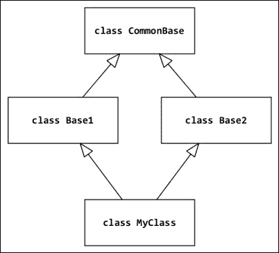

# 三、语法最佳实践——高于类级别

现在我们将重点讨论类的语法最佳实践。这里不打算涵盖设计模式，因为它们将在[第 14 章](14.html "Chapter 14. Useful Design Patterns")、*有用的设计模式*中讨论。本章概述了用于操作和增强类代码的高级 Python 语法。

对象模型在 Python2 的历史上有了很大的发展。很长一段时间以来，我们生活在一个世界里，两种面向对象编程范式的实现共存于同一种语言中。这两个模型被简单地称为*旧式*和*新式*类。Python3 结束了这种二分法，只有称为*新型*类的模型可供开发人员使用。无论如何，了解它们在 Python2 中是如何工作的仍然很重要，因为这将帮助您移植旧代码和编写向后兼容的应用程序。了解对象模型是如何改变的，也将有助于您理解为什么现在要这样设计。这就是为什么尽管本书针对的是最新的 Python3 版本，但下一章将有大量关于 Python2 旧特性的注释。

本章将讨论以下主题：

*   子类化内置类型
*   从超类访问方法
*   使用属性和插槽
*   元编程

# 子类化内置类型

在 Python 中对内置类型进行子类化非常简单。名为`object`的内置类型是所有内置类型以及未指定显式父类的所有用户定义类的共同祖先。由于这一点，每当需要实现一个行为几乎与内置类型类似的类时，最好的做法就是对其进行子类型化。

现在，我们将向您展示一个名为`distinctdict`的类的代码，该类使用这种技术。它是通常 Python`dict`类型的子类。这个新类在大多数方面的行为与普通 Python`dict`类似。但是，当有人试图添加具有相同值的新条目时，它不会允许具有相同值的多个键，而是会引发一个带有帮助消息的`ValueError`子类：

```py
class DistinctError(ValueError):
    """Raised when duplicate value is added to a distinctdict."""

class distinctdict(dict):
    """Dictionary that does not accept duplicate values."""
    def __setitem__(self, key, value):
        if value in self.values():
            if (
                (key in self and self[key] != value) or
                key not in self
            ):
                raise DistinctError(
                    "This value already exists for different key"
                )

        super().__setitem__(key, value)
```

以下是在交互会话中使用`distictdict`的示例：

```py
>>> my = distinctdict()
>>> my['key'] = 'value'
>>> my['other_key'] = 'value'
Traceback (most recent call last):
 File "<input>", line 1, in <module>
 File "<input>", line 10, in __setitem__
DistinctError: This value already exists for different key
>>> my['other_key'] = 'value2'
>>> my
{'key': 'value', 'other_key': 'value2'}

```

如果查看现有代码，您可能会发现许多类部分实现了内置类型，并且作为子类型可以更快更干净。例如，`list`类型管理序列，每次类在内部处理序列时都可以使用它：

```py
class Folder(list):
    def __init__(self, name):
        self.name = name

    def dir(self, nesting=0):
        offset = "  " * nesting
        print('%s%s/' % (offset, self.name))

        for element in self:
            if hasattr(element, 'dir'):
                element.dir(nesting + 1)
            else:
                print("%s  %s" % (offset, element))
```

以下是交互式会话中的示例用法：

```py
>>> tree = Folder('project')
>>> tree.append('README.md')
>>> tree.dir()
project/
 README.md
>>> src = Folder('src')
>>> src.append('script.py')
>>> tree.append(src)
>>> tree.dir()
project/
 README.md
 src/
 script.py

```

### 提示

**内置类型涵盖大多数用例**

当您准备创建一个类似于序列或映射的新类时，请考虑它的特性并查看现有的内置类型。`collections`模块使用许多有用的容器扩展了基本的内置类型。你将在大部分时间里使用其中的一个。

# 来自超类的访问方法

`super`是内置类，可用于访问属于对象超类的属性。

### 注

Python 官方文档将`super`列为内置函数。但它是一个内置类，即使它像函数一样使用：

```py
>>> super
<class 'super'>

```

当您习惯于通过直接调用父类并将`self`作为第一个参数传递来访问类属性或方法时，它的用法有点混乱。这是一种非常古老的模式，但在一些代码库中仍然可以找到（特别是在遗留项目中）。请参阅以下代码：

```py
class Mama:  # this is the old way
    def says(self):
        print('do your homework')

class Sister(Mama):
    def says(self):
        Mama.says(self)
        print('and clean your bedroom')
```

在解释器会话中运行时，会产生以下结果：

```py
>>> Sister().says()
do your homework
and clean your bedroom

```

请特别注意第`Mama.says(self)`行，我们使用刚才描述的技术调用超类（即`Mama`类）的`says()`方法，并将`self`作为参数传递。这意味着将调用属于`Mama`的`says()`方法。但是将调用它的实例作为`self`参数提供，在本例中，它是`Sister`的一个实例。

相反，`super`的用法是：

```py
class Sister(Mama):def says(self):
 super(Sister, self).says()
        print('and clean your bedroom')
```

或者，您也可以使用较短形式的`super()`呼叫：

```py
class Sister(Mama):def says(self):
 super().says()
        print('and clean your bedroom')
```

方法中允许使用较短形式的`super`（不传递任何参数），但`super`不限于方法。它可以用于任何需要调用给定实例超类方法实现的代码位置。但是，如果方法中未使用`super`，则其参数是必需的：

```py
>>> anita = Sister()
>>> super(anita.__class__, anita).says()
do your homework

```

关于`super`最后也是最重要的一点需要注意的是，它的第二个参数是可选的。当只提供第一个参数时，`super`返回一个无界类型。这在使用`classmethod`时特别有用：

```py
class Pizza:
    def __init__(self, toppings):
        self.toppings = toppings

    def __repr__(self):
        return "Pizza with " + " and ".join(self.toppings)

    @classmethod
    def recommend(cls):
        """Recommend some pizza with arbitrary toppings,"""
        return cls(['spam', 'ham', 'eggs'])

class VikingPizza(Pizza):
    @classmethod
    def recommend(cls):
        """Use same recommendation as super but add extra spam"""
        recommended = super(VikingPizza).recommend()
        recommended.toppings += ['spam'] * 5
        return recommended
```

注意，零参数`super()`形式也允许用于用`classmethod`装饰符装饰的方法。在这种方法中，不带参数调用的`super()`被视为只定义了第一个参数。

前面介绍的用例非常容易理解和理解，但是当您面对多重继承模式时，就很难使用`super`。在解释这些问题之前，了解什么时候应该避免使用`super`以及**方法解析****顺序**（**MRO**在 Python 中是如何工作的非常重要。

## Python 2 中的老式类和超级类

`super()`在 Python 中2 的工作原理几乎完全相同。调用签名的唯一区别在于，更短的零参数形式不可用，因此必须始终提供至少一个预期参数。

对于想要编写跨版本兼容代码的程序员来说，另一件重要的事情是，Python2 中的`super`只适用于新样式的类。Python 的早期版本并没有以`object`的形式为所有类提供一个共同的祖先。为了向后兼容，在每个 Python 2.x 分支版本中都保留了旧的行为，因此在这些版本中，如果类定义没有指定祖先，则将其解释为旧样式类，并且不能使用`super`：

```py
class OldStyle1:
    pass

class OldStyle2():
    pass
```

Python 2 中的新样式类必须显式继承自对象或其他新样式类：

```py
class NewStyleClass(object):
    pass

class NewStyleClassToo(NewStyleClass):
    pass
```

Python 3 不再维护旧式类的概念，因此任何不从任何其他类继承的类都会隐式地从`object`继承。这意味着显式声明类继承自`object`似乎是多余的。一般良好的实践是不包括冗余代码，但在这种情况下，删除此类冗余仅适用于不再针对任何 Python 2 版本的项目。旨在实现 Python 跨版本兼容性的代码必须始终包含`object`作为基类的祖先，即使这在 Python 3 中是多余的。不这样做将导致此类类被解释为旧式，这将最终导致很难诊断的问题。

## 理解 Python 的方法解析顺序

Python 的方法解析顺序基于**C3**，这是为 Dylan 编程语言（[构建的MROhttp://opendylan.org](http://opendylan.org) ）。参考文件由 Michele Simionato 编写，位于[http://www.python.org/download/releases/2.3/mro](http://www.python.org/download/releases/2.3/mro) 。它描述了 C3 如何构建一个类的**线性化**，也称为**优先级**，这是一个祖先的有序列表。此列表用于查找属性。本节后面将更详细地描述 C3 算法。

MRO 更改是为了解决创建公共基类型（`object`时引入的问题。在更改为 C3 线性化方法之前，如果一个类有两个祖先（参见*图 1*），则对于不使用多重继承模型的简单情况，方法解析的顺序非常简单，可以计算和跟踪。以下是 Python 2 下不使用 C3 作为方法解析顺序的代码示例：

```py
class Base1:
    pass

class Base2:
    def method(self):
        print('Base2')

class MyClass(Base1, Base2):
    pass
```

以下来自交互式会话的记录显示了此方法解决方案的工作原理：

```py
>>> MyClass().method()
Base2

```

调用`MyClass().method()`时，解释器在`MyClass`中查找方法，然后在`Base1`中查找，最后在`Base2`中找到：


图 1 经典层次结构

当我们在两个基类之上引入一些`CommonBase`类时（都是`Base1`和`Base2`继承自它，请参考*图 2*，事情会变得更复杂。因此，根据*从左到右深度优先*规则的简单分辨率顺序是通过`Base1`类返回顶部，然后再查看`Base2`类。该算法产生了违反直觉的输出。在某些情况下，执行的方法可能不是继承树中最接近的方法。

当使用旧式类（不是从`object`继承）时，这种算法在 Python 2 中仍然可用。下面是 Python 2 中使用旧式类的旧方法解析示例：

```py
class CommonBase:
    def method(self):
        print('CommonBase')

class Base1(CommonBase):
    pass

class Base2(CommonBase):
    def method(self):
        print('Base2')

class MyClass(Base1, Base2):
    pass
```

以下来自交互会话的记录显示，尽管`Base2`在类层次结构中比`CommonBase`更接近，但`Base2.method()`不会被调用：

```py
>>> MyClass().method()
CommonBase

```



图 2 菱形类层次结构

这样的继承场景非常罕见，因此这更多的是理论问题而不是实践问题。标准库不以这种方式构造继承层次结构，许多开发人员认为这是一种不好的做法。但是随着类型层次结构顶部`object`的引入，语言的 C 端突然出现了多重继承问题，导致在进行子类型划分时发生冲突。还要注意，Python3 中的每个类现在都有相同的公共祖先。由于使其与现有 MRO 正常工作涉及太多工作，因此新的 MRO 是一个更简单、更快的解决方案。

因此，在 Python 3 下运行的相同示例给出了不同的结果：

```py
class CommonBase:
    def method(self):
        print('CommonBase')

class Base1(CommonBase):
    pass

class Base2(CommonBase):
    def method(self):
        print('Base2')

class MyClass(Base1, Base2):
    pass
```

下面的用法表明 C3 序列化将选择最近祖先的方法：

```py
>>> MyClass().method()
Base2

```

### 提示

请注意，如果`CommonBase`类没有显式继承自`object`，则无法在 Python 2 中复制上述行为。在 Python3 中将`object`指定为类祖先（即使这是多余的）可能有用的原因在前面的章节*旧式类和 Python2*中的 super 中提到过。

Python MRO 基于对基类的递归调用。总结本节开头引用的 Michele Siminoto 论文，应用于我们示例的 C3 符号表示法为：

```py
L[MyClass(Base1, Base2)] =
        MyClass + merge(L[Base1], L[Base2], Base1, Base2)
```

这里，`L[MyClass]`是`MyClass`类的线性化，`merge`是一个合并了多个线性化结果的特定算法。

因此，一个综合描述应该是，正如 Siminoto 所说：

> *“C 的线性化是 C 加上双亲线性化和双亲列表的合并”*

`merge`算法负责删除重复项并保持正确的顺序。在本文中描述如下（适用于我们的示例）：

> *“取第一个列表的头部，即 L[Base1][0]；如果该头部不在任何其他列表的尾部，则将其添加到 MyClass 的线性化中，并将其从合并中的列表中删除，否则查看下一个列表的头部并取下，如果它是一个好的头部。*
> 
> *然后，重复该操作，直到所有的类都被移除或无法找到好的头部。在这种情况下，不可能构建合并，Python 2.3 将拒绝创建类 MyClass 并引发异常。“*

`head`是列表的第一个元素，`tail`包含其余元素。例如，`(Base1, Base2, ..., BaseN), Base1`中的是`head`，而`(Base2, ..., BaseN)`中的是`tail`。

换句话说，C3 对每个父级执行递归深度查找以获得列表序列。然后，当一个类涉及多个列表时，它计算一个从左到右的规则，以通过层次结构消除歧义来合并所有列表。

因此，结果是：

```py
def L(klass):
    return [k.__name__ for k in klass.__mro__]

>>> L(MyClass)
['MyClass', 'Base1', 'Base2', 'CommonBase', 'object']
```

### 提示

类的`__mro__`属性（只读）存储线性化计算的结果，该计算在加载类定义时完成。

您也可以调用`MyClass.mro()`进行计算并得到结果。这就是为什么 Python2 中的类应该使用额外的大小写的另一个原因。虽然 Python2 中的旧式类具有解析方法的定义顺序，但它们不提供`__mro__`属性和`mro()`方法。因此，尽管决议顺序不同，但说他们有 MRO 是错误的。在大多数情况下，每当有人在 Python 中提到 MRO 时，就意味着他们提到了本节中描述的 C3 算法。

## 超级陷阱

回到`super`。当使用多重继承层次结构时，它的使用可能非常危险，主要是因为类的初始化。在 Python 中，`__init__()`中不会隐式调用基类，因此由开发人员来调用它们。我们将看到几个例子。

### 混合超级类调用和显式类调用

以下示例取自詹姆斯·奈特的网站（[http://fuhm.net/super-harmful](http://fuhm.net/super-harmful) ），使用`__init__()`方法调用其基类的`C`类将使`B`类被调用两次：

```py
class A:
    def __init__(self):
        print("A", end=" ")
        super().__init__()

class B:
    def __init__(self):
        print("B", end=" ")
        super().__init__()

class C(A, B):
    def __init__(self):
        print("C", end=" ")
        A.__init__(self)
        B.__init__(self)
```

以下是输出：

```py
>>> print("MRO:", [x.__name__ for x in C.__mro__])
MRO: ['C', 'A', 'B', 'object']
>>> C()
C A B B <__main__.C object at 0x0000000001217C50>

```

这是由于使用`C`实例进行的`A.__init__(self)`调用，从而使`super(A, self).__init__()`调用成为`B.__init__()`方法。换句话说，`super`应该在整个类层次结构中使用。问题是，有时此层次结构的一部分位于第三方代码中。在 James 的页面上可以找到由多个继承引入的层次结构调用上的许多相关陷阱。

不幸的是，您无法确保外部包在其代码中使用`super()`。每当您需要对某个第三方类进行子类化时，查看的代码和 MRO 中其他类的代码总是一个好方法。这可能会很乏味，但作为奖励，您可以获得有关此类软件包提供的代码质量的一些信息，以及对其实现的更多了解。这样你可以学到一些新东西。

### 异质论点

`super`用法的另一个问题是传入初始化的参数。如果一个类没有相同的签名，它如何调用它的基类`__init__()`代码？这会导致以下问题：

```py
class CommonBase:
    def __init__(self):
        print('CommonBase')
        super().__init__()

class Base1(CommonBase):
    def __init__(self):
        print('Base1')
        super().__init__()

class Base2(CommonBase):
    def __init__(self, arg):
        print('base2')
        super().__init__()

class MyClass(Base1 , Base2):
    def __init__(self, arg):
        print('my base')
        super().__init__(arg)
```

由于父类的`__init__()`签名不匹配，尝试创建`MyClass`实例将引发`TypeError`：

```py
>>> MyClass(10)
my base
Traceback (most recent call last):
 File "<stdin>", line 1, in <module>
 File "<stdin>", line 4, in __init__
TypeError: __init__() takes 1 positional argument but 2 were given

```

一种解决方案是使用带有`*args`和`**kwargs`魔术的参数和关键字参数，这样所有构造函数即使不使用也会传递所有参数：

```py
class CommonBase:
    def __init__(self, *args, **kwargs):
        print('CommonBase')
        super().__init__()

class Base1(CommonBase):
    def __init__(self, *args, **kwargs):
        print('Base1')
        super().__init__(*args, **kwargs)

class Base2(CommonBase):
    def __init__(self, *args, **kwargs):
        print('base2')
        super().__init__(*args, **kwargs)

class MyClass(Base1 , Base2):
    def __init__(self, arg):
        print('my base')
        super().__init__(arg)
```

使用此方法，父类签名将始终匹配：

```py
>>> _ = MyClass(10)
my base
Base1
base2
CommonBase

```

但这是一个糟糕的修复，因为它使所有构造函数都接受任何类型的参数。它会导致弱代码，因为任何东西都可以传递和通过。另一种解决方案是使用`MyClass`中特定类的显式`__init__()`调用，但这会导致第一个陷阱。

## 最佳实践

为了避免上述所有问题，在 Python 在该领域发展之前，我们需要考虑以下几点：

*   **应该避免多重继承**：可以用[第 14 章](14.html "Chapter 14. Useful Design Patterns")、*有用的设计模式*中介绍的一些设计模式来替代。
*   **超级用法必须一致**：在类层次结构中，`super`应该在任何地方或任何地方使用。混合`super`和经典通话是一种令人困惑的做法。人们倾向于避免使用`super`，因为他们的代码更加明确。
*   **如果您也以 Python 2 为目标，则显式继承 Python 3 中的对象**：未指定任何祖先的类在 Python 2 中被视为旧式类。在 Python2 中，应该避免混合使用旧样式类和新样式类。
*   调用父类时，必须查看**类层次结构****：为了避免出现任何问题，每次调用父类时，都必须快速查看相关的 MRO（使用`__mro__`）。**

# 高级属性访问模式

当许多 Ty2t+C++java 程序员首先学习 Python 时，他们对 Python 缺少一个 Tyt0t 关键字感到惊讶。最近的概念是*名称混乱*。每次属性前缀为`__`时，解释器都会动态重命名该属性：

```py
class MyClass:
    __secret_value = 1
```

通过初始名称访问`__secret_value`属性将引发`AttributeError`异常：

```py
>>> instance_of = MyClass()
>>> instance_of.__secret_value
Traceback (most recent call last):
 File "<stdin>", line 1, in <module>
AttributeError: 'MyClass' object has no attribute '__secret_value'
>>> dir(MyClass)
['_MyClass__secret_value', '__class__', '__delattr__', '__dict__', '__dir__', '__doc__', '__eq__', '__format__', '__ge__', '__getattribute__', '__gt__', '__hash__', '__init__', '__le__', '__lt__', '__module__', '__ne__', '__new__', '__reduce__', '__reduce_ex__', '__repr__', '__setattr__', '__sizeof__', '__str__', '__subclasshook__', '__weakref__']
>>> instance_of._MyClass__secret_value
1

```

提供此功能是为了避免继承下的名称冲突，因为属性是以类名作为前缀重命名的。它不是真正的锁，因为属性可以通过其组合名称访问。此功能可用于保护某些属性的访问，但在实践中，永远不应使用`__`。当属性不是公共属性时，使用的约定是一个`_`前缀。这并不调用任何损坏算法，而是将属性作为类的私有元素进行记录，这是最流行的样式。

Python 中还提供了其他机制来构建类的公共部分和私有代码。作为 OOP 设计关键特性的描述符和属性应该用于设计干净的 API。

## 描述符

描述符允许您自定义引用对象属性时应执行的操作。

描述符是 Python 中复杂属性访问的基础。它们在内部用于实现属性、方法、类方法、静态方法和`super`类型。它们是定义如何访问另一个类的属性的类。换句话说，一个类可以将一个属性的管理委托给另一个类。

描述符类是基于构成**描述符协议**的三种特殊方法的：

*   `__set__(self, obj, type=None)`：设置属性时调用。在下面的示例中，我们将其称为**设定器**。
*   `__get__(self, obj, value)`：每当读取属性时调用（称为**getter**。
*   `__delete__(self, obj)`：在属性上调用`del`时调用。

实现`__get__()`和`__set__()`的描述符称为**数据描述符**。如果只是实现了`__get__()`，则称为**非数据描述符**。

该协议的方法实际上是由对象的特殊`__getattribute__()`方法（不要将其与`__getattr__()`混淆，后者有不同的用途）在每个属性查找上调用的。无论何时通过使用点符号（以`instance.attribute`的形式）或通过使用`getattr(instance, 'attribute')`函数调用执行这种查找，都会隐式调用`__getattribute__()`方法，并按以下顺序查找属性：

1.  它验证属性是否是实例的类对象上的数据描述符。
2.  如果没有，则查看是否可以在实例对象的`__dict__`中找到该属性。
3.  最后，查看该属性是否是实例的类对象上的非数据描述符。

换句话说，数据描述符优先于`__dict__`查找，`__dict__`查找优先于非数据描述符。

为了更清楚地说明这一点，下面是官方 Python 文档中的一个示例，展示了描述符如何在实际代码中工作：

```py
class RevealAccess(object):
    """A data descriptor that sets and returns values
       normally and prints a message logging their access.
    """

    def __init__(self, initval=None, name='var'):
        self.val = initval
        self.name = name

    def __get__(self, obj, objtype):
        print('Retrieving', self.name)
        return self.val

    def __set__(self, obj, val):
        print('Updating', self.name)
        self.val = val

class MyClass(object):
    x = RevealAccess(10, 'var "x"')
    y = 5
```

下面是在交互式会话中使用它的示例：

```py
>>> m = MyClass()
>>> m.x
Retrieving var "x"
10
>>> m.x = 20
Updating var "x"
>>> m.x
Retrieving var "x"
20
>>> m.y
5

```

前面的示例清楚地表明，如果一个类具有给定属性的数据描述符，那么每次检索实例属性时都会调用描述符的`__get__()`方法来返回该值，并且每当为该属性赋值时都会调用`__set__()`。尽管在前面的示例中没有显示描述符的`__del__`方法的情况，但现在应该很明显：只要使用`del instance.attribute`语句或`delattr(instance, 'attribute')`调用删除实例属性，就会调用它。

数据描述符和非数据描述符之间的差异很重要，因为在开始时已经说明了这一事实。Python 已经使用描述符协议将类函数作为方法绑定到实例。它们还为`classmethod`和`staticmethod`装饰器背后的机制提供动力。这是因为，实际上，函数对象也是非数据描述符：

```py
>>> def function(): pass
>>> hasattr(function, '__get__')
True
>>> hasattr(function, '__set__')
False

```

对于使用 lambda 表达式创建的函数也是如此：

```py
>>> hasattr(lambda: None, '__get__')
True
>>> hasattr(lambda: None, '__set__')
False

```

因此，如果`__dict__`不优先于非数据描述符，我们将无法在运行时动态覆盖已构建实例上的特定方法。幸运的是，多亏了 Python 中描述符的工作方式。它是可用的，因此开发人员可以使用一种称为 monkey patching 的流行技术来改变实例的工作方式，而无需子类化。

### 现实生活中的示例–惰性评估属性

一个例子描述符的使用可能是将类属性的初始化延迟到从实例访问时。如果这些属性的初始化取决于全局应用程序上下文，那么这可能很有用。另一种情况是，这种初始化非常昂贵，但不知道在导入类时是否会使用它。这样的描述符可以实现如下：

```py
class InitOnAccess:
    def __init__(self, klass, *args, **kwargs):
        self.klass = klass
        self.args = args
        self.kwargs = kwargs
        self._initialized = None

    def __get__(self, instance, owner):
        if self._initialized is None:
            print('initialized!')
            self._initialized = self.klass(*self.args, **self.kwargs)
        else:
            print('cached!')
        return self._initialized
```

下面是示例用法：

```py
>>> class MyClass:
...     lazily_initialized = InitOnAccess(list, "argument")
...
>>> m = MyClass()
>>> m.lazily_initialized
initialized!
['a', 'r', 'g', 'u', 'm', 'e', 'n', 't']
>>> m.lazily_initialized
cached!
['a', 'r', 'g', 'u', 'm', 'e', 'n', 't']

```

PyPI 上以`PyOpenGL`名称提供的官方 OpenGL Python 库使用类似的技术来实现`lazy_property`，它既是一个装饰器，也是一个数据描述符：

```py
class lazy_property(object):
    def __init__(self, function):
        self.fget = function

    def __get__(self, obj, cls):
        value = self.fget(obj)
        setattr(obj, self.fget.__name__, value)
        return value
```

这样的实现类似于使用`property`装饰器（稍后描述），但是使用它包装的函数只执行一次，然后用此类属性返回的值替换 class 属性。当开发人员需要同时满足以下两个要求时，这种技术通常很有用：

*   对象实例需要存储为实例之间共享的类属性，以节省资源
*   无法在导入时初始化此对象，因为其创建过程取决于某些全局应用程序状态/上下文

对于使用 OpenGL 编写的应用程序，这通常是正确的。例如，在 OpenGL 中创建着色器非常昂贵，因为它需要编译用**GLSL**（**OpenGL 着色语言**编写的代码。合理的做法是只创建一次它们，并在需要它们的类附近包含它们的定义。另一方面，如果未初始化 OpenGL 上下文，则无法执行着色器编译，因此在导入时很难在全局模块名称空间中可靠地定义和编译它们。

下面的示例显示了 PyOpenGL 的`lazy_property`decorator（此处为`lazy_class_attribute`）的修改版本在一些虚构的基于 OpenGL 的应用程序中的可能用法。需要突出显示对原始`lazy_property`装饰器的更改，以便允许在不同类实例之间共享属性：

```py
import OpenGL.GL as gl
from OpenGL.GL import shaders

class lazy_class_attribute(object):
    def __init__(self, function):
        self.fget = function
 def __get__(self, obj, cls):
 value = self.fget(obj or cls)
 # note: storing in class object not its instance
 #       no matter if its a class-level or
 #       instance-level access
 setattr(cls, self.fget.__name__, value)
 return value

class ObjectUsingShaderProgram(object):
    # trivial pass-through vertex shader implementation
    VERTEX_CODE = """
        #version 330 core
        layout(location = 0) in vec4 vertexPosition;
        void main(){
            gl_Position =  vertexPosition;
        }
    """
    # trivial fragment shader that results in everything
    # drawn with white color
    FRAGMENT_CODE = """
        #version 330 core
        out lowp vec4 out_color;
        void main(){
            out_color = vec4(1, 1, 1, 1);
        }
    """

    @lazy_class_attribute
    def shader_program(self):
        print("compiling!")
        return shaders.compileProgram(
            shaders.compileShader(
                self.VERTEX_CODE, gl.GL_VERTEX_SHADER
            ),
            shaders.compileShader(
                self.FRAGMENT_CODE, gl.GL_FRAGMENT_SHADER
            )
        )
```

与所有高级 Python 语法特性一样，这一特性也应谨慎使用，并在代码中详细记录。对于没有经验的开发人员来说，更改后的类行为可能会非常混乱和意外，因为描述符会影响类行为的最基本部分，例如属性访问。因此，如果描述符在项目的代码库中起着重要作用，那么确保所有团队成员都熟悉描述符并很好地理解这个概念是非常重要的。

## 性质

属性提供一个内置描述符类型，它知道如何将属性链接到一组方法。`property`接受四个可选参数：`fget`、`fset`、`fdel`和`doc`。最后一个可以定义一个链接到属性的`docstring`，就像它是一个方法一样。下面是一个`Rectangle`类的示例，可以通过直接访问存储两个角点的属性或使用`width`和`height`属性来控制该类：

```py
class Rectangle:
    def __init__(self, x1, y1, x2, y2):
        self.x1, self.y1 = x1, y1
        self.x2, self.y2 = x2, y2

    def _width_get(self):
        return self.x2 - self.x1

    def _width_set(self, value):
        self.x2 = self.x1 + value

    def _height_get(self):
        return self.y2 - self.y1

    def _height_set(self, value):
        self.y2 = self.y1 + value

    width = property(
        _width_get, _width_set,
        doc="rectangle width measured from left"
    )
    height = property(
        _height_get, _height_set,
        doc="rectangle height measured from top"
    )

    def __repr__(self):
        return "{}({}, {}, {}, {})".format(
            self.__class__.__name__,
            self.x1, self.y1, self.x2, self.y2
        )
```

此类定义属性在交互会话中的示例用法如下所示：

```py
>>> rectangle = Rectangle(10, 10, 25, 34)
>>> rectangle.width, rectangle.height
(15, 24)
>>> rectangle.width = 100
>>> rectangle
Rectangle(10, 10, 110, 34)
>>> rectangle.height = 100
>>> rectangle
Rectangle(10, 10, 110, 110)
help(Rectangle)
Help on class Rectangle in module chapter3:

class Rectangle(builtins.object)
 |  Methods defined here:
 | 
 |  __init__(self, x1, y1, x2, y2)
 |      Initialize self.  See help(type(self)) for accurate signature.
 | 
 |  __repr__(self)
 |      Return repr(self).
 | 
 |  --------------------------------------------------------
 |  Data descriptors defined here:
 |  (...)
 | 
 |  height
 |      rectangle height measured from top
 | 
 |  width
 |      rectangle width measured from left

```

这些属性使编写描述符更容易，但在类上使用继承时必须小心处理。创建的属性是使用当前类的方法动态生成的，不会使用在派生类中重写的方法。

例如，下面的示例将无法覆盖父类（`Rectangle``width`属性）的`fget`方法的实现：

```py
>>> class MetricRectangle(Rectangle):
...     def _width_get(self):
...         return "{} meters".format(self.x2 - self.x1)
... 
>>> Rectangle(0, 0, 100, 100).width
100

```

为了解决这个问题，只需在派生类中覆盖整个属性：

```py
>>> class MetricRectangle(Rectangle):
...     def _width_get(self):
...         return "{} meters".format(self.x2 - self.x1)
...     width = property(_width_get, Rectangle.width.fset)
... 
>>> MetricRectangle(0, 0, 100, 100).width
'100 meters'

```

不幸的是，前面的代码存在一些可维护性问题。如果开发人员决定更改父类，但忘记了更新属性调用，那么这可能是问题的根源。这就是为什么不建议仅覆盖部分属性行为的原因。如果需要更改派生类的工作方式，建议重写派生类中的所有属性方法，而不是依赖父类的实现。在大多数情况下，这是唯一的选择，因为对属性`setter`行为的更改通常也意味着对`getter`行为的更改。

由于上述原因，创建属性的最佳语法是使用`property`作为修饰符。这将减少类内方法签名的数量，并使代码更具可读性和可维护性：

```py
class Rectangle:
    def __init__(self, x1, y1, x2, y2):
        self.x1, self.y1 = x1, y1
        self.x2, self.y2 = x2, y2
    @property
    def width(self):
        """rectangle height measured from top"""
        return self.x2 - self.x1

    @width.setter
    def width(self, value):
        self.x2 = self.x1 + value

    @property
    def height(self):
        """rectangle height measured from top"""
        return self.y2 - self.y1

    @height.setter
    def height(self, value):
        self.y2 = self.y1 + value
```

## 插槽

开发人员几乎从未使用过的一个有趣的特性是插槽。它们允许您为具有`__slots__`属性的给定类设置静态属性列表，并在该类的每个实例中跳过`__dict__`字典的创建。它们旨在为属性很少的类节省内存空间，因为并非每个实例都创建了`__dict__`。

除此之外，它们还可以帮助设计签名需要冻结的类。例如，如果需要在类上限制语言的动态特性，定义插槽可以帮助：

```py
>>> class Frozen:
...     __slots__ = ['ice', 'cream']
... 
>>> '__dict__' in dir(Frozen)
False
>>> 'ice' in dir(Frozen)
True
>>> frozen = Frozen()
>>> frozen.ice = True
>>> frozen.cream = None
>>> frozen.icy = True
Traceback (most recent call last):
 File "<input>", line 1, in <module>
AttributeError: 'Frozen' object has no attribute 'icy'

```

应小心使用此功能。当使用`__slots__`限制一组可用属性时，动态地向对象添加某些内容会困难得多。某些技术（如 monkey patching）不适用于已定义插槽的类的实例。幸运的是，如果派生类没有定义自己的插槽，则可以将新属性添加到派生类中：

```py
>>> class Unfrozen(Frozen):
...     pass
... 
>>> unfrozen = Unfrozen()
>>> unfrozen.icy = False
>>> unfrozen.icy
False

```

# 元编程

这里可能会引用一些学术论文中关于元编程的一个很好的定义，但这本书更像是一本关于优秀软件技术的书，而不是一本关于计算机科学理论的书。这就是为什么我们将使用一个简单的：

> *“元编程是一种编写计算机程序的技术，它可以将自身视为数据，因此您可以在运行时进行自我反省、生成和/或修改。”*

使用这个定义，我们可以区分 Python 中元编程的两种主要方法。

第一种方法集中于语言反思其基本元素（如函数、类或类型）并动态创建或修改它们的能力。Python 为这方面的开发人员提供了很多工具。最简单的是允许向现有函数、方法或类添加附加功能的装饰器。接下来是类的特殊方法，它们允许您干扰类实例进程的创建。最强大的是元类，它允许程序员甚至完全重新设计 Python 对面向对象编程范式的实现。在这里，我们还有很多不同的工具可供选择，这些工具允许程序员直接使用原始纯文本格式的代码，或者使用更易于编程访问的**抽象语法树**（**AST**形式的代码。第二种方法当然更复杂，也更难使用，但它可以实现真正不同寻常的事情，比如扩展 Python 的语言语法，甚至创建自己的**领域特定语言**（**DSL**）。

## 装饰器——元编程的一种方法

装饰器语法在[第 2 章](02.html "Chapter 2. Syntax Best Practices – below the Class Level")*语法最佳实践中进行了解释，作为一个简单的模式，位于类级别*之下：

```py
def decorated_function():
    pass
decorated_function = some_decorator(decorated_function)
```

这清楚地显示了装饰师的工作。它接受函数对象并在运行时修改它。因此，将基于具有相同名称的前一个函数对象创建一个新函数（或任何其他函数）。这甚至可能是一个复杂的操作，根据原始函数的实现方式，执行一些自省以给出不同的结果。所有这一切意味着装饰器可以被视为元编程工具。

这是好消息。装饰器相对容易捕获，并且在大多数情况下使代码更短、更易于阅读，而且维护成本更低。Python 中可用的其他元编程工具更难掌握和掌握。而且，它们可能根本不会使代码变得简单。

## 类装饰师

Python 的一个不太为人所知的语法特性是类decorator。语法及其工作方式与[第 2 章](02.html "Chapter 2. Syntax Best Practices – below the Class Level")、*语法最佳实践中提到的函数修饰符完全相同–低于类级别*。唯一的区别是，它们应该返回一个类而不是函数对象。下面是一个示例类修饰符，它修改了`__repr__()`方法以返回可打印的对象表示形式，该对象表示形式缩短为任意数量的字符：

```py
def short_repr(cls):
    cls.__repr__ = lambda self: super(cls, self).__repr__()[:8]
    return cls

@short_repr
class ClassWithRelativelyLongName:
    pass
```

以下是您将在输出中看到的内容：

```py
>>> ClassWithRelativelyLongName()
<ClassWi

```

当然，前面的代码片段无论如何都不是好代码的示例，因为它太神秘了。尽管如此，它还是展示了如何将本章中介绍的多种语言功能结合使用：

*   不仅可以在运行时修改实例，还可以修改类对象
*   函数也是描述符，因此可以在运行时将它们添加到类中，因为实际绑定实例是作为描述符协议的一部分在属性查找上执行的
*   只要提供正确的参数，`super()`调用就可以在类定义范围之外使用
*   最后，类装饰器可以用于类定义

编写函数修饰符的其他方面也适用于类修饰符。最重要的是，它们可以使用闭包并进行参数化。利用这些事实，可以将前面的示例改写为更具可读性和可维护性的形式：

```py
def parametrized_short_repr(max_width=8):
    """Parametrized decorator that shortens representation"""
    def parametrized(cls):
        """Inner wrapper function that is actual decorator"""
        class ShortlyRepresented(cls):
            """Subclass that provides decorated behavior"""
            def __repr__(self):
                return super().__repr__()[:max_width]

        return ShortlyRepresented

    return parametrized
```

在类装饰器中以这种方式使用闭包的主要缺点是，生成的对象不再是被装饰的类的实例，而是在装饰器函数中动态创建的子类的实例。其中，这将影响类的`__name__`和`__doc__`属性：

```py
@parametrized_short_repr(10)
class ClassWithLittleBitLongerLongName:
    pass
```

此类类装饰器的使用将导致类元数据发生以下更改：

```py
>>> ClassWithLittleBitLongerLongName().__class__
<class 'ShortlyRepresented'>
>>> ClassWithLittleBitLongerLongName().__doc__
'Subclass that provides decorated behavior'

```

不幸的是，这不能像[第 2 章](02.html "Chapter 2. Syntax Best Practices – below the Class Level")*语法最佳实践中的*内省保留修饰语*部分中所解释的那样简单地解决——在类级别*之下，使用额外的`wraps`修饰语。这使得这种形式的类装饰器的使用在某些情况下受到限制。如果没有执行额外的工作来保存旧类的元数据，那么这可能会破坏许多自动化文档生成工具的结果。

尽管有这一条警告，类装饰器仍然是流行的 mixin 类模式的一个简单而轻量级的替代品。

Python 中的 mixin 是一个不需要实例化的类，而是用来为其他现有类提供一些可重用的 API 或功能。Mixin 类几乎总是以以下形式使用多重继承添加：

```py
class SomeConcreteClass(MixinClass, SomeBaseClass):
    pass
```

mixin 是许多库中使用的有用的设计模式。举个例子，Django 是广泛使用它们的框架之一。虽然 mixin 很有用而且很流行，但如果设计得不好，它可能会带来一些麻烦，因为在大多数情况下，它们要求开发人员依赖多重继承。如前所述，多亏了 MRO，Python 处理多重继承的能力相对较好。无论如何，如果不需要太多额外的工作并使代码更简单，那么最好避免子类化多个类。这就是为什么类装饰器可能是 mixin 的一个很好的替代品。

## 使用【新建】方法覆盖实例创建过程

特殊方法`__new__()`是负责创建类实例的静态方法。它是特殊情况，因此不需要使用`staticmethod`装饰器将其声明为静态。在 `__init__()`初始化方法之前调用此`__new__(cls, [,...])`方法。通常，重写的`__new__()`的实现使用具有适当参数的`super().__new__()`调用其超类版本，并在返回实例之前修改实例：

```py
class InstanceCountingClass:
    instances_created = 0
    def __new__(cls, *args, **kwargs):
        print('__new__() called with:', cls, args, kwargs)
        instance = super().__new__(cls)
        instance.number = cls.instances_created
        cls.instances_created += 1

        return instance

    def __init__(self, attribute):
        print('__init__() called with:', self, attribute)
        self.attribute = attribute
```

下面是示例交互会话的日志，它显示了我们的`InstanceCountingClass`实现是如何工作的：

```py
>>> instance1 = InstanceCountingClass('abc')
__new__() called with: <class '__main__.InstanceCountingClass'> ('abc',) {}
__init__() called with: <__main__.InstanceCountingClass object at 0x101259e10> abc
>>> instance2 = InstanceCountingClass('xyz')
__new__() called with: <class '__main__.InstanceCountingClass'> ('xyz',) {}
__init__() called with: <__main__.InstanceCountingClass object at 0x101259dd8> xyz
>>> instance1.number, instance1.instances_created
(0, 2)
>>> instance2.number, instance2.instances_created
(1, 2)

```

`__new__()`方法通常应返回特征类的实例，但也可能返回其他类实例。如果确实发生了（返回了不同的类实例），则跳过对`__init__()`方法的调用。当需要修改不可变类实例的创建行为时，这一事实非常有用，例如 Python 的一些内置类型：

```py
class NonZero(int):
    def __new__(cls, value):
        return super().__new__(cls, value) if value != 0 else None

    def __init__(self, skipped_value):
        # implementation of __init__ could be skipped in this case
        # but it is left to present how it may be not called
        print("__init__() called")
        super().__init__()
```

让我们在互动会话中看到这一点：

```py
>>> type(NonZero(-12))
__init__() called
<class '__main__.NonZero'>
>>> type(NonZero(0))
<class 'NoneType'>
>>> NonZero(-3.123)
__init__() called
-3

```

那么，何时使用`__new__()`？答案很简单：只有当`__init__()`还不够时。已经提到了一个这样的案例。这是不可变的内置 Python 类型的子类，如`int`、`str`、`float`、`frozenset`等。这是因为在`__init__()`方法中，一旦创建了这样一个不可更改的对象实例，就无法对其进行修改。

一些程序员可能会争辩说，`__new__()`可能有助于执行重要的对象初始化，如果用户忘记使用`super()`，可能会错过这些初始化。调用`_init__()`是覆盖的初始化方法。虽然听起来很合理，但这有一个主要缺点。如果使用这种方法，那么如果这是已经需要的行为，那么程序员就很难显式跳过前面的初始化步骤。它还打破了在`__init__()`中执行的所有初始化的潜规则。

由于`__new__()`不受返回同一类实例的约束，因此很容易被滥用。不负责任地使用此方法可能会对代码造成很大伤害，因此应始终谨慎使用，并提供大量文档作为支持。一般来说，最好是寻找其他可能适用于给定问题的解决方案，而不是以破坏基本程序员期望的方式影响对象创建。甚至前面提到的非可变类型的重写初始化也可以被更可预测和完善的设计模式所取代，例如工厂方法，如[第 14 章](14.html "Chapter 14. Useful Design Patterns")、*有用的设计模式*中所述。

Python 编程至少有一个方面充分证明了`__new__()`方法的广泛使用。这些是在下一节中描述的元类。

## 元类

元类是 Python的一个特性，被许多人认为是该语言中最困难的事情之一，因此被许多开发人员避免。事实上，一旦你理解了一些基本概念，它就不像听起来那么复杂了。作为奖励，了解此功能将授予您完成某些使用其他方法无法完成的任务的能力。

元类是定义其他类型（类）的类型（类）。为了理解它们是如何工作的，最重要的一点是定义对象实例的类也是对象。因此，如果它们是对象，那么它们有一个关联的类。每个类定义的基本类型只是内置的`type`类。下面是一个简单的示意图，可以清楚地说明这一点：


图 3 类的类型

在 Python 中，可以用我们自己的类型替换类对象的元类。通常，新元类仍然是`type`类的子类（参见*图 4*），因为不这样做会使生成的类在继承方面与其他类高度不兼容。


图 4 自定义元类的常见实现

### 一般语法

对内置`type()`类的调用可以用作 class 语句的动态等价物。它根据名称、基类和包含属性的映射创建一个新的类对象：

```py
def method(self):
    return 1

klass = type('MyClass', (object,), {'method': method})
```

以下是输出：

```py
>>> instance = klass()
>>> instance.method()
1

```

这相当于类的显式定义：

```py
class MyClass:
    def method(self):
        return 1
```

以下是您将获得的信息：

```py
>>> instance = MyClass()
>>> instance.method()
1

```

使用 class 语句创建的每个类都隐式地使用`type`作为其元类。可以通过向 class 语句提供`metaclass`关键字参数来更改此默认行为：

```py
class ClassWithAMetaclass(metaclass=type):
    pass
```

作为`metaclass`参数提供的值通常是另一个类对象，但它可以是接受与`type`类相同参数并预期返回另一个类对象的任何其他可调用值。呼叫签名为`type(name, bases, namespace)`，说明如下：

*   `name`：这是将存储在`__name__`属性中的类的名称
*   `bases`：这是父类列表，将成为`__bases__`属性，用于构造新创建类的 MRO
*   `namespace`：这是一个名称空间（映射），包含将成为`__dict__`属性的类主体的定义

关于元类的一种思考方式是`__new__()`方法，但在更高级别的类定义上。

尽管可以使用显式调用`type()`的函数代替元类，但通常的方法是使用从`type`继承的另一个类。元类的通用模板如下所示：

```py
class Metaclass(type):
    def __new__(mcs, name, bases, namespace):
        return super().__new__(mcs, name, bases, namespace)

    @classmethod
    def __prepare__(mcs, name, bases, **kwargs):
        return super().__prepare__(name, bases, **kwargs)

    def __init__(cls, name, bases, namespace, **kwargs):
        super().__init__(name, bases, namespace)

    def __call__(cls, *args, **kwargs):
        return super().__call__(*args, **kwargs)
```

`name`、`bases`和`namespace`参数的含义与前面解释的`type()`调用中的含义相同，但这四种方法都有不同的用途：

*   `__new__(mcs, name, bases, namespace)`：与普通类一样，它负责实际创建类对象。第一个位置参数是元类对象。在前面的示例中，它只是一个`Metaclass`。请注意，`mcs`是此参数的常用命名约定。
*   `__prepare__(mcs, name, bases, **kwargs)`：这将创建一个空名称空间对象。默认情况下，它返回一个空的`dict`，但可以重写它以返回任何其他映射类型。请注意，它不接受`namespace`作为参数，因为在调用它之前，名称空间不存在。
*   `__init__(cls, name, bases, namespace, **kwargs)`：这在元类实现中并不常见，但与普通类具有相同的含义。使用`__new__()`创建后，可以执行额外的类对象初始化。第一个位置参数现在按约定命名为`cls`，以标记这已经是一个创建的类对象（元类实例），而不是元类对象。当`__init__()`被调用时，类已经被构造，因此这个方法可以做的事情比`__new__()`方法少。实现这样一个方法与使用类装饰器非常相似，但主要区别在于将为每个子类调用`__init__()`，而不会为子类调用类装饰器。
*   `__call__(cls, *args, **kwargs)`：调用元类实例时调用。元类的实例是类对象（参见*图 3*；当您创建一个类的新实例时，会被调用。这可用于覆盖创建和初始化类实例的默认方式。

前面的每个方法都可以接受由`**kwargs`表示的额外关键字参数。这些参数可以使用类定义中的额外关键字参数以以下代码的形式传递给元类对象：

```py
class Klass(metaclass=Metaclass, extra="value"):
    pass
```

如果没有适当的示例，这样的信息量在一开始可能会非常庞大，因此让我们通过一些`print()`调用来跟踪元类、类和实例的创建：

```py
class RevealingMeta(type):
    def __new__(mcs, name, bases, namespace, **kwargs):
        print(mcs, "__new__ called")
        return super().__new__(mcs, name, bases, namespace)

    @classmethod
    def __prepare__(mcs, name, bases, **kwargs):
        print(mcs, "__prepare__ called")
        return super().__prepare__(name, bases, **kwargs)

    def __init__(cls, name, bases, namespace, **kwargs):
        print(cls, "__init__ called")
        super().__init__(name, bases, namespace)

    def __call__(cls, *args, **kwargs):
        print(cls, "__call__ called")
        return super().__call__(*args, **kwargs)
```

使用`RevealingMeta`作为元类创建新的类定义将在Python 交互会话中提供以下输出：

```py
>>> class RevealingClass(metaclass=RevealingMeta):
...     def __new__(cls):
...         print(cls, "__new__ called")
...         return super().__new__(cls)
...     def __init__(self):
...         print(self, "__init__ called")
...         super().__init__()
... 
<class 'RevealingMeta'> __prepare__ called
<class 'RevealingMeta'> __new__ called
<class 'RevealingClass'> __init__ called
>>> instance = RevealingClass()
<class 'RevealingClass'> __call__ called
<class 'RevealingClass'> __new__ called
<RevealingClass object at 0x1032b9fd0> __init__ called

```

### 元类的新 Python 3 语法

元类不是一个新特性，从 2.2 版开始在 Python 中可用。无论如何，这个语法发生了重大变化，这个变化既不向后也不向前兼容。而新的语法是：

```py
class ClassWithAMetaclass(metaclass=type):
    pass
```

在 Python 2 中，必须按如下方式编写：

```py
class ClassWithAMetaclass(object):
    __metaclass__ = type
```

Python 2 中的类语句不接受关键字参数，因此定义`metaclasses`的 Python 3 语法将在导入时引发`SyntaxError`异常。仍然可以使用将在两个 Python 版本上运行的元类编写代码，但这需要一些额外的工作。幸运的是，`six`等与兼容性相关的软件包为该问题提供了简单且可重复使用的解决方案：

```py
from six import with_metaclass

class Meta(type):
    pass

class Base(object):
    pass

class MyClass(with_metaclass(Meta, Base)):
    pass
```

另一个重要的区别是 Python2 元类中缺少`__prepare__()`钩子。在 Python2 下，实现这样一个函数不会引发任何异常，但毫无意义，因为不会为了提供干净的命名空间对象而调用它。这就是为什么需要维护 Python 2 兼容性的包需要依赖更复杂的技巧，如果它们想要实现更容易使用`__prepare__()`实现的东西。例如，Django REST 框架（[http://www.django-rest-framework.org](http://www.django-rest-framework.org) 使用以下方法保留中向类添加哪些属性的顺序：

```py
class SerializerMetaclass(type):
    @classmethod
    def _get_declared_fields(cls, bases, attrs):
        fields = [(field_name, attrs.pop(field_name))
                  for field_name, obj in list(attrs.items())
                  if isinstance(obj, Field)]
        fields.sort(key=lambda x: x[1]._creation_counter)

        # If this class is subclassing another Serializer, add 
        # that Serializer's fields. 
        # Note that we loop over the bases in *reverse*. 
        # This is necessary in order to maintain the 
        # correct order of fields.
        for base in reversed(bases):
            if hasattr(base, '_declared_fields'):
                fields = list(base._declared_fields.items()) + fields

        return OrderedDict(fields)

    def __new__(cls, name, bases, attrs):
        attrs['_declared_fields'] = cls._get_declared_fields(
            bases, attrs
        )
        return super(SerializerMetaclass, cls).__new__(
            cls, name, bases, attrs
        )
```

如果默认名称空间类型`dict`不能保证保留键值元组的顺序，那么这是一种解决方法。`_creation_counter`属性应该在`Field`类的每个实例中。该`Field.creation_counter`属性的创建方式与`__new__()`方法一节中介绍的`InstanceCountingClass.instance_number`相同。这是一个相当复杂的解决方案，它打破了单一责任原则，在两个不同的类之间共享其实现，只是为了确保属性的可跟踪顺序。在 Python 3 中，这可能更简单，因为`__prepare__()`可以返回其他映射类型，例如`OrderedDict`：

```py
from collections import OrderedDict

class OrderedMeta(type):
    @classmethod
    def __prepare__(cls, name, bases, **kwargs):
        return OrderedDict()

    def __new__(mcs, name, bases, namespace):
        namespace['order_of_attributes'] = list(namespace.keys())
        return super().__new__(mcs, name, bases, namespace)

class ClassWithOrder(metaclass=OrderedMeta):
    first = 8
    second = 2
```

以下是您将看到的内容：

```py
>>> ClassWithOrderedAttributes.order_of_attributes
['__module__', '__qualname__', 'first', 'second']
>>> ClassWithOrderedAttributes.__dict__.keys()
dict_keys(['__dict__', 'first', '__weakref__', 'second', 'order_of_attributes', '__module__', '__doc__'])

```

### 注

关于更多的例子，David Mertz 对 Python2 中的元类编程做了很好的介绍，可在[上找到 http://www.onlamp.com/pub/a/python/2003/04/17/metaclasses.html](http://www.onlamp.com/pub/a/python/2003/04/17/metaclasses.html) 。

### 元类用法

一旦掌握了元类，这是一个强大的特性，但总是使代码复杂化。它们还可能会降低用于任何类的代码的健壮性。例如，当类中使用插槽时，或者当某个基类已经实现了元类时，您可能会遇到错误的交互，这与您的操作冲突。他们就是写得不好。

对于更改读/写属性或添加新属性等简单的事情，可以避免使用元类，而采用更简单的解决方案，如属性、描述符或类装饰器。

当然，元类通常可以用其他更简单的方法来代替，但是在有些情况下，没有元类就无法轻松完成任务。例如，很难想象 Django 的 ORM 实现是在不大量使用元类的情况下构建的。这是有可能的，但产生的解决方案不太可能同样易于使用。框架是元类非常适合的地方。它们通常有很多复杂的解决方案，不容易理解和遵循，但最终允许其他程序员编写更精简和可读的代码，在更高的抽象级别上进行操作。

### 元类陷阱

像其他一些高级的Python 特性一样，元类非常有弹性，很容易被滥用。虽然类的调用签名相当严格，但 Python 不强制执行返回参数的类型。它可以是任何东西，只要它接受调用的传入参数，并且在需要时具有必需的属性。

其中一个可以是*任何地方*的对象是`unittest.mock`模块中提供的`Mock`类的实例。`Mock`不是元类，也不是从`type`类继承的。它也不会在实例化时返回类对象。但是，它可以作为元类关键字参数包含在类定义中，这不会引起任何问题，尽管这样做是没有意义的：

```py
>>> from unittest.mock import Mock
>>> class Nonsense(metaclass=Mock):  # pointless, but illustrative
...     pass
... 
>>> Nonsense
<Mock spec='str' id='4327214664'>

```

当然，前面的示例完全没有意义，任何实例化此类`Nonsense`伪类的尝试都将失败。知道这一点仍然很重要，因为`metaclass`类型的问题有时很难发现和理解，这些问题不会导致`type`子类的创建。作为证明，以下是我们尝试创建前面介绍的`Nonsense`类的新实例时引发的异常的回溯：

```py
>>> Nonsense()
Traceback (most recent call last):
 File "<stdin>", line 1, in <module>
 File "/Library/Frameworks/Python.framework/Versions/3.5/lib/python3.5/unittest/mock.py", line 917, in __call__
 return _mock_self._mock_call(*args, **kwargs)
 File "/Library/Frameworks/Python.framework/Versions/3.5/lib/python3.5/unittest/mock.py", line 976, in _mock_call
 result = next(effect)
StopIteration

```

## 关于代码生成的一些提示

如前所述，动态代码生成是代码生成最困难的方法。Python 中有一些工具允许您生成和执行代码，甚至对已编译的代码对象进行一些修改。一本完整的书可以写关于这一点，甚至那一点也不会完全耗尽这个话题。

各种项目，如**Hy**（稍后提及），表明即使是整个语言也可以使用代码生成技术在 Python 中重新实现。这证明了可能性实际上是无限的。我知道这个主题有多么广泛，它有多么深陷各种陷阱，我甚至不会尝试给出如何以这种方式创建代码或提供有用的代码示例的详细建议。

无论如何，如果你打算自己更深入地研究这个领域，了解什么是可能的可能对你来说可能是有用的。因此，仅将本节作为进一步学习的可能起点的简短总结。如果你想在自己的项目中急切地打电话给`exec()`和`eval()`，其中大部分都有很多警告。

### 执行、评估和编译

Python 提供三个内置函数手动执行、计算和编译任意Python 代码：

*   `exec(object, globals, locals)`：这允许您动态执行 Python 代码。`object`应该是字符串或代码对象（参见`compile()`函数）。`globals`和`locals`参数为执行的代码提供全局和本地名称空间，并且是可选的。如果未提供，则在当前范围内执行代码。如果提供，`globals`必须是字典，`locals`可以是任何映射对象；它总是返回`None`。
*   `eval(expression, globals, locals)`：用于计算返回其值的给定表达式。它类似于`exec()`，但它接受`expression`应该是一个单独的 Python 表达式，而不是一个语句序列。它返回计算表达式的值。
*   `compile(source, filename, mode)`：将源代码编译成代码对象或 AST 对象。要编译的代码在源参数中作为字符串提供。文件名应该是从中读取代码的文件。如果它没有关联的文件，因为它的源是动态创建的，那么`<string>`是常用的值。模式应该是`exec`（语句序列）、`eval`（单个表达式）或`single`（单个交互语句，例如在 Python 交互会话中）。

当尝试动态生成代码时，`exec()`和`eval()`函数最容易启动，因为它们可以对字符串进行操作。如果您已经知道如何使用 Python 编程，那么您可能知道如何以编程方式正确生成工作源代码。我希望你能。

在元编程环境中最有用的显然是`exec()`，因为它允许我们执行任何 Python 语句序列。而*任何*这个词都应该让你感到警觉。即使是只允许熟练程序员（在输入用户输入时）对表达式进行计算的`eval()`，也可能导致严重的安全漏洞。请注意，崩溃 Python 解释器是最不可怕的场景。由于不负责任地使用`exec()`和`eval()`而引入远程执行漏洞可能会损害您作为专业开发人员的形象，甚至您的工作。

即使与可信输入一起使用，也会有一长串关于`exec()`和`eval()`的小细节，这太长了，无法在这里包含，但可能会影响应用程序的工作方式，使其达到预期的效果。Armin Ronacher 有一篇很好的文章，列出了其中最重要的一篇文章，名为*小心 Python 中的 exec 和 eval*（请参阅[http://lucumr.pocoo.org/2011/2/1/exec-in-python/](http://lucumr.pocoo.org/2011/2/1/exec-in-python/) ）。

尽管有所有这些可怕的警告，但在一些自然情况下，`exec()`和`eval()`的使用确实是合理的。关于何时必须使用它们的流行说法是：*你会知道*。换言之，即使是最微小的疑问，你也不应该使用它们并试图找到不同的解决方案。

### 提示

**eval（）和不可信输入**

`eval()`函数的签名可能会让您认为，如果您提供空的`globals`和`locals`名称空间，并用适当的`try ... except`语句将其包装，那么它将相当安全。没有比这更糟糕的了。Ned Batcheler 写了一篇非常好的文章，在这篇文章中，他展示了如何在`eval()`调用中导致解释器分段错误，即使对所有 Python内置模块（[的访问被擦除 http://nedbatchelder.com/blog/201206/eval_really_is_dangerous.html](http://nedbatchelder.com/blog/201206/eval_really_is_dangerous.html) 。这是一个单一的证据，证明`exec()`和`eval()`都不应该用于不可信的输入。

### 抽象语法树

Python 语法被转换为**抽象语法树**（**AST**，然后编译成字节码。这是源代码抽象语法结构的树表示。由于内置了`ast`模块，Python 语法的处理是可用的。Python 代码的原始 AST 可以使用带有`ast.PyCF_ONLY_AST`标志的`compile()`函数创建，也可以使用`ast.parse()`助手创建。反向直接翻译并不是那么简单，内置程序中也没有为此提供任何功能。但有些项目，比如 PyPy，却做了这样的事情。

`ast`模块提供一些辅助功能，允许使用 AST：

```py
>>> tree = ast.parse('def hello_world(): print("hello world!")')
>>> tree
<_ast.Module object at 0x00000000038E9588>
>>> ast.dump(tree)
"Module(
 body=[
 FunctionDef(
 name='hello_world', 
 args=arguments(
 args=[], 
 vararg=None, 
 kwonlyargs=[], 
 kw_defaults=[], 
 kwarg=None, 
 defaults=[]
 ), 
 body=[
 Expr(
 value=Call(
 func=Name(id='print', ctx=Load()), 
 args=[Str(s='hello world!')], 
 keywords=[]
 )
 )
 ], 
 decorator_list=[], 
 returns=None
 )
 ]
)"

```

上例中`ast.dump()`的输出被重新格式化，以增加可读性并更好地显示 AST 的树状结构。重要的是要知道 AST 可以在传递给`compile()`调用之前进行修改，该调用提供了许多新的可能性。例如，新的语法节点可用于额外的工具，如测试覆盖率测量。还可以修改现有的代码树，以便向现有语法添加新的语义。MacroPy 项目（[项目）使用了这种技术https://github.com/lihaoyi/macropy](https://github.com/lihaoyi/macropy) ）使用已有语法向 Python 添加语法宏（参见*图 5*：


图 5:MacroPy 如何在导入时向 Python 模块添加语法宏

AST 也可以以纯人工的方式创建，根本不需要解析任何源代码。这使 Python 程序员能够为自定义领域特定语言创建 Python 字节码，甚至在 Python VM 上完全实现其他现有编程语言。

#### 进口挂钩

如果MacroPy 不能以某种方式覆盖 Python 导入行为，那么利用MacroPy 修改原始 AST 的能力将不像使用`import macropy.activate`语句那么容易。幸运的是，Python 提供了一种使用两种导入挂钩拦截导入的方法：

*   **元挂钩**：在任何其他`import`处理发生之前调用这些挂钩。使用 meta钩子，您可以覆盖`sys.path`的处理方式，甚至冻结和内置模块。为了添加新的元钩子，必须将新的**元路径查找器**对象添加到`sys.meta_path`列表中。
*   **导入路径挂钩**：这些被称为`sys.path`处理的一部分。如果遇到与给定钩子关联的路径项，则使用它们。通过使用新的**路径查找器**对象扩展`sys.path_hooks`列表，添加导入路径挂钩。

关于实现路径查找器和元路径查找器的详细信息在官方 Python 文档（[中广泛实现https://docs.python.org/3/reference/import.html](https://docs.python.org/3/reference/import.html) 。如果您希望在该级别上与导入进行交互，那么官方文档应该是您的主要资源。之所以如此，是因为 Python 中的导入机制相当复杂，任何将其概括为几段的尝试都将不可避免地失败。将本节视为一个注释，说明这些事情是可能的，并作为更详细信息的参考。

### 使用代码生成模式的项目

很难找到一个真正可用的库实现，它依赖于代码生成模式，而不仅仅是一个实验或简单的概念证明。造成这种情况的原因相当明显：

*   值得担心的是`exec()`和`eval()`函数，因为若不负责任地使用它们，可能会导致真正的灾难
*   成功的代码生成是非常困难的，因为它需要对所用语言的深刻理解和出色的编程技能

尽管存在这些困难，但仍有一些项目成功地采用这种方法来提高绩效或实现其他方法无法实现的目标。

#### 猎鹰编译路由器

猎鹰（[http://falconframework.org/](http://falconframework.org/) 是一个简约的 Python WSGI web 框架，用于构建快速轻量级 API。它强烈鼓励 REST 架构风格，目前在网络上非常流行。它是 Django 或 Pyramid 等其他较重框架的良好替代品。它也是其他旨在简化的微框架（如 Flask、Bottle 和 web2py）的有力竞争对手。

它的一个特点是非常简单的路由机制。它不像 Django`urlconf`提供的路由那样复杂，也没有提供那么多的特性，但在大多数情况下，对于遵循 REST 架构设计的任何 API 来说，都已经足够了。falcon 路由最有趣的是，实际的路由器是使用提供给定义 API 配置的对象的路由列表生成的代码实现的。这是使路由更快的努力。

从 Falcom 的 Web 文档中考虑这个非常简短的 API 示例：

```py
# sample.py
import falcon
import json

class QuoteResource:
    def on_get(self, req, resp):
        """Handles GET requests"""
        quote = {
            'quote': 'I\'ve always been more interested in '
                     'the future than in the past.',
            'author': 'Grace Hopper'
        }

        resp.body = json.dumps(quote)

api = falcon.API()
api.add_route('/quote', QuoteResource())

```

简而言之，突出显示的对`api.add_route()`方法的调用转化为更新整个动态生成的路由器代码树，使用`compile()`进行编译，并使用`eval()`生成新的路由查找函数。查看`api._router._find()`函数的`__code__`属性可以看出，它是从字符串生成的，并且每次调用`api.add_route()`时都会发生变化：

```py
>>> api._router._find.__code__
<code object find at 0x00000000033C29C0, file "<string>", line 1>
>>> api.add_route('/none', None)
>>> api._router._find.__code__
<code object find at 0x00000000033C2810, file "<string>", line 1>

```

#### Hy

Hy（[http://docs.hylang.org/](http://docs.hylang.org/) 是完全用 Python 编写的 Lisp 的方言。许多用 Python 实现其他代码的类似项目通常只尝试将提供的简单代码形式标记为类似文件的对象或字符串，并将其解释为一系列显式 Python 调用。与其他语言不同，Hy 可以被认为是一种与 Python 一样完全在 Python 运行时环境中运行的语言。用 Hy 编写的代码可以使用现有的内置模块和外部包，反之亦然。使用 Hy 编写的代码可以导入回 Python。

为了将 Lisp 嵌入到Python 中，Hy 将 Lisp 代码直接转换为 Python 抽象语法树。导入互操作性是通过使用导入钩子实现的，该钩子在 Python 中导入 Hy 模块后注册。每个具有`.hy`扩展名的模块都被视为 Hy 模块，可以像普通 Python 模块一样导入。由于这一事实，以下“hello world”程序是用这种 Lisp 方言编写的：

```py
;; hyllo.hy
(defn hello [] (print "hello world!"))
```

它可以通过以下 Python 代码导入和执行：

```py
>>> import hy
>>> import hyllo
>>> hyllo.hello()
hello world!

```

如果我们深入挖掘，尝试使用内置的`dis`模块反汇编`hyllo.hello`，我们会注意到 Hy 函数的字节码与其纯 Python 对应的字节码没有显著差异：

```py
>>> import dis
>>> dis.dis(hyllo.hello)
 2           0 LOAD_GLOBAL        0 (print)
 3 LOAD_CONST         1 ('hello world!')
 6 CALL_FUNCTION      1 (1 positional, 0 keyword pair)
 9 RETURN_VALUE
>>> def hello(): print("hello world!")
>>> dis.dis(hello)
 1           0 LOAD_GLOBAL        0 (print)
 3 LOAD_CONST         1 ('hello world!')
 6 CALL_FUNCTION      1 (1 positional, 0 keyword pair)
 9 POP_TOP
 10 LOAD_CONST         0 (None)
 13 RETURN_VALUE

```

# 总结

本章介绍了与类相关的最佳语法实践。它从如何对内置类型进行子类化以及如何从超类调用该方法的基本信息开始。之后，介绍了 Python 中更高级的面向对象编程概念。这些是关注实例属性访问的有用语法特性：描述符和属性。展示了如何使用它们来创建更干净、更易于维护的代码。插槽也有其特色，其中有一个重要的注意事项，即使用插槽时应始终谨慎。

本章的其余部分探讨了 Python 元编程的广泛主题。通过一些来自实际代码的示例，详细描述了有利于各种元编程模式（如装饰器和元类）的语法特性。

动态代码生成形式的元编程的另一个重要方面只是简单地描述了一下，因为它太大，不适合本书有限的篇幅。然而，这应该是一个很好的起点，可以快速总结该领域的可能选项。