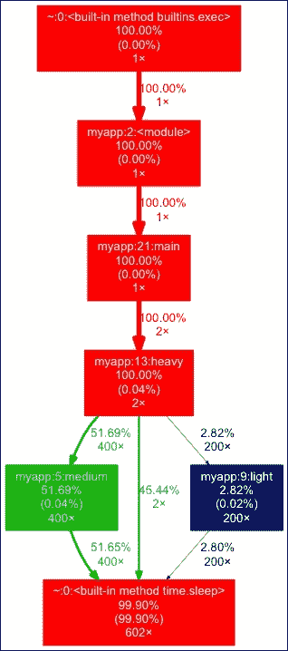
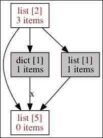

# 十一、优化——一般原则和分析技术

|   | *“我们应该忘记小效率，比如说 97%的时间：过早优化是万恶之源。”* |   |
|   | --*唐纳德·克努特* |

本章是关于优化的，并提供了一组一般原则和分析技术。它给出了每个开发人员都应该知道的三条优化规则，并提供了优化指南。最后，重点介绍如何发现瓶颈。

# 优化的三个规则

无论结果如何，优化都有一个价格。当一段代码工作时，最好（有时）不去管它，而不是不惜一切代价让它变得更快。在进行任何类型的优化时，都要记住一些规则：

*   让它先工作
*   从用户的角度工作
*   保持代码可读性

## 先让它工作

一个非常常见的错误是在编写代码时试图优化代码。这基本上是毫无意义的，因为真正的瓶颈往往位于你从未想到的地方。

一个应用程序通常由非常复杂的交互组成，在真正使用它之前，不可能全面了解正在发生的事情。

当然，这不是编写函数或方法而不尽可能快的原因。您应该小心地尽可能降低其复杂性，并避免无用的重复。但第一个目标是让它发挥作用。这一目标不应受到优化工作的阻碍。

对于行级代码，Python 的理念是有一种方法，最好只有一种。因此，只要您坚持使用[第 2 章](02.html "Chapter 2. Syntax Best Practices – below the Class Level")、*语法最佳实践–低于类级别*、以及[第 3 章](03.html "Chapter 3. Syntax Best Practices – above the Class Level")、*语法最佳实践–高于类级别*中所述的 python 语法，您的代码就应该可以了。通常，写更少的代码比写更多的代码更好更快。

在代码正常工作并准备好评测之前，不要执行以下任何操作：

*   开始编写全局字典以缓存函数的数据
*   考虑用 C 语言或 Cython 等混合语言将部分代码外部化
*   寻找外部库来进行一些基本计算

对于非常专业的领域，如科学计算或游戏，从一开始就不可避免地使用专业库和外部化。另一方面，使用 NumPy 之类的库可能会简化特定功能的开发，并最终生成更简单、更快的代码。此外，如果有一个好的库为您编写函数，则不应重写该函数。

例如，Soya 3D，是 OpenGL 之上的一个游戏引擎（参见[http://home.gna.org/oomadness/en/soya3d/index.html](http://home.gna.org/oomadness/en/soya3d/index.html) ），在渲染实时 3D 时使用 C 和 Pyrex 进行快速矩阵运算。

### 注

优化是在已经运行的程序上执行的。

正如肯特·贝克（Kent Beck）所说，“让它工作，然后让它正确，然后让它快速。”

## 从用户的角度工作

我曾见过团队致力于优化应用服务器的启动时间，当应用服务器已经启动并运行时，该服务器运行得非常好。一旦他们完成了加速，他们就会向客户推广这项工作。他们有点沮丧地注意到客户并不真正关心它。这是因为加速工作的动机不是用户反馈，而是开发人员的观点。构建该系统的人每天都要多次启动服务器。因此，启动时间对他们来说意义重大，但对他们的客户来说却不重要。

虽然从绝对的角度来看，加快程序启动速度是一件好事，但团队应仔细确定优化工作的优先级，并问自己以下问题：

*   有人叫我快点吗？
*   谁觉得程序慢？
*   它真的很慢，还是可以接受？
*   让它跑得更快要花多少钱？值得吗？
*   什么部件需要快速？

请记住，优化是有代价的，开发人员的观点对客户来说毫无意义，除非您正在编写框架或库，而客户也是开发人员。

### 注

优化不是游戏。只有在必要时才应这样做。

## 保持代码可读性和可维护性

即使 Python 试图使通用代码模式以最快的速度运行，优化工作也可能会混淆代码，使其难以阅读。在生成可读的、因而可维护的代码和修改代码以使其更快之间需要保持平衡。

当您已经达到了 90%的优化目标，剩下的 10%将使代码完全无法阅读时，最好停止这项工作或寻找其他解决方案。

### 注

优化不应使代码不可读。如果发生这种情况，您应该寻找其他解决方案，如外部化或重新设计。在可读性和速度之间寻找一个好的折衷方案。

# 优化策略

假设你的程序有一个真正需要解决的速度问题。不要试图猜测如何使它更快。通过查看代码通常很难找到瓶颈，需要一组工具来找到真正的问题。

一个好的优化策略可以从三个步骤开始：

*   **找到另一个罪魁祸首**：确保第三方服务器或资源没有故障
*   **扩展硬件**：确保资源充足
*   **写一个速度测试**：创建一个有速度目标的场景

## 找到另一个罪犯

通常，性能问题会在生产级别出现，客户会提醒您，该问题与软件测试时的情况不同。可能会出现性能问题，因为应用程序未计划在用户数量较多且数据大小增加的现实世界中工作。

但是，如果应用程序与其他应用程序交互，首先要做的是检查瓶颈是否位于这些交互上。例如，数据库服务器或 LDAP 服务器可能会造成额外的开销，并可能使一切变得更慢。

还应考虑应用程序之间的物理链接。可能由于配置错误或拥塞，您的应用程序服务器与 intranet 中的另一台服务器之间的网络链接非常慢。

设计文档应提供所有交互和每个链接的性质的图表，以获得系统的总体情况，并在试图解决速度问题时提供帮助。

### 注

如果您的应用程序使用第三方资源服务器，则应对每个交互进行审核，以确保瓶颈不在那里。

## 缩放硬件

当没有可用的易失性存储器时，系统开始使用硬盘存储数据。这是交换。

这涉及到大量开销，性能急剧下降。从用户的角度来看，系统在这个阶段被认为是死的。因此，扩展硬件以防止这种情况非常重要。

虽然在系统上拥有足够的内存很重要，但确保应用程序不会表现得太疯狂和占用太多内存也很重要。例如，如果一个程序可以处理数百兆字节的大视频文件，那么它不应该将它们完全加载到内存中，而应该处理块或使用磁盘流。

磁盘使用率也很重要。如果试图在磁盘上重复写入的代码中隐藏了 I/O 错误，那么完整分区可能会真正降低应用程序的速度。此外，即使代码只尝试写一次，硬件和操作系统也可能尝试写多次。

请注意，放大硬件（垂直缩放）有一些明显的限制。您无法在单个机架上安装无限数量的硬件。此外，高效的硬件极其昂贵（收益递减定律），因此这种方法也有经济上的限制。从这个角度来看，最好让系统能够通过添加新的计算节点或工作节点（水平缩放）进行缩放。这允许您使用具有最佳性能/价格比的商品软件扩展您的服务。

不幸的是，设计和维护高度可扩展的分布式系统既困难又昂贵。如果您的系统无法轻松地横向扩展，或者纵向扩展速度更快、成本更低，那么最好这样做，而不是将时间和资源浪费在系统架构的全面重新设计上。记住，随着时间的推移，硬件总是趋向于更快、更便宜。许多产品都停留在这一最佳状态，其扩展需求与提高硬件性能的趋势保持一致。

## 写速度测试

在开始优化工作时，重要的是使用类似于测试驱动开发的工作流，而不是连续运行一些手动测试。一个好的实践是在编写要优化的调用序列的应用程序中专用一个测试模块。使用此场景将帮助您在优化应用程序时跟踪进度。

您甚至可以编写一些断言，在其中设置一些速度目标。为了防止速度回归，可以在优化代码后保留这些测试：

```py
>>> def test_speed():
...     import time
...     start = time.time()
...     the_code()
...     end = time.time() - start
...     assert end < 10, \
...     "sorry this code should not take 10 seconds !"
... 

```

### 注

测量执行速度取决于所用 CPU 的功率。但我们将在下一节中看到如何编写通用持续时间度量。

# 发现瓶颈

通过以下方式查找瓶颈：

*   分析 CPU 使用情况
*   分析内存使用情况
*   分析网络使用情况

## 分析 CPU 使用情况

瓶颈的第一个来源是你的代码。标准的库提供了执行代码分析所需的所有工具。它们基于确定性方法。

**确定性探查器**通过在最低级别添加计时器来测量每个函数花费的时间。这会带来一点开销，但对于在何处消耗时间提供了一个好主意。另一方面，**统计分析器**对指令指针的使用情况进行采样，不插入代码。后者精度较低，但允许全速运行目标程序。

有两种方法可以分析代码：

*   **宏评测**：在使用整个程序时对其进行评测并生成统计信息
*   **微观剖析**：通过手动检测程序的精确部分

### 宏观剖析

宏评测是通过在特殊的模式下运行应用程序来完成的，在这种模式下，解释器被检测以收集代码使用的统计信息。Python 为此提供了多种工具：

*   `profile`：这是一个纯 Python 实现
*   `cProfile`：这是一个 C 实现，提供与`profile`工具相同的接口，但开销较小

大多数 Python 程序员推荐的选择是`cProfile`，因为它减少了开销。无论如何，如果您需要以某种方式扩展探查器，那么`profile`可能是一个更好的选择，因为它不使用 C 扩展。

这两个工具都有相同的界面和用法，因此我们将只使用其中一个来展示它们是如何工作的。下面的是一个具有主要功能的`myapp.py`模块，我们将使用`cProfile`进行测试：

```py
import time

def medium():
    time.sleep(0.01)

def light():
    time.sleep(0.001)

def heavy():
    for i in range(100):
        light()
        medium()
        medium()
    time.sleep(2)

def main():
    for i in range(2):
        heavy()

if __name__ == '__main__':
    main()
```

可以直接从提示符调用模块，结果汇总如下：

```py
$ python3 -m cProfile myapp.py
 1208 function calls in 8.243 seconds

 Ordered by: standard name

 ncalls  tottime  percall  cumtime  percall filename:lineno(function)
 2    0.001    0.000    8.243    4.121 myapp.py:13(heavy)
 1    0.000    0.000    8.243    8.243 myapp.py:2(<module>)
 1    0.000    0.000    8.243    8.243 myapp.py:21(main)
 400    0.001    0.000    4.026    0.010 myapp.py:5(medium)
 200    0.000    0.000    0.212    0.001 myapp.py:9(light)
 1    0.000    0.000    8.243    8.243 {built-in method exec}
 602    8.241    0.014    8.241    0.014 {built-in method sleep}

```

提供的统计信息是分析器填充的统计对象的打印视图。手动调用该工具可以是：

```py
>>> import cProfile
>>> from myapp import main
>>> profiler = cProfile.Profile()
>>> profiler.runcall(main)
>>> profiler.print_stats()
 1206 function calls in 8.243 seconds

 Ordered by: standard name

 ncalls  tottime  percall  cumtime  percall file:lineno(function)
 2    0.001    0.000    8.243    4.121 myapp.py:13(heavy)
 1    0.000    0.000    8.243    8.243 myapp.py:21(main)
 400    0.001    0.000    4.026    0.010 myapp.py:5(medium)
 200    0.000    0.000    0.212    0.001 myapp.py:9(light)
 602    8.241    0.014    8.241    0.014 {built-in method sleep}

```

统计数据也可以保存在文件中，然后由`pstats`模块读取。该模块提供了一个类，该类知道如何处理配置文件，并提供了几个助手来调用它们：

```py
>>> import pstats
>>> import cProfile
>>> from myapp import main
>>> cProfile.run('main()', 'myapp.stats')
>>> stats = pstats.Stats('myapp.stats')
>>> stats.total_calls
1208
>>> stats.sort_stats('time').print_stats(3)
Mon Apr  4 21:44:36 2016    myapp.stats

 1208 function calls in 8.243 seconds

 Ordered by: internal time
 List reduced from 8 to 3 due to restriction <3>

 ncalls  tottime  percall  cumtime  percall file:lineno(function)
 602    8.241    0.014    8.241    0.014 {built-in method sleep}
 400    0.001    0.000    4.025    0.010 myapp.py:5(medium)
 2    0.001    0.000    8.243    4.121 myapp.py:13(heavy)

```

在那里，您可以通过打印出每个函数的调用者和被调用者来浏览代码：

```py
>>> stats.print_callees('medium')
 Ordered by: internal time
 List reduced from 8 to 1 due to restriction <'medium'>

Function           called...
 ncalls  tottime  cumtime
myapp.py:5(medium) ->  400    4.025    4.025  {built-in method sleep}

>>> stats.print_callees('light')
 Ordered by: internal time
 List reduced from 8 to 1 due to restriction <'light'>

Function           called...
 ncalls  tottime  cumtime
myapp.py:9(light)  ->  200    0.212    0.212  {built-in method sleep}

```

能够对输出进行排序可以在不同的视图上找到瓶颈。例如，考虑下面的场景：

*   当调用的数量非常多并占用大部分全局时间时，函数或方法可能处于循环中。可能的优化可以通过将此调用移动到不同的作用域来完成，以减少操作的数量
*   当一个函数花费很长时间时，如果可能的话，缓存可能是一个不错的选择

从分析数据中可视化瓶颈的另一个好方法是将它们转换成图表（参见*图 1*。**Gprof2Dot**（[https://github.com/jrfonseca/gprof2dot](https://github.com/jrfonseca/gprof2dot) 可用于将探查器数据转换为点图。您可以使用`pip`下载这个简单的脚本 PyPI，并在 stats 上使用它，只要使用 Graphviz 即可（请参见[http://www.graphviz.org/](http://www.graphviz.org/) 已安装在您的环境中：

```py
$ gprof2dot.py -f pstats myapp.stats | dot -Tpng -o output.png

```

`gprof2dot`的优点是它试图成为语言不可知论者。它不仅限于 Python`profile`或`cProfile`输出，还可以读取多个其他配置文件，如 Linux perf、xperf、gprof、Java HPROF 和许多其他配置文件。



图 1 使用 gprof2dot 生成的概要分析图示例

宏评测是一种很好的方法来检测有问题的函数，或者至少是它的邻域。找到后，可以跳转到微分析。

### 显微轮廓

当发现慢函数时，有时需要进行更多的分析工作，只测试程序的一部分。这是通过在速度测试中手动检测部分代码来完成的。

例如，`cProfile`模块可以从装饰师处使用：

```py
>>> import tempfile, os, cProfile, pstats
>>> def profile(column='time', list=5):
...     def _profile(function):
...         def __profile(*args, **kw):
...             s = tempfile.mktemp()
...             profiler = cProfile.Profile()
...             profiler.runcall(function, *args, **kw)
...             profiler.dump_stats(s)
...             p = pstats.Stats(s)
...             p.sort_stats(column).print_stats(list)
...         return __profile
...     return _profile
...
>>> from myapp import main
>>> @profile('time', 6)
... def main_profiled():
...     return main()
...
>>> main_profiled()
Mon Apr  4 22:01:01 2016    /tmp/tmpvswuovz_

 1207 function calls in 8.243 seconds

 Ordered by: internal time
 List reduced from 7 to 6 due to restriction <6>

 ncalls  tottime  percall  cumtime  percall file:lineno(function)
 602    8.241    0.014    8.241    0.014 {built-in method sleep}
 400    0.001    0.000    4.026    0.010 myapp.py:5(medium)
 2    0.001    0.000    8.243    4.121 myapp.py:13(heavy)
 200    0.000    0.000    0.213    0.001 myapp.py:9(light)
 1    0.000    0.000    8.243    8.243 myapp.py:21(main)
 1    0.000    0.000    8.243    8.243 <stdin>:1(main_profiled)

>>> from myapp import light
>>> stats = profile()(light)
>>> stats()
Mon Apr  4 22:01:57 2016    /tmp/tmpnp_zk7dl

 3 function calls in 0.001 seconds

 Ordered by: internal time

 ncalls  tottime  percall  cumtime  percall file:lineno(function)
 1    0.001    0.001    0.001    0.001 {built-in method sleep}
 1    0.000    0.000    0.001    0.001 myapp.py:9(light)

```

这种方法允许测试应用程序的某些部分，并使统计数据输出更清晰。但是在这个阶段，拥有一个被调用方列表可能并不有趣，因为函数已经被指出是需要优化的函数。唯一有趣的信息是知道它有多快，然后增强它。

`timeit`通过提供一种简单的方法，使用主机系统提供的最佳底层计时器（`time.time`或`time.clock`来测量小代码段的执行时间，从而更好地满足这一需求：

```py
>>> from myapp import light
>>> import timeit
>>> t = timeit.Timer('main()')
>>> t.timeit(number=5)
10000000 loops, best of 3: 0.0269 usec per loop
10000000 loops, best of 3: 0.0268 usec per loop
10000000 loops, best of 3: 0.0269 usec per loop
10000000 loops, best of 3: 0.0268 usec per loop
10000000 loops, best of 3: 0.0269 usec per loop
5.6196951866149902

```

该模块允许您重复调用，并面向您尝试独立的代码段。这在应用程序上下文之外非常有用，例如在提示符中，但在现有应用程序中使用起来并不方便。

### 注

确定性探查器将根据计算机正在执行的操作提供结果，因此每次的结果可能会有所不同。重复同一测试多次并取平均值可提供更准确的结果。此外，一些计算机具有特殊的 CPU 功能，如**SpeedStep**，如果启动测试时计算机处于空闲状态，可能会改变结果（请参见[http://en.wikipedia.org/wiki/SpeedStep](http://en.wikipedia.org/wiki/SpeedStep) ）。因此，对于小代码段，不断重复测试是一种很好的做法。还需要记住各种缓存，例如 DNS 缓存或 CPU 缓存。

但应谨慎使用`timeit`的结果。这是一个非常好的工具，可以客观地比较两个简短的代码片段，但它也允许您轻松地犯下危险的错误，从而得出令人困惑的结论。例如，这里比较了两段无辜的代码片段与`timeit`模块，这可能会让您认为通过加法进行字符串连接比`str.join()`方法更快：

```py
$ python3 -m timeit -s 'a = map(str, range(1000))' '"".join(a)'
1000000 loops, best of 3: 0.497 usec per loop

$ python3 -m timeit -s 'a = map(str, range(1000)); s=""' 'for i in a: s += i'
10000000 loops, best of 3: 0.0808 usec per loop

```

从[第 2 章](02.html "Chapter 2. Syntax Best Practices – below the Class Level")*语法最佳实践–在类级别*之下，我们知道通过添加进行字符串连接不是一种好模式。尽管有一些小的 CPython 微优化是专门为这种用例设计的，但它最终将导致二次运行时间。问题在于关于`timeit`（命令行中的`-s`参数）的`setup`参数以及 Python 3 中的范围如何工作的细微差别。我不会讨论这个问题的细节，但会把它留给你作为练习。无论如何，这里有一个比较字符串连接和 Python 3 下的`str.join()`习惯用法的正确方法：

```py
$ python3 -m timeit -s 'a = [str(i) for i in range(10000)]' 's="".join(a)'
10000 loops, best of 3: 128 usec per loop

$ python3 -m timeit -s 'a = [str(i) for i in range(10000)]' '
>s = ""
>for i in a:
>    s += i
>'
1000 loops, best of 3: 1.38 msec per loop

```

### 测量结石

测量执行时间时，结果取决于计算机硬件。为了能够产生一个通用的度量，最简单的方法是对固定代码序列的速度进行基准测试，并从中计算出一个比率。从那里，一个函数所花费的时间可以转换成一个通用值，可以在任何计算机上进行比较。

### 注

有许多通用的基准测试工具可用于测量计算机性能。令人惊讶的是，许多年前创建的一些工具至今仍在使用。例如，Whetstone 创建于 1972 年，当时它在 Algol 60 中提供了一个计算机性能分析器（参见[http://en.wikipedia.org/wiki/Whetstone_%28benchmark%29](http://en.wikipedia.org/wiki/Whetstone_%28benchmark%29) ）。用于测量每秒**百万条油石指令**（**兆瓦指令**）。旧 CPU 和现代 CPU 的结果表保持在[http://freespace.virgin.net/roy.longbottom/whetstone%20results.htm](http://freespace.virgin.net/roy.longbottom/whetstone%20results.htm) 。

Python 在其`test`包中提供了一个基准实用程序，用于测量精心选择的操作序列的持续时间。结果是计算机每秒能够执行的**pystones**数量以及执行基准测试所用的时间，在现代硬件上通常约为 1 秒：

```py
>>> from test import pystone
>>> pystone.pystones()
(1.0500000000000007, 47619.047619047589)

```

该速率可用于将配置文件持续时间转换为多个 Pytone：

```py
>>> from test import pystone
>>> benchtime, pystones = pystone.pystones()
>>> def seconds_to_kpystones(seconds):
...     return (pystones*seconds) / 1000 
... 
... 
>>> seconds_to_kpystones(0.03)
1.4563106796116512
>>> seconds_to_kpystones(1)
48.543689320388381
>>> seconds_to_kpystones(2)
97.087378640776762

```

`seconds_to_kpystones`返回**千克结石**的数量。如果您想编写一些速度断言代码，则此转换可以包含在您的测试中。

拥有 pystones 将允许您在测试中使用此装饰器，以便您可以在执行时间上设置断言。这些测试可以在任何计算机上运行，并允许开发人员防止速度倒退。当应用程序的一部分被优化后，他们将能够在测试中设置它的最大执行时间，并确保它不会被进一步的更改破坏。当然，这种方法并不理想，而且 100%准确，但至少比以秒表示的原始值硬编码执行时间断言要好。

## 评测内存使用情况

优化应用程序时可能遇到的另一个问题是内存消耗。如果一个程序开始占用大量内存，以致系统开始交换，那么应用程序中可能有一个地方创建了太多的对象，或者您不打算保留的对象通过一些非预期引用仍然保持活动状态。这通常很容易通过经典的评测来检测，因为消耗足够的内存来进行系统交换涉及大量可以检测到的 CPU 工作。但有时并不明显，必须对内存使用情况进行分析。

### Python 如何处理内存

当您使用 CPython 实现时，内存使用可能是 Python 中最难分析的问题。虽然 C 等语言允许您获取任何元素的内存大小，但 Python 永远不会让您知道给定对象消耗了多少内存。这是由于语言的动态特性，以及语言用户无法直接访问内存管理这一事实。

在[第 7 章](07.html "Chapter 7. Python Extensions in Other Languages")、*其他语言的 Python 扩展*中已经解释了内存管理的一些原始细节。我们已经知道 CPython 使用引用计数来管理对象分配。这是一种确定性算法，可确保在对象的引用计数为零时触发对象解除分配。尽管这个过程是确定性的，但在复杂的代码库中手动跟踪和推理并不容易。此外，引用计数级别上对象的解除分配并不一定意味着解释器释放了实际的进程堆内存。根据 CPython 解释器编译标志、系统环境或运行时上下文，内部内存管理器层可能会决定留下一些可用内存块供将来重新分配，而不是完全释放。

CPython 实现中的额外微优化也使得预测实际内存使用量变得更加困难。例如，指向同一短字符串或小整数值的两个变量可能指向内存中的同一对象实例，也可能不指向。

尽管 Python 中的内存管理非常可怕，而且看起来很复杂，但它的文档非常丰富（请参阅[https://docs.python.org/3/c-api/memory.html](https://docs.python.org/3/c-api/memory.html) 。注意，在大多数情况下，在调试内存问题时可以忽略前面提到的微优化。此外，引用计数大致基于一个简单语句。如果给定对象不再被引用，它将被删除。换句话说，函数中的所有本地引用在解释器之后被删除：

*   离开功能
*   确保不再使用该对象

因此，保留在内存中的对象是：

*   全局对象
*   仍以某种方式引用的对象

小心**参数****入站****出站**边缘案例。如果在参数中创建了一个对象，那么如果函数返回该对象，参数引用将仍然有效。如果将其用作默认值，则可能导致意外结果：

```py
>>> def my_function(argument={}):  # bad practice
...     if '1' in argument:
...         argument['1'] = 2
...     argument['3'] = 4
...     return argument
... 
>>> my_function()
{'3': 4}
>>> res = my_function()
>>> res['4'] = 'I am still alive!'
>>> print my_function()
{'3': 4, '4': 'I am still alive!'}

```

这就是为什么应该始终使用不可更改的对象，如下所示：

```py
>>> def my_function(argument=None):  # better practice
...     if argument is None:
...         argument = {}  # a fresh dict is created everytime
...     if '1' in argument:
...         argument['1'] = 2
...     argument['3'] = 4
...     return argument
... 
>>> my_function()
{'3': 4}
>>> res = my_function()
>>> res['4'] = 'I am still alive!'
>>> print my_function()
{'3': 4}

```

Python 中的引用计数非常方便，使您不必手动跟踪对象的对象引用，因此不必手动销毁它们。尽管这带来了另一个问题，但由于开发人员从不清理内存中的实例，如果开发人员不注意他们使用数据结构的方式，它可能会以不受控制的方式增长。

通常的记忆食客是：

*   无法控制的缓存
*   对象工厂全局注册实例而不跟踪其使用情况，例如每次调用查询时动态使用的数据库连接器创建者
*   未正确加工的螺纹
*   使用`__del__`方法并参与循环的对象也是记忆进食者。在较早版本的 Python（3.4 版本之前）中，垃圾收集器不会打破循环，因为它无法确定应该首先删除哪个对象。因此，您将泄漏内存。在大多数情况下，使用这种方法是个坏主意。

不幸的是，必须在 C 扩展中使用 Python/CAPI 和`Py_INCREF()`和`Py_DECREF()`宏手动管理引用计数。我们在前面的[第 7 章](07.html "Chapter 7. Python Extensions in Other Languages")、*其他语言的 Python 扩展*中讨论了处理引用计数和引用所有权的注意事项，因此您应该已经知道这是一个充满各种陷阱的非常困难的话题。这就是为什么大多数内存问题都是由编写不正确的 C 扩展引起的。

### 仿形存储器

在开始查找 Python 中的内存问题之前，您应该知道 Python 中内存泄漏的性质非常特殊。在一些编译语言如 C 和 C++中，内存泄漏几乎完全是由分配的内存块所造成的，这些内存块不再被任何指针引用。如果没有对内存的引用，就无法释放它，这种情况称为*内存泄漏*。在 Python 中，用户没有可用的低级内存管理，因此我们更愿意处理对不再需要但未删除的对象的泄漏引用。这会阻止解释器释放资源，但与 C 中的内存泄漏情况不同。当然，C 扩展总是有例外情况，但它们是另一种野兽，需要完全不同的工具链，无法从 Python 代码中轻松检查。

因此，Python 中的内存问题主要是由意外或计划外的资源获取模式引起的。这种情况很少发生，因为内存分配和释放例程的错误处理导致了真正的 bug。开发人员在使用 Python/CAPI 编写 C 扩展时，只有在 CPython 中才可以使用这些例程，您很少会处理它们。因此，Python 中大多数所谓的内存泄漏主要是由于软件过于复杂以及组件之间难以跟踪的微小交互造成的。为了发现和定位软件的这些缺陷，您需要知道程序中的实际内存使用情况。

获取 Python 解释器控制的对象数量及其实际大小的信息有点棘手。例如，知道一个给定对象的重量（以字节为单位）将涉及到对其所有属性进行爬网，处理交叉引用，然后对所有内容进行汇总。这是一个相当困难的问题，如果你考虑对象倾向于互相参照的方式。`gc`模块没有为此提供高级函数，它需要在调试模式下编译 Python 以获得完整的信息集。

通常，程序员只是在执行给定操作之后和之前询问系统应用程序的内存使用情况。但这个度量是一个近似值，在很大程度上取决于如何在系统级别管理内存。例如，在 Linux 下使用`top`命令或在 Windows 下使用任务管理器，可以在内存问题明显时检测内存问题。但是这种方法很费劲，并且很难找到错误的代码块。

幸运的是，有几种工具可用于制作内存快照和计算加载对象的数量和大小。但我们要记住，Python 不容易释放内存，宁愿保留内存以防再次需要。

一段时间以来，在 Python 中调试内存问题和使用情况时最常用的工具之一是 Guppy PE 及其 Heapy 组件。不幸的是，它似乎不再被维护，并且缺少 Python3 支持。幸运的是，还有其他一些在某种程度上与 Python 3 兼容的替代方案：

*   **Memprof**[http://jmdana.github.io/memprof/](http://jmdana.github.io/memprof/) ：声明在 Python2.6、2.7、3.1、3.2 和 3.3 以及一些兼容 POSIX 的系统（Mac OS X 和 Linux）上工作
*   **内存剖析器**[https://pypi.python.org/pypi/memory_profiler](https://pypi.python.org/pypi/memory_profiler) ：声明支持与 Memprof 相同的 Python 版本和系统
*   **Pypler**[http://pythonhosted.org/Pympler/](http://pythonhosted.org/Pympler/) ：声明支持 Python 2.5、2.6、2.7、3.1、3.2、3.3 和 3.4，并且独立于操作系统

请注意，前面的信息完全基于最新发布的特色软件包使用的 trove 分类器。这一点在这本书出版后很容易改变。尽管如此，有一个软件包目前支持最广泛的 Python 版本，并且已知它在 Python 3.5 下可以完美地工作。是`objgraph`。它的 API 似乎有点笨拙，功能非常有限。但它工作正常，做得很好，而且非常容易使用。内存插装不是永久添加到生产代码中的东西，所以这个工具不需要漂亮。由于它在操作系统独立性方面广泛支持 Python 版本，因此在讨论内存评测示例时，我们将只关注`objgraph`。本节中提到的其他工具也是令人兴奋的软件，但您需要自己研究它们。

#### 对象图

`objgraph`（参见[http://mg.pov.lt/objgraph/](http://mg.pov.lt/objgraph/) 是一个简单的工具，用于创建对象引用的图表，在 Python 中查找内存泄漏时应该很有用。它在 PyPI 上可用，但它不是一个完全独立的工具，需要 Graphviz 来创建内存使用图。对于开发人员友好型系统，如 Mac OS X 或 Linux，您可以使用首选的系统包管理器轻松获得它。对于 Windows，您需要从项目页面下载 Graphviz 安装程序（请参阅[http://www.graphviz.org/](http://www.graphviz.org/) 并手动安装。

`objgraph`提供多个实用程序，允许您列出和打印有关内存使用和对象计数的各种统计信息。下面的翻译会话记录中显示了正在使用的此类实用程序的示例。

```py
>>> import objgraph
>>> objgraph.show_most_common_types()
function                   1910
dict                       1003
wrapper_descriptor         989
tuple                      837
weakref                    742
method_descriptor          683
builtin_function_or_method 666
getset_descriptor          338
set                        323
member_descriptor          305
>>> objgraph.count('list')
266
>>> objgraph.typestats(objgraph.get_leaking_objects())
{'Gt': 1, 'AugLoad': 1, 'GtE': 1, 'Pow': 1, 'tuple': 2, 'AugStore': 1, 'Store': 1, 'Or': 1, 'IsNot': 1, 'RecursionError': 1, 'Div': 1, 'LShift': 1, 'Mod': 1, 'Add': 1, 'Invert': 1, 'weakref': 1, 'Not': 1, 'Sub': 1, 'In': 1, 'NotIn': 1, 'Load': 1, 'NotEq': 1, 'BitAnd': 1, 'FloorDiv': 1, 'Is': 1, 'RShift': 1, 'MatMult': 1, 'Eq': 1, 'Lt': 1, 'dict': 341, 'list': 7, 'Param': 1, 'USub': 1, 'BitOr': 1, 'BitXor': 1, 'And': 1, 'Del': 1, 'UAdd': 1, 'Mult': 1, 'LtE': 1}

```

如前所述，`objgraph`允许您创建内存使用模式和交叉引用的图表，以链接给定名称空间中的所有对象。该库最有用的绘图工具是`objgraph.show_refs()`和`objgraph.show_backrefs()`。它们都接受对被检查对象的引用，并使用 Graphviz 包将图表图像保存到文件中。*图 2*和*图 3*中给出了此类图表的示例。

以下是用于创建这些关系图的代码：

```py
import objgraph

def example():
    x = []
    y = [x, [x], dict(x=x)]

    objgraph.show_refs(
        (x, y),
        filename='show_refs.png',
        refcounts=True
    )
    objgraph.show_backrefs(
        (x, y),
        filename='show_backrefs.png',
        refcounts=True
    )

if __name__ == "__main__":
    example()
```

*图 2*显示了`x`和`y`对象持有的所有引用的示意图。从上到下，从左到右正好呈现四个对象：

*   `y = [x, [x], dict(x=x)]`列表实例
*   `dict(x=x)`字典实例
*   `[x]`列表实例
*   `x = []`列表实例



图 2 example（）函数的 show_refs（）图的示例结果

*图 3*不仅显示了`x`和`y`之间的引用，还显示了所有包含对这两个实例的引用的对象。有所谓的反向引用，在查找阻止其他对象被释放的对象时非常有用。


图 3 example（）函数的 show_backrefs（）图的示例结果

为了说明`objgraph`如何在实践中使用，让我们回顾一些实际例子。正如我们在本书中已经注意到的，CPython 有自己的垃圾收集器，它独立于引用计数方法而存在。它不用于通用内存管理，而仅用于解决循环引用的问题。在许多情况下，对象可能会以某种方式相互引用，从而无法使用基于跟踪引用数量的简单技术删除它们。以下是最简单的示例：

```py
x = []
y = [x]
x.append(y)
```

这种情况在*图 4*中直观地呈现。在前一种情况下，即使删除对`x`和`y`对象的所有外部引用（例如，通过从函数的本地范围返回），也无法删除这两个对象，因为这两个对象仍然拥有两个交叉引用。这就是 Python 垃圾收集器介入的情况。它可以检测对对象的循环引用，并在循环之外没有对这些对象的其他有效引用时触发它们的释放。


图 4 两个对象之间循环引用的示例图

当这样一个循环中至少有一个对象定义了自定义`__del__()`方法时，真正的问题就开始了。它是一个自定义释放处理程序，当对象的引用计数最终变为零时将调用该处理程序。它可以执行任意 Python 代码，因此也可以创建对特定对象的新引用。这就是为什么 Python3.4 版本之前的垃圾收集器在至少一个对象提供了自定义`__del__()`方法实现的情况下无法中断引用周期的原因。PEP442 将安全对象终结引入 Python，并从 Python 3.4 开始成为标准的一部分。无论如何，对于那些担心向后兼容性并针对各种 Python 解释器版本的包来说，这可能仍然是一个问题。以下代码片段向您展示了不同 Python 版本中循环垃圾收集器行为的差异：

```py
import gc
import platform
import objgraph

class WithDel(list):
    """ list subclass with custom __del__ implementation """
    def __del__(self):
        pass

def main():
    x = WithDel()
    y = []
    z = []

    x.append(y)
    y.append(z)
    z.append(x)

    del x, y, z

    print("unreachable prior collection: %s" % gc.collect())
    print("unreachable after collection: %s" % len(gc.garbage))
    print("WithDel objects count:        %s" %
          objgraph.count('WithDel'))

if __name__ == "__main__":
    print("Python version: %s" % platform.python_version())
    print()
    main()
```

前面的代码在 Python 3.3 下执行时的输出表明，Python 旧版本中的循环垃圾收集器无法收集定义了`__del__()`方法的对象：

```py
$ python3.3 with_del.py 
Python version: 3.3.5

unreachable prior collection: 3
unreachable after collection: 1
WithDel objects count:        1

```

使用较新版本的 Python，垃圾收集器可以安全地处理对象的终结，即使它们定义了`__del__()`方法：

```py
$ python3.5 with_del.py 
Python version: 3.5.1

unreachable prior collection: 3
unreachable after collection: 0
WithDel objects count:        0

```

尽管在最新的 Python 版本中，自定义定稿不再棘手，但对于需要在不同环境下工作的应用程序来说，这仍然是一个问题。如前所述，`objgraph.show_refs()`和`objgraph.show_backrefs()`函数允许您轻松发现有问题的类实例。例如，我们可以很容易地修改`main()`函数，以显示对`WithDel`实例的所有反向引用，以查看我们是否有泄漏的资源：

```py
def main():
    x = WithDel()
    y = []
    z = []

    x.append(y)
    y.append(z)
    z.append(x)

    del x, y, z

    print("unreachable prior collection: %s" % gc.collect())
    print("unreachable after collection: %s" % len(gc.garbage))
    print("WithDel objects count:        %s" %
          objgraph.count('WithDel'))

    objgraph.show_backrefs(
        objgraph.by_type('WithDel'),
        filename='after-gc.png'
    )
```

在 Python3.3 下运行前面的示例将生成一个图（参见*图 5*，该图显示`gc.collect()`无法成功删除`x`、`y`和`z`对象实例。此外，`objgraph`突出显示了定义了自定义`__del__()`方法的所有对象，以便更容易发现此类问题。


图 5 显示了 Python 垃圾收集器在版本 3.4 之前无法拾取的循环引用示例

### C 代码内存泄漏

如果 Python 代码看起来非常好，并且在循环隔离函数时内存仍然增加，那么泄漏可能位于 C 端。例如，当一个`Py_DECREF`呼叫丢失时，就会发生这种情况。

Python 核心代码非常健壮，并经过了泄漏测试。如果您使用具有 C 扩展的包，那么它们可能是首先查看的好地方。因为您将在比 Python 低得多的抽象级别上处理代码，所以需要使用完全不同的工具来解决此类内存问题。

在 C 语言中，内存调试并不容易，所以在深入研究扩展内部构件之前，请确保正确诊断问题的根源。使用与单元测试性质类似的代码隔离可疑包是一种非常流行的方法：

*   为怀疑内存泄漏的扩展的每个 API 单元或功能编写单独的测试
*   在循环中隔离执行任意长时间的测试（每次运行一次测试）
*   从观察哪些测试功能会随时间增加内存使用量

使用这种方法，您可以隔离扩展的故障部分，这将减少以后检查和修复其代码所需的时间。这个过程可能看起来很麻烦，因为它需要很多额外的时间和编码，但从长远来看，它确实是值得的。您可以通过重用[第 10 章](10.html "Chapter 10. Test-Driven Development")、*测试驱动开发*中介绍的一些测试工具来轻松工作。tox 之类的实用程序可能并不是专为这种情况设计的，但它们至少可以减少在隔离环境中运行多个测试所需的时间。

希望您已经隔离了扩展中泄漏内存的部分，并最终可以开始实际调试。如果幸运的话，对源代码进行简单的手动检查可能会得到预期的结果。在许多情况下，问题只需添加丢失的`Py_DECREF`调用即可。然而，在大多数情况下，我们的工作并不是那么简单。在这种情况下，你需要拿出一些更大的枪。**Valgrind**是一个值得注意的通用工具，用于防止编译代码中的内存泄漏，每个程序员的工具带中都应该有这个工具。它是一个完整的仪器框架，用于构建动态分析工具。正因为如此，学习和掌握它可能并不容易，但你肯定应该知道基础知识。

## 分析网络使用情况

正如我前面所说，与第三方程序（如数据库、缓存、web 服务或 LDAP 服务器）通信的应用程序在运行缓慢时可能会减慢速度。这可以通过应用程序端的常规代码分析方法进行跟踪。但是，如果第三方软件本身运行良好，那么罪魁祸首可能是网络。

问题可能是配置错误的集线器、低带宽的网络链路，甚至是大量的流量冲突，使计算机多次发送相同的数据包。

这里有一些元素可以让你参与进来。要了解发生了什么，首先需要调查三个领域：

*   使用以下工具观察网络流量：
    *   `ntop`：[http://www.ntop.org](http://www.ntop.org) （仅限 Linux）
    *   `wireshark`：[www.wireshark.org](http://www.wireshark.org)（原名 Ethereal）
*   使用`net-snmp`（[追踪不健康或配置错误的设备 http://www.net-snmp.org](http://www.net-snmp.org) ）。
*   使用统计工具`Pathrate`估计两台计算机之间的带宽。参见[http://www.cc.gatech.edu/~dovrolis/bw est/pathrate.html](http://www.cc.gatech.edu/~dovrolis/bw-est/pathrate.html)。

如果您想进一步了解网络性能问题，您可能还需要阅读 Richard Blum 的*网络性能开源工具包*、*Wiley*。本书揭示了调整大量使用网络的应用程序的策略，并提供了扫描复杂网络问题的教程。

Jeremy Zawodny 的*高性能 MySQL*、*O'Reilly Media*也是编写使用 MySQL 的应用程序时值得一读的好书。

# 总结

在本章中，我们看到：

*   优化的三个规则：
    *   让它先工作
    *   从用户的角度出发
    *   保持代码可读性
*   一种基于编写具有速度目标的场景的优化策略
*   如何分析 CPU 或内存使用情况以及网络分析的一些提示

既然您已经知道如何定位性能问题，下一章将提供一些常用的通用策略来解决这些问题。