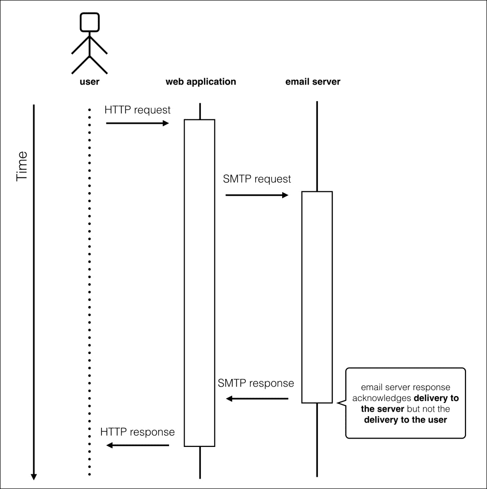
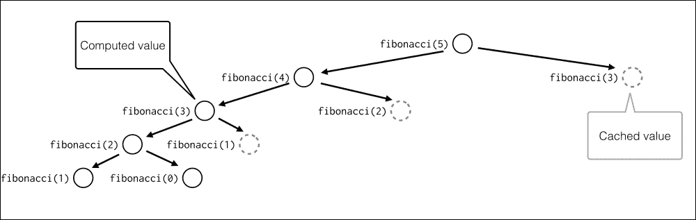

# 十二、优化——一些强大的技术

优化程序不是一个神奇的过程。这是通过遵循 Stefan Schwarzer 在 Europython 2006 的原始伪代码示例中合成的一个简单算法完成的：

```py
def optimize():
    """Recommended optimization"""
    assert got_architecture_right(), "fix architecture"
    assert made_code_work(bugs=None), "fix bugs"
    while code_is_too_slow():
        wbn = find_worst_bottleneck(just_guess=False,
                                    profile=True)
        is_faster = try_to_optimize(wbn,
                                    run_unit_tests=True,
                                    new_bugs=None)
        if not is_faster:
            undo_last_code_change()

# By Stefan Schwarzer, Europython 2006
```

这个例子可能不是最简洁、最清晰的，但它几乎涵盖了有组织的优化过程的所有重要方面。我们从中学到的主要东西是：

*   优化是一个迭代过程，不是每次迭代都能得到更好的结果
*   主要的先决条件是通过测试验证代码是否正常工作
*   您应该始终关注优化当前的应用程序瓶颈

使代码更快地工作不是一项容易的任务。对于抽象数学问题，解决方案当然在于选择正确的算法和适当的数据结构。但是在这种情况下，很难提供一些通用的技巧和窍门，这些技巧和窍门可以用于解决算法问题的任何代码中。当然，有一些通用的方法来设计一个新的算法，甚至可以应用于各种各样的问题的元启发式算法，但它们与语言无关，因此超出了本书的范围。

无论如何，一些性能问题只是由某些代码质量缺陷或应用程序使用上下文引起的。例如，应用程序的速度可能会降低：

*   基本内置类型的错误使用
*   太复杂了
*   硬件资源使用模式与执行环境不匹配
*   等待第三方 API 或支持服务的响应时间过长
*   在应用程序的时间关键部分执行过多操作

通常，解决此类性能问题不需要高级学术知识，只需要良好的软件技能。工艺的很大一部分是知道何时使用合适的工具。幸运的是，有一些众所周知的模式和解决方案用于处理性能问题。

在本章中，我们将讨论一些流行且可重复使用的解决方案，这些解决方案允许您通过以下方式以非算法方式优化程序：

*   降低复杂性
*   使用架构权衡
*   缓存

# 降低复杂性

在我们进一步深入研究优化技术之前，让我们明确定义我们将要处理的问题。从这一章的介绍中，我们知道关注于改进应用程序瓶颈对于成功优化至关重要。瓶颈是严重限制程序或计算机系统容量的单个组件。每段有性能问题的代码的一个重要特征是，它通常只有一个瓶颈。我们在前一章中讨论了一些分析技术，因此您应该已经熟悉定位和隔离这些位置所需的工具。如果您的评测结果显示，几乎没有需要立即改进的地方，那么您应该首先尝试将每个地方作为一个单独的组件进行单独优化。

当然，如果没有明显的瓶颈，但应用程序的性能仍低于预期，那么您的处境就很糟糕。优化过程的收益与优化瓶颈的性能影响成正比。优化每一个对总体执行时间或资源消耗没有实质性贡献的小组件只会使您在分析和优化上花费的所有时间受益最小。如果您的应用程序似乎没有真正的瓶颈，则有可能您遗漏了某些内容。尝试使用不同的评测策略或工具，或者从不同的角度（内存、I/O 操作或网络吞吐量）来看待它。如果这无济于事，你应该考虑修改你的软件体系结构。

但是，如果您成功地找到了限制应用程序性能的单个完整组件，那么您真的很幸运。很有可能，只要对代码进行最小程度的改进，您就能够真正提高代码执行时间和/或资源使用率。优化带来的收益将再次与瓶颈大小成正比。

在试图提高应用程序性能时，需要注意的第一个也是最明显的方面是复杂性。关于什么使程序复杂，有很多定义，也有很多表达方式。一些复杂性度量可以提供有关代码行为的客观信息，这些信息有时可以外推到性能预期中。有经验的程序员甚至可以可靠地猜测两种不同的实现在实际中的执行情况，知道它们的复杂性和现实的执行上下文。

定义应用程序复杂性的两种常用方法是：

*   **圈的****复杂性**通常与应用程序性能相关
*   Landau 符号也称为**大 O****符号**，这是一种算法分类方法，在客观判断性能方面非常有用

由此，优化过程有时可以理解为降低复杂性的过程。本节通过简化循环为这项工作提供简单提示。但首先，让我们学习如何度量复杂性。

## 圈复杂度

**圈的****复杂度**是 Thomas J.McCabe 在 1976 年开发的度量。因为它的作者，它经常被称为**麦卡比的复杂性**。它测量通过代码的线性路径数。对所有的`if`、`for`和`while`循环进行计数，以得出一个度量值。

然后可将代码分类如下：

<colgroup><col style="text-align: left"> <col style="text-align: left"></colgroup> 
| 

圈复杂度

 | 

这意味着什么

 |
| --- | --- |
| 1 至 10 | 不复杂 |
| 11 至 20 | 中等复杂 |
| 21 至 50 | 非常复杂 |
| 五十多 | 太复杂 |

圈复杂度是代码质量分数，而不是客观判断其性能的指标。它并不能取代寻找性能瓶颈的代码分析需求。无论如何，具有高圈复杂度的代码通常倾向于使用相当复杂的算法，这些算法在较大的输入下可能无法很好地执行。

虽然圈复杂度不是判断应用程序性能的可靠方法，但它有一个非常好的优势。它是一个源代码度量，因此可以使用适当的工具进行度量。这不能用大 O 表示法来表示复杂性的其他方式。多亏了可测量性，圈复杂度可能是分析的有用补充，它可以为您提供有关软件问题部分的更多信息。在考虑彻底的代码体系结构重新设计时，首先要检查代码的复杂部分。

在 Python 中度量 McCabe 的复杂性相对简单，因为它的可以从抽象语法树中推导出来。当然，你不需要自己去做。为 Python 提供圈复杂度度量的流行工具是`flake8`（带有`mccabe`插件），该工具已在[第 4 章](04.html "Chapter 4. Choosing Good Names")*选择好名字*中介绍。

## 大 O 符号

定义函数复杂性的最规范的方法是**大 O 符号**（参见[http://en.wikipedia.org/wiki/Big_O_notation](http://en.wikipedia.org/wiki/Big_O_notation) ）。该度量定义了算法如何受输入数据大小的影响。例如，算法是与输入数据的大小成线性比例还是二次比例？

手动计算算法的大 O 表示法是了解其性能如何与输入数据大小相关的最佳方法。了解应用程序组件的复杂性使您能够检测并关注那些会真正降低代码速度的部分。

为了测量大 O 表示法，所有常量和低阶项都被删除，以便在输入数据增长时关注真正重要的部分。我们的想法是尝试将算法分类为以下类别之一，即使是近似值：

<colgroup><col style="text-align: left"> <col style="text-align: left"></colgroup> 
| 

符号

 | 

类型

 |
| --- | --- |
| O（1） | 常数不依赖于输入数据。 |
| O（n） | 线性的将随着“n”的增长而增长。 |
| O（n 日志 n） | 准线性。 |
| O（n<sup>2</sup> | 二次复杂性。 |
| O（n<sup>3</sup> | 立方复杂性。 |
| O（n！） | 阶乘复杂性。 |

例如，我们已经从[第 2 章](02.html "Chapter 2. Syntax Best Practices – below the Class Level")*语法最佳实践中了解到，在类级别*之下，`dict`查找的平均复杂度为*O（1）*。无论`dict`中有多少元素，它都被视为常量，而查看特定项目的项目列表是*O（n）*。

让我们再举一个例子：

```py
>>> def function(n):
...     for i in range(n):
...         print(i)
...

```

在这种情况下，print 语句将被执行*n*次。循环速度取决于`n`，因此使用大 O 表示法表示的复杂度为*O（n）*。

如果函数具有条件，则要保留的正确符号为最高值：

```py
>>> def function(n):
...     if some_test:
...         print('something')
...     else:
...         for i in range(n):
...             print(i)
... 

```

在本例中，函数可以是*O（1）*或*O（n）*，具体取决于测试。但最坏的情况是*O（n）*，所以整个函数复杂度是*O（n）*。

在讨论用大 O 表示法表示的复杂性时，我们通常会回顾最坏的情况。虽然在比较两个独立算法时，这是定义复杂性的最佳方法，但在所有实际情况下，这可能不是最佳方法。许多算法根据输入数据的统计特性改变运行时性能，或者通过巧妙的技巧分摊最坏情况下操作的成本。这就是为什么在许多情况下，最好从平均复杂度或*摊销复杂度*的*角度来审查您的实现。*

例如，看一下将单个元素附加到 Python 的`list`类型实例的操作。我们知道 CPython 中的`list`使用了一个对内部存储进行过度分配的数组，而不是链表。如果数组已满，追加新元素需要分配新数组并将所有现有元素（引用）复制到内存中的新区域。如果我们从**最坏情况复杂性**的角度来看，`list.append()`方法显然具有*O（n）*复杂性。与链表结构的典型实现相比，这有点贵。

但我们也知道，CPython`list`类型的实现使用过度分配来减轻这种偶尔重新分配的复杂性。如果我们评估一系列操作的复杂度，我们会发现`list.append()`的*平均复杂度*是*O（1）*，这实际上是一个很好的结果。

在解决问题时，我们通常知道关于输入数据的很多细节，例如数据的大小或统计分布。在优化应用程序时，始终值得使用有关输入数据的每一点知识。在这里，另一个最坏情况复杂性的问题开始出现。它旨在显示当输入趋于大值或无穷大时函数的极限行为，而不是为实际数据提供可靠的性能近似值。当定义一个函数的增长率时，渐近表示法是很好的，但它不能为一个简单的问题提供可靠的答案：哪种实现需要更少的时间？最坏情况下的复杂性会转储所有关于实现和数据特征的小细节，以显示程序将如何渐近运行。它适用于任意大的输入，甚至不需要考虑。

例如，假设您需要解决由*n*个独立元素组成的数据的问题。我们还假设您知道两种不同的方法来解决这个问题-*程序 A*和*程序 B*。您知道*程序 A*需要 100n<sup>2</sup>操作才能完成，*程序 B*需要 5n<sup>3</sup>操作才能解决问题。你会选择哪一个？当谈到非常大的输入时，*程序 A*当然是更好的选择，因为它的渐近性能更好。与*O（n<sup>3</sup>**复杂度相比，它具有*O（n<sup>2</sup>**复杂度，这是*程序 B*的特征。**

 **但通过求解一个简单的 100N<sup>2</sup>5N<sup>3</sup>不等式，我们可以发现当*n*小于 20 时*程序 B*将进行更少的运算。如果我们对输入边界了解多一点，我们就能做出更好的决定。

# 简化

为了降低代码的复杂性，数据的存储方式是最基本的。您应该仔细选择数据结构。本节提供了一些示例，说明如何通过作业的适当数据类型来提高简单代码段的性能。

## 在列表中搜索

由于 Python 中`list`类型的实现细节，在列表中搜索特定值并不是一个便宜的操作。`list.index()`方法的复杂度为*O（n）*，其中*n*为列表元素数。如果不需要执行许多元素索引查找，那么这种线性复杂性并不特别糟糕，但是如果需要执行许多这样的操作，那么它可能会对性能产生负面影响。

如果需要快速搜索列表，可以尝试 Python 标准库中的`bisect`模块。本模块中的函数主要用于插入或查找给定值的插入索引，以保持已排序序列的顺序。无论如何，它们可以用于通过二分法算法高效地查找元素索引。以下是使用二进制搜索查找元素索引的函数的官方文档中的配方：

```py
def index(a, x):
    'Locate the leftmost value exactly equal to x'
    i = bisect_left(a, x)
    if i != len(a) and a[i] == x:
        return i
    raise ValueError
```

请注意，来自对分模块的每个函数都需要一个排序序列才能工作。如果列表的顺序不正确，那么对其进行排序是一项复杂度至少为*O（n log n）*的任务。这是一个比*O（n）*更糟糕的类，因此对整个列表进行排序以仅执行一次搜索肯定不会有回报。但是，如果您需要在一个不需要经常更改的巨大列表中执行大量索引搜索，那么使用单个排序操作对分可能是一个很好的折衷方案。

此外，如果您已经有一个已排序的列表，您可以使用`bisect`将新项目插入该列表，而无需重新排序。

### 用集合代替列表

当您需要从给定序列中构建一个不同值的序列时，您脑海中可能想到的第一个算法是：

```py
>>> sequence = ['a', 'a', 'b', 'c', 'c', 'd']
>>> result = []
>>> for element in sequence:
...     if element not in result:
...         result.append(element)
... 
>>> result
['a', 'b', 'c', 'd']

```

复杂性是通过在`result`列表中使用具有时间复杂性的`in`运算符*O（n）*进行查找引入的。然后在循环中使用，成本为*O（n*。因此，总体复杂度是二次的-*O（n<sup>2</sup>**。*

 *为相同的工作使用`set`类型会更快，因为存储的值是使用与`dict`类型相同的哈希进行查找的。此外，`set`确保了元素的唯一性，因此我们不需要做更多的事情，只需要从`sequence`对象创建一个新集合。换句话说，对于`sequence`中的每个值，查看其是否已在`set`中所用的时间将是恒定的：

```py
>>> sequence = ['a', 'a', 'b', 'c', 'c', 'd']
>>> result = set(sequence)
>>> result
set(['a', 'c', 'b', 'd'])

```

这将复杂性降低到*O（n），*，这是`set`对象创建的复杂性。另一个优点是代码更短、更明确。

### 注

当你试图降低算法的复杂性时，仔细考虑你的数据结构。有一系列内置类型，因此请选择正确的类型。

#### 切断外部呼叫，减少工作量

复杂性的一部分是通过调用其他函数、方法和类引入的。通常，从循环中获取尽可能多的代码。这对于嵌套循环来说是双重的重要。不要在循环开始之前反复计算那些可以计算的东西。内环应该很紧。

# 使用集合

`collections`模块提供内置容器类型的高性能替代方案。本模块中可用的主要类型有：

*   `deque`：具有额外功能的列表式类型
*   `defaultdict`：类似 dict 的类型，内置默认出厂特性
*   `namedtuple`：一种类似元组的类型，为成员分配键

## 德克

`deque`是列表的替代实现。列表基于数组，而`deque`基于双链接列表。因此，当您需要在中间或头部插入某个内容时，`deque`速度要快得多，但当您需要访问任意索引时，速度要慢得多。

当然，由于 Python`list`类型内部数组的过度分配，并不是每个`list.append()`调用都需要重新分配内存，这种方法的平均复杂度是*O（1）*。尽管如此，*pops*和*附录*在链表而不是数组上执行时通常速度更快。当需要在任意序列点添加元素时，情况会发生巨大变化。由于新数组右侧的所有元素都需要在一个数组中移位，`list.insert()`的复杂度为*O（n）*。如果您需要执行大量的 POP、附录和插入，则替代列表的`deque`可能会提供实质性的性能改进。但在从`list`切换到`deque`之前，一定要先分析一下你的代码，因为数组中一些快速的东西（比如访问任意索引）在链表中效率极低。

例如，如果我们用`timeit`测量添加一个元素并将其从序列中移除的时间，`list`和`deque`之间的差异甚至可能不明显：

```py
$ python3 -m timeit \
> -s 'sequence=list(range(10))' \
> 'sequence.append(0); sequence.pop();'
1000000 loops, best of 3: 0.168 usec per loop

```

```py
$ python3 -m timeit \ 
> -s 'from collections import deque; sequence=deque(range(10))' \
> 'sequence.append(0); sequence.pop();'
1000000 loops, best of 3: 0.168 usec per loop

```

但是，如果我们在需要添加和删除序列的第一个元素的情况下进行类似的比较，那么性能差异是令人印象深刻的：

```py
$ python3 -m timeit \
> -s 'sequence=list(range(10))' \
> 'sequence.insert(0, 0); sequence.pop(0)'

1000000 loops, best of 3: 0.392 usec per loop
$ python3 -m timeit \
> -s 'from collections import deque; sequence=deque(range(10))' \
> 'sequence.appendleft(0); sequence.popleft()'
10000000 loops, best of 3: 0.172 usec per loop

```

不同的是，当序列的大小增加时，它会变大。下面是对包含 10000 个元素的列表执行相同测试的示例：

```py
$ python3 -m timeit \
> -s 'sequence=list(range(10000))' \
> 'sequence.insert(0, 0); sequence.pop(0)'
100000 loops, best of 3: 14 usec per loop
$ python3 -m timeit \
> -s 'from collections import deque; sequence=deque(range(10000))' \ 
> 'sequence.appendleft(0); sequence.popleft()'
10000000 loops, best of 3: 0.168 usec per loop

```

由于高效的`append()`和`pop()`方法在序列两端以相同的速度工作，`deque`是实现队列的完美类型。例如，如果使用`deque`而不是`list`实现，则**FIFO**（**先进先出**队列肯定会更有效率。

### 注

`deque`在实现队列时非常有效。无论如何，从 Python2.6 开始，Python 的标准库中有一个单独的`queue`模块，为 FIFO、LIFO 和优先级队列提供基本实现。如果您想利用队列作为线程间通信的机制，您应该真正使用来自`queue`模块的类，而不是`collections.deque`模块的类。这是因为这些类提供了所有必要的锁定语义。如果您不使用线程，也不使用队列作为通信机制，那么`deque`应该足以提供队列实现的基础知识。

## 默认 dict

`defaultdict`类型与`dict`类型相似，但为新密钥添加了默认工厂。这避免了编写额外的测试来初始化映射条目，并且比`dict.setdefault`方法更有效。

`defaultdict`看起来就像`dict`上的语法糖，它只允许您编写更短的代码。事实上，在失败的键查找上，回退到预定义值的速度也略快于`dict.setdefault()`方法：

```py
$ python3 -m timeit \
> -s 'd = {}' 
> 'd.setdefault("x", None)'
10000000 loops, best of 3: 0.153 usec per loop
$ python3 -m timeit \ 
> -s 'from collections import defaultdict; d=defaultdict(lambda: None)' \
> 'd["x"]'
10000000 loops, best of 3: 0.0447 usec per loop

```

差别不大，因为计算复杂度没有改变。`dict.setdefault`方法由两个步骤组成（键查找和键集），这两个步骤的复杂性都是*O（1）*，正如我们在[第 2 章](02.html "Chapter 2. Syntax Best Practices – below the Class Level")中的*词典*部分所看到的那样，*语法最佳实践–低于类级别*。不可能有比*O（1）*更低的复杂度类。但毫无疑问，在某些情况下，它的速度更快，值得了解，因为在优化关键代码段时，每一个小的速度改进都很重要。

`defaultdict`类型将工厂作为参数，因此可以与构造函数不带参数的内置类型或类一起使用。以下是官方文档中的一个示例，展示了如何使用`defaultdict`进行计数：

```py
>>> s = 'mississippi'
>>> d = defaultdict(int)
>>> for k in s:
...     d[k] += 1
...
>>> list(d.items())
[('i', 4), ('p', 2), ('s', 4), ('m', 1)]

```

## 名称为双

`namedtuple`是一个类工厂，它接受一个类型名和一个属性列表，并从中创建一个类。然后可以使用该类实例化类似元组的对象，并为其元素提供访问器：

```py
>>> from collections import namedtuple 
>>> Customer = namedtuple(
...     'Customer',
...     'firstname lastname'
... )
>>> c = Customer('Tarek', 'Ziadé')
>>> c.firstname
'Tarek'

```

与需要一些样板代码来初始化值的自定义类相比，它可以用来创建更易于编写的记录。另一方面，它基于元组，因此通过索引访问其元素非常快。生成的类可以子类化以添加更多操作。

使用`namedtuple`代替其他数据类型的好处一开始可能并不明显。它的主要优点是比普通元组更易于使用、理解和解释。元组索引没有任何语义，所以通过属性访问元组元素也很好。但是，如果字典的 get/set 操作的平均复杂度为*O（1）*，则可以获得同样的好处。

性能方面的第一个优势是`namedtuple`仍然是`tuple`的味道。这意味着它是不可变的，因此底层阵列存储的分配正好符合所需的大小。另一方面，字典需要使用内部哈希表的过度分配，以确保 get/set 操作的平均复杂度较低。因此，`namedtuple`在内存效率方面胜过`dict`。

`namedtuple`基于元组这一事实也可能有助于提高性能。它的元素可以通过整数索引访问，就像在另外两个简单的序列对象列表和元组中一样。此操作既简单又快速。对于`dict`或自定义类实例（也使用字典存储属性），元素访问需要哈希表查找。它经过高度优化，以确保独立于集合大小的良好性能，但所提到的*O（1）*复杂度实际上只是*平均复杂度*。`dict`中 set/get 操作的实际摊销最坏情况复杂度为*O（n）*。在给定时刻执行此类操作时的实际工作量取决于集合大小及其历史记录。因此，在对性能至关重要的代码部分，有时使用列表或元组而不是字典可能是明智的。这只是因为它们在性能方面更容易预测。

在这种情况下，`namedtuple`是一种结合了字典和元组优点的伟大类型：

*   在可读性更为重要的部分，属性访问可能是首选
*   在性能关键部分，可以通过其索引访问元素

### 注

通过将数据存储在高效的数据结构中（该结构与算法的使用方式配合良好），可以降低复杂性。

也就是说，当解决方案不明显时，应该考虑删除和重写受牵制的部分，而不是为了性能而杀死代码可读性。

通常，Python 代码既可读又快速。因此，试着找到一个好的方法来完成这项工作，而不是试图绕过一个有缺陷的设计。

# 使用架构权衡

当你的代码不能通过降低复杂性或选择合适的数据结构来进一步改进时，一席好的方法可能是考虑做一些权衡。如果我们审查用户问题并定义对他们真正重要的内容，我们可以放松一些应用程序需求。通常可以通过以下方式提高性能：

*   用启发式和近似算法代替精确解算法
*   将某些工作延迟到延迟的任务队列
*   使用概率数据结构

## 使用启发式和近似算法

一些算法问题根本没有*最先进的*解决方案可以在用户可接受的时间内运行。例如，考虑一个程序，处理一些复杂的 T3 优化问题，如 To.T4 旅行商问题，To5 T5（Adv.T6，TSP，Do.T7）或 ORT T8.车辆路径问题，Ty9T.（Po.T10V.VRP Po.T11T.）。这两个问题都是组合优化中的*NP 难*问题。对于这种复杂度较低的问题，精确的算法尚不清楚。这意味着可以实际解决的问题的规模非常有限。对于非常大的输入，它不太可能在任何用户都能接受的时间内提供精确的解决方案。

幸运的是，用户很可能对可能的最佳解决方案不感兴趣，而是对足够好并且能够及时获得的解决方案感兴趣。因此，使用**启发式算法**或**近似算法**在提供可接受质量的结果时确实有意义：

*   启发式通过以最优性、完整性、准确性或精度换取速度来解决给定的问题。他们专注于速度，但与精确算法的结果相比，可能很难证明其解的质量。
*   近似算法在思想上类似于启发式算法，但不同于启发式算法，近似算法具有可证明的解质量和运行时界限。

例如，已知的好的启发式和近似问题可以在合理的时间内解决非常大的 TSP 问题。他们也有很高的概率产生的结果只有 2-5%的最佳解决方案。

关于启发式的另一个好处是，它们并不总是需要为您需要解决的每个新问题从头构建。其更高级别的版本，称为**元启发式**，提供了策略，用于解决非问题特定的数学优化问题，因此可以应用于许多情况。一些流行的元启发式算法包括：

*   模拟退火
*   遗传算法
*   禁忌搜索
*   蚁群优化
*   进化计算

## 使用任务队列和延迟处理

有时候，不是做很多事情，而是在正确的时间做事情。一个很好的例子是在 web 应用程序中发送电子邮件。在这种情况下，响应时间的增加不一定是实现的结果。响应时间可能由某些第三方服务（如电子邮件服务器）控制。如果应用程序的大部分时间都花在等待其他服务的响应上，您是否可以优化应用程序？

答案是：是和否。如果您无法控制一项服务，而该服务是您处理时间的主要来源，并且没有其他更快的解决方案可供您使用，那么您当然无法进一步加快它。你不能简单地跳过时间来得到你正在等待的回复。下图（*图**1*显示了处理导致发送电子邮件的 HTTP 请求的简单示例。你不能减少等待时间，但你可以改变用户的感知方式！



图 1 web 应用程序中同步电子邮件传递的示例

此类问题的常见模式是使用消息/任务队列。当您需要做一些可能需要无限时间的事情时，只需将其添加到需要完成的工作队列中，并立即响应其请求被接受的用户。在这里，我们来看看为什么发送电子邮件是一个很好的例子。电子邮件已经是任务队列了！如果您使用 SMTP 协议向电子邮件服务器提交新邮件，成功响应并不意味着您的电子邮件已送达收件人。这意味着电子邮件已发送到电子邮件服务器，它将稍后尝试进一步发送。

因此，如果来自服务器的响应根本不能保证电子邮件已送达，则无需等待它来为用户生成 HTTP 响应。下图显示了使用任务队列处理请求的更新流程：


图 2 web 应用程序中的异步电子邮件传递示例

当然，您的电子邮件服务器的响应速度可能非常快，但您需要更多的时间来生成需要发送的消息。您可能正在以 XLS 格式生成年度报告，或者可能正在以 PDF 文件交付发票。如果您使用的电子邮件传输已经是异步的，那么将整个消息生成任务也放到消息处理系统中。如果您不能保证交付的准确时间，那么您就不必费心同步生成交付物。

在应用程序的关键部分正确使用任务/消息队列还可以为您带来其他好处：

*   为 HTTP 请求提供服务的 Web 工作人员将从额外的工作中解脱出来，并更快地处理请求。这意味着您将能够使用相同的资源处理更多的请求，从而处理更大的负载。
*   消息队列通常对外部服务的瞬时故障更具免疫力。例如，如果您的数据库或电子邮件服务器不时超时，则始终可以将当前处理的任务重新排队，然后稍后重试。
*   通过良好的消息队列实现，您可以轻松地在多台机器上分配工作。这种方法可以提高某些应用程序组件的可伸缩性。

如*图 2*所示，向应用程序添加异步任务处理不可避免地增加了整个系统架构的复杂性。您需要设置一些新的备份服务（消息队列，如 RabbitMQ），并创建能够处理这些异步作业的工作线程。幸运的是，有一些流行的工具用于构建分布式任务队列。Python 开发人员中最流行的是**芹菜**（[http://www.celeryproject.org/](http://www.celeryproject.org/) 。它是一个成熟的任务队列框架，支持多个消息代理，还允许按计划执行任务（它可以替代您的`cron`作业）。如果你需要更简单的东西，那么 RQ（[http://python-rq.org/](http://python-rq.org/) 可能是一个不错的选择。它比芹菜简单得多，并使用 Redis key/value storage 作为其消息代理（**RQ**实际上代表**Redis 队列**。

虽然有一些好的和经过战争考验的工具，但是你应该总是仔细考虑你的任务队列的方法。绝对不是每一种工作都应该排队处理。他们擅长解决几种类型的问题，但也带来了大量新问题：

*   增加了系统架构的复杂性
*   处理*多次*交付
*   需要维护和监控的更多服务
*   较大的处理延迟
*   更困难的测井

## 使用概率数据结构

概率数据结构是设计用于存储值集合的结构，其方式允许您在时间或资源限制内回答其他数据结构无法回答的某些特定问题。最重要的事实是，答案很可能是真的，或者是真实值的近似值。然而，正确答案的概率或其准确性很容易估计。因此，尽管并非总是给出正确的答案，但如果我们接受某种程度的错误，它仍然是有用的。

有很多数据结构具有这样的概率特性。它们中的每一个都解决了一些特定的问题，由于它们的随机性，不能用于所有情况。但为了给出一个实际的例子，让我们来谈谈其中一个特别流行的例子——**HyperLogLog**。

HyperLogLog（参考[https://en.wikipedia.org/wiki/HyperLogLog](https://en.wikipedia.org/wiki/HyperLogLog) 是一种近似多集合中不同元素数量的算法。对于普通集合，您需要存储每个元素，这对于非常大的数据集来说可能非常不切实际。HLL 不同于将集合实现为编程数据结构的经典方式。在不深入了解实现细节的情况下，假设它只专注于提供集合基数的近似值。因此，永远不会存储实际值。无法检索、迭代和测试它们的成员资格。HyperLogLog 以时间复杂度和内存大小来权衡准确性和正确性。例如，HLL 的 Redis 实现只需要 12k 字节，标准错误为 0.81%，集合大小没有实际限制。

使用概率数据结构是解决性能问题的一种非常有趣的方法。在大多数情况下，它是为了更快的处理或更好的资源利用而牺牲一些准确性或正确性。但并非总是如此。概率数据结构通常用于密钥/值存储系统，以加速密钥查找。在这样的系统中使用的一种流行技术称为近似成员查询（AMQ）。可用于该目的的一个有趣的数据结构是 Bloom 过滤器（参考[https://en.wikipedia.org/wiki/Bloom_filter](https://en.wikipedia.org/wiki/Bloom_filter) ）。

# 缓存

当你的一些应用函数需要花费太长时间来计算时，需要考虑的有用技术是缓存。缓存只是保存一个返回值以供将来参考。运行代价高昂的函数或方法的结果可以缓存，只要：

*   该函数是确定性的，并且在给定相同输入的情况下，每次的结果都具有相同的值
*   函数的返回值在一段时间内仍然有用且有效（不确定）

换句话说，确定性函数总是为同一组参数返回相同的结果，而非确定性函数则返回可能随时间变化的结果。这种方法通常会大大减少计算时间，并允许您节省大量计算机资源。

对于任何缓存解决方案来说，最重要的要求是拥有一个允许您检索保存的值的存储空间，其速度远远快于计算这些值所需的速度。缓存的最佳候选对象通常是：

*   查询数据库的可调用项的结果
*   来自呈现静态值（如文件内容、web 请求或 PDF 呈现）的可调用项的结果
*   执行复杂计算的确定性可调用项的结果
*   跟踪过期时间的值的全局映射，例如 web 会话对象
*   需要经常快速访问的结果

缓存的另一个重要用例是保存通过 Web 服务的第三方 API 的结果。这可以通过切断网络延迟来极大地提高应用程序性能，但如果您对此类 API 的每个请求都要付费，则还可以节省资金。

根据应用程序体系结构的不同，缓存可以以多种方式实现，并具有不同的复杂程度。提供缓存的方法有很多，复杂的应用程序可以在应用程序体系结构堆栈的不同级别上使用不同的方法。有时，缓存可能像保存在进程内存中的单个全局数据结构（通常是`dict`）一样简单。在其他情况下，您可能需要设置一个专用的缓存服务，该服务将在精心定制的硬件上运行。本节将为您提供最流行的缓存方法的基本信息，并指导您了解常见的用例和常见的陷阱。

## 确定性缓存

确定性函数是缓存最简单、最安全的用例。如果给定完全相同的输入，确定性函数总是返回相同的值，因此通常可以无限期地存储它们的结果。唯一的限制是用于缓存的存储大小。缓存这些结果的最简单方法是将它们放入进程内存中，因为它通常是从中检索数据最快的地方。这种技术通常被称为**记忆**。

当优化可能多次计算相同输入的递归函数时，记忆非常有用。我们已经在[第 7 章](07.html "Chapter 7. Python Extensions in Other Languages")、*其他语言的 Python 扩展*中讨论了斐波那契序列的递归实现。当时，我们试图用 C 和 Cython 来提高程序的性能。现在，我们将尝试通过更简单的方法，借助缓存来实现相同的目标。但在此之前，让我们回顾一下`fibonacci()`函数的代码：

```py
def fibonacci(n):
    """ Return nth Fibonacci sequence number computed recursively
    """
    if n < 2:
        return 1
    else:
        return fibonacci(n - 1) + fibonacci(n - 2)
```

正如我们所看到的，`fibonacci()`是一个递归函数，如果输入值大于 2，它会调用自身两次。这使得它效率极低。运行时复杂度为*O（2<sup>n</sup>**，它的执行创建了一个非常深刻和庞大的调用树。对于较大的值，此函数将花费非常长的时间来执行，并且很有可能快速超过 Python 解释器的最大递归限制。*

 *如果您仔细查看图 3 中的*，它显示了一个示例调用树，您将看到它多次评估了许多中间结果。如果我们可以重用其中的一些值，就可以节省大量的时间和资源。*


图 3 fibonacci（5）执行的调用树

一个简单的记忆尝试是将以前运行的结果存储在字典中，并在可用时检索它们。`fibonacci()`函数中的两个递归调用都包含在一行代码中：

```py
return fibonacci(n - 1) + fibonacci(n - 2)
```

我们知道 Python 从左到右计算指令。这意味着，在这种情况下，对具有较高参数值的函数的调用将在对具有较低参数的函数的调用之前执行。有鉴于此，我们可以通过构造一个非常简单的装饰器来提供 Memorizaton：

```py
def memoize(function):
    """ Memoize the call to single-argument function
    """
    call_cache = {}

    def memoized(argument):
        try:
            return call_cache[argument]
        except KeyError:
            return call_cache.setdefault(argument, function(argument))

    return memoized

@memoize
def fibonacci(n):
    """ Return nth Fibonacci sequence number computed recursively
    """
    if n < 2:
        return 1
    else:
        return fibonacci(n - 1) + fibonacci(n - 2)
```

我们在`memoize()`装饰器的闭包中使用字典作为缓存值的简单存储。将值保存和检索到该数据结构具有平均的*O（1）*复杂度，因此这大大降低了记忆函数的总体复杂度。每个唯一的函数调用将只计算一次。更新后的函数调用树如*图 4*所示。在不进行数学证明的情况下，我们可以直观地推断，在不改变`fibonacci()`函数的核心的情况下，我们将复杂度从非常昂贵的*O（2n）*降低到了线性*O（n）*。



图 4 带记忆的 fibonacci（5）执行调用树

当然，我们的`memoize()`装饰器的实现并不完美。对于这个简单的例子，它工作得很好，但它肯定不是一个可重用的软件。如果需要使用多个参数来记忆函数，或者想要限制缓存的大小，则需要更通用的方法。幸运的是，Python 标准库提供了一个非常简单且可重用的实用程序，在大多数情况下，当您需要在内存中缓存确定性函数的结果时，可以使用该实用程序。是来自`functools`模块的`lru_cache(maxsize, typed)`装饰器。该名称来自 LRU 缓存，代表最近使用的*。附加参数允许对记忆行为进行更精细的控制：*

 **   `maxsize`：设置缓存的最大大小。`None`值表示完全没有限制。
*   `typed`：定义比较为相等的不同类型的值是否应缓存为给出相同的结果。

在我们的斐波那契序列示例中，`lru_cache`的用法如下：

```py
@lru_cache(None)
def fibonacci(n):
    """ Return nth Fibonacci sequence number computed recursively
    """
    if n < 2:
        return 1
    else:
        return fibonacci(n - 1) + fibonacci(n - 2)
```

## 非确定性缓存

非确定性函数的缓存比记忆要复杂得多。由于这种函数的每次执行都可能产生不同的结果，因此通常不可能在任意长的时间内使用以前的值。您需要做的是确定缓存值的有效期。经过定义的一段时间后，存储的结果将被视为过时，需要使用新值刷新缓存。

通常作为缓存主题的不确定函数通常依赖于一些难以在应用程序代码内部跟踪的外部状态。组件的典型示例包括：

*   关系数据库和一般任何类型的结构化数据存储引擎
*   可通过网络连接（web API）访问的第三方服务
*   文件系统

因此，换句话说，当您临时使用预计算结果而不确定它们是否表示与其他系统组件（通常是支持服务）的状态一致的状态时，在任何情况下都会使用非确定性缓存。

请注意，这种缓存实现显然是一种折衷。因此，它在某种程度上与我们在*使用架构权衡*一节中介绍的技术有关。如果您每次都不运行部分代码，而是使用过去保存的结果，则可能会使用过时的数据或表示系统状态不一致的数据。这样，您就可以用正确性和/或完整性来换取速度和性能。

当然，只要与缓存交互所用的时间少于函数所用的时间，这种缓存就很有效。如果简单地重新计算值更快，请务必这样做！这就是为什么只有在值得的情况下才能设置缓存；正确设置它是有成本的。

缓存的实际内容通常是与系统其他组件交互的全部结果。如果您想在与数据库通信时节省时间和资源，缓存昂贵的查询是值得的。如果您想要减少 I/O 操作的数量，您可能需要缓存经常访问的文件（例如配置文件）的内容。

缓存非确定性函数的技术实际上与缓存确定性函数的技术非常相似。最显著的区别是，它们通常需要按年龄使缓存值无效的选项。这意味着`functools`模块中的`lru_cache()`装饰器在这种情况下的使用非常有限。扩展此函数以提供过期功能应该不难，但我将把它留给您作为练习。

## 缓存服务

我们说过非确定性缓存可以使用本地进程内存实现，但实际上很少这样做。这是因为在大型应用程序中，本地进程内存作为缓存存储的实用性非常有限。

如果您遇到非确定性缓存是解决性能问题的首选解决方案的情况，您通常需要更多的解决方案。通常，当您需要同时向多个用户提供数据或服务时，非确定性缓存是您的*必须具备的*解决方案。如果这是真的，那么您迟早需要确保用户可以同时得到服务。虽然本地内存提供了在多个线程之间共享数据的方法，但它可能不是每个应用程序的最佳并发模型。它不能很好地扩展，因此最终需要将应用程序作为多个进程运行。

如果幸运的话，您可能需要在数百台或数千台机器上运行应用程序。如果要将缓存的值存储在本地内存中，这意味着需要在每个需要缓存的进程上复制缓存。这不仅仅是完全浪费资源。如果每个进程都有自己的缓存，这已经是速度和一致性之间的折衷，那么如何保证所有缓存彼此一致？

对于具有分布式后端的 web 应用程序，后续请求之间的一致性是一个严重的问题（尤其是）。在复杂的分布式系统中，很难确保用户始终由托管在同一台机器上的同一进程提供一致的服务。当然，这在某种程度上是可行的，但一旦你解决了这个问题，就会出现另外十个问题。

如果您正在创建一个需要为多个并发用户提供服务的应用程序，那么处理非确定性缓存的最佳方法就是为此使用一些专用服务。使用 Redis 或 Memcached 等工具，您可以让所有应用程序进程共享相同的缓存结果。这既减少了宝贵计算资源的使用，又避免了由于拥有多个独立且不一致的缓存而导致的问题。

### 内存缓存

如果你想认真对待缓存，**Memcached**是一个非常流行且经过战斗考验的解决方案。Facebook 或 Wikipedia 等大型应用程序使用该缓存服务器来扩展其网站。在简单的缓存特性中，它具有集群功能，使得能够在短时间内建立一个高效的分布式缓存系统。

该工具基于 Unix，但可以从任何平台和多种语言驱动。有许多 Python 客户机彼此略有不同，但基本用法通常是相同的。与 Memcached 的最简单交互几乎总是由三种方法组成：

*   `set(key, value)`：保存给定键的值
*   `get(key)`：如果给定键存在，则获取该键的值
*   `delete(key)`：如果给定键下的值存在，则删除该值

下面是一个使用流行 Python 包之一`pymemcached`与 Memcached 集成的示例：

```py
from pymemcache.client.base import Client

# setup Memcached client running under 11211 port on localhost
client = Client(('localhost', 11211))

# cache some value under some key and expire it after 10 seconds
client.set('some_key', 'some_value', expire=10)

# retrieve value for the same key
result = client.get('some_key')
```

Memcached 的一个缺点是，它被设计为以字符串或二进制 blob 的形式存储值，这与所有本机 Python 类型都不兼容。实际上，它只与一个字符串兼容。这意味着需要序列化更复杂的类型才能成功地存储在 Memcached 中。简单数据结构的常见序列化选择是 JSON。下面是一个将 JSON 序列化与`pymemcached`一起使用的示例：

```py
import json
from pymemcache.client.base import Client

def json_serializer(key, value):
     if type(value) == str:
         return value, 1
     return json.dumps(value), 2

def json_deserializer(key, value, flags):
    if flags == 1:
        return value
    if flags == 2:
        return json.loads(value)
    raise Exception("Unknown serialization format")

client = Client(('localhost', 11211), serializer=json_serializer,
                deserializer=json_deserializer)
client.set('key', {'a':'b', 'c':'d'})
result = client.get('key')
```

在使用每一个基于键/值存储原则的缓存服务时，另一个非常常见的问题是如何选择键名。

对于缓存具有基本参数的简单函数调用的情况，问题通常很简单。您可以将函数名及其参数转换为字符串，并将它们连接在一起。如果在应用程序的许多部分使用缓存，那么您需要关心的唯一一件事就是确保为不同功能创建的键之间没有冲突。

更麻烦的情况是，缓存函数具有由字典或自定义类组成的复杂参数。在这种情况下，您需要找到一种方法，以一致的方式将此类调用签名转换为缓存密钥。

最后一个问题是 Memcached 和许多其他缓存服务一样，不喜欢很长的键字符串。通常，越短越好。长钥匙可能会降低性能，或者不符合硬编码的维修限制。例如，如果缓存整个 SQL 查询，查询字符串本身通常是很好的唯一标识符，可以用作键。但另一方面，复杂查询通常太长，无法存储在典型的缓存服务（如 Memcached）中。一种常见的实践是计算**MD5**、**SHA**或任何其他哈希函数，并将其用作缓存密钥。Python 标准库有一个`hashlib`模块，为一些流行的哈希算法提供实现。

记住，计算散列值是有代价的。然而，有时这是唯一可行的解决办法。在处理创建缓存键时需要使用的复杂类型时，它也是一种非常有用的技术。使用散列函数时需要注意的一件重要事情是散列冲突。没有任何哈希函数可以保证冲突永远不会发生，因此请务必了解概率并注意此类风险。

# 总结

在本章中，您学习了：

*   如何定义代码的复杂性以及降低代码复杂性的一些方法
*   如何使用一些架构权衡来提高性能
*   什么是缓存以及如何使用它来提高应用程序性能

前面的方法将我们的优化工作集中在单个流程中。我们试图降低代码复杂性，选择更好的数据类型，或者重用旧的函数结果。如果这没有帮助，我们尝试使用近似值进行一些权衡，减少工作量，或者把工作留到以后做。

在下一章中，我们将讨论 Python 中并发和并行处理的一些技术。*****