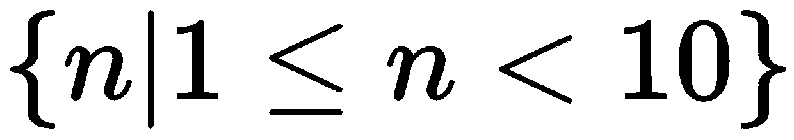
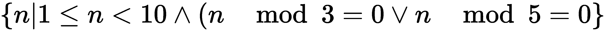
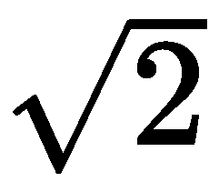
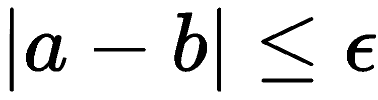

# 一、理解函数式编程

函数式编程使用表达式和求值定义计算；这些通常封装在函数定义中。它不强调或避免状态变化和可变对象的复杂性。这有助于创建更简洁、更具表现力的程序。在本章中，我们将介绍一些描述函数式编程的技术。我们将确定一些将这些特性映射到**Python**的方法。最后，我们还将讨论在使用这些设计模式构建 Python 应用程序时，函数式编程所带来的好处。

Python 有许多函数式编程特性。它不是一种纯粹的函数式编程语言。它提供了足够多的正确类型的特性，从而赋予了函数式编程的好处。它还保留了命令式编程语言的所有优化功能。

我们还将研究一个问题域，这将用于本书中的许多示例。我们将尽量坚持**探索性数据分析**（**EDA**，因为它的算法通常是函数式编程的好例子。此外，函数式编程的好处在这个问题领域迅速积累。

我们的目标是建立函数式编程的一些基本原则。更严肃的 Python 代码将从[第 2 章](02.html)开始，介绍一些功能特性。

We'll focus on Python 3.6 features in this book. However, some of the examples might also work in Python 2.

# 确定范例

很难确定编程范例的范围。出于我们的目的，我们将仅区分许多范例中的两种：**功能性****编程**和**命令式****编程**。这两者之间的一个重要区别是**状态**的概念。

在命令式语言（如 Python）中，计算状态由各种名称空间中的变量值反映；某些类型的语句通过添加或更改（甚至删除）变量对状态进行定义良好的更改。语言是必需的，因为每个语句都是一个命令，它以某种方式改变状态。

我们主要关注赋值语句以及它如何改变状态。Python 还有其他语句，例如`global`或`nonlocal`，它们修改特定名称空间中变量的规则。`def`、`class`和`import`等语句会更改处理上下文。其他语句，如`try`、`except`、`if`、`elif`和`else`充当保护，以修改语句集合如何更改计算状态。类似地，`for`和`while`等语句包装了一个语句块，以便这些语句可以重复更改计算状态。然而，所有这些不同语句类型的焦点都是更改变量的状态。

理想情况下，每个赋值语句将计算状态从初始条件提前到所需的最终结果。这个*推进计算*断言可能很难证明。一种方法是定义最终状态，确定将建立此最终状态的语句，然后推断此最终语句工作所需的先决条件。这个设计过程可以迭代，直到得到一个可接受的初始状态。

在函数式语言中，我们用一个更简单的函数求值概念来代替变量值的变化状态。每个函数求值都会从现有对象创建一个或多个新对象。由于函数程序是函数的组合，我们可以设计易于理解的低级函数，然后设计比复杂的语句序列更易于可视化的高级组合。

函数求值更接近于数学形式。因此，我们通常可以使用简单代数来设计算法，该算法可以清楚地处理边缘情况和边界条件。这使我们对这些功能的工作更有信心。它还可以很容易地定位用于正式单元测试的测试用例。

需要注意的是，与命令式（面向对象或过程式）程序相比，函数式程序往往相对简洁、表达能力强、效率高。好处不是自动产生的；它需要仔细的设计。函数式编程的设计工作通常比过程式编程容易。

# 细分程序范式

我们可以将命令式语言细分为许多离散的类别。在本节中，我们将快速浏览过程与面向对象的区别。这里重要的是了解面向对象编程是命令式编程的一个子集。面向过程和面向对象之间的区别并没有反映函数式编程所代表的基本区别。

我们将使用代码示例来说明这些概念。对一些人来说，这就像是重新发明轮子。对于其他人来说，它提供了抽象概念的具体表达。

对于某些类型的计算，我们可以忽略 Python 的面向对象特性，编写简单的数值算法。例如，我们可以编写如下内容来对共享一个公共属性的一系列数字求和：

```py
s = 0 
for n in range(1, 10): 
    if n % 3 == 0 or n % 5 == 0: 
        s += n 
print(s) 
```

总和`s`只包括三或五的倍数。我们已经使这个程序严格程序化，避免任何显式使用 Python 的对象特性。程序的状态由变量`s`和`n`的值定义。变量`n`的值为 1≤ *n*<10。由于循环涉及对`n`值的有序探索，我们可以证明它将在`n == 10`时终止。类似的代码可以在 C 或 Java 语言中工作，使用它们的基本（非对象）数据类型。

我们可以利用**Python 的****对象**-**面向****编程**（**OOP**的特性，创建一个类似的程序：

```py
m = list() 
for n in range(1, 10): 
    if n % 3 == 0 or n % 5 == 0: 
        m.append(n) 
print(sum(m))
```

此程序产生相同的结果，但它会在运行过程中累积一个有状态的集合对象`m`。计算状态由变量`m`和`n`的值定义。

`m.append(n)`和`sum(m)`的语法可能会混淆。这导致一些程序员（错误地）坚持认为 Python 并非完全面向对象，因为它混合了`function()`和`object.method()`语法。请放心，Python 完全是面向对象的。一些语言，如 C++，允许使用原始数据类型，如 AutoT4、Ty5、P5、和 Ty6 T6，它们不是对象。Python 没有这些基本类型。前缀语法`sum(m)`的存在并不会改变语言的性质。

为了学究式，我们可以通过定义`list`类的子类来完全接受对象模型。这个新类将包括一个`sum`方法：

```py
class Summable_List(list):
    def sum(self):
        s = 0
        for v in self:
            s += v
        return s
```

如果我们用`Summable_List()`类的实例而不是`list()`方法初始化变量`m`，我们可以使用`m.sum()`方法而不是`sum(m)`方法。这种变化有助于澄清 Python 是真正完全面向对象的。前缀函数表示法的使用纯粹是语法上的糖分。

所有这三个示例都依赖变量来显式显示程序的状态。它们依赖赋值语句来更改变量的值，并将计算推向完成。我们可以在这些示例中插入`assert`语句，以证明预期的状态更改得到了正确实现。

关键不是命令式编程在某种程度上被破坏了。关键是函数式编程会导致观点的改变，这在很多情况下都非常有用。我们将显示相同算法的函数视图。函数式编程并没有使这个例子大大缩短或加快。

# 使用功能范式

从功能意义上讲，三和五的倍数之和可以定义为两部分：

*   数列的和
*   通过简单测试条件的值序列，例如，是 3 和 5 的倍数

序列和有一个简单的递归定义：

```py
def sumr(seq): 
    if len(seq) == 0: return 0 
    return seq[0] + sumr(seq[1:]) 
```

我们在两种情况下定义了一个序列的和：**base****case**表示零长度序列的和为 0，而**recursive****case**表示序列的和为第一个值加上序列其余部分的和。因为递归定义依赖于一个较短的序列，所以我们可以确定它（最终）将转移到基本情况。

以下是该函数工作原理的一些示例：

```py
>>> sumr([7, 11])
18
>>> 7+sumr([11])
18
>>> 18+sumr([])
0
```

第一个示例计算包含多个项的列表的总和。第二个示例通过将第一项`seq[0]`添加到剩余项`sumr(seq[1:])`的总和来说明递归规则的工作原理。最终，结果的计算涉及到一个空列表的和，它被定义为零。

上例最后一行的`+`运算符和基本情况下的初始值`0`将方程表示为一个和。如果我们将运算符更改为`*`，将初始值更改为`1`，那么计算乘积也同样容易。在接下来的章节中，我们将回到这个简单的概括概念。

类似地，值序列可以有一个简单的递归定义，如下所示：

```py
def until(n, filter_func, v): 
    if v == n: return [] 
    if filter_func(v): return [v] + until(n, filter_func, v+1) 
    else: return until(n, filter_func, v+1) 
```

在这个函数中，我们比较了给定值`v`和上限`n`。如果`v`达到上限，则结果列表必须为空。这是给定递归的基本情况。

给定的`filter_func()`函数定义了另外两种情况。如果`v`的值由`filter_func()`函数传递，我们将创建一个非常小的列表，包含一个元素，并将`until()`函数的剩余值附加到此列表中。如果`filter_func()`函数拒绝了`v`的值，则忽略该值，结果仅由`until()`函数的剩余值定义。

我们可以看到，`v`的值将从初始值增加到`n`，这向我们保证我们将很快达到基本情况。

下面是我们如何使用`until()`函数生成 3 和 5 的倍数。首先，我们将定义一个方便的`lambda`对象来过滤值：

```py
mult_3_5 = lambda x: x%3==0 or x%5==0 
```

（我们将使用 lambdas 强调简单函数的简洁定义。任何比单行表达式更复杂的表达式都需要`def`语句。）

在下面的示例中，我们可以从命令提示符看到此 lambda 的工作方式：

```py
>>> mult_3_5(3)
True
>>> mult_3_5(4)
False
>>> mult_3_5(5)
True
```

此函数可与`until()`函数一起使用，以生成一系列值，这些值是 3 和 5 的倍数。

生成值序列的`until()`函数的工作原理如下：

```py
>>> until(10, lambda x: x%3==0 or x%5==0, 0)
[0, 3, 5, 6, 9]
```

我们可以使用递归的`sum()`函数来计算这个值序列的和。各种函数，如`sum()`、`until()`和`mult_3_5()`被定义为简单的递归函数。计算这些值时，无需使用中间变量来存储状态。

我们将在几个地方回到这个纯粹的函数式递归定义背后的思想。这里需要注意的是，许多函数式编程语言编译器可以优化这些简单的递归函数。Python 不能做同样的优化。

# 使用功能性混合动力

我们将继续这个示例，使用上一个示例的主要功能版本来计算 3 和 5 的倍数之和。我们的**混合**功能版本可能如下所示：

```py
print(sum(n for n in range(1, 10) if n%3==0 or n%5==0))
```

我们使用嵌套的生成器表达式来迭代一组值，并计算这些值的总和。`range(1, 10)`方法是合适的，因此是一种生成器表达式；它生成一系列值。更复杂的表达式`n for n in range(1, 10) if n%3==0 or n%5==0`也是一个宜人的表达式。它产生一组值，。变量`n`与每个值绑定，与其说是作为计算状态的指示器，不如说是作为表示集合内容的一种方式。`sum()`函数使用 iterable 表达式，创建最终对象 23。

The bound variable doesn't exist outside the generator expression. The variable `n` isn't visible elsewhere in the program.

表达式的`if`子句可以提取到一个单独的函数中，允许我们轻松地将其重新用于其他规则。我们还可以使用名为`filter()`的高阶函数，而不是生成器表达式的`if`子句。我们将为[第 5 章](05.html)、*高阶函数*保存此内容。

本例中的变量`n`与前两个命令式示例中的变量`n`没有直接可比性。`for`语句（在生成器表达式之外）在本地名称空间中创建适当的变量。生成器表达式创建变量的方式与`for`语句不同：

```py
>>> sum(n for n in range(1, 10) if n%3==0 or n%5==0)
23
>>> n
Traceback (most recent call last):
  File "<stdin>", line 1, in <module>
NameError: name 'n' is not defined  
```

生成器表达式中的绑定之外不存在变量`n`。它不定义计算的状态。

# 查看对象创建

在某些情况下，将中间对象视为计算历史可能会有所帮助。重要的是，计算的历史不是固定的。当函数是交换的或关联的时，对求值顺序的更改可能会导致创建不同的对象。这可能会在不改变结果正确性的情况下提高性能。

考虑这个表达式：

```py
>>> 1+2+3+4
10
```

我们正在研究具有相同结果的各种潜在计算历史。因为`+`算子是交换的和结合的，所以有大量的候选历史导致相同的结果。

在候选序列中，有两个重要的备选方案，如下所示：

```py
>>> ((1+2)+3)+4
10
>>> 1+(2+(3+4))
10  
```

在第一种情况下，我们从左向右折叠值。这就是 Python 隐式工作的方式。中间对象 3 和 6 是作为此评估的一部分创建的。

在第二种情况下，我们从右向左折叠。在这种情况下，将创建中间对象 7 和 9。在简单整数运算的情况下，两个结果具有相同的性能；没有优化的好处。

当我们使用像`list`append 这样的东西时，当我们更改关联规则时，我们可能会看到一些优化改进。

下面是一个简单的例子：

```py
>>> import timeit
>>> timeit.timeit("((([]+[1])+[2])+[3])+[4]")
0.8846941249794327
>>> timeit.timeit("[]+([1]+([2]+([3]+[4])))")
1.0207440659869462  
```

在这种情况下，从左到右工作有一些好处。

对于功能设计来说，重要的是，`+`运算符（或`add()`函数）可以以任何顺序使用，以产生相同的结果。`+`操作符没有限制该操作符使用方式的隐藏副作用。

# 一堆乌龟

当我们使用 Python 进行函数式编程时，我们走上了一条不完全是函数式的混合编程道路。Python 不是**Haskell**、**OCaml**或**Erlang**。因此，我们的底层处理器硬件无法正常工作；它甚至不是严格的面向对象的，CPU 通常是程序化的。

All programming languages rest on abstractions, libraries, frameworks and virtual machines. These abstractions, in turn, may rely on other abstractions, libraries, frameworks and virtual machines. The most apt metaphor is this: the world is carried on the back of a giant turtle. The turtle stands on the back of another giant turtle. And that turtle, in turn, is standing on the back of yet another turtle.

It's turtles all the way down. - Anonymous

抽象的层次没有实际的终结。

更重要的是，抽象和虚拟机的存在并没有实质性地改变我们设计利用 Python 函数编程特性的软件的方法。

即使在函数式编程社区中，也有更纯粹和更不纯粹的函数式编程语言。一些语言广泛使用`monads`来处理有状态的事情，比如文件系统的输入和输出。其他语言依赖于与我们使用 Python 的方式类似的混合环境。在 Python 中，软件通常可以正常运行，但要小心选择过程异常。

我们的函数式 Python 程序将依赖于以下三个抽象堆栈：

*   我们的应用程序将一直是函数，直到我们碰到对象为止
*   支持函数式编程的底层 Python 运行时环境一直是对象，直到我们找到库为止
*   支持 Python 的库是 Python 赖以生存的乌龟

操作系统和硬件形成了自己的一堆乌龟。这些细节与我们要解决的问题无关。

# 函数式编程的经典示例

作为介绍的一部分，我们将看一个函数式编程的经典示例。这是基于约翰·休斯的论文*为什么函数式编程很重要*。这篇文章发表在一篇名为《函数式编程研究主题》的论文中，该论文由 D.Turner 编辑，由 Addison Wesley 于 1990 年出版。

这里有一个链接，指向论文*函数式编程的研究主题*：

[http://www.cs.kent.ac.uk/people/staff/dat/miranda/whyfp90.pdf](http://www.cs.kent.ac.uk/people/staff/dat/miranda/whyfp90.pdf)

一般来说，函数式编程的讨论是深刻的。文中给出了几个例子。我们只看一个：定位函数根的 Newton-Raphson 算法。在这种情况下，函数是平方根。

这一点很重要，因为该算法的许多版本都依赖于通过`loops`管理的显式状态。事实上，休斯的论文提供了一段强调有状态、命令式处理的**Fortran**代码。

此近似的核心是从当前近似计算下一个近似。`next_()`函数采用`x`，这是`sqrt(n)`方法的近似值，并计算下一个包含正确根的值。请看以下示例：

```py
def next_(n, x):
    return (x+n/x)/2
```

此函数计算一系列值。每次值之间的距离都会减半，因此它们会快速收敛到值上，即，即。请注意，名称`next()`将与内置函数冲突。将其命名为`next_()`让我们尽可能接近原始演示，使用 python 名称。

以下是在命令提示符中使用该函数时的外观：

```py
>>> n = 2
>>> f = lambda x: next_(n, x)
>>> a0 = 1.0
>>> [round(x,4) for x in (a0, f(a0), f(f(a0)), f(f(f(a0))),)]
[1.0, 1.5, 1.4167, 1.4142]  
```

我们已经将`f()`方法定义为收敛于的`lambda`。我们以 1.0 作为的初始值。然后我们评估了一系列递归评估：、等等。我们使用生成器表达式计算这些函数，以便对每个值进行四舍五入。这使得输出更容易阅读，也更容易与`doctest`一起使用。序列似乎在上迅速收敛。

我们可以编写一个函数，它（原则上）将生成一个无穷多的值序列，这些值收敛于适当的平方根：

```py
def repeat(f, a):
    yield a
    for v in repeat(f, f(a)):
        yield v  
```

此函数将使用函数`f()`和初始值`a`生成近似值。如果我们提供前面定义的`next_()`函数，我们将得到一系列近似于`n`参数平方根的结果。

The `repeat()` function expects the `f()` function to have a single argument; however, our `next_()` function has two arguments. We can use a `lambda` object, `lambda x: next_(n, x)`, to create a partial version of the `next_()` function with one of two variables bound.

The Python generator functions can't be trivially recursive; they must explicitly iterate over the recursive results, yielding them individually. Attempting to use a simple `return repeat(f, f(a))` will end the iteration, returning a generator expression instead of yielding the sequence of values.

有两种方法可以返回所有值，而不是返回生成器表达式，如下所示：

*   我们可以编写一个显式的`for`循环，如下所示：

```py
for x in some_iter: yield x.
```

*   我们可以使用`yieldfrom`语句如下：

```py
yield from some_iter. 
```

产生递归生成函数值的两种方法是等效的。我们将努力强调`yield from`。然而，在某些情况下，带有复杂表达式的`yield`将比等效映射或生成器表达式更清晰。

当然，我们不想要整个无限序列。当两个值彼此非常接近，以至于其中任何一个都可以用作我们正在寻找的平方根时，停止生成值是非常重要的。该值的常用符号非常接近，是希腊字母**ε**、`ε`，这可以被认为是我们可以容忍的最大错误。

在 Python 中，每次从无限序列中获取一个项目时，我们必须稍微聪明一点。使用一个简单的接口函数包装一个稍微复杂一点的递归，效果很好。请看以下代码段：

```py
def within(ε, iterable):
    def head_tail(ε, a, iterable):
        b = next(iterable)
        if abs(a-b) <= ε: return b
            return head_tail(ε, b, iterable)
    return head_tail(ε, next(iterable), iterable)
```

我们已经定义了一个内部函数`head_tail()`，它接受容差`ε`、一个来自 iterable 序列的项`a`，以及 iterable 序列的其余项`iterable`。`iterable`中的下一项绑定到名称`b`。如果，则两个值足够接近，可以找到平方根。否则，我们在递归调用`head_tail()`函数时使用`b`值来检查下一对值。

我们的`within()`函数仅寻求使用`iterable`参数的第一个值正确初始化内部`head_tail()`函数。

一些函数式编程语言提供了一种将值放回`iterable`序列的技术。在 Python 中，这可能是一种将值推回迭代器的`unget()`或`previous()`方法。Python iterables 不提供这种丰富的功能。

我们可以使用三个函数`next_()`、`repeat()`和`within()`创建平方根函数，如下所示：

```py
def sqrt(a0, ε, n):
    return within(ε, repeat(lambda x: next_(n,x), a0))
```

我们已经使用了`repeat()`函数，以`next_(n,x)`函数为基础生成（潜在的）无限值序列。当我们的`within()`函数找到两个差值小于`ε`的值时，它将停止在序列中生成值。

当我们使用这个版本的`sqrt()`方法时，我们需要提供初始种子值`a0`和`ε`值。类似于`sqrt(1.0, .0001, 3)`的表达式将以近似值 1.0 开始，并将的值计算到 0.0001 以内。对于大多数应用，初始`a0`值可以是 1.0。但是，该方法越接近实际平方根，收敛速度越快。

该近似算法的原始示例用 Miranda 语言显示。很容易看出 Miranda 和 Python 之间没有什么深刻的区别。最大的区别是米兰达构建`cons`的能力，将一个值转换回`iterable`，做一种`unget`。Miranda 和 Python 之间的这种并行性让我们相信，许多类型的函数式编程都可以用 Python 轻松完成。

# 探索性数据分析

在本书后面，我们将使用**探索性数据分析**（**EDA**字段）作为函数式编程具体示例的源代码。该领域丰富了处理复杂数据集的算法和方法；函数式编程通常非常适合于问题域和自动化解决方案。

虽然细节因作者而异，但 EDA 有几个被广泛接受的阶段。这些措施包括：

*   **数据准备**：这可能涉及源应用程序的提取和转换。它可能涉及解析源数据格式和执行某种数据清理以删除不可用或无效的数据。这是功能设计技术的一个优秀应用。
*   **数据探索**：这是对可用数据的描述。这通常涉及基本的统计功能。这是探索函数式编程的另一个好地方。我们可以用单变量和双变量统计来描述我们的关注点，但这听起来太令人畏惧和复杂了。这意味着我们将关注均值、中位数、模式和其他相关的描述性统计。数据探索也可能涉及数据可视化。我们将回避这个问题，因为它不涉及太多函数编程。我建议您使用诸如 SciPy 之类的工具包。访问以下链接以获取有关 SciPY 的工作原理及其用法的更多信息：
    *   [https://www.packtpub.com/big-data-and-business-intelligence/learning-scipy-numerical-and-scientific-computing](https://www.packtpub.com/big-data-and-business-intelligence/learning-scipy-numerical-and-scientific-computing)
    *   [https://www.packtpub.com/big-data-and-business-intelligence/learning-python-data-visualization](https://www.packtpub.com/big-data-and-business-intelligence/learning-python-data-visualization)
*   **数据建模和机器学习**：这往往是禁止的，因为它涉及到将模型扩展到新数据。我们将绕开这一点，因为一些模型在数学上可能变得复杂。如果我们在这些主题上花费太多时间，我们将无法专注于函数式编程。
*   **评估与比较**：当存在替代模型时，必须对每个模型进行评估，以确定哪个模型更适合可用数据。这可能涉及模型输出的普通描述性统计。这可以从功能设计技术中获益。

EDA 的目标通常是创建一个可以部署为决策支持应用程序的模型。在许多情况下，模型可能是一个简单的函数。一种简单的函数编程方法可以将模型应用于新数据，并显示结果供人类使用。

# 总结

我们着眼于区分函数式范式和两种常见的命令式范式来研究编程范式。本书的目标是探索 Python 的函数式编程特性。我们注意到 Python 的某些部分不允许纯粹的函数式编程；我们将使用一些混合技术，将简洁、富有表现力的函数式编程的良好特性与 Python 中的一些高性能优化结合起来。

在下一章中，我们将详细介绍五种特定的函数式编程技术。这些技术将为我们在 Python 中的混合函数编程奠定必要的基础。