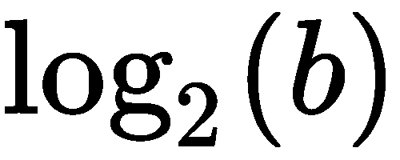
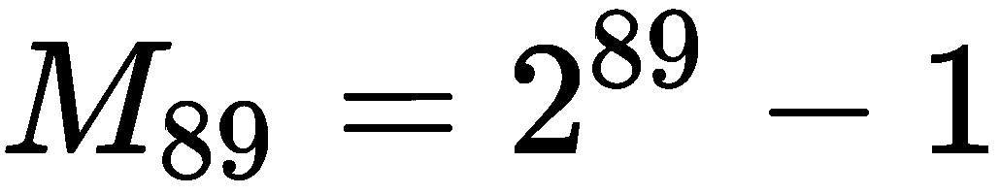
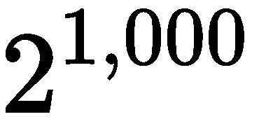
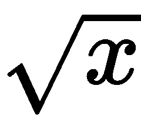
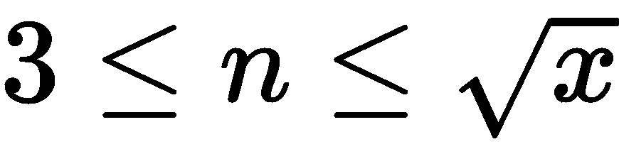
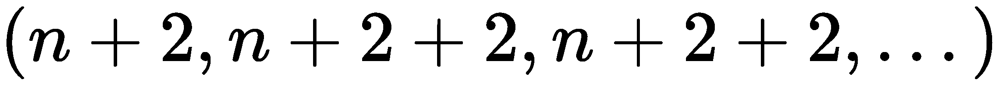

# 函数、迭代器和生成器

函数式编程的核心是使用纯函数将值从输入域映射到输出范围。纯函数没有副作用，这对于我们在 Python 中实现来说是一个相对容易的阈值。

避免副作用可以减少对变量赋值的依赖，从而保持计算的状态。我们不能从 Python 语言中清除赋值语句，但是我们可以减少对有状态对象的依赖。这意味着在可用的 Python 内置函数和数据结构中选择那些不需要有状态操作的函数和数据结构。

本章将从功能的角度介绍几种 Python 特性，如下所示：

*   纯功能，无副作用
*   函数作为对象，可以作为参数传递或作为结果返回
*   使用面向对象的后缀表示法和前缀表示法使用 Python 字符串
*   使用元组和命名元组作为创建无状态对象的方法
*   使用 iterable 集合作为函数式编程的主要设计工具

我们将研究生成器和生成器表达式，因为它们是处理对象集合的方法。正如我们在[第 2 章](02.html)*中提到的，引入基本函数概念*时，尝试用递归替换所有生成器表达式时存在一些边界问题。Python 施加了递归限制，并且不会自动处理**尾部调用优化**（**TCO**）：我们必须使用生成器表达式手动优化递归。

我们将编写执行以下任务的生成器表达式：

*   转换
*   重组
*   复杂计算

我们将对许多内置 Python 集合进行快速调查，以及在追求功能范例的同时如何使用集合。这可能会改变我们使用`lists`、`dicts`和`sets`的方法。编写函数式 Python 鼓励我们关注元组和不可变集合。在下一章中，我们将强调处理特定类型集合的更实用的方法。

# 编写纯函数

没有副作用的函数符合函数的纯数学抽象：变量没有全局变化。如果我们避免使用`global`语句，我们将几乎达到这个阈值。为了实现**纯**，函数还应该避免更改状态可变的对象。

下面是纯函数的一个示例：

```py
def m(n: int) -> int:
    return 2**n-1
```

此结果仅取决于参数*n*。全局变量没有变化，函数也不会更新任何可变的数据结构。

对 Python 全局名称空间中的值的任何引用（使用自由变量）都可以修改为适当的参数。在大多数情况下，这很容易。下面是一个依赖于自由变量的示例：

```py
def some_function(a: float, b: float, t: float) -> float:
    return a+b*t+global_adjustment
```

我们可以重构这个函数，将`global_adjustment`变量转换成合适的参数。我们需要更改此函数的每个引用，这可能会在复杂的应用程序中产生巨大的涟漪效应。具有全局引用的函数将在函数体中包含自由变量。

有许多内部 Python 对象是有状态的。`file`类和其他类似文件的对象的实例是常用的有状态对象的示例。我们观察到，Python 中一些常用的有状态对象通常充当上下文管理器。在少数情况下，有状态对象不能完全实现上下文管理器接口；在这些情况下，通常有一种`close()`方法。我们可以使用`contextlib.closing()`函数为这些对象提供适当的上下文管理器接口。

我们不能轻易地消除所有有状态的 Python 对象。因此，我们必须在管理状态和利用功能设计的优势之间取得平衡。为此，我们应该始终使用`with`语句将有状态文件对象封装到定义良好的范围中。

Always use file objects in a `with` context.

我们应该始终避免全局文件对象、全局数据库连接和相关的有状态对象问题。全局文件对象是处理打开文件的常见模式。我们可能有一个如下命令片段所示的函数：

```py
def open(iname: str, oname: str):
    global ifile, ofile
    ifile= open(iname, "r")
    ofile= open(oname, "w")  
```

在这种情况下，许多其他函数可以使用`ifile`和`ofile`变量，希望它们正确地引用`global`文件，这些文件是留给应用程序使用的。

这不是一个非常实用的设计，我们需要避免它。这些文件应该是函数的适当参数，打开的文件应该嵌套在一个`with`语句中，以确保它们的有状态行为得到正确处理。这是将这些变量从全局变量更改为形式参数的一个重要重写：它使文件操作更加可见。

这种设计模式也适用于数据库。数据库连接对象通常应作为应用程序函数的形式参数提供。这与一些流行的 web 框架的工作方式相反：一些框架依赖于全局数据库连接，以使数据库成为应用程序的透明特性。这种透明性掩盖了 web 操作和数据库之间的依赖关系；它会使单元测试变得比必要的更复杂。此外，多线程 web 服务器可能无法从共享单个数据库连接中获益：连接池通常更好。这表明使用功能设计和一些独立的有状态特性的混合方法有一些好处。

# 作为一级对象的函数

Python 函数是一流的对象，这一点并不奇怪。在 Python 中，函数对象有许多属性。参考手册列出了许多适用于功能的特殊成员名称。由于函数是具有属性的对象，因此我们可以使用特殊属性（如`__doc__`或`__name__`）提取 docstring 或函数名。我们还可以通过`__code__`属性提取函数体。在编译语言中，这种自省相对复杂，因为需要保留源信息。在 Python 中，它非常简单。

我们可以将函数分配给变量，将函数作为参数传递，并将函数作为值返回。我们可以很容易地使用这些技术来编写高阶函数。

此外，一个可调用对象帮助我们创建函数。我们可以将可调用类定义视为高阶函数。我们确实需要明智地使用可调用对象的`__init__()`方法；我们应该避免设置有状态的类变量。一个常见的应用是使用`__init__()`方法创建符合`Strategy`设计模式的对象。

遵循`Strategy`设计模式的类依赖于其他对象来提供算法或算法的一部分。这允许我们在运行时注入算法细节，而不是将细节编译到类中。

下面是一个可调用对象的示例，其中包含一个嵌入的`Strategy`对象：

```py
from typing import Callable
class Mersenne1:
    def __init__(self, algorithm : Callable[[int], int]) -> None:
        self.pow2 = algorithm
    def __call__(self, arg: int) -> int:
        return self.pow2(arg)-1  
```

此类使用`__init__()`将对另一个函数`algorithm`的引用保存为`self.pow2`。我们没有创建任何有状态的实例变量；`self.pow2`的值预计不会改变。`algorithm`参数有一个类型提示`Callable[[int], int]`，一个接受整型参数并返回整数值的函数。

作为`Strategy`对象给定的函数必须将 2 提升到给定的幂。我们可以插入此类的三个候选对象如下：

```py
def shifty(b: int) -> int:
    return 1 << b

def multy(b: int) -> int:
    if b == 0: return 1
    return 2*multy(b-1)

def faster(b: int) -> int:
    if b == 0: return 1
    if b%2 == 1: return 2*faster(b-1)
    t= faster(b//2)
    return t*t  
```

`shifty()`函数使用位的左移将 2 提升到所需功率。`multy()`函数使用简单的递归乘法。`faster()`函数使用分治策略，将执行乘法而不是*b*乘法。

这三个函数都有相同的函数签名。每一个都可以概括为`Callable[[int], int]`，它与`Mersenne1.__init__()`方法的参数`algorithm`相匹配。

我们可以使用嵌入式策略算法创建`Mersenne1`类的实例，如下所示：

```py
m1s = Mersenne1(shifty)
m1m = Mersenne1(multy)
m1f = Mersenne1(faster)  
```

这说明了我们如何定义产生相同结果但使用不同算法的替代函数。

Python allows us to compute , since this doesn't even come close to the recursion limits in Python. This is quite a large prime number, as it has 27 digits.

# 使用字符串

因为 Python 字符串是不可变的，所以它们是函数式编程对象的一个很好的例子。Python`str`对象有许多方法，所有这些方法都会生成一个新字符串作为结果。这些方法是纯函数，没有副作用。

`str`方法函数的语法是后缀，其中大多数函数都是前缀。这意味着，当复杂的字符串操作与常规函数混合时，它们可能很难读取。例如，在这个表达式中，`len(variable.title())`中，`title()`方法是后缀表示法，`len()`函数是前缀表示法。

当从网页上抓取数据时，我们可能有一个清除数据的功能。这可以对一个字符串应用许多转换来清除标点符号，并返回一个`Decimal`对象供应用程序的其余部分使用。这将涉及前缀和后缀语法的混合。

它可能类似于以下命令片段：

```py
from decimal import *
from typing import Text, Optional
def clean_decimal(text: Text) -> Optional[Text]:
    if text is None: return None
    return Decimal(
        text.replace("$", "").replace(",", "")) 
```

此函数对字符串进行两次替换，以删除`$`和`,`字符串值。结果字符串用作`Decimal`类构造函数的参数，该构造函数返回所需的对象。如果输入值为`None`，则保留该值；这就是使用`Optional`类型提示的原因。

为了使语法看起来更加一致，我们可以考虑为 PosiT0Ay 方法函数定义自己的前缀函数，如下所示：

```py
def replace(str: Text, a: Text, b: Text) -> Text:
    return str.replace(a,b)
```

这允许我们使用具有一致前缀语法的`Decimal(replace(replace(text, "$", ""), ",", ""))`。目前还不清楚这种一致性是否比混合前缀和后缀表示法有显著改进。这可能是愚蠢的一致性的一个例子。

更好的方法可能是定义一个更有意义的前缀函数来去除标点，例如以下命令片段：

```py
def remove(str: Text, chars: Text) -> Text:
    if chars: 
        return remove(
            str.replace(chars[0], ""), 
            chars[1:]
        )
    return str
```

此函数将递归删除`chars`变量中的每个字符。我们可以将其用作`Decimal(remove(text, "$,"))`，以使字符串清理的意图更加清晰。

# 使用元组和命名元组

由于 Python 元组是不可变的对象，因此它们是另一个适合函数式编程的对象的优秀示例。Python`tuple`的方法函数非常少，因此几乎所有操作都是使用前缀语法完成的。元组有许多用例，特别是在处理元组列表、元组的元组和元组构造生成器时。

`namedtuple`类为元组添加了一个基本特性：一个我们可以用来代替索引的名称。我们可以利用命名元组来创建数据累积的对象。这允许我们基于无状态对象编写纯函数，同时将数据绑定到整洁的类对象包中。

我们几乎总是在值集合的上下文中使用元组（和命名元组）。如果我们使用的是单个值，或者是一组恰好由两个值组成的整齐的值，我们通常会对函数使用命名参数。但是，在处理集合时，我们可能需要元组的 iterable 或类构造的 iterable。

决定使用`tuple`或`namedtuple`对象完全是为了方便。作为一个例子，考虑使用一系列颜色值作为表格 Ty2 T2 的三元组，不清楚这些是红色、绿色、蓝色的顺序。我们有许多方法使元组结构显式。

我们可以通过创建函数将三元组分开来阐明三元组结构，如以下命令片段所示：

```py
red = lambda color: color[0]
green = lambda color: color[1]
blue = lambda color: color[2]  
```

给定一个元组`item`，我们可以使用`red(item)`选择包含红色分量的项。它有助于对每个变量提供更正式的类型提示，如下所示：

```py
from typing import Tuple, Callable
RGB = Tuple[int, int, int]
red: Callable[[RGB], int] = lambda color: color[0]
```

这将一个新类型`RGB`定义为三元组。`red`变量提供了一个类型提示`Callable[[RGB], int]`，表示应该将其视为接受`RGB`参数并生成整数结果的函数。

或者，我们可以使用较旧样式的`namedtuple`类对象引入以下定义：

```py
from collections import namedtuple
Color = namedtuple("Color", ("red", "green", "blue", "name"))  
```

更好的技术是使用打字模块中的`NamedTuple`类：

```py
from typing import NamedTuple
class Color(NamedTuple):
     """An RGB color."""
     red: int
     green: int
     blue: int
     name: str
```

`Color`类的这个定义定义了一个元组，该元组中的每个位置都有特定的名称和类型提示。这保留了性能和不变性的优点。它增加了**mypy**程序确认元组使用正确的功能。

这三种技术允许使用`item.red`而不是`red(item)`。这两种方法中的任何一种都比令人困惑的`item[0]`好。

元组的函数编程应用集中在元组设计模式的可重用性上。我们将仔细研究一些元组技术。我们将在[第 7 章](07.html)、*附加元组技术*中介绍`namedtuple`类技术。

# 使用生成器表达式

我们已经展示了一些生成器表达式的示例。我们将在本章后面展示更多内容。在本节中，我们将介绍更多的生成器技术。

通常可以看到生成器表达式通过`list`理解或`dict`理解语法来创建`list`或`dict`文本。这个例子，`[x**2 for x in range(10)]`是一个列表理解，有时称为列表显示。出于我们的目的，列表显示（或理解）是使用生成器表达式的几种方法之一。集合显示包括封闭文字语法。在本例中，列表文字`[]`字符包装生成器：`[x**2 for x in range(10)]`。这是一个列表理解；它从封闭的生成器表达式`x**2 for x in range(10)`创建一个`list`对象。在本节中，我们将重点讨论独立于列表对象的生成器表达式。

集合对象和生成器表达式具有一些类似的行为，因为它们都是可编辑的。它们不是等价的，我们将在下面的代码中看到。使用显示的缺点是创建一个（可能很大的）对象集合。生成器表达式是惰性的，仅根据需要创建对象；这可以提高性能。

我们必须提供有关生成器表达式的两个重要注意事项，如下所示：

*   生成器看起来像序列。少数例外包括使用需要知道集合大小的函数，如`len()`函数。
*   发电机只能使用一次。之后，它们看起来是空的。

下面是我们将用于一些示例的生成器函数：

```py
def pfactorsl(x: int) -> Iterator[int]:
    if x % 2 == 0:
        yield 2
        if x//2 > 1:
            yield from pfactorsl(x//2)
        return
    for i in range(3, int(math.sqrt(x)+.5)+1, 2):
        if x % i == 0:
            yield i
            if x//i > 1:
                yield from pfactorsl(x//i)
            return
    yield x
```

我们正在定位一个数的素数因子。如果数字*x*是偶数，我们将得到 2，然后递归地得到*x*/2 的所有素数因子。

对于奇数，我们将通过大于或等于 3 的奇数值来查找该数的候选因子。当我们定位一个因子*i*时，我们将产生该因子，然后递归产生*x*÷*i*的所有素因子。

如果我们找不到因子，那么数字*x*必须是素数，这样我们就可以得到这个数字。

我们将 2 作为特例来处理，以将迭代次数减半。除 2 外，所有素数都是奇数。

除了递归之外，我们还使用了一个重要的`for`循环。这个显式循环允许我们轻松处理多达 1000 个因子的数字。（例如，，一个 300 位的数字，将有 1000 个因子。）由于`for`变量`i`未在循环的缩进体外部使用，因此如果我们对循环体进行任何更改，`i`变量的状态性质不会导致混淆。

此示例演示如何手动执行尾部调用优化。计数范围从 3 到的递归调用已替换为循环。`for`循环将我们从深度递归调用堆栈中解救出来。

因为函数是 iterable，`yield from`语句用于使用递归调用中的 iterable 值并将其提供给调用方。

In a recursive generator function, be careful of the return statement. Do not use the following command line: `return recursive_iter(args)`
It returns only a generator object; it doesn't evaluate the function to return the generated values. Use any of the following:
`for result in recursive_iter(args):`
`yield result`
`yield from recursive_iter(args)`

作为替代方案，以下定义是更纯粹的递归版本：

```py
def pfactorsr(x: int) -> Iterator[int]:
    def factor_n(x: int, n: int) -> Iterator[int]:
        if n*n > x:
            yield x
            return
        if x % n == 0:
            yield n
            if x//n > 1:
                yield from factor_n(x//n, n)
        else:
            yield from factor_n(x, n+2)
    if x % 2 == 0:
        yield 2
        if x//2 > 1:
            yield from pfactorsr(x//2)
        return
    yield from factor_n(x, 3)  
```

我们定义了一个内部递归函数`factor_n()`，用于测试范围内的因素*n*。如果候选因子*n*超出范围，则*x*为素数。否则，我们将看到*n*是否是*x*的因子。如果是，我们将产生*n*和的所有因子。如果*n*不是一个因子，我们将使用递归计算函数。这使用递归来测试的每个值。虽然这比前面显示的`for`语句版本简单，但由于 Python 的堆栈限制，它无法处理超过 1000 个因子的数字。

outer 函数处理一些边缘情况。与其他素数相关的处理一样，我们将两个作为特例处理。对于偶数，我们将产生两个，然后递归计算*x*2 的`pfactorsr()`。所有其他素数因子必须是大于或等于 3 的奇数。我们将从 3 开始评估`factors_n()`函数，以测试这些其他候选素因子。

The purely recursive function can only locate prime factors of numbers up to about 4,000,000\. Above this, Python's recursion limit will be reached.

# 探索发电机的局限性

我们注意到生成器表达式和生成器函数存在一些限制。通过执行以下命令片段可以观察到这些限制：

```py
>>> from ch02_ex4 import *
>>> pfactorsl(1560)
<generator object pfactorsl at 0x1007b74b0>
>>> list(pfactorsl(1560))
[2, 2, 2, 3, 5, 13]
>>> len(pfactorsl(1560))
Traceback (most recent call last):
  File "<stdin>", line 1, in <module>
TypeError: object of type 'generator' has no len() 
```

在第一个示例中，我们看到生成器函数`pfactors1`创建了一个生成器。生成器是惰性的，在我们使用生成器生成的结果之前，它没有正确的值。它本身并不是一种限制；惰性计算是生成器表达式适合 Python 函数式编程的一个重要原因。

在第二个示例中，我们根据生成器函数生成的结果具体化了一个`list`对象。这对于查看输出和编写单元测试用例非常方便。

在第三个例子中，我们看到了生成器函数的一个限制：没有`len()`。因为生成器是惰性的，所以在使用所有值之前无法知道大小。

生成器函数的另一个限制是它们只能使用一次。

例如，请查看以下命令片段：

```py
>>> result = pfactorsl(1560)
>>> sum(result)
27
>>> sum(result)
0
```

`sum()`方法的第一次评估对发电机`result`进行了评估。所有的值都被消耗掉了。`sum()`方法的第二次评估发现发电机现在是空的。我们只能使用生成器的值一次。

生成器在 Python 中具有有状态的生命。虽然它们在函数式编程的某些方面非常优秀，但它们并不十分完美。

我们可以尝试使用`itertools.tee()`方法来克服一次性限制。我们将在[第 8 章](08.html)、*Itertools 模块*中深入了解这一点。下面是其用法的一个快速示例：

```py
import itertools
from typing import Iterable, Any
def limits(iterable: Iterable[Any]) -> Any:
    max_tee, min_tee = itertools.tee(iterable, 2)
    return max(max_tee), min(min_tee)  
```

我们创建了参数生成器表达式的两个克隆，`max_tee`和`min_tee`。这使得最初的迭代器保持不变，这是一个令人愉快的特性，允许我们进行非常灵活的函数组合。我们可以使用这两个克隆从 iterable 中获得最大值和最小值。

一旦使用，iterable 将不再提供任何值。当我们想要计算多种类型的约化时，例如，求和和和计数，或最小值和最大值，我们需要在设计时考虑到这一点。

# 组合生成器表达式

函数式编程的本质来自于我们可以轻松组合生成器表达式和生成器函数来创建非常复杂的复合处理序列的方法。使用生成器表达式时，我们可以通过多种方式组合生成器。

组合生成器函数的一种常见方法是创建复合函数。我们可能有一个计算`(f(x) for x in range())`的生成器。如果我们想计算`g(f(x))`，我们有几种方法来组合两个生成器。

我们可以按如下方式调整原始生成器表达式：

```py
g_f_x = (g(f(x)) for x in range())  
```

虽然从技术上讲是正确的，但这破坏了任何重用的想法。我们没有重复使用表达式，而是重写了它。

我们还可以将一个表达式替换为另一个表达式，如下所示：

```py
g_f_x = (g(y) for y in (f(x) for x in range()))
```

这样做的好处是允许我们使用简单的替换。我们可以使用以下命令对此稍加修改以强调重用：

```py
f_x = (f(x) for x in range())
g_f_x = (g(y) for y in f_x)  
```

这样做的好处是保留初始表达式`(f(x) for x in range())`基本上未被触及。我们所做的只是将表达式赋给一个变量。

生成的复合函数也是一个生成器表达式，也是惰性的。这意味着从`g_f_x`中提取下一个值将从`f_x`中提取一个值，这将从源`range()`函数中提取一个值。

# 使用生成器函数清理原始数据

探索性数据分析中出现的任务之一是清理原始源数据。这通常是一个复合操作，将几个标量函数应用于每个输入数据段，以创建可用的数据集。

让我们看一组简化的数据。这些数据通常用于显示探索性数据分析中的技术。它被称为`Anscombe's quartet`，它来自于 F.J.Anscombe 于 1973 年在《美国统计学家》中发表的《统计分析中的*图形》*一文。以下是使用此数据集下载的文件的前几行：

```py
Anscombe's quartet 
I  II  III  IV 
x  y  x  y  x  y  x  y 
10.0  8.04  10.0  9.14       10.0  7.46  8.0  6.58 
8.0      6.95  8.0  8.14  8.0  6.77  8.0  5.76 
13.0  7.58  13.0  8.74  13.0  12.74  8.0  7.71 
```

遗憾的是，我们不能用`csv`模块简单地处理这个问题。我们需要做一点解析来从这个文件中提取有用的信息。因为数据是正确的制表符分隔的，所以我们可以使用`csv.reader()`函数来遍历不同的行。我们可以如下定义数据迭代器：

```py
import csv
from typing import IO, Iterator, List, Text, Union, Iterable
def row_iter(source: IO) -> Iterator[List[Text]]:
    return csv.reader(source, delimiter="\t")  
```

我们只需将一个文件包装在一个`csv.reader`函数中，就可以在行上创建一个迭代器。键入模块为文件对象提供了方便的定义`IO`。`csv.reader()`函数的作用是作为行的迭代器。每行是一个文本值列表。定义一个额外的类型`Row = List[Text]`可能会有帮助，使其更加明确。

我们可以在以下上下文中使用此`row_iter()`函数：

```py
with open("Anscombe.txt") as source:
    print(list(row_iter(source)))  
```

虽然这将显示有用的信息，但问题是生成的 iterable 中的前三项不是数据。`Anscombe's quartet`文件以以下行开始：

```py
[["Anscombe's quartet"], 
 ['I', 'II', 'III', 'IV'], 
 ['x', 'y', 'x', 'y', 'x', 'y', 'x', 'y'],
```

我们需要从 iterable 中筛选这三个非数据行。下面是一个函数，它将整齐地删除三个预期的标题行，并在其余的行上返回迭代器：

```py
def head_split_fixed(
        row_iter: Iterator[List[Text]]
    ) -> Iterator[List[Text]]:
    title = next(row_iter)
    assert (len(title) == 1 
        and title[0] == "Anscombe's quartet")
    heading = next(row_iter)
    assert (len(heading) == 4 
        and heading == ['I', 'II', 'III', 'IV'])
    columns = next(row_iter)
    assert (len(columns) == 8 
        and columns == ['x','y', 'x','y', 'x','y', 'x','y'])
    return row_iter  
```

此函数从源数据中提取三行，即迭代器。它断言每一行都有一个期望值。如果文件不符合这些基本要求，则表明文件已损坏，或者我们的分析集中在错误的文件上。

由于`row_iter()`和`head_split_fixed()`函数都期望迭代器作为参数值，因此它们可以简单地组合，如下所示：

```py
with open("Anscombe.txt") as source:
    print(list(head_split_fixed(row_iter(source))))
```

我们只是将一个迭代器应用于另一个迭代器的结果。实际上，这定义了一个复合函数。当然，我们还没有完成；我们仍然需要将`strings`值转换为`float`值，并且我们还需要分离每行中的四个并行数据序列。

最终的转换和数据提取更容易通过高阶函数完成，例如`map()`和`filter()`。我们将回到[第 5 章](05.html)、*高阶函数*中的内容。

# 使用列表、目录和集合

Python 序列对象（如`list`）是可移植的。但是，它还有一些附加功能。我们将把它看作一个物化的 iterable。我们在几个示例中使用了`tuple()`函数，将生成器表达式或生成器函数的输出收集到单个`tuple`对象中。我们还可以具体化一个序列来创建一个`list`对象。

在 Python 中，*列表显示*或*列表理解*提供了实现生成器的简单语法：我们只需添加`[]`括号。这是无处不在的，以至于生成器表达式和列表理解之间的区别消失了。我们需要从使用生成器表达式的列表显示中分离生成器表达式的概念。

以下是列举案例的示例：

```py
>>> range(10)
range(0, 10)
>>> [range(10)]
[range(0, 10)]
>>> [x for x in range(10)]
[0, 1, 2, 3, 4, 5, 6, 7, 8, 9]
>>> list(range(10))
[0, 1, 2, 3, 4, 5, 6, 7, 8, 9]  
```

第一个例子是`range`对象，它是一种生成器函数。它不会产生任何值，因为它是懒惰的。

The `range(10)` function is lazy; it won't produce the 10 values until evaluated in a context that iterates through the values.

第二个示例显示了由生成器函数的单个实例组成的列表。`[]`语法在不使用迭代器创建的任何值的情况下创建了`range()`对象的列表文本。

第三个示例显示了从包含生成器函数的生成器表达式构建的`list`理解。函数`range(10)`由生成器表达式`x for x in range(10)`计算。结果值被收集到一个`list`对象中。

我们还可以使用`list()`函数从 iterable 或 generator 表达式构建列表。这也适用于`set()`、`tuple()`和`dict()`。

The `list(range(10))` function evaluated the generator expression. The `[range(10)]` list literal does not evaluate the generator function.

虽然`list`、`dict`和`set`使用`[]`和`{}`有速记语法，但元组没有速记语法。要具体化元组，我们必须使用`tuple()`函数。因此，使用`list()`、`tuple()`和`set()`函数作为首选语法似乎最为一致。

在数据清理代码中，我们使用复合函数创建了一个包含四个元组的列表。功能如下所示：

```py
with open("Anscombe.txt") as source:
    data = head_split_fixed(row_iter(source))
    print(list(data))  
```

我们将复合函数的结果分配给一个名称`data`。数据如下：

```py
[['10.0', '8.04', '10.0', '9.14', '10.0', '7.46', '8.0', '6.58'], 
 ['8.0', '6.95', '8.0', '8.14', '8.0', '6.77', '8.0', '5.76'], 
 ...
 ['5.0', '5.68', '5.0', '4.74', '5.0', '5.73', '8.0', '6.89']] 
```

我们需要做更多的处理，使其有用。首先，我们需要从八个元组中选取列对。我们可以使用一个函数选择一对列，如以下命令片段所示：

```py
from typing import Tuple, cast

Pair = Tuple[str, str]
def series(
        n: int, row_iter: Iterable[List[Text]]
    ) -> Iterator[Pair]:
    for row in row_iter:
        yield cast(Pair, tuple(row[n*2:n*2+2]))
```

此函数根据 0 到 3 之间的数字拾取两个相邻列。它从这两列创建一个`tuple`对象。`cast()`函数是一个类型提示，用于通知**mypy**工具结果将是两个元组，其中两个项都是字符串。这是必需的，因为**mypy**工具很难确定表达式`tuple(row[n*2:n*2+2])`将从`row`集合中选择两个元素。

我们现在可以创建元组集合的元组，如下所示：

```py
with open("Anscombe.txt") as source:
    data = tuple(head_split_fixed(row_iter(source)))
    sample_I = tuple(series(0, data))
    sample_II = tuple(series(1, data))
    sample_III = tuple(series(2, data))
    sample_IV = tuple(series(3, data))
```

我们将`tuple()`函数应用于基于`head_split_fixed()`和`row_iter()`方法的复合函数。这将创建一个可以在其他几个函数中重用的对象。如果我们不具体化一个`tuple`对象，那么只有第一个样本才会有任何数据。之后，源迭代器将耗尽，所有其他访问它的尝试将产生空序列。

`series()`函数将拾取成对的项来创建`Pair`对象。再次，我们应用了一个整体的`tuple()`函数来具体化命名元组序列的结果元组，以便我们可以对每个元组序列进行进一步处理。

`sample_I`序列如下所示：

```py
(('10.0', '8.04'), ('8.0', '6.95'), ('13.0', '7.58'), 
('9.0', '8.81'), ('11.0', '8.33'), ('14.0', '9.96'), 
('6.0', '7.24'), ('4.0', '4.26'), ('12.0', '10.84'), 
('7.0', '4.82'), ('5.0', '5.68'))
```

其他三个序列在结构上相似。然而，这些值是完全不同的。

我们需要做的最后一件事是从累积的字符串中创建适当的数值，以便计算一些统计汇总值。我们可以将`float()`函数转换作为最后一步。应用`float()`函数的地方很多，我们将在[第 5 章](05.html)、*高阶函数*中介绍一些选择。

下面是一个描述`float()`函数用法的示例：

```py
mean = (
    sum(float(pair[1]) for pair in sample_I) / len(sample_I)
)
```

这将提供每两个元组中的*y*值的平均值。我们可以收集以下一些统计数据：

```py
for subset in sample_I, sample_II, sample_III, sample_III:
    mean = (
        sum(float(pair[1]) for pair in subset)/len(subset)
    )
    print(mean)  
```

我们计算了从源数据库构建的每两个元组中的`y`值的平均值。我们创建了一个`namedtuple`类结构的公共元组，这样我们就可以对源数据集的成员进行合理清晰的引用。使用`pair[1]`可能是引用数据项的一种模糊方式。在[第 7 章](07.html)*附加元组技术*中，我们将使用命名元组简化对复杂元组中项目的引用。

为了减少内存使用并提高性能，我们希望尽可能多地使用生成器表达式和函数。它们以惰性（或非严格）的方式迭代集合，仅在需要时计算值。由于迭代器只能使用一次，我们有时被迫将集合具体化为一个`tuple`（或`list`对象。具体化一个集合需要花费内存和时间，所以我们很不情愿地这么做。

熟悉**Clojure**的程序员可以将 Python 的惰性生成器与`lazy-seq`和`lazy-cat`函数相匹配。其思想是，我们可以指定一个潜在的无限序列，但只能根据需要从中获取值。

# 使用状态映射

Python 提供了几个有状态的集合；各种映射包括 dict 类和在`collections`模块中定义的许多相关映射。我们需要强调这些映射的状态性质，并仔细使用它们。

为了便于我们学习 Python 中的函数式编程技术，`mapping`有两个用例：累积映射的有状态字典和冻结字典。在本章的第一个示例中，我们展示了`ElementTree.findall()`方法使用的冻结词典。Python 没有提供不可变映射的易于使用的定义。`collections.Mapping`抽象类是不可变的，但我们不能简单地使用它。我们将在[第 6 章](06.html)、*递归和归约*中详细介绍。

与使用`collections.Mapping`抽象类的形式不同，我们可以回过头来确认变量`ns_map`在赋值语句的左侧只出现一次；像`ns_map.update()`或`ns_map.pop()`这样的方法从未使用过，而且`del`语句也没有与地图项目一起使用。

有状态字典可以进一步分解为两个典型用例；详情如下:

*   一本只编过一次却从未更新过的字典。在本例中，我们将利用`dict`类的哈希键特性来优化性能。我们可以通过`dict(sequence)`从（键、值）两个元组的任意可数序列创建字典。
*   逐步建立的词典。这是一种优化，我们可以使用它来避免对列表对象进行物化和排序。我们将在[第 6 章](https://cdp.packtpub.com/functional_python_programming__second_edition/wp-admin/post.php?post=57&action=edit#post_113)、*递归和归约*中了解这一点。我们将`collections.Counter`类视为一个复杂的简化。增量构建特别有助于记忆化。我们将把备忘录推迟到[第 16 章](16.html)、*优化和改进*。

第一个示例是构建一次字典，它源于一个具有三个操作阶段的应用程序：收集一些输入，创建一个`dict`对象，然后根据字典中的映射处理输入。作为这类应用程序的一个例子，我们可能正在进行一些图像处理，并有一个特定的颜色调色板，由名称和（R，G，B）元组表示。如果我们使用**GNU 图像处理程序**（**GIMP**文件格式），调色板可能看起来像以下命令片段：

```py
GIMP Palette
Name: Small
Columns: 3
#
  0   0   0    Black
255 255 255    White
238  32  77    Red
28  172 120    Green
31  117 254    Blue  
```

解析此文件的详细内容参见[第 6 章](https://cdp.packtpub.com/functional_python_programming__second_edition/wp-admin/post.php?post=57&action=edit#post_113)、*递归与归约*的主题。重要的是解析的结果。

首先，我们使用`namedtuple`类`Color`如下：

```py
from collections import namedtuple
Color = namedtuple("Color", ("red", "green", "blue", "name"))  
```

第二，我们假设我们有一个解析器，它生成一个`Color`对象的 iterable。如果我们将其具体化为一个元组，它将如下所示：

```py
(Color(red=239, green=222, blue=205, name='Almond'), 
 Color(red=205, green=149, blue=117, name='Antique Brass'), 
 Color(red=253, green=217, blue=181, name='Apricot'), 
 Color(red=197, green=227, blue=132, name='Yellow Green'), 
 Color(red=255, green=174, blue=66, name='Yellow Orange'))
```

为了快速定位给定的颜色名称，我们将根据该序列创建一个冻结字典。这不是通过名称快速查找颜色的唯一方法。稍后我们将研究另一个选项。

要从元组创建映射，我们将使用`process(wrap(iterable))`设计模式。以下命令显示如何创建颜色名称映射：

```py
name_map = dict((c.name, c) for c in sequence)  
```

这里，序列变量是前面所示的`Color`对象的 iterable；设计模式的`wrap()`元素只是将每个`Color`对象*c*转换为两个元组`(c.name, c)`。设计的`process()`元素使用`dict()`初始化来创建从名称到`Color`的映射。生成的字典如下所示：

```py
{'Caribbean Green': Color(red=28, green=211, blue=162, 
 name='Caribbean Green'),
 'Peach': Color(red=255, green=207, blue=171, name='Peach'), 
 'Blizzard Blue': Color(red=172, green=229, blue=238, name='Blizzard 
 Blue'),
 *etc.*
}
```

订单不保证，因此您可能不会首先看到加勒比海绿色。

现在我们已经具体化了映射，我们可以在以后的处理中使用这个`dict()`对象来重复从颜色名称到（R，G，B）颜色编号的转换。查找速度会非常快，因为字典会从键快速转换为哈希值，然后在字典中查找。

# 使用对分模块创建映射

在前面的示例中，我们创建了一个`dict`映射，以实现从颜色名称到`Color`对象的快速映射。这不是唯一的选择；我们可以使用`bisect`模块。使用`bisect`模块意味着我们必须创建一个已排序的对象，然后我们可以进行搜索。为了与`dict`映射完全兼容，我们可以使用`collections.Mapping`作为基类。

`dict`映射几乎立即使用散列来定位项目。但是，这需要分配相当大的内存块。`bisect`映射执行搜索，这不需要太多内存，但性能可以描述为立即。

`static`映射类类似于以下命令片段：

```py
import bisect
from collections import Mapping
from typing import Iterable, Tuple, Any

class StaticMapping(Mapping):
    def __init__(self, 
      iterable: Iterable[Tuple[Any, Any]]) -> None:
        self._data = tuple(iterable)
        self._keys = tuple(sorted(key for key,_ in self._data))

    def __getitem__(self, key):
        ix= bisect.bisect_left(self._keys, key)
        if (ix != len(self._keys) 
          and self._keys[ix] == key_:
            return self._data[ix][1]
        raise ValueError("{0!r} not found".format(key))
    def __iter__(self):
        return iter(self._keys)
    def __len__(self):
        return len(self._keys)  
```

此类扩展了抽象超类`collections.Mapping`。它为抽象定义中缺少的三个函数提供了初始化和实现。`Tuple[Any, Any]`的类型定义了一个通用的二元组。

`__getitem__()`方法使用`bisect.bisect_left()`功能搜索密钥集合。如果找到该键，则返回相应的值。`__iter__()`方法根据超类的要求返回一个迭代器。类似地，`__len__()`方法提供了所需的集合长度。

另一种选择是从`collections.OrderedDict`类的源代码开始，将超类更改为`Mapping`而不是`MutableMapping`，并删除所有实现可变性的方法。有关保留哪些方法和放弃哪些方法的更多详细信息，请参阅*Python 标准库*，第 8.4.1 节。

有关详细信息，请访问以下链接：

[https://docs.python.org/3.3/library/collections.abc.html#collections-抽象基类](https://docs.python.org/3/library/collections.abc.html#module-collections.abc)

这个类似乎没有体现太多的函数式编程原则。我们的目标是支持一个更大的应用程序，最大限度地减少有状态变量的使用。此类保存键值对的静态集合。作为一种优化，它具体化了两个对象。

应用程序将创建此类的实例，以快速查找与键关联的值。超类不支持对象的更新。整个集合是无状态的。它的速度不如内置的`dict`类快，但它使用的内存更少，并且通过作为`Mapping`的子类的形式，我们可以确定该对象不用于包含处理状态。

# 使用有状态集

Python 提供了几个有状态集合，包括 set 集合。就我们的目的而言，集合有两种使用情形：一种是累积项的有状态集合，另一种是用于优化项搜索的`frozenset`。

我们可以从 iterable 创建`frozenset`，就像我们从 iterable`fronzenset(some_iterable)`方法创建`tuple`对象一样；这将创建一个具有非常快速的`in`操作员优势的结构。这可以用于收集数据、创建集合，然后使用该`frozenset`处理其他一些数据项的应用程序中。

我们可能有一组颜色，我们将使用它们作为一种**色度键**：我们将使用这种颜色创建一个用于组合两个图像的遮罩。实际上，单一颜色是不合适的，但是一小部分非常相似的颜色效果最好。在本例中，我们将检查图像文件的每个像素，以查看该像素是否在色度键集中。对于这种处理，在处理目标图像之前，将色度键颜色加载到`frozenset`中。有关更多信息，请从以下链接阅读有关色度键处理的内容：

[http://en.wikipedia.org/wiki/Chroma_key](http://en.wikipedia.org/wiki/Chroma_key)

与映射特别是`Counter`类一样，有一些算法可以受益于一组记忆值。有些函数受益于记忆，因为函数是域值和范围值之间的映射，映射工作很好。一些算法受益于记忆集，它是有状态的，并且随着数据的处理而增长。

我们将回到[第 16 章](16.html)、*优化和改进*中的记忆。

# 总结

在本章中，我们仔细研究了编写没有副作用的纯函数。这里的门槛很低，因为 Python 迫使我们使用`global`语句来编写不纯函数。我们研究了生成器函数以及如何将其用作函数编程的主干。我们还检查了内置的集合类，以展示它们如何在函数范式中使用。虽然函数式编程背后的一般思想是限制有状态变量的使用，但集合对象通常是有状态的，对于许多算法来说也是必不可少的。我们的目标是明智地使用 Python 的非功能特性。

在接下来的两章中，我们将研究高阶函数：接受函数作为参数以及返回函数的函数。我们将从探索内置的高阶函数开始。在后面的章节中，我们将介绍定义我们自己的高阶函数的技术。在后面的章节中，我们还将介绍`itertools`和`functools`模块及其高阶函数。