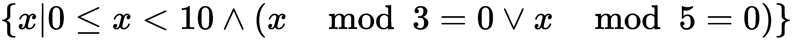

# 五、高阶函数

函数式编程范式的一个非常重要的特征是高阶函数。这些函数接受函数作为参数或返回函数作为结果。Python 提供了几种高阶函数。我们将研究它们和一些逻辑扩展。

如我们所见，有三种高阶函数，如下所示：

*   接受函数作为其一个（或多个）参数的函数
*   返回函数的函数
*   接受函数并返回函数的函数，这是前两个特性的组合

Python 提供了几种第一类的高阶函数。我们将在本章中介绍这些内置的高阶函数。在后面的章节中，我们将介绍一些提供高阶函数的库模块。

发出函数的函数的想法似乎有点奇怪。然而，当我们看一个`Callable`类时，类定义是一个在求值时返回`Callable`对象的函数。这是创建另一个函数的函数的一个示例。

接受函数和创建函数的函数包括复杂的可调用类以及函数装饰器。我们将在本章中介绍装饰师，但将对装饰师的深入考虑推迟到[第 11 章](11.html)、*装饰师设计技巧*。

有时，我们希望 Python 具有上一章中收集函数的高阶版本。在本章中，我们将展示`reduce(extract())`设计模式，以减少从较大元组中提取的特定字段。我们还将研究如何定义这些常见集合处理函数的我们自己的版本。

在本章中，我们将介绍以下功能：

*   `max()`和`min()`
*   `map()`
*   `filter()`
*   `iter()`
*   `sorted()`

我们还将研究 lambda 形式，它可以用来简化高阶函数。

`itertools`模块中有许多高阶函数。我们将在[第 8 章](08.html)、*Itertools 模块*和[第 9 章](09.html)、*更多 Itertools 技术*中了解此模块。

此外，`functools`模块还提供通用`reduce()`功能。我们将在[第 10 章](10.html)、*Functools 模块*中了解这一点，因为它不像本章中的其他高阶函数那样普遍适用。

`max()`和`min()`函数是归约；它们从集合中创建单个值。其他函数是映射。它们不会将输入减少为单个值。

The `max()`, `min()`, and `sorted()` functions have both a default behavior as well as a higher-order function behavior. A function can be provided via the `key=` argument. The `map()` and `filter()` functions take the function as the first positional argument.

# 使用 max（）和 min（）查找极值

`max()`和`min()`功能都有双重寿命。它们是应用于集合的简单函数。它们也是高阶函数。我们可以看到它们的默认行为如下所示：

```py
>>> max(1, 2, 3)
3
>>> max((1,2,3,4))
4  
```

这两个函数都将接受数量不定的参数。这些函数还设计为接受序列或 iterable 作为唯一参数，并定位该 iterable 的`max`（或`min`）。

他们还做一些更复杂的事情。假设我们从[第 4 章](04.html)*中的示例中获得了我们的行程数据，这些示例使用了集合*。我们有一个函数，它将生成一系列元组，如下所示：

```py
(
 ((37.54901619777347, -76.33029518659048), (37.840832, -76.273834), 17.7246), 
 ((37.840832, -76.273834), (38.331501, -76.459503), 30.7382), 
 ((38.331501, -76.459503), (38.845501, -76.537331), 31.0756), 
 ((36.843334, -76.298668), (37.549, -76.331169), 42.3962), 
 ((37.549, -76.331169), (38.330166, -76.458504), 47.2866), 
 ((38.330166, -76.458504), (38.976334, -76.473503), 38.8019)
)
```

此集合中的每个`tuple`都有三个值：起始位置、结束位置和距离。位置以纬度和经度对表示。东纬度为正，因此这些点位于美国东海岸以西约 76°处。各点之间的距离以海里为单位。

我们有三种方法可以从这个值序列中获得最大和最小距离。详情如下:

*   使用生成器函数提取距离。这将只给出距离，因为我们已经放弃了每条腿的其他两个属性。如果我们有任何额外的处理要求，这将不会很好地解决。
*   使用`unwrap(process(wrap()))`模式。这将为我们提供最长和最短距离的腿。从这些，我们可以提取距离项，如果需要的话。
*   使用`max()`和`min()`函数作为高阶函数，插入一个提取重要距离值的函数。

为了提供上下文，以下是构建整个行程的脚本：

```py
from ch02_ex3 import (
    float_from_pair, lat_lon_kml, limits, haversine, legs
)
path = float_from_pair(float_lat_lon(row_iter_kml(source)))
trip = tuple(
    (start, end, round(haversine(start, end), 4))
        for start, end in legs(iter(path)))
```

此脚本要求`source`是一个带有 KML 格式数据点的打开文件。基本的`trip`对象是单个腿的`tuple`。每条腿是一个三元组，包含起点、终点和距离，通过`haversine`函数计算得出。`leg`函数从原始 KML 文件中的所有`path`点创建起点-终点对。

一旦我们有了这个`trip`对象，我们就可以提取距离并计算这些距离的最大值和最小值。使用生成器函数执行此操作的代码如下所示：

```py
>>> long = max(dist for start, end, dist in trip)
>>> short = min(dist for start, end, dist in trip)  
```

我们使用了一个生成器函数从`trip`元组的每个分支提取相关项。我们必须重复生成器函数，因为每个生成器表达式只能使用一次。

以下是基于比之前显示的更大数据集的结果：

```py
>>> long
129.7748
>>> short
0.1731  
```

以下是带有`unwrap(process(wrap()))`模式的版本。为了说明这一点，该示例包括名为`wrap()`和`unwrap()`的函数。以下是功能和对这些功能的评估：

```py
from typing import Iterator, Iterable, Tuple, Any

Wrapped = Tuple[Any, Tuple]
def wrap(leg_iter: Iterable[Tuple]) -> Iterable[Wrapped]:
    return ((leg[2], leg) for leg in leg_iter)

def unwrap(dist_leg: Tuple[Any, Any]) -> Any:
    distance, leg = dist_leg
    return leg

long = unwrap(max(wrap(trip)))
short = unwrap(min(wrap(trip)))  
```

与上一版本不同，`max()`和`min()`函数将以最长和最短的距离定位`legs`的所有属性。我们不是简单地提取距离，而是将距离放在每个包装元组的第一位。然后，我们可以使用`min()`和`max()`函数的默认形式来处理包含距离和腿部细节的两个元组。处理后，我们可以剥离第一个元素，只留下`leg`细节。

结果如下：

```py
((27.154167, -80.195663), (29.195168, -81.002998), 129.7748)
((35.505665, -76.653664), (35.508335, -76.654999), 0.1731)
```

最后也是最重要的形式使用了`max()`和`min()`函数的高阶函数特性。我们将首先定义一个`helper`函数，然后通过执行以下代码段，使用它将支腿集合减少为所需的摘要：

```py
def by_dist(leg: Tuple[Any, Any, Any]) -> Any:
    lat, lon, dist = leg
    return dist

long = max(trip, key=by_dist)
short = min(trip, key=by_dist)  
```

`by_dist()`函数将每个`leg`元组中的三项分开，并返回距离项。我们将把它与`max()`和`min()`函数一起使用。

`max()`和`min()`函数都接受迭代和函数作为参数。所有 Python 的高阶函数都使用关键字参数`key=`来提供一个函数，该函数将用于提取必要的键值。

我们可以使用以下内容来帮助概念化`max()`函数如何使用`key`函数：

```py
from typing import Iterable, Any, Callable

def max_like(trip: Iterable[Any], key: Callable) -> Any:
    wrap = ((key(leg), leg) for leg in trip)
    return sorted(wrap)[-1][1]
```

`max()`和`min()`函数的行为就像给定`key()`函数的结果被用来将序列中的每个项包装成两个元组。对两个元组进行排序后，选择第一个元组（对于`min`）或最后一个元组（对于`max`）将提供一个具有极值的两个元组。可以对其进行分解以恢复原始值。

为了使`key()`功能是可选的，它可以有一个默认值`lambda x: x`。

# 使用 Python lambda 表单

在许多情况下，助手函数的定义似乎需要太多的代码。通常，我们可以将`key`函数分解为一个表达式。必须同时编写`def`和`return`语句来包装一个表达式似乎是浪费。

Python 提供 lambda 形式作为使用高阶函数简化的一种方式。lambda 表单允许我们定义一个小的匿名函数。函数体仅限于一个表达式。

下面是使用简单的`lambda`表达式作为键的示例：

```py
long = max(trip, key=lambda leg: leg[2])
short = min(trip, key=lambda leg: leg[2])  
```

我们使用的`lambda`将从序列中获得一项；在这种情况下，每个腿三元组将被赋予`lambda`。分配`lambda`参数变量`leg`，计算表达式`leg[2]`，从三元组中提取距离。

在 lambda 只使用一次的情况下，这种形式是理想的。在重用 lambda 时，避免复制和粘贴非常重要。替代方案是什么？

我们可以通过如下操作将 lambda 分配给变量：

```py
start = lambda x: x[0]
end = lambda x: x[1]
dist = lambda x: x[2]  
```

这些`lambda`表单中的每一个都是可调用的对象，类似于定义的函数。它们可以像函数一样使用。

以下是交互式提示下的示例：

```py
>>> leg = ((27.154167, -80.195663), (29.195168, -81.002998), 129.7748)
>>> start = lambda x: x[0]
>>> end = lambda x: x[1]
>>> dist = lambda x: x[2]
>>> dist(leg)
129.7748  
```

Python 为我们提供了两种为元组元素指定有意义名称的方法：namedtuples 和 lambda 集合。两者是等价的。我们可以使用 lambdas 而不是 namedtuples。

为了扩展这个例子，我们将看看如何获得起始点或结束点的`latitude`或`longitude`值。这是通过定义一些额外的 lambda 来实现的。

以下是互动会议的继续：

```py
>>> start(leg)
(27.154167, -80.195663)

>>> lat = lambda x: x[0]
>>> lon = lambda x: x[1]
>>> lat(start(leg))
27.154167  
```

使用 lambdas 作为提取字段的方法，没有明显的优势。提取字段的一组 lambda 对象需要比 namedtuple 更多的代码行来定义。另一方面，lambda 允许代码依赖于前缀函数表示法，这在函数编程上下文中可能更容易阅读。更重要的是，我们将在后面的`sorted()`示例中看到，`lambdas`可以比`namedtuple`属性名与`sorted()`、`min()`和`max()`一起更有效地使用。

# Lambdas 与 lambda 演算

在一本关于纯函数式编程语言的书中，有必要解释 lambda 演算，以及 Haskell Curry 发明的技术，我们称之为**Curry**。然而，Python 并没有严格遵循这种 lambda 演算。函数不是用来将它们简化为单参数 lambda 形式的。

Python lambda 形式不限于单参数函数。它们可以有任意数量的参数。但是，它们仅限于一个表达式。

我们可以使用`functools.partial`功能实现咖喱。我们将把这个保存到[第 10 章](10.html)、*Functools 模块*中。

# 使用 map（）函数将函数应用于集合

标量函数将值从域映射到范围。例如，当我们查看`math.sqrt()`函数时，我们正在查看从`float`值`x`到另一个`float`值`y = sqrt(x)`的映射，例如。域仅限于正值。映射可以通过计算或表格插值完成。

`map()`函数表达了类似的概念；它将一个集合中的值映射到另一个集合。它确保使用给定函数将每个单独的项从域集合映射到范围集合，这是将内置函数应用于数据集合的理想方式。

我们的第一个示例涉及解析一个文本块以获得数字序列。假设我们有以下文本块：

```py
>>> text= """\
...   2   3    5    7   11   13   17   19   23   29 
...  31  37   41   43   47   53   59   61   67   71 
...  73  79   83   89   97  101  103  107  109  113 
... 127 131  137  139  149  151  157  163  167  173 
... 179 181  191  193  197  199  211  223  227  229 
... """  
```

我们可以使用以下生成器函数重新构造此文本：

```py
>>> data= list(
...     v for line in text.splitlines() 
...         for v in line.split())
```

这将把文本分成几行。对于每一行，它都会将该行拆分为空格分隔的单词，并遍历每个结果字符串。结果如下：

```py
['2', '3', '5', '7', '11', '13', '17', '19', '23', '29', 
 '31', '37', '41', '43', '47', '53', '59', '61', '67', '71', 
 '73', '79', '83', '89', '97', '101', '103', '107', '109', '113', 
 '127', '131', '137', '139', '149', '151', '157', '163', '167', 
 '173', '179', '181', '191', '193', '197', '199', '211', '223', 
 '227', '229']
```

我们仍然需要对每个`string`值应用`int()`函数。这就是`map()`功能的优势所在。请看以下代码段：

```py
>>> list(map(int, data))
[2, 3, 5, 7, 11, 13, 17, 19, 23, 29, 31, 37, 41, 43, 47, 53, 59, 
 61, 67, 71, 73, 79, 83, 89, 97, 101, 103, 107, 109, 113, 127, 131, 
 137, 139, 149, 151, 157, 163, 167, 173, 179, 181, 191, 193, 197, 
 199, 211, 223, 227, 229]
```

`map()`函数将`int()`函数应用于集合中的每个值。结果是一个数字序列，而不是一个字符串序列。

`map()`函数的结果是可移植的。`map()`函数可以处理任何类型的 iterable。

这里的想法是，任何 Python 函数都可以使用`map()`函数应用于集合的项。在这个映射处理上下文中可以使用许多内置函数。

# 使用 lambda 表单和映射（）

假设我们想将我们的旅行距离从海里转换为法定英里。我们想把每条腿的距离乘以 6076.12/5280，也就是 1.150780。

我们可以使用`map()`函数进行如下计算：

```py
map(
    lambda x: (start(x), end(x), dist(x)*6076.12/5280),
    trip
)
```

我们已经定义了一个`lambda`，它将通过`map()`函数应用于行程中的每一条腿。`lambda`将使用其他`lambdas`来分离每条腿的起点、终点和距离值。它将计算修改后的距离，并从起始、结束和法定英里距离组装一个新的腿元组。

这与以下生成器表达式完全相同：

```py
((start(x), end(x), dist(x)*6076.12/5280) for x in trip)
```

我们对生成器表达式中的每个项都进行了相同的处理。

`map()`函数和生成器表达式之间的重要区别在于`map()`函数可以具有可重用的 lambda 或函数定义。更好的方法是执行以下操作：

```py
to_miles = lambda x: start(x), end(x), dist(x)*6076.12/5280
trip_m = map(to_miles, trip)
```

此变体将转换`to_miles`与将转换应用于数据的过程分开。

# 对多个序列使用 map（）

有时，我们会有两个需要彼此并行的数据集合。在[第 4 章](04.html)中，*使用集合*时，我们看到了`zip()`函数如何交错两个序列以创建一个对序列。在许多情况下，我们确实在尝试做以下事情：

```py
map(function, zip(one_iterable, another_iterable))  
```

我们正在从两个（或更多）并行的 ITerable 创建参数元组，并将一个函数应用于参数`tuple`。我们也可以这样看：

```py
(function(x,y) 
    for x,y in zip(one_iterable, another_iterable)
)
```

这里，我们用一个等价的生成器表达式替换了`map()`函数。

我们可以把整个事情概括为以下几点：

```py
def star_map(function, *iterables)
    return (function(*args) for args in zip(*iterables))
```

我们已经有了更好的方法。我们实际上并不需要这些技术。让我们看一个替代方法的具体示例。

在[第 4 章](04.html)*中，我们使用集合*查看了从 XML 文件中提取的作为一系列航路点的行程数据。我们需要从显示每条航段起点和终点的航路点列表中创建航段。

以下是一个简化版本，它将`zip()`函数应用于一种特殊类型的 iterable：

```py
>>> waypoints = range(4)
>>> zip(waypoints, waypoints[1:])
<zip object at 0x101a38c20>
>>> list(_)
[(0, 1), (1, 2), (2, 3)]  
```

我们已经从一个单一的平面列表中创建了一系列对。每对将有两个相邻的值。当较短的列表用尽时，`zip()`功能正确停止。此`zip( x, x[1:])`模式仅适用于物化序列和`range()`函数创建的 iterable。

我们创建了对，这样我们就可以对每一对应用`haversine()`函数来计算路径上两点之间的距离。以下是它在一系列步骤中的外观：

```py
from ch02_ex3 import (lat_lon_kml, float_from_pair, haversine)

path = tuple(float_from_pair(lat_lon_kml()))
distances_1 = map( 
    lambda s_e: (s_e[0], s_e[1], haversine(*s_e)), 
    zip(path, path[1:])
)
```

我们已将航路点的基本序列加载到`path`变量中。这是经纬度对的有序序列。当我们要使用`zip(path, path[1:])`设计模式时，我们必须有一个物化的序列，而不是一个简单的 iterable。

`zip()`函数的结果将是有开始和结束的对。我们希望我们的输出是开始、结束和距离的三倍。我们使用的`lambda`将分解原始的起始-结束二元组，并从起始、结束和距离创建一个新的三元组。

如前所述，我们可以通过使用`map()`函数的巧妙功能来简化此过程，如下所示：

```py
distances_2 = map(
    lambda s, e: (s, e, haversine(s, e)), 
    path, path[1:])
```

请注意，我们为`map()`函数提供了一个函数和两个 ITerable。`map()`函数将从每个 iterable 中选取下一项，并将这两个值作为参数应用于给定函数。在这种情况下，给定的函数是一个`lambda`，它从开始、结束和距离创建所需的三个元组。

`map()`函数的正式定义表明，它将使用不确定数量的 ITerable 进行**星图**处理。它将从每个 iterable 中获取项目，为给定函数创建参数值的元组。

# 使用 filter（）函数传递或拒绝数据

`filter()`函数的任务是对集合中的每个值使用并应用一个称为谓词的决策函数。`True`的判定表示该值已通过；否则，将拒绝该值。`itertools`模块包括`filterfalse()`作为该主题的变体。请参阅[第 8 章](08.html)、*Itertools 模块*，了解`itertools`模块`filterfalse()`功能的用法。

我们可以将其应用于我们的行程数据，以创建长度超过 50 海里的航段子集，如下所示：

```py
long= list(
     filter(lambda leg: dist(leg) >= 50, trip))
)  
```

谓词`lambda`将是`True`表示长腿，将被传递。短腿将被拒绝。输出为通过此距离测试的 14 条腿。

这种处理将过滤规则（`lambda leg: dist(leg) >= 50`与创建`trip`对象或分析长腿的任何其他处理清楚地分开。

有关另一个简单示例，请查看以下代码段：

```py
>>> filter(lambda x: x%3==0 or x%5==0, range(10))
<filter object at 0x101d5de50>
>>> sum(_)
23 
```

我们定义了一个简单的`lambda`来检查一个数字是三的倍数还是五的倍数。我们已经将该函数应用于一个 iterable，`range(10)`。结果是一个由决策规则传递的可匹配的数字序列。

`lambda`为`True`的数字为`[0, 3, 5, 6, 9]`，因此传递这些值。由于所有其他号码的`lambda`都是`False`，因此被拒绝。

这也可以通过执行以下代码使用生成器表达式来完成：

```py
>>> list(x for x in range(10) if x%3==0 or x%5==0)
[0, 3, 5, 6, 9]
```

我们可以使用以下集合理解符号将其形式化：



这表示我们正在构建一个*x*值的集合，使得*x*在`range(10)`和`x%3==0 or x%5==0`中。在`filter()`函数和形式数学集合理解之间有一种非常优雅的对称性。

我们通常希望将`filter()`函数与已定义的函数一起使用，而不是使用 lambda 形式。下面是重用前面定义的谓词的示例：

```py
>>> from ch01_ex1 import isprimeg
>>> list(filter(isprimeg, range(100)))
[2, 3, 5, 7, 11, 13, 17, 19, 23, 29, 31, 37, 41, 43, 47, 53, 59, 61, 67, 71, 73, 79, 83, 89, 97]  
```

在本例中，我们从另一个名为`isprimeg()`的模块导入了一个函数。然后，我们将此函数应用于一个值集合，以传递素数，并拒绝该集合中的任何非素数。

这是生成素数表的一种非常低效的方法。这件事表面上很简单，律师们称之为*吸引人的麻烦*。看起来可能很有趣，但它的伸缩性一点也不好。`isprimeg()`函数为每个新值复制所有测试工作。某种缓存对于重新进行素性测试是必不可少的。一个更好的算法是 Eratosthenes 的**筛**；此算法保留先前定位的素数，并使用它们来防止重新计算。

# 使用 filter（）识别异常值

在上一章中，我们定义了一些有用的统计函数来计算平均值和标准偏差，并对值进行归一化。我们可以使用这些函数来定位行程数据中的异常值。我们所能做的是将`mean()`和`stdev()`函数应用于行程每一段的距离值，以获得总体平均值和标准偏差。

然后，我们可以使用`z()`函数计算每条腿的标准化值。如果归一化值大于 3，则数据与平均值相差甚远。如果我们拒绝这些异常值，我们就有了更统一的数据集，不太可能存在报告或测量错误。

以下是我们如何解决这一问题：

```py
from stats import mean, stdev, z

dist_data = list(map(dist, trip))
μ_d = mean(dist_data)
σ_d = stdev(dist_data)
outlier = lambda leg: z(dist(leg), μ_d, σ_d) > 3
print("Outliers", list(filter(outlier, trip)))

```

我们已经将距离函数映射到`trip`集合中的每个`leg`。因为我们要对结果做几件事，所以我们必须具体化一个`list`对象。我们不能依赖迭代器，因为第一个函数将使用它。然后，我们可以使用此提取来计算人口统计学`μ_d`和`σ_d`的平均值和标准偏差。

根据统计数据，我们使用异常值 lambda 来`filter`我们的数据。如果标准化值太大，则数据为异常值。

`list(filter(outlier, trip))`的结果是两条腿的列表，与人群中的其他腿相比，这两条腿相当长。平均距离约为 34 nm，标准偏差为 24 nm。任何跳闸的标准化距离不得小于-1.407。

We're able to decompose a fairly complex problem into a number of independent functions, each one of which can be easily tested in isolation. Our processing is a composition of simpler functions. This can lead to succinct, expressive functional programming.

# 具有 sentinel 值的 iter（）函数

内置的`iter()`函数在其中一个集合类的对象上创建迭代器。`list`、`dict`和`set`类都使用`iter()`函数为基础集合中的项目提供`iterator`对象。在大多数情况下，我们将允许`for`语句隐式执行此操作。然而，在少数情况下，我们需要显式地创建迭代器。其中一个例子是将集合的头部和尾部分开。

其他用途包括构建迭代器来使用可调用对象（例如，函数）创建的值，直到找到 sentinel 值为止。此功能有时与文件的`read()`功能一起使用，以消耗项目，直到找到某个行尾或文件尾哨兵值。类似于`iter(file.read, '\n')`的表达式将对给定函数求值，直到找到前哨值`'\n'`。必须小心使用：如果找不到 sentinel，它可以永远继续读取零长度字符串。

向`iter()`提供`callable`函数可能有点困难，因为我们提供的函数必须在内部保持某种状态。这在函数式程序中通常被视为不可取的。然而，隐藏状态是打开文件的一个特征，例如，每个`read()`或`readline()`函数将内部状态推进到下一个字符或下一行。

显式迭代的另一个例子是可变集合对象的`pop()`方法对集合对象进行有状态更改的方式。以下是使用`pop()`方法的示例：

```py
>>> tail = iter([1, 2, 3, None, 4, 5, 6].pop, None)
>>> list(tail)
[6, 5, 4]
```

`tail`变量被设置为`pop()`函数将遍历的列表`[1, 2, 3, None, 4, 5, 6]`上的迭代器。`pop()`的默认行为为`pop(-1)`，即元素按相反顺序弹出。这会对列表对象进行有状态更改：每次调用`pop()`时，该项都会被删除，从而改变列表。当找到`sentinel`值时，`iterator`停止返回值。如果找不到哨兵，将以`IndexError`异常中断。

这种内部状态管理是我们想要避免的。因此，我们不会试图设计此功能的用途。

# 使用 sorted（）按顺序排列数据

当我们需要按定义的顺序生成结果时，Python 给了我们两个选择。我们可以创建一个`list`对象，并使用`list.sort()`方法将项目放入订单中。另一种方法是使用`sorted()`功能。此函数适用于任何 iterable，但它会创建一个最终的`list`对象作为排序操作的一部分。

`sorted()`功能有两种使用方式。它可以简单地应用于集合。它也可以用作使用`key=`参数的高阶函数。

假设我们有来自[第 4 章](04.html)、*与集合*中示例的行程数据。我们有一个函数，它将为`trip`的每个`leg`生成一个元组序列，其中包含开始、结束和距离。数据如下：

```py
(
 ((37.54901619777347, -76.33029518659048), (37.840832, -76.273834), 17.7246), 
 ((37.840832, -76.273834), (38.331501, -76.459503), 30.7382), 
 ((38.331501, -76.459503), (38.845501, -76.537331), 31.0756), 
 ((36.843334, -76.298668), (37.549, -76.331169), 42.3962), 
 ((37.549, -76.331169), (38.330166, -76.458504), 47.2866), 
 ((38.330166, -76.458504), (38.976334, -76.473503), 38.8019)
)  
```

通过以下交互，我们可以看到`sorted()`函数的默认行为：

```py
>>> sorted(dist(x) for x in trip)
[0.1731, 0.1898, 1.4235, 4.3155, ... 86.2095, 115.1751, 129.7748]  
```

我们使用生成器表达式（`dist(x) for x in trip`）从行程数据中提取距离。然后，我们对这组数字进行排序，得到 0.17 nm 到 129.77 nm 的距离。

如果我们想将腿和距离保持在原来的三个元组中，我们可以让`sorted()`函数应用`key()`函数来确定如何对元组进行排序，如下面的代码片段所示：

```py
>>> sorted(trip, key=dist)
[
 ((35.505665, -76.653664), (35.508335, -76.654999), 0.1731), 
 ((35.028175, -76.682495), (35.031334, -76.682663), 0.1898), 
 ((27.154167, -80.195663), (29.195168, -81.002998), 129.7748)
]  
```

我们已经对行程数据进行了排序，使用`distlambda`从每个元组中提取距离。`dist`功能简单如下：

```py
dist = lambda leg: leg[2]  
```

这显示了使用 simple`lambda`将复杂元组分解为其组成元素的能力。

# 编写高阶函数

我们可以识别三种高阶函数；详情如下:

*   接受函数作为其参数之一的函数。
*   返回函数的函数。`Callable`类就是一个常见的例子。返回生成器表达式的函数可以视为高阶函数。
*   接受并返回函数的函数。`functools.partial()`函数就是一个常见的例子。我们将把这个保存到[第 10 章](10.html)、*Functools 模块*中。装饰师是不同的；我们将把这个保存在[第 11 章](11.html)中*装饰设计*技术。

我们将使用高阶函数来扩展这些简单模式，以转换数据的结构。我们可以进行几种常见的转换，例如：

*   包裹对象以创建更复杂的对象
*   将复杂对象展开为其组件
*   压平建筑物
*   构造平坦序列

`Callable`类对象是返回`callable`对象的函数的常用示例。我们将把它看作是一种编写灵活函数的方法，配置参数可以注入到这些函数中。

在本章中，我们还将介绍简单的装饰器。我们将推迟到[第 11 章](11.html)、*装饰设计技巧*对装饰师进行更深入的思考。

# 编写高阶映射和过滤器

Python 的两个内置高阶函数`map()`和`filter()`通常可以处理我们可能想要处理的几乎所有事情。很难用一种通用的方法对它们进行优化以获得更高的性能。我们将在[第 8 章](08.html)*Itertools 模块*中介绍 Python 3.4 的函数，如`imap()`、`ifilter()`和`ifilterfalse()`。

我们有三种基本相同的方法来表示映射。假设我们有一些函数`f(x)`和一些对象集合`C`。我们有三种完全等效的方法来表示映射；详情如下:

*   `map()`功能：

```py
map(f, C) 
```

*   生成器表达式：

```py
(f(x) for x in C) 
```

*   带有`yield`语句的生成器函数：

```py
def mymap(f, C): 
    for x in C: 
        yield f(x) 
mymap(f, C) 
```

类似地，我们有三种方法将`filter`函数应用于`collection`，所有这些方法都是等效的：

*   `filter()`功能：

```py
filter(f, C) 
```

*   生成器表达式：

```py
(x for x in C if f(x)) 
```

*   带有`yield`语句的生成器函数：

```py
def myfilter(f, C): 
    for x in C: 
        if f(x): 
            yield x 
myfilter(f, C) 
```

存在一些性能差异；通常，`map()`和`filter()`功能最快。更重要的是，有不同类型的扩展适合这些映射和过滤设计，如下所示：

*   我们可以创建一个更复杂的函数`g(x)`，应用于每个元素，也可以在处理之前将函数应用于整个集合。这是最通用的方法，适用于所有三种设计。这是我们大部分功能设计精力投入的地方。
*   我们可以在生成器表达式或生成器函数中调整`for`循环。一个明显的调整是通过使用一个`if`子句扩展生成器表达式，将映射和过滤结合到一个操作中。我们还可以合并`mymap()`和`myfilter()`函数，将映射和过滤结合起来。

随着软件的发展和成熟，改变循环处理的数据结构的深刻变化经常发生。我们有许多设计模式，包括包装、展开（或提取）、展平和结构化。在前面的章节中，我们已经介绍了其中的一些技术。

在设计将太多转换组合到单个函数中的映射时，我们需要谨慎。我们希望尽可能避免创建无法简洁或表达单个想法的函数。由于 Python 没有优化编译器，我们可能被迫通过组合函数手动优化速度较慢的应用程序。只有在分析了一个性能不佳的程序之后，我们才需要不情愿地进行这种优化。

# 映射时展开数据

当我们使用一个构造时，例如`(f(x) for x, y in C)`，我们在`for`语句中使用多个赋值来展开一个多值元组，然后应用一个函数。整个表达式是一个映射。这是一个常见的 Python 优化，用于更改结构和应用函数。

我们将使用[第 4 章](04.html)*中的行程数据，与*集合一起工作。以下是映射时展开的具体示例：

```py
from typing import Callable, Iterable, Tuple, Iterator, Any

Conv_F = Callable[[float], float]
Leg = Tuple[Any, Any, float]

def convert(
        conversion: Conv_F, 
        trip: Iterable[Leg]) -> Iterator[float]:
    return (
        conversion(distance) for start, end, distance in trip
    )
```

该高阶函数将由我们可以应用于原始数据的转换函数支持，如下所示：

```py
to_miles = lambda nm: nm*5280/6076.12
to_km = lambda nm: nm*1.852
to_nm = lambda nm: nm  
```

然后使用此函数提取距离并应用转换函数，如下所示：

```py
convert(to_miles, trip)  
```

当我们展开时，结果将是一系列的`floating-point`值。结果如下：

```py
[20.397120559090908, 35.37291511060606, ..., 44.652462240151515]  
```

由于`for`循环分解了这三个元组，因此该`convert()`函数非常特定于我们的起始-结束距离行程数据结构。

在映射设计模式时，我们可以为这种展开构建更通用的解决方案。它有点复杂。首先，我们需要通用的分解函数，如以下代码片段所示：

```py
fst = lambda x: x[0]
snd = lambda x: x[1]
sel2 = lambda x: x[2]  
```

我们希望能够表达`f(sel2(s_e_d)) for s_e_d in trip`。这涉及到功能组成；我们正在组合一个函数，比如`to_miles()`和一个选择器，比如`sel2()`。我们可以使用另一个 lambda 用 Python 表示函数组合，如下所示：

```py
to_miles = lambda s_e_d: to_miles(sel2(s_e_d))
```

这为我们提供了更长但更通用的展开版本，如下所示：

```py
(to_miles(s_e_d) for s_e_d in trip)
```

虽然第二个版本更一般，但它似乎没有太大的帮助。

关于高阶`convert()`函数，需要注意的是，我们接受一个函数作为参数，并返回一个生成函数作为结果。`convert()`功能不是发电机功能；它什么都没有。`convert()`函数的结果是一个生成器表达式，必须对其求值以累加各个值。我们用`Iterator[float]`来强调结果是迭代器；Python 生成器函数的子类。

同样的设计原则也适用于创建混合过滤器，而不是映射。我们将在返回的生成器表达式的`if`子句中应用过滤器。

我们可以结合映射和过滤来创建更复杂的函数。虽然创建更复杂的函数很有吸引力，但它并不总是有价值的。复杂函数的性能可能比不上嵌套使用简单的`map()`和`filter()`函数。通常，我们只想创建一个更复杂的函数，如果它封装了一个概念，并且使软件更容易理解。

# 映射时包装其他数据

当我们使用像`((f(x), x) for x in C)`这样的构造时，我们使用了包装来创建多值元组，同时也应用了映射。这是一种常见的技术，用于保存派生结果以创建构造，该构造具有避免重新计算的优点，而不需要复杂的状态更改对象。

这是[第 4 章](04.html)*中所示示例的一部分，使用集合*从点的路径创建行程数据。代码如下所示：

```py
from ch02_ex3 import (
    float_from_pair, lat_lon_kml, limits, haversine, legs
)

path = float_from_pair(float_lat_lon(row_iter_kml(source)))
trip = tuple(
     (start, end, round(haversine(start, end), 4))
     for start, end in legs(iter(path))
)
```

我们可以稍微修改一下，创建一个高阶函数，将`wrapping`与其他函数分开。我们可以如下定义一个函数：

```py
from typing import Callable, Iterable, Tuple, Iterator

Point = Tuple[float, float]
Leg_Raw = Tuple[Point, Point]
Point_Func = Callable[[Point, Point], float]
Leg_D = Tuple[Point, Point, float]

def cons_distance(
        distance: Point_Func,
        legs_iter: Iterable[Leg_Raw]) -> Iterator[Leg_D]:
    return (
        (start, end, round(distance(start,end), 4))
        for start,end in legs_iter
    )
```

此函数将每个支腿分解为两个变量，`start`和`end`。这些变量将是`Point`实例，定义为两个浮点值的元组。这些将与给定的`distance()`函数一起用于计算点之间的距离。该函数是一个可调用函数，它接受两个`Point`对象并返回`float`结果。结果将构建一个三元组，其中包括原始的两个`Point`对象和计算的`float`结果。

然后，我们可以重写行程分配，以应用`haversine()`函数计算距离，如下所示：

```py
path = float_from_pair(float_lat_lon(row_iter_kml(source)))
trip2 = tuple(cons_distance(haversine, legs(iter(path))))  
```

我们用高阶函数`cons_distance()`替换了生成器表达式。函数不仅接受函数作为参数，还返回生成器表达式。

下面是一个稍微不同的公式：

```py
from typing import Callable, Iterable, Tuple, Iterator, Any
Point = Tuple[float, float]
Leg_Raw = Tuple[Point, Point]
Point_Func = Callable[[Point, Point], float]
Leg_P_D = Tuple[Leg_Raw, ...]

def cons_distance3(
        distance: Point_Func,
        legs_iter: Iterable[Leg_Raw]) -> Iterator[Leg_P_D]:
    return (
        leg + (round(distance(*leg), 4),)  # 1-tuple
        for leg in legs_iter
    )
```

此版本使从旧对象构建的新对象的构造更加清晰。生成的迭代器使用 trip 的分支，定义为`Leg_Raw`，一个由两点组成的元组。它计算沿着腿的距离，以与原始`Leg_Raw`对象和连接到该对象的距离构建结果三元组。

由于这两个`cons_distance()`函数都接受函数作为参数，因此我们可以使用此功能提供另一种距离公式。例如，我们可以使用`math.hypot(lat(start)-lat(end), lon(start)-lon(end))`方法计算沿`leg`方向的不太正确的平面距离。

在[第 10 章](10.html)*Functools 模块*中，我们将展示如何使用`partial()`函数为`haversine()`函数的`R`参数设置一个值，从而改变计算距离的单位。

# 映射时展平数据

在[第 4 章](04.html)、*处理集合*时，我们研究了将元组结构的嵌套元组展平为单个 iterable 的算法。我们当时的目标只是重组一些数据，而不进行任何实际处理。我们可以创建混合解决方案，将函数与展平操作相结合。

让我们假设我们有一个文本块，我们想转换成一个简单的数字序列。案文如下：

```py
>>> text= """\
...   2   3    5    7   11   13   17   19   23   29 
...  31  37   41   43   47   53   59   61   67   71 
...  73  79   83   89   97  101  103  107  109  113 
... 127 131  137  139  149  151  157  163  167  173 
... 179 181  191  193  197  199  211  223  227  229 
... """  
```

每行由 10 个数字组成。我们需要解锁这些行以创建一个简单的数字序列。

这是通过两部分发电机功能完成的，如下所示：

```py
data = list(
    v 
    for line in text.splitlines() 
    for v in line.split()
)
```

这将把文本分成几行，并在每一行中迭代。它将把每一行拆分成单词，并遍历每个单词。这是一个字符串列表，如下所示：

```py
['2', '3', '5', '7', '11', '13', '17', '19', '23', '29', '31', '37', 
 '41', '43', '47', '53', '59', '61', '67', '71', '73', '79', '83', 
 '89', '97', '101', '103', '107', '109', '113', '127', '131', '137', 
 '139', '149', '151', '157', '163', '167', '173', '179', '181', '191', 
 '193', '197', '199', '211', '223', '227', '229']
```

要将字符串转换为数字，我们必须应用一个转换函数，并使用以下代码段从其原始格式中展开阻止的结构：

```py
from numbers import Number
from typing import Callable, Iterator

Num_Conv = Callable[[str], Number]

def numbers_from_rows(
        conversion: Num_Conv, text: str) -> Iterator[Number]:
    return (
        conversion(value)
        for line in text.splitlines()
        for value in line.split()
    )
```

此函数有一个`conversion`参数，该参数是应用于将发出的每个值的函数。这些值是使用前面显示的算法通过展平创建的。

我们可以在以下表达式中使用此`numbers_from_rows()`函数：

```py
print(list(numbers_from_rows(float, text)))
```

在这里，我们使用内置的`float()`从文本块创建`floating-point`值列表。

我们有许多选择使用高阶函数和生成器表达式的混合。例如，我们可以表示如下：

```py
map(float, 
    value 
    for line in text.splitlines() 
     for value in line.split()
)
```

这可能有助于我们理解算法的整体结构。其原理称为**分块**；具有有意义名称的函数的细节可以抽象，我们可以在新的上下文中使用该函数。虽然我们经常使用高阶函数，但有时生成器表达式会更清晰。

# 过滤时结构化数据

前三个示例将附加处理与映射相结合。将处理与过滤相结合似乎不像与映射相结合那样富有表现力。我们将详细地看一个示例，以表明尽管它很有用，但它似乎没有像结合映射和处理那样具有令人信服的用例。

在[第 4 章](04.html)*中，我们研究了集合*的结构化算法。我们可以很容易地将滤波器和结构化算法组合成一个单一的复杂函数。下面是我们的首选函数的一个版本，用于将 iterable 的输出分组：

```py
from typing import Iterator, Tuple

def group_by_iter(n: int, items: Iterator) -> Iterator[Tuple]:
    row = tuple(next(items) for i in range(n))
    while row:
        yield row
        row = tuple(next(items) for i in range(n))
```

这将尝试组装从 iterable 对象中获取的`n`项的元组。如果元组中有任何项，它们将作为结果 iterable 的一部分生成。原则上，该函数然后对原始 iterable 中的剩余项进行递归操作。由于递归在 Python 中效率相对较低，我们将其优化为显式的`while`循环。

我们可以按如下方式使用此功能：

```py
group_by_iter(7, 
    filter(lambda x: x%3==0 or x%5==0, range(100))
)  
```

这将把`filter()`函数应用于`range()`函数创建的 iterable 的结果分组。

我们可以将分组和过滤合并到一个函数中，该函数在一个函数体中执行这两个操作。对`group_by_iter()`的修改如下：

```py
def group_filter_iter(
        n: int, pred: Callable, items: Iterator) -> Iterator:
    subset = filter(pred, items)
    row = tuple(next(subset) for i in range(n))
    while row:
        yield row
        row = tuple(next(subset) for i in range(n))
```

此函数将筛选器谓词函数应用于作为`items`参数提供的源 iterable。由于滤波器输出本身是一个非严格 iterable，`subset`值不是预先计算的；根据需要创建这些值。此函数的大部分与前面显示的版本相同。

我们可以将使用此函数的上下文稍微简化如下：

```py
group_filter_iter(
    7, 
    lambda x: x%3==0 or x%5==0, 
    range(1,100)
)  
```

在这里，我们应用了过滤器谓词，并将结果分组到单个函数调用中。在`filter()`函数的情况下，将过滤器与其他处理结合使用很少有明显的优势。似乎一个单独的、可见的`filter()`函数比组合函数更有用。

# 写入生成器函数

许多函数可以简洁地表示为生成器表达式。事实上，我们已经看到，几乎任何类型的映射或过滤都可以作为生成器表达式来完成。也可以使用内置的高阶函数（如`map()`或`filter()`），或作为生成器函数来完成。在考虑多语句生成器函数时，我们需要谨慎，不要偏离函数编程的指导原则：无状态函数求值。

使用 Python 进行函数式编程意味着在纯函数式编程和命令式编程之间徘徊。我们需要确定并隔离我们必须求助于命令式 Python 代码的地方，因为没有一个纯粹的功能替代方案可用。

当我们需要 Python 的语句特性时，我们有义务编写生成器函数。生成器表达式中没有以下功能：

*   与外部资源合作的`with`环境。我们将在[第 6 章](06.html)、*递归和归约*中了解这一点，我们将在这里讨论文件解析。
*   `while`语句比`for`语句更灵活地进行迭代。这方面的一个例子已在之前的映射部分的*展平数据中显示。*
*   用于实现提前终止循环的搜索的`break`或`return`语句。
*   处理异常的`try-except`构造。
*   内部函数定义。我们已经在[第一章](01.html)、*理解函数式编程*和[第二章](02.html)、*介绍基本函数概念*的几个例子中看到了这一点。我们还将在[第 6 章](06.html)*递归和归约*中重新讨论它。
*   一个非常复杂的序列。试图通过`if-else`条件表达式表达多个备选方案可能会变得复杂。
*   在信封的边缘，我们有较少使用的 Python 特性，如`for-else`、`while-else`、`try-else`和`try-else-finally`。这些都是在生成器表达式中不可用的语句级功能。

`break`语句最常用于提前结束集合的处理。我们可以在满足某些条件的第一项之后结束处理。这是一个版本的`any()`函数，用于查找具有给定属性的值的存在性。我们也可以在处理大量项目后结束，但不是全部项目。

查找单个值可以简洁地表示为`min(some-big-expression)`或`max(something big)`。在这些情况下，我们致力于检查所有值，以确保我们正确地找到了最小值或最大值。

在少数情况下，我们可以使用一个`first(function, collection)`函数，其中第一个值`True`就足够了。我们希望处理尽早终止，以避免不必要的计算。

我们可以如下定义一个函数：

```py
def first(predicate: Callable, collection: Iterable) -> Any:
    for x in collection:
        if predicate(x): return x
```

我们已经迭代了`collection`，应用了给定的`predicate`函数。如果谓词结果为`True`，则函数返回关联值并停止处理 iterable。如果我们耗尽`collection`，将返回`None`的默认值。

我们也可以从`PyPi`下载此版本。第一个模块包含了这个想法的变体。欲了解更多详情，请访问[https://pypi.python.org/pypi/first](https://pypi.python.org/pypi/first) 。

当试图确定一个数字是否为素数时，它可以充当助手。以下是一个测试数字是否为素数的函数：

```py
import math
def isprimeh(x: int) -> bool:
    if x == 2: return True
    if x % 2 == 0: return False
    factor= first( 
        lambda n: x%n==0,
        range(3, int(math.sqrt(x)+.5)+1, 2))
    return factor is None
```

此函数处理一些关于数字`2`为素数且每隔偶数为复合数的边缘情况。然后，它使用前面定义的`first()`函数来定位给定集合中的第一个因子。

当`first()`函数返回因子时，实际数字无关紧要。对于这个特殊的例子来说，它的存在才是最重要的。因此，如果没有找到因子，`isprimeh()`函数返回`True`。

我们可以做一些类似的事情来处理数据异常。以下是`map()`功能的一个版本，该功能还可以过滤坏数据：

```py
def map_not_none(func: Callable, source: Iterable) -> Iterator:
    for x in source:
        try:
            yield func(x)
        except Exception as e:
            pass  # For help debugging, use print(e)
```

此函数逐步遍历 iterable 中的项目，将每个项目分配给`x`变量。它尝试将该函数应用于该项；如果未引发异常，则生成结果值。如果引发异常，则会自动删除有问题的源项。

这在处理包含不适用或缺少的值的数据时非常方便。我们尝试处理这些值并删除无效的值，而不是设计复杂的过滤器来排除这些值。

我们可以使用`map()`函数映射 not-`None`值，如下所示：

```py
data = map_not_none(int, some_source)  
```

我们将对`some_source`中的每个值应用`int()`函数。当`some_source`参数是字符串的一个 iterable 集合时，这可能是拒绝不表示数字的`strings`的一种简便方法。

# 使用可调用项构建高阶函数

我们可以将高阶函数定义为可调用类。这建立在编写生成器函数的思想之上；我们将编写可调用函数，因为我们需要 Python 的语句特性。除了使用语句，我们还可以在创建高阶函数时应用静态配置。

关于可调用类定义，重要的是由`class`语句创建的类对象定义了一个发出函数的函数。通常，我们将使用一个可调用对象来创建一个复合函数，该复合函数将另外两个函数组合成相对复杂的函数。

要强调这一点，请考虑以下类别：

```py
from typing import Callable, Optional, Any

class NullAware:
    def __init__(
            self, some_func: Callable[[Any], Any]) -> None:
        self.some_func = some_func
    def __call__(self, arg: Optional[Any]) -> Optional[Any]:
        return None if arg is None else self.some_func(arg)
```

此类用于创建一个新的 nullaware 函数。创建此类的实例时，会提供一个函数`some_func`。唯一的限制是`some_func`为`Callable[[Any], Any]`。这意味着该参数接受单个参数并产生单个结果。结果对象是可调用的。应为单个可选参数。`__call__()`方法的实现处理`None`对象作为参数的使用。此方法具有生成结果对象`Callable[[Optional[Any]], Optional[Any]]`的效果。

例如，计算`NullAware(math.log)`表达式将创建一个新函数，该函数可应用于参数值。`__init__()`方法将把给定函数保存在结果对象中。这个对象是一个可以用来处理数据的函数。

常用的方法是创建新函数，并通过为其指定名称将其保存以备将来使用，如下所示：

```py
null_log_scale = NullAware(math.log)  
```

这将创建一个新函数并指定名称`null_log_scale()`。然后，我们可以在另一个上下文中使用该函数。请看以下示例：

```py
>>> some_data = [10, 100, None, 50, 60]
>>> scaled = map(null_log_scale, some_data)
>>> list(scaled)
[2.302585092994046, 4.605170185988092, None, 3.912023005428146,  4.0943445622221]
```

一种不太常见的方法是在一个表达式中创建并使用发出的函数，如下所示：

```py
>>> scaled = map(NullAware(math.log), some_data)
>>> list(scaled)
[2.302585092994046, 4.605170185988092, None, 3.912023005428146,  4.0943445622221]
```

`NullAware( math.log )`的评估创建了一个函数。然后，`map()`函数使用这个匿名函数来处理一个 iterable，`some_data`。

本例的`__call__()`方法完全依赖于表达式求值。这是一种优雅而整洁的方式来定义由低级组件函数构建的复合函数。在使用`scalar`功能时，有一些复杂的设计考虑。当我们使用 iterable 集合时，我们必须更加小心。

# 确保良好的功能设计

在使用 Python 对象时，无状态函数式编程的思想需要谨慎。对象通常是有状态的。事实上，可以说面向对象编程的全部目的是将状态更改封装到类定义中。因此，在使用 Python 类定义处理集合时，我们发现自己在函数式编程和命令式编程之间处于相反的方向。

使用可调用对象创建复合函数的好处是，在使用生成的复合函数时，语法稍微简单一些。当我们开始使用 iterable 映射或约简时，我们必须知道如何以及为什么引入有状态对象。

我们将返回前面显示的`sum_filter_f()`复合函数。以下是根据可调用类定义构建的版本：

```py
from typing import Callable, Iterable

class Sum_Filter:
    __slots__ = ["filter", "function"]
    def __init__(self,
            filter: Callable[[Any], bool],
            func: Callable[[Any], float]) -> None:
        self.filter = filter
        self.function = func
    def __call__(self, iterable: Iterable) -> float:
        return sum(
            self.function(x) 
            for x in iterable 
                if self.filter(x)
        )
```

这个类在每个对象中正好有两个槽；这就限制了我们将函数用作有状态对象的能力。它不会阻止对结果对象的所有修改，但它将我们限制为仅两个属性。尝试添加属性会导致异常。

初始化方法`__init__()`将两个函数名`filter`和`func`存放在对象的实例变量中。`__call__()`方法返回一个基于使用两个内部函数定义的生成器表达式的值。`self.filter()`功能用于传递或拒绝项目。`self.function()`函数用于变换`filter()`函数传递的对象。

此类的一个实例是一个内置了两个策略函数的函数。我们创建一个实例，如下所示：

```py
count_not_none = Sum_Filter(
     lambda x: x is not None, 
     lambda x: 1)
```

我们已经构建了一个名为`count_not_none()`的函数，它对序列中的`non-None`值进行计数。它通过使用`lambda`传递`non-None`值和使用常量 1 而不是当前实际值的函数来实现。

通常，这个`count_not_none()`对象的行为将与任何其他 Python 函数类似。这个用法比我们前面的例子`sum_filter_f()`要简单一些。

我们可以使用`count_not_None()`功能，如下所示：

```py
N = count_not_none(data)
```

我们将这样做，而不是使用`sum_filter_f()`函数：

```py
N = sum_filter_f(valid, count_, data)  
```

`count_not_none()`函数基于可调用函数，不像常规函数那样需要太多参数。这使得它表面上更易于使用。但是，它也会使它变得更加模糊，因为函数如何工作的细节在源代码中有两个位置：函数作为可调用类的实例创建的位置和函数的使用位置。

# 一些设计模式的回顾

`max()`、`min()`和`sorted()`函数具有默认行为，没有`key=`函数。它们可以通过提供一个函数来定制，该函数定义如何从可用数据计算密钥。对于我们的许多示例，`key()`函数是对可用数据的简单提取。这不是一个要求；`key()`功能可以做任何事情。

想象以下方法：`max(trip, key=random.randint())`。一般来说，我们尽量不让`key()`函数做这样模糊的事情。

使用`key=`功能是一种常见的设计模式。我们设计的函数可以很容易地遵循这种模式。

我们还研究了 lambda 形式，它可以用来简化高阶函数。使用 lambda 表单的一个重要优点是它非常符合函数范式。在编写更常规的函数时，我们可以创建命令式程序，这些程序可能会使原本简洁且富有表现力的函数设计变得混乱。

我们已经研究了几种与值集合一起工作的高阶函数。在前几章中，我们已经为应用于集合对象和标量对象的高阶函数暗示了几种不同的设计模式。以下是一个广泛的分类：

*   **返回生成器**：高阶函数可以返回生成器表达式。我们考虑函数的高阶，因为它没有返回标量值或值集合。其中一些高阶函数也接受函数作为参数。
*   **充当生成器**：一些函数示例使用`yield`语句使其成为一流的生成器函数。生成器函数的值是一组可延迟计算的值。我们认为生成器函数本质上与返回生成器表达式的函数无法区分。两者都不严格。两者都可以产生一系列值。由于这个原因，我们还将考虑发电机函数作为高阶。内置功能，如`map()`和`filter()`属于这一类。
*   **物化采集**：有些函数必须返回物化采集对象：`list`、`tuple`、`set`或`mapping`。如果这些函数有一个函数作为参数的一部分，那么它们的阶数可以更高。否则，它们是与集合一起工作的普通函数。
*   **减少集合**：一些函数使用 iterable（或某种集合的对象）并创建标量结果。`len()`和`sum()`函数就是这样的例子。当我们接受函数作为参数时，我们可以创建高阶归约。我们将在下一章中回到这一点。
*   **标量**：一些函数作用于单个数据项。如果它们接受另一个函数作为参数，则可以是高阶函数。

当我们设计自己的软件时，我们可以在这些已建立的设计模式中进行选择。

# 总结

在本章中，我们看到了两个高阶函数的归约：`max()`和`min()`。我们还研究了两个中心高阶函数，`map()`和`filter()`。我们还研究了`sorted()`。

我们还研究了如何使用高阶函数来转换数据结构。我们可以执行几种常见的转换，包括包装、展开、展平和不同类型的结构序列。

我们研究了三种定义高阶函数的方法，如下所示：

*   `def`声明。类似于我们分配给变量的`lambda`形式。
*   将可调用类定义为一种发出复合函数的函数。
*   我们还可以使用装饰器来发出复合函数。我们将在[第 11 章](11.html)*装饰设计技巧*中回到这一点。

在下一章中，我们将介绍通过递归进行纯函数迭代的思想。我们将使用 Pythonic 结构对纯功能技术进行一些常见的改进。我们还将研究执行从集合到单个值的缩减的相关问题。