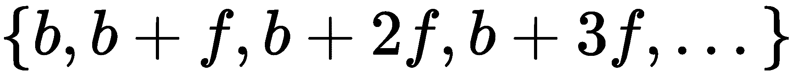
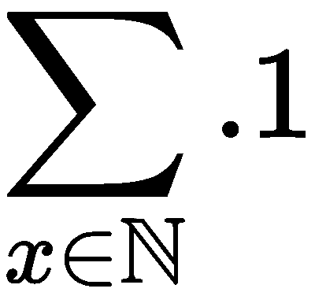
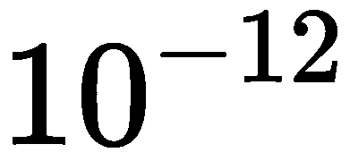
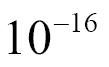

# 八、`itertools`模块

函数式编程强调无状态对象。在 Python 中，这导致我们使用生成器表达式、生成器函数和 iterables，而不是大型、可变的集合对象。在本章中，我们将了解`itertools`库的元素。这个库有许多函数，可以帮助我们处理可编辑的对象序列以及集合对象。

我们在[第 3 章](03.html)中介绍了迭代器函数、*函数、迭代器和生成器*。在本章中，我们将进一步介绍这一肤浅的介绍。我们在[第 5 章](05.html)、*高阶函数*中使用了一些相关函数。

These functions behave as if they are proper, lazy, Python iterables. Some of them create intermediate objects, however; this leads to them consuming a large amount of memory. Since implementations may change with Python releases, we can't provide function-by-function advice here. If you have performance or memory issues, ensure that you check the implementation.

*"Use the source, Luke"* is common advice.

`itertools`模块中有大量迭代器函数。我们将在下一章中研究一些函数。在本章中，我们将研究三大类迭代器函数。详情如下:

*   使用无限迭代器的函数。这些可以应用于任何 iterable 或任何集合上的迭代器。例如，`enumerate()`函数不需要 iterable 中项目的上限。
*   使用有限迭代器的函数。这些可以多次累积一个震源，也可以减少震源。例如，对迭代器生成的项进行分组需要一个上限。
*   `tee`迭代器函数将迭代器克隆为多个副本，每个副本都可以独立使用。这提供了一种克服 Python 迭代器主要限制的方法：它们只能使用一次。

我们需要强调我们在其他地方提到的 iterables 的重要局限性：它们只能使用一次。

Iterables can be used only once.

This can be astonishing because there's no error. Once exhausted, they appear to have no elements and will raise the `StopIteration` exception every time they're used.

迭代器还有一些其他的特性没有那么大的局限性。详情如下:

*   iterable 没有`len()`函数。
*   Iterables 可以执行`next()`操作，不像容器。我们可以使用`iter()`函数为容器创建迭代器；此对象具有`next()`操作。
*   `for`语句通过自动使用`iter()`函数，使容器和 iterables 之间的区别不可见。容器对象，例如，`list`，通过在项目上生成迭代器来响应此函数。iterable 对象（例如生成器函数）只返回自身，因为它遵循迭代器协议。

这些要点将为本章提供一些必要的背景。`itertools`模块的思想是利用 iterables 所能做的来创建简洁、富有表现力的应用程序，而不需要与管理 iterables 的细节相关的复杂开销。

# 使用无限迭代器

`itertools`模块提供了许多功能，我们可以使用这些功能来增强或丰富可移植的数据源。我们将了解以下三个功能：

*   `count()`：这是`range()`功能的无限制版本
*   `cycle()`：这将重复一个价值循环
*   `repeat()`：可以无限次重复单个值

我们的目标是了解如何在生成器表达式中以及如何与生成器函数一起使用这些不同的迭代器函数。

# 用 count（）计数

内置的`range()`功能由上限定义：下限值和步长值是可选的。另一方面，`count()`功能有一个启动和可选步骤，但没有上限。

该函数可被视为`enumerate()`等函数的原始基础。我们可以将`enumerate()`函数定义为`zip()`和`count()`函数，如下所示：

```py
enumerate = lambda x, start=0: zip(count(start), x)
```

`enumerate()`函数的行为就好像它是一个`zip()`函数，它使用`count()`函数生成与某个迭代器相关的值。

因此，以下两个命令相互等效：

```py
>>> list(zip(count(), iter('word')))
[(0, 'w'), (1, 'o'), (2, 'r'), (3, 'd')]
>>> list(enumerate(iter('word')))
[(0, 'w'), (1, 'o'), (2, 'r'), (3, 'd')]
```

两者都将发出两个元组的数字序列。每个元组中的第一项是一个整数计数器。第二项来自迭代器。在本例中，迭代器是从字符串构建的。

通过使用`count()`函数，`zip()`函数变得稍微简单，如下命令所示：

```py
zip(count(1,3), some_iterator)
```

`count(b, s)`的值是值的顺序。在本例中，它将提供 1、4、7、10 等值作为枚举器中每个值的标识符。像这样的序列对于`enumerate()`函数来说是一个挑战，因为它不提供改变步骤的方法。以下是如何使用`enumerate()`功能完成此操作：

```py
((1+3*e, x) for e,x in enumerate(some_iterator))
```

# 使用浮点参数计数

`count()`函数允许非整数值。我们可以使用`count(0.5, 0.1)`方法来提供浮点值。如果增量值没有精确的表示形式，则会累积错误。一般来说，最好使用整数`count()`参数，如`(0.5+x*.1 for x in count())`，以确保表示错误不会累积。

下面是一种检查累积误差的方法。对`float`近似的探索展示了一些有趣的函数编程技术。

我们将定义一个函数，该函数将从迭代器计算项，直到满足某些条件为止。下面是我们如何定义`until()`函数：

```py
from typing import Callable, Iterator TypeVar
T_ = TypeVar("T_")
def until(
        terminate: Callable[[T_], bool],
        iterator: Iterator[T_]
    ) -> T_:
    i = next(iterator)
    if terminate(i):
        return i
    return until(terminate, iterator)
```

此函数首先从迭代器对象获取下一个值。该类型与类型变量`T_`关联。如果所选项目通过测试，即所需值，则迭代停止，返回值将为与类型变量`T_`关联的给定类型。否则，我们将递归地计算该函数，以搜索通过测试的后续值。

下面是 iterable 对象和比较函数的示例：

```py
Generator = Iterator[Tuple[float, float]]
source: Generator = zip(count(0, 0.1), (.1*c for c in count()))

Extractor = Callable[[Tuple[float, float]], float]
x: Extractor = lambda x_y: x_y[0]
y: Extractor = lambda x_y: x_y[1]

Comparator = Callable[[Tuple[float, float]], bool]
neq: Comparator = lambda xy: abs(x(xy)-y(xy)) > 1.0E-12
```

生成器`source`在赋值语句上提供了一个类型提示，表明它迭代两个元组。两个提取器函数`x()`和`y()`分解两个元组以创建浮点结果。比较器函数`neq()`在给定浮点值元组的情况下返回布尔结果。

lambda 对象是使用赋值语句创建的。类型提示用于澄清**mypy**工具的参数和结果类型。

检查`until()`功能时，**mypy**工具将类型变量`T_`与具体类型`Tuple[float, float]`关联。该协会将确认`source`发电机和`neq()`功能将与`until()`功能一起工作。

当我们评估`until(neq, source)`方法时，我们将反复比较十进制值的浮点近似值，直到它们不同。由`count()`计算的一个近似值是 1:的和。由生成器计算的另一个近似值为。抽象地说，没有区别。对于抽象数字的具体近似值，这两个值将有所不同。

结果如下：

```py
>>> until(neq, source)
(92.799999999999, 92.80000000000001)
```

在 928 次迭代之后，错误比特的总和已经累积到。这两个值都没有精确的二进制表示形式。

The `until()` function example is close to the Python recursion limit. We'd need to rewrite the function to use tail-call optimization to locate counts with larger accumulated errors.

可检测到的最小差异可计算如下：

```py
>>> until(lambda x, y: x != y, source)
(0.6, 0.6000000000000001)
```

这将使用简单的相等性检查，而不是错误范围。经过六个步骤后，`count(0, 0.1)`方法累积了的可测量误差。当观察如何表示为二进制值时，需要无限二进制展开。此分数被截断，导致可能累积的小错误。

# 使用 cycle（）重新迭代循环

`cycle()`函数重复一系列值。当通过在数据集标识符之间循环将数据划分为子集时，可以使用该方法。

我们可以想象用它来解决愚蠢的起泡问题。访问[http://rosettacode.org/wiki/FizzBuzz](http://rosettacode.org/wiki/FizzBuzz) 为一个相当琐碎的编程问题提供一套全面的解决方案。另见[https://projecteuler.net/problem=1](https://projecteuler.net/problem=1) 关于这个主题的有趣变化。

我们可以使用`cycle()`函数发出`True`和`False`值的序列，如下所示：

```py
m3 = (i == 0 for i in cycle(range(3)))
m5 = (i == 0 for i in cycle(range(5)))
```

这些是具有`[True, False, False, True, False, False, ...]`或`[True, False, False, False, False, True, False, False, False, False, ...]`模式的无限序列。

如果我们将有限的数字集合和这两个派生标志压缩在一起，我们将得到一组三元组，其中包含一个数字、三个条件的倍数和五个条件的倍数。引入有限 iterable 以创建生成的数据量的适当上限非常重要。以下是一系列值及其乘数标志：

```py
multipliers = zip(range(10), m3, m5)
```

这是一台发电机；我们可以使用`list(multipliers)`来查看结果对象。看起来是这样的：

```py
[(0, True, True), (1, False, False), (2, False, False), ..., (9, True, False)]
```

我们现在可以分解三元组，并使用过滤器传递倍数数字，并拒绝所有其他数字：

```py
total = sum(i
    for i, *multipliers in multipliers
    if any(multipliers)
)
```

`for`子句将每个三元组分解为两部分：值`i`和标志`multipliers`。如果任何乘数为真，则传递该值，否则拒绝该值。

此函数还有另一个更有价值的用途，用于探索性数据分析。

我们经常需要处理大量数据的样本。清理和模型创建的初始阶段最好使用小数据集进行开发，并使用越来越大的数据集进行测试。我们可以使用`cycle()`函数从更大的集合中公平地选择行。给定总体规模和所需样本规模，这是产生适当子集的周期所需规模：


我们假设数据可以通过`csv`模块解析。这导致了创建子集的优雅方式。给定`cycle_size`的一个值以及两个打开的文件`source_file`和`target_file`，我们可以使用以下命令创建子集：

```py
chooser = (x == 0 for x in cycle(range(cycle_size)))
rdr = csv.reader(source_file)
wtr = csv.writer(target_file)
wtr.writerows(
    row for pick, row in zip(chooser, rdr) if pick
)  
```

我们根据选择因子`cycle_size`创建了一个`cycle()`函数。例如，我们可能有 1000 万条记录：1000 条记录子集包含 10000 条记录的循环大小。我们假设这段代码安全地嵌套在打开相关文件的`with`语句中。

我们可以使用一个简单的生成器表达式，使用`cycle()`函数和 CSV 阅读器提供的源数据过滤数据。由于`chooser`表达式和用于写入行的表达式都是非严格的，因此这种处理几乎没有内存开销。

我们还可以重写此方法以使用`compress()`、`filter()`和`islice()`函数，我们将在本章后面看到。

此设计还将文件从任何非标准的类似 CSV 的格式重新格式化为标准的 CSV 格式。只要我们定义返回一致定义的元组的解析器函数，并编写将元组写入目标文件的使用者函数，我们就可以使用相对较短、清晰的脚本进行大量清理和过滤。

# 使用 repeat（）重复单个值

`repeat()`函数似乎是一个奇怪的特性：它一次又一次地返回单个值。当需要单个值时，它可以作为`cycle()`函数的替代。

选择所有数据和选择数据子集之间的区别可以用这个表示。函数`(x==0 for x in cycle(range(size)))`发出`[True, False, False, ...]`模式，适合拾取子集。功能`(x==0 for x in repeat(0))`发出`[True, True, True, ...]`模式，适合选择所有数据。

我们可以想到以下几种命令：

```py
all = repeat(0)
subset = cycle(range(100))
choose = lambda rule: (x == 0 for x in rule)
# choose(all) or choose(subset) can be used
```

这允许我们进行一个简单的参数更改，可以选择所有数据，也可以选择数据的子集。可以扩展此模式以随机化所选子集。以下技术增加了另一种选择：

```py
def randseq(limit):
    while True:
        yield random.randrange(limit)
randomized = randseq(100)
```

`randseq()`函数在给定范围内生成一个潜在的无限随机数序列。这符合`cycle()`和`repeat()`的模式。

这允许使用以下代码：

```py
[v for v, pick in zip(data, choose(all)) if pick]
[v for v, pick in zip(data, choose(subset)) if pick]
[v for v, pick in zip(data, choose(randomized)) if pick]
```

使用`chose(all)`、`chose(subset)`或`chose(randomized)`是一个简洁的表达式，选择数据进行进一步分析。

# 使用有限迭代器

`itertools`模块提供了许多函数，我们可以使用这些函数生成有限的值序列。我们将了解本模块中的 10 个函数，以及一些相关的内置函数：

*   `enumerate()`：此函数实际上是`__builtins__`包的一部分，但它与迭代器一起工作，与`itertools`模块中的其他函数非常相似。
*   `accumulate()`：此函数返回输入 iterable 的一系列缩减。这是一个高阶函数，可以进行各种巧妙的计算。
*   `chain()`：此函数连续组合多个 ITerable。
*   `groupby()`：此函数使用一个函数将单个 iterable 分解为输入数据子集上的 iterable 序列。
*   `zip_longest()`：此函数将来自多个 ITerable 的元素组合在一起。内置的`zip()`函数会在最短的 iterable 长度处截断序列。`zip_longest()`函数用给定的填充值填充较短的 iterables。
*   `compress()`：此函数根据`Boolean`值中的第二个 iterable 过滤一个 iterable。
*   `islice()`：当应用于 iterable 时，此函数相当于序列的切片。
*   `dropwhile()`和`takewhile()`：这两个函数都使用`Boolean`函数从 iterable 中筛选项目。与`filter()`或`filterfalse()`不同，这些函数依赖于单个`True`或`False`值来更改所有后续值的过滤行为。
*   `filterfalse()`：此函数将过滤函数应用于 iterable。这是对内置`filter()`功能的补充。
*   `starmap()`：此函数将一个函数映射到一个元组的 iterable 序列，使用每个 iterable 作为给定函数的`*args`参数。`map()`函数使用多个并行可重用项执行类似的操作。

我们已经将这些函数分为近似类别。这些类别大体上与重构 iterable、筛选和映射的概念相关。

# 使用枚举（）赋值

在[第 7 章](07.html)*附加元组技术*中，我们使用`enumerate()`函数对排序数据进行简单的秩数赋值。我们可以按如下方式将值与其在原始序列中的位置配对：

```py
pairs = tuple(enumerate(sorted(raw_values)))  
```

这将按照`raw_values`的顺序对项目进行排序，创建两个具有升序数字序列的元组，并具体化一个可用于进一步计算的对象。命令和结果如下所示：

```py
>>> raw_values = [1.2, .8, 1.2, 2.3, 11, 18]
>>> tuple(enumerate( sorted(raw_values)))
((0, 0.8), (1, 1.2), (2, 1.2), (3, 2.3), (4, 11), (5, 18))
```

在[第 7 章](07.html)*附加元组技术*中，我们实现了另一种枚举形式`rank()`函数，它将以更具统计意义的方式处理关系。

这是添加到解析器以记录源数据行号的常见功能。在许多情况下，我们将创建某种`row_iter()`函数来从源文件中提取字符串值。这可能会在 XML 文件的标记或 CSV 文件的列中迭代`string`值。在某些情况下，我们甚至可以解析用 BeautifulSoup 解析的 HTML 文件中的数据。

在[第 4 章](04.html)*中，我们使用集合*解析了一个 XML 文件，以创建一个简单的位置元组序列。然后，我们创建了具有起点、终点和距离的腿。然而，我们没有指定一个明确的支腿编号。如果我们对 trip 集合进行排序，我们将无法确定支腿的原始顺序。

在[第 7 章](07.html)*附加元组技术*中，我们对基本解析器进行了扩展，为旅程的每一段创建命名元组。此增强解析器的输出如下所示：

```py
(Leg(start=Point(latitude=37.54901619777347, longitude=
 -76.33029518659048), end=Point(latitude=37.840832, longitude=
 -76.273834), distance=17.7246), 
 Leg(start=Point(latitude=37.840832, longitude=-76.273834), 
 end=Point(latitude=38.331501, longitude=-76.459503), 
 distance=30.7382), 
 Leg(start=Point(latitude=38.331501, longitude=-76.459503), 
 end=Point(latitude=38.845501, longitude=-76.537331), 
 distance=31.0756),
...,
 Leg(start=Point(latitude=38.330166, longitude=-76.458504), 
 end=Point(latitude=38.976334, longitude=-76.473503), 
 distance=38.8019))
```

第一个`Leg`功能是切萨皮克湾两点之间的短途旅行。

我们可以添加一个函数来构建一个更复杂的元组，将输入顺序信息作为元组的一部分。首先，我们将定义一个稍微复杂一点的`Leg`类版本：

```py
from typing import NamedTuple
class Point(NamedTuple):
    latitude: float
    longitude: float

class Leg(NamedTuple):
    start: Point
    end: Point
    distance: float
```

`Leg`定义类似于第 7 章*附加元组技术*中的`Leg`定义，但它包括顺序以及其他属性。我们将定义一个分解成对并创建`Leg`实例的函数，如下所示：

```py
from typing import Iterator

def ordered_leg_iter(
        pair_iter: Iterator[Tuple[Point, Point]]
    ) -> Iterator[Leg]:
    for order, pair in enumerate(pair_iter):
        start, end = pair
        yield Leg(
            order,
            start,
            end,
            round(haversine(start, end), 4)
        )
```

我们可以使用此函数枚举每对起点和终点。我们将分解该对，然后将`order`、`start`和`end`参数以及`haversine(start,end)`参数的值重新组合为单个`Leg`实例。此`generator`函数将与一个可匹配的成对序列一起工作。

在上述解释的上下文中，其使用如下：

```py
filename = "file:./Winter%202012-2013.kml"
with urllib.request.urlopen(filename) as source:
    path_iter = float_lat_lon(row_iter_kml(source))
    pair_iter = legs(path_iter)
    trip_iter = ordered_leg_iter( pair_iter )
    trip = list(trip_iter)
```

我们已经将原始文件解析为路径点，创建了开始-结束对，然后创建了一个由单个`Leg`对象构建的 trip。`enumerate()`函数确保 iterable 序列中的每个项目都有一个唯一的编号，该编号从默认起始值 0 开始递增。可以为`enumerate()`函数提供第二个参数值，以提供备用起始值。

# 使用累积（）运行总计

`accumulate()`函数将给定的函数折叠成一个可数，累积一系列的归约。这将迭代来自另一个迭代器的运行总计；默认功能为`operator.add()`。我们可以提供替代函数，将基本行为从求和改为乘积。Python 库文档展示了迄今为止使用`max()`函数创建最大值序列的一种特别巧妙的方法。

运行总计的一个应用是四分位数数据。我们可以计算每个样本的运行总数，并通过`int(4*value/total)`计算将其划分为四分之一。

在*用`enumerate()`*分配数字部分中，我们引入了一系列经纬度坐标，用于描述航行中的航段序列。我们可以使用这些距离作为四分之一路线点的基础。这使我们能够确定行程的中点。

`trip`变量的值如下所示：

```py
(Leg(start=Point(latitude=37.54901619777347, longitude=
 -76.33029518659048), end=Point(latitude=37.840832, longitude=
 -76.273834), distance=17.7246), 
 Leg(start=Point(latitude=37.840832, longitude=-76.273834), 
 end=Point(latitude=38.331501, longitude=-76.459503), 
 distance=30.7382), 
..., 
 Leg(start=Point(latitude=38.330166, longitude=-76.458504), 
 end=Point(latitude=38.976334, longitude=-76.473503), 
 distance=38.8019))
```

每个`Leg`对象都有一个起点、一个终点和一个距离。四分位数的计算如下代码所示：

```py
distances = (leg.distance for leg in trip)
distance_accum = tuple(accumulate(distances))
total = distance_accum[-1]+1.0
quartiles = tuple(int(4*d/total) for d in distance_accum)
```

我们提取了距离值并计算了每条腿的累积距离。最后一个累积距离是总距离。我们将`1.0`添加到总数中，以确保`4*d/total`为 3.9983，即截断为 3。如果没有`+1.0`，最后一项的值将为`4`，这是不可能的第五个四分位数。对于某些类型的数据（具有非常大的值），我们可能需要添加更大的值。

`quartiles`变量的值如下：

```py
[0, 0, 0, 0, 0, 0, 0, 0, 0, 0, 0, 0, 0, 0, 0, 0, 0, 0, 0, 0, 0, 0, 0,
 1, 1, 1, 1, 1, 1, 1, 1, 1, 1, 1, 1, 1, 1,
 2, 2, 2, 2, 2, 2, 2, 2, 2, 2, 2, 2, 2, 2, 2, 2, 2, 2, 2,
 3, 3, 3, 3, 3, 3, 3, 3, 3, 3, 3, 3, 3, 3, 3, 3, 3]
```

我们可以使用`zip()`函数将此四分位数序列与原始数据点合并。我们还可以使用`groupby()`等函数在每个四分位数中创建不同的支腿集合。

# 将迭代器与 chain（）组合

我们可以使用`chain()`函数将一组迭代器组合成一个整体迭代器。这有助于组合通过`groupby()`函数分解的数据。我们可以使用它来处理多个集合，就像它们是单个集合一样。

特别是，我们可以将`chain()`函数与`contextlib.ExitStack()`方法结合起来，将文件集合作为一个可编辑的值序列进行处理。我们可以这样做：

```py
from contextlib import ExitStack
import csv
def row_iter_csv_tab(*filenames: str) -> Iterator[List[str]]:
    with ExitStack() as stack:
        files = [
            stack.enter_context(cast(TextIO, open(name, 'r')))
            for name in filenames
        ]  # type: List[TextIO]
        readers = map(
            lambda f: csv.reader(f, delimiter='\t'), 
            files)
        yield from chain(*readers)
```

我们已经创建了一个`ExitStack`对象，它可以包含许多单独的开放上下文。当`with`语句结束时，`ExitStack`对象中的所有项都将正确关闭。一系列打开的文件对象被分配给`files`变量。这些对象也被输入到`ExitStack`对象中。

给定`files`变量中的文件序列，我们在`readers`变量中创建了 CSV 读取器序列。在本例中，我们所有的文件都有一个通用的制表符分隔格式，这使得通过对文件序列简单、一致地应用函数来打开所有文件非常愉快。

我们还可以使用以下命令打开文件：

```py
readers = [csv.reader(f, delimiter='\t') for f in files]
```

最后，我们用`chain(*readers)`将所有读者链接到一个迭代器中。这用于从所有文件中生成行序列。

需要注意的是，我们不能返回`chain(*readers)`对象。如果我们这样做，这将退出`with`语句上下文，关闭所有源文件。相反，我们必须从生成器中生成单独的行，以便`with`语句上下文保持活动状态。

# 使用 groupby（）对迭代器进行分区

我们可以使用`groupby()`函数将迭代器划分为更小的迭代器。这是通过评估给定 iterable 中每个项目的给定`key()`函数来实现的。如果键值与前一项的键匹配，则这两项是同一分区的一部分。如果键与上一个项的键不匹配，则上一个分区结束，新分区启动。

`groupby()`函数的输出是两个元组的序列。每个元组都有组的键值和组中项目的 iterable。每个组的迭代器可以保留为元组，也可以进行处理以将其减少为某个摘要值。由于组迭代器的创建方式，无法保留它们。

在本章前面的*与`accumulate()`*的运行总计部分中，我们展示了如何计算输入序列的四分位值。

给定带有原始数据的`trip`变量和带有四分位数赋值的四分位数变量，我们可以使用以下命令对数据进行分组：

```py
group_iter = groupby(
    zip(quartile, trip), 
    key=lambda q_raw: q_raw[0])
for group_key, group_iter in group_iter:
    print(group_key, tuple(group_iter))  
```

这将首先使用原始行程数据压缩四分位数，迭代两个元组。`groupby()`函数将使用给定的`lambda`变量按四分位数分组。我们使用一个`for`循环来检查`groupby()`函数的结果。这显示了如何获得组键值和组成员的迭代器。

`groupby()`功能的输入必须按键值排序。这将确保组中的所有项目都是相邻的。

注意，我们也可以使用`defaultdict(list)`方法创建组，如下所示：

```py
from collections import defaultdict
from typing import Iterable, Callable, Tuple, List, Dict

D_ = TypeVar("D_")
K_ = TypeVar("K_")
def groupby_2(
        iterable: Iterable[D_],
        key: Callable[[D_], K_]
    ) -> Iterator[Tuple[K_, Iterator[D_]]]:
    groups: Dict[K_, List[D_]] = defaultdict(list)
    for item in iterable:
        groups[key(item)].append(item)
    for g in groups:
        yield g, iter(groups[g])
```

我们创建了一个`defaultdict`类，其中一个`list`对象作为与每个键关联的值。类型提示澄清了`key()`函数与字典之间的关系，前者发出与类型变量`K_`相关的任意类型的对象，后者使用相同类型`K_`作为键。

每个项目都将应用给定的`key()`函数来创建键值。该项使用给定的键附加到`defaultdict`类中的列表中。

一旦所有项都被分区，我们就可以将每个分区作为迭代器返回给共享公共密钥的项。这与`groupby()`函数类似，因为该函数的输入迭代器不一定按完全相同的顺序排序；这两个组可能有相同的成员，但顺序可能不同。

类型提示说明源是与变量`D_`关联的任意类型。结果将是一个迭代器，其中包括类型为`D_`的迭代器。这表明没有发生任何转换：范围类型与输入域类型匹配。

# 将 iterables 与 zip_longest（）和 zip（）合并

我们在[第 4 章](04.html)中看到了`zip()`功能，*处理集合*。`zip_longest()`函数与`zip()`函数有一个重要的不同之处：`zip()`函数在最短可编程序的末尾停止，而`zip_longest()`函数在最长可编程序的末尾停止。

`fillvalue`关键字参数允许填充除默认值`None`之外的值。

对于大多数探索性数据分析应用程序，使用默认值填充在统计上很难证明其合理性。**Python 标准库**文档展示了使用`zip_longest()`函数可以完成的一些巧妙的事情。我们很难在不偏离数据分析重点的情况下扩展这些内容。

# 使用 compress（）进行过滤

内置的`filter()`函数使用一个谓词来确定一个项是被传递还是被拒绝。我们可以使用第二个并行 iterable 来确定要传递和拒绝的项，而不是计算值的函数。

我们可以认为`filter()`函数具有以下定义：

```py
def filter(function, iterable):
    i1, i2 = tee(iterable, 2)
    return compress(i1, map(function, i2))
```

我们使用`tee()`函数克隆了 iterable。稍后我们将详细介绍此函数。`map()`函数将生成将过滤器谓词函数`function()`应用于 iterable 中每个值的结果，产生一系列`True`和`False`值。布尔序列用于压缩原始序列，仅传递与`True`相关的项。这将从`compress()`函数的更原始的特征中构建`filter()`函数的特征。

在本章的*用`cycle()`*部分重新迭代一个循环中，我们使用一个简单的生成器表达式查看了数据选择。其实质如下：

```py
choose = lambda rule: (x == 0 for x in rule)
keep = [v for v, pick in zip(data, choose(all)) if pick]
```

规则的每个值都必须是生成布尔值序列的函数。要选择所有项目，只需重复`True`。为了选择一个固定子集，它在`True`和`False`的副本之间循环。

列表理解可修改为`compress(some_source, choose(rule))`。如果我们做出更改，处理过程将简化：

```py
compress(data, choose(all))
compress(data, choose(subset))
compress(data, choose(randomized))
```

这些示例依赖于备选选择规则：`all`、`subset`和`randomized`，如前所示。`subset`和`randomized`版本必须使用适当的参数定义，以便从源中拾取行。`choose`表达式将基于其中一个选择规则在`True`和`False`值上构建一个 iterable。通过将源 iterable 应用于行选择 iterable 来选择要保留的行。

因为所有这些都是非严格的，所以在需要之前不会从源中读取行。这使我们能够高效地处理非常大的数据集。此外，Python 代码相对简单意味着我们不需要复杂的配置文件和相关的解析器来在选择规则中进行选择。我们可以选择使用这段 Python 代码作为更大数据采样应用程序的配置。

# 使用 islice（）拾取子集

在[第 4 章](04.html)中*处理集合*时，我们研究了切片表示法从集合中选择子集。我们的例子是将从`list`对象上切下的项目配对。以下是一个简单的列表：

```py
flat= ['2', '3', '5', '7', '11', '13', '17', '19', 
 '23', '29', '31', '37', '41', '43', '47', '53', 
 '59', '61', '67', '71',
... 
 ]
```

我们可以使用列表切片创建对，如下所示：

```py
>>> list(zip(flat[0::2], flat[1::2]))
[(2, 3), (5, 7), (11, 13), ...]
```

`islice()`函数为我们提供了类似的功能，而无需具体化`list`对象的开销。这将适用于任何大小的 iterable。如下所示：

```py
flat_iter_1= iter(flat)
flat_iter_2= iter(flat)
zip(
    islice(flat_iter_1, 0, None, 2), 
    islice(flat_iter_2, 1, None, 2)
)  
```

我们在`flat`变量中的数据点集合上创建了两个独立的迭代器。它们可以是打开的文件或数据库结果集上的两个独立迭代器。两个迭代器需要相互独立，以便一个`islice()`函数中的更改不会干扰另一个`islice()`函数。

`islice()`函数的两组参数类似于切片表示法，如`flat[0::2]`或`flat[1::2]`表达式。没有类似于速记的切片，因此需要 start 和 stop 参数值。该步骤可以省略，默认值为 1。这将从原始序列生成两个元组的序列：

```py
[(2, 3), (5, 7), (11, 13), (17, 19), (23, 29), 
... 
(7883, 7901), (7907, 7919)]
```

由于`islice()`与 iterable 一起工作，这种设计将与非常大的数据集一起工作。我们可以使用它从更大的数据集中选择一个子集。除了使用`filter()`或`compress()`函数外，我们还可以使用`islice(source, 0, None, c)`方法从更大的数据集中选择项目子集。

# 使用 dropwhile（）和 takewhile（）进行有状态筛选

`dropwhile()`和`takewhile()`函数是有状态过滤函数。它们以一种模式启动；给定的`predicate`函数是一种切换模式的触发器。`dropwhile()`功能在拒绝模式下启动；当功能变为`False`时，切换到通过模式。`takewhile()`功能以 pass 模式启动；当给定功能变为`False`时，切换到拒绝模式。由于这些都是过滤器，它们将消耗整个 iterable。

我们可以使用这些来跳过输入文件中的页眉或页脚行。我们使用`dropwhile()`函数拒绝标题行并传递剩余数据。我们使用`takewhile()`函数传递数据并拒绝拖车行。我们将回到[第 3 章](03.html)、*函数、迭代器和生成器*中所示的简单 GPL 文件格式。该文件的标题如下所示：

```py
GIMP Palette 
Name: Crayola 
Columns: 16 
#
```

接下来是类似以下代码的行：

```py
255  73 108  Radical Red 
```

我们可以使用基于`dropwhile()`函数的解析器轻松定位头的最后一行`#`行，如下所示：

```py
with open("crayola.gpl") as source:
    rdr = csv.reader(source, delimiter='\t')
    rows = dropwhile(lambda row: row[0] != '#', rdr)  
```

我们创建了一个 CSV 阅读器，用于根据制表符分析行。这将把`color`三元组与名称巧妙地分开。三元组需要进一步解析。这将生成一个迭代器，该迭代器以`#`行开始，并继续文件的其余部分。

我们可以使用`islice()`函数丢弃 iterable 的第一项。然后，我们可以按如下方式解析颜色细节：

```py
color_rows = islice(rows, 1, None)
colors = (
    (color.split(), name) for color, name in color_rows
)
print(list(colors))
```

`islice(rows, 1, None)`表达式类似于请求`rows[1:]`切片：第一个项目被悄悄地丢弃。一旦最后一个标题行被丢弃，我们就可以解析颜色元组并返回更多有用的颜色对象。

对于这个特定的文件，我们还可以使用 CSV 阅读器函数定位的列数。标题行只有一列，允许使用`dropwhile(lambda row: len(row) == 1, rdr)`表达式放弃标题行。一般来说，这不是一个好方法，因为定位头的最后一行通常比试图定义一些将所有头（或尾）行与有意义的文件内容区分开来的常规模式更容易。在这种情况下，标题行可以通过列的数量来区分；这应该被认为是罕见的。

# 使用 filterfalse（）和 filter（）进行过滤的两种方法

在[第 5 章](05.html)*高阶函数*中，我们查看了内置的`filter()`函数。来自`itertools`模块的`filterfalse()`功能可以从`filter()`功能中定义，如下所示：

```py
filterfalse = (lambda pred, iterable:
    filter(lambda x: not pred(x), iterable)
) 
```

与`filter()`函数一样，谓词函数可以是`None`值。`filter(None, iterable)`方法的值是 iterable 中的所有`True`值。`filterfalse(None, iterable)`方法的值是 iterable 中的所有`False`值：

```py
>>> filter(None, [0, False, 1, 2])
>>> list(_)
[1, 2] 
>>> filterfalse(None, [0, False, 1, 2])
<itertools.filterfalse object at 0x101b43a50>
>>> list(_)
[0, False]  
```

具有`filterfalse()`功能的目的是促进重用。如果我们有一个简洁的函数来做出过滤决策，那么我们应该能够使用该函数来划分要传递和拒绝的输入组，而不必费心处理逻辑否定。

其思想是执行以下命令：

```py
iter_1, iter_2 = iter(some_source), iter(some_source)
good = filter(test, iter_1)
bad = filterfalse(test, iter_2)  
```

这将包括源中的所有项目。`test()`函数是不变的，我们不能通过对该函数的不正确否定来引入一个微妙的逻辑错误。

# 通过 starmap（）和 map（）将函数应用于数据

内置的`map()`函数是一个高阶函数，将函数应用于 iterable 中的项。我们可以想到`map()`函数的简单版本，如下所示：

```py
map = (lambda function, arg_iter: 
    (function(a) for a in arg_iter)
)
```

当`arg_iter`参数是一个可提供单个值的 iterable 时，这种方法很有效。实际的`map()`函数要比这个复杂一点，并且可以与许多 iterables 一起工作。

`itertools`模块中的`starmap()`功能只是`map()`功能的`*a`版本。我们可以想象其定义如下：

```py
starmap = (lambda function, arg_iter: 
    (function(*a) for a in arg_iter)
)
```

这反映了`map()`函数语义上的一个小变化，以正确处理元组结构中的元组。

`map()`功能还可以接受多个 ITerable；这些额外的可编辑项的值被压缩，其行为类似于`starmap()`函数。源 iterables 中的每个压缩项都成为给定函数的多个参数。

我们可以认为`map(function, iter1, iter2, ..., itern)`函数具有如下定义之一：

```py
map1 = (lambda function, *iters: 
    (function(*args) for args in zip(*iters))
)
map2 = (lambda function, *iters: 
    (starmap(function, zip(*iters)))
)
```

来自每个迭代器的项用于构造具有`zip(*iters)`的参数元组。然后，通过`*args`构造将该元组展开，以匹配给定函数的所有位置参数。我们可以从更一般的`starmap()`函数构建`map()`函数。

当我们查看跳闸数据时，根据前面的命令，我们可以基于`starmap()`函数重新定义`Leg`对象的构造。在创建`Leg`对象之前，我们创建了成对的点。每一对看起来如下：

```py
((Point(latitude=37.54901619777347, longitude=-76.33029518659048), 
  Point(latitude=37.840832, longitude=-76.273834)), 
...,
 (Point(latitude=38.330166, longitude=-76.458504), 
  Point(latitude=38.976334, longitude=-76.473503))
)  
```

我们可以使用`starmap()`函数来组装`Leg`对象，如下所示：

```py
from Chapter_7.ch07_ex1 import float_lat_lon, Leg, Point
from Chapter_6.ch06_ex3 import row_iter_kml
from Chapter_4.ch04_ex1 import legs, haversine
from typing import List, Callable

make_leg = (lambda start, end: 
    Leg(start, end,  haversine(start,end))
)  # type: Callable[[Point, Point], Leg]
with urllib.request.urlopen(url) as source:
    path_iter = float_lat_lon(row_iter_kml(source))
    pair_iter = legs(path_iter)
    trip = list(starmap(make_leg, pair_iter))  
```

`make_leg()`函数接受一对`Points`对象，并返回一个包含起点、终点和两点之间距离的`Leg`对象。来自[第 4 章](04.html)的`legs()`功能*使用集合*创建成对的`Point`对象，反映航程的开始和结束。由`legs()`创建的对作为输入提供给`make_leg()`以创建适当的`Leg`对象。

`starmap(function, some_list)`方法的好处是用更简单易读的内容替换可能冗长的`(function(*args) for args in some_list)`生成器表达式。

# 使用 tee（）克隆迭代器

`tee()`函数为我们提供了一种绕过一条重要的 Python 规则来处理 iterables 的方法。这条规则非常重要，我们将在这里重复：

Iterators can be used only once.

`tee()`函数允许我们克隆迭代器。这似乎使我们不必具体化一个序列，这样我们就可以对数据进行多次传递。例如，一个巨大数据集的简单平均值可以用以下方式编写：

```py
def mean(iterator: Iterator[float]) -> float:
    it0, it1 = tee(iterator,2)
    N = sum(1 for x in it0)
    s1 = sum(x for x in it1)
    return s1/N
```

这将计算平均值，而不会以任何形式在内存中具体化整个数据集。注意，`float`的类型提示并不排除整数。**mypy**程序知道类型强制规则，该定义提供了一种灵活的方式来指定`int`或`float`将起作用。

虽然在原则上很有趣，`tee()`函数的实现受到了严重的限制。在大多数 Python 实现中，克隆是通过具体化序列来完成的。虽然这绕过了小收藏的*一次性*规则，但对于大收藏来说效果并不好。

此外，`tee()`函数的当前实现使用源迭代器。创建一些语法糖以允许无限使用迭代器可能会很好。这在实践中很难管理。相反，Python 要求我们仔细优化`tee()`函数。

# itertools 配方

在 Python 库文档的*itertools*一章中，有一个名为*itertools**Recipes*的小节，其中包含使用各种 itertools 函数的杰出示例。因为没有理由复制这些，我们将在这里引用它们。它们应该被视为 Python 函数式编程的必读读物。

The *10.1.2* section, *Itertools Recipes* of *Python Standard Library*, is a wonderful resource. For more information visit: [https://docs.python.org/3/library/itertools.html#itertools-recipes](https://docs.python.org/3/library/itertools.html#itertools-recipes).

需要注意的是，这些函数在`itertools`模块中并不重要。在将配方包含在应用程序中之前，需要先阅读和理解配方，然后复制或修改配方。

下表总结了一些展示基于 itertools 基础构建的函数式编程算法的方法：

| **功能名称** | **参数** | **结果** |
| `take` | （*n*，可编辑） | 这将以列表的形式返回 iterable 的前*n*项。这将`islice()`的用法封装在一个简单的名称中。 |
| `tabulate` | （函数，开始=0） | 这将返回`function(0)`、`function(1)`等等。这是基于一个`map(function, count())`。 |
| `consume` | （迭代器，*n* | 这使迭代器*n*前进了一步。如果*n*是`None`，它将使用迭代器中的所有值。 |
| `nth` | （iterable，n，默认值=无） | 返回第*n*项或默认值。这将`islice()`的使用包装在一个简单的名称中。 |
| `quantify` | （iterable，pred=bool） | 这计算谓词为真的次数。这使用了`sum()`和`map()`，并且依赖于布尔谓词在转换为整数值时有效为 1 的方式。 |
| `padnone` | （可编辑） | 这将返回序列元素，然后无限期返回`None`。这可以创建类似于`zip_longest()`或`map()`的函数。 |
| `ncycles` | （可编辑，*n* | 这将返回序列元素*n*次。 |
| `dotproduct` | （vec1，vec2） | 这是点积的基本定义。它将两个向量相乘，并找到结果的和。 |
| `flatten` | （名单） | 这会使嵌套的级别变平。这会将各种列表链接到一个列表中。 |
| `repeatfunc` | （func，times=None，*args） | 这会使用指定的参数重复调用`func`。 |
| `pairwise` | （可编辑）： | `s -> (s0,s1), (s1,s2), (s2, s3)`。 |
| `grouper` | （iterable，*n*，fillvalue=None） | 这会将数据收集到固定长度的块或块中。 |
| `roundrobin` | （*可比性） | `roundrobin('ABC', 'D', 'EF') --> A D`
`E B F C` |
| `partition` | （pred，iterable） | 它使用谓词将条目划分为`False`条目和`True`条目。 |
| `unique_everseen` | （iterable，key=None） | 这将列出唯一的元素，保持顺序。它还记得所有见过的元素。 |
| `unique_justseen` | （iterable，key=None） | 这将列出唯一的元素，保持顺序。它只记得最近看到的元素。这对于消除排序序列中的重复数据非常有用。 |
| `iter_except` | （func，异常，first=None） | 这会重复调用函数，直到引发异常为止。可用于迭代到`KeyError`或`IndexError`。 |

# 总结

在本章中，我们已经了解了`itertools`模块中的一些函数。这个库模块提供了许多函数，帮助我们以复杂的方式使用迭代器。

我们已经研究了无限迭代器；这些过程会重复而不终止。这些包括`count()`、`cycle()`和`repeat()`功能。因为它们不会终止，所以消费函数必须确定何时停止接受值。

我们还研究了一些有限迭代器。其中有些是内置的，有些是`itertools`模块的一部分。它们与源 iterable 一起工作，因此在 iterable 耗尽时终止。这些功能包括`enumerate()`、`accumulate()`、`chain()`、`groupby()`、`zip_longest()`、`zip()`、`compress()`、`islice()`、`dropwhile()`、`takewhile()`、`filterfalse()`、`filter()`、`starmap()`和`map()`。这些函数允许我们用更简单的函数替换可能复杂的生成器表达式。

此外，我们还查看了文档中的配方，这些配方提供了更多的功能，我们可以为自己的应用程序学习和复制这些功能。配方列表显示了大量常见的设计模式。

在[第 9 章](09.html)中*更多的 Itertools 技术*中，我们将继续学习`itertools`模块。我们将关注迭代器，重点是排列和组合。这些不适用于处理大型数据集。它们是另一种基于迭代器的工具。