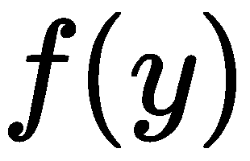
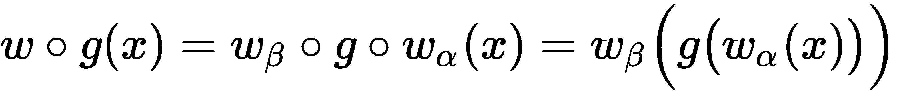
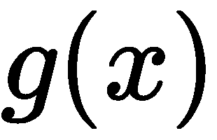
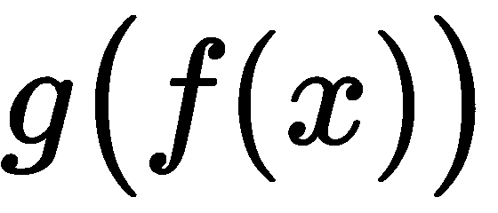
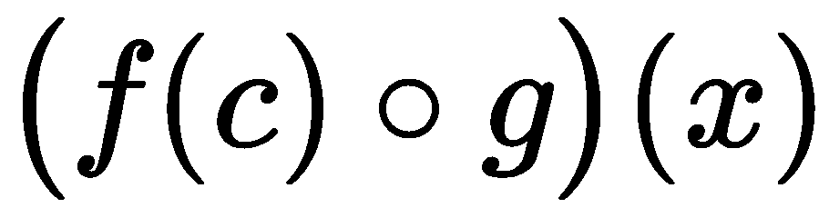
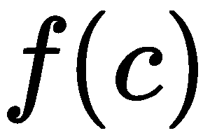
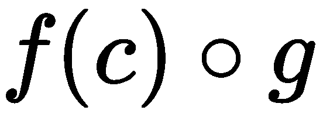
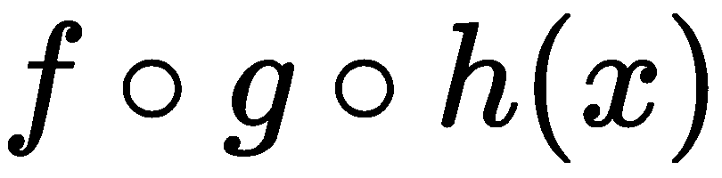
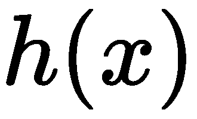
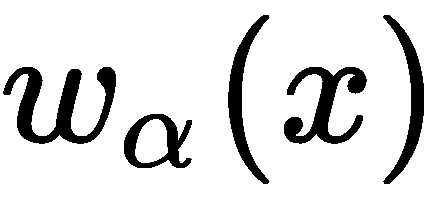

# 装饰设计技术

Python 为我们提供了许多创建高阶函数的方法。在[第 5 章](05.html)*高阶函数*中，我们研究了两种技术：定义接受函数作为参数的函数，以及定义`Callable`的子类，该子类可以使用函数初始化，也可以使用函数作为参数调用。

修饰函数的好处之一是我们可以创建复合函数。这些是包含来自多个来源的功能的单个功能。复合函数比更能表达复杂算法。对于表达复杂的处理，有许多语法选择通常是有帮助的。

在本章中，我们将研究以下主题：

*   使用装饰器基于另一个函数构建函数
*   `functools`模块中的`wraps()`功能；这可以帮助我们构建装饰器
*   `update_wrapper()`功能，可能会有帮助

# 作为高阶函数的装饰器

装饰器的核心思想是将一些原始功能转换为另一种形式。装饰器基于装饰器和被装饰的原始函数创建一种复合函数。

装饰器函数可通过以下两种方式之一使用：

*   作为前缀，创建与基函数同名的新函数，如下所示：

```py
@decorator
def original_function():
    pass
```

*   作为返回新函数（可能具有新名称）的显式操作：

```py
def original_function():
    pass
original_function = decorator(original_function)  
```

对于同一操作，这是两种不同的语法。前缀符号的优点是简洁明了。前缀位置对某些读者更可见。后缀表示法是显式的，稍微灵活一些。

虽然前缀表示法很常见，但使用后缀表示法有一个原因：我们可能不希望结果函数替换原始函数。我们可能不希望执行以下命令，该命令允许我们同时使用修饰函数和未修饰函数：

```py
new_function = decorator(original_function)  
```

这将从原始函数中构建一个名为`new_function()`的新函数。Python 函数是一流的对象。当使用`@decorator`语法时，原始函数不再可用。

decorator 是接受函数作为参数并返回函数作为结果的函数。这一基本描述显然是该语言的一个固有特性。那么，开放性的问题是我们如何更新或调整函数的内部代码结构？

答案是我们没有。定义一个封装原始函数的新函数要干净得多，而不是在代码内部乱搞。更容易处理参数值或结果，而不必处理原始函数的核心。

我们有两个阶段的高阶函数涉及定义装饰器；详情如下:

*   在定义时，装饰函数将包装应用于基函数，并返回新的包装函数。作为建筑装饰功能的一部分，装饰过程只能进行一次评估。例如，可以计算复杂的默认值。
*   在求值时，包装函数可以（并且通常确实）求值基函数。包装函数可以预处理参数值，也可以后处理返回值（或两者兼而有之）。包装函数也可能避免调用基函数。例如，在管理缓存的情况下，包装的主要原因是避免对基函数进行昂贵的调用。

下面是一个简单装饰器的示例：

```py
from functools import wraps
from typing import Callable, Optional, Any, TypeVar, cast

FuncType = Callable[..., Any]
F = TypeVar('F', bound=FuncType)

def nullable(function: F) -> F:
    @wraps(function)
    def null_wrapper(arg: Optional[Any]) -> Optional[Any]:
        return None if arg is None else function(arg)
    return cast(F, null_wrapper)
```

我们几乎总是希望使用`functools.wraps()`函数来确保修饰后的函数保留原始函数的属性。例如，复制`__name__`和`__doc__`属性可以确保生成的修饰函数具有原始函数的名称和 docstring。

由此产生的复合函数在 decorator 的定义中定义为`null_wrapper()`函数，也是一种高阶函数，它将原始函数`function()`可调用对象组合在一个保留`None`值的表达式中。在生成的`null_wrapper()`函数中，原始`function`可调用对象不是显式参数；它是一个自由变量，将从定义`null_wrapper()`函数的上下文中获取其值。

decorator 函数的返回值是新生成的函数。它将被分配给原始函数的名称。重要的是，装饰程序只返回函数，不尝试处理数据。装饰者使用元编程：一种创建代码的代码。然而，生成的`null_wrapper()`函数将用于处理实际数据。

请注意，类型提示使用了一个`TypeVar`特性，以确保应用装饰器的结果将是一个属于`Callable`类型的对象。类型变量`F`绑定到原始函数的类型；decorator 的类型提示声明结果函数应该与参数函数具有相同的类型。一个非常通用的修饰符将应用于各种各样的函数，需要类型变量绑定。

我们可以应用`@nullable`装饰器创建一个复合函数，如下所示：

```py
@nullable
def nlog(x: Optional[float]) -> Optional[float]:
    return math.log(x)
```

这将创建一个函数`nlog()`，它是内置`math.log()`函数的空感知版本。装饰过程返回一个版本的`null_wrapper()`函数，该函数调用原始的`nlog()`。此结果将命名为`nlog()`，并将具有包装和原始包装函数的复合行为。

我们可以按如下方式使用此复合`nlog()`功能：

```py
>>> some_data = [10, 100, None, 50, 60]
>>> scaled = map(nlog, some_data) 
>>> list(scaled)
[2.302585092994046, 4.605170185988092, None, 3.912023005428146, 4.0943445622221]
```

我们已经将该函数应用于一组数据值。`None`值礼貌地导致`None`结果。没有涉及异常处理。

This type of example isn't really suitable for unit testing. We'll need to round the values for testing purposes. For this, we'll need a null-aware `round()` function too.

下面是如何使用装饰符号创建空感知舍入函数：

```py
@nullable
def nround4(x: Optional[float]) -> Optional[float]:
    return round(x, 4)
```

此函数是`round()`函数的部分应用，包装为空感知。在某些方面，这是一个相对复杂的函数式编程，Python 程序员可以随时使用。

`typing`模块使用`Optional`类型定义，特别容易描述空感知函数和空感知结果的类型。定义`Optional[float]`指`Union[None, float]`；可以使用`None`对象或`float`对象。

我们还可以使用以下代码创建空感知舍入函数：

```py
nround4 = nullable(lambda x: round(x, 4))
```

注意，我们没有在函数定义前面使用 decorator。相反，我们将 decorator 应用于定义为 lambda 表单的函数。这与函数定义前面的装饰程序具有相同的效果。

我们可以使用这个`round4()`函数为我们的`nlog()`函数创建一个更好的测试用例，如下所示：

```py
>>> some_data = [10, 100, None, 50, 60]
>>> scaled = map(nlog, some_data)
>>> [nround4(v) for v in scaled]
[2.3026, 4.6052, None, 3.912, 4.0943]  
```

该结果将独立于任何平台考虑因素。这对于博士测试非常方便。

将类型提示应用于 lambda 表单可能很有挑战性。以下代码显示了所需的内容：

```py
nround4l: Callable[[Optional[float]], Optional[float]] = (
    nullable(lambda x: round(x, 4))
)
```

变量`nround4l`给出了类型提示`Callable`，参数列表为`[Optional[float]]`，返回类型为`Optional[float]`。`Callable`提示仅适用于位置参数。如果存在关键字参数或其他复杂性，请参见[http://mypy.readthedocs.io/en/latest/kinds_of_types.html#extended-可调用类型](http://mypy.readthedocs.io/en/latest/kinds_of_types.html#extended-callable-types)。

`@nullable`装饰器假设装饰的函数是`unary`。我们需要重新审视这个设计，以创建一个更通用的空感知修饰符，该修饰符可以处理任意参数集合。

在[第 14 章](14.html)、*Pydmonad Library*中，我们将探讨另一种方法来解决这个问题，即容忍`None`值。`PyMonad`库定义了一个`Maybe`类对象，该类对象可能具有适当的值，也可能是`None`值。

# 使用 functools update_wrapper（）函数

`@wraps`装饰器应用`update_wrapper()`函数来保存包装函数的一些属性。一般来说，默认情况下，这可以完成所有需要的操作。此函数将属性的特定列表从原始函数复制到装饰程序创建的结果函数。具体的属性列表是什么？它由一个全局模块定义。

`update_wrapper()`函数依赖于模块全局变量来确定要保留哪些属性。`WRAPPER_ASSIGNMENTS`变量定义默认情况下复制的属性。默认值是要复制的属性列表：

```py
('__module__', '__name__', '__qualname__', '__doc__', 
 '__annotations__')
```

很难对该列表进行有意义的修改。`def`语句的内部不能进行简单的修改或更改。作为一个参考信息，这个细节非常有趣。

如果我们要创建`callable`对象，那么我们可能有一个类，该类提供一些附加属性作为定义的一部分。这可能会导致这样一种情况：装饰者必须将这些附加属性从原始包装的`callable`对象复制到正在创建的包装函数中。然而，通过面向对象的类设计进行此类更改似乎比利用复杂的装饰器技术更简单。

# 交叉关注点

decorator 背后的一个一般原则是允许我们从 decorator 和应用 decorator 的原始函数构建一个复合函数。其想法是拥有一个公共装饰器库，可以为公共关注点提供实现。

我们通常称这些*交叉*关注点，因为它们适用于多个函数。这些是我们希望通过装饰器一次性设计的东西，并在整个应用程序或框架的相关类中应用它们。

通常作为装饰器定义集中的关注点包括：

*   登录中
*   审计
*   安全
*   处理不完整数据

例如，`logging`装饰程序可以将标准化消息写入应用程序的日志文件。审计装饰程序可能会编写有关数据库更新的详细信息。安全装饰器可能会检查一些运行时上下文，以确保登录用户具有必要的权限。

我们的函数的*空感知*包装器示例是一个横切关注点。在这种情况下，我们希望有许多函数通过返回`None`值来处理`None`值，而不是引发异常。在数据不完整的应用程序中，我们可能需要以简单、统一的方式处理行，而不必编写大量分散注意力的`if`语句来处理缺失的值。

# 组合设计

复合函数的常用数学表示法如下所示：


我们可以定义一个新函数，它结合了两个其他函数和。

Python 对组合函数的多行定义可以通过以下代码完成：

```py
@f_deco
def g(x):
    something  
```

由此产生的函数本质上等同于。`f_deco()`装饰器必须通过将`f()`的内部定义与提供的`g()`合并来定义并返回复合函数。

实现细节显示 Python 实际上提供了一种稍微复杂一点的组合。包装器的结构有助于将 Python decorator 组合考虑如下：



应用于某个应用程序函数的装饰器将包括一个包装函数，它由两部分组成。包装的一部分适用于包装函数的参数，另一部分适用于包装函数的结果。

这里有一个更具体的想法，如`something_wrapper()`装饰师定义所示：

```py
@wraps(argument_function)
def something_wrapper(*args, **kw):
    # The "before" part, w_α, applied to *args or **kw
    result = argument_function(*args, **kw)
    # The "after" part, w_β, applied to the result
    return after_result
```

这显示了在原始函数之前和之后插入附加处理的位置。这强调了函数组合的抽象概念和 Python 实现之间的一个重要区别：装饰器可以创建或或更复杂的。装饰的语法没有完全描述将创建哪种类型的构图。

decorators 的真正价值源于任何 Python 语句在包装函数中的使用方式。修饰符可以使用`if`或`for`语句将函数转换为有条件或迭代使用的函数。在下一节中，示例将利用`try`语句执行一个操作，从坏数据中进行标准恢复。在这个总体框架内可以做很多聪明的事情。

大量函数式编程遵循设计模式。从两个较小的函数定义组合并不总是有帮助的。在某些情况下，将这两个功能分开可以提供更多信息。然而，在其他情况下，我们可能需要创建一个复合函数来总结处理过程。

创建常见高阶函数的组合非常容易，例如`map()`、`filter()`和`reduce()`。因为这些函数很简单，所以复合函数通常很容易描述，并且有助于使编程更具表现力。

例如，应用可以包括`map(f, map(g, x))`。创建复合函数并使用`map(f_g, x)`表达式来描述将复合应用于集合可能更为清楚。使用`f_g = lambda x: f(g(x))`通常有助于将复杂应用程序解释为简单函数的组合。

需要注意的是，这两种技术都没有真正的性能优势。`map()`函数是惰性的：有两个`map()`函数，从`x`中取一项，由`g()`函数处理，再由`f()`函数处理。使用单个`map()`功能，将从`x`中提取一个项目，然后由`f_g()`复合功能处理。

在[第 14 章](14.html)*PyMonad 库*中，我们将研究一种从单个 curried 函数创建复合函数的替代方法。

# 预处理坏数据

在一些探索性数据分析应用程序中，一个交叉关注点是如何处理丢失或无法解析的数值。我们通常会混合使用`float`、`int`和`Decimal`货币值，我们希望这些货币值具有一定的一致性。

在其他上下文中，我们有*不适用*或*不可用*数据值，这些数据值不应干扰计算的主线程。允许`Not Applicable`值通过表达式而不引发异常通常是很方便的。我们将重点介绍三个糟糕的数据转换函数：`bd_int()`、`bd_float()`和`bd_decimal()`。我们正在添加的复合功能将在内置转换函数之前定义。

下面是一个简单的坏数据装饰器：

```py
import decimal
from typing import Callable, Optional, Any, TypeVar, cast

FuncType = Callable[..., Any]
F = TypeVar('F', bound=FuncType)

def bad_data(function: F) -> F:
    @wraps(function)
    def wrap_bad_data(text: str, *args: Any, **kw: Any) -> Any:
        try:
            return function(text, *args, **kw)
        except (ValueError, decimal.InvalidOperation):
            cleaned = text.replace(",", "")
            return function(cleaned, *args, **kw)
     return cast(F, wrap_bad_data)
```

此函数包装一个名为`function`的给定转换函数，以便在第一次转换涉及错误数据时尝试第二次转换。第二次转换将在删除“”字符后进行。此包装器将`*args`和`**kw`参数传递给包装函数。这可以确保包装的函数可以提供额外的参数值。

类型变量`F`绑定到为`function`参数定义的原始变量。decorator 被定义为返回同一类型的函数`F`。`cast()`的使用向**mypy**工具提供了一个提示，即包装器不会更改被包装函数的签名。

我们可以使用此包装器创建错误的数据敏感函数，如下所示：

```py
bd_int = bad_data(int)
bd_float = bad_data(float)
bd_decimal = bad_data(Decimal)
```

这将创建一套函数，这些函数可以转换好的数据，也可以清理有限的数据来处理特定类型的坏数据。

为这些类型的可调用对象编写类型提示是很困难的。特别是，`int()`函数具有可选的关键字参数，其类型提示非常复杂。参见[http://mypy.readthedocs.io/en/latest/kinds_of_types.html?highlight=keyword#extended-可调用类型](http://mypy.readthedocs.io/en/latest/kinds_of_types.html?highlight=keyword#extended-callable-types)用于为可调用对象创建复杂类型签名的指导。

以下是使用`bd_int()`功能的一些示例：

```py
>>> bd_int("13")
13
>>> bd_int("1,371")
1371
>>> bd_int("1,371", base=16)
4977
```

我们已经将`bd_int()`函数应用于一个转换灵活的字符串和一个具有我们可以容忍的特定标点类型的字符串。我们还展示了我们可以为每个转换函数提供额外的参数。

我们可能需要一个更灵活的装饰师。我们可能想添加的一个特性是能够处理各种数据清理替代方案。简单的`,`移除并不总是我们需要的。我们可能还需要删除`$`或`°`符号。在下一节中，我们将研究更复杂的参数化装饰器。

# 向装饰器添加参数

一个常见的需求是使用附加参数自定义装饰器。我们可以做一些更复杂的事情，而不是简单地创建一个复合。通过参数化装饰器，我们可以创建。我们已经应用了一个参数*c*，作为创建包装器的一部分。这个参数化的复合函数可以与实际数据*x*一起使用。

在 Python 语法中，我们可以按如下方式编写：

```py
@deco(arg)
def func(x):
    something
```

这有两个步骤。第一步将参数应用于抽象装饰器以创建具体装饰器。然后，将具体的装饰器（参数化的`deco(arg)`函数）应用于基本函数定义，以创建装饰函数。

效果如下：

```py
def func(x):
    return something(x)
concrete_deco = deco(arg)
func= concrete_deco(func)
```

我们做了三件事，如下所示：

1.  定义了一个函数`func()`。
2.  将抽象的装饰师`deco()`应用于其论点`arg`，创建了一个具体的装饰师`concrete_deco()`。
3.  将混凝土装饰器`concrete_deco()`应用于基本函数，以创建函数的装饰版本；实际上它是`deco(arg)(func)`。

带参数的装饰器涉及最终函数的间接构造。我们似乎已经超越了单纯的高阶函数，进入了更抽象的领域：创建高阶函数的高阶函数。

我们可以扩展我们的坏数据感知修饰符来创建稍微更灵活的转换。我们将定义一个`@bad_char_remove`装饰器，它可以接受要删除的字符的参数。以下是参数化装饰器：

```py
import decimal
def bad_char_remove(
        *char_list: str
    ) -> Callable[[F], F]:
    def cr_decorator(function: F) -> F:
        @wraps(function)
        def wrap_char_remove(text: str, *args, **kw):
            try:
                return function(text, *args, **kw)
            except (ValueError, decimal.InvalidOperation):
                cleaned = clean_list(text, char_list)
                return function(cleaned, *args, **kw)
        return cast(F, wrap_char_remove)
    return cr_decorator
```

参数化装饰器有两个内部函数定义：

*   一个抽象的装饰器，`cr_decorator`函数。这将有它的自由变量，`char_list`，一定会成为一个具体的装饰者。然后返回此装饰符，以便将其应用于函数。应用时，它将返回一个包装在`wrap_char_remove`函数中的函数。这有一个类型提示，其中包含一个类型变量`F`，该变量声明包装操作将保留包装函数的类型。
*   装饰包装，即`wrap_char_remove`函数，将用包装版本替换原来的函数。由于`@wraps`装饰符的存在，新函数的`__name__`（和其他属性）将替换为被包装的基函数的名称。

`bad_char_remove()`函数的任务是将参数绑定到抽象装饰器，并返回具体装饰器。类型提示说明返回值是一个将一个`Callable`函数转换为另一个`Callable`函数的`Callable`对象。然后，语言规则将把具体的修饰符应用于以下函数定义。

以下是用于删除给定列表中所有字符的`clean_list()`函数：

```py
from typing import Tuple
def clean_list(text: str, char_list: Tuple[str, ...]) -> str:
    if char_list:
        return clean_list(
            text.replace(char_list[0], ""), char_list[1:])
    return text
```

这是一个递归，因为规范非常简单。它可以优化为一个循环。

我们可以使用`@bad_char_remove`装饰器创建如下转换函数：

```py
@bad_char_remove("$", ",")
def currency(text: str, **kw) -> Decimal:
    return Decimal(text, **kw)  
```

我们已经使用装饰器包装了一个`currency()`函数。`currency()`函数的基本特征是引用`decimal.Decimal`构造函数。

此`currency()`函数现在将处理一些不同的数据格式：

```py
>>> currency("13")
Decimal('13')
>>> currency("$3.14")
Decimal('3.14')
>>> currency("$1,701.00")
Decimal('1701.00')  
```

我们现在可以使用相对简单的`map(currency, row)`方法处理输入数据，将源数据从字符串转换为可用的`Decimal`值。`try:/except:`错误处理被隔离到一个函数中，我们用来构建复合转换函数。

我们可以使用类似的设计来创建允许空的函数。这些函数将使用类似的`try:/except:`包装器，但只返回`None`值。

# 实现更复杂的装饰器

为了创建更复杂的函数，Python 允许以下类型的命令：

```py
@f_wrap
@g_wrap
def h(x):
    something
```

Python 中没有任何东西可以阻止我们堆积修改其他 decorator 结果的 decorator。这有点像的意思。但是，结果名称将仅为。由于这种潜在的混淆，我们在创建涉及深度嵌套装饰器的函数时需要谨慎。如果我们的目的仅仅是处理一些交叉关注点，那么每个装饰器都应该设计为处理一个单独的关注点，而不会造成太多混乱。

另一方面，如果我们使用装饰来创建复合函数，那么最好使用以下类型的定义：

```py
from typing import Callable

m1: Callable[[float], float] = lambda x: x-1
p2: Callable[[float], float] = lambda y: 2**y
mersenne: Callable[[float], float] = lambda x: m1(p2(x))
```

每个变量都有一个定义关联函数的类型提示。三个函数`m1`、`p2`和`mersenne`的类型提示为`Callable[[float], float]`，表示此函数将接受一个可以强制浮动的数字并返回一个数字。使用诸如`F_float = Callable[[float], float]`之类的类型定义将避免类型定义过于简单的重复。

如果函数大于简单表达式，强烈建议使用`def`语句。像这样使用 lambda 对象是一种罕见的情况。

虽然许多事情都可以通过装饰来完成，但有必要问一下，使用装饰器是否可以创建清晰、简洁、富有表现力的编程。在处理横切关注点时，装饰器的功能通常与被装饰的功能有本质上的区别。这可以是一个奇妙的简化。通过装饰添加日志记录、调试或安全检查是一种广泛采用的做法。

过于复杂的设计的一个重要后果是难以提供适当的类型提示。当类型提示演变为简单地使用`Callable`和`Any`时，设计可能变得太难解释清楚。

# 复杂的设计考虑

在我们的数据清理中，简单地去除杂散字符可能是不够的。在处理地理定位数据时，我们可能有多种输入格式，包括简单度（`37.549016197`）、度和分（`37° 32.94097′`）以及度-分-秒（`37° 32′ 56.46″`）。当然，还有更微妙的清理问题：一些设备将创建一个带有 Unicode U+00BA 字符`º`的输出，而不是外观相似的度字符`°`，即 U+00B0。

出于这个原因，通常需要提供一个单独的清理功能，该功能与转换功能捆绑在一起。此函数将处理输入所需的更复杂的转换，这些输入的格式与纬度和经度一样不一致。

我们如何实施这一点？我们有很多选择。简单的高阶函数是一个不错的选择。另一方面，一个装饰师的工作效果却不太好。我们将看一看基于装饰器的设计，看看装饰器中的一些限制。

要求有两个正交设计考虑因素，如下所示：

1.  输出转换（`int`、`float`、`Decimal`）。
2.  输入清理（清除杂散字符，重新格式化坐标）。

理想情况下，其中一个方面是包装的基本功能，另一个方面是通过包装器包含的内容。本质与包装的选择并不明确。不清楚的原因之一是，我们前面的示例比简单的两部分组合要复杂一些。

考虑到前面的示例，似乎应将其视为三部分组合：

*   输出转换（`int`、`float`、`Decimal`）
*   输入清理：简单替换或更复杂的多字符替换
*   首先尝试转换的函数，然后作为对异常的响应执行任何清理，然后再次尝试转换

尝试转换和重试的第三部分是实际的包装器，它也是复合函数的一部分。如前所述，包装器包含一个参数阶段和一个返回值，我们分别称之为和。

我们希望使用这个包装器来创建两个附加函数的组合。我们有两种设计选择。我们可以将 cleaning 函数作为 decorator 的参数包含在转换中，如下所示：

```py
@cleanse_before(cleanser)
def conversion(text):
    something  
```

第一种设计声称转换功能是中心功能，而清理是一个辅助细节，它将修改行为，但保留转换的原始意图。

或者，我们可以将转换函数作为参数包含在清理函数的装饰器中，如下所示：

```py
@then_convert(converter)
def cleanse(text):
    something  
```

第二种设计声称，清洗是核心，转换是辅助细节。这有点令人困惑，因为清理类型通常是`Callable[[str], str]`，其中转换的类型`Callable[[str], some other type]`是整个包装函数所需的类型。

虽然这两种方法都可以创建可用的复合函数，但第一个版本有一个重要的优点：`conversion()`函数的类型签名也是生成的复合函数的类型签名。这突出了装饰器的一般设计模式：被装饰的函数类型最容易保存。

When confronted with several choices for defining a composite function, it is important to preserve the type hints for the function being decorated.

因此，首选`@cleanse_before(cleaner)`风格的装饰师。装饰师如下所示：

```py
def cleanse_before(
        cleanse_function: Callable
    ) -> Callable[[F], F]:
    def abstract_decorator(converter: F) -> F:
        @wraps(converter)
        def cc_wrapper(text: str, *args, **kw) -> Any:
            try:
                return converter(text, *args, **kw)
            except (ValueError, decimal.InvalidOperation):
                cleaned = cleanse_function(text)
                return converter(cleaned, *args, **kw)
        return cast(F, cc_wrapper)
    return abstract_decorator
```

我们定义了一个三层装饰器。心脏是应用`converter()`功能的`cc_wrapper()`功能。如果失败，则使用给定的`cleanse_function()`函数，然后再次尝试`converter()`函数。`cc_wrapper()`功能由`abstract_decorator()`混凝土装饰功能围绕`cleanse_function()`和`converter()`功能构建。混凝土装饰器具有作为自由变量的`cleanse_funcion()`功能。混凝土装饰器由装饰器接口`cleanse_before()`创建，该接口由`cleanse_function()`功能定制。

字体提示强调了`@cleanse_before`装饰者的角色。它需要一些名为`cleanse_function`的`Callable`函数，并创建一个函数，如`Callable[[F], F]`所示，该函数将函数转换为包装函数。这有助于提醒我们参数化装饰器是如何工作的。

我们现在可以构建一个更灵活的清理和转换功能`to_int()`，如下所示：

```py
def drop_punct2(text: str) -> str:
    return text.replace(",", "").replace("$", "")

@cleanse_before(drop_punct)
def to_int(text: str, base: int = 10) -> int:
    return int(text, base)
```

整数转换使用清理函数进行修饰。在这种情况下，清除功能将删除`$`和`,`字符。整数转换由此清理包装。

前面定义的`to_int()`函数利用内置`int()`函数。避免使用`def`语句的替代定义如下：

```py
to_int2 = cleanse_before(drop_punct)(int)
```

它使用`drop_punct()`来包装内置的`int()`转换函数。使用**mypy**工具`reveal_type()`功能显示`to_int()`的类型签名与内置`int()`的类型签名匹配。

我们可以按如下方式使用此增强的整数转换：

```py
>>> to_int("1,701")
1701
>>> to_int("97")
97
```

基础`int()`函数的类型提示已为修饰函数`to_int()`重写（并简化）。这是尝试使用 decorator 包装内置函数的结果。

由于定义参数化装饰器的复杂性，这似乎是封套的边缘。装饰模型似乎不适合这种设计。复合函数的定义似乎比构建装饰器所需的机制更清晰。

一般来说，当我们有一些相对简单和固定的方面要包含在给定函数（或类）中时，装饰器工作得很好。当这些附加方面可以被视为基础设施或支持，而不是应用程序代码的基本含义时，decorator 也很重要。

对于涉及多个正交设计方面的内容，我们可能希望得到具有各种插件策略对象的可调用类定义。这可能比等效的 decorator 具有更简单的类定义。装饰器的另一个替代方法是仔细研究创建高阶函数。在某些情况下，具有各种参数组合的部分函数可能比装饰器更简单。

横切关注点的典型示例包括日志记录或安全测试。这些特性可以被认为是一种后台处理，并不特定于问题域。当我们拥有像空气一样无处不在的处理方式时，装饰师可能是一种合适的设计技术。

# 总结

在本章中，我们研究了两种装饰器：没有参数的简单装饰器和参数化装饰器。我们已经看到了 decorator 是如何在函数之间进行间接组合的：decorator 将一个函数（定义在 decorator 内部）包装在另一个函数周围。

使用`functools.wraps()`修饰符可以确保我们的修饰符能够正确地从被包装的函数中复制属性。这应该是我们写的每个装潢师的作品。

在下一章中，我们将介绍可用的多处理和多线程技术。这些包在函数式编程环境中特别有用。当我们消除复杂的共享状态并围绕非严格处理进行设计时，我们可以利用并行性来提高性能。