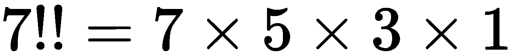
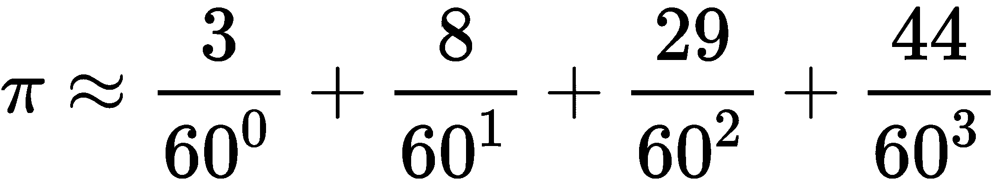
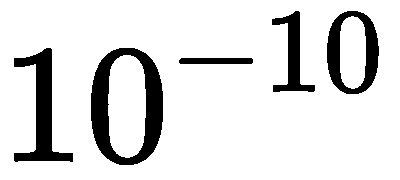
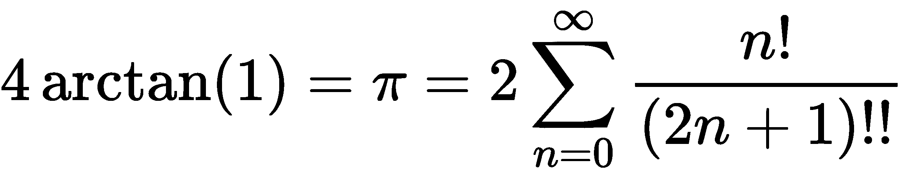

# 条件表达式与运算符模块

函数式编程强调操作的惰性或非严格顺序。其思想是允许编译器或运行时尽可能少地计算答案。Python 倾向于对求值进行严格的排序，这可能是低效的。

Python`if`、`elif`和`else`语句对条件的评估执行严格的顺序。在本章中，我们将探讨如何在一定程度上摆脱严格的排序，并开发一种有限类型的非严格条件语句。目前尚不清楚这是否有用，但它将展示一些替代方法，以更具功能性的方式表达算法。

在前面的章节中，我们研究了一些高阶函数。在某些情况下，我们使用这些高阶函数将相当复杂的函数应用于数据集合。在其他情况下，我们将简单函数应用于数据集合。

事实上，在许多情况下，我们编写了微小的 lambda 对象来将单个 Python 操作符应用于函数。例如，我们可以使用以下代码定义一个`prod()`函数：

```py
from typing import Iterable
from functools import reduce
def prod(data: Iterable[int]) -> int:
    return reduce(lambda x, y: x*y, data, 1)
```

对于简单的乘法，`lambda x,y: x*y`参数的使用似乎有点冗长。毕竟，我们只想使用乘法运算符（`*`。我们能简化语法吗？答案是肯定的；`operator`模块为我们提供了内置运算符的定义。在这种情况下，我们可以使用`operator.mul`代替 lambda 对象。

我们将在本章中讨论几个主题：

*   第一部分将探讨如何实施非严格评估。这是一个有趣的工具，因为它可以导致性能优化。
*   我们还将研究`operator`模块，以及这如何导致一些简化和潜在的澄清，以创建高阶函数。
*   我们来看看星型映射，其中一个`f(*args)`用于为映射提供多个参数。
*   我们还将介绍一些更先进的`partial()`和`reduce()`技术。

# 计算条件表达式

Python 对表达式施加严格的排序；值得注意的例外是短路操作器、`and`和`or`。它对语句求值施加严格的顺序。这使得寻找优化变得很有挑战性，因为它们会打破严格的评估顺序。

对条件表达式求值是我们实验语句非严格排序的一种方法。`if`、`elif`和`else`Python 语句按照从头到尾的严格顺序进行求值。理想情况下，优化语言可以放宽这一规则，以便编译器能够找到更快的顺序来计算条件表达式。这使我们能够按照对读者有意义的顺序编写表达式，并让编译器找到更快的计算顺序。

由于缺少优化编译器，非严格排序的概念对 Python 来说有点牵强。尽管如此，我们确实有其他方法来表示条件，这些方法涉及函数的求值，而不是命令语句的执行。这可以允许在运行时进行一些重新安排。

Python 有一个条件的`if`和`else`表达式。`if-else`操作员为短路操作员。这导致了一个微小的优化，因为两个外部条件中只有一个是基于内部条件的真实性进行评估的。当我们写入`x if c else y`时，只有当`c`为`True`时，才会计算`x`表达式。此外，只有当`c`为`False`时，才会对`y`表达式进行评估。这是一个小优化，但操作顺序仍然严格执行。

此表达式适用于简单条件。然而，当我们有多种情况时，情况会变得非常复杂；我们必须小心地嵌套子表达式。我们可能会得到一个表达式，如下所示，这很难理解：

```py
(x if n==1 else (y if n==2 else z))
```

根据`n`的值，前面的表达式将仅计算`x`、`y`或`z`中的一个。

当看`if`语句时，我们有一些数据结构可以模拟`if`语句的效果。一种技术是使用字典键和 lambda 对象创建条件和值的映射集。下面是一种将阶乘函数表示为表达式的方法：

```py
def fact(n: int) -> int:
    f = {
        n == 0: lambda n: 1,
        n == 1: lambda n: 1,
        n == 2: lambda n: 2,
        n > 2: lambda n: fact(n-1)*n
    }[True]
    return f(n)
```

这将常规的`if`、`elif`、`elif`和`else`语句序列重写为单个表达式。我们将其分解为两个步骤，以使所发生的事情更加清晰。

在第一步中，我们将评估各种条件。其中一个给定条件将评估为`True`，其他条件都应评估为`False`。生成的字典将包含两个项—一个带有 lambda 对象的`True`键和一个带有 lambda 对象的`False`键。我们将选择`True`项并将其分配给`f`变量。

我们在这个映射中使用 lambdas 作为值，这样在构建字典时就不会计算值表达式。我们想让字典选一个 lambda。此 lambda 值是函数整体的结果。`return`语句计算应用于输入参数`n`的与`True`条件`f`相关联的 lambda。

# 利用非严格字典规则

在 Python3.6 之前，字典的键没有定义的顺序。如果我们试图创建一个包含多个共享一个公共键值的项的字典，那么结果`dict`对象中将只有一个项。没有定义哪些重复的键值将被保留，如果我们正确地设计了算法，这应该无关紧要。

以下结果是典型的。最后一个值已替换任何以前的值。在 Python 3.6 之前，无法保证会发生这种情况：

```py
>>> {'a': 1, 'a': 2}
{'a': 2}
```

在这种情况下，我们明确地不关心保留了哪些重复的密钥。如果我们观察`max()`函数的退化情况，它只选择两个值中的最大值：

```py
def non_strict_max(a, b):
    f = {a >= b: lambda: a, 
         b >= a: lambda: b}[True]
    return f()  
```

在`a == b`的情况下，字典中的两个项都有`True`条件的键。实际上，这两个国家中只有一个会被保留下来。因为答案是相同的，所以保留哪一个，以及哪一个被视为重复和覆盖都无关紧要。

请注意，此函数的正式类型提示异常复杂。正在比较的项目必须是*可分级*-它们必须实现订购运算符。下面是我们如何定义一种类型，以捕获可分级对象的概念：

```py
from abc import ABCMeta, abstractmethod
from typing import TypeVar, Any

class Rankable(metaclass=ABCMeta):
    @abstractmethod
    def __lt__(self, other: Any) -> bool: ...
    @abstractmethod
    def __gt__(self, other: Any) -> bool: ...
    @abstractmethod
    def __le__(self, other: Any) -> bool: ...
    @abstractmethod
    def __ge__(self, other: Any) -> bool: ...

RT = TypeVar('RT', bound=Rankable)
```

`Rankable`类定义是一个抽象类，依赖`abc`模块提供一些有用的定义来形式化类定义的抽象性质。`@abstractmethod`装饰符用于识别必须由任何有用的具体子类定义的方法函数。

然后，可以将类型变量`RT`绑定到`non_strict_max()`函数的参数和结果类型。以下是包含类型提示的定义（如前所示，主体已被省略）：

```py
def non_strict_max(a: RT, b: RT) -> RT:
```

这澄清了两个参数`a`和`b`预计为某种可分级类型，将绑定到`RT`。结果将是相同的可分级类型。这澄清了`max()`的通常语义，其中参数为一致类型，结果为相同类型。

# 过滤真实条件表达式

我们有很多方法来确定哪个表达式是`True`。在前面的示例中，我们将密钥加载到字典中。由于加载字典的方式，只有一个值会被保留，键为`True`。

下面是这个主题的另一个变体，使用`filter()`函数编写：

```py
from operator import itemgetter
def semifact(n: int) -> int:
    alternatives = [
        (n == 0, lambda n: 1),
        (n == 1, lambda n: 1),
        (n == 2, lambda n: 2),
        (n > 2, lambda n: semifact(n-2)*n)
    ]
    _, f = next(filter(itemgetter(0), alternatives))
    return f(n)
```

我们将备选方案定义为一系列条件和函数对。中的每个项作为基于输入的条件和将生成输出的 lambda 项。我们还可以在变量赋值中包含一个类型提示，如下所示：

```py
alternatives: List[Tuple[bool, Callable[[int], int]]] = [
   etc,
]
```

这个列表实际上是四个两元组的同一个集合。这个定义澄清了元组列表是一个布尔结果和一个可调用函数。

当我们使用`itemgetter(0)`参数应用`filter()`函数时，我们将选择元组第 0 项中具有`True`值的对。在`True`中，我们将使用`next()`从`filter()`函数创建的 iterable 中提取第一项。选择的条件值被分配给`_`变量；所选函数分配给`f`变量。我们可以忽略条件值（它将是`True`），我们可以评估返回的`f()`函数。

与前面的示例一样，我们使用 lambdas 将函数的求值推迟到条件求值之后。

这个`semifact()`函数也称为**双阶乘**。半阶乘的定义与阶乘的定义相似。重要的区别在于，它是交替数的乘积，而不是所有数的乘积。例如，请查看以下公式：

*   
*   

# 寻找匹配模式

在使用正则表达式时，也可以应用这种创建多个条件集合的技术。回想一下，模式的`match()`或`search()`方法要么返回匹配对象，要么返回`None`。我们可以在程序中利用这一点，如以下代码所示：

```py
import re
p1 = re.compile(r"(some) pattern")
p2 = re.compile(r"a (different) pattern")

from typing import Optional, Match
def matcher(text: str) -> Optional[Match[str]]:
    patterns = [p1, p2]
    matching = (p.search(text) for p in patterns)
    try:
       good = next(filter(None, matching))
       return good
    except StopIteration:
       pass
```

我们已经定义了两种模式，希望对给定的文本块应用它们。每个模式都有一个子模式标记为`()`，这将是一个捕获组。

`matcher()`功能将构建一系列备选模式。在本例中，它是一对简单的文本模式。生成器表达式用于对提供的文本应用每个模式的`search()`方法。由于生成器表达式是惰性的，因此不会立即执行一系列长的模式匹配；相反，结果必须被消耗掉。

以`None`作为第一个参数的`filter()`函数将从项目序列中删除所有`None`值。`filter(None, S)`的值与`filter(lambda item: item is not None, S)`相同。

`next()`函数将从`filter()`函数的 iterable 结果中获取第一个非 none 值。如果`filter()`功能没有结果，则表示没有匹配的模式。在本例中，我们将异常转换为`None`结果。一个明智的选择可能是引发自定义异常，因为没有模式匹配给定的文本。

与前面的示例一样，这显示了如何计算多个布尔条件并选择单个真值。由于输入是一系列模式，因此各种函数的求值顺序定义良好，并以严格的顺序执行。虽然我们无法摆脱 Python 严格的求值顺序，但我们可以通过在找到匹配项后立即退出函数来限制求值的成本。

# 使用操作员模块而不是 lambdas

使用`max()`、`min()`和`sorted()`函数时，我们有一个可选的`key=`参数。作为参数值提供的函数修改高阶函数的行为。在许多情况下，我们使用简单的 lambda 表单从元组中选择项。以下是我们非常依赖的两个示例：

```py
from typing import Callable, Sequence, TypeVar
T_ = TypeVar("T_")
fst: Callable[[Sequence[T_]], T_] = lambda x: x[0]
snd: Callable[[Sequence[T_]], T_] = lambda x: x[1]
```

这些函数与其他一些函数式编程语言中的内置函数相匹配，这些函数用于从元组中拾取第一项或第二项。这包括类型提示，以确保序列中的项类型绑定到类型变量`T_`，该变量反映函数结果的类型，因此不会进行其他转换。

我们实际上不需要编写这些函数。`operator`模块中有一个名为`itemgetter()`的版本。这些是高阶函数。表达式`itemgetter(0)`创建一个函数。然后，我们可以将函数应用于集合以选择对象，如下所示。

```py
>>> from operator import itemgetter
>>> itemgetter(0)([1, 2, 3])
1
```

让我们在更复杂的元组数据结构列表中使用它。以下是一些我们可以使用的示例数据：

```py
year_cheese = [
    (2000, 29.87), (2001, 30.12), (2002, 30.6), (2003, 30.66),
    (2004, 31.33), (2005, 32.62), (2006, 32.73), (2007, 33.5),
    (2008, 32.84), (2009, 33.02), (2010, 32.92)
]
```

这是每年的奶酪消费量。我们在[第 2 章](02.html)、*介绍基本功能概念*和[第 9 章](09.html)、*更多 Itertools 技术*中使用了此示例。

我们可以使用以下命令定位具有最小奶酪的数据点：

```py
>>> min(year_cheese, key=snd)
(2000, 29.87)
```

`operator`模块为我们提供了从元组中选取特定元素的替代方法。这样就避免了使用 lambda 变量拾取第二项。

不需要定义我们自己的`fst()`和`snd()`函数，我们可以使用`itemgetter(0)`和`itemgetter(1)`参数，如下命令所示：

```py
>>> from operator import itemgetter
>>> max(year_cheese, key=itemgetter(1)) 
(2007, 33.5)
```

`itemgetter()`函数依赖于特殊的方法`__getitem__()`，根据项目的索引位置从元组（或列表）中选择项目。

# 使用高阶函数时获取命名属性

让我们看一个稍微不同的数据集合。假设我们使用的是`NamedTuple`子类，而不是匿名元组。首先，我们将定义一个类，该类对元组中的两个项都有类型提示：

```py
from typing import NamedTuple
class YearCheese(NamedTuple):
    year: int
    cheese: float
```

然后，我们可以将基础`year_cheese`数据转换为正确命名的元组。转换如下所示：

```py
>>> year_cheese_2 = list(YearCheese(*yc) for yc in year_cheese)

>>> year_cheese_2
[YearCheese(year=2000, cheese=29.87), 
 YearCheese(year=2001, cheese=30.12),
 YearCheese(year=2002, cheese=30.6), 
 YearCheese(year=2003, cheese=30.66),
 YearCheese(year=2004, cheese=31.33), 
 YearCheese(year=2005, cheese=32.62),
 YearCheese(year=2006, cheese=32.73), 
 YearCheese(year=2007, cheese=33.5),
 YearCheese(year=2008, cheese=32.84), 
 YearCheese(year=2009, cheese=33.02),
 YearCheese(year=2010, cheese=32.92)]
```

我们有两种方法确定奶酪消费范围。我们可以使用`attrgetter()`函数，也可以使用 lambda 形式，如下所示：

```py
>>> from operator import attrgetter
>>> min(year_cheese_2, key=attrgetter('cheese'))
YearCheese(year=2000, cheese=29.87)
>>> max(year_cheese_2, key=lambda x: x.cheese)
YearCheese(year=2007, cheese=33.5)
```

这里重要的是，对于 lambda 对象，属性名称在代码中表示为标记。使用`attrgetter()`函数，属性名称是一个字符串。使用字符串，属性名可以是一个参数，在脚本运行时可以更改该参数，从而为我们提供一些额外的灵活性。

# 带运算符的星映射

`itertools.starmap()`函数是`map()`高阶函数的变体。`map()`函数对序列中的每个项目应用一个函数。`starmap(f, S)`函数假定序列`S`中的每个项目`i`是一个元组，并使用`f(*i)`。每个元组中的项数必须与给定函数中的参数数匹配。

下面是一个例子：

```py
>>> d = starmap(pow, zip_longest([], range(4), fillvalue=60))  
```

`itertools.zip_longest()`函数将创建一系列对，例如：

```py
[(60, 0), (60, 1), (60, 2), (60, 3)]
```

之所以这样做，是因为我们提供了两个序列：`[]`括号和`range(4)`参数。当较短序列的数据用完时，将使用`fillvalue`参数。

当我们使用`starmap()`函数时，每对都成为给定函数的参数。在本例中，我们提供了`operator.pow()`函数，即`**`操作符。此表达式计算`[60**0, 60**1, 60**2, 60**3]`的值。`d`变量的值为`[1, 60, 3600, 216000]`。

`starmap()`函数需要一个元组序列。我们在`map(f, x, y)`和`starmap(f, zip(x, y))`函数之间有一个简洁的等价关系。

以下是`itertools.starmap()`函数前面示例的延续：

```py
>>> p = (3, 8, 29, 44)
>>> pi = sum(starmap(truediv, zip(p, d)))
```

我们将四个值的两个序列压缩在一起。上述使用`starmap()`计算`d`变量的值。`p`变量指的是一个简单的文本项列表。我们把这些拉链拉起来做成成对的东西。我们使用了`starmap()`函数和`operator.truediv()`函数，这是`/`操作符。
这将计算我们求和的分数序列。总和是的近似值。

这里有一个稍微简单的版本，它使用了`map(f, x, y)`函数而不是`starmap(f, zip(x,y))`函数：

```py
>>> pi = sum(map(truediv, p, d))
>>> pi
3.1415925925925925  
```

在本例中，我们有效地将基数`60`分数值转换为基数`10`。`d`变量中的值序列是适当的分母。类似于本节前面介绍的技术可用于转换其他基础。

有些近似涉及潜在的无限和（或乘积）。可以使用本节前面介绍的类似技术对这些进行评估。我们可以利用`itertools`模块中的`count()`函数生成任意数量的近似项。然后，我们可以使用`takewhile()`函数来仅累积对答案具有有用精度的值。从另一个角度来看，`takewhile()`生成一个重要值流，当发现一个不重要的值时停止处理。

下面是一个从潜在无限序列计算和的示例：

```py
>>> from itertools import count, takewhile
>>> num = map(fact, count())
>>> den = map(semifact, (2*n+1 for n in count()))
>>> terms = takewhile(
... lambda t: t > 1E-10, map(truediv, num, den))
>>> 2*sum(terms)
3.1415926533011587

```

`num`变量是基于阶乘函数的可能无限的分子序列，在前面的示例中定义。`count()`函数返回升序值，从零开始，无限期继续。`den`变量是基于半阶乘（有时称为双阶乘）函数的潜在无限分母序列。在前面的示例中也定义了此函数。它还使用`count()`创建一系列潜在的无限值。

为了创建术语，我们使用`map()`函数将`operators.truediv()`函数`/`运算符应用于每对值。我们将其包装在一个`takewhile()`函数中，这样我们只从`map()`输出中获取术语，而该值大于一些相对较小的值；在本例中，。

这是基于此定义的系列扩展：



系列扩展主题的一个有趣变化是将`operator.truediv()`函数替换为`fractions.Fraction()`函数。这将创建不受浮点近似限制的精确有理值。

`operators`模块中提供了所有内置 Python 操作符。这包括所有的位篡改运算符以及比较运算符。在某些情况下，生成器表达式可能比具有表示运算符的函数的外观相当复杂的`starmap()`函数更简洁或更具表现力。

`operator`模块用于简写 lambda。我们可以用`operator.add`方法代替`add=lambda a, b: a+b`方法。如果表达式比单个运算符更复杂，那么 lambda 对象是编写表达式的唯一方法。

# 使用操作员模块功能减少故障

我们将研究使用运算符定义的另一种方法。我们可以使用内置的`functools.reduce()`功能。例如，`sum()`功能可以定义如下：

```py
sum = functools.partial(functools.reduce, operator.add)
```

这将创建带有第一个参数的部分计算版本的`reduce()`函数。在这种情况下，它是通过`operator.add()`函数实现的`+`操作符。

如果我们需要一个计算产品的类似函数，我们可以这样定义它：

```py
prod = functools.partial(functools.reduce, operator.mul)
```

这遵循前面示例中所示的模式。我们有一个部分求值的`reduce()`函数，其第一个参数为`*`运算符，由`operator.mul()`函数实现。

现在还不清楚我们是否可以和太多的其他运营商做类似的事情。我们也许能够找到`operator.concat()`函数以及`operator.and()`和`operator.or()`函数的用法。

The `and()` and `or()` functions are the bit-wise `&` and `/` operators. If we want the proper Boolean operators, we have to use the `all()` and `any()` functions instead of the `reduce()` function.

一旦我们有了`prod()`函数，这意味着阶乘可以定义如下：

```py
fact = lambda n: 1 if n < 2 else n*prod(range(1, n))
```

这具有简洁的优点：它提供了阶乘的单行定义。它还具有不依赖递归的优点，避免了堆栈限制的任何问题。

与 Python 中的许多替代方案相比，这是否有任何显著的优势尚不清楚。从`partial()`和`reduce()`函数以及`operator`模块等原始片段构建复杂函数的概念非常优雅。不过，在大多数情况下，`operator`模块中的简单函数并没有多大帮助；我们几乎总是希望使用更复杂的 lambda。

对于布尔约简，我们必须使用内置的`any()`和`all()`函数。这些实现了一种短路`reduce()`操作。它们不是高阶函数，必须与 lambda 或定义的函数一起使用。

# 总结

在本章中，我们研究了`if`、`elif`和`else`语句序列的替代方案。理想情况下，使用条件表达式可以进行一些优化。实际上，Python 不会进行优化，因此处理条件的更奇特的方法没有什么实际的好处。

我们还研究了如何使用具有高阶函数的`operator`模块，如`max()`、`min()`、`sorted()`和`reduce()`。使用操作符可以避免我们创建大量小 lambda。

在下一章中，我们将研究`PyMonad`库，它直接用 Python 表达函数式编程概念。我们通常不需要 monad，因为 Python 是一种现成的命令式编程语言。

有些算法可以用单子比有状态变量赋值更清楚地表达。我们将看一个例子，其中单子导致一组相当复杂的规则的简洁表达式。最重要的是，`operator`模块展示了许多函数式编程技术。