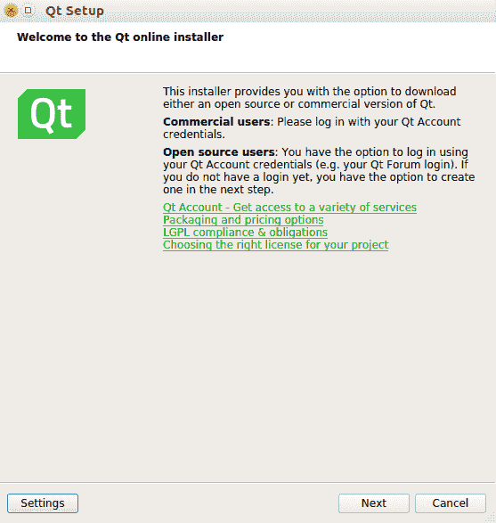
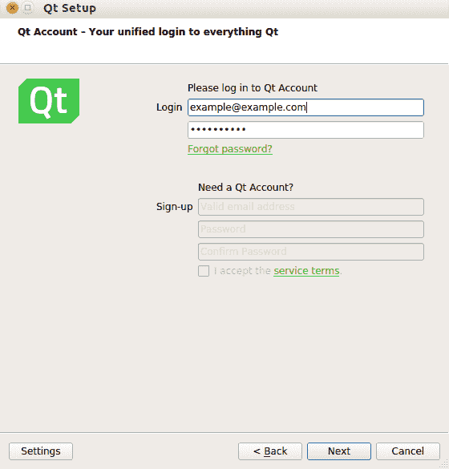
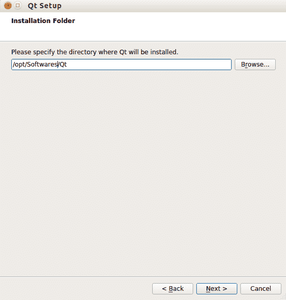
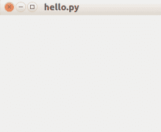
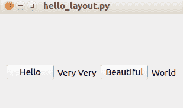
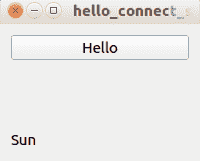
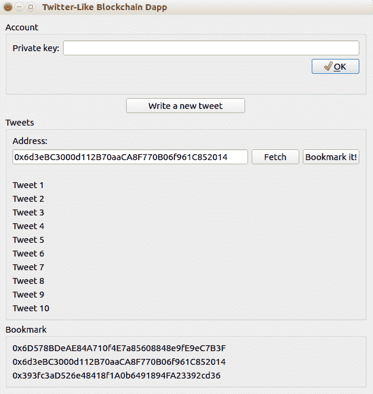
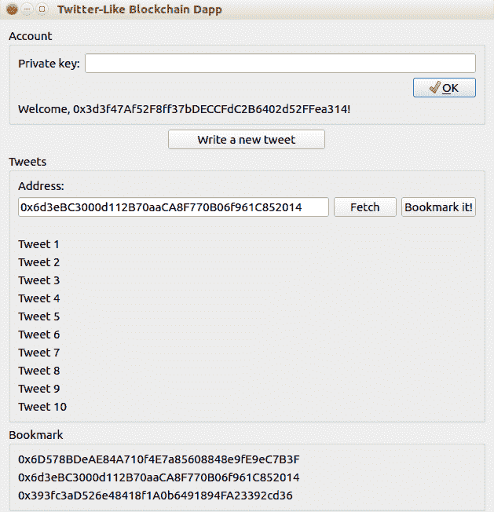

# 前端分散应用

在本章中，我们将学习如何编写具有 GUI 前端的分散应用程序。这是一个桌面分散应用程序。人们可以使用按钮和文本字段与智能合同进行交互。这是从块菌控制台或`web3.py`脚本向前迈出的一步。在编写这个 GUI 前端时，我们将了解处理智能合约时的最佳实践，即如何处理延迟以及如何在分散的应用程序中提供附加值。

在本章中，我们将学习以下主题：

*   设置 QtGUI 库
*   为 Python 安装 Qt
*   关于 Qt for Python 的速成班
*   为类似 Twitter 的应用程序编写智能合约
*   为类似 Twitter 的应用程序构建 GUI

# 设置 QtGUI 库

Qt 库是一个 C++框架，它被设计成创建多平台应用程序。在 Linux，这个库是 KDE 桌面的基础。它的对应部分是 GTK+库，它是 GNOME 桌面的基础。然而，Qt 库已经加强了它的游戏。您可以使用 Qt 库在 Android 和 iOS 上创建应用程序。人们有时会把 Qt 库误认为是只创建 GUI 应用程序的库。但是，Qt 库也包括非 GUI 库，例如数据存储、多媒体和网络。Qt 库甚至包含一个线程库！在过去，您可以使用 Qt 库免费创建一个开源应用程序。但是，如果您想使用 Qt 库创建专有应用程序，则必须支付许可证费用。在使用 Qt 库时，您现在可以有更多的灵活性。

您可以使用 Qt 库免费创建专有应用程序，但前提是您为 Qt 库提供重新链接机制，提供许可证副本，并明确确认 Qt 使用情况，如[所述 https://www.qt.io/download](https://www.qt.io/download) 。

# 选择 GUI 库

Python 有很多 GUI 库可供选择。这包括 Tkinter、Phoenix（wxPython）、PyGObject、PyQt、PyQt for Python（PySide2）等。决定 Python 应用程序应该使用哪个 GUI 库有时是主观的。

Tkinter 是一个 PythonGUI 库，但 UI 并不光滑和完善。PyGObject 是一个很好的选择，只有当您想在 Linux 中编写桌面应用程序时，因为它使用 GTK+。Windows 和 Mac 中支持 GTK+，但它不是本机的。

我将为 Python 选择 Qt（[https://www.qt.io/qt-for-python](https://www.qt.io/qt-for-python) 图书馆。这是来自 Qt 本身的 Qt 库的官方 Python 绑定。不过要小心；另一家公司为 Qt 库提供了另一个 Python 绑定。这个图书馆叫 PyQt，公司在 Riverbank。这些库都支持最新的 Qt 库，即 qt5。

这两个库之间存在差异。如果您想使用 PyQt 编写和销售专有应用程序，必须从 Riverbank 购买许可证。然而，您不需要使用 qtforpython 来实现这一点，尽管它有自己的一组限制。例如，必须为 Qt 库提供重新链接机制。有一些书是关于 PyQt 的，但在写这本书的时候，没有一本是关于 PyQt for Python 的。

以前，Qt 的可靠 Python 绑定只能从 Riverbank 获得。然而，在今年中期，QT 发布了其最新的 QT 库（QT 5.11）的 Python 绑定。Qt 对于推广这个 Python 绑定非常认真。

# 为 Python 安装 Qt

首先，您必须安装 Qt5.11。转到[https://www.qt.io/download](https://www.qt.io/download) 。下载库时，您有两种类型的许可证可供选择，一种是商业许可证，另一种是开源许可证。在这种情况下，您必须选择开源选项：

1.  如果您在 Linux 平台上，您将下载以下文件：`qt-unified-linux-x64-3.0.5-online.run`。

这是一个安装程序。如果运行它，您将看到以下屏幕：



2.  单击下一步。然后，您将看到一个登录屏幕。创建一个新帐户，如果你没有；它是免费的。之后，通过以下屏幕登录：



3.  然后，您将看到安装程序的欢迎屏幕。从这里单击“下一步”：


4.  指定要安装 Qt 库的位置：



5.  然后选择 Qt 5.11.2 或最新的稳定版本：


安装程序完成其工作需要一段时间。

6.  Qt 5 安装过程完成后，可以使用以下命令行将 Python 绑定安装到 Qt：

```py
$ python3.6 -m venv qt-venv
$ source qt-venv/bin/activate
(qt-venv) $ pip install PySide2 
```

7.  我们将用这个虚拟环境编写一个智能合约和一个分散的应用程序。我们需要像往常一样安装`populus`、`vyper`和`web3`库：

```py
(qt-venv) $ pip install eth-abi==1.2.2
(qt-venv) $ pip install eth-typing==1.1.0
(qt-venv) $ pip install py-evm==0.2.0a33
(qt-venv) $ pip install web3==4.7.2
(qt-venv) $ pip install -e git+https://github.com/ethereum/populus#egg=populus
(qt-venv) $ pip install vyper
(qt-venv) $ mkdir twitter_like_project
(qt-venv) $ cd twitter_like_project
(qt-venv) $ mkdir tests contracts
(qt-venv) $ cp ../qt-venv/src/populus/populimg/defaults.v9.config.json project.json
```

8.  通过将`"compilation"`键的值更改为以下值，将 Vyper 支持添加到`project.json`：

```py
"compilation": {
    "backend": {
      "class": "populus.compilation.backends.VyperBackend"
    },
    "contract_source_dirs": [
      "./contracts"
    ],
    "import_remappings": []
},
```

The latest version of Vyper is 0.1.0b6, and it breaks Populus. The developer needs some time to fix it. If the bug has not been fixed while you are reading this book, you could patch Populus yourself.

9.  使用以下命令检查错误是否已修复：

```py
(qt-venv) $ cd qt-venv/src/populus
(qt-venv) $ grep -R "compile(" populus/compilation/backends/vyper.py
 bytecode = '0x' + compiler.compile(code).hex()
 bytecode_runtime = '0x' + compiler.compile(code, bytecode_runtime=True).hex()
```

在我们的例子中，这个 bug 还没有被修复。

10.  因此，让我们使用以下命令行修补 Populus 以修复该错误。确保您仍在同一目录中（`qt-venv/src/populus`：

```py
(qt-venv) $ wget https://patch-diff.githubusercontent.com/raw/ethereum/populus/pull/484.patch
(qt-venv) $ git apply 484.patch
(qt-venv) $ cd ../../../ 
```

# 关于 Qt for Python 的速成班

让我们使用 GUI 库编写一个简单的应用程序：

1.  创建一个名为`hello.py`的文件：

```py
import sys
from PySide2.QtWidgets import QApplication, QWidget

app = QApplication(sys.argv)
window = QWidget()
window.resize(400, 400)
window.show()
sys.exit(app.exec_())
```

2.  然后使用以下命令运行它：

```py
(qt-venv) $ python hello.py
```

您现在将看到一个空白窗口：



让我们浏览一下这个文件，以便更好地理解 Qt for Python：

```py
import sys
from PySide2.QtWidgets import QApplication, QWidget
```

`sys`导入来自标准 Python 库。这是必需的，因为我们希望在启动此 GUI 应用程序脚本时从命令行获取参数。然后我们从`PySide2.QtWidgets`导入`QApplication`和`QWidget`。

什么是`PySide2`？它来自`PySide`，这是 Qt4 的 Python 绑定。`PySide2`是 Qt 5 的 Python 绑定。`PySide`于 2009 年由诺基亚（Qt 的前所有者）发布。此前，诺基亚未能与 Riverbank 就 LGPL 的`PyQt`许可达成协议。因此，诺基亚决定为 Qt 创建自己的 Python 绑定，并将其命名为`PySide`。Qt 的所有权从诺基亚转移到了 Qt 公司。Qt 公司决定加大力度，为 Qt 开发这种 Python 绑定，特别是在 Qt5 发布之后。

我们从`PySide2.QtWidgets`进口两类，分别为`QApplication`和`QWidget`：

*   `QApplication`是一个设计用于管理 GUI 应用程序流及其设置的类。它检查您的桌面配置，例如字体，并将其传递给 GUI。例如，当您从文本编辑器复制文本并将其粘贴到 GUI 应用程序时，它还可以理解来自桌面的传入对象。GUI 脚本中只能有一个`QApplication`：

```py
app = QApplication(sys.argv)
```

我们创建一个`QApplication`实例并传递命令行参数。大多数情况下，您不会使用任何命令行参数。例如，如果希望告诉 GUI 应用程序使用不同的样式或从右到左显示文本以满足阿拉伯语用户的需要，可以传递命令行参数。

*   我们从`PySide2.QtWidgets`进口的第二类是`QWidget`。这是创建 GUI 应用程序（如按钮、文本字段、滑块或标签）时使用的任何小部件的基类。如果构造基类，将得到一个空窗口。这与 iOS 中的 UIView 类似。然后调整窗口的大小：

```py
window = QWidget()
window.resize(400, 400)
```

通过`window.show()`方法，我们显示窗口对象，然后通过`app.exec_(*)*`进入主循环。这就是`QApplication`将所有事件从桌面发送到 GUI 的地方。我们将此流程包装在`sys.exit()`中，以便从`QApplication`获取返回代码：

```py
window.show()
sys.exit(app.exec_())
```

# 布局

在添加另一个小部件之前，我们必须了解布局的概念。我们将使用两种布局，即`QHBoxLayout`和`QVBoxLayout`。这两种布局足以创建 GUI 应用程序。还有其他布局，如`QGridLayout`和`QFormLayout`等，但我们不需要它们。`QHBoxLayout`和`QVBoxLayout`就像 CSS 中的 flexbox。您将小部件放置在使用`QHBoxLayout`的容器中，然后所有小部件将被放置在一条水平线上。让我们来看一个例子。将此脚本命名为`hello_horizontal_layout.py`：

```py
import sys
from PySide2.QtWidgets import QApplication, QWidget, QHBoxLayout, QPushButton, QLabel

app = QApplication(sys.argv)

hello_button = QPushButton('Hello')
very_label = QLabel('Very Very')
beautiful_button = QPushButton('Beautiful')
world_label = QLabel('World')

layout = QHBoxLayout()
layout.addWidget(hello_button)
layout.addWidget(very_label)
layout.addWidget(beautiful_button)
layout.addWidget(world_label)

window = QWidget()
window.setLayout(layout)
window.resize(200, 200)
window.show()

sys.exit(app.exec_())
```

我将逐行解释代码。我们首先导入库：

```py
import sys
from PySide2.QtWidgets import QApplication, QWidget, QHBoxLayout, QPushButton, Qlabel
```

除了我们在前面的脚本中导入的类之外，我们还导入了`QHBoxLayout`（水平布局）和两个小部件（`QPushButton`和`QLabel`：

```py
app = QApplication(sys.argv)

hello_button = QPushButton('Hello')
very_label = QLabel('Very Very')
beautiful_button = QPushButton('Beautiful')
world_label = Qlabel('World')
```

我们初始化`QApplication`，然后是四个小部件（两个按钮和两个标签）。`QPushButton`和`QLabel`接收一个字符串作为其标签的第一个参数。在这里，我们只构建了四个小部件，但没有显示它们：

```py
layout = QHBoxLayout()
layout.addWidget(hello_button)
layout.addWidget(very_label)
layout.addWidget(beautiful_button)
layout.addWidget(world_label)
```

前面的代码使用`QHBoxLayout`类构造水平布局。然后，我们将用之前构造的四个小部件填充布局。在这种情况下，`hello_button`将是布局中最左边的小部件，`world_label`将是最右边的小部件。然后，我们构造一个`window`对象，并告诉它使用我们的水平布局：

```py
window = QWidget()
window.setLayout(layout)
window.resize(200, 200)
```

此语句将把我们的小部件放在窗口中：

```py
window.show()

sys.exit(app.exec_())
```

然后，我们显示窗口，执行`QApplication`实例，并使用以下命令运行它：

```py
(qt-venv) $ python hello_horizontal_layout.py
```

然后，您将看到以下结果，从左到右显示四个小部件：



要获得垂直布局，请创建另一个脚本并将其命名为`hello_vertical_layout.py`：

```py
import sys
from PySide2.QtWidgets import QApplication, QWidget, QVBoxLayout, QPushButton, QLabel

app = QApplication(sys.argv)

hello_button = QPushButton('Hello')
very_label = QLabel('Very Very')
beautiful_button = QPushButton('Beautiful')
world_label = QLabel('World')

layout = QVBoxLayout()
layout.addWidget(hello_button)
layout.addWidget(very_label)
layout.addWidget(beautiful_button)
layout.addWidget(world_label)

window = QWidget()
window.setLayout(layout)
window.resize(200, 200)
window.show()

sys.exit(app.exec_())
```

在这里，您使用`QVBoxLayout`而不是`HBoxLayout`来获得垂直布局。使用以下命令运行脚本：

```py
(qt_venv) $ python hello_vertical_layout.py
```

然后，您将在窗口中从上到下显示四个小部件：


如果要组合水平布局和垂直布局，可以在垂直布局内部嵌入水平布局，反之亦然。为此，请创建一个名为`hello_vertical_horizontal_layout.py`的脚本。完整代码请参考以下 GitLab 链接中的代码文件：[https://gitlab.com/arjunaskykok/hands-on-blockchain-for-python-developers/blob/master/chapter_07/crash_course_qt_for_python/hello_vertical_horizontal_layout.py](https://gitlab.com/arjunaskykok/hands-on-blockchain-for-python-developers/blob/master/chapter_07/crash_course_qt_for_python/hello_vertical_horizontal_layout.py) ：

```py
import sys
from PySide2.QtWidgets import QApplication, QWidget, QVBoxLayout, QHBoxLayout, QPushButton, QLabel

app = QApplication(sys.argv)

hello_button = QPushButton('Hello')
very_label = QLabel('Very Very')
beautiful_button = QPushButton('Beautiful')
world_label = QLabel('World')

...
...

window = QWidget()
window.setLayout(horizontal_layout)
window.resize(200, 200)
window.show()

sys.exit(app.exec_())
```

这里需要注意的是，您需要从布局中使用`addLayout`方法添加嵌套布局：

```py
vertical_layout = QVBoxLayout()
vertical_layout.addWidget(vertical_hello_button)
vertical_layout.addWidget(vertical_very_label)
vertical_layout.addWidget(vertical_beautiful_button)
vertical_layout.addWidget(vertical_world_label)

horizontal_layout = QHBoxLayout()
horizontal_layout.addWidget(hello_button)
horizontal_layout.addWidget(very_label)
horizontal_layout.addLayout(vertical_layout)
```

这里要小心！您可以使用`addLayout`方法而不是`addWidget`将一个布局嵌入到另一个布局中。

运行以下脚本以查看嵌套布局：

```py
(qt-venv) $ python hello_vertical_horizontal_layout.py
```

执行此操作将显示以下屏幕：


# 其他小部件

让我们创建一个脚本来显示更多种类的小部件。首先，将脚本命名为`hello_varieties.py`。完整代码请参考以下 GitLab 链接中的代码文件：[https://gitlab.com/arjunaskykok/hands-on-blockchain-for-python-developers/blob/master/chapter_07/crash_course_qt_for_python/hello_varieties.py](https://gitlab.com/arjunaskykok/hands-on-blockchain-for-python-developers/blob/master/chapter_07/crash_course_qt_for_python/hello_varieties.py) 。

可以在以下代码块中查看脚本的内容：

```py
import sys
from PySide2.QtWidgets import (QApplication,
                               QWidget,
                               QVBoxLayout,
                               QHBoxLayout,
                               QGroupBox,
                               QPushButton,
                               QLabel,
                               QSpinBox,
                               QLineEdit,
                               QRadioButton,
                               QComboBox)

...
...

window = QWidget()
window.setLayout(layout)
window.show()

sys.exit(app.exec_())
```

让我们逐行剖析代码。我们首先使用以下行导入库：

```py
import sys
from PySide2.QtWidgets import (QApplication,
                               QWidget,
                               QVBoxLayout,
                               QHBoxLayout,
                               QGroupBox,
                               QPushButton,
                               QLabel,
                               QSpinBox,
                               QLineEdit,
                               QRadioButton,
                               QComboBox)
```

在这里，我们导入了许多新类型的小部件，例如`QGroupBox`、`QSpinBox`、`QLineEdit`、`QRadioButton`和`QComboBox`。Qt 中有很多小部件，我们只是没有时间讨论它们。然后，我们初始化所有小部件：

```py
button = QPushButton('Button')
label = QLabel('Label')
spinbox = QSpinBox()
lineedit = QLineEdit()
radio_button1 = QRadioButton('Option 1')
radio_button2 = QRadioButton('Option 2')
radio_button3 = QRadioButton('Option 3')
combo_box = QComboBox()
combo_box.addItems(["Bitcoin", "Ethereum", "Monero", "Ripple"])
```

这些是新类型的小部件。让我们讨论一下这些新的小部件及其独特的属性。`QSpinBox`是一个用于选择数字的框。您可以通过单击顶部或底部箭头旋转此小部件。`QLineEdit`为文本字段，`QRadioButton`为单选按钮，`QComboBox`为选择框。然后，我们初始化水平布局和垂直布局：

```py
vlayout = QVBoxLayout()
vlayout.addWidget(button)
vlayout.addWidget(radio_button1)
vlayout.addWidget(radio_button2)
vlayout.addWidget(radio_button3)
vlayout.addWidget(spinbox)

hlayout = QHBoxLayout()
hlayout.addWidget(lineedit)
hlayout.addWidget(label)
hlayout.addWidget(combo_box)
```

我们将一些小部件放入垂直布局，将其他一些小部件放入水平布局。然后，我们需要将这些布局放在一个更大的容器中：

```py
top_groupbox = QGroupBox('Top')
top_groupbox.setLayout(vlayout)
bottom_groupbox = QGroupBox('Bottom')
bottom_groupbox.setLayout(hlayout)
```

我们现在用`QGroupBox`类创建两个分组框。第一个分组框采用垂直布局，而另一个分组框采用水平布局。组框类似于带有边框的容器。这与 HTML 中的`<div>`类似：

```py
layout = QVBoxLayout()
layout.addWidget(top_groupbox)
layout.addWidget(bottom_groupbox)

window = QWidget()
window.setLayout(layout)
window.show()

sys.exit(app.exec_())
```

要包含这两个分组框，我们需要另一个布局。这里，我们使用垂直布局。其余的和往常一样。我们构造一个窗口，给它一个布局，然后在启动`QApplication`实例之前显示它。

运行以下脚本以查看许多不同类型的小部件：

```py
(qt_venv) $ python hello_varieties.py
```

然后，您将看到一个如下所示的屏幕：


# 回拨

在这一点上，我们已经创建了许多小部件和布局。现在我们需要给一个小部件一个任务，我的意思是当它被点击时，我们想要一个按钮做什么。当前，如果单击某个按钮，该按钮将不会执行任何操作。

让我们创建一个简单的脚本来解释如何为单击事件回调按钮。命名为`hello_connect_simple.py`。

该脚本包含以下代码行：

```py
import sys
from PySide2.QtWidgets import QApplication, QWidget, QVBoxLayout, QPushButton, QLabel
from PySide2 import QtCore

app = QApplication(sys.argv)

hello_button = QPushButton("Hello")
world_label = QLabel("Sun")

layout = QVBoxLayout()
layout.addWidget(hello_button)
layout.addWidget(world_label)

def set_text_in_world_label():
    world_label.setText("World")

hello_button.connect(QtCore.SIGNAL('clicked()'), set_text_in_world_label)

window = QWidget()
window.setLayout(layout)
window.resize(200, 200)
window.show()

sys.exit(app.exec_())
```

让我们逐行检查此代码：

```py
import sys
from PySide2.QtWidgets import QApplication, QWidget, QVBoxLayout, QPushButton, QLabel
from PySide2 import QtCore
```

除了您导入的常用库之外，您还必须导入`QtCore`。`QtCore`为小部件提供了一种通信方式。因此，如果您想启用一个按钮与标签进行通信，例如“单击我之后，请将您的标签设置为此字符串”，您需要导入`QtCore`。然后创建小部件并将小部件放入布局中：

```py
app = QApplication(sys.argv)

hello_button = QPushButton("Hello")
world_label = QLabel("Sun")

layout = QVBoxLayout()
layout.addWidget(hello_button)
layout.addWidget(world_label)
```

您实例化`QApplication`类，创建一个按钮和一个标签，然后将小部件放入垂直布局中。

```py
def set_text_in_world_label():
    world_label.setText("World")
    hello_button.connect(QtCore.SIGNAL('clicked()'), set_text_in_world_label)
```

在前面的代码行中，我们创建了一个函数来设置标签中的文本。`setText`是`QLabel`更改标签的方法。在下一行中，我们将按钮的单击信号连接到此函数。这意味着如果我们点击`QPushButton`，将执行`set_text_in_world_label`。`QPushButton`有点击以外的信号，如按下和释放。然后，我们创建一个窗口小部件，并用以下代码行显示它：

```py
window = QWidget()
window.setLayout(layout)
window.resize(200, 200)
window.show()

sys.exit(app.exec_())
```

运行脚本以测试我们创建的回调：

```py
(qt-venv) $ python hello_connect.py
```

运行脚本后，您将看到以下屏幕：



如果单击该按钮，标签小部件将更改文本：


该按钮没有要发送到回调函数的参数。但是另一个小部件可能有要发送到回调函数的参数。

让我们创建一个脚本来说明这个选项。将脚本命名为`hello_connect_param.py`。可以在以下代码块中查看脚本的内容：

```py
import sys
from PySide2.QtWidgets import QApplication, QWidget, QVBoxLayout, QLineEdit, QLabel
from PySide2 import QtCore

app = QApplication(sys.argv)

hello_line_edit = QLineEdit()
world_label = QLabel("")

layout = QVBoxLayout()
layout.addWidget(hello_line_edit)
layout.addWidget(world_label)

def set_world_label(text):
    world_label.setText(text.upper())
    hello_line_edit.textChanged.connect(set_world_label)

window = QWidget()
window.setLayout(layout)
window.resize(200, 200)
window.show()

sys.exit(app.exec_())
```

关注以下几行，了解如何在小部件具有的回调中使用参数：

```py
def set_world_label(text):
    world_label.setText(text.upper())
    hello_line_edit.textChanged.connect(set_world_label)
```

我们的回调函数有一个参数。行编辑小部件的`textChanged`信号有一个参数。当我们在 line edit 小部件中更改文本时，文本将被发送到回调函数。

此行`hello_line_edit.textChanged.connect(set_world_label)`相当于`hello_line_edit.connect(QtCore.SIGNAL('textChanged(QString)'), set_world_label)`。

运行脚本以测试具有参数的回调：

```py
(qt_venv) $ python hello_connect_param.py
```

当您键入“行编辑”时，“标签”小部件中的文本也会更改：


我们使用回调是因为我们希望在将文本设置为标签小部件之前对其进行操作。但是，如果要将文本参数从 line edit 小部件直接发送到 label 小部件，则不必创建专用函数，可以使用`signal`和`slot`。

为此，请删除回调，然后将此`line hello_line_edit.textChanged.connect(set_world_label)`更改为`hello_line_edit.connect(QtCore.SIGNAL('textChanged(QString)'), world_label, QtCore.SLOT('setText(QString)'))`。

在“行编辑”中键入文本时，文本将直接显示在标签中。

您也可以将该行更改为`QtCore.QObject.connect(hello_line_edit, QtCore.SIGNAL('textChanged(QString)'), world_label, QtCore.SLOT('setText(QString)'))`。

我希望你能看到这里的模式。如果小部件 A 想要与小部件 B 通信，小部件 A 将使用`signal`连接小部件 B 的`slot`。当然，您可以使用自定义回调来交换`slot`部分，在该回调上您可以调用小部件 B 的 API。

这个`signal`和`slot`概念是通用的，不限于 GUI 小部件。这意味着您可以定义自定义`signal`和自定义`slot`。

让我们创建一个脚本来说明这个新概念：

```py
import sys
from PySide2 import QtCore

@QtCore.Slot(str)
def slot_func(param):
    print(param)

class Simple(QtCore.QObject):
    signal = QtCore.Signal(str)

simple = Simple()
simple.signal.connect(slot_func)
simple.signal.emit("Hello World")
```

让我们分析一下这个脚本。我们导入库：

```py
import sys
from PySide2 import QtCore
```

插槽和信号功能来自`QtCore`类。您可以使用`Slot`装饰器创建`slot`函数：

```py
@QtCore.Slot(str)
def slot_func(param):
    print(param)
```

您还可以创建一个属于`QObject`的子类，以创建`signal`对象：

```py
class Simple(QtCore.QObject):
    signal = QtCore.Signal(str)

simple = Simple()
simple.signal.connect(slot_func)
```

您必须实例化这个类。`signal`必须是实例的一部分，而不是类。然后，您可以将其与`slot`功能连接，如下所示：

```py
simple.signal.emit("Hello World")
```

最后一部分是将参数从`signal`发送到`slot`。

运行脚本以测试回调是否仍然有效：

```py
(qt-venv) $ python hello_custom_signal_slot.py
Hello World
```

# 穿线

要在 Qt 中使用线程，我们可以使用`QtCore`中的`QThread`类。希望你能在这里看到一个模式。`QtCore`除了创建小部件外，还有许多其他功能。线程化很重要，因为在构建一个分散的应用程序时，我们必须等待相当长的一段时间才能确认事务。根据您对以太坊的汽油和流量的慷慨程度，等待时间可能从几分钟到半小时不等。我们不希望 GUI 应用程序冻结一分钟，更不用说半小时了。

让我们创建一个简单的脚本来演示如何使用`QThread`创建线程。将脚本命名为`hello_thread.py`*：*

```py
from PySide2 import QtCore
import time

class SimpleThread(QtCore.QThread):
    def __init__(self, parent=None):
        super(SimpleThread, self).__init__(parent)

    def run(self):
        time.sleep(2) # simulating latency in network
        print("world")

simple_thread = SimpleThread()
simple_thread.start()

print("hello")
simple_thread.wait()
```

然后，您将在类中创建子类`QThread`，在该类中，您将在`run`方法中编写您想要执行的操作。要利用这个线程类，您需要实例化该类，然后调用`start`方法。然后，您可以在等待线程类完成其工作的同时，在主应用程序中完成所有您想做的事情。如果要等待 threading 类完成作业，可以从 threading 类调用其`wait`方法。

线程是一个广泛的主题。我们还没有讨论互斥或线程安全，但我们不需要为我们的分散应用程序讨论互斥或线程安全。

有些人一想到在应用程序中使用线程就感到害怕。另一种方法是使用`asyncio`库使用单线程并发代码。这很好，但在本例中，我们将使用线程。

关于如何使用 Qt 库构建 Python 桌面应用程序，我们已经掌握了所有需要了解的知识。在编写 GUI 去中心化应用程序之前，我们需要编写一个智能合约，因为没有它，就不会有去中心化应用程序。

# 为类似 Twitter 的应用程序编写智能合约

我们现在将构建一个抵制审查、类似 Twitter 的应用程序。这意味着即使是智能合约的所有者也不能删除智能合约用户的推文。这个类似 Twitter 的应用程序非常简单；没有跟随、喜欢或转发的选项；它只是由推特组成。此外，用户不能删除他们的 tweet，它们必须小于 32 字节，甚至比 Twitter 中原来的 tweet 限制还要短！

现在我们回到我们的 Populus 项目来修改我们的`project.json`文件。将此添加到`project.json`：

```py
"ganache": {
   "chain": {
     "class": "populus.chain.ExternalChain"
   },
   "web3": {
     "provider": {
       "class": "web3.providers.HTTPProvider",
       "settings": {
         "endpoint_uri": "http://localhost:7545"
       }
     }
   },
   "contracts": {
     "backends": {
       "JSONFile": {"$ref": "contracts.backends.JSONFile"},
       "ProjectContracts": {
         "$ref": "contracts.backends.ProjectContracts"
       }
     }
   }
 }
```

这就是智能合约。在`twitter_like_projects/contracts`目录*：*中创建一个`TwitterOnBlockchain.vy`文件

```py
struct Tweet:
    messages: bytes32[10]
    index: int128

tweets: public(map(address, Tweet))

@public
def write_a_tweet(tweet: bytes32):
    assert self.tweets[msg.sender].index < 10

    index: int128 = self.tweets[msg.sender].index
    self.tweets[msg.sender].messages[index] = tweet
    self.tweets[msg.sender].index += 1
```

这是一个非常短的智能合同。

我们从 struct 数据类型变量声明和地址到该 struct 数据类型变量的映射开始：

```py
struct Tweet:
    messages: bytes32[10]
    index: int128

tweets: public(map(address, Tweet))
```

`tweets`变量是从地址到`messages`和`index`数组的映射数据类型。`messages`数组的长度为 10`bytes32`数据类型变量，这意味着在此智能合约中，每个帐户或地址最多可以有 10 条推文。`index`是指向`messages`数组的指针。每次我们创建一条 tweet，`index`增加 1，这样它就可以指向`messages`数组中的下一个插槽。

```py
@public
def write_a_tweet(tweet: bytes32):
    assert self.tweets[msg.sender].index < 10
    index: int128 = self.tweets[msg.sender].index
    self.tweets[msg.sender].messages[index] = tweet
    self.tweets[msg.sender].index += 1
```

`write_a_tweet`函数是一种创建 tweet 的方法。这只需要在`messages`数组中插入一条 tweet，并配备一些防护装置，以避免过度绑定错误。

# 测验

这是对这个智能合约的测试。您可以将测试文件保存在`tests/test_twitter_on_blockchain.py`中。完整代码请参考以下 GitLab 链接中的代码文件：[https://gitlab.com/arjunaskykok/hands-on-blockchain-for-python-developers/blob/master/chapter_07/twitter_on_blockchain/tests/test_twitter_on_blockchain.py](https://gitlab.com/arjunaskykok/hands-on-blockchain-for-python-developers/blob/master/chapter_07/twitter_on_blockchain/tests/test_twitter_on_blockchain.py) 。

以下代码块显示了该代码：

```py
import pytest
import eth_tester

def test_initial_condition(web3, chain):
    twitter_on_blockchain, _ = chain.provider.get_or_deploy_contract('TwitterOnBlockchain')
    assert twitter_on_blockchain.functions.tweets__index(web3.eth.coinbase).call() == 0

...
...

twitter_on_blockchain.functions.tweets__messages(web3.eth.coinbase,0).call()[:len(tweet)] == tweet
    assert twitter_on_blockchain.functions.tweets__messages(web3.eth.coinbase,1).call()[:len(tweet2)] == tweet2
```

此测试确保`index`从零开始，并在用户在此智能合约中发出 tweet 后增加 1。它还检查 tweet 是否保存在`messages`的数组中。

让我们考虑一下。如果你看一看智能合同，所有者无法审查任何人的推文。业主甚至不能删除智能合同，因此政府和黑手党都不能向智能合同业主施压，要求其审查推特。将这种情况与应用程序所有者使用传统 web 应用程序的情况进行比较。应用程序的所有者可以通过从数据库中删除条目来审查推文。或者，政府或黑手党可以向应用程序的所有者施加压力，对推特进行审查，或者政府或黑手党可以关闭托管服务器。就区块链而言，这意味着人们需要拆除 10000 个节点中的一半，才能破坏以太坊区块链，从而破坏智能合约。

这就是区块链的特殊之处之一——**审查阻力**。这并不意味着它不能被审查，但它很难被审查。为了关闭这个智能合同，政府必须禁止以太坊网络本身。或者，他们可以在所有公民的电脑上安装间谍软件，确保他们不会访问这个智能合约。除此之外，抵制审查并不意味着它保护隐私。政府仍然可以找出谁写了什么。

要部署智能合约，请运行 Ganache，编译智能合约，然后使用以下命令将智能合约部署到 Ganache：

```py
(qt-venv) $ populus deploy --chain ganache TwitterOnBlockchain
```

# 固定设施

在我们开发一个分散的 GUI 应用程序之前，让我们编写一个脚本，在智能合约中放置一些装置。固定装置类似于示例数据。这使得开发应用程序成为一种更愉快的体验。调用脚本`fixtures.py`。完整代码请参考以下 GitLab 中的代码文件：[https://gitlab.com/arjunaskykok/hands-on-blockchain-for-python-developers/blob/master/chapter_07/dapp/fixtures.py](https://gitlab.com/arjunaskykok/hands-on-blockchain-for-python-developers/blob/master/chapter_07/dapp/fixtures.py) ：

```py
from web3 import Web3, HTTPProvider
from populus.utils.wait import wait_for_transaction_receipt
w3 = Web3(HTTPProvider('http://localhost:7545'))

private_keys = ['dummy',
                '59e31694256f71b8d181f47fc67914798c4b96990e835fc1407bf4673ead30e2',
                'ac1e6abbe002699fbef756a2cbc2bf8c03cfac97adee84ce32f198219be94788']

...
...
        txhash = w3.eth.sendRawTransaction(signed.rawTransaction)
        wait_for_transaction_receipt(w3, txhash)
```

让我们逐行剖析这个脚本。我们从`web3`导入`Web3`类和`HTTPProvider`类。我们使用`HTTPProvider`是因为我们想使用 Ganache。然后我们从`populus`库中导入`wait_for_transaction_receipt`：

```py
from web3 import Web3, HTTPProvider
from populus.utils.wait import wait_for_transaction_receipt

w3 = Web3(HTTPProvider('http://localhost:7545'))
```

然后我们有前三个帐户的私钥：

```py
private_keys = ['dummy',
                '59e31694256f71b8d181f47fc67914798c4b96990e835fc1407bf4673ead30e2',
                'ac1e6abbe002699fbef756a2cbc2bf8c03cfac97adee84ce32f198219be94788']
```

我们不需要第一个帐户或启动智能合约的帐户的私钥；我们只需要第二个和第三个帐户：

```py
true = True
false = False
abi = [{
         "constant": false,
         "gas": 71987,
         "inputs": [{
                      "name": "tweet",
                      "type": "bytes32"
                   }],
         "name": "write_a_tweet",
         "outputs": [],
         "payable": false,
         "type": "function"
       },
...
...
         "payable": false,
         "type": "function"
       }]
```

这是您可以从智能合约的编制中获得的`abi`：

```py
with open('address.txt', 'r') as f:
    address = f.read().rstrip("\n")

TwitterOnBlockchain = w3.eth.contract(address=address, abi=abi)
```

您将智能合约的地址放入`address.txt`文件中。您通过 Populus 部署智能合约时收到了地址。

然后根据智能合约的地址和`abi`构建智能合约对象：

```py
for i in range(1, 3):
    for j in range(1, 11):
        nonce = w3.eth.getTransactionCount(Web3.toChecksumAddress(w3.eth.accounts[i]))
        txn = TwitterOnBlockchain.functions.write_a_tweet(b'Tweet ' + str(j).encode('utf-8')).buildTransaction({'gas': 70000, 'gasPrice': w3.toWei('1', 'gwei'), 'nonce': nonce })
        signed = w3.eth.account.signTransaction(txn, private_key=private_keys[i])
        txhash = w3.eth.sendRawTransaction(signed.rawTransaction)
        wait_for_transaction_receipt(w3, txhash)
```

对于每个帐户，您创建 10 条推文。每个 tweet 都类似于“tweet1”、“tweet2”等等。这些装置使我们能够检查推文，而无需先创建推文。检查应用程序的功能是有益的。

# 为类似 Twitter 的应用程序构建 GUI 前端

现在，让我们构建一个分散的 GUI 应用程序。将脚本命名为`twitter_dapp.py`。完整代码请参考以下 GitLab 链接中的代码文件：[https://gitlab.com/arjunaskykok/hands-on-blockchain-for-python-developers/blob/master/chapter_07/dapp/twitter_dapp.py](https://gitlab.com/arjunaskykok/hands-on-blockchain-for-python-developers/blob/master/chapter_07/dapp/twitter_dapp.py)

```py
from PySide2 import QtCore, QtWidgets
import web3
from web3 import Web3, HTTPProvider
from populus.utils.wait import wait_for_transaction_receipt

w3 = Web3(HTTPProvider('http://localhost:7545'))

...
...

if __name__ == '__main__':
    import sys
    app = QtWidgets.QApplication(sys.argv)
    twitter_dapp = TwitterDapp()
    twitter_dapp.show()
    sys.exit(app.exec_())
```

让我们逐行剖析这个脚本。在这里，我们导入必要的类并将我们的`web3`对象设置为 Ganache，它在 localhost 的端口`7545`中提供智能合约：

```py
from PySide2 import QtCore, QtWidgets
import web3
from web3 import Web3, HTTPProvider
from populus.utils.wait import wait_for_transaction_receipt

w3 = Web3(HTTPProvider('http://localhost:7545'))
true = True
false = False

abi = [{
         "constant": false,
         "gas": 71987,
         "inputs": [{
                      "name": "tweet",
                      "type": "bytes32"
                   }],
         "name": "write_a_tweet",
         "outputs": [],
         "payable": false,
         "type": "function"
       },
...
...
         "payable": false,
         "type": "function"
       }]
```

然后，我们像往常一样定义`abi`：

```py
with open('address.txt', 'r') as f:
    address = f.read().rstrip("\n")

TwitterOnBlockchain = w3.eth.contract(address=address, abi=abi)
```

然后，我们通过提供智能合约的地址和`abi`来创建智能合约对象。

这是一个从字符串中删除`'\x00'`的辅助函数：

```py
def strip_x00_from_tweet(tweet):
    null_index = tweet.find(b'\x00')
    return tweet[:null_index]
```

记住，我们在智能合约中的 tweet 数据类型是`bytes32`，它将追加`\x00`直到达到 32 字节。因此，如果您将此`bytes32`变量设置为具有 5 个字节的`'messi'`字符串，则它将是`'messi\x00\x00\x00\x00...\x00'`。此实用程序函数将从字符串中剥离`\x00`，以便我们可以取回`'messi'`。然后，我们进入线程类定义：

```py
class Web3ReadTweetsThread(QtCore.QThread):
    fetched_posts = QtCore.Signal(list)
    account = ''

    def __init__(self, parent=None):
        super(Web3ReadTweetsThread, self).__init__(parent)

    def setAccount(self, account):
        self.account = account

    def run(self):
        try:
            index = TwitterOnBlockchain.functions.tweets__index(self.account).call()
        except web3.exceptions.ValidationError:
            return
        tweets = []
        for i in range(index):
            tweet = TwitterOnBlockchain.functions.tweets__messages(self.account, i).call()
            tweets.append(tweet.decode('utf-8'))
        self.fetched_posts.emit(tweets)
```

这是一个线程类，旨在从区块链读取数据。但是读取数据不是应该很快吗，因为我们使用的是 Ganache，不需要矿工参与？如果区块链节点与 GUI 前端脚本位于同一台计算机中，则不需要此线程类。然而，如果你把你的区块链节点放在云中呢？也许你没有足够的空间在你的本地计算机上，这使你这样做。这种设置将在您的程序中引入延迟，因此最好使用线程在云中等待区块链的结果。

`fetched_posts`是一个将 tweet 列表发送到稍后定义的插槽的信号。在`run`方法中，我们首先得到索引，这样我们就知道推特发布了多少条推特。由于我们从智能合约中得到的是一个字节，所以我们在发送 tweet 到`slot`函数之前先对其进行解码

下面的代码是一个线程类，用于在智能合约中创建事务。要使用这个线程类，我们需要一个私钥。请记住，我们需要使用私钥签署事务。然而，我们也需要地址，这样我们就可以得到当前的地址。我们也可以要求用户输入地址，但这是多余的。我们可以使用`account = w3.eth.account.privateKeyToAccount('0x'+self.private_key)`方法从私钥中导出地址：

```py
class Web3WriteATweetThread(QtCore.QThread):
    write_a_tweet = QtCore.Signal()
    private_key = ''
    tweet = ''

...
...

w3.eth.sendRawTransaction(signed.rawTransaction)
        wait_for_transaction_receipt(w3, txhash)
        self.write_a_tweet.emit()
```

在得到地址后，我们用这行代码得到`nonce`：

```py
nonce = w3.eth.getTransactionCount(Web3.toChecksumAddress(account.address))
```

像往常一样，我们随后构建交易，签署交易，并将交易发送到区块链。然后，我们等待交易得到确认。之后，我们将信号发送到`slot`函数，稍后我们将对其进行定义。

```py
class TwitterDapp(QtWidgets.QWidget):
    private_key = '0x0'
    account = ''
    bookmark_file = 'bookmark.txt'
    addresses = []

    def __init__(self):
        super(TwitterDapp, self).__init__()

...
...
        self.web3_write_a_tweet_thread.write_a_tweet.connect(self.successfullyWriteATweet)
```

现在，是创建 GUI 的时候了。我们设置窗口标题，子类`QWidget`，并设置私有组框，在其中我们将向用户请求私钥。我们将添加一个 writing button 小部件，并配置一个组框来显示推文。然后，我们准备一个分组框来显示书签，并将所有书签添加到垂直布局中。此外，我们还创建了两个线程实例。对于每个线程实例，我们将其信号连接到`slot`函数：

```py
    def createPrivateKeyGroupBox(self):
        self.private_key_group_box = QtWidgets.QGroupBox("Account")
        self.private_key_field = QtWidgets.QLineEdit()
        self.welcome_message = QtWidgets.QLabel()

        layout = QtWidgets.QFormLayout()
        layout.addRow(QtWidgets.QLabel("Private key:"), self.private_key_field)
        button_box = QtWidgets.QDialogButtonBox(QtWidgets.QDialogButtonBox.Ok)
        button_box.button(QtWidgets.QDialogButtonBox.Ok).clicked.connect(self.checkPrivateKey)
        layout.addRow(button_box)
        layout.addRow(self.welcome_message)

        self.private_key_group_box.setLayout(layout)
```

在这种方法中，我们创建一个组框，在其中放置行编辑以接收私钥。我们还放置了一个标签，当输入的私钥有效时显示一个通知。在这里，我们使用`QFormLayout`，而不是`QHBoxLayout`或`QVBoxLayout`。`QFormLayout`对于创建两列布局非常有用。第一列通常用作标签的容器，而第二列通常用作输入（如行编辑）的容器。在这个布局中，我们使用`addRow`方法，它接受一个或两个参数。如果参数的数量是两个，那么参数将是左列的小部件和右列的小部件。然后我们添加一个私钥标签和一个行编辑，然后是一个 OK 对话框按钮和一个通知标签。对于对话框按钮，我们将单击的信号连接到名为`checkPrivateKey`的方法。

在下面的方法中，我们在水平布局中创建一个按钮。我们将点击的信号连接到一个名为`writeANewTweet`的方法：

```py
    def createWritingTweetGroupBox(self):
        self.tweet_button = QtWidgets.QPushButton("Write a new tweet")
        self.tweet_button.setMaximumSize(200,40)
        self.write_button_layout = QtWidgets.QHBoxLayout()
        self.write_button_layout.addWidget(self.tweet_button)
        self.connect(self.tweet_button, QtCore.SIGNAL('clicked()'), self.writeANewTweet)
```

在下面的方法中，我们创建一个组框来显示 tweet。首先，有一个行编辑来接受推特的地址。这是伴随着一个按钮获取推特和书签的地址。回调将在稍后定义。我们还在布局中放置了一个布局，以显示所有推文：

```py
    def createTweetsGroupBox(self):
        self.tweets_group_box = QtWidgets.QGroupBox("Tweets")
        self.account_address = QtWidgets.QLineEdit()
        self.fetch_button = QtWidgets.QPushButton("Fetch")
        self.add_to_bookmark_button = QtWidgets.QPushButton("Bookmark it!")

...
...
        self.tweets_main_layout.addLayout(account_address_layout)
        self.tweets_main_layout.addSpacing(20)
        self.tweets_main_layout.addLayout(self.tweets_layout)
        self.tweets_group_box.setLayout(self.tweets_main_layout)
```

在下面的方法中，我们创建一个组框来显示书签。这个书签布局只是一个普通的垂直布局。我们从文本文件中读取书签，然后处理这些行。基本上，过程是从文本行中删除新行：

```py
    def createBookmarkGroupBox(self):
        self.bookmark_group_box = QtWidgets.QGroupBox("Bookmark")
        self.bookmark_layout = QtWidgets.QVBoxLayout()
        self.bookmark_group_box.setLayout(self.bookmark_layout)

        with open(self.bookmark_file) as f:
            addresses = f.readlines()
        self.addresses = list(map(lambda x: x.rstrip(), filter(lambda x: len(x) > 1, addresses)))
        self.fillBookmark()
```

这是获取推文的`slot`函数。它使用线程来完成这项工作：

```py
    @QtCore.Slot()
    def fetchTweets(self):
        account = self.account_address.displayText()
        self.web3_read_tweets_thread.setAccount(account)
        self.web3_read_tweets_thread.start()
```

这是将推特地址添加到书签文本文件的`slot`函数。将书签添加到书签文本文件后，它会更新书签布局：

```py
    @QtCore.Slot()
    def bookmarkAddress(self):
        account = self.account_address.displayText()
        if account:
            self.addresses.append(account)
            self.addresses = list(set(addresses))
        with open(self.bookmark_file, 'w') as f:
            for address in self.addresses:
                f.write(address)
        self.fillBookmark()
```

在这个方法中，我们启动一个只有一行编辑的输入对话框。获取输入后，我们在运行线程类之前将输入发送到线程类：

```py
    @QtCore.Slot()
    def writeANewTweet(self):
        text, ok = QtWidgets.QInputDialog.getText(self, "Write a new tweet", "Tweet:", QtWidgets.QLineEdit.Normal, "")
        if ok and text != '':
            self.web3_write_a_tweet_thread.setPrivateKey(self.private_key)
            self.web3_write_a_tweet_thread.setTweet(text)
            self.web3_write_a_tweet_thread.start()
```

这是一个回调函数，用于检查私钥是否有效。如果有效（地址可以从私钥派生），我们将通知标签设置为成功：

```py
    def checkPrivateKey(self):
        self.private_key = self.private_key_field.displayText()
        try:
            self.account = w3.eth.account.privateKeyToAccount('0x'+self.private_key)
        except ValueError:
            QtWidgets.QMessageBox.warning(self, 'Error', 'Private key is invalid.')
            return
        self.welcome_message.setText('Welcome, ' + self.account.address + '!')
        self.private_key_field.clear()
```

这两种方法用于在 tweets 布局中填充 tweets。首先，我们清除垂直布局中的 tweet。我们可以通过`takeAt`方法从布局中获取每个小部件。没有方法删除布局的所有子窗口小部件；我们必须一个接一个地迭代它们。如果小部件存在，我们可以删除它。清除版面中的所有 tweet 后，我们使用`addWidget`方法用新 tweet 填充版面。在处理书签时使用相同的策略：

```py
    def clearTweetsField(self):
        while True:
            label_item = self.tweets_layout.takeAt(0)
            if label_item is None:
                break
            else:
                label_item.widget().close()

    def fillPosts(self, posts):
        self.clearTweetsField()
        for post in posts:
            label_field = QtWidgets.QLabel(post)
            self.tweets_layout.addWidget(label_field)
```

以下两种方法使用相同的策略。我们通过逐个迭代并删除书签小部件，从书签布局中清除书签小部件。然后我们通过`addWidget`方法将书签填充到书签布局中。处理 tweet 和书签之间的一个区别是，我们在 bookmark 部分配置标签，以便使用鼠标选择标签。负责此操作的方法是`setTextInteractionFlags`方法。

该参数是用`Qt.TextSelectableByMouse`标志屏蔽的标签的当前标志。如果使用此代码时未使用上一个值`label_field.setTextInteractionFlags(QtCore.Qt.TextSelectableByMouse)`对其进行掩蔽，则可以删除标签小部件具有的所有当前标签选择配置标志。大多数情况下，您不想这样做：

```py
    def clearBookmarkField(self):
        while True:
            label_item = self.bookmark_layout.takeAt(0)
            if label_item is None:
                break
            else:
                label_item.widget().close()

    def fillBookmark(self, addresses):
        self.clearBookmarkField()
        for address in addresses:
            label_field = QtWidgets.QLabel(address)
            label_field.setTextInteractionFlags(label_field.textInteractionFlags() | QtCore.Qt.TextSelectableByMouse)
            self.bookmark_layout.addWidget(label_field)
```

这是一个回调，用于设置标签小部件中的成功消息：

```py
    def successfullyWriteATweet(self):
        self.welcome_message.setText('You have successfully written a new tweet!')
```

然后，最后我们启动 GUI 前端：

```py
if __name__ == '__main__':
    import sys
    app = QtWidgets.QApplication(sys.argv)
    twitter_dapp = TwitterDapp()
    twitter_dapp.show()
    sys.exit(app.exec_())
```

在 Ganache 中键入第二个地址，以获取我们在执行 fixtures 脚本时设置的 tweet：



键入私钥并单击“确定”：



单击“编写新 tweet”按钮。它将启动一个对话框。然后输入您的 tweet 并单击 OK：


在键入一条新推文并确认后，您将收到一条成功消息。然后，您可以单击按钮（将其添加书签！）将地址保存到`bookmarks`文本文件中：


如果您想为智能合约或分散应用程序构建前端，您需要记住两件事。首先，使用线程或单线程协程（使用`asyncio`库）优雅地处理阻塞功能（将事务发送到区块链并等待它们）。其次，虽然智能合约处理核心事务（审查阻力消息），但您可以为分散的应用程序增加更多价值。我们示例应用程序中的附加值是 bookmark 实用程序。能否在智能合约中添加书签功能？你当然可以。但是如果你把这些功能放在智能合约中，你就失去了隐私，因为每个人都可以阅读你的书签。

简而言之，由于智能合约的局限性，您无法将所有功能都放在智能合约中。因此，如果您想使用机器学习添加情绪分析，最好在智能合约之外进行。

# 总结

在本章中，我们学习了如何为智能合约构建 GUI 前端，以及如何使用 Qt for Python 或利用 Qt 5 库的`PySide2`库。我们留出时间学习如何使用 Qt for Python 构建 GUI 应用程序。从一个简单的应用程序开始，我们研究了布局、各种小部件、信号和插槽以及线程，最后我们了解了如何使用`PySide2`库。我们构建了智能合约，以一种简单的方式模拟 Twitter，对这种类似 Twitter 的应用程序的审查阻力感到高兴。接下来，我们构建了 GUI 前端。这个 GUI 应用程序使用了到目前为止所学的所有概念。我们使用线程连接到区块链，这样 GUI 就不会冻结。我们还通过在 GUI 应用程序中添加书签功能增加了附加值。

在下一章中，您将学习如何创建 ERC20 令牌。这就是以太坊在开发者中流行的原因。在某些环境中，代币可以作为货币的替代品。