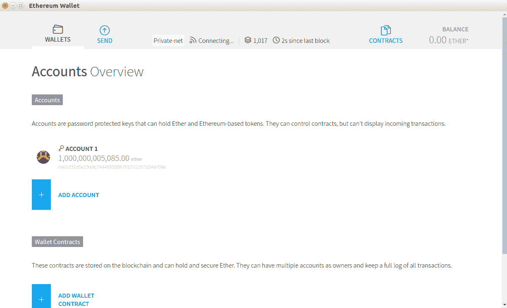
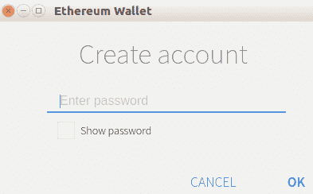
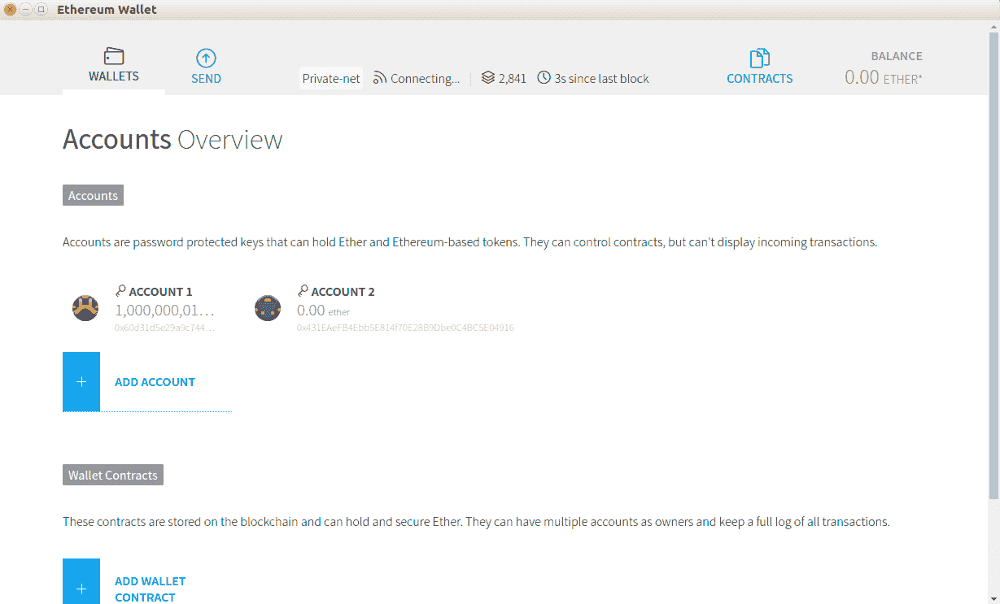
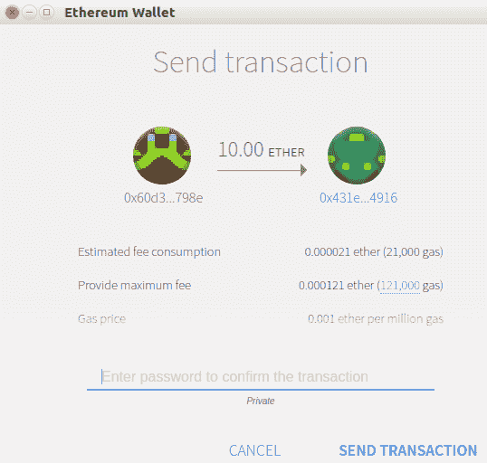
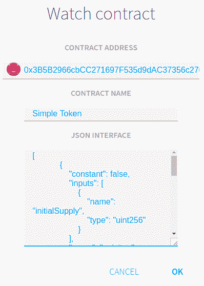
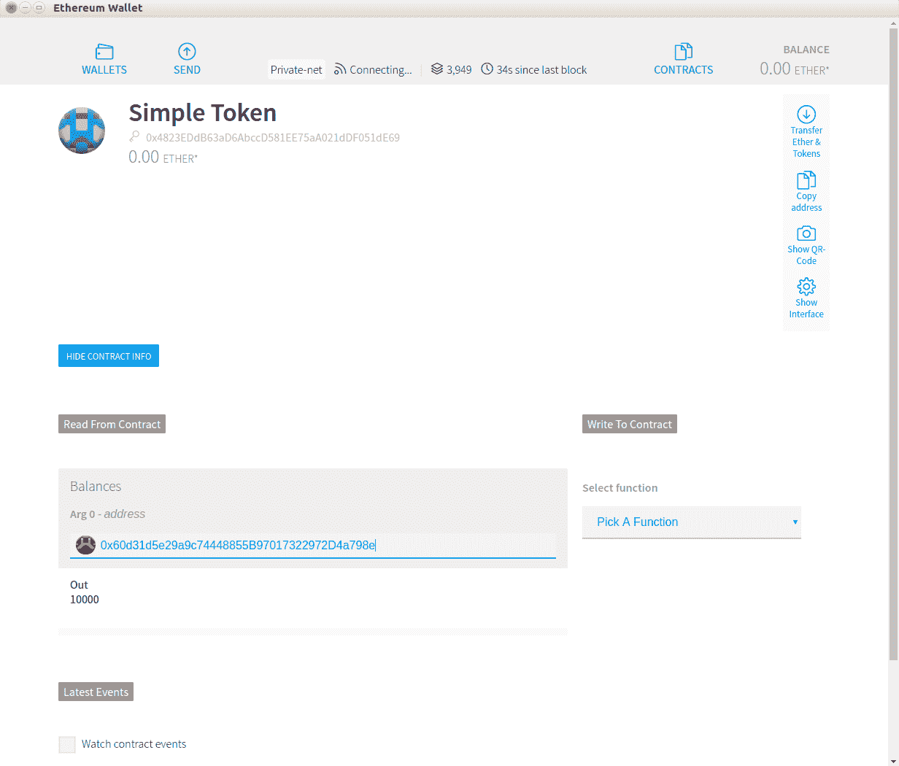
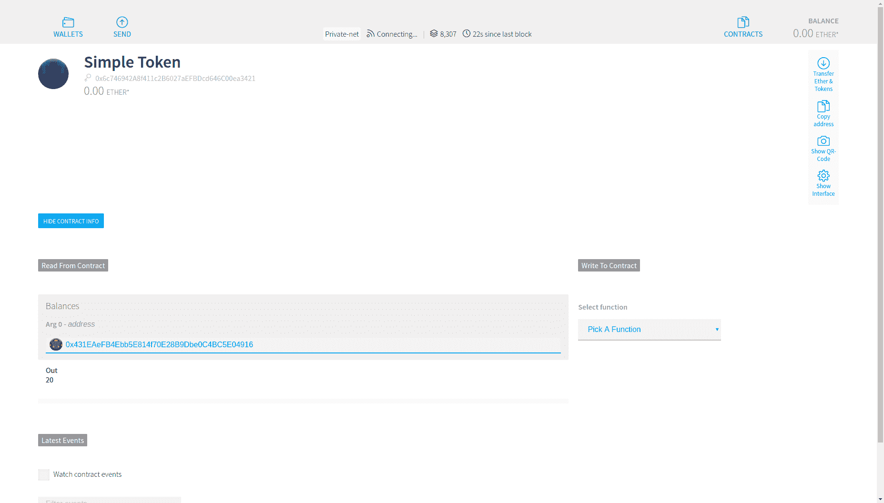
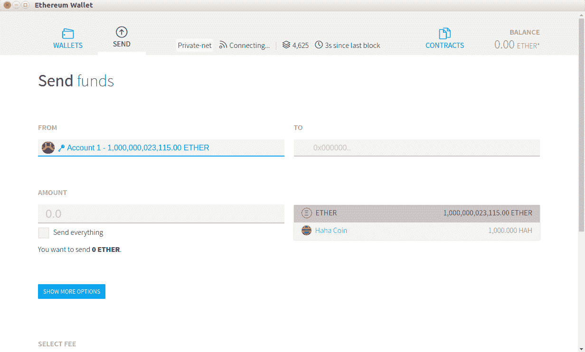

# 在以太坊中创建令牌

在本章中，您将学习如何在以太坊之上创建令牌。代币有多种用途；它可能是本地社区中的本地货币，可能代表实物，可能是游戏中的虚拟货币，也可能是忠诚点数。使用此令牌，您可以构建新的加密货币。虽然以太坊本身就是一种加密货币，但您可以在其上构建一种新的加密货币。以太坊使创建新代币变得容易得多，这推动了 2017 年许多新加密货币的创建。

本章将涵盖以下主题：

*   如何创建简单的令牌智能合约
*   ERC 20（以太坊代币标准）
*   如何出售代币
*   如何自定义您的令牌

# 令牌智能合约

使用 Vyper 在以太坊之上创建令牌很容易。在构建令牌之前，让我们按照初始步骤准备开发环境。

首先确保已安装 geth 并且`geth`程序位于`$PATH`环境变量中（这意味着您可以在没有完整路径的情况下调用`geth`：

```py
$ virtualenv -p python3.6 token-venv
$ source token-venv/bin/activate
(token-venv) $ pip install eth-abi==1.2.2
(token-venv) $ pip install eth-typing==1.1.0
(token-venv) $ pip install py-evm==0.2.0a33
(token-venv) $ pip install web3==4.7.2
(token-venv) $ pip install -e git+https://github.com/ethereum/populus#egg=populus
(token-venv) $ pip install vyper
(token-venv) $ mkdir token_project
(token-venv) $ cd token_project
(token-venv) $ mkdir tests contracts
(token-venv) $ cp ../token-venv/src/populus/populimg/defaults.v9.config.json project.json
```

通过将`compilation`键的值更改为以下值，将 Vyper 支持添加到`project.json`：

```py
"compilation": {
    "backend": {
      "class": "populus.compilation.backends.VyperBackend"
    },
    "contract_source_dirs": [
      "./contracts"
    ],
    "import_remappings": []
},
```

The latest version of Vyper is 0.1.0b6 and it breaks Populus. The developer needs some time to fix this problem. If the bug has still not been fixed by the time you are reading this book, you can patch Populus yourself.

首先，使用以下命令检查错误是否已修复：

```py
(token-venv) $ cd voting-venv/src/populus
(token-venv) $ grep -R "compile(" populus/compilation/backends/vyper.py
 bytecode = '0x' + compiler.compile(code).hex()
 bytecode_runtime = '0x' + compiler.compile(code, bytecode_runtime=True).hex()
```

在我们这里的例子中，这个 bug 还没有被修复。那么，让我们修补 Populus 以修复该漏洞。确保您仍在同一目录中（`token-venv/src/populus`：

```py
(token-venv) $ wget https://patch-diff.githubusercontent.com/raw/ethereum/populus/pull/484.patch
(token-venv) $ git apply 484.patch
(token-venv) $ cd ../../../
```

在`token_project`目录中，运行以下命令：

```py
(token-venv) $ populus chain new localblock
```

然后，使用`init_chain.sh`脚本初始化私有链：

```py
(token-venv) $ ./chains/localblock/init_chain.sh
```

编辑`chains/localblock/run_chain.sh`*并将`--ipcpath`的值更改为`/tmp/geth.ipc`。*

 *然后，运行区块链：

```py
(voting-venv) $ ./chains/localblock/run_chain.sh
```

现在，编辑`project.json`文件。`chains`有一个对象有四个键：`tester`、`temp`、`ropsten`和`mainnet`。将一个名为`localblock`的键及其值添加到此对象：

```py
    "localblock": {
      "chain": {
        "class": "populus.chain.ExternalChain"
      },
      "web3": {
        "provider": {
          "class": "web3.providers.ipc.IPCProvider",
        "settings": {
          "ipc_path":"/tmp/geth.ipc"
        }
       }
      },
      "contracts": {
        "backends": {
          "JSONFile": {"$ref": "contracts.backends.JSONFile"},
          "ProjectContracts": {
            "$ref": "contracts.backends.ProjectContracts"
          }
        }
      }
    }
```

# 薄雾

在[第 2 章](02.html)、*智能合约基础*和[第 3 章](03.html)、*使用 Vyper*实现智能合约中，您使用块菌控制台与智能合约进行交互。现在，我们将使用另一个软件与智能合约进行交互。我们将使用的软件是`Mist`，以太坊钱包。

为此，请转至[https://github.com/ethereum/mist/releases](https://github.com/ethereum/mist/releases) 。如果您使用 Linux Ubuntu，请下载`Mist-linux64-0-11-1.deb`文件。

Ensure that `geth` is already installed and that the path of `geth` is in the `$PATH` environment variable, so that you can call `geth` from anywhere.

然后，您可以安装 Mist，如下所示：

```py
$ dpkg -i Mist-linux64-0-11-1.deb
```

接下来，运行应用程序，如下所示：

```py
$ ethereumwallet --rpc /tmp/geth.ipc
```

注意`--rpc /tmp/geth.ipc`标志。我们使用此标志是因为我们使用`/tmp/geth.ipc`中定义的套接字文件运行私有区块链。

运行应用程序后，您将看到此屏幕。您可以通过单击“添加帐户”按钮创建以太坊 blokchain 帐户：



正如您在`geth`控制台中所做的那样，您需要提供密码来创建新帐户：



创建钱包帐户后，您可以通过单击“发送”选项卡将第一个帐户中的一些钱发送到此新帐户：



然后，您可以在“收件人”字段中插入新帐户的地址。不要忘记包括要发送的乙醚量，然后单击窗口底部的发送按钮：


您必须填写密码才能创建交易。默认账号的密码可以在`chains/localblock/password`文件中找到：



很快，您的交易将在区块链中得到确认：


让我们在`token_project/contracts`目录中创建一个简单的令牌智能合约：

```py
balances: public(map(address, uint256))

@public
def __init__():
    self.balances[msg.sender] = 10000

@public
def transfer(_to: address, _amount: uint256) -> bool:
    assert self.balances[msg.sender] >= _amount

    self.balances[msg.sender] -= _amount
    self.balances[_to] += _amount

    return True
```

此智能合约以数字方式创建 10000 枚代币，并将其全部提供给智能合约的所有者。然后，所有者可以使用`transfer`方法将硬币转发给其他帐户。

与创建简单令牌的传统 web 应用程序相比，此简单智能契约是特殊的，因为一旦部署此智能契约，所有者就无法更改令牌数量，无论他们多么绝望。如果所有者刚刚执行了`transfer`方法将一些硬币转移到另一个帐户的地址，他们将无法再次取回。在与智能合约互动之前，其他人可以验证智能合约中的游戏规则。

将其与我们在传统 web 应用程序中创建的简单令牌进行比较。在这里创建 10000 枚硬币后，您可以通过更新数据库中的硬币数量来更改代币数量。您可以根据自己的喜好更改规则，这会使希望与此应用程序交互的其他人处于不利地位。

您还可以添加一种方法来增加智能合约中的代币数量：

```py
balances: public(map(address, uint256))
owner: address

@public
def __init__():
    self.balances[msg.sender] = 10000
    self.owner = msg.sender

@public
def transfer(_to: address, _amount: uint256) -> bool:
    assert self.balances[msg.sender] >= _amount

    self.balances[msg.sender] -= _amount
    self.balances[_to] += _amount

    return True

@public
def mint(_new_supply: uint256):
    assert msg.sender == self.owner
    self.balances[msg.sender] = _new_supply
```

请看`mint`方法。这可用于增加所有者余额中的代币。

不同之处在于，在部署智能合约后，您无法更改游戏规则。如果部署此版本的智能合约，人们可能会要求提供源代码和编译器版本以验证代码。如果你不提供源代码，人们可能会拒绝你的智能合约。如果你提供了源代码，人们可以检查并看到你有一种方法，可以随时增加你的硬币。他们是否接受这一规则取决于他们，但至少在智能合约的情况下，这是透明的。

下面的代码块是对这个简单令牌智能合约的测试；这个测试并不详尽，但它为您提供了一个良好的开端。令牌智能合约测试的重要性至关重要。首先，将测试命名为`test_simple_token.py`并将其放入`token_project/tests`目录中。有关完整代码，请参阅以下 GitLab 链接中的代码文件：[https://gitlab.com/arjunaskykok/hands-on-blockchain-for-python-developers/blob/master/chapter_08/token_project/tests/test_simple_token.py](https://gitlab.com/arjunaskykok/hands-on-blockchain-for-python-developers/blob/master/chapter_08/token_project/tests/test_simple_token.py) ：

```py
import pytest
import eth_tester

def test_balance(web3, chain):
    simple_token, _ = chain.provider.get_or_deploy_contract('SimpleToken')

...
...

    with pytest.raises(eth_tester.exceptions.TransactionFailed):
        simple_token.functions.transfer(web3.eth.coinbase, 10).transact({'from': account2})
```

让我们使用 Mist 将我们的简单代币智能合约（第一个，没有`mint`功能）部署到区块链。

要执行此操作，请单击“合同”选项卡，然后单击“部署新合同”按钮：


在 Deploy contract 屏幕中，选择要从中部署的帐户，然后单击 contract BYTE CODE 选项卡。在那里插入我们的简单令牌智能合约的字节码。当然，您可以先编译智能合约的源代码，然后从`token_project/build/contracts.json`获取我们的简单令牌字节码。用`bytecode`键找到值，复制不带双引号的值，粘贴到合同字节码页签中。完成此操作后，单击 DEPLOY 按钮（在以下屏幕截图中不可见；您必须向下滚动），并像往常一样在密码对话框中填写密码：


很快，您的智能合约创建将在区块链中得到确认。

然后，要与智能合约交互，请单击合约选项卡，然后单击观察合约按钮。然后会出现一个对话框。填写智能合约的地址，然后填写智能合约本身的名称。你可以在这里用任何你喜欢的名字。接下来，在 JSON 接口字段中填写智能合约的`json`接口。您可以从`token_project/build/contracts.json`获取`json`接口（在`contracts.json`文件中定位`abi`键的值）。查看智能合约的表单如下所示：



现在，屏幕上将显示您的简单令牌智能合约。单击简单令牌标签进入此智能合约的屏幕：



您可以使用`Balances`方法读取智能合约所有者的余额（Mist 喜欢使用大写方法）。在 Arg 0-address 字段中插入所有者帐户的地址，然后按 Enter 键。由此，您将获得 10000 作为输出。

现在，让我们转移一些代币。选择一个函数。现在只有一个函数：`Transfer`（大写的`transfer`方法）。在“执行发件人”字段中选择“帐户 1”，在“收件人”字段中选择“帐户 2”地址，并在“金额”字段中插入 20。最后，单击执行按钮：


等待确认后再检查目标帐户的余额。在余额字段中键入目标地址，然后按 Enter 键。这将给您`20`作为输出：



# ERC20

你很可能听说过 ERC20。当一种新的加密货币问世时，通常会出现的第一个问题是它是 ERC20 代币吗？人们对 ERC20 代币的看法不正确；他们认为这是一种基于以太坊的加密货币。嗯，从技术上讲，这是真的，但它并不能说明全部情况。ERC20 是以太坊中用于创建令牌的标准。我们刚刚创建的简单令牌不符合 ERC20 标准。是的，它是数字代币智能合约，但不是 ERC20 代币。ERC20 是 2017 年新加密货币数量增加的众多原因之一。但是，ERC20 不是在以太坊之上创建令牌的要求。

要创建 ERC20 令牌，必须实现以下方法：

```py
function totalSupply() public view returns (uint256)
function balanceOf(address _owner) public view returns (uint256 balance)
function transfer(address _to, uint256 _value) public returns (bool success)
function transferFrom(address _from, address _to, uint256 _value) public returns (bool success)
function approve(address _spender, uint256 _value) public returns (bool success)
function allowance(address _owner, address _spender) public view returns (uint256 remaining)
event Transfer(address indexed _from, address indexed _to, uint256 _value)
event Approval(address indexed _owner, address indexed _spender, uint256 _value)
```

这些方法使用 Solidity 语法。以下代码块中给出了一些可选方法，您也可以实现这些方法：

```py
function name() public view returns (string)
function symbol() public view returns (string)
function decimals() public view returns (uint8)
```

那么这个 ERC20 代币有什么特别之处呢？这是创建令牌智能合约时的义务吗？为什么我们不能在不满足 ERC20 标准的情况下创建数字令牌？

实际上，你不必遵循这个标准；没有法律强制您创建 ERC20 令牌。例如，ERC20 标准要求您在`totalSupply`方法中告诉用户代币的总量。但是，您可以创建一个名为`taylorSwiftIsTheBest`的方法来返回令牌的总供应量，然后您可以创建一个文档来解释此方法。

但是，如果遵循 ERC20 代币标准，则有一些优势：

*   首先，它让用户更容易审核您的智能合约。
*   其次，您的 ERC20 代币将由以太坊钱包自动识别，例如`Mist`（我们刚才使用的那个）和 Metamask（以太坊钱包是一个`Firefox/Opera/Chrome`插件）。
*   第三，加密货币交易所更容易列出您的代币。基本上，它让每个人的生活都更轻松。

但是，您应该将 ERC20 标准作为指导，而不是严格的法律。您不必遵循 ERC20 标准，即可达到 100%。并非所有构建在以太坊之上的流行代币都 100%符合 ERC20 标准。一个这样的例子是傀儡代币智能合约。除其他外，这并不实现`approve`方法。您可以通过以下链接阅读魔像令牌智能合约的源代码：[https://etherscan.io/token/0xa74476443119A942dE498590Fe1f2454d7D4aC0d#readContract](https://etherscan.io/token/0xa74476443119A942dE498590Fe1f2454d7D4aC0d#readContract) 。

话虽如此，让我们创建一个 ERC20 令牌。此代码已根据 Vyper 项目（[中包含的官方示例进行了修改 https://github.com/ethereum/vyper/blob/master/examples/tokens/ERC20.vy](https://github.com/ethereum/vyper/blob/master/examples/tokens/ERC20.vy) ）。有关完整修改的代码，请参阅以下 GitLab 链接中的代码文件：[https://gitlab.com/arjunaskykok/hands-on-blockchain-for-python-developers/blob/master/chapter_08/token_project/contracts/ERC20Token.vy](https://gitlab.com/arjunaskykok/hands-on-blockchain-for-python-developers/blob/master/chapter_08/token_project/contracts/ERC20Token.vy) ：

```py
Transfer: event({_from: indexed(address), _to: indexed(address), _value: uint256})
Approval: event({_owner: indexed(address), _spender: indexed(address), _value: uint256})

...
...

@public
@constant
def allowance(_owner: address, _spender: address) -> uint256:
    return self.allowed[_owner][_spender]
```

让我们逐行描述此智能合同：

```py
Transfer: event({_from: indexed(address), _to: indexed(address), _value: uint256})
Approval: event({_owner: indexed(address), _spender: indexed(address), _value: uint256})
```

您必须定义两种类型的事件，`Transfer`和`Approval`。如果愿意，可以定义更多事件。发生硬币转账时使用`Transfer`事件，因此智能合约用户可以订阅此事件。`Approval`事件用于批准账户支出金额：

```py
name: public(bytes[10])
symbol: public(bytes[3])
totalSupply: public(uint256)
decimals: public(uint256)
balances: map(address, uint256)
allowed: map(address, map(address, uint256))
```

有六个变量。第一个变量是令牌的名称。我使用`bytes[10]`作为数据类型，因为我的令牌的名称小于 10 字节。请随意更改长度。第二个变量是令牌的符号；名称和符号不同。例如，以太坊加密货币的名称是以太坊，但符号是以太坊。通常，符号的字符长度为 3。第三个变量是`totalSupply`，它是令牌的总量，第四个变量是小数。您知道，1 比特币等于 100000000 satoshis，因此在比特币算法中总共将创建 21000000 比特币。因此，我们可以说比特币算法的总供给量为 210000000000000000000000000000000000000000000000000000000。小数点是 8（因为 1 比特币是 100000000，或 10<sup>8</sup>。此外，第五个变量是`balances`。这是跟踪帐户地址余额的变量。最后一个变量是`allowed`，它是一个嵌套映射。这是为了跟踪已被批准从另一个帐户的余额中使用以太的帐户，直到达到一定金额。如果这仍然不清楚，我们将在稍后深入讨论。现在，我们将继续讨论此 ERC20 令牌智能合约的初始化方法，如以下代码块所示：

```py
@public
def __init__():
    _initialSupply: uint256 = 1000
    _decimals: uint256 = 3
    self.totalSupply = _initialSupply * 10 ** _decimals
    self.balances[msg.sender] = self.totalSupply
    self.name = 'Haha Coin'
    self.symbol = 'HAH'
    self.decimals = _decimals
    log.Transfer(ZERO_ADDRESS, msg.sender, self.totalSupply)
```

这就是我们在智能合约中初始化令牌的方式。我们在空中创造了代币，然后把代币的所有硬币都给了主人。然后，我们设置令牌的名称和符号以及十进制数。最后，我们发出传输事件。地址是`ZERO_ADDRESS is 0x000000000000000000000000000000000000000`。这表明智能合约的所有者不知从何处转移了硬币：

```py
@public
@constant
def balanceOf(_owner: address) -> uint256:
    return self.balances[_owner]
```

此方法用于返回特定帐户的余额：

```py
@public
def transfer(_to: address, _amount: uint256) -> bool:
    assert self.balances[msg.sender] >= _amount
    self.balances[msg.sender] -= _amount
    self.balances[_to] += _amount
    log.Transfer(msg.sender, _to, _amount)

    return True
```

这是转移硬币的方法。首先，你要确保寄件人的余额有足够的硬币来消费。然后，您只需从传输进程的数量中减去发送方的余额，然后将该金额添加到目的地的余额中。不要忘记将此事务与事件一起记录：

```py
@public
def transferFrom(_from: address, _to: address, _value: uint256) -> bool:
    assert _value <= self.allowed[_from][msg.sender]
    assert _value <= self.balances[_from]

    self.balances[_from] -= _value
    self.allowed[_from][msg.sender] -= _value
    self.balances[_to] += _value
    log.Transfer(_from, _to, _value)

    return True

@public
def approve(_spender: address, _amount: uint256) -> bool:
    self.allowed[msg.sender][_spender] = _amount
    log.Approval(msg.sender, _spender, _amount)

    return True
```

让我们先看一下这个方法。因此，每个帐户都有一个名为`allowed`的映射，但这个映射用于什么？这是每个账户如何让其他账户花钱的问题。例如，假设有 5 个帐户帐户 A、帐户 B、帐户 C、帐户 D 和帐户 E。

账户 A 有 50 个硬币的余额和一个名为`allowed`的映射变量，该变量有账户 B、账户 C、账户 D 和账户 E 密钥。此映射的值如下所示：

帐户 B→ 3 枚硬币
账户 C→ 7 枚硬币
账户 D→ 2 枚硬币
账户 E→ 3 枚硬币

这意味着账户 B 最多可以从账户 A 的余额中支出 3 枚硬币，账户 C 最多可以从账户 A 的余额中支出 7 枚硬币，账户 D 最多可以从账户 A 的余额中支出 2 枚硬币，账户 E 最多可以从账户 A 的余额中支出 3 枚硬币。

在`approve`方法中，我们有以下行：

```py
self.allowed[msg.sender][_spender] = _amount
```

为了确保账户 B 可以从账户 A 的余额中消费 3 枚硬币，账户 A 称为`approve`方法，将`_spender`设置为账户 B 的地址，`_amount`设置为 3 枚硬币。不要忘记记录此批准。

然后，如果账户 B 想要花费部分或全部 3 枚硬币，账户 B 可以调用`transferFrom`方法，如下所示：

```py
assert _value <= self.allowed[_from][msg.sender]
```

`transferFrom`方法中的第一个断言是确保账户 B 花费的硬币不超过 3 枚：

```py
assert _value <= self.balances[_from]
```

我们确保账户 A 余额中至少有 3 枚硬币，如下所示：

```py
    self.balances[_from] -= _value
    self.allowed[_from][msg.sender] -= _value
    self.balances[_to] += _value
    log.Transfer(_from, _to, _value)
```

然后，我们从账户 A 的余额中减去支出金额，将账户 A 的备抵额减去账户 B。然后，我们增加目的地账户的余额。不要忘记将此事务记录为`Transfer`事件。

最后一种方法是检查该余量的映射：

```py
@public
@constant
def allowance(_owner: address, _spender: address) -> uint256:
    return self.allowed[_owner][_spender]
```

这是为了确定账户 B 可以从账户 A 的余额中支出多少。

在这一点上，您可能会问这个方法的意义是什么。如果我们想允许帐户 B 以帐户 A 的名义使用一些以太，为什么不将硬币的数量转移到帐户 B？例如，如果账户 A 允许账户 B 使用账户 A 余额中的 5 枚硬币，这意味着账户 A 允许账户 B 将账户 A 余额中的 5 枚硬币直接发送到账户 B 的地址。那么，为什么账户 A 不直接将 5 枚硬币发送到账户 B 的地址以省去麻烦呢？如果帐户 B 改变主意，他们可以将代币的金额退还给帐户 A。

通常情况下，我们不会允许正常账户代表我们消费。然而，我们确实允许智能合约这样做。有很多正当的理由可以解释为什么我们想让一个智能合约来花我们的钱。其中一个原因是分散式 exchange 智能合约案例，您希望让分散式 exchange 智能合约销售您的代币。假设你已经创造了 1000 枚 HHH 硬币，然后你想在分散交换中出售其中的一些。所以，你允许这个分散的交易所为你花费一些硬币。也许你会批准分散化的交易所花费 30 HHH 硬币。这个分散的交易所可以试着代表您销售 30 枚 HHH 硬币。你不会因为只想卖出 30 枚 HHH 硬币，就允许分散的 exchange 智能合约访问你余额中的所有硬币。虽然您可以审核智能合约以确保智能合约不会试图窃取您的硬币，但最好有另一层安全保护。`approve`方法就是这样一层。

像以前一样，编译您的令牌智能合约并部署它。

完成此操作后，转到“合同”选项卡并单击“监视令牌”按钮。在添加令牌窗口中，插入 ERC20 智能合约的地址。然后，将自动填写其他字段，如令牌名称、令牌符号和最小单位的小数位数。这是我们应该实施 ERC20 标准的原因之一：


添加代币后，您应该会在合同屏幕上看到哈哈币标签：


然后，在“发送”选项卡中，选择 ERC20 智能合约的所有者，然后选择“哈哈币”而不是“以太币”。将 1000 枚哈哈硬币发送至账户 2，然后等待确认：



现在，在同一选项卡中选择 Account2；您将看到帐户 2 现在有 1000 个哈哈硬币：


所有与 ERC20 兼容的钱包，如 Mist 和 MetaMask，都可以轻松识别您的代币并与之交互。加密货币交换的幕后人员在将您的 ERC20 硬币集成到他们的交换中时也不会有任何技术困难。假设您没有遵循 ERC20 标准，并且您将一种转移硬币的方法命名为`tailorSwiftTransferCoin`。在这种情况下，您必须为用户构建自定义钱包，然后他们才能与您的令牌交互。

这是对这个 ERC20 令牌的测试。记住，这个测试并不全面。完整代码请参考以下 GitLab 链接中的代码文件：[https://gitlab.com/arjunaskykok/hands-on-blockchain-for-python-developers/blob/master/chapter_08/token_project/tests/test_erc20_token.py](https://gitlab.com/arjunaskykok/hands-on-blockchain-for-python-developers/blob/master/chapter_08/token_project/tests/test_erc20_token.py) ：

```py
import pytest
import eth_tester

def test_balance(web3, chain):
    erc20_token, _ = chain.provider.get_or_deploy_contract('ERC20Token')

    token_name = erc20_token.functions.name().call()
    token_symbol = erc20_token.functions.symbol().call()
    decimals = erc20_token.functions.decimals().call()
    total_supply = erc20_token.functions.totalSupply().call()
    balance = erc20_token.functions.balanceOf(web3.eth.coinbase).call()

...
...

    assert balance_account1 == 999990
    assert balance_account2 == 0
    assert balance_account3 == 10
    assert allowance == 90
```

除了转移硬币的方法外，本测试还测试了`approval`和`transferFrom`方法。

# 卖代币

现在我们有了代币，是时候卖硬币了。我们想出售我们的以太定制代币。与比特币平台相比，在以太坊平台上创建众包代币非常容易。您已经知道如何在智能合约中创建一个方法来接受以太。您还知道如何增加某些帐户的代币余额。要销售代币，您必须将这两种东西结合起来。这就是全部。

这是**首次硬币发行**（**ICO**的核心。以太坊的货币是有价值的。尽管乙醚价格波动，但 1 乙醚的价值约为 100 美元。人们会为一些以太支付真金白银，但不是我们的定制代币。为了使我们的定制令牌有价值，我们必须首先使其有用，或者至少使其看起来有用。但要做到这一点，我们需要资金。那么，为什么不把我们的一些代币（比如 60%）卖给早期采用者呢？然后，他们可以用以太购买我们的定制代币。然后，我们可以在把以太换成法定货币之前收回以太，这样我们就可以雇佣更多的程序员并租一间办公室来开发我们的新加密货币。这是基本思想。当然，由于 ICO 涉及大量资金，它也吸引了捕食者。

这是众筹代币智能合约。这与我们之前的 ERC20 令牌智能合约的源代码相同，但略有变化。将此智能合约命名为`CrowdSaleToken.vy`并保存在`token_project/contracts`目录中。有关完整代码，请参阅以下 GitLab 链接中的代码文件：[https://gitlab.com/arjunaskykok/hands-on-blockchain-for-python-developers/blob/master/chapter_08/token_project/contracts/CrowdSaleToken.vy](https://gitlab.com/arjunaskykok/hands-on-blockchain-for-python-developers/blob/master/chapter_08/token_project/contracts/CrowdSaleToken.vy) ：

```py
Transfer: event({_from: indexed(address), _to: indexed(address), _value: uint256})
Approval: event({_owner: indexed(address), _spender: indexed(address), _value: uint256})
Payment: event({_buyer: indexed(address), _value: uint256(wei)})

name: public(bytes[10])
symbol: public(bytes[3])
totalSupply: public(uint256)
decimals: public(uint256)
balances: map(address, uint256)
ethBalances: public(map(address, uint256(wei)))
allowed: map(address, map(address, uint256))

...
...

@public
@constant
def allowance(_owner: address, _spender: address) -> uint256:
    return self.allowed[_owner][_spender]
```

让我们逐行讨论此智能合同：

```py
Transfer: event({_from: indexed(address), _to: indexed(address), _value: uint256})
Approval: event({_owner: indexed(address), _spender: indexed(address), _value: uint256})
Payment: event({_buyer: indexed(address), _value: uint256(wei)})
```

我们在另外两个事件的基础上添加了一个名为`Payment`的事件。当有人用以太支付代币时，将调用此事件：

```py
name: public(bytes[10])
symbol: public(bytes[3])
totalSupply: public(uint256)
decimals: public(uint256)
balances: map(address, uint256)
ethBalances: public(map(address, uint256(wei)))
allowed: map(address, map(address, uint256))

beneficiary: public(address)
minFundingGoal: public(uint256(wei))
maxFundingGoal: public(uint256(wei))
amountRaised: public(uint256(wei))
deadline: public(timestamp)
price: public(uint256(wei))
fundingGoalReached: public(bool)
crowdsaleClosed: public(bool)
```

我们添加了两个新变量，它们是`ethBalances`、`beneficiary`、`minFundingGoal`、`maxFundingGoal`、`amountRaised`、`deadline`、`price`、`fundingGoalReached`和`crowdsaleClosed`。

`ethBalances`是一个变量，用于跟踪买家在此智能合约中花费了多少以太。我们希望跟踪这个数字，因为如果我们无法筹集到必要的金额，我们希望退还以太币。`beneficiary`是一个用于跟踪谁启动此智能合同的变量。此`beneficiary`变量是唯一能够提取乙醚的帐户。

`minFundingGoal`和`maxFundingGoal`是变量，旨在确保筹集的金额大于最低融资目标，低于最高融资目标。

`amountRaised`是一个变量，用于跟踪我们在这个智能合约中筹集了多少以太。

`deadline`是一个用于跟踪此众筹流程截止日期的变量。

`price`是我们希望通过以太来评估数字代币价值的方式。此变量用于回答买家使用一台乙醚可以获得多少代币。

`fundingGoalReached`是一个`boolean`变量，表示我们的智能合约是否达到了我们的目标。

`crowdsaleClosed`是一个`boolean`变量，说明我们的智能合约是否仍然收到购买过程。我们将从初始化方法开始：

```py
@public
def __init__():
    _initialSupply: uint256 = 100
    _decimals: uint256 = 2
    self.totalSupply = _initialSupply * 10 ** _decimals
    self.name = 'Haha Coin'
    self.symbol = 'HAH'
    self.decimals = _decimals
    self.beneficiary = msg.sender
    self.balances[msg.sender] = self.totalSupply
    self.minFundingGoal = as_wei_value(30, "ether")
    self.maxFundingGoal = as_wei_value(50, "ether")
    self.amountRaised = 0
    self.deadline = block.timestamp + 3600 * 24 * 100 # 100 days
    self.price = as_wei_value(1, "ether") / 100
    self.fundingGoalReached = False
    self.crowdsaleClosed = False
```

该智能合约中的硬币总供应量为 10000 枚。我们想筹集至少 30 个以太，最多 50 个以太。

最后期限设置为自智能合约部署在区块链上之日起 100 天。`block.timestamp`约为当前时间，或包含此智能合约代码的区块被确认的时间。

一枚硬币的价格设定为`0.01`以太。这意味着 1 乙醚可以购买 100 枚我们的代币。然后，我们进入智能合约中的默认函数：

```py
@public
@payable
def __default__():
    assert msg.sender != self.beneficiary
    assert self.crowdsaleClosed == False
    assert self.amountRaised + msg.value < self.maxFundingGoal
    assert msg.value >= as_wei_value(0.01, "ether")
    self.ethBalances[msg.sender] += msg.value
    self.amountRaised += msg.value
    tokenAmount: uint256 = msg.value / self.price
    self.balances[msg.sender] += tokenAmount
    self.balances[self.beneficiary] -= tokenAmount
    log.Payment(msg.sender, msg.value)
```

这是用户可以用来购买令牌的方法。`__default__`是默认的回退功能。如果有人没有在智能合约上执行方法并支付以太，则将执行此功能。实际上，我们不必使用默认函数来接受付款。您可以使用标准方法，就像您在以前的智能合约中所做的那样。我们只是使用默认函数来解释这个概念。

在这种支付方式中，我们确保买方不是受益人，众售仍在进行，并且通过发送到这种方式的以太筹集的金额不超过 50 以太的最大融资目标。最后，每个购买操作必须至少为 0.01。然后，我们增加了该买家的以太余额，并增加了所筹得的以太数量。然后，我们将以太的数量除以 1 枚硬币的价格来检查他们购买的硬币数量。

最后，我们必须增加该买家的代币余额，减少智能合约所有者的代币余额。不要忘记记录此事件。然后，我们进入一种方法，在该方法中，我们可以检查我们是否达到了目标：

```py
@public
def checkGoalReached():
    assert block.timestamp > self.deadline
    if self.amountRaised >= self.minFundingGoal:
        self.fundingGoalReached = True
    self.crowdsaleClosed = True
```

首先，我们要确保这个方法只有在截止日期已经过去的情况下才能成功执行。如果筹集的金额超过最低融资目标，我们将`fundingGoalReached`变量设置为`true`。然后，最后，我们将`crowdsaleClosed`变量设置为`true`。

为了简单起见，我们只检查`block.timestamp`变量是否大于截止日期。然而，块中的时间戳可以填充矿工喜欢的任何内容；不必是确认块的当前时间。但是，当然，如果矿工将过去的时间戳作为`block.timestamp`的值，那么所有其他矿工都会拒绝它。类似地，如果矿工给出了未来的时间戳作为`block.timestamp`的值，那么所有其他矿工也会拒绝该时间戳，而该时间戳确实很遥远（例如，提前一年）。为了使检查截止日期过程更加安全，您必须将其与`block.number`相结合，以检查自此智能合约启动以来已确认了多少区块。然后，我们进入智能合约经理可以提取智能合约中积累的以太的方法：

```py
@public
def safeWithdrawal():
    assert self.crowdsaleClosed == True
    if self.fundingGoalReached == False:
        if msg.sender != self.beneficiary:
            if self.ethBalances[msg.sender] > 0:
                self.ethBalances[msg.sender] = 0
                self.balances[self.beneficiary] += self.balances[msg.sender]
                self.balances[msg.sender] = 0
                send(msg.sender, self.ethBalances[msg.sender])
    if self.fundingGoalReached == True:
        if msg.sender == self.beneficiary:
            if self.balance > 0:
                send(msg.sender, self.balance)
```

`safeWithdrawal`方法的运行方式有所不同，这取决于是否实现了资助目标。在前面的方法中，我们确保众筹已经结束。如果没有达到融资目标，我们将确保每个买家都能拿回他们的以太。如果达到了融资目标，那么我们确保受益人可以撤回智能合同中的所有以太网。其余方法与上一个智能合约中的方法相同。但是，我们添加了一些断言，以确保这些方法只能在众筹结束后执行。

下面的代码块是此 crowdsale 智能合约的测试。完整的代码文件请参考以下 GitLab 链接中的代码文件：[https://gitlab.com/arjunaskykok/hands-on-blockchain-for-python-developers/blob/master/chapter_08/token_project/tests/test_crowd_sale_token.py](https://gitlab.com/arjunaskykok/hands-on-blockchain-for-python-developers/blob/master/chapter_08/token_project/tests/test_crowd_sale_token.py) ：

```py
import pytest
import eth_tester
import time

def test_initialization(web3, chain):
    crowd_sale_token, _ = chain.provider.get_or_deploy_contract('CrowdSaleToken')

...
...

    assert abs(beforeCrowdsaleEthBalanceAccount2 - afterCrowdsaleEthBalanceAccount2 - web3.toWei('40', 'ether')) < web3.toWei('1', 'gwei')
    assert abs(afterCrowdsaleEthBalanceAccount1 - beforeCrowdsaleEthBalanceAccount1 - web3.toWei('40', 'ether')) < web3.toWei('1', 'gwei')
```

请看`test_withdrawal`和`test_refund`，尤其是这些行：

```py
    # move forward 101 days
    web3.testing.timeTravel(int(time.time()) + 3600 * 24 * 101)
    web3.testing.mine(1)
```

我们不想等待 100 天，而是希望在测试中操纵时钟，相信截止日期已经到了（从现在起 101 天）。因此，我们假装已经过了 101 天，然后确认 1 个区块。因此，智能合约中的`block.timestamp`变量将在 101 天后生效。

# 稳定硬币

您已经创建了可以自主销售的数字令牌。但是，您不应该将自己局限于通用令牌。通过添加更多的方法来增加智能合约的趣味性，您可以在代币智能合约中更具创造性。您应该添加哪些方法取决于智能合约的目的。在游戏中作为货币使用的代币智能合约与在供应链跟踪系统中使用的代币智能合约具有不同的方法。

让我们创建一个稳定的硬币智能合约。这是一个与法定货币（如美元）挂钩的象征性智能合约。我们还希望这一智能合约成为一家银行，作为所有者，我们可以冻结账户。

我们可以根据 ERC 20 代币智能合同开展工作。我们只需要添加三种方法——冻结账户的方法、添加硬币的方法和丢弃硬币的方法。

这就是智能合约。完整的代码文件可以参考以下 GitLab 链接中的代码文件：[https://gitlab.com/arjunaskykok/hands-on-blockchain-for-python-developers/blob/master/chapter_08/token_project/contracts/StableCoin.vy](https://gitlab.com/arjunaskykok/hands-on-blockchain-for-python-developers/blob/master/chapter_08/token_project/contracts/StableCoin.vy) ：

```py
Transfer: event({_from: indexed(address), _to: indexed(address), _value: uint256})
Approval: event({_owner: indexed(address), _spender: indexed(address), _value: uint256})
Freeze: event({_account: indexed(address), _freeze: bool})

name: public(bytes[10])
symbol: public(bytes[3])
totalSupply: public(uint256)
decimals: public(uint256)
balances: map(address, uint256)
allowed: map(address, map(address, uint256))
frozenBalances: public(map(address, bool))
owner: public(address)

...
...

@public
@constant
def allowance(_owner: address, _spender: address) -> uint256:
    return self.allowed[_owner][_spender]
```

让我们逐行讨论智能合同：

```py
Transfer: event({_from: indexed(address), _to: indexed(address), _value: uint256})
Approval: event({_owner: indexed(address), _spender: indexed(address), _value: uint256})
Freeze: event({_account: indexed(address), _freeze: bool})
```

我们需要在前面的代码中添加另一个冻结帐户操作的事件。

我们在 ERC20 代币智能合约的变量之上添加了两个新变量，分别为`frozenBalances`和`owner`：

```py
name: public(bytes[10])
symbol: public(bytes[3])
totalSupply: public(uint256)
decimals: public(uint256)
balances: map(address, uint256)
allowed: map(address, map(address, uint256))
frozenBalances: public(map(address, bool))
owner: public(address)
```

`frozenBalances`是一个映射变量，用于跟踪哪些帐户已冻结。`owner`是跟踪智能合约所有者的变量。

在此初始化方法中，我们将`owner`变量设置为启动此智能合约的账户：

```py
@public
def __init__():
    _initialSupply: uint256 = 1000
    _decimals: uint256 = 3
    self.totalSupply = _initialSupply * 10 ** _decimals
    self.balances[msg.sender] = self.totalSupply
    self.name = 'Haha Coin'
    self.symbol = 'HAH'
    self.decimals = _decimals
    self.owner = msg.sender
    log.Transfer(ZERO_ADDRESS, msg.sender, self.totalSupply)
```

在以下方法中，我们确保只有所有者可以调用此方法：

```py
@public
def freezeBalance(_target: address, _freeze: bool) -> bool:
    assert msg.sender == self.owner
    self.frozenBalances[_target] = _freeze
    log.Freeze(_target, _freeze)

    return True
```

然后，我们设置`frozenBalances`映射变量的值。真值表示帐户已冻结。别忘了召集`Freeze`活动。

下一种方法是增加硬币数量：

```py
@public
def mintToken(_mintedAmount: uint256) -> bool:
    assert msg.sender == self.owner
    self.totalSupply += _mintedAmount
    self.balances[msg.sender] += _mintedAmount
    log.Transfer(ZERO_ADDRESS, msg.sender, _mintedAmount)

    return True
```

我们也增加了总供应量和业主账户的余额。

以下方法设计用于焚烧硬币：

```py
@public
def burn(_burntAmount: uint256) -> bool:
    assert msg.sender == self.owner
    assert self.balances[msg.sender] >= _burntAmount
    self.totalSupply -= _burntAmount
    self.balances[msg.sender] -= _burntAmount
    log.Transfer(msg.sender, ZERO_ADDRESS, _burntAmount)

    return True
```

这与前面的方法类似，但其目的是减少总供应量中的硬币数量。为什么要消灭硬币？这有许多正当的理由。假设您使用此智能合约跟踪美元。假设你口袋里有 10000 美元。因此，智能合同中的总供应量为 10000 美元（1 枚硬币与 1 美元挂钩），但有一天，你 10000 美元中的 2000 美元被小偷偷走了。为了确保智能合约的一致性，您可以使用此方法烧掉 2000 枚硬币。

其余方法与 ERC20 令牌智能合约下的方法完全相同，只有两个例外：`transfer`和`transferFrom`。我们在这些方法中还有其他断言：

```py
assert self.frozenBalances[msg.sender] == False
```

以下代码块是此智能合约的测试。您可以参考以下 GitLab 链接中的代码文件获取完整代码：[https://gitlab.com/arjunaskykok/hands-on-blockchain-for-python-developers/blob/master/chapter_08/token_project/tests/test_stable_token.py](https://gitlab.com/arjunaskykok/hands-on-blockchain-for-python-developers/blob/master/chapter_08/token_project/tests/test_stable_token.py) ：

```py
import pytest
import eth_tester
import time

def test_initialization(web3, chain):
    stable_coin, _ = chain.provider.get_or_deploy_contract('StableCoin')

...
...

    new_total_supply = stable_coin.functions.totalSupply().call()
    assert new_total_supply == 999900
```

# 总结

在本章中，您学习了如何在以太坊之上创建令牌。您使用以太坊钱包部署合约并与代币智能合约交互。然后，通过创建特定方法的实现，在创建令牌智能合约时实现了 ERC 20 标准。您还看到了这些标准方法如何帮助 Mist 识别您的令牌。然后，您创建了一个为以太出售代币的方法。您在此智能合约中设置了一个截止日期，然后在智能合约测试中使用时间旅行方法模拟过期的截止日期。最后，您添加了其他方法来冻结和解冻其他帐户。您使用的示例是一种稳定的硬币，它将硬币与现实世界的资产（如菲亚特）挂钩。

在下一章中，您将创建一个可以处理以太和 ERC20 代币的加密货币钱包。

# 进一步阅读

*   [https://github.com/ethereum/EIPs/blob/master/EIPS/eip-20.md](https://github.com/ethereum/EIPs/blob/master/EIPS/eip-20.md)
*   [https://ethereum.org/token](https://ethereum.org/token)*