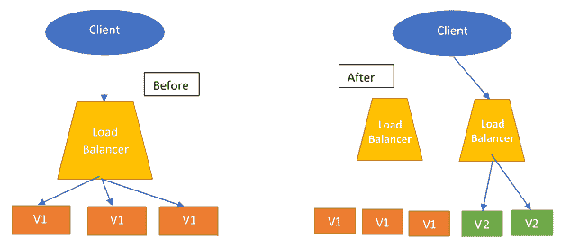
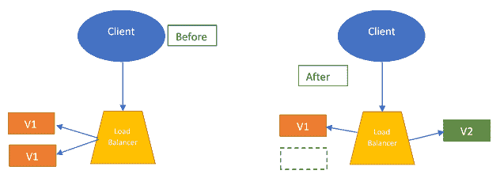
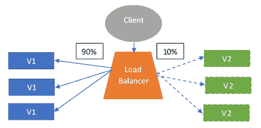

# 十四、部署到云

到目前为止，我们的大部分注意力都集中在应用的开发上，无论是以大型单片应用的形式，还是以基于微服务的应用的形式，其中存在大量服务。为了让这些应用对用户可用，应用需要部署在普通用户可以与应用交互的地方。

在 DevOps 的现代世界中，部署策略和应用的部署位置在定义应用的工作方式和用户访问方式方面起着重要作用。有关应用部署的决策可能会影响基础架构内的许多事情，例如运行特定应用所需的基础架构的复杂性，或者应用内的新功能将如何推出。

在本章的过程中，我们将了解如何为单片应用以及基于微服务的应用创建部署，以及如何实施部署策略，以便在将应用部署到基础架构上时优先考虑其稳定性。我们还将研究如何区分使用容器部署应用的现代方式，并在私有、公共和混合云部署之间做出选择。

作为本章的读者，您将了解以下内容：

*   部署战略的必要性
*   用于部署的容器化应用
*   将测试集成为部署策略的一部分
*   在私有云上部署
*   在公共云上部署
*   向混合云的转变

# 技术要求

为了理解本章，至少需要一个云提供商提供有关使用 Docker 进行集装箱化的知识以及关于如何使用 CLI 的知识。

# 部署企业应用

在本书的整个过程中，我们看到了如何使用不同的原则开发企业应用，无论是应用开发的单一方式还是通过使用小型微服务来开发应用。但这些东西在一个共同点上趋同。为了使我们的应用可供一般使用，它们需要部署在开发环境之外的某个地方，供一般用户访问。

此基础结构和为特定应用选择的部署类型需要提供一组特定的功能，以便成功部署：

*   **高正常运行时间：**部署应用的任何基础设施都需要提供高正常运行时间，以便为其用户提供近乎无中断的应用服务。如果基础架构易受频繁停机的影响，则可能会导致应用的可用性严重停机，并可能导致依赖于应用的进程停止，直到运行应用的基础架构恢复联机。
*   **低延迟：**为应用提供服务的基础设施的延迟应较低，以便能够向用户提供足够的响应时间。如果基础架构延迟很高，用户可能会一直等待与应用交互，或者应用生成的响应可能会严重影响他们的生产效率。
*   **容错性：**部署基础设施应该是容错的，并且应该能够从少数节点的偶然故障中恢复。如果没有容错能力，即使基础架构中只有一个问题，也足以使整个应用停机，从而给应用的用户带来严重的可靠性问题。

这些只是部署应用时需要考虑的基础设施的一组基本需求。由于为基础设施选择了特定的部署策略，可能会有额外的需求，但是对这些需求的讨论超出了本书的范围。

到目前为止，我们已经听过很多*部署策略*这个词，但是当我们说需要为应用选择合适的部署策略时，我们到底是什么意思呢？让我们花点时间来探索一下。

# 选择部署策略

一旦我们知道我们现在已经准备好将应用投入生产，我们现在的任务就是确定我们将要使用的应用部署策略。

应用的部署策略通常会根据我们拥有的应用的类型，为应用的部署制定规则。这些部署策略涵盖了使应用在生产中可用所需的步骤类型的信息，还可能涵盖了有关如何在应用中推出新功能的其他一些重要领域。

所以，让我们花些时间讨论一下可用的不同部署策略。。。

# 不同的部署策略

在软件开发领域内，没有一种解决方案适合所有人，即使在选择部署应用时要遵循的部署策略类型时也是如此。

我们选择的每一种部署策略都会有一些与之相关的优缺点。有些部署策略没有提供很大的灵活性，但易于实施，而其他部署策略非常灵活，但在实施过程中可能会成为一个难题。作为开发人员，选择取决于我们希望如何部署应用。在本章中，我们将主要介绍六种部署策略，即：

*   重新创建的部署
*   滚动部署
*   蓝色/绿色部署
*   金丝雀部署
*   A/B 部署
*   影子部署

所以，让我们花点时间熟悉一下它们。

# 重新创建的部署

这是部署应用的最传统方法。在此部署策略中，我们只需销毁旧版本的应用并引入新版本的应用，然后将所有用户请求路由到新版本的应用。下图显示了重新创建部署策略的表示形式：

这种策略对于遵循单片开发方法的应用的部署非常有用，因为对于每个新特性或升级，都需要重新部署整个应用。

使用重新创建部署的优势。。。

# 滚动部署

在部署应用的滚动部署模型中，我们不会突然删除应用旧版本的所有实例，以用新版本替换它们。相反，我们采取一种渐进的方法，在整个基础架构中推出新的应用版本。

在此过程中，我们首先在**负载平衡器**后面启动升级应用的新实例，一旦它准备好接受流量，我们将删除该应用旧版本的等效实例。此过程将继续，直到应用的所有旧实例都替换为新实例。下图显示了滚动部署策略的表示形式：

这种部署策略对于单片应用来说也是一个很好的选择，以防我们希望通过应用升级实现较低的停机时间，因为应用是在基础架构内部逐步推出的。

滚动部署提供了几个好处，例如：

*   **容易恢复错误升级：**如果应用的升级版本出现错误或故障，我们可以在中期轻松回滚升级。这是可能的，因为新版本是在基础架构内部逐步推出的。
*   **易于设置：**通过了解运行应用的基础架构，此部署策略易于设置和自动化，其中基础架构的不同部分会逐一更新。

# 蓝色/绿色部署

蓝色/绿色部署策略是一个有趣的策略。此策略实现了用于测试应用和在生产中启动应用的多种技术的混合。

在蓝色/绿色部署方法中，更新的应用被引入基础架构中，其实例数量与旧版本的应用相同。完成后，应用的新版本将在基础架构内进行测试。一旦发现版本稳定，通信量就会从较旧版本切换到较新版本的应用，并停用较旧版本的应用。下图显示了蓝色/绿色。。。

# 金丝雀部署

在这种部署方法中，我们遵循与蓝色/绿色部署相同的策略，但有一点小小的变化。在蓝色/绿色部署中，测试是在内部进行的，一旦应用的新版本被标记为稳定，所有请求都被用于一次性切换到新版本。

在金丝雀部署方法中，测试基于实际用户请求进行。**负载平衡器**配置为将一定百分比的请求重定向到已部署在基础设施中的金丝雀版本，以查看新版本在存在实际请求时的性能

下图显示了金丝雀部署策略的表示：

这种部署方法通常用于基于微服务的应用，当应用的内部测试被认为是不够的，并且运行应用的基础结构的稳定性存在疑问时。

这种测试方法提供了在生产用例中测试应用的优势，同时允许在应用未达到预期结果时轻松回滚。

使用这种方法进行部署的缺点是增加了基础设施内部的复杂性，现在需要智能化，将部分传入请求路由到应用的金丝雀版本。

# A/B 部署

A/B 部署方法与金丝雀部署方法有很多相似之处，在金丝雀部署方法中，应用的新版本被引入到生产基础设施中，并且一定数量的传入请求被重定向到金丝雀版本。

在 A/B 部署中，将应用的升级版本（版本 B）引入到生产基础架构中，然后配置负载平衡器，以根据某些预定义标准将特定请求集重定向到升级版本。

当我们不确定升级的版本将如何影响特定的用户子集时，就需要这种部署方法。例如，使用智能手机的用户将如何受到升级的。。。

# 影子部署

在影子部署方法中，我们引入了一种新的方法。与 canary 部署或 A/B 部署（其中一定数量的请求由旧版本处理，一定数量的请求由新版本的应用处理）相比，我们在生产基础架构中有两个版本的应用。这些是旧版本和新版本，其中包含最新的更新。

在影子部署中，应用的更新版本会看到与发送到应用的旧稳定版本完全相同的请求，需要注意的是，新版本的应用实例执行的任何处理都不会影响仅由生产内部的稳定实例处理的请求响应。下图显示了影子部署策略的表示：

这种部署方法通常是基于微服务的应用的首选方法，并且在开发人员希望测试应用在应用负载变化时的行为时使用。

这种部署还用于检查应用在实际用例中的行为是否正确，而实际用例无法在内部环境中测试。

采取这种方法的唯一缺点是，这类部署的基础架构成本增加，因为我们需要全面运行旧版本和新版本。

现在，有了这些，我们已经习惯了现有的各种部署策略，它们可以帮助我们决定如何在生产环境中部署应用。虽然这些部署策略中的一些侧重于流程的简单性，但另一些则侧重于确保所部署的较新版本足够稳定，并提供尽可能最好的结果。

为应用的部署选择哪种部署策略在很大程度上取决于多个因素，其中包括您可以占用的基础结构成本、维护基础结构所花费的时间以及您计划部署的应用类型。限制可以使用的部署策略选择的另一个重要因素是应用之间的 API 发生了更改。通常，这些类型的更改由 SLA 的使用来管理，如果发生这些更改，则可能需要更新部署策略以适应所做的更改

在撰写本书时，许多组织都将云作为在生产中部署应用的首选基础设施。因此，让我们花一些时间来了解目前存在的各种云基础设施，以及如何决定在部署中使用哪种云基础设施。

# 选择基础设施

应用需要一个可以运行的基础结构。根据存在的应用类型，可能会更改所需的基础结构。为应用的部署选择哪种基础结构在很大程度上受正在部署的应用的类型、应用的复杂性以及应用将支持的用例类型的影响。

在选择应用部署的基础架构时，另一个重要因素是对应用可伸缩性的关注，这包括我们可以扩展应用的复杂性以及我们可以采用的扩展类型。

首先让我们看一看…

# 传统基础设施

在过去，当应用使用大型独石来执行许多业务流程时，开发人员和组织通常求助于由大型大型机或运行在健壮服务器上的虚拟机组成的基础设施，以提供运行应用所需的足够资源。

这些裸机或虚拟机配备了运行应用所必需的所有需求，然后将应用部署在这些机器上，并提供给用户以供一般使用。

这种基础设施选择效果很好，甚至允许多个应用存在于同一台健壮的裸机服务器上，通过使用虚拟机进行隔离，从而抽象出服务器的硬件。

然而，这一方法受到许多问题的困扰，例如：

*   **基础设施成本高**：对于使用裸机系统或虚拟机的部署，基础设施成本高。这些组织要么需要购买那些能够运行这些应用的强大服务器，要么不得不求助于专门的托管提供商，这过去成本很高。
*   **增加的开销**：对于在虚拟机内运行的任何应用，运行支持该应用的成熟虚拟化操作系统所产生的开销非常高，大大减少了可以在同一硬件上共存的应用的数量。
*   **高启动时间**：随着负载的增加，需要生成新的应用实例来处理不断增加的传入请求。但是，启动完整的虚拟机并在其中运行应用实例是一个缓慢的过程，因为启动虚拟机需要执行整个过程。
*   **扩展难度**：在传统基础设施中，可以进行的水平扩展量非常有限，通常只能通过使用垂直扩展来扩展应用，根据需要增加专用于应用的资源。

这些缺点使开发人员考虑了传统部署应用方法的替代方案。

推动这种从使用传统基础设施转向应用打包的容器化方法的另一个主要原因。让我们来看看这是什么。

# 应用包装的容器化方法

随着现代硬件的出现和软件工程的进步，一些操作系统引入了一种轻量级虚拟机替代品。这种替代方案是以容器的形式出现的，它不仅承诺了一种低开销的应用隔离方法，而且还承诺了这样一个事实，即由于容器根本没有抽象底层硬件，因此它们的速度也足够快。

随着应用的开发转向使用微服务体系结构，应用打包的容器化方法变得越来越主流。在这种方法中，每个微服务过去都被打包成一个单独的容器，可以部署。。。

# 向云端移动

在过去十年中，许多云提供商已经出现，以帮助提供应用部署方面的支持。在吸引组织和开发者使用其平台部署应用方面，每一家云提供商都提供了一套独特的功能，使其服务在竞争中脱颖而出。

向云部署模型的转变为负责开发应用的开发人员/组织提供了各种优势，包括：

*   **基础设施维护成本降低**：随着应用部署转移到云端，基础设施维护成本也在降低。这是因为云提供商现在负责维护运行应用的硬件，而单个开发人员和组织不需要购买该硬件并处理可能发生的任何问题。
*   **高正常运行时间**：大多数云提供商保证其基础设施的高正常运行时间，这是因为在他们的终端上进行了大量的基础设施复制。这样做的最终受益者是在云中维护特定应用的开发人员，因为现在他们可以为应用用户提供高正常运行时间，而不必担心如果基础设施出现故障可能会导致的生产力损失。
*   **低延迟**：在云部署方式中，开发者可以为用户提供低延迟的应用。这是通过跨云服务提供商的不同地理数据中心复制应用实例实现的。一旦应用被复制，云服务提供商就会将请求重新路由到离客户端很近的应用服务器，以促进低延迟响应。
*   **轻松扩展**：随着应用负载的增加，可能需要生成新的应用实例来处理增加的负载。云服务提供商通常提供随着应用负载的增加而动态扩展应用的功能，并随着负载的减少而缩小实例的规模。这提供了一个高吞吐量、低成本的解决方案来处理峰值负载，而无需担心传统基础架构中通常需要的手动干预。此外，与传统基础设施相比，与这种扩展相关的响应时间通常较低。

上述所有观点都为应用向基于云的部署的转变提供了强有力的论据。但是，根据组织的需要，他们可能希望也可能不希望自己的应用部署在组织几乎无法控制的第三方服务器上。为了处理这种情况，组织可能会决定转向在其基础设施上运行的自己的私有云，并处理组织内所有应用的部署。因此，让我们花一些时间来了解现有的各种云部署模型。

# 不同类型的云部署

对于企业来说，他们对应用运行的位置非常敏感。这是因为企业处理的数据种类繁多，可能包含大量敏感信息，任何类型的违规行为都可能威胁到企业的业务。作为构建企业应用的开发人员，我们有责任建议并决定应用的部署应使用哪种云部署。目前存在的云类型主要分为两大类：

*   公共云
*   私有云

最近，第三类云也在兴起，称为混合云。那么，让我们来看看……

# 私有云

私有云是由企业严格管理的一组计算资源。这些云运行在企业内部网中，通常位于组织拥有的数据中心或由第三方维护。

这些云实现了一个非常严格的安全策略，该策略定义了如何访问在其上运行的应用以及谁可以访问它们。

通常，企业选择私有云是因为以下几点：

*   企业已经有了自己的数据中心，不想再投资第三方云
*   企业正在运行的应用类型具有高度的安全敏感性，公共云提供商实施的安全策略不可信或不足以满足所需的用例

私有云提供了一系列优势：

*   **更大的灵活性：**由于组织可以决定私有云内部将存在哪些计算资源，因此组织可以保持灵活性，以做出符合其最大利益的决策
*   **提高了安全性：**组织可以在公司防火墙或内部网络后自由运行其云基础设施，安全策略更加严格，这在使用公共云时是不可能的

对于任何处理安全敏感数据且没有成本壁垒的企业来说，私有云是部署和运行应用的良好选择。

# 公共云

在公共云中，计算资源由第三方云服务提供商拥有和管理。作为企业，您部署的应用与许多其他应用共享相同的硬件资源，这些应用可能由您或其他组织开发。

当组织的应用不处理某种安全意识强的数据时，通常会求助于公共云，这些数据可能需要严格的安全策略来防止任何类型的事件，或者运行常用的应用，如电子邮件服务器。

公共云提供的优势可能是巨大的。其中包括：

*   **成本降低：**因为公共云提供商提供的基础设施。。。

# 混合云

混合云部署模型提供了私有云和公共云方法的最佳结合。在这里，来自私有云和公共云的计算资源被汇集在一起，应用可以根据需要从私有云移动到公共云。

企业通常使用这种部署模型在公共云上运行一些安全性较低的应用，而在私有云内运行安全性较低的应用。

通常采用的另一种方法是首先在私有云中部署应用，然后当请求数量增加时，来自公共云中的资源被集中起来，通过在公共云中启动更多进程来扩展应用。

与混合云方法相关的好处如下：

*   **控制**：组织可以控制在私有云中运行安全敏感的应用，而在公共云中运行安全敏感度较低的应用
*   **灵活性**：当需要时，组织可以汇集来自公共云的资源来处理更高的负载
*   **成本效益**：由于公共云的资源只有在应用需求较高时才会汇集，所以组织只有在需要时才使用公共云资源，可以节约公共云的成本

对于可以轻松从一个地方过渡到另一个地方的应用，或者任何需要动态扩展功能同时又能保持安全性的应用，混合云部署方法为基础设施提供了一个很好的选择。

# 总结

在本章中，我们了解了如何做出与企业应用部署相关的决策。我们探讨了不同的部署策略，以及它们如何影响应用在生产环境中的运行方式。接下来，我们了解了六种不同的部署策略，它们可用于部署基于单片和基于微服务的应用，并了解了它们的优缺点。

一旦习惯了部署策略，我们就深入研究了部署应用的基础架构选择，并了解了转向基于微服务的开发方法是如何推动从传统的。。。

# 问题

1.  采用蓝色/绿色部署方法的好处是什么？
2.  在应用投入生产之前，金丝雀部署如何帮助测试应用？
3.  如果我们使用虚拟机的方法运行基于微服务的应用，我们可能会面临哪些问题？
4.  我们如何处理混合云模型中的部署？