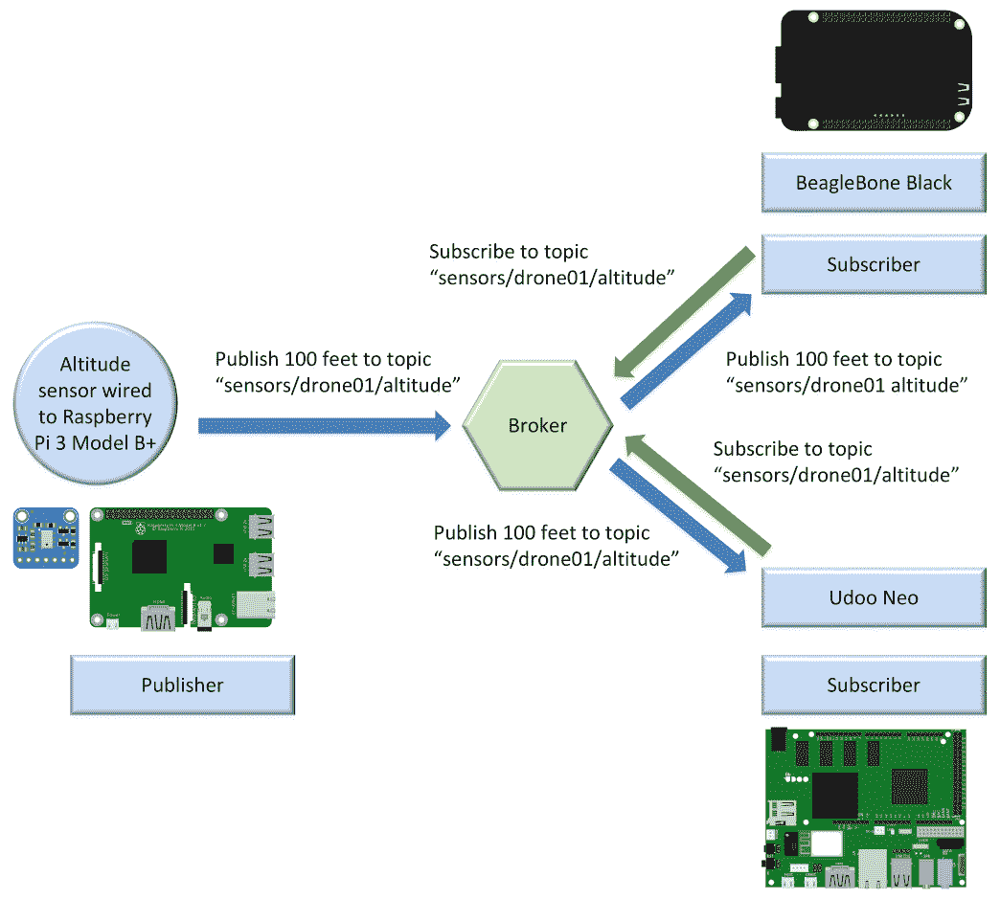
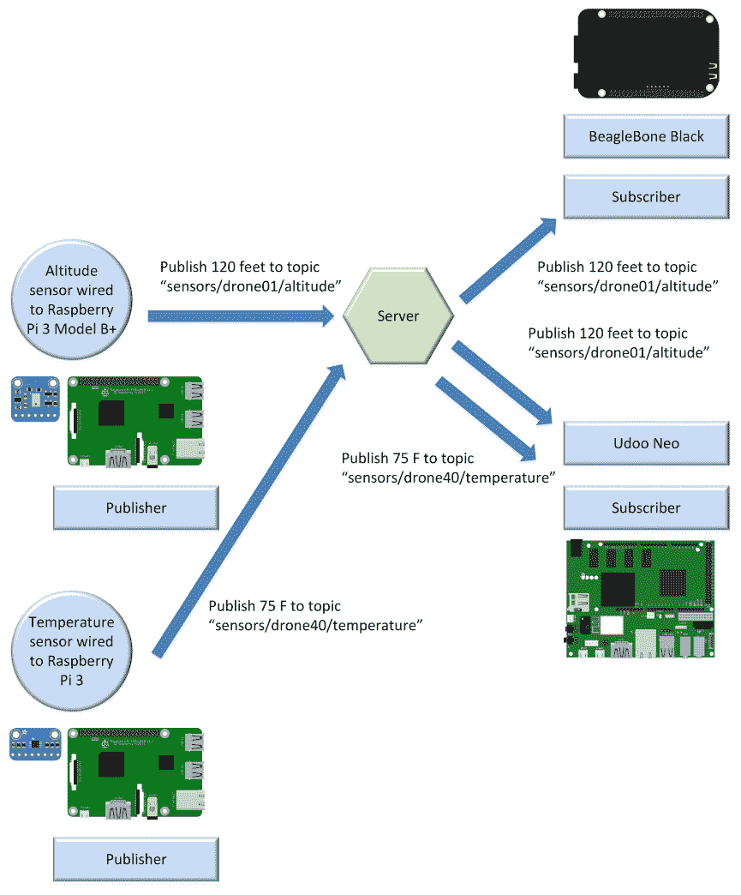
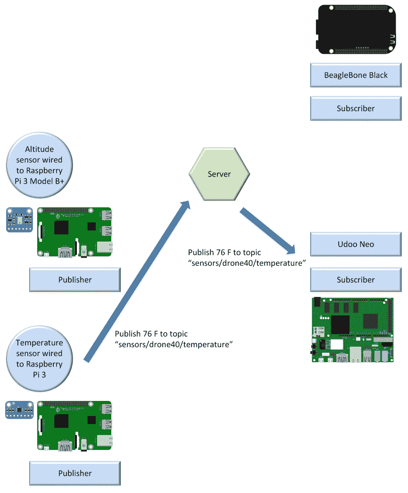
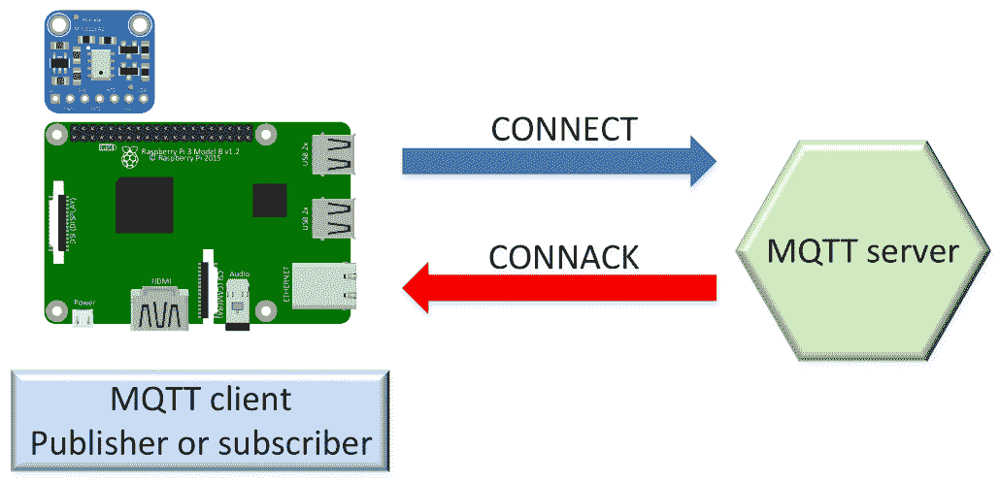
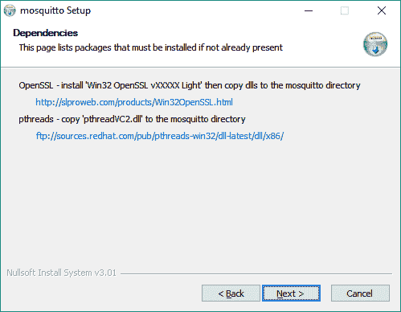

# 安装 MQTT 3.1.1 MOSQUITO 服务器

在本章中，我们将开始在各种物联网解决方案中使用首选物联网发布-订阅轻量级消息传递协议，并结合移动应用程序和 web 应用程序。我们将了解 MQTT 及其轻量级消息传递系统是如何工作的。

我们将理解 MQTT 难题：客户端、服务器（以前称为代理）和连接。我们将学习在 Linux、macOS 和 Windows 中安装 MQTT 3.1.1 MOSQUITO 服务器的过程。我们将学习在云中运行 MOSQUITO 服务器的特殊注意事项（Azure、AWS 和其他云提供商）。我们将了解以下内容：

*   了解 MQTT 协议的方便场景
*   使用发布-订阅模式
*   使用消息过滤
*   理解 MQTT 难题：客户机、服务器和连接
*   在 Linux 上安装 Mosquitto 服务器
*   在 macOS 上安装 Mosquitto 服务器
*   在 Windows 上安装 Mosquitto 服务器
*   在云中运行 MOSQUITO 服务器的注意事项

# 了解 MQTT 协议的方便场景

想象一下，我们有几十种不同的设备，它们之间必须交换数据。这些设备必须从其他设备请求数据，接收请求的设备必须使用该数据进行响应。请求数据的设备必须处理从响应所需数据的设备接收的数据。

这些设备是**物联网**（**物联网**板），有几十个传感器连接到它们。我们有以下具有不同处理能力的物联网板：

*   树莓皮 3 B 型+
*   高通 DragonBoard 410c
*   乌杜尼奥
*   小猎犬骨黑
*   Phytec phyBoard-i.MX7-Zeta
*   e-con 系统 ESOMIX6 micro
*   MinnowBoard 大菱鲆四核

每个板都必须能够发送和接收数据。此外，我们希望 web 应用程序能够发送和接收数据。我们希望通过互联网近实时地发送和接收数据，我们可能会面临一些网络问题：我们的无线网络有些不可靠，我们有一些高延迟环境。一些设备的功率较低，其中许多由电池供电，而且它们的资源稀缺。此外，我们必须小心使用网络带宽，因为有些设备使用计量连接。

计量连接是一种网络连接，每月的数据使用量有限。如果我们检查这些数据量，我们会得到额外的账单。

我们可以使用 HTTP 请求并构建发布-订阅模型来在不同的设备之间交换数据。但是，有一种协议专门设计为比 HTTP 1.1 和 HTTP/2 协议更轻。**MQ 遥测传输**（**MQTT**）更适合于许多设备必须通过互联网近实时地在它们之间交换数据，并且我们需要消耗尽可能少的网络带宽的场景。当涉及不可靠的网络且连接断断续续时，此协议比 HTTP 1.1 和 HTTP/2 工作得更好。

MQTT 协议为**机对机**（**M2M**和物联网连接协议。MQTT 是一种轻量级消息传递协议，使用基于服务器的发布-订阅机制，运行在**TCP/IP**（**传输控制协议**/**互联网协议**之上）。下图显示了 TCP/IP 堆栈顶部的 MQTT 协议：


The most popular versions of MQTT are 3.1.1 and 3.1\. In this book, we will work with MQTT 3.1.1\. Whenever we reference MQTT, we are talking about MQTT 3.1.1, the newest version of the protocol. The MQTT 3.1.1 specification has been standardized by the OASIS consortium. In addition, MQTT 3.1.1 became an ISO standard (ISO/IEC 20922) in 2016.

MQTT 比 HTTP 1.1 和 HTTP/2 协议更轻，因此，每当我们必须使用发布-订阅模型近实时地发送和接收数据时，它是一个非常有趣的选项，同时需要尽可能少的占用空间。MQTT 在物联网、M2M 和嵌入式项目中非常流行，但在需要可靠消息传递和高效消息分发的 web 应用程序和移动应用程序中也越来越流行。总之，MQTT 适用于需要进行数据交换的以下应用程序域：

*   资产跟踪和管理
*   汽车远程信息处理
*   化学检测
*   环境及交通监察
*   野战部队自动化
*   火气试验
*   家庭自动化
*   **车载信息娱乐****IVI**
*   医学的
*   消息传递
*   **销售点**（**POS**亭
*   铁路
*   **射频识别**（**RFID**）
*   **监控与数据采集**（**SCADA**）
*   老虎机

总而言之，MQTT 的设计适合于支持物联网、M2M、嵌入式和移动应用中的以下典型挑战：

*   轻量级，使传输大量数据成为可能，而不会产生巨大的开销
*   以巨大的容量分发最小的数据包
*   支持异步、双向、低延迟推送消息的面向事件的范例
*   轻松地将数据从一个客户端发送到多个客户端
*   使其能够在事件发生时监听事件（面向事件的体系结构）
*   支持始终连接和有时连接的模型
*   通过不可靠的网络发布信息，并通过脆弱的连接提供可靠的传递
*   与电池供电设备配合使用或需要低功耗
*   提供响应能力，使信息的近实时传递成为可能
*   为所有数据提供安全和隐私保护
*   能够提供必要的可扩展性，以便将数据分发到成千上万的客户端

# 使用发布-订阅模式

在深入研究 MQTT 之前，我们必须了解发布-订阅模式，也称为发布-订阅模式。在发布-订阅模式中，发布消息的客户端与接收消息的其他客户端分离。客户不知道其他客户的存在。客户端可以发布特定类型的消息，并且只有对该特定类型消息感兴趣的客户端才会接收已发布的消息。

发布-订阅模式需要一个*服务器*，也称为**代理**。所有客户端都与服务器建立连接。通过服务器发送消息的客户端称为**发布者**。服务器过滤传入消息，并将其分发给对该类型接收消息感兴趣的客户端。向服务器注册并对特定类型的消息感兴趣的客户端称为**订户**。因此，发布服务器和订阅服务器都与服务器建立连接。

用一个简单的图表很容易理解事物是如何工作的。下图显示了连接到服务器的一个发布服务器和两个订阅服务器：



**Raspberry Pi 3 型号 B+**板与高度传感器相连，是与服务器建立连接的发布者。**BeagleBone Black**板和**Udoo Neo**板是与服务器建立连接的两个订户。

**BeagleBone Black**板向服务器表示，它希望订阅属于**传感器/无人机 01/高度**主题的所有消息。**Udoo Neo**板向服务器指示相同的情况。因此，两个板都订阅了**传感器/无人机 01/高度**主题。

*主题*是一个命名的逻辑通道，也称为通道或主题。服务器将只向订阅服务器发送发布到其订阅主题的消息。

**树莓皮 3 B+型**板以**100 英尺**为有效载荷，以**传感器/无人机 01/高度**为主题发布消息。该板（即发布者）将发布请求发送到服务器。

The data for a message is known as the **payload**. A message includes the topic to which it belongs and the payload.

服务器将消息分发给订阅了**传感器/无人机 01/高度**主题的两个客户端：**BeagleBone Black**和**Udoo Neo**板。

出版商和订阅者在空间上是分离的，因为他们彼此不认识。发布者和订阅者不必同时运行。发布者可以发布消息，订阅者可以稍后接收消息。此外，发布操作与接收操作不同步。

发布者请求服务器发布消息，订阅了相应主题的不同客户端可以在不同的时间接收消息。发布者可以将消息作为异步操作发送，以避免在服务器收到消息之前被阻止。但是，也可以将消息作为与服务器的同步操作发送到服务器，并仅在操作成功后继续执行。在大多数情况下，我们希望利用异步操作。

需要向数百个客户端发送消息的发布服务器只需向服务器执行一次发布操作即可完成此任务。服务器负责将已发布的消息发送给订阅了相应主题的所有客户端。因为发布者和订阅者是解耦的，所以发布者不知道是否有订阅者将侦听它将要发送的消息。因此，有时有必要使订阅者也成为发布者，并发布指示其已接收和处理消息的消息。具体要求取决于我们正在构建的解决方案的类型。MQTT 提供了许多特性，使我们在分析的许多场景中的生活更加轻松。我们将在整本书中使用这些不同的功能。

# 使用消息过滤

服务器必须确保订阅者只接收他们感兴趣的消息。可以根据发布-订阅模式中的不同条件过滤消息。我们将重点分析基于*主题的*过滤，也称为基于主题的过滤。

考虑每个消息属于一个主题。当发布者请求服务器发布消息时，它必须同时指定主题和消息。服务器接收消息并将其传递给订阅了消息所属主题的所有订阅者。

服务器不需要检查消息的有效负载就可以将消息传递给相应的订阅者；它只需要检查每个已到达的消息的主题，并在将其发布到相应的订阅者之前进行过滤。

订阅者可以订阅多个主题。在这种情况下，服务器必须确保订阅者接收到属于其订阅的所有主题的消息。使用另一个简单的图表很容易理解事物是如何工作的。

下图显示了两个尚未发布任何消息的未来发布者、一台服务器和两个连接到服务器的订阅服务器：


两个发布者分别是一块连接有高度传感器的**树莓皮 3 B+**型电路板和一块连接有温度传感器的**树莓皮 3**型电路板。**BeagleBone Black**板和**Udoo Neo**板是与服务器建立连接的两个订户。

**BeagleBone Black**板向服务器表示，它希望订阅属于**传感器/无人机 01/高度**主题的所有消息。**Udoo Neo**板向服务器表示，它希望订阅属于以下两个主题之一的所有消息：**传感器/无人机 01/高度**和**传感器/无人机 40/温度**。因此，**Udoo Neo**板块订阅了两个主题，而**BeagleBone Black**板块只订阅了一个主题。

下图显示了两个发布服务器通过服务器将消息连接并发布到不同主题后发生的情况：



**树莓皮 3 B+型**板以**120 英尺**为有效载荷，以**传感器/无人机 01/高度**为主题发布消息。线路板（即发布者）将发布请求发送到服务器。服务器将消息分发给订阅了**传感器/无人机 01/高度**主题的两个客户端：**BeagleBone Black**和**Udoo Neo**板。

**树莓皮 3**板以**75 F**为有效载荷，以**传感器/无人机 40/温度**为主题发布消息。线路板（即发布者）将发布请求发送到服务器。服务器将消息分发给订阅了**传感器/无人机 40/温度**主题的唯一客户端：**Udoo Neo**板。因此，**Udoo Neo**板从服务器接收两条消息，一条属于**传感器/无人机 01/高度**主题，另一条属于**传感器/无人机 40/温度**主题。

下图显示了一个发布者通过服务器向主题发布消息，而该主题只有一个订阅者后发生的情况：



**树莓皮 3**板发布一条信息，有效载荷为**76 F**，主题为**传感器/无人机 40/温度**。线路板（即发布者）将发布请求发送到服务器。服务器将消息分发给订阅了**传感器/无人机 40/温度**主题的唯一客户端：**Udoo Neo**板。

# 了解 MQTT 难题–客户端、服务器和连接

在低于 3.1.1 的 MQTT 协议版本中，MQTT 服务器被称为 MQTT 代理。从 MQTT 3.1.1 开始，MQTT 代理被重命名为 MQTT 服务器，因此我们将其称为服务器。但是，我们必须考虑到，MQTT 服务器、工具和客户端库的文档可以使用旧的 MQTT 代理名称来引用服务器。MQTT 服务器也称为消息代理。

MQTT 服务器使用前面介绍的基于主题的筛选来筛选消息并将其分发给适当的订阅者。有许多 MQTT 服务器实现通过提供自定义插件来提供额外的消息过滤功能。但是，我们将重点关注作为 MQTT 协议需求一部分的特性。

如前所述，在 MQTT 中，发布者和订阅者是完全解耦的。发布服务器和订阅服务器是仅与 MQTT 服务器建立连接的 MQTT 客户端。MQTT 客户机可以同时是发布者和订阅者，也就是说，客户机可以将消息发布到特定主题，还可以接收属于客户机已订阅的主题的消息。

有一些 MQTT 客户机库可用于最流行的编程语言和平台。在选择 MQTT 客户机库时，我们必须考虑的最重要的事情之一是它们支持的 MQTT 特性列表以及我们需要的解决方案。有时，我们可以为特定的编程语言和平台在许多库中进行选择，其中一些库可能无法实现所有功能。在本书中，我们将使用最完整的现代 Python 版本库，这些版本支持广泛的平台。

任何具有 TCP/IP 堆栈且能够使用 MQTT 库的设备都可以成为 MQTT 客户机，即发布服务器、订阅服务器或发布服务器和订阅服务器。MQTT 库使设备能够在 TCP/IP 之上与 MQTT 通信，并与特定类型的 MQTT 服务器交互。例如，除其他设备外，以下任何设备均可成为 MQTT 客户机：

*   Arduino 董事会
*   树莓皮 3 型 B+板
*   小猎犬骨黑板
*   乌杜近地天体委员会
*   iPhone
*   iPad
*   安卓平板电脑
*   安卓智能手机
*   运行 Windows 的笔记本电脑
*   运行 Linux 的服务器
*   运行 macOS 的 MacBook

有许多 MQTT 服务器可用于最流行的平台，包括 Linux、Windows 和 macOS。其中许多是可以用作 MQTT 服务器的服务器，它们还提供了额外的未来。MQTT 服务器可能只实现 MQTT 功能的一个子集，并且可能有特定的限制。因此，在选择 MQTT 服务器之前，检查解决方案中需要的所有功能非常重要。和其他中间件一样，我们有开源版本、免费版本和付费版本。因此，我们还必须确保根据预算和具体需求选择适当的 MQTT 服务器。

在本书中，我们将使用 Eclipse Mosquitto MQTT 服务器（[http://www.mosquitto.org](http://www.mosquitto.org) ）。MOSQUITO 是一个开源 MQTT 服务器，具有与 MQTT 版本 3.1.1 和 3.1 兼容的 EPL/EDL 许可证。我们可以利用我们在任何其他 MQTT 服务器上学到的一切，例如**Erlang MQTT Broker**（**EMQ**），也称为 Emqttd（[http://www.emqtt.io](http://www.emqtt.io) 和 HiveMQ（[http://hivemq.com](http://hivemq.com) 等。此外，我们可能会利用我们的知识使用基于云的 MQTT 服务器，例如 CloudMQTT（[http://www.cloudmqtt.com](http://www.cloudmqtt.com) 或 PubNub MQTT 桥（[http://pubnub.com](http://pubnub.com) 。我们也将专门与基于云的 MQTT 提供商合作。

MQTT 服务器是我们前面分析的发布-订阅模型的中心枢纽。MQTT 服务器负责 MQTT 客户机的身份验证和授权，这些客户机在经过身份验证和授权后将能够成为发布者和/或订阅者。因此，MQTT 客户机必须做的第一件事是与 MQTT 服务器建立连接。

为了建立连接，MQTT 客户机必须向 MQTT 服务器发送一个`CONNECT`控制数据包，该数据包的有效负载必须包括启动连接和进行身份验证和授权所需的所有信息。MQTT 服务器将检查`CONNECT`数据包，执行身份验证和授权，并使用`CONNACK`控制数据包向客户端发送响应，我们将在了解`CONNECT`控制数据包后对其进行详细分析。如果 MQTT 客户端发送无效的`CONNECT`控制数据包，服务器将自动关闭连接。

下图显示了 MQTT 客户端和 MQTT 服务器之间建立连接的交互：



在 MQTT 客户机和 MQTT 服务器之间成功建立连接后，服务器将保持连接打开，直到客户机失去连接或向服务器发送`DISCONNECT`控制数据包以关闭连接。

`CONNECT`控制数据包必须包括有效载荷中以下字段的值，以及控制数据包中包含的特殊标志字节的位。我们希望理解这些字段和标志的含义，因为在 Python 中使用 MQTT 工具和 MQTT 客户端库时，我们将能够指定它们的值：

*   `ClientId`：客户机标识符，也称为客户机 ID，是一个字符串，用于标识连接到 MQTT 服务器的每个 MQTT 客户机。连接到 MQTT 服务器的每个客户机必须具有唯一的`ClientId`，服务器使用它来标识与客户机和服务器之间的 MQTT 会话相关的状态。如果客户机将空值指定为`ClientId`，MQTT 服务器必须生成唯一的`ClientId`来标识客户机。但是，此行为取决于为`CleanSession`字段指定的值。
*   `CleanSession`：clean session 标志是一个布尔值，用于指定 MQTT 客户机断开与 MQTT 服务器的连接，然后重新连接后发生的情况。如果将`CleanSession`设置为`1`或`True`，则客户端向 MQTT 服务器指示会话将仅在网络连接处于活动状态时持续。MQTT 客户机与 MQTT 服务器断开连接后，将丢弃与会话相关的任何信息。从同一 MQTT 客户机到 MQTT 服务器的新连接将不使用上一个会话中的数据，而是一个新的干净会话。如果`CleanSession`设置为`0`或`False`，我们将使用持久会话。在这种情况下，MQTT 服务器存储 MQTT 客户机的所有订阅，当 MQTT 客户机断开连接时，MQTT 服务器存储以特定服务质量级别到达的所有消息，这些服务质量级别与发生断开连接时 MQTT 客户机拥有的订阅相匹配。这样，当同一 MQTT 客户机与 MQTT 服务器建立新连接时，MQTT 客户机将具有相同的订阅，并将接收失去连接时无法接收的所有消息。在[第 2](2.html)章*中，我们将深入探讨消息的服务质量级别及其与清除会话标志或持久会话选项的关系，使用命令行和 GUI 工具了解 MQTT 的工作原理*。

当 clean session 标志设置为`0`或`False`时，客户端向服务器指示它想要一个持久会话。我们只需要记住，干净会话与持久会话相反。

*   `UserName`：如果客户端想要指定用户名从 MQTT 服务器请求身份验证和授权，则必须将`UserName`标志设置为`1`或`True`，并为`UserName`字段指定一个值
*   `Password`：如果客户端想要指定密码以请求 MQTT 服务器的身份验证和授权，则必须将`Password`标志设置为`1`或`True`，并为`Password`字段指定一个值

我们将用一整章的篇幅专门讨论 MQTT 安全性，因此我们只提及`CONNECT`控制数据包中包含的字段和标志。

*   `ProtocolLevel`：协议级别值表示 MQTT 客户端请求 MQTT 服务器使用的 MQTT 协议版本。请记住，我们将始终使用 MQTT 版本 3.1.1。
*   `KeepAlive`：`KeepAlive`是以秒为单位的时间间隔。如果`KeepAlive`的值不等于`0`，MQTT 客户端承诺在`KeepAlive`指定的时间内向服务器发送控制包。如果 MQTT 客户机不必发送任何控制数据包，它必须向 MQTT 服务器发送一个`PINGREQ`控制数据包，一个 ping 请求，告知 MQTT 服务器客户机连接处于活动状态。MQTT 服务器通过对 MQTT 客户端的`PINGRESP`响应来响应`PINGREQ`控制数据包，这是一个 ping 响应，用于告诉 MQTT 客户端与 MQTT 服务器的连接处于活动状态。当不存在这些控制数据包时，连接关闭。如果`KeepAlive`的值为`0`，则保持活动机制关闭。
*   `Will`、`WillQoS`、`WillRetain`、`WillTopic`和`WillMessage`：这些标志和字段允许 MQTT 客户端利用 MQTT 的最后遗嘱和遗嘱功能。如果 MQTT 客户端将`Will`标志设置为`1`或`True`，则它指定希望 MQTT 服务器存储与会话关联的最后一条 will 消息。`WillQoS`标志指定最后一条 will 消息所需的服务质量，`WillRetain`标志指示该消息发布时是否必须保留。如果 MQTT 客户端将`Will`标志设置为`1`或`True`，则必须为`Will`消息以及`WillTopic`和`WillMessage`字段中的消息指定主题。如果 MQTT 客户端断开连接或失去与 MQTT 服务器的连接，MQTT 服务器将以所选的服务质量将`WillMessage`字段中指定的消息发布到`WillTopic`字段中指示的主题。稍后我们将详细分析此功能。

MQTT 服务器将处理有效的`CONNECT`控制数据包，并以`CONNACK`控制数据包进行响应。此控制数据包将包括标头中包含的以下标志的值。我们希望理解这些标志的含义，因为当我们使用 MQTT 工具和 MQTT 客户端库时，我们将能够检索它们的值：

*   `SessionPresent`：如果 MQTT 服务器收到连接请求，且`CleanSession`标志设置为`1`或`True`，则`SessionPresent`标志的值将为`0`或`False`，因为不会重用存储的会话。如果在连接请求中将`CleanSession`标志设置为`0`或`False`，MQTT 服务器将使用一个持久会话，如果服务器从以前的连接中为客户端创建了一个持久会话并检索到它，`SessionPresent`标志的值将为`1`或`True`。否则，`SessionPresent`将是`0`或`False`。想要使用持久会话的 MQTT 客户机可以使用此标志的值来确定是否必须请求订阅所需主题，或者是否已从持久会话恢复订阅。
*   `ReturnCode`：如果授权认证通过且连接建立成功，`ReturnCode`的值为`0`。否则，返回码将不同于`0`，客户端与服务器之间的网络连接将被关闭。下表显示了`ReturnCode`的可能值及其含义：

| **返回码值** | **说明** |
| `0` | 
连接已被接受 |
| `1` | 连接被拒绝，因为 MQTT 服务器不支持 MQTT 客户端在`CONNECT`控制数据包中请求的 MQTT 协议版本 |
| `2` | 连接被拒绝，因为指定的`ClientId`（客户端标识符）已被拒绝 |
| `3` | 连接被拒绝，因为网络连接已建立，但 MQTT 服务不可用 |
| `4` | 由于用户名或密码值格式不正确，连接被拒绝 |
| `5` | 由于授权失败，连接被拒绝 |

# 在 Linux 上安装 Mosquitto 服务器

现在，我们将学习在最流行的操作系统（Linux、macOS 和 Windows）上安装 MOSQUITO 服务器的必要步骤。

使用最新可用的 MOSQUITO 版本，以确保解决以前版本中发现的许多安全漏洞，这一点非常重要。例如，Mosquitto 1.4.15 解决了影响 1.0 至 1.4.14 版本（含）的两个重要安全漏洞。

首先，我们将从 Linux 开始；具体来说，我们将使用 Ubuntu Linux。如果您想使用不同的 Linux 发行版，可以在 Mosquitto 下载部分找到有关安装过程的详细信息：[http://mosquitto.org/download](http://mosquitto.org/download) 。

按照以下步骤在 Ubuntu Linux 上安装 Mosquitto 服务器；请考虑您将需要 root 权限：

1.  打开终端窗口或使用安全 shell 访问 Ubuntu，并运行以下命令添加 Mosquitto 存储库：

```py
 sudo apt-add-repository ppa:mosquitto-dev/mosquitto-ppa 
```

您将看到与下面几行类似的输出（临时文件名将不同）：

```py
 gpg: keyring `/tmp/tmpi5yrsz7i/secring.gpg' created
 gpg: keyring `/tmp/tmpi5yrsz7i/pubring.gpg' created
 gpg: requesting key 262C4500 from hkp server keyserver.ubuntu.com
 gpg: /tmp/tmpi5yrsz7i/trustdb.gpg: trustdb created
 gpg: key 262C4500: public key "Launchpad mosquitto" imported
 gpg: Total number processed: 1
 gpg: imported: 1 (RSA: 1)
 OK
```

2.  运行以下命令以使用最近添加的 MOSQUITO 存储库更新包：

```py
 sudo apt-get update
```

您将看到与下面几行类似的输出。请注意，下面几行显示了作为 Windows Azure 虚拟机运行的 Ubuntu 服务器的输出，因此输出类似：

```py
 Hit:1 http://azure.archive.ubuntu.com/ubuntu xenial InRelease
      Get:2 http://azure.archive.ubuntu.com/ubuntu xenial-updates       
      InRelease [102 kB]
      Get:3 http://azure.archive.ubuntu.com/ubuntu xenial-backports 
      InRelease [102 kB]

      ...

      Get:32 http://security.ubuntu.com/ubuntu xenial-security/universe        
      Translation-en [121 kB]
      Get:33 http://security.ubuntu.com/ubuntu xenial-
      security/multiverse amd64 Packages [3,208 B]
      Fetched 12.8 MB in 2s (4,809 kB/s)
      Reading package lists... Done
```

3.  现在，运行以下命令为 Mosquitto 服务器安装软件包：

```py
 sudo apt-get install mosquitto
```

您将看到与下面几行类似的输出。

4.  输入`Y`并按*回车*回答问题并完成安装过程：

```py
 Building dependency tree
      Reading state information... Done
      The following additional packages will be installed:
        libev4 libuv1 libwebsockets7
      The following NEW packages will be installed:
        libev4 libuv1 libwebsockets7 mosquitto
      0 upgraded, 4 newly installed, 0 to remove and 29 not upgraded.
      Need to get 280 kB of archives.
      After this operation, 724 kB of additional disk space will be 
      used.
      Do you want to continue? [Y/n] Y
```

5.  最后一行应该包括一行，上面写着`Setting up mosquitto`，后面是版本号，如以下几行所示：

```py
 Setting up libuv1:amd64 (1.8.0-1) ...
 Setting up libev4 (1:4.22-1) ...
 Setting up libwebsockets7:amd64 (1.7.1-1) ...
 Setting up mosquitto (1.4.15-0mosquitto1~xenial1) ...
 Processing triggers for libc-bin (2.23-0ubuntu10) ...
 Processing triggers for systemd (229-4ubuntu21.1) ...
 Processing triggers for ureadahead (0.100.0-19) ...
```

6.  现在，运行以下命令安装 Mosquitto 客户端软件包，该软件包允许我们运行命令将消息发布到主题并订阅主题过滤器：

```py
 sudo apt-get install mosquitto-clients
```

您将看到与下面几行类似的输出。

7.  输入`Y`并按*回车*回答问题并完成安装过程：

```py
 Reading package lists... Done
 Building dependency tree
 Reading state information... Done
 The following additional packages will be installed:
 libc-ares2 libmosquitto1
 The following NEW packages will be installed:
 libc-ares2 libmosquitto1 mosquitto-clients
 0 upgraded, 3 newly installed, 0 to remove and 29 not upgraded.
 Need to get 144 kB of archives.
 After this operation, 336 kB of additional disk space will be   
      used.
 Do you want to continue? [Y/n] Y
```

最后一行应该包括一行，上面写着`Setting up mosquitto-clients`，后面是版本号，如以下几行所示：

```py
 Setting up libmosquitto1:amd64 (1.4.15-0mosquitto1~xenial1) ...
      Setting up mosquitto-clients (1.4.15-0mosquitto1~xenial1) ...
      Processing triggers for libc-bin (2.23-0ubuntu10) ... 
```

8.  最后，运行以下命令检查最近安装的`mosquitto`服务的状态：

```py
 sudo service mosquitto status
```

输出的第一行应与以下行相似，并显示`active (running)`状态。`CGroup`之后的详细信息表示启动服务的命令行。后面跟着`/etc/mosquitto/mosquitto.conf`的`-c`选项指定 MOSQUITO 正在使用此配置文件：

```py
mosquitto.service - LSB: mosquitto MQTT v3.1 message broker
 Loaded: loaded (/etc/init.d/mosquitto; bad; vendor preset: enabled)
 Active: active (running) since Sun 2018-03-18 19:58:15 UTC; 3min 8s ago
 Docs: man:systemd-sysv-generator(8)
 CGroup: /system.slice/mosquitto.service
 └─15126 /usr/sbin/mosquitto -c /etc/mosquitto/mosquitto.conf
```

您还可以运行以下命令来检查 MOSQUITO MQTT 服务器是否正在默认端口`1883`上侦听：

```py
netstat -an | grep 1883
```

以下几行显示了上一个命令的结果，该命令指示 MOSQUITO MQTT 服务器已在端口`1883`上打开 IPv4 和 IPv6 侦听套接字：

```py
tcp 0 0 0.0.0.0:1883 0.0.0.0:* LISTEN

tcp6 0 0 :::1883 :::* LISTEN 
```

# 在 macOS 上安装 Mosquitto 服务器

按照以下步骤在 macOS 上安装 Mosquitto 服务器，即 macOS 之前的 OS X：

1.  如果未安装 Homebrew，请打开终端窗口并运行 Homebrew 主页上指示的命令[http://brew.sh](http://brew.sh) ，安装此流行的 macOS 软件包管理器。以下命令将执行此任务。但是，可以方便地查看自制主页，并查看所有详细说明，这些说明始终使用最新版本的 macOS 更新。如果已经安装了自制软件，请转至下一步：

```py
 /usr/bin/ruby -e "$(curl -fsSL      
    https://raw.githubusercontent.com/Homebrew/install/master/install)"
```

2.  打开终端窗口并运行以下命令以请求 Homebrew 安装 MOSQUITO：

```py
 brew install mosquitto
```

请注意，在某些情况下，在安装 MOSQUITO 之前，Homebrew 可能需要在您的计算机上安装其他软件。如果需要安装其他软件，如 Xcode 命令行工具，Homebrew 将为您提供必要的说明。

3.  以下几行显示终端中显示的最后一条消息，指示 Homebrew 已安装 MOSQUITO，以及启动 MQTT 服务器的说明：

```py
 ==> Installing dependencies for mosquitto: c-ares, openssl, 
 libev, libuv, libevent, libwebsockets
 ==> Installing mosquitto dependency: c-ares
 ==> Caveats
 A CA file has been bootstrapped using certificates from the 
 SystemRoots
 keychain. To add additional certificates (e.g. the certificates 
 added in the System keychain), place .pem files in
 /usr/local/etc/openssl/certs and run
 /usr/local/opt/openssl/bin/c_rehash

 This formula is keg-only, which means it was not symlinked into 
 /usr/local, because Apple has deprecated use of OpenSSL in favor 
 of its own TLS and crypto libraries. If you need to have this 
 software first in your PATH run:
 echo 'export PATH="/usr/local/opt/openssl/bin:$PATH"' >> 
 ~/.bash_profile

 For compilers to find this software you may need to set:
 LDFLAGS: -L/usr/local/opt/openssl/lib
 CPPFLAGS: -I/usr/local/opt/openssl/include

 ==> Installing mosquitto
 ==> Downloading https://homebrew.bintray.com/bottles/mosquitto- 
 1.4.14_2.el_capit
 ##################################################
 #####################100.0%
 ==> Pouring mosquitto-1.4.14_2.el_capitan.bottle.tar.gz
 ==> Caveats
 mosquitto has been installed with a default configuration file.
 You can make changes to the configuration by editing:
 /usr/local/etc/mosquitto/mosquitto.conf

 To have launchd start mosquitto now and restart at login:
 brew services start mosquitto

 Or, if you don't want/need a background service you can just run:
 mosquitto -c /usr/local/etc/mosquitto/mosquitto.conf
```

4.  MOSQUITO 安装完成后，在新的终端窗口中运行以下命令，以使用默认配置文件启动 MOSQUITO。`-c`选项后跟`/usr/local/etc/mosquitto/mosquitto.conf`指定我们要使用此配置文件：

```py
 /usr/local/sbin/mosquitto -c       
     /usr/local/etc/mosquitto/mosquitto.conf
```

以下是运行上一个命令后的输出：

```py
 1521488973: mosquitto version 1.4.14 (build date 2017-10-22 
 16:34:20+0100) starting
 1521488973: Config loaded from 
 /usr/local/etc/mosquitto/mosquitto.conf.
 1521488973: Opening ipv4 listen socket on port 1883.
 1521488973: Opening ipv6 listen socket on port 1883.
```

最后几行表示 MOSQUITO MQTT 服务器已在默认 TCP 端口`1883`上打开 IPv4 和 IPv6 侦听套接字。让终端窗口保持打开状态，因为我们需要在本地计算机上运行 MOSQUITO 来处理下一个示例。

# 在 Windows 上安装 Mosquitto 服务器

按照以下步骤在 Windows 上安装 MOSQUITO 服务器。考虑到您需要 Windows Vista 或更高版本（Windows 7、8、8.1、10 或更高版本）。这些说明也适用于 Windows Server 2008、2012、2016 或更高版本：

1.  下载二进制安装和 Windows 下列出的可执行文件，该文件在 MOSQUITO 下载网页上提供本机版本：[http://mosquitto.org/download](http://mosquitto.org/download) 。对于 MOSQUITO 1.4.15，文件名为`mosquitto-1.4.15-install-win32.exe`。您必须单击或轻触文件名，您将被重定向到带有许多镜像选项的 Eclipse 存储库，包括一个默认建议，您可以从中下载可执行文件。
2.  运行之前下载的可执行文件，MOSQUITO 安装向导将显示其欢迎对话框。单击下一步>继续。安装向导将显示必须安装的依赖项：OpenSSL 和 pthreads。该对话框将显示可用于下载和运行这两个要求的安装程序的链接，如以下屏幕截图所示：



3.  如果 Windows 上没有安装 Win32 OpenSSL v1.0.2j Light，请转到 Win32 OpenSSL 网页[http://slproweb.com/products/Win32OpenSSL.html](http://slproweb.com/products/Win32OpenSSL.html) ，并下载下载 Win32 OpenSSL 下表中列出的`Win32 OpenSSL v1.1.0g Light`文件。不要下载 Win64 版本，因为您需要 Win32 版本才能使 MOSQUITO 具有依赖关系。如果已经安装了 Win32 OpenSSL v1.1.0g Light，请转至步骤 7。对于 Win32 OpenSSL v1.1.0g Light，文件名为`Win32OpenSSL_Light-1_1_0g.exe`。运行下载的可执行文件，OpenSSL Light（32 位）将显示其欢迎对话框。点击下一步>继续。
4.  安装向导将显示许可协议。阅读协议，选择我接受协议，然后单击下一步>。如果不想使用默认文件夹，请选择要安装 OpenSSL Light（32 位）的文件夹。请记住指定的文件夹，因为以后需要从该文件夹复制一些 DLL 文件。默认文件夹为`C:\OpenSSL-Win32`。
5.  单击“下一步>”继续，必要时指定其他“开始”菜单文件夹，然后单击“下一步>”。选择 OpenSSL 二进制文件（/bin）目录作为将 OpenSSL DLL 复制到的所需选项。这样，安装会将 DLL 复制到先前指定文件夹中的`bin`子文件夹中，默认情况下为`C:\OpenSSL-Win32\bin`。
6.  点击**下一步>**继续。查看所选安装选项，然后单击安装以完成 OpenSSL Light（32 位）的安装。最后，考虑向 Win32 OpenSSL 项目捐款，然后单击 AutoT2 席 FinEnter To3T3 退出安装程序。
7.  在您的 web 浏览器中转到以下地址：[ftp://sources.redhat.com/pub/pthreads-win32/dll-latest/dll/x86](ftp://sources.redhat.com/pub/pthreads-win32/dll-latest/dll/x86) 。浏览器将显示此 FTP 目录的许多文件。右键点击**pthreadVC2.dll**并将文件保存在您的`Downloads`文件夹中。稍后，您必须将此 DLL 复制到 Mosquitto 安装文件夹。
8.  现在，返回 MOSQUITO 设置窗口，点击**下一步>**继续。默认情况下，Mosquitto 将安装文件和 Mosquitto 服务。保留默认组件以安装所选组件，然后单击**下一步>**继续。
9.  如果不想使用默认文件夹，请选择要安装 MOSQUITO 的文件夹。记住指定的文件夹，因为以后需要将一些 DLL 文件复制到此文件夹。默认文件夹为`C:\Program Files (x86)\mosquitto`。点击**安装**完成安装。请注意，mosquitto 安装向导可能会显示与缺少 DLL 相关的错误。我们将在接下来的步骤中解决此问题。安装完成后，单击“完成”关闭 MOSQUITO 安装向导。

10.  打开一个文件资源管理器窗口，转到您安装 OpenSSL Light（32 位）的文件夹中的`bin`子文件夹，默认情况下为`C:\OpenSSL-Win32\bin`。
11.  复制以下四个 DLL:`libcrypto-1_1.dll`、`libeay32.dll`、`ssleay32.dll`和`libssl-1_1.dll`。现在，转到安装 MOSQUITO 的文件夹并粘贴这四个 DLL。默认情况下，MOSQUITO 安装文件夹为`C:\Program Files (x86)\mosquitto`。您需要提供管理员权限才能将 DLL 粘贴到默认文件夹中。
12.  打开文件资源管理器窗口并转到下载文件夹。复制您在前面步骤之一`pthreadVC2.dll`中下载的 pthreads DLL。现在，转到安装 Mosquitto 的文件夹并粘贴此 DLL。您需要提供管理员权限才能将 DLL 粘贴到默认的 MOSQUITO 安装文件夹中。
13.  既然所有依赖项都包含在 MOSQUITO 安装文件夹中，那么有必要再次运行安装程序，以使 MOSQUITO 安装程序配置 Windows 服务。再次运行以前下载的 MOSQUITO 安装可执行文件。对于 MOSQUITO 1.4.15，文件名为`mosquito-1.4.15-install-win32.exe`。确保指定的安装文件夹与复制 DLL 的文件夹相同，并且激活了`Service`组件。多次点击**下一步>**，点击**安装**完成 Windows 服务的配置。安装完成后，单击“完成”关闭 MOSQUITO 安装向导。
14.  在 Windows 中打开服务应用程序，搜索名称为**Mosquitto Broker**的服务。右键点击服务名称，选择**开始**。状态将变为**运行**。默认情况下，服务配置为将其**启动类型**设置为**自动**。如果您不想自动启动 Mosquitto Broker 服务，请将**启动类型**更改为**手动**。在 Windows 计算机上使用 MOSQUITO 之前，您必须重复刚才手动启动服务的步骤。请注意，服务的描述是 MQTT v3.1 broker，如下面的屏幕截图所示。说明已过时，因为服务提供的 MQTT 3.1.1 服务器也与 MQTT 3.1 兼容：


打开 Windows PowerShell 或命令提示符窗口，并运行以下命令以检查 MOSQUITO MQTT 服务器是否正在默认 TCP 端口`1883`上侦听：

```py
 netstat -an | findstr 1883
```

以下几行显示了上一个命令的结果，该命令指示 MOSQUITO MQTT 服务器已在端口`1883`上打开 IPv4 和 IPv6 侦听套接字：

```py
 TCP 0.0.0.0:1883 0.0.0.0:0 LISTENING
 TCP [::]:1883 [::]:0 LISTENING
```

# 在云中运行 MOSQUITO 服务器的注意事项

我们已经在 Linux、macOS 和 Windows 中使用了 MOSQUITO 服务器的默认配置。Mosquitto 服务器将与 TCP 端口`1883`一起工作。如果要从其他设备或计算机与 MOSQUITO 服务器交互，必须确保计算机上运行的防火墙具有此端口号的适当配置。

当您在云中的 Linux 或 Windows 虚拟机上运行 MOSQUITO 服务器时，您还必须确保控制入站和出站流量的虚拟机网络筛选器具有适当的配置，以允许端口`1883`上的入站和出站流量。您必须授权端口`1883.`上的入站和出站流量

# 测试你的知识

让我们看看您是否能正确回答以下问题：

1.  MQTT 运行在以下各项之上：
    1.  MQIP 协议
    2.  TCP/IP 协议
    3.  物联网协议
2.  MQTT 消息的数据称为：
    1.  有效载荷
    2.  小包裹
    3.  上载
3.  在 MQTT 版本 3.1.1 中，代理名为：
    1.  MQTT 代理
    2.  MQTT 客户端
    3.  MQTT 服务器
4.  莫斯基托是：
    1.  仅在 Windows Azure 上可用的基于云的 MQTT 服务器
    2.  仅在 Amazon Web 服务上可用的基于云的 MQTT 服务器
    3.  与 MQTT 版本 3.1.1 和 3.1 兼容的开源 MQTT 服务器
5.  MOSQUITO 服务器使用的默认 TCP 端口为：
    1.  `22`
    2.  `1883`
    3.  `9000`

权利答案包含在[附录](6.html)*解决方案*中。

# 总结

在本章中，我们开始了解 MQTT 协议。我们了解了该协议的方便场景、发布-订阅模式的细节以及消息过滤。我们学习了与 MQTT 相关的基本概念，并了解了不同的组件：客户机、服务器或代理以及连接。

我们学习了在 Linux、macOS 和 Windows 上安装 Mosquitto 服务器。我们使用了默认配置，因为它允许我们在使用 Mosquito 时了解引擎盖下的一切工作方式。然后，我们将保护服务器。这样，我们就更容易开始使用 Python 中的客户机库来发布 MQTT 消息和订阅 MQTT 主题过滤器。

现在我们的环境已经准备好开始使用仍然不安全的 Mosquito 服务器，我们将使用命令行和 GUI 工具来详细了解 MQTT 的工作原理。我们将学习 MQTT 基础知识、MQTT 的具体词汇表及其工作模式，这是我们将在[第 2 章](2.html)*中讨论的主题，使用命令行和 GUI 工具学习 MQTT 的工作原理*。