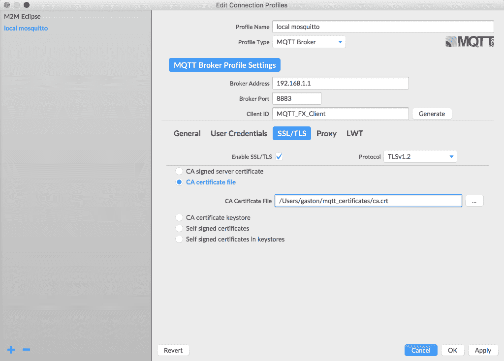
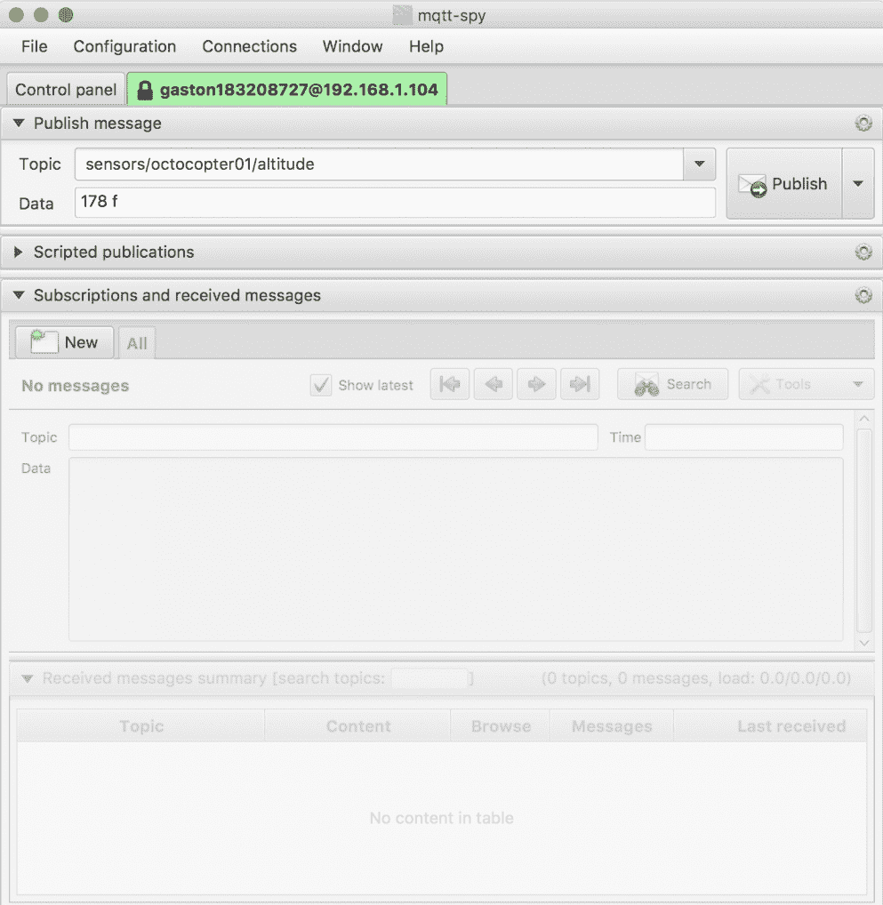
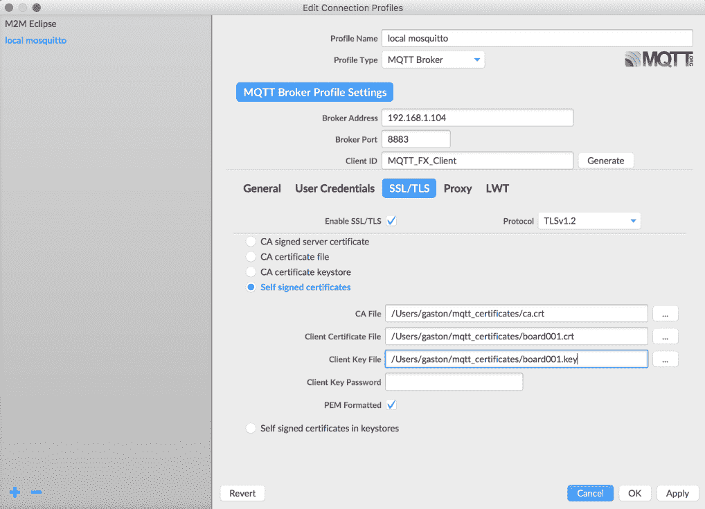
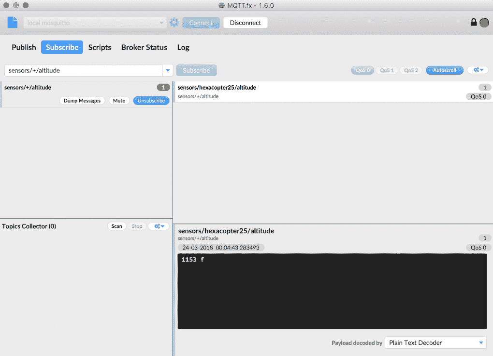
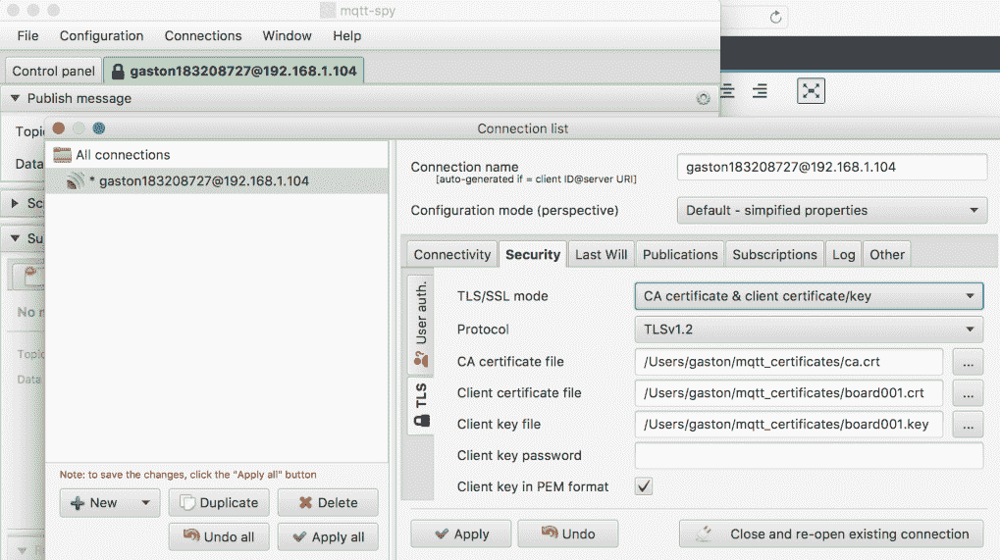

# 三、保护 MQTT 3.1.1 MOSQUITO 服务器

在本章中，我们将保护 MQTT 3.1.1 MOSQUITO 服务器。我们将进行使用数字证书所需的所有配置，以加密 MQTT 客户端和服务器之间发送的所有数据。我们将使用 TLS，并将学习为每个 MQTT 客户机使用客户机证书。我们还将学习强制实现所需的 TLS 协议版本。我们将了解以下内容：

*   保护 MOSQUITO 服务器的重要性
*   生成专用证书颁发机构以将 TLS 与 MOSQUITO 一起使用
*   为 MOSQUITO 服务器创建证书
*   在 MOSQUITO 中配置 TLS 传输安全
*   使用命令行工具测试 MQTT TLS 配置
*   使用 GUI 工具测试 MQTT TLS 配置
*   为每个 MQTT 客户机创建证书
*   在 MOSQUITO 中配置 TLS 客户端证书身份验证
*   使用命令行工具测试 MQTT TLS 客户端身份验证
*   使用 GUI 工具测试 MQTT TLS 配置
*   强制将 TLS 协议版本设置为特定编号

# 了解保护 MOSQUITO 服务器的重要性

物联网应用程序的安全性是一个极其重要的主题，值得许多整本书专门讨论。每个解决方案都有其自身的安全性要求，在开发解决方案的每个组件时考虑所有这些问题是非常重要的。

如果我们使用 MQTT 来发布对其他应用程序既不保密也不重要的值，那么我们唯一关心的可能是控制每个主题的最大订户数量，以确保消息始终可用。通过这种方式，我们可以防止 MQTT 服务器无法向大量订户传递消息。

但是，在大多数情况下，我们不会致力于开发一种能够无限制地与全世界共享数据的解决方案，并且除了数据可用性之外，不需要关心数据的机密性和完整性。想象一下，我们正在开发一种解决方案，允许用户控制一架巨大的八角无人机。如果无人机飞错了方向，我们会伤害真实的人。我们不能允许任何未知的发布者向允许我们控制八角机的主题发送消息。我们必须确保正确的人正在控制 Octoopter，而作为消息的一部分发送的命令不能被中间的入侵者更改；也就是说，我们需要数据完整性。

The different levels of security come at a price; that is, there is always an additional overhead. Hence, we should always keep a balance to avoid overheads that can make the entire solution unfeasible and unusable. Whenever we add more security, we will require additional bandwidth and we will add a processing overhead in the clients and the server. We have to take into account that some cryptographic algorithms that work without problems in modern smartphones aren't suitable for IoT boards with constrained processing power. Sometimes, security requirements can force us to use specific hardware, such as more powerful IoT boards. We definitely have to consider security before purchasing all the hardware for our solution.

我们必须考虑的另一个重要问题是，许多安全级别需要维护任务，这些任务在某些情况下可能不可行，或者在其他情况下极难实现。例如，如果我们决定为每个将成为 MQTT 服务器客户机的设备使用证书，那么我们必须为每个设备生成和分发证书。我们必须访问文件系统，设备才能向其复制新文件。如果我们必须使证书无效，则必须向受影响的设备提供新证书。考虑所有设备分布在难以访问的不同位置的情况；我们必须有一个远程访问设备的机制，并能够为其提供新的证书。此任务还需要安全性，因为我们不希望任何人访问设备的文件系统。因此，一旦我们开始分析所有安全需求以及可能和必要的维护任务，事情就会变得极其复杂。

每个 MQTT 服务器或代理实现都可以提供特定的安全特性。我们将使用 Mosquitto 提供的一些开箱即用的特性。特定的安全需求可能使我们决定使用特定的 MQTT 服务器或代理实现。

当我们与 Mosquitto 合作时，我们可以在以下级别实现安全性：

*   **网络**：我们可以使用**VPN**（简称**虚拟专网**）在互联网上扩展专网。
*   **传输**：MQTT 使用 TCP 作为传输协议，因此默认情况下通信不加密。**TLS**（简称**传输层安全**）通常被称为 TLS/SSL，因为**SSL**（简称**安全套接字层**）是其前身。我们可以使用 TLS 来保护和加密 MQTT 客户机和 MQTT 服务器之间的通信。将 TLS 与 MQTT 一起使用有时称为 MQTT。TLS 允许我们提供隐私和数据完整性。我们可以使用 TLS 客户端证书来提供身份验证。
*   **应用**：在这个级别上，我们可以利用 MQTT 中包含的特性来提供应用级身份验证和授权。我们可以使用`ClientId`（客户端标识符）来识别每个客户端，并将其与用户名和密码身份验证相结合。我们可以在此级别添加其他安全机制。例如，我们可以加密消息负载和/或添加完整性检查以确保数据完整性。但是，主题仍然是未加密的，因此 TLS 是确保所有内容都加密的唯一方法。我们可以使用插件来提供更复杂的身份验证和授权机制。我们可以向每个用户授予或拒绝权限，以控制他们可以订阅哪些主题以及向哪些主题发布消息。

Most popular MQTT implementations provide support for TLS. However, make sure that you check the features before selecting the appropriate MQTT server for your solution.

我们不会涵盖所有安全主题，因为它需要一本或多本专门针对这些主题的完整书籍。相反，我们将首先关注传输级安全性中使用的最常见功能，然后再讨论应用程序级安全性。VPN 的使用超出了本书的范围。但是，你必须根据你的具体需求考虑使用它们。我们将在示例中使用 MOSQUITO，但对于您决定使用的任何其他 MQTT 服务器，您都可以遵循许多类似的过程。我们将学到的一切对于任何其他 MQTT 服务器都是有用的，这些服务器为我们将与 MOSQUITO 一起使用的相同安全特性提供支持。

# 生成专用证书颁发机构以将 TLS 与 MOSQUITO 一起使用

到目前为止，我们一直在使用默认配置的 MOSQUITO 服务器，该服务器侦听端口`1883`，并使用普通 TCP 作为传输协议。在每个 MQTT 客户机和 MQTT 服务器之间发送的数据未加密。对订阅者或发布者没有限制。如果我们在路由器中打开防火墙端口和重定向端口，或者为运行 MQTT 服务器的基于云的虚拟机配置端口安全性，则任何具有 MQTT 服务器 IP 地址或主机名的 MQTT 客户端都可以发布到任何主题，并可以订阅任何主题。

在[第 2 章](2.html)中的示例*中，我们使用命令行和 GUI 工具学习 MQTT 的工作原理*，我们没有对配置进行任何更改以允许传入端口 1883 的连接，因此我们没有将 MOSQUITO 服务器打开到 internet。

我们希望在开发环境中将 TLS 与 MQTT 和 MOSQUITO 一起使用。通过这种方式，我们将确保我们可以信任 MQTT 服务器，因为我们有信心它是它所说的那个人，我们的数据将是私有的，因为它将被加密，它将具有完整性，因为它不会被更改。如果您有使用*HTTP*协议的经验，您会认识到，当我们从使用*HTTP*转换为*HTTPS*时，我们也会做出同样的改变。

网站从主要的证书颁发机构购买证书。如果我们想为服务器使用购买的证书，我们不需要生成自己的证书。事实上，当我们公开 MQTT 服务器并将其转移到生产环境时，这是最方便的选择。

在本例中，我们将使用免费的 OpenSSL 实用程序为服务器生成必要的证书，以便在我们的开发环境中使用 MOSQUITO 启用 TLS。非常重要的是要注意，我们不会生成生产就绪配置，我们将重点放在模拟安全生产环境的安全开发环境上。

OpenSSL 已经安装在 macOS 和大多数现代 Linux 发行版中。在 Windows 中，我们已经安装了 OpenSSL 作为 MOSQUITO 的先决条件之一。OpenSSL 实用程序的使用值得一本完整的书，因此我们将只关注使用最常见的选项生成所需的证书。如果您有特定的安全需求，请确保探索使用 OpenSSL 实现目标所需的选项。

具体来说，我们将生成一个使用 X.509**PKI**（简称**公钥基础设施**标准的 X.509 数字证书。此数字证书允许我们确认特定公钥属于证书中包含的主体。有一个颁发证书的标识，其详细信息也包含在证书中。

数字证书仅在特定期限内有效，因此我们必须考虑到数字证书将在某一天过期，并且我们必须提供新的证书来替换过期的证书。对于基于我们使用的特定 X.509 版本的证书，有特定的数据要求。根据版本和用于生成证书的选项，我们可能需要提供特定的数据。

我们将运行命令生成不同的 X.509 数字证书，并提供证书中包含的所有必要细节。当我们创建证书时，我们将了解证书所包含的所有数据。

我们将创建自己的私有证书颁发机构，也称为 CA。我们将创建根证书，然后生成服务器密钥。

检查安装 OpenSSL 的目录或文件夹。

在 macOS 上，OpenSSL 安装在`/usr/bin/openssl`中。但是，它是一个旧版本，在运行命令之前必须安装一个新版本。可以使用`homebrew`软件包管理器安装新版本，您可以在其他目录中运行新版本。例如，安装有`homebrew`的版本 1.0.2n 的路径将位于`/usr/local/Cellar/openssl/1.0.2n/bin/openssl`中。确保不使用默认的旧版本。

在 Windows 中，[第 2 章](https://cdp.packtpub.com/hands_on_mqtt_programming_with_python/wp-admin/post.php?post=26&action=edit#post_25)中*使用命令行和 GUI 工具学习 MQTT 如何工作*中，我们作为 Mosquito 的先决条件安装的 OpenSSL 版本在默认的`C:\OpenSSL-Win32\bin`文件夹中有`openssl.exe`可执行文件。如果您使用的是 Windows，则可以使用命令提示符或 Windows PowerShell。

在任何操作系统中，在以`openssl`开头的每个命令中使用相应 OpenSSL 版本的完整路径

创建一个名为`mosquitto_certificates`的新目录，并更改此目录的必要权限，以确保您只能访问其内容。

在 macOS 或 Linux 中打开终端，或在 Windows 中打开命令提示符，然后转到先前创建的目录`mosquitto_certificates`。运行以下命令创建 2048 位根密钥并保存在`ca.key`文件中：

```py
openssl genrsa -out ca.key 2048
```

以下几行显示由上一个命令生成的示例输出：

```py
Generating RSA private key, 2048 bit long modulus
......+++
.............+++
e is 65537 (0x010001)
```

前面的命令将在`ca.key`文件中生成私有根密钥。确保此文件为私有文件，因为拥有此文件的任何人都可以生成证书。也可以使用其他选项`openssl`对该文件进行密码保护。但是，如前所述，我们将遵循使用 TLS 的必要步骤，您可以探索与 OpenSSL 和证书相关的其他选项。

转到 macOS 或 Linux 中的终端，或 Windows 中的命令提示符。运行以下命令对根证书进行自签名。下一个命令使用之前创建的保存在`ca.key`文件中的 2048 位私钥，并生成具有自签名 X.509 数字证书的`ca.crt`文件。该命令使自签名证书的有效期为`3650`天。该值在`-days`选项后指定：

```py
openssl req -x509 -new -nodes -key ca.key -sha256 -days 3650 -out ca.crt
```

在本例中，我们指定了`-sha256`选项来使用 SHA-256 哈希函数。如果我们想要提高安全性，我们可以在使用`-sha256`的所有情况下使用`-sha512`而不是`-sha256`选项。这样，我们将使用 SHA-512 哈希函数。然而，我们必须考虑到 SHA-512 可能不适用于某些功率受限的物联网设备。

输入上一个命令后，OpenSSL 将请求将被合并到证书中的信息。您必须输入信息并按*输入*。如果您不想输入具体信息，只需输入一个点（`.`，然后按*输入*。可以将所有值作为参数传递给`openssl`命令，但这会使理解我们正在做的事情变得有点困难。事实上，也可以使用较少的对`openssl`命令的调用来执行前面的任务。然而，我们还需要运行一些步骤来了解我们正在做什么。

以下几行显示示例输出和带有示例答案的问题。请记住，我们正在生成我们的私有证书颁发机构：

```py
You are about to be asked to enter information that will be incorporated
into your certificate request.
What you are about to enter is what is called a Distinguished Name or a DN.
There are quite a few fields but you can leave some blank
For some fields there will be a default value,
If you enter '.', the field will be left blank.
-----
Country Name (2 letter code) [AU]:US
State or Province Name (full name) [Some-State]:NEW YORK CITY
Locality Name (eg, city) []:NEW YORK
Organization Name (eg, company) [Internet Widgits Pty Ltd]:MOSQUITTO CERTIFICATE AUTHORITY
Organizational Unit Name (eg, section) []:
Common Name (e.g. server FQDN or YOUR name) []:MOSQUITTO CERTIFICATE AUTHORITY
Email Address []:mosquittoca@example.com
```

运行以下命令以显示最近生成的证书颁发机构证书文件的数据和详细信息：

```py
Certificate:
 Data:
 Version: 3 (0x2)
 Serial Number:
 96:f6:f6:36:ad:63:b2:1f
 Signature Algorithm: sha256WithRSAEncryption
 Issuer: C = US, ST = NEW YORK, L = NEW YORK, O = MOSQUITTO 
        CERTIFICATE AUTHORITY, CN = MOSQUITTO CERTIFICATE AUTHORITY, 
        emailAddress = mosquittoca@example.com
 Validity
 Not Before: Mar 22 15:43:23 2018 GMT
 Not After : Mar 19 15:43:23 2028 GMT
 Subject: C = US, ST = NEW YORK, L = NEW YORK, O = MOSQUITTO 
            CERTIFICATE AUTHORITY, CN = MOSQUITTO CERTIFICATE 
            AUTHORITY, emailAddress = mosquittoca@example.com
 Subject Public Key Info:
 Public Key Algorithm: rsaEncryption
 Public-Key: (2048 bit)
 Modulus:
 00:c0:45:aa:43:d4:76:e7:dc:58:9b:19:85:5d:35:
 54:2f:58:61:72:6a:42:81:f9:64:1b:51:18:e1:95:
 ba:50:99:56:c5:9a:c2:fe:07:8e:26:12:47:a6:be:
 8b:ce:23:bf:4e:5a:ea:ab:2e:51:99:0f:23:ea:38:
 68:f3:80:16:5d:5f:51:cf:ce:ee:c9:e9:3a:34:ac:
 ee:24:a6:50:31:59:c5:db:75:b3:33:0e:96:31:23:
 1b:9c:6f:2f:96:1f:6d:cc:5c:4e:20:10:9e:f2:4e:
 a9:f6:31:83:54:11:b6:af:86:0e:e0:af:69:a5:b3:
 f2:5a:b5:da:b6:64:73:87:86:bb:e0:be:b3:10:9f:
 ef:91:8f:e5:68:8c:ab:38:75:8d:e1:33:bc:fb:00:
 d8:d6:d2:d3:6e:e3:a0:3f:08:b6:9e:d6:da:94:ad:
 61:74:90:6c:71:98:88:e8:e1:2b:2d:b1:18:bb:6d:
 b8:65:43:cf:ac:79:ab:a7:a4:3b:65:a8:8a:6f:be:
 c1:66:71:d6:9c:2d:d5:0e:81:13:69:23:65:fa:d3:
 cb:79:e5:75:ea:a2:22:72:c7:e4:f7:5c:be:e7:64:
 9b:54:17:dd:ca:43:7f:93:be:b6:39:20:e7:f1:21:
 0f:a7:e6:24:99:57:9b:02:1b:6d:e4:e5:ee:ad:76:
 2f:69
 Exponent: 65537 (0x10001)
 X509v3 extensions:
 X509v3 Subject Key Identifier:
 F7:C7:9E:9D:D9:F2:9D:38:2F:7C:A6:8F:C5:07:56:57:48:7D:07:35
 X509v3 Authority Key Identifier: keyid:F7:C7:9E:9D:D9:F2:9D:38:2F:7C:A6:8F:C5:07:56:57:48:7D:07:35
 X509v3 Basic Constraints: critical
 CA:TRUE
 Signature Algorithm: sha256WithRSAEncryption
 a2:64:5d:7b:f4:85:81:f7:d0:30:8b:8d:7c:83:83:63:2c:4e:
 a8:56:fb:fc:f0:4f:d4:d8:9c:cd:ac:c7:e9:bc:4b:b5:87:9e:
 02:0b:9f:e0:4b:a3:da:3f:84:b4:1c:e3:42:d4:9f:4e:c0:29:
 f7:ae:18:d3:2d:bf:93:e2:2b:5c:d9:9a:82:53:d8:6a:fb:c8:
 47:9f:02:d4:05:11:e9:8f:2a:54:09:c4:a4:f1:00:eb:35:1d:
 6b:e9:55:3b:4b:a6:27:d0:52:cf:86:c1:03:32:ce:22:41:55:
 32:1e:93:4f:6b:a5:b5:19:9e:8c:a7:de:91:2b:2c:c6:95:a9:
 b6:44:18:e7:40:23:38:87:5d:89:b6:25:d7:32:60:28:0b:41:
 5b:6e:46:20:bf:36:9d:ba:26:6d:63:71:0f:fd:c3:e3:0d:6b:
 b6:84:34:06:ea:67:7c:4e:2e:df:fe:b6:ec:48:f5:7b:b5:06:
 c5:ad:6f:3e:0c:25:2b:a3:9d:49:f7:d4:b7:69:9e:3e:ca:f8:
 65:f2:77:ae:50:63:2b:48:e0:72:93:a7:60:99:b7:40:52:ab:
 6f:00:78:89:ad:92:82:93:e3:30:ab:ac:24:e7:82:7f:51:c7:
 2d:e7:e1:2d:3f:4d:c1:5c:27:15:d9:bc:81:7b:00:a0:75:07:
 99:ee:78:70
```

在运行前面的命令后，`mqtt_certificates`目录中有以下两个文件：

*   `ca.key`：证书颁发机构密钥
*   `ca.crt`：证书颁发机构证书文件

The certificate authority certificate file is in the **PEM** (short for **privacy enhanced mail**) format. We must remember this format because some MQTT utilities will require us to specify whether the certificate is in PEM format or not. A wrong value in this option won't allow the MQTT client to establish a connection with an MQTT server that uses a certificate in PEM format.

# 为 MOSQUITO 服务器创建证书

现在我们有了一个私有证书颁发机构，我们可以为 mosquito 服务器创建证书，也就是说，为运行 MQTT 服务器的计算机创建证书。

首先，我们必须生成一个新的私钥，它将不同于我们为自己的私有证书颁发机构生成的私钥。

转到 macOS 或 Linux 中的终端，或 Windows 中的命令提示符。运行以下命令创建 2048 位密钥并保存在`server.key`文件中：

```py
openssl genrsa -out server.key 2048
```

以下几行显示由上一个命令生成的示例输出：

```py
Generating RSA private key, 2048 bit long modulus
..................................................................................................+++
..............................................................................................................................+++
e is 65537 (0x010001)
```

前面的命令将在`server.key`文件中生成私钥。返回 macOS 或 Linux 中的终端，或 Windows 中的命令提示符。运行以下命令以生成证书签名请求。下一个命令使用先前创建的保存在`server.key`文件中的 2048 位私钥，并生成一个`server.csr`文件：

```py
openssl req -new -key server.key -out server.csr
```

输入上一个命令后，OpenSSL 会询问将包含在证书中的信息。您必须输入信息并按*回车*。如果您不想输入具体信息，只需输入一个点（`.`，然后按*输入*。在本例中，最重要的值是公共名称。在此字段中输入运行 MOSQUITO 服务器的计算机的 IPv4 或 IPv6 地址，而不是下一行中显示的`192.168.1.1`值。以下几行显示了示例输出和带有示例答案的问题。不要忘记为通用名称输入适当的值：

```py
You are about to be asked to enter information that will be incorporated
into your certificate request.
What you are about to enter is what is called a Distinguished Name or a DN.
There are quite a few fields but you can leave some blank
For some fields there will be a default value,
If you enter '.', the field will be left blank.
-----
Country Name (2 letter code) [AU]:US
State or Province Name (full name) [Some-State]:FLORIDA
Locality Name (eg, city) []:ORLANDO
Organization Name (eg, company) [Internet Widgits Pty Ltd]:MQTT 3.1.1 SERVER
Organizational Unit Name (eg, section) []:MQTT
Common Name (e.g. server FQDN or YOUR name) []:192.168.1.1
Email Address []:mosquittoserver@example.com

Please enter the following 'extra' attributes
to be sent with your certificate request
A challenge password []:
An optional company name []:Mosquitto MQTT Server
```

转到 macOS 或 Linux 中的终端，或 Windows 中的命令提示符。运行以下命令对之前创建的证书签名请求进行签名，即`server.csr`文件。下一个命令还为证书颁发机构使用自签名的 X.509 数字证书及其我们之前生成的私钥：`ca.crt`和`ca.key`文件。

该命令为 MOSQUITO 服务器生成一个带有签名的 X.509 数字证书的`server.crt`文件。该命令使签名证书的有效期为 3650 天。该值在`-days`选项后指定：

```py
openssl x509 -req -in server.csr -CA ca.crt -CAkey ca.key -CAcreateserial -out server.crt -days 3650 -sha256
```

As happened when we created the self-signed X.509 digital certificate for the certificate authority, we also specify the `-sha256` option to use SHA-256 hash functions for the Mosquitto server certificate. You can use `-sha512` instead option of `-sha256` if you want to use SHA-512 hash functions for increased security.

以下几行显示由上一个命令生成的示例输出。`subject`之后显示的值在您的配置中会有所不同，因为您在生成保存在`server.csr`文件中的证书签名请求时输入了自己的值：

```py
Signature ok
subject=C = US, ST = FLORIDA, L = ORLANDO, O = MQTT 3.1.1 SERVER, OU = MQTT, CN = 192.168.1.1, emailAddress = mosquittoserver@example.com
Getting CA Private Key
```

运行以下命令以显示生成的服务器证书文件的数据和详细信息：

```py
openssl x509 -in server.crt -noout -text
```

以下几行显示了示例输出，其中显示了有关签名算法、颁发者、有效性、主题和签名算法的详细信息：

```py
Certificate:
 Data:
 Version: 1 (0x0)
 Serial Number:
 a1:fa:a7:26:53:da:24:0b
 Signature Algorithm: sha256WithRSAEncryption
 Issuer: C = US, ST = NEW YORK, L = NEW YORK, O = MOSQUITTO     
        CERTIFICATE AUTHORITY, CN = MOSQUITTO CERTIFICATE AUTHORITY, 
        emailAddress = mosquittoca@example.com
 Validity
 Not Before: Mar 22 18:20:01 2018 GMT
 Not After : Mar 19 18:20:01 2028 GMT
 Subject: C = US, ST = FLORIDA, L = ORLANDO, O = MQTT 3.1.1 
        SERVER, OU = MQTT, CN = 192.168.1.1, emailAddress = 
        mosquittoserver@example.com
 Subject Public Key Info:
 Public Key Algorithm: rsaEncryption
 Public-Key: (2048 bit)
 Modulus:
 00:f5:8b:3e:76:0a:ab:65:d2:ee:3e:47:6e:dc:be:
 74:7e:96:5c:93:25:45:54:a4:97:bc:4d:34:3b:ed:
 33:89:39:f4:df:8b:cd:9f:63:fa:4d:d4:01:c8:a5:
 0b:4f:c7:0d:35:a0:9a:20:4f:66:be:0e:4e:f7:1a:
 bc:4a:86:a7:1f:69:30:36:01:2f:93:e6:ff:8f:ca:
 1f:d0:58:fa:37:e0:90:5f:f8:06:7c:2c:1c:c7:21:
 c8:b4:12:d4:b7:b1:4e:5e:6d:41:68:f3:dd:03:33:
 f5:d5:e3:de:37:08:c4:5f:8c:db:21:a2:d7:20:12:
 f2:a4:81:20:3d:e4:d7:af:81:32:82:31:a2:2b:fd:
 02:c2:ee:a0:fa:53:1b:ca:2d:43:b3:7e:b7:b8:12:
 9c:3e:26:66:cd:90:34:ba:aa:6b:ad:e4:eb:0d:15:
 cf:0b:ce:f6:b1:07:1f:7c:33:05:11:4b:57:6c:48:
 0d:f8:e5:f3:d3:f0:88:92:53:ec:3e:04:d7:fc:81:
 75:5e:ef:01:56:f1:66:fe:a4:34:9b:13:8a:b6:5d:
 cc:8f:72:11:0e:9c:c9:65:71:e3:dd:0e:5a:b7:9d:
 8f:18:3e:09:62:52:5f:fa:a5:96:4d:2b:35:23:26:
 ca:74:5d:f9:04:64:f1:f8:f6:f6:7a:d7:31:4c:b7:
 e8:53
 Exponent: 65537 (0x10001)
 Signature Algorithm: sha256WithRSAEncryption
 9c:2f:b5:f9:fa:06:9f:a3:1e:a3:38:94:a7:aa:4c:11:e9:30:
 2e:4b:cf:16:a3:c6:46:ad:e5:3b:d9:43:f0:41:37:62:93:94:
 72:56:1a:dd:27:50:f7:89:2f:4b:56:55:59:d6:da:2e:8f:0a:
 d8:1e:dd:41:0e:1c:36:1b:eb:8d:32:2c:24:ef:58:93:18:e1:
 fc:ce:71:f6:b2:ed:84:5e:06:52:b8:f1:87:f3:13:ca:b9:41:
 3f:a2:1d:a0:52:5d:52:37:6c:2b:8c:28:ab:7f:7d:ed:fc:07:
 9f:60:8b:ad:3d:48:17:95:fe:20:b8:96:87:44:9a:32:b8:9c:
 a8:d7:3c:cf:98:ba:a4:5c:c9:6e:0c:10:ee:45:3a:23:4a:e8:
 34:28:63:c4:8e:6e:1b:d9:a0:1b:e5:cc:33:69:ae:6f:e1:bb:
 99:df:04:fa:c9:bd:8c:c5:c7:e9:a9:fd:f2:dc:2c:b3:a9:7c:
 8a:ef:bf:66:f6:09:01:9a:0e:8f:27:a4:a1:45:f7:90:d2:bb:
 6d:4f:12:46:56:29:85:cd:c8:d6:d7:d3:60:e4:d1:27:a3:88:
 52:41:6a:7d:b2:06:8e:10:ec:ae:b5:7e:58:3e:ae:33:7c:f7:
 3a:21:a6:ae:61:5f:4d:c8:44:86:48:3d:c4:32:f2:db:05:e9:
 c9:f1:0c:be
```

在运行前面的命令后，`mqtt_certificates`目录中有以下三个文件：

*   `server.key`：服务器密钥
*   `server.csr`：服务器证书签名请求
*   `server.crt`：服务器证书文件

服务器证书文件采用 PEM 格式，证书颁发机构证书文件也是如此。

# 在 MOSQUITO 中配置 TLS 传输安全

现在，我们将配置 MOSQUITO 以使用 TLS 传输安全性，并使用与不同客户端的加密通信。请注意，我们没有为客户端生成证书，因此我们不会使用客户端证书进行身份验证。这样，任何拥有`ca.crt`文件的客户端都可以与 MOSQUITO 服务器建立通信。

转到 MOSQUITO 安装目录并创建一个名为`certificates`的新子目录。在 Windows 中，您需要管理员权限才能访问默认安装文件夹。

将我们保存证书颁发机构证书和服务器证书的`mqtt_certificates`目录中的以下文件复制到我们最近在 Mosquitto 安装目录中创建的`certificates`子目录中：

*   `ca.crt`
*   `server.crt`
*   `server.key`

如果您在 macOS 或 Linux 的终端窗口中运行 MOSQUITO 服务器，请按*Ctrl*+*C*停止。在 Windows 中，使用*服务*应用程序停止相应的服务。如果在 Linux 中运行 MOSQUITO 服务器，请运行以下命令停止服务：

```py
sudo service mosquitto stop
```

转到 MOSQUITO 安装目录，用您喜爱的文本编辑器打开`mosquitto.conf`配置文件。默认情况下，此文件的所有行都被注释掉；也就是说，它们以散列符号（`#`开头）。将指示每个设置的默认值，并包括适当的注释。这样，我们就很容易知道所有的默认值。这些设置被组织在不同的部分中。

在对现有`mosquitto.conf`配置文件进行更改之前，最好对其进行备份。每当我们对`mosquitto.conf`进行更改时，如果出现问题，最好能够轻松回滚到以前的配置。

在 macOS 或 Linux 上，在配置文件的末尾添加以下行，并确保用我们在`Mosquitto`安装文件夹中创建的`certificates`目录的完整路径替换`/usr/local/etc/mosquitto/certificates`：

```py
# MQTT over TLS
listener 8883
cafile /usr/local/etc/mosquitto/certificates/ca.crt
certfile /usr/local/etc/mosquitto/certificates/server.crt
keyfile /usr/local/etc/mosquitto/certificates/server.key
```

在 Windows 中，在配置文件的末尾添加以下行，并确保用我们在`Mosquitto`安装文件夹中创建的`certificates`目录的完整路径替换`C:\Program Files (x86)\mosquitto\certificates`。请注意，在运行文本编辑器打开文件时，需要管理员权限；也就是说，您必须以管理员身份运行文本编辑器：

```py
# MQTT over TLS
listener 8883
cafile C:\Program Files (x86)\mosquitto\certificates\ca.crt
certfile C:\Program Files (x86)\mosquitto\certificates\server.crt
keyfile C:\Program Files (x86)\mosquitto\certificates\server.key
```

我们为侦听器选项指定了`8883`值，以使 MOSQUITO 侦听 TCP 端口号`8883`上的传入网络连接。此端口是带有 TLS 的 MQTT 的默认端口号。

`cafile`选项指定提供 PEM 编码的证书颁发机构证书文件的文件的完整路径：`ca.crt`。

`certfile`选项指定提供 PEM 编码的服务器证书的文件的完整路径：`server.crt`。

最后，`keyfile`选项指定提供 PEM 编码的服务器密钥文件的文件的完整路径：`server.key`。

保存对`mosquitto.conf`配置文件的更改，并使用我们在上一章中为 Linux、macOS 和 Windows 学习的相同机制再次启动 Mosquito。Mosquitto 服务器将在端口`8883`而不是`1883`上侦听。

# 使用命令行工具测试 MQTT TLS 配置

我们将使用 MOSQUITO 中包含的`mosquitto_sub`命令行实用程序来尝试生成一个简单的 MQTT 客户机，该客户机订阅一个主题并打印它接收到的所有消息。我们将使用默认配置，在未指定证书颁发机构证书的情况下，通过使用默认的`1883`端口，尝试与 MOSQUITO 服务器建立通信。在 macOS 或 Linux 中打开终端，或在 Windows 中打开命令提示符，转到安装 MOSQUITO 的目录，然后运行以下命令：

```py
mosquitto_sub -V mqttv311 -t sensors/octocopter01/altitude -d
```

`mosquitto_sub`实用程序将显示以下错误。Mosquitto 服务器不再接受端口`1883`上的任何连接。请注意，错误消息可能因平台而异：

```py
Error: No connection could be made because the target machine actively refused it.
```

使用`-p`选项运行以下命令，后跟我们要使用的端口号：`8883`。这样，我们将尝试连接到端口`8883`而不是默认端口`1883`：

```py
mosquitto_sub -V mqttv311 -p 8883 -t sensors/octocopter01/altitude -d
```

`mosquitto_sub`实用程序将显示调试消息，指示它正在向 MQTT 服务器发送`CONNECT`数据包。但是，由于潜在的 MQTT 客户机未提供所需的证书颁发机构，因此永远不会建立连接。按*Ctrl*+*C*停止尝试连接的实用程序。以下几行显示了由上一个命令生成的示例输出：

```py
Client mosqsub|14064-LAPTOP-5D sending CONNECT
Client mosqsub|14064-LAPTOP-5D sending CONNECT
Client mosqsub|14064-LAPTOP-5D sending CONNECT
Client mosqsub|14064-LAPTOP-5D sending CONNECT
Client mosqsub|14064-LAPTOP-5D sending CONNECT
Client mosqsub|14064-LAPTOP-5D sending CONNECT
```

以下命令使用 MQTT 服务器主机后面的`-h`选项。在本例中，我们指定运行 Mosquito MQTT 服务器的计算机的 IPv4 地址：`192.168.1.1`。请注意，此值必须与我们在生成`server.csr`文件（即服务器证书签名请求）时在公共名称字段中指定为值的 IPv4 或 IPv6 地址相匹配。如果在“公用名称”字段中使用主机名作为值，而不是 IPv4 或 IPv6 地址，则必须使用相同的主机名。如果为`-h`选项指定的值与公共名称字段中指示的值不匹配，Mosquitto 服务器将拒绝客户端。因此，请确保用适当的值替换下一行中的`192.168.1.1`。此外，该命令在`--cafile`选项后指定了证书颁发机构证书文件，并指示我们要使用端口`8883`。您只需将`ca.crt`替换为您在`mqtt_certificates`目录中创建的`ca.crt`文件的完整路径。例如，它可能是 Windows 中的`C:\mqtt_certificates\ca.crt`或 macOS 或 Linux 中的`/Users/gaston/mqtt_certificates/ca.crt`。`mosquitto_sub`实用程序将创建一个 MQTT 订户，该订户将与 MOSQUITO 建立加密连接：

```py
mosquitto_sub -h 192.168.1.1 -V mqttv311 -p 8883 --cafile ca.crt -t sensors/octocopter01/altitude -d
```

如果为`-h`选项指定的值与生成`server.csr`文件时在“通用名称”字段中指定的值不匹配，您将看到以下错误消息，这是上一个命令的结果：

```py
Client mosqsub|14064-LAPTOP-5D sending CONNECT
Error: A TLS error occurred.
```

If the command generates the previous error message, make sure you review the previous steps to generate the `server.csr` file. Make sure you don't use `localhost` as the value for the `-h` option.

使用类似的语法，我们将使用 MOSQUITO 中包含的`mosquitto_pub`命令行实用程序生成一个简单的 MQTT 客户机，该客户机使用加密连接将消息发布到主题。在 macOS 或 Linux 中打开终端，或在 Windows 中打开命令提示符，转到安装 MOSQUITO 的目录，然后运行以下命令。

记住用适当的值替换下一行中的`192.168.1.1`，另外，用您在`mqtt_certificates`目录中创建的`ca.crt`文件的完整路径替换`ca.crt`：

```py
mosquitto_pub -h 192.168.1.1 -V mqttv311 -p 8883 --cafile ca.crt -t sensors/octocopter01/altitude -m "123 f" -d
```

命令发布消息后，您将在使用`mosquitto_sub`命令订阅`sensors/octocopter01/altitude`主题的窗口中看到它。

# 使用 GUI 工具测试 MQTT TLS 配置

现在，我们将使用 MQTT.fx GUI 实用程序生成另一个 MQTT 客户机，该客户机使用加密连接将消息发布到同一主题：`sensors/octocopter01/altitude`。我们必须更改连接选项以启用 TLS 并指定证书颁发机构证书文件。遵循以下步骤：

1.  启动 MQTT.fx，在位于左上角的下拉列表中选择 local mosquitto，然后单击此下拉列表右侧和连接按钮左侧的配置图标。MQTT.fx 将显示“编辑连接配置文件”对话框，其中包含名为 local mosquito 的连接配置文件的不同选项。
2.  转到 Broker Address（代理地址）文本框，输入我们在生成`server.csr`文件时在公共名称字段中指定为值的 IPv4 或 IPv6 地址，即服务器证书签名请求。如果在“公用名称”字段中使用主机名作为值，而不是 IPv4 或 IPv6 地址，则必须使用相同的主机名。如果 Broker Address 中指定的值与 Common Name 字段中指示的值不匹配，则 MOSQUITO 服务器将拒绝客户端。
3.  转到代理端口并输入 8883。
4.  单击 SSL/TLS 按钮。
5.  激活启用 SSL/TLS 复选框。
6.  激活 CA 证书文件单选按钮。

7.  在 CA 证书文件文本框中输入或选择您在`mqtt_certificates`文件夹中创建的`ca.crt`文件的完整路径，然后单击确定。以下屏幕截图显示了一个包含选定选项的对话框：



8.  单击“连接”按钮。MQTT.fx 将与本地 MOSQUITO 服务器建立加密连接。请注意，由于客户端已连接到 MOSQUITO 服务器，所以 Connect 按钮已禁用，Disconnect 按钮已启用。

9.  点击订阅，在订阅按钮左侧的下拉列表中输入`sensors/octocopter01/altitude`。然后，单击订阅按钮。MQTT.fx 将在左侧显示一个新面板，其中包含我们已订阅的主题。
10.  单击发布，在发布按钮左侧的下拉列表中输入`sensors/octocopter01/altitude`。

11.  在发布按钮下方的文本框中输入以下文本：`250 f`。
12.  然后，单击“发布”按钮。MQTT.fx 将把输入的文本发布到指定的主题。
13.  单击“订阅”，您将看到已发布的消息。

With the configuration changes we have made to the Mosquitto server, any client that has the certificate authority certificate file, that is, the `ca.crt` file we generated, will be able to establish a connection with Mosquitto, subscribe, and publish to topics. The data sent between MQTT clients and the MQTT server is encrypted. In this configuration, we don't require the MQTT clients to provide certificates for authentication. However, don't forget that we are making configurations for our development environment. We should never use self-signed certificates for a production Mosquitto server.

我们可以使用另一个非常流行的 GUI 实用程序来生成 MQTT 客户机，该客户机可以订阅主题并发布到主题：MQTT spy。此实用程序是开源的，可以在安装了 Java 8 或更高版本的任何计算机上运行。您可以在此处找到有关 MQTT spy 的更多信息：[https://github.com/eclipse/paho.mqtt-spy](https://github.com/eclipse/paho.mqtt-spy) 。使用证书颁发机构证书文件与 MQTT 服务器建立连接的选项与我们为 MQTT.fx 分析的选项类似。但是，如果您还想使用此实用程序，则可以方便地对其进行详细分析。

现在，我们将使用 MQTT spy GUI 实用程序生成另一个 MQTT 客户机，该客户机使用加密连接将消息发布到同一主题`sensors/octocopter01/altitude`。遵循以下步骤：

1.  启动 MQTT 间谍。
2.  选择连接|新建连接。将出现“连接列表”对话框。
3.  单击连接选项卡，并在协议版本下拉列表中选择 MQTT 3.1.1。我们希望使用 MQTT 版本 3.1.1。
4.  转到服务器 URI 文本框，输入我们在生成`server.csr`文件时在公共名称字段中指定为值的 IPv4 或 IPv6 地址，即服务器证书签名请求。如果在“公用名称”字段中使用主机名作为值，而不是 IPv4 或 IPv6 地址，则必须使用相同的主机名。如果 Broker Address 中指定的值与 Common Name 字段中指示的值不匹配，则 MOSQUITO 服务器将拒绝 MQTT spy 实用程序生成的客户端。
5.  单击安全选项卡，然后在用户身份验证下面的 TLS 选项卡中单击。标签。
6.  在 TLS/SSL 模式下拉列表中选择 CA 证书。
7.  在协议下拉列表中选择 TLSv1.2。
8.  输入或选择您在`mqtt_certificates`文件夹中创建的`ca.crt`文件的完整路径，然后单击打开连接。以下屏幕截图显示了包含选定选项的对话框：


9.  MQTT spy 将关闭该对话框，并将显示一个新选项卡，该选项卡具有绿色背景和已在连接列表对话框左侧高亮显示并选中的连接名称。确保单击新连接的选项卡。
10.  在主题下拉列表中输入`sensors/octocopter01/altitude`。

11.  在数据文本框中输入以下文本：`178 f`。以下屏幕截图显示了新连接的选项卡以及在不同控件中输入的数据：



12.  单击“发布”按钮。MQTT spy 将把输入的文本发布到指定的主题，您将能够在 MQTT.fx 订阅服务器和`mosquitto-sub`订阅服务器中看到消息。

# 为每个 MQTT 客户机创建证书

现在，我们希望要求每个 MQTT 客户机提供有效的证书，以建立与 MQTT 服务器的连接。这样，只有拥有有效证书的客户端才能发布或订阅主题。我们将使用先前创建的私有证书颁发机构来创建用于身份验证的客户端证书。

我们将为作为客户端的本地计算机生成一个示例证书。我们可以按照相同的过程为要连接到 Mosquitto 服务器的附加设备生成附加证书。我们只需要为文件使用不同的名称，并在相应的选项中使用不同的设备名称。

We must use the same certificate authority certificate that we used to generate the server certificate to generate the client certificates. As previously explained, for a production environment we shouldn't use self-signed certificates. This procedure is useful for development environments.

首先，我们必须生成一个新的私钥，它将不同于我们为自己的私钥颁发机构和服务器证书生成的私钥。

转到 macOS 或 Linux 中的终端，或 Windows 中的命令提示符。运行以下命令创建 2048 位密钥并保存在`board001.key`文件中。若要对其他设备重复此过程，请将`board001`替换为标识将使用证书的设备的任何其他名称。在以下所有使用`board001`处理不同文件名和值的命令中执行此操作：

```py
openssl genrsa -out board001.key 2048
```

以下几行显示由上一个命令生成的示例输出：

```py
Generating RSA private key, 2048 bit long modulus
..........................................................................................+++
.....................................+++
e is 65537 (0x10001)
```

前面的命令将在`board001.key`文件中生成私钥。

返回 macOS 或 Linux 中的终端，或 Windows 中的命令提示符。运行以下命令生成证书签名请求，也称为 CSR。下一个命令使用之前创建的保存在`board001.key`文件中的 2048 位私钥，并生成一个`board001.csr`文件：

```py
openssl req -new -key board001.key -out board001.csr
```

输入上一个命令后，OpenSSL 会询问将包含在证书中的信息。您必须输入信息并按*输入*。如果您不想输入具体信息，只需输入一个点（.），然后按*回车*。在本例中，最重要的值是公共名称。在此字段中输入设备名称：

```py
You are about to be asked to enter information that will be incorporated
into your certificate request.
What you are about to enter is what is called a Distinguished Name or a DN.
There are quite a few fields but you can leave some blank
For some fields there will be a default value,
If you enter '.', the field will be left blank.
-----
Country Name (2 letter code) [AU]:US 
State or Province Name (full name) [Some-State]:CALIFORNIA
Locality Name (eg, city) []:SANTA MONICA
Organization Name (eg, company) [Internet Widgits Pty Ltd]:MQTT BOARD 001
Organizational Unit Name (eg, section) []:MQTT BOARD 001
Common Name (e.g. server FQDN or YOUR name) []:MQTT BOARD 001
Email Address []:mttboard001@example.com

Please enter the following 'extra' attributes
to be sent with your certificate request
A challenge password []:.
An optional company name []:.
```

转到 macOS 或 Linux 中的终端，或 Windows 中的命令提示符。运行以下命令对之前创建的证书签名请求进行签名，即`board001.csr`文件。下一个命令还为证书颁发机构使用自签名的 X.509 数字证书及其我们之前生成的私钥：`ca.crt`和`ca.key`文件。该命令为 MQTT 客户端生成带有签名的 X.509 数字证书的`board001.crt`文件。该命令使签名证书的有效期为 3650 天，这是在`-days`选项后指定的值。`-addTrust clientAuth`选项表示我们希望使用证书对客户端进行身份验证：

```py
openssl x509 -req -in board001.csr -CA ca.crt -CAkey ca.key -CAcreateserial -out board001.crt -days 3650 -sha256 -addtrust clientAuth
```

以下几行显示由上一个命令生成的示例输出。主题后显示的值在您的配置中会有所不同，因为您在生成保存在`board001.csr`文件中的证书签名请求时输入了自己的值：

```py
Signature ok
subject=/C=US/ST=CALIFORNIA/L=SANTA MONICA/O=MQTT BOARD 001/OU=MQTT BOARD 001/CN=MQTT BOARD 001/emailAddress=mttboard001@example.com
Getting CA Private Key
```

运行以下命令以显示生成的服务器证书文件的数据和详细信息：

```py
openssl x509 -in board001.crt -noout -text
```

以下几行显示了示例输出，其中显示了有关签名算法、颁发者、有效性和主题的详细信息：

```py
Certificate:
 Data:
 Version: 1 (0x0)
 Serial Number:
 dd:34:7a:3c:a6:cd:c1:94
 Signature Algorithm: sha256WithRSAEncryption
 Issuer: C=US, ST=CALIFORNIA, L=SAN FRANCISCO, O=CERTIFICATE 
 AUTHORITY, CN=CERTIFICATE 
 AUTHORITY/emailAddress=CERTIFICATE@EXAMPLE.COM
 Validity
 Not Before: Mar 23 22:10:05 2018 GMT
 Not After : Mar 20 22:10:05 2028 GMT
 Subject: C=US, ST=CALIFORNIA, L=SANTA MONICA, O=MQTT BOARD 001, 
 OU=MQTT BOARD 001, CN=MQTT BOARD 
 001/emailAddress=mttboard001@example.com
 Subject Public Key Info:
 Public Key Algorithm: rsaEncryption
 RSA Public Key: (2048 bit)
 Modulus (2048 bit):
 00:d0:9c:dd:9f:3e:db:3f:15:9c:23:40:12:5f:4e:
 56:2a:30:34:df:88:51:d7:ca:61:bb:99:b5:ab:b4:
 a6:61:e9:f1:ed:2e:c3:61:7a:f2:0b:70:5b:24:7a:
 12:3f:cb:5d:76:f7:10:b2:08:24:94:31:0d:80:35:
 78:2c:19:70:8b:c0:fe:c1:cb:b2:13:5e:9a:d3:68:
 5d:4d:78:47:5a:a3:d5:63:cd:3c:2f:8b:b1:48:4d:
 12:11:0b:02:17:f3:4c:56:91:67:9f:98:3d:90:1f:
 47:09:c0:1b:3a:04:09:2f:b9:fe:f1:e9:df:38:35:
 f8:12:ee:59:96:b1:ca:57:90:53:19:2b:4f:d3:45:
 9e:f2:6a:09:95:46:f9:68:6b:c6:4e:89:33:78:4f:
 0f:5b:2f:d3:00:d0:12:d7:ca:92:df:f4:86:6e:22:
 9d:63:a2:f7:de:09:f4:8c:02:ad:03:9c:13:7b:b4:
 9e:03:d6:99:f4:c0:3f:3f:c3:31:52:12:f1:66:cd:
 22:5d:48:fb:7f:ca:ac:84:cf:24:c5:c4:85:af:61:
 de:59:84:a8:e0:fd:ce:44:5d:f2:85:c0:5d:f2:c5:
 ec:71:04:2c:83:94:cd:71:a1:14:1b:f7:e4:1b:b4:
 2f:12:70:cb:b7:17:9e:db:c9:23:d1:56:bd:f5:02:
 c8:3b
 Exponent: 65537 (0x10001)

 Signature Algorithm: sha256WithRSAEncryption
 55:6a:69:0f:3a:e5:6f:d4:16:0a:4f:67:46:ec:36:ea:a4:54:
 db:04:86:e9:48:ed:0e:83:52:56:75:65:f0:85:34:32:75:0a:
 0a:15:13:73:21:a4:a9:9c:89:b4:73:15:06:2a:b3:e8:ab:7b:
 f4:16:37:17:a9:0e:eb:74:1d:78:c8:df:5e:5f:41:af:53:ca:
 a1:94:d8:d2:f5:87:a5:a9:8a:6a:d1:0e:e0:b7:30:92:d2:94:
 98:65:4c:bf:f9:a7:60:f8:c2:df:7c:4e:28:3c:02:f0:d4:a8:
 f7:16:d5:38:88:43:e4:c4:2e:02:72:ee:4b:6f:cd:2a:d7:3b:
 c4:e8:f4:7d:0e:3b:9b:5b:20:00:69:75:76:ce:79:a1:ed:25:
 f7:f1:3c:96:f8:7d:35:dd:5c:f8:4d:d2:04:32:bb:41:b2:3d:
 1a:5d:f6:63:ff:63:48:ec:85:c2:b3:9c:02:d3:ad:17:59:46:
 3e:10:6f:82:2f:d8:ef:6c:a5:42:3f:55:74:bb:f6:17:59:a0:
 39:e5:16:55:a3:f9:5a:b5:04:c0:61:2a:55:32:56:c2:12:0a:
 2c:c8:8a:23:b1:60:d5:a3:93:f3:a0:e4:e0:a8:98:3b:e1:83:
 ea:43:06:bc:d0:96:0b:c2:0b:95:6b:ce:39:02:7f:19:01:ea:
 47:83:25:c5
 Trusted Uses:
 TLS Web Client Authentication
 No Rejected Uses.
```

运行前面的命令后，证书目录中将有以下三个新文件：

*   `board001.key`：客户端密钥
*   `board001.csr`：客户端证书签名请求
*   `board001.crt`：客户端证书文件

客户端证书文件采用 PEM 格式，证书颁发机构证书文件和服务器证书文件也是如此。

我们必须向要连接到 MOSQUITO 服务器的任何设备提供以下三个文件：

*   `ca.crt`
*   `board001.crt`
*   `board001.key`

切勿向必须与 MQTT 服务器建立连接的设备提供其他文件。您不希望设备能够生成其他证书。您只希望他们使用有效的证书进行身份验证。

`openssl`实用程序允许我们通过额外的命令行选项为许多参数提供值。因此，可以自动化前面的许多步骤，以便更容易地生成多个设备证书。

# 在 MOSQUITO 中配置 TLS 客户端证书身份验证

现在，我们将配置 MOSQUITO 以使用 TLS 客户端证书身份验证。这样，任何客户机都需要`ca.crt`文件和客户机证书，如最近生成的`board001.crt`文件，以建立与 MOSQUITO 服务器的通信。

如果您在 macOS 或 Linux 的终端窗口中运行 MOSQUITO 服务器，请按*Ctrl*+*C*停止。在 Windows 中，停止相应的服务。

进入 MOSQUITO 安装目录，打开`mosquitto.conf`配置文件。

在 macOS、Linux 或 Windows 中，在配置文件末尾添加以下行：

```py
require_certificate true
```

我们为`require_certificate`选项指定了`true`值，以使 MOSQUITO 对任何请求连接到 MOSQUITO 的客户端都需要有效的客户端证书。

保存对`mosquitto.conf`配置文件的更改，然后再次启动 MOSQUITO。我们将使用 MOSQUITO 中包含的`mosquitto_sub`命令行实用程序生成一个简单的 MQTT 客户机，该客户机订阅一个主题过滤器并打印它接收到的所有消息。

# 使用命令行工具测试 MQTT TLS 客户端身份验证

现在，我们将使用 MOSQUITO 命令行工具来测试客户端身份验证配置。

以下命令指定证书颁发机构证书文件、客户端证书和客户端密钥。您必须将`ca.crt`、`board001.crt`和`board001.key`替换为在证书目录中创建的这些文件的完整路径。但是，最好将这些文件复制到一个新目录，就好像我们正在处理的文件只对希望与 MOSQUITO 建立连接的设备可用一样。与以前的命令一样，此命令使用 MQTT 服务器主机后面的`-h`选项。在本例中，我们指定运行 Mosquito MQTT 服务器的计算机的 IPv4 地址：`192.168.1.1`。请注意，此值必须与我们在生成`server.csr`文件（即服务器证书签名请求）时在公共名称字段中指定为值的 IPv4 或 IPv6 地址相匹配。如果在“公用名称”字段中使用主机名作为值，而不是 IPv4 或 IPv6 地址，则必须使用相同的主机名。`mosquitto_sub`实用程序将创建一个 MQTT 订户，该订户将与 MOSQUITO 建立加密连接，并提供客户端证书和客户端密钥以执行身份验证：

```py
mosquitto_sub -h 192.168.1.1 -V mqttv311 -p 8883 --cafile ca.crt --cert board001.crt --key board001.key -t sensors/+/altitude -d
```

使用类似的语法，我们将使用 MOSQUITO 中包含的`mosquitto_pub`命令行实用程序生成一个简单的 MQTT 客户机，该客户机通过加密连接和客户机身份验证将消息发布到与先前指定的主题过滤器相匹配的主题。在 macOS 或 Linux 中打开终端，或在 Windows 中打开命令提示符，转到安装 MOSQUITO 的目录，然后运行以下命令。记住用在`mqtt_certificates`目录中创建的这些文件的完整路径替换`ca.crt`、`board001.crt`和`board001.key`。此外，将 192.168.1.1 替换为我们在生成`server.csr`文件时在公共名称字段中指定为值的 IPv4 或 IPv6 地址，即服务器证书签名请求。如果使用主机名作为“公用名称”字段中的值，而不是 IPv4 或 IPv6 地址，则必须使用相同的主机名：

```py
mosquitto_pub -h 192.168.1.1 -V mqttv311 -p 8883 --cafile ca.crt --cert board001.crt --key board001.key -t sensors/quadcopter12/altitude -m "361 f" -d
```

有时，有必要使客户端证书无效。MOSQUITO 允许我们指定 PEM 编码的证书吊销列表文件。我们必须将该文件的路径指定为 MOSQUITO 配置文件中`crlfile`选项的值。

# 使用 GUI 工具测试 MQTT TLS 配置

现在，我们将使用 MQTT.fx GUI 实用程序生成另一个 MQTT 客户端，该客户端使用加密连接和 TLS 客户端身份验证将消息发布到与我们用于订阅的主题过滤器`sensors/hexacopter25/altitude`匹配的主题。我们必须更改启用 TLS 时使用的连接选项。我们必须指定客户端证书和客户端密钥文件。遵循以下步骤：

1.  如果已连接到 MOSQUITO MQTT 服务器，则启动 MQTT.fx 并单击断开连接。
2.  在位于左上角的下拉列表中选择 local mosquitto，然后单击此下拉列表右侧和 Connect 按钮左侧的配置图标。MQTT.fx 将显示“编辑连接配置文件”对话框，其中包含名为 local mosquito 的连接配置文件的不同选项。
3.  转到 Broker Address（代理地址）文本框，输入我们在生成`server.csr`文件时在公共名称字段中指定为值的 IPv4 或 IPv6 地址，即服务器证书签名请求。如果在“公用名称”字段中使用主机名作为值，而不是 IPv4 或 IPv6 地址，则必须使用相同的主机名。如果 Broker Address 中指定的值与 Common Name 字段中指示的值不匹配，则 MOSQUITO 服务器将拒绝客户端。
4.  单击 SSL/TLS 按钮。
5.  确保启用 SSL/TLS 复选框已激活。
6.  激活自签名证书单选按钮。
7.  在 CA 文件文本框的`mqtt_certificates`文件夹中输入或选择您创建的`ca.crt`文件的完整路径。
8.  在客户端证书文件文本框的`mqtt_ertificates`文件夹中输入或选择您创建的`board001.crt`文件的完整路径。

9.  在客户机密钥文件文本框的`mqtt_certificates`文件夹中输入或选择您创建的`board001.key`文件的完整路径。
10.  确保已激活 PEM 格式化复选框。以下屏幕截图显示了一个对话框，其中包含不同文本框的选定选项和示例值：



11.  单击“确定”。然后，单击“连接”按钮。MQTT.fx 将使用我们指定的证书和密钥文件与本地 MOSQUITO 服务器建立加密连接。请注意，由于客户端已连接到 MOSQUITO 服务器，所以 Connect 按钮已禁用，Disconnect 按钮已启用。

12.  点击订阅，在订阅按钮左侧的下拉列表中输入`sensors/+/altitude`。然后，单击订阅按钮。MQTT.fx 将在左侧显示一个新面板，其中包含我们已订阅的主题过滤器。
13.  单击发布，在发布按钮左侧的下拉列表中输入`sensors/hexacopter25/altitude`。
14.  在发布按钮下方的文本框中输入以下文本：`1153 f`。
15.  然后，单击“发布”按钮。MQTT.fx 将把输入的文本发布到指定的主题。
16.  单击“订阅”，您将看到已发布的消息，如以下屏幕截图所示：



现在，我们将使用 MQTT spy GUI 实用程序生成另一个 MQTT 客户机，该客户机使用加密连接将消息发布到另一个主题，该主题将匹配`sensors/+/altitude`主题过滤器：`sensors/quadcopter500/altitude`。遵循以下步骤：

1.  启动 MQTT 间谍。
2.  如果已经运行 MQTT spy 或保存了以前的设置，请选择连接|新建连接或连接|管理连接。将出现“连接列表”对话框。
3.  单击连接选项卡，确保在协议版本下拉列表中选择 MQTT 3.1.1。
4.  转到服务器 URI 文本框，输入我们在生成`server.csr`文件时在公共名称字段中指定为值的 IPv4 或 IPv6 地址，即服务器证书签名请求。如果在“公用名称”字段中使用主机名作为值，而不是 IPv4 或 IPv6 地址，则必须使用相同的主机名。如果 Broker Address 中指定的值与 Common Name 字段中指示的值不匹配，则 MOSQUITO 服务器将拒绝 MQTT spy 实用程序生成的客户端。
5.  单击安全选项卡和用户身份验证下面的 TLS 选项卡。标签。
6.  在 TLS/SSL 模式下拉列表中选择 CA 证书和客户端证书/密钥。
7.  在协议下拉列表中选择 TLSv1.2。
8.  在 CA 证书文件文本框的`mqtt_certificates`文件夹中输入或选择您创建的`ca.crt`文件的完整路径。
9.  在客户端证书文件文本框的`mqtt_ertificates`文件夹中输入或选择您创建的`board001.crt`文件的完整路径。
10.  在客户机密钥文件文本框的`mqtt_certificates`文件夹中输入或选择您创建的`board001.key`文件的完整路径。

11.  激活 PEM 格式的客户端密钥复选框。最后，单击打开连接或关闭并重新打开现有连接。以下屏幕截图显示了一个对话框，其中包含文本框的选定选项和示例值：



12.  MQTT spy 将关闭对话框，并将显示一个新选项卡，该选项卡具有绿色背景和连接名称，该名称在“连接列表”对话框的左侧高亮显示并选中。确保单击新连接的选项卡。
13.  在主题下拉列表中输入`sensors/quadcopter500/altitude`。
14.  在数据文本框中输入以下文本：`1417 f`。
15.  单击“发布”按钮。MQTT spy 将把输入的文本发布到指定的主题，您将能够在 MQTT.fx 订阅服务器和`mosquitto-sub`订阅服务器中看到消息。

与任何安全配置一样，任何未根据前面的指令激活的复选框都不允许 MQTT 客户端与 MOSQUITO 建立连接。记住证书使用 PEM 格式是非常重要的。

# 强制将 TLS 协议版本设置为特定编号

最好使用尽可能高的 TLS 协议版本。默认情况下，Mosquitto 服务器接受 TLS1.0、1.1 和 1.2。如果所有客户端都能够使用 MOSQUITO 支持的最高 TLS 协议版本，那么我们应该强制 MOSQUITO 只使用最高版本。通过这种方式，我们确保不会受到以前 TLS 版本的攻击。

现在，我们将在配置文件中进行必要的更改，以强制使用 TLS1.2。如果您在 macOS 或 Linux 的终端窗口中运行 MOSQUITO 服务器，请按*Ctrl*+*C*停止。在 Windows 中，停止相应的服务。

进入 MOSQUITO 安装目录，打开`mosquitto.conf`配置文件。

在 macOS、Linux 或 Windows 中，在配置文件末尾添加以下行：

```py
tls_version tlsv1.2
```

我们为`tls_version`选项指定了`tlsv1.2`值，以使 MOSQUITO 仅与 TLS 1.2 一起工作。任何使用以前 TLS 版本的客户端都无法与 MOSQUITO 服务器建立连接。

保存对`mosquitto.conf`配置文件的更改，然后再次启动 MOSQUITO。在 MQTT.fx 和 MQTT spy GUI 实用程序中配置连接时，我们指定了 TLS 版本；具体来说，我们将 TLS 1.2 指定为客户端所需的 TLS 版本，因此不需要进行额外更改。我们必须在`mosquitto_sub`和`mosquitto_pub`命令行实用程序中使用`--tls-version tlsv1.2`选项。

在 macOS 或 Linux 中打开终端，或在 Windows 中打开命令提示符，转到安装 MOSQUITO 的目录，然后运行以下命令。记住为`ca.crt`、`device.001`和`device.key`文件使用完整路径。此外，将`192.168.1.1`替换为我们在生成`server.csr`文件时在公共名称字段中指定为值的 IPv4 或 IPv6 地址，即服务器证书签名请求。如果使用主机名作为“公用名称”字段中的值，而不是 IPv4 或 IPv6 地址，则必须使用相同的主机名：

```py
mosquitto_pub -h 192.168.1.1 --tls-version tlsv1.2 -V mqttv311 -p 8883 --cafile ca.crt -t sensors/octocopter01/altitude -m "1025 f" -d
```

前面的命令指定了 TLS 1.2 的使用，因此 MQTT 客户机可以与 MOSQUITO 服务器建立连接并发布消息。如果我们指定不同的 TLS 版本，`mosquitto_pub`命令将无法连接到 MOSQUITO 服务器。

# 测试你的知识

让我们看看您是否能正确回答以下问题：

1.  这是 TLS 上 MQTT 的默认端口号：
    1.  `1883`
    2.  `5883`
    3.  `8883`
2.  以下哪个实用程序允许我们生成 X.509 数字证书：
    1.  OpenX509
    2.  TLS4Devs
    3.  OpenSSL
3.  在 TLS 上使用 MQTT 时：
    1.  与没有 TLS 的 TCP 上的 MQTT 相比，存在带宽和处理开销
    2.  与没有 TLS 的 MQTT over TCP 相比，只有一个小带宽，但没有任何处理开销
    3.  与没有 TLS 的 TCP 上的 MQTT 相比，没有开销
4.  我们可以使用以下哪项来保护和加密 MQTT 客户端和 MQTT 服务器之间的通信：
    1.  TCPS
    2.  TLS
    3.  HTTPS
5.  如果我们指定`true`作为 MOSQUITO 配置文件（`mosquitto.conf`的`require_certificate`选项的值：
    1.  要连接到 MQTT 服务器的客户端将需要客户端证书
    2.  想要连接到 MQTT 服务器的客户端不需要客户端证书
    3.  想要连接到 MQTT 服务器的客户端可以提供可选的客户端证书

权利答案包含在[附录](6.html)*解决方案*中。

# 总结

在本章中，我们生成了一个私有证书颁发机构、一个服务器证书和客户机证书，以启用 TLS 传输安全性和使用 MOSQUITO 的 TLS 客户机身份验证。MQTT 客户端和 MQTT 服务器之间的通信是加密的。

我们与 OpenSSL 合作，为我们的开发环境生成自签名数字证书。我们使用 MQTT.fx、MQTT-spy 和 Mosquitto 命令行实用程序测试了 MQTT-TLS 配置。我们强迫 Mosquitto 只使用特定的 TLS 版本。

还有许多其他与 MQTT 服务器和 MOSQUITO 相关的安全主题。在接下来的章节中，我们将与其中一些人合作，在这些章节中，我们将开发将 MQTT 与 Python 结合使用的应用程序。

现在我们了解了如何加密 MQTT 客户机和 MOSQUITO 服务器之间的通信，我们将了解 MQTT 库，并编写 Python 代码，使用通过加密连接传递的 MQTT 消息控制车辆，这是我们将在[第 4 章](4.html)、*中讨论的主题使用 Python 和 MQTT 消息*编写控制车辆的代码。