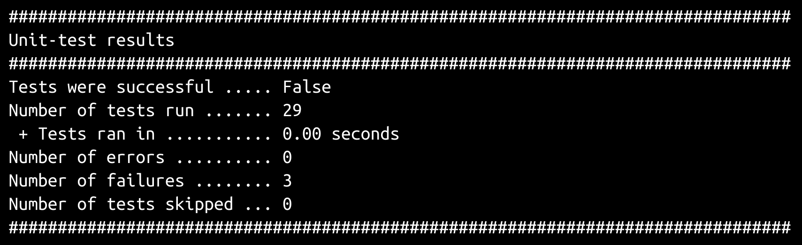
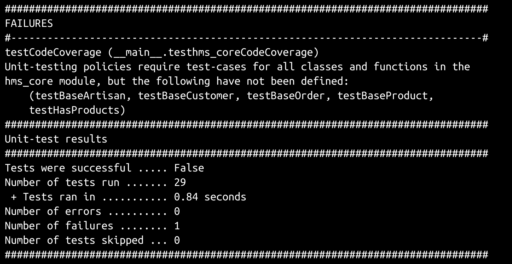
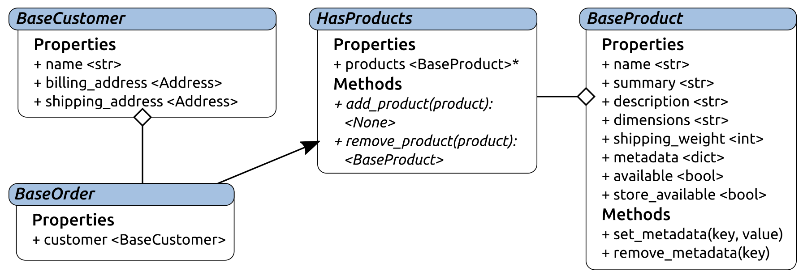
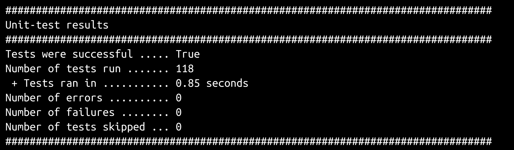
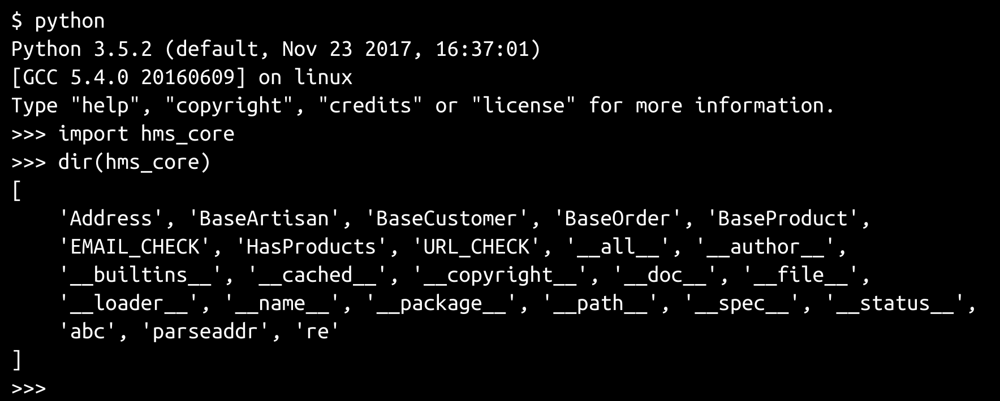

# 测试业务对象

一旦定义和测试了核心业务对象，就可以在其他包中使用它们作为类的基础，以提供具体的类功能。采用这种方法至少有两个好处：

*   核心类将处理数据类型、数据结构和数据验证的所有代码保存在一个地方，这降低了依赖它们的其他代码库的复杂性
*   一旦创建了通过核心对象的单元测试，它们提供的任何功能都不需要在其他地方进行测试
*   这些测试可以被集成到最终的构建过程中，提供一整套回归测试，确保将来所做的更改在执行构建之前不会破坏现有功能

使用前面提到的测试扩展构建这些单元测试的过程虽然并不困难，但一开始会很耗时。本章将研究整个过程，建立一些测试模式，在将它们集成到包构建过程之前，我们将在后面的章节中重用这些模式。

本章包括以下内容：

*   测试业务对象
*   分配和安装注意事项
*   质量保证和验收
*   操作/使用、维护和退役注意事项

# 启动单元测试过程

使用我们在上一章中定义的标准单元测试结构/框架，可以让我们非常快速、轻松地开始任何代码库的单元测试。它还适合于迭代测试开发过程。一旦通过两个搜索和替换操作在其中设置了配置项，起始点测试模块立即开始报告正在报告的测试用例和方法。我们的初始测试模块仅包括以下内容（删除一些注释以保持列表简短）：

```py
#!/usr/bin/env python
"""
Defines unit-tests for the module at hms_core.
"""
#######################################
# Standard library imports needed     #
#######################################

import os
import sys
import unittest

#######################################
# Local imports needed                #
#######################################

from idic.unit_testing import *

#######################################
# Module-level Constants              #
#######################################

LocalSuite = unittest.TestSuite()

#######################################
# Import the module being tested      #
#######################################
```

```py
import hms_core as hms_core

#######################################
# Code-coverage test-case and         #
# decorator-methods                   #
#######################################

class testhms_coreCodeCoverage(ModuleCoverageTest):
    # - Class constants that point to the namespace and module 
    #   being tested
    _testNamespace = 'hms_core'
    _testModule = hms_core

LocalSuite.addTests(
    unittest.TestLoader().loadTestsFromTestCase(
        testhms_coreCodeCoverage
    )
)

#######################################
# Test-cases in the module            #
#######################################

#######################################
# Code to execute if file is called   #
# or run directly.                    #
#######################################

if __name__ == '__main__':
    import time
    results = unittest.TestResult()
    testStartTime = time.time()
    LocalSuite.run(results)
    results.runTime = time.time() - testStartTime
    PrintTestResults(results)
    if not results.errors and not results.failures:
        SaveTestReport(results, 'hms_core',
            'hms_core.test-results')
```

执行测试模块会产生以下结果：


然后，测试运行输出通知我们，我们需要为正在测试的模块中定义的六个类中的每一个生成测试用例类；具体来说，我们需要创建`testAddress`、`testBaseArtisan`、`testBaseCustomer`、`testBaseOrder`、`testBaseProduct`和`testHasProducts`测试用例类。3.

为了利用标准单元测试结构提供的属性和方法覆盖率测试，这些测试中的每一个都应该使用`AddMethodTesting`和`AddPropertyTesting`装饰器进行装饰，而`testhms_coreCodeCoverage`提供：

```py
#######################################
# Test-cases in the module            #
#######################################

@testhms_coreCodeCoverage.AddMethodTesting
@testhms_coreCodeCoverage.AddPropertyTesting
class testAddress(unittest.TestCase):
    pass
LocalSuite.addTests(
    unittest.TestLoader().loadTestsFromTestCase(
        testAddress
    )
)

@testhms_coreCodeCoverage.AddMethodTesting
@testhms_coreCodeCoverage.AddPropertyTesting
class testBaseArtisan(unittest.TestCase):
    pass
LocalSuite.addTests(
    unittest.TestLoader().loadTestsFromTestCase(
        testBaseArtisan
    )
)

@testhms_coreCodeCoverage.AddMethodTesting
@testhms_coreCodeCoverage.AddPropertyTesting
class testBaseCustomer(unittest.TestCase):
    pass
LocalSuite.addTests(
    unittest.TestLoader().loadTestsFromTestCase(
        testBaseCustomer
    )
)
```

```py
@testhms_coreCodeCoverage.AddMethodTesting
@testhms_coreCodeCoverage.AddPropertyTesting
class testBaseOrder(unittest.TestCase):
    pass
LocalSuite.addTests(
    unittest.TestLoader().loadTestsFromTestCase(
        testBaseOrder
    )
)
@testhms_coreCodeCoverage.AddMethodTesting
@testhms_coreCodeCoverage.AddPropertyTesting
class testBaseProduct(unittest.TestCase):
    pass
LocalSuite.addTests(
    unittest.TestLoader().loadTestsFromTestCase(
        testBaseProduct
    )
)

@testhms_coreCodeCoverage.AddMethodTesting
@testhms_coreCodeCoverage.AddPropertyTesting
class testHasProducts(unittest.TestCase):
    pass
LocalSuite.addTests(
    unittest.TestLoader().loadTestsFromTestCase(
        testHasProducts
    )
)
```

一旦这些都准备好了，重新运行测试模块将生成一个（很长！）的项目列表，在测试策略测试通过之前需要解决这些项目。完整的需求列表足够长，直接将其包含在书中可能会有 2-3 页的项目符号列表。然而，完整的结果包含在`miscellany/initial-test-run.txt`的`hms_core`代码库中。整个初始输出太长，无法在此处完整复制，但输出的开始和结束如下所示，并指定了总共 105 个需要在六个测试用例类中实现的测试方法：


从那时起，测试编写过程就是重复以下循环，直到所有测试通过：

*   选择缺少的测试方法或需要编写的测试方法集
*   将测试方法添加到适用的测试用例类，设置为失败，因为它们没有实现
*   运行测试模块以验证测试是否按预期失败
*   对于每种试验方法：
    *   在方法中编写真实的测试代码
    *   执行测试模块，并确保该方法中唯一的失败是添加的显式失败，从而纠正出现的任何问题
    *   删除显式失败

即使有了标准单元测试流程提供的指导，也不可否认，写出一个模块的所有单元测试，即使是像`hms_core`这样相对较短的单元测试，也可能会非常乏味。我们可以做一些事情来让这个过程至少快一点，尽管我们知道有一些常见的值类型和格式是我们所期望的。我们将首先为`Address`类编写测试，它拥有我们将要处理的最大的属性集合之一。随着许多测试的构建，一些常见的（和可重用的）测试值将开始出现。

This run through of the unit testing process will also yield a test case class template file (`test-case-class.py`) that will be included in the book's code in the code templates directory.

# 单元测试地址类

`Address`类测试最初报告需要编写以下测试方法：

*   **方法：**`test__init__`、`test_del_building_address`、`test_del_city`、`test_del_country`、`test_del_postal_code`、`test_del_region`、`test_del_street_address`、`test_get_building_address`、`test_get_city`、`test_get_country`、`test_get_postal_code`、`test_get_region`、`test_get_street_address`、`test_set_building_address`、`test_set_city`、`test_set_country`、`test_set_postal_code`、`test_set_region`、`test_set_street_address`、`test_standard_address`

*   **属性：**`testbuilding_address`、`testcity`、`testcountry`、`testpostal_code`、`testregion`、`teststreet_address`

可以说，测试类属性的测试方法的主要关注点是确保属性为其 getter、setter 和 deleter 功能使用适当的方法。如果这是正确的，那么处理属性及其值的实际过程可以在这些方法的测试方法中单独进行测试。考虑到这一点，`Address`的大部分属性测试将如下所示：

```py
def testproperty_name(self):
   # Tests the property_name property of the Address class
   # - Assert that the getter is correct:
     self.assertEqual(
         Address.property_name.fget, 
         Address._get_property_name, 
        'Address.property_name is expected to use the '
        '_get_property_name method as its getter-method'
     )
      # - If property_name is not expected to be publicly                       # settable,
      #   the second item here 
      #   (Address._set_property_name) should 
      #   be changed to None, and the failure message           #   adjusted 
      #   accordingly:
           self.assertEqual(
            Address.property_name.fset, 
            Address._set_property_name, 
           'Address.property_name is expected to use the '
           '_set_property_name method as its setter-method'
        )
    #   If property_name is not expected to be publicly     #   deletable,
    #   the second item here (Address._del_property_name)     #   should 
    #   be changed to None, and the failure message         #   adjusted 
     #   accordingly:
       self.assertEqual(
          Address.property_name.fdel, 
          Address._del_property_name, 
          'Address.property_name is expected to use the '
          '_del_property_name method as its deleter-method'
      )
```

通过将该代码块中模板化的`property_name`切换为实际属性名称，可以非常快速地创建各个属性测试，例如，实现`testbuilding_address`：

```py
def testbuilding_address(self):
# Tests the building_address property of the Address class
# - Assert that the getter is correct:
     self.assertEqual(
        Address.building_address.fget, 
        Address._get_building_address, 
       'Address.building_address is expected to use the '
       '_get_building_address method as its getter-method'
     )
# - Assert that the setter is correct:
     self.assertEqual(
        Address.building_address.fset, 
        Address._set_building_address, 
       'Address.building_address is expected to use the '
       '_set_building_address method as its setter-method'
     )
# - Assert that the deleter is correct:
       self.assertEqual(
       Address.building_address.fdel, 
       Address._del_building_address, 
      'Address.building_address is expected to use the '
      '_del_building_address method as its deleter-method'
     )
```

getter 和 deleter 方法测试通常也很简单，它们需要做的就是确保从正确的内部存储属性检索数据，并将该属性的值分别设置为预期的默认值。`test_del_building_address`测试方法就是一个例子：

```py
def test_del_building_address(self):
# Tests the _del_building_address method of the Address 
# class
   test_object = Address('street address', 'city')
    self.assertEqual(
       test_object.building_address, None, 
       'An Address object is expected to have None as its default '
       'building_address value if no value was provided'
    )
# - Hard-set the storage-property's value, call the 
#   deleter-method, and assert that it's what's expected 
#   afterwards:
    test_object._building_address = 'a test value'
    test_object._del_building_address()
    self.assertEqual(
      test_object.building_address, None, 
      'An Address object is expected to have None as its '
      'building_address value after the deleter is called'
    )
```

值得注意的是，为了测试 deleter 方法（以及后面的 getter 和 setter 方法），我们实际上必须创建一个被测试对象的实例，这就是测试方法的第三行所做的（`test_object = Address…`。创建该实例后，如果测试其 deleter 方法的属性不是该测试对象创建过程中所必需或提供的，那么我们还可以（并且应该）测试该实例的默认/删除值。即使为测试对象提供了一个值，通过在底层存储属性中设置一个值、调用 deleter 方法并随后验证结果来测试删除过程在几乎所有情况下都将保持不变。

测试相应的 getter 方法将是类似的；同样，它真正需要做的就是提供属性正在从正确的存储属性检索数据：

```py
def test_get_building_address(self):
# Tests the _get_building_address method of the Address 
# class
  test_object = Address('street address', 'city')
  expected = 'a test-value'
  test_object._building_address = expected
  actual = test_object._get_building_address()
  self.assertEqual(
    actual, expected, 
   'Address._get_building_address was expected to return '
   '"%s" (%s), but returned "%s" (%s) instead' % 
   (
       expected, type(expected).__name__,
       actual, type(actual).__name__,
   )
)
```

设置可以传递给测试核心断言的`expected`和`actual`值通常很有用，特别是当检索这些值涉及使用方法或函数时。它不会造成功能上的差异，但以后阅读起来会容易得多，而且保持内容易于理解和可读比保持代码被测试的可读性和可理解性更重要毕竟，测试代码是一项质量保证工作，而且，由于结构的隐蔽性，让错误悄悄进入也不会有什么好处。

还值得注意的是，`city`和`street_address`属性的测试方法略有不同，因为它们都是在创建实例期间设置的属性：

```py
def test_del_city(self):
   # Tests the _del_city method of the Address class
   expected = 'city'
   test_object = Address('street address', expected)
   self.assertEqual(
     test_object.city, expected, 
    'An Address object is expected to have "%s" (%s) as its '
    'current city value, since that value was provided' % 
       (expected, type(expected).__name__)
     )
# - Since we have a value, just call the deleter-method, 
#   and 
#   assert that it's what's expected afterwards:
     test_object._del_city()
       self.assertEqual(
         test_object.city, None, 
         'An Address object is expected to have None as its '
         'city value after the deleter is called'
     )
```

不同之处在于，由于创建的测试对象需要提供一个值，因为它是用一个值初始化的，所以我们在创建测试对象之前设置要测试的预期值，使用该预期值创建它，然后进行测试，以确保删除程序不会在对象创建期间删除最初设置的值。但是，当明确告知删除时，它所做的测试本质上是相同的。

一旦使用这些模式建立了所有 getter 和 deleter 方法测试，测试模块运行就会开始显示进度。正在运行的 29 个测试中的一个（这也是失败的原因之一）是代码覆盖率测试，该测试正在为`BaseArtisan`和其他`hms_core`类提取丢失的测试用例类，这些类已被注释掉，以便更容易地处理`testAddress`测试方法的结果输出。在剩下的八个故障中，有六个是`testAddress`的 setter 方法测试，我们将在下一步实施，另外两个是`test__init__`和`teststandard_address`，我们将在最后查看：


与 getter 和 deleter 方法相对应的测试方法很简单，因为被测试的方法本身非常简单。他们（迄今为止）没有做出任何决定，也没有对价值观本身进行任何操纵；它们只是返回当前值，或者替换它，而不必对替换的内容做出任何决定。最重要的是，他们也没有争论。

setter 方法更加复杂；他们会做出决定，会有参数（如果只有一个），并且可能会根据这些参数的类型和值表现出不同的行为。因此，他们相应的测试方法可能也会因此变得更复杂，而且这种期望是有根据的。对于设计良好的测试，测试复杂性将随着输入复杂性的增加而增加，因为这些测试必须检查输入的所有逻辑变量。当我们再次从`Address.building_address`开始测试属性的 setter 方法时，这一点将变得明显。

设计良好的单元测试需要做几件事，但并非所有这些一开始都是显而易见的。最明显的一项可能是测试所有快乐路径输入的可能性：具有预期类型、预期值和有效值的输入，这些输入应该执行时不会出错并产生预期结果，不管这些结果是什么。不太明显的是，单元测试还应该使用已知坏值的代表性样本集进行测试，这些坏值预计会引起错误，并防止被测试的过程使用错误的数据完成。让我们再看一看`Address`的`_set_building_address`方法：

```py
def _set_building_address(self, value:(str,None)) -> None:
    if value != None:
 # - Type-check: If the value isn't None, then it has to 
 #   be a non-empty, single-line string without tabs
    if type(value) != str:
       raise TypeError(
       '%s.building_address expects a single-line, '
       'non-empty str value, with no whitespace '
       'other than spaces or None, but was passed '
       '"%s" (%s)' % 
          (
             self.__class__.__name__, value, 
             type(value).__name__
          )
                )
  # - Value-check: no whitespace other than " "
         bad_chars = ('\n', '\r', '\t')
         is_valid = True
         for bad_char in bad_chars:
            if bad_char in value:
               is_valid = False
               break
 # - If it's empty or otherwise not valid, raise error
     if not value.strip() or not is_valid:
         raise ValueError(
         '%s.building_address expects a single-line, '
         'non-empty str value, with no whitespace '
         'other than spaces or None, but was passed '
         '"%s" (%s)' % 
           (
              self.__class__.__name__, value, 
              type(value).__name__
           )
        )
 # - If this point is reached without error, then the 
 #   string-value is valid, so we can just exit the if
      self._building_address = value
```

可合理测试的良好值包括：

*   `None`-如果`None`作为值传递，则它只是传递并在内部存储属性中设置。
*   任何单行非空字符串，不包含制表符或除空格以外的其他空白字符。

可行的坏值包括以下内容：

*   不是字符串的任何值。
*   空字符串。
*   包含任何换行字符或任何非空格的空白的字符串。

*   只包含空格字符的字符串；此项不太明显，但代码将引发一个`ValueError`，因为这样的输入将被`if not value.strip()`捕获，这是值检查代码的一部分。对一个只有空格的字符串调用一个`.strip()`的结果是一个空字符串，该字符串的计算结果为`False`（-ish），因此产生了错误。

`_set_building_address`方法不尝试进行任何内容验证，因此我们目前不必担心这一点；我们隐含地假设，如果有人努力输入格式良好的`building_address`值，那么输入的值将是准确的。

在此之前，`business_address`属性被归类为标准的可选文本行属性。如果这种分类是正确的，那么生成一个好的标准可选文本行属性值的列表是可能的，也是有利的，这样这些值就可以在逻辑上应用到的所有属性测试中重用。该列表在测试模块中设置为常量，可能如下所示：

```py
GoodStandardOptionalTextLines = [
    'word', 'hyphenated-word', 'short phrase', 
    'A complete sentence.', 
    'A short paragraph. This\'s got some punctuation, '
    'including "quoted text."',
    None # Because optional items are allowed to be None
]
```

然后，在`test_set_business_address`中测试好的值就变成了一个简单的问题，即迭代该值列表，调用 setter 方法，并断言设置值后 getter 方法的结果与预期值匹配：

```py
# - Create an object to test with:
test_object = Address('street address', 'street_address')
# - Test all permutations of "good" argument-values:
  for expected in GoodStandardOptionalTextLines:
     test_object._set_building_address(expected)
     actual = test_object._get_building_address()
     self.assertEqual(
        expected, actual, 
        'Address expects a building_address value set to '
        '"%s" (%s) to be retrieved with a corresponding '
        'getter-method call, but "%s" (%s) was returned '
        'instead' % 
     (
```

```py
expected, type(expected).__name__, 
         actual, type(actual).__name__, 
     )
  )
```

It would also be valid to perform the assertion against the property instead of the getter method, since we've tested that the property is associated with the getter method elsewhere.

相应的坏值列表必须包括前面列出的所有坏项，如下所示：

```py
BadStandardOptionalTextLines = [
    # Bad string values
    'multiple\nlines', 'also multiple\rlines', 
    'text\twith\tabs',
    # Values that aren't strings at all
    1, True, 0, False, object(), 
    # empty and whitespace-only strings
    '', '  ',
]
```

相应的坏值测试是与前面所示的好值迭代类似的迭代，不同的是，它们将专门查找执行预期失败的情况，如果这些情况没有发生或以意外的方式发生，则失败：

```py
# - Test all permutations of "bad" argument-values:
for value in BadStandardOptionalTextLines:
   try:
      test_object._set_building_address(value)
     # - If this setter-call succeeds, that's a 
     #   test-failure!
      self.fail(
         'Address._set_business_address should raise '
         'TypeError or ValueError if passed "%s" (%s), '
         'but it was allowed to be set instead.' % 
                (value, type(value).__name__)
        )
    except (TypeError, ValueError):
    # - This is expected, so it passes
         pass
    except Exception as error:
        self.fail(
          'Address._set_business_address should raise '
          'TypeError or ValueError if passed an invalid '
          'value, but %s was raised instead: %s.' % 
                (error.__class__.__name__, error)
        )
```

此测试过程通过使用`try`…`except`块，将执行以下操作：

*   如果 setter 方法允许设置错误值而不引发错误，则显式失败
*   如果错误值在尝试设置测试对象中的错误值时引发预期错误（大多数情况下为`TypeError`或`ValueError`），则通过
*   如果 setter 方法在执行期间引发除预期的两种类型之外的任何错误，则失败

相同的测试方法结构可用于所有`Address`属性，这些属性也是标准的可选文本行值/类型，只需更改 setter 方法名称即可。基本上，`Address`的所有属性设置器（除了`city`和`street_address`的属性设置器，它们是标准的必需文本行项目）都是相同的，除了这些名称。

但是，可选和必需的文本行属性之间的唯一区别是可选项可以允许`None`作为有效参数，而必需项不能。如果我们创建单独的测试值列表来解释这些差异，并更改测试方法使用的列表，那么相同的结构，只是具有不同的好值和坏值，仍然可以工作：

```py
GoodStandardRequiredTextLines = [
    'word', 'hyphenated-word', 'short phrase', 
    'A complete sentence.', 
    'A short paragraph. This\'s got some punctuation, '
    'including "quoted text."',
]
BadStandardRequiredTextLines = [
    # Bad string values
    'multiple\nlines', 'also multiple\rlines', 
    'text\twith\tabs',
    # Values that aren't strings at all
    1, True, 0, False, object(), 
    # empty and whitespace-only strings
    '', '  ',
    None # Because optional items are NOT allowed to be None
]

# ... 

def test_set_city(self):
    # Tests the _set_city method of the Address class
    # - Create an object to test with:
    test_object = Address('street address', 'street_address')
    # - Test all permutations of "good" argument-values:
    for expected in GoodStandardRequiredTextLines:
        test_object._set_city(expected)
        actual = test_object._get_city()
        self.assertEqual(
            expected, actual, 
            'Address expects a city value set to '
            '"%s" (%s) to be retrieved with a corresponding '
            'getter-method call, but "%s" (%s) was returned '
            'instead' % 
            (
                expected, type(expected).__name__, 
                actual, type(actual).__name__, 
            )
        )
    # - Test all permutations of "bad" argument-values:
    for value in BadStandardRequiredTextLines:
        try:
            test_object._set_city(value)
            # - If this setter-call succeeds, that's a 
            #   test-failure!
            self.fail(
                'Address._set_business_address should raise '
                'TypeError or ValueError if passed "%s" (%s), '
                'but it was allowed to be set instead.' % 
                (value, type(value).__name__)
            )
        except (TypeError, ValueError):
            # - This is expected, so it passes
            pass
        except Exception as error:
            self.fail(
                'Address._set_business_address should raise '
                'TypeError or ValueError if passed an invalid '
                'value, but %s was raised instead: %s.' % 
                (error.__class__.__name__, error)
            )
```

所有 setter 方法测试就绪后，重新运行测试模块表明只有三个测试失败：



不考虑其他测试用例类的覆盖率测试，只剩下`__init__`和`standard_address`方法进行测试。

测试`__init__`方法并不困难。它真正需要确定的是，作为创建新对象实例的一部分的初始化过程正在以适当的方式调用各种属性设置器。其他测试已经确定属性连接到它们预期的 getter/setter/deleter 方法，并且这些方法正在做它们应该做的事情。由于我们有可以迭代的良好值的预定义列表，所以设置一个（大的）值很简单一组嵌套循环，用于在应用于每个特性时检查这些值的所有可能组合。循环的嵌套级别变得相当深（足够使以下代码每行缩进两个空格以适应页面），但它可以工作：

```py
def test__init__(self):
  # Tests the __init__ method of the Address class
  # - Test all permutations of "good" argument-values:
  for building_address in GoodStandardOptionalTextLines:
    for city in GoodStandardRequiredTextLines:
      for country in GoodStandardOptionalTextLines:
        for postal_code in GoodStandardOptionalTextLines:
          for region in GoodStandardOptionalTextLines:
            for street_address in GoodStandardRequiredTextLines:
              test_object = Address(
                street_address, city, building_address,
                region, postal_code, country
              )
              self.assertEqual(test_object.street_address, street_address)
              self.assertEqual(test_object.city, city)
              self.assertEqual(test_object.building_address, building_address)
              self.assertEqual(test_object.region, region)
              self.assertEqual(test_object.postal_code, postal_code)
              self.assertEqual(test_object.country, country)
```

同样的方法也适用于实施`teststandard_address`：

```py
def teststandard_address(self):
  # Tests the standard_address method of the Address class
  # - Test all permutations of "good" argument-values:
  for street_address in GoodStandardRequiredTextLines:
    for building_address in GoodStandardOptionalTextLines:
      for city in GoodStandardRequiredTextLines:
        for region in GoodStandardOptionalTextLines:
          for postal_code in GoodStandardOptionalTextLines:
            for country in GoodStandardOptionalTextLines:
              test_object = Address.standard_address(
                street_address, building_address, 
                city, region, postal_code, 
                country
              )
              self.assertEqual(test_object.street_address, street_address)
              self.assertEqual(test_object.building_address, building_address)
              self.assertEqual(test_object.city, city)
              self.assertEqual(test_object.region, region)
              self.assertEqual(test_object.postal_code, postal_code)
              self.assertEqual(test_object.country, country)
```

然后，完成`Address`类的测试：



模块单元测试过程的平衡实际上包括重新激活其他测试用例类，为所有测试用例类创建基线失败测试方法，然后运行测试模块并编写和更正测试，如前所述。由于测试过程的执行方式，将按字母顺序为每个测试用例类的每个测试方法生成输出。因此，`HasProducts`的测试用例类将在`testproducts`方法之前的`test_del_products`、`test_get_products`和`test_set_products`最后执行。简单地处理输出中最后一个失败的测试用例所需的时间更少，而不是在整个输出中滚动寻找正在进行的单个特定测试方法，因此将按照该顺序进行和讨论剩余的测试。

# 单元测试产品

`products`属性`testproducts`的测试方法必须考虑属性的只读性质。请记住，产品属性的设置是为了防止或至少最小化随意操纵基础列表值的可能性。除了更改 setter 和 deleter 方法赋值的测试之外，它与以前的属性测试方法基本相同，不过：

```py
def testproducts(self):
    # Tests the products property of the HasProducts class
    # - Assert that the getter is correct:
    self.assertEqual(
        HasProducts.products.fget, 
        HasProducts._get_products, 
        'HasProducts.products is expected to use the '
        '_get_products method as its getter-method'
    )
    # - Assert that the setter is correct:
    self.assertEqual(
        HasProducts.products.fset, None, 
        'HasProducts.products is expected to be read-only, with '
        'no associated setter-method'
    )
    # - Assert that the deleter is correct:
    self.assertEqual(
        HasProducts.products.fdel, None, 
        'HasProducts.products is expected to be read-only, with '
        'no associated deleter-method'
    )
```

在一个层面上，测试像`HasProducts`这样的 ABC 方法与测试像`Address`这样的具体类的过程是相同的：必须创建一个作为 ABC 实例的测试对象，然后将相关测试值传递给这些方法，并断言其结果。但是，如果 ABC 具有抽象成员，则无法实例化，因此必须定义一个包含抽象成员最少实现的一次性派生类，并用它代替具体类来创建测试对象。为了测试`HasProducts`的成员方法，该类为`HasProductsDerived`，如下所示：

```py
class HasProductsDerived(HasProducts):
    def __init__(self, *products):
        HasProducts.__init__(self, *products)
# NOTE: These do NOT have to actually *do* anything, they
# merely have to *exist* in order to allow an instance 
    #       to be created:
    def add_product(self, product):
        pass
    def remove_product(self, product):
        pass
```

定义了该类后，`_get_products`、`_set_products`和`_del_products`的测试可以创建为迄今为止使用的测试策略的直接变体，尽管它们需要首先使用`throwaway`类的`GoodProducts`和`BadProducts`定义：

```py
#  Since we needed this class in order to generate good #  product-
#   setter test-values, but it wasn't defined until now, #   we'll 
#   create the GoodProducts test-values here...
GoodProducts = [
    [
        BaseProductDerived('test1', 'summary1', True, True),
        BaseProductDerived('test2', 'summary2', True, True),
    ],
    (
        BaseProductDerived('test3', 'summary3', True, True),
        BaseProductDerived('test4', 'summary4', True, True),
    ),
]
BadProducts = [
    object(), 'string', 1, 1.0, True, None,
    ['list','with','invalid','values'],
    [
        BaseProductDerived('test4', 'summary4', True, True), 
        'list','with','invalid','values'
    ],
    ('tuple','with','invalid','values'),
    (
        BaseProductDerived('test4', 'summary4', True, True), 
        'tuple','with','invalid','values'
    ),
]
```

一旦这些措施到位，试验方法如下：

```py
def test_del_products(self):
# Tests the _del_products method of the HasProducts class
   test_object = HasProductsDerived()
   self.assertEqual(test_object.products, (),
   'HasProducts-derived instances are expected to return '
   'an empty tuple as a default/deleted value'
   )
# - Test all permutations of "good" argument-values:
        test_object._set_products(GoodProducts[0])
        self.assertNotEqual(test_object.products, ())
        test_object._del_products()
        self.assertEqual(test_object.products, ())

def test_get_products(self):
 # Tests the _get_products method of the HasProducts class
        test_object = HasProductsDerived()
 # - Test all permutations of "good" argument-values:
        expected = GoodProducts[1]
        test_object._products = expected
        self.assertEqual(test_object._get_products(), expected)

    def test_set_products(self):
# Tests the _set_products method of the HasProducts class
        test_object = HasProductsDerived()
# - Test all permutations of "good" argument-values:
        for expected in GoodProducts:
            test_object._set_products(expected)
            if type(expected) != tuple:
                expected = tuple(expected)
            self.assertEqual(expected, test_object._get_products())
# - Test all permutations of each "bad" argument-value 
#   set against "good" values for the other arguments:
        for value in BadProducts:
            try:
                test_object._set_products(value)
                self.fail(
                    'HasProducts-derived classes should not allow '
                    '"%s" (%s) as a valid products value, but it '
                    'was allowed to be set.' % 
                    (str(value), type(value).__name__)
                )
            except (TypeError, ValueError):
                pass
```

`HasProducts.__init__`的测试方法与`test_set_products`使用的方法大致相同：

```py
def test__init__(self):
  # Tests the __init__ method of the HasProducts class
  # - Test all permutations of "good" argument-values:
        for expected in GoodProducts:
            test_object = HasProductsDerived(*expected)
            if type(expected) != tuple:
                expected = tuple(expected)
            self.assertEqual(test_object.products, expected)
```

由于`HasProducts`在其`add_product`和`remove_product`方法后面隐藏了具体的功能，因此也可以以相同的方式测试该功能，但根据我们的测试策略，调用这些方法的任何派生类方法仍然必须单独测试，因此，此时进行额外的努力没有多大意义。

# 单元测试基础产品

`BaseProduct`的性能测试方法不需要任何新的内容；除了元数据属性的测试外，它们遵循与具有完整 get/set/delete 功能的属性相同的方法，元数据属性的测试是只读属性，就像我们刚才展示的对`HasProducts.products`的测试一样。

`BaseProduct`的许多测试方法也将遵循先前建立的模式，测试标准要求和可选文本行的好值和坏值变体，但也有一些需要新的或至少是变体的方法。

`set_metadata`和`remove_metadata`方法测试与之前的测试完全不同，值得仔细检查。为了测试新元数据键/值项的添加，有必要跟踪可以对其执行相同键和值添加的预期值。这在测试方法中是通过创建一个空字典（`expected = {}`）来实现的，该字典在对测试对象调用`set_metadata`方法的迭代中被修改。随着每次迭代的进行，预期值会相应地改变，并与实际值进行比较：

```py
def testset_metadata(self):
 # Tests the set_metadata method of the BaseProduct class
  test_object = BaseProductDerived('name', 'summary', True, True)
  expected = {}
 # - Test all permutations of "good" argument-values:
  for key in GoodStandardRequiredTextLines:
      value = '%s value'
      expected[key] = value
      test_object.set_metadata(key, value)
      self.assertEqual(test_object.metadata, expected)
```

对坏键集和值集的测试对未测试的项目使用单个好值，并迭代坏值，确保引发适当的错误：

```py
    # - Test all permutations of each "bad" argument-value 
    #   set against "good" values for the other arguments:
    value = GoodStandardRequiredTextLines[0]
    for key in BadStandardRequiredTextLines:
        try:
            test_object.set_metadata(key, value)
            self.fail(
              'BaseProduct.set_metadata should not allow '
              '"%s" (%s) as a key, but it raised no error' 
                % (key, type(key).__name__)
            )
        except (TypeError,ValueError):
            pass
        except Exception as error:
           self.fail(
              'BaseProduct.set_metadata should raise TypeError '
              'or ValueError if passed  "%s" (%s) as a key, '
              'but %s was raised instead:\n    %s' % 
                (
                    key, type(key).__name__,
                    error.__class__.__name__, error
                )
            )
    key = GoodStandardRequiredTextLines[0]
    for value in BadStandardRequiredTextLines:
        try:
            test_object.set_metadata(key, value)
            self.fail(
              'BaseProduct.set_metadata should not allow '
              '"%s" (%s) as a value, but it raised no error' 
                % (value, type(value).__name__)
            )
        except (TypeError,ValueError):
            pass
        except Exception as error:
            self.fail(
                'BaseProduct.set_metadata should raise TypeError '
                'or ValueError if passed  "%s" (%s) as a value, '
                'but %s was raised instead:\n    %s' % 
                (
                    value, type(value).__name__,
                    error.__class__.__name__, error
                )
            )
```

`BaseProduct`的`remove_metadata`方法的测试方法使用了类似的策略来跟踪期望值，以将测试结果与预期值进行比较。唯一显著的区别是，在尝试删除任何`metadata`值之前，需要填充预期值（以及测试对象的元数据）：

```py
def testremove_metadata(self):
    # Tests the remove_metadata method of the BaseProduct class
    # - First we need sopme meadata to remove
    test_object = BaseProductDerived('name', 'summary', True, True)
    expected = {
        'materials':'wood',
        'material-names':'cherry,oak',
        'finish':'gloss'
    }
    for key in expected:
        test_object.set_metadata(key, expected[key])
    self.assertEqual(test_object.metadata, expected)
    # - Test all permutations of "good" argument-values:
    keys = list(expected.keys())
    for key in keys:
        del expected[key]
        test_object.remove_metadata(key)
        self.assertEqual(test_object.metadata, expected)
```

`BaseProduct`、`available`和`store_available`布尔值属性的 setter 方法的测试仍然使用其他地方使用的相同的好值和坏值迭代方法，它们只需要不同的好值和坏值列表来测试：

```py
GoodBooleanOrIntEquivalents = [
    True, False, 1, 0
]
```

```py
BadBooleanOrIntEquivalents = [
    'true', '', (1,2), tuple()
]
```

类似地，`_set_shipping_weight`的测试方法需要另一组值列表，正如`_set_metadata`的测试方法一样：

```py
GoodWeights = [
    0, 1, 2, 0.0, 1.0, 2.0, 1.5
]
BadWeights = [
    -1, -1.0, object(), 'true', '', (1,2), tuple()
]
GoodMetadataDicts = [
    {},
    {'spam':'eggs'}
]
BadMetadataDicts = [
    -1, -1.0, object(), 'true', '', (1,2), tuple()
]
```

针对`_set_shipping_weight`的初始测试运行也促使对构成有效装运重量的假设进行审查。经过思考，在不知道此时的度量单位是什么的情况下，这些值很可能需要允许浮点值，特别是如果度量单位最终需要允许磅、千克甚至吨的运输，这可能是不可能的。

系统不应该对有效装运重量设置任何限制，除了确保它是一个数字（因为它总是会是）并且不是负数。毕竟，产品可能包括像一幅书法或一张纸上的插图之类的东西，这些东西根本不会有多大的重量。在光谱的另一端，一个大理石半身像，甚至一个重量在几十磅到一吨或更多吨的大型金属雕塑都是尽可能的。

考虑到所有这些因素，`_set_shipping_weight`被修改为允许更广泛的值类型，同时也允许零值：

```py
def _set_shipping_weight(self, value:(int,float)):
    if type(value) not in (int, float):
        raise TypeError(
            '%s.shipping_weight expects a non-negative numeric '
            'value, but was passed "%s" (%s)' % 
            (
                self.__class__.__name__, 
                value, type(value).__name__
            )
        )
    if value < 0:
        raise ValueError(
            '%s.shipping_weight expects a non-negative numeric '
            'value, but was passed "%s" (%s)' % 
            (
                self.__class__.__name__, 
                value, type(value).__name__
            )
        )
    self._shipping_weight = value
```

测试`_set_description`还需要一个额外的新值列表来测试错误值；描述可以是当前实现的任何字符串值，并且还没有能够充分捕获该描述的坏值的坏值列表：

```py
BadDescriptions = [
    # Values that aren't strings at all
    1, True, 0, False, object(), 
    # empty and whitespace-only strings
    '', '  ',
]
```

# 单元测试基序

根据覆盖测试，单元测试`BaseOrder`只涉及测试`customer`属性以及与该属性交互的任何方法。这是因为`BaseOrder`继承自`HasProducts`。由于`HasProducts`的所有成员均未在`BaseOrder`中被推翻，因此它们仍然归`HasProducts`所有，并且已经进行了相应的测试：



与`BaseProduct`和`HasProducts`的测试过程一样，测试`BaseOrder`需要创建一个可用于测试方法成员的一次性派生类。由于`BaseOrder`也希望在对象构造期间提供一个客户实例，因此我们还需要创建一个`BaseCustomer`派生类来提供这样一个对象，以及要测试的好客户值和坏客户值：

```py
class BaseCustomerDerived(BaseCustomer):
    pass

GoodCustomers = [
    BaseCustomerDerived('customer name', Address('street-address', 'city'))
]
BadCustomers = [
    '', 'string', 1, 0, True, False, 1.0, 0.0, object(), [],
]
```

`BaseCustomerDerived`类不必实现任何东西，因为`BaseCustomer`本身没有抽象成员，这引发了一个有趣的想法：如果它没有任何抽象成员，为什么我们要首先将其定义为抽象类？这一决策背后的最初想法是，客户对象在其可以做的事情上，以及在系统的不同组件之间允许什么样的数据访问上，预期会有很大的差异。

自从我们最初的实现以来，这种期望并没有改变，所以它仍然感觉有效。同时，可以创建一个实际的`BaseCustomer`实例，因为它没有定义抽象成员，并且至少有可能在某个地方引入 bug；如果我们相信`BaseCustomer`确实是抽象的，即使它没有提供抽象成员，也不允许创建它的具体实例。这至少可以通过在`BaseCustomer`的`__init__`方法中添加几行代码来管理，尽管这样做可能会感到有点尴尬：

```py
def __init__(self, 
  name:(str,), billing_address:(Address,), 
  shipping_address:(Address,None)=None
):

   # ...

   # - Prevent a direct instantiation of this class - it's 
        #   intended to be abstract, even though it has no 
        #   explicitly-abstract members:
        if self.__class__ == BaseCustomer:
            raise NotImplementedError(
                'BaseCustomer is intended to be an abstract class, '
                'even though it does not have any explicitly '
                'abstract members, and should not be instantiated.'
            )
```

从本质上说，它检查正在创建的对象的类类型，如果正在创建的对象是抽象类本身的实例，则会引发`NotImplementedError`。当我们为该类编写`test__init__`方法时，我们必须记住测试它，因此值得注意的是，在现在的测试方法中，这样以后它就不会丢失：

```py
def test__init__(self):
    # Tests the __init__ method of the BaseCustomer class
    # - Test to make sure that BaseCustomer can't be 
    #   instantiated on its own!
    # - Test all permutations of "good" argument-values:
    # - Test all permutations of each "bad" argument-value 
    #   set against "good" values for the other arguments:
    self.fail('test__init__ is not yet implemented')
```

除此之外，创建一个`BaseCustomerDerived`类和`GoodCustomers`和`BadCustomers`值列表进行测试，允许所有`testBaseOrder`测试用例类的测试结构遵循到目前为止一直在使用的常规模式。

# 基于客户的单元测试

`BaseCustomer`的所有属性 getter、setter 和 deleter 方法测试都遵循典型的模式，尽管创建的`test_object`通常通过在每个测试中创建单独的实例来更好地处理。否则，很快就会导致一个测试对一个公共对象进行更改，从而导致其他测试失败，并为每个测试创建单独的测试对象，巧妙地解决了以下问题：

```py
test_object = BaseCustomer(
    'customer name', Address('street-address', 'city')
)
```

如前所述，`__init__`的测试需要明确测试是否可以创建`BaseCustomer`对象，它仍然是在以前的测试用例类中建立的测试结构的典型，即使添加了以下内容：

```py
def test__init__(self):
# Tests the __init__ method of the BaseCustomer class
# - BaseCustomer is an abstract class, but has no abstract 
#   members, so this was set up to keep it from being 
#   accidentally used in an inappropriate fashion
    try:
       test_object = BaseCustomer(
       'customer name', Address('street-address', 'city')
       )
       self.fail(
          'BaseCustomer is expected to raise '
          'NotImplementedError if instantiated directly, '
                'but did not do so'
       )
     except NotImplementedError:
            pass
```

测试方法的平衡是先前测试的预期结果，迭代一组相关的良好值，并断言它们在实例化时会像预期的那样传递到属性：

```py
# - Test all permutations of "good" argument-values:
    for name in GoodStandardRequiredTextLines:
       for billing_address in GoodAddresses:
          # - Testing without a shipping-address first
            test_object = BaseCustomerDerived(
                name, billing_address
            )
            self.assertEqual(test_object.name, name)
            self.assertEqual(
                test_object.billing_address, 
                billing_address
             )
            for shipping_address in GoodAddresses:
               test_object = BaseCustomerDerived(
                  name, billing_address, 
                   shipping_address
             )
             self.assertEqual(
                test_object.shipping_address, 
                shipping_address
             )
```

# 单元测试 BaseArtisan

在这一点上，我们已经建立了用于针对`BaseArtisan`执行的所有测试的模式：

*   它是一个抽象类，因此我们需要创建一个用于测试的派生类（`BaseArtisanDerived`
*   所有属性 getter、setter 和 deleter 方法都遵循已建立的模式之一：
    *   所有的 getter 和 deleter 方法测试都是标准的
    *   `address`几乎是`BaseCustomer`中账单和发货地址属性测试的直接副本，并且使用相同的`GoodAddresses`/`BadAddresses`值列表
    *   `company_name`是一个标准的可选文本行测试，就像我们已经测试过的许多其他属性一样
    *   `contact_email`和`website`setter 方法也遵循标准模式，尽管它们需要新的好值和坏值列表进行测试
    *   `contact_name`是标准要求的文本行属性，与所有其他此类属性一样经过测试

下面演示了好值和坏值列表的示例：

```py
GoodEmails = [
    'someone@somewhere.com',
    'brian.allbee+hosewp@gmail.com',
]
BadEmails = [
    '', 'string', -1, -1.0, object(), 'true', '', (1,2), tuple()
]
GoodURLs = [
    'http://www.google.com',
    'https://www.google.com',
]
BadURLs = [
    '', 'string', -1, -1.0, object(), 'true', '', (1,2), tuple()
]
```

然而，对`BaseArtisan`的测试显示`__init__`方法中没有提供`website`参数，也没有任何支持在施工期间将`website`传递给对象，因此相应地进行了修改：

```py
def __init__(self, 
    contact_name:str, contact_email:str, 
    address:Address, company_name:str=None, 
    website:(str,)=None, 
    **products
    ):

    # ...

    # - Call parent initializers if needed
    HasProducts.__init__(self, *products)
    # - Set default instance property-values using _del_... methods
    self._del_address()
    self._del_company_name()
    self._del_contact_email()
    self._del_contact_name()
    self._del_website()
    # - Set instance property-values from arguments using 
    #   _set_... methods
    self._set_contact_name(contact_name)
    self._set_contact_email(contact_email)
    self._set_address(address)
    if company_name:
        self._set_company_name(company_name)
    if website:
        self._set_website(website)
```

最后，完成系统第一个模块的所有 118 项测试：



# 迄今为止建立的单元测试模式

对系统中第一个模块的单元测试进行了大量探索，这些探索建立了一些模式，在编写其他系统代码时，这些模式将经常出现在单元测试中，因此，从这一点开始，他们将不会在任何重要的细节上被重新审视，除非他们有一个重要的新方面。

这些模式如下：

*   对好值和坏值列表进行迭代，这些值对于被测试的成员来说是有意义的：
    *   标准可选文本行值
    *   标准要求的文本行值
    *   布尔值（和数值等效值）
    *   元数据值
    *   非负数值（在本例中，用于权重值）
*   验证到目前为止所有情况下的属性方法关联 getter 方法，以及预期的 setter 和 deleter 方法
*   验证 getter 方法是否检索其底层存储属性值
*   验证 deleter 方法是否按预期重置其基础存储属性值
*   验证 setter 方法是否按预期执行类型和值检查
*   验证初始化方法（`__init__`是否按预期调用了所有 deleter 和 setter 方法

# 分配和安装注意事项

默认的`setup.py`，添加了`hms_core`的包名并删除了注释，这是非常基本的，但仍然提供了迄今为止构建`hms_core`代码库的可部署 Python 包所需的所有内容。它还提供了执行为包创建的所有单元测试的能力（给定它们所在的路径），以及查找已投入使用的单元测试扩展的能力：

```py
#!/usr/bin/env python

# - Provide an import-path for the unit-testing standards we're using:
import sys
sys.path.append('../standards')

# - Standard setup.py import and structure
from setuptools import setup

# The actual setup function call:
setup(
    name='HMS-Core',
    version='0.1.dev0',
    author='Brian D. Allbee',
    description='',
    package_dir={
        '':'src',
    },
    packages=[
        'hms_core',
    ],
    test_suite='tests.test_hms_core',
)
```

执行以下操作：

```py
python setup.py test
```

这将在项目的`tests/test_hms_core`目录中执行整个测试套件：


执行下列各项：

```py
python setup.py sdist
```

这将创建软件包的源发行版，然后可以安装以下软件包：

```py
pip install HMS-Core-0.1.dev0.tar.gz
```

这可以通过包文件所在目录中的终端会话来完成。

此时，`setup.py`构建过程将引发一些错误，但这些错误都不会阻止包的构建或安装：

*   `warning: sdist: standard file not found: should have one of README, README.rst, README.txt`

*   `warning: check: missing required meta-data: url`

*   `warning: check: missing meta-data: if 'author' supplied, 'author_email' must be supplied too`

安装后，`hms_core`包可以像其他 Python 包一样使用：



本次迭代中的三个原始故事（重点是`hms_core`和其他组件项目库之间的构建和部署过程如何交互）尚未解决：

*   作为一名技工，我需要随应用程序一起安装 business objects library，这样应用程序就可以根据需要工作，而无需安装依赖于它的组件
*   作为一名 Central Office 用户，我需要随应用程序一起安装 business objects library，这样应用程序就可以根据需要工作，而无需安装依赖于它的组件

*   作为一名系统管理员，我需要将 business objects library 与 Artisan 网关服务一起安装，以便它能够根据需要工作，而无需安装依赖于它的组件

在这一点上，因为我们没有任何其他库可供测试，它们实际上无法针对执行。我们必须等待至少一个可安装程序包的实际实现，然后才能解决这些问题，因此它们将返回到积压工作中，并在实际可以处理时被提取。

# 质量保证和验收

由于该库提供的功能是供其他库使用的基本功能，因此面向公众的功能在正式的**质量保证**（**质量保证**过程中并没有得到有效测试。如果在这个迭代中涉及到这样一个正式的 QA 过程，那么最多可以做的就是执行单元测试套件，并验证这些测试执行时没有失败或错误。

类似地，由于迭代中涉及的大部分故事都是为了开发人员的利益，因此几乎不需要外部接受；事实上，库中的各种类的存在和功能如预期的那样，应该足以接受这些故事：

*   作为一名开发人员，我需要一个通用的定义和功能结构来表示系统中的地址，这样我就可以将它们合并到系统中需要它们的部分中
*   作为一名开发人员，我需要一个通用的定义和功能结构来表示系统中的工匠，这样我就可以将他们合并到系统中需要他们的部分中
*   作为一名开发人员，我需要一个通用的定义和功能结构来表示系统中的客户，这样我就可以将他们合并到系统中需要他们的部分中
*   作为一名开发人员，我需要一个通用的定义和功能结构来表示系统中的订单，这样我就可以将它们合并到系统中需要它们的部分中
*   作为一名开发人员，我需要一个通用的定义和功能结构来表示系统中的产品，这样我就可以将它们合并到系统中需要它们的部分中

关注安装的故事在这一点上有些奇怪，他们特别关注的是针对所有不同最终用户的单个可安装包，这是目前的情况，但随着开发的进展，其他库中会有更多的功能。就目前情况而言，可以提出一个论点，即这些故事满足所有规定的要求，如果仅仅因为只有一个组件安装：

*   作为一名技工，我需要随应用程序一起安装 business objects library，这样应用程序就可以根据需要工作，而无需安装依赖于它的组件
*   作为一名 Central Office 用户，我需要随应用程序一起安装 business objects library，这样应用程序就可以根据需要工作，而无需安装依赖于它的组件
*   作为一名系统管理员，我需要将 business objects library 与 Artisan 网关服务一起安装，这样它就可以根据需要工作，而无需安装它的相关组件

也可以说，尽管这些故事在这里和现在都已经完成，但在开发周期中，仍需为各种应用程序和服务组件重复这些故事。在这些组件拥有自己的代码、构建和包之前，不需要处理依赖关系。

# 操作/使用、维护和退役注意事项

鉴于该软件包非常简单，并且没有外部依赖性，因此，对于软件包的操作和使用，或者软件包的退役，没有明显的考虑因素或潜在的问题。在后一种情况下，退役只不过是卸载软件包（`pip uninstall HMS-Core`。维护方面的考虑也同样局限于软件包本身的更新，这将通过使用新的软件包文件重新运行原始安装过程来管理。

# 总结

此迭代定义了表示系统重要功能方面的基本业务对象，它们表示最终系统的数据元素。它们中的任何一个都只不过是围绕构成这些元素的有效结构的内容提供了基本结构和一些业务规则，尽管目前还没有直接在代码中存储、检索这些元素或与之交互的机制，除非通过它们的属性。

下一个迭代章节将开始深入研究提供系统的应用程序和服务层所需的存储和状态数据持久性需要什么。