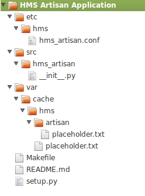
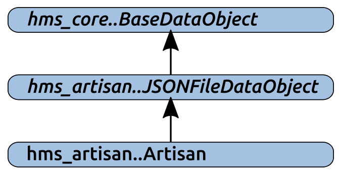
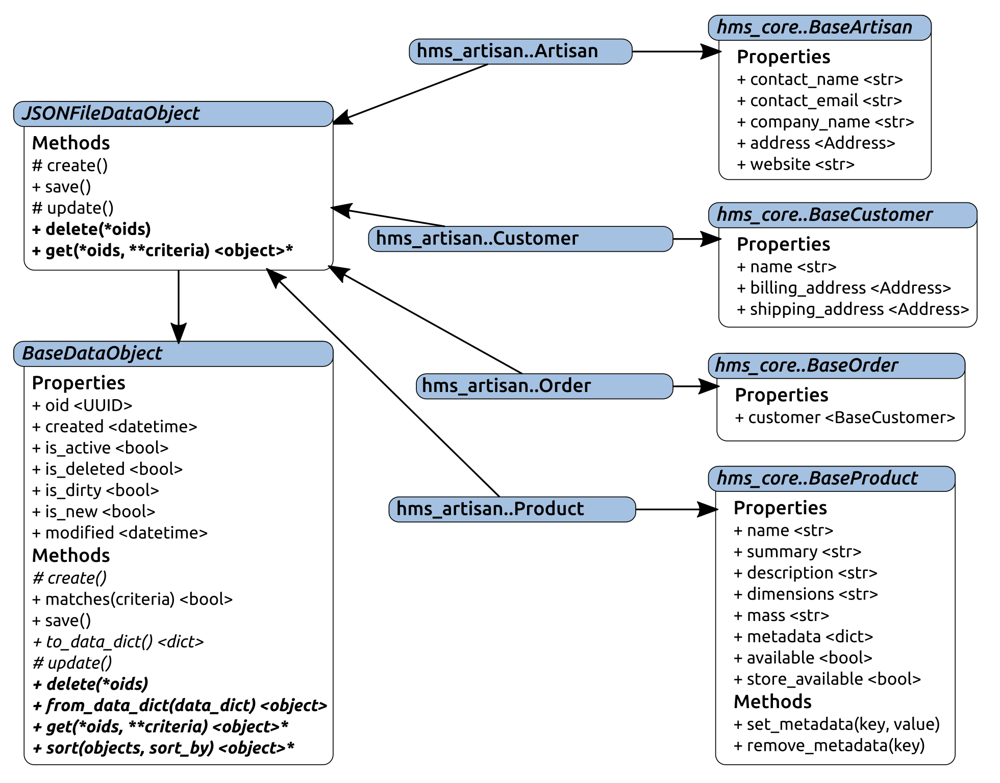
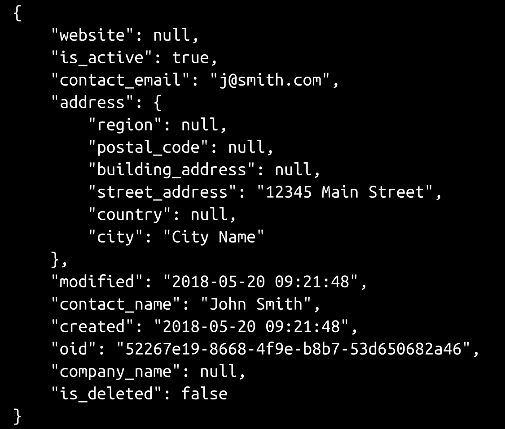
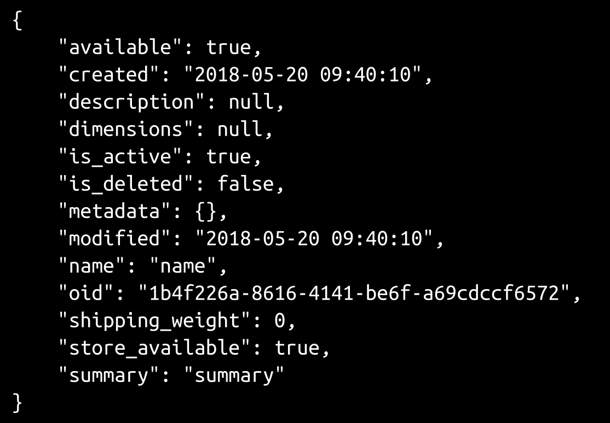
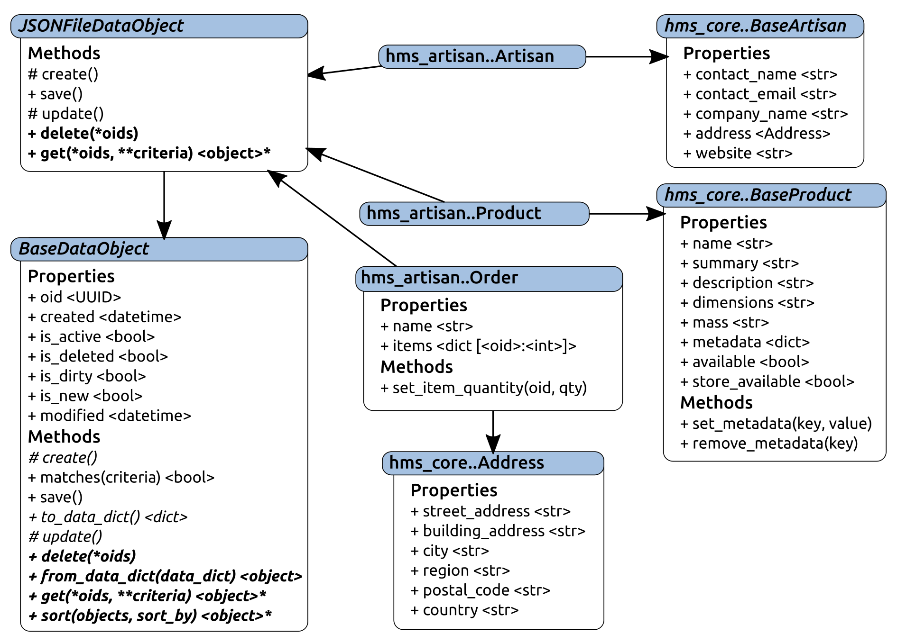

# 将对象数据持久化到文件

乍一看，向驻留在文件系统中的数据存储读写数据的过程可能比许多数据库支持的存储机制的等效过程简单得多。毕竟，读写文件是一个非常基本的过程。但实际上，这是一个稍微复杂一些的过程。在某种程度上，需要采取预防措施来处理文件系统权限、使用数据访问硬关闭应用程序，甚至系统崩溃等问题。虽然这些措施在某种程度上使发展复杂化，但要确定这些措施的可能性，可能比在周围实施保障措施更具挑战性。

本章将涵盖以下内容：

*   `hms_artisan`的基本组件项目设置
*   另一个抽象层，用于封装所涉及的基于文件系统的数据存储需求
*   `hms_artisan`组件项目中的数据对象开发如下：
    *   工匠
    *   产品
    *   命令

# 建立 hms_artisan 项目

在我们所需的所有基础类中，我们可以在其他项目中建立与它们对应的具体类。由于计划为**Artisan 应用程序**提供一个自定义的本地数据存储机制，并且这可能比中央办公室应用程序和 Artisan 网关服务中的等效程序更复杂，因此可以说从该项目开始是最有意义的，通过创建项目结构来满足本故事的需要：

*   作为一名开发人员，我需要 Artisan 应用程序的一个项目，这样我就可以放置相关代码并构建应用程序。

最初，`hms_artisan`类的代码可以在`hms_artisan/__init__.py`文件中启动，就像`hms_core`中的业务对象 ABCs 在其根`__init__.py`文件中启动一样，但似乎可以合理地假设，这些类之所以被移动到自己的`business_objects.py`文件中，原因的某些变体模块可能位于 Artisan 应用程序代码库中。考虑到这一点，我们将创建一个`artisan_objects.py`模块来将它们分组并组织起来。这也将使我们更容易在同一个包中的单独模块中保留我们可能需要的任何数据存储类，这些类本身不是数据对象。我们可以同样轻松地将所有 Artisan 应用程序代码放入单个模块（`hms_artisan.py`，而不必在其中包含包目录和附带文件。没有功能上的理由不这样做，但除非有某种确定性，即永远不需要从单一模块文件实现更改为包结构，这增加了必须重新组织整个名称空间文件结构的长期风险。起始项目结构看起来非常像[第 7 章](07.html)、*设置项目和流程：*中定义的默认值



That sort of reorganization is not difficult, but it is time consuming, all the more so if unit test modules also have to be reorganized. When such a reorganization is under way, it has the potential to limit other work against a codebase by anyone who isn't part of the reorganization effort. It also has a lot of potential to make source control management very messy until it's complete, which isn't a great situation for a member of a dev team with other tasks to execute against that codebase to be in.

不过，我们很可能希望或需要为实际应用程序提供一个单独的模块，因此从一开始就将代码细分为逻辑分组才有意义。

# 创建本地文件系统数据存储

工匠对存储数据的需求体现在两个故事中：

*   作为一名工匠，我需要一个本地数据存储区来存储我所有的系统数据，这样我就不必连接到互联网来进行更改
*   作为 Artisan，我需要本地数据存储尽可能简单，不需要额外的软件安装，这样我就不必担心安装和维护数据库系统以及 Artisan 应用程序

各种 Artisan 应用程序数据对象与`BaseDataObject`之间的最终关系可以简单到让每个 Artisan 级别的类直接从`BaseDataObject`派生。事实上，如果在工匠级别上只有一个这样的职业，并且在可预见的未来不会发生变化，那么采取这种方法将是非常有意义的。处理记录文件的创建、更新其中的数据、读取或删除的代码可能存在于一个单独的类中。但是，由于我们需要关注三种对象类型，因此将基于文件的数据存储的公共功能收集到另一个抽象类（位于`BaseDataObject`和具体`hms_artisan`类之间）至少有一些潜在的好处，例如`hms_artisan..Artisan`：



中间类`JSONFileDataObject`将扩展`BaseDataObject`，添加特定于管理 JSON 格式文件集合中的对象状态数据任务的功能和数据。同时，它将保留来自`BaseDataObject`的抽象需求，或者提供它们的具体实现，并使它们可用于`hms_artisan..Artisan`等类。这种继承结构的净好处是，理想情况下，对 JSON 支持的对象数据存储执行 CRUD 操作所需的所有功能都可以驻留在一个地方。事实上，一些细节可能必须存在于具体的类实现中——否则，它们可能最终都被包装到一个类中——但几乎可以肯定，在中间继承级别上可以实现大量的共性。

从`JSONFileDataObject`派生的任何类的更完整目标集合至少包括以下内容：

*   任何派生类的所有存储数据都可能位于一个位置
*   每个对象类型（类）的实例数据可能位于顶级位置中的公共位置
*   任何给定实例的数据都应该驻留在一个单独的、不同的文件中，该文件的名称可以与它存储数据的实例唯一相关

此外，还有一些值得考虑的应该具备或很好具备的功能：

*   如果该过程不涉及每次执行数据读取时为每个文件查找、打开、读取和创建对象，那么数据读取操作将更快。这样做的一个权衡是，无论何时执行数据更改操作，他们都必须负责在数据所在的所有位置对涉及的任何数据进行适当的更改。如果内存中存在从持久性文件读取的对象集合，例如：
    *   创建操作必须将新对象添加到内存存储中
    *   更新必须写入数据存储文件并更新内存中的对象

    *   删除操作必须删除相关文件，并从内存存储中删除相应的对象

不过，这些都不是特别难以实施的。

# 实现 JSONFileDataObject

定义`JSONFileDataObject`抽象类始于标准`ABCMeta`元类规范，以及一些用于各种用途的类级属性：

```py
class JSONFileDataObject(BaseDataObject, metaclass=abc.ABCMeta):
    """
Provides baseline functionality, interface requirements, and 
type-identity for objects that can persist their state-data as 
JSON files in a local file-system file-cache
"""
    ###################################
    # Class attributes/constants      #
    ###################################

    _file_store_dir = None
    _file_store_ready = False
    _loaded_objects = None
```

哪里：

*   `_file_store_dir`是默认的文件系统目录规范，最终需要从最终可安装应用程序的配置文件中读取。目前，出于单元测试的目的，它将有一个硬编码的值集，可以在开发和测试期间使用，当我们进入 Artisan 应用程序的实现时，我们将查看配置设置。

*   `_file_store_ready`是一个标志值，用于向类指示是否已从数据文件加载所有可用对象，从而指示是否需要在执行任何 CRUD 操作之前加载这些对象。

*   `_loaded_objects`是存储类加载的对象集合的地方。实际存储的对象将是对象实例的`dict`，但在加载操作完成之前，默认为`None`，以便稍后确定卸载（`None`和加载时没有对象（空的`dict`状态）之间的关系。

由于该类继承自`BaseDataObject`，因此该类将从此处定义的抽象需求开始，并且在不满足这些需求的情况下无法实例化。但是，由于我们希望`JSONFileDataObject`也是抽象的，所以它也有标准的 ABC 元类规范，并且本身也是抽象的。

`JSONFileDataObject`的初始化方法的签名与它派生的`BaseDataObject`的签名相同，但在该过程中它执行一些额外的任务：

```py
###################################
# Object initialization           #
###################################

def __init__(self, 
    oid:(UUID,str,None)=None, 
    created:(datetime,str,float,int,None)=None, 
    modified:(datetime,str,float,int,None)=None,
    is_active:(bool,int,None)=None, 
    is_deleted:(bool,int,None)=None,
    is_dirty:(bool,int,None)=None, 
    is_new:(bool,int,None)=None,
):
    """
Object initialization.

self .............. (JSONFileDataObject instance, required) The 
                    instance to execute against
oid ............... (UUID|str, optional, defaults to None) 
created ........... (datetime|str|float|int, optional, defaults to None) 
modified .......... (datetime|str|float|int, optional, defaults to None) 
is_active ......... (bool|int, optional, defaults to None) 
is_deleted ........ (bool|int, optional, defaults to None) 
is_dirty .......... (bool|int, optional, defaults to None) 
is_new ............ (bool|int, optional, defaults to None) 
"""
```

涉及的第一个新功能是检查`_file_store_dir`类属性的非`None`值。由于这些类的全部目的是能够将对象数据保存到 JSON 文件中，并且这些文件需要一个实际驻留的位置，因此没有指定一个位置是一个关键问题，这将阻止任何有用的 CRUD 操作执行，因此如果检测到问题，将出现错误：

```py
 # - When used by a subclass, require that subclass to 
 #   define a valid file-system path in its _file_store_dir 
 #   class-attribute - that's where the JSON files will live
    if self.__class__._file_store_dir == None:
        raise AttributeError(
            '%s has not defined a file-system location to '
            'store JSON data of its instances\' data. Please '
            'set %s._file_store_dir to a valid file-system '
            'path' % 
            (self.__class__.__name__, self.__class__.__name__)
        )
```

类似地，即使指定了文件存储位置，该位置也必须存在，并且代码在具有助理权限的用户帐户下运行时可以访问该位置。然后，每个类都需要检查该位置是否存在（如果不存在，则创建该位置），并确保可以写入、读取和删除文件。每次创建类的实例时，该检查过程都可能触发，但如果该过程已经完成一次，则从该点开始跳过它应该是令人满意的：

```py
if not self.__class__._file_store_ready:
  # - The first time the class is used, check the file-
  #   storage directory, and if everything checks out, 
  #   then re-set the flag that controls the checks.
if not os.path.exists(self.__class__._file_store_dir):
  # - If the path-specification exists, try to 
  #   assure that the *path* exists, and create it 
  #   if it doesn't. If the path can't be created, 
  #   then that'll be an issue later too, so it'll 
  #   need to be dealt with.
       try:
           os.makedirs(self.__class__._file_store_dir)
        except PermissionError:
            raise PermissionError(
               '%s cannot create the JSON data-store '
               'directory (%s) because permission was '
               'denied. Please check permissions on '
               'that directory (or its parents, if it '
               'hasn\'t been created yet) and try '
               'again.' % 
                 (
                     self.__class__.__name__, 
                     self.__class__._file_store_dir
                  )
              )
```

值得注意的是，由于`_file_store_ready`值是一个 class 属性，因此该值将在整个 Python 运行中保持不变。也就是说，以 Artisan 应用程序为例，将发生以下情况：

1.  应用程序已启动
2.  在某个时刻，数据对象类实例被初始化（例如，一个`Product`，检查过程运行，成功地验证了产品对象的所有数据存储需求，并相应地将`_file_store_ready`设置为`True`
3.  用户对应用程序执行的操作不与任何产品对象交互
4.  另一个产品对象已初始化，但由于`_file_store_ready`标志已设置为`True`，因此跳过检查过程

但是，一旦应用程序关闭，该标志值就会消失，因此下一次启动应用程序时，将在第一次初始化产品对象时重复检查过程。

如前所述，还可以通过首先写入文件来检查文件访问权限：

```py
  # - Check to make sure that files can be 
  #   created there...
     try:
        test_file = open(
        '%s%stest-file.txt' % 
        (self.__class__._file_store_dir, os.sep), 
            'w'
        )
         test_file.write('test-file.txt')
         test_file.close()
     except PermissionError:
         raise PermissionError(
             '%s cannot write files to the JSON data-'
             'store directory (%s) because permission was '
             'denied. Please check permissions on that '
              'directory and try again.' % 
            (
                self.__class__.__name__, 
                self.__class__._file_store_dir
             )
           )
```

然后，通过读取刚写入的文件：

```py
 # - ... that files can be read from there...
    try:
       test_file = open(
       '%s%stest-file.txt' % 
        (self.__class__._file_store_dir, os.sep), 
             'r'
        )
           test_file.read()
           test_file.close()
           except PermissionError:
                raise PermissionError(
                    '%s cannot read files in the JSON data-'
                    'store directory (%s) because permission was '
                    'denied. Please check permissions on that '
                    'directory and try again.' % 
                    (
                        self.__class__.__name__, 
                        self.__class__._file_store_dir
                    )
                )
```

最后，通过删除该文件：

```py
            # - ... and deleted from there...
            try:
                os.unlink(
                    '%s%stest-file.txt' % 
                    (self.__class__._file_store_dir, os.sep)
                )
            except PermissionError:
                raise PermissionError(
                    '%s cannot delete files in the JSON data-'
                    'store directory (%s) because permission was '
                    'denied. Please check permissions on that '
                    'directory and try again.' % 
                    (
                        self.__class__.__name__, 
                        self.__class__._file_store_dir
                    )
                )
            # - If no errors were raised, then re-set the flag:
            self._file_store_ready = True
```

`__init__()`的余额遵循先前建立的相同结构。由于该类有一个父类–`BaseDataObject`–它调用该初始值设定项，但由于没有本地属性可初始化或为其设置值，因此没有任何此类调用。所有其他属性的初始化都由对`BaseDataObject.__init__`的调用处理：

```py
    # - Call parent initializers if needed
    BaseDataObject.__init__(
        self, oid, created, modified, is_active, is_deleted, 
        is_dirty, is_new
    )
    # - Set default instance property-values using _del_... methods
    # - Set instance property-values from arguments using 
    #   _set_... methods
    # - Perform any other initialization needed
```

其中有三种方法需要在`JSONFileDataObject`中解决，它们要么是`BaseDataObject`中的抽象所要求的，要么是具体的实现。`BaseDataObject`需要`_create`和`_update`方法，但在这个类的上下文中没有多大意义，因为无论涉及的操作是创建还是更新，都会发生相同的基本操作。这两种方法在实现时都只会引发一个错误，其中包含一些对遇到错误的开发人员有用的信息：

```py
def _create(self) -> None:
    """
Creates a new state-data record for the instance in the back-end 
data-store
"""
    # - Since all data-transactions for these objects involve 
    #   a file-write, we're just going to define this method 
    #   in order to meet the requirements of BaseDataObject, 
    #   make it raise an error, and override the save method 
    #   to perform the actual file-write.
    raise NotImplementedError(
        '%s._create is not implemented, because the save '
        'method handles all the data-writing needed for '
        'the class. Use save() instead.' % 
        self.__class__.__name__
    )

def _update(self) -> None:
    """
Updates an existing state-data record for the instance in the 
back-end data-store
"""
    # - Since all data-transactions for these objects involve 
    #   a file-write, we're just going to define this method 
    #   in order to meet the requirements of BaseDataObject, 
    #   make it raise an error, and override the save method 
    #   to perform the actual file-write.
    raise NotImplementedError(
        '%s._update is not implemented, because the save '
        'method handles all the data-writing needed for '
        'the class. Use save() instead.' % 
        self.__class__.__name__
    )
```

然后，这些更改将所有将数据写入文件的责任都放在了`save`方法上，无论所保存的数据是代表新的/创建的操作还是编辑/更新的操作。虽然不太可能，但在程序运行时，存储数据文件的目录的权限也不可能发生更改。最初对它们进行了检查，但这只意味着它们在检查时是有效的，因此将数据写入文件的过程也应该独立地对它们进行检查：

```py
def save(self):
    """
Saves the instance's state-data to the back-end data-store by 
creating it if the instance is new, or updating it if the 
instance is dirty
"""
    if self.is_new or self.is_dirty:
```

确实需要先用`_load_objects`确认对象已经加载到内存中；在执行时，这将始终是调用继承的类方法的类的实例，因此该类必须作为参数显式传递：

```py
# - Make sure objects are loaded:
self.__class__._load_objects(self.__class__)
```

然后，它保存数据并确认对象本身存储在内存中：

```py
# - Try to save the data:
 try:
  # - Open the file
   fp = open(
     '%s%s-data%s%s.json' %
         (
            self.__class__._file_store_dir, os.sep, 
            self.__class__.__name__, os.sep, 
            self.oid
         ), 'w'
    )
      # - Write the instance's data-dict to the file as JSON
      json.dump(fp, self.to_data_dict(), indent=4)
      # - re-set the new and dirty state-flags
      self._set_is_dirty(False)
      self._set_is_new(False)
      # - Update it in the loaded objects
      self.__class__._loaded_objects[self.oid] = self
```

如果文件写入失败（`json.dump`调用）并出现与权限相关的错误，则不会提交任何内存中的更新，并且应发出更方便最终用户的错误消息，以防需要向该最终用户显示：

```py
except PermissionError:
   # - Raise a more informative error
      raise PermissionError(
         '%s could not save an object to the JSON data-'
         'store directory (%s) because permission was '
         'denied. Please check permissions on that '
         'directory and try again.' % 
       (
           self.__class__.__name__, 
           self.__class__._file_store_dir
```

```py
 )
   )
# - Any other errors will just surface for the time being
```

相同的公共存储位置文件系统路径值允许 save 方法具体化，也允许`delete`和`get`类方法具体化为`JSONFileDataObject`类方法。由于类属性定义了查找与任何/所有对象实例相关的数据文件所需的内容，因此删除代码可以通过适当的错误处理直接执行所需的文件删除操作：

```py
@classmethod
def delete(cls, *oids):
    """
Performs an ACTUAL record deletion from the back-end data-store 
of all records whose unique identifiers have been provided
"""
    # - First, ensure that objects are loaded
    cls._load_objects(cls)
    # - For each oid specified, try to remove the file, handling 
    #   any errors raised in the process.
    failed_deletions = []
    for oid in oids:
        try:
            # - Try to delete the file first, so that deletion 
            #   failures won't leave the files but remove the 
            #   in-memory copies
            file_path = '%s%s%s-data%s%s.json' %(
                cls._file_store_dir, os.sep, 
                cls.__name__, os.sep, oid
            )
            # - Delete the file at file_path
            os.unlink(file_path)
            # - Remove the in-memory object-instance:
            del cls._loaded_objects[str(oid)]
        except PermissionError:
            failed_deletions.append(file_path)
    if failed_deletions:
        # - Though we *are* raising an error here, *some* deletions 
        #   may have succeeded. If this error-message is displayed, 
        #   the user seeing it need only be concerned with the 
        #   items that failed, though...
        raise PermissionError(
            '%s.delete could not delete %d object-data %s '
            'because permission was denied. Please check the '
            'permissions on %s and try again' % 
            (
                cls.__name__, len(failed_deletions), 
                ('files' if len(failed_deletions) > 1 else 'file'), 
                ', '.join(failed_deletions)
            )
        )
```

`get`方法不需要直接读取文件–由`_load_objects`类方法处理，加载`get`依赖的所有数据–一旦相关对象存在于内存中，即使使用条件或对象 ID 和条件的组合，也可以非常简单快速地找到它们：

```py
@classmethod
def get(cls, *oids, **criteria):
    """
Finds and returns all instances of the class from the back-end 
data-store whose oids are provided and/or that match the supplied 
criteria
"""
    # - First, ensure that objects are loaded
    cls._load_objects(cls)
```

如果提供了`oids`，流程必须考虑这些因素，如果提供了`criteria`：

```py
    # - If oids have been specified, then the initial results are all 
    #   items in the in-memory store whose oids are in the supplied 
    #   oids-list
    if oids:
        oids = tuple(
            [str(o) for o in oids]
        )
        # - If no criteria were supplied, then oids are all we need 
        #   to match against:
        if not criteria:
            results = [
                o for o in cls._loaded_objects.values()
                if str(o.oid) in oids
            ]
        # - Otherwise, we *also* need to use matches to find items 
        #   that match the criteria
        else:
            results = [
                o for o in cls._loaded_objects.values()
                if str(o.oid) in oids
                and o.matches(**criteria)
            ]
        # - In either case, we have a list of matching items, which 
        #   may be empty, so return it:
        return results
```

如果没有提供`oids`，但是提供了`criteria`，则流程类似：

```py
    # - If oids were NOT specified, then the results are all objects 
    #   in memory that match the criteria
    elif criteria:
        results = [
            o for o in cls._loaded_objects
            if o.matches(**criteria)
        ]
        return results
        # - If neither were specified, return all items available:
        else:
            return list(cls._loaded_objects.values())
```

在这两个分支中，基于`criteria`的任何过滤都由单个对象的`matches`方法处理，使得根据特定属性值搜索对象的过程非常简单。

所有这些都依赖于`_load_objects`类方法来检索和填充所有对象的内存副本，这些对象的数据已作为 JSON 文件持久化，并将它们附加到`_loaded_objects`字典中的相关类，该字典定义为公共类属性：

```py
def _load_objects(cls, force_load=False):
    """
Class-level helper-method that loads all of the objects in the 
local file-system data-store into memory so that they can be 
used more quickly afterwards.

Expected to be called by the get class-method to load objects 
for local retrieval, and other places as needed.

cls .......... (class, required) The class that the method is 
               bound to
force_load ... (bool, optional, defaults to False) If True, 
               forces the process to re-load data from scratch, 
               otherwise skips the load process if data already 
               exists.
"""
```

如果数据尚未加载（由包含`None`值的`_loaded_objects`属性指示），或者如果调用了显式数据重新加载（在`force_load`参数中接收到`True`值），则该方法在验证相关目录存在后检索类数据目录中所有文件的列表，如果不创建，则尝试创建，如果需要创建但无法创建，则引发错误：

```py
    if cls._loaded_objects == None or force_load:
        if not os.path.exists(cls._file_store_dir):
            # - If the path-specification exists, try to 
            #   assure that the *path* exists, and create it 
            #   if it doesn't. If the path can't be created, 
            #   then that'll be an issue later too, so it'll 
            #   need to be dealt with.
            try:
                os.makedirs(cls._file_store_dir)
            except PermissionError:
                raise PermissionError(
                    '%s cannot create the JSON data-store '
                    'directory (%s) because permission was '
                    'denied. Please check permissions on '
                    'that directory (or its parents, if it '
                    'hasn\'t been created yet) and try '
                    'again.' % 
                    (cls.__name__, cls._file_store_dir)
                )
        class_files_path = '%s%s%s-data' % (
            cls._file_store_dir, os.sep, 
            cls.__name__
        )
        if not os.path.exists(class_files_path):
            try:
                os.makedirs(class_files_path)
            except PermissionError:
                raise PermissionError(
                    '%s cannot create the JSON data-store '
                    'directory (%s) because permission was '
                    'denied. Please check permissions on '
                    'that directory (or its parents, if it '
                    'hasn\'t been created yet) and try '
                    'again.' % 
                    (cls.__name__, class_files_path)
                )
        # - Get a list of all the JSON files in the data-store 
        #   path
        files = [
            fname for fname in os.listdir(
                '%s%s%s-data' % (
                    cls._file_store_dir, os.sep, 
                    cls.__name__
                )
            ) if fname.endswith('.json')
        ]
```

如果找到任何文件，则尝试读取每个文件，将其从预期的 JSON 编码的`data_dict`转换为类的实际实例，并将实例添加到`_loaded_objects`属性中。由于`_loaded_objects`是一个类属性，只要该类定义处于活动状态，加载的值就会一直存在。除非对类本身进行显式清除或重新定义，否则这将在运行代码的 Python 解释器期间保持不变，从而允许进程读入的数据在使用它的代码运行期间保持不变：

```py
 cls._loaded_objects = {}
    if files:
      for fname in files:
         item_file = '%s%s-data%s%s' % (
         self.__class__._file_store_dir, os.sep, 
         self.__class__.__name__, os.sep, fname
        )
      try:
        # - Read the JSON data
        fp = open(item_file, 'r')
        data_dict = json.load(fp)
        fp.close()
        # - Create an instance from that data
        instance = cls.from_data_dict(data_dict)
        # - Keep track of it by oid in the class
        cls._loaded_objects[instance.oid] = instance
```

由于在 Artisan 应用程序运行时，数据文件本身或文件父目录的文件系统权限可能会发生更改（即使可能性不大），因此文件读取可能引发`PermissionError`异常，因此会捕获并跟踪这些异常，直到过程完成：

```py
   # - If permissions are a problem, raise an 
   #   error with helpful information
      except PermissionError as error:
         raise PermissionError(
             '%s could not load object-data from '
             'the data-store file at %s because '
             'permission was denied. Please check '
             '(and, if needed, correct) the file- '
             'and directory-permissions and try '
```

```py
             'again' % 
             (cls.__name__, item_file)
           )
```

类似地，如果数据文件的内容无效，则会引发错误，但在本例中是立即发生的。即时性的基本原理是数据已损坏，在允许任何更改发生之前，需要先解决该问题：

```py
# - If data-structure or -content is a problem, 
#   raise an error with helpful information
     except (TypeError, ValueError) as error:
          raise error.__class__(
              '%s could not load object-data from '
              'the data-store file at %s because '
              'the data was corrupt or not what '
              'was expected (%s: %s)' % 
              (
                  cls.__name__, item_file, 
                  error.__class__.__name__, error
              )
          )
# - Other errors will simply surface, at 
#   least for now
```

任何其他错误都将级联到调用代码，在那里进行处理或允许中止应用程序的执行。

最初的目标，包括“应该拥有”或“最好拥有”功能，都已在一整套 CRUD 运行机制中说明：

*   任何派生类的所有存储数据都可能位于一个位置。这由`_file_store_dir`类属性强制执行。
*   每个对象类型（类）的实例数据可能位于顶级位置中的一个公共位置，任何给定实例的数据可能位于一个单独的、不同的文件中，该文件的名称可以与它存储数据的实例唯一相关。通过确保使用的所有文件路径都包含类名来管理这些，例如，所有产品实例数据都将存储在`_file_store_dir/Product-data/*.json`文件中。

*   如果该过程不涉及每次执行数据读取时为每个文件查找、打开、读取和创建对象，那么数据读取操作将更快。`_load_objects`类方法执行加载，并确保在执行任何 CRUD 操作之前调用它，以确保这些操作可用。创建、更新和删除过程都会考虑持久数据文件和与这些实例相关的内存实例。

# hms_artisan 的具体业务对象

Artisan 应用程序中具体类的最终定义实际上可以归结为以下几点：

*   定义每个混凝土类别：
    *   派生自`hms_core`中对应的基类
    *   源自刚刚定义的`JSONFileDataObject`
*   收集新类`__init__`方法的参数，该方法需要考虑父类的所有参数。
*   实现父类所需的任何抽象实例和类方法，其中许多已设置为允许派生类调用父类的抽象方法。
*   设置一个`_file_store_dir`类属性值，该值可由类的实例使用，直到最终应用程序配置完成。

如果将这些关系绘制成图表，可能会更有意义：



# 处理是脏的和属性

`BaseDataObject`提供`is_dirty`属性，该属性用于指示对象的状态数据何时发生更改（例如，当调用任何`_set_`或`_del_`方法时，应将其设置为`True`。由于具体对象的属性 setter 和 deleter 方法（在其相应的基类中定义）根本不知道该功能，因此由具体对象来实现该功能。

但是，由于这些 setter 和 deleter 方法可以在派生的具体类定义中调用，因此实现非常简单。以`Artisan`的`address`属性为例，我们本质上定义了调用`BaseArtisan`中对应项的本地 setter 和 deleter 方法：

```py
###################################
# Property-setter methods         #
###################################

def _set_address(self, value:Address) -> None:
    # - Call the parent method
    result = BaseArtisan._set_address(self, value)
    self._set_is_dirty(True)
    return result

# ...

###################################
# Property-deleter methods        #
###################################

def _del_address(self) -> None:
    # - Call the parent method
    result = BaseArtisan._del_address(self)
    self._set_is_dirty(True)
    return result
```

一旦定义了这些方法，就必须重新定义属性本身，以便指向适当的方法。没有这个步骤，`Artisan`对象的属性仍然指向`BaseArtisan`setter 和 deleter 方法，因此`is_dirty`标志永远不会被设置，数据更改也永远不会被保存：

```py
###################################
# Instance property definitions   #
###################################

address = property(
    BaseArtisan._get_address, _set_address, _del_address, 
    'Gets, sets or deletes the physical address (Address) '
    'associated with the Artisan that the instance represents'
)
```

同样的模式也适用于`hms_artisan`类的所有属性。

然而，这也意味着，所有这些类，因为它们都在其`__init__`方法的执行过程中使用各种`_del_`方法来初始化实例值，所以在创建对象时，也可能需要显式地将`is_dirty`重置为`False`。

这是一种处理对象实例脏状态的非常简单的方法。此实现背后的基本假设是，发生的任何属性设置或删除都会更改适用的状态值，因此实例是脏的。即使新值与属性的旧值相同，情况也是如此。在每个数据库事务（一些基于云的数据存储）都有实际货币成本的系统中，在执行设置代码或删除代码之前检查属性值，甚至不进行更改，更不用说设置`is_dirty`标志，这可能是值得的，如果传入的新值与现有值相同。

# hms_artisan.artisan

Artisan 需要能够在 Artisan 应用程序中操作自己的数据：

*   作为一名工匠，我需要能够创建、管理和存储我自己的系统数据，以便使其保持最新

`Artisan`类的初始代码提供了满足本文需求的数据结构和持久性，这是非常轻量级的，因为大部分功能都是从`hms_core`、`BaseArtisan`（用于属性和数据结构）和`JSONFileDataObject`（用于方法和持久性功能）继承而来的。不算注释和文档，它只有不到 60 行真正的代码：

```py
class Artisan(BaseArtisan, JSONFileDataObject, object):
    """
Represents an Artisan in the context of the Artisan Application
"""
    ###################################
    # Class attributes/constants      #
    ###################################

    # TODO: Work out the configuration-based file-system path 
    #       for this attribute
    _file_store_dir = '/tmp/hms_data'
```

`__init__`方法有一个长而详细的参数签名，有 12 个参数（其中三个是必需的），还有`products`参数列表。它可能看起来令人望而生畏，但大多数用例都不需要它（稍后会有更多的介绍）。它真正需要做的就是调用父初始值设定项来设置适用的属性值：

```py
    ###################################
    # Object initialization           #
    ###################################

    # TODO: Add and document arguments if/as needed
    def __init__(self,
        # - Required arguments from BaseArtisan
        contact_name:str, contact_email:str, address:Address, 
        # - Optional arguments from BaseArtisan
        company_name:str=None, website:(str,)=None, 
        # - Optional arguments from BaseDataObject/JSONFileDataObject
        oid:(UUID,str,None)=None, 
        created:(datetime,str,float,int,None)=None, 
        modified:(datetime,str,float,int,None)=None,
        is_active:(bool,int,None)=None, 
        is_deleted:(bool,int,None)=None,
        is_dirty:(bool,int,None)=None, 
        is_new:(bool,int,None)=None,
        # - the products arglist from BaseArtisan
        *products
    ):
        """
Object initialization.

self .............. (Artisan instance, required) The instance to 
                    execute against
contact_name ...... (str, required) The name of the primary contact 
                    for the Artisan that the instance represents
contact_email ..... (str [email address], required) The email address 
                    of the primary contact for the Artisan that the 
                    instance represents
address ........... (Address, required) The mailing/shipping address 
                    for the Artisan that the instance represents
company_name ...... (str, optional, defaults to None) The company-
                    name for the Artisan that the instance represents
website ........... (str, optional, defaults to None) The the URL of 
                    the website associated with the Artisan that the 
                    instance represents
oid ............... (UUID|str, optional, defaults to None) 
created ........... (datetime|str|float|int, optional, defaults to None) 
modified .......... (datetime|str|float|int, optional, defaults to None) 
is_active ......... (bool|int, optional, defaults to None) 
is_deleted ........ (bool|int, optional, defaults to None) 
is_dirty .......... (bool|int, optional, defaults to None) 
is_new ............ (bool|int, optional, defaults to None) 
products .......... (BaseProduct collection) The products associated 
                    with the Artisan that the instance represents
"""
        # - Call parent initializers if needed
        BaseArtisan.__init__(
            self, contact_name, contact_email, address, 
            company_name, website, *products
        )
        JSONFileDataObject.__init__(
            self, oid, created, modified, is_active, 
            is_deleted, is_dirty, is_new
        )
        # - Set default instance property-values using _del_... methods
        # - Set instance property-values from arguments using 
        #   _set_... methods
        # - Perform any other initialization needed
```

大部分实例方法都可以在其来源的类中调用原始抽象方法（及其现有实现）：

```py
    ###################################
    # Instance methods                #
    ###################################

    def add_product(self, product:BaseProduct) -> BaseProduct:
        return HasProducts.add_product(self, product)

    def matches(self, **criteria) -> (bool,):
        return BaseDataObject.matches(self, **criteria)

    def remove_product(self, product:BaseProduct) -> BaseProduct:
        return HasProducts.remove_product(self, product)
```

例外的是`to_data_dict`方法，它必须为每个混凝土类定制。不过，它所需要做的只是返回一个包含所有应该持久化的属性和值的`dict`，这些属性和值可以用于对象的初始化。`address`属性有一个问题，从能够将其存储在 JSON 文件的角度来看，这将很快得到检查。

`datetime`和`UUID`属性被转换为传出数据字典的字符串值，并且在`Artisan`对象初始化期间，它们已经位于要转换回其本机数据类型的位置：

```py
    def to_data_dict(self) -> (dict,):
        return {
            # Properties from BaseArtisan:
            'address':self.address,
            'company_name':self.company_name,
            'contact_email':self.contact_email,
            'contact_name':self.contact_name,
            'website':self.website, 
            # - Properties from BaseDataObject (through 
            #   JSONFileDataObject)
            'created':datetime.strftime(
                self.created, self.__class__._data_time_string
            ),
            'is_active':self.is_active,
            'is_deleted':self.is_deleted,
            'modified':datetime.strftime(
                self.modified, self.__class__._data_time_string
            ),
            'oid':str(self.oid),
        }
```

与前面的大部分实例方法一样，单类方法也使用原始的抽象类方法，这些方法中包含实现：

```py
    ###################################
    # Class methods                   #
    ###################################

    @classmethod
    def from_data_dict(cls, data_dict:(dict,)):
        return cls(**data_dict)
```

`Artisan.__init__`的长参数签名乍一看可能有点令人生畏。毕竟，有很多参数，Python 的语言规定，在方法和函数参数定义中，参数必须在可选参数之前，这意味着必须先有三个参数（尽管它们之间的顺序取决于开发人员）。

然而，大多数时候，`__init__`方法可能不会被直接调用。从数据存储中检索到的数据创建实例需要使用类的`from_data_dict`方法来处理，可能如下所示：

```py
# - open the data-file, read it in, and convert it to a dict:
with open('data-file.json', 'r') as artisan_file:
    artisan = Artisan.from_data_dict(json.load(artisan_file))
```

`Artisan`实例也可以通过传递值字典直接创建：

```py
artisan = Artisan(**data_dict)
```

该方法唯一需要考虑的是，所需的参数必须在传递的`data_dict`中具有有效的条目，`data_dict`不能包含在`__init__`方法中不作为参数名称存在的键–本质上，对象创建等同于以下内容：

```py
artisan = Artisan(
    contact_name='value', contact_email='value', address=<Address Object>
    # ... and so on for any relevant optional arguments
)
```

需要注意的是，`address`属性在为`Artisan`实例创建 JSON 输出时存在问题。核心问题是`Address`类不能直接序列化为 JSON：

```py
import json
address = Address('12345 Main Street', 'City Name')
a = Artisan('John Smith', 'j@smith.com', address)
print(json.dumps(a.to_data_dict(), indent=4))
```

如果执行上述代码，则会引发`TypeError: <hms_core.business_objects.Address object> is not JSON serializable`。

尽管这个问题有几种可能的解决方案，但由于我们已经建立了一种将对象转换为字典值并从字典值中读取/创建对象的模式，最类似于这种模式的是在`hms_core`中的原始`Address`类上实现`to_dict`和`from_dict`方法，并更改`to_data_dict`结果使用实例的`address`的`to_dict`。新的`Address`方法很简单：

```py
    ###################################
    # Instance methods                #
    ###################################

    def to_dict(self) -> (dict,):
        return {
            'street_address':self.street_address,
            'building_address':self.building_address,
            'city':self.city,
            'region':self.region,
            'postal_code':self.postal_code,
            'country':self.country
        }

    ###################################
    # Class methods                   #
    ###################################

    @classmethod
    def from_dict(cls, data_dict):
        return cls(**data_dict)
```

与对`Artisan.to_data_dict`的更改一样：

```py
    def to_data_dict(self) -> (dict,):
        return {
            # Properties from BaseArtisan:
            'address':self.address.to_dict() if self.address else None,
            'company_name':self.company_name,
            'contact_email':self.contact_email,
            'contact_name':self.contact_name,
            'website':self.website, 
            # - Properties from BaseDataObject (through 
            #   JSONFileDataObject)
            'created':datetime.strftime(
                self.created, self.__class__._data_time_string
            ),
            'is_active':self.is_active,
            'is_deleted':self.is_deleted,
            'modified':datetime.strftime(
                self.modified, self.__class__._data_time_string
            ),
            'oid':str(self.oid),
        }
```

有了这些更改，重新运行之前引发`TypeError`的代码现在可以生成可用的 JSON，这意味着`to_data_dict`调用的结果可以用来直接将保存`Artisan`数据所需的 JSON 文件写入文件系统数据存储：



# hms_artisan.Product

工匠对`Product`对象数据有类似的数据持久性需求：

*   作为一名技工，我需要能够创建、管理和存储`Product`数据，以便在中央办公系统中保持`product`信息的最新

`hms_artisan..Product`类与包的`Artisan`类一样，利用其相应的`hms_core`基类（`BaseProduct`和`JSONFileDataObject`ABC 来最小化具体实现中所需的实际代码量。

事实上，唯一真正的区别在于`__init__`方法（使用不同的参数，并调用不同的父初始化方法集）：

```py
    def __init__(self, 
        # - Required arguments from BaseProduct
        name:(str,), summary:(str,), available:(bool,), 
        store_available:(bool,), 
        # - Optional arguments from BaseProduct
        description:(str,None)=None, dimensions:(str,None)=None,
        metadata:(dict,)={}, shipping_weight:(int,)=0, 
        # - Optional arguments from BaseDataObject/JSONFileDataObject
        oid:(UUID,str,None)=None, 
        created:(datetime,str,float,int,None)=None, 
        modified:(datetime,str,float,int,None)=None,
        is_active:(bool,int,None)=None, 
        is_deleted:(bool,int,None)=None,
        is_dirty:(bool,int,None)=None, 
        is_new:(bool,int,None)=None,
    ):
        """
Object initialization.

self .............. (Product instance, required) The instance to 
                    execute against
name .............. (str, required) The name of the product
summary ........... (str, required) A one-line summary of the 
                    product
available ......... (bool, required) Flag indicating whether the 
                    product is considered available by the artisan 
                    who makes it
store_available ... (bool, required) Flag indicating whether the 
                    product is considered available on the web-
                    store by the Central Office
description ....... (str, optional, defaults to None) A detailed 
                    description of the product
dimensions ........ (str, optional, defaults to None) A measurement-
                    description of the product
metadata .......... (dict, optional, defaults to {}) A collection 
                    of metadata keys and values describing the 
                    product
shipping_weight ... (int, optional, defaults to 0) The shipping-
                    weight of the product
"""
        # - Call parent initializers if needed
        BaseProduct.__init__(
            self, name, summary, available, store_available, 
            description, dimensions, metadata, shipping_weight
        )
        JSONFileDataObject.__init__(
            self, oid, created, modified, is_active, 
            is_deleted, is_dirty, is_new
        )
        # - Set default instance property-values using _del_... methods
        # - Set instance property-values from arguments using 
        #   _set_... methods
        # - Perform any other initialization needed
```

`to_data_dict`方法（必须考虑类的不同属性）：

```py
    def to_data_dict(self) -> (dict,):
        return {
            # Properties from BaseProduct:
            'available':self.available,
            'description':self.description,
            'dimensions':self.dimensions,
            'metadata':self.metadata,
            'name':self.name,
            'shipping_weight':self.shipping_weight,
            'store_available':self.store_available,
            'summary':self.summary,
            # - Properties from BaseDataObject (through 
            #   JSONFileDataObject)
            'created':datetime.strftime(
                self.created, self.__class__._data_time_string
            ),
            'is_active':self.is_active,
            'is_deleted':self.is_deleted,
            'modified':datetime.strftime(
                self.modified, self.__class__._data_time_string
            ),
            'oid':str(self.oid),
        }
```

类似的简单创建`Product`对象及其`to_data_dict`结果转储，会产生可行的 JSON 输出：

```py
p = Product('name', 'summary', True, True)
print(json.dumps(p.to_data_dict(), indent=4))
```

这将产生以下结果：



# hms_ 工匠订单

工匠还需要具备本地保存订单数据的能力：

*   作为一名技工，我需要能够创建、管理和存储`Order`数据，以便在订单转发给我时，我能够完成订单，并将其标记为中央办公室已完成

然而，订单数据与我们迄今为止在结构层面上探索的`Artisan`和`Product`数据略有不同：

*   `Order`归根结底是一个客户与一对多产品的关联。
*   工匠不需要跟踪单个客户，除非他们与订单相关，因此工匠需要不也是数据对象的`Customer`对象，就像`Artisan`对象有一个与其关联的`Address`对象本身不是数据对象一样。
*   作为`Order`一部分的`Customer`对象也有一个`Address`必须被解释。

*   与订单相关联的产品至少意味着与之相关联的数量的可能性——例如，客户可能想要订购一种产品中的两种，另一种产品中的五种，第三种产品中的一种——并且不需要传输所有的`Product`数据，只要每个`Product`都有`oid`在订单中提供。这将是 Artisan 应用程序从其本地`Product`数据存储中查找产品的足够信息。

回顾过去，最后一项对`hms_core`中`BaseOrder`的某些结构提出了质疑，或者至少它是否与 Artisan 的应用范围相关。根据目前的定义，它源自`hms_core`。。。`HasProducts`，其初衷是实际`Product`对象将与`Order`关联。这在中央办公室或网关服务上下文中可能有意义，但在 Artisan 应用程序上下文中不会非常有用。更好的产品顺序关系可能是存储`oids`以及`Order`中每个`Product`的数量，必要时让应用和服务查找：


退一步，看看 Artisan 应用程序的`Order`到底是什么，它似乎是一个`Address`，添加了`name`属性（订单的对象）和一些`Product`数量数据。`oid`产品规格和数量值之间的关联在`dict`中很容易管理属性，添加和删除订单项的过程可以封装在一个方法中，该方法接受`oid`和数量值。

对于工匠的订单数据来说，这似乎是一个更好的解决方案。除此结构所涵盖的数据外，他们不需要知道任何其他信息：

*   订单是给谁的（`name`
*   发送到的位置（从`Address`派生的属性）
*   哪些产品是订单的一部分，数量是多少（`items`

然后，`Order`类从`Address`和`JSONFileDataObject`派生而来，具有常见的类属性：

```py
class Order(Address, JSONFileDataObject, object):
    """
Represents an Order in the context of the Artisan Application
"""
    ###################################
    # Class attributes/constants      #
    ###################################

    # TODO: Work out the configuration-based file-system path 
    #       for this attribute
    _file_store_dir = '/tmp/hms_data'
```

属性定义、getter、setter 和 deleter 方法以及属性声明遵循到目前为止我们在其他地方使用的模式，`_get_items`返回当前属性的副本，以防止对实际数据进行不必要的操作。setter 和 deleter 方法还必须显式调用`_set_is_dirty(True)`为了确保在删除或设置本地属性时适当更改实例的`is_dirty`标志，必须覆盖属性本身及其从`Address`继承的 setter 和 deleter 方法。有两种本地 getter 方法：

```py
    ###################################
    # Property-getter methods         #
    ###################################

    def _get_items(self) -> dict:
        return dict(self._items)

    def _get_name(self) -> (str,None):
        return self._name
```

大多数 setter 方法调用它们的祖先方法 set`is_dirty`和`exit`，但与本地 getter 相对应的两个方法是完整实现：

```py
    ###################################
    # Property-setter methods         #
    ###################################

    def _set_building_address(self, value:(str,None)) -> None:
        result = Address._set_building_address(self, value)
        self._set_is_dirty(True)
        return result

    def _set_city(self, value:str) -> None:
        result = Address._set_city(self, value)
        self._set_is_dirty(True)
        return result

    def _set_country(self, value:(str,None)) -> None:
        result = Address._set_country(self, value)
        self._set_is_dirty(True)
        return result

    def _set_items(self, value:(dict,)) -> None:
        if type(value) != dict:
            raise TypeError(
                '%s.items expects a dict of UUID keys and int-'
                'values, but was passed "%s" (%s)' % 
                (self.__class__.__name__, value,type(value).__name__)
            )
        self._del_items()
        for key in value:
            self.set_item_quantity(key, value[key])
        self._set_is_dirty(True)

    def _set_name(self, value:(str,)) -> None:
        self._name = value
        self._set_is_dirty(True)

    def _set_region(self, value:(str,None)) -> None:
        result = Address._set_region(self, value)
        self._set_is_dirty(True)
        return result

    def _set_postal_code(self, value:(str,None)) -> None:
        result = Address._set_postal_code(self, value)
        self._set_is_dirty(True)
        return result

    def _set_street_address(self, value:str) -> None:
        result = Address._set_street_address(self, value)
        self._set_is_dirty(True)
        return result
```

deleter 方法遵循相同的模式：

```py
    ###################################
    # Property-deleter methods        #
    ###################################

    def _del_building_address(self) -> None:
        result = Address._del_building_address(self)
        self._set_is_dirty(True)
        return result

    def _del_city(self) -> None:
        result = Address._del_city(self)
        self._set_is_dirty(True)
        return result

    def _del_country(self) -> None:
        result = Address._del_country(self)
        self._set_is_dirty(True)
        return result

    def _del_items(self) -> None:
        self._items = {}
        self._set_is_dirty(True)

    def _del_name(self) -> None:
        self._name = None
        self._set_is_dirty(True)

    def _del_region(self) -> None:
        result = Address._del_region(self)
        self._set_is_dirty(True)
        return result

    def _del_postal_code(self) -> None:
        result = Address._del_postal_code(self)
        self._set_is_dirty(True)
        return result
```

```py
    def _del_street_address(self) -> None:
        result = Address._del_street_address(self)
        self._set_is_dirty(True)
        return result
        self._set_is_dirty(True)
```

其性质如下：

```py
    ###################################
    # Instance property definitions   #
    ###################################

    building_address = property(
        Address._get_building_address, _set_building_address, 
        _del_building_address, 
        'Gets, sets or deletes the building_address (str|None) '
        'of the instance'
    )
    city = property(
        Address._get_city, _set_city, _del_city, 
        'Gets, sets or deletes the city (str) of the instance'
    )
    country = property(
        Address._get_country, _set_country, _del_country, 
        'Gets, sets or deletes the country (str|None) of the '
        'instance'
    )
    items = property(
        _get_items, None, None,
        'Gets the items associated with the order, a dict of OID '
        'keys with quantity values'
    )
    name = property(
        _get_name, _set_name, _del_name, 
        'Gets, sets or deletes the name associated with the order'
    )
    region = property(
        Address._get_region, _set_region, _del_region, 
        'Gets, sets or deletes the region (str|None) of the '
        'instance'
    )
    postal_code = property(
        Address._get_postal_code, _set_postal_code, _del_postal_code, 
        'Gets, sets or deletes the postal_code (str|None) of '
        'the instance'
    )
    street_address = property(
        Address._get_street_address, _set_street_address, 
        _del_street_address, 
        'Gets, sets or deletes the street_address (str) of the '
        'instance'
    )
```

初始化过程（`__init__`又有一个长签名，因为它必须容纳来自其父类的所有参数，以及本地属性的参数：

```py
    ###################################
    # Object initialization           #
    ###################################

    def __init__(self, 
        name:(str,),
        # - Required arguments from Address
        street_address:(str,), city:(str,), 
        # - Local optional arguments
        items:(dict,)={},
        # - Optional arguments from Address
        building_address:(str,None)=None, region:(str,None)=None, 
        postal_code:(str,None)=None, country:(str,None)=None,
        # - Optional arguments from BaseDataObject/JSONFileDataObject
        oid:(UUID,str,None)=None, 
        created:(datetime,str,float,int,None)=None, 
        modified:(datetime,str,float,int,None)=None,
        is_active:(bool,int,None)=None, 
        is_deleted:(bool,int,None)=None,
        is_dirty:(bool,int,None)=None, 
        is_new:(bool,int,None)=None,
    ):
        """
Object initialization.

self .............. (Order instance, required) The instance to 
                    execute against
name .............. (str, required) The name of the addressee
street_address .... (str, required) The base street-address of the 
                    location the instance represents
city .............. (str, required) The city portion of the street-
                    address that the instance represents
items ............. (dict, optional, defaults to {}) The dict of 
                    oids-to-quantities of products in the order
building_address .. (str, optional, defaults to None) The second 
                    line of the street address the instance represents, 
                    if applicable
region ............ (str, optional, defaults to None) The region 
                    (state, territory, etc.) portion of the street-
                    address that the instance represents
postal_code ....... (str, optional, defaults to None) The postal-code 
                    portion of the street-address that the instance 
                    represents
country ........... (str, optional, defaults to None) The country 
                    portion of the street-address that the instance 
                    represents
oid ............... (UUID|str, optional, defaults to None) 
created ........... (datetime|str|float|int, optional, defaults to None) 
modified .......... (datetime|str|float|int, optional, defaults to None) 
is_active ......... (bool|int, optional, defaults to None) 
is_deleted ........ (bool|int, optional, defaults to None) 
is_dirty .......... (bool|int, optional, defaults to None) 
is_new ............ (bool|int, optional, defaults to None) 
"""
        # - Call parent initializers if needed
        Address.__init__(
            self, street_address, city, building_address, region, 
            postal_code, country
        )
        JSONFileDataObject.__init__(
            self, oid, created, modified, is_active, 
            is_deleted, is_dirty, is_new
        )
        # - Set default instance property-values using _del_... methods
        self._del_items()
        self._del_name()
        # - Set instance property-values from arguments using 
        #   _set_... methods
        self._set_name(name)
        if items:
            self._set_items(items)
        # - Perform any other initialization needed
        self._set_is_dirty(False)
```

`matches`方法仍然可以调用`BaseDataObject`的`matches`方法；不希望发生任何需要更多或不同的匹配：

```py
def matches(self, **criteria) -> (bool,):
  return BaseDataObject.matches(self, **criteria)
```

在订单中设置项目数量的过程需要进行大量的类型和值检查，但这些都遵循在早期代码中使用的模式，包括检查类型、将`oid`字符串值转换为`UUID`对象以及检查有效值：

```py
    def set_item_quantity(self, oid:(UUID,str), quantity:(int,)) -> None:
        if type(oid) not in (UUID, str):
            raise TypeError(
                '%s.set_item_quantity expects a UUID or string '
                'representation of one for its oid argument, but '
                'was passed "%s" (%s)' % 
                (self.__class__.__name__, oid, type(oid).__name__)
            )
        if type(oid) == str:
            try:
                oid = UUID(oid)
            except Exception as error:
                raise ValueError(
                    '%s.set_item_quantity expects a UUID or string '
                    'representation of one for its oid argument, but '
                    'was passed "%s" (%s) which could not be '
                    'converted into a UUID (%s: %s)' % 
                    (
                        self.__class__.__name__, oid, 
                        type(oid).__name__, error.__class__.__name__, 
                        error
                    )
                )
        if type(quantity) != int:
            raise TypeError(
                '%s.set_item_quantity expects non-negative int-value '
                'for its quantity argument, but was passed "%s" (%s)' 
                % (
                    self.__class__.__name__, quantity, 
                    type(quantity).__name__
                )
            )
        if quantity < 0:
            raise ValueError(
                '%s.set_item_quantity expects non-negative int-value '
                'for its quantity argument, but was passed "%s" (%s)' 
                % (
                    self.__class__.__name__, quantity, 
                    type(quantity).__name__
                )
            )
```

如果为给定项目指定的`quantity`为零，则该项目将被完全删除，而不是在给定产品的零项订单中保留实质上是行项目的项目：

```py
 if quantity != 0:
     self._items[oid] = quantity
 else:
     try:
        del self._items[oid]
     except KeyError:
         pass
```

数据字典生成会主动地将实例的项转换为具有字符串值键的字典，而不是`UUID`对象，但在其他方面，这是迄今为止编写的实现中非常典型的：

```py
    def to_data_dict(self) -> (dict,):
        return {
            # - Local properties
            'name':self.name,
            'street_address':self.street_address,
            'building_address':self.building_address,
            'city':self.city,
            'region':self.region,
            'postal_code':self.postal_code,
            'country':self.country,
            # - Generate a string:int dict from the UUID:int dict
            'items':dict(
                [
                    (str(key), int(self.items[key])) 
                    for key in self.items.keys()
                ]
            ),
            # - Properties from BaseDataObject (through 
            #   JSONFileDataObject)
            'created':datetime.strftime(
                self.created, self.__class__._data_time_string
            ),
            'is_active':self.is_active,
            'is_deleted':self.is_deleted,
            'modified':datetime.strftime(
                self.modified, self.__class__._data_time_string
            ),
            'oid':str(self.oid),        }
```

`_load_objects`和`from_data_dict`类方法与早期代码中使用的方法相同。无法保留`Address`类`standard_address`方法，因为它由`Order`继承，因为任何调用它的尝试都会导致错误–它不会有新的、必需的`name`参数–因此它会被具有几乎相同参数集的新类方法覆盖（添加`name`），可用于生成新的`Order`实例，不添加任何项目，但所有其他相关信息：

```py
    ###################################
    # Class methods                   #
    ###################################

    @classmethod
    def standard_address(cls, 
            name:(str,), street_address:(str,), 
            building_address:(str,None), city:(str,), 
            region:(str,None), postal_code:(str,None), 
            country:(str,None)
        ):
        return cls(
            name=name, street_address=street_address, city=city,
            building_address=building_address, region=region, 
            postal_code=postal_code, country=country
        )
```

这些数据存储操作的结果可以在文件系统中看到：


除非在迭代后期的单元测试中出现任何更正或更改，否则将导致 Artisan 应用程序中所有预期需要持久化数据的类。通过创建每个实例的最小数据实例对数据持久性功能进行基本测试，结果表明它们确实将 JSON 数据写入了预期位置，并且所写入的数据至少表面上是正确的。仍然需要进行详细的单元测试，以确保数据确实被准确地写入并可在不丢失或损坏的情况下检索，但这些对象的大部分主要开发工作已经完成。

这些具体类与`hms_core`等价物之间的关系有所改变，创建`Order`作为一个类不再附加到`hms_core..BaseOrder`上，并且在 Artisan 应用程序级别删除了`Customer`类：



驻留在结构化 JSON 数据中的底层数据存储也可以重新调整用途，以针对某种远程 API 提供数据访问和 CRUD 操作。例如，一个 RESTful/JSON web 服务返回相同的 JSON 结构或接受它们作为创建和更新请求的有效负载，在大多数情况下，几乎可以肯定只需稍加修改即可使用这些对象。这种方法可能值得在这个系统中研究，如果它比本书中的方法更进一步的话。

# 总结

尽管仍然需要进行彻底的测试，这将在[第 14 章](10.html)、*测试数据持久性*中讨论，但基于 JSON 的数据文件持久性的初步测试在这一点上感觉相当可靠。`BaseDataObject`所需的 CRUD 操作，通过`JSONFileDataObject`传递到所有具体的数据对象，都存在并说明，它们似乎功能齐全。`Order`类结构的变化可能会引起对原始设计的一些关注，但并不难处理。这个变更应该在迭代的批准过程中特别指出，因为它代表了对原始设计的变更，但现在感觉它不会成为任何主要问题的原因。

完成一个数据持久化机制后，虽然这些概念仍然新鲜，但现在是时候来看看由真正的数据库引擎支持的中心办公室应用程序和服务的等效流程了。