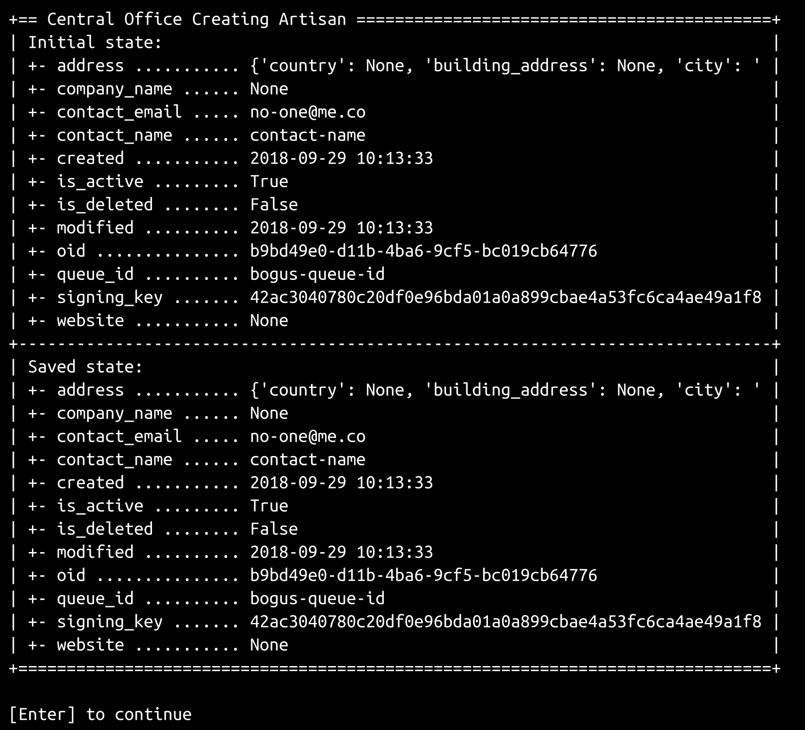
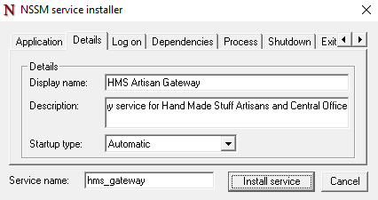

# 测试和部署服务

[第 17 章](17.html)*处理服务交易*以未经测试的数据对象在线积垢操作收据结束，该操作源自 Artisan 和中央办公室应用程序。由于出于质量保证和故事批准的目的都需要证明（和演示）这些功能，并且由于没有对这些代码进行结构化或有用的可重复测试，因此在本章中，我们将详细介绍以下主题：

*   识别和处理测试服务应用程序的挑战
*   打包和部署服务涉及什么
*   一种演示服务功能的方法

此外，由于`hms_sys`的功能开发已接近完成，因此将对`hms_sys`中仍需完成的工作进行一些思考和检查，以使其对最终用户有用，并对其进行一些可能的未来增强。

# 测试服务的挑战

测试服务虽然不难，但可以比目前为止所展示的相对基本的单元测试更加复杂。例如，从技工到网关的一般`hms_sys`数据流中的每个点都有特定的和单独的测试关注点，但理想情况下，整个流程也应该如此，以便可以根据需要执行端到端流程验证。

端到端的流动可以如下所示：


从开始到结束，此数据流的测试计划至少需要解决以下问题：

*   创建`message-data`的方式可以用于在流程结束时验证流程
*   创建`DaemonMessage`（虽然可能没有测试它是否准确创建，但应该已经有单元测试负责测试它）
*   发送生成的**消息**
*   验证**Artisan 网关服务**接收到消息的结果与原`message-data`相比是否符合预期

根据服务如何运行的具体情况，在发送和接收**消息**之间可能会发生一些无法测试的步骤：

*   测试整个流程的`send_message()`部分必须采取措施，确保**消息**的传输可以在验证之前，不需要其他流程（本例中为网关服务）使用**消息**进行验证。如果`send_message`的单元测试说明了这一点，那么`send_message`方法本身就可以被认为是可信的，那么更大范围的过程测试可以安全地跳过对整个过程的这一部分的测试。

*   类似地，对各种`[process-method]`项目的测试应提供其在整个流程中部分的足够可信度。另一种选择是改变这些方法，以便在过程中可以观察到它们的操作，在这种情况下，它们实际上不是相同的方法，并且应用的任何测试都可能毫无意义。

考虑到整个过程的每个部分都应该有自己的单元测试，可以公平地问以下问题：*“通过测试整个过程，我们实际上获得了什么***，那么，单靠单个单元测试的集合还不够吗？”*这是一个简短的答案（尽管这可能被认为是作者的观点）是**否**-从一个角度来看，所有的过程测试都是 Artisan Gateway 的`main`的单元测试方法根据传入消息的内容决定调用哪个方法的事件循环。仅从该角度出发，并考虑到`ArtisanGatewayDaemon.main`是类中的关键功能块，必须进行彻底测试。还考虑到测试策略所需的单元测试基本上覆盖了流程图中的所有框：胡，等等。它们不提供流程图中箭头的任何覆盖范围。虽然代码不太可能遗漏箭头所表示的步骤之一，但这并非不可能，因此，揭示这些漏洞的更高级别的端到端流程测试反过来将证明流程作为一个整体的可靠性整体。类似地，这些过程的最终结果都需要是可验证的，例如，如果一个工匠创建的产品过程被启动，则需要做出一些保证，即一旦过程完成，就可以从数据存储中检索新的`Product`对象，并使用正确的数据。*

 *最后，由于各种过程都发生在幕后，因此如果一个 bug 溜进生产安装中，它们很可能很难调试：

*   对于开始执行流程的单个 Artisan 应用程序安装，将很少或没有可见性
*   除非对其内容/数据进行非常详细的日志记录，否则来回发送的消息不会持续足够长的时间，无法在生产环境中进行可读和可用的调试
*   如果没有更详细的日志记录，特定的守护进程调用将以不可见的方式进行，并且它们的结果（如果有）无法与它们来自的原始数据进行检查

# 总体测试策略

在编写实现全过程测试的代码之前，需要努力完成并成功执行所有未完成的单元测试。一旦完成，我们可以从逻辑上认为*过程*测试中出现的任何故障都是由于该过程中的某些原因造成的，尽管我们可能希望采取步骤验证子过程步骤，并针对某些情况提出故障。这很可能随着过程测试的编写而发展。

具有一组相应流程的每个业务对象都需要检查以下任何/所有适用流程：

*   对象的创建及其数据的本地和远程持久性：
    *   由允许执行更新的每个角色执行
    *   确保测试有效和无效的更新尝试
*   更新对象的数据：
    *   由允许执行更新的每个角色执行
    *   确保测试有效和无效的更新尝试
*   删除对象：
    *   由允许的每个角色执行删除
    *   确保测试有效和无效的删除尝试
    *   尝试后验证适用的本地和远程数据更改

确定什么构成无效尝试至少需要考虑以下问题：

*   在被测试流程的任何一个步骤中，哪些内容可能会被破坏，从而阻止流程成功完成？
*   在被测试流程的任何一个步骤中，哪些内容可能会被恶意更改，从而阻止流程成功完成？
*   针对这些场景，哪些测试已经到位？
*   需要为任何未考虑的场景创建哪些测试？

在网关服务的情况下，可能出现坏数据变化的点包括：

*   **创建或更改业务对象实例的尝试无效：**这些应该主要由业务对象本身的创建和更新过程的单元测试来覆盖。这些测试应该确保，例如，只允许格式良好的数据创建和更新，并且在那里引发了异常，消息传输过程甚至不应该触发。这些情况实际上无法在网关守护进程的上下文中进行测试，但必须在与之通信的应用程序中进行测试。
*   **接收到未经授权的数据事件消息：**在`DaemonMessage`中对消息签名的测试应确保签名无效的消息会引发错误。作为扩展，数据事件过程的测试应该确保，如果出现未经授权的消息错误，它将得到干净的处理，并且不会执行任何数据更改。
*   **接收到带有无效数据的授权数据事件消息：**如果与消息发起端的数据事件相关的单元测试完成，这可能是恶意活动的指示。暂且不考虑测试方面的考虑，可能应该对该事件的日志记录进行一些审查，以确保记录该类别的事件。无论是否恶意，消息接收端的相应单元测试应确保引发某种异常，数据事件流程测试应确保干净地处理引发的任何异常，并且不执行任何数据更改。

虽然严格来说，这些测试不是单元测试（它们将被正式归类为系统或集成测试的混合），但我们仍然可以利用`unittest`模块的功能，该模块迄今为止驱动了系统的所有自动测试。这将允许将过程测试集成到完整测试套件中，并作为完整测试套件的一部分运行（如果希望这样做），或者单独运行，或者甚至单独运行（如果需要/需要）。

# 注释的单元测试变体

需要实现的大部分单元测试都相当整齐地落在标准流程中，这些流程自`hms_sys`开发工作开始以来就一直在发挥作用，对此没有什么新的说法。然而，相对较少的其他国家有一些值得注意的变化。

随着大量新代码的出现，这些代码严重依赖于标准 Python 模块（`atexit`、`logging`和`signal`，例如，在`daemons`代码库中），或者各种第三方模块，这些模块是为满足特定需求而安装的（`pika`，用于 RabbitMQ 支持），测试策略的另一个方面出现了泡沫：测试功能的深度（甚至是否）问题，这些功能只不过是对来自其他来源的功能的包装。这并不是一个不合理的假设，任何作为 Python 发行版一部分的包在包含在发行版中之前都经过了彻底的测试。假设通过`pip`实用程序可以安装的任何软件包也经过了彻底的测试，这可能不是不合理的，尽管每个软件包的测试结果可能会有很大差异。

这些是一个主题的变体，可以表达为**信任框架**。本质上，这归结为在以下假设下运行：通过`pip`安装的软件包（或操作系统提供的任何设施）经过充分测试（无论充分的值是多少）。如果这些被认为是经过充分测试的，它们本身就不需要进行绝对测试。使用可信框架功能开发的功能是否需要测试，这可能取决于外部功能的使用细节。

在列出单元测试的值得注意的变化时，应牢记这一点。

在`hms_core`包中，`BaseDaemon`和`BaseDaemonizable`ABC 的测试定义了相应的具体类（`BaseDaemonDerived`和`BaseDaemonizableDerived`，分别用于根据需要创建测试实例。这本身并不新鲜，我们以前使用过具体的派生类来简化 ABC 的测试。但是，创建这两种类型的可测试实例都需要在实例构造期间传递配置文件。该文件的创建和清理由`setUpClass`和`tearDownClass`方法处理，这些方法在`TestCase`类上定义：

```py
class testBaseDaemon(unittest.TestCase):

# ...

    @classmethod
    def setUpClass(cls):
        # - Create a basic config-file that can be used to create
        #   instances of BaseDaemonDerived.
        config_data = """logging:
  format: "%(asctime)s - %(name)s - %(levelname)s - %(message)s"
  name: example
  console:
    level: info
  file:
    level: debug
    logfile: "/tmp/example.log"
"""
        cls._config_file = 'example.config'
        with open(cls._config_file, 'w') as fp:
            fp.write(config_data)

    @classmethod
    def tearDownClass(cls):
        try:
            os.unlink(cls._config_file)
        except:
            pass
```

当`setUpClass`执行时，在任何测试方法触发之前，它会在当前工作目录中创建一个可用的配置文件（`example.config`），用基本配置数据填充该文件，并在类属性（`cls._config_file)`中跟踪文件名测试方法可以访问的。在测试方法中创建测试对象的典型模式最终如下所示：

```py
    def testmethod(self):
        # Tests the method method of the BaseDaemon class
        test_object = BaseDaemonDerived(self._config_file)
        # - Whatever assertions and other test-processes are needed...
```

许多针对`hms_core.daemons`成员的测试被积极跳过。不情愿地跳过了`BaseDaemon`的各种控制方法（`start`、`stop`、`restart`）。尝试测试这些方法的根本问题是，就目前而言，它们只不过是对其他方法调用的集合，其中许多方法本身都将被测试。余额属于框架类别的信任。最多有一个决策点（在 start 中，检查实例的`_running`标志）可以进行有效的测试，但必须在该标志值的更改终止实例的进程之前快速进行。最终，只要守护进程的实例启动、停止和重新启动没有错误，这些方法就会按预期执行，并且显式测试相应的方法几乎没有什么好处。

出于类似的原因，`BaseDaemonizable`中的`daemonize`、`preflight`和`start`方法也做出了类似的决定，增加了一个缺点，即许多被调用的方法都是由标准模块提供的，它们本身将属于信任框架的范畴。

主动跳过了`BaseDaemon`（`critical`、`debug`、`error`、`info`和`warn`的所有日志包装方法。该决定背后的理由是，只要他们调用的`Logger`实例创建正确，这些实例就属于“信任框架”类别。

`BaseDaemonizable`的属性值为文件系统路径（`stdin`、`stdout`、`stderr`和`pidfile`），它们几乎遵循我们之前建立的标准测试结构。主要区别在于它们是文件系统路径值，因此这些属性的测试方法需要包括有效和无效路径，以及格式良好但由于文件系统权限而无法写入或读取的路径。从某种意义上说，这些测试也与操作系统紧密相连：例如，在 Windows 中完全有效的文件路径在 POSIX 样式的文件系统（如 Linux 或 macOS 使用的文件系统）中是无效的。

`BaseDaemon.config_file`和`configure`方法也需要类似的策略。

`BaseDaemon`的`cleanup`和`preflight`方法属于一个独特的类别：默认情况下，它们所做的只是记录（在`info`日志级别）它们已被调用，因此启动和关闭活动日志可以宣布它们已被执行。如果派生类实际上没有重写这些方法，则将调用`BaseDaemon`提供的基线功能，并执行相同的日志记录。如果采用与前面提到的日志包装方法相同的标准，则意味着`cleanup`和`preflight`都属于“信任框架”分类。但是，如果将来需要更改其中一个方法，添加超出该方法已执行的对日志的简单调用的内容，会发生什么情况呢？在这种情况下，如果跳过测试，则不会执行任何测试，即使应该执行。简单的事实是，无法预测会影响相关测试的更改，因此，必须假设对这些基本方法进行实质性更改的任何人也必须相应地更新相应的测试

在构建和执行这些单元测试的过程中，出现了一些在开发周期早期被删除但从未实际使用过的类，它们需要进行测试。由于这些类从来都不需要（在许多情况下甚至没有实现），因此类本身已经被删除，相应的测试需求也随之消失。

`hms_core.messaging`中的`RabbitMQSender`类有一个方法`send_message`，部分属于“信任框架”类别。不过，它还需要进行测试，以确保对`DaemonMessage`实例进行类型检查。综上所述，对该方法的完整测试仅相当于类型检查测试，并确保该方法在执行时不会出错。经过一些考虑，在`send_message`中也实现了检索发送的消息，或者至少执行消息确认，这样它就不会永远处于某个测试队列中。

所需的其余未完成测试（所有测试均遵循标准单元测试流程的合理简单变化）如下：

*   在`hms_core.business_objects`和`hms_artisan.artisan_objects`中：
    *   测试`Artisan.queue_id`和`Artisan.signing_key`属性
*   在`hms_core.co_objects`中：
    *   测试`Artisan.to_message_data`方法
    *   测试新的`Order`类
*   在`hms_core.daemons`中：
    *   测试`BaseDaemon._create_logger`
*   在`hms_core.messaging`中：
    *   测试`DaemonMessage`
    *   测试`HasMessageData`
    *   测试`InvalidMessageError`
    *   测试`RabbitMQSender`的标准项目
*   在`hms_artisan.artisan_objects`中：
    *   测试`Artisan.to_message_data`方法

考虑到`hms_Gateway`名称空间之外的类中的所有测试，剩下`ArtisanGatewayDaemon`类的属性和方法可以测试了。属性和其中的大多数方法，再一次，可以通过遵循标准的测试策略和过程进行测试。最值得注意的异常是`ArtisanGatewayDaemon.main`，它将在测试模块中被跳过，并使用我们现在可以构建的端到端流程测试进行测试。

# 测试 Artisan 事务

工匠的端到端流程测试需要包括以下内容：

*   创造一个工匠，如果是由中央办公室工作人员创造的话
*   更新 Artisan，因为如果来自中央办公室工作人员，则会发生这种情况
*   更新 Artisan，就像使用 Artisan 自己发起时一样
*   删除 Artisan，因为如果源于中心办公室工作人员，则会发生这种情况

由于我们不测试类，这是迄今为止所有单元测试的模式，因此我们不需要标准单元测试扩展的所有功能，但我们希望使用足够多的相同结构和至少一些在那里创建的实用程序，以便将流程流测试与`hms_Gateway`名称空间的常规单元测试运行集成在一起。考虑到这一点，起点代码看起来与我们之前的测试模块非常相似：

```py
#!/usr/bin/env python
"""
Defines end-to-end process-tests for the ArtisanGatewayDaemon
"""

#######################################
# Standard library imports needed     #
#######################################

import os
import sys
import unittest
```

由于我们所使用的单元测试扩展真正需要的是输出和报告保存功能，因此我们将只导入这些功能：

```py
#######################################
# Local imports needed                #
#######################################

from idic.unit_testing import PrintTestResults, SaveTestReport
```

模块级常量保持不变，因为我们将针对`ArtisanGatewayDaemon`类的运行实例进行测试，我们已经知道需要导入该类：

```py
#######################################
# Module-level Constants              #
#######################################

LocalSuite = unittest.TestSuite()

#######################################
# Imports needed for testing          #
#######################################

from hms_Gateway.daemons import ArtisanGatewayDaemon
```

我们最初要测试的四个流程流都可以用一个测试方法表示。这些方法中的每一个都必须为流测试的每个步骤提供需要执行的任何代码，但它们只能从显式失败开始：

```py
#######################################
# Test-cases in the module            #
#######################################

class testArtisanProcesses(unittest.TestCase):

    def testArtisanCreateFromCO(self):
        self.fail('testArtisanCreateFromCO is not yet implemented')

    def testArtisanUpdateFromCO(self):
        self.fail('testArtisanUpdateFromCO is not yet implemented')

    def testArtisanUpdateFromArtisan(self):
        self.fail('testArtisanUpdateFromArtisan is not yet implemented')
```

```py
    def testArtisanDeleteFromCO(self):
        self.fail('testArtisanDeleteFromCO is not yet implemented')
```

由于我们使用的是标准单元测试扩展，因此我们仍然需要主动将每个测试用例类添加到本地测试套件中：

```py
LocalSuite.addTests(
    unittest.TestLoader().loadTestsFromTestCase(
        testArtisanProcesses
    )
)
```

最后，由于我们希望能够独立运行流程测试模块，因此我们将包含与之前所有模块中相同的`if __name__ == '__main__'`代码块，该代码块将提供测试结果的输出，并在没有故障的情况下将结果保存到报告文件中：

```py
#######################################
# Code to execute if file is called   #
# or run directly.                    #
#######################################

if __name__ == '__main__':
    import time
    results = unittest.TestResult()
    testStartTime = time.time()
    LocalSuite.run(results)
    results.runTime = time.time() - testStartTime
    PrintTestResults(results)
    if not results.errors and not results.failures:
        SaveTestReport(results, 'hms_Gateway.ModuleName',
            'hms_Gateway.EndToEndProcesses.test-results')
```

因为所有这些测试都需要一个`ArtisanGatewayDaemon`类的运行实例，所以我们还需要确保一个实例可用。由于该类的运行实例是一个服务，独立于任何其他进程运行，因此启动服务实例不能作为任何测试方法的正常部分，`main`循环将启动，并且在其终止之前，任何其他操作都不会进行，这使得无法实际测试`main`控制的进程。

为了缓解这一问题，可以采取以下几种选择：

*   测试过程可以以某种方式使用操作系统服务控制设施来启动本地服务实例，其方式与部署后对其进行控制的方式大致相同。从长远来看，这可能是一种更好的方法，但在开发过程中的这一点上，我们无法实际部署服务代码，因此必须等待未来的开发。不过，这种方法有一个折衷办法：在每次执行测试套件时，必须部署服务，或者必须创建一些等效的机制来模拟已部署的服务，以便测试准确无误。
*   因为服务最终只是一个类的实例，所以测试过程可以创建一个实例并启动它，让测试执行，然后终止用于测试的服务实例。尽管这是一个更复杂的解决方案，但至少在一个方面感觉更好：每个测试套件将能够针对一个服务实例执行，该服务实例可以专门针对这些测试进行定制，包括具有不同的消息队列，如果需要，可以在处理测试方法提出的问题时进行检查，无需对大量潜在的消息进行排序。

实现第二个选项涉及使用前面提到的`setUpClass`和`tearDownClass`方法来创建服务实例，并使其在任何测试执行之前运行，并在所有测试完成后关闭实例。因为为每个业务对象流程设置一个测试用例类是有意义的，所以设置`setUpClass`和`tearDownClass`以便它们可以被各种测试用例类重用也是一个不错的计划。我们可以通过创建一个类来简化这一过程，该类包含两种方法所需的所有逻辑，然后从该新类和到目前为止一直是我们测试用例类主干的正常`unittest.TestCase`类派生出各个测试用例类：

```py
class NeedsArtisanGateway:

    @classmethod
    def setUpClass(cls):
        """
Creates and starts an instance of the ArtisanGatewayDaemon that 
can be used during execution of the tests.
"""
```

This, incidentally, shows that it's possible to add helper classes to test suites—classes that provide some functionality or capabilities needed during test execution, but that aren't, themselves, test case classes.

我们需要创建服务实例将使用的配置文件，但在此之前，我们将把测试方法中可能需要的一些值存储为类属性，以便以后需要时可以访问它们：

```py
        cls.Gateway_signing_key = os.urandom(64).hex()
        cls.Gateway_queue_id = 'hms_ag_%s_process_test' % cls.queue_name
        cls.Gateway_config_file = 'process_test.config'
```

配置数据可以设置为一个字符串，该字符串遵循先前建立的配置结构。如果需要，可以通过向类中添加变量/属性值，并确保将这些值带入字符串中来管理服务实例的定制，就像在这里使用`cls.Gateway_queue_id`和`cls.Gateway_signing_key`属性所做的那样：

```py
        cls.Gateway_config_data="""# Logging configuration
logging:
  format: "%%(asctime)s - %%(name)s - %%(levelname)s - %%(message)s"
  name: hms_ag_process_test
  file:
    level: debug
    logfile: "/tmp/hms_ag_process_test.log"
queue:
  type: rabbit
  connection:
    host: localhost
    port: 5672
    path: /
  queue_name: "%s"
signing_key: "%s"
""" % (cls.Gateway_queue_id, cls.Gateway_signing_key)
```

配置数据被写入测试用例类使用的临时配置文件，与我们之前测试`BaseDaemon`时的方式大致相同：

```py
with open(cls.Gateway_config_file, 'w') as fp:
    fp.write(cls.Gateway_config_data)
```

由于我们可能需要访问服务实例本身，因此我们将创建该实例并将其存储为另一个类属性：

```py
cls.Gateway = ArtisanGatewayDaemon(cls.Gateway_config_file)
```

启动服务实例需要执行其 start 方法，以便流程独立于正在运行的测试代码。为了实现这一点，我们将使用 Python 的`multiprocessing`模块中的`Process`类，告诉它在`Process`启动时调用什么方法，并且该进程应被视为`daemon`，保持其执行独立于其他运行代码。一旦设置好，我们就可以启动`Process`，它执行`cls.Gateway`中存储的服务实例的启动方法：

```py
cls.Gateway_process = Process(target=cls.Gateway.start, daemon=True)
cls.Gateway_process.start()
```

The `multiprocessing` module will be explored in more detail in [Chapter 19](19.html),* Multi-processing and HPC in Python,* as we explore various strategies and approaches for scaling computational load across multiple processes and machines.

拆卸要简单得多：存储了控制正在运行的服务实例（`cls.Gateway_process`的进程，`Process`只需终止（`terminate`方法调用），并删除了临时配置文件，这样我们就不会将其留在测试代码中。由于在拆卸执行完成之前，进程的终止可能不会完成，因此还添加了一个短延迟：

```py
    @classmethod
    def tearDownClass(cls):
        # - Stop the service-instance
        cls.Gateway_process.terminate()
        # - Clean up (delete) the temp. config-file
        os.unlink(cls.Gateway_config_file)
        # - Add a short delay to allow the process-termination time 
        #   to complete before proceeding with the next item...
        time.sleep(1)
```

在测试用例类中使用`NeedsArtisanGateway`类需要一些简单的代码更改：每个测试用例类需要从`NeedsArtisanGateway`和`unittest.TestCase`派生，首先：

```py
class testArtisanProcesses(NeedsArtisanGateway, unittest.TestCase):
```

另外，由于`NeedsArtisanGateway`需要`queue_name`类属性来创建`Gateway_queue_id`类属性，因此需要定义：

```py
queue_name = 'artisan'
```

然而，从那时起，一切都没有改变：

```py
def testArtisanCreateFromCO(self):
    self.fail('testArtisanCreateFromCO is not yet implemented')

# ...
```

在实施任何测试之前，需要在测试模块中进行一些配置和设置。所有流程测试都需要数据访问功能，因此我们需要导入主数据存储类以及数据存储配置类，并配置数据访问以允许这些功能：

```py
from hms_core.data_storage import DatastoreConfig, HMSMongoDataObject

config = DatastoreConfig(
    database='hms_proc_tests',
)
HMSMongoDataObject.configure(config)
```

类似地，由于流程测试都与消息传输有关，因此我们需要能够创建发送方对象实例`RabbitMQSender`——以及`DaemonMessage`对象。这些也需要进口，并且需要进行基本的`RabbitMQSender.configuration`调用：

```py
from hms_core.messaging import DaemonMessage, RabbitMQSender, \
    MESSAGE_ORIGINS
RabbitMQSender.configure(
    'hms_ag_process_test', 'localhost', 5672, '/'
)
```

`import`行中的`MESSAGE_ORIGINS`是一个新的模块常量，是名称和值的集合，可用于控制哪些值是集合的成员，哪些名称与之关联，以及确定给定值是否是集合的成员。其定义如下：

```py
MESSAGE_ORIGINS = namedtuple(
    'MESSAGE_ORIGINS', ['artisan', 'central_office']
)(
    artisan='artisan',
    central_office='central-office',
)
```

Python does have some official enumeration classes, but the one that would otherwise be best suited to meet this need, `enum.Enum`, does not allow an arbitrary value to check for membership in the enumeration. The differences can be seen in the results shown in the `enumeration-example.py` file in this chapter's code (in `hms_Gateway/scratch-space`).

最后，由于测试过程将使用来自不同名称空间的同名类（例如，`hms_core.co_objects.Artisan`和`hms_artisan.artisan_objects.Artisan`，均命名为 Artisan），因此我们需要导入这些类并在过程中重命名它们，如下所示：

```py
from hms_core.co_objects import Artisan as COArtisan
from hms_artisan.artisan_objects import Artisan as ARArtisan
```

从这一点开始，`COArtisan`对象的任何创建都将是`hms_core.co_objects.Artisan`类的实例，`ARArtisan`对象将是`hms_artisan.artisan_objects.Artisan`实例。

有了这些方法，第一个过程测试方法的实现就可以（最终）开始了。首先创建`sender`对象，用于发送测试消息：

```py
def testArtisanCreateFromCO(self):
    sender = RabbitMQSender()
```

为了测试 Artisan 创建过程，我们必须创建 Artisan：

```py
    parameters = {
        'contact_name':'contact-name',
        'contact_email':'no-one@me.co',
        'address':{
            'street_address':'street-address',
            'city':'city',
        },
        'queue_id':self.Gateway_queue_id,
        'signing_key':self.Gateway_signing_key,
    }
    new_artisan = COArtisan.from_data_dict(parameters)
```

然后我们创建要发送的`message`，并发送：

```py
    message = DaemonMessage(
        operation='create', 
        origin=MESSAGE_ORIGINS.central_office,
        data={
            'target':'artisan',
            'properties':new_artisan.to_message_data(),
        },
        signing_key=self.Gateway_signing_key
    )
    sender.send_message(message, self.Gateway_queue_id)
```

在代码的这一点上，消息已经发送了，但是没有简单的方法来确定它是否已经被接收，更不用说处理了。如果不实际编写代码（可能有很多代码）来跟踪消息及其状态，那么在我们合理确定消息已经传递并执行之前，暂停处理的选项就不多了。下一个最好的选择，也是一个花费更少代码工作的选择，尽管它会减慢测试过程，是简单地将执行延迟一段短时间，足够长的时间来允许消息被传递和执行，但不要太长以至于运行测试变得很长。使用`time.sleep`，我们将延迟处理 5 秒，至少现在是这样。以后可能需要增加，或者如果需要更好地了解流程需要多长时间才能完成，则可能需要减少：

```py
time.sleep(5)
```

一旦消息被接收并执行操作，如果一切顺利，那么网关服务将创建一个`new_artisan`对象，并将其保存到正在使用的数据库中。测试流程的下一步是确保实际上创建并存储了一个新对象：

```py
    try:
        verify_artisan = COArtisan.get(str(new_artisan.oid))[0]
    except IndexError:
        self.fail(
            'Although the new artisan (oid: %s) was created, '
            'it could not be retrieved' % (new_artisan.oid)
        )
```

知道新对象已创建，然后我们可以检查以确保新对象的数据与最初发送用于创建它的数据相同。由于任何数据对象的数据 dict 表示都将是最全面的，因此它应包括所有持久化的数据，即原始`Artisan`和新创建和检索的`Artisan`的简单比较：

```py
    self.assertEquals(
        verify_artisan.to_data_dict(), new_artisan.to_data_dict()
    )
```

如果测试过程通过了该检查，那么我们就完成了为测试而创建的`new_artisan`对象，我们可以将其从数据库中删除：

```py
    COArtisan.delete(str(new_artisan.oid))
```

这就结束了对过程的“快乐路径”测试，在该过程中，所有内容都完全按照预期创建、格式化和发送。测试未经授权和格式错误的消息需要更多的工作，因为我们将绕过由`Artisan`和`DaemonMessage`类执行的检查。然后，从未经授权的消息开始，如果消息的签名与接收端计算的签名不匹配，我们需要首先创建未经授权的消息。我们可以使用现有的消息，因为它仍然存在，提取我们将要发送的数据，然后更改数据值或签名：

```py
unauthorized_message_data = message.to_message_dict()
unauthorized_message_data['data']['properties']['website'] = \
    'http://some-bogus-website.com'
```

因为我们已经有了一个`sender`，所以我们可以使用它的`channel`和实例的`Gateway_queue_id`来绕过需要`DaemonMessage`实例的正常发送过程。相反，我们将发送刚刚创建的未经授权消息的 JSON 转储：

```py
sender.channel.basic_publish(
    exchange='', routing_key=self.Gateway_queue_id, 
    body=json.dumps(
        unauthorized_message_data, sort_keys=True
    )
)
```

该分支的测试部分涉及数据更改是否通过网关服务进行。如果有人这样做，它将生成一个新的`Artisan`记录，我们可以检索相应的对象。如果是这样的话，我们可以，那么就出了问题，我们明确地导致了测试失败。如果检索尝试失败（因为返回的结果集是一个长度为零的列表，并且在`[0]`处没有元素，因此引发一个`IndexError`），这就是预期/期望的行为，我们可以忽略错误，通过该部分测试：

```py
    try:
        verify_artisan = COArtisan.get(str(new_artisan.oid))[0]
        self.fail(
            'An unauthorized message should not execute a data-'
            'change'
        )
    except IndexError:
        pass
```

测试无效但经过授权的消息的方式大致相同，但我们将更改消息数据，然后使用正常的`DaemonMessage`/`sender`过程：

```py
    invalid_message_data = new_artisan.to_message_data()
    # - Alter a data-value, like website
    invalid_message_data['website'] = 12.345
    invalid_message = DaemonMessage(
        operation='create', 
        origin=MESSAGE_ORIGINS.central_office,
        data={
            'target':'artisan',
            'properties':invalid_message_data,
        },
        signing_key=self.Gateway_signing_key
    )
    sender.send_message(invalid_message, self.Gateway_queue_id)
    try:
        verify_artisan = COArtisan.get(str(new_artisan.oid))[0]
        self.fail(
            'An unauthorized message should not execute a data-'
            'change'
        )
    except IndexError:
        pass
```

“中央办公室更新 Artisan”和“中央办公室删除 Artisan”流程在相同主题上的变化看起来非常相似，每个流程都执行以下操作：

*   创建一个本地 Artisan 并保存它，以便有一个将被操纵的数据对象
*   在继续之前，可以选择验证数据库中是否存在新创建的 Artisan，但如果从其他测试中认为`Artisan.save`方法是可信的，则可以跳过此操作
*   创建一个合适的`message`来执行正在测试的流程，并发送它
*   针对同一 Artisan 的第二个实例测试结果：
    *   更新过程测试必须重点更改测试作为中央办公室用户/Artisan 管理员所扮演角色可以合法更改的所有字段。在这方面，它可能看起来很像以前针对`Artisan.to_data_dict`等方法的单元测试，这些方法返回对象的字典表示
    *   它还应该注意尝试对不允许的 Artisan 进行更改，并验证这些尝试是否失败
    *   删除过程测试将相当简单，因为它所需要做的只是尝试重新获取测试对象（使用类似于`verify_artisan = COArtisan.get(str(new_artisan.oid))[0]`的东西，我们之前已经看过），如果执行删除后检索工作失败，则测试通过

还应实现针对无效访问尝试的测试，例如创建 Artisan 的 Artisan，并且其代码结构类似于前面显示的测试代码部分。不过，在这些测试通过之前，必须实现在各种操作方法中实际检查消息的机制。对于任何给定的操作，使用传入的`DaemonMessage`的`origin`，这可能看起来像这样，显示一般的、允许任何角色的检查和只允许特定角色的检查，并以网关服务的`create_artisan`方法为例：

```py
def create_artisan(self, message:(DaemonMessage,)) -> None:
    self.info('%s.create_artisan called' % self.__class__.__name__)

    # ...

    # - Assure that only the appropriate roles can execute this 
    #   method. First check against *all* valid origins (at a 
    #   minimum, this check should occur in *all* methods)
    if message.origin not in MESSAGE_ORIGINS:
        raise RuntimeError(
            'Malformed message: "%s" is not an accepted '
            'message-origin' % message.origin
        )
    # - Alternately, check against specific roles/origins instead, 
    #   if they are limited
    if message.origin != MESSAGE_ORIGINS.central_office:
        raise RuntimeError(
            'Unauthorized Action: "%s" is not allowed to '
            'execute this method' % message.origin
        )
```

针对无效角色/操作执行变体的测试看起来非常像我们之前看到的对`invalid_message`的测试，验证当出现格式良好的消息试图执行任何给定角色/`origin`不允许的操作时，操作方法是否不执行。

测试源自关系的应用程序端的事务流程要复杂一点，如果只是因为这些应用程序到目前为止还没有重大开发的话。为了测试这些流程，必须创建一个应用程序流程的基本模型，至少在以后的工作中是这样，当有合理完整且经过测试的应用程序时，最好实际运行它们的本地实例。Artisan 和 Central Office 应用程序都需要一个模型，并且需要提供 CRUD 操作方法，其方式与网关服务守护进程的类非常相似。Artisan 应用程序的实体模型可以从以下代码开始：

```py
class ArtisanapplicationMock:

    # ... Properties and initialization would need to be fleshed 
    #   out, obviously...

    # CRUD-operation methods to implement
    def update_artisan(self, message:(DaemonMessage,)) -> (None,):
        # TODO: Implement this method
        pass

    def create_order(self, message:(DaemonMessage,)) -> (None,):
        # TODO: Implement this method
        pass

    def update_order(self, message:(DaemonMessage,)) -> (None,):
        # TODO: Implement this method
        pass

    def delete_order(self, message:(DaemonMessage,)) -> (None,):
        # TODO: Implement this method
        pass

    def update_product(self, message:(DaemonMessage,)) -> (None,):
        # TODO: Implement this method
        pass
```

网关服务的结构可以部分重用，以提供将消息路由到其各自操作方法的方法：

```py
    def _handle_message(self, message:(DaemonMessage,)) -> (None,):
        # - This method would look very much like its counterpart 
        #   in hms_Gateway.daemons.ArtisanGatewayDaemon
        # TODO: Implement this method
        pass
```

不过，与其使用`main`循环，不如使用一个方法，就像网关服务的`main`循环中的单次传递一样，更好地服务于模型。出于测试目的，这允许更严格地控制消息的处理，以便在测试过程中发送任意数量的测试消息。然后，可以对`ArtisanapplicationMock`方法进行一次调用来读取和处理所有消息，这样就可以对这些消息进行测试。这种方法，`handle_pending_messages`看起来仍然很像`ArtisanGatewayDaemon.main`，不过：

```py
def handle_pending_messages(self) -> (None,):
    # - Create a connection
    connection = pika.BlockingConnection(
        pika.ConnectionParameters(
            self.connection_params['host'],
            self.connection_params.get('port'),
            self.connection_params.get('path'),
        )
    )
    # - Create (or at least specify) a channel
    channel = connection.channel()
    # - Create or specify a queue
    channel.queue_declare(queue=self.queue_name)
    # - Get *all* pending messages, and execute against them
    polling = True
    while polling:
        try:
            # - Retrieve the next message from the queue, if 
            #   there is one, and handle it...
            method_frame, header, body = channel.basic_get(self.queue_name)
            if method_frame:
                # - Any actual message, valid or not, will 
                #   generate a method_frame
                message = DaemonMessage.from_message_json(
                    body.decode(), self.signing_key
                )
                # - We've received the message, and will 
                #   process it, so acknowledge it on basic 
                #   principle
                channel.basic_ack(method_frame.delivery_tag)
                self._handle_message(message)
            else:
                polling = False
        except InvalidMessageError as error:
            # - If message-generation fails (bad signature), 
            #   we still need to send an acknowledgement in order 
            #   to clear the message from the queue
            channel.basic_ack(method_frame.delivery_tag)
```

有了这一功能，以及相应的中央办公室应用程序模型，测试源自应用程序的事务（通过网关服务传递到另一个应用程序）并进行更改的过程将类似于简单事务的测试过程，例如创建 Artisan：

1.  将为操作创建一条消息，其中包含适当的来源和数据
2.  该消息被发送到网关服务
3.  对任何服务级别数据更改的验证都会执行，可能是在延迟之后，以确保有时间传递消息并对其采取行动
4.  调用相应应用程序模型类的`handle_pending_messages`方法来读取和处理传入消息
5.  为创建事务创建新的本地数据，为更新事务更改现有数据，为删除事务删除现有数据，执行预期结果的测试

This entire process—the creation of code that simulates a more complex system or object for testing purposes—is called **Mocking**. Mocking allows tests to be written without having to rely on actual (and often far more complex) real code implementations.

对产品和订单的测试在很大程度上可以遵循类似的模式。当然，主要的区别在于，根据每个角色/操作组合的业务规则，创建和操作哪些对象类型，以及允许各种角色对这些对象执行哪些操作。可能需要定义额外的测试，以专门针对完成订单一部分的某些操作，例如，基本上只是一个更新操作。然而，这只会改变项目履行数据，而不是所有的数据。即使如此，这几乎肯定会遵循与本文概述的类似的测试过程和结构。

# 演示服务

许多迭代开发过程的一个主要部分是要求可以向涉众演示代码的功能，以便他们有足够的信息来同意某个故事的需求已经得到满足，或者指出这些需求中的任何差距。服务演示对满足该要求提出了一些独特的挑战：

*   正在发生的一切都在“幕后”无形地发生
*   许多正在发生的事情发生得如此之快，以至于根本没有时间看到导致最终结果的临时步骤
*   很有可能不会有任何类型的相关用户界面，或者即使有，它也会提供足够的过程可视性，以足够详细地演示它们

有时，与网关服务的情况一样，还有一些外部系统数据库、消息队列服务等，它们需要可供正在运行的代码使用，以便演示过程实际成功运行。演示的准备工作需要考虑到这一点，显然，任何需要的外部服务的运行实例都是可用的。在这种情况下，由于开发和测试已经依赖于那些可用的服务，所以这不是问题，只要代码演示可以从开发环境中运行。

可以执行已经实现的流程测试，以证明代码以可预测的方式运行，这是一个需要演示的好项目，但它并不能解决我们最初的问题。显示各种进程的内部工作的一个非常基本的方法是编写一个演示脚本，该脚本执行最终代码中出现的相同任务，无论需要什么逻辑或要求的顺序，但在用户可控制的块中，并在需要时显示相关数据。这是一种蛮力、简单的方法，但会使流程中的步骤可见（解决第一个问题），并在用户要求时执行每个步骤（解决第二个问题）。实际上，它通过为特定目的创建用户界面来解决前两个问题。虽然完整的演示脚本太长，无法在此处复制，但它在很大程度上类似于流程测试：

```py
#!/usr/bin/env python
"""
A (partial) script that runs through the various processes we need 
to demo for the Artisan Gateway service.
"""

# - Imports needed for the demo-script
import unittest
import os

from hms_core.co_objects import Artisan as COArtisan
from hms_core.messaging import DaemonMessage, RabbitMQSender, \
    MESSAGE_ORIGINS
```

各种项目的配置，如演示过程将使用的数据存储或消息队列，大约需要在代码的这一点上提供。

由于整个服务的单元测试位于包结构（反映真实代码的结构）中，因此可以导入整个单元测试套件，并且可以编写一个函数按需执行它们：

```py
from test_hms_Gateway import LocalSuite

def demoUnitTests():
    print(
        '+== Showing that unit-tests run without error '.ljust(79,'=') + '+'
    )
    results = unittest.TestResult()
    LocalSuite.run(results)
    print('+== Unit-tests run complete '.ljust(79,'=') + '+\n\n')
```

每个数据事务过程的演示也可以封装在演示模块中的各个函数中。除了在演示运行时显示信息并提示运行演示的人允许其继续的新代码外，它们看起来非常类似于相应的流程测试方法：

```py
def demoArtisanCreateFromCO():
    print(
        '+== Central Office Creating Artisan '.ljust(79,'=') + '+'
    )
```

创建要使用的`Artisan`测试对象的代码几乎相同：

```py
    parameters = {
        'contact_name':'contact-name',
        'contact_email':'no-one@me.co',
        'address':{
            'street_address':'street-address',
            'city':'city',
        },
        'queue_id':'bogus-queue-id',
        'signing_key':os.urandom(64),
    }
    new_artisan = COArtisan.from_data_dict(parameters)
```

由于演示需要在传输`new_artisan`对象的 create 消息之前显示其初始状态，以显示数据按预期持久化，因此该对象的`data-dict`的一些简单强力输出如下：

```py
    initial_state = new_artisan.to_data_dict()
    print('| Initial state:'.ljust(79, ' ') + '|')
    for key in sorted(initial_state.keys()):
        print(
            (
                ('| +- %s ' % key).ljust(24, '.') + ' %s' % initial_state[key]
            )[0:78].ljust(79, ' ') + '|'
        )
    print('+' + '-'*78 + '+')
```

创建和发送消息看起来几乎完全相同，除了用来标识消息通过哪个队列发送的`queue_id`。与相应的工艺试验同样有`time.sleep`延时，原因相同：

```py
    sender = RabbitMQSender()
    # - Send the new-COArtisan message to the service
    message = DaemonMessage(
        operation='create', 
        origin=MESSAGE_ORIGINS.central_office,
        data={
            'target':'artisan',
            'properties':new_artisan.to_message_data(),
        },
        signing_key=parameters['signing_key']
    )
    sender.send_message(message, parameters['queue_id'])
    # - The message has been sent, but we have to wait for 
    #   a bit before it is received and acted upon before we 
    #   can verify the creation happened
    time.sleep(5)
```

结果的显示基本上与我们之前看到的显示`initial_state`的代码相同；只是使用检索到的数据库持久化实例的`data-dict`而不是原始实例：

```py
    verify_artisan = COArtisan.get(str(new_artisan.oid))[0]
    verify_state = new_artisan.to_data_dict()
    print('| Saved state:'.ljust(79, ' ') + '|')
    for key in sorted(verify_state.keys()):
        print(
            (
                ('| +- %s ' % key).ljust(24, '.') + ' %s' % verify_state[key]
            )[0:78].ljust(79, ' ') + '|'
        )
    print('+' + '='*78 + '+')
```

由于显示原始数据和持久数据是一个逻辑分组，因此脚本将等待用户的输入，然后继续演示的下一步：

```py
    print('\n')
    input('[Enter] to continue the demo')
    print('\n')
```

撇开此演示函数中的剩余项以及可能需要的所有其他演示函数不谈，如果直接执行模块，只需调用每个演示函数即可执行整个演示脚本（`if __name__ == '__main__')`：

```py
if __name__ == '__main__':
    demoArtisanCreateFromCO()
```

只有第一个演示方法的第一个部分的输出已经可以用来表明数据持久性是准确的：



此第一个演示功能的后续步骤类似：

*   在执行过程中，会显示更改前后的数据
*   显示正在进行的数据更改（如果适用），以便查看这些更改
*   演示预期的故障情况，例如无效的消息数据或签名，以及任何基于角色的变体

几乎可以肯定，流程测试方法正在证明（和执行）的内容与这些流程的演示之间有足够的相似性，测试方法将提供所有演示函数所需的大部分代码。

# 打包和部署服务

由于`hms_Gateway`和`hms_core`项目都有自己的`setup.py`文件，因此打包和部署过程不需要比执行以下操作更复杂：

*   执行每个`setup.py`生成可安装包
*   将这些包文件移动到要运行网关服务的服务器
*   使用以下代码安装它们：
    *   `pip install HMS-Core-0.1.dev0.tar.gz`
    *   `pip install HMS-Gateway-0.1.dev0.tar.gz`
*   为新安装在必要位置创建配置文件

允许网关守护进程在系统启动时自动启动，并在系统关闭时自动关闭所需的配置将根据目标机器的操作系统而有所不同（稍后将详细介绍）。

另一方面，如果需要单个包，则需要将所有相关项目的`src`目录合并为包过程的一部分。如果无法通过正常的`setuptools.setup`函数的参数组合使用`Makefile`和对项目中的`setup.py`进行微小更改，则可以实现这一点。

Support for the inclusion of source code outside a project's main source directory has, in the author's experience, had sporadic issues with earlier versions of Python and/or the `setuptools` package. If those issues are resolved in the current version, then it may possible to use the `package_dir` argument of `setuptools.setup`, possibly in combination with the `setuptools.find_package` function to instruct the main `setup` function where you can find other package source trees outside the current project. The `Makefile` approach described here is not as elegant, and can have other (generally minor) issues, but works all the time with only basic `setup.py` functionality/requirements.

对`setup.py`文件的相关更改很简单，只需将`hms_core`包名称添加到要包含在分发中的包列表中：

```py
# The actual setup function call:
setup(
    name='HMS-Artisan-Gateway',
    version='0.1.dev0',

    # ...

    packages=[
        'hms_Gateway',
        'hms_core',
    ],

    # ...

)
```

由于`setup.py`不关心从何处运行，一个简单的暴力解决方案可以将所有相关源代码收集到一个位置作为`Makefile`目标，它可以从以下内容开始：

```py
full_package:
        # Create a temporary packaging directory to copy all the 
        # relevant files to
        mkdir -p /tmp/Gateway-packaging
        # Copy those files
        cp -R src/hms_Gateway /tmp/Gateway-packaging
        cp -R ../hms-core/src/hms_core /tmp/Gateway-packaging
        # - Change to the temporary packaging directory, execute setup.py
        cd /tmp/Gateway-packaging;python setup.py
        # - Move the resulting package to somewhere outside the 
        #       temporary packaging directory, after assuring that the 
        #       location exists
        mkdir -p ~/Desktop/HMS-Builds
        mv /tmp/Gateway-packaging/dist/* ~/Desktop/HMS-Builds
        # - Clean up the temporary directory
        rm -fR /tmp/Gateway-packaging
```

一步一步地，目标公司实际上正在做的是：

*   创建临时生成目录
*   将每个项目中的整个包目录复制到该目录中
*   跳入目录并执行典型的`setup.py`运行（使用修改后的`setup.py`文件）
*   确保文件系统上存在最终包文件可以移动到的目录
*   将新创建的包文件移动到该目录
*   删除临时生成目录

组合的`Makefile`/`setup.py`过程的最终输出将是一个单独的包文件`HMS-Gateway-0.1.dev0.tar.gz`，其中包括`hms_Gateway`和`hms_core`包目录，可与`pip install HMS-Gateway-0.1.dev0.tar.gz`一起安装。

# 所有操作系统的通用注意事项

无论网关服务守护进程在哪个操作系统下运行，它都需要一个完整的配置文件，位于已知位置，该文件存储服务启动时需要知道的所有设置。此配置文件的基本 Linux 版本（位于运行服务的目标机器上的`/etc/hms/hms_Gateway.conf`中）与[第 16 章](16.html)*Artisan 网关服务*的*消息队列实现中使用的裸骨示例非常相似*

```py
# HMS Artisan Gateway Service Configuration
# - Used by the hms_Gateway.daemons.ArtisanGatewayDaemon class
#   to launch an active instance of the service
logging:
  format: "%(asctime)s - %(name)s - %(levelname)s - %(message)s"
  name: hms_Gateway
# If console-logging is desired, uncomment these lines
#  console:
#    level: info
  file:
    level: error
    logfile: "/var/log/hms/hms_Gateway.log"
queue:
  type: rabbit
  connection:
    host: rabbitmq.hms.com
    port: 5672
    path: /
  queue_name: "central-office"
# Signing-key should be generated and added to configuration 
# during installation. It should be a 64-character, 
# bytes-type-compatible string-value, and will likely need to be 
# explicitly quoted
signing_key: ""

```

此配置文件不是打包过程的一部分，否则，每次安装更新时，都有覆盖现有和操作配置的风险。一旦最终配置到位，在任何合理的正常情况下都不需要对其进行修改。Linux 版本的配置文件与 Windows 服务器上使用的配置文件之间的唯一区别是日志文件路径（`logging:file:logfile`，它需要指向 Windows 文件系统路径。

我们将在 Windows 和 Linux 操作系统下研究的服务管理选项允许简单的命令行执行来启动服务守护进程。较旧的 Linux 服务管理可能需要一个单独的、独立的 Bash 或 Python 脚本，以在操作系统的核心功能与用户和系统与它的交互之间架起桥梁。但是，随着这些更现代的选项的出现，我们可以在生产系统上启动服务守护进程，方式与在开发过程中启动服务守护进程进行测试的方式大致相同，方法是在`hms_Gateway/daemons.py`的末尾添加几行代码：

```py
if __name__ == '__main__':
    daemon = ArtisanGatewayDaemon('/etc/hms/hms_Gateway.conf')
    daemon.start()
```

When a Python module is directly executed by the Python interpreter—`python -m hms_Gateway.daemons`, for example, or `python /path/to/hms_Gateway/daemons.py`—the `if __name__ == '__main__'` condition will evaluate to `True`, and the code within that `if` statement will be executed. In this case, it creates an instance of `ArtisanGatewayDaemon`, passing the hard-coded config file path, then calling the `start` method of the `daemon` object, starting the service.

# Linux（systemd）执行

在最近的 Linux 系统上，服务管理由另一个服务处理：`systemd`。`systemd`需要进行配置，以了解何时以及如何启动服务守护进程，如何关闭服务守护进程，如何重新启动服务守护进程，以及用于确定服务在系统引导过程中何时启动的一些附加信息。网关服务的基本起始点`systemd`配置文件如下所示：

```py
[Unit]
Description = Artisan Gateway Service
After      = network-online.target 
[Service]
# - Start-up process
ExecStart   = python -m hms_Gateway.daemons
# - How to shut the service down
ExecStop    = pkill -f hms_Gateway.daemons
ExecRestart = pkill -f hms_Gateway.daemons;python -m hms_Gateway.daemons

# - If it stops unexpectedly, do we want it to restart?
Restart     = always

[Install]
# - This corresponds, at least roughly, to runlevel 3, after 
#   a complete system start
WantedBy    = multi-user.target
```

其中，他提到的关键字的作用如下：

*   `Description`是对服务的简单描述
*   `After`表示在启动服务守护进程之前应完全建立的操作状态目标。在这种情况下，由于网关服务需要网络访问，我们表示它应在网络在线目标完成后启动，期望此时所有网络功能都可用
*   `ExecStart`是操作系统可以执行的启动服务的命令

*   `ExecStop`是在本例中用于停止服务的命令，使用`pkill`OS 实用程序查找（`-f`并终止与`hms_Gateway.daemons`字符串匹配的任何进程
*   `Restart`允许`systemd`在服务意外死亡时自动重启服务
*   `WantedBy`是一个 OS 状态指示器，在这种情况下，它定义了当达到（标准）支持多用户的运行级别时，服务守护进程应在什么情况下启动，这是典型的纯命令行服务器系统

一旦这两个配置文件就绪，网关服务应在系统启动后自动启动，如果系统关闭，则应完全关闭，并可使用以下标准命令手动启动、停止和重新启动：

*   `systemctl start hms_Gateway`
*   `systemctl stop hms_Gateway`
*   `systemctl restart hms_Gateway`

# Windows（NSSM）执行

在 Windows 机器上运行网关服务需要一些中间件来围绕将要执行的 Python 代码创建与服务兼容的包装器。其中一个更流行、更稳定的中间件选项是**非吸吮式服务管理器**（**NSSM**）。NSSM 提供了一个 GUI，用于创建、安装和管理以多种语言编写的服务。一般来说，如果程序可以从命令行运行，NSSM 几乎肯定可以将其作为 Windows 服务运行。

NSSM 可能需要以管理权限运行，但在任何情况下，都是从命令行启动的-`C:\path\to\nssm.exe install`启动 GUI，并且所需的所有设置都显示在其中一个选项卡下。“应用程序”选项卡使用所需的任何参数（要运行的 Python 脚本）以及用于标识服务的服务名称来定义要执行的程序的路径（在本例中为`python.exe`）：


如果需要修改现有的 NSSM 托管服务，可以通过执行 NSSM 程序并在命令中指定服务名称来访问该服务：`C:\path\to\nssm.exe install hms_Gateway`，例如。

“详细信息”选项卡允许提供显示名称和说明，显示名称和说明将显示在 Windows 服务管理界面中。它还允许控制启动类型：服务是自动启动，还是在其他情况下启动：



单击“安装服务”按钮后，即可完成由 NSSM 包装和管理的新服务，该服务可在 Windows 服务管理员中使用！

此时，可能被称为`hms_sys`的“功能基础”是相当完整的：所有预期的数据流都已考虑在内，如果业务逻辑中没有实现业务规则强制的限制，至少有足够的支持让与他们相关的决策能够快速且易于实施。

我们仍然没有真正结束迭代开始时的大部分故事，不过，回想起来，这些故事的目标太宽泛，如果没有 UI 开发就无法结束。如果将它们分为两个（或更多）故事，每个故事集一个故事，关注最终用户的目标和需求，看起来几乎一样：

*   作为一名 Artisan Manager，我需要能够在 GUI 中创建`Artisan`对象，以便快速轻松地管理 Artisan
*   作为一名 Artisan 管理员，我需要能够删除 GUI 中的`Artisan`对象，以便快速轻松地管理 Artisan

其中每一个都会有一个相应的故事，更关注于确保 GUI 相关故事可以从一些代码、一些功能开始，并以此为基础进行构建。这些可能看起来像这样：

*   像

或者，如果每个原始故事的开发过程都采取了确保每个最终用户操作的整个过程，从 GUI 到服务到数据库再到（如适用）其他用户应用程序，都有与之相关的任务的方法，这样就可以完整地完成最初编写的故事。

在现实世界中，这种差距本应作为故事整理的一部分加以解决，甚至在它们被投入到一个积极的迭代中之前。故事梳理是开发团队的一项活动，在任何涉众的帮助下，审查、充实和（必要时）调整传入的故事，以确保它们能够完成。这个过程的一部分包括回顾故事及其伴随的任务，以确保故事完成所需的一切都被考虑在内。对这一性质的回顾几乎肯定会发现，要么像最初在这里介绍的那样，故事有代表故事所需一切的任务，要么将原始故事拆分为 UI 和机制故事是必要的。

尽管如此，原始场景中的一些故事感觉可以关闭，除非在演示和回顾过程中出现调整：

*   作为 Artisan，我需要能够将数据更改发送到 Artisan 网关，以便可以根据需要传播和执行这些更改
*   作为一名中央办公室用户，我需要能够将数据更改发送到 Artisan 网关，以便可以根据需要传播和执行这些更改
*   作为向 Artisan Gateway 服务发送消息或从 Artisan Gateway 服务发送消息的任何用户，我需要对这些消息进行签名，以便在对其进行操作之前对其进行验证

# hms_ 系统的发展将何去何从

`hms_sys`要真正*完成*还需要大量的工作，但所有需要公开的设计、开发和流程原则都已经在这一点上完成了，所以这感觉是一个脱离它并继续进行其他工作的好时机。不过，在继续之前，有一些很容易识别的项目可以挑选并处理。

# 代码审查、重构和清理

目前，代码中至少有几项是可以检查和修正的。

到目前为止，还没有调用任何只需返回任何数据对象的请求-响应过程。然而，有一些方法是为了解决这些潜在的需求而被剔除的（在`ArtisanGatewayDaemon`中有各种`response_{object}`方法），尽管这些需求本身从未出现过。虽然保留它们不会有什么坏处，但这最终会导致测试策略所要求的测试用例类和/或测试方法不能真正起到任何作用。正在测试的方法没有任何作用，在可预见的未来也不会。至少，这些方法以及与之相关的任何测试都应该被注释掉，但它们甚至可以被完全删除，从而保持代码的整洁。

由于 Artisan 和 Central Office 上下文中都为订单创建了不同的类，因此花一些时间筛选出它们的通用功能和接口，并在`hms_core`中重新定义`BaseOrder`类也会清理一些代码库。这还需要重新编写相关的单元测试，并且可能（可能是微不足道的）涉及到使用当前`Order`类的其他类。

`hms_core`中存在中央办公室类，虽然当时这是一个可以理解的决定，但从长期来看，可能会带来较小的数据完整性风险：作为`hms_core`的成员，它们目前将作为 Artisan 应用程序的一部分分发（取决于`hms_core`，并可供不满的 Artisan 使用，如果真是这样的话。尽管风险可能很小，但这肯定不是一个不可能的场景，而且 Artisan 应用程序没有理由拥有任何只供中央办公室工作人员使用的代码。将这些项重新组织到一个单独的项目/模块中，或者修改构建/打包过程，以便从 Artisan 应用程序的代码库中主动删除该模块，这是一个好主意，消除了将代码部署到不想/不应该使用它的用户时可能出现的任何问题。

关于`daemons.py`模块的位置和使用方式，以后可能需要类似的重组工作。在这一点上，我们并没有真正为最终用户应用程序设计——只是在基本层面上实现的功能需求的集合，因此对应用程序本身的功能没有真正的感觉。设计可能涉及本地服务，即使它仅在主应用程序处于活动状态时运行，在这种情况下，将`daemons.py`保留在`hms_core`名称空间是有意义的。另一方面，如果最终用户应用程序不使用这样的服务，那么没有理由在任何一个最终用户应用程序中部署相关代码，并将其移动到自己的可部署包中，或者移动到一个单独但依赖的项目中，这将是一个不错的主意。

至少有一些单元测试（测试各种`to_data_dict`方法的测试可能是最明显的测试），由于测试参数在深度嵌套循环中的使用方式，随着时间的推移，执行这些测试的时间会越来越长。就目前的情况来看，有多达十几个值的变化是（或可以）测试的，每个变化只使用少数几个值。每个变量有三个值，要测试的变量有 12 个，每个变量都存在于自己的循环中，即 3<sup>12</sup>——每次执行该测试方法时都会执行 50 多万个断言。这需要时间来执行。重新设计各种嵌套循环测试方法，以便单独测试每个值变量，取消嵌套循环，将显著加快测试执行。将有 36（3×12）个断言，而不是现在需要的 50 万个断言。权衡的结果是，测试代码将大大延长，因此可能（稍微）更难维护，但从长远来看节省的时间是值得的。

# 开发用户界面

Python 应用程序实际上有几十种 GUI 选项可供选择，即使该列表仅限于可在多个操作系统/平台上使用的 GUI 选项——Python 网站上的[上有一个列表 https://wiki.python.org/moin/GuiProgramming](https://wiki.python.org/moin/GuiProgramming) 。更广泛使用的是足够丰富的功能，每一个都可以写成整本书。值得注意的 GUI 框架和工具包包括以下内容：

*   **Tkinter:**作为 Python 安装的一部分分发
*   **PyGObject:**用于许多 Linux/Gnome 应用程序的 GUI，与 GnomePython 和 PyGTK 相关（[https://pygobject.readthedocs.io/en/latest/](https://pygobject.readthedocs.io/en/latest/)
*   **Kivy:**这包括对 Android 和 iOS（iPhone）应用程序的支持（[https://kivy.org/](https://kivy.org/)

**Tkinter**是 Python 应用程序 GUI 的*事实上的*标准，并且已经随 Python 发行版发布了很长时间。虽然它提供的 GUI 元素在许多方面都非常基本，但它提供了足够的 GUI 元素，满足了广泛的应用程序需求。作为一种更成熟的选择，有很多文档可供使用（参见[https://wiki.python.org/moin/TkInter](https://wiki.python.org/moin/TkInter) ），且相当稳定。还有相当数量的扩展包可以满足基线 Tkinter 安装可能无法满足的需求，包括**Python Mega****小部件**（**PMW**-[http://pmw.sourceforge.net/doc/](http://pmw.sourceforge.net/doc/) 。虽然 Tkinter GUI 可能不是世界上最吸引人的，但它们的外观与底层操作系统的 GUI 引擎紧密相连，因此它们的所有变化都是功能性的。

Tkinter 没有复杂的依赖关系，因此它非常可移植；一个给定的 Tkinter GUI 在任何操作系统上都可以正常工作，并且基于检测哪个操作系统存在的简单调整通常并不困难，尽管它们可能需要提前进行大量规划。

如果您曾经在具有 Gnome 前端的 Linux 系统上工作过，那么无论您是否知道，您都有可能接触过基于**PyGObject**的 GUI。虽然 PyGObject 是开源 Gnome 项目的一部分，因此可能更关注于满足各种 Linux 系统的需求，但它也是 Windows 和 Macintosh 系统上的一个可行选项。与大多数可用于 Python 的 GUI 框架一样，PyGObject 确实涉及到至少一些额外的软件安装，并且可能涉及到广泛的依赖项，即使它们不是直接可见的，但这些依赖项应该由 PyGObject 本身的安装过程来管理。PyGObject 假设至少对小部件的外观有一些控制，将该控制从操作系统的底层 GUI 引擎中移除，以提供更具吸引力的外观。

**Kivy**是一个流行的选项，经常被引用为需要移动技术支持的 Python 应用程序（Android 和 iOS 应用程序）的 go-to-GUI 框架。从他们的图库页面（[中的几个条目判断 https://kivy.org/#gallery](https://kivy.org/#gallery) ），它可以提供非常干净和有吸引力的 GUI。Kivy 使用自己的设计语言来定义 GUI 的布局以及元素的外观。通过 Kivy 对移动应用程序的支持是通过将完整的 Python 安装与每个 Android`apk`或 iOS`app`文件捆绑在一起来实现的。

另一种选择，虽然一开始听起来可能很奇怪，但将 Artisan 和 Central Office 应用程序实现为本地 web 服务器，并使用 HTML、CSS 和 JavaScript 创建 GUI。这并不像听起来那么牵强：Python 在`http.server`模块（[中包含了各种 web 服务器类 https://docs.python.org/3.6/library/http.server.html](https://docs.python.org/3.6/library/http.server.html) ），即使它们都没有准备好按原样使用，也可以扩展它们以提供任何缺少的功能。尽管所提供的服务器可能没有专用 web 服务器（Apache 或 IIS）强大或功能丰富，但它们实际上并不需要，因为在任何给定时间只有少数用户访问它。

# 订单履行和运输 API

工匠将执行的订单履行过程中涉及的基本数据更改是合理详细和理解的，但肯定有改进的余地。一个非常好的功能是与各种航运公司的在线 API 集成，这些航运公司将用于交付这些已完成的订单项目。根据其周围所有需求的形状，该集成本身可能是一项重大的开发工作，可能包括以下内容：

*   允许 Artisan 用户在交易期间为单个和多个项目提供包裹或装运 ID
*   向客户发送带有装运跟踪信息的确认电子邮件（如果 API 无法自行处理）
*   向中央办公室发送某种形式的通知，告知订单项目已完成，这将触发向工匠支付装运项目费用的任何手动或自动流程

除此之外，如果 API 本身不提供任何测试工具，那么各种托运人 API（因为它们中的任何两个都不可能使用完全相同的请求结构）以及测试策略和实现都需要定义，很可能需要大量的模拟。

# 总结

服务的测试，特别是以可重复的方式（可以用作正在进行的回归测试）有其特殊的挑战，但没有一个是不可克服的。这里介绍的方法是一个坚实的起点，可以根据需要详细阐述，以满足几乎任何测试要求。也就是说，如果出现新的测试需求，无论是通过发现和纠正错误，还是通过测试中必须反映的新功能需求的出现，这些都是合理完整的，并且易于管理/维护*