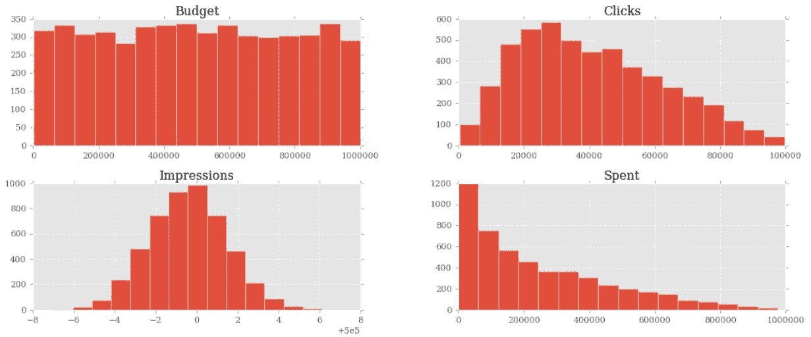
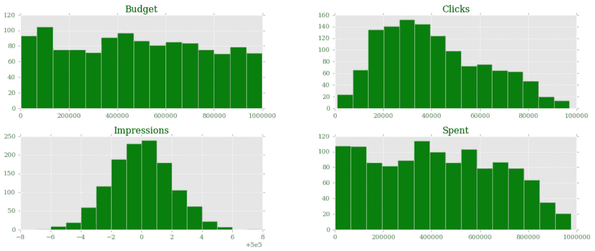
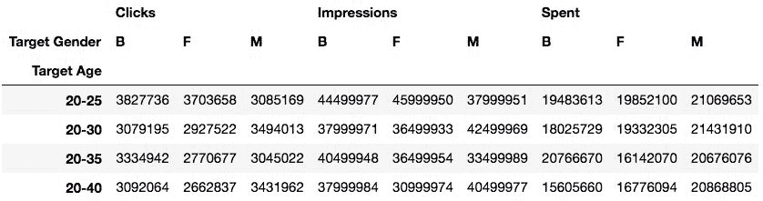

# 数据科学

"If we have data, let's look at data. If all we have are opinions, let's go with mine." – Jim Barksdale, former Netscape CEO

**数据科学**是一个非常宽泛的术语，可以根据上下文、理解、工具等假设几种不同的含义。关于这个问题的书不计其数，不适合胆小的人。

为了做正确的数据科学，你至少需要知道数学和统计学。然后，你可能想深入研究其他学科，比如模式识别和机器学习，当然，你可以选择大量的语言和工具。

我不能在这里什么都谈。因此，为了使本章更有意义，我们将一起做一个很酷的项目。

2012/2013 年左右，我在伦敦一家顶级社交媒体公司工作。我在那里呆了两年，有幸与几位才华横溢的人共事，我只能开始描述他们的才华。我们是世界上第一个访问 Twitter 广告 API 的人，我们也是 Facebook 的合作伙伴。这意味着大量的数据。

我们的分析师要处理大量的活动，他们要做的工作太多了，所以我所在的开发团队试图通过向他们介绍 Python 和 Python 提供的处理数据的工具来帮助他们。这是一次非常有趣的旅程，让我指导了公司的几位员工，并最终带我去了马尼拉，在那里，我为那里的分析师提供了为期两周的 Python 和数据科学方面的强化培训。

本章中我们要做的项目是我在马尼拉向学生们展示的最后一个示例的轻量级版本。我已经把它改写成适合本章的尺寸，并为教学目的做了一些调整，但所有的主要概念都在那里，所以对你来说应该是有趣和有指导意义的。

具体而言，我们将探讨以下内容：

*   Jupyter 笔记本
*   Pandas 和 NumPy：Python 中数据科学的主要库
*   关于熊猫`DataFrame`课程的几个概念
*   创建和操作数据集

让我们从谈论罗马诸神开始。

# IPython 和 Jupyter 笔记本

2001 年，费尔南多·佩雷斯（Fernando Perez）是加拿大大学博尔德分校（CU Boulder）的一名物理学研究生，他试图改进 Python 外壳，以便能够拥有他在使用 Mathematica 和 Maple 等工具时所习惯的细节。这一努力的结果被命名为**伊皮顿**。

简而言之，这个小脚本最初是 pythonshell 的一个增强版本，经过其他程序员的努力，最终在几家不同公司的适当资助下，它成为了今天的精彩而成功的项目。笔记本电脑诞生大约 10 年后，由 WebSockets、Tornado web 服务器、jQuery、CodeMirror 和 MathJax 等技术支持的笔记本电脑环境应运而生。ZeroMQ 库还用于处理笔记本接口和其背后的 Python 核心之间的消息。

IPython 笔记本已经变得如此流行和广泛使用，随着时间的推移，各种各样的好东西都被添加到了它里面。它可以处理小部件、并行计算、各种媒体格式等等。此外，在某种程度上，可以从笔记本中使用 Python 以外的语言编写代码。

这导致了一个巨大的项目在某个阶段被分为两部分：IPython 已被剥离，以更多地关注内核部分和外壳，而笔记本电脑已成为一个名为**Jupyter**的全新项目。Jupyter 允许用 40 多种语言进行交互式科学计算。

本章的项目将全部编码并运行在 Jupyter 笔记本中，所以让我用几句话解释一下笔记本是什么。

笔记本环境是一个网页，它公开了一个简单的菜单和可以运行 Python 代码的单元格。尽管这些单元是可以单独运行的独立实体，但它们都共享相同的 Python 内核。这意味着您在一个单元格中定义的所有名称（变量、函数等）将在任何其他单元格中可用。

Simply put, a Python kernel is a process in which Python is running. The Notebook web page is, therefore, an interface exposed to the user for driving this kernel. The web page communicates to it using a very fast messaging system.

除了所有的图形优势外，拥有这样一个环境的好处在于能够分块运行 Python 脚本，这是一个巨大的优势。使用连接到数据库的脚本获取数据，然后操作该数据。如果您以传统的方式使用 Python 脚本进行操作，那么每次您想要使用它进行实验时，都必须获取数据。在笔记本环境中，您可以获取单元格中的数据，然后在其他单元格中对其进行操作和实验，因此无需每次都获取数据。

笔记本电脑环境对数据科学也非常有帮助，因为它允许一步一步地反省。你做一块工作，然后验证它。然后执行另一个块并再次验证，依此类推。

这对于原型设计也是非常宝贵的，因为结果就在眼前，可以立即获得。

如果您想了解更多关于这些工具的信息，请访问[ipython.org](https://ipython.org/)和[jupyter.org](http://jupyter.org/)。

我创建了一个非常简单的示例笔记本，其中有一个`fibonacci`函数，可以为您提供小于给定`N`的所有斐波那契数的列表。在我的浏览器中，它如下所示：


每个单元格都有一个 In[]标签。如果括号之间没有任何内容，则表示从未执行过单元格。如果有一个数字，则表示该单元格已执行，该数字表示该单元格的执行顺序。最后，a*表示当前正在执行单元格。

您可以在图中看到，在第一个单元格中，我定义了`fibonacci`函数，并执行了它。这具有将`fibonacci`名称放置在与笔记本相关联的全局框架中的效果，因此`fibonacci`功能现在也可用于其他单元格。事实上，在第二个单元格中，我可以运行`fibonacci(100)`并在[2]中查看结果。在第三个单元格中，我向您展示了在第二个单元格的笔记本中可以找到的几个神奇功能之一 timeit 多次运行代码，并为您提供了一个很好的基准测试。我在[第 5 章](5.html#47DFS0-2ddb708647cc4530a187c2c6c0e9acfe)*节省时间和内存*中对列表理解和生成器所做的所有测量都是使用这个很好的功能进行的。

您可以根据需要多次执行单元格，并更改运行它们的顺序。单元格具有很强的延展性，您还可以放入标记文本或将其呈现为标题。

**Markdown** is a lightweight markup language with plain text formatting syntax designed so that it can be converted to HTML and many other formats.

此外，您在单元格最后一行中放置的任何内容都将自动为您打印。这非常方便，因为您不必显式地编写`print(...)`。

自由探索笔记本电脑环境；一旦你和它成为朋友，这将是一段长久的关系，我保证。

# 安装所需的库

为了运行笔记本电脑，你必须安装几个库，每个库都与其他库协作以使整个工作正常进行。或者，您可以只安装 Jupyter，它将为您处理一切。在本章中，我们还需要安装一些其他依赖项。您可以在`requirements/requirements.data.science.in`中找到它们。要安装它们，请查看项目根文件夹中的`README.rst`，您将找到本章的具体说明。

# 使用蟒蛇

有时，安装数据科学库可能会非常痛苦。如果您正努力在虚拟环境中安装本章的库，您可以选择安装 Anaconda。Anaconda 是 Python 和 R 编程语言的免费开源发行版，用于数据科学和机器学习相关的应用程序，旨在简化包管理和部署。您可以从[anaconda.org](https://anaconda.org/)网站下载。一旦您在系统中安装了它，请查看本章的各种要求，并通过 Anaconda 进行安装。

# 开始写笔记本

安装了所有必需的库后，可以使用以下命令或使用 Anaconda 界面启动笔记本：

```py
 $ jupyter notebook 
```

您将在浏览器中的该地址处打开一个页面（端口可能不同）：`http://localhost:8888/`。转到该页并使用菜单创建一个新笔记本。当你觉得舒服的时候，你就准备好了。在继续阅读之前，我强烈建议您尝试运行 Jupyter 环境。有时必须处理困难的依赖关系是一个很好的练习。

我们的项目将在一个笔记本中进行，因此我将用它所属的单元号标记每个代码片段，这样您就可以轻松地复制代码并进行后续操作。

If you familiarize yourself with the keyboard shortcuts (look in the Notebook's Help section), you will be able to move between cells and handle their content without having to reach for the mouse. This will make you more proficient and way faster when you work in a Notebook.

现在让我们继续讨论本章最有趣的部分：数据。

# 处理数据

通常，当您处理数据时，这是您所经历的路径：获取数据、清理和操作数据，然后检查数据，并将结果显示为值、电子表格、图形等。我希望您能够在不依赖任何外部数据提供者的情况下负责流程的所有三个步骤，因此我们将执行以下操作：

1.  我们将创建数据，模拟这样一个事实，即数据的格式不完美或不适合处理
2.  我们将对其进行清理，并将其提供给我们将在项目中使用的主要工具，例如来自`pandas`库的`DataFrame`
3.  我们将处理`DataFrame`中的数据
4.  我们将以不同的格式将`DataFrame`保存到一个文件中
5.  我们将检查数据并从中得到一些结果

# 设置笔记本

首先，让我们先生成数据。我们从`ch13-dataprep`笔记本开始：

```py
#1
import json
import random
from datetime import date, timedelta
import faker
```

Cell`#1`负责进口。除了`faker`之外，我们已经遇到了他们。您可以使用此模块准备假数据。它在测试中非常有用，当你准备你的固定装置时，可以得到各种各样的信息，比如姓名、电子邮件地址、电话号码和信用卡详细信息。当然，这都是假的。

# 准备数据

我们希望实现以下数据结构：我们将有一个用户对象列表。每个用户对象将链接到多个活动对象。在 Python 中，一切都是一个对象，所以我以一种通用的方式使用这个术语。用户对象可以是字符串、字典或其他对象。

社交媒体世界中的**活动**是媒体代理代表客户在社交媒体网络上开展的促销活动。请记住，我们将准备这些数据，使其不是完美的形状（但也不会那么糟糕…）：

```py
#2
fake = faker.Faker() 
```

首先，我们实例化将用于创建数据的`Faker`：

```py
#3
usernames = set()
usernames_no = 1000

# populate the set with 1000 unique usernames
while len(usernames) < usernames_no:
    usernames.add(fake.user_name())
```

然后我们需要用户名。我想要 1000 个唯一的用户名，所以我在`usernames`集合的长度上循环，直到它有 1000 个元素。`set`方法不允许重复元素，因此保证唯一性：

```py
#4
def get_random_name_and_gender():
    skew = .6  # 60% of users will be female
    male = random.random() > skew
    if male:
        return fake.name_male(), 'M'
    else:
        return fake.name_female(), 'F'

def get_users(usernames):
    users = []
    for username in usernames:
        name, gender = get_random_name_and_gender()
        user = {
            'username': username,
            'name': name,
            'gender': gender,
            'email': fake.email(),
            'age': fake.random_int(min=18, max=90),
            'address': fake.address(),
        }
        users.append(json.dumps(user))
    return users

users = get_users(usernames)
users[:3]
```

在这里，我们创建一个`users`列表。每一个`username`现在都被扩充成一个完整的`user`字典，还有其他细节，如`name`、`gender`和`email`。然后将每个`user`字典转储到 JSON 并添加到列表中。当然，这种数据结构不是最优的，但我们正在模拟一个场景，用户会像这样来找我们。

注意`random.random()`的使用偏颇，使得 60%的用户是女性。其余的逻辑应该很容易理解。

还要注意最后一行。每个单元格自动打印最后一行的内容；因此，`#4`的输出是前三个`users`的列表：

```py
['{"username": "samuel62", "name": "Tonya Lucas", "gender": "F", "email": "anthonyrobinson@robbins.biz", "age": 27, "address": "PSC 8934, Box 4049\\nAPO AA 43073"}',
 '{"username": "eallen", "name": "Charles Harmon", "gender": "M", "email": "courtneycollins@hotmail.com", "age": 28, "address": "38661 Clark Mews Apt. 528\\nAnthonychester, ID 25919"}',
 '{"username": "amartinez", "name": "Laura Dunn", "gender": "F", "email": "jeffrey35@yahoo.com", "age": 88, "address": "0536 Daniel Court Apt. 541\\nPort Christopher, HI 49399-3415"}']
```

I hope you're following along with your own Notebook. If you are, please note that all data is generated using random functions and values; therefore, you will see different results. They will change every time you execute the Notebook.

以下代码`#5`是生成活动名称的逻辑：

```py
#5
# campaign name format:
# InternalType_StartDate_EndDate_TargetAge_TargetGender_Currency
def get_type():
    # just some gibberish internal codes
    types = ['AKX', 'BYU', 'GRZ', 'KTR']
    return random.choice(types)

def get_start_end_dates():
    duration = random.randint(1, 2 * 365)
    offset = random.randint(-365, 365)
    start = date.today() - timedelta(days=offset)
    end = start + timedelta(days=duration)

    def _format_date(date_):
        return date_.strftime("%Y%m%d")
    return _format_date(start), _format_date(end)

def get_age():
    age = random.randint(20, 45)
    age -= age % 5
    diff = random.randint(5, 25)
    diff -= diff % 5
    return '{}-{}'.format(age, age + diff)

def get_gender():
    return random.choice(('M', 'F', 'B'))

def get_currency():
    return random.choice(('GBP', 'EUR', 'USD'))

def get_campaign_name():
    separator = '_'
    type_ = get_type()
    start, end = get_start_end_dates()
    age = get_age()
    gender = get_gender()
    currency = get_currency()
    return separator.join(
        (type_, start, end, age, gender, currency))
```

分析师们一直在使用电子表格，他们想出各种各样的编码技术，将尽可能多的信息压缩到活动名称中。我选择的格式是该技术的一个简单示例。有一个代码告诉我们活动类型，然后是开始和结束日期，然后是目标`age`和`gender`，最后是货币。所有值都用下划线分隔。

在`get_type`函数中，我使用`random.choice()`从集合中随机获取一个值。可能更有趣的是`get_start_end_dates`。首先，我得到竞选活动的持续时间，从一天到两年（随机），然后我得到一个随机的时间偏移量，我从今天的日期中减去，以得到开始日期。假设偏移量是一个介于-365 和 365 之间的随机数，如果我将它添加到今天的日期而不是减去它，会有什么不同吗？

当我有开始日期和结束日期时，我返回它们的一个字符串化版本，并加上下划线。

然后，我们在年龄计算中有一些模块化的技巧。我希望您还记得[第 2 章](2.html#1LCVG0-2ddb708647cc4530a187c2c6c0e9acfe)*内置数据类型*中的模运算符（`%`。

这里发生的事情是，我想要一个日期范围，以 5 的倍数作为极值。有很多方法可以做到这一点，但我要做的是得到一个介于`20`和`45`之间的左端随机数，然后用`5`去掉除法的剩余部分。所以，例如，如果我得到*28*，我将从中删除*28%5=3*，得到*25*。我本可以使用`random.randrange()`，但很难抵制模块化划分。

其余的函数只是`random.choice()`的一些其他应用程序，最后一个`get_campaign_name`只不过是所有这些拼图的收集器，返回最终的活动名称：

```py
#6
# campaign data:
# name, budget, spent, clicks, impressions
def get_campaign_data():
    name = get_campaign_name()
    budget = random.randint(10**3, 10**6)
    spent = random.randint(10**2, budget) 
    clicks = int(random.triangular(10**2, 10**5, 0.2 * 10**5)) 
    impressions = int(random.gauss(0.5 * 10**6, 2))
    return {
        'cmp_name': name,
        'cmp_bgt': budget,
        'cmp_spent': spent,
```

```py
        'cmp_clicks': clicks,
        'cmp_impr': impressions
    }
```

在`#6`中，我们编写了一个函数来创建一个完整的活动对象。我使用了一些与`random`模块不同的功能。`random.randint()`给出两个极端之间的整数。问题是它遵循一个统一的概率分布，这意味着区间中的任何数字都有相同的出现概率。

因此，在处理大量数据时，如果使用均匀分布分布装置，则得到的结果都会相似。因此，我选择使用`triangular`和`gauss`，用于`clicks`和`impressions`。他们使用不同的概率分布，这样我们最终会看到一些更有趣的东西。

为了确保我们使用相同的术语：`clicks`表示活动广告的点击次数，`budget`是分配给活动的总金额，`spent`是已经花费了多少钱，`impressions`是作为资源获取活动的次数，无论在活动上执行了多少次单击，都可以从其来源获取。通常情况下，`impressions`的数量大于`clicks`的数量。

现在我们有了这些数据，是时候把它们放在一起了：

```py
#7
def get_data(users):
    data = []
    for user in users:
        campaigns = [get_campaign_data()
                     for _ in range(random.randint(2, 8))]
        data.append({'user': user, 'campaigns': campaigns})
    return data
```

正如您所看到的，`data`中的每一项都是一个带有`user`的字典，以及一个与`user`相关的活动列表。

# 清理数据

让我们开始清理数据：

```py
#8
rough_data = get_data(users)
rough_data[:2]  # let's take a peek
```

我们模拟从源获取数据，然后检查它。笔记本是检查步骤的完美工具。您可以根据需要改变粒度。`rough_data`中的第一项如下：

```py
{'user': '{"username": "samuel62", "name": "Tonya Lucas", "gender": "F", "email": "anthonyrobinson@robbins.biz", "age": 27, "address": "PSC 8934, Box 4049\\nAPO AA 43073"}',
 'campaigns': [{'cmp_name': 'GRZ_20171018_20171116_35-55_B_EUR',
 'cmp_bgt': 999613,
 'cmp_spent': 43168,
 'cmp_clicks': 35603,
 'cmp_impr': 500001},
 ...
 {'cmp_name': 'BYU_20171122_20181016_30-45_B_USD',
 'cmp_bgt': 561058,
 'cmp_spent': 472283,
 'cmp_clicks': 44823,
 'cmp_impr': 499999}]} 
```

因此，我们现在开始着手：

```py
#9
data = []
for datum in rough_data:
    for campaign in datum['campaigns']:
        campaign.update({'user': datum['user']})
        data.append(campaign)
data[:2]  # let's take another peek
```

我们需要做的第一件事就是去规范化它，以便能够用这个`data`来输入`DataFrame`。这意味着将`data`转换为一个列表，其中的项目是活动字典，并添加了相关的`user`字典。用户将在其所属的每个活动中复制。`data`中的第一项如下：

```py
{'cmp_name': 'GRZ_20171018_20171116_35-55_B_EUR',
 'cmp_bgt': 999613,
 'cmp_spent': 43168,
 'cmp_clicks': 35603,
 'cmp_impr': 500001,
 'user': '{"username": "samuel62", "name": "Tonya Lucas", "gender": "F", "email": "anthonyrobinson@robbins.biz", "age": 27, "address": "PSC 8934, Box 4049\\nAPO AA 43073"}'}
```

您可以看到，`user`对象已被引入到活动字典中，每个活动都会重复该字典。

现在，我想帮助你们，并提供本章的第二部分，因此我将保存我在这里生成的数据，以便我（和你们一样）能够从下一个笔记本加载数据，然后我们将得到相同的结果：

```py
#10
with open('data.json', 'w') as stream:
    stream.write(json.dumps(data))
```

你应该在这本书的源代码中找到`data.json`文件。现在我们已经完成了`ch13-dataprep`，所以我们可以关闭它，然后打开`ch13`。

# 创建数据帧

首先，我们有另一轮进口：

```py
#1
import json
import calendar
import numpy as np
from pandas import DataFrame
import arrow
import pandas as pd
```

`json`和`calendar`库来自标准库。`numpy`是 NumPy 库，是使用 Python 进行科学计算的基本包。NumPy 代表数值 Python，是数据科学环境中使用最广泛的库之一。我将在本章后面讲几句。`pandas`是整个项目的核心。**熊猫**代表**Python 数据分析库**。除此之外，它还提供了`DataFrame`，一种具有高级处理能力的矩阵式数据结构。按照惯例，先单独进口`DataFrame`，然后再进口`import pandas as pd`。

`arrow`是一个不错的第三方库，可以显著加快处理日期。从技术上讲，我们可以使用标准库来实现这一点，但我认为没有理由不扩展示例的范围并向您展示一些不同的东西。

进口后，我们将`data`装载如下：

```py
#2
with open('data.json') as stream:
    data = json.loads(stream.read())
```

最后，是时候创建`DataFrame`：

```py
#3
df = DataFrame(data)
df.head()
```

我们可以使用`DataFrame`的`head`方法检查前五行。您应该看到如下内容：


Jupyter 自动将`df.head()`调用的输出呈现为 HTML。为了获得基于文本的输出，只需在`print`调用中包装`df.head()`。

`DataFrame`结构非常强大。它允许我们操纵它的许多内容。您可以按行、列、数据聚合和许多其他操作进行筛选。如果使用纯 Python 处理数据，您可以使用行或列进行操作，而不必付出时间代价。之所以会这样，是因为在幕后，`pandas`利用了 NumPy 库的强大功能，而 NumPy 库本身从其核心的底层实现中获得了难以置信的速度。

使用`DataFrame`可以让我们将 NumPy 的强大功能与类似电子表格的功能结合起来，这样我们就能够以类似于分析师的方式处理数据。只是，我们用代码来做。

但让我们回到我们的项目。让我们来看两种快速鸟瞰数据的方法：

```py
#4
df.count()
```

`count`生成每列中所有非空单元格的计数。这有助于您了解数据的稀疏程度。在本例中，我们没有缺失值，因此输出为：

```py
cmp_bgt       5037
cmp_clicks    5037
cmp_impr      5037
cmp_name      5037
cmp_spent     5037
user          5037
dtype: int64
```

美好的我们有 5037 行，数据类型是整数（`dtype: int64`表示长整数，因为它们各占 64 位）。考虑到我们有 1000 个用户，每个用户的活动数量是 2 到 8 之间的随机数，我们完全符合我的预期：

```py
#5
df.describe() 
```

`describe`方法是一种很好的快速反省方法：

```py
 cmp_bgt   cmp_clicks      cmp_impr     cmp_spent
count  5037.000000  5037.000000   5037.000000   5037.000000
mean 496930.317054 40920.962676 499999.498312 246963.542783
std  287126.683484 21758.505210      2.033342 217822.037701
min    1057.000000   341.000000 499993.000000    114.000000
25%  247663.000000 23340.000000 499998.000000  64853.000000
50%  491650.000000 37919.000000 500000.000000 183716.000000
75%  745093.000000 56253.000000 500001.000000 379478.000000
max  999577.000000 99654.000000 500008.000000 975799.000000
```

如您所见，它给出了几个度量，例如`count`、`mean`、`std`（标准偏差）、`min`和`max`，并显示了数据在各个象限中的分布情况。多亏了这种方法，我们已经大致了解了数据的结构。

让我们看看哪三项活动的预算最高和最低：

```py
#6
df.sort_index(by=['cmp_bgt'], ascending=False).head(3) 
```

这将提供以下输出：

```py
 cmp_bgt  cmp_clicks  cmp_impr                           cmp_name
3321   999577        8232    499997  GRZ_20180810_20190107_40-55_M_EUR   
2361   999534       53223    499999  GRZ_20180516_20191030_25-30_B_EUR   
2220   999096       13347    499999  KTR_20180620_20190809_40-50_F_USD
```

一个叫 tail 的电话告诉我们预算最低的是：

```py
#7
df.sort_values(by=['cmp_bgt'], ascending=False).tail(3)
```

# 解包活动名称

现在是增加复杂性的时候了。首先，我们想摆脱那个可怕的竞选名称（`cmp_name`。我们需要将它分解成几个部分，并将每个部分放在一个专用的列中。为此，我们将使用`Series`对象的`apply`方法。

`pandas.core.series.Series`类基本上是一个围绕数组的强大包装器（可以将其视为一个具有增强功能的列表）。我们可以通过访问`DataFrame`来推断`Series`对象，访问方式与访问字典中的键相同，我们可以调用`Series`对象上的`apply`，该对象将运行一个函数，将`Series`中的每个项都提供给它。我们将结果合成一个新的`DataFrame`，然后将该`DataFrame`与`df`合并：

```py
#8
def unpack_campaign_name(name):
    # very optimistic method, assumes data in campaign name
    # is always in good state
    type_, start, end, age, gender, currency = name.split('_')
    start = arrow.get(start, 'YYYYMMDD').date()
    end = arrow.get(end, 'YYYYMMDD').date()
    return type_, start, end, age, gender, currency

campaign_data = df['cmp_name'].apply(unpack_campaign_name)
campaign_cols = [
    'Type', 'Start', 'End', 'Age', 'Gender', 'Currency']
campaign_df = DataFrame(
    campaign_data.tolist(), columns=campaign_cols, index=df.index)
campaign_df.head(3)
```

在`unpack_campaign_name`内，我们将活动`name`分为几个部分。我们使用`arrow.get()`从这些字符串中获取一个合适的`date`对象（`arrow`使它非常容易，不是吗？），然后我们返回对象。快速浏览最后一行可以发现：

```py
 Type       Start         End    Age Gender Currency
0  KTR  2019-03-24  2020-11-06  20-35      F      EUR
1  GRZ  2017-05-21  2018-07-24  30-45      B      GBP
2  KTR  2017-12-18  2018-02-08  30-40      F      GBP
```

美好的重要的一点是：即使日期显示为字符串，它们也只是托管在`DataFrame`中的真实`date`对象的表示。

另一件非常重要的事情：当连接两个`DataFrame`实例时，它们必须具有相同的`index`，否则`pandas`将无法知道哪些行与哪些行对应。因此，当我们创建`campaign_df`时，我们将其`index`设置为`df`中的一个。这使我们能够加入他们。创建此`DataFrame`时，我们还传递列的名称：

```py
#9
df = df.join(campaign_df)
```

在`join`之后，我们看了一眼，希望看到匹配的数据：

```py
#10
df[['cmp_name'] + campaign_cols].head(3)
```

前面代码段的截断输出如下所示：

```py
 cmp_name Type      Start        End
0 KTR_20190324_20201106_20-35_F_EUR  KTR 2019-03-24 2020-11-06
1 GRZ_20170521_20180724_30-45_B_GBP  GRZ 2017-05-21 2018-07-24
2 KTR_20171218_20180208_30-40_F_GBP  KTR 2017-12-18 2018-02-08
```

正如你所看到的，`join`是成功的；活动名称和单独的列公开相同的数据。你看到我们在那里做什么了吗？我们使用方括号语法访问`DataFrame`，并传递一个列名列表。这将产生一个全新的`DataFrame`，其中包含这些列（顺序相同），然后我们将其称为`head()`方法。

# 解包用户数据

现在，我们对每一段`user`JSON 数据执行完全相同的操作。我们在`user`系列上调用`apply`，运行`unpack_user_json`函数，该函数获取 JSON`user`对象并将其转换为字段列表，然后我们可以将其注入全新的`DataFrame``user_df`。之后，我们将使用`df`加入`user_df`，就像我们使用`campaign_df`一样：

```py
#11
def unpack_user_json(user):
    # very optimistic as well, expects user objects
    # to have all attributes
    user = json.loads(user.strip())
    return [
        user['username'],
        user['email'],
        user['name'],
        user['gender'],
        user['age'],
        user['address'],
    ]

user_data = df['user'].apply(unpack_user_json)
user_cols = [
    'username', 'email', 'name', 'gender', 'age', 'address']
user_df = DataFrame(
    user_data.tolist(), columns=user_cols, index=df.index)
```

和以前的手术很相似，不是吗？这里还需要注意的是，在创建`user_df`时，我们需要指导`DataFrame`关于列名和`index`的内容。让我们加入并快速浏览一下：

```py
#12
df = df.join(user_df)

#13
df[['user'] + user_cols].head(2)
```

结果表明一切进展顺利。我们很好，但我们还没有结束。如果你在牢房里打电话给`df.columns`，你会发现我们的专栏仍然有难听的名字。让我们改变这一点：

```py
#14
better_columns = [
    'Budget', 'Clicks', 'Impressions',
    'cmp_name', 'Spent', 'user',
    'Type', 'Start', 'End',
    'Target Age', 'Target Gender', 'Currency',
    'Username', 'Email', 'Name',
    'Gender', 'Age', 'Address',
]
df.columns = better_columns
```

好的现在，除了`'cmp_name'`和`'user'`之外，我们只有好名字。

完成`datasetNext`步骤将添加一些额外的列。对于每个活动，我们都有点击次数和印象，以及花费的金额。这允许我们引入三个测量比率：**CTR**、**CPC**和**CPI**。它们分别代表**点击率**、**每次点击成本**和**每次印象成本**。

最后两个是简单的，但 CTR 不是。只需说它是点击和印象之间的比率就足够了。它为您提供了一个衡量每个印象中的活动广告点击次数的指标。该数字越高，广告在吸引用户点击方面就越成功：

```py
#15
def calculate_extra_columns(df):
    # Click Through Rate
    df['CTR'] = df['Clicks'] / df['Impressions']
    # Cost Per Click
    df['CPC'] = df['Spent'] / df['Clicks']
    # Cost Per Impression
    df['CPI'] = df['Spent'] / df['Impressions']
calculate_extra_columns(df)
```

我把它写成函数，但我可以把代码写在单元格里。这不重要。我想让你注意到的是，我们正在添加这三列，每列有一行代码，但是`DataFrame`会自动将操作（在本例中为除法）应用于相应列中的每对单元格。因此，即使它们被屏蔽为三个分区，它们实际上是*5037*3*分区，因为它们是针对每一行执行的。熊猫为我们做了很多工作，也很好地隐藏了它的复杂性。

函数`calculate_extra_columns`接受`DataFrame`，并直接在其上工作。这种操作模式称为**就地**。你还记得`list.sort()`是如何整理名单的吗？这是同样的交易。您还可以说这个函数不是纯函数，这意味着它有副作用，因为它修改了作为参数传递的可变对象。

我们可以通过过滤相关列并调用`head`查看结果：

```py
#16
df[['Spent', 'Clicks', 'Impressions',
    'CTR', 'CPC', 'CPI']].head(3)
```

这向我们表明，每行的计算都是正确的：

```py
 Spent  Clicks  Impressions       CTR       CPC       CPI
0   39383   62554       499997  0.125109  0.629584  0.078766
1  210452   36176       500001  0.072352  5.817448  0.420903
2  342507   62299       500001  0.124598  5.497793  0.685013
```

现在，我想手动验证第一行结果的准确性：

```py
#17
clicks = df['Clicks'][0]
impressions = df['Impressions'][0]
spent = df['Spent'][0]
CTR = df['CTR'][0]
CPC = df['CPC'][0]
CPI = df['CPI'][0]
print('CTR:', CTR, clicks / impressions)
print('CPC:', CPC, spent / clicks)
print('CPI:', CPI, spent / impressions)
```

这将产生以下输出：

```py
CTR: 0.1251087506525039 0.1251087506525039
CPC: 0.6295840393899671 0.6295840393899671
CPI: 0.0787664725988356 0.0787664725988356
```

这正是我们在前面的输出中看到的。当然，我通常不需要这样做，但我想告诉你如何用这种方式进行计算。您可以通过将`Series`（列）的名称传递到方括号中的`DataFrame`来访问`Series`（列），然后通过其位置访问每一行，就像使用常规列表或元组一样。

我们的`DataFrame`差不多完成了。我们现在所缺少的只是一个列，它告诉我们活动的持续时间，还有一个列，它告诉我们一周中的哪个`day`对应于每个活动的开始日期。这让我可以进一步介绍如何使用`date`对象：

```py
#18
def get_day_of_the_week(day):
    number_to_day = dict(enumerate(calendar.day_name, 1))
    return number_to_day[day.isoweekday()]

def get_duration(row):
    return (row['End'] - row['Start']).days

df['Day of Week'] = df['Start'].apply(get_day_of_the_week)
df['Duration'] = df.apply(get_duration, axis=1)
```

我们在这里使用了两种不同的技术，但首先是代码。

`get_day_of_the_week`取`date`对象。如果你不能理解它的作用，请在阅读解释之前花一些时间尝试自己理解。使用由内而外的技术，就像我们以前做过几次一样。

所以，我相信你现在已经知道了，如果你在`list`电话中输入`calendar.day_name`，你会得到`['Monday', 'Tuesday', 'Wednesday', 'Thursday', 'Friday', 'Saturday', 'Sunday']`。这意味着，如果我们从`1`开始枚举`calendar.day_name`，我们会得到`(1, 'Monday')`、`(2, 'Tuesday')`等对。如果我们把这些对输入字典，我们就可以得到一周中作为数字（1，2，3，…）的几天和它们的名字之间的映射。创建映射时，为了获得一天的名称，我们只需要知道它的编号。为了得到它，我们调用`date.isoweekday()`，它告诉我们该日期是一周中的哪一天（作为一个数字）。你把它输入地图，砰！你有今天的名字。

`get_duration`也很有趣。首先，请注意它需要一整行，而不仅仅是一个值。它的主体是我们在活动的结束日期和开始日期之间进行减法运算。减去`date`对象后，结果是`timedelta`对象，表示给定的时间量。我们计算其`.days`财产的价值。就这么简单。

现在，我们可以介绍有趣的部分，这两个函数的应用。

第一个应用程序是在`Series`对象上执行的，就像我们之前对`'user'`和`'cmp_name'`所做的那样；这里没有什么新鲜事。

第二个应用于整个`DataFrame`，为了指示`pandas`对行执行该操作，我们通过`axis=1`。

我们可以很容易地验证结果，如下所示：

```py
#19
df[['Start', 'End', 'Duration', 'Day of Week']].head(3)
```

前面的代码生成以下输出：

```py
 Start         End  Duration Day of Week
0  2019-03-24  2020-11-06       593      Sunday
1  2017-05-21  2018-07-24       429      Sunday
2  2017-12-18  2018-02-08        52      Monday
```

所以我们现在知道 2019 年 3 月 24 日到 2020 年 11 月 6 日<sup xmlns:epub="http://www.idpf.org/2007/ops" class="calibre37">之间有 593 天，2019 年 3 月 24 日</sup>是周日。

如果您想知道这是为了什么，我将提供一个例子。想象一下，你有一个与通常在周日举行的体育赛事相关的活动。您可能希望根据天数检查数据，以便将它们与您的各种测量值关联起来。我们不打算在这个项目中这样做，但如果只是为了在`DataFrame`上调用`apply()`的不同方式，那么这是很有用的。

# 清理一切

现在我们拥有了我们想要的一切，是时候做最后的清洁了；记住我们还有`'cmp_name'`和`'user'`列。那些现在没用了，所以他们必须走了。另外，我想对`DataFrame`中的列重新排序，以便它与它现在包含的数据更相关。为了做到这一点，我们只需要在我们想要的列列表中过滤`df`。我们将得到一个全新的`DataFrame`，我们可以重新分配给`df`本身：

```py
#20
final_columns = [
    'Type', 'Start', 'End', 'Duration', 'Day of Week', 'Budget',
    'Currency', 'Clicks', 'Impressions', 'Spent', 'CTR', 'CPC',
    'CPI', 'Target Age', 'Target Gender', 'Username', 'Email',
    'Name', 'Gender', 'Age'
]
df = df[final_columns]
```

我在开始时对活动信息进行了分组，然后是度量，最后是用户数据。现在我们的`DataFrame`已经干净，可以检查了。

在我们开始疯狂使用图形之前，先拍一张`DataFrame`的快照，这样我们就可以轻松地从一个文件中重建它，而不必重复我们在这里所做的所有步骤。一些分析员可能希望以电子表格的形式进行分析，以进行与我们希望进行的分析不同的分析，因此让我们看看如何将`DataFrame`保存到文件中。做起来容易，说起来难。

# 将数据帧保存到文件

我们可以用许多不同的方法来拯救。您可以键入`df.to_`然后按*选项卡*弹出自动完成，查看所有可能的选项。

我们将以三种不同的格式保存`DataFrame`，只是为了好玩。首先，CSV：

```py
#21
df.to_csv('df.csv')
```

然后是 JSON：

```py
#22
df.to_json('df.json')
```

最后，在 Excel 电子表格中：

```py
#23
df.to_excel('df.xls')
```

CSV 文件如下所示（输出被截断）：

```py
,Type,Start,End,Duration,Day of Week,Budget,Currency,Clicks,Im
0,KTR,2019-03-24,2020-11-06,593,Sunday,847110,EUR,62554,499997
1,GRZ,2017-05-21,2018-07-24,429,Sunday,510835,GBP,36176,500001
2,KTR,2017-12-18,2018-02-08,52,Monday,720897,GBP,62299,500001,
```

JSON 一个看起来像这样（同样，输出被截断）：

```py
{
 "Age": {
 "0": 29,
 "1": 29,
 "10": 80,
```

因此，以多种不同的格式保存`DataFrame`非常容易，好消息是反过来也是如此：将电子表格加载到`DataFrame`中非常容易。`pandas`背后的程序员们为简化我们的任务做了很多工作，这是值得感激的。

# 可视化结果

最后是多汁的部分。在本节中，我们将可视化一些结果。从数据科学的角度来看，我对深入分析不太感兴趣，特别是因为数据是完全随机的，但是，这段代码将让您从图形和其他特性开始。

我在生活中学到了一些东西，这可能会让你感到惊讶，那就是-*外表也很重要*，所以当你展示你的结果时，你要尽最大努力*让它们漂亮*。

首先，我们告诉`pandas`在单元格输出帧中渲染图形，这很方便。我们通过以下方式实现：

```py
#24
%matplotlib inline
```

然后，我们继续进行一些造型：

```py
#25
import matplotlib.pyplot as plt
plt.style.use(['classic', 'ggplot'])
import pylab
pylab.rcParams.update({'font.family' : 'serif'})
```

它的目的是使我们将在本节中看到的图形更漂亮一点。当您从控制台通过传递参数启动笔记本电脑时，您也可以指示笔记本电脑执行此操作，但我也希望以这种方式向您展示，因为仅仅因为您想要打印某些内容而必须重新启动笔记本电脑可能会很烦人。通过这种方式，你可以在飞行中完成它，然后继续工作。

我们还使用`pylab`将`font.family`设置为`serif`。这在您的系统上可能不是必需的。试着把它注释出来，然后执行笔记本，看看是否有任何变化。

既然`DataFrame`已经完成，让我们再次运行`df.describe()`（`#26`。结果应该如下所示：


这种快速的结果非常适合于那些有 20 秒时间奉献给你并且只想要粗略数字的经理。

Once again, please keep in mind that our campaigns have different currencies, so these numbers are actually meaningless. The point here is to demonstrate the `DataFrame` capabilities, not to get to a correct or detailed analysis of real data.

或者，图形通常比带数字的表格好得多，因为它更容易阅读，并且可以立即提供反馈。那么，让我们将每个活动的四条信息绘制出来-`'Budget'`、`'Spent'`、`'Clicks'`和`'Impressions'`：

```py
#27
df[['Budget', 'Spent', 'Clicks', 'Impressions']].hist(
    bins=16, figsize=(16, 6));
```

我们外推这四列（这将给我们另一个仅使用这些列制作的`DataFrame`，并对其调用直方图`hist()`方法。我们对箱子和数字大小进行了一些测量，但基本上，一切都是自动完成的。

一件重要的事情：由于此指令是此单元格中的唯一指令（也就是说，它是最后一条指令），笔记本将在绘制图形之前打印其结果。要抑制这种行为并只绘制图形而不打印，只需在末尾添加一个分号（您认为我是在回忆 Java，不是吗？）。以下是图表：



它们很漂亮，不是吗？你注意到衬线字体了吗？那些数字的含义是什么？如果您回头看看我们生成数据的方式，您会发现所有这些图形都非常有意义：

*   预算仅仅是一个区间内的随机整数，因此我们期望一个均匀分布，我们得到了它；这实际上是一条不变的线。
*   支出也是一个统一的分布，但其区间的高端是预算，它正在移动。这意味着我们应该期待一些东西，比如向右递减的二次夸张。它也在那里。
*   点击是以三角形分布生成的，平均值约为间隔大小的 20%，你可以看到峰值就在那里，在左侧约 20%。
*   印痕呈高斯分布，呈著名的钟形。平均值正好在中间，我们的标准偏差为 2。您可以看到图形与这些参数匹配。

好的让我们画出我们计算的度量：

```py
#28
df[['CTR', 'CPC', 'CPI']].hist(
    bins=20, figsize=(16, 6))
```

以下是绘图表示：


我们可以看到，CPC 高度向左倾斜，这意味着大部分 CPC 值都非常低。CPI 的形状相似，但不那么极端。

现在，所有这些都很好，但如果您只想分析数据的特定部分，您会如何做呢？我们可以对`DataFrame`应用一个掩码，这样我们就可以得到另一个只包含满足掩码条件的行的掩码。这就像应用一个全局的、按行的`if`子句：

```py
#29
mask = (df.Spent > 0.75 * df.Budget)
df[mask][['Budget', 'Spent', 'Clicks', 'Impressions']].hist(
    bins=15, figsize=(16, 6), color='g');
```

在这种情况下，我准备`mask`过滤掉所有花费金额小于或等于预算 75%的行。换句话说，我们将只包括那些花费了至少四分之三预算的活动。请注意，在`mask`中，我向您展示了另一种请求`DataFrame`列的方法，即使用直接属性访问（`object.property_name`），而不是像字典一样的访问（`object['property_name']`）。如果`property_name`是一个有效的 Python 名称，您可以交替使用这两种方式（JavaScript 也可以这样工作）。

`mask`的应用方式与我们使用密钥访问字典的方式相同。当您将`mask`应用于`DataFrame`时，您将返回另一个，我们将仅选择此页面上的相关列，然后再次调用`hist()`。这一次，只是为了好玩，我们希望结果是绿色的：



请注意，图形的形状没有太大变化，除了使用过的图形，这是非常不同的。这样做的原因是，我们只要求支出至少占预算 75%的行。这意味着我们只包括花费金额接近预算的行。预算数字来自统一分配。因此，很明显，花掉的图现在假设了这种形状。如果你把边界变得更紧，要求 85%或更多，你会看到花费的图表越来越像预算图。

现在让我们要求一些不同的东西。`'Spent'`、`'Clicks'`和`'Impressions'`的测量值按星期几分组如何：

```py
#30
df_weekday = df.groupby(['Day of Week']).sum()
df_weekday[['Impressions', 'Spent', 'Clicks']].plot(
    figsize=(16, 6), subplots=True);
```

第一行通过在`df`上请求`'Day of Week'`分组来创建一个新的`DataFrame``df_weekday`。用于聚合数据的函数是一个加法。

第二行使用列名列表获取`df_weekday`片段，这是我们现在已经习惯的。在结果上，我们称之为`plot()`，这与`hist()`有点不同。`subplots=True`选项使`plot`绘制三个独立的图形：


有趣的是，我们可以看到大部分的活动发生在周日和周三。如果这是有意义的数据，那么这可能是向我们的客户提供的重要信息，这就是我向您展示此示例的原因。

请注意，日期是按字母顺序排列的，这会使它们有点混乱。你能想出一个快速的解决方案来解决这个问题吗？我将把它留给你作为一个练习来想出一些东西。

让我们用更多的东西来结束本演示部分。首先，一个简单的聚合。我们希望在`'Target Gender'`和`'Target Age'`上进行聚合，并显示`'Impressions'`和`'Spent'`。对于两者，我们希望看到`'mean'`和标准偏差（`'std'`：

```py
#31
agg_config = {
    'Impressions': ['mean', 'std'],
    'Spent': ['mean', 'std'],
}
df.groupby(['Target Gender', 'Target Age']).agg(agg_config)
```

这很容易做到。我们将准备一本字典，用作配置。然后，我们对`'Target Gender'`和`'Target Age'`列进行分组，并将配置字典传递给`agg()`方法。结果将被截断并重新排列一点以使其适合，如下所示：

```py
 Impressions                    Spent
                                   mean       std           mean
Target Gender Target Age                                        
B             20-25       499999.741573  1.904111  218917.000000
              20-30       499999.618421  2.039393  237180.644737
              20-35       499999.358025  2.039048  256378.641975
...                                 ...       ...            ...
M             20-25       499999.355263  2.108421  277232.276316
              20-30       499999.635294  2.075062  252140.117647
              20-35       499999.835821  1.871614  308598.149254 
```

当然，这是文本表示，但也可以使用 HTML 表示

在我们结束本章之前，让我们再做一件事。我想给你们看一个叫做**透视表**的东西。这是数据环境中的一种流行语，因此，像这样的示例尽管非常简单，但却是必须的：

```py
#32
pivot = df.pivot_table(
    values=['Impressions', 'Clicks', 'Spent'],
    index=['Target Age'],
    columns=['Target Gender'],
    aggfunc=np.sum
)
pivot
```

我们创建了一个数据透视表，显示了`'Target Age'`和`'Impressions'`、`'Clicks'`和`'Spent'`之间的相关性。最后三项将根据`'Target Gender'`进行细分。用于计算结果的聚合函数（`aggfunc`是`numpy.sum`函数（`numpy.mean`将是默认值，如果我没有指定任何内容）。

创建透视表后，我们只需使用单元格中的最后一行打印它，下面是结果的裁剪：



当数据有意义时，它非常清楚并提供非常有用的信息。

就这样！我将留给你们去发现更多关于 Ipyton、Jupyter 和数据科学的精彩世界。我强烈建议您熟悉笔记本电脑环境。它比控制台好得多，使用起来非常实用和有趣，你甚至可以用它制作幻灯片和文档。

# 我们将从这里走向何方？

数据科学确实是一门迷人的学科。正如我在导言中所说，那些想要深入研究其曲折的人需要受过良好的数学和统计训练。使用插值错误的数据会使任何有关该数据的结果变得无用。对于外推错误或采样频率错误的数据也是如此。为了给你一个例子，想象一个队列中排列的个体群体。如果出于某种原因，该人群的性别在男性和女性之间交替，那么队列将是这样的：F-M-F-M-F-M-F-M-F-M-F。。。

如果你只对偶数元素进行抽样，你会得出结论，人口中只有男性，而对奇数元素进行抽样会得出完全相反的结果。

当然，我知道这只是一个愚蠢的例子，但在这个领域很容易犯错误，特别是在处理大数据时，抽样是强制性的，因此，你所做的自省的质量首先取决于抽样本身的质量。

说到数据科学和 Python，以下是您想要了解的主要工具：

*   **NumPy**[http://www.numpy.org/](http://www.numpy.org/) ：这是使用 Python 进行科学计算的主包。它包含强大的 N 维数组对象、复杂的（广播）函数、集成 C/C++和 Fortran 代码的工具、有用的线性代数、傅里叶变换、随机数功能等等。
*   **Scikit 学习**[http://scikit-learn.org/](http://scikit-learn.org/) ：这可能是 Python 中最流行的机器学习库。它有简单而高效的数据挖掘和数据分析工具，每个人都可以访问，并且可以在各种环境中重用。它基于 NumPy、SciPy 和 Matplotlib 构建。
*   **大熊猫**[http://pandas.pydata.org/](http://pandas.pydata.org/) ：这是一个开放源码、BSD 许可的库，提供高性能、易于使用的数据结构和数据分析工具。我们在本章中一直使用它。
*   **伊皮顿**[http://ipython.org/](http://ipython.org/) /**朱庇特**（[http://jupyter.org/](http://jupyter.org/) ：这为交互式计算提供了丰富的体系结构。
*   **Matplotlib**[http://matplotlib.org/](http://matplotlib.org/) ：这是一个 Python 2-D 绘图库，它以各种硬拷贝格式和跨平台的交互环境生成出版物质量的图形。Matplotlib 可用于 Python 脚本、Python 和 IPython 外壳、Jupyter 笔记本、web 应用程序服务器和四个图形用户界面工具包。
*   **麻麻**[http://numba.pydata.org/](http://numba.pydata.org/) ：这使您能够使用直接用 Python 编写的高性能函数来加速应用程序。通过几个注释，面向数组和数学重的 Python 代码可以及时编译到本机机器指令，类似于 C、C++和 FORTRAN 的性能，而不必切换语言或 Python 解释器。
*   **波基**[http://bokeh.pydata.org/](https://bokeh.pydata.org/) ：这是一个 Python 交互式可视化库，面向现代 web 浏览器进行演示。它的目标是以 D3.js 的风格提供优雅、简洁的新颖图形构造，同时还提供了在超大数据集或流式数据集上具有高性能交互性的功能。

除了这些单一的库之外，您还可以找到生态系统，例如**SciPy**（[http://scipy.org/](http://scipy.org/) 和上述**蟒蛇**（[https://anaconda.org/](https://anaconda.org/) ），它捆绑了几个不同的软件包，以便为您提供“开箱即用”的产品时尚

安装所有这些工具以及它们的几个依赖项在某些系统上是很困难的，所以我建议您也尝试一下生态系统，看看您是否对它们感到满意。这可能是值得的。

# 总结

在本章中，我们讨论了数据科学。我们没有试图解释这个极其广泛的主题，而是深入研究了一个项目。我们熟悉了 Jupyter 笔记本和不同的图书馆，如 Pandas、Matplotlib 和 NumPy。

当然，将所有这些信息压缩成一个章节意味着我只能简单地谈一下我介绍的主题。我希望我们一起经历的项目足够全面，让您了解在这个领域工作时可能遵循的工作流程。

下一章专门讨论 web 开发。所以，确保你已经准备好了浏览器，我们开始吧！