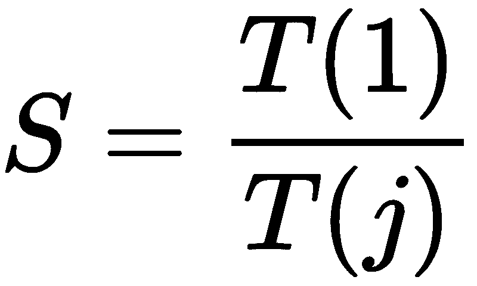
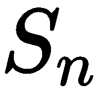
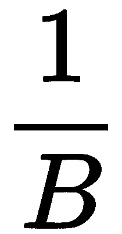
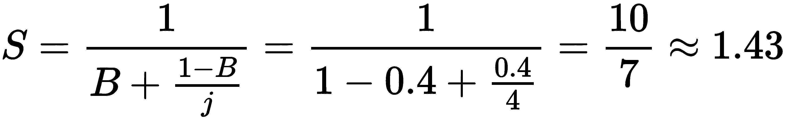

# 二、Amdahl 定律

Amdahl 定律经常用于围绕并发程序的讨论，它解释了在使用并发时程序执行的理论加速。在本章中，我们将讨论Amdahl定律的概念，并分析其公式，该公式估计程序的潜在加速比，并将其复制到 Python 代码中。本章还将简要介绍Amdahl定律和收益递减定律之间的关系。

本章将介绍以下主题：

*   Amdahl定律
*   Amdahl定律：公式与解释
*   Amdahl定律与收益递减定律的关系
*   Python 中的模拟，以及 Amdahl 定律的实际应用

# 技术要求

以下是本章的先决条件列表：

*   确保计算机上安装了 Python 3
*   在[下载 GitHub 存储库 https://github.com/PacktPublishing/Mastering-Concurrency-in-Python](https://github.com/PacktPublishing/Mastering-Concurrency-in-Python)
*   在本章中，我们将使用名为`Chapter02`的子文件夹
*   查看以下视频以查看代码的运行：[http://bit.ly/2DWaOeQ](http://bit.ly/2DWaOeQ)

# Amdahl定律

如何在并行化顺序程序（通过增加处理器数量）和优化顺序程序本身的执行速度之间找到平衡？例如，哪一个是更好的选择：让四个处理器以 40%的执行率运行一个给定的程序，还是只使用两个处理器执行同一个程序，但执行时间是原来的两倍？这种在并发编程中常见的权衡，可以应用Amdahl定律进行战略性分析和回答。

此外，虽然并发性和并行性是一种强大的工具，可以显著提高程序执行时间，但它们并不是可以无限无条件地加速任何非顺序体系结构的灵丹妙药。因此，对于开发人员和程序员来说，了解并理解并发性和并行性给他们的程序带来的速度改进的局限性是很重要的，Amdahl定律解决了这些问题。

# 术语

Amdahl定律提供了一个数学公式，通过增加并发程序的资源（特别是可用处理器的数量）来计算其速度的潜在提高。在我们了解Amdahl定律背后的理论之前，首先，我们必须澄清一些术语，如下所示：

*   Amdahl定律仅讨论了在**并行**中执行任务可能导致的延迟加速。虽然这里没有直接讨论并发性，但是Amdahl关于并行性的定律的结果将给我们一个关于并发程序的估计。
*   程序的**速度**表示程序完全执行所需的时间。这可以用任何时间增量来衡量。
*   **加速**是衡量并行执行计算效益的时间。它被定义为一个程序串行执行（使用一个处理器）所需的时间除以并行执行（使用多个处理器）所需的时间。加速比公式如下：



在上式中，*T（j）*是使用*j*处理器执行程序所需的时间。

# 公式和解释

在讨论Amdahl定律的公式及其含义之前，让我们通过一些简单的分析来探讨加速的概念。让我们假设有*N*个工人在一个完全可并行的给定作业上工作，也就是说，该作业可以完美地划分为*N*个相等的部分。这意味着*N*工人一起完成工作只需要*1/N*个工人完成相同工作所需的时间。

然而，大多数计算机程序并不是 100%可并行的：程序的某些部分可能天生是顺序的，而另一些部分则分解为并行任务。

# Amdahl定律的公式

现在，让 St0 T0 B B T1 表示一个严格串行的程序的分数，并考虑如下：

*   *B*T（1）*是执行程序中固有顺序部分所需的时间。
*   *T（1）-B*T（1）=（1-B）*T（1）*是使用一个处理器执行可并行化程序部分所需的时间：
    *   然后，*（1-B）*T（1）/N*是使用*N*处理器执行这些部分所需的时间
*   因此，*B*T（1）+（1-B）*T（1）/N*是使用*N*处理器执行整个程序所需的总时间。

回到加速量的公式，我们有以下公式：


这个公式实际上是Amdahl定律的一种形式，用于估计并行程序中的加速比。

# 一个简单的例子

让我们假设我们有一个计算机程序，以下内容适用于它：

*   其中 40%是并行的，所以*B=1-40%=0.6*
*   其可并行部分将由四个处理器处理，因此*j=4*

Amdahl定律规定，应用改进的总体加速速度如下：


# 启示

以下是 Gene Amdahl 在 1967 年的一段话：

"For over a decade prophets have voiced the contention that the organization of a single computer has reached its limits and that truly significantly advances can be made only by interconnection of a multiplicity of computers in such a manner as to permit cooperative solution... The nature of this overhead (in parallelism) appears to be sequential so that it is unlikely to be amenable to parallel processing techniques. Overhead alone would then place an upper limit on throughput of five to seven times the sequential processing rate, even if the housekeeping were done in a separate processor... At any point in time it is difficult to foresee how the previous bottlenecks in a sequential computer will be effectively overcome."

通过引用，Amdahl 指出，无论在一个程序中实现什么并发和并行技术，程序中所需开销部分的顺序性质总是为程序将获得多少加速设置上限。这是Amdahl定律进一步暗示的含义之一。考虑下面的例子：


表示从*n*处理器获得的加速比

这表明，随着资源数量（特别是可用处理器数量）的增加，整个任务的执行速度也会增加。但是，这并不意味着我们应该始终使用尽可能多的系统处理器实现并发性和并行性，以实现最高性能。事实上，从公式中，我们还可以得出，增加处理器数量所获得的加速比会降低。换句话说，当我们为并发程序添加更多的处理器时，我们在执行时间上的改进会越来越少。

此外，如前所述，Amdahl定律提出的另一个含义涉及执行时间改进的上限：


是并发性和并行性可以为您的程序提供多少改进的上限。也就是说，无论您的系统有多少可用资源，都不可能通过并发获得大于的加速比，并且该限制由程序的顺序开销部分决定（*B*是严格串行的程序部分）。

# Amdahl定律与收益递减定律的关系

Amdahl定律经常与收益递减定律混为一谈，这是经济学中一个相当流行的概念。然而，收益递减定律只是应用Amdahl定律的一个特例，取决于改进的顺序。如果选择以**最优**方式改进程序中单独任务的顺序，则会观察到执行时间单调递减的改进，表明收益递减。最佳方法是首先应用那些将产生最大加速比的改进，然后将产生较小加速比的改进留待以后使用。

现在，如果我们要改变选择资源的顺序，在选择资源的过程中，我们先改进程序中不太优化的部分，然后再改进更优化的部分，那么通过改进实现的加速将在整个过程中增加。此外，在现实中，以这种**反向优化**顺序实施系统改进实际上更有利于我们，因为更优化的组件通常更复杂，需要更多的时间来改进。

Amdahl定律和收益递减定律之间的另一个相似之处是，通过向系统中添加更多处理器来提高加速比。具体来说，当系统中添加一个新的处理器来处理固定大小的任务时，它提供的可用计算能力将低于以前的处理器。正如我们在上一节中所讨论的，随着处理器数量的增加，这种情况下的改进会严格减少，并且总吞吐量接近*1/B*的上限。

需要注意的是，此分析没有考虑其他潜在瓶颈，如内存带宽和 I/O 带宽。事实上，如果这些资源不随处理器的数量扩展，那么简单地添加处理器会导致更低的回报。

# 如何在 Python 中进行模拟

在本节中，我们将通过 Python 程序查看Amdahl定律的结果。考虑到确定整数是否为素数的任务，正如[第 1 章](01.html)、*并发和并行编程高级介绍*、*、*中所述，我们将看到通过并发实现的实际加速。如果您已经从 GitHub 页面下载了该书的代码，那么我们正在查看`Chapter02/example1.py`文件。

作为复习，检查素数的函数如下所示：

```py
# Chapter02/example1.py

from math import sqrt

def is_prime(x):
    if x < 2:
        return False

    if x == 2:
        return x

    if x % 2 == 0:
        return False

    limit = int(sqrt(x)) + 1
    for i in range(3, limit, 2):
        if x % i == 0:
            return False

    return x
```

代码的下一部分是一个函数，该函数接受一个整数，该整数指示我们将用来同时解决问题的处理器（工作者）数量（在本例中，它用于确定列表中哪些数字是素数）：

```py
# Chapter02/example1.py

import concurrent.futures

from timeit import default_timer as timer

def concurrent_solve(n_workers):
    print('Number of workers: %i.' % n_workers)

    start = timer()
    result = []

    with concurrent.futures.ProcessPoolExecutor(
      max_workers=n_workers) as executor:

        futures = [executor.submit(is_prime, i) for i in input]
        completed_futures = concurrent.futures.as_completed(futures)

        sub_start = timer()

        for i, future in enumerate(completed_futures):
            if future.result():
                result.append(future.result())

        sub_duration = timer() - sub_start

    duration = timer() - start
    print('Sub took: %.4f seconds.' % sub_duration)
    print('Took: %.4f seconds.' % duration)
```

请注意，变量`sub_start`和`sub_duration`度量的是同时解决的任务部分，在我们前面的分析中，这部分被表示为*1-B*。至于输入，我们将查看介于*10<sup>13</sup>*和*10<sup>13</sup>+1000*之间的数字：

```py
input = [i for i in range(10 ** 13, 10 ** 13 + 1000)]
```

最后，我们将从一个循环到系统中可用的最大处理器数量，并将该数量传递给前面的`concurrent_solve()`函数。作为一个快速提示，要从您的计算机获取可用处理器的数量，请拨打`multiprocessing.cpu_count()`，如下所示：

```py
for n_workers in range(1, multiprocessing.cpu_count() + 1):
    concurrent_solve(n_workers)
    print('_' * 20)
```

您可以通过输入命令`python example1.py`来运行整个程序。由于我的笔记本电脑有四个内核，以下是我运行程序后的输出：

```py
Number of workers: 1.
Sub took: 7.5721 seconds.
Took: 7.6659 seconds.
____________________
Number of workers: 2.
Sub took: 4.0410 seconds.
Took: 4.1153 seconds.
____________________
Number of workers: 3.
Sub took: 3.8949 seconds.
Took: 4.0063 seconds.
____________________
Number of workers: 4.
Sub took: 3.9285 seconds.
Took: 4.0545 seconds.
____________________
```

需要注意的几点如下：

*   首先，在每次迭代中，任务的子部分几乎和整个程序一样长。换句话说，在每次迭代过程中，并发计算占据了程序的大部分。这是可以理解的，因为除了素数检查之外，程序中几乎没有其他繁重的计算。
*   其次，可以说更有趣的是，我们可以看到，虽然在将处理器数量从`1`增加到`2`（从`7.6659 seconds`增加到`4.1153 seconds`）后获得了相当大的改进，但在第三次迭代中几乎没有实现任何加速。第四次迭代比第三次迭代花费的时间更长，但这很可能是处理开销。这与我们先前讨论的Amdahl定律和收益递减定律之间的相似性是一致的，考虑到处理器的数量。

*   我们也可以参考加速曲线来可视化这种现象。加速曲线是一个简单的图形，*x*轴表示处理器数量，而*y*轴表示实现的加速。在一个完美的场景中，*S=j*（也就是说，实现的加速比等于使用的处理器数量），加速比曲线将是一条 45 度的直线。Amdahl定律表明，任何程序产生的加速曲线都将保持在该线以下，并随着效率的降低而开始变平。在前面的程序中，这是在从两个处理器过渡到三个处理器的过程中：


Speedup curves with different parallel portions

# Amdahl定律的实际应用

正如我们所讨论的，通过使用Amdahl定律分析给定程序或系统的顺序和可并行部分，我们可以确定或至少估计并行计算所带来的任何潜在速度改进的上限。在获得这个估计值后，我们就可以做出明智的决定，决定改进的执行时间是否值得增加处理能力。

从我们的示例中，我们可以看到，当您有一个并发程序，它是顺序指令和并行执行指令的混合体时，Amdahl 定律适用。通过使用 Amdahl 定律进行分析，我们可以通过每次增加可执行的内核数量来确定加速比，以及该增加距离帮助程序实现并行化的最佳加速比有多近。

现在，让我们回到我们在本章开始时提出的最初问题：处理器数量的增加与可应用的并行时间的增加之间的权衡。假设您负责开发一个并发程序，该程序目前有 40%的指令可并行化。这意味着多个处理器可以同时运行 40%的程序执行。现在，您的任务是通过实施以下两种选择之一来提高此程序的速度：

*   实现四个处理器来执行程序指令
*   除了将程序的可并行部分增加到 80%之外，还实现了两个处理器

我们如何分析比较这两个选择，以确定哪一个将为我们的程序产生最佳速度？幸运的是，Amdahl定律可以在这一过程中帮助我们：

*   对于第一个选项，可获得的加速比如下所示：



*   对于第二个选项，加速比如下所示：


正如您所看到的，第二个选项（处理器比第一个少）实际上是加速特定程序的更好选择。这是Amdahl定律的另一个例子，说明有时简单地增加可用处理器的数量实际上不利于提高程序的速度。具有潜在不同规格的类似权衡也可以通过这种方式进行分析。

最后，我们必须知道，虽然Amdahl定律以明确的方式提供了对潜在加速的估计，但该定律本身做出了一些基本假设，并且没有考虑一些潜在的重要因素，如并行开销或内存速度。因此，Amdahl定律的公式简化了实践中可能常见的各种考虑因素。

那么，并发程序的程序员应该如何考虑和使用Amdahl定律呢？我们应该记住，Amdahl定律的结果只是简单的估计，可以为我们提供一个概念，即我们可以在何处以及通过多少来进一步优化并发系统，特别是通过增加可用处理器的数量。最后，只有实际的测量才能准确地回答我们的问题，即我们的并行程序在实践中将实现多大的加速。尽管如此，Amdahl定律仍然可以帮助我们有效地确定使用并发性和并行性提高计算速度的良好理论策略。

# 总结

Amdahl定律为我们提供了一种方法来估计任务执行时间的潜在加速，当系统的资源得到改善时，我们可以从系统中期望该任务的执行时间。它说明，随着系统资源的提高，执行时间也随之提高。然而，增加资源时的差异加速比会严格降低，并且吞吐量加速比受到其程序顺序开销的限制。

您还看到，在特定情况下（即，只有处理器数量增加时），Amdahl定律类似于收益递减定律。具体地说，随着处理器数量的增加，通过改进获得的效率降低，加速曲线变平。

最后，本章表明，通过并发和并行进行改进并不总是可取的，需要详细的规范来实现高效的并发程序。

随着对并发在多大程度上有助于加快我们的程序的了解，我们现在将开始讨论 Python 提供的用于实现并发的特定工具。具体来说，我们将在下一章中考虑并发编程线程的主要参与者之一，包括它们在 Python 编程中的应用。

# 问题

*   什么是Amdahl定律？Amdahl定律试图解决什么问题？
*   解释Amdahl定律的公式及其组成部分。
*   根据Amdahl定律，加速会随着系统资源的改善而无限增加吗？
*   Amdahl定律和收益递减定律之间的关系是什么？

# 进一步阅读

有关更多信息，请参阅以下链接：

*   *Amdahl定律*[https://home.wlu.edu/~whalyt/classes/parallel/topics/amdahl.html](https://home.wlu.edu/~whaleyt/classes/parallel/topics/amdahl.html)，作者：亚伦·米切洛夫
*   *Amdahl定律的使用和滥用*，大学计算科学杂志 17.2（2001）：288-293，s.Krishnaprasad
*   *用 Python 学习并发：构建高效、健壮、并发的应用程序*（2017），Elliot Forbes