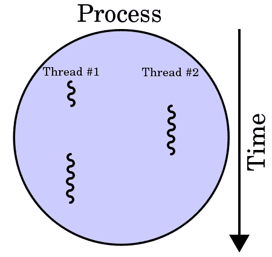
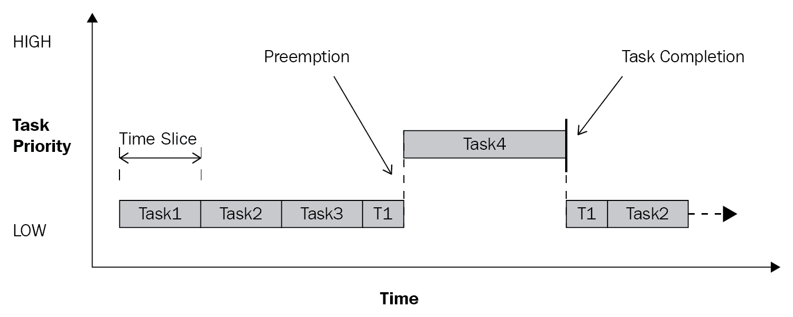
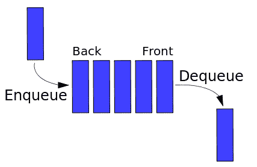
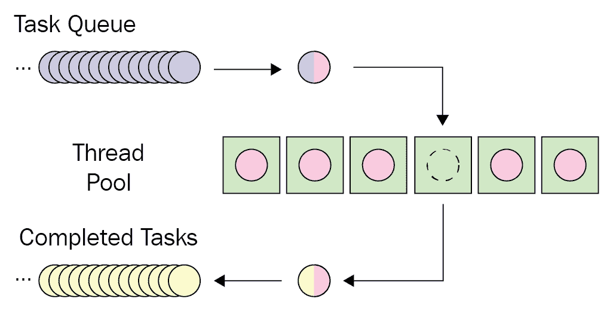

# 三、在 Python 中使用线程

在[第一章](01.html)*并发和并行编程高级介绍*中，您看到了一个线程用于并发和并行编程的示例。在本章中，您将了解线程的形式化定义，以及 Python 中的`threading`模块。我们将通过具体示例介绍在 Python 程序中使用线程的多种方法，包括创建新线程、同步线程和使用多线程优先级队列等活动。我们还将讨论线程同步中的锁的概念，并将实现一个基于锁的多线程应用程序，以便更好地理解线程同步的好处。

本章将介绍以下主题：

*   计算机科学中并发编程环境中的线程概念
*   Python 中`threading`模块的基本 API
*   如何通过`threading`模块创建新线程
*   锁的概念以及如何使用不同的锁机制来同步线程
*   并发编程环境中队列的概念，以及如何使用`Queue`模块在 Python 中处理队列对象

# 技术要求

以下是本章的先决条件列表：

*   确保计算机上安装了 Python 3
*   在[下载 GitHub 存储库 https://github.com/PacktPublishing/Mastering-Concurrency-in-Python](https://github.com/PacktPublishing/Mastering-Concurrency-in-Python)
*   在本章中，我们将使用名为`Chapter03`的子文件夹
*   查看以下视频以查看代码的运行：[http://bit.ly/2SeD2oz](http://bit.ly/2SeD2oz)

# 线的概念

在计算机科学领域，**执行线程**是调度器（通常作为操作系统的一部分）可以处理和管理的最小编程命令（代码）单元。根据操作系统的不同，线程和进程的实现（我们将在后面的章节中介绍）有所不同，但线程通常是进程的一个元素（组件）。

# 线程与进程

同一进程中可以实现多个线程，通常并发执行并访问/共享相同的资源，如内存；单独的过程不能做到这一点。同一进程中的线程共享后者的指令（其代码）和上下文（其变量在任何给定时刻引用的值）。

这两个概念之间的关键区别在于线程通常是进程的一个组件。因此，一个进程可以包括多个线程，这些线程可以同时执行。线程通常还允许共享资源，如内存和数据，而进程很少这样做。简言之，线程是与进程类似的独立计算组件，但进程内的线程可以共享该进程的地址空间，从而共享该进程的数据：



A process with two threads of execution running on one processor

据报道，在 OS/360 多道程序设计中，线程首先用于不同数量的任务，这是 IBM 在 1967 年开发的一种中断的批处理系统。当时，开发人员将线程称为任务，而“线程”一词后来很流行，并被认为是数学家和计算机科学家维克托·维索茨基（Victor A.Vyssotsky）的作品，维克托·维索茨基是 Digital 剑桥研究实验室的创始主任。

# 多线程

在计算机科学中，单线程类似于传统的顺序处理，在任何给定时间执行单个命令。另一方面，**多线程**实现了在单个进程中同时存在和执行多个线程。通过允许多个线程访问共享资源/上下文并独立执行，这种编程技术可以帮助应用程序加快独立任务的执行速度。

多线程主要可以通过两种方式实现。在单处理器系统中，多线程通常通过**时间切片**实现，这是一种允许 CPU 在不同线程上运行的不同软件之间切换的技术。在时间切片中，CPU 快速频繁地切换其执行，以至于用户通常感觉到软件正在并行运行（例如，当您在单处理器计算机上同时打开两个不同的软件时）：



An example of a time slicing technique called round-robin scheduling

与单处理器系统不同，具有多个处理器或内核的系统可以通过同时在单独的进程或内核中执行每个线程来轻松实现多线程。此外，时间切片是一种选择，因为这些多处理器或多核系统只能有一个处理器/核心在任务之间切换，尽管这通常不是一种好的做法。

与传统的顺序应用程序相比，多线程应用程序具有许多优点；其中一些建议如下：

*   **更快的执行时间**：多线程并发的主要优点之一是实现了加速。同一程序中的独立线程可以并发或并行执行，前提是它们彼此充分独立。

*   **响应性**：单线程程序一次只能处理一条输入；因此，如果主执行线程阻塞了长时间运行的任务（即需要大量计算和处理的输入），则整个程序将无法继续执行其他输入，因此，它将被冻结。通过使用单独的线程执行计算并保持运行以同时接收不同的用户输入，多线程程序可以提供更好的响应性。
*   **资源消耗效率**：如前所述，同一进程内的多个线程可以共享和访问相同的资源。因此，多线程程序可以同时服务和处理许多客户机的数据请求，使用的资源比使用单线程或多进程程序时所需的资源少得多。这也会加快线程之间的通信。

尽管如此，多线程程序也有其缺点，如下所示：

*   **崩溃**：即使一个进程可以包含多个线程，但一个线程中的一个非法操作可能会对进程中所有其他线程的处理产生负面影响，并可能导致整个程序崩溃。
*   **同步**：尽管与传统的顺序编程或多处理程序相比，共享相同的资源可能是一种优势，但也需要仔细考虑共享的资源。通常，线程必须以深思熟虑和系统化的方式进行协调，以便正确计算和操作共享数据。粗心的线程协调可能导致的非直观问题包括死锁、活锁和竞争条件，所有这些都将在以后的章节中讨论。

# Python 中的一个示例

为了说明在同一进程中运行多个线程的概念，让我们看一下 Python 中的一个快速示例。如果您已经从 GitHub 页面下载了本书的代码，请继续并导航到`Chapter03`文件夹。让我们来看看 AUTT1 文件，如下：

```py
# Chapter03/my_thread.py

import threading
import time

class MyThread(threading.Thread):
    def __init__(self, name, delay):
        threading.Thread.__init__(self)
        self.name = name
        self.delay = delay

    def run(self):
        print('Starting thread %s.' % self.name)
        thread_count_down(self.name, self.delay)
        print('Finished thread %s.' % self.name)

def thread_count_down(name, delay):
    counter = 5

    while counter:
        time.sleep(delay)
        print('Thread %s counting down: %i...' % (name, counter))
        counter -= 1
```

在这个文件中，我们使用 Python 的 Tyle T0Ex 模块作为 AuthT1R 类的基础。此类的每个对象都有一个`name`和`delay`参数。函数`run()`（在新线程初始化和启动后立即调用）打印启动消息，然后依次调用`thread_count_down()`函数。此函数从数字`5`倒计时到数字`0`，同时在两次迭代之间休眠数秒，由延迟参数指定。

本例的重点是通过同时启动`MyThread`类的多个对象来显示在同一程序（或进程）中运行多个线程的并发性。我们知道，一旦每个线程启动，该线程的基于时间的倒计时也将开始。在传统的顺序程序中，将按顺序分别执行单独的倒计时（也就是说，直到当前倒计时结束，新的倒计时才会开始）。正如您将看到的，独立线程的独立倒计时是并行执行的。

让我们看一下`Chapter3/example1.py`文件，如下所示：

```py
# Chapter03/example1.py

from my_thread import MyThread

thread1 = MyThread('A', 0.5)
thread2 = MyThread('B', 0.5)

thread1.start()
thread2.start()

thread1.join()
thread2.join()

print('Finished.')
```

这里，我们一起初始化和启动两个线程，每个线程都有`0.5`秒作为其`delay`参数。使用 Python 解释器运行脚本。您应该获得以下输出：

```py
> python example1.py
Starting thread A.
Starting thread B.
Thread A counting down: 5...
Thread B counting down: 5...
Thread B counting down: 4...
Thread A counting down: 4...
Thread B counting down: 3...
Thread A counting down: 3...
Thread B counting down: 2...
Thread A counting down: 2...
Thread B counting down: 1...
Thread A counting down: 1...
Finished thread B.
Finished thread A.
Finished.
```

正如我们预期的那样，输出告诉我们线程的两个倒计时是同时执行的；程序没有完成第一个线程的倒计时，然后开始第二个线程的倒计时，而是几乎同时运行两个倒计时。在不包含一些开销和杂项声明的情况下，这种线程技术使前面的程序的速度几乎提高了一倍。

在前面的输出中还有一件事需要注意。在对编号`5`进行第一次倒计时之后，我们可以看到线程 B 的倒计时实际上在执行中领先于线程 A，尽管我们知道线程 A 是在线程 B 之前初始化和启动的。这种更改实际上允许线程 B 在线程 A 之前完成。这种现象是通过多线程并发的直接结果；由于这两个线程几乎是同时初始化和启动的，因此很可能一个线程在执行中领先于另一个线程。

如果您多次执行此脚本，您很可能会得到不同的输出，包括执行顺序和倒计时的完成情况。第一个输出显示了统一且不变的执行和完成顺序，其中两个倒计时同时执行。第二个示例显示了线程 a 的执行速度明显快于线程 B 的情况；它甚至在线程 B 计数到数字`1`之前完成。输出的这种变化进一步说明了一个事实，即 Python 对线程的处理和执行是平等的。

以下代码显示了程序的一个可能输出：

```py
> python example1.py
Starting thread A.
Starting thread B.
Thread A counting down: 5...
Thread B counting down: 5...
Thread A counting down: 4...
Thread B counting down: 4...
Thread A counting down: 3...
Thread B counting down: 3...
Thread A counting down: 2...
Thread B counting down: 2...
Thread A counting down: 1...
Thread B counting down: 1...
Finished thread A.
Finished thread B.
Finished.
```

以下是另一种可能的输出：

```py
> python example1.py
Starting thread A.
Starting thread B.
Thread A counting down: 5...
Thread B counting down: 5...
Thread A counting down: 4...
Thread B counting down: 4...
Thread A counting down: 3...
Thread B counting down: 3...
Thread A counting down: 2...
Thread B counting down: 2...
Thread A counting down: 1...
Finished thread A.
Thread B counting down: 1...
Finished thread B.
Finished.
```

# 线程模块概述

在 Python 中实现多线程程序时，有很多选择。在 Python 中使用线程的最常见方法之一是通过`threading`模块。在深入研究模块的用法及其语法之前，首先，让我们先研究一下`thread`模型，它以前是 Python 中主要的基于线程的开发模块。

# Python 2 中的线程模块

在`threading`模块流行之前，主要的基于线程的开发模块是`thread`。如果您使用的是较旧版本的 Python2，则可以原样使用该模块。然而，根据模块文档页面，实际上，`thread`模块在 Python 3 中被重命名为`_thread`。

对于那些一直在使用`thread`模块构建多线程应用程序并希望将代码从 Python 2 移植到 Python 3 的读者来说，2to3 工具可能是一个解决方案。2to3 工具在解析源代码并遍历源代码树以将 Python2.x 代码转换为 Python3.x 代码时，处理不同版本的 Python 之间大部分可检测到的不兼容。实现转换的另一个技巧是在 Python 程序中将导入代码从`import thread`更改为`import _thread as thread`。

`thread`模块的主要特点是其创建新线程以执行函数的快速且充分的方法：`thread.start_new_thread()`函数。除此之外，该模块只支持使用多线程原语并共享其全局数据空间的一些低级方法。此外，还提供了用于同步目的的简单锁对象（例如互斥量和信号量）。

# Python3 中的线程模块

很长一段时间以来，Python 开发人员一直认为旧的`thread`模块不受欢迎，主要是因为它的函数级别较低，使用有限。另一方面，`threading`模块构建在`thread`模块之上，通过功能强大、级别更高的 API 提供了更简单的线程处理方法。Python 用户实际上被鼓励在他们的程序中使用新的`threading`模块而不是`thread`模块。

此外，`thread`模块将每个线程视为一个函数；当`thread.start_new_thread()`被调用时，它实际上接受一个单独的函数作为它的主参数，以产生一个新线程。然而，`threading`模块的设计目的是为那些来自面向对象软件开发范例的用户提供友好的界面，将创建的每个线程都视为一个对象。

除了`thread`模块提供的处理线程的所有功能外，`threading`模块还支持许多额外的方法，如下所示：

*   `threading.activeCount()`：此函数返回程序中当前活动线程对象的数量
*   `threading.currentThread()`：此函数从调用者返回当前线程控件中的线程对象数
*   `threading.enumerate()`：此函数返回程序中所有当前活动线程对象的列表

`threading`模块遵循面向对象的软件开发范式，还提供了一个`Thread`类，支持线程的面向对象实现。此类中支持以下方法：

*   `run()`：新线程初始化启动时执行此方法
*   `start()`：此方法通过调用`run()`方法启动初始化的调用线程对象
*   `join()`：此方法等待调用线程对象终止，然后继续执行程序的其余部分
*   `isAlive()`：此方法返回一个布尔值，指示调用线程对象当前是否正在执行
*   `getName()`：此方法返回调用线程对象的名称
*   `setName()`：此方法设置调用线程对象的名称

# 在 Python 中创建新线程

在概述了`threading`模块及其与旧`thread`模块的区别之后，在本节中，我们将探讨一些在 Python 中使用这些工具创建新线程的示例。如前所述，`threading`模块很可能是 Python 中最常用的线程处理方式。具体情况需要使用`thread`模块，也可能需要使用其他工具，我们必须能够区分这些情况。

# 使用线程模块启动线程

在`thread`模块中，创建新线程以并发执行函数。如前所述，方法是使用`thread.start_new_thread()`函数：

```py
thread.start_new_thread(function, args[, kwargs])
```

调用此函数时，将生成一个新线程来执行参数指定的函数，并在函数完成执行时返回线程的标识符。`function`参数是要执行的函数的名称，`args`参数列表（必须是列表或元组）包含要传递给指定函数的参数。另一方面，可选的`kwargs`参数包含一个包含其他关键字参数的单独字典。当`thread.start_new_thread()`函数返回时，线程也会静默终止。

让我们来看一个在 Python 程序中使用`thread`模块的示例。如果您已经从 GitHub 页面下载了本书的代码，请继续导航到`Chapter03`文件夹和`Chapter03/example2.py`文件。在本例中，我们将查看我们在前面章节中也使用过的`is_prime()`函数：

```py
# Chapter03/example2.py

from math import sqrt

def is_prime(x):
    if x < 2:
        print('%i is not a prime number.' % x)

    elif x == 2:
        print('%i is a prime number.' % x)

    elif x % 2 == 0:
        print('%i is not a prime number.' % x)

    else:
        limit = int(sqrt(x)) + 1
        for i in range(3, limit, 2):
            if x % i == 0:
                print('%i is not a prime number.' % x)

        print('%i is a prime number.' % x)
```

您可能已经注意到，这个`is_prime(x)`函数返回其计算结果的方式有很大的不同；此`is_prime()`函数不返回`true`或`false`来指示`x`参数是否为素数，而是直接打印出结果。如前所述，`thread.start_new_thread()`函数通过生成一个新线程来执行参数函数，但它实际上返回线程的标识符。打印出`is_prime()`函数内部的结果是通过`thread`模块访问该函数结果的一种解决方法。

在我们程序的主要部分，我们将循环遍历一个质数的潜在候选列表，我们将调用`is_prime()`函数上的`thread.start_new_thread()`函数以及该列表中的每个数字，如下所示：

```py
# Chapter03/example2.py

import _thread as thread

my_input = [2, 193, 323, 1327, 433785907]

for x in my_input:
    thread.start_new_thread(is_prime, (x, ))
```

您会注意到，在`Chapter03/example2.py`文件中，有一行代码要在末尾接收用户的输入：

```py
a = input('Type something to quit: \n')
```

现在，让我们把最后一行注释掉。然后，当我们执行整个 Python 程序时，会发现程序终止，没有打印任何输出；换句话说，程序在线程完成执行之前终止。这是因为，当通过`thread.start_new_thread()`函数生成一个新线程来处理输入列表中的一个数字时，程序会在新创建的线程执行时继续循环下一个输入数字。

因此，当 Python 解释器到达程序末尾时，如果任何线程尚未完成执行（在我们的例子中，它是所有线程），该线程将被忽略并终止，并且不会输出。然而，偶尔会有一个输出是`2 is a prime number.`，它将在程序终止之前打印出来，因为处理编号`2`的线程能够在该点之前完成执行。

最后一行代码是`thread`模块这次的另一个解决方法，用于解决前面的问题。该行阻止程序退出，直到用户按下键盘上的任何键，此时程序将退出。策略是等待程序完成所有线程的执行（也就是说，完成输入列表中所有数字的处理）。取消对最后一行的注释并执行该文件，您的输出应类似于以下内容：

```py
> python example2.py
Type something to quit: 
2 is a prime number.
193 is a prime number.
1327 is a prime number.
323 is not a prime number.
433785907 is a prime number.
```

如您所见，`Type something to quit:`行，对应于我们程序中的最后一行代码，是在`is_prime()`函数输出之前打印出来的；这与以下事实是一致的：在大多数情况下，该行是在任何其他线程完成执行之前执行的。我之所以这么说是因为，当处理第一个输入（数字`2`）的线程在 Python 解释器到达最后一行之前完成执行时，程序的输出将类似于以下内容：

```py
> python example2.py
2 is a prime number.
Type something to quit: 
193 is a prime number.
323 is not a prime number.
1327 is a prime number.
433785907 is a prime number.
```

# 使用线程模块启动线程

现在，您知道了如何使用`thread`模块启动线程，并且了解了它对线程的有限和低级使用，以及在使用它时需要相当不直观的解决方法。在本小节中，我们将探讨首选的`threading`模块及其相对于`thread`模块在 Python 中实现多线程程序方面的优势。

要使用`threading`模块创建和自定义新线程，需要遵循以下具体步骤：

1.  在程序中定义`threading.Thread`类的子类
2.  重写子类内部的默认`__init__(self [,args])`方法，以便为类添加自定义参数
3.  重写子类内部的默认`run(self [,args])`方法，以便在初始化和启动新线程时自定义 thread 类的行为

在本章的第一个示例中，您实际上看到了一个这样的示例。作为复习，我们必须使用以下内容自定义`threading.Thread`子类，以便执行五步倒计时，每个步骤之间有可自定义的延迟：

```py
# Chapter03/my_thread.py

import threading
import time

class MyThread(threading.Thread):
    def __init__(self, name, delay):
        threading.Thread.__init__(self)
        self.name = name
        self.delay = delay

    def run(self):
        print('Starting thread %s.' % self.name)
        thread_count_down(self.name, self.delay)
        print('Finished thread %s.' % self.name)

def thread_count_down(name, delay):
    counter = 5

    while counter:
        time.sleep(delay)
        print('Thread %s counting down: %i...' % (name, counter))
        counter -= 1
```

在下一个示例中，我们将研究确定特定数字是否为素数的问题。这次，我们将通过`threading`模块实现一个多线程 Python 程序。导航到`Chapter03`文件夹和`example3.py`文件。让我们首先关注`MyThread`类，如下所示：

```py
# Chapter03/example3.py

import threading

class MyThread(threading.Thread):
    def __init__(self, x):
        threading.Thread.__init__(self)
        self.x = x

    def run(self):
        print('Starting processing %i...' % x)
        is_prime(self.x)
```

`MyThread`类的每个实例都有一个名为`x`的参数，指定要处理的质数候选。如您所见，当类的实例被初始化并启动时（即在`run(self)`函数中），`is_prime()`函数，即我们在上一个示例中使用的质数检查函数，在`x`参数上，在此之前，`run()`也会打印出一条消息函数指定处理的开始。

在我们的主程序中，我们仍然有相同的输入列表用于素数检查。我们将检查该列表中的每个数字，生成并运行具有该数字的`MyThread`类的新实例，并将该`MyThread`实例附加到单独的列表中。创建的线程列表是必需的，因为在此之后，我们必须对所有这些线程调用`join()`方法，以确保所有线程都已成功完成执行：

```py
my_input = [2, 193, 323, 1327, 433785907]

threads = []

for x in my_input:
    temp_thread = MyThread(x)
    temp_thread.start()

    threads.append(temp_thread)

for thread in threads:
    thread.join()

print('Finished.')
```

请注意，与使用`thread`模块时不同，这一次，我们不必发明一种变通方法来确保所有线程都已成功完成执行。同样，这是通过`threading`模块提供的`join()`方法完成的。这只是使用`threading`模块的更强大、更高级 API 而不是使用`thread`模块的众多优势的一个例子。

# 同步线程

正如您在前面的示例中所看到的，`threading`模块在功能和高级 API 调用方面比其前身`thread`模块有许多优势。尽管有些人建议有经验的 Python 开发人员知道如何使用这两个模块实现多线程应用程序，但您很可能会使用`threading`模块来处理 Python 中的线程。在本节中，我们将介绍如何在线程同步中使用`threading`模块。

# 线程同步的概念

在我们开始实际的 Python 示例之前，让我们先了解一下计算机科学中的同步概念。正如您在前面的章节中所看到的，有时，让程序的所有部分以并行方式执行是不可取的。事实上，在大多数当代并发程序中，代码有顺序部分和并发部分；此外，即使在并发部分内部，也需要在不同线程/进程之间进行某种形式的协调。

**线程/进程同步**是计算机科学中的一个概念，它规定了各种机制，以确保一次只能有一个并发线程/进程处理和执行特定的程序部分；这一部分被称为{ To.t2}临界区，To.T3，我们将在进一步讨论 To.T4 中的并行编程中常见的问题时进一步讨论它。第 12 章，第 5 章，第 6 章，第 13 章，第 9 章第 9 章，第 9 章竞争条件。

在给定的程序中，当一个线程正在访问/执行程序的关键部分时，其他线程必须等待该线程完成执行。线程同步的典型目标是避免多个线程访问其共享资源时出现任何潜在的数据差异；一次只允许一个线程执行程序的关键部分可以保证多线程应用程序中不会发生数据冲突。

# 线程。锁类

应用线程同步的最常见方法之一是通过实现锁定机制。在我们的`threading`模块中，`threading.Lock`类提供了一种简单直观的方法来创建和使用锁。其主要用途包括以下几种方法：

*   `threading.Lock()`：此方法初始化并返回一个新的锁对象。
*   `acquire(blocking)`：调用此方法时，所有线程将同步运行（即一次只能有一个线程执行临界段）：
    *   可选参数`blocking`允许我们指定当前线程是否应该等待获取锁
    *   当`blocking = 0`时，当前线程不等待锁，如果线程无法获取锁，则返回`0`，否则返回`1`
    *   当`blocking = 1`时，当前线程阻塞并等待释放锁，然后获取锁
*   `release()`：调用此方法时，锁释放。

# Python 中的一个示例

让我们考虑一个具体的例子。在这个例子中，我们将查看 PosiT0A.file。我们将回到线程的例子，从五倒计时到一，这是我们在本章开头看到的；如果你不记得这个问题，请花点时间回顾一下。在本例中，我们将调整`MyThread`类，如下所示：

```py
# Chapter03/example4.py

import threading
import time

class MyThread(threading.Thread):
    def __init__(self, name, delay):
        threading.Thread.__init__(self)
        self.name = name
        self.delay = delay

    def run(self):
        print('Starting thread %s.' % self.name)
        thread_lock.acquire()
        thread_count_down(self.name, self.delay)
        thread_lock.release()
        print('Finished thread %s.' % self.name)

def thread_count_down(name, delay):
    counter = 5

    while counter:
        time.sleep(delay)
        print('Thread %s counting down: %i...' % (name, counter))
        counter -= 1
```

与本章的第一个示例相反，在本示例中，`MyThread`类在其`run()`函数中使用了一个锁对象（其变量名为`thread_lock`。具体来说，在调用`thread_count_down()`函数之前（即倒计时开始时）获取锁定对象，锁定对象在其结束后立即释放。理论上，该规范将改变我们在第一个示例中看到的线程的行为；程序现在不再同时执行倒计时，而是分别执行线程，倒计时将一个接一个地进行。

最后，我们将初始化`thread_lock`变量，并运行`MyThread`类的两个独立实例：

```py
thread_lock = threading.Lock()

thread1 = MyThread('A', 0.5)
thread2 = MyThread('B', 0.5)

thread1.start()
thread2.start()

thread1.join()
thread2.join()

print('Finished.')
```

输出结果如下：

```py
> python example4.py
Starting thread A.
Starting thread B.
Thread A counting down: 5...
Thread A counting down: 4...
Thread A counting down: 3...
Thread A counting down: 2...
Thread A counting down: 1...
Finished thread A.
Thread B counting down: 5...
Thread B counting down: 4...
Thread B counting down: 3...
Thread B counting down: 2...
Thread B counting down: 1...
Finished thread B.
Finished.
```

# 多线程优先级队列

排队是一个广泛应用于非并发和并发编程的计算机科学概念。**队列**是一种抽象的数据结构，是按特定顺序维护的不同元素的集合；这些元素可以是程序中的其他对象。

# 现实生活和编程队列之间的连接

排队是一个直观的概念，很容易与我们的日常生活联系在一起，比如当你在机场排队登机时。在实际的人群中，您将看到以下内容：

*   人们通常在队伍的一端进入，从另一端退出
*   如果人员 A 在人员 B 之前进入队列，则人员 A 也将在人员 B 之前离开队列（除非人员 B 具有更高的优先级）
*   一旦每个人都上了飞机，排队的人就没有了。换句话说，该行将是空的

在计算机科学中，队列的工作方式非常相似：

*   可以将元素添加到队列的末尾；此任务称为**排队**。
*   元素也可以从队列的开头移除；此任务称为**出列**。

*   在**先进先出**（**FIFO**队列中，首先添加的元素将首先被删除（因此，名称为 FIFO）。这与计算机科学中另一种常见的数据结构相反，称为**堆栈**，其中添加的最后一个元素将首先删除。这被称为**L****ast 先进先出**（**后进先出**。
*   如果队列中的所有元素都已删除，则队列将为空，并且无法从队列中删除更多元素。类似地，如果队列的最大容量为其可容纳的元素数，则无法向队列中添加任何其他元素：



A visualization of the queue data structure

# 队列模块

Python 中的`queue`模块提供了队列数据结构的简单实现。`queue.Queue`类中的每个队列可以容纳一定数量的元素，并且可以有以下方法作为其高级 API：

*   `get()`：此方法返回调用`queue`对象的下一个元素，并将其从`queue`对象中移除
*   `put()`：此方法为调用的`queue`对象添加新元素
*   `qsize()`：此方法返回调用`queue`对象中当前元素的个数（即其大小）
*   `empty()`：此方法返回一个布尔值，表示调用的`queue`对象是否为空
*   `full()`：此方法返回一个布尔值，表示调用的`queue`对象是否已满

# 并行程序设计中的排队

队列的概念在并发编程的子领域中更为普遍，特别是当我们需要在程序中实现固定数量的线程以与不同数量的共享资源交互时。

在前面的示例中，我们已经学会了将特定任务分配给新线程。这意味着需要处理的任务数量将决定程序应该产生的线程数量。（例如，在我们的`Chapter03/example3.py`文件中，我们有五个数字作为输入，因此我们创建了五个线程，每个线程接受一个输入数字并对其进行处理。）

有时，我们不希望有和我们必须处理的任务一样多的线程。假设我们有大量的任务要处理，那么产生相同数量的线程并让每个线程只执行一个任务将是非常低效的。有固定数量的线程（通常称为线程池）以协作的方式完成任务可能会更有益。

这里是队列概念出现的时候。我们可以设计一种结构，在这种结构中，线程池将不保存关于每个线程应该执行的任务的任何信息，而是将任务存储在队列中（换句话说，任务队列），队列中的项目将被馈送给线程池的各个成员。由于给定的任务是由线程池的成员完成的，如果任务队列仍然包含要处理的元素，那么队列中的下一个元素将被发送到刚刚可用的线程。

此图进一步说明了此设置：



Queuing in threading

让我们在 Python 中考虑一个快速的例子，以说明这一点。在本例中，我们将考虑打印出给定正整数列表中元素的所有正因子的问题。我们仍在查看前面的`MyThread`类，但进行了一些调整：

```py
# Chapter03/example5.py
import queue
import threading
import time

class MyThread(threading.Thread):
    def __init__(self, name):
        threading.Thread.__init__(self)
        self.name = name

    def run(self):
        print('Starting thread %s.' % self.name)
        process_queue()
        print('Exiting thread %s.' % self.name)

def process_queue():
    while True:
        try:
            x = my_queue.get(block=False)
        except queue.Empty:
            return
        else:
            print_factors(x)

        time.sleep(1)

def print_factors(x):
    result_string = 'Positive factors of %i are: ' % x
    for i in range(1, x + 1):
        if x % i == 0:
            result_string += str(i) + ' '
    result_string += '\n' + '_' * 20

    print(result_string)

# setting up variables
input_ = [1, 10, 4, 3]

# filling the queue
my_queue = queue.Queue()
for x in input_:
    my_queue.put(x)

# initializing and starting 3 threads
thread1 = MyThread('A')
thread2 = MyThread('B')
thread3 = MyThread('C')

thread1.start()
thread2.start()
thread3.start()

# joining all 3 threads
thread1.join()
thread2.join()
thread3.join()

print('Done.')

```

有很多事情要做，所以让我们把程序分解成更小的部分。首先，让我们看一下我们的关键函数，如下所示：

```py
# Chapter03/example5.py

def print_factors(x):
    result_string = 'Positive factors of %i are: ' % x
    for i in range(1, x + 1):
        if x % i == 0:
            result_string += str(i) + ' '
    result_string += '\n' + '_' * 20

    print(result_string)
```

此函数接收一个参数`x`，然后迭代`1`和自身之间的所有正数，以检查一个数字是否是`x`的因子。它最终打印出一条格式化消息，其中包含它通过循环累积的所有信息。

在我们新的`MyThread`类中，当初始化并启动新实例时，将调用`process_queue()`函数。此函数将首先通过调用`get(block=False)`方法，尝试获取`my_queue`变量以非阻塞方式持有的队列对象的下一个元素。如果发生`queue.Empty`异常（表示队列当前没有值），那么我们将结束函数的执行。否则，我们只需将刚刚获得的元素传递给`print_factors()`函数。

```py
# Chapter03/example5.py

def process_queue():
    while True:
        try:
            x = my_queue.get(block=False)
        except queue.Empty:
            return
        else:
            print_factors(x)

        time.sleep(1)
```

在我们的主函数中将`my_queue`变量定义为`queue`模块中的`Queue`对象，该模块包含`input_`列表中的元素：

```py
# setting up variables
input_ = [1, 10, 4, 3]

# filling the queue
my_queue = queue.Queue(4)
for x in input_:
    my_queue.put(x)
```

对于主程序的其余部分，我们只需启动并运行三个单独的线程，直到所有线程都完成各自的执行。在这里，我们选择只创建三个线程来模拟我们前面讨论过的设计——固定数量的线程处理一个元素数量可以独立更改的输入队列：

```py
# initializing and starting 3 threads
thread1 = MyThread('A')
thread2 = MyThread('B')
thread3 = MyThread('C')

thread1.start()
thread2.start()
thread3.start()

# joining all 3 threads
thread1.join()
thread2.join()
thread3.join()

print('Done.')
```

运行该程序，您将看到以下输出：

```py
> python example5.py
Starting thread A.
Starting thread B.
Starting thread C.
Positive factors of 1 are: 1 
____________________
Positive factors of 10 are: 1 2 5 10 
____________________
Positive factors of 4 are: 1 2 4 
____________________
Positive factors of 3 are: 1 3 
____________________
Exiting thread C.
Exiting thread A.
Exiting thread B.
Done.
```

在本例中，我们实现了前面讨论的结构：一个包含所有要执行的任务的任务队列和一个线程池（线程 a、线程 B 和线程 C），该线程池与队列交互以单独处理其元素。

# 多线程优先级队列

队列中的元素按照添加到队列的顺序进行处理；换句话说，添加的第一个元素首先离开队列（FIFO）。尽管这种抽象数据结构在许多情况下模拟了现实生活，但有时我们需要根据应用程序及其用途重新定义/更改动态定义的元素顺序。这就是优先级排队的概念派上用场的地方。

**优先级队列**抽象数据结构类似于队列（甚至前述堆栈）数据结构，但优先级队列中的每个元素，顾名思义，都有与其相关联的优先级；换句话说，当元素添加到优先级队列时，需要指定其优先级。与常规队列不同，优先级队列的出列原则依赖于元素的优先级：优先级较高的元素在优先级较低的元素之前被处理。

优先级队列的概念用于各种不同的应用，即带宽管理、Dijkstra 算法、最佳优先搜索算法等。每个应用程序通常使用一个明确的评分系统/功能来确定其要素的优先级。例如，在带宽管理中，以最小的延迟和被拒绝的可能性来处理优先化的流量，例如实时流。在用于在图的两个给定节点之间寻找最短路径的最佳搜索算法中，实现了一个优先级队列来跟踪未探索的路径；估计路径长度较短的路由在队列中具有较高的优先级。

# 总结

执行线程是编程命令的最小单位。在计算机科学中，多线程应用程序允许多个线程同时存在于同一进程中，以实现并发性和并行性。多线程在执行时间、响应速度和资源消耗效率方面提供了多种优势。

Python 3 中的`threading`模块通常被认为优于旧的`thread`模块，它提供了一个高效、功能强大的高级 API 来处理线程，同时在 Python 中实现多线程应用程序，包括动态生成新线程和通过不同锁定机制同步线程的选项。

排队和优先级排队是计算机科学领域中的重要数据结构，是并发和并行编程中的基本概念。它们允许多线程应用程序以准确的方式高效地执行和完成线程，确保以特定的动态顺序处理共享资源。

在下一章中，我们将讨论 Python 的一个更高级的函数，`with`语句，以及它如何补充 Python 中多线程编程的使用。

# 问题

*   什么是线？线程和进程之间的核心区别是什么？
*   Python 中的`thread`模块提供了哪些 API 选项？
*   Python 中的`threading`模块提供了哪些 API 选项？
*   通过`thread`和`threading`模块创建新线程的过程是什么？
*   使用锁进行线程同步背后的想法是什么？
*   在 Python 中使用锁实现线程同步的过程是什么？
*   队列数据结构背后的想法是什么？
*   队列在并发编程中的主要应用是什么？
*   常规队列和优先级队列之间的核心区别是什么？

# 进一步阅读

有关更多信息，请参阅以下链接：

*   *Python 并行编程食谱*，Giancarlo Zaccone，Packt 出版有限公司，2015 年
*   “在 Python 中学习并发：构建高效、健壮和并发的应用程序”，Elliot Forbes（2017 年）
*   *嵌入式系统的实时概念*，李青、姚凯玲，华润出版社，2003