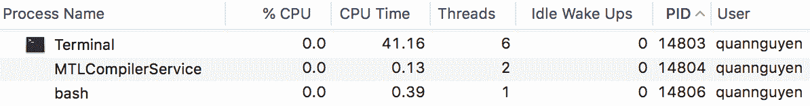

# 使用 Python 处理进程

本章是关于在 Python 中通过多处理编程使用并发性的三章中的第一章。我们已经看到了并发和并行编程中使用的进程的各种示例。在本章中，您将了解流程的正式定义，以及 Python 中的`multiprocessing`模块。本章将介绍使用`multiprocessing`模块的 API 处理进程的一些最常用方法，如`Process`类、`Pool`类以及`Queue`类等进程间通信工具。本章还将介绍并发编程中多线程和多处理之间的主要区别。

本章将介绍以下主题：

*   计算机科学中并发编程环境中的进程概念
*   Python 中`multiprocessing`模块的基本 API
*   如何与`multiprocessing`模块提供的流程和高级功能交互
*   `multiprocessing`模块如何支持进程间通信
*   并发编程中多处理与多线程的关键区别

# 技术要求

以下是本章的先决条件列表：

*   在您的计算机上安装 Python 3
*   在[下载 GitHub 存储库 https://github.com/PacktPublishing/Mastering-Concurrency-in-Python](https://github.com/PacktPublishing/Mastering-Concurrency-in-Python)
*   确保您可以访问名为`Chapter06`的子文件夹
*   查看以下视频以查看代码的运行：[http://bit.ly/2BtwlJw](http://bit.ly/2BtwlJw)

# 过程的概念

在计算机科学领域，**执行过程**是操作系统正在执行的特定计算机程序或软件的实例。流程包含程序代码及其当前活动以及与其他实体的交互。根据操作系统的不同，进程的实现可以由多个执行线程组成，这些线程可以并发或并行执行指令。

重要的是要注意，一个过程并不等同于一个计算机程序。虽然程序只是指令（程序代码）的静态集合，但过程实际上是这些指令的实际执行。这也意味着同一个程序可以通过生成多个进程并发运行。这些进程从父程序执行相同的代码。

例如，互联网浏览器 Google Chrome 通常为其主程序管理一个名为**Google Chrome Helper**的进程，以方便 web 浏览和其他进程，从而帮助实现各种目的。查看系统正在运行和管理哪些不同进程的简单方法包括使用 Windows 任务管理器、iOS 活动监视器和 Linux 操作系统系统监视器。

下面是我的活动监视器的屏幕截图。列表中可以看到多个名为 Google Chrome Helper 的进程。PID 列（代表**过程 ID**报告每个过程具有的唯一 ID：


Sample list of processes

# 进程与线程

程序员在开发并发和并行应用程序时最常见的错误之一是混淆了进程和线程的结构和功能。正如我们在[第 3 章](06.html)中看到的，*在 Python*中使用线程，线程是编程代码的最小单元，通常是进程的一个组件。此外，可以在同一进程中实现多个线程来访问和共享内存或其他资源，而不同的进程不会以这种方式交互。此关系如下图所示：


Diagram of two threads executing in one process

由于进程是比线程更大的编程单元，因此它也更复杂，并且由更多的编程组件组成。因此，进程也需要更多资源，而线程则不需要，有时称为轻量级进程。在典型的计算机系统进程中，有许多主要资源，如下表所示：

*   从父程序执行的代码的映像（或副本）。
*   与程序实例相关联的内存。这可能包括可执行代码、特定进程的输入和输出、用于管理程序特定事件的调用堆栈，或者包含生成的计算数据的堆，该进程当前正在运行时使用该堆。
*   操作系统分配给特定进程的资源的描述符。我们在[第 4 章](04.html)*中看到了这些文件描述符的一个示例，在线程*中使用 with 语句。

*   特定进程的安全组件，即进程的所有者及其权限和允许的操作。
*   处理器状态，也称为进程上下文。进程的上下文数据通常位于处理器寄存器、进程使用的内存或操作系统用于管理进程的控制寄存器中。

因为每个进程都有一个专用的状态，所以进程比线程拥有更多的状态信息；一个进程中的多个线程依次共享进程状态、内存和其他各种资源。出于类似的原因，进程只能通过系统促进的进程间通信方法相互交互，而线程可以通过共享资源轻松地相互通信。

此外，上下文切换—保存进程或线程的状态数据以中断任务执行并在稍后恢复任务的操作—在不同进程之间比在同一进程中的不同线程之间花费更多的时间。然而，虽然我们已经看到线程之间的通信需要仔细的内存同步来确保正确的数据处理，但由于独立进程之间的通信较少，因此进程几乎不需要内存同步。

# 多处理

计算机科学中的一个常见概念是多任务处理。当进行多任务处理时，操作系统只是在不同进程之间高速切换，以显示这些进程正在同时执行，即使通常情况下只有一个进程在一个**中央处理器**（**CPU**上执行）在任何给定的时间。相比之下，多处理是使用多个 CPU 执行任务的方法。

虽然多处理一词有许多不同的用途，但在并发和并行的上下文中，多处理是指在操作系统中执行多个并发进程，其中每个进程在单独的 CPU 上执行，而不是在任何给定时间执行单个进程。根据进程的性质，一个操作系统需要有两个或多个 CPU 才能实现多处理任务，因为它需要同时支持多个处理器并在它们之间适当分配任务。

此关系如下图所示：


Example diagram of multiprocessing using two CPU cores

我们已经在[第 3 章](03.html)*中看到，在 Python*中使用线程时，多线程与多处理的定义有些相似。多线程意味着只使用一个处理器，系统在该处理器内的任务之间切换（也称为**时间切片**），而多处理通常表示使用多个处理器的多个进程的实际并发/并行执行。

多处理应用程序在并发和并行编程领域中得到了广泛的应用。原因如下：

*   **更快的执行时间**：正如我们所知，当正确执行时，并发总是为您的程序提供额外的加速，前提是它们的某些部分可以独立执行。
*   **无同步**：考虑到多处理应用程序中不同进程之间不共享资源，开发人员很少需要花费时间来协调这些资源的共享和同步，这与多线程应用程序不同，需要努力确保数据被正确操作。
*   **碰撞安全**：由于进程在计算过程和输入/输出方面相互独立，如果处理正确，一个进程的故障不会影响多处理程序中另一个进程的执行。这意味着程序员可以产生更多的进程（他们的系统仍然可以处理），并且使整个应用程序崩溃的可能性不会增加。

这样说来，使用我们应该考虑的多重处理也有明显的缺点，如下表所示：

*   **需要多个处理器**：同样，多处理要求操作系统具有多个 CPU。即使多处理器在当今的计算机系统中相当普遍，但如果您的系统没有多个处理器，那么多处理器的实现将是不可能的。
*   **处理时间和空间**：如前所述，流程及其资源的实现涉及到许多复杂的组件。因此，与线程相比，生成和管理进程需要大量的计算时间和能力。

# Python 中的介绍性示例

为了说明在一个操作系统上运行多个进程的概念，让我们看一个 Python 的快速示例。让我们看看下面的代码，如下面的代码所示：

```py
# Chapter06/example1.py

from multiprocessing import Process
import time

def count_down(name, delay):
    print('Process %s starting...' % name)

    counter = 5

    while counter:
        time.sleep(delay)
        print('Process %s counting down: %i...' % (name, counter))
        counter -= 1

    print('Process %s exiting...' % name)

if __name__ == '__main__':
    process1 = Process(target=count_down, args=('A', 0.5))
    process2 = Process(target=count_down, args=('B', 0.5))

    process1.start()
    process2.start()

    process1.join()
    process2.join()

    print('Done.')
```

在本文件中，我们将回到[第 3 章](03.html)中看到的倒计时示例，*使用 Python*处理线程，同时我们将了解线程的概念。我们的`count_down()`函数接受字符串作为进程标识符和延迟时间范围。然后，它将从 5 倒计时到 1，同时在迭代之间休眠`delay`参数指定的秒数。该函数还可以在每次迭代时打印一条带有流程标识符的消息。

正如我们在[第 3 章](03.html)*中所看到的，*使用 Python*中的线程，这个倒计时示例的目的是展示同时运行不同任务的并发性，这次通过使用`multiprocessing`模块中的`Process`类，通过不同的进程。在我们的主程序中，我们同时初始化两个进程，以同时实现两个独立的基于时间的倒计时。与两个单独的线程执行此操作的方式类似，我们的两个进程将同时执行它们自己的倒计时。*

运行 Python 脚本后，您的输出应类似于以下内容：

```py
> python example1.py
Process A starting...
Process B starting...
Process B counting down: 5...
Process A counting down: 5...
Process B counting down: 4...
Process A counting down: 4...
Process B counting down: 3...
Process A counting down: 3...
Process B counting down: 2...
Process A counting down: 2...
Process A counting down: 1...
Process B counting down: 1...
Process A exiting...
Process B exiting...
Done.
```

正如我们预期的那样，输出告诉我们，来自不同进程的两个倒计时是同时执行的；程序没有完成第一个进程的倒计时，然后开始第二个进程，而是几乎同时运行两个倒计时。尽管进程比线程更昂贵，开销也更大，但多处理也可以使前一个程序的速度提高一倍。

请记住，在多线程处理中，我们看到了一种现象，即在不同的程序运行之间，打印输出的顺序发生了变化。具体地说，有时进程 B 会在倒计时过程中领先于进程 A，并在进程 A 之前完成，即使它是稍后初始化的。同样，这是实现和启动两个几乎同时执行同一函数的进程的直接结果。通过多次执行脚本，您将看到，您很可能会在计数顺序和完成计数方面获得不断变化的输出。

# 多处理模块概述

`multiprocessing`模块是 Python 中最常用的多处理编程实现之一。它提供了使用类似于`threading`模块的 API 生成流程并与流程交互的方法（正如前面示例中的`start()`和`join()`方法所示）。根据其文档网站，该模块允许本地和远程并发，并有效避免了 Python 中的**全局解释器锁**（**GIL**）（我们将在[第 15 章](15.html)、*全局解释器锁*中详细讨论）通过使用子进程而不是线程。

# 进程类

在`multiprocessing`模块中，流程通常通过`Process`类生成和管理。每个`Process`对象表示一个在单独进程中执行的活动。方便的是，`Process`类具有在`threading.Thread`类中可以找到的等效方法和 API。

具体地说，`multiprocessing`中的`Process`类利用面向对象编程方法提供以下资源：

*   `run()`：新流程初始化启动时执行此方法
*   `start()`：此方法通过调用`run()`方法启动初始化的调用`Process`对象
*   `join()`：此方法等待调用的`Process`对象终止，然后继续执行程序的其余部分

*   `isAlive()`：此方法返回一个布尔值，指示调用的`Process`对象当前是否正在执行
*   `name`：该属性包含调用`Process`对象的名称

*   `pid`：该属性包含调用`Process`对象的进程 ID
*   `terminate()`：此方法终止调用`Process`对象

正如您从前面的示例中看到的，在初始化`Process`对象时，我们可以通过指定`target`（用于目标函数）和`args`（用于目标函数参数）参数，将参数传递给函数并在单独的过程中执行。请注意，还可以覆盖默认的`Process()`构造函数并实现自己的`run()`函数。

由于它是`multiprocessing`模块中的主要角色，并且在 Python 中通常是并发的，因此我们将在下一节中再次介绍`Process`类。

# 台球课

在`multiprocessing`模块中，`Pool`类主要用于实现一个进程池，每个进程池将执行提交给`Pool`对象的任务。通常情况下，`Pool`类比`Process`类更方便，尤其是当并发应用程序返回的结果需要排序时。

具体来说，我们已经看到，当程序一次又一次地运行时，同时执行一个函数时，列表中不同项的完成顺序很可能会发生变化。这导致在根据产生程序输出的输入顺序重新排序程序输出时出现困难。一种可能的解决方案是创建进程及其输出的元组，并按进程 ID 对其进行排序。

`Pool`类解决了这个问题：`Pool.map()`和`Pool.apply()`方法遵循 Python 传统的`map()`和`apply()`方法的约定，确保返回值的顺序与输入的顺序相同。但是，这些方法会阻止主程序，直到进程完成处理。因此，`Pool`类还具有`map_async()`和`apply_async()`函数，以更好地辅助并发性和并行性。

# 确定当前进程、等待和终止进程

`Process`类提供了许多方法来轻松地与并发程序中的进程交互。在本节中，我们将通过确定当前进程、等待和终止进程来探索管理不同进程的选项。

# 确定当前流程

处理流程有时相当困难，因此需要进行大量调试。调试多处理程序的方法之一是识别遇到错误的进程。作为复习，在前面的倒计时示例中，我们将一个`name`参数传递给`count_down()`函数，以确定每个进程在倒计时期间的位置。

但是，这是不必要的，因为每个`Process`对象都有一个可以更改的`name`参数（具有默认值）。与将标识符传递给目标函数本身（正如我们前面所做的那样）相比，命名进程是跟踪正在运行的进程的更好方法，特别是在同时运行不同类型进程的应用程序中。`multiprocessing`模块提供的一个强大功能是`current_process()`方法，该方法将返回当前在程序任意点运行的`Process`对象。这是另一种有效且轻松地跟踪运行过程的方法。

让我们通过一个例子来更详细地了解这一点。导航到`Chapter06/example2.py`文件，如下代码所示：

```py
# Chapter06/example2.py

from multiprocessing import Process, current_process
import time

def f1():
    pname = current_process().name
    print('Starting process %s...' % pname)
    time.sleep(2)
    print('Exiting process %s...' % pname)

def f2():
    pname = current_process().name
    print('Starting process %s...' % pname)
    time.sleep(4)
    print('Exiting process %s...' % pname)

if __name__ == '__main__':
    p1 = Process(name='Worker 1', target=f1)
    p2 = Process(name='Worker 2', target=f2)
    p3 = Process(target=f1)

    p1.start()
    p2.start()
    p3.start()

    p1.join()
    p2.join()
    p3.join()
```

在本例中，我们有两个伪函数，`f1()`和`f2()`，其中每一个都打印出在睡眠指定时间段之前和之后执行函数的进程的名称。在主程序中，我们初始化三个独立的进程。前两个我们分别命名为`Worker 1`和`Worker 2`，最后一个我们故意留空，为其提供名称的默认值（即`'Process-3'`。运行脚本后，您应该有一个类似于以下内容的输出：

```py
> python example2.py
Starting process Worker 1...
Starting process Worker 2...
Starting process Process-3...
Exiting process Worker 1...
Exiting process Process-3...
Exiting process Worker 2...
```

我们可以看到，`current_process()`成功地帮助我们访问了运行每个函数的正确进程，第三个进程在默认情况下被分配了名称`Process-3`。跟踪程序中正在运行的进程的另一种方法是使用`os`模块查看各个进程 ID。让我们来看一个修改后的例子，如下面的代码：

```py
# Chapter06/example3.py

from multiprocessing import Process, current_process
import time
import os

def print_info(title):
    print(title)

    if hasattr(os, 'getppid'):
        print('Parent process ID: %s.' % str(os.getppid()))

    print('Current Process ID: %s.\n' % str(os.getpid()))

def f():
    print_info('Function f')

    pname = current_process().name
    print('Starting process %s...' % pname)
    time.sleep(1)
    print('Exiting process %s...' % pname)

if __name__ == '__main__':
    print_info('Main program')

    p = Process(target=f)
    p.start()
    p.join()

    print('Done.')
```

本例中我们主要关注的是`print_info()`函数，它使用`os.getpid()`和`os.getppid()`函数使用当前进程的进程 ID 标识当前进程。具体来说，`os.getpid()`返回当前进程的进程 ID，`os.getppid()`（仅在 Unix 系统上可用）返回父进程的 ID。以下是我在运行脚本后的输入：

```py
> python example3.py
Main program
Parent process ID: 14806.
Current Process ID: 29010.

Function f
Parent process ID: 29010.
Current Process ID: 29012.

Starting process Process-1...
Exiting process Process-1...
Done.
```

进程 ID 可能因系统而异，但它们的相对关系应该相同。特别是对于我的输出，我们可以看到，虽然主 Python 程序的 ID 是`29010`，但其父进程的 ID 是`14806`。使用**活动监视器**，我交叉检查了这个 ID，并将它连接到我的终端和 Bash 配置文件，这很有意义，因为我从终端运行了这个 Python 脚本。您可以在以下屏幕截图中看到活动监视器显示的结果：



Screenshot of Activity Monitor being used to crosscheck PIDs

除了主 Python 程序外，我们还在`f()`函数中调用了`print_info()`，其进程 ID 为`29012`。我们还可以看到，运行`f()`函数的进程的父进程实际上是我们的主进程，其 ID 为`29010`。

# 等待进程

通常，我们希望在转移到程序的新部分之前，等待所有并发进程完成执行。如前所述，`multiprocessing`模块中的`Process`类提供了`join()`方法，以实现一种等待流程完成任务并退出的方式。

但是，有时开发人员希望实现在后台运行的进程，并且不阻止主程序退出。当主程序没有简单的方法来判断在任何给定时间中断进程是否合适时，或者当退出主程序而不完成工作程序时，不会影响最终结果时，通常使用本规范。

这些进程称为**守护进程**。`Process`类还提供了一个简单的选项，可以通过`daemon`属性指定进程是否为守护进程，该属性采用布尔值。`daemon`属性的默认值为`False`，因此将其设置为`True`将使给定的进程变成守护进程。让我们使用`Chapter06/example4.py`文件中的一个示例来更详细地了解这一点，如下代码所示：

```py
# Chapter06/example4.py

from multiprocessing import Process, current_process
import time

def f1():
    p = current_process()
    print('Starting process %s, ID %s...' % (p.name, p.pid))
    time.sleep(4)
    print('Exiting process %s, ID %s...' % (p.name, p.pid))

def f2():
    p = current_process()
    print('Starting process %s, ID %s...' % (p.name, p.pid))
    time.sleep(2)
    print('Exiting process %s, ID %s...' % (p.name, p.pid))

if __name__ == '__main__':
    p1 = Process(name='Worker 1', target=f1)
    p1.daemon = True
    p2 = Process(name='Worker 2', target=f2)

    p1.start()
    time.sleep(1)
    p2.start()
```

在本例中，我们有一个长时间运行的函数（由`f1()`表示，其睡眠时间为`4`秒）和一个更快的函数（由`f2()`表示，其睡眠时间仅为`2`秒）。我们还有两个独立的流程，如下表所示：

*   `p1 `进程，它是一个分配给运行`f1()`的守护进程
*   `p2 `流程，分配运行`f2()`的常规流程

在我们的主程序中，我们启动两个进程，而不在程序结束时对其中任何一个调用`join()`方法。由于`p1`是一个长时间运行的进程，在`p2 `完成之前（这是两个进程中速度较快的进程），它很可能不会完成执行。我们还知道`p1`是一个守护进程，所以我们的程序应该在完成执行之前退出。运行 Python 脚本后，您的输出应类似于以下代码：

```py
> python example4.py
Starting process Worker 1, ID 33784...
Starting process Worker 2, ID 33788...
Exiting process Worker 2, ID 33788...
```

同样，即使您自己运行脚本时进程 ID 可能不同，输出的一般格式也应该相同。正如我们所看到的，输出与我们所讨论的一致：`p1`和`p2`进程都是由我们的主程序初始化和启动的，并且程序在非守护进程退出后终止，而不等待守护进程完成。

在不必等待守护进程正在处理的特定任务的情况下终止主程序的能力确实非常有用。然而，有时我们可能希望在退出之前等待守护进程一段指定的时间；这样，如果程序的规范允许进程执行的等待时间，我们就可以完成一些潜在的守护进程，而不是过早地终止所有进程。

守护进程和来自`multiprocessing`模块的`join()`方法的组合可以帮助我们实现这种架构，特别是考虑到`join()`方法无限期地阻止程序执行（或者至少直到任务完成），还可以传递一个 timeout 参数，以指定退出前等待进程的秒数。让我们考虑一下前一个例子的修改版本。使用相同的`f1()`和`f2()`函数，在下面的脚本中，我们正在改变在主程序中处理守护进程的方式：

```py
# Chapter06/example5.py

if __name__ == '__main__':
    p1 = Process(name='Worker 1', target=f1)
    p1.daemon = True
    p2 = Process(name='Worker 2', target=f2)

    p1.start()
    time.sleep(1)
    p2.start()

    p1.join(1)
    print('Whether Worker 1 is still alive:', p1.is_alive())
    p2.join()
```

在本例中，我们不是在不等待守护进程的情况下终止，而是在两个进程上调用`join()`方法：我们允许`p1`完成一秒钟，同时阻止主程序直到`p2`完成。如果在那一秒钟之后`p1`还没有完成执行，主程序将继续执行程序的其余部分并退出，此时我们将看到`p1`-或`Worker 1`-仍处于活动状态。运行 Python 脚本后，您的输出应类似于以下内容：

```py
> python example5.py
Starting process Worker 1, ID 36027...
Starting process Worker 2, ID 36030...
Whether Worker 1 is still alive: True
Exiting process Worker 2, ID 36030...
```

我们看到`p1`在等待了一秒钟之后，当程序继续运行时，它确实还活着。

# 终止进程

来自`multiprocessing.Process`类的`terminate()`方法提供了一种快速终止进程的方法。调用该方法时，`Process`类或重写类中指定的退出处理程序、最终原因或类似资源将不会执行。但是，已终止进程的子进程将不会终止。这些过程称为**孤立过程**。

虽然有时不赞成终止进程，但有时也有必要终止进程，因为某些进程与进程间通信资源（如锁、信号量、管道或队列）交互，而强制停止这些进程可能会导致这些资源损坏或无法供其他进程使用。但是，如果程序中的进程从未与上述资源交互，`terminate()`方法非常有用，尤其是当进程看起来没有响应或死锁时。

在使用`terminate()`方法时需要注意的一点是，即使`Process`对象在调用该方法后被有效地杀死，对该对象调用`join()`也是很重要的。由于`Process`对象的`alive`状态有时在`terminate()`方法之后不会立即更新，因此本实践为后台系统提供了一个机会来实现更新本身，以反映流程的终止。

# 进程间通信

虽然锁是用于线程间通信的最常见的同步原语之一，但管道和队列是不同进程间通信的主要方式。具体来说，它们提供了消息传递选项，以促进进程之间的通信，用于两个进程之间的连接，以及用于多个生产者和消费者的队列。

在本节中，我们将探讨队列的使用，特别是来自`multiprocessing`模块的`Queue`类。实际上，`Queue`类的实现是线程和进程安全的，我们已经在[第 3 章](03.html)中看到了队列的使用，*使用 Python*中的线程。Python 中所有可 pickle 的对象都可以通过`Queue`对象传递；在本节中，我们将使用队列在进程之间来回传递消息。

与共享资源相比，使用消息队列进行进程间通信更可取，因为如果某些进程在共享这些资源时错误地处理和损坏了共享内存和资源，那么将产生许多不希望的和不可预测的后果。但是，如果进程未能正确处理其消息，则队列中的其他项将保持不变。下图显示了使用消息队列和共享资源（特别是内存）进行进程间通信的体系结构差异：


The architecture involved in using a message queue and shared resources   for interprocess communication

# 单个工作进程的消息传递

在深入研究 Python 中的示例代码之前，首先我们需要具体讨论如何在多处理应用程序中使用`Queue`对象。假设我们有一个`worker`类，它执行繁重的计算，不需要大量的资源共享和通信。然而，这些工作者实例仍然需要能够在执行期间不时地接收信息。

这就是使用队列的地方：当我们把所有的工作人员放在一个队列中时。同时，我们还将有许多初始化的进程，每个进程将通过该队列并处理一个工作进程。如果一个进程已经完成了一个辅助进程的执行，而队列中还有其他辅助进程，它将转移到另一个辅助进程并执行它。回顾前面的图表，我们可以看到有两个独立的进程不断地从队列中拾取和执行消息。

对于`Queue`对象，我们将使用两种主要方法，如下表所示：

*   `get()`：此方法返回调用`Queue`对象中的下一项
*   `put()`：此方法将作为附加项传递给它的参数添加到调用的`Queue`对象中

让我们看一个示例脚本，它显示了 Python 中队列的使用。导航到并打开`Chapter06/example6.py`文件，如下代码所示：

```py
# Chapter06/example6.py

import multiprocessing

class MyWorker():
    def __init__(self, x):
        self.x = x

    def process(self):
        pname = multiprocessing.current_process().name
        print('Starting process %s for number %i...' % (pname, self.x))

def work(q):
    worker = q.get()
    worker.process()

if __name__ == '__main__':
    my_queue = multiprocessing.Queue()

    p = multiprocessing.Process(target=work, args=(my_queue,))
    p.start()

    my_queue.put(MyWorker(10))

    my_queue.close()
    my_queue.join_thread()
    p.join()

    print('Done.')
```

在这个脚本中，我们有一个`MyWorker`类，它接受一个数字 `x` 参数并从中执行计算（目前，它只打印数字）。在我们的主函数中，我们从`multiprocessing`模块初始化一个`Queue`对象，并添加一个编号为`10`的`MyWorker`对象。我们还有`work()`函数，调用该函数后，将从队列中获取第一个项目并对其进行处理。最后，我们有一个进程，其任务是调用`work()`函数。

该结构设计用于将消息（在本例中为`MyWorker`对象）传递给单个进程。然后，主程序等待进程完成执行。运行脚本后，您的输出应类似于以下内容：

```py
> python example6.py
Starting process Process-1 for number 10...
Done.
```

# 几个工人之间的消息传递

如前所述，我们的目标是建立一个结构，其中有多个进程不断地从队列中执行工作者，如果一个进程完成了一个工作者的执行，那么它将选择另一个工作者。为此，我们将利用名为`JoinableQueue`的`Queue`子类，该子类将提供额外的`task_done()`和`join()`方法，如下表所述：

*   `task_done()`：此方法告诉程序调用`JoinableQueue`对象已完成
*   `join()`：此方法阻塞，直到调用`JoinableQueue`对象中的所有项目都已处理完毕

现在，这里的目标，再一次，是有一个`JoinableQueue`对象保存所有要执行的任务，我们称之为任务队列和许多进程。只要任务队列中有项目（消息），进程就会轮流执行这些项目。我们还将有一个`Queue`对象来存储从进程返回的所有结果，我们将其称为结果队列。

导航到`Chapter06/example7.py`文件，查看`Consumer`类和`Task`类，如下代码所示：

```py
# Chapter06/example7.py

from math import sqrt
import multiprocessing

class Consumer(multiprocessing.Process):

    def __init__(self, task_queue, result_queue):
        multiprocessing.Process.__init__(self)
        self.task_queue = task_queue
        self.result_queue = result_queue

    def run(self):
        pname = self.name

        while not self.task_queue.empty():

            temp_task = self.task_queue.get()

            print('%s processing task: %s' % (pname, temp_task))

            answer = temp_task.process()
            self.task_queue.task_done()
            self.result_queue.put(answer)

class Task():
    def __init__(self, x):
        self.x = x

    def process(self):
        if self.x < 2:
            return '%i is not a prime number.' % self.x

        if self.x == 2:
            return '%i is a prime number.' % self.x

        if self.x % 2 == 0:
            return '%i is not a prime number.' % self.x

        limit = int(sqrt(self.x)) + 1
        for i in range(3, limit, 2):
            if self.x % i == 0:
                return '%i is not a prime number.' % self.x

        return '%i is a prime number.' % self.x

    def __str__(self):
        return 'Checking if %i is a prime or not.' % self.x
```

`Consumer`类是`multiprocessing.Process`类的重写子类，是我们的处理器逻辑，它接收任务队列和结果队列。启动时，每个`Consumer`对象将获取其任务队列中的下一项，并执行它，最后调用`task_done()`并将返回的结果放入其结果队列。任务队列中的每个项目依次由`Task`类表示，其主要功能是对其`x `参数进行预检查。当`Consumer`类的一个实例与`Task`类的一个实例交互时，它还将打印一条帮助消息，以便我们轻松跟踪哪个使用者正在执行哪个任务。

让我们继续考虑我们的主要程序，如下面的代码所示：

```py
# Chapter06/example7.py

if __name__ == '__main__':
    tasks = multiprocessing.JoinableQueue()
    results = multiprocessing.Queue()

    # spawning consumers with respect to the
    # number cores available in the system
    n_consumers = multiprocessing.cpu_count()
    print('Spawning %i consumers...' % n_consumers)
    consumers = [Consumer(tasks, results) for i in range(n_consumers)]
    for consumer in consumers:
        consumer.start()

    # enqueueing jobs
    my_input = [2, 36, 101, 193, 323, 513, 1327, 100000, 9999999, 433785907]
    for item in my_input:
        tasks.put(Task(item))

    tasks.join()

    for i in range(len(my_input)):
        temp_result = results.get()
        print('Result:', temp_result)

    print('Done.')
```

如前所述，我们在主程序中创建一个任务队列和一个结果队列。我们还创建一个`Consumer`对象列表，并启动所有对象；创建的进程数对应于系统中可用的 CPU 数。接下来，从需要大量计算的`Task`类输入列表中，我们用每个输入初始化一个`Task`对象，并将它们全部放入任务队列中。此时，我们的进程`Consumer`对象将开始执行这些任务。

最后，在主程序结束时，我们在任务队列上调用`join()`，以确保所有项目都已执行，并通过循环结果队列打印出结果。运行脚本后，您的输出应类似于以下内容：

```py
> python example7.py
Spawning 4 consumers...
Consumer-3 processing task: Checking if 2 is a prime or not.
Consumer-2 processing task: Checking if 36 is a prime or not.
Consumer-3 processing task: Checking if 101 is a prime or not.
Consumer-2 processing task: Checking if 193 is a prime or not.
Consumer-3 processing task: Checking if 323 is a prime or not.
Consumer-2 processing task: Checking if 1327 is a prime or not.
Consumer-3 processing task: Checking if 100000 is a prime or not.
Consumer-4 processing task: Checking if 513 is a prime or not.
Consumer-3 processing task: Checking if 9999999 is a prime or not.
Consumer-2 processing task: Checking if 433785907 is a prime or not.
Result: 2 is a prime number.
Result: 36 is not a prime number.
Result: 193 is a prime number.
Result: 101 is a prime number.
Result: 323 is not a prime number.
Result: 1327 is a prime number.
Result: 100000 is not a prime number.
Result: 9999999 is not a prime number.
Result: 513 is not a prime number.
Result: 433785907 is a prime number.
Done.
```

一切似乎都在运行，但如果我们仔细观察我们的流程打印出来的消息，我们会注意到大多数任务是由`Consumer-2`或`Consumer-3`执行的，并且`Consumer-4`只执行了一个任务，而`Consumer-1`没有执行任何任务。这里发生了什么事？

本质上，当我们的一个消费者（比如说`Consumer-3`）完成一个任务时，它会试图寻找另一个任务来立即执行。大多数情况下，它会比其他用户获得优先权，因为它已经由主程序运行。因此，当`Consumer-2`和`Consumer-3`不断地完成任务的执行并挑选其他任务来执行时，`Consumer-4`只能“挤压”自己一次，而`Consumer-1`没有完全做到这一点。

当反复运行脚本时，您会注意到类似的趋势：只有一个或两个使用者执行了大部分任务，而其他使用者则没有执行。这种情况对我们来说是不可取的，因为程序没有利用程序开始时创建的所有可用进程。

为了解决这个问题，已经开发了一种技术，阻止消费者立即从任务队列中取出下一个项目，称为**毒丸**。其思想是，在任务队列中设置了真实任务之后，我们还添加了包含“停止”值的虚拟任务，这些虚拟任务将拥有当前使用者，并允许其他使用者首先获取任务队列中的下一项；因此被称为“毒丸”

为了实现这项技术，我们需要在主程序的特殊对象中添加`tasks`值，每个消费者一个。此外，在我们的`Consumer`类中，还需要实现处理这些特殊对象的逻辑。让我们来看看在前面的例子中，Outt2 文件（一个修改版本的前一个例子，包含毒丸技术的实现），特别是在 AuthT3R 类和主程序中，如下面的代码所示：

```py
# Chapter06/example8.py

class Consumer(multiprocessing.Process):

    def __init__(self, task_queue, result_queue):
        multiprocessing.Process.__init__(self)
        self.task_queue = task_queue
        self.result_queue = result_queue

    def run(self):
        pname = self.name

        while True:
            temp_task = self.task_queue.get()

            if temp_task is None:
                print('Exiting %s...' % pname)
                self.task_queue.task_done()
                break

            print('%s processing task: %s' % (pname, temp_task))

            answer = temp_task.process()
            self.task_queue.task_done()
            self.result_queue.put(answer)

class Task():
    def __init__(self, x):
        self.x = x

    def process(self):
        if self.x < 2:
            return '%i is not a prime number.' % self.x

        if self.x == 2:
            return '%i is a prime number.' % self.x

        if self.x % 2 == 0:
            return '%i is not a prime number.' % self.x

        limit = int(sqrt(self.x)) + 1
        for i in range(3, limit, 2):
            if self.x % i == 0:
                return '%i is not a prime number.' % self.x

        return '%i is a prime number.' % self.x

    def __str__(self):
        return 'Checking if %i is a prime or not.' % self.x

if __name__ == '__main__':

    tasks = multiprocessing.JoinableQueue()
    results = multiprocessing.Queue()

    # spawning consumers with respect to the
    # number cores available in the system
    n_consumers = multiprocessing.cpu_count()
    print('Spawning %i consumers...' % n_consumers)
    consumers = [Consumer(tasks, results) for i in range(n_consumers)]
    for consumer in consumers:
        consumer.start()

    # enqueueing jobs
    my_input = [2, 36, 101, 193, 323, 513, 1327, 100000, 9999999, 433785907]
    for item in my_input:
        tasks.put(Task(item))

    for i in range(n_consumers):
        tasks.put(None)

    tasks.join()

    for i in range(len(my_input)):
        temp_result = results.get()
        print('Result:', temp_result)

    print('Done.')
```

`Task`类与前面的示例保持相同。我们可以看到，我们的毒丸是`None`值：在主程序中，我们添加了一个数字的`None`值，该数字等于我们在任务队列中产生的消费者数量；在`Consumer`类中，如果当前要执行的任务的值为`None`，则类对象将打印一条指示毒丸的消息，调用`task_done()`并退出。

运行脚本；您的输出应类似于以下内容：

```py
> python example8.py
Spawning 4 consumers...
Consumer-1 processing task: Checking if 2 is a prime or not.
Consumer-2 processing task: Checking if 36 is a prime or not.
Consumer-3 processing task: Checking if 101 is a prime or not.
Consumer-4 processing task: Checking if 193 is a prime or not.
Consumer-1 processing task: Checking if 323 is a prime or not.
Consumer-2 processing task: Checking if 513 is a prime or not.
Consumer-3 processing task: Checking if 1327 is a prime or not.
Consumer-1 processing task: Checking if 100000 is a prime or not.
Consumer-2 processing task: Checking if 9999999 is a prime or not.
Consumer-3 processing task: Checking if 433785907 is a prime or not.
Exiting Consumer-1...
Exiting Consumer-2...
Exiting Consumer-4...
Exiting Consumer-3...
Result: 2 is a prime number.
Result: 36 is not a prime number.
Result: 323 is not a prime number.
Result: 101 is a prime number.
Result: 513 is not a prime number.
Result: 1327 is a prime number.
Result: 100000 is not a prime number.
Result: 9999999 is not a prime number.
Result: 193 is a prime number.
Result: 433785907 is a prime number.
Done.
```

这一次，除了看到毒药信息被打印出来外，输出还显示了一个明显更好的分布，即哪个消费者执行了哪个任务。

# 总结

在计算机科学领域，进程是由操作系统执行的特定计算机程序或软件的实例。流程包含程序代码及其当前活动以及与其他实体的交互。同一进程中可以实现多个线程来访问和共享内存或其他资源，而不同的进程不会以这种方式交互。

在并发和并行的上下文中，多处理是指从操作系统执行多个并发进程，其中每个进程在单独的 CPU 上执行，而不是在任何给定时间执行单个进程。Python 中的`multiprocessing`模块提供了一个强大而灵活的 API，用于生成和管理多处理应用程序的进程。它还允许通过`Queue`类进行复杂的进程间通信技术。

在下一章中，我们将讨论 Python 简化操作的更高级功能，以及在多处理编程中如何支持它。

# 问题

*   什么是过程？进程和线程之间的核心区别是什么？
*   什么是多重处理？多处理和多线程之间的核心区别是什么？
*   `multiprocessing`模块提供了哪些 API 选项？
*   `Process`类和`multiprocessing`模块中的`Pool`类之间的核心区别是什么？
*   确定 Python 程序中当前进程的选项有哪些？
*   什么是守护进程？在多处理程序中等待进程的目的是什么？
*   如何终止进程？为什么有时可以接受终止进程？
*   Python 中促进进程间通信的方法之一是什么？

# 进一步阅读

有关更多信息，请参阅以下链接：

*   *Python 并行编程食谱*，作者：Giancarlo Zaccone，Packt 出版有限公司（2015 年）。
*   “在 Python 中学习并发：构建高效、健壮和并发的应用程序”，Elliot Forbes（2017 年）。
*   本周的 Python 模块。“进程间通信”（[pymotw.com/2/multiprocessing/Communication.html](https://pymotw.com/2/multiprocessing/communication.html)）。其中包含可用于标识当前进程的函数。