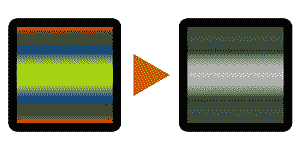
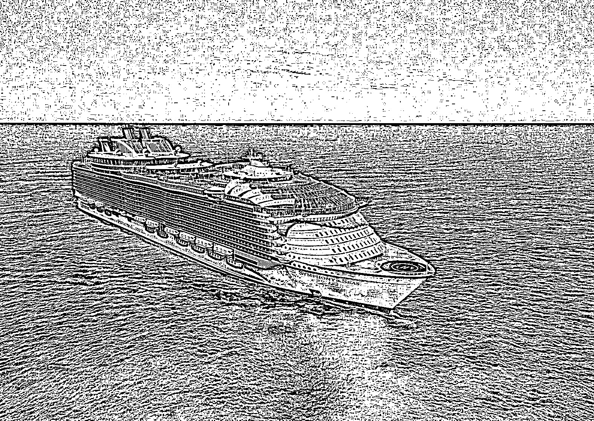
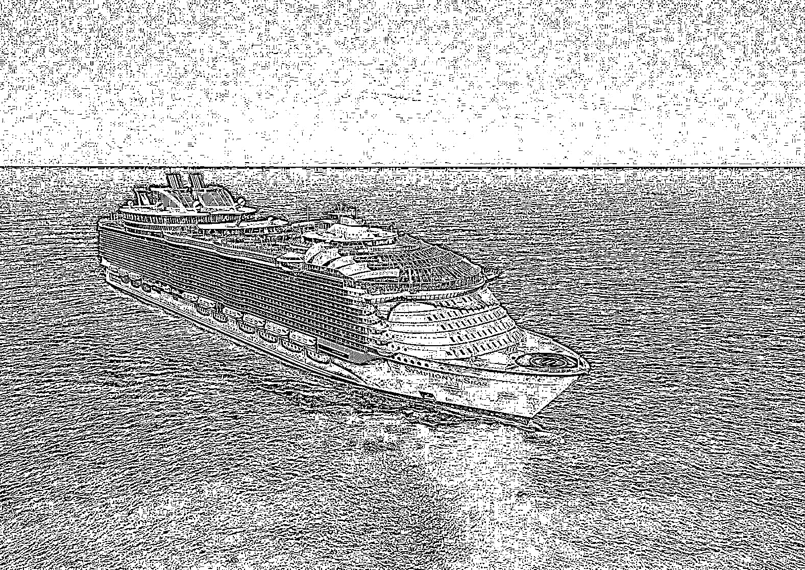
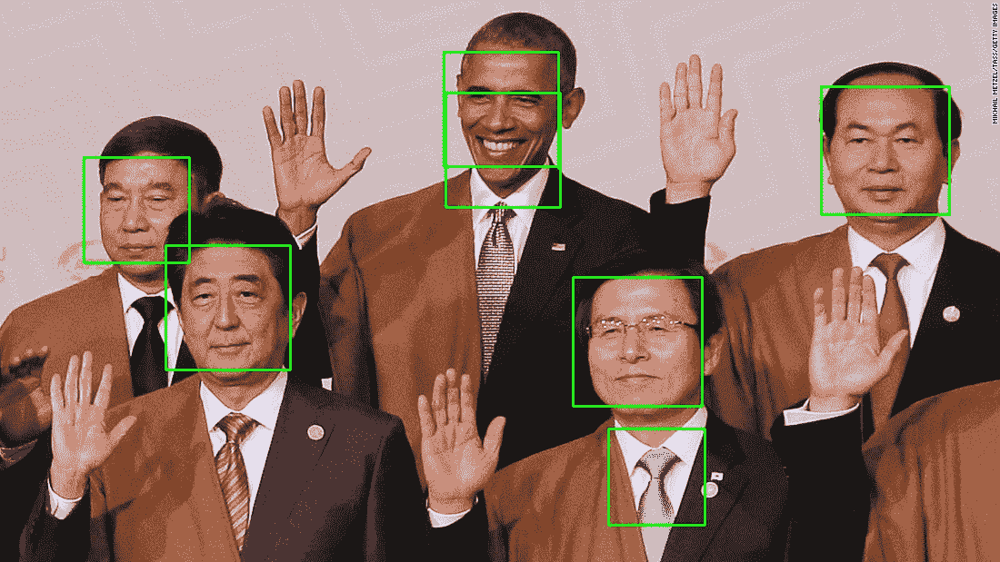

# 八、并行图像处理

本章分析了通过并行编程（特别是多处理）处理和操纵图像的过程。由于图像是相互独立处理的，因此并行编程可以显著加快图像处理速度。本章讨论了图像处理技术背后的基础知识，说明了并发编程所提供的改进，最后介绍了图像处理应用中使用的一些最佳实践。

本章将介绍以下主题：

*   图像处理背后的思想和图像处理中的一些基本技术
*   如何将并发应用于图像处理，以及如何分析它提供的改进
*   并行图像处理的最佳实践

# 技术要求

以下是本章的先决条件列表：

*   您的计算机上必须安装 Python 3
*   必须为 Python3 发行版安装 OpenCV 和 NumPy
*   从[下载 GitHub 存储库 https://github.com/PacktPublishing/Mastering-Concurrency-in-Python](https://github.com/PacktPublishing/Mastering-Concurrency-in-Python)
*   在本章中，我们将使用名为`Chapter08`的子文件夹
*   查看以下视频以查看代码的运行：[http://bit.ly/2R8ydN8](http://bit.ly/2R8ydN8)

# 图像处理基础

数字/计算图像处理（从这一点起，我们将简称为图像处理）在现代已经非常流行，它存在于我们日常生活的许多方面。当您使用不同的滤光片使用相机或手机拍照时，或使用 Adobe Photoshop 等高级图像编辑软件时，甚至当您仅使用 Microsoft Paint 编辑图像时，都会涉及图像处理和操作。

图像处理中使用的许多技术和算法是在 20 世纪 60 年代早期发展起来的，用于各种用途，如医学成像、卫星图像分析、字符识别等。然而，这些图像处理技术需要巨大的计算能力，而当时可用的计算机设备无法满足快速数字运算的需要，这一事实减缓了图像处理的使用。

快进到未来，功能强大的计算机和快速的多核处理器被开发出来，图像处理技术因此变得更加容易使用，图像处理的研究也显著增加。目前，许多图像处理应用正在积极开发和研究，包括模式识别、分类、特征提取等。具体的图像处理技术利用并发和并行编程，否则将非常耗时，包括隐马尔可夫模型、独立分量分析，甚至是新兴的神经网络模型：



One sample use of image processing: grayscaling

# Python 作为图像处理工具

正如我们在本书中多次指出的，Python 编程语言正在成为最流行的编程语言。在计算图像处理领域尤其如此，在大多数情况下，计算图像处理需要快速原型设计和显著的自动化能力。

我们将在下一节中发现，数字图像以二维和三维矩阵表示，因此计算机可以轻松地处理它们。因此，大多数情况下，数字图像处理涉及矩阵计算。多个 Python 库和模块不仅提供了高效的矩阵计算选项，还可以与处理图像读写的其他库无缝交互。

正如我们已经知道的，自动化任务并使它们并发是 Python 的强项。这使得 Python 成为实现图像处理应用的首选。对于本章，我们将使用两个主要的 Python 库：OpLeT0AOPENV ORDT1（代表 OpenT2A.开源计算机视觉 ORT T3），这是一个库，它提供了 C++、java 和 Python 和 NoMpye 中的图像处理和计算机视觉选项，这是我们所知道的，是最流行的 Python 模块之一，执行高效且可并行化的数字运算。

# 安装 OpenCV 和 NumPy

要使用`pip`包管理器为 Python 发行版安装 NumPy，请运行以下命令：

```py
pip install numpy
```

但是，如果您使用 Anaconda/Miniconda 管理软件包，请运行以下命令：

```py
conda install numpy
```

安装 OpenCV 可能更复杂，具体取决于您的操作系统。最简单的选择是让 Anaconda 按照本指南处理安装过程（[https://anaconda.org/conda-forge/opencv](https://anaconda.org/conda-forge/opencv) 安装蟒蛇后（[https://www.anaconda.com/download/](https://www.anaconda.com/download/) ）作为您的主要 Python 包管理器。但是，如果您没有使用 Anaconda，则安装 OpenCV 的主要选项是遵循其官方文档指南，该指南可在[中找到 https://docs.opencv.org/master/df/d65/tutorial_table_of_content_introduction.html](https://docs.opencv.org/master/df/d65/tutorial_table_of_content_introduction.html) 。成功安装 OpenCV 后，打开 Python 解释器并尝试导入库，如下所示：

```py
>>> import cv2
>>> print(cv2.__version__)
3.1.0
```

我们使用名称`cv2`导入 OpenCV，这是 Python 中 OpenCV 的库别名。成功消息表示已下载的 my OpenCV 库的版本（3.1.0）。

# 计算机图像基础

在我们开始处理和操作数字图像文件之前，我们首先需要讨论这些文件的基本原理，以及计算机如何从中解释数据。具体来说，我们需要了解如何表示图像文件中各个像素的颜色和坐标数据，以及如何使用 Python 提取这些数据。

# RGB 值

RGB 值是以数字方式表示颜色的基础。代表**红色**、**绿色**和**蓝色**，**RGB**值的构建基于以下事实：所有颜色都可以由红色、绿色和蓝色的特定组合生成。因此，RGB 值是由三个整数组成的元组，每个整数的范围从 0（表示完全没有颜色）到 255（表示该特定颜色的最深阴影）。

例如，红色对应于元组（255,0,0）；在元组中，红色只有最高值，其他颜色没有值，因此整个元组表示纯红色。类似地，蓝色由（0，0，255）表示，绿色由（0，255，0）表示。黄色是等量红色和绿色混合的结果，因此用（255、255、0）表示（红色和绿色的最大量，不含蓝色）。白色是所有三种颜色的组合，是（255，255，255），而黑色是白色的对立面，因此缺少所有颜色，由（0，0，0）表示。


RGB values basics

# 像素和图像文件

因此，RGB 值表示特定的颜色，但我们如何将其连接到计算机图像？如果我们在计算机上查看图像并尽可能放大，我们会观察到，当我们放大得越来越深时，图像将开始分裂成越来越清晰的彩色方块。这些方块称为像素，是计算机显示器或数字图像中最小的颜色单位：


Examples of pixels in digital images

以表格格式排列的一组不同像素（像素的行和列）构成计算机图像。每个像素依次是 RGB 值；换句话说，一个像素是三个整数的元组。这意味着计算机图像只是一个二维元组数组，其边对应于图像的大小。例如，128 x 128 图像的数据包含 128 行和 128 列 RGB 元组。

# 图像中的坐标

与二维阵列的索引类似，数字图像像素的坐标是两个整数对，表示该像素的*x*和*y*坐标；*x*坐标表示像素沿水平轴从左侧开始的位置，*y*坐标表示像素沿垂直轴从顶部开始的位置。

在这里，我们可以看到，当涉及到图像处理时，通常会涉及大量的计算数字处理过程，因为每个图像都是整数元组矩阵。这还表明，在 NumPy 库和并发编程的帮助下，我们可以显著缩短 Python 图像处理应用的执行时间。

按照 NumPy 中索引二维数组的约定，像素的位置仍然是一对整数，但第一个数字表示包含像素的行的索引，对应于*y*坐标，类似地，第二个数字表示像素的*x*坐标。

# OpenCV API

在 Python 中读取、执行图像处理和显示数字图像文件的方法多得惊人。然而，OpenCV 提供了一些最简单、最直观的 API 来实现这一点。关于 OpenCV，需要注意的一点是，在解释其图像时，它实际上将 RGB 值转换为 BGR 值，因此图像矩阵中的元组将按顺序表示蓝色、绿色和红色，而不是按顺序表示红色、绿色和蓝色。

让我们看一个在 Python 中与 OpenCV 交互的示例。我们来看看`Chapter08/example1.py`文件：

```py
# Chapter08/example1.py

import cv2

im = cv2.imread('input/ship.jpg')
cv2.imshow('Test', im)
cv2.waitKey(0) # press any key to move forward here

print(im)
print('Type:', type(im))
print('Shape:', im.shape)
print('Top-left pixel:', im[0, 0])

print('Done.')
```

本脚本中使用了 OpenCV 中的一些方法，我们需要讨论这些方法：

*   `cv2.imread()`：此方法获取图像文件的路径（常见的文件扩展名包括`.jpeg`、`.jpg`、`.png`等），并返回一个图像对象，稍后我们将看到，该图像对象由 NumPy 数组表示。
*   `cv2.imshow()`：此方法接收字符串和图像对象，并将其显示在单独的窗口中。窗口的标题由传入的字符串指定。该方法应始终遵循`cv2.waitKey()`方法。

*   `cv2.waitKey()`：此方法接收一个数字并在相应的毫秒数内阻止程序，除非传入数字`0`，在这种情况下，它将无限期阻止，直到用户按下键盘上的键为止。此方法应始终遵循`cv2.imshow()`方法。

在输入子文件夹内的`ship.jpg`文件上调用`cv2.imshow()`后，程序将停止，直到按下一个键，此时它将执行程序的其余部分。如果运行成功，脚本将显示以下图像：


按下任意键关闭显示的图片后，您还应获得主程序其余部分的以下输出：

```py
> python example1.py
[[[199 136 86]
 [199 136 86]
 [199 136 86]
 ..., 
 [198 140 81]
 [197 139 80]
 [201 143 84]]

[...Truncated for readability...]

 [[ 56 23 4]
 [ 59 26 7]
 [ 60 27 7]
 ..., 
 [ 79 43 7]
 [ 80 44 8]
 [ 75 39 3]]]
Type: <class 'numpy.ndarray'>
Shape: (1118, 1577, 3)
Top-left pixel: [199 136 86]
Done.
```

输出确认了我们前面讨论的一些事项：

*   首先，当打印出从`cv2.imread()`函数返回的图像对象时，我们得到了一个数字矩阵。
*   使用 Python 中的`type()`方法，我们发现这个矩阵的类确实是一个 NumPy 数组：`numpy.ndarray`。
*   调用数组的`shape`属性，可以看到图像是一个形状的三维矩阵（`1118`、`1577`、`3`），对应于一个有`1118`行和`1577`列的表，每个元素是一个像素（三个数字元组）。行和列的数字也与图像的大小相对应。
*   聚焦于矩阵中左上角的像素（第一行的第一个像素，即`im[0, 0]`），我们获得了（`199`、`136`、`86`）-`199`蓝、`136`绿和`86`红的 BGR 值。通过任何在线转换器查找此 BGR 值，我们可以看到这是一个浅蓝色，对应于天空，这是图像的上部。

# 图像处理技术

我们已经看到了 OpenCV 提供的一些 Python API，用于从图像文件中读取数据。在我们可以使用 OpenCV 来执行各种图像处理任务之前，我们来讨论一些在图像处理中常用的技术的理论基础。

# 灰度

我们在本章前面看到了灰度缩放的示例。灰度缩放可以说是最常用的图像处理技术之一，它是通过仅考虑每个像素的强度信息来降低图像像素矩阵的维数的过程，该信息由可用光量表示。

因此，灰度图像的像素不再包含三维信息（红色、绿色和蓝色），而只包含一维黑白数据。这些图像完全由灰色阴影组成，黑色表示最弱的光强度，白色表示最强的光强度。

灰度缩放在图像处理中有许多重要的用途。首先，如前所述，它通过将传统的三维颜色数据映射到一维灰度数据来降低图像像素矩阵的维数。因此，图像处理程序不必分析和处理三层颜色数据，只需对灰度图像进行三分之一的处理。此外，通过仅使用一个光谱表示颜色，图像中的重要图案更有可能仅使用黑白数据识别。

将颜色转换为灰度有多种算法：色度转换、luma 编码、单通道等。幸运的是，我们不必自己实现，因为 OpenCV 库提供了一种将普通图像转换为灰度图像的单行方法。仍然使用上一个示例中的船舶图像，让我们看看`Chapter08/example2.py`文件：

```py
# Chapter08/example2.py

import cv2

im = cv2.imread('input/ship.jpg')
gray_im = cv2.cvtColor(im, cv2.COLOR_BGR2GRAY)

cv2.imshow('Grayscale', gray_im)
cv2.waitKey(0) # press any key to move forward here

print(gray_im)
print('Type:', type(gray_im))
print('Shape:', gray_im.shape)
cv2.imwrite('output/gray_ship.jpg', gray_im)

print('Done.')
```

在本例中，我们使用 OpenCV 中的`cvtColor()`方法将原始图像转换为灰度图像。运行此脚本后，计算机上应显示以下图像：


Output from Grayscaling

按任意键解锁程序，应获得以下输出：

```py
> python example2.py
[[128 128 128 ..., 129 128 132]
 [125 125 125 ..., 129 128 130]
 [124 125 125 ..., 129 129 130]
 ..., 
 [ 20 21 20 ..., 38 39 37]
 [ 19 22 21 ..., 41 42 37]
 [ 21 24 25 ..., 36 37 32]]
Type: <class 'numpy.ndarray'>
Shape: (1118, 1577)
Done.
```

我们可以看到灰度图像对象的结构与原始图像对象的结构不同。尽管它仍然由 NumPy 数组表示，但它现在是一个二维整数数组，每个整数的范围从 0（黑色）到 255（白色）。然而，像素表仍然由`1118`行和`1577`列组成。

在本例中，我们还使用了`cv2.imwrite()`方法，将图像对象保存到本地计算机。因此，可以在本章文件夹的输出子文件夹中找到灰度图像，如代码中所指定。

# 阈值

图像处理中的另一个重要技术是阈值处理。阈值化的目标是将数字图像中的每个像素分类为不同的组（也称为图像分割），它提供了一种快速直观的方法来创建二值图像（只有黑白像素）。

阈值化的思想是，如果像素的强度大于先前指定的阈值，则用白色像素替换图像中的每个像素；如果像素的强度小于该阈值，则用黑色像素替换图像中的每个像素。与灰度缩放的目标类似，阈值化放大了高强度像素和低强度像素之间的差异，从中可以识别和提取图像中的重要特征和模式。

回想一下，灰度缩放将全彩色图像转换为只有不同灰度的版本；在这种情况下，每个像素都有一个介于 0 到 255 之间的整数值。从灰度图像中，阈值化可以将其转换为完全黑白图像，其中每个像素现在仅为 0（黑色）或 255（白色）。因此，在对图像执行阈值处理后，该图像的每个像素只能保留两个可能的值，这也显著降低了图像数据的复杂性。

因此，有效阈值化过程的关键是找到合适的阈值，以便以允许图像中的单独区域变得更加明显的方式分割图像中的像素。阈值化最简单的形式是使用一个恒定的阈值来处理整个图像中的所有像素。让我们考虑一下在这个方法中的一个例子：

```py
# Chapter08/example3.py

import cv2

im = cv2.imread('input/ship.jpg')
gray_im = cv2.cvtColor(im, cv2.COLOR_BGR2GRAY)

ret, custom_thresh_im = cv2.threshold(gray_im, 127, 255, cv2.THRESH_BINARY)
cv2.imwrite('output/custom_thresh_ship.jpg', custom_thresh_im)

print('Done.')
```

在本例中，将我们一直使用的船舶图像转换为灰度后，我们从 OpenCV 调用`threshold(src, thresh, maxval, type)`函数，该函数接受以下参数：

*   `src`：此参数接收输入/源图像。
*   `thresh`：在整个图像中使用的恒定阈值。这里，我们使用的是`127`，因为它只是介于 0 和 255 之间的中间点。
*   `maxval`：初始值大于恒定阈值的像素将在阈值处理后取该值。我们传入 255 以指定这些像素应该是完全白色的。
*   `type`：该值表示 OpenCV 使用的阈值类型。我们正在执行一个简单的二进制阈值，因此我们传入了`cv2.THRESH_BINARY`。

运行脚本后，您应该能够在输出中找到名称为`custom_thresh_ship.jpg`的以下图像：


Output from simple thresholding

我们可以看到，通过一个简单的阈值（`127`，我们获得了一幅图像，该图像突出显示了图像的各个区域：天空、船只和海洋。然而，这种简单阈值化方法存在许多问题，其中最常见的是找到合适的常数阈值。由于不同的图像具有不同的色调、照明条件等，因此不希望在不同的图像中使用静态值作为其阈值。

该问题通过自适应阈值方法解决，该方法计算图像小区域的动态阈值。该过程允许根据输入图像调整阈值，而不仅仅依赖于静态值。让我们考虑两个例子，这些自适应阈值方法，即自适应均值阈值和自适应高斯阈值。导航到`Chapter08/example4.py`文件：

```py
# Chapter08/example4.py

import cv2

im = cv2.imread('input/ship.jpg')
im = cv2.cvtColor(im, cv2.COLOR_BGR2GRAY)

mean_thresh_im = cv2.adaptiveThreshold(im, 255, cv2.ADAPTIVE_THRESH_MEAN_C, cv2.THRESH_BINARY, 11, 2)
cv2.imwrite('output/mean_thresh_ship.jpg', mean_thresh_im)

gauss_thresh_im = cv2.adaptiveThreshold(im, 255, cv2.ADAPTIVE_THRESH_GAUSSIAN_C, cv2.THRESH_BINARY, 11, 2)
cv2.imwrite('output/gauss_thresh_ship.jpg', gauss_thresh_im)

print('Done.')
```

与前面的`cv2.threshold()`方法类似，在这里，我们再次将原始图像转换为灰度版本，然后将其从 OpenCV 传递到`adaptiveThreshold()`方法。该方法采用与`cv2.threshold()`方法类似的参数，不同的是，它不采用常数作为阈值，而是采用自适应方法的参数。我们分别使用了`cv2.ADAPTIVE_THRESH_MEAN_C`和`cv2.ADAPTIVE_THRESH_GAUSSIAN_C`。

倒数第二个参数指定要执行阈值处理的窗口的大小；此数字必须是奇数正整数。具体来说，我们在我们的例子中使用了 11，所以对于图像中的每个像素，算法将考虑相邻像素（在围绕原始像素的 11×11 平方）中。最后一个参数指定要对最终输出中的每个像素进行的调整。这两个参数同样有助于将图像不同区域的阈值本地化，从而使阈值处理过程更具动态性，顾名思义，更具自适应性。

运行脚本后，您应该能够找到以下名为`mean_thresh_ship.jpg`和`gauss_thresh_ship.jpg`的图像作为输出。`mean_thresh_ship.jpg`的输出如下：



Output from mean thresholding

`gauss_thresh_ship.jpg`的输出如下：



Output from Gaussian thresholding

我们可以看到，使用自适应阈值，特定区域中的细节将被阈值化并在最终输出图像中高亮显示。当我们需要识别图像中的小细节时，这些技术非常有用，而当我们只想提取图像的大区域时，简单的阈值分割非常有用。

# 并行技术在图像处理中的应用

我们已经谈了很多关于图像处理的基础知识和一些常见的图像处理技术。我们也知道为什么图像处理是一项繁重的数字处理任务，并发和并行编程可以用来加速独立的处理任务。在本节中，我们将看一个关于如何实现能够处理大量输入图像的并发图像处理应用的具体示例。

首先，前往当前文件夹查看本章代码。在`input`文件夹中，有一个名为`large_input`的子文件夹，其中包含我们将在本例中使用的 400 个图像。这些图片是原始船舶图像中的不同区域，这些区域是使用 NumPy 提供的用于切片 OpenCV 图像对象的数组索引和-切片选项从原始船舶图像中裁剪出来的。如果您对这些图像是如何生成的感到好奇，请查看`Chapter08/generate_input.py`文件。

本节的目标是实现一个程序，该程序可以使用阈值同时处理这些图像。为此，让我们看看`example5.py`文件：

```py
from multiprocessing import Pool
import cv2

import sys
from timeit import default_timer as timer

THRESH_METHOD = cv2.ADAPTIVE_THRESH_GAUSSIAN_C
INPUT_PATH = 'input/large_input/'
OUTPUT_PATH = 'output/large_output/'

n = 20
names = ['ship_%i_%i.jpg' % (i, j) for i in range(n) for j in range(n)]

def process_threshold(im, output_name, thresh_method):
    gray_im = cv2.cvtColor(im, cv2.COLOR_BGR2GRAY)
    thresh_im = cv2.adaptiveThreshold(gray_im, 255, thresh_method, 
                cv2.THRESH_BINARY, 11, 2)

    cv2.imwrite(OUTPUT_PATH + output_name, thresh_im)

if __name__ == '__main__':

    for n_processes in range(1, 7):
        start = timer()

        with Pool(n_processes) as p:
            p.starmap(process_threshold, [(
                cv2.imread(INPUT_PATH + name),
                name,
                THRESH_METHOD
            ) for name in names])

        print('Took %.4f seconds with %i process(es).
              ' % (timer() - start, n_processes))

    print('Done.')
```

在本例中，我们使用`multiprocessing`模块中的`Pool`类来管理流程。作为刷新工具，`Pool`对象提供了方便的选项，可以使用`Pool.map()`方法将输入序列映射到单独的进程。然而，在我们的示例中，我们使用`Pool.starmap()`方法将多个参数传递给目标函数。

在我们的程序开始时，我们进行了一些内部管理分配：处理图像时执行自适应阈值的阈值方法、输入和输出文件夹的路径以及要处理的图像的名称。`process_threshold()`函数是我们用来实际处理图像的函数；它接收图像对象、图像处理版本的名称以及要使用的阈值方法。同样，这就是为什么我们需要使用`Pool.starmap()`方法而不是传统的`Pool.map()`方法。

在主程序中，为了演示顺序和多处理图像处理之间的差异，我们希望使用不同数量的进程运行程序，特别是从一个进程到六个不同的进程。在`for`循环的每次迭代中，我们初始化一个`Pool`对象，并将每个图像的必要参数映射到`process_threshold()`函数，同时跟踪处理和保存所有图像所需的时间。

运行脚本后，可以在当前章节文件夹的`output/large_output/`子文件夹中找到处理后的图像。您应该获得与以下类似的输出：

```py
> python example5.py
Took 0.6590 seconds with 1 process(es).
Took 0.3190 seconds with 2 process(es).
Took 0.3227 seconds with 3 process(es).
Took 0.3360 seconds with 4 process(es).
Took 0.3338 seconds with 5 process(es).
Took 0.3319 seconds with 6 process(es).
Done.
```

当我们从一个进程转到两个单独的进程时，我们可以看到执行时间上的巨大差异。但是，从两个进程数增加到更多进程数后，加速速度可以忽略不计，甚至为负。一般来说，这是因为与相对较低的输入数量相比，实现大量独立流程会产生大量开销。即使我们不是为了简单起见而进行这种比较，但随着输入数量的增加，我们会看到大量工作流程的更好改进。

到目前为止，我们已经看到并发编程可以为图像处理应用提供显著的加速。然而，如果我们看一下前面的程序，我们可以看到我们可以进行额外的调整，以进一步提高执行时间。具体地说，在我们前面的程序中，我们使用下一行中的列表理解以顺序方式阅读图像：

```py
with Pool(n_processes) as p:
    p.starmap(process_threshold, [(
        cv2.imread(INPUT_PATH + name),
        name,
        THRESH_METHOD
    ) for name in names])
```

理论上，如果我们让读取不同图像文件的过程同时进行，我们的程序也可以获得额外的加速。在处理大型输入文件的图像处理应用中尤其如此，在该应用中，大量时间都花在等待读取输入上。考虑到这一点，让我们考虑下面的示例，在其中我们将实现并发输入/输出处理。导航到`example6.py`文件：

```py
from multiprocessing import Pool
import cv2

import sys
from functools import partial
from timeit import default_timer as timer

THRESH_METHOD = cv2.ADAPTIVE_THRESH_GAUSSIAN_C
INPUT_PATH = 'input/large_input/'
OUTPUT_PATH = 'output/large_output/'

n = 20
names = ['ship_%i_%i.jpg' % (i, j) for i in range(n) for j in range(n)]

def process_threshold(name, thresh_method):
    im = cv2.imread(INPUT_PATH + name)
    gray_im = cv2.cvtColor(im, cv2.COLOR_BGR2GRAY)
    thresh_im = cv2.adaptiveThreshold(gray_im, 255, thresh_method, cv2.THRESH_BINARY, 11, 2)

    cv2.imwrite(OUTPUT_PATH + name, thresh_im)

if __name__ == '__main__':

    for n_processes in range(1, 7):
        start = timer()

        with Pool(n_processes) as p:
            p.map(partial(process_threshold, thresh_method=THRESH_METHOD), names)

        print('Took %.4f seconds with %i process(es).' % (timer() - start, n_processes))

    print('Done.')
```

这个程序的结构与上一个程序的结构相似。但是，我们没有准备要处理的必要图像和其他相关输入信息，而是在`process_threshold()`函数中实现它们，该函数现在只接受输入图像的名称并处理图像本身的读取。

作为旁注，我们在主程序中使用 Python 内置的`functools.partial()`方法将部分参数（因此得名）特别是`thresh_method`传递给`process_threshold()`函数，因为该参数在所有图像和进程中都是固定的。有关此工具的更多信息，请访问[https://docs.python.org/3/library/functools.html](https://docs.python.org/3/library/functools.html) 。

运行脚本后，应获得类似以下内容的输出：

```py
> python example6.py
Took 0.5300 seconds with 1 process(es).
Took 0.4133 seconds with 2 process(es).
Took 0.2154 seconds with 3 process(es).
Took 0.2147 seconds with 4 process(es).
Took 0.2213 seconds with 5 process(es).
Took 0.2329 seconds with 6 process(es).
Done.
```

与我们上次的输出相比，应用的这个实现确实为我们提供了更好的执行时间。

# 良好的并行图像处理实践

到目前为止，您很可能已经意识到图像处理是一个相当复杂的过程，在图像处理应用中实现并发和并行编程会增加我们工作的复杂性。然而，在开发我们的图像处理应用时，有一些良好的实践将指导我们朝着正确的方向前进。下一节将讨论我们应该记住的一些最常见的实践。

# 选择正确的方法（从众多方法中）

在学习阈值设置时，我们简要地暗示了这种做法。图像处理应用如何处理和处理其图像数据在很大程度上取决于它应该解决的问题，以及将向其提供什么样的数据。因此，在处理图像时，在选择特定参数时存在显著的可变性。

例如，正如我们前面所看到的，有多种方法对图像进行阈值设置，每种方法都会产生非常不同的输出：如果您只想关注图像中较大、不同的区域，简单的恒定阈值设置将比自适应阈值设置更为有利；但是，如果要突出显示图像细节中的小变化，自适应阈值将明显更好。

让我们考虑另一个例子，在其中我们将看到如何调整图像处理函数的特定参数导致更好的输出。在本例中，我们使用一个简单的 Haar 级联模型来检测图像中的人脸。我们不会深入探讨模型如何处理和处理其数据，因为它已经内置到 OpenCV 中；同样，我们只是在高水平上使用这个模型，改变它的参数以获得不同的结果。

导航到本章文件夹中的`example7.py`文件。该脚本用于检测我们输入文件夹中`obama1.jpeg`和`obama2.jpg`图像中的人脸：

```py
import cv2

face_cascade = cv2.CascadeClassifier('input/haarcascade_frontalface_default.xml')

for filename in ['obama1.jpeg', 'obama2.jpg']:
    im = cv2.imread('input/' + filename)
    gray_im = cv2.cvtColor(im, cv2.COLOR_BGR2GRAY)
    faces = face_cascade.detectMultiScale(im)

    for (x, y, w, h) in faces:
        cv2.rectangle(im, (x, y), (x + w, y + h), (0, 255, 0), 2)

    cv2.imshow('%i face(s) found' % len(faces), im)
    cv2.waitKey(0)

print('Done.')
```

首先，程序使用`cv2.CascadeClassifier`类从`input`文件夹加载预训练的 Haar 级联模型。对于每个输入图像，脚本将其转换为灰度并将其提供给预训练模型。然后，脚本在图像中找到的每个面周围绘制一个绿色矩形，最后将其显示在单独的窗口中。

运行程序，您将看到标题为`5 face(s) found`的下图：


Correct face detection

到目前为止，我们的计划似乎运作良好。按任意键继续，您将看到标题为`7 face(s) found`的下图：



Incorrect face detection

现在，我们的程序将一些其他对象误认为是真实的人脸，导致两个误报。这背后的原因涉及如何创建预训练模型。具体地说，Haar Cascade 模型使用具有特定（像素）大小的图像的训练数据集，并且当输入图像包含不同大小的人脸时（这在一些人靠近相机而另一些人远离相机时是常见的），输入到该模型中，将导致输出中出现误报。

`cv2.CascadeClassifier`类的`detectMultiScale`方法中的`scaleFactor`参数解决了这个问题。此参数将缩小输入图像的不同区域，然后再尝试预测这些区域是否包含人脸。这样做会抵消人脸大小的潜在差异。为了实现这一点，将我们将输入图像传递给模型的行更改为以下内容，以将`scaleFactor`参数指定为`1.2`：

```py
faces = face_cascade.detectMultiScale(im, scaleFactor=1.2)
```

运行该程序，您将看到，这次我们的应用能够正确检测输入图像中的所有人脸，而不会产生任何误报。

从本例中，我们可以看出，了解输入图像在执行过程中对图像处理应用造成的潜在挑战，并在一种处理方法中尝试不同的方法或参数以获得最佳结果，这一点很重要。

# 生成适当数量的进程

我们在并发图像处理示例中注意到的一点是，生成进程的任务需要相当长的时间。因此，如果与输入量相比，可用于分析数据的进程数量过多，则通过增加工作进程数量而获得的执行时间改善将减少，有时甚至会变为负值。

然而，除非我们也考虑到程序的输入图像，否则没有具体的方法来判断特定数量的单独进程是否适合于程序。例如，如果输入图像是相对较大的文件，并且程序从存储器加载它们需要相当长的时间，那么拥有更多的进程可能是有益的；当某些进程等待加载其图像时，其他进程可以继续对其图像执行处理。换句话说，拥有更多的进程将允许加载和处理时间之间存在重叠，这将导致更好的加速。

简言之，测试图像处理应用可用的不同进程非常重要，以了解可伸缩性的最佳数量。

# 同时处理输入/输出

我们发现，以顺序方式加载输入图像可能会对图像处理应用的执行时间产生负面影响，而不是允许单独的进程加载它们自己的输入。如果图像文件非常大，则尤其如此，因为单独进程中的加载时间可能与其他进程中的加载/处理时间重叠。这同样适用于将输出图像写入文件。

# 总结

图像处理是分析和处理数字图像文件以创建图像的新版本或从中提取重要数据的任务。这些数字图像由像素表表示，像素表是 RGB 值，或者本质上是数字元组。因此，数字图像只是多维数字矩阵，这导致图像处理任务通常归结为大量的数字运算。

由于图像可以在图像处理应用中相互独立地分析和处理，因此并发和并行编程（特别是多处理）提供了一种方法，可以显著缩短应用的执行时间。此外，在实现您自己的并发图像处理程序时，还需要遵循许多良好的实践。

到目前为止，在本书中，我们已经介绍了并发编程的两种主要形式：多线程和多处理。在下一章中，我们将继续讨论异步 I/O 主题，它也是并发性和并行性的关键元素之一。

# 问题

*   什么是图像处理任务？
*   数字成像的最小单位是什么？它是如何在计算机中表现出来的？
*   什么是灰度缩放？这项技术有什么用途？
*   什么是阈值？这项技术有什么用途？
*   为什么图像处理应该是并行的？
*   并行图像处理有哪些好的实践？

# 进一步阅读

有关更多信息，请参阅以下链接：

*   用 Python 自动化枯燥的东西：完全初学者的实用编程，Al Sweigart，无淀粉出版社，2015 年
*   *用 OpenCV*学习图像处理，Garcia，Gloria Bueno 等，Packt 出版有限公司，2015
*   《数字图像处理计算导论》，阿拉斯代尔·麦坎德罗，查普曼和霍尔/CRC，2015 年
*   豪斯，J.，P.乔希和 M.贝勒。OpenCV:*使用 Python 进行计算机视觉项目。*派克特出版有限公司，2016 年