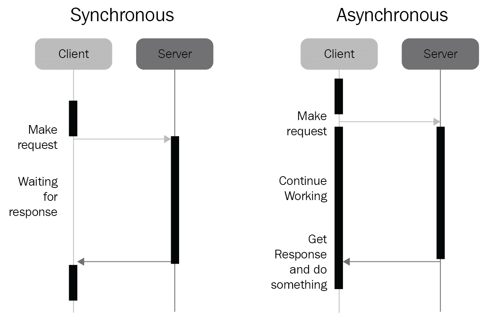

# 九、异步编程简介

在本章中，我们将向读者介绍异步编程的形式化定义。我们将讨论异步处理背后的基本思想，异步编程和我们已经看到的其他编程模型之间的差异，以及异步编程为什么是并发中的一个主要因素。

本章将介绍以下主题：

*   异步编程的概念
*   异步编程与其他编程模型之间的关键区别

# 技术要求

以下是本章的先决条件列表：

*   您的计算机上必须安装 Python 3
*   从[下载 GitHub 存储库 https://github.com/PacktPublishing/Mastering-Concurrency-in-Python](https://github.com/PacktPublishing/Mastering-Concurrency-in-Python)
*   在本章中，我们将处理标题为`Chapter09`的子文件夹，因此请确保它已准备就绪
*   查看以下视频以查看代码的运行：[http://bit.ly/2DF700L](http://bit.ly/2DF700L)

# 简单的类比

异步编程是一种编程模型，它侧重于协调应用中的不同任务。它的目标是确保应用在尽可能短的时间内完成这些任务。从这个角度来看，异步编程就是在适当的时候从一个任务切换到另一个任务，在等待和处理时间之间创建重叠，并从那里缩短完成整个程序所需的总时间。

为了理解异步编程的基本思想，让我们考虑一个快速、真实的类比。想象一个场景，您正在烹饪一顿三道菜的饭，其中包含以下内容：

*   开胃菜需要 2 分钟的准备和 3 分钟的烹饪/等待
*   主菜需要 5 分钟的准备和 10 分钟的烹饪/等待
*   需要 3 分钟准备和 5 分钟烹饪/等待的甜点

现在，考虑到菜的烹饪顺序，你的目标是确定一种制作三道菜的方法，这三道菜花费的时间最少。例如，如果我们按顺序烹饪，我们将首先完成开胃菜，需要 5 分钟，然后进入主菜，需要 15 分钟，最后是甜点，分别需要 8 分钟。总的来说，整顿饭需要 28 分钟才能吃完。

找到更快的方法的关键是将一道菜的烹饪/等待时间与另一道菜的准备时间重叠。因为你在等待已经准备好的食物时不会被占用，所以可以通过为另一道菜准备食物来节省这段时间。例如，可以通过以下步骤实现改进：

*   准备开胃菜：2 分钟。
*   在等待开胃菜烹饪的同时准备主菜：5 分钟。开胃菜将在这一步中完成。
*   在等待主菜烹饪的同时准备和烹饪甜点：8 分钟。在这一步中，甜点将完成，主菜还有 2 分钟的烹饪时间。
*   等待主菜烹饪完成：2 分钟。在此步骤中，主菜将完成烹饪。

通过重叠时间，我们节省了大量烹饪三餐的时间，现在总共只需要 17 分钟，而如果按顺序进行，则需要 28 分钟。然而，显然有不止一种方法来决定我们应该先做哪道菜，然后再做哪道菜。烹饪顺序的另一个变化如下：

*   准备主菜：5 分钟。
*   在等待主菜烹饪的同时准备开胃菜：2 分钟。主菜还有 8 分钟的烹饪时间。
*   在等待开胃菜和主菜烹饪时准备甜点：3 分钟。开胃菜将在这一步完成，主菜还有 5 分钟的烹饪时间。
*   等待主菜和甜点烹饪完成：5 分钟。在这一步中，主菜和甜点都将完成。

这一次，制作整顿饭总共只需要 15 分钟。正如我们所见，烹饪顺序的不同变化可能导致不同的总烹饪时间。异步编程的主要思想是找到程序中执行任务和在任务之间切换的最佳顺序：我们不按顺序执行该程序的所有指令，而是协调这些指令，以便创建重叠的等待和处理时间，最终获得更好的执行时间。

# 异步与其他编程模型

异步编程是并发中的主要概念之一，尤其是在一般编程中。然而，它是一个相当复杂的概念，有时要将它与其他编程模型区分开来，对我们来说可能是相当具有挑战性的。在本节中，我们将比较异步编程与同步编程以及我们已经看到的其他并发编程模型（即线程和多处理）。

# 异步与同步编程

同样，异步编程与同步编程有着本质的不同，因为它具有任务切换的性质。在同步编程中，程序的指令按顺序执行：一个任务必须在程序中的下一个任务开始处理之前完成执行。使用异步编程，如果当前任务需要很长时间才能完成，则可以选择在任务期间指定一个时间，在该时间执行切换到另一个任务。正如我们所观察到的，这样做将导致整个程序执行时间的潜在改进。

异步编程的一个常见示例是 HTTP 请求期间服务器和客户端之间的交互。如果 HTTP 请求是同步的，那么客户端必须在发出请求后等待，直到收到来自服务器的响应。想象一下这样一个场景：每次转到新链接或开始播放视频时，浏览器都会挂起，直到实际数据从服务器返回。这对于 HTTP 通信来说是非常不方便和低效的。

更好的方法是异步通信，在异步通信中，客户机可以自由地继续工作，当来自服务器的请求返回数据时，客户机将收到通知并继续处理该数据。异步编程在 web 开发中非常常见，以至于现在几乎每个网站都使用了一个名为**AJAX**（异步 JavaScript 和 XML 的缩写）的完整编程模型。此外，如果您使用了 JavaScript 中的公共库，如 jQuery 或 Node.js，您可能已经使用过，或者至少听说过术语**回调**，它只是指可以传递给另一个函数以在将来执行的函数。在函数的执行之间来回切换是异步编程的主要思想，我们将在[第 18 章](18.html)中实际分析回调用法的高级示例*从头开始构建服务器*。

下图进一步说明了同步和异步客户机-服务器通信之间的区别：



Differences between synchronous and asynchronous HTTP requests

当然，异步编程并不限于 HTTP 请求。涉及一般网络通信、软件数据处理、与数据库交互等的任务都利用异步编程。与同步编程相反，异步编程通过防止程序在等待数据时挂起来为用户提供响应。因此，它是在处理大量数据的程序中实现的一个很好的工具。

# 异步与线程和多处理

异步编程虽然提供了与线程和多处理类似的好处，但它与这两种编程模型有着本质的区别，尤其是在 Python 编程语言中。

正如我们所知，在多处理中，我们的主程序的多个副本——连同它的指令和变量——是在不同的核之间独立创建和执行的。线程（也称为轻量级进程）在相同的基础上运行：尽管代码不在单独的核心中执行，但在单独的线程中执行的代码的独立部分也不会相互交互。

另一方面，异步编程将程序的所有指令保持在同一线程和进程中。异步编程背后的主要思想是让一个执行器从一个任务切换到另一个任务，如果在处理第二个任务时简单地等待第一个任务更有效（就执行时间而言）。这意味着异步编程将不会利用系统可能拥有的多个核心。

# Python 中的一个示例

虽然我们将深入研究异步编程如何在 Python 中实现，以及我们将使用的主要工具，包括 AutoT0-模块，让我们考虑异步编程如何提高我们的 Python 程序的执行时间。

让我们看一看{ To.t0}文件：

```py
# Chapter09/example1.py

from math import sqrt

def is_prime(x):
    print('Processing %i...' % x)

    if x < 2:
        print('%i is not a prime number.' % x)

    elif x == 2:
        print('%i is a prime number.' % x)

    elif x % 2 == 0:
        print('%i is not a prime number.' % x)

    else:
        limit = int(sqrt(x)) + 1
        for i in range(3, limit, 2):
            if x % i == 0:
                print('%i is not a prime number.' % x)
                return

        print('%i is a prime number.' % x)

if __name__ == '__main__':

    is_prime(9637529763296797)
    is_prime(427920331)
    is_prime(157)
```

这里，我们有我们熟悉的素数检查`is_prime()`函数，它接受一个整数并打印出一条消息，指示输入是否为素数。在我们的主程序中，我们用三个不同的号码调用`is_prime()`。我们也在跟踪程序处理这三个数字所需的时间。

执行脚本后，输出应类似于以下内容：

```py
> python example1.py
Processing 9637529763296797...
9637529763296797 is a prime number.
Processing 427920331...
427920331 is a prime number.
Processing 157...
157 is a prime number.
```

您可能已经注意到程序处理第一次输入花费了相当长的时间。由于`is_prime()`函数的实现方式，如果质数的输入较大，则需要`is_prime()`更长的时间来处理。因此，由于我们有一个较大的素数作为第一个输入，因此我们的 Python 程序将在打印输出之前挂起一段相当长的时间。这通常会给我们的程序带来无响应的感觉，这在软件工程和 web 开发中都是不可取的。

为了提高程序的响应性，我们将利用已在`Chapter09/example2.py`文件中实现的`asyncio`模块：

```py
# Chapter09/example2.py

from math import sqrt

import asyncio

async def is_prime(x):
    print('Processing %i...' % x)

    if x < 2:
        print('%i is not a prime number.' % x)

    elif x == 2:
        print('%i is a prime number.' % x)

    elif x % 2 == 0:
        print('%i is not a prime number.' % x)

    else:
        limit = int(sqrt(x)) + 1
        for i in range(3, limit, 2):
            if x % i == 0:
                print('%i is not a prime number.' % x)
                return
            elif i % 100000 == 1:
                #print('Here!')
                await asyncio.sleep(0)

        print('%i is a prime number.' % x)

async def main():

    task1 = loop.create_task(is_prime(9637529763296797))
    task2 = loop.create_task(is_prime(427920331))
    task3 = loop.create_task(is_prime(157))

    await asyncio.wait([task1, task2, task3])

if __name__ == '__main__':
    try:
        loop = asyncio.get_event_loop()
        loop.run_until_complete(main())
    except Exception as e:
        print('There was a problem:')
        print(str(e))
    finally:
        loop.close()
```

我们将在下一章详细介绍这段代码。现在，只需运行脚本，您就会看到打印输出的响应性有所提高：

```py
> python example2.py
Processing 9637529763296797...
Processing 427920331...
427920331 is a prime number.
Processing 157...
157 is a prime number.
9637529763296797 is a prime number.
```

具体来说，当`9637529763296797`（我们最大的输入）正在处理时，程序决定切换到下一个输入。因此，`427920331`和`157`的结果在它之前返回，从而提高了程序的响应性。

# 总结

异步编程是一种基于通过任务切换进行任务协调的编程模型。它不同于传统的顺序（或同步）编程，因为它会在处理时间和等待时间之间产生重叠，从而可能提高速度。异步编程也不同于线程和多处理，因为它只发生在单个进程中的单个线程中。

异步编程主要用于提高程序的响应能力。当一个大的输入需要花费大量的时间来处理时，程序的顺序版本将出现挂起，而异步程序将转移到其他不太繁重的任务。这允许小的输入首先完成执行，并帮助程序更具响应性。

在下一章中，我们将学习异步程序的主要结构，并更详细地研究`asyncio`模块及其功能。

# 问题

*   异步编程背后的思想是什么？
*   异步编程与同步编程有何不同？
*   异步编程与线程和多处理有何不同？

# 进一步阅读

有关更多信息，请参阅以下链接：

*   *Python 并行编程*，作者：Jan Palach，Packt Publishing Ltd.2014
*   *Python 并行编程食谱*，作者：Giancarlo Zaccone，Packt 出版有限公司，2015 年
*   *拉比 MQ 食谱*，由 Sigismondo Boschi 和 Gabriele Santomaggio 编写，Packt 出版有限公司，2013 年