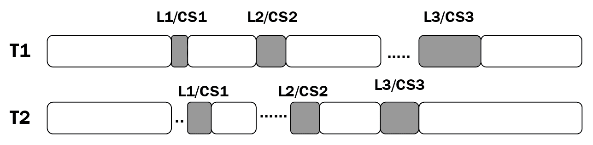

# 比赛条件

在本章中，我们将讨论竞态条件的概念及其在并发上下文中的潜在原因。关键部分的定义，这是一个与竞争条件和并发编程高度相关的概念，也将被涵盖。我们将使用 Python 中的一些示例代码来模拟竞争条件以及通常用于解决这些问题的解决方案。最后，将讨论通常处理竞争条件的实际应用程序。

本章将介绍以下主题：

*   竞争条件的基本概念，以及它在并发应用程序中的发生方式，以及关键部分的定义
*   Python 中竞赛条件的模拟以及如何实现竞赛条件解决方案
*   现实生活中的计算机科学概念，通常与种族条件相互作用并起作用

# 技术要求

以下是本章所需的先决条件列表：

*   确保计算机上安装了 Python 3
*   在[下载 GitHub 存储库 https://github.com/PacktPublishing/Mastering-Concurrency-in-Python](https://github.com/PacktPublishing/Mastering-Concurrency-in-Python)
*   在本章中，我们将使用名为`Chapter14`的子文件夹
*   查看以下视频以查看代码的运行：[http://bit.ly/2AdYWRj](http://bit.ly/2AdYWRj)

# 种族条件的概念

竞争条件通常被定义为一种现象，在此期间，系统的输出是不确定的，并且取决于调度算法和任务的调度和执行顺序。在这个过程中，当数据被错误处理和损坏时，竞争条件就成为系统中的一个 bug。鉴于这个问题的性质，在强调调度和协调独立任务的并发系统中，竞争条件是很常见的。

竞争条件可以发生在电子硬件系统和软件应用程序中；在本章中，我们将只讨论软件开发环境中的竞争条件，特别是并发软件应用程序。本节将涵盖种族条件的理论基础及其根本原因，以及关键部分的概念。

# 临界截面

关键部分表示由并发应用程序中的多个进程或线程访问的共享资源，这可能导致意外甚至错误的行为。我们已经看到，有多种方法可以保护这些资源中包含的数据的完整性，我们将这些受保护的部分称为**关键部分**。

正如您可以想象的那样，当这些关键部分中的数据同时或并行地进行交互和更改时，可能会发生错误处理或损坏。当与之交互的线程和进程协调性和调度性较差时，尤其如此。因此，合乎逻辑的结论是不允许多个代理同时进入一个关键部分。我们称这个概念为**互斥**。

在下一小节中，我们将讨论临界截面和竞争条件的原因之间的关系。

# 种族条件是如何发生的

让我们考虑一个简单的并发程序，以便了解什么可以引起竞争条件。假设程序有一个共享资源和两个单独的线程（线程 1 和线程 2），它们将访问该资源并与之交互。具体地说，共享资源是一个数字，每个线程根据各自的执行指令读入该数字，将其递增 1，最后用递增的数字更新共享资源的值。

假设共享的号码原来是 2，那么线程 1 访问该号码并与之交互；然后，共享资源变为 3。在线程 1 成功更改并退出资源后，线程 2 开始执行其指令，并且作为数字的共享资源更新为 4。在整个过程中，数字最初为 2，增加两次（每次由单独的线程执行），最后保持值 4。在本例中，共享号码未被错误处理和损坏。

那么想象一下，在一个场景中，共享的数字在开始时仍然是 2，但两个线程同时访问该数字。现在，每个线程从共享资源中读入数字 2，分别将数字 2 增加到 3，然后将数字 3 写回共享资源。尽管共享资源被一个线程访问和交互了两次，但在进程结束时它只保留了值 3。

这是并发程序中出现竞态条件的一个示例：由于访问共享资源的第二个线程在第一个线程完成其执行（换句话说，将新值写入共享资源）之前执行了竞态条件，因此第二个线程无法接收更新的资源值。这导致这样一个事实：当第二个线程写入资源时，第一个线程处理和更新的值被覆盖。在两个线程的执行结束时，共享资源在技术上仅由第二个线程更新。

下图进一步说明了正确的数据处理过程与竞争情况之间的对比：


Mishandling shared data

直观地说，我们可以看到竞争条件会导致数据的错误处理和损坏。在前面的示例中，我们可以看到只有两个单独的线程访问一个公共资源时会出现争用情况，从而导致共享资源被错误地更新，并在程序结束时保留错误的值。我们知道，大多数现实生活中的并发应用程序包含更多的线程和进程以及更多的共享资源，与共享资源交互的线程/进程越多，出现争用情况的可能性就越大。

# 在 Python 中模拟竞争条件

在讨论一个可以解决种族条件问题的解决方案之前，让我们试着在 Python 中模拟这个问题。如果你已经从 GITHUB 页面下载了这本书的代码，请继续导航到胡特尔 T.E.文件夹。详情如下:

```py
# Chapter14/example1.py

import random
import time

def update():
    global counter

    current_counter = counter # reading in shared resource
    time.sleep(random.randint(0, 1)) # simulating heavy calculations
    counter = current_counter + 1 # updating shared resource
```

前面的`update()`函数的目标是增加一个名为`counter`的全局变量，它将由脚本中的一个单独线程调用。在函数内部，我们正在与一个共享资源交互（在本例中为`counter`）。然后，我们将`counter`的值分配给另一个局部变量，称为`current_counter`（这是为了模拟从更复杂的数据结构中读取共享资源数据的过程）。

接下来，我们将使用`time.sleep()`方法暂停函数的执行。程序将暂停的时间长度是由函数调用`random.randint(0, 1)`生成的`0`和`1`之间的伪随机选择，因此程序将暂停 1 秒或根本不暂停。最后，我们将新计算的值`current_counter`（它的一个增量）分配给原始共享资源（变量`counter`。

现在，我们可以继续我们的主要计划：

```py
# Chapter14/example1.py

import threading

counter = 0

threads = [threading.Thread(target=update) for i in range(20)]

for thread in threads:
    thread.start()
for thread in threads:
    thread.join()

print(f'Final counter: {counter}.')
print('Finished.')
```

在这里，我们用一组`threading.Thread`对象初始化`counter`全局变量，以便同时执行`update()`函数；我们正在初始化二十个线程对象，以将共享计数器增加二十倍。启动并连接所有线程后，我们最终可以打印出共享的`counter`变量的结束值。

理论上，一个设计良好的并发程序将成功地将共享计数器总共递增 20 倍，并且由于其原始值为`0`，因此计数器的结束值应为程序结束时的`20`。但是，当您运行此脚本时，您获得的`counter`变量很可能不包含`20`的结束值。以下是我自己的输出，通过运行脚本获得：

```py
> python3 example1.py
Final counter: 9.
Finished.
```

此输出表示计数器仅成功递增九次。这是并发程序所具有的竞争条件的直接结果。当一个特定线程花费时间读入并处理来自共享资源的数据时（具体来说，使用`time.sleep()`方法一秒钟），另一个线程读入`counter`变量的当前值，此时第一个线程尚未更新该变量，就会出现这种争用情况，因为它还没有完成它的执行。

有趣的是，如果一个线程没有花费任何时间处理数据（换句话说，当伪随机`random.randint()`方法选择`0`时），那么共享资源的值可能会及时更新，以便下一个线程读取和处理它。计数器的结束值在程序的不同运行中不同，这一事实说明了这种现象。例如，下面是我在运行脚本三次后获得的输出。第一次运行的输出如下所示：

```py
> python3 example1.py
Final counter: 9.
Finished.
```

第二次运行的输出如下所示：

```py
> python3 example1.py
Final counter: 12.
Finished.
```

第三次运行的输出如下所示：

```py
> python3 example1.py
Final counter: 5.
Finished.
```

同样，计数器的最终值取决于花一秒钟暂停的线程数和根本不暂停的线程数。由于这两个数字依次取决于`random.randint()`方法，因此计数器的最终值在程序的不同运行之间会发生变化。我们的程序中仍然会有一个竞争条件，除非我们能够确保计数器的最终值始终为`20`（计数器总共成功递增 20 倍）。

# 锁作为竞争条件的解决方案

在本节中，我们将讨论竞争条件最常见的解决方案：锁。直观地说，由于我们观察到的竞态条件是在多个线程或进程同时访问和写入共享资源时出现的，因此解决竞态条件的关键思想是隔离不同线程/进程的执行，特别是在与共享资源交互时。具体来说，我们需要确保一个线程/进程只能在与该资源交互的任何其他线程/进程完成与该资源的交互后才能访问该共享资源。

# 锁的有效性

使用锁，我们可以将并发程序中的共享资源转换为关键部分，从而保证数据的完整性。关键部分保证共享资源的互斥性，并且不能由多个进程或线程同时访问；这将防止任何受保护的数据因竞争条件而被更新或更改为冲突信息。

在下图中，**线程 B**由于**线程 a**已经在访问资源，所以被互斥锁阻止访问名为`var`的关键部分共享资源：


Locks prevent simultaneous access to a critical section

现在，我们将指定，为了访问并发程序中的关键部分，线程或进程需要获取与该关键部分相关联的锁对象；类似地，该线程或进程也需要在离开关键部分时释放该锁。此设置将有效防止对关键部分的多次访问，因此将防止竞争条件。下图说明了多个线程与多个关键部分交互的执行流程，并实现了锁定：



Locks and critical sections in multiple threads

如图所示，线程**T1**和**T2**在各自的执行指令中都与三个关键部分交互：**CS1**、**CS2**和**CS3**。在这里，**T1**和**T2**几乎同时尝试访问**CS1**，并且，由于**CS1**受到锁**L1**的保护，只有**T1**能够获取锁**L1**，因此，访问/与关键部分交互，而**T2**必须花时间等待**T1**退出临界段，并在进入该段之前释放锁。类似地，对于临界段，**CS2**和**CS3**虽然两个线程都需要同时访问临界段，但只有一个线程可以处理该临界段，而另一个线程必须等待获取与该临界段相关联的锁。

# Python 实现

现在，让我们实现前面示例中的规范，以解决竞争条件问题。导航到 AUT0T0 文件，并考虑我们的修正后的 Tyt1Ty 函数，如下：

```py
# Chapter14/example2.py

import random
import time

def update():
    global counter

    with count_lock:
        current_counter = counter # reading in shared resource
        time.sleep(random.randint(0, 1)) # simulating heavy calculations
        counter = current_counter + 1
```

您可以看到，`update()`函数中指定的线程的所有执行指令都在名为`count_lock`的锁对象的上下文管理器下。因此，每次调用线程来运行函数时，它必须首先获取锁对象，然后才能执行任何指令。在主程序中，我们只需在已有对象的基础上创建 lock 对象，如下所示：

```py
# Chapter14/example2.py

import threading

counter = 0
count_lock = threading.Lock()

threads = [threading.Thread(target=update) for i in range(20)]

for thread in threads:
    thread.start()
for thread in threads:
    thread.join()

print(f'Final counter: {counter}.')
print('Finished.')
```

运行该程序，您的输出应类似于以下内容：

```py
> python3 example2.py
Final counter: 20.
Finished.
```

您可以看到计数器已成功递增 20 倍，并在程序结束时保持正确的值。此外，无论脚本执行多少次，计数器的最终值始终为**20**。这是使用锁在并发程序中实现关键部分的优势。

# 锁的缺点

在[第 12 章](12.html)、*死锁*中，我们讨论了一个有趣的现象，在这种现象中，使用锁可能会导致不期望的结果。具体地说，我们发现，在一个并发程序中实现足够多的锁后，整个程序可以成为连续的。让我们用当前的程序来分析这个概念。考虑 AUT0T0 文件，如下：

```py
# ch14/example3.py

import threading
import random; random.seed(0)
import time

def update(pause_period):
    global counter

    with count_lock:
        current_counter = counter # reading in shared resource
        time.sleep(pause_period) # simulating heavy calculations
        counter = current_counter + 1 # updating shared resource

pause_periods = [random.randint(0, 1) for i in range(20)]

###########################################################################

counter = 0
count_lock = threading.Lock()

start = time.perf_counter()
for i in range(20):
    update(pause_periods[i])

print('--Sequential version--')
print(f'Final counter: {counter}.')
print(f'Took {time.perf_counter() - start : .2f} seconds.')

###########################################################################

counter = 0

threads = [threading.Thread(target=update, args=(pause_periods[i],)) for i in range(20)]

start = time.perf_counter()
for thread in threads:
    thread.start()
for thread in threads:
    thread.join()

print('--Concurrent version--')
print(f'Final counter: {counter}.')
print(f'Took {time.perf_counter() - start : .2f} seconds.')

###########################################################################

print('Finished.')
```

# 按顺序打开并发程序

此脚本的目标是比较当前并发程序与其顺序版本的速度。在这里，我们仍然使用相同的`update()`函数，带有锁，并且我们正在连续和并发地运行它二十次，就像我们之前所做的那样。我们还创建了一个确定的暂停周期列表，以便这些周期在模拟顺序版本和模拟并发版本之间保持一致（因此，`update()`函数现在接受一个参数，该参数指定每次调用时的暂停周期）：

```py
pause_periods = [random.randint(0, 1) for i in range(20)]
```

在程序的下一步中，我们只需在`for`循环中调用`update()`函数，进行二十次迭代，跟踪循环完成所需的时间。注意，即使这是为了模拟程序的顺序版本，`update()`函数仍然需要先创建锁对象，因此我们在这里初始化它：

```py
counter = 0
count_lock = threading.Lock()

start = time.perf_counter()
for i in range(20):
    update(pause_periods[i])

print('--Sequential version--')
print(f'Final counter: {counter}.')
print(f'Took {time.perf_counter() - start : .2f} seconds.')
```

最后一步是重置计数器并运行我们已经实现的程序的并发版本。同样，在初始化运行`update()`函数的每个线程时，我们需要传递相应的暂停时间。我们还将跟踪此并发版本的程序运行所需的时间：

```py
counter = 0

threads = [threading.Thread(target=update, args=(pause_periods[i],)) for i in range(20)]

start = time.perf_counter()
for thread in threads:
    thread.start()
for thread in threads:
    thread.join()

print('--Concurrent version--')
print(f'Final counter: {counter}.')
print(f'Took {time.perf_counter() - start : .2f} seconds.')
```

现在，在运行脚本之后，您将观察到程序的顺序版本和并发版本的运行时间相同。具体来说，以下是我获得的输出；在这种情况下，他们都花了大约 12 秒。您的程序所用的实际时间可能不同，但两个版本的速度应仍然相同：

```py
> python3 example3.py
--Sequential version--
Final counter: 20.
Took 12.03 seconds.
--Concurrent version--
Final counter: 20.
Took 12.03 seconds.
Finished.
```

因此，我们的并发程序所花费的时间与其顺序版本一样多，这否定了在程序中实现并发的最大目的之一：提高速度。但是，为什么具有相同指令集和元素的并发和传统顺序应用程序也具有相同的速度？并发程序应该总是比顺序程序产生更快的速度吗？

回想一下，在我们的程序中，关键部分受到锁对象的保护，没有多个线程可以同时访问它。由于程序的所有执行（计数器递增 20 倍）都取决于访问临界段的线程，因此在临界段上放置锁对象意味着在给定时间只能执行一个线程。有了这个规范，任何两个线程的执行都不能相互重叠，并且不能从这个并发实现中获得额外的速度。

这就是我们在分析死锁问题时遇到的现象：如果在并发程序中放置了足够多的锁，那么该程序将完全按顺序运行。这就是为什么锁有时是并发编程中问题的不受欢迎的解决方案的原因。然而，只有当并发程序的所有执行都依赖于与关键部分的交互时，这种情况才会发生。大多数情况下，读取和操作共享资源的数据只是整个程序的一部分，因此，并发性仍然为我们的程序提供了预期的额外速度。

# 锁不能锁任何东西

锁的另一个方面是，它们实际上并不锁定任何东西。对于特定的共享资源，利用锁对象的唯一方法是让与该资源交互的线程和进程也与锁交互。换句话说，如果这些线程和进程选择在访问和更改共享资源之前不使用锁进行检查，则锁对象本身无法阻止它们这样做。

在我们的示例中，您已经看到，为了实现锁对象的获取/释放过程，线程或进程的指令将由锁上下文管理器包装；此规范取决于线程/进程执行逻辑的实现，而不是资源。这是因为我们看到的锁对象没有以任何方式连接到它们应该保护的资源。因此，如果线程/进程执行逻辑不需要与与共享资源相关联的锁对象进行任何交互，则该线程或进程可以轻松地访问资源，这可能会导致数据的错误操作和损坏。

这不仅适用于在单个并发程序中具有多个线程和进程的情况。假设我们有一个由多个组件组成的并发系统，所有组件都交互和操作系统中共享的资源的数据，并且该资源与锁对象关联；因此，如果这些组件中的任何一个无法与该锁交互，它可以简单地绕过锁实现的保护并访问共享资源。更重要的是，锁的这一特性还涉及到并发程序的安全性。如果外部恶意代理连接到系统（例如，与服务器交互的恶意客户端）并打算破坏整个系统共享的数据，则可以指示该代理忽略锁对象并以侵入方式访问该数据。

锁不锁任何东西的观点是由 raymondhettinger 推广的，他是 Python 核心开发人员，致力于 Python 并发编程中各种元素的实现。有人认为，仅使用锁对象并不能保证并发数据结构和系统的安全实现。锁需要具体地链接到它们要保护的资源，并且在没有首先获取与资源相关联的锁的情况下，任何东西都不能访问资源。或者，其他并发同步工具（如原子消息队列）可以提供此问题的解决方案。

# 现实生活中的种族状况

您现在已经了解了竞争条件的概念，它们是如何在并发系统中产生的，以及如何有效地防止它们。在本节中，我们将在计算机科学的各个子领域中提供一个关于种族条件如何在现实生活中发生的总体视图。具体来说，我们将讨论安全性、文件管理和网络等主题。

# 安全

并发编程对于所讨论的系统的安全性具有重要意义。回想一下，读取和更改资源数据的过程之间会出现竞争条件；认证系统中的竞争条件会导致在**检查时间**（当检查代理的凭据时）和**使用时间**（当代理可以使用资源时）之间的数据损坏。这个问题也被称为**检查时间到**（**TOCTTOU**错误），这无疑对安全系统有害。

正如我们在上一节中简要提到的那样，在处理竞争条件时对共享资源的粗心保护可以为外部代理提供对那些假定受保护资源的访问。然后，这些代理可以更改资源的数据以创建**权限提升**（简单地说，就是让自己对更多共享资源进行更多非法访问），或者他们可以简单地破坏数据，导致整个系统故障。

有趣的是，竞争条件也可以用来实现计算机安全。由于竞态条件是由多个线程/进程对共享资源的不协调访问造成的，因此出现竞态条件的规范明显是随机的。例如，在我们自己的 Python 示例中，您看到，当模拟竞争条件时，计数器的最终值在程序的不同执行之间变化；这（部分）是因为情况的不可预测性，在这种情况下，多个线程正在运行并访问共享资源。（我说部分原因是，由于随机性也是由我们在每次执行程序时产生的随机暂停期造成的。）因此，有时会故意挑起竞争条件，而在竞争条件发生时获得的信息可用于生成数字指纹，以安全处理此信息，是非常随机的，因此在安全方面很有价值。

# 操作系统

当两个单独的程序试图访问同一资源（如内存空间）时，在操作系统中的文件和内存管理上下文中可能会出现争用情况。想象一下这样一种情况：来自不同程序的两个进程已经运行了相当长的时间，尽管它们最初在内存空间方面彼此分开初始化，但已经积累了足够的数据，并且一个进程的执行堆栈现在与另一个进程的执行堆栈发生冲突。这可能导致两个进程共享同一部分内存空间，并最终导致不可预测的后果。

竞态条件复杂性的另一个方面是 Unix 7 版操作系统，具体在`mkdir`命令中说明的。通常，`mkdir`命令用于在 Unix 操作系统中创建新目录；这是通过调用`mknod`命令创建实际目录和`chown`命令指定该目录的所有者来完成的。因为有两个单独的命令要运行，并且在第一个命令完成和调用第二个命令之间存在一定的间隙，这可能会导致竞争条件。

在两个命令之间的间隔期间，如果有人可以删除由`mknod`命令创建的新目录并将引用链接到另一个文件，则当`chown`命令运行时，该文件的所有权将发生变化。通过利用此漏洞，理论上有人可以更改操作系统中任何文件的所有权，以便有人可以创建新目录。下图进一步说明了这种利用：


Diagram of mkdir race condition

# 网络

在网络中，竞争条件可以采取在网络中给予多个用户唯一特权的形式。具体来说，假设一个给定的服务器应该只有一个具有管理员权限的用户。如果两个都有资格成为服务器管理员的用户同时请求访问这些权限，则他们都有可能获得该访问权限。这是因为，在服务器接收到两个用户请求时，两个用户都没有被授予管理员权限，服务器认为管理员权限仍然可以被授予。

当网络高度优化以进行并行处理（例如，非阻塞套接字）时，这种形式的竞争条件非常常见，而没有仔细考虑网络上共享的资源。

# 总结

竞态条件定义为一种现象，在此期间，系统的输出是不确定的，取决于调度算法以及任务调度和执行的顺序。关键部分表示并发应用程序中多个进程或线程访问的共享资源，这可能导致意外甚至错误的行为。当两个或多个线程/进程同时访问和更改共享资源时，会发生争用情况，从而导致数据处理错误和损坏。竞争条件在现实应用程序中也有重要影响，如安全性、操作系统和网络。

由于我们观察到的竞态条件是在多个线程或进程同时访问和写入共享资源时出现的，因此解决竞态条件的关键思想是隔离不同线程/进程的执行，特别是在与共享资源交互时。使用锁，我们可以将并发程序中的共享资源转化为关键部分，从而保证数据的完整性。然而，使用锁有许多缺点：在一个并发程序中实现足够多的锁，整个程序可能会变得有序；锁不会锁任何东西。

在下一章中，我们将考虑 Python 并发编程中的最大问题之一：臭名昭著的 To.T0.全局解释器锁（吉尔）ALE T1。您将了解 GIL 背后的基本思想、目的以及如何在并发 Python 应用程序中有效地使用它。

# 问题

*   什么是关键部分？
*   什么是竞争条件？为什么它在并发程序中是不受欢迎的？
*   种族状况的根本原因是什么？
*   锁如何解决竞争条件的问题？
*   为什么并发程序中有时不需要锁？
*   竞赛条件在现实系统和应用中的意义是什么？

# 进一步阅读

有关更多信息，请参阅以下链接：

*   *Python 并行编程*，作者：Jan Palach，Packt Publishing Ltd.2014
*   *Python 并行编程食谱*，作者：Giancarlo Zaccone，Packt 出版有限公司，2015 年
*   *竞赛条件和关键部分*（[tutorials.jenkov.com/java-concurrency/Race-Conditions-and-Critical-Sections](http://tutorials.jenkov.com/java-concurrency/race-conditions-and-critical-sections.html)），作者：Jakob jenkov
*   *竞赛条件、文件和安全缺陷；或 Matt Bishop 的《龟兔赛跑》*，技术报告 CSE-95-98（1995 年）
*   *计算机和信息安全，第 11 章，软件缺陷和恶意软件 1 说明*（[slideplayer.com/slide/10319860/](https://slideplayer.com/slide/10319860/)）