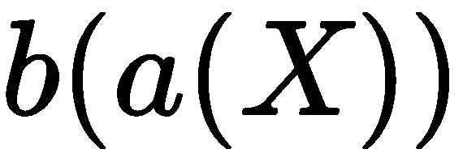
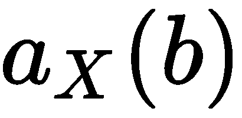

# __init__（）方法

`__init__()`方法是 Python 类定义的一个重要特性，原因有二。首先，初始化是对象生命中的第一大步；每个对象都必须正确初始化其状态。第二个原因是`__init__()`的参数值可以有多种形式。

因为有很多方法可以为`__init__()`提供参数值，所以有大量的对象创建用例。我们来看看其中的几个。我们希望最大限度地提高清晰度，因此我们需要定义一个初始化，以表征问题域，并明确设置对象的状态。

然而，在使用`__init__()`方法之前，我们需要先看看 Python 中的隐式类层次结构，简单地看一下名为`object`的类。这将为比较其默认行为与我们希望从自己的类中获得的不同类型的行为奠定基础。

在本章中，我们将研究简单对象（例如，扑克牌）的不同初始化形式。在这之后，我们将看一看更复杂的对象，例如涉及集合的手，以及涉及策略和状态的玩家。在这些示例中，我们将包括类型提示，并解释`mypy`将如何检查此代码以确定对象的正确使用。

在本章中，我们将介绍以下主题：

*   所有 Python 对象都是一个公共父类`object`类的子类，因此我们将首先研究这个。
*   我们来看看`object`类的默认`__init__()`方法是如何工作的。
*   我们将研究的第一个设计策略是对层次结构的所有子类使用通用的`__init__()`方法。这可能导致使用工厂函数，与`__init__()`方法分离，以帮助正确初始化对象。
*   第二种设计策略涉及将`__init__()`方法推进到复杂层次结构的每个单独子类中，以及这如何改变类的设计。
*   我们将了解如何创建复合对象，这涉及到不同类的`__init__()`方法的大量相关使用。
*   我们还将研究无状态对象，它们不需要复杂的`__init__()`方法。
*   本章最后将介绍类级（或静态）初始化的几种更复杂的用法，以及如何在创建无效对象之前验证值。

在第一节中，我们将研究 Python 所有对象的超类，`object`类。

# 技术要求

本章的代码文件可在[中找到 https://git.io/fj2U0](https://git.io/fj2U0) 。

# 隐式超类–对象

每个 Python 类定义都有一个隐式超类：`object`。这是一个非常简单的类定义，几乎不起任何作用。

我们可以创建`object`的实例，但我们不能对它们做太多，因为许多特殊方法只是引发异常。

当我们定义自己的类时，`object`是超类。下面是一个示例类定义，它只是用一个新名称扩展了`object`：

```py
>>> class X: 
>>>     pass 
```

下面是与这个小类定义的一些交互：

```py
>>> X.__class__ 
<class 'type'> 
>>> X.__class__.__base__ 
<class 'object'> 
```

我们可以看到一个类是名为`type`的类的对象，而我们新类的基类是名为`object`的类。在查看每个方法时，我们还将查看从`object`继承的默认行为。在某些情况下，超类特殊方法的行为正是我们想要的。在其他情况下，我们需要重写特殊方法的行为。

# 基类对象\uuuu init\uuuu（）方法

对象生命周期的基础是其创建、初始化和销毁。我们将把创建和销毁推迟到后面关于更高级的特殊方法的一章，并重点讨论初始化。这将设置对象的初始状态。

所有类的超类`object`都有一个默认实现`__init__()`，相当于`pass`。我们不需要实施`__init__()`。如果我们不实现它，那么在创建对象时就不会创建任何实例变量。在某些情况下，这种默认行为是可以接受的。

我们可以向属于`object`子类的对象添加属性。考虑下面的类，它需要两个实例变量，但不初始化它们：

```py
class Rectangle: 
    def area(self) -> float: 
        return self.length * self.width 
```

`Rectangle`类有一个使用两个属性返回值的方法。属性尚未在类定义中的任何位置初始化。虽然这是合法的 Python，但避免专门设置属性有点奇怪。以下是与`Rectangle`类的交互：

```py
>>> r = Rectangle() 
>>> r.length, r.width = 13, 8 
>>> r.area()
104 
```

虽然这是合法的，但它可能会引起深层次的混乱，这是避免这种情况的一个很好的理由。在上面所示的示例中，在类主体之外设置 ad-hoc 属性值会失败`mypy`的类型提示检查，这是避免它的另一个原因。

这种设计提供了一些灵活性，因此有时我们不需要在`__init__()`方法中设置所有属性。我们在这里走得很好。可选属性意味着一种未正式声明为适当子类的子类。

我们正在以一种可能导致混乱和不恰当地使用复杂的`if`语句的方式创建多态性。虽然未初始化的属性可能有用，但它们可能是糟糕设计的征兆。

蒂姆·彼得斯（Tim Peters）的《Python 之禅》*，可通过`import this`从标准库获得，提供以下建议：*

*"Explicit is better than implicit."

多年来，这句话被证明是有帮助的，有助于保持 Python 程序的简单性和一致性。这是第 20 号**Python 增强方案**（**PEP**。参见[https://www.python.org/dev/peps/pep-0020/](https://www.python.org/dev/peps/pep-0020/) 了解更多信息。

`__init__()`方法应该使实例变量显式。

Pretty poor polymorphism
There's a fine line between flexibility and foolishness. We may have stepped over the edge of *flexible* into *foolish* as soon as we feel the need to write the following:

`if 'x' in self.__dict__:`
`    code-to-handle-optional-attribute`

Or, we could see the following:

`try:`
`    self.x`
`except AttributeError:`
`    code-to-handle-optional-attribute`

It's time to reconsider the API and add a common method or attribute. Refactoring is better than adding `if` statements.

# 在超类中实现

我们通过实现`__init__()`方法初始化一个对象。创建对象时，Python 首先创建一个空对象，然后调用`__init__()`方法来设置新对象的状态。此方法通常创建对象的实例变量并执行任何其他一次性处理。

以下是`Card`类层次结构的一些示例定义。我们将定义一个`Card`超类和三个子类，它们是`Card`基本主题的变体。我们有两个直接从参数值设置的实例变量和两个使用初始化方法计算的变量：

```py
    from typing import Tuple

class     Card:

        def         __init__    (    self    , rank:     str    , suit:     str    ) ->     None    :
            self    .suit = suit
            self    .rank = rank
            self    .hard,     self    .soft =     self    ._points()

        def     _points(    self    ) -> Tuple[    int    ,     int    ]:
            return         int    (    self    .rank),     int    (    self    .rank)

    class     AceCard(Card):

        def     _points(    self    ) -> Tuple[int, int]:
            return         1    ,     11

        class     FaceCard(Card):

        def     _points(    self    ) -> Tuple[int, int]:
            return         10    ,     10

```

在本例中，我们将`__init__()`方法分解为超类，以便超类`Card`中的一个常见初始化应用于两个子类`AceCard`和`FaceCard`。

本例为`__init__()`方法的参数提供类型提示。`rank`和`suit`参数均应具有`str`类型的值。`__init__()`方法的结果始终为`None`，因为它从不返回值。这些提示可以通过`mypy`工具进行检查，以确保正确使用该类。

这显示了一种常见的多态设计。每个子类都提供了`_points()`方法的唯一实现。各种`_points()`方法都返回一个两元组，使用不同的方法来评估一张卡。所有子类都有相同的签名——它们有相同的方法和属性。这三个子类的对象可以在应用程序中互换使用。

名称中的前导`_`是对阅读该类的人的建议，`_points()`方法是一个实现细节，可能会在将来的实现中发生更改。这有助于揭示哪些方法是公共接口的一部分，哪些是其他类不打算通用的细节。

如果我们只是使用字符作为套装，我们将能够创建`Card`实例，如下面的代码片段所示：

```py
    cards = [AceCard('A', '♠'), Card('2','♠'), FaceCard('J','♠'),]    
```

我们列举了几张牌的等级、等级和花色。从长远来看，我们需要一个更智能的工厂函数来构建`Card`实例；以这种方式枚举所有 52 张卡既繁琐又容易出错。在讨论工厂功能之前，我们将了解一些其他问题。

# 创建枚举常量

我们可以为卡片套装定义类。扑克牌套装是一种类型的例子，其域可以穷尽枚举。其他一些具有非常小的值域的类型包括只有一个值的`None`类型和只有两个值的`bool`类型。

一副扑克牌可以被看作是一个不可变的对象：状态不应该改变。我们将在[第 4 章](04.html)、*属性访问、属性和描述符*中介绍确保不变性的技术。虽然西装的属性不变可能是有道理的，但额外的努力并没有实际的好处。

以下是我们将用于构建四个清单常量的类：

```py
    from     enum     import     Enum

    class     Suit(    str    , Enum):
    Club =     "♣"
                Diamond =     "♦"
                Heart =     "♥"
                Spade =     "♠"

```

这个类有两个父类。`Suit`类的四个值中的每一个都是字符串和`Enum`实例。每个字符串值仅为单个 Unicode 字符。枚举值必须由类名限定，以确保不会与其他对象发生冲突。

下面是此类生成的枚举常量之一：

```py
>>> Suit.Club
<Suit.Club: '♣'>
```

`Enum`实例的表示形式显示`Enum`类中的名称，以及其他父类指定的值。要仅查看该值，请使用诸如`Suit.Heart.value`之类的表达式。

我们现在可以创建`cards`，如下代码片段所示：

```py
cards = [AceCard('A', Suit.Spade), Card('2', Suit.Spade), FaceCard('Q', Suit.Spade),]
```

举个这么小的例子，这个类并不是对单字符套装代码的巨大改进。对值域进行显式枚举非常方便。像`list(Suit)`这样的表达式将提供所有可用对象。

我们必须承认这些对象在技术上并不是一成不变的。可以为`Suit`对象指定其他属性。虽然可以添加其他属性，但不能更改`value`属性。以下示例显示了引发的异常：

```py
>>> Suit.Heart.value = 'H'
Traceback (most recent call last):
 File "<doctest __main__.__test__.test_suit_value[1]>", line 1, in <module>
 Suit.Heart.value = 'H'
 File "/Users/slott/miniconda3/envs/py37/lib/python3.7/types.py", line 175, in __set__
 raise AttributeError("can't set attribute")
AttributeError: can't set attribute
```

The irrelevance of immutability
Immutability can become an attractive nuisance. It's sometimes justified by a mythical *malicious programmer* who modifies the constant value in their application. As a design consideration, this is often silly. A mythical malicious programmer can't be stopped by creating immutable objects. A malicious programmer would have access to the Python source and be able to tweak it just as easily as they could write poorly-crafted code to modify a constant.

在[第 4 章](04.html)、*属性访问、属性和描述符*中，我们将向您展示一些方法，为试图变异不可变对象的有缺陷程序提供合适的诊断信息。

# 通过工厂函数利用

我们可以通过工厂功能构建一套完整的卡片。这胜过列举所有 52 张牌。在 Python 中，有两种常见的工厂方法，如下所示：

*   我们定义一个函数来创建所需类的对象。
*   我们定义了一个类，该类具有创建对象的方法。这是**工厂**设计模式，如面向对象设计模式书籍中所述。在 Java 等语言中，需要**工厂**类层次结构，因为该语言不支持独立函数。

在 Python 中，创建对象工厂不需要*类*，但当存在相关工厂或复杂工厂时，这是一个好主意。Python 的优点之一是，当一个简单的函数也可以使用时，我们不会被迫使用类层次结构。

While this is a book about object-oriented programming, a function really is fine. It's common, idiomatic Python.

如果需要，我们总是可以将函数重写为适当的可调用对象。从一个可调用对象，我们可以将其重构为工厂的类层次结构。我们将在[第 6 章](06.html)*中使用可调用对象和上下文*来研究可调用对象。

类定义的优点是通过继承重用代码。工厂类的目的是以可扩展的方式封装对象构造的复杂性。如果我们有一个工厂类，我们可以在扩展目标类层次结构时添加子类。这可以为我们提供多态工厂类；不同的工厂类定义可以具有相同的方法签名，并且可以互换使用。

如果替代工厂定义实际上没有重用任何代码，那么类层次结构在 Python 中就没有那么大的帮助。我们可以简单地使用具有相同签名的函数。

以下是我们各种`Card`子类的工厂函数：

```py
    def     card(rank:     int    , suit: Suit) -> Card:
        if     rank ==     1    :
            return     AceCard(    "A"    , suit)
        elif         2     <= rank <     11    :
            return     Card(    str    (rank), suit)
        elif         11     <= rank <     14    :
        name = {    11    :     "J"    ,     12    :     "Q"    ,     13    :     "K"    }[rank]
            return     FaceCard(name, suit)
        raise         Exception    (    "Design Failure"    )
```

此函数从数字`rank`数字和`suit`对象构建`Card`类。类型提示澄清了预期的参数值。`-> Card`提示描述了此函数的结果，表明它将创建一个`Card`对象。我们现在可以更简单地构建`Card`实例。我们已经将构造问题封装到单个工厂函数中，允许在不确切了解类层次结构和多态设计如何工作的情况下构建应用程序。

以下是我们如何使用此 factory 函数构建甲板的示例：

```py
deck = [card(rank, suit) 
    for rank in range(1,14) 
        for suit in iter(Suit)] 
```

这将枚举所有等级和套装，以创建一个完整的 52 张牌组。这很好，因为`Enum`子类将遍历枚举值列表。

我们不需要使用`iter(Suit)`。我们可以在前面的生成器中使用`Suit`，它将很好地工作。当`for suit in Suit`表单工作时，`mypy`将发出错误信号。使用`list(Suit)`或`iter(Suit)`将通过明确意图使错误静音。

# 错误的工厂设计和模糊的 else 条款

注意`card()`函数中`if`语句的结构。我们没有使用 catch-all`else`子句进行任何处理；我们只是提出了一个例外。通用条款`else`的使用存在争议。

一方面，可以说，属于`else`条款的条件永远不应该不加说明，因为它可能隐藏微妙的设计错误。另一方面，一些`else`条款条件确实很明显。

避免含糊的条款很重要。

考虑以下关于工厂函数定义的变体：

```py
    def     card2(rank:     int    , suit: Suit) -> Card:
        if     rank ==     1    :
            return     AceCard(    "A"    , suit)
        elif         2     <= rank <     11    :
            return     Card(    str    (rank), suit)
        else    :
        name = {    11    :     "J"    ,     12    :     "Q"    ,     13    :     "K"    }[rank]
            return     FaceCard(name, suit)
```

虽然这种代码很常见，但*并不完全*清楚`else:`子句适用的条件

以下内容看起来可能会生成有效的数据组：

```py
deck2 = [card2(rank, suit) for rank in range(13) for suit in iter(Suit)]
```

这不管用。但是当试图构建一个`FaceCard`实例时，错误是一个模糊的`KeyError`。

如果`if`条件更复杂怎么办？一些程序员一眼就能理解这个`if`语句，而另一些程序员则很难确定是否所有的情况都是完全独占的。

我们不应该强迫读者为一个`else`子句推断出一个复杂的条件。条件要么对最新的 noobz 来说是显而易见的，要么是明确的。

Catch-all else should be used rarely. Use it only when the condition is obvious. When in doubt, be explicit and use `else` to raise an exception. Avoid the vague `else` clause.

# 使用 elif 序列的简单性和一致性

工厂功能`card()`是两种非常常见的工厂设计模式的混合体：

*   `if-elif`序列
*   地图

为了简单起见，最好只关注其中一种技术，而不是同时关注这两种技术。

我们总是可以用`elif`条件替换映射。（是的，总是这样。但情况并非如此；将`elif`条件转换为映射可能很有挑战性。）

以下是一个没有映射的`Card`工厂：

```py
    def     card3(rank:     int    , suit: Suit) -> Card:
        if     rank ==     1    :
            return     AceCard(    "A"    , suit)
        elif         2     <= rank <     11    :
            return     Card(    str    (rank), suit)
        elif     rank ==     11    :
            return     FaceCard(    "J"    , suit)
        elif     rank ==     12    :
            return     FaceCard(    "Q"    , suit)
        elif     rank ==     13    :
            return     FaceCard(    "K"    , suit)
        else    :
            raise         Exception    (    "Rank out of range"    )
```

我们重写了`card()`工厂函数。映射被转换为附加的`elif`子句。此函数的优点是比以前的版本更加一致。

# 使用映射和类对象的简单性

在某些情况下，我们可以使用一个映射而不是一系列`elif`条件。有可能找到非常复杂的条件，以至于一系列`elif`条件是表达它们的唯一合理方式。然而，对于简单的情况，映射通常工作得更好，并且易于阅读。

由于`class`是一类对象，我们可以很容易地从`rank`参数映射到必须构造的类。

以下是仅使用映射的`Card`工厂：

```py
    def     card4(rank:     int    , suit: Suit) -> Card:
    class_ = {    1    : AceCard,     11    : FaceCard,     12    : FaceCard, 
            13    : FaceCard}.get(rank, Card)
        return     class_(    str    (rank), suit)
```

我们已经将`rank`对象映射到一个类。然后，我们将该类应用于`rank`和`suit`值，以构建最终的`Card`实例。

然而，`card4()`功能存在严重缺陷。它缺少以前版本中从`1`到`A`和`13`到`K`的翻译。当我们试图添加该功能时，我们遇到了一个问题。

我们需要更改映射以提供`Card`子类和`rank`对象的字符串版本。我们如何创建这个由两部分组成的映射？有四种常见的解决方案：

*   我们可以做两个并行映射。我们不建议这样做，但我们会展示它来强调它的不可取之处。
*   我们可以映射到一个二元组。这也有一些缺点。
*   我们可以映射到一个`partial ()`函数。`partial()`功能是`functools`模块的一项功能。这不会很完美，我们将使用 lambda 对象来实现相同的目标。
*   我们也可以考虑修改我们的类定义，以便更容易地适应这种映射。我们将在下一节中讨论这个替代方案，将`__init__()`推到子类定义中。

我们将用一个具体的例子来研究其中的每一个。

# 两个并行映射

以下是两个并行映射解决方案的要点：

```py
    def     card5(rank:     int    , suit: Suit) -> Card:
    class_ = {    1    : AceCard,     11    : FaceCard,     12    : FaceCard, 
            13    : FaceCard}.get(rank, Card)
    rank_str = {    1    :     "A"    ,     11    :     "J"    ,     12    :     "Q"    , 
            13    :     "K"    }.get(rank,     str    (rank))
        return     class_(rank_str, suit)
```

这是不可取的。它涉及映射键`1`、`11`、`12`和`13`序列的重复。重复是不好的，因为在软件更新或修改之后，并行结构似乎永远不会保持这种状态。

Don't use parallel structures
Two parallel structures should be replaced with tuples or some kind of proper collection.

# 映射到值的元组

以下是如何映射到两元组的要点：

```py
    def     card6(rank:     int    , suit: Suit) -> Card:
    class_, rank_str = {
            1    : (AceCard,     "A"    ), 
            11    : (FaceCard,     "J"    ), 
            12    : (FaceCard,     "Q"    ), 
            13    : (FaceCard,     "K"    )
    }.get(
        rank, (Card,     str    (rank))
    )
        return     class_(rank_str, suit)
```

这是一个相当令人愉快的设计，因为它使用了一个简单的映射。处理扑克牌的特殊情况没有太多代码。如果我们需要修改`Card`类层次结构以添加`Card`的其他子类，我们将看到如何修改或扩展它。

将`rank`值映射到`class`对象，并将两个参数中的一个映射到该类初始值设定项，这确实让人感到奇怪。将秩映射到一个简单的类或函数对象而不提供一些（但不是全部）参数似乎更明智。

# 部分函数解

在前面的示例中，我们将秩映射到类的两个元组和用于创建实例的一个参数。我们可以将`class`和`rank`组合成一个部分函数。这是一个具有一些参数值并正在等待最终参数值的函数。在许多情况下，我们可以使用`functools`库中的`partial()`函数来创建一个结合`class`对象和`rank`参数的部分函数。

`partial()`功能不是为创建对象而设计的；这样使用它会引发异常。我们可以创建一个`lambda`对象，而不是使用分部函数。例如，`lambda suit: AceCard("A", suit)`表达式是一个等待 suit 值创建完整`Card`的函数。

以下是从`rank`到`lambda`对象的映射，可用于构造`Card`对象：

```py
    def     card7(rank:     int    , suit: Suit) -> Card:
    class_rank = {
            1    :     lambda     suit: AceCard(    "A"    , suit),
            11    :     lambda     suit: FaceCard(    "J"    , suit),
            12    :     lambda     suit: FaceCard(    "Q"    , suit),
            13    :     lambda     suit: FaceCard(    "K"    , suit),
    }.get(
        rank,     lambda     suit: Card(    str    (rank), suit)
    )
        return     class_rank(suit)
```

映射将`rank`对象与包含类和字符串的`lambda`对象相关联。`lambda`对象是一个函数，然后应用于`suit`对象以创建最终的`Card`实例。

`partial()`函数的使用是函数式编程的常用技术。这是实现一种多态性的一种方法，以便以类似的方式使用多个不同的函数。

但是，一般来说，部分函数对大多数面向对象编程没有帮助。在构建复杂对象时，通常会定义以增量方式接受参数的方法。与使用`rank`创建部分函数不同，更面向对象的方法是使用单独的方法设置`rank`和`suit`。

# 为工厂提供流畅的 API

在 Python 中，通过创建返回`self`实例变量的方法来构建流畅的接口。每个方法都可以设置对象的一些状态。通过返回`self`，可以将函数链接在一起。

我们可能有`X().a().b()`的对象表示法。我们可以把它想象成。`x.a()`函数是一种等待`b()`的`partial()`函数。我们可以将`X().a()`视为一个对象，其参数值为另一个函数。

这里的想法是 Python 为我们提供了两种初始化状态的方法。我们可以在`__init__()`中设置所有值，也可以在许多单独的方法中设置值。在下面的示例中，我们将使`rank`对象的设置成为返回`self`的 fluent 方法。设置`suit`对象实际上会创建`Card`实例。以下是流畅的`Card`工厂课程。实例必须按要求的顺序使用两个方法函数：

```py
    class     CardFactory:

        def     rank(    self    , rank:     int    ) ->     "CardFactory"    :
            self    .class_,     self    .rank_str = {
                1    : (AceCard,     "A"    ),
                11    : (FaceCard,     "J"    ),
                12    : (FaceCard,     "Q"    ),
                13    : (FaceCard,     "K"    ),
        }.get(
            rank, (Card,     str    (rank))
        )
            return         self

                    def     suit(    self    , suit: Suit) -> Card:
            return         self    .class_(    self    .rank_str, suit)
```

`rank()`方法更新构造函数的状态，`suit()`方法实际上创建了最终的`Card`对象。`rank()`函数的类型提示显示返回`CardFactory`对象的函数。因为类没有完全定义，所以名称未知，并且必须使用带引号的字符串。`mypy`工具将解析字符串类型名称，以创建从类到自身的循环引用。

此 factory 类可按如下方式使用：

```py
card8 = CardFactory() 
deck8 =     [card8.rank(r + 1).suit(s) for r in range(13) for s in Suit]    
```

首先，我们创建一个工厂实例，然后使用该实例创建`Card`实例。这并没有实质性地改变`__init__()`本身在`Card`类层次结构中的工作方式。但是，它确实改变了客户端应用程序创建对象的方式。

# 在每个子类中实现

当我们查看用于创建`Card`对象的工厂函数时，`Card`类有一些替代设计。我们可能希望重构秩数的转换，以便它是`Card`类本身的责任。这会将初始化向下推到每个子类中。

这通常需要一些超类的公共初始化以及特定于子类的初始化。我们需要遵循**不要重复自己**（**DRY**原则，以防止代码被克隆到每个子类中。

`Card3`类的这个版本在每个子类使用的超类级别上都有一个初始值设定项，如下面的代码段所示：

```py
    class     Card3:

        def         __init__    (
                self    , rank:     str    , suit: Suit, hard:     int    , soft:     int
        ) ->     None    :
            self    .rank = rank
            self    .suit = suit
            self    .hard = hard
            self    .soft = soft

    class     NumberCard3(Card3):

        def         __init__    (    self    , rank:     int    , suit: Suit) ->     None    :
            super    ().    __init__    (    str    (rank), suit, rank, rank)

    class     AceCard3(Card3):

        def         __init__    (    self    ,     rank: int    , suit: Suit) ->     None    :
            super    ().    __init__    (    "A"    , suit,     1    ,     11    )

    class     FaceCard3(Card3):

        def         __init__    (    self    , rank:     int    , suit: Suit) ->     None    :
        rank_str = {    11    :     "J"    ,     12    :     "Q"    ,     13    :     "K"    }[rank]
            super    ().    __init__    (rank_str, suit,     10    ,     10    )
```

我们在子类和超类级别都提供了`__init__()`。每个子类使用`super()`函数定位`__init__()`的超类版本。超类版本有许多可以从子类初始值设定项中省略的参数。

这样做的一个小优点是简化了我们的工厂功能，如以下代码段所示：

```py
    def     card10(rank:     int    , suit: Suit) -> Card3:
        if     rank ==     1    :
            return     AceCard3(rank, suit)
        elif         2     <= rank <     11    :
            return     NumberCard3(rank, suit)
        elif         11     <= rank <     14    :
            return     FaceCard3(rank, suit)
        else    :
            raise         Exception    (    "Rank out of range"    )
```

从这一变化中我们可以看出，我们已经创建了相当复杂的`__init__()`方法，用于对工厂函数的简单性进行相对较小的改进。这是一个常见的权衡。复杂性无法消除；它只能被封装。真正的问题是，如何为这种复杂性分配责任？

Factory functions encapsulate complexity
There's a trade-off that occurs between sophisticated `__init__()` methods and factory functions. It's often better to push complex constructors into factory functions. A factory function helps separate construction and initial state-from-state change or other processing concerns.

# 复合对象

复合对象也可以称为**容器**。我们将看一个简单的复合对象：一副单独的卡片。这是一个基本的收藏。事实上，它是如此的基本，以至于我们可以不费吹灰之力，使用一个简单的`list`对象作为一副牌。

在设计新类之前，我们需要问这个问题：使用简单的`list`对象合适吗？

我们可以使用`random.shuffle()`洗牌，使用`deck.pop()`将牌放入玩家的`Hand`中。

一些程序员急于定义新类，就好像使用内置类违反了某些面向对象的设计原则一样。避免使用新类会给我们留下以下代码片段：

```py
 >>> d = [card(r + 1, s) for r in range(13) for s in iter(Suit)]
        >>> random.shuffle(d)
        >>> hand = [d.pop(), d.pop()]
        >>> hand    [FaceCard(suit=<Suit.Club: '♣'>, rank='J'), Card(suit=<Suit.Spade: '♠'>, rank='2')]

```

如果这么简单，为什么要编写一个新类？

定义一个类的优点是为对象创建一个简化的、无需实现的接口。在前面代码中显示的`list`示例中，不清楚`Deck`类会简单多少。

甲板有两个用例。类定义似乎并不能简化很多事情。它确实具有隐藏实现细节的优势。在本例中，细节非常琐碎，公开它们几乎没有成本。

在本章中，我们主要关注`__init__()`方法，因此我们将介绍一些创建和初始化集合的设计。要设计对象集合，我们有以下三种通用设计策略：

*   **Wrap**：此设计模式以简化的界面围绕现有集合定义。这是更通用的**立面**设计模式的一个示例。
*   **扩展**：此设计模式从现有集合类开始，并对其进行扩展以添加特性。
*   **发明**：这是从头开始设计的。我们将在[第 7 章](07.html)、*创建容器和集合*中了解这一点。

这三个概念是面向对象设计的核心。因为 Python 在语言中内置了很多特性，所以在设计类时，我们必须始终做出选择。

# 包装集合类

以下是包含内部集合的包装器设计：

```py
    class     Deck:
        def         __init__    (    self    ) ->     None    :
            self    ._cards = [card(r +     1    , s) 
                for     r     in         range    (    13    )     for     s     in         iter    (Suit)]
        random.shuffle(    self    ._cards)

        def     pop(    self    ) -> Card:
            return         self    ._cards.pop()
```

我们定义了`Deck`以便内部集合是`list`对象。`Deck`的`pop()`方法只是委托给包裹的`list`对象。

然后我们可以使用以下类型的代码创建一个`Hand`实例：

```py
d = Deck() 
hand = [d.pop(), d.pop()] 
```

通常，**Facade**设计模式或**包装器**类包含将工作委托给底层实现类的方法。当提供了很多特性时，这种委托可能会变得冗长。对于复杂的集合，我们可能会将大量方法委托给包装对象。

# 扩展集合类

包装的另一种方法是扩展内置类。通过这样做，我们的优势在于不必重新实现`pop()`方法；我们可以简单地继承它。

`pop()`方法有一个优点，它创建类时不需要编写太多代码。在这个例子中，扩展`list`类的缺点是它提供了比我们真正需要的更多的函数。

以下是扩展内置`list`对象的`Deck2`定义：

```py
    class     Deck2(    list    ):

        def         __init__    (    self    ) ->     None    :
            super    ().    __init__    (
            card(r +     1    , s) 
                    for     r     in         range    (    13    )     for     s     in     iter(Suit))
        random.shuffle(    self    )
```

在本例中，我们已经用`Card`实例初始化了列表。`super().__init__()`到达超类初始化，用初始的一副卡片填充`list`对象。在播种列表之后，初始值设定项然后洗牌。`pop()`方法直接从`list`继承而来，效果完美。从`list`类继承的其他方法也可以工作。

虽然更简单，但这暴露了诸如`delete()`和`remove()`之类的方法。如果这些附加特性是不需要的，那么包装对象可能是一个更好的主意。

# 更多的需求和另一种设计

在赌场里，牌通常是从一只鞋子里发出来的，鞋子里有六副牌，所有的牌都混在一起。这种额外的复杂性表明，我们需要构建自己的`Deck`实现，而不是直接使用`list`类。此外，赌场鞋不是完全处理的。而是插入标记卡。因为有记号笔，有些牌被有效地放在一边，不用于打牌。据说这些卡片被*烧掉了*。

以下`Deck3`类定义包含多组 52 个卡片组：

```py
    class     Deck3(    list    ):

        def         __init__    (    self    , decks:     int     =     1    ) ->     None    :
            super    ().    __init__    ()
            for     i     in         range    (decks):
                self    .extend(
                card(r +     1    , s) 
                    for     r     in         range    (    13    )     for     s     in         iter    (Suit)
            )
        random.shuffle(    self    )
        burn = random.randint(    1    ,     52    )
            for     i     in         range    (burn):
                self    .pop()
```

在这里，我们使用超类的`__init__()`方法来构建一个空集合。然后，我们使用`self.extend()`将这个集合扩展为多个 52 个卡片组。这会填充鞋子。我们也可以使用`super().extend()`，因为我们没有在这个类中提供重写实现。

我们还可以通过`super().__init__()`使用嵌套更深的生成器表达式执行整个任务，如以下代码片段所示：

```py
    super    ().    __init__    (
    card(r +     1    , s)
            for     r     in         range    (    13    ) 
                for     s     in         iter    (Suit) 
                    for         d         in         range    (decks)
    )
```

这个类为我们提供了一组`Card`实例，我们可以使用这些实例来模拟赌场 21 点，就像从一只鞋中处理一样。

# 复杂复合对象

以下是可能适合模拟游戏策略的*21 点*`Hand`描述示例：

```py
    class     Hand:

        def         __init__    (    self    , dealer_card: Card) ->     None    :
            self    .dealer_card: Card = dealer_card
            self    .cards: List[Card] = []

        def     hard_total(    self    ) ->     int    :
            return         sum    (c.hard     for     c     in         self    .cards)

        def     soft_total(    self    ) ->     int    :
            return         sum    (c.soft     for     c     in         self    .cards)

        def         __repr__    (    self    ) ->     str    :
            return         f"{self.__class__.        __name__        } {self.dealer_card} {self.cards}"

```

在本例中，我们有一个基于`__init__()`方法参数的`self.dealer_card`实例变量**。然而，`self.cards`实例变量不是基于任何参数。这种初始化会创建一个空集合。请注意，`self.cards`变量的赋值需要类型提示来通知`mypy`集合的预期内容。**

 **要创建`Hand`的实例，我们可以使用以下代码：

```py
 >>> d = Deck()
        >>> h = Hand(d.pop())
        >>> h.cards.append(d.pop())    >>> h.cards.append(d.pop())

```

这样做的缺点是包含冗长的语句序列来构建`Hand`对象的实例。序列化`Hand`对象并用如此复杂的初始化重建它可能会变得困难。即使我们要在这个类中创建一个显式的`append()`方法，它仍然需要多个步骤来初始化集合。

`__repr__()`方法的定义说明了这个问题。我们不能提供一个简单的字符串表示来重建对象。`__repr__()`的典型用途是创建对象状态的 Pythonic 视图，但是，对于如此复杂的初始化，没有简单的表达式来表示它。

我们可以尝试创建一个流畅的界面，但这并不能真正简化事情；这仅仅意味着`Hand`对象构建方式的语法改变。流畅的界面仍然会导致多种方法评估。当我们在第 2 部分*持久化和序列化*中查看对象的序列化时，我们想要一个单一类级函数的接口；理想情况下是类构造函数。我们将在[第 10 章](10.html)、*序列化和保存–JSON、YAML、Pickle、CSV 和 XML*中深入了解这一点。

您还应该注意，这里显示的硬总计和软总计方法函数并没有完全遵循*二十一点*的规则。我们将在[第 3 章](03.html)*无缝集成–基本特殊方法*中回到这个问题。

# 完成复合对象初始化

理想情况下，`__init__()`初始值设定项方法将创建对象的完整实例。当创建包含其他对象的内部集合的容器的完整实例时，这会稍微复杂一些。如果我们可以在一个步骤中构建这个组合，这将非常有用。

通常都有一个方法来增量增加项，还有一个初始化器特殊方法，它可以在一个步骤中加载所有项。

例如，我们可能有一个类，如以下代码段：

```py
    class     Hand2:

        def         __init__    (    self    , dealer_card: Card, *cards: Card) ->     None    :
            self    .dealer_card = dealer_card
            self    .cards =     list    (cards)

        def     card_append(    self    , card: Card) ->     None    :
            self    .cards.append(card)

        def     hard_total(    self    ) ->     int    :
            return         sum    (c.hard     for     c     in         self    .cards)

        def     soft_total(    self    ) ->     int    :
            return         sum    (c.soft     for     c     in         self    .cards)

        def         __repr__    (    self    ) ->     str    :
            return         f"{self.__class__.        __name__        }({self.dealer_card!r}, *{self.cards})"

```

此初始化在一个步骤中设置所有实例变量。其他方法是上一个类定义的副本。第一个位置参数值被分配给`dealer_card`参数。将`*`与`cards`参数一起使用意味着将所有剩余的位置参数值收集到一个元组中，并分配给`cards`参数。

我们可以通过两种方式构建`Hand2`对象。第一个示例一次将一张卡加载到`Hand2`对象中：

```py
d = Deck() 
P = Hand2(d.pop()) 
p.cards.append(d.pop()) 
p.cards.append(d.pop()) 
```

第二个示例使用`*cards`参数在单个步骤中加载`Cards`类的序列：

```py
d = Deck() 
h = Hand2(d.pop(), d.pop(), d.pop()) 
```

对于单元测试，以这种方式在单个语句中构建复合对象通常很有帮助。更重要的是，下一部分中的一些序列化技术将受益于在单个简单计算中构建复合对象的方法。

# 不带 _uinit__（）的无状态对象

下面是一个不需要`__init__()`方法的退化类的示例。这是**s****策略**对象的常见设计模式。策略对象插入某种主对象或所有者对象以实现算法或决策。策略对象通常依赖于主对象中的数据；策略对象可能没有自己的任何数据。我们经常按照 Flyweight 设计模式设计策略类，这样就可以避免策略实例中的内部存储。所有值都可以作为方法参数值提供给策略对象。在某些情况下，策略对象可能是无状态的；在本例中，它更像是一个方法函数的集合，而不是其他任何东西。

在下面的示例中，我们将显示无状态和有状态策略类定义。我们将从基于`Hand`对象的状态做出一些玩家决策的策略开始。

在本例中，我们提供了一个`Player`实例的游戏性决策。以下是挑选牌和拒绝其他赌注的（愚蠢）策略示例：

```py
    class     GameStrategy:

        def     insurance(    self    ,     hand: Hand    ) ->     bool    :
            return False

            def     split(    self    ,     hand: Hand    ) ->     bool    :
            return False

            def     double(    self    ,     hand: Hand    ) ->     bool    :
            return False

            def     hit(    self    , hand: Hand) ->     bool    :
            return         sum    (c.hard     for     c     in     hand.cards) <=     17

```

每个方法都需要当前的`Hand`对象作为参数值。决策基于可用信息；也就是说，在庄家的牌和玩家的牌上。每个决策的结果在类型提示中显示为布尔值。如果玩家选择执行该动作，则每个方法返回`True`。

我们可以构建此策略的单个实例，供各种`Player`实例使用，如下面的代码片段所示：

```py
dumb = GameStrategy() 
```

我们可以想象创建一系列相关的策略类，每个类都使用不同的规则来处理*21 点*中提供给玩家的各种决策。

# 一些附加的类定义

如前所述，玩家有两种策略：一种用于下注，另一种用于下注。每个`Player`实例都有一系列与大型模拟引擎的交互。我们将更大的引擎称为`Table`类。

`Table`类需要`Player`实例的以下事件序列：

1.  玩家必须根据下注策略进行初始下注或*下注*。
2.  玩家将收到一手牌。
3.  如果手牌是可拆分的，玩家必须根据自己的游戏策略决定是否拆分手牌。这可以创建额外的`Hand`实例。在一些赌场，额外的人手也是可以分开的。
4.  对于每个`Hand`实例，玩家必须根据自己的游戏策略决定击球、翻牌或站立。
5.  然后，玩家将收到奖金，他们必须根据自己的赢和输更新自己的下注策略。

由此我们可以看出，`Table`类有许多 API 方法来接收赌注、创建`Hand`对象、提供拆分、解析每一手牌以及支付赌注。这是一个大型对象，它使用`Players`集合跟踪游戏状态。

以下是`Table`类的开始，该类处理赌注和卡：

```py
    class     Table:

        def         __init__    (    self    ) ->     None    :
            self    .deck = Deck()

        def     place_bet(    self    , amount:     int    ) ->     None    :
            print    (    "Bet"    , amount)

        def     get_hand(    self    ) -> Hand2:
            try    :
                self    .hand = Hand2(    self    .deck.pop(), 
                    self    .deck.pop(),     self    .deck.pop())
                self    .hole_card =     self    .deck.pop()
            except         IndexError    :
                # Out of cards: need to shuffle and try again.
                            self    .deck = Deck()
                return         self    .get_hand()
            print    (    "Deal"    ,     self    .hand)
            return         self    .hand

        def     can_insure(    self    , hand: Hand) ->     bool    :
            return     hand.dealer_card.insure
```

`Player`类使用`Table`类接受赌注，创建`Hand`对象，并确定此手牌是否在进行保险赌注。`Player`类可以使用其他方法来获取卡和确定支付。

`get_hand()`中显示的异常处理不是赌场游戏的精确模型。A 可能导致轻微的统计误差。更精确的模拟需要开发一个甲板，当甲板为空时，它会重新洗牌，而不是引发异常。

为了正确互动并模拟真实的游戏，`Player`类需要一个下注策略。下注策略是一个有状态对象，它决定初始下注的级别。不同的投注策略通常会根据一场游戏是赢还是输来改变赌注。

理想情况下，我们希望有一系列的`BettingStrategy`对象。Python 有一个带有装饰器的模块，允许我们创建一个抽象超类。创建策略对象的一种非正式方法是为*必须*由子类实现的方法提出一个例外。

我们定义了一个抽象的超类，以及一个特定的子类，如下所示，以定义一个平坦的下注策略：

```py
    class     BettingStrategy:

        def     bet(    self    ) ->     int    :
            raise         NotImplementedError    (    "No bet method"    )

        def     record_win(    self    ) ->     None    :
            pass

            def     record_loss(    self    ) ->     None    :
            pass

        class     Flat(BettingStrategy):

        def     bet(    self    ) ->     int    :
            return         1

```

超类使用方便的默认值定义方法。抽象超类中的基本`bet()`方法引发了一个异常。子类必须重写`bet()`方法。类型提示显示各种下注方法的结果

我们可以使用`abc`模块形式化抽象超类定义。它看起来像以下代码段：

```py
    import     abc
    from     abc     import     abstractmethod

    class     BettingStrategy2(    metaclass    =abc.ABCMeta):

        @abstractmethod
                    def     bet(    self    ) ->     int    :
            return         1

                    def     record_win(    self    ):
            pass

            def     record_loss(    self    ):
            pass

```

这样做的好处是不可能创建`BettingStrategy2,`的实例或未能实现`bet()`的任何子类。如果我们尝试使用未实现的抽象方法创建此类的实例，它将引发异常，而不是创建对象。

是的，抽象方法有一个实现。可通过`super().bet()`访问。这允许子类在必要时使用超类实现。

# 多策略初始化（）

我们可能有从各种来源创建的对象。例如，我们可能需要克隆一个对象作为创建纪念品的一部分，或者冻结一个对象，以便将其用作字典的键或放入集合中；这就是`set`和`frozenset`内置类背后的想法。

我们将研究两种设计模式，它们提供了构建对象的多种方法。一种设计模式使用复杂的`__init__()`方法，具有多种初始化策略。这导致设计具有许多可选参数的`__init__()`方法。另一种常见的设计模式涉及创建多个静态或类级方法，每个方法都有不同的定义。

定义重载的`__init__()`方法可能会与`mypy`混淆，因为参数可能具有不同的值类型。这可以通过使用`@overload`装饰符来描述`__init__()`参数的不同类型分配来解决。方法是定义`__init__()`的每个备选版本，并用`@overload`装饰。最终版本——没有任何修饰——定义了实际用于实现的参数。

以下是一个`Hand3`对象的示例，该对象可以通过以下两种方式之一构建：

```py
    class     Hand3:

        @overload
                    def         __init__    (    self    , arg1:     "Hand3"    ) ->     None    :
        ...

        @overload
                    def         __init__    (    self    , arg1: Card, arg2: Card, arg3: Card) ->     None    :
        ...

        def         __init__    (
            self    ,
        arg1: Union[Card,     "Hand3"    ],
        arg2: Optional[Card] =     None    ,
        arg3: Optional[Card] =     None    ,
    ) ->     None    :
            self    .dealer_card: Card
            self    .cards: List[Card]

            if         isinstance    (arg1, Hand3)     and not     arg2     and not     arg3:
                # Clone an existing hand
                            self    .dealer_card = arg1.dealer_card
                self    .cards = arg1.cards
            elif (        isinstance    (arg1, Card) 
                and         isinstance    (arg2, Card) 
                and         isinstance    (arg3, Card)
        ):
                # Build a fresh, new hand.
                            self    .dealer_card = cast(Card, arg1)
                self    .cards = [arg2, arg3]

        def         __repr__    (    self    ) ->     str    :
            return         f"{self.__class__.        __name__        }({self.dealer_card!r}, *{self.cards})"

```

在第一种重载情况下，已从现有的`Hand3`对象构建`Hand3`实例。在第二种情况下，已从单个`Card`实例构建`Hand3`对象。`@overload`装饰器提供了`__init__()`方法的两个备选版本。这些由`mypy`使用，以确保正确使用此构造函数。未修饰的版本在运行时使用。它是两个重载定义的并集。

`@overload`定义纯粹用于`mypy`类型检查目的。`__init__()`的非重载定义为`arg1`提供了一个提示，表示`Card`对象或`Hand3`对象的并集。代码使用`isinstance()`函数来决定提供了两种类型的参数值中的哪一种。为了更加健壮，`if-elif`语句应该有一个`else:`子句。这将引发一个`ValueError`异常。

这种设计类似于从单个项目或现有的`set`对象构建`frozenset`对象的方式。在下一章中，我们将更详细地介绍如何创建不可变对象。通过从现有的`Hand3`对象创建新的`Hand3`对象，我们可以使用以下代码段这样的构造创建`Hand3`对象的纪念品：

```py
h = Hand3(deck.pop(), deck.pop(), deck.pop()) 
memento = Hand3(h) 
```

我们将`Hand`对象保存在`memento`变量中。这可以用来比较最终的手牌和原始的手牌，或者我们可以*冻结*它，以便在集合或映射中使用。

# 更复杂的初始化替代方案

为了编写多策略初始化，放弃特定的命名参数似乎很有帮助。这导致尝试使用`**kw`构造只接受命名参数。这种设计的优点是非常灵活，但缺点是绕过自动类型检查。它需要大量的文档来解释各种用例。

与其使用`**`构造收集所有命名参数，不如使用独立的`*`构造。当我们编写`def f(a: int, b: int, *, c: int)`时，我们需要两个位置参数值，第三个值必须由 name 提供。我们将此函数用作`f(1, 2, c=3)`。这为特殊情况提供了明确的名称。

我们可以扩展初始化，也可以拆分一个`Hand`对象。拆分`Hand`对象的结果只是另一个构造函数。下面的代码片段显示了`Hand`对象的拆分外观：

```py
    class     Hand4:

        @overload
                    def         __init__    (    self    , arg1:     "Hand4"    ) ->     None    :
        ...

        @overload
                    def         __init__    (    self    , 
        arg1:     "Hand4"    , arg2: Card, *, split:     int    ) ->     None    :
        ...

        @overload
                    def         __init__    (    self    , 
        arg1: Card, arg2: Card, arg3: Card) ->     None    :
        ...

        def         __init__    (
            self    ,
        arg1: Union[    "Hand4"    , Card],
        arg2: Optional[Card] =     None    ,
        arg3: Optional[Card] =     None    ,
        split: Optional[    int    ] =     None    ,
    ) ->     None    :
            self    .dealer_card: Card
            self    .cards: List[Card]
            if         isinstance    (arg1, Hand4):
                # Clone an existing hand
                            self    .dealer_card = arg1.dealer_card
                self    .cards = arg1.cards

            elif         isinstance    (arg1, Hand4)     and         isinstance    (arg2, Card)     and         "split"         is not None    :
                # Split an existing hand
                            self    .dealer_card = arg1.dealer_card
                self    .cards = [arg1.cards[split], arg2]

            elif (
                    isinstance    (arg1, Card) 
                and         isinstance    (arg2, Card) 
                and         isinstance    (arg3, Card)
        ):
                # Build a fresh, new hand from three cards
                            self    .dealer_card = arg1
                self    .cards = [arg2, arg3]
            else    :
                raise         TypeError    (    "Invalid constructor {arg1!r} {arg2!r} {arg3!r}"    )

        def         __str__    (    self    ) ->     str    :
            return         ", "    .join(    map    (    str    ,     self    .cards))
```

此设计反映了三个单独的用例：

*   从现有的`Hand4`对象创建`Hand4`对象。在这种情况下，`arg1`将具有`Hand4`类型，其他参数将具有`None`的默认值。
*   拆分一个`Hand4`对象。这需要使用原始`Hand4`对象中`Card`类的位置的`split`关键字参数的值。注意`*`是如何插入到参数列表中的，以表明`split`值必须作为关键字参数值提供。
*   从三个`Card`实例构建一个`Hand4`对象。在这种情况下，所有三个位置参数都将具有`Card`类型的值。

`@overload`装饰者信息由`mypy`使用。它为使用此类的人员提供文档。它对运行时没有影响

以下代码片段显示了如何使用这些定义创建和拆分手：

```py
d = Deck() 
h = Hand4(d.pop(), d.pop(), d.pop()) 
s1 = Hand4(h, d.pop(), split=0) 
s2 = Hand4(h, d.pop(), split=1) 
```

我们创建了一个`Hand4`的初始`h`实例，将其拆分为另外两个`Hand4`实例`s1`和`s2`，并在每个实例中添加了一个`Card`类。*21 点*的规则只允许在第一手牌有两张相同等级的牌时使用。

虽然这种`__init__()`方法相当复杂，但它的优点是它可以与从现有集合创建`fronzenset`的方式并行。缺点是它需要一个大的 docstring 来解释所有这些变化。

# 使用静态或类级方法初始化

当我们有多种方法来创建一个对象时，有时使用静态方法来创建和返回实例比使用复杂的`__init__()`方法更为明显。

术语*static*是从其他语言借用而来的。Python 有三种方法函数绑定。默认情况是将方法绑定到实例；第一个位置参数是实例变量`self`。方法可以绑定到类；这需要`@staticmethod`装饰器。方法也可以绑定到类，但将类作为第一个位置参数接收；这需要`@classmethod`装饰师。

在冻结或拆分`Hand`对象的情况下，我们可能需要创建两个新的静态方法来冻结或拆分`Hand`对象。使用静态方法作为代理构造函数在构造中只是一个小小的语法变化，但在组织代码时却有着巨大的优势。

以下是一个版本的`Hand`静态方法，可用于从现有`Hand`实例构建`Hand`的新实例：

```py
    class     Hand5:

        def         __init__    (    self    , dealer_card: Card, *cards: Card) ->     None    :
            self    .dealer_card = dealer_card
            self    .cards =     list    (cards)

        @staticmethod
                    def     freeze(other) ->     "Hand5"    :
        hand = Hand5(other.dealer_card, *other.cards)
            return     hand

        @staticmethod
                    def     split(other, card0, card1) -> Tuple[    "Hand5"    ,     "Hand5"    ]:
        hand0 = Hand5(other.dealer_card, other.cards[    0    ], card0)
        hand1 = Hand5(other.dealer_card, other.cards[    1    ], card1)
            return     hand0, hand1

        def         __str__    (    self    ) ->     str    :
            return         ", "    .join(    map    (    str    ,     self    .cards))
```

`freeze()`方法冻结或创建一个纪念品版本。`split()`方法拆分`Hand5`实例，创建`Hand5`的两个子实例。`__init__()`方法从单个`Card`实例构建一只手。

这通常更具可读性，并且保留了使用参数名称来解释接口的方法。请注意，当在类定义中用作类型提示时，类名必须作为字符串提供。您会记得，在执行`class`语句之前，类名并不存在。使用字符串而不是类型对象可以引用尚不存在的类型。当`mypy`计算类型提示时，它将从字符串中解析类型对象。

下面的代码片段显示了如何使用此版本的类拆分`Hand5`实例：

```py
d = Deck() 
h = Hand5(d.pop(), d.pop(), d.pop()) 
s1, s2 = Hand5.split(h, d.pop(), d.pop()) 
```

我们创建了一个`Hand5`的初始`h`实例，将其拆分为另外两只手`s1`和`s2`，并在每只手上添加了一个`Card`类。`split()`静态方法比通过`__init__()`实现的等效功能简单得多

# 还有更多的初始化技术

我们来看看其他一些更先进的技术。这些并不像前面几节中的技术那样普遍有用。

下面是对使用两个策略对象和一个`table`对象的`Player`类的定义。这显示了一种令人不快的`__init__()`方法：

```py
    class     Player:

        def         __init__    (
            self    , 
        table: Table, 
        bet_strategy: BettingStrategy, 
        game_strategy: GameStrategy
    ) ->     None    :
            self    .bet_strategy = bet_strategy
            self    .game_strategy = game_strategy
            self    .table = table

        def     game(    self    ):
            self    .table.place_bet(    self    .bet_strategy.bet())
            self    .hand =     self    .table.get_hand()
            if         self    .table.can_insure(    self    .hand):
                if         self    .game_strategy.insurance(    self    .hand):
                    self    .table.insure(    self    .bet_strategy.bet())
 *# etc. (omitted for now)* 
```

`Player`的`__init__()`方法似乎只是记账。我们只是将命名参数传输到同名的实例变量。在许多情况下，`@dataclass`装饰器可以简化这一过程。

我们可以使用这个`Player`类（和相关对象），如下所示：

```py
table = Table() 
flat_bet = Flat() 
dumb = GameStrategy() 
p = Player(table, flat_bet, dumb) 
p.game() 
```

通过简单地将关键字参数值直接传递到内部实例变量中，我们可以提供非常短且非常灵活的初始化。

下面是一种使用关键字参数值构建`Player`类的方法：

```py
    class     Player2(Player):

        def         __init__    (    self    , **kw) ->     None    :
            """Must provide table, bet_strategy, game_strategy."""
                        self    .bet_strategy: BettingStrategy = kw[    "bet_strategy"    ]
            self    .game_strategy: GameStrategy = kw[    "game_strategy"    ]
            self    .table: Table = kw[    "table"    ]

        def     game(    self    ) ->     None    :
            self    .table.place_bet(    self    .bet_strategy.bet())
            self    .hand =     self    .table.get_hand()
```

为了简洁起见，这牺牲了一些可读性。每个实例变量现在都需要显式类型提示，因为参数不提供任何信息

由于`__init__()`方法简化为一行，因此从方法中删除了一定程度的*冗长*。但是，这种冗长会传递到每个单独的对象构造函数表达式。实际上，我们在每个对象初始化表达式中提供类型提示和参数名。

以下是我们必须如何提供所需参数，如以下代码段所示：

```py
p2 = Player2(table=table, bet_strategy=flat_bet, game_strategy=dumb) 
```

此语法也适用于`Player`类，如前面的代码所示。对于`Player2`类，这是一个要求。对于`Player`类，此语法是可选的

使用`**`结构将所有关键字收集到单个变量中确实具有*潜在*优势。这样定义的类很容易扩展。我们只需考虑几个具体问题，就可以向构造函数提供额外的关键字参数。

以下是扩展上述定义的示例：

```py
    class     Player2x(Player):

        def         __init__    (    self    , **kw) ->     None    :
            """Must provide table, bet_strategy, game_strategy."""
                        self    .bet_strategy: BettingStrategy = kw[    "bet_strategy"    ]
            self    .game_strategy: GameStrategy = kw[    "game_strategy"    ]
            self    .table: Table = kw[    "table"    ]
            self    .log_name: Optional[    str    ] = kw.get(    "log_name"    )
```

我们在不涉及类定义的情况下添加了一个`log_name`属性。这或许可以作为更大规模统计分析的一部分。`Player2.log_name`属性可用于注释日志或其他收集的数据。另一个初始化没有更改。

我们所能添加的内容有限；我们只能添加与类中已使用的名称不冲突的参数。创建一个不会滥用已经使用的关键字集的子类需要一些类实现的知识。由于`**kw`参数不透明，我们需要仔细阅读。在大多数情况下，我们宁愿相信类能够工作，也不愿意查看实现细节。这种技术的缺点是参数名不明确，没有正式的文档记录。

我们可以（也应该）将其与混合位置和关键字实现相混合，如以下代码段所示：

```py
    class     Player3(Player):

        def         __init__    (
            self    ,
        table: Table,
        bet_strategy: BettingStrategy,
        game_strategy: GameStrategy,
        **extras,
    ) ->     None    :
            self    .bet_strategy = bet_strategy
            self    .game_strategy = game_strategy
            self    .table = table
                    self    .log_name:     str     = extras.pop(    "log_name"    ,     self    .__class__.    __name__    )
            if     extras:
                raise         TypeError    (    f"Extra arguments: {extras!r}"    )
```

这比一个完全开放的定义更合理。我们已将所需参数设置为位置参数，而将任何不需要的参数保留为关键字。这澄清了给`__init__()`方法的任何额外关键字参数的使用。

已知参数值从`extras`字典中弹出。完成此操作后，任何其他参数名称都表示类型错误

# 使用类型验证进行初始化

运行时类型验证很少是合理的要求。在某种程度上，这可能是完全理解 Python 的失败。Python 的类型系统允许许多扩展。运行时类型检查往往无法解决这一问题。使用`mypy`可以提供广泛的类型检查，而不会产生运行时开销。

运行时检查背后的概念目标是验证所有参数是否为*正确的*类型。尝试这样做的问题是*正确*的定义通常过于狭窄，不可能真正有用。

类型检查不同于检查类型中的范围和域。例如，数字范围检查对于防止运行时出现无限循环可能是必不可少的

可能产生问题的是，试图通过`__init__()`方法执行以下操作：

```py
    class     ValidPlayer:

        def         __init__    (    self    , table, bet_strategy, game_strategy):
            assert         isinstance    (table, Table)
            assert         isinstance    (bet_strategy, BettingStrategy)
            assert         isinstance    (game_strategy, GameStrategy)

            self    .bet_strategy = bet_strategy
            self    .game_strategy = game_strategy
            self    .table = table
```

`isinstance()`方法检查绕过 Python 的正常**duck 类型**。如果不严格遵循`isinstance()`检查定义的类层次结构，我们无法提供实例。

我们编写了一个赌场游戏模拟，以便在`GameStrategy`上进行无休止的变化。这些类定义非常简单：它们有四个方法定义。使用来自`GameStrategy`超类的继承没有什么真正的好处。应该允许我们独立定义类，而不是通过引用整个超类。

本例中显示的初始化错误检查将迫使我们创建子类，只是为了通过运行时错误检查。没有从抽象超类继承任何可用代码。

最大的 duck 类型问题之一是数字类型。不同的数字类型将在不同的上下文中工作。尝试验证参数类型可能会阻止完全合理的数值类型正常工作。在尝试验证时，Python 中有以下两种选择：

*   我们编写验证是为了允许一个相对狭窄的类型集合，有朝一日代码将被破坏，因为一个可以合理工作的新类型被禁止。
*   我们避免验证，以便允许广泛的类型集合，有朝一日代码会因为使用了一个不合理的类型而中断。

请注意，两者本质上是相同的：代码可能有一天会崩溃。它要么因为某个类型被阻止使用而中断，即使它是合理的，要么因为使用了一个不真正合理的类型。

Just allow it
Generally, it's considered better Python style to simply permit any type of data to be used. We'll return to this in [Chapter 5](05.html) , *The ABCs of Consistent Design*.

问题是：当运行时类型检查会限制未来潜在的用例时，为什么还要添加它？

如果没有很好的理由限制潜在的未来用例，那么应该避免运行时类型检查。

我们提供类型提示并使用`mypy`评估提示，而不是阻止一个合理但可能无法预见的用例。此外，当然，单元测试、调试日志和文档可以帮助我们理解对可以处理的类型的任何限制。

除了少数例外，本书中的所有示例都使用类型提示来显示预期和生成的值的类型。可以运行`mypy`实用程序来确认定义使用正确。虽然标准库有大量的类型提示，但并不是所有包都完全包含在提示中。在[第 12 章](12.html)中*通过 SQLite*存储和检索对象，我们将使用 SQLAlchemy 包，它不提供完整的类型提示。

# 初始化、封装和隐私

Python 关于隐私的一般政策可以总结如下：*我们在这里都是成年人*。

面向对象设计明确区分接口和实现。这是封装思想的结果。类封装数据结构、算法、外部接口或有意义的东西。其想法是让胶囊将基于类的接口与实现细节分开。

然而，没有一种编程语言能够反映每一个设计细节。Python 通常不会将所有设计考虑事项作为显式代码实现。

类设计的一个方面没有完全体现在代码中，即对象的*私有*（实现）和*公共*（接口）方法或属性之间的区别。在支持这些属性或方法的语言（C++或 Java 就是两个例子）中，隐私的概念已经相当复杂了。

这些语言包括诸如 private、protected 和 public 等设置，以及 notspecified，这是一种半私有的设置。`private`关键字经常被错误地使用，使得子类定义不必要地困难。

Python 的隐私概念很简单：

*   属性和方法本质上都是*公共的。源代码是可用的。我们都是成年人。没有什么是可以真正隐藏的。*
*   按照惯例，我们对待一些名字的方式不太公开。它们通常是实施细节，可能会在未经通知的情况下更改，但没有正式的私有概念。

以`_`开头的名称被 Python 的某些部分视为不太公开。`help()`函数通常忽略这些方法。Sphinx 等工具可以在文档中隐藏这些名称。

Python 的内部名称以双下划线`__`开头（和结尾），通常发音为*dunder*。我们可以称之为`__init__()`*dunder init*。`__`名称的使用是防止 Python 内部与其他应用程序功能冲突的方法。这些内部名称的集合完全由语言引用定义。此外，尝试使用`__`在代码中创建*真正私有的*属性或方法没有任何好处。如果 Python 的某个版本开始使用我们为内部目的选择的名称，那么所发生的一切就是，我们将在将来创建一个潜在的问题。此外，我们可能会与应用于这些名称的内部名称冲突。

Python 名称的可见性规则如下所示：

*   大多数名字都是公开的。
*   以`_`开头的名字不太公开。将它们用于真正需要更改的实施细节。
*   以`__`开头和结尾的名称是 Python 内部的。我们从不编造这些；我们只使用语言引用定义的名称。

通常，Python 方法是使用文档和精心选择的名称注册方法（或属性）的意图。通常，接口方法将有详细的文档，可能包括`doctest`示例，而实现方法将有更简短的文档，可能没有`doctest`示例。

对于不熟悉 Python 的程序员来说，隐私并没有得到更广泛的实现，这有时令人惊讶。对于有 Python 经验的程序员来说，令人惊讶的是，在整理私有和公共声明时，有多少大脑热量被消耗掉了，而这些声明并不是很有帮助，因为从方法名称和文档中可以明显看出其意图。

# 总结

在本章中，我们回顾了`__init__()`方法的各种设计方案。`__init__()`方法是创建对象的方式，它设置对象的初始状态。

我们已经了解了所有 Python 对象是如何成为共同父类`object`类的子类的，以及`object`类的默认`__init__()`方法是如何工作的。考虑到这一点，`__init__()`方法的放置有两种设计策略：

*   我们可以为层次结构的所有子类定义一个通用的`__init__()`方法。这可能导致使用工厂函数，与`__init__()`方法分离，以帮助正确初始化对象。
*   我们可以将`__init__()`方法推进到复杂层次结构的每个单独的子类中，以及这如何改变类的设计。

在研究了构建单个对象之后，我们研究了如何创建复合对象。这涉及到不同类的`__init__()`方法的许多相关用法。更高级的主题包括定义不需要复杂初始化的无状态对象、使用类级别（或*静态*初始化）以及如何在创建无效对象之前验证值。

在下一章中，我们将介绍一些特殊的方法，以及一些高级方法。***